cola Report for Consensus Partitioning
==================

**Date**: 2019-12-06 20:10:44 CET, **cola version**: 1.3.2

----------------------------------------------------------------

<style type='text/css'>

body, td, th {
   font-family: Arial,Helvetica,sans-serif;
   background-color: white;
   font-size: 13px;
  max-width: 800px;
  margin: auto;
  margin-left:210px;
  padding: 0px 10px 0px 10px;
  border-left: 1px solid #EEEEEE;
  line-height: 150%;
}

tt, code, pre {
   font-family: 'DejaVu Sans Mono', 'Droid Sans Mono', 'Lucida Console', Consolas, Monaco, 

monospace;
}

h1 {
   font-size:2.2em;
}

h2 {
   font-size:1.8em;
}

h3 {
   font-size:1.4em;
}

h4 {
   font-size:1.0em;
}

h5 {
   font-size:0.9em;
}

h6 {
   font-size:0.8em;
}

a {
  text-decoration: none;
  color: #0366d6;
}

a:hover {
  text-decoration: underline;
}

a:visited {
   color: #0366d6;
}

pre, img {
  max-width: 100%;
}
pre {
  overflow-x: auto;
}
pre code {
   display: block; padding: 0.5em;
}

code {
  font-size: 92%;
  border: 1px solid #ccc;
}

code[class] {
  background-color: #F8F8F8;
}

table, td, th {
  border: 1px solid #ccc;
}

blockquote {
   color:#666666;
   margin:0;
   padding-left: 1em;
   border-left: 0.5em #EEE solid;
}

hr {
   height: 0px;
   border-bottom: none;
   border-top-width: thin;
   border-top-style: dotted;
   border-top-color: #999999;
}

@media print {
   * {
      background: transparent !important;
      color: black !important;
      filter:none !important;
      -ms-filter: none !important;
   }

   body {
      font-size:12pt;
      max-width:100%;
   }

   a, a:visited {
      text-decoration: underline;
   }

   hr {
      visibility: hidden;
      page-break-before: always;
   }

   pre, blockquote {
      padding-right: 1em;
      page-break-inside: avoid;
   }

   tr, img {
      page-break-inside: avoid;
   }

   img {
      max-width: 100% !important;
   }

   @page :left {
      margin: 15mm 20mm 15mm 10mm;
   }

   @page :right {
      margin: 15mm 10mm 15mm 20mm;
   }

   p, h2, h3 {
      orphans: 3; widows: 3;
   }

   h2, h3 {
      page-break-after: avoid;
   }
}
</style>


## Summary


All available functions which can be applied to this `res_list` object:


```r
res_list
```

```
#> A 'ConsensusPartitionList' object with 24 methods.
#>   On a matrix with 17437 rows and 197 columns.
#>   Top rows are extracted by 'SD, CV, MAD, ATC' methods.
#>   Subgroups are detected by 'hclust, kmeans, skmeans, pam, mclust, NMF' method.
#>   Number of partitions are tried for k = 2, 3, 4, 5, 6.
#>   Performed in total 30000 partitions by row resampling.
#> 
#> Following methods can be applied to this 'ConsensusPartitionList' object:
#>  [1] "cola_report"           "collect_classes"       "collect_plots"         "collect_stats"        
#>  [5] "colnames"              "functional_enrichment" "get_anno_col"          "get_anno"             
#>  [9] "get_classes"           "get_matrix"            "get_membership"        "get_stats"            
#> [13] "is_best_k"             "is_stable_k"           "ncol"                  "nrow"                 
#> [17] "rownames"              "show"                  "suggest_best_k"        "test_to_known_factors"
#> [21] "top_rows_heatmap"      "top_rows_overlap"     
#> 
#> You can get result for a single method by, e.g. object["SD", "hclust"] or object["SD:hclust"]
#> or a subset of methods by object[c("SD", "CV")], c("hclust", "kmeans")]
```

The call of `run_all_consensus_partition_methods()` was:


```
#> run_all_consensus_partition_methods(data = mat, mc.cores = 4)
```

Dimension of the input matrix:


```r
mat = get_matrix(res_list)
dim(mat)
```

```
#> [1] 17437   197
```

### Density distribution

The density distribution for each sample is visualized as in one column in the
following heatmap. The clustering is based on the distance which is the
Kolmogorov-Smirnov statistic between two distributions.


```r
library(ComplexHeatmap)
densityHeatmap(mat, ylab = "value", cluster_columns = TRUE, show_column_names = FALSE,
    mc.cores = 4)
```

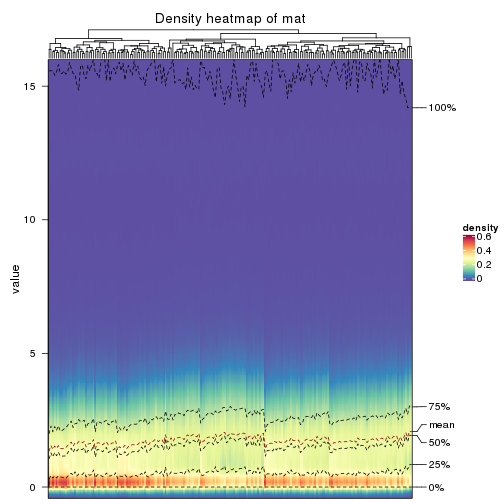


### Suggest the best k


Folowing table shows the best `k` (number of partitions) for each combination
of top-value methods and partition methods. Clicking on the method name in
the table goes to the section for a single combination of methods.

[The cola vignette](http://bioconductor.org/packages/devel/bioc/vignettes/cola/inst/doc/cola.html#toc_13)
explains the definition of the metrics used for determining the best
number of partitions.


```r
suggest_best_k(res_list)
```


|                            | The best k| 1-PAC| Mean silhouette| Concordance|   |Optional k |
|:---------------------------|----------:|-----:|---------------:|-----------:|:--|:----------|
|[ATC:kmeans](#ATC-kmeans)   |          4| 1.000|           0.955|       0.982|** |2,3        |
|[ATC:skmeans](#ATC-skmeans) |          3| 0.989|           0.943|       0.978|** |2          |
|[CV:kmeans](#CV-kmeans)     |          2| 0.927|           0.926|       0.969|*  |           |
|[ATC:pam](#ATC-pam)         |          5| 0.913|           0.884|       0.956|*  |2,3        |
|[SD:skmeans](#SD-skmeans)   |          2| 0.907|           0.939|       0.974|*  |           |
|[CV:NMF](#CV-NMF)           |          2| 0.905|           0.940|       0.974|*  |           |
|[MAD:skmeans](#MAD-skmeans) |          2| 0.897|           0.938|       0.974|   |           |
|[SD:kmeans](#SD-kmeans)     |          2| 0.896|           0.922|       0.968|   |           |
|[SD:pam](#SD-pam)           |          3| 0.889|           0.902|       0.962|   |           |
|[CV:skmeans](#CV-skmeans)   |          2| 0.877|           0.929|       0.969|   |           |
|[SD:mclust](#SD-mclust)     |          2| 0.876|           0.917|       0.966|   |           |
|[MAD:pam](#MAD-pam)         |          3| 0.868|           0.892|       0.957|   |           |
|[MAD:mclust](#MAD-mclust)   |          2| 0.847|           0.908|       0.963|   |           |
|[MAD:kmeans](#MAD-kmeans)   |          2| 0.837|           0.917|       0.963|   |           |
|[SD:NMF](#SD-NMF)           |          2| 0.828|           0.899|       0.958|   |           |
|[MAD:NMF](#MAD-NMF)         |          2| 0.803|           0.904|       0.958|   |           |
|[CV:pam](#CV-pam)           |          2| 0.797|           0.886|       0.950|   |           |
|[ATC:mclust](#ATC-mclust)   |          6| 0.701|           0.806|       0.876|   |           |
|[ATC:NMF](#ATC-NMF)         |          2| 0.584|           0.842|       0.926|   |           |
|[CV:mclust](#CV-mclust)     |          2| 0.576|           0.766|       0.899|   |           |
|[ATC:hclust](#ATC-hclust)   |          3| 0.506|           0.748|       0.867|   |           |
|[CV:hclust](#CV-hclust)     |          3| 0.391|           0.674|       0.849|   |           |
|[MAD:hclust](#MAD-hclust)   |          2| 0.226|           0.683|       0.824|   |           |
|[SD:hclust](#SD-hclust)     |          2| 0.226|           0.704|       0.842|   |           |

\*\*: 1-PAC > 0.95, \*: 1-PAC > 0.9


### CDF of consensus matrices

Cumulative distribution function curves of consensus matrix for all methods.


```r
collect_plots(res_list, fun = plot_ecdf)
```

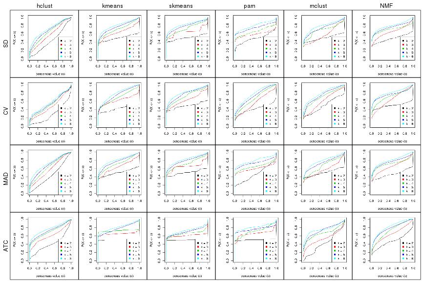


### Consensus heatmap

Consensus heatmaps for all methods. ([What is a consensus heatmap?](http://bioconductor.org/packages/devel/bioc/vignettes/cola/inst/doc/cola.html#toc_9))


<style type='text/css'>


.ui-helper-hidden {
	display: none;
}
.ui-helper-hidden-accessible {
	border: 0;
	clip: rect(0 0 0 0);
	height: 1px;
	margin: -1px;
	overflow: hidden;
	padding: 0;
	position: absolute;
	width: 1px;
}
.ui-helper-reset {
	margin: 0;
	padding: 0;
	border: 0;
	outline: 0;
	line-height: 1.3;
	text-decoration: none;
	font-size: 100%;
	list-style: none;
}
.ui-helper-clearfix:before,
.ui-helper-clearfix:after {
	content: "";
	display: table;
	border-collapse: collapse;
}
.ui-helper-clearfix:after {
	clear: both;
}
.ui-helper-zfix {
	width: 100%;
	height: 100%;
	top: 0;
	left: 0;
	position: absolute;
	opacity: 0;
	filter:Alpha(Opacity=0); 
}

.ui-front {
	z-index: 100;
}


.ui-state-disabled {
	cursor: default !important;
	pointer-events: none;
}


.ui-icon {
	display: inline-block;
	vertical-align: middle;
	margin-top: -.25em;
	position: relative;
	text-indent: -99999px;
	overflow: hidden;
	background-repeat: no-repeat;
}

.ui-widget-icon-block {
	left: 50%;
	margin-left: -8px;
	display: block;
}


.ui-widget-overlay {
	position: fixed;
	top: 0;
	left: 0;
	width: 100%;
	height: 100%;
}
.ui-accordion .ui-accordion-header {
	display: block;
	cursor: pointer;
	position: relative;
	margin: 2px 0 0 0;
	padding: .5em .5em .5em .7em;
	font-size: 100%;
}
.ui-accordion .ui-accordion-content {
	padding: 1em 2.2em;
	border-top: 0;
	overflow: auto;
}
.ui-autocomplete {
	position: absolute;
	top: 0;
	left: 0;
	cursor: default;
}
.ui-menu {
	list-style: none;
	padding: 0;
	margin: 0;
	display: block;
	outline: 0;
}
.ui-menu .ui-menu {
	position: absolute;
}
.ui-menu .ui-menu-item {
	margin: 0;
	cursor: pointer;
	
	list-style-image: url("data:image/gif;base64,R0lGODlhAQABAIAAAAAAAP///yH5BAEAAAAALAAAAAABAAEAAAIBRAA7");
}
.ui-menu .ui-menu-item-wrapper {
	position: relative;
	padding: 3px 1em 3px .4em;
}
.ui-menu .ui-menu-divider {
	margin: 5px 0;
	height: 0;
	font-size: 0;
	line-height: 0;
	border-width: 1px 0 0 0;
}
.ui-menu .ui-state-focus,
.ui-menu .ui-state-active {
	margin: -1px;
}


.ui-menu-icons {
	position: relative;
}
.ui-menu-icons .ui-menu-item-wrapper {
	padding-left: 2em;
}


.ui-menu .ui-icon {
	position: absolute;
	top: 0;
	bottom: 0;
	left: .2em;
	margin: auto 0;
}


.ui-menu .ui-menu-icon {
	left: auto;
	right: 0;
}
.ui-button {
	padding: .4em 1em;
	display: inline-block;
	position: relative;
	line-height: normal;
	margin-right: .1em;
	cursor: pointer;
	vertical-align: middle;
	text-align: center;
	-webkit-user-select: none;
	-moz-user-select: none;
	-ms-user-select: none;
	user-select: none;

	
	overflow: visible;
}

.ui-button,
.ui-button:link,
.ui-button:visited,
.ui-button:hover,
.ui-button:active {
	text-decoration: none;
}


.ui-button-icon-only {
	width: 2em;
	box-sizing: border-box;
	text-indent: -9999px;
	white-space: nowrap;
}


input.ui-button.ui-button-icon-only {
	text-indent: 0;
}


.ui-button-icon-only .ui-icon {
	position: absolute;
	top: 50%;
	left: 50%;
	margin-top: -8px;
	margin-left: -8px;
}

.ui-button.ui-icon-notext .ui-icon {
	padding: 0;
	width: 2.1em;
	height: 2.1em;
	text-indent: -9999px;
	white-space: nowrap;

}

input.ui-button.ui-icon-notext .ui-icon {
	width: auto;
	height: auto;
	text-indent: 0;
	white-space: normal;
	padding: .4em 1em;
}


input.ui-button::-moz-focus-inner,
button.ui-button::-moz-focus-inner {
	border: 0;
	padding: 0;
}
.ui-controlgroup {
	vertical-align: middle;
	display: inline-block;
}
.ui-controlgroup > .ui-controlgroup-item {
	float: left;
	margin-left: 0;
	margin-right: 0;
}
.ui-controlgroup > .ui-controlgroup-item:focus,
.ui-controlgroup > .ui-controlgroup-item.ui-visual-focus {
	z-index: 9999;
}
.ui-controlgroup-vertical > .ui-controlgroup-item {
	display: block;
	float: none;
	width: 100%;
	margin-top: 0;
	margin-bottom: 0;
	text-align: left;
}
.ui-controlgroup-vertical .ui-controlgroup-item {
	box-sizing: border-box;
}
.ui-controlgroup .ui-controlgroup-label {
	padding: .4em 1em;
}
.ui-controlgroup .ui-controlgroup-label span {
	font-size: 80%;
}
.ui-controlgroup-horizontal .ui-controlgroup-label + .ui-controlgroup-item {
	border-left: none;
}
.ui-controlgroup-vertical .ui-controlgroup-label + .ui-controlgroup-item {
	border-top: none;
}
.ui-controlgroup-horizontal .ui-controlgroup-label.ui-widget-content {
	border-right: none;
}
.ui-controlgroup-vertical .ui-controlgroup-label.ui-widget-content {
	border-bottom: none;
}


.ui-controlgroup-vertical .ui-spinner-input {

	
	width: 75%;
	width: calc( 100% - 2.4em );
}
.ui-controlgroup-vertical .ui-spinner .ui-spinner-up {
	border-top-style: solid;
}

.ui-checkboxradio-label .ui-icon-background {
	box-shadow: inset 1px 1px 1px #ccc;
	border-radius: .12em;
	border: none;
}
.ui-checkboxradio-radio-label .ui-icon-background {
	width: 16px;
	height: 16px;
	border-radius: 1em;
	overflow: visible;
	border: none;
}
.ui-checkboxradio-radio-label.ui-checkboxradio-checked .ui-icon,
.ui-checkboxradio-radio-label.ui-checkboxradio-checked:hover .ui-icon {
	background-image: none;
	width: 8px;
	height: 8px;
	border-width: 4px;
	border-style: solid;
}
.ui-checkboxradio-disabled {
	pointer-events: none;
}
.ui-datepicker {
	width: 17em;
	padding: .2em .2em 0;
	display: none;
}
.ui-datepicker .ui-datepicker-header {
	position: relative;
	padding: .2em 0;
}
.ui-datepicker .ui-datepicker-prev,
.ui-datepicker .ui-datepicker-next {
	position: absolute;
	top: 2px;
	width: 1.8em;
	height: 1.8em;
}
.ui-datepicker .ui-datepicker-prev-hover,
.ui-datepicker .ui-datepicker-next-hover {
	top: 1px;
}
.ui-datepicker .ui-datepicker-prev {
	left: 2px;
}
.ui-datepicker .ui-datepicker-next {
	right: 2px;
}
.ui-datepicker .ui-datepicker-prev-hover {
	left: 1px;
}
.ui-datepicker .ui-datepicker-next-hover {
	right: 1px;
}
.ui-datepicker .ui-datepicker-prev span,
.ui-datepicker .ui-datepicker-next span {
	display: block;
	position: absolute;
	left: 50%;
	margin-left: -8px;
	top: 50%;
	margin-top: -8px;
}
.ui-datepicker .ui-datepicker-title {
	margin: 0 2.3em;
	line-height: 1.8em;
	text-align: center;
}
.ui-datepicker .ui-datepicker-title select {
	font-size: 1em;
	margin: 1px 0;
}
.ui-datepicker select.ui-datepicker-month,
.ui-datepicker select.ui-datepicker-year {
	width: 45%;
}
.ui-datepicker table {
	width: 100%;
	font-size: .9em;
	border-collapse: collapse;
	margin: 0 0 .4em;
}
.ui-datepicker th {
	padding: .7em .3em;
	text-align: center;
	font-weight: bold;
	border: 0;
}
.ui-datepicker td {
	border: 0;
	padding: 1px;
}
.ui-datepicker td span,
.ui-datepicker td a {
	display: block;
	padding: .2em;
	text-align: right;
	text-decoration: none;
}
.ui-datepicker .ui-datepicker-buttonpane {
	background-image: none;
	margin: .7em 0 0 0;
	padding: 0 .2em;
	border-left: 0;
	border-right: 0;
	border-bottom: 0;
}
.ui-datepicker .ui-datepicker-buttonpane button {
	float: right;
	margin: .5em .2em .4em;
	cursor: pointer;
	padding: .2em .6em .3em .6em;
	width: auto;
	overflow: visible;
}
.ui-datepicker .ui-datepicker-buttonpane button.ui-datepicker-current {
	float: left;
}


.ui-datepicker.ui-datepicker-multi {
	width: auto;
}
.ui-datepicker-multi .ui-datepicker-group {
	float: left;
}
.ui-datepicker-multi .ui-datepicker-group table {
	width: 95%;
	margin: 0 auto .4em;
}
.ui-datepicker-multi-2 .ui-datepicker-group {
	width: 50%;
}
.ui-datepicker-multi-3 .ui-datepicker-group {
	width: 33.3%;
}
.ui-datepicker-multi-4 .ui-datepicker-group {
	width: 25%;
}
.ui-datepicker-multi .ui-datepicker-group-last .ui-datepicker-header,
.ui-datepicker-multi .ui-datepicker-group-middle .ui-datepicker-header {
	border-left-width: 0;
}
.ui-datepicker-multi .ui-datepicker-buttonpane {
	clear: left;
}
.ui-datepicker-row-break {
	clear: both;
	width: 100%;
	font-size: 0;
}


.ui-datepicker-rtl {
	direction: rtl;
}
.ui-datepicker-rtl .ui-datepicker-prev {
	right: 2px;
	left: auto;
}
.ui-datepicker-rtl .ui-datepicker-next {
	left: 2px;
	right: auto;
}
.ui-datepicker-rtl .ui-datepicker-prev:hover {
	right: 1px;
	left: auto;
}
.ui-datepicker-rtl .ui-datepicker-next:hover {
	left: 1px;
	right: auto;
}
.ui-datepicker-rtl .ui-datepicker-buttonpane {
	clear: right;
}
.ui-datepicker-rtl .ui-datepicker-buttonpane button {
	float: left;
}
.ui-datepicker-rtl .ui-datepicker-buttonpane button.ui-datepicker-current,
.ui-datepicker-rtl .ui-datepicker-group {
	float: right;
}
.ui-datepicker-rtl .ui-datepicker-group-last .ui-datepicker-header,
.ui-datepicker-rtl .ui-datepicker-group-middle .ui-datepicker-header {
	border-right-width: 0;
	border-left-width: 1px;
}


.ui-datepicker .ui-icon {
	display: block;
	text-indent: -99999px;
	overflow: hidden;
	background-repeat: no-repeat;
	left: .5em;
	top: .3em;
}
.ui-dialog {
	position: absolute;
	top: 0;
	left: 0;
	padding: .2em;
	outline: 0;
}
.ui-dialog .ui-dialog-titlebar {
	padding: .4em 1em;
	position: relative;
}
.ui-dialog .ui-dialog-title {
	float: left;
	margin: .1em 0;
	white-space: nowrap;
	width: 90%;
	overflow: hidden;
	text-overflow: ellipsis;
}
.ui-dialog .ui-dialog-titlebar-close {
	position: absolute;
	right: .3em;
	top: 50%;
	width: 20px;
	margin: -10px 0 0 0;
	padding: 1px;
	height: 20px;
}
.ui-dialog .ui-dialog-content {
	position: relative;
	border: 0;
	padding: .5em 1em;
	background: none;
	overflow: auto;
}
.ui-dialog .ui-dialog-buttonpane {
	text-align: left;
	border-width: 1px 0 0 0;
	background-image: none;
	margin-top: .5em;
	padding: .3em 1em .5em .4em;
}
.ui-dialog .ui-dialog-buttonpane .ui-dialog-buttonset {
	float: right;
}
.ui-dialog .ui-dialog-buttonpane button {
	margin: .5em .4em .5em 0;
	cursor: pointer;
}
.ui-dialog .ui-resizable-n {
	height: 2px;
	top: 0;
}
.ui-dialog .ui-resizable-e {
	width: 2px;
	right: 0;
}
.ui-dialog .ui-resizable-s {
	height: 2px;
	bottom: 0;
}
.ui-dialog .ui-resizable-w {
	width: 2px;
	left: 0;
}
.ui-dialog .ui-resizable-se,
.ui-dialog .ui-resizable-sw,
.ui-dialog .ui-resizable-ne,
.ui-dialog .ui-resizable-nw {
	width: 7px;
	height: 7px;
}
.ui-dialog .ui-resizable-se {
	right: 0;
	bottom: 0;
}
.ui-dialog .ui-resizable-sw {
	left: 0;
	bottom: 0;
}
.ui-dialog .ui-resizable-ne {
	right: 0;
	top: 0;
}
.ui-dialog .ui-resizable-nw {
	left: 0;
	top: 0;
}
.ui-draggable .ui-dialog-titlebar {
	cursor: move;
}
.ui-draggable-handle {
	-ms-touch-action: none;
	touch-action: none;
}
.ui-resizable {
	position: relative;
}
.ui-resizable-handle {
	position: absolute;
	font-size: 0.1px;
	display: block;
	-ms-touch-action: none;
	touch-action: none;
}
.ui-resizable-disabled .ui-resizable-handle,
.ui-resizable-autohide .ui-resizable-handle {
	display: none;
}
.ui-resizable-n {
	cursor: n-resize;
	height: 7px;
	width: 100%;
	top: -5px;
	left: 0;
}
.ui-resizable-s {
	cursor: s-resize;
	height: 7px;
	width: 100%;
	bottom: -5px;
	left: 0;
}
.ui-resizable-e {
	cursor: e-resize;
	width: 7px;
	right: -5px;
	top: 0;
	height: 100%;
}
.ui-resizable-w {
	cursor: w-resize;
	width: 7px;
	left: -5px;
	top: 0;
	height: 100%;
}
.ui-resizable-se {
	cursor: se-resize;
	width: 12px;
	height: 12px;
	right: 1px;
	bottom: 1px;
}
.ui-resizable-sw {
	cursor: sw-resize;
	width: 9px;
	height: 9px;
	left: -5px;
	bottom: -5px;
}
.ui-resizable-nw {
	cursor: nw-resize;
	width: 9px;
	height: 9px;
	left: -5px;
	top: -5px;
}
.ui-resizable-ne {
	cursor: ne-resize;
	width: 9px;
	height: 9px;
	right: -5px;
	top: -5px;
}
.ui-progressbar {
	height: 2em;
	text-align: left;
	overflow: hidden;
}
.ui-progressbar .ui-progressbar-value {
	margin: -1px;
	height: 100%;
}
.ui-progressbar .ui-progressbar-overlay {
	background: url("");
	height: 100%;
	filter: alpha(opacity=25); 
	opacity: 0.25;
}
.ui-progressbar-indeterminate .ui-progressbar-value {
	background-image: none;
}
.ui-selectable {
	-ms-touch-action: none;
	touch-action: none;
}
.ui-selectable-helper {
	position: absolute;
	z-index: 100;
	border: 1px dotted black;
}
.ui-selectmenu-menu {
	padding: 0;
	margin: 0;
	position: absolute;
	top: 0;
	left: 0;
	display: none;
}
.ui-selectmenu-menu .ui-menu {
	overflow: auto;
	overflow-x: hidden;
	padding-bottom: 1px;
}
.ui-selectmenu-menu .ui-menu .ui-selectmenu-optgroup {
	font-size: 1em;
	font-weight: bold;
	line-height: 1.5;
	padding: 2px 0.4em;
	margin: 0.5em 0 0 0;
	height: auto;
	border: 0;
}
.ui-selectmenu-open {
	display: block;
}
.ui-selectmenu-text {
	display: block;
	margin-right: 20px;
	overflow: hidden;
	text-overflow: ellipsis;
}
.ui-selectmenu-button.ui-button {
	text-align: left;
	white-space: nowrap;
	width: 14em;
}
.ui-selectmenu-icon.ui-icon {
	float: right;
	margin-top: 0;
}
.ui-slider {
	position: relative;
	text-align: left;
}
.ui-slider .ui-slider-handle {
	position: absolute;
	z-index: 2;
	width: 1.2em;
	height: 1.2em;
	cursor: default;
	-ms-touch-action: none;
	touch-action: none;
}
.ui-slider .ui-slider-range {
	position: absolute;
	z-index: 1;
	font-size: .7em;
	display: block;
	border: 0;
	background-position: 0 0;
}


.ui-slider.ui-state-disabled .ui-slider-handle,
.ui-slider.ui-state-disabled .ui-slider-range {
	filter: inherit;
}

.ui-slider-horizontal {
	height: .8em;
}
.ui-slider-horizontal .ui-slider-handle {
	top: -.3em;
	margin-left: -.6em;
}
.ui-slider-horizontal .ui-slider-range {
	top: 0;
	height: 100%;
}
.ui-slider-horizontal .ui-slider-range-min {
	left: 0;
}
.ui-slider-horizontal .ui-slider-range-max {
	right: 0;
}

.ui-slider-vertical {
	width: .8em;
	height: 100px;
}
.ui-slider-vertical .ui-slider-handle {
	left: -.3em;
	margin-left: 0;
	margin-bottom: -.6em;
}
.ui-slider-vertical .ui-slider-range {
	left: 0;
	width: 100%;
}
.ui-slider-vertical .ui-slider-range-min {
	bottom: 0;
}
.ui-slider-vertical .ui-slider-range-max {
	top: 0;
}
.ui-sortable-handle {
	-ms-touch-action: none;
	touch-action: none;
}
.ui-spinner {
	position: relative;
	display: inline-block;
	overflow: hidden;
	padding: 0;
	vertical-align: middle;
}
.ui-spinner-input {
	border: none;
	background: none;
	color: inherit;
	padding: .222em 0;
	margin: .2em 0;
	vertical-align: middle;
	margin-left: .4em;
	margin-right: 2em;
}
.ui-spinner-button {
	width: 1.6em;
	height: 50%;
	font-size: .5em;
	padding: 0;
	margin: 0;
	text-align: center;
	position: absolute;
	cursor: default;
	display: block;
	overflow: hidden;
	right: 0;
}

.ui-spinner a.ui-spinner-button {
	border-top-style: none;
	border-bottom-style: none;
	border-right-style: none;
}
.ui-spinner-up {
	top: 0;
}
.ui-spinner-down {
	bottom: 0;
}
.ui-tabs {
	position: relative;
	padding: .2em;
}
.ui-tabs .ui-tabs-nav {
	margin: 0;
	padding: .2em .2em 0;
}
.ui-tabs .ui-tabs-nav li {
	list-style: none;
	float: left;
	position: relative;
	top: 0;
	margin: 1px .2em 0 0;
	border-bottom-width: 0;
	padding: 0;
	white-space: nowrap;
}
.ui-tabs .ui-tabs-nav .ui-tabs-anchor {
	float: left;
	padding: .5em 1em;
	text-decoration: none;
}
.ui-tabs .ui-tabs-nav li.ui-tabs-active {
	margin-bottom: -1px;
	padding-bottom: 1px;
}
.ui-tabs .ui-tabs-nav li.ui-tabs-active .ui-tabs-anchor,
.ui-tabs .ui-tabs-nav li.ui-state-disabled .ui-tabs-anchor,
.ui-tabs .ui-tabs-nav li.ui-tabs-loading .ui-tabs-anchor {
	cursor: text;
}
.ui-tabs-collapsible .ui-tabs-nav li.ui-tabs-active .ui-tabs-anchor {
	cursor: pointer;
}
.ui-tabs .ui-tabs-panel {
	display: block;
	border-width: 0;
	padding: 1em 1.4em;
	background: none;
}
.ui-tooltip {
	padding: 8px;
	position: absolute;
	z-index: 9999;
	max-width: 300px;
}
body .ui-tooltip {
	border-width: 2px;
}

.ui-widget {
	font-family: Arial,Helvetica,sans-serif;
	font-size: 1em;
}
.ui-widget .ui-widget {
	font-size: 1em;
}
.ui-widget input,
.ui-widget select,
.ui-widget textarea,
.ui-widget button {
	font-family: Arial,Helvetica,sans-serif;
	font-size: 1em;
}
.ui-widget.ui-widget-content {
	border: 1px solid #c5c5c5;
}
.ui-widget-content {
	border: 1px solid #dddddd;
	background: #ffffff;
	color: #333333;
}
.ui-widget-content a {
	color: #333333;
}
.ui-widget-header {
	border: 1px solid #dddddd;
	background: #e9e9e9;
	color: #333333;
	font-weight: bold;
}
.ui-widget-header a {
	color: #333333;
}


.ui-state-default,
.ui-widget-content .ui-state-default,
.ui-widget-header .ui-state-default,
.ui-button,


html .ui-button.ui-state-disabled:hover,
html .ui-button.ui-state-disabled:active {
	border: 1px solid #c5c5c5;
	background: #f6f6f6;
	font-weight: normal;
	color: #454545;
}
.ui-state-default a,
.ui-state-default a:link,
.ui-state-default a:visited,
a.ui-button,
a:link.ui-button,
a:visited.ui-button,
.ui-button {
	color: #454545;
	text-decoration: none;
}
.ui-state-hover,
.ui-widget-content .ui-state-hover,
.ui-widget-header .ui-state-hover,
.ui-state-focus,
.ui-widget-content .ui-state-focus,
.ui-widget-header .ui-state-focus,
.ui-button:hover,
.ui-button:focus {
	border: 1px solid #cccccc;
	background: #ededed;
	font-weight: normal;
	color: #2b2b2b;
}
.ui-state-hover a,
.ui-state-hover a:hover,
.ui-state-hover a:link,
.ui-state-hover a:visited,
.ui-state-focus a,
.ui-state-focus a:hover,
.ui-state-focus a:link,
.ui-state-focus a:visited,
a.ui-button:hover,
a.ui-button:focus {
	color: #2b2b2b;
	text-decoration: none;
}

.ui-visual-focus {
	box-shadow: 0 0 3px 1px rgb(94, 158, 214);
}
.ui-state-active,
.ui-widget-content .ui-state-active,
.ui-widget-header .ui-state-active,
a.ui-button:active,
.ui-button:active,
.ui-button.ui-state-active:hover {
	border: 1px solid #003eff;
	background: #007fff;
	font-weight: normal;
	color: #ffffff;
}
.ui-icon-background,
.ui-state-active .ui-icon-background {
	border: #003eff;
	background-color: #ffffff;
}
.ui-state-active a,
.ui-state-active a:link,
.ui-state-active a:visited {
	color: #ffffff;
	text-decoration: none;
}


.ui-state-highlight,
.ui-widget-content .ui-state-highlight,
.ui-widget-header .ui-state-highlight {
	border: 1px solid #dad55e;
	background: #fffa90;
	color: #777620;
}
.ui-state-checked {
	border: 1px solid #dad55e;
	background: #fffa90;
}
.ui-state-highlight a,
.ui-widget-content .ui-state-highlight a,
.ui-widget-header .ui-state-highlight a {
	color: #777620;
}
.ui-state-error,
.ui-widget-content .ui-state-error,
.ui-widget-header .ui-state-error {
	border: 1px solid #f1a899;
	background: #fddfdf;
	color: #5f3f3f;
}
.ui-state-error a,
.ui-widget-content .ui-state-error a,
.ui-widget-header .ui-state-error a {
	color: #5f3f3f;
}
.ui-state-error-text,
.ui-widget-content .ui-state-error-text,
.ui-widget-header .ui-state-error-text {
	color: #5f3f3f;
}
.ui-priority-primary,
.ui-widget-content .ui-priority-primary,
.ui-widget-header .ui-priority-primary {
	font-weight: bold;
}
.ui-priority-secondary,
.ui-widget-content .ui-priority-secondary,
.ui-widget-header .ui-priority-secondary {
	opacity: .7;
	filter:Alpha(Opacity=70); 
	font-weight: normal;
}
.ui-state-disabled,
.ui-widget-content .ui-state-disabled,
.ui-widget-header .ui-state-disabled {
	opacity: .35;
	filter:Alpha(Opacity=35); 
	background-image: none;
}
.ui-state-disabled .ui-icon {
	filter:Alpha(Opacity=35); 
}


.ui-icon {
	width: 16px;
	height: 16px;
}
.ui-icon,
.ui-widget-content .ui-icon {
	background-image: url("images/ui-icons_444444_256x240.png");
}
.ui-widget-header .ui-icon {
	background-image: url("images/ui-icons_444444_256x240.png");
}
.ui-state-hover .ui-icon,
.ui-state-focus .ui-icon,
.ui-button:hover .ui-icon,
.ui-button:focus .ui-icon {
	background-image: url("images/ui-icons_555555_256x240.png");
}
.ui-state-active .ui-icon,
.ui-button:active .ui-icon {
	background-image: url("images/ui-icons_ffffff_256x240.png");
}
.ui-state-highlight .ui-icon,
.ui-button .ui-state-highlight.ui-icon {
	background-image: url("images/ui-icons_777620_256x240.png");
}
.ui-state-error .ui-icon,
.ui-state-error-text .ui-icon {
	background-image: url("images/ui-icons_cc0000_256x240.png");
}
.ui-button .ui-icon {
	background-image: url("images/ui-icons_777777_256x240.png");
}


.ui-icon-blank { background-position: 16px 16px; }
.ui-icon-caret-1-n { background-position: 0 0; }
.ui-icon-caret-1-ne { background-position: -16px 0; }
.ui-icon-caret-1-e { background-position: -32px 0; }
.ui-icon-caret-1-se { background-position: -48px 0; }
.ui-icon-caret-1-s { background-position: -65px 0; }
.ui-icon-caret-1-sw { background-position: -80px 0; }
.ui-icon-caret-1-w { background-position: -96px 0; }
.ui-icon-caret-1-nw { background-position: -112px 0; }
.ui-icon-caret-2-n-s { background-position: -128px 0; }
.ui-icon-caret-2-e-w { background-position: -144px 0; }
.ui-icon-triangle-1-n { background-position: 0 -16px; }
.ui-icon-triangle-1-ne { background-position: -16px -16px; }
.ui-icon-triangle-1-e { background-position: -32px -16px; }
.ui-icon-triangle-1-se { background-position: -48px -16px; }
.ui-icon-triangle-1-s { background-position: -65px -16px; }
.ui-icon-triangle-1-sw { background-position: -80px -16px; }
.ui-icon-triangle-1-w { background-position: -96px -16px; }
.ui-icon-triangle-1-nw { background-position: -112px -16px; }
.ui-icon-triangle-2-n-s { background-position: -128px -16px; }
.ui-icon-triangle-2-e-w { background-position: -144px -16px; }
.ui-icon-arrow-1-n { background-position: 0 -32px; }
.ui-icon-arrow-1-ne { background-position: -16px -32px; }
.ui-icon-arrow-1-e { background-position: -32px -32px; }
.ui-icon-arrow-1-se { background-position: -48px -32px; }
.ui-icon-arrow-1-s { background-position: -65px -32px; }
.ui-icon-arrow-1-sw { background-position: -80px -32px; }
.ui-icon-arrow-1-w { background-position: -96px -32px; }
.ui-icon-arrow-1-nw { background-position: -112px -32px; }
.ui-icon-arrow-2-n-s { background-position: -128px -32px; }
.ui-icon-arrow-2-ne-sw { background-position: -144px -32px; }
.ui-icon-arrow-2-e-w { background-position: -160px -32px; }
.ui-icon-arrow-2-se-nw { background-position: -176px -32px; }
.ui-icon-arrowstop-1-n { background-position: -192px -32px; }
.ui-icon-arrowstop-1-e { background-position: -208px -32px; }
.ui-icon-arrowstop-1-s { background-position: -224px -32px; }
.ui-icon-arrowstop-1-w { background-position: -240px -32px; }
.ui-icon-arrowthick-1-n { background-position: 1px -48px; }
.ui-icon-arrowthick-1-ne { background-position: -16px -48px; }
.ui-icon-arrowthick-1-e { background-position: -32px -48px; }
.ui-icon-arrowthick-1-se { background-position: -48px -48px; }
.ui-icon-arrowthick-1-s { background-position: -64px -48px; }
.ui-icon-arrowthick-1-sw { background-position: -80px -48px; }
.ui-icon-arrowthick-1-w { background-position: -96px -48px; }
.ui-icon-arrowthick-1-nw { background-position: -112px -48px; }
.ui-icon-arrowthick-2-n-s { background-position: -128px -48px; }
.ui-icon-arrowthick-2-ne-sw { background-position: -144px -48px; }
.ui-icon-arrowthick-2-e-w { background-position: -160px -48px; }
.ui-icon-arrowthick-2-se-nw { background-position: -176px -48px; }
.ui-icon-arrowthickstop-1-n { background-position: -192px -48px; }
.ui-icon-arrowthickstop-1-e { background-position: -208px -48px; }
.ui-icon-arrowthickstop-1-s { background-position: -224px -48px; }
.ui-icon-arrowthickstop-1-w { background-position: -240px -48px; }
.ui-icon-arrowreturnthick-1-w { background-position: 0 -64px; }
.ui-icon-arrowreturnthick-1-n { background-position: -16px -64px; }
.ui-icon-arrowreturnthick-1-e { background-position: -32px -64px; }
.ui-icon-arrowreturnthick-1-s { background-position: -48px -64px; }
.ui-icon-arrowreturn-1-w { background-position: -64px -64px; }
.ui-icon-arrowreturn-1-n { background-position: -80px -64px; }
.ui-icon-arrowreturn-1-e { background-position: -96px -64px; }
.ui-icon-arrowreturn-1-s { background-position: -112px -64px; }
.ui-icon-arrowrefresh-1-w { background-position: -128px -64px; }
.ui-icon-arrowrefresh-1-n { background-position: -144px -64px; }
.ui-icon-arrowrefresh-1-e { background-position: -160px -64px; }
.ui-icon-arrowrefresh-1-s { background-position: -176px -64px; }
.ui-icon-arrow-4 { background-position: 0 -80px; }
.ui-icon-arrow-4-diag { background-position: -16px -80px; }
.ui-icon-extlink { background-position: -32px -80px; }
.ui-icon-newwin { background-position: -48px -80px; }
.ui-icon-refresh { background-position: -64px -80px; }
.ui-icon-shuffle { background-position: -80px -80px; }
.ui-icon-transfer-e-w { background-position: -96px -80px; }
.ui-icon-transferthick-e-w { background-position: -112px -80px; }
.ui-icon-folder-collapsed { background-position: 0 -96px; }
.ui-icon-folder-open { background-position: -16px -96px; }
.ui-icon-document { background-position: -32px -96px; }
.ui-icon-document-b { background-position: -48px -96px; }
.ui-icon-note { background-position: -64px -96px; }
.ui-icon-mail-closed { background-position: -80px -96px; }
.ui-icon-mail-open { background-position: -96px -96px; }
.ui-icon-suitcase { background-position: -112px -96px; }
.ui-icon-comment { background-position: -128px -96px; }
.ui-icon-person { background-position: -144px -96px; }
.ui-icon-print { background-position: -160px -96px; }
.ui-icon-trash { background-position: -176px -96px; }
.ui-icon-locked { background-position: -192px -96px; }
.ui-icon-unlocked { background-position: -208px -96px; }
.ui-icon-bookmark { background-position: -224px -96px; }
.ui-icon-tag { background-position: -240px -96px; }
.ui-icon-home { background-position: 0 -112px; }
.ui-icon-flag { background-position: -16px -112px; }
.ui-icon-calendar { background-position: -32px -112px; }
.ui-icon-cart { background-position: -48px -112px; }
.ui-icon-pencil { background-position: -64px -112px; }
.ui-icon-clock { background-position: -80px -112px; }
.ui-icon-disk { background-position: -96px -112px; }
.ui-icon-calculator { background-position: -112px -112px; }
.ui-icon-zoomin { background-position: -128px -112px; }
.ui-icon-zoomout { background-position: -144px -112px; }
.ui-icon-search { background-position: -160px -112px; }
.ui-icon-wrench { background-position: -176px -112px; }
.ui-icon-gear { background-position: -192px -112px; }
.ui-icon-heart { background-position: -208px -112px; }
.ui-icon-star { background-position: -224px -112px; }
.ui-icon-link { background-position: -240px -112px; }
.ui-icon-cancel { background-position: 0 -128px; }
.ui-icon-plus { background-position: -16px -128px; }
.ui-icon-plusthick { background-position: -32px -128px; }
.ui-icon-minus { background-position: -48px -128px; }
.ui-icon-minusthick { background-position: -64px -128px; }
.ui-icon-close { background-position: -80px -128px; }
.ui-icon-closethick { background-position: -96px -128px; }
.ui-icon-key { background-position: -112px -128px; }
.ui-icon-lightbulb { background-position: -128px -128px; }
.ui-icon-scissors { background-position: -144px -128px; }
.ui-icon-clipboard { background-position: -160px -128px; }
.ui-icon-copy { background-position: -176px -128px; }
.ui-icon-contact { background-position: -192px -128px; }
.ui-icon-image { background-position: -208px -128px; }
.ui-icon-video { background-position: -224px -128px; }
.ui-icon-script { background-position: -240px -128px; }
.ui-icon-alert { background-position: 0 -144px; }
.ui-icon-info { background-position: -16px -144px; }
.ui-icon-notice { background-position: -32px -144px; }
.ui-icon-help { background-position: -48px -144px; }
.ui-icon-check { background-position: -64px -144px; }
.ui-icon-bullet { background-position: -80px -144px; }
.ui-icon-radio-on { background-position: -96px -144px; }
.ui-icon-radio-off { background-position: -112px -144px; }
.ui-icon-pin-w { background-position: -128px -144px; }
.ui-icon-pin-s { background-position: -144px -144px; }
.ui-icon-play { background-position: 0 -160px; }
.ui-icon-pause { background-position: -16px -160px; }
.ui-icon-seek-next { background-position: -32px -160px; }
.ui-icon-seek-prev { background-position: -48px -160px; }
.ui-icon-seek-end { background-position: -64px -160px; }
.ui-icon-seek-start { background-position: -80px -160px; }

.ui-icon-seek-first { background-position: -80px -160px; }
.ui-icon-stop { background-position: -96px -160px; }
.ui-icon-eject { background-position: -112px -160px; }
.ui-icon-volume-off { background-position: -128px -160px; }
.ui-icon-volume-on { background-position: -144px -160px; }
.ui-icon-power { background-position: 0 -176px; }
.ui-icon-signal-diag { background-position: -16px -176px; }
.ui-icon-signal { background-position: -32px -176px; }
.ui-icon-battery-0 { background-position: -48px -176px; }
.ui-icon-battery-1 { background-position: -64px -176px; }
.ui-icon-battery-2 { background-position: -80px -176px; }
.ui-icon-battery-3 { background-position: -96px -176px; }
.ui-icon-circle-plus { background-position: 0 -192px; }
.ui-icon-circle-minus { background-position: -16px -192px; }
.ui-icon-circle-close { background-position: -32px -192px; }
.ui-icon-circle-triangle-e { background-position: -48px -192px; }
.ui-icon-circle-triangle-s { background-position: -64px -192px; }
.ui-icon-circle-triangle-w { background-position: -80px -192px; }
.ui-icon-circle-triangle-n { background-position: -96px -192px; }
.ui-icon-circle-arrow-e { background-position: -112px -192px; }
.ui-icon-circle-arrow-s { background-position: -128px -192px; }
.ui-icon-circle-arrow-w { background-position: -144px -192px; }
.ui-icon-circle-arrow-n { background-position: -160px -192px; }
.ui-icon-circle-zoomin { background-position: -176px -192px; }
.ui-icon-circle-zoomout { background-position: -192px -192px; }
.ui-icon-circle-check { background-position: -208px -192px; }
.ui-icon-circlesmall-plus { background-position: 0 -208px; }
.ui-icon-circlesmall-minus { background-position: -16px -208px; }
.ui-icon-circlesmall-close { background-position: -32px -208px; }
.ui-icon-squaresmall-plus { background-position: -48px -208px; }
.ui-icon-squaresmall-minus { background-position: -64px -208px; }
.ui-icon-squaresmall-close { background-position: -80px -208px; }
.ui-icon-grip-dotted-vertical { background-position: 0 -224px; }
.ui-icon-grip-dotted-horizontal { background-position: -16px -224px; }
.ui-icon-grip-solid-vertical { background-position: -32px -224px; }
.ui-icon-grip-solid-horizontal { background-position: -48px -224px; }
.ui-icon-gripsmall-diagonal-se { background-position: -64px -224px; }
.ui-icon-grip-diagonal-se { background-position: -80px -224px; }


.ui-corner-all,
.ui-corner-top,
.ui-corner-left,
.ui-corner-tl {
	border-top-left-radius: 3px;
}
.ui-corner-all,
.ui-corner-top,
.ui-corner-right,
.ui-corner-tr {
	border-top-right-radius: 3px;
}
.ui-corner-all,
.ui-corner-bottom,
.ui-corner-left,
.ui-corner-bl {
	border-bottom-left-radius: 3px;
}
.ui-corner-all,
.ui-corner-bottom,
.ui-corner-right,
.ui-corner-br {
	border-bottom-right-radius: 3px;
}


.ui-widget-overlay {
	background: #aaaaaa;
	opacity: .3;
	filter: Alpha(Opacity=30); 
}
.ui-widget-shadow {
	-webkit-box-shadow: 0px 0px 5px #666666;
	box-shadow: 0px 0px 5px #666666;
} 
</style>
<script src='js/jquery-1.12.4.js'></script>
<script src='js/jquery-ui.js'></script>

<script>
$( function() {
	$( '#tabs-collect-consensus-heatmap' ).tabs();
} );
</script>
<div id='tabs-collect-consensus-heatmap'>
<ul>
<li><a href='#tab-collect-consensus-heatmap-1'>k = 2</a></li>
<li><a href='#tab-collect-consensus-heatmap-2'>k = 3</a></li>
<li><a href='#tab-collect-consensus-heatmap-3'>k = 4</a></li>
<li><a href='#tab-collect-consensus-heatmap-4'>k = 5</a></li>
<li><a href='#tab-collect-consensus-heatmap-5'>k = 6</a></li>
</ul>
<div id='tab-collect-consensus-heatmap-1'>
<pre><code class="r">collect_plots(res_list, k = 2, fun = consensus_heatmap, mc.cores = 4)
</code></pre>

<p>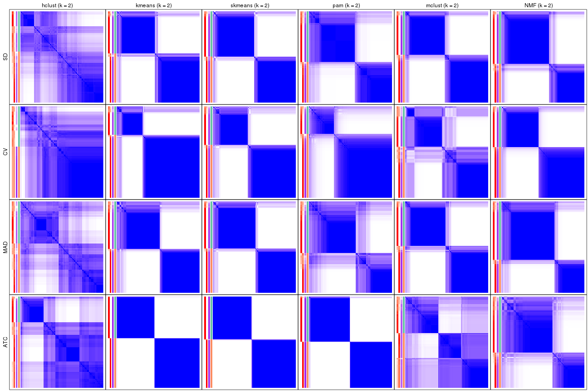</p>

</div>
<div id='tab-collect-consensus-heatmap-2'>
<pre><code class="r">collect_plots(res_list, k = 3, fun = consensus_heatmap, mc.cores = 4)
</code></pre>

<p>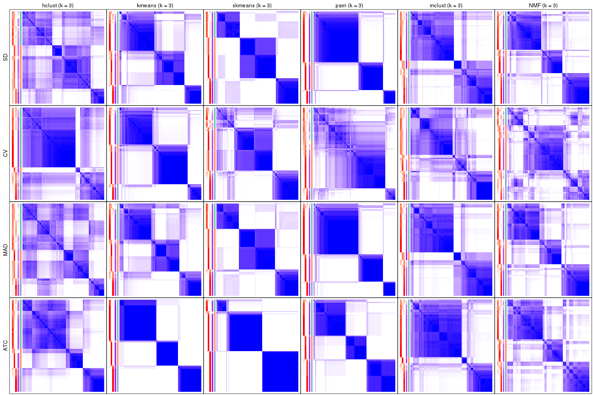</p>

</div>
<div id='tab-collect-consensus-heatmap-3'>
<pre><code class="r">collect_plots(res_list, k = 4, fun = consensus_heatmap, mc.cores = 4)
</code></pre>

<p>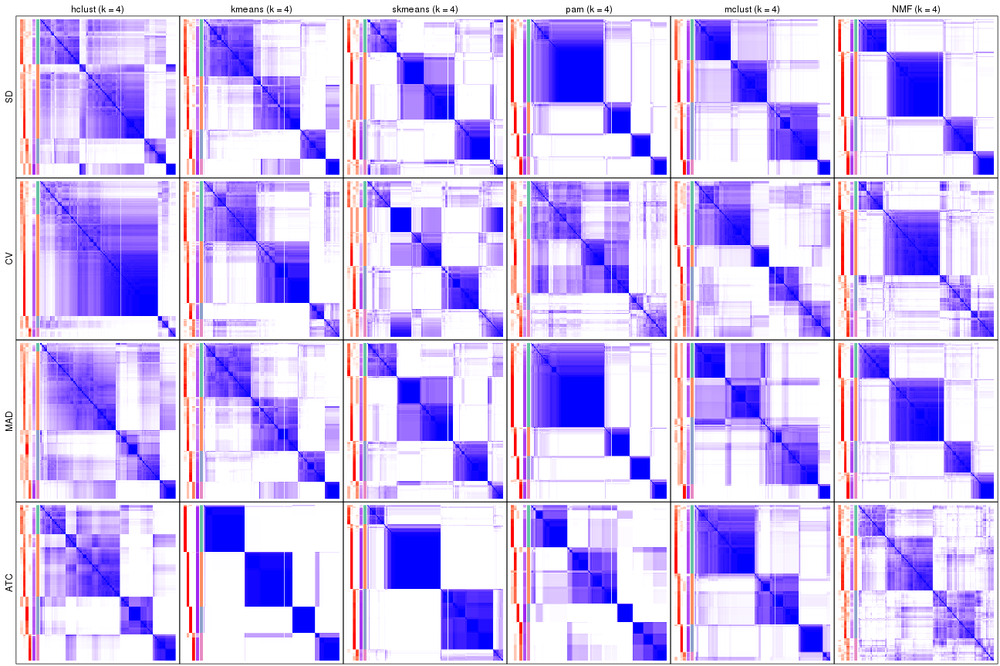</p>

</div>
<div id='tab-collect-consensus-heatmap-4'>
<pre><code class="r">collect_plots(res_list, k = 5, fun = consensus_heatmap, mc.cores = 4)
</code></pre>

<p>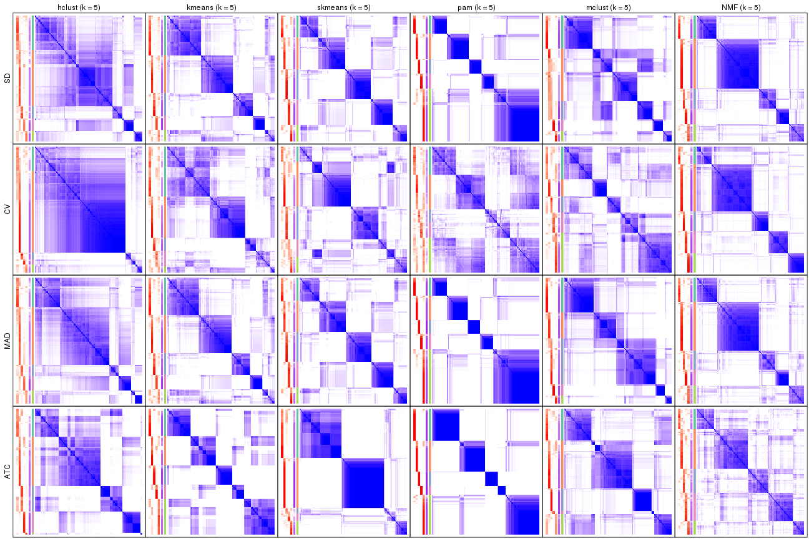</p>

</div>
<div id='tab-collect-consensus-heatmap-5'>
<pre><code class="r">collect_plots(res_list, k = 6, fun = consensus_heatmap, mc.cores = 4)
</code></pre>

<p>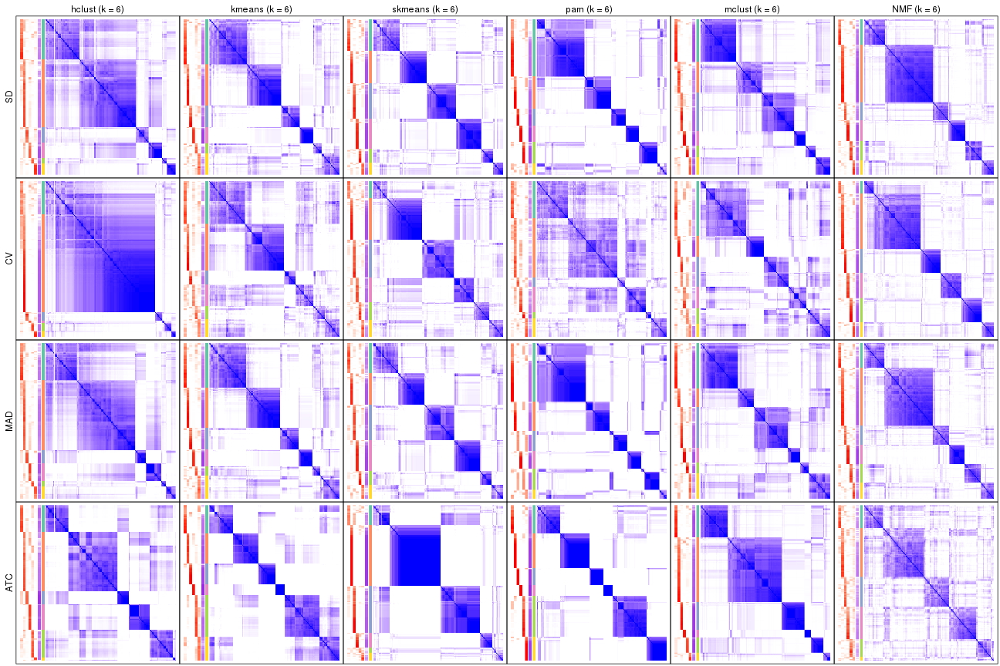</p>

</div>
</div>


### Membership heatmap

Membership heatmaps for all methods. ([What is a membership heatmap?](http://bioconductor.org/packages/devel/bioc/vignettes/cola/inst/doc/cola.html#toc_12))


<script>
$( function() {
	$( '#tabs-collect-membership-heatmap' ).tabs();
} );
</script>
<div id='tabs-collect-membership-heatmap'>
<ul>
<li><a href='#tab-collect-membership-heatmap-1'>k = 2</a></li>
<li><a href='#tab-collect-membership-heatmap-2'>k = 3</a></li>
<li><a href='#tab-collect-membership-heatmap-3'>k = 4</a></li>
<li><a href='#tab-collect-membership-heatmap-4'>k = 5</a></li>
<li><a href='#tab-collect-membership-heatmap-5'>k = 6</a></li>
</ul>
<div id='tab-collect-membership-heatmap-1'>
<pre><code class="r">collect_plots(res_list, k = 2, fun = membership_heatmap, mc.cores = 4)
</code></pre>

<p>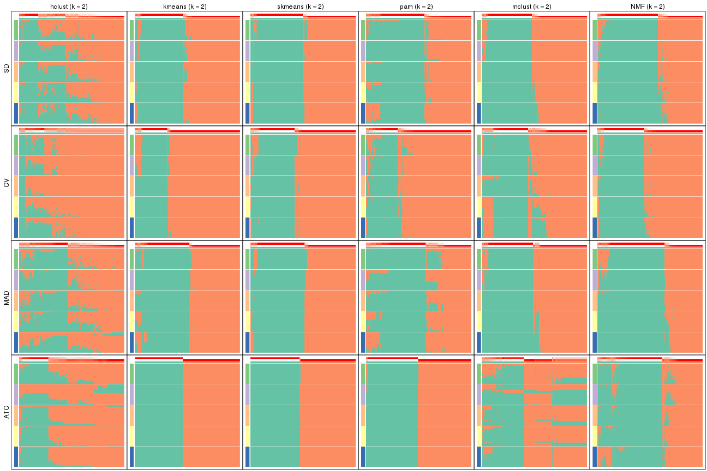</p>

</div>
<div id='tab-collect-membership-heatmap-2'>
<pre><code class="r">collect_plots(res_list, k = 3, fun = membership_heatmap, mc.cores = 4)
</code></pre>

<p>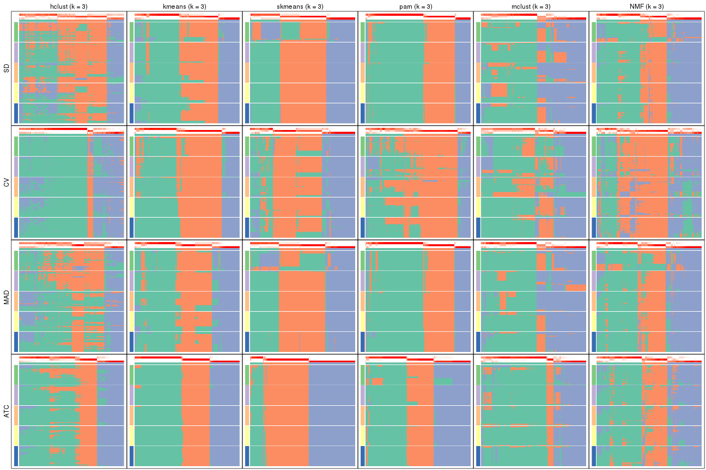</p>

</div>
<div id='tab-collect-membership-heatmap-3'>
<pre><code class="r">collect_plots(res_list, k = 4, fun = membership_heatmap, mc.cores = 4)
</code></pre>

<p>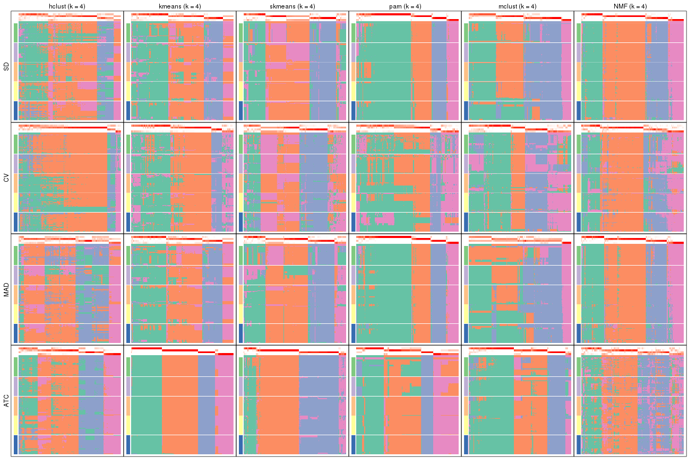</p>

</div>
<div id='tab-collect-membership-heatmap-4'>
<pre><code class="r">collect_plots(res_list, k = 5, fun = membership_heatmap, mc.cores = 4)
</code></pre>

<p>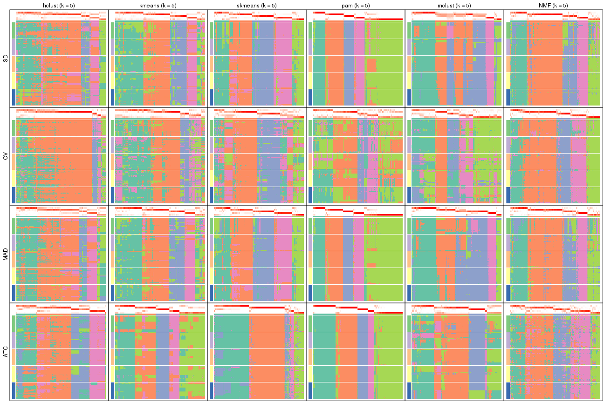</p>

</div>
<div id='tab-collect-membership-heatmap-5'>
<pre><code class="r">collect_plots(res_list, k = 6, fun = membership_heatmap, mc.cores = 4)
</code></pre>

<p>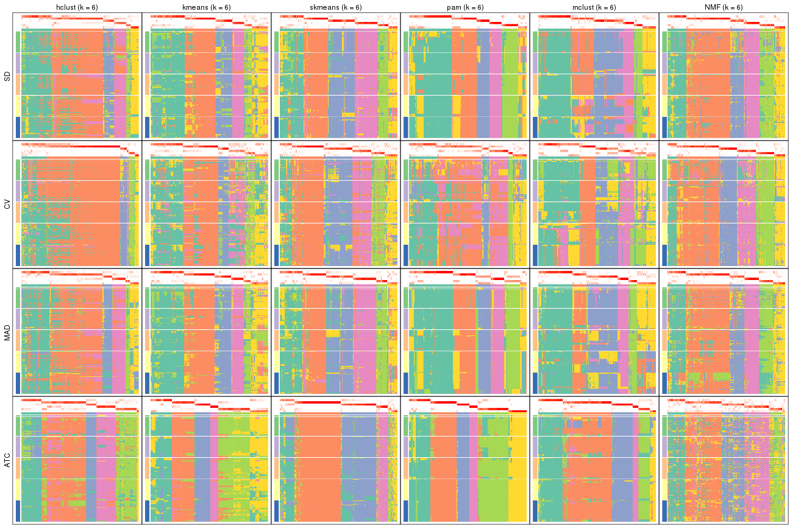</p>

</div>
</div>


### Signature heatmap

Signature heatmaps for all methods. ([What is a signature heatmap?](http://bioconductor.org/packages/devel/bioc/vignettes/cola/inst/doc/cola.html#toc_22))


Note in following heatmaps, rows are scaled.


<script>
$( function() {
	$( '#tabs-collect-get-signatures' ).tabs();
} );
</script>
<div id='tabs-collect-get-signatures'>
<ul>
<li><a href='#tab-collect-get-signatures-1'>k = 2</a></li>
<li><a href='#tab-collect-get-signatures-2'>k = 3</a></li>
<li><a href='#tab-collect-get-signatures-3'>k = 4</a></li>
<li><a href='#tab-collect-get-signatures-4'>k = 5</a></li>
<li><a href='#tab-collect-get-signatures-5'>k = 6</a></li>
</ul>
<div id='tab-collect-get-signatures-1'>
<pre><code class="r">collect_plots(res_list, k = 2, fun = get_signatures, mc.cores = 4)
</code></pre>

<p>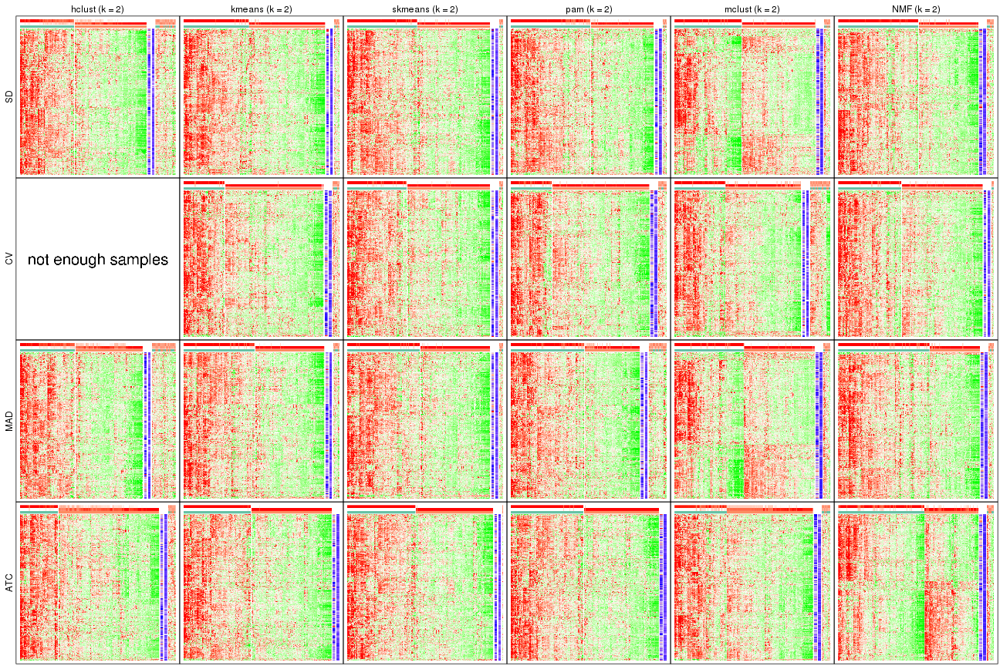</p>

</div>
<div id='tab-collect-get-signatures-2'>
<pre><code class="r">collect_plots(res_list, k = 3, fun = get_signatures, mc.cores = 4)
</code></pre>

<p>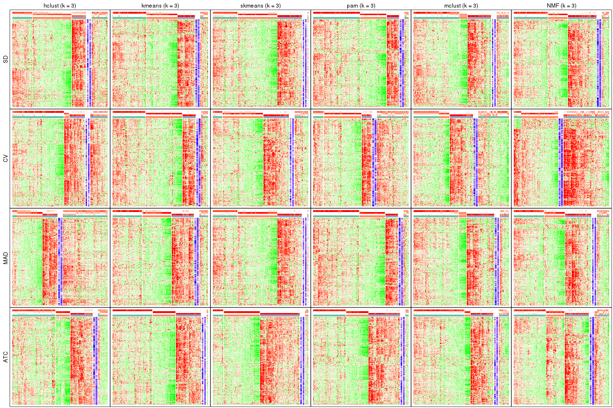</p>

</div>
<div id='tab-collect-get-signatures-3'>
<pre><code class="r">collect_plots(res_list, k = 4, fun = get_signatures, mc.cores = 4)
</code></pre>

<p>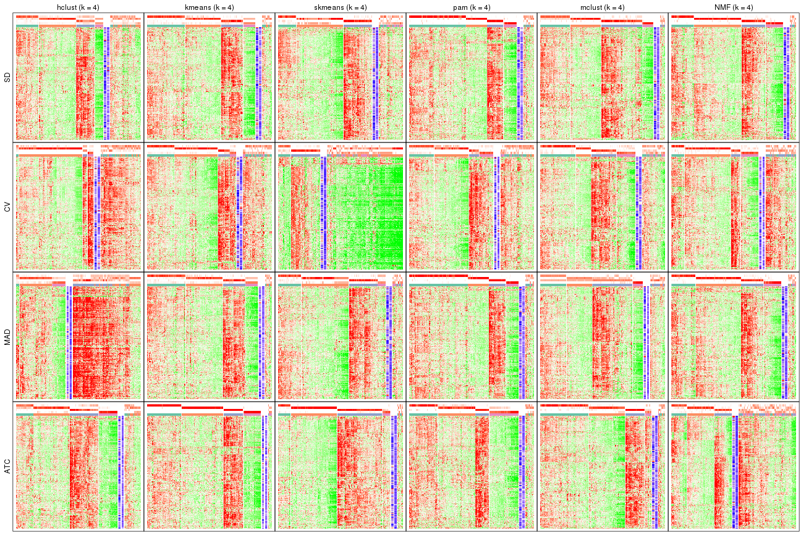</p>

</div>
<div id='tab-collect-get-signatures-4'>
<pre><code class="r">collect_plots(res_list, k = 5, fun = get_signatures, mc.cores = 4)
</code></pre>

<p>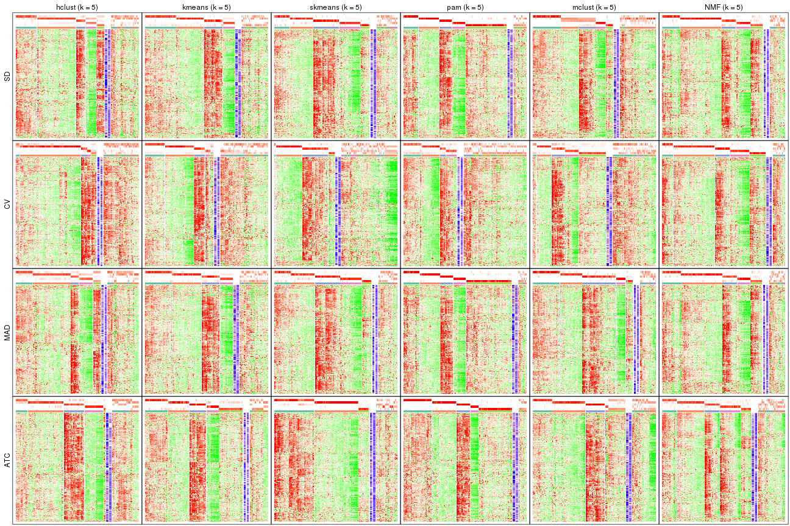</p>

</div>
<div id='tab-collect-get-signatures-5'>
<pre><code class="r">collect_plots(res_list, k = 6, fun = get_signatures, mc.cores = 4)
</code></pre>

<p>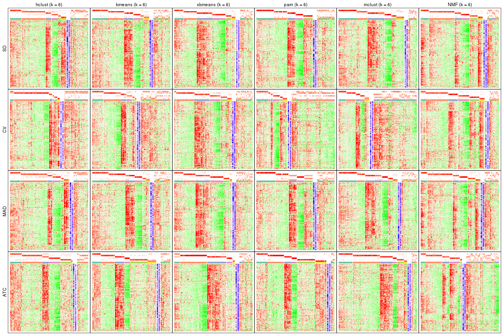</p>

</div>
</div>


### Statistics table

The statistics used for measuring the stability of consensus partitioning.
([How are they
defined?](http://bioconductor.org/packages/devel/bioc/vignettes/cola/inst/doc/cola.html#toc_13))


<script>
$( function() {
	$( '#tabs-get-stats-from-consensus-partition-list' ).tabs();
} );
</script>
<div id='tabs-get-stats-from-consensus-partition-list'>
<ul>
<li><a href='#tab-get-stats-from-consensus-partition-list-1'>k = 2</a></li>
<li><a href='#tab-get-stats-from-consensus-partition-list-2'>k = 3</a></li>
<li><a href='#tab-get-stats-from-consensus-partition-list-3'>k = 4</a></li>
<li><a href='#tab-get-stats-from-consensus-partition-list-4'>k = 5</a></li>
<li><a href='#tab-get-stats-from-consensus-partition-list-5'>k = 6</a></li>
</ul>
<div id='tab-get-stats-from-consensus-partition-list-1'>
<pre><code class="r">get_stats(res_list, k = 2)
</code></pre>

<pre><code>#&gt;             k 1-PAC mean_silhouette concordance area_increased  Rand Jaccard
#&gt; SD:NMF      2 0.828           0.899       0.958          0.485 0.508   0.508
#&gt; CV:NMF      2 0.905           0.940       0.974          0.495 0.503   0.503
#&gt; MAD:NMF     2 0.803           0.904       0.958          0.464 0.537   0.537
#&gt; ATC:NMF     2 0.584           0.842       0.926          0.475 0.524   0.524
#&gt; SD:skmeans  2 0.907           0.939       0.974          0.503 0.497   0.497
#&gt; CV:skmeans  2 0.877           0.929       0.969          0.486 0.510   0.510
#&gt; MAD:skmeans 2 0.897           0.938       0.974          0.503 0.498   0.498
#&gt; ATC:skmeans 2 1.000           0.990       0.996          0.501 0.500   0.500
#&gt; SD:mclust   2 0.876           0.917       0.966          0.499 0.498   0.498
#&gt; CV:mclust   2 0.576           0.766       0.899          0.493 0.504   0.504
#&gt; MAD:mclust  2 0.847           0.908       0.963          0.500 0.498   0.498
#&gt; ATC:mclust  2 0.377           0.746       0.832          0.426 0.517   0.517
#&gt; SD:kmeans   2 0.896           0.922       0.968          0.499 0.500   0.500
#&gt; CV:kmeans   2 0.927           0.926       0.969          0.419 0.570   0.570
#&gt; MAD:kmeans  2 0.837           0.917       0.963          0.501 0.498   0.498
#&gt; ATC:kmeans  2 1.000           0.997       0.999          0.499 0.501   0.501
#&gt; SD:pam      2 0.727           0.892       0.948          0.492 0.503   0.503
#&gt; CV:pam      2 0.797           0.886       0.950          0.417 0.578   0.578
#&gt; MAD:pam     2 0.532           0.768       0.900          0.469 0.506   0.506
#&gt; ATC:pam     2 1.000           0.990       0.995          0.503 0.498   0.498
#&gt; SD:hclust   2 0.226           0.704       0.842          0.434 0.504   0.504
#&gt; CV:hclust   2 0.426           0.556       0.740          0.281 0.504   0.504
#&gt; MAD:hclust  2 0.226           0.683       0.824          0.439 0.500   0.500
#&gt; ATC:hclust  2 0.413           0.801       0.867          0.409 0.595   0.595
</code></pre>

</div>
<div id='tab-get-stats-from-consensus-partition-list-2'>
<pre><code class="r">get_stats(res_list, k = 3)
</code></pre>

<pre><code>#&gt;             k 1-PAC mean_silhouette concordance area_increased  Rand Jaccard
#&gt; SD:NMF      3 0.637           0.789       0.886          0.341 0.648   0.415
#&gt; CV:NMF      3 0.399           0.468       0.747          0.303 0.769   0.583
#&gt; MAD:NMF     3 0.589           0.746       0.859          0.410 0.655   0.434
#&gt; ATC:NMF     3 0.515           0.699       0.851          0.366 0.655   0.433
#&gt; SD:skmeans  3 0.705           0.902       0.904          0.296 0.796   0.610
#&gt; CV:skmeans  3 0.594           0.733       0.859          0.297 0.804   0.632
#&gt; MAD:skmeans 3 0.697           0.899       0.891          0.296 0.808   0.630
#&gt; ATC:skmeans 3 0.989           0.943       0.978          0.213 0.884   0.771
#&gt; SD:mclust   3 0.495           0.687       0.815          0.158 0.914   0.831
#&gt; CV:mclust   3 0.395           0.562       0.739          0.222 0.706   0.504
#&gt; MAD:mclust  3 0.576           0.777       0.856          0.143 0.903   0.811
#&gt; ATC:mclust  3 0.631           0.777       0.892          0.262 0.653   0.487
#&gt; SD:kmeans   3 0.628           0.796       0.896          0.275 0.682   0.459
#&gt; CV:kmeans   3 0.772           0.843       0.928          0.478 0.654   0.462
#&gt; MAD:kmeans  3 0.584           0.760       0.881          0.279 0.700   0.472
#&gt; ATC:kmeans  3 1.000           0.962       0.984          0.299 0.658   0.427
#&gt; SD:pam      3 0.889           0.902       0.962          0.205 0.677   0.478
#&gt; CV:pam      3 0.403           0.577       0.805          0.346 0.691   0.523
#&gt; MAD:pam     3 0.868           0.892       0.957          0.277 0.678   0.480
#&gt; ATC:pam     3 0.938           0.910       0.952          0.308 0.699   0.471
#&gt; SD:hclust   3 0.278           0.604       0.718          0.338 0.779   0.599
#&gt; CV:hclust   3 0.391           0.674       0.849          0.680 0.800   0.671
#&gt; MAD:hclust  3 0.270           0.399       0.683          0.328 0.628   0.407
#&gt; ATC:hclust  3 0.506           0.748       0.867          0.472 0.754   0.601
</code></pre>

</div>
<div id='tab-get-stats-from-consensus-partition-list-3'>
<pre><code class="r">get_stats(res_list, k = 4)
</code></pre>

<pre><code>#&gt;             k 1-PAC mean_silhouette concordance area_increased  Rand Jaccard
#&gt; SD:NMF      4 0.817           0.850       0.932         0.0921 0.748   0.428
#&gt; CV:NMF      4 0.604           0.631       0.790         0.1105 0.808   0.551
#&gt; MAD:NMF     4 0.781           0.820       0.911         0.0986 0.720   0.376
#&gt; ATC:NMF     4 0.428           0.443       0.718         0.1237 0.854   0.620
#&gt; SD:skmeans  4 0.677           0.595       0.759         0.1178 0.940   0.832
#&gt; CV:skmeans  4 0.609           0.375       0.637         0.1405 0.858   0.636
#&gt; MAD:skmeans 4 0.686           0.691       0.803         0.1101 0.926   0.792
#&gt; ATC:skmeans 4 0.900           0.869       0.937         0.0851 0.938   0.846
#&gt; SD:mclust   4 0.639           0.825       0.851         0.1979 0.823   0.604
#&gt; CV:mclust   4 0.564           0.666       0.772         0.1727 0.789   0.524
#&gt; MAD:mclust  4 0.560           0.664       0.719         0.1630 0.771   0.526
#&gt; ATC:mclust  4 0.664           0.780       0.881         0.2336 0.695   0.458
#&gt; SD:kmeans   4 0.598           0.735       0.820         0.1220 0.834   0.594
#&gt; CV:kmeans   4 0.585           0.650       0.818         0.1162 0.892   0.731
#&gt; MAD:kmeans  4 0.576           0.737       0.810         0.1216 0.769   0.462
#&gt; ATC:kmeans  4 1.000           0.955       0.982         0.1160 0.740   0.410
#&gt; SD:pam      4 0.796           0.830       0.929         0.1114 0.921   0.813
#&gt; CV:pam      4 0.405           0.489       0.686         0.1824 0.726   0.442
#&gt; MAD:pam     4 0.789           0.855       0.939         0.0907 0.943   0.862
#&gt; ATC:pam     4 0.667           0.775       0.847         0.0867 0.891   0.699
#&gt; SD:hclust   4 0.305           0.532       0.661         0.1153 0.837   0.631
#&gt; CV:hclust   4 0.402           0.584       0.740         0.1039 0.958   0.918
#&gt; MAD:hclust  4 0.335           0.454       0.659         0.1079 0.645   0.361
#&gt; ATC:hclust  4 0.557           0.671       0.804         0.1642 0.819   0.575
</code></pre>

</div>
<div id='tab-get-stats-from-consensus-partition-list-4'>
<pre><code class="r">get_stats(res_list, k = 5)
</code></pre>

<pre><code>#&gt;             k 1-PAC mean_silhouette concordance area_increased  Rand Jaccard
#&gt; SD:NMF      5 0.772           0.741       0.860         0.0648 0.903   0.691
#&gt; CV:NMF      5 0.764           0.775       0.884         0.0686 0.859   0.576
#&gt; MAD:NMF     5 0.719           0.716       0.839         0.0638 0.887   0.644
#&gt; ATC:NMF     5 0.569           0.599       0.778         0.0729 0.858   0.554
#&gt; SD:skmeans  5 0.719           0.686       0.844         0.0850 0.845   0.534
#&gt; CV:skmeans  5 0.618           0.442       0.679         0.0703 0.792   0.425
#&gt; MAD:skmeans 5 0.698           0.687       0.837         0.0901 0.848   0.534
#&gt; ATC:skmeans 5 0.813           0.736       0.861         0.0667 0.966   0.902
#&gt; SD:mclust   5 0.609           0.495       0.763         0.0734 0.794   0.463
#&gt; CV:mclust   5 0.553           0.546       0.706         0.0599 0.814   0.464
#&gt; MAD:mclust  5 0.658           0.712       0.856         0.1094 0.841   0.561
#&gt; ATC:mclust  5 0.623           0.649       0.748         0.1052 0.811   0.519
#&gt; SD:kmeans   5 0.626           0.632       0.777         0.0740 0.919   0.736
#&gt; CV:kmeans   5 0.547           0.439       0.697         0.0799 0.917   0.762
#&gt; MAD:kmeans  5 0.623           0.626       0.786         0.0720 0.905   0.691
#&gt; ATC:kmeans  5 0.695           0.679       0.812         0.0714 0.813   0.445
#&gt; SD:pam      5 0.801           0.815       0.921         0.1301 0.891   0.702
#&gt; CV:pam      5 0.441           0.402       0.622         0.0877 0.821   0.487
#&gt; MAD:pam     5 0.799           0.843       0.934         0.1313 0.887   0.695
#&gt; ATC:pam     5 0.913           0.884       0.956         0.0659 0.894   0.660
#&gt; SD:hclust   5 0.382           0.567       0.702         0.0576 0.944   0.839
#&gt; CV:hclust   5 0.431           0.581       0.775         0.0477 0.960   0.919
#&gt; MAD:hclust  5 0.384           0.561       0.718         0.0644 0.869   0.673
#&gt; ATC:hclust  5 0.557           0.599       0.773         0.0385 0.941   0.805
</code></pre>

</div>
<div id='tab-get-stats-from-consensus-partition-list-5'>
<pre><code class="r">get_stats(res_list, k = 6)
</code></pre>

<pre><code>#&gt;             k 1-PAC mean_silhouette concordance area_increased  Rand Jaccard
#&gt; SD:NMF      6 0.709           0.706       0.833         0.0475 0.918   0.698
#&gt; CV:NMF      6 0.703           0.706       0.826         0.0519 0.939   0.760
#&gt; MAD:NMF     6 0.683           0.668       0.772         0.0477 0.920   0.703
#&gt; ATC:NMF     6 0.567           0.466       0.688         0.0432 0.934   0.735
#&gt; SD:skmeans  6 0.757           0.686       0.831         0.0393 0.933   0.708
#&gt; CV:skmeans  6 0.669           0.627       0.778         0.0442 0.903   0.632
#&gt; MAD:skmeans 6 0.742           0.650       0.805         0.0401 0.933   0.706
#&gt; ATC:skmeans 6 0.763           0.690       0.843         0.0416 0.925   0.776
#&gt; SD:mclust   6 0.667           0.717       0.800         0.0596 0.848   0.514
#&gt; CV:mclust   6 0.604           0.418       0.663         0.0569 0.878   0.562
#&gt; MAD:mclust  6 0.650           0.655       0.774         0.0617 0.898   0.639
#&gt; ATC:mclust  6 0.701           0.806       0.876         0.0310 0.866   0.592
#&gt; SD:kmeans   6 0.691           0.629       0.787         0.0483 0.915   0.678
#&gt; CV:kmeans   6 0.551           0.471       0.685         0.0527 0.874   0.595
#&gt; MAD:kmeans  6 0.695           0.648       0.783         0.0463 0.931   0.724
#&gt; ATC:kmeans  6 0.726           0.709       0.824         0.0455 0.849   0.450
#&gt; SD:pam      6 0.770           0.642       0.839         0.0720 0.950   0.812
#&gt; CV:pam      6 0.478           0.422       0.652         0.0614 0.851   0.516
#&gt; MAD:pam     6 0.788           0.594       0.827         0.0747 0.931   0.755
#&gt; ATC:pam     6 0.857           0.836       0.920         0.0671 0.865   0.520
#&gt; SD:hclust   6 0.481           0.599       0.754         0.0523 0.977   0.924
#&gt; CV:hclust   6 0.447           0.568       0.779         0.0540 0.960   0.917
#&gt; MAD:hclust  6 0.471           0.610       0.757         0.0563 0.975   0.919
#&gt; ATC:hclust  6 0.619           0.676       0.781         0.0613 0.927   0.748
</code></pre>

</div>
</div>

Following heatmap plots the partition for each combination of methods and the
lightness correspond to the silhouette scores for samples in each method. On
top the consensus subgroup is inferred from all methods by taking the mean
silhouette scores as weight.


<script>
$( function() {
	$( '#tabs-collect-stats-from-consensus-partition-list' ).tabs();
} );
</script>
<div id='tabs-collect-stats-from-consensus-partition-list'>
<ul>
<li><a href='#tab-collect-stats-from-consensus-partition-list-1'>k = 2</a></li>
<li><a href='#tab-collect-stats-from-consensus-partition-list-2'>k = 3</a></li>
<li><a href='#tab-collect-stats-from-consensus-partition-list-3'>k = 4</a></li>
<li><a href='#tab-collect-stats-from-consensus-partition-list-4'>k = 5</a></li>
<li><a href='#tab-collect-stats-from-consensus-partition-list-5'>k = 6</a></li>
</ul>
<div id='tab-collect-stats-from-consensus-partition-list-1'>
<pre><code class="r">collect_stats(res_list, k = 2)
</code></pre>

<p>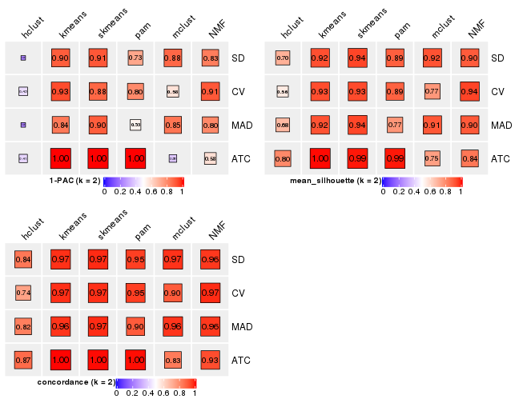</p>

</div>
<div id='tab-collect-stats-from-consensus-partition-list-2'>
<pre><code class="r">collect_stats(res_list, k = 3)
</code></pre>

<p>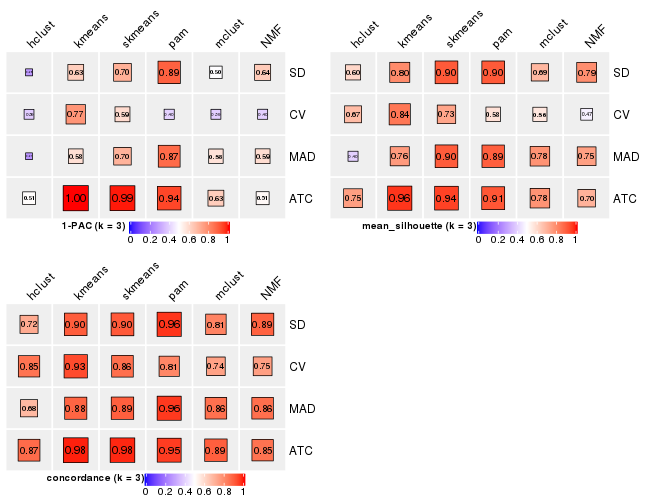</p>

</div>
<div id='tab-collect-stats-from-consensus-partition-list-3'>
<pre><code class="r">collect_stats(res_list, k = 4)
</code></pre>

<p>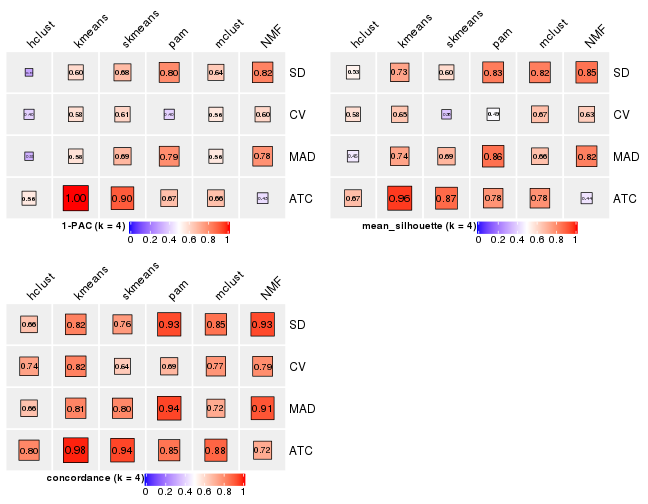</p>

</div>
<div id='tab-collect-stats-from-consensus-partition-list-4'>
<pre><code class="r">collect_stats(res_list, k = 5)
</code></pre>

<p>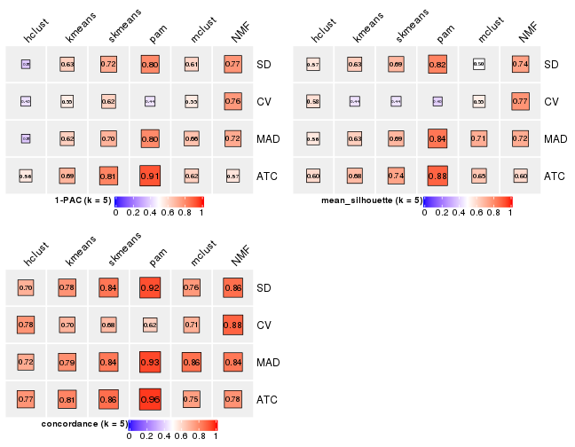</p>

</div>
<div id='tab-collect-stats-from-consensus-partition-list-5'>
<pre><code class="r">collect_stats(res_list, k = 6)
</code></pre>

<p>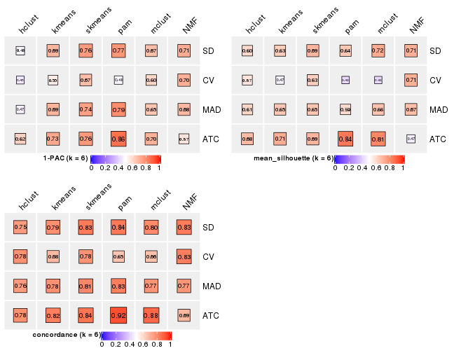</p>

</div>
</div>

### Partition from all methods


Collect partitions from all methods:


<script>
$( function() {
	$( '#tabs-collect-classes-from-consensus-partition-list' ).tabs();
} );
</script>
<div id='tabs-collect-classes-from-consensus-partition-list'>
<ul>
<li><a href='#tab-collect-classes-from-consensus-partition-list-1'>k = 2</a></li>
<li><a href='#tab-collect-classes-from-consensus-partition-list-2'>k = 3</a></li>
<li><a href='#tab-collect-classes-from-consensus-partition-list-3'>k = 4</a></li>
<li><a href='#tab-collect-classes-from-consensus-partition-list-4'>k = 5</a></li>
<li><a href='#tab-collect-classes-from-consensus-partition-list-5'>k = 6</a></li>
</ul>
<div id='tab-collect-classes-from-consensus-partition-list-1'>
<pre><code class="r">collect_classes(res_list, k = 2)
</code></pre>

<p>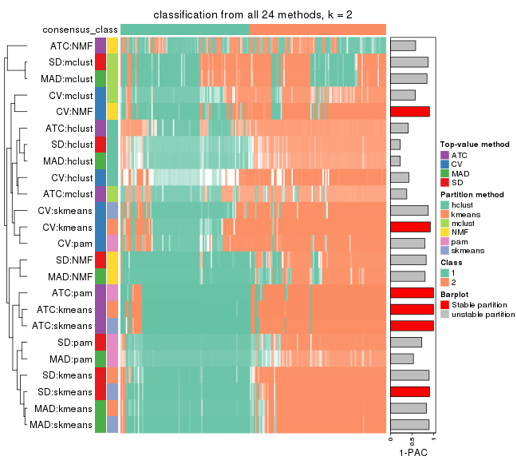</p>

</div>
<div id='tab-collect-classes-from-consensus-partition-list-2'>
<pre><code class="r">collect_classes(res_list, k = 3)
</code></pre>

<p>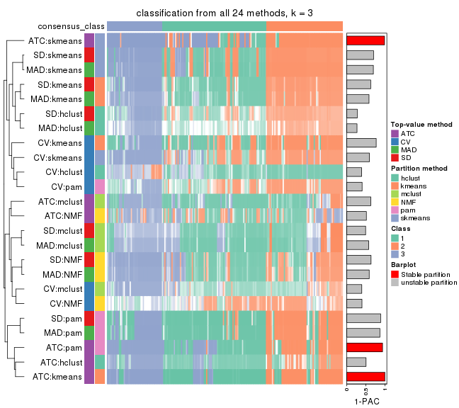</p>

</div>
<div id='tab-collect-classes-from-consensus-partition-list-3'>
<pre><code class="r">collect_classes(res_list, k = 4)
</code></pre>

<p>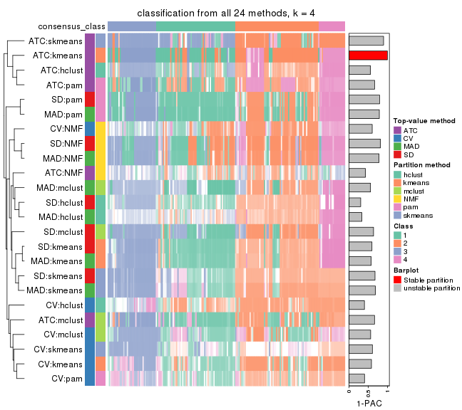</p>

</div>
<div id='tab-collect-classes-from-consensus-partition-list-4'>
<pre><code class="r">collect_classes(res_list, k = 5)
</code></pre>

<p>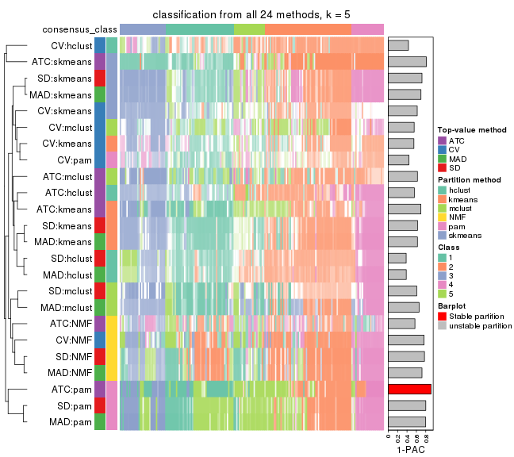</p>

</div>
<div id='tab-collect-classes-from-consensus-partition-list-5'>
<pre><code class="r">collect_classes(res_list, k = 6)
</code></pre>

<p>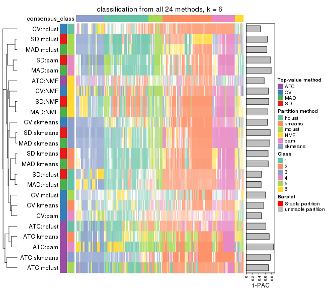</p>

</div>
</div>


### Top rows overlap


Overlap of top rows from different top-row methods:


<script>
$( function() {
	$( '#tabs-top-rows-overlap-by-euler' ).tabs();
} );
</script>
<div id='tabs-top-rows-overlap-by-euler'>
<ul>
<li><a href='#tab-top-rows-overlap-by-euler-1'>top_n = 1000</a></li>
<li><a href='#tab-top-rows-overlap-by-euler-2'>top_n = 2000</a></li>
<li><a href='#tab-top-rows-overlap-by-euler-3'>top_n = 3000</a></li>
<li><a href='#tab-top-rows-overlap-by-euler-4'>top_n = 4000</a></li>
<li><a href='#tab-top-rows-overlap-by-euler-5'>top_n = 5000</a></li>
</ul>
<div id='tab-top-rows-overlap-by-euler-1'>
<pre><code class="r">top_rows_overlap(res_list, top_n = 1000, method = &quot;euler&quot;)
</code></pre>

<p>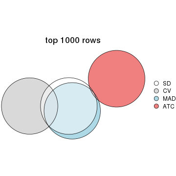</p>

</div>
<div id='tab-top-rows-overlap-by-euler-2'>
<pre><code class="r">top_rows_overlap(res_list, top_n = 2000, method = &quot;euler&quot;)
</code></pre>

<p>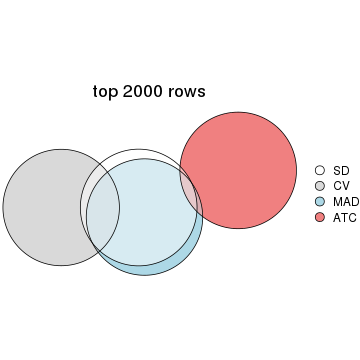</p>

</div>
<div id='tab-top-rows-overlap-by-euler-3'>
<pre><code class="r">top_rows_overlap(res_list, top_n = 3000, method = &quot;euler&quot;)
</code></pre>

<p>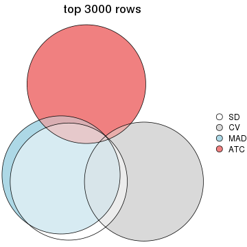</p>

</div>
<div id='tab-top-rows-overlap-by-euler-4'>
<pre><code class="r">top_rows_overlap(res_list, top_n = 4000, method = &quot;euler&quot;)
</code></pre>

<p>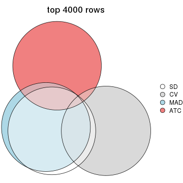</p>

</div>
<div id='tab-top-rows-overlap-by-euler-5'>
<pre><code class="r">top_rows_overlap(res_list, top_n = 5000, method = &quot;euler&quot;)
</code></pre>

<p>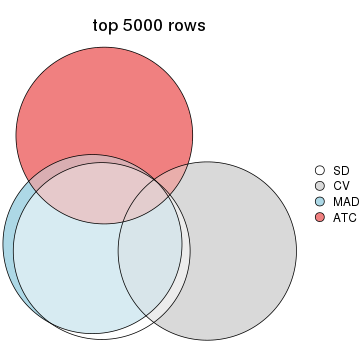</p>

</div>
</div>

Also visualize the correspondance of rankings between different top-row methods:


<script>
$( function() {
	$( '#tabs-top-rows-overlap-by-correspondance' ).tabs();
} );
</script>
<div id='tabs-top-rows-overlap-by-correspondance'>
<ul>
<li><a href='#tab-top-rows-overlap-by-correspondance-1'>top_n = 1000</a></li>
<li><a href='#tab-top-rows-overlap-by-correspondance-2'>top_n = 2000</a></li>
<li><a href='#tab-top-rows-overlap-by-correspondance-3'>top_n = 3000</a></li>
<li><a href='#tab-top-rows-overlap-by-correspondance-4'>top_n = 4000</a></li>
<li><a href='#tab-top-rows-overlap-by-correspondance-5'>top_n = 5000</a></li>
</ul>
<div id='tab-top-rows-overlap-by-correspondance-1'>
<pre><code class="r">top_rows_overlap(res_list, top_n = 1000, method = &quot;correspondance&quot;)
</code></pre>

<p>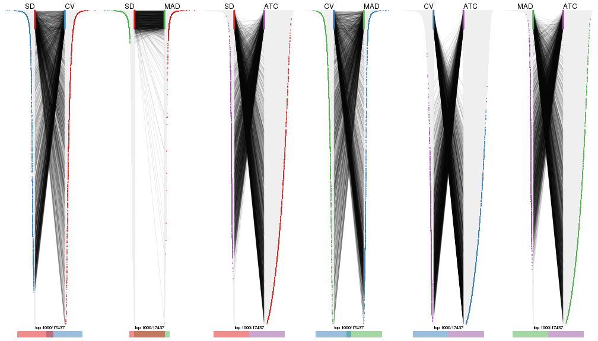</p>

</div>
<div id='tab-top-rows-overlap-by-correspondance-2'>
<pre><code class="r">top_rows_overlap(res_list, top_n = 2000, method = &quot;correspondance&quot;)
</code></pre>

<p>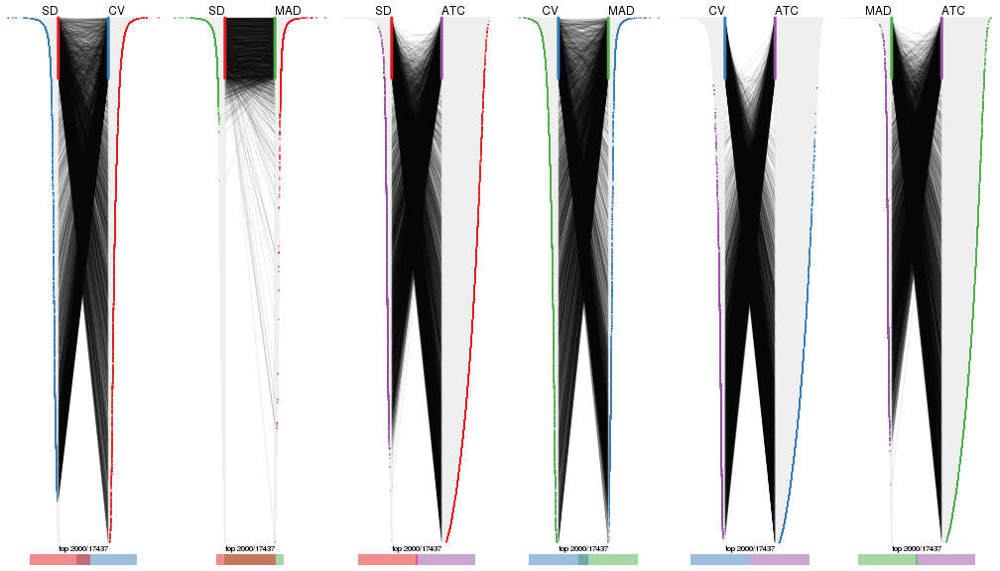</p>

</div>
<div id='tab-top-rows-overlap-by-correspondance-3'>
<pre><code class="r">top_rows_overlap(res_list, top_n = 3000, method = &quot;correspondance&quot;)
</code></pre>

<p>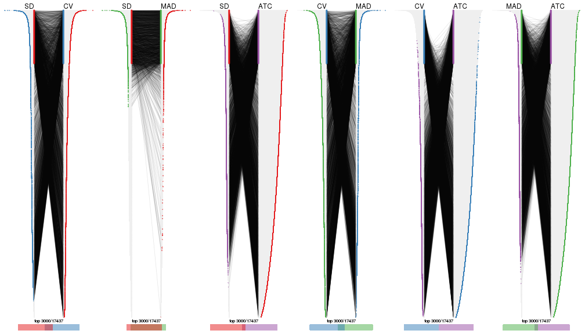</p>

</div>
<div id='tab-top-rows-overlap-by-correspondance-4'>
<pre><code class="r">top_rows_overlap(res_list, top_n = 4000, method = &quot;correspondance&quot;)
</code></pre>

<p>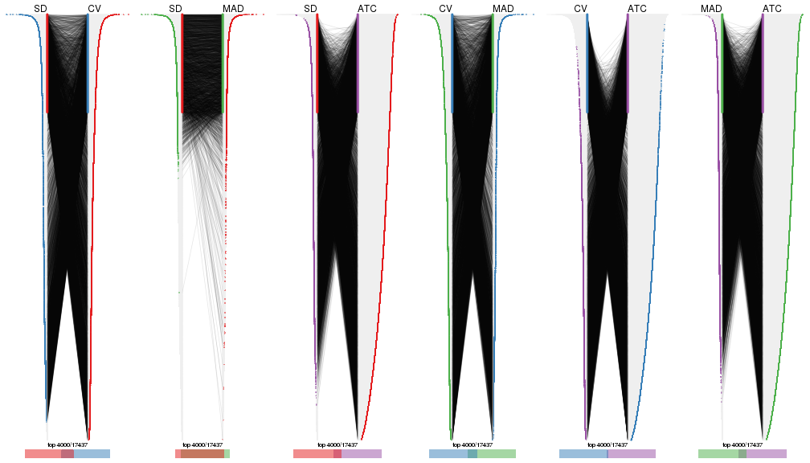</p>

</div>
<div id='tab-top-rows-overlap-by-correspondance-5'>
<pre><code class="r">top_rows_overlap(res_list, top_n = 5000, method = &quot;correspondance&quot;)
</code></pre>

<p>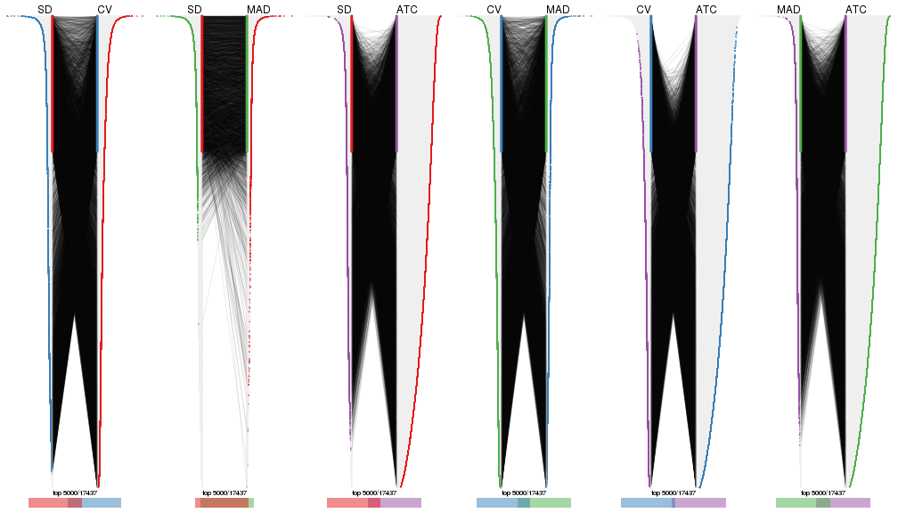</p>

</div>
</div>


Heatmaps of the top rows:


<script>
$( function() {
	$( '#tabs-top-rows-heatmap' ).tabs();
} );
</script>
<div id='tabs-top-rows-heatmap'>
<ul>
<li><a href='#tab-top-rows-heatmap-1'>top_n = 1000</a></li>
<li><a href='#tab-top-rows-heatmap-2'>top_n = 2000</a></li>
<li><a href='#tab-top-rows-heatmap-3'>top_n = 3000</a></li>
<li><a href='#tab-top-rows-heatmap-4'>top_n = 4000</a></li>
<li><a href='#tab-top-rows-heatmap-5'>top_n = 5000</a></li>
</ul>
<div id='tab-top-rows-heatmap-1'>
<pre><code class="r">top_rows_heatmap(res_list, top_n = 1000)
</code></pre>

<p>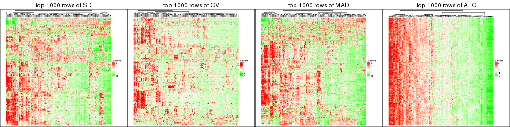</p>

</div>
<div id='tab-top-rows-heatmap-2'>
<pre><code class="r">top_rows_heatmap(res_list, top_n = 2000)
</code></pre>

<p>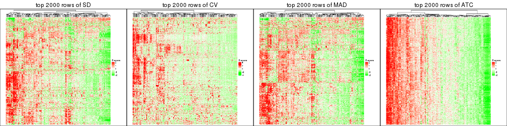</p>

</div>
<div id='tab-top-rows-heatmap-3'>
<pre><code class="r">top_rows_heatmap(res_list, top_n = 3000)
</code></pre>

<p>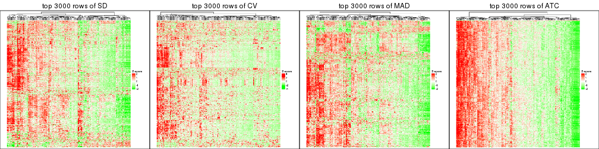</p>

</div>
<div id='tab-top-rows-heatmap-4'>
<pre><code class="r">top_rows_heatmap(res_list, top_n = 4000)
</code></pre>

<p>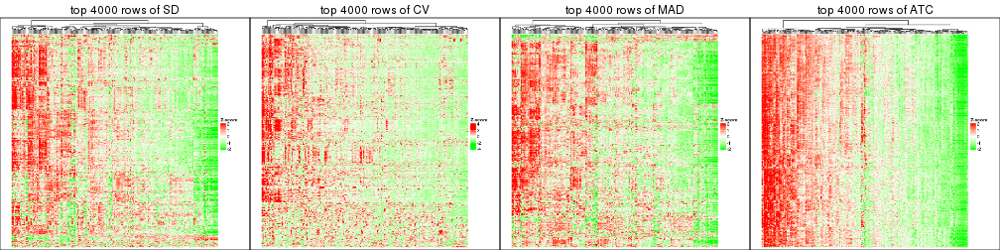</p>

</div>
<div id='tab-top-rows-heatmap-5'>
<pre><code class="r">top_rows_heatmap(res_list, top_n = 5000)
</code></pre>

<p>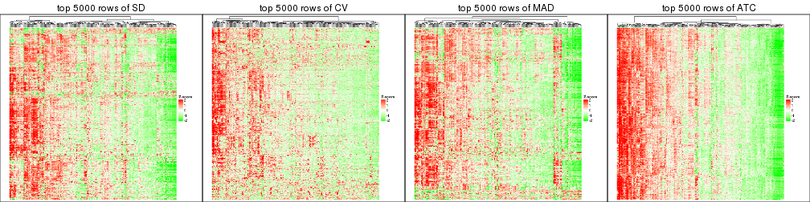</p>

</div>
</div>


 
## Results for each method


---------------------------------------------------


### SD:hclust


The object with results only for a single top-value method and a single partition method 
can be extracted as:

```r
res = res_list["SD", "hclust"]
# you can also extract it by
# res = res_list["SD:hclust"]
```

A summary of `res` and all the functions that can be applied to it:

```r
res
```

```
#> A 'ConsensusPartition' object with k = 2, 3, 4, 5, 6.
#>   On a matrix with 17437 rows and 197 columns.
#>   Top rows (1000, 2000, 3000, 4000, 5000) are extracted by 'SD' method.
#>   Subgroups are detected by 'hclust' method.
#>   Performed in total 1250 partitions by row resampling.
#>   Best k for subgroups seems to be 2.
#> 
#> Following methods can be applied to this 'ConsensusPartition' object:
#>  [1] "cola_report"             "collect_classes"         "collect_plots"          
#>  [4] "collect_stats"           "colnames"                "compare_signatures"     
#>  [7] "consensus_heatmap"       "dimension_reduction"     "functional_enrichment"  
#> [10] "get_anno_col"            "get_anno"                "get_classes"            
#> [13] "get_consensus"           "get_matrix"              "get_membership"         
#> [16] "get_param"               "get_signatures"          "get_stats"              
#> [19] "is_best_k"               "is_stable_k"             "membership_heatmap"     
#> [22] "ncol"                    "nrow"                    "plot_ecdf"              
#> [25] "rownames"                "select_partition_number" "show"                   
#> [28] "suggest_best_k"          "test_to_known_factors"
```

`collect_plots()` function collects all the plots made from `res` for all `k` (number of partitions)
into one single page to provide an easy and fast comparison between different `k`.

```r
collect_plots(res)
```

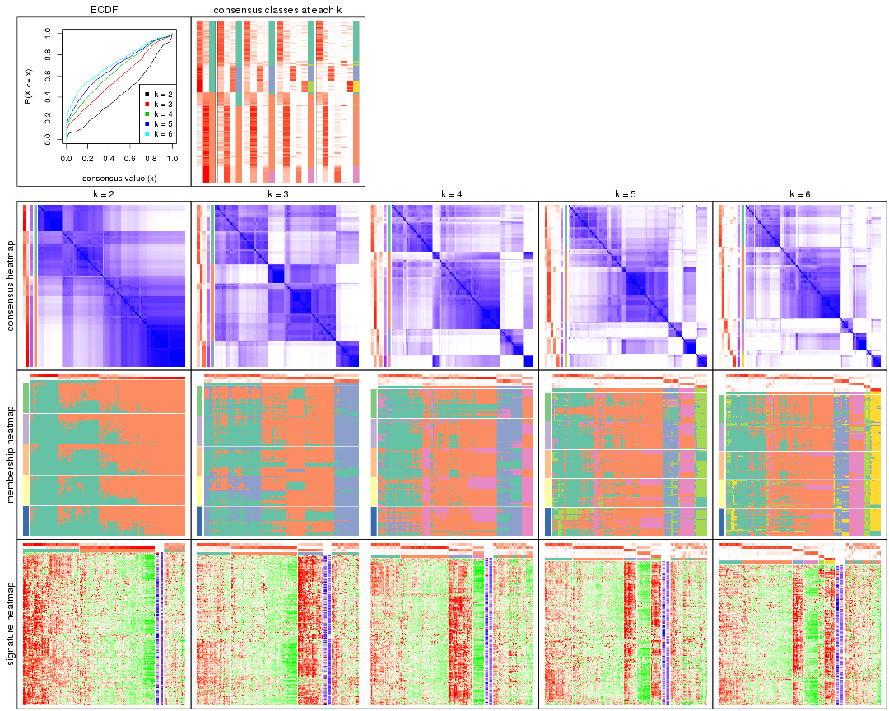

The plots are:

- The first row: a plot of the ECDF (Empirical cumulative distribution
  function) curves of the consensus matrix for each `k` and the heatmap of
  predicted classes for each `k`.
- The second row: heatmaps of the consensus matrix for each `k`.
- The third row: heatmaps of the membership matrix for each `k`.
- The fouth row: heatmaps of the signatures for each `k`.

All the plots in panels can be made by individual functions and they are
plotted later in this section.

`select_partition_number()` produces several plots showing different
statistics for choosing "optimized" `k`. There are following statistics:

- ECDF curves of the consensus matrix for each `k`;
- 1-PAC. [The PAC
  score](https://en.wikipedia.org/wiki/Consensus_clustering#Over-interpretation_potential_of_consensus_clustering)
  measures the proportion of the ambiguous subgrouping.
- Mean silhouette score.
- Concordance. The mean probability of fiting the consensus class ids in all
  partitions.
- Area increased. Denote $A_k$ as the area under the ECDF curve for current
  `k`, the area increased is defined as $A_k - A_{k-1}$.
- Rand index. The percent of pairs of samples that are both in a same cluster
  or both are not in a same cluster in the partition of k and k-1.
- Jaccard index. The ratio of pairs of samples are both in a same cluster in
  the partition of k and k-1 and the pairs of samples are both in a same
  cluster in the partition k or k-1.

The detailed explanations of these statistics can be found in [the cola
vignette](http://bioconductor.org/packages/devel/bioc/vignettes/cola/inst/doc/cola.html#toc_13).

Generally speaking, lower PAC score, higher mean silhouette score or higher
concordance corresponds to better partition. Rand index and Jaccard index
measure how similar the current partition is compared to partition with `k-1`.
If they are too similar, we won't accept `k` is better than `k-1`.

```r
select_partition_number(res)
```

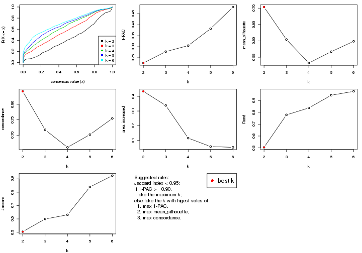

The numeric values for all these statistics can be obtained by `get_stats()`.

```r
get_stats(res)
```

```
#>   k 1-PAC mean_silhouette concordance area_increased  Rand Jaccard
#> 2 2 0.226           0.704       0.842         0.4341 0.504   0.504
#> 3 3 0.278           0.604       0.718         0.3378 0.779   0.599
#> 4 4 0.305           0.532       0.661         0.1153 0.837   0.631
#> 5 5 0.382           0.567       0.702         0.0576 0.944   0.839
#> 6 6 0.481           0.599       0.754         0.0523 0.977   0.924
```

`suggest_best_k()` suggests the best $k$ based on these statistics. The rules are as follows:

- All $k$ with Jaccard index larger than 0.95 are removed because the increase of
  the partition number does not provides enough extra information. If all $k$ are removed,
  the best $k$ is assigned by `NA`.
- For $k$ with 1-PAC larger than 0.9, the maximal $k$ is taken as the "best k". Other $k$ is called "optional k".
- If it does not fit the second rule. The $k$ with the highest vote of highest
  1-PAC, mean silhouette and concordance is taken as the "best k".

```r
suggest_best_k(res)
```

```
#> [1] 2
```


Following shows the table of the partitions (You need to click the **show/hide
code output** link to see it). The membership matrix (columns with name `p*`)
is inferred by
[`clue::cl_consensus()`](https://www.rdocumentation.org/link/cl_consensus?package=clue)
function with the `SE` method. Basically the value in the membership matrix
represents the probability to belong to a certain group. The finall class
label for an item is determined with the group with highest probability it
belongs to.

In `get_classes()` function, the entropy is calculated from the membership
matrix and the silhouette score is calculated from the consensus matrix.


<script>
$( function() {
	$( '#tabs-SD-hclust-get-classes' ).tabs();
} );
</script>
<div id='tabs-SD-hclust-get-classes'>
<ul>
<li><a href='#tab-SD-hclust-get-classes-1'>k = 2</a></li>
<li><a href='#tab-SD-hclust-get-classes-2'>k = 3</a></li>
<li><a href='#tab-SD-hclust-get-classes-3'>k = 4</a></li>
<li><a href='#tab-SD-hclust-get-classes-4'>k = 5</a></li>
<li><a href='#tab-SD-hclust-get-classes-5'>k = 6</a></li>
</ul>

<div id='tab-SD-hclust-get-classes-1'>
<p><a id='tab-SD-hclust-get-classes-1-a' style='color:#0366d6' href='#'>show/hide code output</a></p>
<pre><code class="r">cbind(get_classes(res, k = 2), get_membership(res, k = 2))
</code></pre>

<pre><code>#&gt;            class entropy silhouette    p1    p2
#&gt; SRR1380886     1  0.6247     0.7815 0.844 0.156
#&gt; SRR1074385     1  0.8861     0.6882 0.696 0.304
#&gt; SRR1374739     1  0.0000     0.7464 1.000 0.000
#&gt; SRR1097883     1  0.8267     0.7351 0.740 0.260
#&gt; SRR2167209     2  0.9248     0.4716 0.340 0.660
#&gt; SRR816541      2  0.0672     0.8285 0.008 0.992
#&gt; SRR663645      2  0.6438     0.7785 0.164 0.836
#&gt; SRR1381505     2  0.0000     0.8244 0.000 1.000
#&gt; SRR1416362     2  0.1184     0.8299 0.016 0.984
#&gt; SRR1318503     2  0.9635     0.3419 0.388 0.612
#&gt; SRR1341626     2  0.0672     0.8285 0.008 0.992
#&gt; SRR1382440     1  0.0000     0.7464 1.000 0.000
#&gt; SRR1088413     1  0.6247     0.7815 0.844 0.156
#&gt; SRR1082080     2  0.0672     0.8285 0.008 0.992
#&gt; SRR1455783     1  0.8499     0.7205 0.724 0.276
#&gt; SRR1447760     2  0.8763     0.5882 0.296 0.704
#&gt; SRR1487784     2  0.0938     0.8295 0.012 0.988
#&gt; SRR1331037     2  0.6973     0.7557 0.188 0.812
#&gt; SRR1095651     1  0.4939     0.7763 0.892 0.108
#&gt; SRR1078066     1  0.8713     0.7027 0.708 0.292
#&gt; SRR1120363     1  0.7815     0.7555 0.768 0.232
#&gt; SRR821231      1  0.6148     0.7811 0.848 0.152
#&gt; SRR1374373     2  0.7219     0.7467 0.200 0.800
#&gt; SRR1324519     2  0.0672     0.8285 0.008 0.992
#&gt; SRR1431121     1  0.7219     0.7709 0.800 0.200
#&gt; SRR1091032     2  0.0938     0.8294 0.012 0.988
#&gt; SRR1365575     2  0.0000     0.8244 0.000 1.000
#&gt; SRR1072972     1  0.6438     0.7810 0.836 0.164
#&gt; SRR1310690     2  0.1184     0.8300 0.016 0.984
#&gt; SRR1383037     1  0.0938     0.7526 0.988 0.012
#&gt; SRR1095479     1  0.6801     0.7776 0.820 0.180
#&gt; SRR1070403     1  0.0000     0.7464 1.000 0.000
#&gt; SRR1390203     1  0.7453     0.7658 0.788 0.212
#&gt; SRR1072007     2  0.2423     0.8300 0.040 0.960
#&gt; SRR1468787     1  0.9983     0.2533 0.524 0.476
#&gt; SRR1347959     2  0.2236     0.8304 0.036 0.964
#&gt; SRR1338513     1  0.5294     0.7732 0.880 0.120
#&gt; SRR812598      2  0.0000     0.8244 0.000 1.000
#&gt; SRR1446806     2  0.8499     0.6205 0.276 0.724
#&gt; SRR1394275     1  0.9896     0.3960 0.560 0.440
#&gt; SRR1443633     1  0.6343     0.7695 0.840 0.160
#&gt; SRR1087728     1  0.0938     0.7526 0.988 0.012
#&gt; SRR1098192     2  0.1843     0.8306 0.028 0.972
#&gt; SRR1093340     2  0.0672     0.8285 0.008 0.992
#&gt; SRR665405      2  0.7056     0.7531 0.192 0.808
#&gt; SRR657077      2  0.6531     0.7751 0.168 0.832
#&gt; SRR813208      1  0.0938     0.7526 0.988 0.012
#&gt; SRR1416074     2  0.0938     0.8295 0.012 0.988
#&gt; SRR1089688     2  0.5629     0.7998 0.132 0.868
#&gt; SRR1353461     1  0.1184     0.7542 0.984 0.016
#&gt; SRR1466321     2  0.9686     0.3230 0.396 0.604
#&gt; SRR1073021     1  0.9977     0.2698 0.528 0.472
#&gt; SRR1322816     2  0.0672     0.8285 0.008 0.992
#&gt; SRR1457727     1  0.6801     0.7779 0.820 0.180
#&gt; SRR1464226     2  0.4298     0.8214 0.088 0.912
#&gt; SRR1398863     1  0.8861     0.6882 0.696 0.304
#&gt; SRR1455631     2  0.6973     0.7571 0.188 0.812
#&gt; SRR1307808     2  0.5408     0.7901 0.124 0.876
#&gt; SRR1374585     2  0.0000     0.8244 0.000 1.000
#&gt; SRR1072104     2  0.4431     0.8186 0.092 0.908
#&gt; SRR1076868     2  0.0938     0.8295 0.012 0.988
#&gt; SRR1335984     2  0.5842     0.7967 0.140 0.860
#&gt; SRR1445939     1  0.9795     0.4611 0.584 0.416
#&gt; SRR1453047     2  0.0938     0.8294 0.012 0.988
#&gt; SRR1339788     1  0.0000     0.7464 1.000 0.000
#&gt; SRR1084323     1  0.9944     0.3323 0.544 0.456
#&gt; SRR1092937     1  0.9970     0.2867 0.532 0.468
#&gt; SRR1074090     2  0.0672     0.8285 0.008 0.992
#&gt; SRR1099833     1  0.5294     0.7732 0.880 0.120
#&gt; SRR1093434     1  0.0000     0.7464 1.000 0.000
#&gt; SRR1435857     1  0.9248     0.6327 0.660 0.340
#&gt; SRR1480347     2  0.0672     0.8285 0.008 0.992
#&gt; SRR1440787     2  0.0000     0.8244 0.000 1.000
#&gt; SRR1430202     2  0.8499     0.6205 0.276 0.724
#&gt; SRR1322730     2  0.0000     0.8244 0.000 1.000
#&gt; SRR811029      2  0.5946     0.7926 0.144 0.856
#&gt; SRR1390456     1  0.0672     0.7508 0.992 0.008
#&gt; SRR1381140     1  0.8813     0.6917 0.700 0.300
#&gt; SRR1388064     2  0.0000     0.8244 0.000 1.000
#&gt; SRR1093577     2  0.9993    -0.0946 0.484 0.516
#&gt; SRR1414161     1  0.9922     0.3722 0.552 0.448
#&gt; SRR1328738     2  0.9977    -0.0343 0.472 0.528
#&gt; SRR1311752     2  0.0672     0.8285 0.008 0.992
#&gt; SRR1445960     2  0.4690     0.8138 0.100 0.900
#&gt; SRR1403412     2  0.5946     0.7926 0.144 0.856
#&gt; SRR2166748     1  0.6973     0.7753 0.812 0.188
#&gt; SRR821666      2  0.0000     0.8244 0.000 1.000
#&gt; SRR1330746     1  0.0000     0.7464 1.000 0.000
#&gt; SRR1327872     2  0.0000     0.8244 0.000 1.000
#&gt; SRR1100800     1  0.7299     0.7703 0.796 0.204
#&gt; SRR1075174     1  0.9775     0.4724 0.588 0.412
#&gt; SRR1434436     2  0.9775     0.2494 0.412 0.588
#&gt; SRR1389409     2  0.0000     0.8244 0.000 1.000
#&gt; SRR1085310     1  0.8144     0.7432 0.748 0.252
#&gt; SRR1376718     2  0.0000     0.8244 0.000 1.000
#&gt; SRR808590      2  0.0000     0.8244 0.000 1.000
#&gt; SRR1084128     2  0.6247     0.7846 0.156 0.844
#&gt; SRR1361692     1  0.9044     0.6645 0.680 0.320
#&gt; SRR1431493     1  0.6887     0.7770 0.816 0.184
#&gt; SRR1409084     1  0.9000     0.6705 0.684 0.316
#&gt; SRR2166214     2  0.7056     0.7531 0.192 0.808
#&gt; SRR1324102     2  0.1843     0.8306 0.028 0.972
#&gt; SRR1079754     2  0.0000     0.8244 0.000 1.000
#&gt; SRR1442127     1  0.0938     0.7526 0.988 0.012
#&gt; SRR1076244     2  0.0376     0.8267 0.004 0.996
#&gt; SRR1330901     2  0.5408     0.7901 0.124 0.876
#&gt; SRR1073167     2  0.1843     0.8306 0.028 0.972
#&gt; SRR1357541     1  0.8267     0.7351 0.740 0.260
#&gt; SRR811607      2  0.9710     0.3032 0.400 0.600
#&gt; SRR1468931     1  0.0000     0.7464 1.000 0.000
#&gt; SRR1474908     2  0.6247     0.7851 0.156 0.844
#&gt; SRR1309875     2  0.1184     0.8300 0.016 0.984
#&gt; SRR598792      1  0.0376     0.7488 0.996 0.004
#&gt; SRR1088537     2  0.6623     0.7720 0.172 0.828
#&gt; SRR1457682     1  0.9087     0.6582 0.676 0.324
#&gt; SRR1454289     2  0.8555     0.6164 0.280 0.720
#&gt; SRR1069352     1  0.0000     0.7464 1.000 0.000
#&gt; SRR1472728     2  0.6531     0.7753 0.168 0.832
#&gt; SRR1091144     2  0.5059     0.8122 0.112 0.888
#&gt; SRR1319118     1  0.6148     0.7813 0.848 0.152
#&gt; SRR1403611     1  0.4939     0.7721 0.892 0.108
#&gt; SRR1397762     1  0.9000     0.6718 0.684 0.316
#&gt; SRR1317387     1  0.4939     0.7763 0.892 0.108
#&gt; SRR1376426     2  0.0938     0.8295 0.012 0.988
#&gt; SRR1097777     1  0.6887     0.7769 0.816 0.184
#&gt; SRR1365743     1  0.1184     0.7542 0.984 0.016
#&gt; SRR1458992     2  0.4690     0.8138 0.100 0.900
#&gt; SRR1089537     2  0.9087     0.5341 0.324 0.676
#&gt; SRR1397744     1  0.7453     0.7673 0.788 0.212
#&gt; SRR1453893     2  0.0000     0.8244 0.000 1.000
#&gt; SRR1098543     1  0.9087     0.6587 0.676 0.324
#&gt; SRR1321765     1  0.9754     0.4800 0.592 0.408
#&gt; SRR1440032     2  0.9754     0.2449 0.408 0.592
#&gt; SRR1404507     2  0.0000     0.8244 0.000 1.000
#&gt; SRR1404856     2  0.8499     0.6276 0.276 0.724
#&gt; SRR812745      1  0.9710     0.5147 0.600 0.400
#&gt; SRR1417524     1  0.4022     0.7570 0.920 0.080
#&gt; SRR1407334     2  0.0000     0.8244 0.000 1.000
#&gt; SRR1453991     1  0.7883     0.7540 0.764 0.236
#&gt; SRR1415938     1  0.7453     0.7658 0.788 0.212
#&gt; SRR1081259     2  0.7219     0.7467 0.200 0.800
#&gt; SRR1436187     2  0.0000     0.8244 0.000 1.000
#&gt; SRR1431948     1  0.0000     0.7464 1.000 0.000
#&gt; SRR1453277     2  0.7299     0.7439 0.204 0.796
#&gt; SRR1095407     2  0.9248     0.4716 0.340 0.660
#&gt; SRR1359694     2  0.9129     0.5171 0.328 0.672
#&gt; SRR656982      2  0.9323     0.4793 0.348 0.652
#&gt; SRR1354338     2  0.7299     0.7404 0.204 0.796
#&gt; SRR1088291     2  0.9833     0.2161 0.424 0.576
#&gt; SRR1080624     1  0.8813     0.6934 0.700 0.300
#&gt; SRR2166708     1  0.0000     0.7464 1.000 0.000
#&gt; SRR1393572     1  0.9977     0.2701 0.528 0.472
#&gt; SRR1429912     2  0.3114     0.8261 0.056 0.944
#&gt; SRR1421048     2  0.9170     0.5021 0.332 0.668
#&gt; SRR1434999     1  0.7219     0.7501 0.800 0.200
#&gt; SRR656457      1  0.7219     0.7501 0.800 0.200
#&gt; SRR1098928     1  0.0938     0.7528 0.988 0.012
#&gt; SRR1343967     2  0.0672     0.8285 0.008 0.992
#&gt; SRR1360766     1  0.9732     0.4602 0.596 0.404
#&gt; SRR1464724     2  0.0376     0.8267 0.004 0.996
#&gt; SRR1101542     2  0.0000     0.8244 0.000 1.000
#&gt; SRR1401528     1  0.3879     0.7710 0.924 0.076
#&gt; SRR1071519     1  0.0000     0.7464 1.000 0.000
#&gt; SRR1086070     1  0.8713     0.7021 0.708 0.292
#&gt; SRR1358645     2  0.9170     0.5038 0.332 0.668
#&gt; SRR819771      1  0.0000     0.7464 1.000 0.000
#&gt; SRR1418433     2  0.0376     0.8267 0.004 0.996
#&gt; SRR821050      1  0.7815     0.7567 0.768 0.232
#&gt; SRR1402091     2  0.5629     0.8002 0.132 0.868
#&gt; SRR1322028     2  0.2603     0.8297 0.044 0.956
#&gt; SRR1452556     2  0.0000     0.8244 0.000 1.000
#&gt; SRR1340047     2  0.8661     0.5965 0.288 0.712
#&gt; SRR1418302     2  0.1184     0.8300 0.016 0.984
#&gt; SRR1073991     1  0.7219     0.7712 0.800 0.200
#&gt; SRR1085187     2  0.1184     0.8256 0.016 0.984
#&gt; SRR1357618     1  0.0000     0.7464 1.000 0.000
#&gt; SRR1487764     2  0.9983     0.1396 0.476 0.524
#&gt; SRR1075336     1  0.9922     0.3659 0.552 0.448
#&gt; SRR1365471     2  0.0672     0.8285 0.008 0.992
#&gt; SRR1414613     2  0.4431     0.8196 0.092 0.908
#&gt; SRR658719      2  0.7056     0.7527 0.192 0.808
#&gt; SRR1475128     1  0.0000     0.7464 1.000 0.000
#&gt; SRR1367630     2  0.4431     0.8186 0.092 0.908
#&gt; SRR1481146     2  0.6973     0.7571 0.188 0.812
#&gt; SRR1465674     1  0.9944     0.3460 0.544 0.456
#&gt; SRR1327303     2  0.5629     0.8002 0.132 0.868
#&gt; SRR1390391     2  0.8861     0.5785 0.304 0.696
#&gt; SRR1326020     2  0.6623     0.7741 0.172 0.828
#&gt; SRR1381953     1  0.7950     0.6939 0.760 0.240
#&gt; SRR1082544     2  0.4431     0.8186 0.092 0.908
#&gt; SRR810761      1  0.8144     0.7418 0.748 0.252
#&gt; SRR1070764     1  0.1184     0.7542 0.984 0.016
#&gt; SRR1415919     1  0.0000     0.7464 1.000 0.000
#&gt; SRR1490404     2  0.0938     0.8295 0.012 0.988
#&gt; SRR1416773     1  0.9944     0.3460 0.544 0.456
#&gt; SRR1377492     2  0.5737     0.7982 0.136 0.864
#&gt; SRR1334314     2  0.9661     0.3297 0.392 0.608
</code></pre>

<script>
$('#tab-SD-hclust-get-classes-1-a').parent().next().next().hide();
$('#tab-SD-hclust-get-classes-1-a').click(function(){
  $('#tab-SD-hclust-get-classes-1-a').parent().next().next().toggle();
  return(false);
});
</script>
</div>

<div id='tab-SD-hclust-get-classes-2'>
<p><a id='tab-SD-hclust-get-classes-2-a' style='color:#0366d6' href='#'>show/hide code output</a></p>
<pre><code class="r">cbind(get_classes(res, k = 3), get_membership(res, k = 3))
</code></pre>

<pre><code>#&gt;            class entropy silhouette    p1    p2    p3
#&gt; SRR1380886     1   0.481   0.421359 0.804 0.008 0.188
#&gt; SRR1074385     1   0.551   0.655733 0.816 0.092 0.092
#&gt; SRR1374739     3   0.540   0.908887 0.280 0.000 0.720
#&gt; SRR1097883     1   0.572   0.623568 0.800 0.068 0.132
#&gt; SRR2167209     1   0.820   0.097685 0.524 0.400 0.076
#&gt; SRR816541      2   0.364   0.748689 0.124 0.872 0.004
#&gt; SRR663645      2   0.601   0.618881 0.332 0.664 0.004
#&gt; SRR1381505     2   0.369   0.612034 0.000 0.860 0.140
#&gt; SRR1416362     2   0.369   0.749644 0.140 0.860 0.000
#&gt; SRR1318503     1   0.619   0.281315 0.632 0.364 0.004
#&gt; SRR1341626     2   0.371   0.749712 0.128 0.868 0.004
#&gt; SRR1382440     3   0.550   0.904819 0.292 0.000 0.708
#&gt; SRR1088413     1   0.481   0.421359 0.804 0.008 0.188
#&gt; SRR1082080     2   0.371   0.749712 0.128 0.868 0.004
#&gt; SRR1455783     1   0.589   0.613359 0.796 0.096 0.108
#&gt; SRR1447760     1   0.767  -0.179537 0.492 0.464 0.044
#&gt; SRR1487784     2   0.369   0.750162 0.140 0.860 0.000
#&gt; SRR1331037     2   0.630   0.520245 0.388 0.608 0.004
#&gt; SRR1095651     3   0.742   0.698773 0.388 0.040 0.572
#&gt; SRR1078066     1   0.557   0.650577 0.812 0.080 0.108
#&gt; SRR1120363     1   0.393   0.596572 0.880 0.028 0.092
#&gt; SRR821231      1   0.638  -0.191982 0.624 0.008 0.368
#&gt; SRR1374373     2   0.634   0.517995 0.400 0.596 0.004
#&gt; SRR1324519     2   0.348   0.750086 0.128 0.872 0.000
#&gt; SRR1431121     1   0.335   0.546139 0.888 0.004 0.108
#&gt; SRR1091032     2   0.382   0.749500 0.148 0.852 0.000
#&gt; SRR1365575     2   0.369   0.612034 0.000 0.860 0.140
#&gt; SRR1072972     1   0.586   0.122657 0.704 0.008 0.288
#&gt; SRR1310690     2   0.355   0.751120 0.132 0.868 0.000
#&gt; SRR1383037     3   0.514   0.896173 0.252 0.000 0.748
#&gt; SRR1095479     1   0.507   0.312670 0.772 0.004 0.224
#&gt; SRR1070403     3   0.540   0.908887 0.280 0.000 0.720
#&gt; SRR1390203     1   0.362   0.560362 0.884 0.012 0.104
#&gt; SRR1072007     2   0.447   0.743933 0.176 0.820 0.004
#&gt; SRR1468787     1   0.642   0.585737 0.728 0.228 0.044
#&gt; SRR1347959     2   0.406   0.747387 0.164 0.836 0.000
#&gt; SRR1338513     3   0.803   0.691769 0.368 0.072 0.560
#&gt; SRR812598      2   0.540   0.659643 0.060 0.816 0.124
#&gt; SRR1446806     2   0.652   0.229449 0.484 0.512 0.004
#&gt; SRR1394275     1   0.617   0.612243 0.740 0.224 0.036
#&gt; SRR1443633     1   0.695   0.423463 0.692 0.056 0.252
#&gt; SRR1087728     3   0.553   0.902562 0.296 0.000 0.704
#&gt; SRR1098192     2   0.388   0.748845 0.152 0.848 0.000
#&gt; SRR1093340     2   0.371   0.749712 0.128 0.868 0.004
#&gt; SRR665405      2   0.714   0.596317 0.328 0.632 0.040
#&gt; SRR657077      2   0.606   0.610765 0.340 0.656 0.004
#&gt; SRR813208      3   0.514   0.896173 0.252 0.000 0.748
#&gt; SRR1416074     2   0.362   0.750145 0.136 0.864 0.000
#&gt; SRR1089688     2   0.584   0.693787 0.252 0.732 0.016
#&gt; SRR1353461     3   0.536   0.894872 0.276 0.000 0.724
#&gt; SRR1466321     1   0.613   0.308068 0.644 0.352 0.004
#&gt; SRR1073021     1   0.638   0.590666 0.732 0.224 0.044
#&gt; SRR1322816     2   0.341   0.749562 0.124 0.876 0.000
#&gt; SRR1457727     1   0.429   0.450863 0.832 0.004 0.164
#&gt; SRR1464226     2   0.489   0.723932 0.228 0.772 0.000
#&gt; SRR1398863     1   0.551   0.655733 0.816 0.092 0.092
#&gt; SRR1455631     2   0.625   0.570192 0.376 0.620 0.004
#&gt; SRR1307808     2   0.559   0.622200 0.304 0.696 0.000
#&gt; SRR1374585     2   0.369   0.612034 0.000 0.860 0.140
#&gt; SRR1072104     2   0.493   0.718851 0.232 0.768 0.000
#&gt; SRR1076868     2   0.362   0.750145 0.136 0.864 0.000
#&gt; SRR1335984     2   0.596   0.634354 0.324 0.672 0.004
#&gt; SRR1445939     1   0.611   0.638188 0.760 0.192 0.048
#&gt; SRR1453047     2   0.382   0.749500 0.148 0.852 0.000
#&gt; SRR1339788     3   0.540   0.908887 0.280 0.000 0.720
#&gt; SRR1084323     1   0.628   0.611635 0.736 0.224 0.040
#&gt; SRR1092937     1   0.640   0.595091 0.724 0.236 0.040
#&gt; SRR1074090     2   0.348   0.750086 0.128 0.872 0.000
#&gt; SRR1099833     3   0.803   0.691769 0.368 0.072 0.560
#&gt; SRR1093434     3   0.536   0.909298 0.276 0.000 0.724
#&gt; SRR1435857     1   0.566   0.671361 0.804 0.128 0.068
#&gt; SRR1480347     2   0.364   0.748689 0.124 0.872 0.004
#&gt; SRR1440787     2   0.369   0.612034 0.000 0.860 0.140
#&gt; SRR1430202     2   0.652   0.229449 0.484 0.512 0.004
#&gt; SRR1322730     2   0.493   0.654191 0.044 0.836 0.120
#&gt; SRR811029      2   0.587   0.645974 0.312 0.684 0.004
#&gt; SRR1390456     3   0.510   0.897336 0.248 0.000 0.752
#&gt; SRR1381140     1   0.582   0.638497 0.800 0.104 0.096
#&gt; SRR1388064     2   0.369   0.612034 0.000 0.860 0.140
#&gt; SRR1093577     1   0.616   0.526466 0.708 0.272 0.020
#&gt; SRR1414161     1   0.625   0.603063 0.732 0.232 0.036
#&gt; SRR1328738     1   0.626   0.505133 0.696 0.284 0.020
#&gt; SRR1311752     2   0.378   0.750281 0.132 0.864 0.004
#&gt; SRR1445960     2   0.540   0.696656 0.256 0.740 0.004
#&gt; SRR1403412     2   0.587   0.645974 0.312 0.684 0.004
#&gt; SRR2166748     1   0.483   0.366651 0.792 0.004 0.204
#&gt; SRR821666      2   0.369   0.612034 0.000 0.860 0.140
#&gt; SRR1330746     3   0.536   0.909298 0.276 0.000 0.724
#&gt; SRR1327872     2   0.369   0.612034 0.000 0.860 0.140
#&gt; SRR1100800     1   0.350   0.539913 0.880 0.004 0.116
#&gt; SRR1075174     1   0.666   0.639500 0.736 0.192 0.072
#&gt; SRR1434436     1   0.623   0.367064 0.652 0.340 0.008
#&gt; SRR1389409     2   0.369   0.612034 0.000 0.860 0.140
#&gt; SRR1085310     1   0.649   0.521381 0.744 0.064 0.192
#&gt; SRR1376718     2   0.369   0.612034 0.000 0.860 0.140
#&gt; SRR808590      2   0.369   0.612034 0.000 0.860 0.140
#&gt; SRR1084128     2   0.596   0.638823 0.324 0.672 0.004
#&gt; SRR1361692     1   0.516   0.666428 0.832 0.096 0.072
#&gt; SRR1431493     1   0.435   0.405788 0.816 0.000 0.184
#&gt; SRR1409084     1   0.490   0.665247 0.844 0.092 0.064
#&gt; SRR2166214     2   0.714   0.596317 0.328 0.632 0.040
#&gt; SRR1324102     2   0.388   0.748845 0.152 0.848 0.000
#&gt; SRR1079754     2   0.498   0.636995 0.036 0.828 0.136
#&gt; SRR1442127     3   0.553   0.902562 0.296 0.000 0.704
#&gt; SRR1076244     2   0.494   0.670159 0.056 0.840 0.104
#&gt; SRR1330901     2   0.559   0.622200 0.304 0.696 0.000
#&gt; SRR1073167     2   0.388   0.748845 0.152 0.848 0.000
#&gt; SRR1357541     1   0.572   0.623568 0.800 0.068 0.132
#&gt; SRR811607      1   0.627   0.331109 0.644 0.348 0.008
#&gt; SRR1468931     3   0.536   0.909298 0.276 0.000 0.724
#&gt; SRR1474908     2   0.608   0.609802 0.344 0.652 0.004
#&gt; SRR1309875     2   0.355   0.751120 0.132 0.868 0.000
#&gt; SRR598792      3   0.543   0.907662 0.284 0.000 0.716
#&gt; SRR1088537     2   0.608   0.612565 0.344 0.652 0.004
#&gt; SRR1457682     1   0.506   0.668462 0.836 0.100 0.064
#&gt; SRR1454289     2   0.652   0.215811 0.496 0.500 0.004
#&gt; SRR1069352     3   0.546   0.906534 0.288 0.000 0.712
#&gt; SRR1472728     2   0.610   0.608425 0.348 0.648 0.004
#&gt; SRR1091144     2   0.518   0.699232 0.256 0.744 0.000
#&gt; SRR1319118     1   0.458   0.421114 0.812 0.004 0.184
#&gt; SRR1403611     3   0.775   0.764386 0.300 0.076 0.624
#&gt; SRR1397762     1   0.725   0.595106 0.712 0.120 0.168
#&gt; SRR1317387     3   0.742   0.698773 0.388 0.040 0.572
#&gt; SRR1376426     2   0.362   0.750145 0.136 0.864 0.000
#&gt; SRR1097777     1   0.378   0.512022 0.864 0.004 0.132
#&gt; SRR1365743     3   0.536   0.894872 0.276 0.000 0.724
#&gt; SRR1458992     2   0.540   0.696656 0.256 0.740 0.004
#&gt; SRR1089537     2   0.747   0.259310 0.444 0.520 0.036
#&gt; SRR1397744     1   0.462   0.517247 0.836 0.020 0.144
#&gt; SRR1453893     2   0.369   0.612034 0.000 0.860 0.140
#&gt; SRR1098543     1   0.506   0.668793 0.836 0.100 0.064
#&gt; SRR1321765     1   0.679   0.607584 0.740 0.160 0.100
#&gt; SRR1440032     1   0.700   0.258127 0.588 0.388 0.024
#&gt; SRR1404507     2   0.462   0.630586 0.024 0.840 0.136
#&gt; SRR1404856     2   0.765   0.278257 0.440 0.516 0.044
#&gt; SRR812745      1   0.743   0.652773 0.696 0.188 0.116
#&gt; SRR1417524     3   0.731   0.754852 0.340 0.044 0.616
#&gt; SRR1407334     2   0.369   0.612034 0.000 0.860 0.140
#&gt; SRR1453991     1   0.372   0.596253 0.888 0.024 0.088
#&gt; SRR1415938     1   0.362   0.560362 0.884 0.012 0.104
#&gt; SRR1081259     2   0.634   0.517995 0.400 0.596 0.004
#&gt; SRR1436187     2   0.369   0.612034 0.000 0.860 0.140
#&gt; SRR1431948     3   0.465   0.875277 0.208 0.000 0.792
#&gt; SRR1453277     2   0.648   0.519029 0.392 0.600 0.008
#&gt; SRR1095407     1   0.820   0.097685 0.524 0.400 0.076
#&gt; SRR1359694     1   0.648  -0.060378 0.544 0.452 0.004
#&gt; SRR656982      1   0.728  -0.032993 0.512 0.460 0.028
#&gt; SRR1354338     2   0.636   0.514206 0.404 0.592 0.004
#&gt; SRR1088291     1   0.596   0.378707 0.672 0.324 0.004
#&gt; SRR1080624     1   0.491   0.662919 0.844 0.088 0.068
#&gt; SRR2166708     3   0.540   0.908887 0.280 0.000 0.720
#&gt; SRR1393572     1   0.618   0.592619 0.732 0.236 0.032
#&gt; SRR1429912     2   0.475   0.718916 0.216 0.784 0.000
#&gt; SRR1421048     1   0.643   0.060414 0.568 0.428 0.004
#&gt; SRR1434999     1   0.721   0.466709 0.680 0.068 0.252
#&gt; SRR656457      1   0.721   0.466709 0.680 0.068 0.252
#&gt; SRR1098928     3   0.565   0.883885 0.312 0.000 0.688
#&gt; SRR1343967     2   0.378   0.750281 0.132 0.864 0.004
#&gt; SRR1360766     1   0.739   0.626949 0.692 0.208 0.100
#&gt; SRR1464724     2   0.494   0.670159 0.056 0.840 0.104
#&gt; SRR1101542     2   0.369   0.612034 0.000 0.860 0.140
#&gt; SRR1401528     3   0.693   0.629583 0.452 0.016 0.532
#&gt; SRR1071519     3   0.525   0.906228 0.264 0.000 0.736
#&gt; SRR1086070     1   0.550   0.637654 0.816 0.088 0.096
#&gt; SRR1358645     1   0.664   0.000513 0.544 0.448 0.008
#&gt; SRR819771      3   0.550   0.904819 0.292 0.000 0.708
#&gt; SRR1418433     2   0.494   0.670159 0.056 0.840 0.104
#&gt; SRR821050      1   0.393   0.598175 0.880 0.028 0.092
#&gt; SRR1402091     2   0.590   0.641689 0.316 0.680 0.004
#&gt; SRR1322028     2   0.424   0.743854 0.176 0.824 0.000
#&gt; SRR1452556     2   0.369   0.612034 0.000 0.860 0.140
#&gt; SRR1340047     1   0.652  -0.169192 0.504 0.492 0.004
#&gt; SRR1418302     2   0.355   0.751120 0.132 0.868 0.000
#&gt; SRR1073991     1   0.357   0.534286 0.876 0.004 0.120
#&gt; SRR1085187     2   0.728   0.599919 0.148 0.712 0.140
#&gt; SRR1357618     3   0.550   0.904819 0.292 0.000 0.708
#&gt; SRR1487764     2   0.984   0.065323 0.272 0.420 0.308
#&gt; SRR1075336     1   0.583   0.628825 0.764 0.204 0.032
#&gt; SRR1365471     2   0.371   0.749712 0.128 0.868 0.004
#&gt; SRR1414613     2   0.518   0.709702 0.256 0.744 0.000
#&gt; SRR658719      2   0.625   0.556183 0.376 0.620 0.004
#&gt; SRR1475128     3   0.536   0.909298 0.276 0.000 0.724
#&gt; SRR1367630     2   0.493   0.718851 0.232 0.768 0.000
#&gt; SRR1481146     2   0.625   0.570192 0.376 0.620 0.004
#&gt; SRR1465674     1   0.687   0.566139 0.724 0.196 0.080
#&gt; SRR1327303     2   0.590   0.641689 0.316 0.680 0.004
#&gt; SRR1390391     2   0.707   0.301349 0.468 0.512 0.020
#&gt; SRR1326020     2   0.645   0.589826 0.352 0.636 0.012
#&gt; SRR1381953     1   0.900  -0.042177 0.472 0.132 0.396
#&gt; SRR1082544     2   0.506   0.713759 0.244 0.756 0.000
#&gt; SRR810761      1   0.526   0.625742 0.824 0.060 0.116
#&gt; SRR1070764     3   0.536   0.894872 0.276 0.000 0.724
#&gt; SRR1415919     3   0.465   0.875277 0.208 0.000 0.792
#&gt; SRR1490404     2   0.362   0.750145 0.136 0.864 0.000
#&gt; SRR1416773     1   0.687   0.566139 0.724 0.196 0.080
#&gt; SRR1377492     2   0.584   0.690753 0.252 0.732 0.016
#&gt; SRR1334314     1   0.617   0.292561 0.636 0.360 0.004
</code></pre>

<script>
$('#tab-SD-hclust-get-classes-2-a').parent().next().next().hide();
$('#tab-SD-hclust-get-classes-2-a').click(function(){
  $('#tab-SD-hclust-get-classes-2-a').parent().next().next().toggle();
  return(false);
});
</script>
</div>

<div id='tab-SD-hclust-get-classes-3'>
<p><a id='tab-SD-hclust-get-classes-3-a' style='color:#0366d6' href='#'>show/hide code output</a></p>
<pre><code class="r">cbind(get_classes(res, k = 4), get_membership(res, k = 4))
</code></pre>

<pre><code>#&gt;            class entropy silhouette    p1    p2    p3    p4
#&gt; SRR1380886     1   0.419     0.5776 0.848 0.048 0.076 0.028
#&gt; SRR1074385     1   0.537     0.6987 0.756 0.176 0.024 0.044
#&gt; SRR1374739     3   0.733     0.7299 0.356 0.000 0.480 0.164
#&gt; SRR1097883     1   0.569     0.6445 0.768 0.100 0.052 0.080
#&gt; SRR2167209     2   0.952    -0.0915 0.268 0.316 0.108 0.308
#&gt; SRR816541      2   0.121     0.5598 0.000 0.960 0.000 0.040
#&gt; SRR663645      2   0.469     0.6490 0.128 0.792 0.000 0.080
#&gt; SRR1381505     4   0.499     0.9804 0.000 0.472 0.000 0.528
#&gt; SRR1416362     2   0.100     0.5826 0.004 0.972 0.000 0.024
#&gt; SRR1318503     2   0.674     0.1141 0.388 0.516 0.000 0.096
#&gt; SRR1341626     2   0.112     0.5649 0.000 0.964 0.000 0.036
#&gt; SRR1382440     3   0.738     0.7238 0.364 0.000 0.468 0.168
#&gt; SRR1088413     1   0.419     0.5776 0.848 0.048 0.076 0.028
#&gt; SRR1082080     2   0.112     0.5649 0.000 0.964 0.000 0.036
#&gt; SRR1455783     1   0.464     0.6815 0.788 0.172 0.012 0.028
#&gt; SRR1447760     2   0.811     0.3432 0.252 0.540 0.052 0.156
#&gt; SRR1487784     2   0.121     0.5822 0.004 0.964 0.000 0.032
#&gt; SRR1331037     2   0.489     0.6408 0.168 0.768 0.000 0.064
#&gt; SRR1095651     3   0.762     0.5654 0.280 0.092 0.572 0.056
#&gt; SRR1078066     1   0.641     0.6188 0.716 0.112 0.048 0.124
#&gt; SRR1120363     1   0.326     0.6816 0.872 0.108 0.008 0.012
#&gt; SRR821231      1   0.703     0.1143 0.636 0.064 0.240 0.060
#&gt; SRR1374373     2   0.514     0.6243 0.192 0.744 0.000 0.064
#&gt; SRR1324519     2   0.102     0.5705 0.000 0.968 0.000 0.032
#&gt; SRR1431121     1   0.273     0.6510 0.904 0.076 0.008 0.012
#&gt; SRR1091032     2   0.128     0.5897 0.012 0.964 0.000 0.024
#&gt; SRR1365575     4   0.499     0.9804 0.000 0.472 0.000 0.528
#&gt; SRR1072972     1   0.604     0.3611 0.732 0.056 0.160 0.052
#&gt; SRR1310690     2   0.112     0.5743 0.000 0.964 0.000 0.036
#&gt; SRR1383037     3   0.345     0.7263 0.168 0.000 0.828 0.004
#&gt; SRR1095479     1   0.551     0.4804 0.776 0.064 0.112 0.048
#&gt; SRR1070403     3   0.736     0.7288 0.356 0.000 0.476 0.168
#&gt; SRR1390203     1   0.296     0.6615 0.892 0.084 0.004 0.020
#&gt; SRR1072007     2   0.194     0.6127 0.028 0.940 0.000 0.032
#&gt; SRR1468787     1   0.765     0.4418 0.516 0.332 0.024 0.128
#&gt; SRR1347959     2   0.172     0.6026 0.020 0.948 0.000 0.032
#&gt; SRR1338513     3   0.774     0.5441 0.252 0.108 0.580 0.060
#&gt; SRR812598      2   0.460    -0.4866 0.000 0.664 0.000 0.336
#&gt; SRR1446806     2   0.587     0.4853 0.256 0.668 0.000 0.076
#&gt; SRR1394275     1   0.655     0.4794 0.564 0.356 0.004 0.076
#&gt; SRR1443633     1   0.634     0.4807 0.720 0.052 0.140 0.088
#&gt; SRR1087728     3   0.622     0.7292 0.344 0.000 0.588 0.068
#&gt; SRR1098192     2   0.139     0.5929 0.012 0.960 0.000 0.028
#&gt; SRR1093340     2   0.112     0.5649 0.000 0.964 0.000 0.036
#&gt; SRR665405      2   0.663     0.5598 0.104 0.680 0.032 0.184
#&gt; SRR657077      2   0.460     0.6496 0.132 0.796 0.000 0.072
#&gt; SRR813208      3   0.345     0.7263 0.168 0.000 0.828 0.004
#&gt; SRR1416074     2   0.111     0.5791 0.004 0.968 0.000 0.028
#&gt; SRR1089688     2   0.440     0.6063 0.048 0.800 0.000 0.152
#&gt; SRR1353461     3   0.404     0.7187 0.160 0.004 0.816 0.020
#&gt; SRR1466321     2   0.677     0.0576 0.408 0.496 0.000 0.096
#&gt; SRR1073021     1   0.763     0.4510 0.520 0.328 0.024 0.128
#&gt; SRR1322816     2   0.121     0.5682 0.000 0.960 0.000 0.040
#&gt; SRR1457727     1   0.399     0.5918 0.860 0.064 0.032 0.044
#&gt; SRR1464226     2   0.272     0.6389 0.064 0.904 0.000 0.032
#&gt; SRR1398863     1   0.537     0.6987 0.756 0.176 0.024 0.044
#&gt; SRR1455631     2   0.491     0.6461 0.140 0.776 0.000 0.084
#&gt; SRR1307808     2   0.415     0.5910 0.160 0.808 0.000 0.032
#&gt; SRR1374585     4   0.499     0.9804 0.000 0.472 0.000 0.528
#&gt; SRR1072104     2   0.283     0.6359 0.060 0.900 0.000 0.040
#&gt; SRR1076868     2   0.111     0.5791 0.004 0.968 0.000 0.028
#&gt; SRR1335984     2   0.432     0.6549 0.116 0.816 0.000 0.068
#&gt; SRR1445939     1   0.674     0.5531 0.592 0.312 0.012 0.084
#&gt; SRR1453047     2   0.128     0.5897 0.012 0.964 0.000 0.024
#&gt; SRR1339788     3   0.736     0.7288 0.356 0.000 0.476 0.168
#&gt; SRR1084323     1   0.617     0.4781 0.588 0.348 0.000 0.064
#&gt; SRR1092937     1   0.621     0.4486 0.576 0.360 0.000 0.064
#&gt; SRR1074090     2   0.102     0.5705 0.000 0.968 0.000 0.032
#&gt; SRR1099833     3   0.774     0.5441 0.252 0.108 0.580 0.060
#&gt; SRR1093434     3   0.731     0.7341 0.348 0.000 0.488 0.164
#&gt; SRR1435857     1   0.592     0.6749 0.684 0.248 0.012 0.056
#&gt; SRR1480347     2   0.121     0.5598 0.000 0.960 0.000 0.040
#&gt; SRR1440787     4   0.499     0.9804 0.000 0.472 0.000 0.528
#&gt; SRR1430202     2   0.587     0.4853 0.256 0.668 0.000 0.076
#&gt; SRR1322730     2   0.473    -0.5698 0.000 0.636 0.000 0.364
#&gt; SRR811029      2   0.443     0.6516 0.096 0.812 0.000 0.092
#&gt; SRR1390456     3   0.367     0.7289 0.164 0.000 0.824 0.012
#&gt; SRR1381140     1   0.455     0.6886 0.780 0.188 0.004 0.028
#&gt; SRR1388064     2   0.500    -0.9317 0.000 0.500 0.000 0.500
#&gt; SRR1093577     1   0.676     0.3478 0.520 0.392 0.004 0.084
#&gt; SRR1414161     1   0.658     0.4636 0.556 0.364 0.004 0.076
#&gt; SRR1328738     1   0.679     0.3017 0.504 0.408 0.004 0.084
#&gt; SRR1311752     2   0.121     0.5686 0.000 0.960 0.000 0.040
#&gt; SRR1445960     2   0.332     0.6472 0.064 0.876 0.000 0.060
#&gt; SRR1403412     2   0.443     0.6516 0.096 0.812 0.000 0.092
#&gt; SRR2166748     1   0.516     0.5318 0.800 0.068 0.084 0.048
#&gt; SRR821666      4   0.499     0.9804 0.000 0.472 0.000 0.528
#&gt; SRR1330746     3   0.731     0.7341 0.348 0.000 0.488 0.164
#&gt; SRR1327872     2   0.500    -0.9173 0.000 0.508 0.000 0.492
#&gt; SRR1100800     1   0.322     0.6512 0.888 0.076 0.016 0.020
#&gt; SRR1075174     1   0.711     0.5580 0.580 0.312 0.032 0.076
#&gt; SRR1434436     2   0.670    -0.0495 0.432 0.480 0.000 0.088
#&gt; SRR1389409     4   0.499     0.9804 0.000 0.472 0.000 0.528
#&gt; SRR1085310     1   0.701     0.5911 0.664 0.148 0.144 0.044
#&gt; SRR1376718     4   0.499     0.9804 0.000 0.472 0.000 0.528
#&gt; SRR808590      4   0.499     0.9804 0.000 0.472 0.000 0.528
#&gt; SRR1084128     2   0.409     0.6536 0.116 0.828 0.000 0.056
#&gt; SRR1361692     1   0.441     0.7021 0.788 0.184 0.004 0.024
#&gt; SRR1431493     1   0.458     0.5558 0.832 0.064 0.060 0.044
#&gt; SRR1409084     1   0.455     0.6988 0.776 0.188 0.000 0.036
#&gt; SRR2166214     2   0.663     0.5598 0.104 0.680 0.032 0.184
#&gt; SRR1324102     2   0.139     0.5929 0.012 0.960 0.000 0.028
#&gt; SRR1079754     2   0.489    -0.7260 0.000 0.588 0.000 0.412
#&gt; SRR1442127     3   0.622     0.7292 0.344 0.000 0.588 0.068
#&gt; SRR1076244     2   0.445    -0.3685 0.000 0.692 0.000 0.308
#&gt; SRR1330901     2   0.415     0.5910 0.160 0.808 0.000 0.032
#&gt; SRR1073167     2   0.139     0.5929 0.012 0.960 0.000 0.028
#&gt; SRR1357541     1   0.575     0.6412 0.764 0.100 0.052 0.084
#&gt; SRR811607      2   0.673     0.0324 0.416 0.492 0.000 0.092
#&gt; SRR1468931     3   0.735     0.7330 0.348 0.000 0.484 0.168
#&gt; SRR1474908     2   0.451     0.6528 0.120 0.804 0.000 0.076
#&gt; SRR1309875     2   0.121     0.5767 0.000 0.960 0.000 0.040
#&gt; SRR598792      3   0.673     0.7399 0.344 0.004 0.560 0.092
#&gt; SRR1088537     2   0.441     0.6531 0.128 0.808 0.000 0.064
#&gt; SRR1457682     1   0.463     0.6972 0.768 0.196 0.000 0.036
#&gt; SRR1454289     2   0.605     0.4745 0.256 0.656 0.000 0.088
#&gt; SRR1069352     3   0.740     0.7249 0.360 0.000 0.468 0.172
#&gt; SRR1472728     2   0.444     0.6520 0.136 0.804 0.000 0.060
#&gt; SRR1091144     2   0.422     0.6102 0.072 0.824 0.000 0.104
#&gt; SRR1319118     1   0.412     0.5804 0.852 0.048 0.072 0.028
#&gt; SRR1403611     3   0.701     0.6007 0.172 0.100 0.668 0.060
#&gt; SRR1397762     1   0.766     0.6060 0.600 0.216 0.128 0.056
#&gt; SRR1317387     3   0.762     0.5654 0.280 0.092 0.572 0.056
#&gt; SRR1376426     2   0.111     0.5791 0.004 0.968 0.000 0.028
#&gt; SRR1097777     1   0.311     0.6318 0.896 0.064 0.020 0.020
#&gt; SRR1365743     3   0.404     0.7187 0.160 0.004 0.816 0.020
#&gt; SRR1458992     2   0.332     0.6472 0.064 0.876 0.000 0.060
#&gt; SRR1089537     2   0.700     0.4764 0.228 0.596 0.004 0.172
#&gt; SRR1397744     1   0.406     0.6349 0.852 0.084 0.024 0.040
#&gt; SRR1453893     4   0.499     0.9804 0.000 0.472 0.000 0.528
#&gt; SRR1098543     1   0.463     0.6975 0.768 0.196 0.000 0.036
#&gt; SRR1321765     1   0.867     0.4493 0.508 0.136 0.108 0.248
#&gt; SRR1440032     2   0.673     0.0745 0.404 0.512 0.004 0.080
#&gt; SRR1404507     2   0.497    -0.8338 0.000 0.544 0.000 0.456
#&gt; SRR1404856     2   0.842     0.3433 0.228 0.504 0.052 0.216
#&gt; SRR812745      1   0.753     0.5830 0.564 0.304 0.068 0.064
#&gt; SRR1417524     3   0.747     0.6312 0.268 0.064 0.592 0.076
#&gt; SRR1407334     4   0.499     0.9749 0.000 0.476 0.000 0.524
#&gt; SRR1453991     1   0.305     0.6817 0.880 0.104 0.004 0.012
#&gt; SRR1415938     1   0.296     0.6615 0.892 0.084 0.004 0.020
#&gt; SRR1081259     2   0.514     0.6243 0.192 0.744 0.000 0.064
#&gt; SRR1436187     4   0.499     0.9804 0.000 0.472 0.000 0.528
#&gt; SRR1431948     3   0.271     0.7152 0.112 0.000 0.884 0.004
#&gt; SRR1453277     2   0.537     0.6368 0.164 0.748 0.004 0.084
#&gt; SRR1095407     2   0.952    -0.0915 0.268 0.316 0.108 0.308
#&gt; SRR1359694     2   0.641     0.3681 0.308 0.600 0.000 0.092
#&gt; SRR656982      2   0.710     0.3374 0.320 0.564 0.016 0.100
#&gt; SRR1354338     2   0.514     0.6320 0.172 0.752 0.000 0.076
#&gt; SRR1088291     2   0.675    -0.0617 0.440 0.468 0.000 0.092
#&gt; SRR1080624     1   0.419     0.7024 0.800 0.172 0.000 0.028
#&gt; SRR2166708     3   0.740     0.7245 0.360 0.000 0.468 0.172
#&gt; SRR1393572     1   0.625     0.4537 0.580 0.352 0.000 0.068
#&gt; SRR1429912     2   0.272     0.6206 0.064 0.904 0.000 0.032
#&gt; SRR1421048     2   0.654     0.3046 0.324 0.580 0.000 0.096
#&gt; SRR1434999     1   0.782     0.2274 0.540 0.024 0.196 0.240
#&gt; SRR656457      1   0.782     0.2274 0.540 0.024 0.196 0.240
#&gt; SRR1098928     3   0.548     0.7081 0.272 0.008 0.688 0.032
#&gt; SRR1343967     2   0.121     0.5686 0.000 0.960 0.000 0.040
#&gt; SRR1360766     1   0.764     0.5181 0.548 0.316 0.064 0.072
#&gt; SRR1464724     2   0.445    -0.3685 0.000 0.692 0.000 0.308
#&gt; SRR1101542     4   0.499     0.9758 0.000 0.476 0.000 0.524
#&gt; SRR1401528     3   0.691     0.4691 0.416 0.036 0.508 0.040
#&gt; SRR1071519     3   0.665     0.7451 0.328 0.000 0.568 0.104
#&gt; SRR1086070     1   0.438     0.6928 0.796 0.172 0.004 0.028
#&gt; SRR1358645     2   0.637     0.3299 0.324 0.592 0.000 0.084
#&gt; SRR819771      3   0.738     0.7238 0.364 0.000 0.468 0.168
#&gt; SRR1418433     2   0.443    -0.3553 0.000 0.696 0.000 0.304
#&gt; SRR821050      1   0.326     0.6834 0.872 0.108 0.008 0.012
#&gt; SRR1402091     2   0.420     0.6550 0.108 0.824 0.000 0.068
#&gt; SRR1322028     2   0.203     0.6094 0.028 0.936 0.000 0.036
#&gt; SRR1452556     4   0.499     0.9758 0.000 0.476 0.000 0.524
#&gt; SRR1340047     2   0.599     0.4368 0.284 0.644 0.000 0.072
#&gt; SRR1418302     2   0.121     0.5767 0.000 0.960 0.000 0.040
#&gt; SRR1073991     1   0.303     0.6444 0.896 0.072 0.016 0.016
#&gt; SRR1085187     4   0.638     0.7357 0.052 0.464 0.004 0.480
#&gt; SRR1357618     3   0.738     0.7238 0.364 0.000 0.468 0.168
#&gt; SRR1487764     2   0.872     0.2409 0.128 0.488 0.276 0.108
#&gt; SRR1075336     1   0.651     0.5440 0.604 0.312 0.008 0.076
#&gt; SRR1365471     2   0.112     0.5649 0.000 0.964 0.000 0.036
#&gt; SRR1414613     2   0.330     0.6482 0.076 0.876 0.000 0.048
#&gt; SRR658719      2   0.495     0.6475 0.144 0.772 0.000 0.084
#&gt; SRR1475128     3   0.731     0.7341 0.348 0.000 0.488 0.164
#&gt; SRR1367630     2   0.283     0.6359 0.060 0.900 0.000 0.040
#&gt; SRR1481146     2   0.491     0.6461 0.140 0.776 0.000 0.084
#&gt; SRR1465674     1   0.892     0.4540 0.480 0.168 0.108 0.244
#&gt; SRR1327303     2   0.420     0.6550 0.108 0.824 0.000 0.068
#&gt; SRR1390391     2   0.622     0.4954 0.264 0.648 0.004 0.084
#&gt; SRR1326020     2   0.500     0.6480 0.144 0.776 0.004 0.076
#&gt; SRR1381953     1   0.870     0.0174 0.412 0.184 0.348 0.056
#&gt; SRR1082544     2   0.262     0.6425 0.064 0.908 0.000 0.028
#&gt; SRR810761      1   0.495     0.6706 0.808 0.100 0.048 0.044
#&gt; SRR1070764     3   0.404     0.7187 0.160 0.004 0.816 0.020
#&gt; SRR1415919     3   0.271     0.7152 0.112 0.000 0.884 0.004
#&gt; SRR1490404     2   0.111     0.5791 0.004 0.968 0.000 0.028
#&gt; SRR1416773     1   0.892     0.4540 0.480 0.168 0.108 0.244
#&gt; SRR1377492     2   0.453     0.6020 0.052 0.792 0.000 0.156
#&gt; SRR1334314     2   0.674     0.1018 0.392 0.512 0.000 0.096
</code></pre>

<script>
$('#tab-SD-hclust-get-classes-3-a').parent().next().next().hide();
$('#tab-SD-hclust-get-classes-3-a').click(function(){
  $('#tab-SD-hclust-get-classes-3-a').parent().next().next().toggle();
  return(false);
});
</script>
</div>

<div id='tab-SD-hclust-get-classes-4'>
<p><a id='tab-SD-hclust-get-classes-4-a' style='color:#0366d6' href='#'>show/hide code output</a></p>
<pre><code class="r">cbind(get_classes(res, k = 5), get_membership(res, k = 5))
</code></pre>

<pre><code>#&gt;            class entropy silhouette    p1    p2    p3    p4    p5
#&gt; SRR1380886     1   0.391    0.59118 0.844 0.032 0.072 0.016 0.036
#&gt; SRR1074385     1   0.419    0.68692 0.772 0.184 0.032 0.000 0.012
#&gt; SRR1374739     5   0.475    0.82151 0.196 0.000 0.084 0.000 0.720
#&gt; SRR1097883     1   0.580    0.52742 0.708 0.080 0.008 0.060 0.144
#&gt; SRR2167209     4   0.870   -0.01994 0.136 0.236 0.020 0.368 0.240
#&gt; SRR816541      2   0.238    0.62722 0.000 0.872 0.000 0.128 0.000
#&gt; SRR663645      2   0.350    0.69396 0.100 0.844 0.004 0.048 0.004
#&gt; SRR1381505     4   0.395    0.86677 0.000 0.332 0.000 0.668 0.000
#&gt; SRR1416362     2   0.191    0.65472 0.000 0.908 0.000 0.092 0.000
#&gt; SRR1318503     2   0.549    0.16328 0.376 0.572 0.008 0.036 0.008
#&gt; SRR1341626     2   0.223    0.63730 0.000 0.884 0.000 0.116 0.000
#&gt; SRR1382440     5   0.465    0.82068 0.220 0.000 0.064 0.000 0.716
#&gt; SRR1088413     1   0.391    0.59118 0.844 0.032 0.072 0.016 0.036
#&gt; SRR1082080     2   0.228    0.63444 0.000 0.880 0.000 0.120 0.000
#&gt; SRR1455783     1   0.395    0.67120 0.796 0.168 0.004 0.016 0.016
#&gt; SRR1447760     2   0.740    0.32258 0.168 0.556 0.004 0.132 0.140
#&gt; SRR1487784     2   0.202    0.65458 0.000 0.900 0.000 0.100 0.000
#&gt; SRR1331037     2   0.334    0.67664 0.144 0.832 0.008 0.016 0.000
#&gt; SRR1095651     3   0.578    0.64199 0.180 0.088 0.692 0.012 0.028
#&gt; SRR1078066     1   0.661    0.44567 0.648 0.084 0.012 0.104 0.152
#&gt; SRR1120363     1   0.252    0.66972 0.888 0.096 0.000 0.004 0.012
#&gt; SRR821231      1   0.650    0.14995 0.608 0.048 0.136 0.000 0.208
#&gt; SRR1374373     2   0.373    0.66303 0.180 0.796 0.004 0.016 0.004
#&gt; SRR1324519     2   0.213    0.64444 0.000 0.892 0.000 0.108 0.000
#&gt; SRR1431121     1   0.184    0.64349 0.928 0.056 0.000 0.000 0.016
#&gt; SRR1091032     2   0.236    0.66247 0.012 0.892 0.000 0.096 0.000
#&gt; SRR1365575     4   0.395    0.86677 0.000 0.332 0.000 0.668 0.000
#&gt; SRR1072972     1   0.566    0.35381 0.688 0.044 0.080 0.000 0.188
#&gt; SRR1310690     2   0.207    0.64875 0.000 0.896 0.000 0.104 0.000
#&gt; SRR1383037     3   0.325    0.69044 0.052 0.000 0.848 0.000 0.100
#&gt; SRR1095479     1   0.489    0.45161 0.752 0.048 0.044 0.000 0.156
#&gt; SRR1070403     5   0.455    0.82405 0.200 0.000 0.068 0.000 0.732
#&gt; SRR1390203     1   0.210    0.65480 0.916 0.068 0.004 0.000 0.012
#&gt; SRR1072007     2   0.261    0.67752 0.020 0.888 0.000 0.088 0.004
#&gt; SRR1468787     1   0.735    0.41106 0.480 0.356 0.028 0.080 0.056
#&gt; SRR1347959     2   0.236    0.67142 0.012 0.892 0.000 0.096 0.000
#&gt; SRR1338513     3   0.567    0.64555 0.148 0.108 0.708 0.020 0.016
#&gt; SRR812598      2   0.428   -0.43266 0.000 0.548 0.000 0.452 0.000
#&gt; SRR1446806     2   0.441    0.52522 0.232 0.732 0.012 0.024 0.000
#&gt; SRR1394275     1   0.561    0.42867 0.548 0.400 0.012 0.028 0.012
#&gt; SRR1443633     1   0.579    0.34903 0.636 0.052 0.000 0.044 0.268
#&gt; SRR1087728     3   0.666    0.17759 0.204 0.000 0.492 0.008 0.296
#&gt; SRR1098192     2   0.214    0.66302 0.008 0.904 0.000 0.088 0.000
#&gt; SRR1093340     2   0.223    0.63730 0.000 0.884 0.000 0.116 0.000
#&gt; SRR665405      2   0.575    0.54250 0.040 0.712 0.016 0.152 0.080
#&gt; SRR657077      2   0.341    0.69436 0.104 0.848 0.004 0.040 0.004
#&gt; SRR813208      3   0.325    0.69044 0.052 0.000 0.848 0.000 0.100
#&gt; SRR1416074     2   0.196    0.65174 0.000 0.904 0.000 0.096 0.000
#&gt; SRR1089688     2   0.392    0.64767 0.028 0.820 0.016 0.128 0.008
#&gt; SRR1353461     3   0.302    0.70615 0.060 0.004 0.872 0.000 0.064
#&gt; SRR1466321     2   0.556    0.08190 0.404 0.544 0.008 0.036 0.008
#&gt; SRR1073021     1   0.735    0.42003 0.484 0.352 0.028 0.080 0.056
#&gt; SRR1322816     2   0.228    0.64088 0.000 0.880 0.000 0.120 0.000
#&gt; SRR1457727     1   0.310    0.57375 0.864 0.044 0.004 0.000 0.088
#&gt; SRR1464226     2   0.332    0.69656 0.056 0.852 0.000 0.088 0.004
#&gt; SRR1398863     1   0.419    0.68692 0.772 0.184 0.032 0.000 0.012
#&gt; SRR1455631     2   0.379    0.68780 0.104 0.832 0.004 0.048 0.012
#&gt; SRR1307808     2   0.476    0.63476 0.168 0.736 0.004 0.092 0.000
#&gt; SRR1374585     4   0.395    0.86677 0.000 0.332 0.000 0.668 0.000
#&gt; SRR1072104     2   0.322    0.69051 0.044 0.856 0.000 0.096 0.004
#&gt; SRR1076868     2   0.196    0.65174 0.000 0.904 0.000 0.096 0.000
#&gt; SRR1335984     2   0.294    0.70139 0.096 0.872 0.008 0.024 0.000
#&gt; SRR1445939     1   0.529    0.52219 0.600 0.356 0.016 0.024 0.004
#&gt; SRR1453047     2   0.236    0.66247 0.012 0.892 0.000 0.096 0.000
#&gt; SRR1339788     5   0.455    0.82405 0.200 0.000 0.068 0.000 0.732
#&gt; SRR1084323     1   0.506    0.45459 0.584 0.380 0.004 0.032 0.000
#&gt; SRR1092937     1   0.510    0.41544 0.568 0.396 0.004 0.032 0.000
#&gt; SRR1074090     2   0.218    0.64272 0.000 0.888 0.000 0.112 0.000
#&gt; SRR1099833     3   0.567    0.64555 0.148 0.108 0.708 0.020 0.016
#&gt; SRR1093434     5   0.492    0.81488 0.192 0.000 0.100 0.000 0.708
#&gt; SRR1435857     1   0.508    0.65190 0.688 0.260 0.020 0.020 0.012
#&gt; SRR1480347     2   0.228    0.63285 0.000 0.880 0.000 0.120 0.000
#&gt; SRR1440787     4   0.395    0.86677 0.000 0.332 0.000 0.668 0.000
#&gt; SRR1430202     2   0.441    0.52522 0.232 0.732 0.012 0.024 0.000
#&gt; SRR1322730     2   0.430   -0.49998 0.000 0.520 0.000 0.480 0.000
#&gt; SRR811029      2   0.318    0.70073 0.072 0.868 0.012 0.048 0.000
#&gt; SRR1390456     3   0.351    0.67119 0.044 0.000 0.824 0.000 0.132
#&gt; SRR1381140     1   0.402    0.67700 0.780 0.188 0.004 0.020 0.008
#&gt; SRR1388064     4   0.410    0.82906 0.000 0.372 0.000 0.628 0.000
#&gt; SRR1093577     1   0.587    0.32028 0.512 0.424 0.016 0.036 0.012
#&gt; SRR1414161     1   0.562    0.41112 0.540 0.408 0.012 0.028 0.012
#&gt; SRR1328738     1   0.589    0.27291 0.496 0.440 0.016 0.036 0.012
#&gt; SRR1311752     2   0.228    0.64081 0.000 0.880 0.000 0.120 0.000
#&gt; SRR1445960     2   0.215    0.69927 0.044 0.920 0.004 0.032 0.000
#&gt; SRR1403412     2   0.318    0.70073 0.072 0.868 0.012 0.048 0.000
#&gt; SRR2166748     1   0.402    0.52633 0.812 0.048 0.020 0.000 0.120
#&gt; SRR821666      4   0.395    0.86677 0.000 0.332 0.000 0.668 0.000
#&gt; SRR1330746     5   0.492    0.81488 0.192 0.000 0.100 0.000 0.708
#&gt; SRR1327872     4   0.411    0.82310 0.000 0.376 0.000 0.624 0.000
#&gt; SRR1100800     1   0.236    0.64858 0.908 0.064 0.008 0.000 0.020
#&gt; SRR1075174     1   0.597    0.51928 0.572 0.348 0.048 0.024 0.008
#&gt; SRR1434436     2   0.558   -0.00575 0.420 0.528 0.008 0.036 0.008
#&gt; SRR1389409     4   0.395    0.86677 0.000 0.332 0.000 0.668 0.000
#&gt; SRR1085310     1   0.619    0.54621 0.632 0.140 0.204 0.012 0.012
#&gt; SRR1376718     4   0.395    0.86677 0.000 0.332 0.000 0.668 0.000
#&gt; SRR808590      4   0.395    0.86677 0.000 0.332 0.000 0.668 0.000
#&gt; SRR1084128     2   0.262    0.70035 0.096 0.884 0.000 0.016 0.004
#&gt; SRR1361692     1   0.406    0.68534 0.784 0.180 0.004 0.016 0.016
#&gt; SRR1431493     1   0.407    0.53162 0.824 0.044 0.024 0.008 0.100
#&gt; SRR1409084     1   0.362    0.68591 0.788 0.192 0.000 0.020 0.000
#&gt; SRR2166214     2   0.575    0.54250 0.040 0.712 0.016 0.152 0.080
#&gt; SRR1324102     2   0.214    0.66302 0.008 0.904 0.000 0.088 0.000
#&gt; SRR1079754     4   0.429    0.65050 0.000 0.464 0.000 0.536 0.000
#&gt; SRR1442127     3   0.666    0.17759 0.204 0.000 0.492 0.008 0.296
#&gt; SRR1076244     2   0.422   -0.28647 0.000 0.584 0.000 0.416 0.000
#&gt; SRR1330901     2   0.476    0.63476 0.168 0.736 0.004 0.092 0.000
#&gt; SRR1073167     2   0.214    0.66302 0.008 0.904 0.000 0.088 0.000
#&gt; SRR1357541     1   0.586    0.52198 0.704 0.080 0.008 0.064 0.144
#&gt; SRR811607      2   0.549    0.07860 0.404 0.548 0.008 0.032 0.008
#&gt; SRR1468931     5   0.475    0.82122 0.196 0.000 0.084 0.000 0.720
#&gt; SRR1474908     2   0.301    0.69774 0.100 0.868 0.012 0.020 0.000
#&gt; SRR1309875     2   0.213    0.65091 0.000 0.892 0.000 0.108 0.000
#&gt; SRR598792      5   0.650    0.47733 0.188 0.004 0.308 0.000 0.500
#&gt; SRR1088537     2   0.284    0.69812 0.108 0.872 0.004 0.012 0.004
#&gt; SRR1457682     1   0.372    0.68412 0.776 0.204 0.000 0.020 0.000
#&gt; SRR1454289     2   0.454    0.52637 0.232 0.728 0.008 0.028 0.004
#&gt; SRR1069352     5   0.477    0.81762 0.224 0.000 0.060 0.004 0.712
#&gt; SRR1472728     2   0.298    0.69719 0.116 0.860 0.000 0.020 0.004
#&gt; SRR1091144     2   0.423    0.66065 0.048 0.788 0.008 0.152 0.004
#&gt; SRR1319118     1   0.380    0.59457 0.848 0.032 0.072 0.012 0.036
#&gt; SRR1403611     3   0.404    0.65852 0.048 0.092 0.828 0.024 0.008
#&gt; SRR1397762     1   0.666    0.54443 0.564 0.224 0.188 0.020 0.004
#&gt; SRR1317387     3   0.578    0.64199 0.180 0.088 0.692 0.012 0.028
#&gt; SRR1376426     2   0.196    0.65174 0.000 0.904 0.000 0.096 0.000
#&gt; SRR1097777     1   0.223    0.62877 0.916 0.048 0.004 0.000 0.032
#&gt; SRR1365743     3   0.302    0.70615 0.060 0.004 0.872 0.000 0.064
#&gt; SRR1458992     2   0.215    0.69927 0.044 0.920 0.004 0.032 0.000
#&gt; SRR1089537     2   0.693    0.49630 0.172 0.624 0.068 0.112 0.024
#&gt; SRR1397744     1   0.315    0.61417 0.864 0.064 0.004 0.000 0.068
#&gt; SRR1453893     4   0.395    0.86677 0.000 0.332 0.000 0.668 0.000
#&gt; SRR1098543     1   0.372    0.68461 0.776 0.204 0.000 0.020 0.000
#&gt; SRR1321765     1   0.856    0.06396 0.372 0.108 0.020 0.224 0.276
#&gt; SRR1440032     2   0.562    0.14309 0.388 0.556 0.012 0.036 0.008
#&gt; SRR1404507     4   0.423    0.74469 0.000 0.420 0.000 0.580 0.000
#&gt; SRR1404856     2   0.777    0.29067 0.140 0.516 0.008 0.196 0.140
#&gt; SRR812745      1   0.665    0.52702 0.536 0.316 0.116 0.028 0.004
#&gt; SRR1417524     3   0.619    0.65709 0.156 0.076 0.680 0.012 0.076
#&gt; SRR1407334     4   0.402    0.85594 0.000 0.348 0.000 0.652 0.000
#&gt; SRR1453991     1   0.217    0.66959 0.904 0.088 0.000 0.004 0.004
#&gt; SRR1415938     1   0.210    0.65480 0.916 0.068 0.004 0.000 0.012
#&gt; SRR1081259     2   0.373    0.66303 0.180 0.796 0.004 0.016 0.004
#&gt; SRR1436187     4   0.395    0.86677 0.000 0.332 0.000 0.668 0.000
#&gt; SRR1431948     3   0.239    0.64500 0.004 0.000 0.880 0.000 0.116
#&gt; SRR1453277     2   0.395    0.67383 0.140 0.808 0.020 0.032 0.000
#&gt; SRR1095407     4   0.870   -0.01994 0.136 0.236 0.020 0.368 0.240
#&gt; SRR1359694     2   0.510    0.41983 0.292 0.660 0.008 0.032 0.008
#&gt; SRR656982      2   0.581    0.38587 0.300 0.620 0.020 0.048 0.012
#&gt; SRR1354338     2   0.395    0.67979 0.136 0.812 0.004 0.036 0.012
#&gt; SRR1088291     2   0.553   -0.03174 0.432 0.520 0.008 0.032 0.008
#&gt; SRR1080624     1   0.344    0.68876 0.808 0.176 0.000 0.004 0.012
#&gt; SRR2166708     5   0.450    0.82184 0.208 0.000 0.060 0.000 0.732
#&gt; SRR1393572     1   0.519    0.43637 0.576 0.388 0.008 0.024 0.004
#&gt; SRR1429912     2   0.337    0.68327 0.056 0.848 0.004 0.092 0.000
#&gt; SRR1421048     2   0.523    0.35872 0.304 0.644 0.008 0.036 0.008
#&gt; SRR1434999     5   0.684    0.23186 0.332 0.012 0.004 0.176 0.476
#&gt; SRR656457      5   0.684    0.23186 0.332 0.012 0.004 0.176 0.476
#&gt; SRR1098928     3   0.476    0.67095 0.152 0.004 0.740 0.000 0.104
#&gt; SRR1343967     2   0.228    0.64081 0.000 0.880 0.000 0.120 0.000
#&gt; SRR1360766     1   0.673    0.47617 0.520 0.356 0.076 0.024 0.024
#&gt; SRR1464724     2   0.422   -0.28647 0.000 0.584 0.000 0.416 0.000
#&gt; SRR1101542     4   0.397    0.86456 0.000 0.336 0.000 0.664 0.000
#&gt; SRR1401528     3   0.554    0.52369 0.324 0.028 0.616 0.008 0.024
#&gt; SRR1071519     5   0.610    0.50519 0.152 0.000 0.308 0.000 0.540
#&gt; SRR1086070     1   0.380    0.68201 0.804 0.164 0.004 0.020 0.008
#&gt; SRR1358645     2   0.516    0.37981 0.304 0.648 0.008 0.032 0.008
#&gt; SRR819771      5   0.465    0.82068 0.220 0.000 0.064 0.000 0.716
#&gt; SRR1418433     2   0.421   -0.27322 0.000 0.588 0.000 0.412 0.000
#&gt; SRR821050      1   0.252    0.67084 0.888 0.096 0.000 0.004 0.012
#&gt; SRR1402091     2   0.282    0.70191 0.088 0.880 0.008 0.024 0.000
#&gt; SRR1322028     2   0.251    0.67710 0.020 0.888 0.000 0.092 0.000
#&gt; SRR1452556     4   0.397    0.86456 0.000 0.336 0.000 0.664 0.000
#&gt; SRR1340047     2   0.452    0.47290 0.264 0.704 0.008 0.024 0.000
#&gt; SRR1418302     2   0.213    0.65091 0.000 0.892 0.000 0.108 0.000
#&gt; SRR1073991     1   0.223    0.64282 0.916 0.056 0.008 0.000 0.020
#&gt; SRR1085187     4   0.545    0.68808 0.044 0.280 0.016 0.652 0.008
#&gt; SRR1357618     5   0.465    0.82068 0.220 0.000 0.064 0.000 0.716
#&gt; SRR1487764     2   0.727    0.24070 0.076 0.524 0.308 0.068 0.024
#&gt; SRR1075336     1   0.557    0.51538 0.596 0.348 0.020 0.024 0.012
#&gt; SRR1365471     2   0.223    0.63730 0.000 0.884 0.000 0.116 0.000
#&gt; SRR1414613     2   0.327    0.70255 0.068 0.860 0.000 0.064 0.008
#&gt; SRR658719      2   0.353    0.69005 0.120 0.836 0.012 0.032 0.000
#&gt; SRR1475128     5   0.492    0.81488 0.192 0.000 0.100 0.000 0.708
#&gt; SRR1367630     2   0.322    0.69051 0.044 0.856 0.000 0.096 0.004
#&gt; SRR1481146     2   0.379    0.68780 0.104 0.832 0.004 0.048 0.012
#&gt; SRR1465674     1   0.871    0.08525 0.352 0.128 0.020 0.248 0.252
#&gt; SRR1327303     2   0.282    0.70191 0.088 0.880 0.008 0.024 0.000
#&gt; SRR1390391     2   0.476    0.55043 0.256 0.704 0.012 0.020 0.008
#&gt; SRR1326020     2   0.359    0.69214 0.124 0.832 0.016 0.028 0.000
#&gt; SRR1381953     3   0.748    0.13029 0.332 0.216 0.416 0.012 0.024
#&gt; SRR1082544     2   0.307    0.69788 0.052 0.868 0.000 0.076 0.004
#&gt; SRR810761      1   0.468    0.61844 0.772 0.088 0.000 0.024 0.116
#&gt; SRR1070764     3   0.302    0.70615 0.060 0.004 0.872 0.000 0.064
#&gt; SRR1415919     3   0.239    0.64500 0.004 0.000 0.880 0.000 0.116
#&gt; SRR1490404     2   0.196    0.65174 0.000 0.904 0.000 0.096 0.000
#&gt; SRR1416773     1   0.871    0.08525 0.352 0.128 0.020 0.248 0.252
#&gt; SRR1377492     2   0.405    0.64226 0.032 0.812 0.016 0.132 0.008
#&gt; SRR1334314     2   0.550    0.15226 0.380 0.568 0.008 0.036 0.008
</code></pre>

<script>
$('#tab-SD-hclust-get-classes-4-a').parent().next().next().hide();
$('#tab-SD-hclust-get-classes-4-a').click(function(){
  $('#tab-SD-hclust-get-classes-4-a').parent().next().next().toggle();
  return(false);
});
</script>
</div>

<div id='tab-SD-hclust-get-classes-5'>
<p><a id='tab-SD-hclust-get-classes-5-a' style='color:#0366d6' href='#'>show/hide code output</a></p>
<pre><code class="r">cbind(get_classes(res, k = 6), get_membership(res, k = 6))
</code></pre>

<pre><code>#&gt;            class entropy silhouette    p1    p2    p3    p4    p5    p6
#&gt; SRR1380886     1  0.3303    0.61187 0.852 0.008 0.076 0.012 0.004 0.048
#&gt; SRR1074385     1  0.3393    0.67020 0.824 0.132 0.024 0.008 0.000 0.012
#&gt; SRR1374739     6  0.1682    0.91724 0.052 0.000 0.020 0.000 0.000 0.928
#&gt; SRR1097883     1  0.5008    0.34902 0.644 0.020 0.000 0.000 0.268 0.068
#&gt; SRR2167209     5  0.3808    0.66499 0.008 0.088 0.000 0.112 0.792 0.000
#&gt; SRR816541      2  0.2300    0.64426 0.000 0.856 0.000 0.144 0.000 0.000
#&gt; SRR663645      2  0.3417    0.70159 0.100 0.832 0.000 0.052 0.012 0.004
#&gt; SRR1381505     4  0.2912    0.88420 0.000 0.216 0.000 0.784 0.000 0.000
#&gt; SRR1416362     2  0.1863    0.67149 0.000 0.896 0.000 0.104 0.000 0.000
#&gt; SRR1318503     2  0.4845    0.18815 0.392 0.560 0.000 0.032 0.016 0.000
#&gt; SRR1341626     2  0.2178    0.65389 0.000 0.868 0.000 0.132 0.000 0.000
#&gt; SRR1382440     6  0.1788    0.90892 0.076 0.000 0.004 0.000 0.004 0.916
#&gt; SRR1088413     1  0.3303    0.61187 0.852 0.008 0.076 0.012 0.004 0.048
#&gt; SRR1082080     2  0.2219    0.65108 0.000 0.864 0.000 0.136 0.000 0.000
#&gt; SRR1455783     1  0.3257    0.65735 0.816 0.152 0.000 0.012 0.000 0.020
#&gt; SRR1447760     2  0.6111    0.25888 0.132 0.488 0.000 0.032 0.348 0.000
#&gt; SRR1487784     2  0.1863    0.67165 0.000 0.896 0.000 0.104 0.000 0.000
#&gt; SRR1331037     2  0.3051    0.67786 0.156 0.824 0.000 0.012 0.004 0.004
#&gt; SRR1095651     3  0.6919    0.62212 0.108 0.080 0.628 0.052 0.044 0.088
#&gt; SRR1078066     1  0.5288    0.04262 0.536 0.028 0.000 0.000 0.388 0.048
#&gt; SRR1120363     1  0.1801    0.66119 0.932 0.040 0.000 0.004 0.012 0.012
#&gt; SRR821231      1  0.5225    0.20844 0.584 0.008 0.092 0.000 0.000 0.316
#&gt; SRR1374373     2  0.3719    0.65499 0.200 0.764 0.000 0.028 0.008 0.000
#&gt; SRR1324519     2  0.2092    0.66065 0.000 0.876 0.000 0.124 0.000 0.000
#&gt; SRR1431121     1  0.0862    0.63984 0.972 0.004 0.000 0.000 0.008 0.016
#&gt; SRR1091032     2  0.2266    0.67904 0.012 0.880 0.000 0.108 0.000 0.000
#&gt; SRR1365575     4  0.2912    0.88420 0.000 0.216 0.000 0.784 0.000 0.000
#&gt; SRR1072972     1  0.4471    0.39629 0.660 0.008 0.040 0.000 0.000 0.292
#&gt; SRR1310690     2  0.2003    0.66758 0.000 0.884 0.000 0.116 0.000 0.000
#&gt; SRR1383037     3  0.2894    0.69764 0.036 0.000 0.852 0.000 0.004 0.108
#&gt; SRR1095479     1  0.3488    0.48549 0.744 0.004 0.000 0.000 0.008 0.244
#&gt; SRR1070403     6  0.1285    0.91640 0.052 0.000 0.004 0.000 0.000 0.944
#&gt; SRR1390203     1  0.1312    0.65403 0.956 0.020 0.000 0.004 0.008 0.012
#&gt; SRR1072007     2  0.2704    0.69249 0.020 0.868 0.000 0.100 0.012 0.000
#&gt; SRR1468787     1  0.7107    0.32374 0.408 0.324 0.000 0.024 0.204 0.040
#&gt; SRR1347959     2  0.2020    0.68593 0.008 0.896 0.000 0.096 0.000 0.000
#&gt; SRR1338513     3  0.6630    0.61416 0.096 0.096 0.652 0.064 0.044 0.048
#&gt; SRR812598      4  0.3868    0.45859 0.000 0.496 0.000 0.504 0.000 0.000
#&gt; SRR1446806     2  0.4086    0.54303 0.240 0.724 0.004 0.024 0.004 0.004
#&gt; SRR1394275     1  0.4887    0.41952 0.564 0.388 0.000 0.032 0.004 0.012
#&gt; SRR1443633     1  0.5883    0.19755 0.564 0.020 0.000 0.000 0.216 0.200
#&gt; SRR1087728     3  0.6148    0.14837 0.112 0.000 0.452 0.020 0.012 0.404
#&gt; SRR1098192     2  0.2070    0.67908 0.008 0.892 0.000 0.100 0.000 0.000
#&gt; SRR1093340     2  0.2178    0.65389 0.000 0.868 0.000 0.132 0.000 0.000
#&gt; SRR665405      2  0.5219    0.47410 0.008 0.640 0.004 0.116 0.232 0.000
#&gt; SRR657077      2  0.3269    0.70320 0.104 0.840 0.000 0.040 0.012 0.004
#&gt; SRR813208      3  0.2894    0.69764 0.036 0.000 0.852 0.000 0.004 0.108
#&gt; SRR1416074     2  0.1910    0.66883 0.000 0.892 0.000 0.108 0.000 0.000
#&gt; SRR1089688     2  0.3929    0.64417 0.016 0.780 0.004 0.168 0.028 0.004
#&gt; SRR1353461     3  0.2488    0.71021 0.044 0.000 0.880 0.000 0.000 0.076
#&gt; SRR1466321     2  0.4891    0.10487 0.420 0.532 0.000 0.032 0.016 0.000
#&gt; SRR1073021     1  0.7102    0.32573 0.412 0.320 0.000 0.024 0.204 0.040
#&gt; SRR1322816     2  0.2219    0.65836 0.000 0.864 0.000 0.136 0.000 0.000
#&gt; SRR1457727     1  0.2213    0.59343 0.888 0.004 0.000 0.000 0.008 0.100
#&gt; SRR1464226     2  0.3486    0.70359 0.048 0.820 0.000 0.116 0.016 0.000
#&gt; SRR1398863     1  0.3393    0.67020 0.824 0.132 0.024 0.008 0.000 0.012
#&gt; SRR1455631     2  0.4153    0.68786 0.088 0.800 0.004 0.052 0.052 0.004
#&gt; SRR1307808     2  0.4422    0.61622 0.212 0.700 0.000 0.088 0.000 0.000
#&gt; SRR1374585     4  0.2912    0.88420 0.000 0.216 0.000 0.784 0.000 0.000
#&gt; SRR1072104     2  0.3371    0.69531 0.036 0.828 0.000 0.116 0.020 0.000
#&gt; SRR1076868     2  0.1957    0.66777 0.000 0.888 0.000 0.112 0.000 0.000
#&gt; SRR1335984     2  0.2668    0.71146 0.096 0.872 0.004 0.024 0.000 0.004
#&gt; SRR1445939     1  0.4450    0.49865 0.620 0.348 0.004 0.024 0.000 0.004
#&gt; SRR1453047     2  0.2266    0.67904 0.012 0.880 0.000 0.108 0.000 0.000
#&gt; SRR1339788     6  0.1285    0.91640 0.052 0.000 0.004 0.000 0.000 0.944
#&gt; SRR1084323     1  0.4319    0.46878 0.620 0.348 0.000 0.032 0.000 0.000
#&gt; SRR1092937     1  0.4367    0.43020 0.604 0.364 0.000 0.032 0.000 0.000
#&gt; SRR1074090     2  0.2135    0.65902 0.000 0.872 0.000 0.128 0.000 0.000
#&gt; SRR1099833     3  0.6630    0.61416 0.096 0.096 0.652 0.064 0.044 0.048
#&gt; SRR1093434     6  0.1995    0.91427 0.052 0.000 0.036 0.000 0.000 0.912
#&gt; SRR1435857     1  0.4314    0.64052 0.728 0.220 0.012 0.024 0.000 0.016
#&gt; SRR1480347     2  0.2219    0.64964 0.000 0.864 0.000 0.136 0.000 0.000
#&gt; SRR1440787     4  0.2912    0.88420 0.000 0.216 0.000 0.784 0.000 0.000
#&gt; SRR1430202     2  0.4158    0.52488 0.252 0.712 0.004 0.024 0.004 0.004
#&gt; SRR1322730     4  0.3851    0.52341 0.000 0.460 0.000 0.540 0.000 0.000
#&gt; SRR811029      2  0.2839    0.71310 0.076 0.868 0.004 0.048 0.000 0.004
#&gt; SRR1390456     3  0.3164    0.68207 0.032 0.000 0.824 0.000 0.004 0.140
#&gt; SRR1381140     1  0.3428    0.65514 0.796 0.176 0.000 0.016 0.004 0.008
#&gt; SRR1388064     4  0.3446    0.83887 0.000 0.308 0.000 0.692 0.000 0.000
#&gt; SRR1093577     1  0.5363    0.33559 0.532 0.400 0.008 0.036 0.020 0.004
#&gt; SRR1414161     1  0.4910    0.39273 0.552 0.400 0.000 0.032 0.004 0.012
#&gt; SRR1328738     1  0.5385    0.29091 0.516 0.416 0.008 0.036 0.020 0.004
#&gt; SRR1311752     2  0.2092    0.65955 0.000 0.876 0.000 0.124 0.000 0.000
#&gt; SRR1445960     2  0.2074    0.71059 0.048 0.912 0.000 0.036 0.000 0.004
#&gt; SRR1403412     2  0.2839    0.71310 0.076 0.868 0.004 0.048 0.000 0.004
#&gt; SRR2166748     1  0.2810    0.56238 0.832 0.004 0.000 0.000 0.008 0.156
#&gt; SRR821666      4  0.2912    0.88420 0.000 0.216 0.000 0.784 0.000 0.000
#&gt; SRR1330746     6  0.1995    0.91427 0.052 0.000 0.036 0.000 0.000 0.912
#&gt; SRR1327872     4  0.3446    0.83867 0.000 0.308 0.000 0.692 0.000 0.000
#&gt; SRR1100800     1  0.1570    0.64785 0.944 0.016 0.008 0.000 0.004 0.028
#&gt; SRR1075174     1  0.4986    0.49484 0.600 0.340 0.036 0.020 0.000 0.004
#&gt; SRR1434436     2  0.4896    0.00352 0.444 0.508 0.000 0.036 0.012 0.000
#&gt; SRR1389409     4  0.2912    0.88420 0.000 0.216 0.000 0.784 0.000 0.000
#&gt; SRR1085310     1  0.6158    0.54271 0.644 0.104 0.172 0.016 0.020 0.044
#&gt; SRR1376718     4  0.2912    0.88420 0.000 0.216 0.000 0.784 0.000 0.000
#&gt; SRR808590      4  0.2912    0.88420 0.000 0.216 0.000 0.784 0.000 0.000
#&gt; SRR1084128     2  0.2526    0.70997 0.096 0.876 0.000 0.024 0.004 0.000
#&gt; SRR1361692     1  0.3309    0.65063 0.824 0.116 0.004 0.000 0.056 0.000
#&gt; SRR1431493     1  0.3114    0.55358 0.832 0.004 0.004 0.000 0.024 0.136
#&gt; SRR1409084     1  0.3104    0.66981 0.824 0.152 0.000 0.016 0.004 0.004
#&gt; SRR2166214     2  0.5219    0.47410 0.008 0.640 0.004 0.116 0.232 0.000
#&gt; SRR1324102     2  0.2070    0.67908 0.008 0.892 0.000 0.100 0.000 0.000
#&gt; SRR1079754     4  0.3756    0.69859 0.000 0.400 0.000 0.600 0.000 0.000
#&gt; SRR1442127     3  0.6148    0.14837 0.112 0.000 0.452 0.020 0.012 0.404
#&gt; SRR1076244     2  0.3854   -0.30967 0.000 0.536 0.000 0.464 0.000 0.000
#&gt; SRR1330901     2  0.4422    0.61622 0.212 0.700 0.000 0.088 0.000 0.000
#&gt; SRR1073167     2  0.2070    0.67908 0.008 0.892 0.000 0.100 0.000 0.000
#&gt; SRR1357541     1  0.5027    0.33921 0.640 0.020 0.000 0.000 0.272 0.068
#&gt; SRR811607      2  0.4776    0.01113 0.448 0.512 0.000 0.028 0.012 0.000
#&gt; SRR1468931     6  0.1682    0.91765 0.052 0.000 0.020 0.000 0.000 0.928
#&gt; SRR1474908     2  0.2825    0.70763 0.104 0.864 0.004 0.020 0.004 0.004
#&gt; SRR1309875     2  0.2048    0.66969 0.000 0.880 0.000 0.120 0.000 0.000
#&gt; SRR598792      6  0.5069    0.53615 0.112 0.000 0.256 0.000 0.004 0.628
#&gt; SRR1088537     2  0.2781    0.70781 0.108 0.860 0.000 0.024 0.008 0.000
#&gt; SRR1457682     1  0.3214    0.66699 0.812 0.164 0.000 0.016 0.004 0.004
#&gt; SRR1454289     2  0.3883    0.55136 0.240 0.728 0.000 0.028 0.004 0.000
#&gt; SRR1069352     6  0.1913    0.89982 0.080 0.000 0.000 0.000 0.012 0.908
#&gt; SRR1472728     2  0.2838    0.70675 0.116 0.852 0.000 0.028 0.004 0.000
#&gt; SRR1091144     2  0.4477    0.65259 0.032 0.748 0.000 0.144 0.076 0.000
#&gt; SRR1319118     1  0.3249    0.61473 0.856 0.008 0.072 0.012 0.004 0.048
#&gt; SRR1403611     3  0.5008    0.62207 0.004 0.072 0.756 0.084 0.044 0.040
#&gt; SRR1397762     1  0.6880    0.51622 0.552 0.216 0.152 0.024 0.020 0.036
#&gt; SRR1317387     3  0.6919    0.62212 0.108 0.080 0.628 0.052 0.044 0.088
#&gt; SRR1376426     2  0.1957    0.66777 0.000 0.888 0.000 0.112 0.000 0.000
#&gt; SRR1097777     1  0.1484    0.63391 0.944 0.004 0.004 0.000 0.008 0.040
#&gt; SRR1365743     3  0.2488    0.71021 0.044 0.000 0.880 0.000 0.000 0.076
#&gt; SRR1458992     2  0.2074    0.71059 0.048 0.912 0.000 0.036 0.000 0.004
#&gt; SRR1089537     2  0.7180    0.46110 0.108 0.580 0.060 0.112 0.128 0.012
#&gt; SRR1397744     1  0.2627    0.62467 0.880 0.024 0.000 0.004 0.008 0.084
#&gt; SRR1453893     4  0.2912    0.88420 0.000 0.216 0.000 0.784 0.000 0.000
#&gt; SRR1098543     1  0.3214    0.66758 0.812 0.164 0.000 0.016 0.004 0.004
#&gt; SRR1321765     5  0.4393    0.75609 0.164 0.052 0.000 0.000 0.748 0.036
#&gt; SRR1440032     2  0.5058    0.16801 0.400 0.540 0.000 0.040 0.020 0.000
#&gt; SRR1404507     4  0.3607    0.77781 0.000 0.348 0.000 0.652 0.000 0.000
#&gt; SRR1404856     2  0.6320    0.04998 0.084 0.428 0.000 0.076 0.412 0.000
#&gt; SRR812745      1  0.6677    0.48801 0.520 0.316 0.088 0.028 0.020 0.028
#&gt; SRR1417524     3  0.6712    0.63475 0.124 0.072 0.632 0.040 0.028 0.104
#&gt; SRR1407334     4  0.3309    0.85620 0.000 0.280 0.000 0.720 0.000 0.000
#&gt; SRR1453991     1  0.1741    0.66292 0.936 0.036 0.000 0.008 0.012 0.008
#&gt; SRR1415938     1  0.1312    0.65403 0.956 0.020 0.000 0.004 0.008 0.012
#&gt; SRR1081259     2  0.3719    0.65499 0.200 0.764 0.000 0.028 0.008 0.000
#&gt; SRR1436187     4  0.2912    0.88420 0.000 0.216 0.000 0.784 0.000 0.000
#&gt; SRR1431948     3  0.3100    0.65388 0.004 0.000 0.848 0.028 0.012 0.108
#&gt; SRR1453277     2  0.3913    0.67338 0.144 0.796 0.012 0.032 0.008 0.008
#&gt; SRR1095407     5  0.3808    0.66499 0.008 0.088 0.000 0.112 0.792 0.000
#&gt; SRR1359694     2  0.4585    0.43768 0.304 0.648 0.000 0.028 0.020 0.000
#&gt; SRR656982      2  0.5760    0.37839 0.300 0.596 0.012 0.052 0.024 0.016
#&gt; SRR1354338     2  0.4348    0.68407 0.128 0.776 0.004 0.044 0.044 0.004
#&gt; SRR1088291     2  0.5065   -0.04318 0.452 0.492 0.000 0.032 0.024 0.000
#&gt; SRR1080624     1  0.2865    0.67078 0.852 0.120 0.000 0.004 0.020 0.004
#&gt; SRR2166708     6  0.1411    0.91502 0.060 0.000 0.004 0.000 0.000 0.936
#&gt; SRR1393572     1  0.4509    0.47739 0.620 0.344 0.000 0.020 0.016 0.000
#&gt; SRR1429912     2  0.2897    0.69715 0.060 0.852 0.000 0.088 0.000 0.000
#&gt; SRR1421048     2  0.4702    0.37415 0.316 0.632 0.000 0.032 0.020 0.000
#&gt; SRR1434999     5  0.5301    0.56751 0.148 0.000 0.000 0.000 0.584 0.268
#&gt; SRR656457      5  0.5301    0.56751 0.148 0.000 0.000 0.000 0.584 0.268
#&gt; SRR1098928     3  0.5559    0.67503 0.092 0.000 0.684 0.024 0.044 0.156
#&gt; SRR1343967     2  0.2092    0.65955 0.000 0.876 0.000 0.124 0.000 0.000
#&gt; SRR1360766     1  0.6403    0.48552 0.524 0.336 0.072 0.024 0.012 0.032
#&gt; SRR1464724     2  0.3854   -0.30967 0.000 0.536 0.000 0.464 0.000 0.000
#&gt; SRR1101542     4  0.2941    0.88331 0.000 0.220 0.000 0.780 0.000 0.000
#&gt; SRR1401528     3  0.6144    0.49601 0.292 0.020 0.580 0.028 0.020 0.060
#&gt; SRR1071519     6  0.4399    0.60587 0.056 0.000 0.252 0.000 0.004 0.688
#&gt; SRR1086070     1  0.3098    0.66954 0.832 0.140 0.000 0.016 0.004 0.008
#&gt; SRR1358645     2  0.4468    0.40612 0.316 0.644 0.000 0.028 0.012 0.000
#&gt; SRR819771      6  0.1788    0.90892 0.076 0.000 0.004 0.000 0.004 0.916
#&gt; SRR1418433     2  0.3854   -0.30222 0.000 0.536 0.000 0.464 0.000 0.000
#&gt; SRR821050      1  0.1801    0.66199 0.932 0.040 0.000 0.004 0.012 0.012
#&gt; SRR1402091     2  0.2476    0.71163 0.092 0.880 0.000 0.024 0.000 0.004
#&gt; SRR1322028     2  0.2163    0.69112 0.016 0.892 0.000 0.092 0.000 0.000
#&gt; SRR1452556     4  0.2941    0.88331 0.000 0.220 0.000 0.780 0.000 0.000
#&gt; SRR1340047     2  0.4191    0.46978 0.284 0.684 0.000 0.024 0.004 0.004
#&gt; SRR1418302     2  0.2048    0.66969 0.000 0.880 0.000 0.120 0.000 0.000
#&gt; SRR1073991     1  0.1375    0.64279 0.952 0.008 0.008 0.000 0.004 0.028
#&gt; SRR1085187     4  0.4947    0.46331 0.000 0.120 0.000 0.636 0.244 0.000
#&gt; SRR1357618     6  0.1788    0.90892 0.076 0.000 0.004 0.000 0.004 0.916
#&gt; SRR1487764     2  0.7270    0.20430 0.056 0.504 0.280 0.100 0.036 0.024
#&gt; SRR1075336     1  0.4874    0.52565 0.624 0.324 0.008 0.028 0.012 0.004
#&gt; SRR1365471     2  0.2178    0.65389 0.000 0.868 0.000 0.132 0.000 0.000
#&gt; SRR1414613     2  0.3055    0.71356 0.072 0.852 0.000 0.068 0.008 0.000
#&gt; SRR658719      2  0.3067    0.70210 0.124 0.840 0.004 0.028 0.000 0.004
#&gt; SRR1475128     6  0.1995    0.91427 0.052 0.000 0.036 0.000 0.000 0.912
#&gt; SRR1367630     2  0.3371    0.69531 0.036 0.828 0.000 0.116 0.020 0.000
#&gt; SRR1481146     2  0.4153    0.68786 0.088 0.800 0.004 0.052 0.052 0.004
#&gt; SRR1465674     5  0.3691    0.76701 0.148 0.060 0.000 0.000 0.788 0.004
#&gt; SRR1327303     2  0.2476    0.71163 0.092 0.880 0.000 0.024 0.000 0.004
#&gt; SRR1390391     2  0.4139    0.57094 0.260 0.704 0.000 0.028 0.004 0.004
#&gt; SRR1326020     2  0.3277    0.70279 0.124 0.832 0.012 0.028 0.000 0.004
#&gt; SRR1381953     3  0.7129    0.14956 0.328 0.204 0.408 0.024 0.004 0.032
#&gt; SRR1082544     2  0.3191    0.70558 0.044 0.844 0.000 0.096 0.016 0.000
#&gt; SRR810761      1  0.4279    0.51574 0.740 0.024 0.000 0.000 0.192 0.044
#&gt; SRR1070764     3  0.2488    0.71021 0.044 0.000 0.880 0.000 0.000 0.076
#&gt; SRR1415919     3  0.3100    0.65388 0.004 0.000 0.848 0.028 0.012 0.108
#&gt; SRR1490404     2  0.1957    0.66777 0.000 0.888 0.000 0.112 0.000 0.000
#&gt; SRR1416773     5  0.3691    0.76701 0.148 0.060 0.000 0.000 0.788 0.004
#&gt; SRR1377492     2  0.4072    0.63740 0.016 0.772 0.008 0.172 0.028 0.004
#&gt; SRR1334314     2  0.4853    0.17700 0.396 0.556 0.000 0.032 0.016 0.000
</code></pre>

<script>
$('#tab-SD-hclust-get-classes-5-a').parent().next().next().hide();
$('#tab-SD-hclust-get-classes-5-a').click(function(){
  $('#tab-SD-hclust-get-classes-5-a').parent().next().next().toggle();
  return(false);
});
</script>
</div>
</div>

Heatmaps for the consensus matrix. It visualizes the probability of two
samples to be in a same group.


<script>
$( function() {
	$( '#tabs-SD-hclust-consensus-heatmap' ).tabs();
} );
</script>
<div id='tabs-SD-hclust-consensus-heatmap'>
<ul>
<li><a href='#tab-SD-hclust-consensus-heatmap-1'>k = 2</a></li>
<li><a href='#tab-SD-hclust-consensus-heatmap-2'>k = 3</a></li>
<li><a href='#tab-SD-hclust-consensus-heatmap-3'>k = 4</a></li>
<li><a href='#tab-SD-hclust-consensus-heatmap-4'>k = 5</a></li>
<li><a href='#tab-SD-hclust-consensus-heatmap-5'>k = 6</a></li>
</ul>
<div id='tab-SD-hclust-consensus-heatmap-1'>
<pre><code class="r">consensus_heatmap(res, k = 2)
</code></pre>

<p>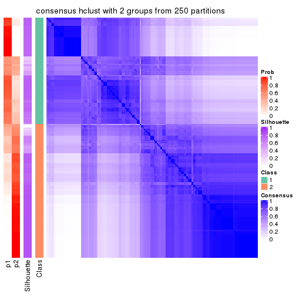</p>

</div>
<div id='tab-SD-hclust-consensus-heatmap-2'>
<pre><code class="r">consensus_heatmap(res, k = 3)
</code></pre>

<p>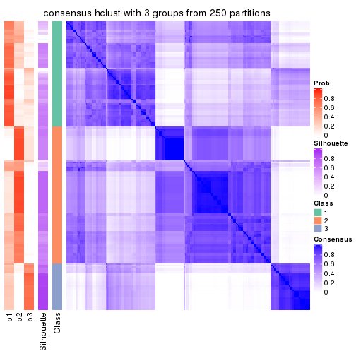</p>

</div>
<div id='tab-SD-hclust-consensus-heatmap-3'>
<pre><code class="r">consensus_heatmap(res, k = 4)
</code></pre>

<p>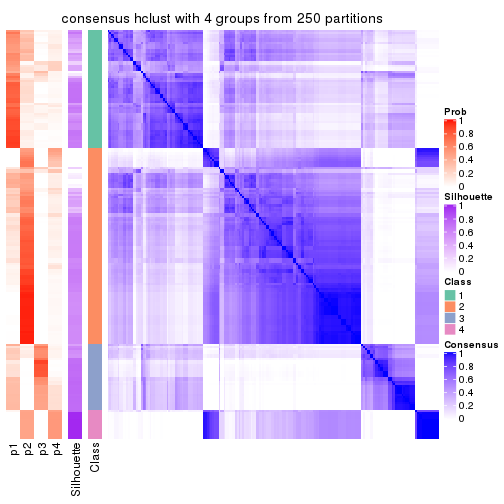</p>

</div>
<div id='tab-SD-hclust-consensus-heatmap-4'>
<pre><code class="r">consensus_heatmap(res, k = 5)
</code></pre>

<p>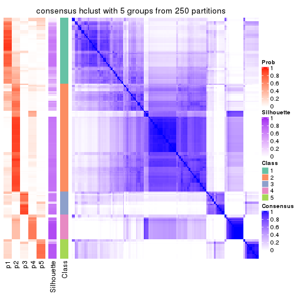</p>

</div>
<div id='tab-SD-hclust-consensus-heatmap-5'>
<pre><code class="r">consensus_heatmap(res, k = 6)
</code></pre>

<p>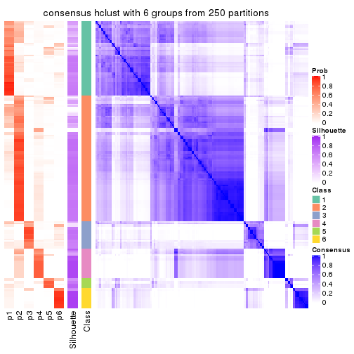</p>

</div>
</div>

Heatmaps for the membership of samples in all partitions to see how consistent they are:


<script>
$( function() {
	$( '#tabs-SD-hclust-membership-heatmap' ).tabs();
} );
</script>
<div id='tabs-SD-hclust-membership-heatmap'>
<ul>
<li><a href='#tab-SD-hclust-membership-heatmap-1'>k = 2</a></li>
<li><a href='#tab-SD-hclust-membership-heatmap-2'>k = 3</a></li>
<li><a href='#tab-SD-hclust-membership-heatmap-3'>k = 4</a></li>
<li><a href='#tab-SD-hclust-membership-heatmap-4'>k = 5</a></li>
<li><a href='#tab-SD-hclust-membership-heatmap-5'>k = 6</a></li>
</ul>
<div id='tab-SD-hclust-membership-heatmap-1'>
<pre><code class="r">membership_heatmap(res, k = 2)
</code></pre>

<p>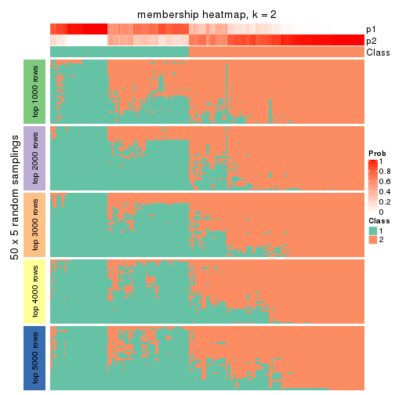</p>

</div>
<div id='tab-SD-hclust-membership-heatmap-2'>
<pre><code class="r">membership_heatmap(res, k = 3)
</code></pre>

<p>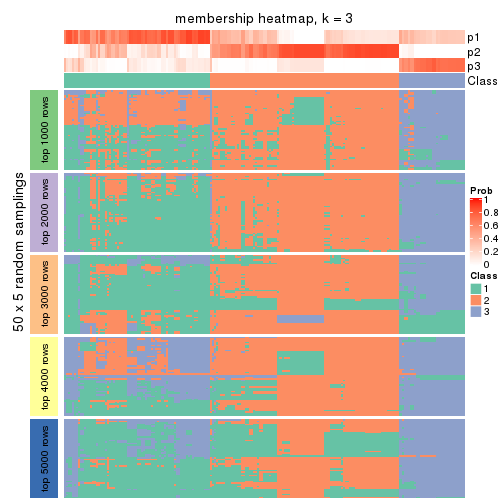</p>

</div>
<div id='tab-SD-hclust-membership-heatmap-3'>
<pre><code class="r">membership_heatmap(res, k = 4)
</code></pre>

<p>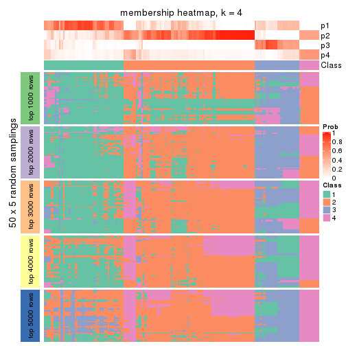</p>

</div>
<div id='tab-SD-hclust-membership-heatmap-4'>
<pre><code class="r">membership_heatmap(res, k = 5)
</code></pre>

<p>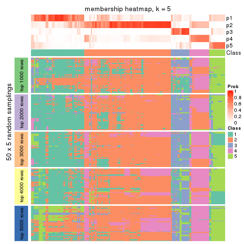</p>

</div>
<div id='tab-SD-hclust-membership-heatmap-5'>
<pre><code class="r">membership_heatmap(res, k = 6)
</code></pre>

<p>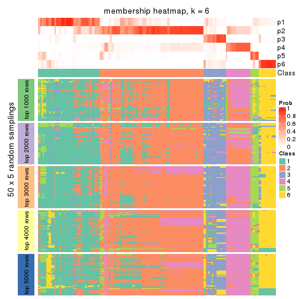</p>

</div>
</div>

As soon as we have had the classes for columns, we can look for signatures
which are significantly different between classes which can be candidate marks
for certain classes. Following are the heatmaps for signatures.


Signature heatmaps where rows are scaled:


<script>
$( function() {
	$( '#tabs-SD-hclust-get-signatures' ).tabs();
} );
</script>
<div id='tabs-SD-hclust-get-signatures'>
<ul>
<li><a href='#tab-SD-hclust-get-signatures-1'>k = 2</a></li>
<li><a href='#tab-SD-hclust-get-signatures-2'>k = 3</a></li>
<li><a href='#tab-SD-hclust-get-signatures-3'>k = 4</a></li>
<li><a href='#tab-SD-hclust-get-signatures-4'>k = 5</a></li>
<li><a href='#tab-SD-hclust-get-signatures-5'>k = 6</a></li>
</ul>
<div id='tab-SD-hclust-get-signatures-1'>
<pre><code class="r">get_signatures(res, k = 2)
</code></pre>

<p>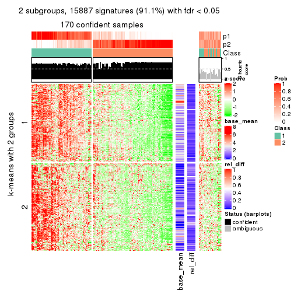</p>

</div>
<div id='tab-SD-hclust-get-signatures-2'>
<pre><code class="r">get_signatures(res, k = 3)
</code></pre>

<p>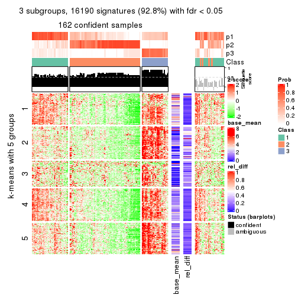</p>

</div>
<div id='tab-SD-hclust-get-signatures-3'>
<pre><code class="r">get_signatures(res, k = 4)
</code></pre>

<p>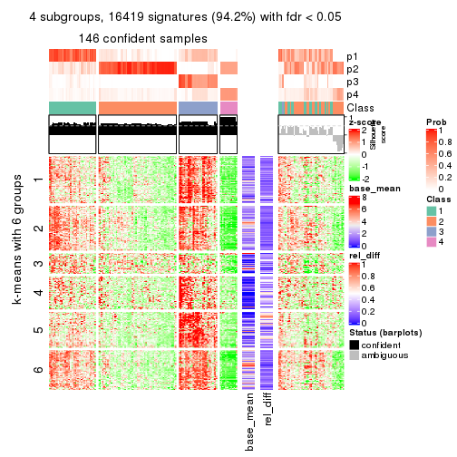</p>

</div>
<div id='tab-SD-hclust-get-signatures-4'>
<pre><code class="r">get_signatures(res, k = 5)
</code></pre>

<p>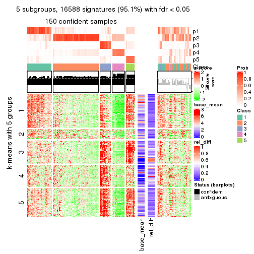</p>

</div>
<div id='tab-SD-hclust-get-signatures-5'>
<pre><code class="r">get_signatures(res, k = 6)
</code></pre>

<p>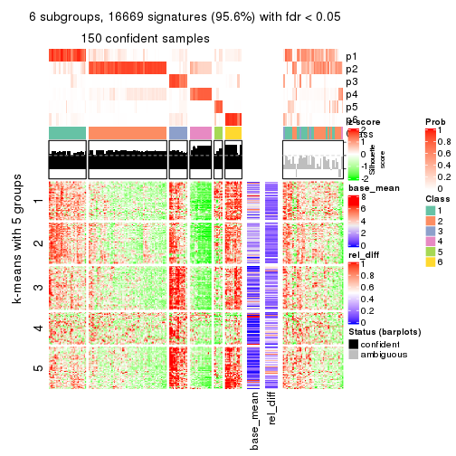</p>

</div>
</div>


Signature heatmaps where rows are not scaled:


<script>
$( function() {
	$( '#tabs-SD-hclust-get-signatures-no-scale' ).tabs();
} );
</script>
<div id='tabs-SD-hclust-get-signatures-no-scale'>
<ul>
<li><a href='#tab-SD-hclust-get-signatures-no-scale-1'>k = 2</a></li>
<li><a href='#tab-SD-hclust-get-signatures-no-scale-2'>k = 3</a></li>
<li><a href='#tab-SD-hclust-get-signatures-no-scale-3'>k = 4</a></li>
<li><a href='#tab-SD-hclust-get-signatures-no-scale-4'>k = 5</a></li>
<li><a href='#tab-SD-hclust-get-signatures-no-scale-5'>k = 6</a></li>
</ul>
<div id='tab-SD-hclust-get-signatures-no-scale-1'>
<pre><code class="r">get_signatures(res, k = 2, scale_rows = FALSE)
</code></pre>

<p>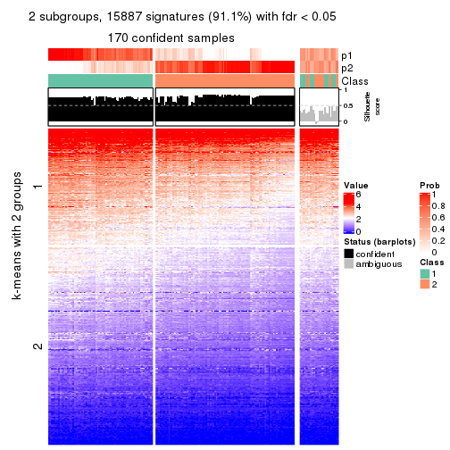</p>

</div>
<div id='tab-SD-hclust-get-signatures-no-scale-2'>
<pre><code class="r">get_signatures(res, k = 3, scale_rows = FALSE)
</code></pre>

<p>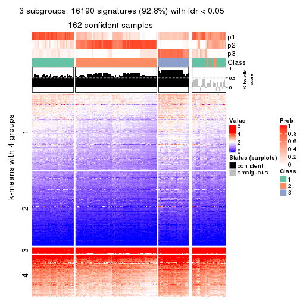</p>

</div>
<div id='tab-SD-hclust-get-signatures-no-scale-3'>
<pre><code class="r">get_signatures(res, k = 4, scale_rows = FALSE)
</code></pre>

<p>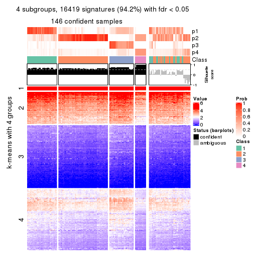</p>

</div>
<div id='tab-SD-hclust-get-signatures-no-scale-4'>
<pre><code class="r">get_signatures(res, k = 5, scale_rows = FALSE)
</code></pre>

<p>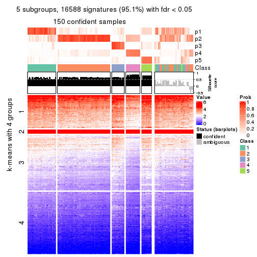</p>

</div>
<div id='tab-SD-hclust-get-signatures-no-scale-5'>
<pre><code class="r">get_signatures(res, k = 6, scale_rows = FALSE)
</code></pre>

<p>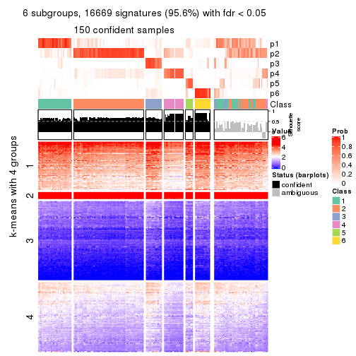</p>

</div>
</div>


Compare the overlap of signatures from different k:

```r
compare_signatures(res)
```

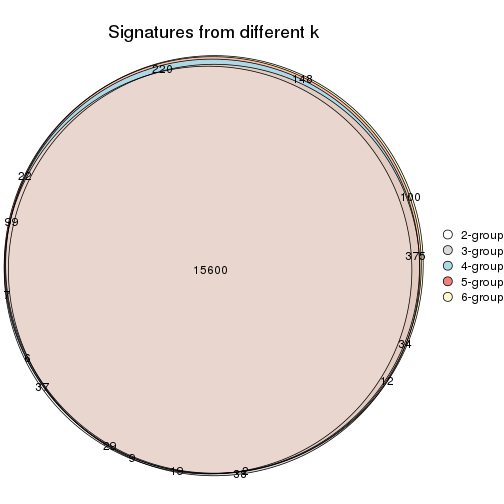

`get_signature()` returns a data frame invisibly. TO get the list of signatures, the function
call should be assigned to a variable explicitly. In following code, if `plot` argument is set
to `FALSE`, no heatmap is plotted while only the differential analysis is performed.

```r
# code only for demonstration
tb = get_signature(res, k = ..., plot = FALSE)
```

An example of the output of `tb` is:

```
#>   which_row         fdr    mean_1    mean_2 scaled_mean_1 scaled_mean_2 km
#> 1        38 0.042760348  8.373488  9.131774    -0.5533452     0.5164555  1
#> 2        40 0.018707592  7.106213  8.469186    -0.6173731     0.5762149  1
#> 3        55 0.019134737 10.221463 11.207825    -0.6159697     0.5749050  1
#> 4        59 0.006059896  5.921854  7.869574    -0.6899429     0.6439467  1
#> 5        60 0.018055526  8.928898 10.211722    -0.6204761     0.5791110  1
#> 6        98 0.009384629 15.714769 14.887706     0.6635654    -0.6193277  2
...
```

The columns in `tb` are:

1. `which_row`: row indices corresponding to the input matrix.
2. `fdr`: FDR for the differential test. 
3. `mean_x`: The mean value in group x.
4. `scaled_mean_x`: The mean value in group x after rows are scaled.
5. `km`: Row groups if k-means clustering is applied to rows.


UMAP plot which shows how samples are separated.


<script>
$( function() {
	$( '#tabs-SD-hclust-dimension-reduction' ).tabs();
} );
</script>
<div id='tabs-SD-hclust-dimension-reduction'>
<ul>
<li><a href='#tab-SD-hclust-dimension-reduction-1'>k = 2</a></li>
<li><a href='#tab-SD-hclust-dimension-reduction-2'>k = 3</a></li>
<li><a href='#tab-SD-hclust-dimension-reduction-3'>k = 4</a></li>
<li><a href='#tab-SD-hclust-dimension-reduction-4'>k = 5</a></li>
<li><a href='#tab-SD-hclust-dimension-reduction-5'>k = 6</a></li>
</ul>
<div id='tab-SD-hclust-dimension-reduction-1'>
<pre><code class="r">dimension_reduction(res, k = 2, method = &quot;UMAP&quot;)
</code></pre>

<p>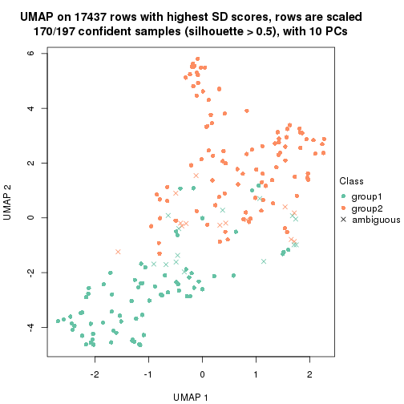</p>

</div>
<div id='tab-SD-hclust-dimension-reduction-2'>
<pre><code class="r">dimension_reduction(res, k = 3, method = &quot;UMAP&quot;)
</code></pre>

<p>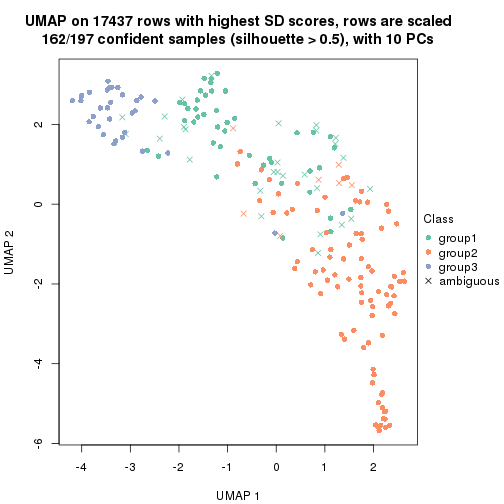</p>

</div>
<div id='tab-SD-hclust-dimension-reduction-3'>
<pre><code class="r">dimension_reduction(res, k = 4, method = &quot;UMAP&quot;)
</code></pre>

<p>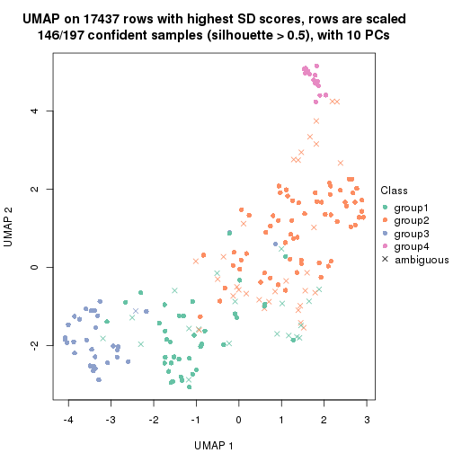</p>

</div>
<div id='tab-SD-hclust-dimension-reduction-4'>
<pre><code class="r">dimension_reduction(res, k = 5, method = &quot;UMAP&quot;)
</code></pre>

<p>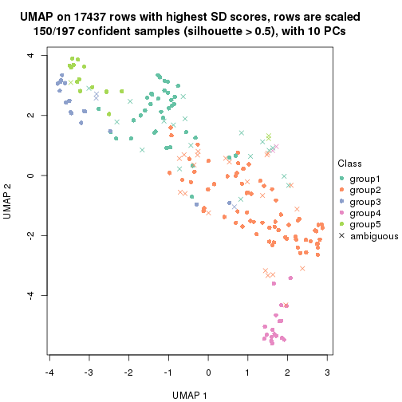</p>

</div>
<div id='tab-SD-hclust-dimension-reduction-5'>
<pre><code class="r">dimension_reduction(res, k = 6, method = &quot;UMAP&quot;)
</code></pre>

<p>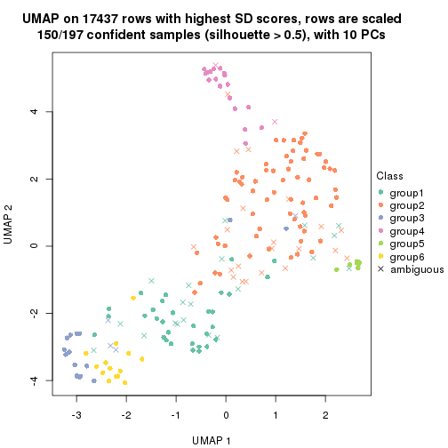</p>

</div>
</div>


Following heatmap shows how subgroups are split when increasing `k`:

```r
collect_classes(res)
```

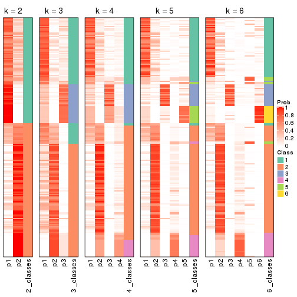


If matrix rows can be associated to genes, consider to use `GO_Enrichment(res,
...)` to perform function enrichment for the signature genes.


 

---------------------------------------------------


### SD:kmeans


The object with results only for a single top-value method and a single partition method 
can be extracted as:

```r
res = res_list["SD", "kmeans"]
# you can also extract it by
# res = res_list["SD:kmeans"]
```

A summary of `res` and all the functions that can be applied to it:

```r
res
```

```
#> A 'ConsensusPartition' object with k = 2, 3, 4, 5, 6.
#>   On a matrix with 17437 rows and 197 columns.
#>   Top rows (1000, 2000, 3000, 4000, 5000) are extracted by 'SD' method.
#>   Subgroups are detected by 'kmeans' method.
#>   Performed in total 1250 partitions by row resampling.
#>   Best k for subgroups seems to be 2.
#> 
#> Following methods can be applied to this 'ConsensusPartition' object:
#>  [1] "cola_report"             "collect_classes"         "collect_plots"          
#>  [4] "collect_stats"           "colnames"                "compare_signatures"     
#>  [7] "consensus_heatmap"       "dimension_reduction"     "functional_enrichment"  
#> [10] "get_anno_col"            "get_anno"                "get_classes"            
#> [13] "get_consensus"           "get_matrix"              "get_membership"         
#> [16] "get_param"               "get_signatures"          "get_stats"              
#> [19] "is_best_k"               "is_stable_k"             "membership_heatmap"     
#> [22] "ncol"                    "nrow"                    "plot_ecdf"              
#> [25] "rownames"                "select_partition_number" "show"                   
#> [28] "suggest_best_k"          "test_to_known_factors"
```

`collect_plots()` function collects all the plots made from `res` for all `k` (number of partitions)
into one single page to provide an easy and fast comparison between different `k`.

```r
collect_plots(res)
```

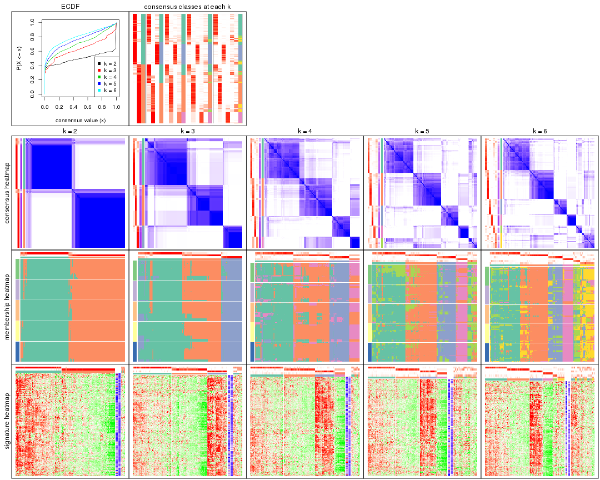

The plots are:

- The first row: a plot of the ECDF (Empirical cumulative distribution
  function) curves of the consensus matrix for each `k` and the heatmap of
  predicted classes for each `k`.
- The second row: heatmaps of the consensus matrix for each `k`.
- The third row: heatmaps of the membership matrix for each `k`.
- The fouth row: heatmaps of the signatures for each `k`.

All the plots in panels can be made by individual functions and they are
plotted later in this section.

`select_partition_number()` produces several plots showing different
statistics for choosing "optimized" `k`. There are following statistics:

- ECDF curves of the consensus matrix for each `k`;
- 1-PAC. [The PAC
  score](https://en.wikipedia.org/wiki/Consensus_clustering#Over-interpretation_potential_of_consensus_clustering)
  measures the proportion of the ambiguous subgrouping.
- Mean silhouette score.
- Concordance. The mean probability of fiting the consensus class ids in all
  partitions.
- Area increased. Denote $A_k$ as the area under the ECDF curve for current
  `k`, the area increased is defined as $A_k - A_{k-1}$.
- Rand index. The percent of pairs of samples that are both in a same cluster
  or both are not in a same cluster in the partition of k and k-1.
- Jaccard index. The ratio of pairs of samples are both in a same cluster in
  the partition of k and k-1 and the pairs of samples are both in a same
  cluster in the partition k or k-1.

The detailed explanations of these statistics can be found in [the cola
vignette](http://bioconductor.org/packages/devel/bioc/vignettes/cola/inst/doc/cola.html#toc_13).

Generally speaking, lower PAC score, higher mean silhouette score or higher
concordance corresponds to better partition. Rand index and Jaccard index
measure how similar the current partition is compared to partition with `k-1`.
If they are too similar, we won't accept `k` is better than `k-1`.

```r
select_partition_number(res)
```

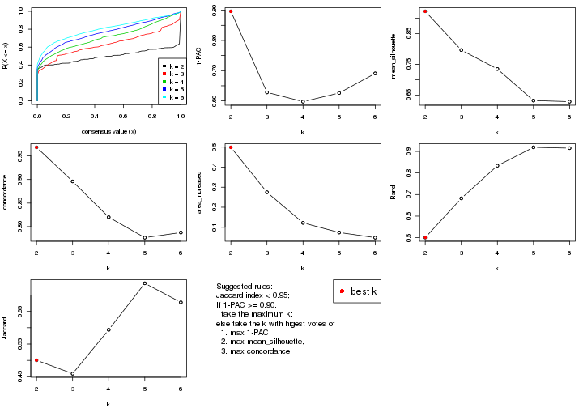

The numeric values for all these statistics can be obtained by `get_stats()`.

```r
get_stats(res)
```

```
#>   k 1-PAC mean_silhouette concordance area_increased  Rand Jaccard
#> 2 2 0.896           0.922       0.968         0.4989 0.500   0.500
#> 3 3 0.628           0.796       0.896         0.2747 0.682   0.459
#> 4 4 0.598           0.735       0.820         0.1220 0.834   0.594
#> 5 5 0.626           0.632       0.777         0.0740 0.919   0.736
#> 6 6 0.691           0.629       0.787         0.0483 0.915   0.678
```

`suggest_best_k()` suggests the best $k$ based on these statistics. The rules are as follows:

- All $k$ with Jaccard index larger than 0.95 are removed because the increase of
  the partition number does not provides enough extra information. If all $k$ are removed,
  the best $k$ is assigned by `NA`.
- For $k$ with 1-PAC larger than 0.9, the maximal $k$ is taken as the "best k". Other $k$ is called "optional k".
- If it does not fit the second rule. The $k$ with the highest vote of highest
  1-PAC, mean silhouette and concordance is taken as the "best k".

```r
suggest_best_k(res)
```

```
#> [1] 2
```


Following shows the table of the partitions (You need to click the **show/hide
code output** link to see it). The membership matrix (columns with name `p*`)
is inferred by
[`clue::cl_consensus()`](https://www.rdocumentation.org/link/cl_consensus?package=clue)
function with the `SE` method. Basically the value in the membership matrix
represents the probability to belong to a certain group. The finall class
label for an item is determined with the group with highest probability it
belongs to.

In `get_classes()` function, the entropy is calculated from the membership
matrix and the silhouette score is calculated from the consensus matrix.


<script>
$( function() {
	$( '#tabs-SD-kmeans-get-classes' ).tabs();
} );
</script>
<div id='tabs-SD-kmeans-get-classes'>
<ul>
<li><a href='#tab-SD-kmeans-get-classes-1'>k = 2</a></li>
<li><a href='#tab-SD-kmeans-get-classes-2'>k = 3</a></li>
<li><a href='#tab-SD-kmeans-get-classes-3'>k = 4</a></li>
<li><a href='#tab-SD-kmeans-get-classes-4'>k = 5</a></li>
<li><a href='#tab-SD-kmeans-get-classes-5'>k = 6</a></li>
</ul>

<div id='tab-SD-kmeans-get-classes-1'>
<p><a id='tab-SD-kmeans-get-classes-1-a' style='color:#0366d6' href='#'>show/hide code output</a></p>
<pre><code class="r">cbind(get_classes(res, k = 2), get_membership(res, k = 2))
</code></pre>

<pre><code>#&gt;            class entropy silhouette    p1    p2
#&gt; SRR1380886     1  0.0000     0.9620 1.000 0.000
#&gt; SRR1074385     1  0.0000     0.9620 1.000 0.000
#&gt; SRR1374739     1  0.0000     0.9620 1.000 0.000
#&gt; SRR1097883     1  0.0000     0.9620 1.000 0.000
#&gt; SRR2167209     2  0.5629     0.8351 0.132 0.868
#&gt; SRR816541      2  0.0000     0.9701 0.000 1.000
#&gt; SRR663645      2  0.0000     0.9701 0.000 1.000
#&gt; SRR1381505     2  0.0000     0.9701 0.000 1.000
#&gt; SRR1416362     2  0.0000     0.9701 0.000 1.000
#&gt; SRR1318503     2  0.0000     0.9701 0.000 1.000
#&gt; SRR1341626     2  0.0000     0.9701 0.000 1.000
#&gt; SRR1382440     1  0.0000     0.9620 1.000 0.000
#&gt; SRR1088413     1  0.0000     0.9620 1.000 0.000
#&gt; SRR1082080     2  0.0000     0.9701 0.000 1.000
#&gt; SRR1455783     1  0.0000     0.9620 1.000 0.000
#&gt; SRR1447760     2  0.0000     0.9701 0.000 1.000
#&gt; SRR1487784     2  0.0000     0.9701 0.000 1.000
#&gt; SRR1331037     2  0.0000     0.9701 0.000 1.000
#&gt; SRR1095651     1  0.0000     0.9620 1.000 0.000
#&gt; SRR1078066     1  0.0000     0.9620 1.000 0.000
#&gt; SRR1120363     1  0.0000     0.9620 1.000 0.000
#&gt; SRR821231      1  0.0000     0.9620 1.000 0.000
#&gt; SRR1374373     2  0.0000     0.9701 0.000 1.000
#&gt; SRR1324519     2  0.0000     0.9701 0.000 1.000
#&gt; SRR1431121     1  0.0000     0.9620 1.000 0.000
#&gt; SRR1091032     2  0.0000     0.9701 0.000 1.000
#&gt; SRR1365575     2  0.0000     0.9701 0.000 1.000
#&gt; SRR1072972     1  0.0000     0.9620 1.000 0.000
#&gt; SRR1310690     2  0.0000     0.9701 0.000 1.000
#&gt; SRR1383037     1  0.0000     0.9620 1.000 0.000
#&gt; SRR1095479     1  0.0000     0.9620 1.000 0.000
#&gt; SRR1070403     1  0.0000     0.9620 1.000 0.000
#&gt; SRR1390203     1  0.0000     0.9620 1.000 0.000
#&gt; SRR1072007     2  0.0000     0.9701 0.000 1.000
#&gt; SRR1468787     2  0.9988     0.0734 0.480 0.520
#&gt; SRR1347959     2  0.0000     0.9701 0.000 1.000
#&gt; SRR1338513     1  0.0000     0.9620 1.000 0.000
#&gt; SRR812598      2  0.0000     0.9701 0.000 1.000
#&gt; SRR1446806     2  0.8763     0.5759 0.296 0.704
#&gt; SRR1394275     1  0.0000     0.9620 1.000 0.000
#&gt; SRR1443633     1  0.0000     0.9620 1.000 0.000
#&gt; SRR1087728     1  0.0000     0.9620 1.000 0.000
#&gt; SRR1098192     2  0.0000     0.9701 0.000 1.000
#&gt; SRR1093340     2  0.0000     0.9701 0.000 1.000
#&gt; SRR665405      2  0.0000     0.9701 0.000 1.000
#&gt; SRR657077      2  0.0000     0.9701 0.000 1.000
#&gt; SRR813208      1  0.0000     0.9620 1.000 0.000
#&gt; SRR1416074     2  0.0000     0.9701 0.000 1.000
#&gt; SRR1089688     2  0.0000     0.9701 0.000 1.000
#&gt; SRR1353461     1  0.0000     0.9620 1.000 0.000
#&gt; SRR1466321     2  0.2423     0.9360 0.040 0.960
#&gt; SRR1073021     1  0.0000     0.9620 1.000 0.000
#&gt; SRR1322816     2  0.0000     0.9701 0.000 1.000
#&gt; SRR1457727     1  0.0000     0.9620 1.000 0.000
#&gt; SRR1464226     2  0.0000     0.9701 0.000 1.000
#&gt; SRR1398863     1  0.0000     0.9620 1.000 0.000
#&gt; SRR1455631     2  0.0000     0.9701 0.000 1.000
#&gt; SRR1307808     2  0.0000     0.9701 0.000 1.000
#&gt; SRR1374585     2  0.0000     0.9701 0.000 1.000
#&gt; SRR1072104     2  0.0000     0.9701 0.000 1.000
#&gt; SRR1076868     2  0.0000     0.9701 0.000 1.000
#&gt; SRR1335984     2  0.0672     0.9638 0.008 0.992
#&gt; SRR1445939     1  0.6148     0.8099 0.848 0.152
#&gt; SRR1453047     2  0.0000     0.9701 0.000 1.000
#&gt; SRR1339788     1  0.0000     0.9620 1.000 0.000
#&gt; SRR1084323     1  0.0000     0.9620 1.000 0.000
#&gt; SRR1092937     1  0.0376     0.9587 0.996 0.004
#&gt; SRR1074090     2  0.0000     0.9701 0.000 1.000
#&gt; SRR1099833     1  0.2236     0.9313 0.964 0.036
#&gt; SRR1093434     1  0.0000     0.9620 1.000 0.000
#&gt; SRR1435857     1  0.0000     0.9620 1.000 0.000
#&gt; SRR1480347     2  0.0000     0.9701 0.000 1.000
#&gt; SRR1440787     2  0.0000     0.9701 0.000 1.000
#&gt; SRR1430202     2  0.2603     0.9322 0.044 0.956
#&gt; SRR1322730     2  0.0000     0.9701 0.000 1.000
#&gt; SRR811029      2  0.0000     0.9701 0.000 1.000
#&gt; SRR1390456     1  0.0000     0.9620 1.000 0.000
#&gt; SRR1381140     1  0.0000     0.9620 1.000 0.000
#&gt; SRR1388064     2  0.0000     0.9701 0.000 1.000
#&gt; SRR1093577     1  0.0000     0.9620 1.000 0.000
#&gt; SRR1414161     1  0.9710     0.3542 0.600 0.400
#&gt; SRR1328738     2  0.9970     0.1189 0.468 0.532
#&gt; SRR1311752     2  0.0000     0.9701 0.000 1.000
#&gt; SRR1445960     2  0.0000     0.9701 0.000 1.000
#&gt; SRR1403412     2  0.0000     0.9701 0.000 1.000
#&gt; SRR2166748     1  0.0000     0.9620 1.000 0.000
#&gt; SRR821666      2  0.0000     0.9701 0.000 1.000
#&gt; SRR1330746     1  0.0000     0.9620 1.000 0.000
#&gt; SRR1327872     2  0.0000     0.9701 0.000 1.000
#&gt; SRR1100800     1  0.0000     0.9620 1.000 0.000
#&gt; SRR1075174     1  0.0000     0.9620 1.000 0.000
#&gt; SRR1434436     2  0.8661     0.5921 0.288 0.712
#&gt; SRR1389409     2  0.0000     0.9701 0.000 1.000
#&gt; SRR1085310     1  0.0000     0.9620 1.000 0.000
#&gt; SRR1376718     2  0.0000     0.9701 0.000 1.000
#&gt; SRR808590      2  0.0000     0.9701 0.000 1.000
#&gt; SRR1084128     2  0.0000     0.9701 0.000 1.000
#&gt; SRR1361692     1  0.9000     0.5536 0.684 0.316
#&gt; SRR1431493     1  0.0000     0.9620 1.000 0.000
#&gt; SRR1409084     1  0.0000     0.9620 1.000 0.000
#&gt; SRR2166214     2  0.0000     0.9701 0.000 1.000
#&gt; SRR1324102     2  0.0000     0.9701 0.000 1.000
#&gt; SRR1079754     2  0.0000     0.9701 0.000 1.000
#&gt; SRR1442127     1  0.0000     0.9620 1.000 0.000
#&gt; SRR1076244     2  0.0000     0.9701 0.000 1.000
#&gt; SRR1330901     2  0.0000     0.9701 0.000 1.000
#&gt; SRR1073167     2  0.0000     0.9701 0.000 1.000
#&gt; SRR1357541     1  0.0000     0.9620 1.000 0.000
#&gt; SRR811607      2  0.3114     0.9207 0.056 0.944
#&gt; SRR1468931     1  0.0000     0.9620 1.000 0.000
#&gt; SRR1474908     2  0.0000     0.9701 0.000 1.000
#&gt; SRR1309875     2  0.0000     0.9701 0.000 1.000
#&gt; SRR598792      1  0.0000     0.9620 1.000 0.000
#&gt; SRR1088537     2  0.0000     0.9701 0.000 1.000
#&gt; SRR1457682     1  0.0000     0.9620 1.000 0.000
#&gt; SRR1454289     2  0.2423     0.9351 0.040 0.960
#&gt; SRR1069352     1  0.0000     0.9620 1.000 0.000
#&gt; SRR1472728     2  0.0000     0.9701 0.000 1.000
#&gt; SRR1091144     2  0.0000     0.9701 0.000 1.000
#&gt; SRR1319118     1  0.0000     0.9620 1.000 0.000
#&gt; SRR1403611     1  0.5294     0.8494 0.880 0.120
#&gt; SRR1397762     1  0.0000     0.9620 1.000 0.000
#&gt; SRR1317387     1  0.0000     0.9620 1.000 0.000
#&gt; SRR1376426     2  0.0000     0.9701 0.000 1.000
#&gt; SRR1097777     1  0.0000     0.9620 1.000 0.000
#&gt; SRR1365743     1  0.0000     0.9620 1.000 0.000
#&gt; SRR1458992     2  0.0000     0.9701 0.000 1.000
#&gt; SRR1089537     1  0.9635     0.3863 0.612 0.388
#&gt; SRR1397744     1  0.0000     0.9620 1.000 0.000
#&gt; SRR1453893     2  0.0000     0.9701 0.000 1.000
#&gt; SRR1098543     1  0.0000     0.9620 1.000 0.000
#&gt; SRR1321765     1  0.0000     0.9620 1.000 0.000
#&gt; SRR1440032     1  0.7745     0.7083 0.772 0.228
#&gt; SRR1404507     2  0.0000     0.9701 0.000 1.000
#&gt; SRR1404856     2  0.1414     0.9539 0.020 0.980
#&gt; SRR812745      1  0.8499     0.6361 0.724 0.276
#&gt; SRR1417524     1  0.0000     0.9620 1.000 0.000
#&gt; SRR1407334     2  0.0000     0.9701 0.000 1.000
#&gt; SRR1453991     1  0.0000     0.9620 1.000 0.000
#&gt; SRR1415938     1  0.0000     0.9620 1.000 0.000
#&gt; SRR1081259     2  0.9833     0.2472 0.424 0.576
#&gt; SRR1436187     2  0.0000     0.9701 0.000 1.000
#&gt; SRR1431948     1  0.0000     0.9620 1.000 0.000
#&gt; SRR1453277     2  0.2778     0.9285 0.048 0.952
#&gt; SRR1095407     2  0.9393     0.4486 0.356 0.644
#&gt; SRR1359694     2  0.0000     0.9701 0.000 1.000
#&gt; SRR656982      2  0.1414     0.9539 0.020 0.980
#&gt; SRR1354338     2  0.0000     0.9701 0.000 1.000
#&gt; SRR1088291     1  0.9686     0.3466 0.604 0.396
#&gt; SRR1080624     1  0.0000     0.9620 1.000 0.000
#&gt; SRR2166708     1  0.0000     0.9620 1.000 0.000
#&gt; SRR1393572     1  0.0000     0.9620 1.000 0.000
#&gt; SRR1429912     2  0.0000     0.9701 0.000 1.000
#&gt; SRR1421048     2  0.0000     0.9701 0.000 1.000
#&gt; SRR1434999     1  0.0000     0.9620 1.000 0.000
#&gt; SRR656457      1  0.0000     0.9620 1.000 0.000
#&gt; SRR1098928     1  0.0000     0.9620 1.000 0.000
#&gt; SRR1343967     2  0.0000     0.9701 0.000 1.000
#&gt; SRR1360766     1  0.6438     0.7926 0.836 0.164
#&gt; SRR1464724     2  0.0000     0.9701 0.000 1.000
#&gt; SRR1101542     2  0.0000     0.9701 0.000 1.000
#&gt; SRR1401528     1  0.0000     0.9620 1.000 0.000
#&gt; SRR1071519     1  0.0000     0.9620 1.000 0.000
#&gt; SRR1086070     1  0.0000     0.9620 1.000 0.000
#&gt; SRR1358645     2  0.0000     0.9701 0.000 1.000
#&gt; SRR819771      1  0.0000     0.9620 1.000 0.000
#&gt; SRR1418433     2  0.0000     0.9701 0.000 1.000
#&gt; SRR821050      1  0.0000     0.9620 1.000 0.000
#&gt; SRR1402091     2  0.0000     0.9701 0.000 1.000
#&gt; SRR1322028     2  0.0000     0.9701 0.000 1.000
#&gt; SRR1452556     2  0.0000     0.9701 0.000 1.000
#&gt; SRR1340047     2  0.0000     0.9701 0.000 1.000
#&gt; SRR1418302     2  0.0000     0.9701 0.000 1.000
#&gt; SRR1073991     1  0.0000     0.9620 1.000 0.000
#&gt; SRR1085187     2  0.0000     0.9701 0.000 1.000
#&gt; SRR1357618     1  0.0000     0.9620 1.000 0.000
#&gt; SRR1487764     1  0.8813     0.5765 0.700 0.300
#&gt; SRR1075336     1  0.0000     0.9620 1.000 0.000
#&gt; SRR1365471     2  0.0000     0.9701 0.000 1.000
#&gt; SRR1414613     2  0.0000     0.9701 0.000 1.000
#&gt; SRR658719      2  0.0000     0.9701 0.000 1.000
#&gt; SRR1475128     1  0.0000     0.9620 1.000 0.000
#&gt; SRR1367630     2  0.0000     0.9701 0.000 1.000
#&gt; SRR1481146     2  0.0000     0.9701 0.000 1.000
#&gt; SRR1465674     1  0.7815     0.6954 0.768 0.232
#&gt; SRR1327303     2  0.0000     0.9701 0.000 1.000
#&gt; SRR1390391     2  0.1843     0.9462 0.028 0.972
#&gt; SRR1326020     2  0.0000     0.9701 0.000 1.000
#&gt; SRR1381953     1  0.0000     0.9620 1.000 0.000
#&gt; SRR1082544     2  0.0000     0.9701 0.000 1.000
#&gt; SRR810761      1  0.0000     0.9620 1.000 0.000
#&gt; SRR1070764     1  0.0000     0.9620 1.000 0.000
#&gt; SRR1415919     1  0.0000     0.9620 1.000 0.000
#&gt; SRR1490404     2  0.0000     0.9701 0.000 1.000
#&gt; SRR1416773     1  0.8016     0.6760 0.756 0.244
#&gt; SRR1377492     2  0.0000     0.9701 0.000 1.000
#&gt; SRR1334314     2  0.7950     0.6789 0.240 0.760
</code></pre>

<script>
$('#tab-SD-kmeans-get-classes-1-a').parent().next().next().hide();
$('#tab-SD-kmeans-get-classes-1-a').click(function(){
  $('#tab-SD-kmeans-get-classes-1-a').parent().next().next().toggle();
  return(false);
});
</script>
</div>

<div id='tab-SD-kmeans-get-classes-2'>
<p><a id='tab-SD-kmeans-get-classes-2-a' style='color:#0366d6' href='#'>show/hide code output</a></p>
<pre><code class="r">cbind(get_classes(res, k = 3), get_membership(res, k = 3))
</code></pre>

<pre><code>#&gt;            class entropy silhouette    p1    p2    p3
#&gt; SRR1380886     3  0.0237      0.950 0.004 0.000 0.996
#&gt; SRR1074385     1  0.0747      0.870 0.984 0.000 0.016
#&gt; SRR1374739     3  0.0237      0.950 0.004 0.000 0.996
#&gt; SRR1097883     1  0.5560      0.563 0.700 0.000 0.300
#&gt; SRR2167209     1  0.0237      0.874 0.996 0.000 0.004
#&gt; SRR816541      2  0.3551      0.882 0.132 0.868 0.000
#&gt; SRR663645      2  0.6520      0.231 0.488 0.508 0.004
#&gt; SRR1381505     2  0.0000      0.854 0.000 1.000 0.000
#&gt; SRR1416362     2  0.3551      0.882 0.132 0.868 0.000
#&gt; SRR1318503     1  0.0237      0.874 0.996 0.004 0.000
#&gt; SRR1341626     2  0.3551      0.882 0.132 0.868 0.000
#&gt; SRR1382440     3  0.0237      0.950 0.004 0.000 0.996
#&gt; SRR1088413     1  0.5988      0.435 0.632 0.000 0.368
#&gt; SRR1082080     2  0.3192      0.881 0.112 0.888 0.000
#&gt; SRR1455783     1  0.2066      0.842 0.940 0.000 0.060
#&gt; SRR1447760     1  0.0237      0.874 0.996 0.004 0.000
#&gt; SRR1487784     2  0.3686      0.878 0.140 0.860 0.000
#&gt; SRR1331037     2  0.6008      0.627 0.372 0.628 0.000
#&gt; SRR1095651     3  0.1753      0.921 0.048 0.000 0.952
#&gt; SRR1078066     1  0.4750      0.693 0.784 0.000 0.216
#&gt; SRR1120363     1  0.1529      0.859 0.960 0.000 0.040
#&gt; SRR821231      3  0.2448      0.900 0.076 0.000 0.924
#&gt; SRR1374373     1  0.0237      0.874 0.996 0.004 0.000
#&gt; SRR1324519     2  0.1529      0.865 0.040 0.960 0.000
#&gt; SRR1431121     1  0.5621      0.547 0.692 0.000 0.308
#&gt; SRR1091032     2  0.3619      0.880 0.136 0.864 0.000
#&gt; SRR1365575     2  0.0000      0.854 0.000 1.000 0.000
#&gt; SRR1072972     3  0.4555      0.741 0.200 0.000 0.800
#&gt; SRR1310690     2  0.3551      0.882 0.132 0.868 0.000
#&gt; SRR1383037     3  0.0237      0.950 0.004 0.000 0.996
#&gt; SRR1095479     3  0.2066      0.913 0.060 0.000 0.940
#&gt; SRR1070403     3  0.0237      0.950 0.004 0.000 0.996
#&gt; SRR1390203     1  0.0892      0.868 0.980 0.000 0.020
#&gt; SRR1072007     2  0.5690      0.751 0.288 0.708 0.004
#&gt; SRR1468787     1  0.1031      0.867 0.976 0.000 0.024
#&gt; SRR1347959     1  0.6291     -0.197 0.532 0.468 0.000
#&gt; SRR1338513     1  0.3918      0.789 0.856 0.004 0.140
#&gt; SRR812598      2  0.0000      0.854 0.000 1.000 0.000
#&gt; SRR1446806     1  0.0000      0.875 1.000 0.000 0.000
#&gt; SRR1394275     1  0.0000      0.875 1.000 0.000 0.000
#&gt; SRR1443633     1  0.6215      0.318 0.572 0.000 0.428
#&gt; SRR1087728     3  0.0237      0.950 0.004 0.000 0.996
#&gt; SRR1098192     2  0.3551      0.882 0.132 0.868 0.000
#&gt; SRR1093340     2  0.3551      0.882 0.132 0.868 0.000
#&gt; SRR665405      1  0.6505     -0.100 0.528 0.468 0.004
#&gt; SRR657077      1  0.6291     -0.197 0.532 0.468 0.000
#&gt; SRR813208      3  0.0237      0.950 0.004 0.000 0.996
#&gt; SRR1416074     2  0.3551      0.882 0.132 0.868 0.000
#&gt; SRR1089688     2  0.2096      0.871 0.052 0.944 0.004
#&gt; SRR1353461     3  0.0237      0.950 0.004 0.000 0.996
#&gt; SRR1466321     1  0.0000      0.875 1.000 0.000 0.000
#&gt; SRR1073021     1  0.1643      0.856 0.956 0.000 0.044
#&gt; SRR1322816     2  0.3551      0.882 0.132 0.868 0.000
#&gt; SRR1457727     1  0.6062      0.384 0.616 0.000 0.384
#&gt; SRR1464226     2  0.5656      0.755 0.284 0.712 0.004
#&gt; SRR1398863     1  0.2959      0.807 0.900 0.000 0.100
#&gt; SRR1455631     2  0.6521      0.216 0.492 0.504 0.004
#&gt; SRR1307808     1  0.0237      0.874 0.996 0.004 0.000
#&gt; SRR1374585     2  0.0000      0.854 0.000 1.000 0.000
#&gt; SRR1072104     2  0.4521      0.835 0.180 0.816 0.004
#&gt; SRR1076868     2  0.3551      0.882 0.132 0.868 0.000
#&gt; SRR1335984     1  0.3349      0.767 0.888 0.108 0.004
#&gt; SRR1445939     1  0.0000      0.875 1.000 0.000 0.000
#&gt; SRR1453047     2  0.3551      0.882 0.132 0.868 0.000
#&gt; SRR1339788     3  0.0237      0.950 0.004 0.000 0.996
#&gt; SRR1084323     1  0.0747      0.870 0.984 0.000 0.016
#&gt; SRR1092937     1  0.0000      0.875 1.000 0.000 0.000
#&gt; SRR1074090     2  0.3551      0.882 0.132 0.868 0.000
#&gt; SRR1099833     3  0.3764      0.886 0.068 0.040 0.892
#&gt; SRR1093434     3  0.0237      0.950 0.004 0.000 0.996
#&gt; SRR1435857     1  0.1031      0.867 0.976 0.000 0.024
#&gt; SRR1480347     2  0.1411      0.863 0.036 0.964 0.000
#&gt; SRR1440787     2  0.0000      0.854 0.000 1.000 0.000
#&gt; SRR1430202     1  0.0000      0.875 1.000 0.000 0.000
#&gt; SRR1322730     2  0.0237      0.853 0.000 0.996 0.004
#&gt; SRR811029      2  0.3619      0.880 0.136 0.864 0.000
#&gt; SRR1390456     3  0.0237      0.950 0.004 0.000 0.996
#&gt; SRR1381140     1  0.0000      0.875 1.000 0.000 0.000
#&gt; SRR1388064     2  0.0000      0.854 0.000 1.000 0.000
#&gt; SRR1093577     1  0.0000      0.875 1.000 0.000 0.000
#&gt; SRR1414161     1  0.0237      0.874 0.996 0.004 0.000
#&gt; SRR1328738     1  0.0000      0.875 1.000 0.000 0.000
#&gt; SRR1311752     2  0.3551      0.882 0.132 0.868 0.000
#&gt; SRR1445960     2  0.3551      0.882 0.132 0.868 0.000
#&gt; SRR1403412     2  0.3551      0.882 0.132 0.868 0.000
#&gt; SRR2166748     1  0.5678      0.534 0.684 0.000 0.316
#&gt; SRR821666      2  0.0000      0.854 0.000 1.000 0.000
#&gt; SRR1330746     3  0.0237      0.950 0.004 0.000 0.996
#&gt; SRR1327872     2  0.0000      0.854 0.000 1.000 0.000
#&gt; SRR1100800     1  0.1411      0.861 0.964 0.000 0.036
#&gt; SRR1075174     1  0.0000      0.875 1.000 0.000 0.000
#&gt; SRR1434436     1  0.0000      0.875 1.000 0.000 0.000
#&gt; SRR1389409     2  0.0000      0.854 0.000 1.000 0.000
#&gt; SRR1085310     3  0.6260      0.169 0.448 0.000 0.552
#&gt; SRR1376718     2  0.0000      0.854 0.000 1.000 0.000
#&gt; SRR808590      2  0.0000      0.854 0.000 1.000 0.000
#&gt; SRR1084128     1  0.6295     -0.212 0.528 0.472 0.000
#&gt; SRR1361692     1  0.0000      0.875 1.000 0.000 0.000
#&gt; SRR1431493     3  0.2796      0.883 0.092 0.000 0.908
#&gt; SRR1409084     1  0.0237      0.874 0.996 0.000 0.004
#&gt; SRR2166214     2  0.6460      0.384 0.440 0.556 0.004
#&gt; SRR1324102     2  0.5363      0.765 0.276 0.724 0.000
#&gt; SRR1079754     2  0.0000      0.854 0.000 1.000 0.000
#&gt; SRR1442127     3  0.0237      0.950 0.004 0.000 0.996
#&gt; SRR1076244     2  0.0237      0.853 0.000 0.996 0.004
#&gt; SRR1330901     1  0.0237      0.874 0.996 0.004 0.000
#&gt; SRR1073167     2  0.3551      0.882 0.132 0.868 0.000
#&gt; SRR1357541     1  0.5650      0.546 0.688 0.000 0.312
#&gt; SRR811607      1  0.0000      0.875 1.000 0.000 0.000
#&gt; SRR1468931     3  0.0237      0.950 0.004 0.000 0.996
#&gt; SRR1474908     2  0.5760      0.675 0.328 0.672 0.000
#&gt; SRR1309875     2  0.3551      0.882 0.132 0.868 0.000
#&gt; SRR598792      3  0.0237      0.950 0.004 0.000 0.996
#&gt; SRR1088537     2  0.5497      0.746 0.292 0.708 0.000
#&gt; SRR1457682     1  0.0000      0.875 1.000 0.000 0.000
#&gt; SRR1454289     1  0.0237      0.874 0.996 0.004 0.000
#&gt; SRR1069352     3  0.0237      0.950 0.004 0.000 0.996
#&gt; SRR1472728     2  0.5497      0.746 0.292 0.708 0.000
#&gt; SRR1091144     2  0.4733      0.821 0.196 0.800 0.004
#&gt; SRR1319118     1  0.6062      0.402 0.616 0.000 0.384
#&gt; SRR1403611     3  0.3690      0.862 0.016 0.100 0.884
#&gt; SRR1397762     1  0.5905      0.441 0.648 0.000 0.352
#&gt; SRR1317387     3  0.0000      0.947 0.000 0.000 1.000
#&gt; SRR1376426     2  0.3551      0.882 0.132 0.868 0.000
#&gt; SRR1097777     1  0.5327      0.600 0.728 0.000 0.272
#&gt; SRR1365743     3  0.2356      0.905 0.072 0.000 0.928
#&gt; SRR1458992     2  0.3686      0.878 0.140 0.860 0.000
#&gt; SRR1089537     1  0.4733      0.684 0.800 0.196 0.004
#&gt; SRR1397744     1  0.3752      0.764 0.856 0.000 0.144
#&gt; SRR1453893     2  0.0000      0.854 0.000 1.000 0.000
#&gt; SRR1098543     1  0.1860      0.847 0.948 0.000 0.052
#&gt; SRR1321765     1  0.1964      0.848 0.944 0.000 0.056
#&gt; SRR1440032     1  0.0237      0.874 0.996 0.000 0.004
#&gt; SRR1404507     2  0.0000      0.854 0.000 1.000 0.000
#&gt; SRR1404856     1  0.0237      0.874 0.996 0.000 0.004
#&gt; SRR812745      1  0.0237      0.874 0.996 0.004 0.000
#&gt; SRR1417524     3  0.0237      0.950 0.004 0.000 0.996
#&gt; SRR1407334     2  0.0000      0.854 0.000 1.000 0.000
#&gt; SRR1453991     1  0.0000      0.875 1.000 0.000 0.000
#&gt; SRR1415938     1  0.5560      0.556 0.700 0.000 0.300
#&gt; SRR1081259     1  0.0237      0.874 0.996 0.000 0.004
#&gt; SRR1436187     2  0.0000      0.854 0.000 1.000 0.000
#&gt; SRR1431948     3  0.0237      0.950 0.004 0.000 0.996
#&gt; SRR1453277     1  0.0237      0.874 0.996 0.000 0.004
#&gt; SRR1095407     1  0.0747      0.872 0.984 0.000 0.016
#&gt; SRR1359694     1  0.0237      0.874 0.996 0.004 0.000
#&gt; SRR656982      1  0.0237      0.874 0.996 0.000 0.004
#&gt; SRR1354338     1  0.5138      0.506 0.748 0.252 0.000
#&gt; SRR1088291     1  0.0000      0.875 1.000 0.000 0.000
#&gt; SRR1080624     1  0.0000      0.875 1.000 0.000 0.000
#&gt; SRR2166708     3  0.0237      0.950 0.004 0.000 0.996
#&gt; SRR1393572     1  0.0000      0.875 1.000 0.000 0.000
#&gt; SRR1429912     2  0.6260      0.460 0.448 0.552 0.000
#&gt; SRR1421048     1  0.0237      0.874 0.996 0.004 0.000
#&gt; SRR1434999     3  0.2959      0.861 0.100 0.000 0.900
#&gt; SRR656457      3  0.0237      0.950 0.004 0.000 0.996
#&gt; SRR1098928     3  0.0237      0.950 0.004 0.000 0.996
#&gt; SRR1343967     2  0.3551      0.882 0.132 0.868 0.000
#&gt; SRR1360766     1  0.1643      0.856 0.956 0.000 0.044
#&gt; SRR1464724     2  0.0237      0.853 0.000 0.996 0.004
#&gt; SRR1101542     2  0.0000      0.854 0.000 1.000 0.000
#&gt; SRR1401528     3  0.1643      0.926 0.044 0.000 0.956
#&gt; SRR1071519     3  0.0237      0.950 0.004 0.000 0.996
#&gt; SRR1086070     1  0.1860      0.847 0.948 0.000 0.052
#&gt; SRR1358645     1  0.0237      0.874 0.996 0.004 0.000
#&gt; SRR819771      3  0.0237      0.950 0.004 0.000 0.996
#&gt; SRR1418433     2  0.0237      0.853 0.000 0.996 0.004
#&gt; SRR821050      1  0.1643      0.856 0.956 0.000 0.044
#&gt; SRR1402091     2  0.3551      0.882 0.132 0.868 0.000
#&gt; SRR1322028     2  0.5465      0.751 0.288 0.712 0.000
#&gt; SRR1452556     2  0.0000      0.854 0.000 1.000 0.000
#&gt; SRR1340047     1  0.0237      0.874 0.996 0.004 0.000
#&gt; SRR1418302     2  0.4555      0.838 0.200 0.800 0.000
#&gt; SRR1073991     3  0.6225      0.186 0.432 0.000 0.568
#&gt; SRR1085187     2  0.0237      0.853 0.000 0.996 0.004
#&gt; SRR1357618     3  0.0237      0.950 0.004 0.000 0.996
#&gt; SRR1487764     1  0.4605      0.727 0.796 0.000 0.204
#&gt; SRR1075336     1  0.0000      0.875 1.000 0.000 0.000
#&gt; SRR1365471     2  0.3551      0.882 0.132 0.868 0.000
#&gt; SRR1414613     2  0.5178      0.787 0.256 0.744 0.000
#&gt; SRR658719      1  0.6244     -0.100 0.560 0.440 0.000
#&gt; SRR1475128     3  0.0237      0.950 0.004 0.000 0.996
#&gt; SRR1367630     2  0.4521      0.835 0.180 0.816 0.004
#&gt; SRR1481146     2  0.5285      0.772 0.244 0.752 0.004
#&gt; SRR1465674     1  0.1643      0.856 0.956 0.000 0.044
#&gt; SRR1327303     1  0.0237      0.874 0.996 0.004 0.000
#&gt; SRR1390391     1  0.0592      0.869 0.988 0.012 0.000
#&gt; SRR1326020     2  0.6460      0.477 0.440 0.556 0.004
#&gt; SRR1381953     1  0.5785      0.525 0.668 0.000 0.332
#&gt; SRR1082544     2  0.3551      0.882 0.132 0.868 0.000
#&gt; SRR810761      1  0.5760      0.516 0.672 0.000 0.328
#&gt; SRR1070764     3  0.0237      0.950 0.004 0.000 0.996
#&gt; SRR1415919     3  0.0237      0.950 0.004 0.000 0.996
#&gt; SRR1490404     2  0.3551      0.882 0.132 0.868 0.000
#&gt; SRR1416773     1  0.1031      0.867 0.976 0.000 0.024
#&gt; SRR1377492     2  0.2096      0.871 0.052 0.944 0.004
#&gt; SRR1334314     1  0.0000      0.875 1.000 0.000 0.000
</code></pre>

<script>
$('#tab-SD-kmeans-get-classes-2-a').parent().next().next().hide();
$('#tab-SD-kmeans-get-classes-2-a').click(function(){
  $('#tab-SD-kmeans-get-classes-2-a').parent().next().next().toggle();
  return(false);
});
</script>
</div>

<div id='tab-SD-kmeans-get-classes-3'>
<p><a id='tab-SD-kmeans-get-classes-3-a' style='color:#0366d6' href='#'>show/hide code output</a></p>
<pre><code class="r">cbind(get_classes(res, k = 4), get_membership(res, k = 4))
</code></pre>

<pre><code>#&gt;            class entropy silhouette    p1    p2    p3    p4
#&gt; SRR1380886     3  0.1356    0.89189 0.032 0.000 0.960 0.008
#&gt; SRR1074385     1  0.1174    0.84549 0.968 0.012 0.000 0.020
#&gt; SRR1374739     3  0.0188    0.90168 0.000 0.000 0.996 0.004
#&gt; SRR1097883     1  0.4673    0.77230 0.792 0.000 0.076 0.132
#&gt; SRR2167209     1  0.4831    0.78241 0.752 0.040 0.000 0.208
#&gt; SRR816541      2  0.1867    0.64622 0.000 0.928 0.000 0.072
#&gt; SRR663645      2  0.5979    0.63101 0.136 0.692 0.000 0.172
#&gt; SRR1381505     4  0.4790    0.98188 0.000 0.380 0.000 0.620
#&gt; SRR1416362     2  0.1302    0.67259 0.000 0.956 0.000 0.044
#&gt; SRR1318503     1  0.2021    0.84693 0.936 0.040 0.000 0.024
#&gt; SRR1341626     2  0.1867    0.64622 0.000 0.928 0.000 0.072
#&gt; SRR1382440     3  0.0188    0.90168 0.000 0.000 0.996 0.004
#&gt; SRR1088413     1  0.4171    0.77575 0.824 0.000 0.116 0.060
#&gt; SRR1082080     2  0.1867    0.64622 0.000 0.928 0.000 0.072
#&gt; SRR1455783     1  0.1247    0.84681 0.968 0.016 0.004 0.012
#&gt; SRR1447760     1  0.6660    0.45700 0.592 0.288 0.000 0.120
#&gt; SRR1487784     2  0.0804    0.69718 0.008 0.980 0.000 0.012
#&gt; SRR1331037     2  0.3881    0.68586 0.172 0.812 0.000 0.016
#&gt; SRR1095651     3  0.5715    0.81436 0.084 0.012 0.732 0.172
#&gt; SRR1078066     1  0.5226    0.74751 0.744 0.000 0.076 0.180
#&gt; SRR1120363     1  0.2888    0.82430 0.872 0.004 0.000 0.124
#&gt; SRR821231      3  0.4462    0.78183 0.164 0.000 0.792 0.044
#&gt; SRR1374373     2  0.5713    0.52208 0.340 0.620 0.000 0.040
#&gt; SRR1324519     2  0.1867    0.64622 0.000 0.928 0.000 0.072
#&gt; SRR1431121     1  0.4344    0.78494 0.816 0.000 0.076 0.108
#&gt; SRR1091032     2  0.0895    0.70670 0.020 0.976 0.000 0.004
#&gt; SRR1365575     4  0.4790    0.98188 0.000 0.380 0.000 0.620
#&gt; SRR1072972     1  0.6334    0.00234 0.484 0.000 0.456 0.060
#&gt; SRR1310690     2  0.0592    0.68887 0.000 0.984 0.000 0.016
#&gt; SRR1383037     3  0.2469    0.89028 0.000 0.000 0.892 0.108
#&gt; SRR1095479     3  0.6466    0.50116 0.288 0.000 0.608 0.104
#&gt; SRR1070403     3  0.0188    0.90168 0.000 0.000 0.996 0.004
#&gt; SRR1390203     1  0.0657    0.84741 0.984 0.012 0.000 0.004
#&gt; SRR1072007     2  0.4718    0.69248 0.116 0.792 0.000 0.092
#&gt; SRR1468787     1  0.4842    0.78581 0.760 0.048 0.000 0.192
#&gt; SRR1347959     2  0.3810    0.68136 0.188 0.804 0.000 0.008
#&gt; SRR1338513     1  0.9126    0.24434 0.444 0.252 0.104 0.200
#&gt; SRR812598      2  0.4941   -0.58929 0.000 0.564 0.000 0.436
#&gt; SRR1446806     1  0.1913    0.84119 0.940 0.040 0.000 0.020
#&gt; SRR1394275     1  0.1411    0.84435 0.960 0.020 0.000 0.020
#&gt; SRR1443633     1  0.5619    0.71305 0.724 0.000 0.152 0.124
#&gt; SRR1087728     3  0.0921    0.90090 0.000 0.000 0.972 0.028
#&gt; SRR1098192     2  0.1520    0.71148 0.020 0.956 0.000 0.024
#&gt; SRR1093340     2  0.1867    0.64622 0.000 0.928 0.000 0.072
#&gt; SRR665405      2  0.6296    0.60389 0.124 0.652 0.000 0.224
#&gt; SRR657077      2  0.4224    0.70006 0.144 0.812 0.000 0.044
#&gt; SRR813208      3  0.2469    0.89028 0.000 0.000 0.892 0.108
#&gt; SRR1416074     2  0.1867    0.64622 0.000 0.928 0.000 0.072
#&gt; SRR1089688     2  0.4608    0.25626 0.004 0.692 0.000 0.304
#&gt; SRR1353461     3  0.2281    0.89215 0.000 0.000 0.904 0.096
#&gt; SRR1466321     1  0.2174    0.84054 0.928 0.052 0.000 0.020
#&gt; SRR1073021     1  0.2999    0.82078 0.864 0.000 0.004 0.132
#&gt; SRR1322816     2  0.1792    0.65015 0.000 0.932 0.000 0.068
#&gt; SRR1457727     1  0.3505    0.80058 0.864 0.000 0.088 0.048
#&gt; SRR1464226     2  0.4718    0.69248 0.116 0.792 0.000 0.092
#&gt; SRR1398863     1  0.1724    0.84317 0.948 0.020 0.000 0.032
#&gt; SRR1455631     2  0.5875    0.62391 0.104 0.692 0.000 0.204
#&gt; SRR1307808     1  0.5498    0.18729 0.576 0.404 0.000 0.020
#&gt; SRR1374585     4  0.4790    0.98188 0.000 0.380 0.000 0.620
#&gt; SRR1072104     2  0.4332    0.63515 0.040 0.800 0.000 0.160
#&gt; SRR1076868     2  0.1792    0.65107 0.000 0.932 0.000 0.068
#&gt; SRR1335984     2  0.5807    0.53055 0.344 0.612 0.000 0.044
#&gt; SRR1445939     1  0.1936    0.84046 0.940 0.032 0.000 0.028
#&gt; SRR1453047     2  0.0657    0.69434 0.004 0.984 0.000 0.012
#&gt; SRR1339788     3  0.0336    0.90086 0.000 0.000 0.992 0.008
#&gt; SRR1084323     1  0.1297    0.84484 0.964 0.016 0.000 0.020
#&gt; SRR1092937     1  0.1936    0.84048 0.940 0.032 0.000 0.028
#&gt; SRR1074090     2  0.1792    0.65015 0.000 0.932 0.000 0.068
#&gt; SRR1099833     3  0.6437    0.72433 0.036 0.044 0.648 0.272
#&gt; SRR1093434     3  0.0000    0.90206 0.000 0.000 1.000 0.000
#&gt; SRR1435857     1  0.0524    0.84653 0.988 0.004 0.000 0.008
#&gt; SRR1480347     2  0.4697   -0.31634 0.000 0.644 0.000 0.356
#&gt; SRR1440787     4  0.4790    0.98188 0.000 0.380 0.000 0.620
#&gt; SRR1430202     1  0.2413    0.83080 0.916 0.064 0.000 0.020
#&gt; SRR1322730     4  0.4898    0.83434 0.000 0.416 0.000 0.584
#&gt; SRR811029      2  0.1888    0.71213 0.016 0.940 0.000 0.044
#&gt; SRR1390456     3  0.1867    0.89545 0.000 0.000 0.928 0.072
#&gt; SRR1381140     1  0.1733    0.84183 0.948 0.028 0.000 0.024
#&gt; SRR1388064     4  0.4790    0.98188 0.000 0.380 0.000 0.620
#&gt; SRR1093577     1  0.1004    0.84622 0.972 0.004 0.000 0.024
#&gt; SRR1414161     1  0.3160    0.79242 0.872 0.108 0.000 0.020
#&gt; SRR1328738     1  0.2675    0.84107 0.908 0.044 0.000 0.048
#&gt; SRR1311752     2  0.1792    0.65015 0.000 0.932 0.000 0.068
#&gt; SRR1445960     2  0.0188    0.70029 0.004 0.996 0.000 0.000
#&gt; SRR1403412     2  0.2002    0.71079 0.020 0.936 0.000 0.044
#&gt; SRR2166748     1  0.4224    0.78923 0.824 0.000 0.076 0.100
#&gt; SRR821666      4  0.4790    0.98188 0.000 0.380 0.000 0.620
#&gt; SRR1330746     3  0.0592    0.90194 0.000 0.000 0.984 0.016
#&gt; SRR1327872     4  0.4776    0.97733 0.000 0.376 0.000 0.624
#&gt; SRR1100800     1  0.1398    0.84266 0.956 0.004 0.000 0.040
#&gt; SRR1075174     1  0.2214    0.83842 0.928 0.028 0.000 0.044
#&gt; SRR1434436     1  0.1724    0.84294 0.948 0.032 0.000 0.020
#&gt; SRR1389409     4  0.4790    0.98188 0.000 0.380 0.000 0.620
#&gt; SRR1085310     1  0.6850    0.11074 0.516 0.000 0.376 0.108
#&gt; SRR1376718     4  0.4790    0.98188 0.000 0.380 0.000 0.620
#&gt; SRR808590      4  0.4790    0.98188 0.000 0.380 0.000 0.620
#&gt; SRR1084128     2  0.3377    0.70516 0.140 0.848 0.000 0.012
#&gt; SRR1361692     1  0.2844    0.84097 0.900 0.048 0.000 0.052
#&gt; SRR1431493     3  0.5051    0.78227 0.132 0.000 0.768 0.100
#&gt; SRR1409084     1  0.0336    0.84706 0.992 0.008 0.000 0.000
#&gt; SRR2166214     2  0.5750    0.61757 0.088 0.696 0.000 0.216
#&gt; SRR1324102     2  0.2859    0.71432 0.112 0.880 0.000 0.008
#&gt; SRR1079754     4  0.4888    0.92868 0.000 0.412 0.000 0.588
#&gt; SRR1442127     3  0.0469    0.90267 0.000 0.000 0.988 0.012
#&gt; SRR1076244     2  0.4605    0.01278 0.000 0.664 0.000 0.336
#&gt; SRR1330901     1  0.4284    0.69641 0.780 0.200 0.000 0.020
#&gt; SRR1073167     2  0.0779    0.70429 0.016 0.980 0.000 0.004
#&gt; SRR1357541     1  0.4805    0.76635 0.784 0.000 0.084 0.132
#&gt; SRR811607      1  0.2174    0.84054 0.928 0.052 0.000 0.020
#&gt; SRR1468931     3  0.0188    0.90168 0.000 0.000 0.996 0.004
#&gt; SRR1474908     2  0.4244    0.68108 0.160 0.804 0.000 0.036
#&gt; SRR1309875     2  0.0592    0.68784 0.000 0.984 0.000 0.016
#&gt; SRR598792      3  0.0469    0.90297 0.000 0.000 0.988 0.012
#&gt; SRR1088537     2  0.2611    0.71707 0.096 0.896 0.000 0.008
#&gt; SRR1457682     1  0.1174    0.84713 0.968 0.012 0.000 0.020
#&gt; SRR1454289     1  0.3266    0.79655 0.868 0.108 0.000 0.024
#&gt; SRR1069352     3  0.2473    0.86898 0.012 0.000 0.908 0.080
#&gt; SRR1472728     2  0.2149    0.71850 0.088 0.912 0.000 0.000
#&gt; SRR1091144     2  0.4839    0.62122 0.044 0.756 0.000 0.200
#&gt; SRR1319118     1  0.3962    0.77729 0.832 0.000 0.124 0.044
#&gt; SRR1403611     3  0.5422    0.77738 0.024 0.016 0.704 0.256
#&gt; SRR1397762     1  0.7159    0.38572 0.596 0.024 0.272 0.108
#&gt; SRR1317387     3  0.3862    0.87329 0.024 0.000 0.824 0.152
#&gt; SRR1376426     2  0.1867    0.64622 0.000 0.928 0.000 0.072
#&gt; SRR1097777     1  0.2919    0.81590 0.896 0.000 0.060 0.044
#&gt; SRR1365743     3  0.5616    0.81270 0.112 0.012 0.748 0.128
#&gt; SRR1458992     2  0.0927    0.70604 0.008 0.976 0.000 0.016
#&gt; SRR1089537     1  0.6917    0.56432 0.568 0.144 0.000 0.288
#&gt; SRR1397744     1  0.2750    0.83165 0.908 0.004 0.032 0.056
#&gt; SRR1453893     4  0.4790    0.98188 0.000 0.380 0.000 0.620
#&gt; SRR1098543     1  0.0469    0.84694 0.988 0.012 0.000 0.000
#&gt; SRR1321765     1  0.4212    0.77612 0.772 0.000 0.012 0.216
#&gt; SRR1440032     1  0.3948    0.79512 0.840 0.064 0.000 0.096
#&gt; SRR1404507     4  0.4790    0.98188 0.000 0.380 0.000 0.620
#&gt; SRR1404856     1  0.4831    0.77921 0.752 0.040 0.000 0.208
#&gt; SRR812745      2  0.6215    0.52166 0.328 0.600 0.000 0.072
#&gt; SRR1417524     3  0.3088    0.88489 0.000 0.008 0.864 0.128
#&gt; SRR1407334     4  0.4790    0.98188 0.000 0.380 0.000 0.620
#&gt; SRR1453991     1  0.1902    0.84031 0.932 0.004 0.000 0.064
#&gt; SRR1415938     1  0.3354    0.80297 0.872 0.000 0.084 0.044
#&gt; SRR1081259     1  0.2214    0.83634 0.928 0.044 0.000 0.028
#&gt; SRR1436187     4  0.4790    0.98188 0.000 0.380 0.000 0.620
#&gt; SRR1431948     3  0.2149    0.89327 0.000 0.000 0.912 0.088
#&gt; SRR1453277     2  0.6024    0.36881 0.416 0.540 0.000 0.044
#&gt; SRR1095407     1  0.4745    0.78220 0.756 0.036 0.000 0.208
#&gt; SRR1359694     1  0.4323    0.68112 0.776 0.204 0.000 0.020
#&gt; SRR656982      2  0.7031    0.46237 0.324 0.536 0.000 0.140
#&gt; SRR1354338     2  0.5867    0.61796 0.216 0.688 0.000 0.096
#&gt; SRR1088291     1  0.2919    0.84158 0.896 0.044 0.000 0.060
#&gt; SRR1080624     1  0.1109    0.84588 0.968 0.004 0.000 0.028
#&gt; SRR2166708     3  0.0188    0.90168 0.000 0.000 0.996 0.004
#&gt; SRR1393572     1  0.0657    0.84732 0.984 0.012 0.000 0.004
#&gt; SRR1429912     2  0.3668    0.68227 0.188 0.808 0.000 0.004
#&gt; SRR1421048     1  0.3706    0.79751 0.848 0.112 0.000 0.040
#&gt; SRR1434999     3  0.6602    0.52880 0.208 0.000 0.628 0.164
#&gt; SRR656457      3  0.3863    0.82598 0.028 0.000 0.828 0.144
#&gt; SRR1098928     3  0.2469    0.89028 0.000 0.000 0.892 0.108
#&gt; SRR1343967     2  0.1978    0.65344 0.004 0.928 0.000 0.068
#&gt; SRR1360766     1  0.1816    0.84623 0.948 0.024 0.004 0.024
#&gt; SRR1464724     4  0.4713    0.94830 0.000 0.360 0.000 0.640
#&gt; SRR1101542     4  0.4790    0.98188 0.000 0.380 0.000 0.620
#&gt; SRR1401528     3  0.4740    0.84616 0.080 0.000 0.788 0.132
#&gt; SRR1071519     3  0.0000    0.90206 0.000 0.000 1.000 0.000
#&gt; SRR1086070     1  0.1297    0.84484 0.964 0.016 0.000 0.020
#&gt; SRR1358645     2  0.5713    0.52208 0.340 0.620 0.000 0.040
#&gt; SRR819771      3  0.1970    0.88676 0.008 0.000 0.932 0.060
#&gt; SRR1418433     2  0.4262    0.49012 0.008 0.756 0.000 0.236
#&gt; SRR821050      1  0.1902    0.83920 0.932 0.000 0.004 0.064
#&gt; SRR1402091     2  0.0804    0.70609 0.012 0.980 0.000 0.008
#&gt; SRR1322028     2  0.2773    0.71304 0.116 0.880 0.000 0.004
#&gt; SRR1452556     4  0.4790    0.98188 0.000 0.380 0.000 0.620
#&gt; SRR1340047     2  0.5649    0.51921 0.344 0.620 0.000 0.036
#&gt; SRR1418302     2  0.1913    0.71751 0.040 0.940 0.000 0.020
#&gt; SRR1073991     1  0.4274    0.75798 0.808 0.000 0.148 0.044
#&gt; SRR1085187     4  0.4761    0.91509 0.004 0.332 0.000 0.664
#&gt; SRR1357618     3  0.2676    0.86703 0.012 0.000 0.896 0.092
#&gt; SRR1487764     1  0.9279    0.37774 0.440 0.220 0.128 0.212
#&gt; SRR1075336     1  0.1042    0.84657 0.972 0.008 0.000 0.020
#&gt; SRR1365471     2  0.1867    0.64622 0.000 0.928 0.000 0.072
#&gt; SRR1414613     2  0.2466    0.71769 0.096 0.900 0.000 0.004
#&gt; SRR658719      2  0.5472    0.59570 0.280 0.676 0.000 0.044
#&gt; SRR1475128     3  0.0000    0.90206 0.000 0.000 1.000 0.000
#&gt; SRR1367630     2  0.4290    0.63204 0.036 0.800 0.000 0.164
#&gt; SRR1481146     2  0.5397    0.62372 0.068 0.720 0.000 0.212
#&gt; SRR1465674     1  0.4908    0.77730 0.748 0.032 0.004 0.216
#&gt; SRR1327303     2  0.5713    0.52390 0.340 0.620 0.000 0.040
#&gt; SRR1390391     2  0.5807    0.51833 0.344 0.612 0.000 0.044
#&gt; SRR1326020     2  0.5212    0.65542 0.192 0.740 0.000 0.068
#&gt; SRR1381953     1  0.9147    0.19012 0.412 0.252 0.252 0.084
#&gt; SRR1082544     2  0.0707    0.69139 0.000 0.980 0.000 0.020
#&gt; SRR810761      1  0.4805    0.76635 0.784 0.000 0.084 0.132
#&gt; SRR1070764     3  0.2281    0.89215 0.000 0.000 0.904 0.096
#&gt; SRR1415919     3  0.2149    0.89327 0.000 0.000 0.912 0.088
#&gt; SRR1490404     2  0.1867    0.64622 0.000 0.928 0.000 0.072
#&gt; SRR1416773     1  0.4692    0.78164 0.756 0.032 0.000 0.212
#&gt; SRR1377492     2  0.4720    0.25556 0.004 0.672 0.000 0.324
#&gt; SRR1334314     1  0.2089    0.84227 0.932 0.048 0.000 0.020
</code></pre>

<script>
$('#tab-SD-kmeans-get-classes-3-a').parent().next().next().hide();
$('#tab-SD-kmeans-get-classes-3-a').click(function(){
  $('#tab-SD-kmeans-get-classes-3-a').parent().next().next().toggle();
  return(false);
});
</script>
</div>

<div id='tab-SD-kmeans-get-classes-4'>
<p><a id='tab-SD-kmeans-get-classes-4-a' style='color:#0366d6' href='#'>show/hide code output</a></p>
<pre><code class="r">cbind(get_classes(res, k = 5), get_membership(res, k = 5))
</code></pre>

<pre><code>#&gt;            class entropy silhouette    p1    p2    p3    p4    p5
#&gt; SRR1380886     3  0.3314     0.7327 0.124 0.000 0.844 0.012 0.020
#&gt; SRR1074385     1  0.1740     0.7609 0.932 0.012 0.000 0.000 0.056
#&gt; SRR1374739     3  0.0000     0.8147 0.000 0.000 1.000 0.000 0.000
#&gt; SRR1097883     1  0.4972     0.6268 0.736 0.000 0.028 0.060 0.176
#&gt; SRR2167209     5  0.6198     0.1056 0.380 0.052 0.000 0.044 0.524
#&gt; SRR816541      2  0.1270     0.7825 0.000 0.948 0.000 0.052 0.000
#&gt; SRR663645      2  0.6434     0.2039 0.024 0.512 0.000 0.104 0.360
#&gt; SRR1381505     4  0.2377     0.9183 0.000 0.128 0.000 0.872 0.000
#&gt; SRR1416362     2  0.0963     0.7854 0.000 0.964 0.000 0.036 0.000
#&gt; SRR1318503     1  0.4028     0.6974 0.812 0.076 0.000 0.012 0.100
#&gt; SRR1341626     2  0.1270     0.7825 0.000 0.948 0.000 0.052 0.000
#&gt; SRR1382440     3  0.0162     0.8142 0.000 0.000 0.996 0.004 0.000
#&gt; SRR1088413     1  0.3189     0.7378 0.868 0.000 0.032 0.020 0.080
#&gt; SRR1082080     2  0.1341     0.7808 0.000 0.944 0.000 0.056 0.000
#&gt; SRR1455783     1  0.1408     0.7650 0.948 0.008 0.000 0.000 0.044
#&gt; SRR1447760     5  0.7192     0.2713 0.292 0.316 0.000 0.016 0.376
#&gt; SRR1487784     2  0.0290     0.7881 0.000 0.992 0.000 0.008 0.000
#&gt; SRR1331037     2  0.2116     0.7426 0.076 0.912 0.000 0.008 0.004
#&gt; SRR1095651     3  0.6550     0.5555 0.056 0.004 0.516 0.056 0.368
#&gt; SRR1078066     1  0.5848     0.2538 0.520 0.000 0.016 0.060 0.404
#&gt; SRR1120363     1  0.3375     0.7145 0.840 0.000 0.000 0.056 0.104
#&gt; SRR821231      3  0.5769     0.4108 0.364 0.000 0.564 0.028 0.044
#&gt; SRR1374373     2  0.5907     0.4559 0.176 0.628 0.000 0.008 0.188
#&gt; SRR1324519     2  0.1341     0.7808 0.000 0.944 0.000 0.056 0.000
#&gt; SRR1431121     1  0.4007     0.7060 0.824 0.000 0.032 0.056 0.088
#&gt; SRR1091032     2  0.0162     0.7887 0.004 0.996 0.000 0.000 0.000
#&gt; SRR1365575     4  0.2377     0.9183 0.000 0.128 0.000 0.872 0.000
#&gt; SRR1072972     1  0.4985     0.6127 0.748 0.000 0.144 0.032 0.076
#&gt; SRR1310690     2  0.1300     0.7860 0.000 0.956 0.000 0.016 0.028
#&gt; SRR1383037     3  0.3601     0.7861 0.000 0.000 0.820 0.052 0.128
#&gt; SRR1095479     3  0.6611     0.3106 0.368 0.000 0.504 0.056 0.072
#&gt; SRR1070403     3  0.0000     0.8147 0.000 0.000 1.000 0.000 0.000
#&gt; SRR1390203     1  0.0693     0.7690 0.980 0.012 0.000 0.000 0.008
#&gt; SRR1072007     2  0.4715     0.5100 0.024 0.668 0.000 0.008 0.300
#&gt; SRR1468787     5  0.5847     0.0262 0.424 0.052 0.000 0.020 0.504
#&gt; SRR1347959     2  0.1197     0.7708 0.048 0.952 0.000 0.000 0.000
#&gt; SRR1338513     5  0.7116     0.3344 0.232 0.092 0.040 0.048 0.588
#&gt; SRR812598      4  0.4268     0.3941 0.000 0.444 0.000 0.556 0.000
#&gt; SRR1446806     1  0.3038     0.7396 0.872 0.040 0.000 0.008 0.080
#&gt; SRR1394275     1  0.1740     0.7608 0.932 0.012 0.000 0.000 0.056
#&gt; SRR1443633     1  0.6173     0.4702 0.616 0.000 0.064 0.060 0.260
#&gt; SRR1087728     3  0.1117     0.8146 0.000 0.000 0.964 0.020 0.016
#&gt; SRR1098192     2  0.2798     0.7276 0.000 0.852 0.000 0.008 0.140
#&gt; SRR1093340     2  0.1341     0.7808 0.000 0.944 0.000 0.056 0.000
#&gt; SRR665405      5  0.6136     0.2310 0.016 0.340 0.000 0.096 0.548
#&gt; SRR657077      2  0.3132     0.7398 0.036 0.864 0.000 0.008 0.092
#&gt; SRR813208      3  0.3647     0.7856 0.000 0.000 0.816 0.052 0.132
#&gt; SRR1416074     2  0.1341     0.7808 0.000 0.944 0.000 0.056 0.000
#&gt; SRR1089688     2  0.6732     0.0168 0.000 0.412 0.000 0.272 0.316
#&gt; SRR1353461     3  0.4203     0.7797 0.016 0.000 0.796 0.056 0.132
#&gt; SRR1466321     1  0.3817     0.7066 0.824 0.056 0.000 0.012 0.108
#&gt; SRR1073021     1  0.4619     0.6261 0.728 0.000 0.004 0.056 0.212
#&gt; SRR1322816     2  0.1197     0.7838 0.000 0.952 0.000 0.048 0.000
#&gt; SRR1457727     1  0.2897     0.7390 0.888 0.000 0.052 0.020 0.040
#&gt; SRR1464226     2  0.4353     0.5078 0.004 0.660 0.000 0.008 0.328
#&gt; SRR1398863     1  0.2466     0.7516 0.900 0.012 0.000 0.012 0.076
#&gt; SRR1455631     5  0.6547     0.1997 0.032 0.388 0.000 0.096 0.484
#&gt; SRR1307808     2  0.4750     0.4567 0.236 0.712 0.000 0.012 0.040
#&gt; SRR1374585     4  0.2377     0.9183 0.000 0.128 0.000 0.872 0.000
#&gt; SRR1072104     2  0.5644     0.3287 0.000 0.576 0.000 0.096 0.328
#&gt; SRR1076868     2  0.1197     0.7826 0.000 0.952 0.000 0.048 0.000
#&gt; SRR1335984     2  0.6038     0.4307 0.216 0.608 0.000 0.008 0.168
#&gt; SRR1445939     1  0.2364     0.7543 0.908 0.020 0.000 0.008 0.064
#&gt; SRR1453047     2  0.0290     0.7884 0.000 0.992 0.000 0.008 0.000
#&gt; SRR1339788     3  0.0981     0.8072 0.008 0.000 0.972 0.008 0.012
#&gt; SRR1084323     1  0.1809     0.7600 0.928 0.012 0.000 0.000 0.060
#&gt; SRR1092937     1  0.3155     0.7281 0.848 0.016 0.000 0.008 0.128
#&gt; SRR1074090     2  0.1341     0.7808 0.000 0.944 0.000 0.056 0.000
#&gt; SRR1099833     5  0.7174    -0.2395 0.076 0.020 0.320 0.064 0.520
#&gt; SRR1093434     3  0.0000     0.8147 0.000 0.000 1.000 0.000 0.000
#&gt; SRR1435857     1  0.0613     0.7687 0.984 0.004 0.000 0.004 0.008
#&gt; SRR1480347     2  0.3074     0.6234 0.000 0.804 0.000 0.196 0.000
#&gt; SRR1440787     4  0.2377     0.9183 0.000 0.128 0.000 0.872 0.000
#&gt; SRR1430202     1  0.3186     0.7353 0.864 0.048 0.000 0.008 0.080
#&gt; SRR1322730     4  0.5565     0.5990 0.000 0.128 0.000 0.632 0.240
#&gt; SRR811029      2  0.3242     0.7069 0.000 0.816 0.000 0.012 0.172
#&gt; SRR1390456     3  0.1893     0.8092 0.000 0.000 0.928 0.024 0.048
#&gt; SRR1381140     1  0.2162     0.7560 0.916 0.012 0.000 0.008 0.064
#&gt; SRR1388064     4  0.2377     0.9183 0.000 0.128 0.000 0.872 0.000
#&gt; SRR1093577     1  0.2351     0.7587 0.896 0.000 0.000 0.016 0.088
#&gt; SRR1414161     1  0.3384     0.7047 0.848 0.088 0.000 0.004 0.060
#&gt; SRR1328738     1  0.5051     0.5600 0.696 0.052 0.000 0.016 0.236
#&gt; SRR1311752     2  0.1270     0.7819 0.000 0.948 0.000 0.052 0.000
#&gt; SRR1445960     2  0.1300     0.7860 0.000 0.956 0.000 0.016 0.028
#&gt; SRR1403412     2  0.2518     0.7668 0.008 0.896 0.000 0.016 0.080
#&gt; SRR2166748     1  0.3826     0.7115 0.836 0.000 0.032 0.052 0.080
#&gt; SRR821666      4  0.2377     0.9183 0.000 0.128 0.000 0.872 0.000
#&gt; SRR1330746     3  0.0162     0.8148 0.000 0.000 0.996 0.004 0.000
#&gt; SRR1327872     4  0.2377     0.9183 0.000 0.128 0.000 0.872 0.000
#&gt; SRR1100800     1  0.0912     0.7654 0.972 0.000 0.000 0.012 0.016
#&gt; SRR1075174     1  0.2644     0.7487 0.888 0.012 0.000 0.012 0.088
#&gt; SRR1434436     1  0.2260     0.7577 0.908 0.028 0.000 0.000 0.064
#&gt; SRR1389409     4  0.2377     0.9183 0.000 0.128 0.000 0.872 0.000
#&gt; SRR1085310     1  0.5516     0.5446 0.696 0.000 0.088 0.032 0.184
#&gt; SRR1376718     4  0.2377     0.9183 0.000 0.128 0.000 0.872 0.000
#&gt; SRR808590      4  0.2377     0.9183 0.000 0.128 0.000 0.872 0.000
#&gt; SRR1084128     2  0.1280     0.7850 0.024 0.960 0.000 0.008 0.008
#&gt; SRR1361692     1  0.5051     0.5585 0.696 0.052 0.000 0.016 0.236
#&gt; SRR1431493     3  0.6192     0.5593 0.228 0.000 0.632 0.056 0.084
#&gt; SRR1409084     1  0.0807     0.7678 0.976 0.012 0.000 0.000 0.012
#&gt; SRR2166214     5  0.6036     0.1676 0.008 0.376 0.000 0.096 0.520
#&gt; SRR1324102     2  0.0609     0.7861 0.020 0.980 0.000 0.000 0.000
#&gt; SRR1079754     4  0.3003     0.8475 0.000 0.188 0.000 0.812 0.000
#&gt; SRR1442127     3  0.1018     0.8156 0.000 0.000 0.968 0.016 0.016
#&gt; SRR1076244     4  0.6667     0.1803 0.000 0.320 0.000 0.432 0.248
#&gt; SRR1330901     1  0.5447     0.0961 0.512 0.440 0.000 0.012 0.036
#&gt; SRR1073167     2  0.0451     0.7898 0.004 0.988 0.000 0.008 0.000
#&gt; SRR1357541     1  0.5344     0.5793 0.696 0.000 0.032 0.060 0.212
#&gt; SRR811607      1  0.3607     0.7191 0.840 0.056 0.000 0.012 0.092
#&gt; SRR1468931     3  0.0000     0.8147 0.000 0.000 1.000 0.000 0.000
#&gt; SRR1474908     2  0.4199     0.6871 0.100 0.800 0.000 0.012 0.088
#&gt; SRR1309875     2  0.1300     0.7860 0.000 0.956 0.000 0.016 0.028
#&gt; SRR598792      3  0.0992     0.8162 0.000 0.000 0.968 0.008 0.024
#&gt; SRR1088537     2  0.0671     0.7871 0.016 0.980 0.000 0.000 0.004
#&gt; SRR1457682     1  0.1956     0.7587 0.928 0.008 0.000 0.012 0.052
#&gt; SRR1454289     1  0.4682     0.5012 0.708 0.248 0.000 0.012 0.032
#&gt; SRR1069352     3  0.3034     0.7696 0.020 0.000 0.880 0.040 0.060
#&gt; SRR1472728     2  0.0609     0.7863 0.020 0.980 0.000 0.000 0.000
#&gt; SRR1091144     5  0.5818    -0.0248 0.000 0.448 0.000 0.092 0.460
#&gt; SRR1319118     1  0.3466     0.7247 0.856 0.000 0.072 0.024 0.048
#&gt; SRR1403611     3  0.6642     0.4347 0.040 0.004 0.448 0.076 0.432
#&gt; SRR1397762     1  0.5186     0.5868 0.720 0.008 0.044 0.028 0.200
#&gt; SRR1317387     3  0.5745     0.6540 0.020 0.000 0.600 0.064 0.316
#&gt; SRR1376426     2  0.1341     0.7808 0.000 0.944 0.000 0.056 0.000
#&gt; SRR1097777     1  0.2151     0.7557 0.924 0.000 0.016 0.020 0.040
#&gt; SRR1365743     3  0.7057     0.5947 0.156 0.004 0.568 0.064 0.208
#&gt; SRR1458992     2  0.1364     0.7849 0.000 0.952 0.000 0.012 0.036
#&gt; SRR1089537     5  0.5067     0.4309 0.116 0.044 0.000 0.088 0.752
#&gt; SRR1397744     1  0.2344     0.7491 0.904 0.000 0.000 0.032 0.064
#&gt; SRR1453893     4  0.2377     0.9183 0.000 0.128 0.000 0.872 0.000
#&gt; SRR1098543     1  0.0579     0.7690 0.984 0.008 0.000 0.000 0.008
#&gt; SRR1321765     1  0.5601     0.1179 0.476 0.000 0.004 0.060 0.460
#&gt; SRR1440032     1  0.5349     0.1527 0.516 0.036 0.000 0.008 0.440
#&gt; SRR1404507     4  0.2377     0.9183 0.000 0.128 0.000 0.872 0.000
#&gt; SRR1404856     5  0.5768     0.1902 0.348 0.052 0.000 0.024 0.576
#&gt; SRR812745      1  0.6749     0.0546 0.488 0.200 0.000 0.012 0.300
#&gt; SRR1417524     3  0.5665     0.5767 0.012 0.004 0.564 0.048 0.372
#&gt; SRR1407334     4  0.2377     0.9183 0.000 0.128 0.000 0.872 0.000
#&gt; SRR1453991     1  0.2608     0.7477 0.888 0.004 0.000 0.020 0.088
#&gt; SRR1415938     1  0.2515     0.7463 0.908 0.000 0.040 0.020 0.032
#&gt; SRR1081259     1  0.3018     0.7408 0.872 0.036 0.000 0.008 0.084
#&gt; SRR1436187     4  0.2377     0.9183 0.000 0.128 0.000 0.872 0.000
#&gt; SRR1431948     3  0.3459     0.7899 0.000 0.000 0.832 0.052 0.116
#&gt; SRR1453277     2  0.6264     0.3557 0.244 0.572 0.000 0.008 0.176
#&gt; SRR1095407     5  0.6198     0.1056 0.380 0.052 0.000 0.044 0.524
#&gt; SRR1359694     1  0.5598     0.2810 0.588 0.340 0.000 0.012 0.060
#&gt; SRR656982      5  0.5583     0.1944 0.084 0.352 0.000 0.000 0.564
#&gt; SRR1354338     2  0.5485     0.4804 0.084 0.668 0.000 0.016 0.232
#&gt; SRR1088291     1  0.4996     0.5752 0.704 0.052 0.000 0.016 0.228
#&gt; SRR1080624     1  0.1913     0.7585 0.932 0.008 0.000 0.016 0.044
#&gt; SRR2166708     3  0.0290     0.8133 0.000 0.000 0.992 0.000 0.008
#&gt; SRR1393572     1  0.0693     0.7684 0.980 0.012 0.000 0.000 0.008
#&gt; SRR1429912     2  0.2414     0.7310 0.080 0.900 0.000 0.008 0.012
#&gt; SRR1421048     1  0.6315     0.3596 0.588 0.172 0.000 0.016 0.224
#&gt; SRR1434999     3  0.6610     0.3863 0.096 0.000 0.532 0.044 0.328
#&gt; SRR656457      3  0.5493     0.5604 0.032 0.000 0.648 0.044 0.276
#&gt; SRR1098928     3  0.3930     0.7761 0.000 0.000 0.792 0.056 0.152
#&gt; SRR1343967     2  0.1341     0.7808 0.000 0.944 0.000 0.056 0.000
#&gt; SRR1360766     1  0.3007     0.7339 0.864 0.028 0.000 0.004 0.104
#&gt; SRR1464724     4  0.3427     0.8692 0.000 0.108 0.000 0.836 0.056
#&gt; SRR1101542     4  0.2377     0.9183 0.000 0.128 0.000 0.872 0.000
#&gt; SRR1401528     3  0.6939     0.5974 0.148 0.000 0.564 0.064 0.224
#&gt; SRR1071519     3  0.0000     0.8147 0.000 0.000 1.000 0.000 0.000
#&gt; SRR1086070     1  0.1670     0.7609 0.936 0.012 0.000 0.000 0.052
#&gt; SRR1358645     2  0.4347     0.6321 0.136 0.780 0.000 0.008 0.076
#&gt; SRR819771      3  0.2201     0.7973 0.008 0.000 0.920 0.040 0.032
#&gt; SRR1418433     2  0.6613     0.0908 0.000 0.440 0.000 0.228 0.332
#&gt; SRR821050      1  0.2729     0.7469 0.884 0.004 0.000 0.028 0.084
#&gt; SRR1402091     2  0.1281     0.7864 0.000 0.956 0.000 0.012 0.032
#&gt; SRR1322028     2  0.0992     0.7825 0.024 0.968 0.000 0.000 0.008
#&gt; SRR1452556     4  0.2377     0.9183 0.000 0.128 0.000 0.872 0.000
#&gt; SRR1340047     2  0.5174     0.5726 0.168 0.708 0.000 0.008 0.116
#&gt; SRR1418302     2  0.2753     0.7301 0.000 0.856 0.000 0.008 0.136
#&gt; SRR1073991     1  0.3677     0.7031 0.840 0.000 0.096 0.032 0.032
#&gt; SRR1085187     4  0.4114     0.7585 0.000 0.060 0.000 0.776 0.164
#&gt; SRR1357618     3  0.3701     0.7448 0.020 0.000 0.836 0.044 0.100
#&gt; SRR1487764     5  0.4999     0.4083 0.084 0.052 0.068 0.016 0.780
#&gt; SRR1075336     1  0.1809     0.7617 0.928 0.012 0.000 0.000 0.060
#&gt; SRR1365471     2  0.1341     0.7808 0.000 0.944 0.000 0.056 0.000
#&gt; SRR1414613     2  0.0703     0.7845 0.024 0.976 0.000 0.000 0.000
#&gt; SRR658719      2  0.5523     0.5620 0.124 0.668 0.000 0.008 0.200
#&gt; SRR1475128     3  0.0000     0.8147 0.000 0.000 1.000 0.000 0.000
#&gt; SRR1367630     2  0.5751     0.2857 0.000 0.552 0.000 0.100 0.348
#&gt; SRR1481146     5  0.5831     0.1266 0.000 0.408 0.000 0.096 0.496
#&gt; SRR1465674     5  0.6039     0.0804 0.392 0.040 0.000 0.044 0.524
#&gt; SRR1327303     2  0.5682     0.5252 0.164 0.656 0.000 0.008 0.172
#&gt; SRR1390391     2  0.6640     0.2117 0.296 0.496 0.000 0.008 0.200
#&gt; SRR1326020     2  0.6178     0.3760 0.132 0.556 0.000 0.008 0.304
#&gt; SRR1381953     1  0.8048    -0.0430 0.408 0.080 0.088 0.048 0.376
#&gt; SRR1082544     2  0.1628     0.7763 0.000 0.936 0.000 0.008 0.056
#&gt; SRR810761      1  0.5052     0.6237 0.732 0.000 0.032 0.060 0.176
#&gt; SRR1070764     3  0.3459     0.7899 0.000 0.000 0.832 0.052 0.116
#&gt; SRR1415919     3  0.3359     0.7920 0.000 0.000 0.840 0.052 0.108
#&gt; SRR1490404     2  0.1341     0.7808 0.000 0.944 0.000 0.056 0.000
#&gt; SRR1416773     5  0.6046     0.0782 0.396 0.040 0.000 0.044 0.520
#&gt; SRR1377492     5  0.6705     0.0645 0.000 0.364 0.000 0.244 0.392
#&gt; SRR1334314     1  0.3916     0.7021 0.816 0.056 0.000 0.012 0.116
</code></pre>

<script>
$('#tab-SD-kmeans-get-classes-4-a').parent().next().next().hide();
$('#tab-SD-kmeans-get-classes-4-a').click(function(){
  $('#tab-SD-kmeans-get-classes-4-a').parent().next().next().toggle();
  return(false);
});
</script>
</div>

<div id='tab-SD-kmeans-get-classes-5'>
<p><a id='tab-SD-kmeans-get-classes-5-a' style='color:#0366d6' href='#'>show/hide code output</a></p>
<pre><code class="r">cbind(get_classes(res, k = 6), get_membership(res, k = 6))
</code></pre>

<pre><code>#&gt;            class entropy silhouette    p1    p2    p3    p4    p5    p6
#&gt; SRR1380886     3  0.3760   0.599208 0.128 0.000 0.800 0.000 0.052 0.020
#&gt; SRR1074385     1  0.0777   0.741372 0.972 0.000 0.000 0.004 0.000 0.024
#&gt; SRR1374739     3  0.0260   0.782957 0.000 0.000 0.992 0.000 0.008 0.000
#&gt; SRR1097883     1  0.5151   0.183654 0.512 0.000 0.024 0.008 0.432 0.024
#&gt; SRR2167209     5  0.4038   0.683060 0.100 0.020 0.000 0.020 0.804 0.056
#&gt; SRR816541      2  0.0363   0.823865 0.000 0.988 0.000 0.012 0.000 0.000
#&gt; SRR663645      6  0.5688   0.624385 0.012 0.212 0.000 0.084 0.048 0.644
#&gt; SRR1381505     4  0.1141   0.940952 0.000 0.052 0.000 0.948 0.000 0.000
#&gt; SRR1416362     2  0.0291   0.824044 0.000 0.992 0.000 0.004 0.004 0.000
#&gt; SRR1318503     1  0.3928   0.647724 0.764 0.052 0.000 0.000 0.176 0.008
#&gt; SRR1341626     2  0.0363   0.823865 0.000 0.988 0.000 0.012 0.000 0.000
#&gt; SRR1382440     3  0.0777   0.779771 0.000 0.000 0.972 0.004 0.024 0.000
#&gt; SRR1088413     1  0.4244   0.675037 0.776 0.000 0.024 0.004 0.116 0.080
#&gt; SRR1082080     2  0.0363   0.823865 0.000 0.988 0.000 0.012 0.000 0.000
#&gt; SRR1455783     1  0.1562   0.741361 0.940 0.000 0.000 0.004 0.032 0.024
#&gt; SRR1447760     5  0.6346   0.337976 0.092 0.284 0.000 0.020 0.552 0.052
#&gt; SRR1487784     2  0.0146   0.823961 0.000 0.996 0.000 0.000 0.004 0.000
#&gt; SRR1331037     2  0.1219   0.810144 0.048 0.948 0.000 0.000 0.004 0.000
#&gt; SRR1095651     6  0.5088   0.028869 0.004 0.000 0.252 0.012 0.084 0.648
#&gt; SRR1078066     5  0.3526   0.642182 0.144 0.000 0.036 0.008 0.808 0.004
#&gt; SRR1120363     1  0.3665   0.617343 0.728 0.000 0.000 0.000 0.252 0.020
#&gt; SRR821231      1  0.6484   0.000721 0.420 0.000 0.408 0.012 0.124 0.036
#&gt; SRR1374373     2  0.6473   0.145544 0.260 0.432 0.000 0.000 0.024 0.284
#&gt; SRR1324519     2  0.0363   0.823865 0.000 0.988 0.000 0.012 0.000 0.000
#&gt; SRR1431121     1  0.4405   0.596396 0.720 0.000 0.024 0.008 0.224 0.024
#&gt; SRR1091032     2  0.0146   0.824305 0.004 0.996 0.000 0.000 0.000 0.000
#&gt; SRR1365575     4  0.1141   0.940952 0.000 0.052 0.000 0.948 0.000 0.000
#&gt; SRR1072972     1  0.4327   0.656370 0.776 0.000 0.056 0.008 0.124 0.036
#&gt; SRR1310690     2  0.1007   0.807112 0.000 0.956 0.000 0.000 0.000 0.044
#&gt; SRR1383037     3  0.5053   0.682250 0.000 0.000 0.640 0.016 0.080 0.264
#&gt; SRR1095479     1  0.6964   0.035242 0.408 0.000 0.324 0.016 0.216 0.036
#&gt; SRR1070403     3  0.0260   0.782957 0.000 0.000 0.992 0.000 0.008 0.000
#&gt; SRR1390203     1  0.0777   0.745712 0.972 0.000 0.000 0.000 0.024 0.004
#&gt; SRR1072007     6  0.4652   0.291834 0.024 0.404 0.000 0.000 0.012 0.560
#&gt; SRR1468787     5  0.5095   0.623253 0.188 0.016 0.000 0.020 0.696 0.080
#&gt; SRR1347959     2  0.1155   0.812919 0.036 0.956 0.000 0.000 0.004 0.004
#&gt; SRR1338513     6  0.2990   0.545931 0.036 0.012 0.004 0.008 0.068 0.872
#&gt; SRR812598      4  0.3854   0.186659 0.000 0.464 0.000 0.536 0.000 0.000
#&gt; SRR1446806     1  0.2520   0.720780 0.888 0.008 0.000 0.000 0.052 0.052
#&gt; SRR1394275     1  0.0653   0.743389 0.980 0.000 0.000 0.004 0.004 0.012
#&gt; SRR1443633     5  0.5559   0.325774 0.328 0.000 0.068 0.008 0.572 0.024
#&gt; SRR1087728     3  0.1410   0.785254 0.000 0.000 0.944 0.004 0.008 0.044
#&gt; SRR1098192     2  0.3330   0.559557 0.000 0.716 0.000 0.000 0.000 0.284
#&gt; SRR1093340     2  0.0363   0.823865 0.000 0.988 0.000 0.012 0.000 0.000
#&gt; SRR665405      6  0.5504   0.600987 0.000 0.092 0.000 0.064 0.188 0.656
#&gt; SRR657077      2  0.3400   0.712442 0.044 0.816 0.000 0.000 0.008 0.132
#&gt; SRR813208      3  0.5053   0.682250 0.000 0.000 0.640 0.016 0.080 0.264
#&gt; SRR1416074     2  0.0363   0.823865 0.000 0.988 0.000 0.012 0.000 0.000
#&gt; SRR1089688     6  0.6139   0.586146 0.000 0.224 0.000 0.172 0.044 0.560
#&gt; SRR1353461     3  0.5243   0.683584 0.024 0.000 0.648 0.008 0.068 0.252
#&gt; SRR1466321     1  0.3419   0.671158 0.796 0.024 0.000 0.000 0.172 0.008
#&gt; SRR1073021     1  0.3930   0.369475 0.576 0.000 0.000 0.000 0.420 0.004
#&gt; SRR1322816     2  0.0363   0.823865 0.000 0.988 0.000 0.012 0.000 0.000
#&gt; SRR1457727     1  0.3499   0.687079 0.828 0.000 0.024 0.012 0.116 0.020
#&gt; SRR1464226     6  0.4443   0.454546 0.024 0.328 0.000 0.000 0.012 0.636
#&gt; SRR1398863     1  0.1686   0.732545 0.932 0.000 0.004 0.004 0.008 0.052
#&gt; SRR1455631     6  0.6234   0.566858 0.012 0.104 0.000 0.080 0.200 0.604
#&gt; SRR1307808     2  0.4089   0.634389 0.168 0.756 0.000 0.000 0.068 0.008
#&gt; SRR1374585     4  0.1141   0.940952 0.000 0.052 0.000 0.948 0.000 0.000
#&gt; SRR1072104     6  0.5287   0.553067 0.000 0.292 0.000 0.076 0.024 0.608
#&gt; SRR1076868     2  0.0405   0.823824 0.000 0.988 0.000 0.008 0.004 0.000
#&gt; SRR1335984     2  0.6060   0.238055 0.260 0.492 0.000 0.004 0.004 0.240
#&gt; SRR1445939     1  0.1082   0.737299 0.956 0.000 0.000 0.004 0.000 0.040
#&gt; SRR1453047     2  0.0291   0.824044 0.000 0.992 0.000 0.004 0.004 0.000
#&gt; SRR1339788     3  0.1245   0.760852 0.000 0.000 0.952 0.000 0.032 0.016
#&gt; SRR1084323     1  0.0603   0.743671 0.980 0.004 0.000 0.000 0.000 0.016
#&gt; SRR1092937     1  0.3013   0.677655 0.832 0.004 0.000 0.000 0.024 0.140
#&gt; SRR1074090     2  0.0363   0.823865 0.000 0.988 0.000 0.012 0.000 0.000
#&gt; SRR1099833     6  0.3029   0.471825 0.004 0.004 0.052 0.012 0.060 0.868
#&gt; SRR1093434     3  0.0000   0.784558 0.000 0.000 1.000 0.000 0.000 0.000
#&gt; SRR1435857     1  0.1155   0.745118 0.956 0.000 0.000 0.004 0.036 0.004
#&gt; SRR1480347     2  0.1075   0.801669 0.000 0.952 0.000 0.048 0.000 0.000
#&gt; SRR1440787     4  0.1141   0.940952 0.000 0.052 0.000 0.948 0.000 0.000
#&gt; SRR1430202     1  0.2736   0.716425 0.880 0.020 0.000 0.000 0.052 0.048
#&gt; SRR1322730     6  0.4944   0.192557 0.000 0.040 0.000 0.432 0.012 0.516
#&gt; SRR811029      2  0.3808   0.546184 0.012 0.700 0.000 0.000 0.004 0.284
#&gt; SRR1390456     3  0.2618   0.771854 0.000 0.000 0.872 0.000 0.052 0.076
#&gt; SRR1381140     1  0.1010   0.737358 0.960 0.000 0.000 0.004 0.000 0.036
#&gt; SRR1388064     4  0.1285   0.939040 0.000 0.052 0.000 0.944 0.004 0.000
#&gt; SRR1093577     1  0.3812   0.679781 0.772 0.004 0.000 0.000 0.168 0.056
#&gt; SRR1414161     1  0.2504   0.704230 0.892 0.064 0.000 0.004 0.008 0.032
#&gt; SRR1328738     1  0.4739   0.454908 0.624 0.024 0.000 0.000 0.324 0.028
#&gt; SRR1311752     2  0.0363   0.823865 0.000 0.988 0.000 0.012 0.000 0.000
#&gt; SRR1445960     2  0.1555   0.795064 0.004 0.932 0.000 0.000 0.004 0.060
#&gt; SRR1403412     2  0.3421   0.699392 0.028 0.804 0.000 0.004 0.004 0.160
#&gt; SRR2166748     1  0.4421   0.607229 0.728 0.000 0.024 0.012 0.212 0.024
#&gt; SRR821666      4  0.1141   0.940952 0.000 0.052 0.000 0.948 0.000 0.000
#&gt; SRR1330746     3  0.0291   0.785252 0.000 0.000 0.992 0.000 0.004 0.004
#&gt; SRR1327872     4  0.1500   0.934691 0.000 0.052 0.000 0.936 0.012 0.000
#&gt; SRR1100800     1  0.2182   0.731835 0.900 0.000 0.000 0.004 0.076 0.020
#&gt; SRR1075174     1  0.1728   0.729400 0.924 0.000 0.000 0.004 0.008 0.064
#&gt; SRR1434436     1  0.1930   0.734509 0.924 0.012 0.000 0.000 0.036 0.028
#&gt; SRR1389409     4  0.1141   0.940952 0.000 0.052 0.000 0.948 0.000 0.000
#&gt; SRR1085310     1  0.5818   0.450224 0.612 0.000 0.036 0.012 0.096 0.244
#&gt; SRR1376718     4  0.1141   0.940952 0.000 0.052 0.000 0.948 0.000 0.000
#&gt; SRR808590      4  0.1141   0.940952 0.000 0.052 0.000 0.948 0.000 0.000
#&gt; SRR1084128     2  0.0951   0.819476 0.020 0.968 0.000 0.000 0.004 0.008
#&gt; SRR1361692     1  0.4919   0.440049 0.616 0.024 0.000 0.000 0.320 0.040
#&gt; SRR1431493     3  0.7068   0.174246 0.232 0.000 0.448 0.012 0.248 0.060
#&gt; SRR1409084     1  0.0858   0.745262 0.968 0.004 0.000 0.000 0.028 0.000
#&gt; SRR2166214     6  0.5710   0.605991 0.000 0.112 0.000 0.064 0.188 0.636
#&gt; SRR1324102     2  0.0713   0.818302 0.028 0.972 0.000 0.000 0.000 0.000
#&gt; SRR1079754     4  0.1908   0.887010 0.000 0.096 0.000 0.900 0.004 0.000
#&gt; SRR1442127     3  0.1307   0.786771 0.000 0.000 0.952 0.008 0.008 0.032
#&gt; SRR1076244     6  0.5860   0.429929 0.000 0.144 0.000 0.320 0.016 0.520
#&gt; SRR1330901     2  0.5241   0.200595 0.388 0.528 0.000 0.000 0.076 0.008
#&gt; SRR1073167     2  0.0291   0.824773 0.004 0.992 0.000 0.004 0.000 0.000
#&gt; SRR1357541     5  0.5613  -0.081083 0.456 0.000 0.056 0.008 0.456 0.024
#&gt; SRR811607      1  0.3480   0.684959 0.808 0.044 0.000 0.000 0.140 0.008
#&gt; SRR1468931     3  0.0146   0.783703 0.000 0.000 0.996 0.000 0.004 0.000
#&gt; SRR1474908     2  0.4873   0.567705 0.160 0.676 0.000 0.000 0.004 0.160
#&gt; SRR1309875     2  0.1285   0.801350 0.000 0.944 0.000 0.004 0.000 0.052
#&gt; SRR598792      3  0.1793   0.784274 0.000 0.000 0.928 0.004 0.032 0.036
#&gt; SRR1088537     2  0.0692   0.820949 0.020 0.976 0.000 0.000 0.000 0.004
#&gt; SRR1457682     1  0.1958   0.725695 0.896 0.004 0.000 0.000 0.100 0.000
#&gt; SRR1454289     1  0.4651   0.405495 0.652 0.280 0.000 0.000 0.064 0.004
#&gt; SRR1069352     3  0.3983   0.553468 0.000 0.000 0.720 0.012 0.248 0.020
#&gt; SRR1472728     2  0.0547   0.822773 0.020 0.980 0.000 0.000 0.000 0.000
#&gt; SRR1091144     6  0.5761   0.614165 0.000 0.140 0.000 0.064 0.160 0.636
#&gt; SRR1319118     1  0.3930   0.670045 0.800 0.000 0.060 0.004 0.112 0.024
#&gt; SRR1403611     6  0.4682   0.138045 0.000 0.000 0.216 0.016 0.072 0.696
#&gt; SRR1397762     1  0.5065   0.484095 0.656 0.000 0.012 0.012 0.064 0.256
#&gt; SRR1317387     6  0.5491  -0.159231 0.000 0.000 0.308 0.016 0.104 0.572
#&gt; SRR1376426     2  0.0363   0.823865 0.000 0.988 0.000 0.012 0.000 0.000
#&gt; SRR1097777     1  0.2765   0.710435 0.864 0.000 0.004 0.004 0.104 0.024
#&gt; SRR1365743     3  0.7214   0.450747 0.164 0.000 0.424 0.020 0.072 0.320
#&gt; SRR1458992     2  0.2504   0.733324 0.004 0.856 0.000 0.000 0.004 0.136
#&gt; SRR1089537     6  0.5055   0.426534 0.008 0.004 0.000 0.064 0.320 0.604
#&gt; SRR1397744     1  0.3262   0.693111 0.820 0.004 0.000 0.008 0.148 0.020
#&gt; SRR1453893     4  0.1141   0.940952 0.000 0.052 0.000 0.948 0.000 0.000
#&gt; SRR1098543     1  0.1155   0.744931 0.956 0.004 0.000 0.000 0.036 0.004
#&gt; SRR1321765     5  0.2611   0.678382 0.116 0.000 0.000 0.012 0.864 0.008
#&gt; SRR1440032     6  0.5170   0.275311 0.312 0.008 0.000 0.000 0.088 0.592
#&gt; SRR1404507     4  0.1500   0.934691 0.000 0.052 0.000 0.936 0.012 0.000
#&gt; SRR1404856     5  0.5241   0.557709 0.096 0.020 0.000 0.020 0.692 0.172
#&gt; SRR812745      1  0.5194   0.152004 0.520 0.044 0.000 0.004 0.016 0.416
#&gt; SRR1417524     6  0.5231  -0.060641 0.000 0.008 0.336 0.016 0.052 0.588
#&gt; SRR1407334     4  0.1141   0.940952 0.000 0.052 0.000 0.948 0.000 0.000
#&gt; SRR1453991     1  0.2805   0.681576 0.812 0.004 0.000 0.000 0.184 0.000
#&gt; SRR1415938     1  0.3281   0.696911 0.840 0.000 0.024 0.004 0.108 0.024
#&gt; SRR1081259     1  0.2201   0.724711 0.904 0.004 0.000 0.000 0.036 0.056
#&gt; SRR1436187     4  0.1141   0.940952 0.000 0.052 0.000 0.948 0.000 0.000
#&gt; SRR1431948     3  0.4525   0.711417 0.000 0.000 0.696 0.008 0.068 0.228
#&gt; SRR1453277     2  0.6208   0.204708 0.280 0.472 0.000 0.004 0.008 0.236
#&gt; SRR1095407     5  0.3991   0.684139 0.096 0.020 0.000 0.020 0.808 0.056
#&gt; SRR1359694     1  0.5408   0.132128 0.476 0.428 0.000 0.000 0.088 0.008
#&gt; SRR656982      6  0.5655   0.585326 0.020 0.120 0.000 0.016 0.208 0.636
#&gt; SRR1354338     2  0.6162   0.406097 0.072 0.588 0.000 0.000 0.172 0.168
#&gt; SRR1088291     1  0.4753   0.454682 0.620 0.024 0.000 0.000 0.328 0.028
#&gt; SRR1080624     1  0.2191   0.717888 0.876 0.004 0.000 0.000 0.120 0.000
#&gt; SRR2166708     3  0.0547   0.777793 0.000 0.000 0.980 0.000 0.020 0.000
#&gt; SRR1393572     1  0.1010   0.744541 0.960 0.004 0.000 0.000 0.036 0.000
#&gt; SRR1429912     2  0.1297   0.806364 0.040 0.948 0.000 0.000 0.012 0.000
#&gt; SRR1421048     1  0.6534   0.060456 0.440 0.232 0.000 0.000 0.296 0.032
#&gt; SRR1434999     5  0.4631   0.237043 0.020 0.000 0.368 0.012 0.596 0.004
#&gt; SRR656457      5  0.4502   0.070630 0.008 0.000 0.428 0.012 0.548 0.004
#&gt; SRR1098928     3  0.5129   0.669553 0.000 0.000 0.624 0.016 0.080 0.280
#&gt; SRR1343967     2  0.0363   0.823865 0.000 0.988 0.000 0.012 0.000 0.000
#&gt; SRR1360766     1  0.2951   0.674760 0.844 0.004 0.000 0.004 0.020 0.128
#&gt; SRR1464724     4  0.3241   0.813679 0.000 0.044 0.000 0.836 0.012 0.108
#&gt; SRR1101542     4  0.1141   0.940952 0.000 0.052 0.000 0.948 0.000 0.000
#&gt; SRR1401528     3  0.7057   0.436803 0.136 0.000 0.420 0.020 0.068 0.356
#&gt; SRR1071519     3  0.0405   0.785732 0.000 0.000 0.988 0.004 0.008 0.000
#&gt; SRR1086070     1  0.0858   0.740592 0.968 0.000 0.000 0.004 0.000 0.028
#&gt; SRR1358645     2  0.4678   0.628584 0.160 0.720 0.000 0.000 0.020 0.100
#&gt; SRR819771      3  0.3296   0.648673 0.000 0.000 0.792 0.012 0.188 0.008
#&gt; SRR1418433     6  0.5675   0.552423 0.000 0.192 0.000 0.216 0.012 0.580
#&gt; SRR821050      1  0.2838   0.688569 0.808 0.000 0.000 0.000 0.188 0.004
#&gt; SRR1402091     2  0.0692   0.816753 0.000 0.976 0.000 0.004 0.000 0.020
#&gt; SRR1322028     2  0.0935   0.815337 0.032 0.964 0.000 0.000 0.004 0.000
#&gt; SRR1452556     4  0.1141   0.940952 0.000 0.052 0.000 0.948 0.000 0.000
#&gt; SRR1340047     2  0.5478   0.441940 0.240 0.584 0.000 0.000 0.004 0.172
#&gt; SRR1418302     2  0.3337   0.586919 0.000 0.736 0.000 0.000 0.004 0.260
#&gt; SRR1073991     1  0.4355   0.650602 0.776 0.000 0.064 0.012 0.120 0.028
#&gt; SRR1085187     4  0.4348   0.662494 0.000 0.016 0.000 0.752 0.104 0.128
#&gt; SRR1357618     3  0.4138   0.516897 0.000 0.000 0.692 0.012 0.276 0.020
#&gt; SRR1487764     6  0.4220   0.502950 0.004 0.008 0.012 0.012 0.252 0.712
#&gt; SRR1075336     1  0.1401   0.741052 0.948 0.000 0.000 0.004 0.028 0.020
#&gt; SRR1365471     2  0.0363   0.823865 0.000 0.988 0.000 0.012 0.000 0.000
#&gt; SRR1414613     2  0.0858   0.817510 0.028 0.968 0.000 0.000 0.004 0.000
#&gt; SRR658719      2  0.5242   0.382470 0.100 0.568 0.000 0.000 0.004 0.328
#&gt; SRR1475128     3  0.0000   0.784558 0.000 0.000 1.000 0.000 0.000 0.000
#&gt; SRR1367630     6  0.5366   0.612892 0.000 0.240 0.000 0.076 0.044 0.640
#&gt; SRR1481146     6  0.5935   0.588571 0.000 0.112 0.000 0.076 0.200 0.612
#&gt; SRR1465674     5  0.3931   0.685643 0.096 0.020 0.000 0.020 0.812 0.052
#&gt; SRR1327303     2  0.5794   0.375820 0.212 0.552 0.000 0.004 0.004 0.228
#&gt; SRR1390391     2  0.6383   0.059634 0.360 0.376 0.000 0.004 0.008 0.252
#&gt; SRR1326020     6  0.5844   0.258552 0.148 0.364 0.000 0.004 0.004 0.480
#&gt; SRR1381953     6  0.5966   0.285809 0.248 0.012 0.088 0.016 0.024 0.612
#&gt; SRR1082544     2  0.1918   0.773146 0.000 0.904 0.000 0.000 0.008 0.088
#&gt; SRR810761      1  0.5606   0.084014 0.480 0.000 0.056 0.008 0.432 0.024
#&gt; SRR1070764     3  0.4716   0.696084 0.000 0.000 0.668 0.008 0.072 0.252
#&gt; SRR1415919     3  0.4500   0.713552 0.000 0.000 0.700 0.008 0.068 0.224
#&gt; SRR1490404     2  0.0363   0.823865 0.000 0.988 0.000 0.012 0.000 0.000
#&gt; SRR1416773     5  0.3991   0.684139 0.096 0.020 0.000 0.020 0.808 0.056
#&gt; SRR1377492     6  0.6463   0.606922 0.000 0.180 0.000 0.128 0.128 0.564
#&gt; SRR1334314     1  0.4604   0.626062 0.724 0.024 0.000 0.000 0.176 0.076
</code></pre>

<script>
$('#tab-SD-kmeans-get-classes-5-a').parent().next().next().hide();
$('#tab-SD-kmeans-get-classes-5-a').click(function(){
  $('#tab-SD-kmeans-get-classes-5-a').parent().next().next().toggle();
  return(false);
});
</script>
</div>
</div>

Heatmaps for the consensus matrix. It visualizes the probability of two
samples to be in a same group.


<script>
$( function() {
	$( '#tabs-SD-kmeans-consensus-heatmap' ).tabs();
} );
</script>
<div id='tabs-SD-kmeans-consensus-heatmap'>
<ul>
<li><a href='#tab-SD-kmeans-consensus-heatmap-1'>k = 2</a></li>
<li><a href='#tab-SD-kmeans-consensus-heatmap-2'>k = 3</a></li>
<li><a href='#tab-SD-kmeans-consensus-heatmap-3'>k = 4</a></li>
<li><a href='#tab-SD-kmeans-consensus-heatmap-4'>k = 5</a></li>
<li><a href='#tab-SD-kmeans-consensus-heatmap-5'>k = 6</a></li>
</ul>
<div id='tab-SD-kmeans-consensus-heatmap-1'>
<pre><code class="r">consensus_heatmap(res, k = 2)
</code></pre>

<p>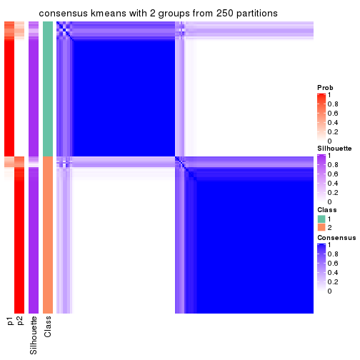</p>

</div>
<div id='tab-SD-kmeans-consensus-heatmap-2'>
<pre><code class="r">consensus_heatmap(res, k = 3)
</code></pre>

<p>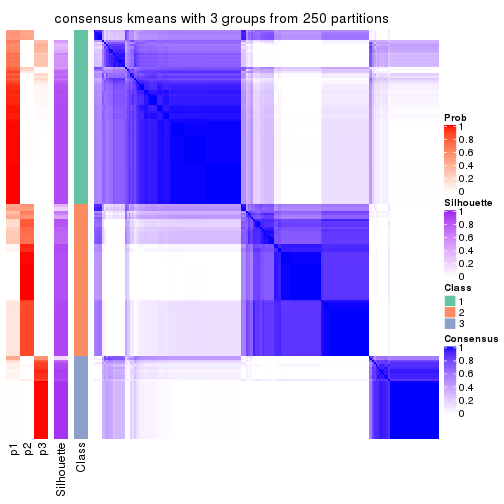</p>

</div>
<div id='tab-SD-kmeans-consensus-heatmap-3'>
<pre><code class="r">consensus_heatmap(res, k = 4)
</code></pre>

<p>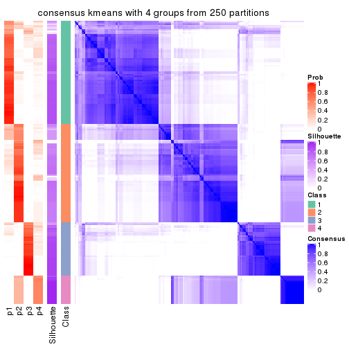</p>

</div>
<div id='tab-SD-kmeans-consensus-heatmap-4'>
<pre><code class="r">consensus_heatmap(res, k = 5)
</code></pre>

<p>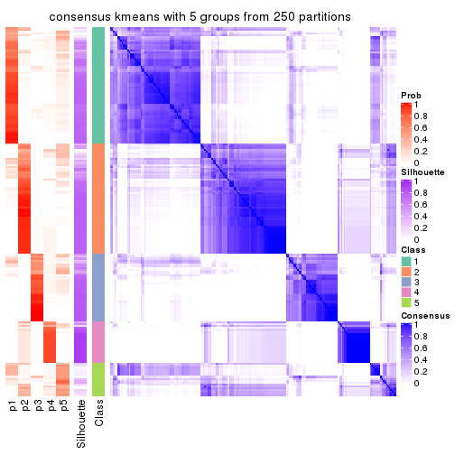</p>

</div>
<div id='tab-SD-kmeans-consensus-heatmap-5'>
<pre><code class="r">consensus_heatmap(res, k = 6)
</code></pre>

<p>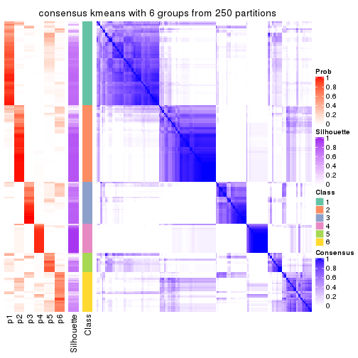</p>

</div>
</div>

Heatmaps for the membership of samples in all partitions to see how consistent they are:


<script>
$( function() {
	$( '#tabs-SD-kmeans-membership-heatmap' ).tabs();
} );
</script>
<div id='tabs-SD-kmeans-membership-heatmap'>
<ul>
<li><a href='#tab-SD-kmeans-membership-heatmap-1'>k = 2</a></li>
<li><a href='#tab-SD-kmeans-membership-heatmap-2'>k = 3</a></li>
<li><a href='#tab-SD-kmeans-membership-heatmap-3'>k = 4</a></li>
<li><a href='#tab-SD-kmeans-membership-heatmap-4'>k = 5</a></li>
<li><a href='#tab-SD-kmeans-membership-heatmap-5'>k = 6</a></li>
</ul>
<div id='tab-SD-kmeans-membership-heatmap-1'>
<pre><code class="r">membership_heatmap(res, k = 2)
</code></pre>

<p>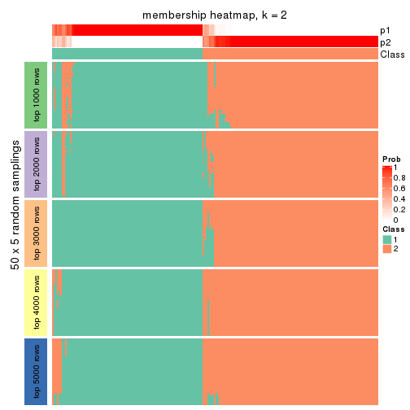</p>

</div>
<div id='tab-SD-kmeans-membership-heatmap-2'>
<pre><code class="r">membership_heatmap(res, k = 3)
</code></pre>

<p>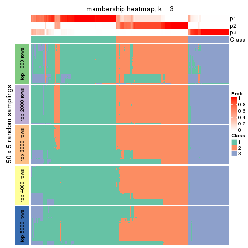</p>

</div>
<div id='tab-SD-kmeans-membership-heatmap-3'>
<pre><code class="r">membership_heatmap(res, k = 4)
</code></pre>

<p>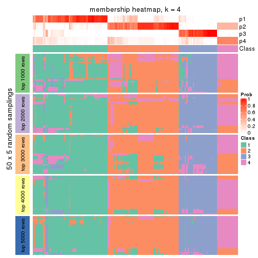</p>

</div>
<div id='tab-SD-kmeans-membership-heatmap-4'>
<pre><code class="r">membership_heatmap(res, k = 5)
</code></pre>

<p>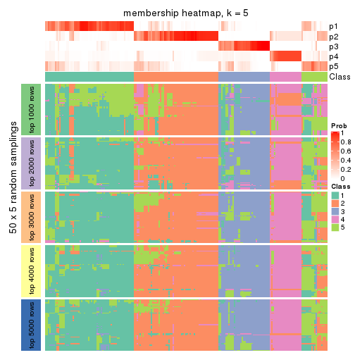</p>

</div>
<div id='tab-SD-kmeans-membership-heatmap-5'>
<pre><code class="r">membership_heatmap(res, k = 6)
</code></pre>

<p>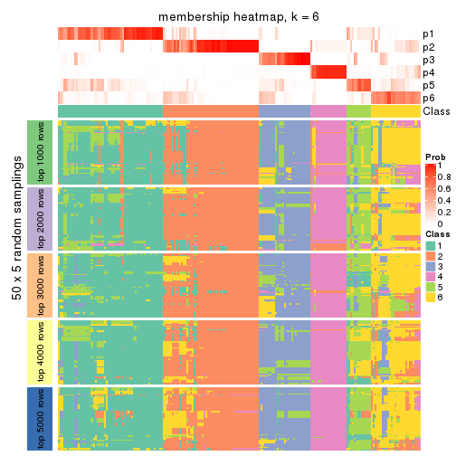</p>

</div>
</div>

As soon as we have had the classes for columns, we can look for signatures
which are significantly different between classes which can be candidate marks
for certain classes. Following are the heatmaps for signatures.


Signature heatmaps where rows are scaled:


<script>
$( function() {
	$( '#tabs-SD-kmeans-get-signatures' ).tabs();
} );
</script>
<div id='tabs-SD-kmeans-get-signatures'>
<ul>
<li><a href='#tab-SD-kmeans-get-signatures-1'>k = 2</a></li>
<li><a href='#tab-SD-kmeans-get-signatures-2'>k = 3</a></li>
<li><a href='#tab-SD-kmeans-get-signatures-3'>k = 4</a></li>
<li><a href='#tab-SD-kmeans-get-signatures-4'>k = 5</a></li>
<li><a href='#tab-SD-kmeans-get-signatures-5'>k = 6</a></li>
</ul>
<div id='tab-SD-kmeans-get-signatures-1'>
<pre><code class="r">get_signatures(res, k = 2)
</code></pre>

<p>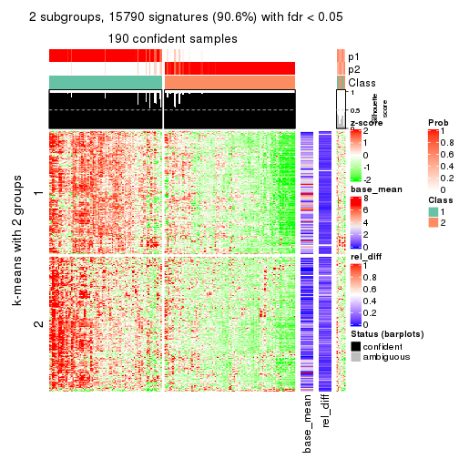</p>

</div>
<div id='tab-SD-kmeans-get-signatures-2'>
<pre><code class="r">get_signatures(res, k = 3)
</code></pre>

<p>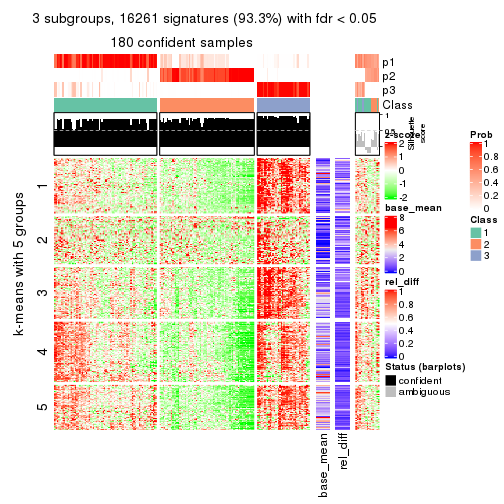</p>

</div>
<div id='tab-SD-kmeans-get-signatures-3'>
<pre><code class="r">get_signatures(res, k = 4)
</code></pre>

<p>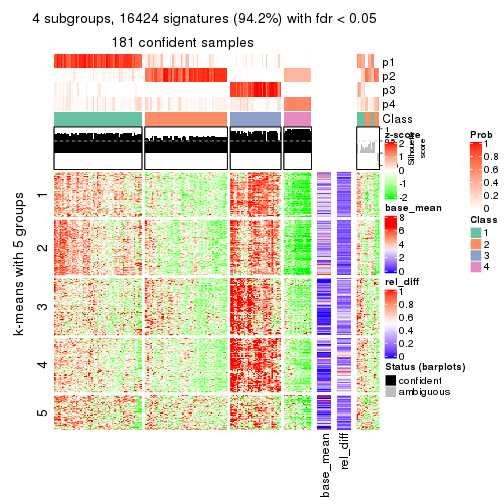</p>

</div>
<div id='tab-SD-kmeans-get-signatures-4'>
<pre><code class="r">get_signatures(res, k = 5)
</code></pre>

<p>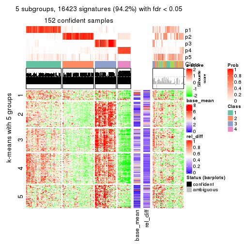</p>

</div>
<div id='tab-SD-kmeans-get-signatures-5'>
<pre><code class="r">get_signatures(res, k = 6)
</code></pre>

<p>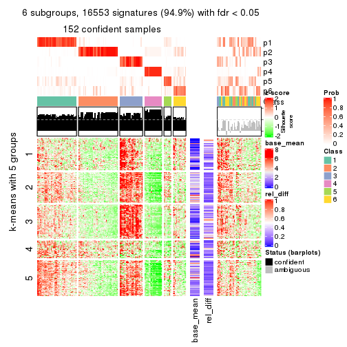</p>

</div>
</div>


Signature heatmaps where rows are not scaled:


<script>
$( function() {
	$( '#tabs-SD-kmeans-get-signatures-no-scale' ).tabs();
} );
</script>
<div id='tabs-SD-kmeans-get-signatures-no-scale'>
<ul>
<li><a href='#tab-SD-kmeans-get-signatures-no-scale-1'>k = 2</a></li>
<li><a href='#tab-SD-kmeans-get-signatures-no-scale-2'>k = 3</a></li>
<li><a href='#tab-SD-kmeans-get-signatures-no-scale-3'>k = 4</a></li>
<li><a href='#tab-SD-kmeans-get-signatures-no-scale-4'>k = 5</a></li>
<li><a href='#tab-SD-kmeans-get-signatures-no-scale-5'>k = 6</a></li>
</ul>
<div id='tab-SD-kmeans-get-signatures-no-scale-1'>
<pre><code class="r">get_signatures(res, k = 2, scale_rows = FALSE)
</code></pre>

<p>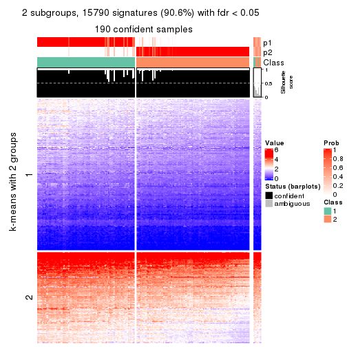</p>

</div>
<div id='tab-SD-kmeans-get-signatures-no-scale-2'>
<pre><code class="r">get_signatures(res, k = 3, scale_rows = FALSE)
</code></pre>

<p>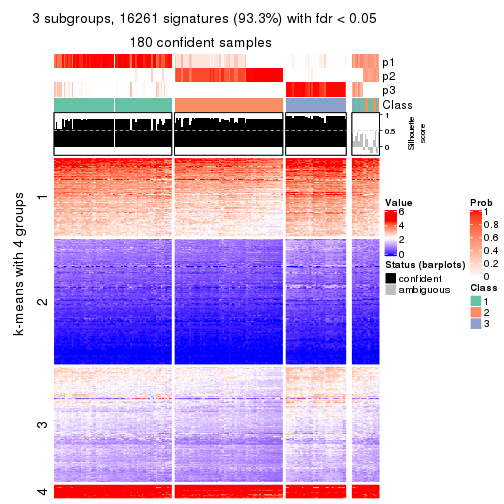</p>

</div>
<div id='tab-SD-kmeans-get-signatures-no-scale-3'>
<pre><code class="r">get_signatures(res, k = 4, scale_rows = FALSE)
</code></pre>

<p>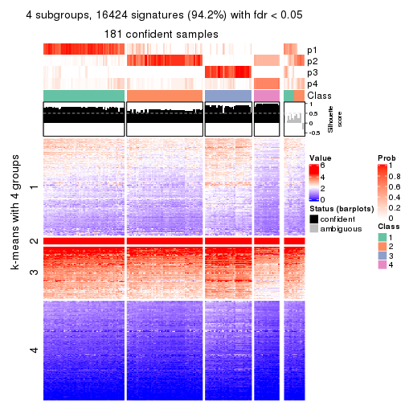</p>

</div>
<div id='tab-SD-kmeans-get-signatures-no-scale-4'>
<pre><code class="r">get_signatures(res, k = 5, scale_rows = FALSE)
</code></pre>

<p>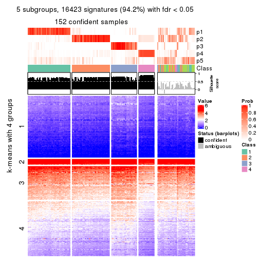</p>

</div>
<div id='tab-SD-kmeans-get-signatures-no-scale-5'>
<pre><code class="r">get_signatures(res, k = 6, scale_rows = FALSE)
</code></pre>

<p>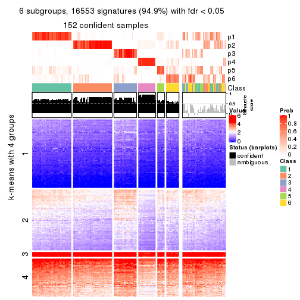</p>

</div>
</div>


Compare the overlap of signatures from different k:

```r
compare_signatures(res)
```

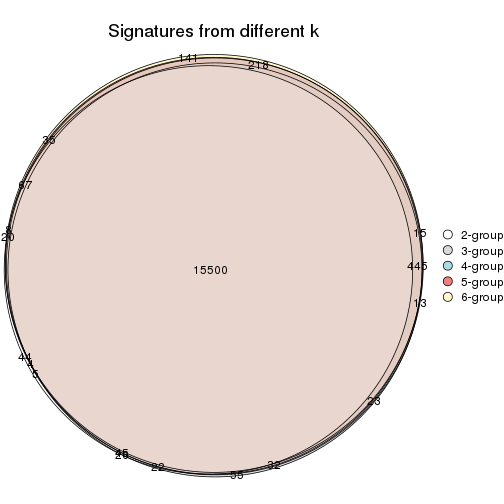

`get_signature()` returns a data frame invisibly. TO get the list of signatures, the function
call should be assigned to a variable explicitly. In following code, if `plot` argument is set
to `FALSE`, no heatmap is plotted while only the differential analysis is performed.

```r
# code only for demonstration
tb = get_signature(res, k = ..., plot = FALSE)
```

An example of the output of `tb` is:

```
#>   which_row         fdr    mean_1    mean_2 scaled_mean_1 scaled_mean_2 km
#> 1        38 0.042760348  8.373488  9.131774    -0.5533452     0.5164555  1
#> 2        40 0.018707592  7.106213  8.469186    -0.6173731     0.5762149  1
#> 3        55 0.019134737 10.221463 11.207825    -0.6159697     0.5749050  1
#> 4        59 0.006059896  5.921854  7.869574    -0.6899429     0.6439467  1
#> 5        60 0.018055526  8.928898 10.211722    -0.6204761     0.5791110  1
#> 6        98 0.009384629 15.714769 14.887706     0.6635654    -0.6193277  2
...
```

The columns in `tb` are:

1. `which_row`: row indices corresponding to the input matrix.
2. `fdr`: FDR for the differential test. 
3. `mean_x`: The mean value in group x.
4. `scaled_mean_x`: The mean value in group x after rows are scaled.
5. `km`: Row groups if k-means clustering is applied to rows.


UMAP plot which shows how samples are separated.


<script>
$( function() {
	$( '#tabs-SD-kmeans-dimension-reduction' ).tabs();
} );
</script>
<div id='tabs-SD-kmeans-dimension-reduction'>
<ul>
<li><a href='#tab-SD-kmeans-dimension-reduction-1'>k = 2</a></li>
<li><a href='#tab-SD-kmeans-dimension-reduction-2'>k = 3</a></li>
<li><a href='#tab-SD-kmeans-dimension-reduction-3'>k = 4</a></li>
<li><a href='#tab-SD-kmeans-dimension-reduction-4'>k = 5</a></li>
<li><a href='#tab-SD-kmeans-dimension-reduction-5'>k = 6</a></li>
</ul>
<div id='tab-SD-kmeans-dimension-reduction-1'>
<pre><code class="r">dimension_reduction(res, k = 2, method = &quot;UMAP&quot;)
</code></pre>

<p>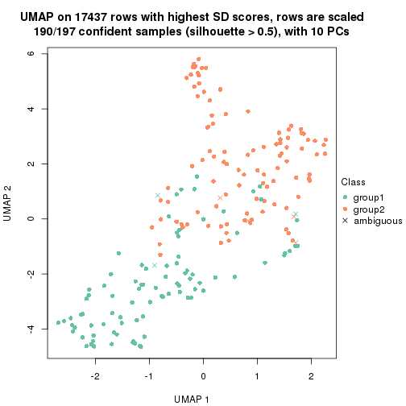</p>

</div>
<div id='tab-SD-kmeans-dimension-reduction-2'>
<pre><code class="r">dimension_reduction(res, k = 3, method = &quot;UMAP&quot;)
</code></pre>

<p>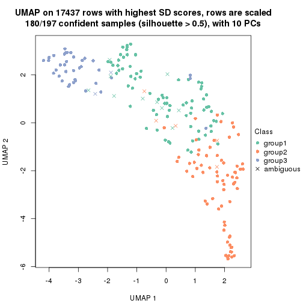</p>

</div>
<div id='tab-SD-kmeans-dimension-reduction-3'>
<pre><code class="r">dimension_reduction(res, k = 4, method = &quot;UMAP&quot;)
</code></pre>

<p>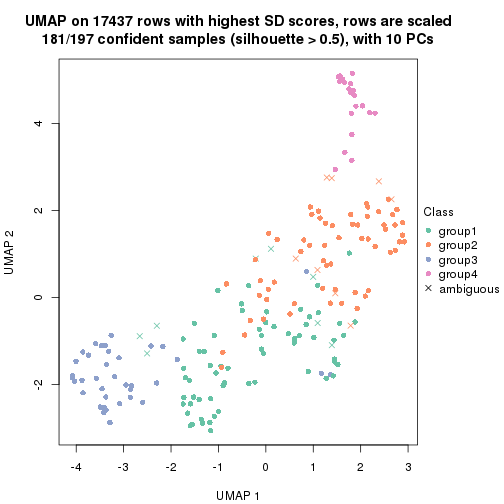</p>

</div>
<div id='tab-SD-kmeans-dimension-reduction-4'>
<pre><code class="r">dimension_reduction(res, k = 5, method = &quot;UMAP&quot;)
</code></pre>

<p>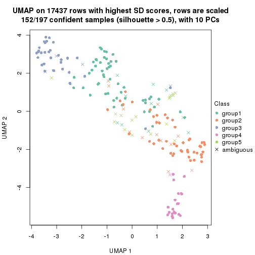</p>

</div>
<div id='tab-SD-kmeans-dimension-reduction-5'>
<pre><code class="r">dimension_reduction(res, k = 6, method = &quot;UMAP&quot;)
</code></pre>

<p>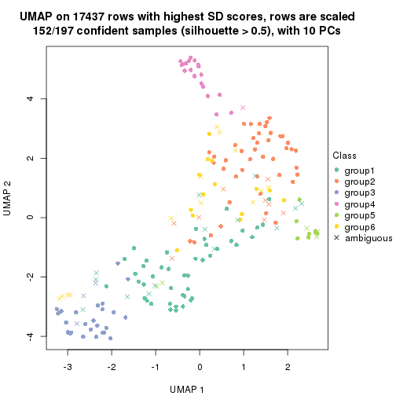</p>

</div>
</div>


Following heatmap shows how subgroups are split when increasing `k`:

```r
collect_classes(res)
```

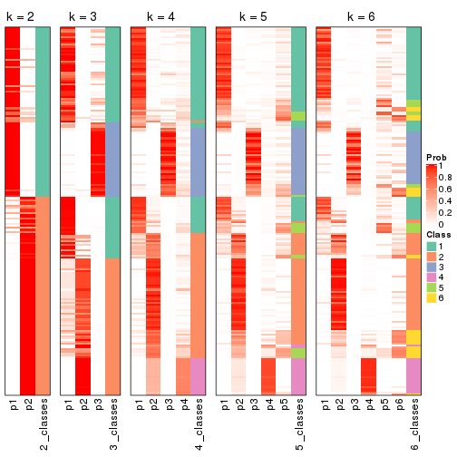


If matrix rows can be associated to genes, consider to use `GO_Enrichment(res,
...)` to perform function enrichment for the signature genes.


 

---------------------------------------------------


### SD:skmeans*


The object with results only for a single top-value method and a single partition method 
can be extracted as:

```r
res = res_list["SD", "skmeans"]
# you can also extract it by
# res = res_list["SD:skmeans"]
```

A summary of `res` and all the functions that can be applied to it:

```r
res
```

```
#> A 'ConsensusPartition' object with k = 2, 3, 4, 5, 6.
#>   On a matrix with 17437 rows and 197 columns.
#>   Top rows (1000, 2000, 3000, 4000, 5000) are extracted by 'SD' method.
#>   Subgroups are detected by 'skmeans' method.
#>   Performed in total 1250 partitions by row resampling.
#>   Best k for subgroups seems to be 2.
#> 
#> Following methods can be applied to this 'ConsensusPartition' object:
#>  [1] "cola_report"             "collect_classes"         "collect_plots"          
#>  [4] "collect_stats"           "colnames"                "compare_signatures"     
#>  [7] "consensus_heatmap"       "dimension_reduction"     "functional_enrichment"  
#> [10] "get_anno_col"            "get_anno"                "get_classes"            
#> [13] "get_consensus"           "get_matrix"              "get_membership"         
#> [16] "get_param"               "get_signatures"          "get_stats"              
#> [19] "is_best_k"               "is_stable_k"             "membership_heatmap"     
#> [22] "ncol"                    "nrow"                    "plot_ecdf"              
#> [25] "rownames"                "select_partition_number" "show"                   
#> [28] "suggest_best_k"          "test_to_known_factors"
```

`collect_plots()` function collects all the plots made from `res` for all `k` (number of partitions)
into one single page to provide an easy and fast comparison between different `k`.

```r
collect_plots(res)
```

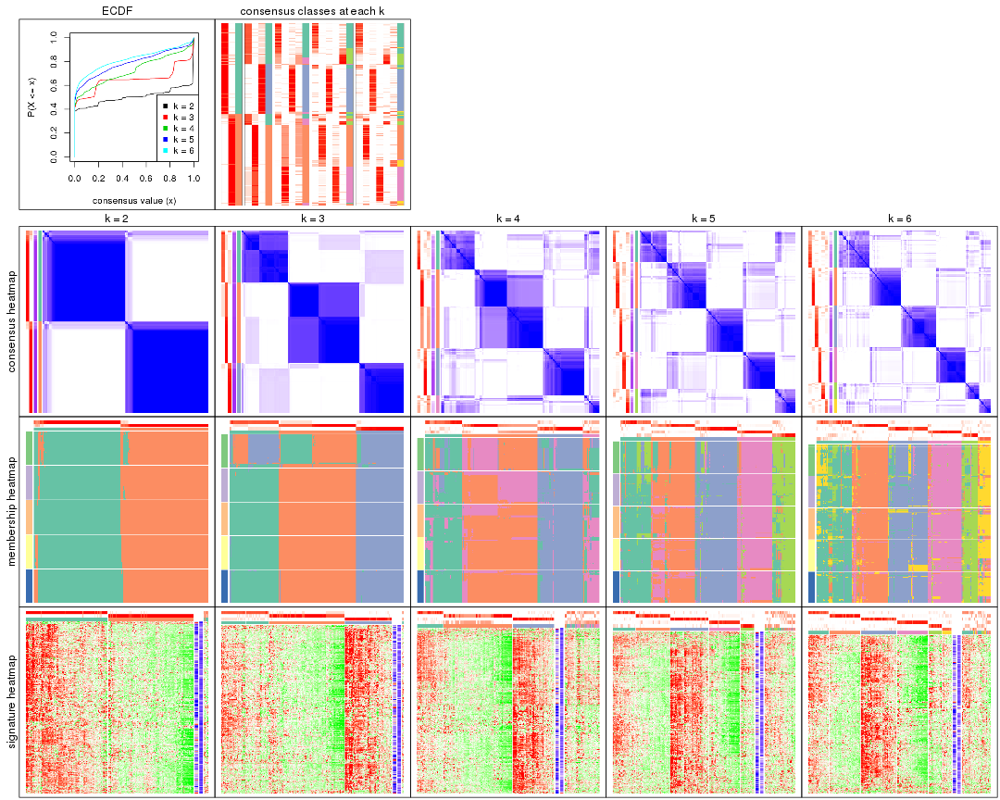

The plots are:

- The first row: a plot of the ECDF (Empirical cumulative distribution
  function) curves of the consensus matrix for each `k` and the heatmap of
  predicted classes for each `k`.
- The second row: heatmaps of the consensus matrix for each `k`.
- The third row: heatmaps of the membership matrix for each `k`.
- The fouth row: heatmaps of the signatures for each `k`.

All the plots in panels can be made by individual functions and they are
plotted later in this section.

`select_partition_number()` produces several plots showing different
statistics for choosing "optimized" `k`. There are following statistics:

- ECDF curves of the consensus matrix for each `k`;
- 1-PAC. [The PAC
  score](https://en.wikipedia.org/wiki/Consensus_clustering#Over-interpretation_potential_of_consensus_clustering)
  measures the proportion of the ambiguous subgrouping.
- Mean silhouette score.
- Concordance. The mean probability of fiting the consensus class ids in all
  partitions.
- Area increased. Denote $A_k$ as the area under the ECDF curve for current
  `k`, the area increased is defined as $A_k - A_{k-1}$.
- Rand index. The percent of pairs of samples that are both in a same cluster
  or both are not in a same cluster in the partition of k and k-1.
- Jaccard index. The ratio of pairs of samples are both in a same cluster in
  the partition of k and k-1 and the pairs of samples are both in a same
  cluster in the partition k or k-1.

The detailed explanations of these statistics can be found in [the cola
vignette](http://bioconductor.org/packages/devel/bioc/vignettes/cola/inst/doc/cola.html#toc_13).

Generally speaking, lower PAC score, higher mean silhouette score or higher
concordance corresponds to better partition. Rand index and Jaccard index
measure how similar the current partition is compared to partition with `k-1`.
If they are too similar, we won't accept `k` is better than `k-1`.

```r
select_partition_number(res)
```

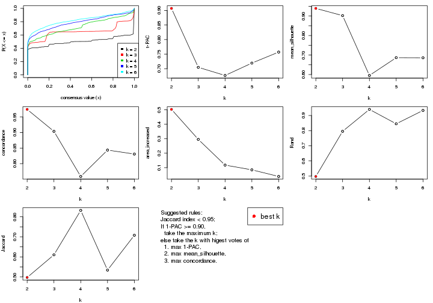

The numeric values for all these statistics can be obtained by `get_stats()`.

```r
get_stats(res)
```

```
#>   k 1-PAC mean_silhouette concordance area_increased  Rand Jaccard
#> 2 2 0.907           0.939       0.974         0.5029 0.497   0.497
#> 3 3 0.705           0.902       0.904         0.2956 0.796   0.610
#> 4 4 0.677           0.595       0.759         0.1178 0.940   0.832
#> 5 5 0.719           0.686       0.844         0.0850 0.845   0.534
#> 6 6 0.757           0.686       0.831         0.0393 0.933   0.708
```

`suggest_best_k()` suggests the best $k$ based on these statistics. The rules are as follows:

- All $k$ with Jaccard index larger than 0.95 are removed because the increase of
  the partition number does not provides enough extra information. If all $k$ are removed,
  the best $k$ is assigned by `NA`.
- For $k$ with 1-PAC larger than 0.9, the maximal $k$ is taken as the "best k". Other $k$ is called "optional k".
- If it does not fit the second rule. The $k$ with the highest vote of highest
  1-PAC, mean silhouette and concordance is taken as the "best k".

```r
suggest_best_k(res)
```

```
#> [1] 2
```


Following shows the table of the partitions (You need to click the **show/hide
code output** link to see it). The membership matrix (columns with name `p*`)
is inferred by
[`clue::cl_consensus()`](https://www.rdocumentation.org/link/cl_consensus?package=clue)
function with the `SE` method. Basically the value in the membership matrix
represents the probability to belong to a certain group. The finall class
label for an item is determined with the group with highest probability it
belongs to.

In `get_classes()` function, the entropy is calculated from the membership
matrix and the silhouette score is calculated from the consensus matrix.


<script>
$( function() {
	$( '#tabs-SD-skmeans-get-classes' ).tabs();
} );
</script>
<div id='tabs-SD-skmeans-get-classes'>
<ul>
<li><a href='#tab-SD-skmeans-get-classes-1'>k = 2</a></li>
<li><a href='#tab-SD-skmeans-get-classes-2'>k = 3</a></li>
<li><a href='#tab-SD-skmeans-get-classes-3'>k = 4</a></li>
<li><a href='#tab-SD-skmeans-get-classes-4'>k = 5</a></li>
<li><a href='#tab-SD-skmeans-get-classes-5'>k = 6</a></li>
</ul>

<div id='tab-SD-skmeans-get-classes-1'>
<p><a id='tab-SD-skmeans-get-classes-1-a' style='color:#0366d6' href='#'>show/hide code output</a></p>
<pre><code class="r">cbind(get_classes(res, k = 2), get_membership(res, k = 2))
</code></pre>

<pre><code>#&gt;            class entropy silhouette    p1    p2
#&gt; SRR1380886     1  0.0000      0.968 1.000 0.000
#&gt; SRR1074385     1  0.0000      0.968 1.000 0.000
#&gt; SRR1374739     1  0.0000      0.968 1.000 0.000
#&gt; SRR1097883     1  0.0000      0.968 1.000 0.000
#&gt; SRR2167209     2  0.7219      0.751 0.200 0.800
#&gt; SRR816541      2  0.0000      0.978 0.000 1.000
#&gt; SRR663645      2  0.0000      0.978 0.000 1.000
#&gt; SRR1381505     2  0.0000      0.978 0.000 1.000
#&gt; SRR1416362     2  0.0000      0.978 0.000 1.000
#&gt; SRR1318503     2  0.7453      0.723 0.212 0.788
#&gt; SRR1341626     2  0.0000      0.978 0.000 1.000
#&gt; SRR1382440     1  0.0000      0.968 1.000 0.000
#&gt; SRR1088413     1  0.0000      0.968 1.000 0.000
#&gt; SRR1082080     2  0.0000      0.978 0.000 1.000
#&gt; SRR1455783     1  0.0000      0.968 1.000 0.000
#&gt; SRR1447760     2  0.0000      0.978 0.000 1.000
#&gt; SRR1487784     2  0.0000      0.978 0.000 1.000
#&gt; SRR1331037     2  0.0000      0.978 0.000 1.000
#&gt; SRR1095651     1  0.0000      0.968 1.000 0.000
#&gt; SRR1078066     1  0.0000      0.968 1.000 0.000
#&gt; SRR1120363     1  0.0000      0.968 1.000 0.000
#&gt; SRR821231      1  0.0000      0.968 1.000 0.000
#&gt; SRR1374373     2  0.0000      0.978 0.000 1.000
#&gt; SRR1324519     2  0.0000      0.978 0.000 1.000
#&gt; SRR1431121     1  0.0000      0.968 1.000 0.000
#&gt; SRR1091032     2  0.0000      0.978 0.000 1.000
#&gt; SRR1365575     2  0.0000      0.978 0.000 1.000
#&gt; SRR1072972     1  0.0000      0.968 1.000 0.000
#&gt; SRR1310690     2  0.0000      0.978 0.000 1.000
#&gt; SRR1383037     1  0.0000      0.968 1.000 0.000
#&gt; SRR1095479     1  0.0000      0.968 1.000 0.000
#&gt; SRR1070403     1  0.0000      0.968 1.000 0.000
#&gt; SRR1390203     1  0.0000      0.968 1.000 0.000
#&gt; SRR1072007     2  0.0000      0.978 0.000 1.000
#&gt; SRR1468787     1  0.9710      0.337 0.600 0.400
#&gt; SRR1347959     2  0.0000      0.978 0.000 1.000
#&gt; SRR1338513     1  0.0000      0.968 1.000 0.000
#&gt; SRR812598      2  0.0000      0.978 0.000 1.000
#&gt; SRR1446806     1  0.1184      0.955 0.984 0.016
#&gt; SRR1394275     1  0.0000      0.968 1.000 0.000
#&gt; SRR1443633     1  0.0000      0.968 1.000 0.000
#&gt; SRR1087728     1  0.0000      0.968 1.000 0.000
#&gt; SRR1098192     2  0.0000      0.978 0.000 1.000
#&gt; SRR1093340     2  0.0000      0.978 0.000 1.000
#&gt; SRR665405      2  0.0000      0.978 0.000 1.000
#&gt; SRR657077      2  0.0000      0.978 0.000 1.000
#&gt; SRR813208      1  0.0000      0.968 1.000 0.000
#&gt; SRR1416074     2  0.0000      0.978 0.000 1.000
#&gt; SRR1089688     2  0.0000      0.978 0.000 1.000
#&gt; SRR1353461     1  0.0000      0.968 1.000 0.000
#&gt; SRR1466321     2  0.7056      0.762 0.192 0.808
#&gt; SRR1073021     1  0.0000      0.968 1.000 0.000
#&gt; SRR1322816     2  0.0000      0.978 0.000 1.000
#&gt; SRR1457727     1  0.0000      0.968 1.000 0.000
#&gt; SRR1464226     2  0.0000      0.978 0.000 1.000
#&gt; SRR1398863     1  0.0000      0.968 1.000 0.000
#&gt; SRR1455631     2  0.0000      0.978 0.000 1.000
#&gt; SRR1307808     2  0.0000      0.978 0.000 1.000
#&gt; SRR1374585     2  0.0000      0.978 0.000 1.000
#&gt; SRR1072104     2  0.0000      0.978 0.000 1.000
#&gt; SRR1076868     2  0.0000      0.978 0.000 1.000
#&gt; SRR1335984     2  0.0000      0.978 0.000 1.000
#&gt; SRR1445939     1  0.2236      0.937 0.964 0.036
#&gt; SRR1453047     2  0.0000      0.978 0.000 1.000
#&gt; SRR1339788     1  0.0000      0.968 1.000 0.000
#&gt; SRR1084323     1  0.0000      0.968 1.000 0.000
#&gt; SRR1092937     1  0.0000      0.968 1.000 0.000
#&gt; SRR1074090     2  0.0000      0.978 0.000 1.000
#&gt; SRR1099833     1  0.0000      0.968 1.000 0.000
#&gt; SRR1093434     1  0.0000      0.968 1.000 0.000
#&gt; SRR1435857     1  0.0000      0.968 1.000 0.000
#&gt; SRR1480347     2  0.0000      0.978 0.000 1.000
#&gt; SRR1440787     2  0.0000      0.978 0.000 1.000
#&gt; SRR1430202     2  0.8207      0.659 0.256 0.744
#&gt; SRR1322730     2  0.0000      0.978 0.000 1.000
#&gt; SRR811029      2  0.0000      0.978 0.000 1.000
#&gt; SRR1390456     1  0.0000      0.968 1.000 0.000
#&gt; SRR1381140     1  0.0000      0.968 1.000 0.000
#&gt; SRR1388064     2  0.0000      0.978 0.000 1.000
#&gt; SRR1093577     1  0.0000      0.968 1.000 0.000
#&gt; SRR1414161     1  0.9710      0.353 0.600 0.400
#&gt; SRR1328738     1  0.9460      0.431 0.636 0.364
#&gt; SRR1311752     2  0.0000      0.978 0.000 1.000
#&gt; SRR1445960     2  0.0000      0.978 0.000 1.000
#&gt; SRR1403412     2  0.0000      0.978 0.000 1.000
#&gt; SRR2166748     1  0.0000      0.968 1.000 0.000
#&gt; SRR821666      2  0.0000      0.978 0.000 1.000
#&gt; SRR1330746     1  0.0000      0.968 1.000 0.000
#&gt; SRR1327872     2  0.0000      0.978 0.000 1.000
#&gt; SRR1100800     1  0.0000      0.968 1.000 0.000
#&gt; SRR1075174     1  0.0000      0.968 1.000 0.000
#&gt; SRR1434436     1  0.0376      0.965 0.996 0.004
#&gt; SRR1389409     2  0.0000      0.978 0.000 1.000
#&gt; SRR1085310     1  0.0000      0.968 1.000 0.000
#&gt; SRR1376718     2  0.0000      0.978 0.000 1.000
#&gt; SRR808590      2  0.0000      0.978 0.000 1.000
#&gt; SRR1084128     2  0.0000      0.978 0.000 1.000
#&gt; SRR1361692     1  0.0000      0.968 1.000 0.000
#&gt; SRR1431493     1  0.0000      0.968 1.000 0.000
#&gt; SRR1409084     1  0.0000      0.968 1.000 0.000
#&gt; SRR2166214     2  0.0000      0.978 0.000 1.000
#&gt; SRR1324102     2  0.0000      0.978 0.000 1.000
#&gt; SRR1079754     2  0.0000      0.978 0.000 1.000
#&gt; SRR1442127     1  0.0000      0.968 1.000 0.000
#&gt; SRR1076244     2  0.0000      0.978 0.000 1.000
#&gt; SRR1330901     2  0.0000      0.978 0.000 1.000
#&gt; SRR1073167     2  0.0000      0.978 0.000 1.000
#&gt; SRR1357541     1  0.0000      0.968 1.000 0.000
#&gt; SRR811607      2  0.8144      0.667 0.252 0.748
#&gt; SRR1468931     1  0.0000      0.968 1.000 0.000
#&gt; SRR1474908     2  0.0000      0.978 0.000 1.000
#&gt; SRR1309875     2  0.0000      0.978 0.000 1.000
#&gt; SRR598792      1  0.0000      0.968 1.000 0.000
#&gt; SRR1088537     2  0.0000      0.978 0.000 1.000
#&gt; SRR1457682     1  0.0000      0.968 1.000 0.000
#&gt; SRR1454289     2  0.9710      0.313 0.400 0.600
#&gt; SRR1069352     1  0.0000      0.968 1.000 0.000
#&gt; SRR1472728     2  0.0000      0.978 0.000 1.000
#&gt; SRR1091144     2  0.0000      0.978 0.000 1.000
#&gt; SRR1319118     1  0.0000      0.968 1.000 0.000
#&gt; SRR1403611     1  0.6343      0.803 0.840 0.160
#&gt; SRR1397762     1  0.0000      0.968 1.000 0.000
#&gt; SRR1317387     1  0.0000      0.968 1.000 0.000
#&gt; SRR1376426     2  0.0000      0.978 0.000 1.000
#&gt; SRR1097777     1  0.0000      0.968 1.000 0.000
#&gt; SRR1365743     1  0.0000      0.968 1.000 0.000
#&gt; SRR1458992     2  0.0000      0.978 0.000 1.000
#&gt; SRR1089537     1  0.9209      0.509 0.664 0.336
#&gt; SRR1397744     1  0.0000      0.968 1.000 0.000
#&gt; SRR1453893     2  0.0000      0.978 0.000 1.000
#&gt; SRR1098543     1  0.0000      0.968 1.000 0.000
#&gt; SRR1321765     1  0.0000      0.968 1.000 0.000
#&gt; SRR1440032     1  0.5519      0.842 0.872 0.128
#&gt; SRR1404507     2  0.0000      0.978 0.000 1.000
#&gt; SRR1404856     2  0.4562      0.883 0.096 0.904
#&gt; SRR812745      1  0.7219      0.749 0.800 0.200
#&gt; SRR1417524     1  0.0000      0.968 1.000 0.000
#&gt; SRR1407334     2  0.0000      0.978 0.000 1.000
#&gt; SRR1453991     1  0.0000      0.968 1.000 0.000
#&gt; SRR1415938     1  0.0000      0.968 1.000 0.000
#&gt; SRR1081259     1  0.4939      0.865 0.892 0.108
#&gt; SRR1436187     2  0.0000      0.978 0.000 1.000
#&gt; SRR1431948     1  0.0000      0.968 1.000 0.000
#&gt; SRR1453277     2  0.7139      0.757 0.196 0.804
#&gt; SRR1095407     1  0.9866      0.243 0.568 0.432
#&gt; SRR1359694     2  0.0000      0.978 0.000 1.000
#&gt; SRR656982      2  0.1843      0.953 0.028 0.972
#&gt; SRR1354338     2  0.0000      0.978 0.000 1.000
#&gt; SRR1088291     1  0.7139      0.749 0.804 0.196
#&gt; SRR1080624     1  0.0000      0.968 1.000 0.000
#&gt; SRR2166708     1  0.0000      0.968 1.000 0.000
#&gt; SRR1393572     1  0.0000      0.968 1.000 0.000
#&gt; SRR1429912     2  0.0000      0.978 0.000 1.000
#&gt; SRR1421048     2  0.0000      0.978 0.000 1.000
#&gt; SRR1434999     1  0.0000      0.968 1.000 0.000
#&gt; SRR656457      1  0.0000      0.968 1.000 0.000
#&gt; SRR1098928     1  0.0000      0.968 1.000 0.000
#&gt; SRR1343967     2  0.0000      0.978 0.000 1.000
#&gt; SRR1360766     1  0.0000      0.968 1.000 0.000
#&gt; SRR1464724     2  0.0000      0.978 0.000 1.000
#&gt; SRR1101542     2  0.0000      0.978 0.000 1.000
#&gt; SRR1401528     1  0.0000      0.968 1.000 0.000
#&gt; SRR1071519     1  0.0000      0.968 1.000 0.000
#&gt; SRR1086070     1  0.0000      0.968 1.000 0.000
#&gt; SRR1358645     2  0.0000      0.978 0.000 1.000
#&gt; SRR819771      1  0.0000      0.968 1.000 0.000
#&gt; SRR1418433     2  0.0000      0.978 0.000 1.000
#&gt; SRR821050      1  0.0000      0.968 1.000 0.000
#&gt; SRR1402091     2  0.0000      0.978 0.000 1.000
#&gt; SRR1322028     2  0.0000      0.978 0.000 1.000
#&gt; SRR1452556     2  0.0000      0.978 0.000 1.000
#&gt; SRR1340047     2  0.0000      0.978 0.000 1.000
#&gt; SRR1418302     2  0.0000      0.978 0.000 1.000
#&gt; SRR1073991     1  0.0000      0.968 1.000 0.000
#&gt; SRR1085187     2  0.0000      0.978 0.000 1.000
#&gt; SRR1357618     1  0.0000      0.968 1.000 0.000
#&gt; SRR1487764     1  0.7219      0.743 0.800 0.200
#&gt; SRR1075336     1  0.0000      0.968 1.000 0.000
#&gt; SRR1365471     2  0.0000      0.978 0.000 1.000
#&gt; SRR1414613     2  0.0000      0.978 0.000 1.000
#&gt; SRR658719      2  0.0000      0.978 0.000 1.000
#&gt; SRR1475128     1  0.0000      0.968 1.000 0.000
#&gt; SRR1367630     2  0.0000      0.978 0.000 1.000
#&gt; SRR1481146     2  0.0000      0.978 0.000 1.000
#&gt; SRR1465674     1  0.0000      0.968 1.000 0.000
#&gt; SRR1327303     2  0.0000      0.978 0.000 1.000
#&gt; SRR1390391     2  0.7219      0.741 0.200 0.800
#&gt; SRR1326020     2  0.0000      0.978 0.000 1.000
#&gt; SRR1381953     1  0.0000      0.968 1.000 0.000
#&gt; SRR1082544     2  0.0000      0.978 0.000 1.000
#&gt; SRR810761      1  0.0000      0.968 1.000 0.000
#&gt; SRR1070764     1  0.0000      0.968 1.000 0.000
#&gt; SRR1415919     1  0.0000      0.968 1.000 0.000
#&gt; SRR1490404     2  0.0000      0.978 0.000 1.000
#&gt; SRR1416773     1  0.0000      0.968 1.000 0.000
#&gt; SRR1377492     2  0.0000      0.978 0.000 1.000
#&gt; SRR1334314     1  0.0938      0.958 0.988 0.012
</code></pre>

<script>
$('#tab-SD-skmeans-get-classes-1-a').parent().next().next().hide();
$('#tab-SD-skmeans-get-classes-1-a').click(function(){
  $('#tab-SD-skmeans-get-classes-1-a').parent().next().next().toggle();
  return(false);
});
</script>
</div>

<div id='tab-SD-skmeans-get-classes-2'>
<p><a id='tab-SD-skmeans-get-classes-2-a' style='color:#0366d6' href='#'>show/hide code output</a></p>
<pre><code class="r">cbind(get_classes(res, k = 3), get_membership(res, k = 3))
</code></pre>

<pre><code>#&gt;            class entropy silhouette    p1    p2    p3
#&gt; SRR1380886     3  0.0000      0.967 0.000 0.000 1.000
#&gt; SRR1074385     3  0.0747      0.958 0.016 0.000 0.984
#&gt; SRR1374739     3  0.0000      0.967 0.000 0.000 1.000
#&gt; SRR1097883     1  0.4291      0.895 0.820 0.000 0.180
#&gt; SRR2167209     1  0.2537      0.838 0.920 0.000 0.080
#&gt; SRR816541      2  0.0000      0.926 0.000 1.000 0.000
#&gt; SRR663645      2  0.4121      0.899 0.168 0.832 0.000
#&gt; SRR1381505     2  0.4121      0.899 0.168 0.832 0.000
#&gt; SRR1416362     2  0.0000      0.926 0.000 1.000 0.000
#&gt; SRR1318503     1  0.4121      0.824 0.832 0.168 0.000
#&gt; SRR1341626     2  0.0000      0.926 0.000 1.000 0.000
#&gt; SRR1382440     3  0.0000      0.967 0.000 0.000 1.000
#&gt; SRR1088413     3  0.0000      0.967 0.000 0.000 1.000
#&gt; SRR1082080     2  0.0000      0.926 0.000 1.000 0.000
#&gt; SRR1455783     1  0.6274      0.436 0.544 0.000 0.456
#&gt; SRR1447760     1  0.4605      0.798 0.796 0.204 0.000
#&gt; SRR1487784     2  0.0000      0.926 0.000 1.000 0.000
#&gt; SRR1331037     2  0.0000      0.926 0.000 1.000 0.000
#&gt; SRR1095651     3  0.0000      0.967 0.000 0.000 1.000
#&gt; SRR1078066     1  0.4291      0.895 0.820 0.000 0.180
#&gt; SRR1120363     1  0.4121      0.896 0.832 0.000 0.168
#&gt; SRR821231      3  0.0237      0.965 0.004 0.000 0.996
#&gt; SRR1374373     2  0.0424      0.922 0.008 0.992 0.000
#&gt; SRR1324519     2  0.0000      0.926 0.000 1.000 0.000
#&gt; SRR1431121     1  0.4235      0.895 0.824 0.000 0.176
#&gt; SRR1091032     2  0.0000      0.926 0.000 1.000 0.000
#&gt; SRR1365575     2  0.4121      0.899 0.168 0.832 0.000
#&gt; SRR1072972     3  0.0237      0.965 0.004 0.000 0.996
#&gt; SRR1310690     2  0.0000      0.926 0.000 1.000 0.000
#&gt; SRR1383037     3  0.0000      0.967 0.000 0.000 1.000
#&gt; SRR1095479     3  0.1031      0.952 0.024 0.000 0.976
#&gt; SRR1070403     3  0.0000      0.967 0.000 0.000 1.000
#&gt; SRR1390203     1  0.4121      0.896 0.832 0.000 0.168
#&gt; SRR1072007     2  0.4121      0.899 0.168 0.832 0.000
#&gt; SRR1468787     1  0.4291      0.895 0.820 0.000 0.180
#&gt; SRR1347959     2  0.0000      0.926 0.000 1.000 0.000
#&gt; SRR1338513     3  0.4121      0.794 0.168 0.000 0.832
#&gt; SRR812598      2  0.0000      0.926 0.000 1.000 0.000
#&gt; SRR1446806     1  0.4121      0.824 0.832 0.168 0.000
#&gt; SRR1394275     1  0.4346      0.891 0.816 0.000 0.184
#&gt; SRR1443633     1  0.4399      0.890 0.812 0.000 0.188
#&gt; SRR1087728     3  0.0000      0.967 0.000 0.000 1.000
#&gt; SRR1098192     2  0.0000      0.926 0.000 1.000 0.000
#&gt; SRR1093340     2  0.0000      0.926 0.000 1.000 0.000
#&gt; SRR665405      2  0.4121      0.899 0.168 0.832 0.000
#&gt; SRR657077      2  0.0000      0.926 0.000 1.000 0.000
#&gt; SRR813208      3  0.0000      0.967 0.000 0.000 1.000
#&gt; SRR1416074     2  0.0000      0.926 0.000 1.000 0.000
#&gt; SRR1089688     2  0.4121      0.899 0.168 0.832 0.000
#&gt; SRR1353461     3  0.0000      0.967 0.000 0.000 1.000
#&gt; SRR1466321     1  0.4121      0.824 0.832 0.168 0.000
#&gt; SRR1073021     1  0.4291      0.895 0.820 0.000 0.180
#&gt; SRR1322816     2  0.0000      0.926 0.000 1.000 0.000
#&gt; SRR1457727     1  0.4291      0.893 0.820 0.000 0.180
#&gt; SRR1464226     2  0.4121      0.899 0.168 0.832 0.000
#&gt; SRR1398863     3  0.0592      0.960 0.012 0.000 0.988
#&gt; SRR1455631     2  0.4121      0.899 0.168 0.832 0.000
#&gt; SRR1307808     1  0.4121      0.824 0.832 0.168 0.000
#&gt; SRR1374585     2  0.4121      0.899 0.168 0.832 0.000
#&gt; SRR1072104     2  0.4121      0.899 0.168 0.832 0.000
#&gt; SRR1076868     2  0.0000      0.926 0.000 1.000 0.000
#&gt; SRR1335984     2  0.1337      0.910 0.012 0.972 0.016
#&gt; SRR1445939     1  0.5236      0.819 0.804 0.168 0.028
#&gt; SRR1453047     2  0.0000      0.926 0.000 1.000 0.000
#&gt; SRR1339788     3  0.0000      0.967 0.000 0.000 1.000
#&gt; SRR1084323     1  0.4346      0.891 0.816 0.000 0.184
#&gt; SRR1092937     3  0.0592      0.960 0.012 0.000 0.988
#&gt; SRR1074090     2  0.0000      0.926 0.000 1.000 0.000
#&gt; SRR1099833     3  0.4121      0.794 0.168 0.000 0.832
#&gt; SRR1093434     3  0.0000      0.967 0.000 0.000 1.000
#&gt; SRR1435857     1  0.4452      0.888 0.808 0.000 0.192
#&gt; SRR1480347     2  0.0000      0.926 0.000 1.000 0.000
#&gt; SRR1440787     2  0.4121      0.899 0.168 0.832 0.000
#&gt; SRR1430202     1  0.4121      0.824 0.832 0.168 0.000
#&gt; SRR1322730     2  0.4121      0.899 0.168 0.832 0.000
#&gt; SRR811029      2  0.0000      0.926 0.000 1.000 0.000
#&gt; SRR1390456     3  0.0000      0.967 0.000 0.000 1.000
#&gt; SRR1381140     1  0.4682      0.885 0.804 0.004 0.192
#&gt; SRR1388064     2  0.4121      0.899 0.168 0.832 0.000
#&gt; SRR1093577     1  0.6307      0.324 0.512 0.000 0.488
#&gt; SRR1414161     1  0.4399      0.810 0.812 0.188 0.000
#&gt; SRR1328738     1  0.4121      0.896 0.832 0.000 0.168
#&gt; SRR1311752     2  0.0000      0.926 0.000 1.000 0.000
#&gt; SRR1445960     2  0.0000      0.926 0.000 1.000 0.000
#&gt; SRR1403412     2  0.0000      0.926 0.000 1.000 0.000
#&gt; SRR2166748     1  0.4235      0.895 0.824 0.000 0.176
#&gt; SRR821666      2  0.4121      0.899 0.168 0.832 0.000
#&gt; SRR1330746     3  0.0000      0.967 0.000 0.000 1.000
#&gt; SRR1327872     2  0.4121      0.899 0.168 0.832 0.000
#&gt; SRR1100800     1  0.4235      0.895 0.824 0.000 0.176
#&gt; SRR1075174     3  0.0592      0.960 0.012 0.000 0.988
#&gt; SRR1434436     1  0.4121      0.824 0.832 0.168 0.000
#&gt; SRR1389409     2  0.4121      0.899 0.168 0.832 0.000
#&gt; SRR1085310     3  0.0000      0.967 0.000 0.000 1.000
#&gt; SRR1376718     2  0.4121      0.899 0.168 0.832 0.000
#&gt; SRR808590      2  0.4121      0.899 0.168 0.832 0.000
#&gt; SRR1084128     2  0.0000      0.926 0.000 1.000 0.000
#&gt; SRR1361692     1  0.5137      0.856 0.832 0.104 0.064
#&gt; SRR1431493     3  0.0892      0.954 0.020 0.000 0.980
#&gt; SRR1409084     1  0.4235      0.894 0.824 0.000 0.176
#&gt; SRR2166214     2  0.4121      0.899 0.168 0.832 0.000
#&gt; SRR1324102     2  0.0000      0.926 0.000 1.000 0.000
#&gt; SRR1079754     2  0.1289      0.923 0.032 0.968 0.000
#&gt; SRR1442127     3  0.0000      0.967 0.000 0.000 1.000
#&gt; SRR1076244     2  0.4121      0.899 0.168 0.832 0.000
#&gt; SRR1330901     1  0.4291      0.816 0.820 0.180 0.000
#&gt; SRR1073167     2  0.0000      0.926 0.000 1.000 0.000
#&gt; SRR1357541     1  0.4291      0.895 0.820 0.000 0.180
#&gt; SRR811607      1  0.4121      0.824 0.832 0.168 0.000
#&gt; SRR1468931     3  0.0000      0.967 0.000 0.000 1.000
#&gt; SRR1474908     2  0.0424      0.922 0.008 0.992 0.000
#&gt; SRR1309875     2  0.0000      0.926 0.000 1.000 0.000
#&gt; SRR598792      3  0.0000      0.967 0.000 0.000 1.000
#&gt; SRR1088537     2  0.0000      0.926 0.000 1.000 0.000
#&gt; SRR1457682     1  0.4121      0.896 0.832 0.000 0.168
#&gt; SRR1454289     1  0.4399      0.811 0.812 0.188 0.000
#&gt; SRR1069352     3  0.0747      0.957 0.016 0.000 0.984
#&gt; SRR1472728     2  0.0000      0.926 0.000 1.000 0.000
#&gt; SRR1091144     2  0.4121      0.899 0.168 0.832 0.000
#&gt; SRR1319118     3  0.0000      0.967 0.000 0.000 1.000
#&gt; SRR1403611     3  0.4351      0.791 0.168 0.004 0.828
#&gt; SRR1397762     3  0.0592      0.960 0.012 0.000 0.988
#&gt; SRR1317387     3  0.0000      0.967 0.000 0.000 1.000
#&gt; SRR1376426     2  0.0000      0.926 0.000 1.000 0.000
#&gt; SRR1097777     1  0.4842      0.861 0.776 0.000 0.224
#&gt; SRR1365743     3  0.0424      0.963 0.008 0.000 0.992
#&gt; SRR1458992     2  0.0000      0.926 0.000 1.000 0.000
#&gt; SRR1089537     3  0.5355      0.763 0.168 0.032 0.800
#&gt; SRR1397744     1  0.4121      0.896 0.832 0.000 0.168
#&gt; SRR1453893     2  0.4121      0.899 0.168 0.832 0.000
#&gt; SRR1098543     1  0.4235      0.894 0.824 0.000 0.176
#&gt; SRR1321765     1  0.4291      0.895 0.820 0.000 0.180
#&gt; SRR1440032     3  0.4531      0.787 0.168 0.008 0.824
#&gt; SRR1404507     2  0.4121      0.899 0.168 0.832 0.000
#&gt; SRR1404856     1  0.0661      0.779 0.988 0.004 0.008
#&gt; SRR812745      3  0.4749      0.740 0.012 0.172 0.816
#&gt; SRR1417524     3  0.0000      0.967 0.000 0.000 1.000
#&gt; SRR1407334     2  0.4121      0.899 0.168 0.832 0.000
#&gt; SRR1453991     1  0.4121      0.896 0.832 0.000 0.168
#&gt; SRR1415938     1  0.4654      0.876 0.792 0.000 0.208
#&gt; SRR1081259     1  0.5111      0.820 0.808 0.168 0.024
#&gt; SRR1436187     2  0.4121      0.899 0.168 0.832 0.000
#&gt; SRR1431948     3  0.0000      0.967 0.000 0.000 1.000
#&gt; SRR1453277     2  0.4033      0.824 0.008 0.856 0.136
#&gt; SRR1095407     1  0.4291      0.895 0.820 0.000 0.180
#&gt; SRR1359694     1  0.4235      0.819 0.824 0.176 0.000
#&gt; SRR656982      2  0.5111      0.884 0.168 0.808 0.024
#&gt; SRR1354338     2  0.0237      0.924 0.004 0.996 0.000
#&gt; SRR1088291     1  0.4178      0.896 0.828 0.000 0.172
#&gt; SRR1080624     1  0.4121      0.896 0.832 0.000 0.168
#&gt; SRR2166708     3  0.0000      0.967 0.000 0.000 1.000
#&gt; SRR1393572     1  0.4293      0.896 0.832 0.004 0.164
#&gt; SRR1429912     2  0.0000      0.926 0.000 1.000 0.000
#&gt; SRR1421048     1  0.4121      0.824 0.832 0.168 0.000
#&gt; SRR1434999     3  0.1163      0.947 0.028 0.000 0.972
#&gt; SRR656457      3  0.1163      0.947 0.028 0.000 0.972
#&gt; SRR1098928     3  0.0000      0.967 0.000 0.000 1.000
#&gt; SRR1343967     2  0.0000      0.926 0.000 1.000 0.000
#&gt; SRR1360766     3  0.1753      0.919 0.048 0.000 0.952
#&gt; SRR1464724     2  0.4121      0.899 0.168 0.832 0.000
#&gt; SRR1101542     2  0.4121      0.899 0.168 0.832 0.000
#&gt; SRR1401528     3  0.0000      0.967 0.000 0.000 1.000
#&gt; SRR1071519     3  0.0000      0.967 0.000 0.000 1.000
#&gt; SRR1086070     1  0.4555      0.880 0.800 0.000 0.200
#&gt; SRR1358645     2  0.0424      0.922 0.008 0.992 0.000
#&gt; SRR819771      3  0.0747      0.957 0.016 0.000 0.984
#&gt; SRR1418433     2  0.4121      0.899 0.168 0.832 0.000
#&gt; SRR821050      1  0.4235      0.895 0.824 0.000 0.176
#&gt; SRR1402091     2  0.0000      0.926 0.000 1.000 0.000
#&gt; SRR1322028     2  0.0000      0.926 0.000 1.000 0.000
#&gt; SRR1452556     2  0.4121      0.899 0.168 0.832 0.000
#&gt; SRR1340047     2  0.0424      0.922 0.008 0.992 0.000
#&gt; SRR1418302     2  0.0747      0.925 0.016 0.984 0.000
#&gt; SRR1073991     3  0.0000      0.967 0.000 0.000 1.000
#&gt; SRR1085187     2  0.4121      0.899 0.168 0.832 0.000
#&gt; SRR1357618     3  0.0747      0.957 0.016 0.000 0.984
#&gt; SRR1487764     3  0.0237      0.965 0.000 0.004 0.996
#&gt; SRR1075336     1  0.4178      0.896 0.828 0.000 0.172
#&gt; SRR1365471     2  0.0000      0.926 0.000 1.000 0.000
#&gt; SRR1414613     2  0.0000      0.926 0.000 1.000 0.000
#&gt; SRR658719      2  0.0000      0.926 0.000 1.000 0.000
#&gt; SRR1475128     3  0.0000      0.967 0.000 0.000 1.000
#&gt; SRR1367630     2  0.4121      0.899 0.168 0.832 0.000
#&gt; SRR1481146     2  0.4121      0.899 0.168 0.832 0.000
#&gt; SRR1465674     1  0.4291      0.895 0.820 0.000 0.180
#&gt; SRR1327303     2  0.0000      0.926 0.000 1.000 0.000
#&gt; SRR1390391     2  0.4555      0.715 0.000 0.800 0.200
#&gt; SRR1326020     2  0.4979      0.886 0.168 0.812 0.020
#&gt; SRR1381953     3  0.0000      0.967 0.000 0.000 1.000
#&gt; SRR1082544     2  0.0892      0.924 0.020 0.980 0.000
#&gt; SRR810761      1  0.4291      0.895 0.820 0.000 0.180
#&gt; SRR1070764     3  0.0000      0.967 0.000 0.000 1.000
#&gt; SRR1415919     3  0.0000      0.967 0.000 0.000 1.000
#&gt; SRR1490404     2  0.0000      0.926 0.000 1.000 0.000
#&gt; SRR1416773     1  0.4291      0.895 0.820 0.000 0.180
#&gt; SRR1377492     2  0.4351      0.896 0.168 0.828 0.004
#&gt; SRR1334314     1  0.4121      0.824 0.832 0.168 0.000
</code></pre>

<script>
$('#tab-SD-skmeans-get-classes-2-a').parent().next().next().hide();
$('#tab-SD-skmeans-get-classes-2-a').click(function(){
  $('#tab-SD-skmeans-get-classes-2-a').parent().next().next().toggle();
  return(false);
});
</script>
</div>

<div id='tab-SD-skmeans-get-classes-3'>
<p><a id='tab-SD-skmeans-get-classes-3-a' style='color:#0366d6' href='#'>show/hide code output</a></p>
<pre><code class="r">cbind(get_classes(res, k = 4), get_membership(res, k = 4))
</code></pre>

<pre><code>#&gt;            class entropy silhouette    p1    p2    p3    p4
#&gt; SRR1380886     3  0.0000     0.8998 0.000 0.000 1.000 0.000
#&gt; SRR1074385     3  0.5570     0.1964 0.440 0.000 0.540 0.020
#&gt; SRR1374739     3  0.0000     0.8998 0.000 0.000 1.000 0.000
#&gt; SRR1097883     1  0.4155     0.5580 0.828 0.000 0.072 0.100
#&gt; SRR2167209     4  0.6843     0.3299 0.432 0.012 0.068 0.488
#&gt; SRR816541      2  0.4967     0.6839 0.000 0.548 0.000 0.452
#&gt; SRR663645      2  0.0000     0.6336 0.000 1.000 0.000 0.000
#&gt; SRR1381505     2  0.0000     0.6336 0.000 1.000 0.000 0.000
#&gt; SRR1416362     2  0.4999     0.6756 0.000 0.508 0.000 0.492
#&gt; SRR1318503     1  0.2868     0.5886 0.864 0.000 0.000 0.136
#&gt; SRR1341626     2  0.4941     0.6859 0.000 0.564 0.000 0.436
#&gt; SRR1382440     3  0.0000     0.8998 0.000 0.000 1.000 0.000
#&gt; SRR1088413     3  0.0000     0.8998 0.000 0.000 1.000 0.000
#&gt; SRR1082080     2  0.4998     0.6771 0.000 0.512 0.000 0.488
#&gt; SRR1455783     1  0.4748     0.4963 0.716 0.000 0.268 0.016
#&gt; SRR1447760     4  0.4567     0.3127 0.276 0.008 0.000 0.716
#&gt; SRR1487784     2  0.4999     0.6756 0.000 0.508 0.000 0.492
#&gt; SRR1331037     2  0.4999     0.6756 0.000 0.508 0.000 0.492
#&gt; SRR1095651     3  0.0000     0.8998 0.000 0.000 1.000 0.000
#&gt; SRR1078066     4  0.6549     0.3270 0.436 0.000 0.076 0.488
#&gt; SRR1120363     1  0.1488     0.6598 0.956 0.000 0.012 0.032
#&gt; SRR821231      3  0.1557     0.8716 0.056 0.000 0.944 0.000
#&gt; SRR1374373     2  0.5295     0.6702 0.008 0.504 0.000 0.488
#&gt; SRR1324519     2  0.4999     0.6756 0.000 0.508 0.000 0.492
#&gt; SRR1431121     1  0.0657     0.6710 0.984 0.000 0.012 0.004
#&gt; SRR1091032     2  0.4998     0.6771 0.000 0.512 0.000 0.488
#&gt; SRR1365575     2  0.0000     0.6336 0.000 1.000 0.000 0.000
#&gt; SRR1072972     3  0.1867     0.8611 0.072 0.000 0.928 0.000
#&gt; SRR1310690     2  0.4907     0.6858 0.000 0.580 0.000 0.420
#&gt; SRR1383037     3  0.0000     0.8998 0.000 0.000 1.000 0.000
#&gt; SRR1095479     3  0.3873     0.7146 0.228 0.000 0.772 0.000
#&gt; SRR1070403     3  0.0000     0.8998 0.000 0.000 1.000 0.000
#&gt; SRR1390203     1  0.0707     0.6676 0.980 0.000 0.000 0.020
#&gt; SRR1072007     2  0.0000     0.6336 0.000 1.000 0.000 0.000
#&gt; SRR1468787     4  0.7039     0.3380 0.416 0.016 0.076 0.492
#&gt; SRR1347959     2  0.4999     0.6756 0.000 0.508 0.000 0.492
#&gt; SRR1338513     3  0.1637     0.8620 0.000 0.060 0.940 0.000
#&gt; SRR812598      2  0.4907     0.6861 0.000 0.580 0.000 0.420
#&gt; SRR1446806     1  0.4040     0.4603 0.752 0.000 0.000 0.248
#&gt; SRR1394275     1  0.3447     0.6094 0.852 0.000 0.128 0.020
#&gt; SRR1443633     1  0.4669     0.5298 0.796 0.000 0.100 0.104
#&gt; SRR1087728     3  0.0000     0.8998 0.000 0.000 1.000 0.000
#&gt; SRR1098192     2  0.4008     0.6684 0.000 0.756 0.000 0.244
#&gt; SRR1093340     2  0.4998     0.6771 0.000 0.512 0.000 0.488
#&gt; SRR665405      2  0.4103     0.2960 0.000 0.744 0.000 0.256
#&gt; SRR657077      2  0.4996     0.6782 0.000 0.516 0.000 0.484
#&gt; SRR813208      3  0.0000     0.8998 0.000 0.000 1.000 0.000
#&gt; SRR1416074     2  0.4999     0.6756 0.000 0.508 0.000 0.492
#&gt; SRR1089688     2  0.0000     0.6336 0.000 1.000 0.000 0.000
#&gt; SRR1353461     3  0.0469     0.8938 0.012 0.000 0.988 0.000
#&gt; SRR1466321     1  0.2760     0.5939 0.872 0.000 0.000 0.128
#&gt; SRR1073021     4  0.6557     0.3061 0.448 0.000 0.076 0.476
#&gt; SRR1322816     2  0.4996     0.6780 0.000 0.516 0.000 0.484
#&gt; SRR1457727     1  0.1635     0.6685 0.948 0.000 0.044 0.008
#&gt; SRR1464226     2  0.0000     0.6336 0.000 1.000 0.000 0.000
#&gt; SRR1398863     3  0.4163     0.7444 0.188 0.000 0.792 0.020
#&gt; SRR1455631     2  0.4746     0.0706 0.000 0.632 0.000 0.368
#&gt; SRR1307808     4  0.5279    -0.0238 0.400 0.012 0.000 0.588
#&gt; SRR1374585     2  0.0000     0.6336 0.000 1.000 0.000 0.000
#&gt; SRR1072104     2  0.0000     0.6336 0.000 1.000 0.000 0.000
#&gt; SRR1076868     2  0.4999     0.6756 0.000 0.508 0.000 0.492
#&gt; SRR1335984     2  0.5895     0.6648 0.028 0.544 0.004 0.424
#&gt; SRR1445939     1  0.5670     0.5042 0.720 0.000 0.128 0.152
#&gt; SRR1453047     2  0.4999     0.6756 0.000 0.508 0.000 0.492
#&gt; SRR1339788     3  0.0000     0.8998 0.000 0.000 1.000 0.000
#&gt; SRR1084323     1  0.3160     0.6256 0.872 0.000 0.108 0.020
#&gt; SRR1092937     3  0.2542     0.8489 0.084 0.000 0.904 0.012
#&gt; SRR1074090     2  0.4999     0.6756 0.000 0.508 0.000 0.492
#&gt; SRR1099833     3  0.2149     0.8408 0.000 0.088 0.912 0.000
#&gt; SRR1093434     3  0.0000     0.8998 0.000 0.000 1.000 0.000
#&gt; SRR1435857     1  0.3539     0.5963 0.820 0.000 0.176 0.004
#&gt; SRR1480347     2  0.4998     0.6771 0.000 0.512 0.000 0.488
#&gt; SRR1440787     2  0.0000     0.6336 0.000 1.000 0.000 0.000
#&gt; SRR1430202     1  0.4356     0.3998 0.708 0.000 0.000 0.292
#&gt; SRR1322730     2  0.0000     0.6336 0.000 1.000 0.000 0.000
#&gt; SRR811029      2  0.4830     0.6849 0.000 0.608 0.000 0.392
#&gt; SRR1390456     3  0.0000     0.8998 0.000 0.000 1.000 0.000
#&gt; SRR1381140     1  0.4706     0.5146 0.732 0.000 0.248 0.020
#&gt; SRR1388064     2  0.0000     0.6336 0.000 1.000 0.000 0.000
#&gt; SRR1093577     1  0.7059     0.0789 0.528 0.000 0.332 0.140
#&gt; SRR1414161     1  0.4830     0.2329 0.608 0.000 0.000 0.392
#&gt; SRR1328738     1  0.5408    -0.2540 0.500 0.000 0.012 0.488
#&gt; SRR1311752     2  0.4999     0.6756 0.000 0.508 0.000 0.492
#&gt; SRR1445960     2  0.4948     0.6843 0.000 0.560 0.000 0.440
#&gt; SRR1403412     2  0.5329     0.6834 0.012 0.568 0.000 0.420
#&gt; SRR2166748     1  0.0469     0.6717 0.988 0.000 0.012 0.000
#&gt; SRR821666      2  0.0000     0.6336 0.000 1.000 0.000 0.000
#&gt; SRR1330746     3  0.0000     0.8998 0.000 0.000 1.000 0.000
#&gt; SRR1327872     2  0.0000     0.6336 0.000 1.000 0.000 0.000
#&gt; SRR1100800     1  0.1042     0.6710 0.972 0.000 0.020 0.008
#&gt; SRR1075174     3  0.4245     0.7342 0.196 0.000 0.784 0.020
#&gt; SRR1434436     1  0.4040     0.4597 0.752 0.000 0.000 0.248
#&gt; SRR1389409     2  0.0000     0.6336 0.000 1.000 0.000 0.000
#&gt; SRR1085310     3  0.0000     0.8998 0.000 0.000 1.000 0.000
#&gt; SRR1376718     2  0.0000     0.6336 0.000 1.000 0.000 0.000
#&gt; SRR808590      2  0.0000     0.6336 0.000 1.000 0.000 0.000
#&gt; SRR1084128     2  0.4999     0.6756 0.000 0.508 0.000 0.492
#&gt; SRR1361692     1  0.5263    -0.1704 0.544 0.000 0.008 0.448
#&gt; SRR1431493     3  0.2760     0.7886 0.128 0.000 0.872 0.000
#&gt; SRR1409084     1  0.0592     0.6727 0.984 0.000 0.016 0.000
#&gt; SRR2166214     2  0.4103     0.2960 0.000 0.744 0.000 0.256
#&gt; SRR1324102     2  0.4998     0.6771 0.000 0.512 0.000 0.488
#&gt; SRR1079754     2  0.3400     0.6600 0.000 0.820 0.000 0.180
#&gt; SRR1442127     3  0.0000     0.8998 0.000 0.000 1.000 0.000
#&gt; SRR1076244     2  0.0000     0.6336 0.000 1.000 0.000 0.000
#&gt; SRR1330901     4  0.4998    -0.1354 0.488 0.000 0.000 0.512
#&gt; SRR1073167     2  0.4998     0.6771 0.000 0.512 0.000 0.488
#&gt; SRR1357541     1  0.4285     0.5485 0.820 0.000 0.076 0.104
#&gt; SRR811607      1  0.2814     0.6014 0.868 0.000 0.000 0.132
#&gt; SRR1468931     3  0.0000     0.8998 0.000 0.000 1.000 0.000
#&gt; SRR1474908     2  0.5378     0.6765 0.012 0.540 0.000 0.448
#&gt; SRR1309875     2  0.4907     0.6858 0.000 0.580 0.000 0.420
#&gt; SRR598792      3  0.0000     0.8998 0.000 0.000 1.000 0.000
#&gt; SRR1088537     2  0.4998     0.6771 0.000 0.512 0.000 0.488
#&gt; SRR1457682     1  0.0804     0.6697 0.980 0.000 0.008 0.012
#&gt; SRR1454289     1  0.4830     0.2314 0.608 0.000 0.000 0.392
#&gt; SRR1069352     3  0.3895     0.7055 0.184 0.000 0.804 0.012
#&gt; SRR1472728     2  0.4999     0.6756 0.000 0.508 0.000 0.492
#&gt; SRR1091144     2  0.0921     0.6089 0.000 0.972 0.000 0.028
#&gt; SRR1319118     3  0.1792     0.8586 0.068 0.000 0.932 0.000
#&gt; SRR1403611     3  0.3569     0.7305 0.000 0.196 0.804 0.000
#&gt; SRR1397762     3  0.2081     0.8559 0.084 0.000 0.916 0.000
#&gt; SRR1317387     3  0.0000     0.8998 0.000 0.000 1.000 0.000
#&gt; SRR1376426     2  0.4999     0.6756 0.000 0.508 0.000 0.492
#&gt; SRR1097777     1  0.4621     0.5004 0.708 0.000 0.284 0.008
#&gt; SRR1365743     3  0.2402     0.8554 0.076 0.000 0.912 0.012
#&gt; SRR1458992     2  0.4941     0.6846 0.000 0.564 0.000 0.436
#&gt; SRR1089537     2  0.7541    -0.2511 0.000 0.424 0.188 0.388
#&gt; SRR1397744     1  0.0469     0.6717 0.988 0.000 0.012 0.000
#&gt; SRR1453893     2  0.0000     0.6336 0.000 1.000 0.000 0.000
#&gt; SRR1098543     1  0.0376     0.6711 0.992 0.000 0.004 0.004
#&gt; SRR1321765     4  0.6549     0.3270 0.436 0.000 0.076 0.488
#&gt; SRR1440032     3  0.4040     0.6645 0.000 0.248 0.752 0.000
#&gt; SRR1404507     2  0.0000     0.6336 0.000 1.000 0.000 0.000
#&gt; SRR1404856     4  0.7024     0.2876 0.404 0.104 0.004 0.488
#&gt; SRR812745      3  0.5247     0.6994 0.100 0.000 0.752 0.148
#&gt; SRR1417524     3  0.0000     0.8998 0.000 0.000 1.000 0.000
#&gt; SRR1407334     2  0.0000     0.6336 0.000 1.000 0.000 0.000
#&gt; SRR1453991     1  0.2867     0.6052 0.884 0.000 0.012 0.104
#&gt; SRR1415938     1  0.4635     0.5109 0.720 0.000 0.268 0.012
#&gt; SRR1081259     1  0.4673     0.3958 0.700 0.000 0.008 0.292
#&gt; SRR1436187     2  0.0000     0.6336 0.000 1.000 0.000 0.000
#&gt; SRR1431948     3  0.0000     0.8998 0.000 0.000 1.000 0.000
#&gt; SRR1453277     2  0.7482     0.5657 0.012 0.544 0.164 0.280
#&gt; SRR1095407     4  0.6786     0.3312 0.432 0.008 0.072 0.488
#&gt; SRR1359694     4  0.4998    -0.1388 0.488 0.000 0.000 0.512
#&gt; SRR656982      2  0.4776     0.0513 0.000 0.624 0.000 0.376
#&gt; SRR1354338     4  0.3311    -0.1169 0.000 0.172 0.000 0.828
#&gt; SRR1088291     1  0.5407    -0.2466 0.504 0.000 0.012 0.484
#&gt; SRR1080624     1  0.1284     0.6636 0.964 0.000 0.012 0.024
#&gt; SRR2166708     3  0.0000     0.8998 0.000 0.000 1.000 0.000
#&gt; SRR1393572     1  0.0188     0.6709 0.996 0.000 0.004 0.000
#&gt; SRR1429912     2  0.4999     0.6756 0.000 0.508 0.000 0.492
#&gt; SRR1421048     4  0.4916     0.2654 0.424 0.000 0.000 0.576
#&gt; SRR1434999     4  0.7828     0.2285 0.264 0.000 0.340 0.396
#&gt; SRR656457      4  0.7832     0.2256 0.264 0.000 0.344 0.392
#&gt; SRR1098928     3  0.0000     0.8998 0.000 0.000 1.000 0.000
#&gt; SRR1343967     2  0.4999     0.6756 0.000 0.508 0.000 0.492
#&gt; SRR1360766     3  0.4606     0.5877 0.264 0.000 0.724 0.012
#&gt; SRR1464724     2  0.0000     0.6336 0.000 1.000 0.000 0.000
#&gt; SRR1101542     2  0.0000     0.6336 0.000 1.000 0.000 0.000
#&gt; SRR1401528     3  0.0469     0.8938 0.012 0.000 0.988 0.000
#&gt; SRR1071519     3  0.0000     0.8998 0.000 0.000 1.000 0.000
#&gt; SRR1086070     1  0.4737     0.5108 0.728 0.000 0.252 0.020
#&gt; SRR1358645     2  0.5000     0.6727 0.000 0.504 0.000 0.496
#&gt; SRR819771      3  0.2760     0.7886 0.128 0.000 0.872 0.000
#&gt; SRR1418433     2  0.0000     0.6336 0.000 1.000 0.000 0.000
#&gt; SRR821050      1  0.1938     0.6488 0.936 0.000 0.012 0.052
#&gt; SRR1402091     2  0.4977     0.6817 0.000 0.540 0.000 0.460
#&gt; SRR1322028     2  0.4999     0.6756 0.000 0.508 0.000 0.492
#&gt; SRR1452556     2  0.0000     0.6336 0.000 1.000 0.000 0.000
#&gt; SRR1340047     4  0.6005    -0.6479 0.040 0.460 0.000 0.500
#&gt; SRR1418302     2  0.4040     0.6690 0.000 0.752 0.000 0.248
#&gt; SRR1073991     3  0.4955     0.1173 0.444 0.000 0.556 0.000
#&gt; SRR1085187     2  0.1474     0.5853 0.000 0.948 0.000 0.052
#&gt; SRR1357618     3  0.5397     0.5817 0.212 0.000 0.720 0.068
#&gt; SRR1487764     3  0.6561     0.3204 0.000 0.092 0.564 0.344
#&gt; SRR1075336     1  0.0707     0.6676 0.980 0.000 0.000 0.020
#&gt; SRR1365471     2  0.4998     0.6771 0.000 0.512 0.000 0.488
#&gt; SRR1414613     2  0.4999     0.6756 0.000 0.508 0.000 0.492
#&gt; SRR658719      2  0.5392     0.6724 0.012 0.528 0.000 0.460
#&gt; SRR1475128     3  0.0000     0.8998 0.000 0.000 1.000 0.000
#&gt; SRR1367630     2  0.0000     0.6336 0.000 1.000 0.000 0.000
#&gt; SRR1481146     2  0.4564     0.1578 0.000 0.672 0.000 0.328
#&gt; SRR1465674     4  0.6549     0.3270 0.436 0.000 0.076 0.488
#&gt; SRR1327303     2  0.5399     0.6686 0.012 0.520 0.000 0.468
#&gt; SRR1390391     4  0.7886    -0.2166 0.288 0.236 0.008 0.468
#&gt; SRR1326020     2  0.3544     0.5782 0.012 0.852 0.128 0.008
#&gt; SRR1381953     3  0.0188     0.8978 0.004 0.000 0.996 0.000
#&gt; SRR1082544     2  0.2760     0.6434 0.000 0.872 0.000 0.128
#&gt; SRR810761      1  0.4235     0.5531 0.824 0.000 0.084 0.092
#&gt; SRR1070764     3  0.0000     0.8998 0.000 0.000 1.000 0.000
#&gt; SRR1415919     3  0.0000     0.8998 0.000 0.000 1.000 0.000
#&gt; SRR1490404     2  0.4999     0.6756 0.000 0.508 0.000 0.492
#&gt; SRR1416773     4  0.6713     0.3312 0.432 0.004 0.076 0.488
#&gt; SRR1377492     2  0.0000     0.6336 0.000 1.000 0.000 0.000
#&gt; SRR1334314     1  0.4134     0.3898 0.740 0.000 0.000 0.260
</code></pre>

<script>
$('#tab-SD-skmeans-get-classes-3-a').parent().next().next().hide();
$('#tab-SD-skmeans-get-classes-3-a').click(function(){
  $('#tab-SD-skmeans-get-classes-3-a').parent().next().next().toggle();
  return(false);
});
</script>
</div>

<div id='tab-SD-skmeans-get-classes-4'>
<p><a id='tab-SD-skmeans-get-classes-4-a' style='color:#0366d6' href='#'>show/hide code output</a></p>
<pre><code class="r">cbind(get_classes(res, k = 5), get_membership(res, k = 5))
</code></pre>

<pre><code>#&gt;            class entropy silhouette    p1    p2    p3    p4    p5
#&gt; SRR1380886     3  0.0451    0.89307 0.004 0.000 0.988 0.000 0.008
#&gt; SRR1074385     1  0.2077    0.65590 0.908 0.000 0.084 0.000 0.008
#&gt; SRR1374739     3  0.0451    0.89307 0.004 0.000 0.988 0.000 0.008
#&gt; SRR1097883     5  0.4522    0.08928 0.440 0.000 0.008 0.000 0.552
#&gt; SRR2167209     5  0.0324    0.72312 0.004 0.000 0.000 0.004 0.992
#&gt; SRR816541      2  0.3508    0.66811 0.000 0.748 0.000 0.252 0.000
#&gt; SRR663645      4  0.0703    0.88736 0.000 0.024 0.000 0.976 0.000
#&gt; SRR1381505     4  0.1341    0.89720 0.000 0.056 0.000 0.944 0.000
#&gt; SRR1416362     2  0.0703    0.81447 0.000 0.976 0.000 0.024 0.000
#&gt; SRR1318503     5  0.6287    0.35370 0.276 0.196 0.000 0.000 0.528
#&gt; SRR1341626     2  0.3837    0.59595 0.000 0.692 0.000 0.308 0.000
#&gt; SRR1382440     3  0.0451    0.89307 0.004 0.000 0.988 0.000 0.008
#&gt; SRR1088413     3  0.0451    0.89307 0.004 0.000 0.988 0.000 0.008
#&gt; SRR1082080     2  0.1341    0.81872 0.000 0.944 0.000 0.056 0.000
#&gt; SRR1455783     1  0.1648    0.69371 0.940 0.000 0.040 0.000 0.020
#&gt; SRR1447760     5  0.2818    0.64635 0.008 0.128 0.000 0.004 0.860
#&gt; SRR1487784     2  0.0794    0.81568 0.000 0.972 0.000 0.028 0.000
#&gt; SRR1331037     2  0.0404    0.80852 0.000 0.988 0.000 0.012 0.000
#&gt; SRR1095651     3  0.0000    0.89389 0.000 0.000 1.000 0.000 0.000
#&gt; SRR1078066     5  0.0579    0.72187 0.008 0.000 0.008 0.000 0.984
#&gt; SRR1120363     1  0.4403    0.23329 0.560 0.004 0.000 0.000 0.436
#&gt; SRR821231      3  0.2136    0.84646 0.088 0.000 0.904 0.000 0.008
#&gt; SRR1374373     2  0.3804    0.71075 0.160 0.796 0.000 0.044 0.000
#&gt; SRR1324519     2  0.2020    0.79630 0.000 0.900 0.000 0.100 0.000
#&gt; SRR1431121     1  0.4009    0.51687 0.684 0.000 0.004 0.000 0.312
#&gt; SRR1091032     2  0.1341    0.81872 0.000 0.944 0.000 0.056 0.000
#&gt; SRR1365575     4  0.1341    0.89720 0.000 0.056 0.000 0.944 0.000
#&gt; SRR1072972     3  0.2193    0.84226 0.092 0.000 0.900 0.000 0.008
#&gt; SRR1310690     2  0.4045    0.51283 0.000 0.644 0.000 0.356 0.000
#&gt; SRR1383037     3  0.0000    0.89389 0.000 0.000 1.000 0.000 0.000
#&gt; SRR1095479     3  0.5067    0.62837 0.172 0.000 0.700 0.000 0.128
#&gt; SRR1070403     3  0.0451    0.89307 0.004 0.000 0.988 0.000 0.008
#&gt; SRR1390203     1  0.1571    0.69289 0.936 0.000 0.004 0.000 0.060
#&gt; SRR1072007     4  0.1341    0.89720 0.000 0.056 0.000 0.944 0.000
#&gt; SRR1468787     5  0.0579    0.72187 0.008 0.000 0.008 0.000 0.984
#&gt; SRR1347959     2  0.0609    0.81160 0.000 0.980 0.000 0.020 0.000
#&gt; SRR1338513     3  0.0794    0.88100 0.000 0.000 0.972 0.028 0.000
#&gt; SRR812598      2  0.4126    0.46649 0.000 0.620 0.000 0.380 0.000
#&gt; SRR1446806     1  0.2086    0.65979 0.924 0.048 0.000 0.020 0.008
#&gt; SRR1394275     1  0.0324    0.69269 0.992 0.000 0.004 0.000 0.004
#&gt; SRR1443633     5  0.5470    0.41569 0.268 0.000 0.104 0.000 0.628
#&gt; SRR1087728     3  0.0324    0.89395 0.004 0.000 0.992 0.000 0.004
#&gt; SRR1098192     4  0.4150    0.28742 0.000 0.388 0.000 0.612 0.000
#&gt; SRR1093340     2  0.1341    0.81872 0.000 0.944 0.000 0.056 0.000
#&gt; SRR665405      4  0.0963    0.85113 0.000 0.000 0.000 0.964 0.036
#&gt; SRR657077      2  0.1270    0.81247 0.000 0.948 0.000 0.052 0.000
#&gt; SRR813208      3  0.0000    0.89389 0.000 0.000 1.000 0.000 0.000
#&gt; SRR1416074     2  0.1121    0.82080 0.000 0.956 0.000 0.044 0.000
#&gt; SRR1089688     4  0.0404    0.87804 0.000 0.012 0.000 0.988 0.000
#&gt; SRR1353461     3  0.0000    0.89389 0.000 0.000 1.000 0.000 0.000
#&gt; SRR1466321     5  0.6301    0.30283 0.308 0.180 0.000 0.000 0.512
#&gt; SRR1073021     5  0.0510    0.72269 0.016 0.000 0.000 0.000 0.984
#&gt; SRR1322816     2  0.2891    0.74189 0.000 0.824 0.000 0.176 0.000
#&gt; SRR1457727     1  0.4054    0.61785 0.760 0.000 0.036 0.000 0.204
#&gt; SRR1464226     4  0.0880    0.89003 0.000 0.032 0.000 0.968 0.000
#&gt; SRR1398863     1  0.3857    0.38658 0.688 0.000 0.312 0.000 0.000
#&gt; SRR1455631     4  0.3370    0.76079 0.000 0.028 0.000 0.824 0.148
#&gt; SRR1307808     2  0.2535    0.71503 0.076 0.892 0.000 0.000 0.032
#&gt; SRR1374585     4  0.1341    0.89720 0.000 0.056 0.000 0.944 0.000
#&gt; SRR1072104     4  0.0880    0.89003 0.000 0.032 0.000 0.968 0.000
#&gt; SRR1076868     2  0.1043    0.81982 0.000 0.960 0.000 0.040 0.000
#&gt; SRR1335984     2  0.6694    0.35391 0.276 0.432 0.000 0.292 0.000
#&gt; SRR1445939     1  0.0162    0.69246 0.996 0.000 0.004 0.000 0.000
#&gt; SRR1453047     2  0.1121    0.82080 0.000 0.956 0.000 0.044 0.000
#&gt; SRR1339788     3  0.0451    0.89307 0.004 0.000 0.988 0.000 0.008
#&gt; SRR1084323     1  0.0486    0.69395 0.988 0.004 0.004 0.000 0.004
#&gt; SRR1092937     3  0.4066    0.58222 0.324 0.004 0.672 0.000 0.000
#&gt; SRR1074090     2  0.1121    0.82080 0.000 0.956 0.000 0.044 0.000
#&gt; SRR1099833     3  0.1792    0.83926 0.000 0.000 0.916 0.084 0.000
#&gt; SRR1093434     3  0.0324    0.89395 0.004 0.000 0.992 0.000 0.004
#&gt; SRR1435857     1  0.4946    0.57747 0.712 0.000 0.168 0.000 0.120
#&gt; SRR1480347     2  0.1341    0.81872 0.000 0.944 0.000 0.056 0.000
#&gt; SRR1440787     4  0.1341    0.89720 0.000 0.056 0.000 0.944 0.000
#&gt; SRR1430202     1  0.1597    0.66777 0.940 0.048 0.000 0.012 0.000
#&gt; SRR1322730     4  0.1121    0.89391 0.000 0.044 0.000 0.956 0.000
#&gt; SRR811029      4  0.4562   -0.21976 0.008 0.496 0.000 0.496 0.000
#&gt; SRR1390456     3  0.0162    0.89406 0.004 0.000 0.996 0.000 0.000
#&gt; SRR1381140     1  0.0162    0.69246 0.996 0.000 0.004 0.000 0.000
#&gt; SRR1388064     4  0.1341    0.89720 0.000 0.056 0.000 0.944 0.000
#&gt; SRR1093577     5  0.5523    0.42327 0.084 0.004 0.296 0.000 0.616
#&gt; SRR1414161     1  0.0963    0.67970 0.964 0.036 0.000 0.000 0.000
#&gt; SRR1328738     5  0.0510    0.72152 0.016 0.000 0.000 0.000 0.984
#&gt; SRR1311752     2  0.1121    0.82080 0.000 0.956 0.000 0.044 0.000
#&gt; SRR1445960     2  0.3983    0.57058 0.000 0.660 0.000 0.340 0.000
#&gt; SRR1403412     2  0.6386    0.34646 0.172 0.460 0.000 0.368 0.000
#&gt; SRR2166748     1  0.4132    0.57851 0.720 0.000 0.020 0.000 0.260
#&gt; SRR821666      4  0.1478    0.89099 0.000 0.064 0.000 0.936 0.000
#&gt; SRR1330746     3  0.0324    0.89395 0.004 0.000 0.992 0.000 0.004
#&gt; SRR1327872     4  0.1341    0.89720 0.000 0.056 0.000 0.944 0.000
#&gt; SRR1100800     1  0.4016    0.56918 0.716 0.000 0.012 0.000 0.272
#&gt; SRR1075174     1  0.4524    0.42313 0.692 0.008 0.280 0.020 0.000
#&gt; SRR1434436     1  0.1408    0.67854 0.948 0.044 0.000 0.000 0.008
#&gt; SRR1389409     4  0.1341    0.89720 0.000 0.056 0.000 0.944 0.000
#&gt; SRR1085310     3  0.0000    0.89389 0.000 0.000 1.000 0.000 0.000
#&gt; SRR1376718     4  0.1341    0.89720 0.000 0.056 0.000 0.944 0.000
#&gt; SRR808590      4  0.1341    0.89720 0.000 0.056 0.000 0.944 0.000
#&gt; SRR1084128     2  0.0609    0.81160 0.000 0.980 0.000 0.020 0.000
#&gt; SRR1361692     5  0.1764    0.69900 0.064 0.008 0.000 0.000 0.928
#&gt; SRR1431493     3  0.3266    0.72145 0.004 0.000 0.796 0.000 0.200
#&gt; SRR1409084     1  0.4137    0.58759 0.732 0.008 0.012 0.000 0.248
#&gt; SRR2166214     4  0.0963    0.85113 0.000 0.000 0.000 0.964 0.036
#&gt; SRR1324102     2  0.1341    0.81872 0.000 0.944 0.000 0.056 0.000
#&gt; SRR1079754     4  0.3774    0.53655 0.000 0.296 0.000 0.704 0.000
#&gt; SRR1442127     3  0.0324    0.89395 0.004 0.000 0.992 0.000 0.004
#&gt; SRR1076244     4  0.0703    0.88613 0.000 0.024 0.000 0.976 0.000
#&gt; SRR1330901     2  0.4180    0.52863 0.220 0.744 0.000 0.000 0.036
#&gt; SRR1073167     2  0.1410    0.81752 0.000 0.940 0.000 0.060 0.000
#&gt; SRR1357541     5  0.4582    0.15433 0.416 0.000 0.012 0.000 0.572
#&gt; SRR811607      5  0.6798    0.10167 0.340 0.292 0.000 0.000 0.368
#&gt; SRR1468931     3  0.0451    0.89307 0.004 0.000 0.988 0.000 0.008
#&gt; SRR1474908     2  0.6557    0.40704 0.240 0.472 0.000 0.288 0.000
#&gt; SRR1309875     2  0.4210    0.39060 0.000 0.588 0.000 0.412 0.000
#&gt; SRR598792      3  0.0162    0.89406 0.004 0.000 0.996 0.000 0.000
#&gt; SRR1088537     2  0.1270    0.81912 0.000 0.948 0.000 0.052 0.000
#&gt; SRR1457682     1  0.4152    0.52723 0.692 0.012 0.000 0.000 0.296
#&gt; SRR1454289     1  0.4909    0.28199 0.560 0.412 0.000 0.000 0.028
#&gt; SRR1069352     3  0.3300    0.72234 0.004 0.000 0.792 0.000 0.204
#&gt; SRR1472728     2  0.0703    0.81447 0.000 0.976 0.000 0.024 0.000
#&gt; SRR1091144     4  0.0880    0.89003 0.000 0.032 0.000 0.968 0.000
#&gt; SRR1319118     3  0.3756    0.60280 0.248 0.000 0.744 0.000 0.008
#&gt; SRR1403611     3  0.2929    0.74468 0.000 0.000 0.820 0.180 0.000
#&gt; SRR1397762     3  0.3395    0.70631 0.236 0.000 0.764 0.000 0.000
#&gt; SRR1317387     3  0.0000    0.89389 0.000 0.000 1.000 0.000 0.000
#&gt; SRR1376426     2  0.1121    0.82080 0.000 0.956 0.000 0.044 0.000
#&gt; SRR1097777     1  0.3912    0.57452 0.752 0.000 0.228 0.000 0.020
#&gt; SRR1365743     3  0.3534    0.67911 0.256 0.000 0.744 0.000 0.000
#&gt; SRR1458992     2  0.4047    0.58318 0.004 0.676 0.000 0.320 0.000
#&gt; SRR1089537     4  0.6392   -0.00743 0.000 0.000 0.168 0.432 0.400
#&gt; SRR1397744     1  0.3895    0.57522 0.728 0.004 0.004 0.000 0.264
#&gt; SRR1453893     4  0.1341    0.89720 0.000 0.056 0.000 0.944 0.000
#&gt; SRR1098543     1  0.3737    0.61259 0.764 0.004 0.008 0.000 0.224
#&gt; SRR1321765     5  0.0579    0.72187 0.008 0.000 0.008 0.000 0.984
#&gt; SRR1440032     3  0.3586    0.65274 0.000 0.000 0.736 0.264 0.000
#&gt; SRR1404507     4  0.1341    0.89720 0.000 0.056 0.000 0.944 0.000
#&gt; SRR1404856     5  0.0290    0.72206 0.000 0.000 0.000 0.008 0.992
#&gt; SRR812745      3  0.5181    0.40387 0.400 0.016 0.564 0.020 0.000
#&gt; SRR1417524     3  0.0000    0.89389 0.000 0.000 1.000 0.000 0.000
#&gt; SRR1407334     4  0.1341    0.89720 0.000 0.056 0.000 0.944 0.000
#&gt; SRR1453991     5  0.4450   -0.05574 0.488 0.004 0.000 0.000 0.508
#&gt; SRR1415938     1  0.4010    0.58915 0.760 0.000 0.208 0.000 0.032
#&gt; SRR1081259     1  0.0290    0.69102 0.992 0.008 0.000 0.000 0.000
#&gt; SRR1436187     4  0.1341    0.89720 0.000 0.056 0.000 0.944 0.000
#&gt; SRR1431948     3  0.0000    0.89389 0.000 0.000 1.000 0.000 0.000
#&gt; SRR1453277     2  0.7165    0.34471 0.264 0.424 0.020 0.292 0.000
#&gt; SRR1095407     5  0.0324    0.72312 0.004 0.000 0.000 0.004 0.992
#&gt; SRR1359694     2  0.5404    0.35894 0.264 0.636 0.000 0.000 0.100
#&gt; SRR656982      4  0.3992    0.57594 0.000 0.004 0.004 0.712 0.280
#&gt; SRR1354338     2  0.5068    0.64235 0.004 0.708 0.000 0.108 0.180
#&gt; SRR1088291     5  0.0290    0.72310 0.008 0.000 0.000 0.000 0.992
#&gt; SRR1080624     1  0.4371    0.43991 0.644 0.012 0.000 0.000 0.344
#&gt; SRR2166708     3  0.0579    0.89207 0.008 0.000 0.984 0.000 0.008
#&gt; SRR1393572     1  0.3916    0.58052 0.732 0.012 0.000 0.000 0.256
#&gt; SRR1429912     2  0.0880    0.81680 0.000 0.968 0.000 0.032 0.000
#&gt; SRR1421048     5  0.4352    0.55826 0.036 0.244 0.000 0.000 0.720
#&gt; SRR1434999     5  0.3300    0.57093 0.004 0.000 0.204 0.000 0.792
#&gt; SRR656457      5  0.3300    0.57093 0.004 0.000 0.204 0.000 0.792
#&gt; SRR1098928     3  0.0000    0.89389 0.000 0.000 1.000 0.000 0.000
#&gt; SRR1343967     2  0.1121    0.82080 0.000 0.956 0.000 0.044 0.000
#&gt; SRR1360766     3  0.5793    0.29537 0.352 0.028 0.580 0.032 0.008
#&gt; SRR1464724     4  0.1341    0.89720 0.000 0.056 0.000 0.944 0.000
#&gt; SRR1101542     4  0.1341    0.89720 0.000 0.056 0.000 0.944 0.000
#&gt; SRR1401528     3  0.0000    0.89389 0.000 0.000 1.000 0.000 0.000
#&gt; SRR1071519     3  0.0324    0.89395 0.004 0.000 0.992 0.000 0.004
#&gt; SRR1086070     1  0.0324    0.69372 0.992 0.000 0.004 0.000 0.004
#&gt; SRR1358645     2  0.0609    0.80295 0.000 0.980 0.000 0.020 0.000
#&gt; SRR819771      3  0.2488    0.80599 0.004 0.000 0.872 0.000 0.124
#&gt; SRR1418433     4  0.0510    0.88114 0.000 0.016 0.000 0.984 0.000
#&gt; SRR821050      1  0.4449    0.08159 0.512 0.000 0.004 0.000 0.484
#&gt; SRR1402091     2  0.3508    0.66488 0.000 0.748 0.000 0.252 0.000
#&gt; SRR1322028     2  0.1121    0.82080 0.000 0.956 0.000 0.044 0.000
#&gt; SRR1452556     4  0.1341    0.89720 0.000 0.056 0.000 0.944 0.000
#&gt; SRR1340047     2  0.4622    0.55037 0.276 0.684 0.000 0.040 0.000
#&gt; SRR1418302     4  0.4060    0.33497 0.000 0.360 0.000 0.640 0.000
#&gt; SRR1073991     1  0.4779    0.39152 0.588 0.000 0.388 0.000 0.024
#&gt; SRR1085187     4  0.1341    0.89720 0.000 0.056 0.000 0.944 0.000
#&gt; SRR1357618     3  0.3969    0.56692 0.004 0.000 0.692 0.000 0.304
#&gt; SRR1487764     3  0.6222    0.33569 0.000 0.000 0.548 0.236 0.216
#&gt; SRR1075336     1  0.2179    0.68128 0.896 0.000 0.004 0.000 0.100
#&gt; SRR1365471     2  0.1341    0.81872 0.000 0.944 0.000 0.056 0.000
#&gt; SRR1414613     2  0.0290    0.80601 0.000 0.992 0.000 0.008 0.000
#&gt; SRR658719      2  0.6350    0.48812 0.240 0.524 0.000 0.236 0.000
#&gt; SRR1475128     3  0.0324    0.89395 0.004 0.000 0.992 0.000 0.004
#&gt; SRR1367630     4  0.0880    0.89003 0.000 0.032 0.000 0.968 0.000
#&gt; SRR1481146     4  0.2707    0.81620 0.000 0.024 0.000 0.876 0.100
#&gt; SRR1465674     5  0.0000    0.72377 0.000 0.000 0.000 0.000 1.000
#&gt; SRR1327303     2  0.6365    0.48582 0.252 0.520 0.000 0.228 0.000
#&gt; SRR1390391     1  0.5330    0.04727 0.548 0.396 0.000 0.056 0.000
#&gt; SRR1326020     4  0.4935    0.65922 0.168 0.048 0.040 0.744 0.000
#&gt; SRR1381953     3  0.1202    0.87518 0.004 0.004 0.960 0.032 0.000
#&gt; SRR1082544     2  0.4307    0.03710 0.000 0.504 0.000 0.496 0.000
#&gt; SRR810761      5  0.4781    0.10843 0.428 0.000 0.020 0.000 0.552
#&gt; SRR1070764     3  0.0000    0.89389 0.000 0.000 1.000 0.000 0.000
#&gt; SRR1415919     3  0.0000    0.89389 0.000 0.000 1.000 0.000 0.000
#&gt; SRR1490404     2  0.1121    0.82080 0.000 0.956 0.000 0.044 0.000
#&gt; SRR1416773     5  0.0000    0.72377 0.000 0.000 0.000 0.000 1.000
#&gt; SRR1377492     4  0.0510    0.88110 0.000 0.016 0.000 0.984 0.000
#&gt; SRR1334314     5  0.6190    0.45328 0.224 0.168 0.000 0.012 0.596
</code></pre>

<script>
$('#tab-SD-skmeans-get-classes-4-a').parent().next().next().hide();
$('#tab-SD-skmeans-get-classes-4-a').click(function(){
  $('#tab-SD-skmeans-get-classes-4-a').parent().next().next().toggle();
  return(false);
});
</script>
</div>

<div id='tab-SD-skmeans-get-classes-5'>
<p><a id='tab-SD-skmeans-get-classes-5-a' style='color:#0366d6' href='#'>show/hide code output</a></p>
<pre><code class="r">cbind(get_classes(res, k = 6), get_membership(res, k = 6))
</code></pre>

<pre><code>#&gt;            class entropy silhouette    p1    p2    p3    p4    p5    p6
#&gt; SRR1380886     3  0.1194     0.8393 0.032 0.000 0.956 0.000 0.004 0.008
#&gt; SRR1074385     1  0.4524     0.5827 0.704 0.000 0.092 0.000 0.004 0.200
#&gt; SRR1374739     3  0.0951     0.8424 0.020 0.000 0.968 0.000 0.004 0.008
#&gt; SRR1097883     1  0.4807     0.4703 0.656 0.000 0.076 0.000 0.260 0.008
#&gt; SRR2167209     5  0.0291     0.7771 0.004 0.000 0.000 0.004 0.992 0.000
#&gt; SRR816541      2  0.2527     0.7088 0.000 0.832 0.000 0.168 0.000 0.000
#&gt; SRR663645      4  0.1573     0.8791 0.004 0.004 0.000 0.936 0.004 0.052
#&gt; SRR1381505     4  0.0713     0.9058 0.000 0.028 0.000 0.972 0.000 0.000
#&gt; SRR1416362     2  0.0508     0.8620 0.000 0.984 0.000 0.004 0.000 0.012
#&gt; SRR1318503     1  0.7050     0.1485 0.436 0.192 0.000 0.000 0.272 0.100
#&gt; SRR1341626     2  0.3151     0.6023 0.000 0.748 0.000 0.252 0.000 0.000
#&gt; SRR1382440     3  0.1080     0.8404 0.032 0.000 0.960 0.000 0.004 0.004
#&gt; SRR1088413     3  0.1194     0.8393 0.032 0.000 0.956 0.000 0.004 0.008
#&gt; SRR1082080     2  0.0260     0.8650 0.000 0.992 0.000 0.008 0.000 0.000
#&gt; SRR1455783     1  0.2651     0.6739 0.872 0.000 0.036 0.000 0.004 0.088
#&gt; SRR1447760     5  0.3813     0.6642 0.032 0.116 0.000 0.004 0.808 0.040
#&gt; SRR1487784     2  0.0508     0.8620 0.000 0.984 0.000 0.004 0.000 0.012
#&gt; SRR1331037     2  0.0603     0.8612 0.000 0.980 0.000 0.004 0.000 0.016
#&gt; SRR1095651     3  0.1588     0.8435 0.000 0.000 0.924 0.000 0.004 0.072
#&gt; SRR1078066     5  0.2666     0.7394 0.092 0.000 0.028 0.000 0.872 0.008
#&gt; SRR1120363     1  0.3017     0.6235 0.816 0.000 0.000 0.000 0.164 0.020
#&gt; SRR821231      3  0.3463     0.6727 0.240 0.000 0.748 0.000 0.004 0.008
#&gt; SRR1374373     2  0.3380     0.5838 0.004 0.748 0.000 0.004 0.000 0.244
#&gt; SRR1324519     2  0.1010     0.8461 0.000 0.960 0.000 0.036 0.000 0.004
#&gt; SRR1431121     1  0.2265     0.6694 0.896 0.000 0.024 0.000 0.076 0.004
#&gt; SRR1091032     2  0.0405     0.8643 0.000 0.988 0.000 0.008 0.000 0.004
#&gt; SRR1365575     4  0.0713     0.9058 0.000 0.028 0.000 0.972 0.000 0.000
#&gt; SRR1072972     3  0.3536     0.6565 0.252 0.000 0.736 0.000 0.004 0.008
#&gt; SRR1310690     2  0.4417     0.2577 0.000 0.556 0.000 0.416 0.000 0.028
#&gt; SRR1383037     3  0.1444     0.8445 0.000 0.000 0.928 0.000 0.000 0.072
#&gt; SRR1095479     1  0.4593     0.0431 0.512 0.000 0.456 0.000 0.028 0.004
#&gt; SRR1070403     3  0.1194     0.8393 0.032 0.000 0.956 0.000 0.004 0.008
#&gt; SRR1390203     1  0.1714     0.6655 0.908 0.000 0.000 0.000 0.000 0.092
#&gt; SRR1072007     4  0.0937     0.9002 0.000 0.040 0.000 0.960 0.000 0.000
#&gt; SRR1468787     5  0.1988     0.7576 0.072 0.000 0.004 0.004 0.912 0.008
#&gt; SRR1347959     2  0.0363     0.8580 0.000 0.988 0.000 0.000 0.000 0.012
#&gt; SRR1338513     3  0.2346     0.8317 0.004 0.000 0.892 0.016 0.004 0.084
#&gt; SRR812598      2  0.3975     0.1874 0.000 0.544 0.000 0.452 0.000 0.004
#&gt; SRR1446806     6  0.3126     0.5069 0.248 0.000 0.000 0.000 0.000 0.752
#&gt; SRR1394275     1  0.3076     0.5745 0.760 0.000 0.000 0.000 0.000 0.240
#&gt; SRR1443633     1  0.5518     0.0713 0.460 0.000 0.100 0.000 0.432 0.008
#&gt; SRR1087728     3  0.0632     0.8477 0.000 0.000 0.976 0.000 0.000 0.024
#&gt; SRR1098192     4  0.3672     0.5295 0.000 0.304 0.000 0.688 0.000 0.008
#&gt; SRR1093340     2  0.0260     0.8650 0.000 0.992 0.000 0.008 0.000 0.000
#&gt; SRR665405      4  0.1933     0.8637 0.004 0.000 0.000 0.920 0.032 0.044
#&gt; SRR657077      2  0.1913     0.8126 0.000 0.908 0.000 0.012 0.000 0.080
#&gt; SRR813208      3  0.1444     0.8445 0.000 0.000 0.928 0.000 0.000 0.072
#&gt; SRR1416074     2  0.0405     0.8651 0.000 0.988 0.000 0.008 0.000 0.004
#&gt; SRR1089688     4  0.0767     0.9018 0.000 0.012 0.000 0.976 0.004 0.008
#&gt; SRR1353461     3  0.1531     0.8450 0.004 0.000 0.928 0.000 0.000 0.068
#&gt; SRR1466321     1  0.6863     0.1747 0.460 0.148 0.000 0.000 0.292 0.100
#&gt; SRR1073021     5  0.3028     0.7233 0.104 0.000 0.040 0.000 0.848 0.008
#&gt; SRR1322816     2  0.1500     0.8283 0.000 0.936 0.000 0.052 0.000 0.012
#&gt; SRR1457727     1  0.1332     0.6844 0.952 0.000 0.028 0.000 0.012 0.008
#&gt; SRR1464226     4  0.1536     0.8846 0.004 0.016 0.000 0.940 0.000 0.040
#&gt; SRR1398863     1  0.5992     0.1670 0.420 0.000 0.240 0.000 0.000 0.340
#&gt; SRR1455631     4  0.3414     0.7829 0.004 0.008 0.000 0.832 0.080 0.076
#&gt; SRR1307808     2  0.2672     0.7830 0.048 0.884 0.000 0.000 0.020 0.048
#&gt; SRR1374585     4  0.0713     0.9058 0.000 0.028 0.000 0.972 0.000 0.000
#&gt; SRR1072104     4  0.1586     0.8830 0.004 0.012 0.000 0.940 0.004 0.040
#&gt; SRR1076868     2  0.0405     0.8651 0.000 0.988 0.000 0.008 0.000 0.004
#&gt; SRR1335984     6  0.4059     0.7654 0.004 0.148 0.000 0.088 0.000 0.760
#&gt; SRR1445939     1  0.3828     0.2725 0.560 0.000 0.000 0.000 0.000 0.440
#&gt; SRR1453047     2  0.0260     0.8650 0.000 0.992 0.000 0.008 0.000 0.000
#&gt; SRR1339788     3  0.1268     0.8376 0.036 0.000 0.952 0.000 0.004 0.008
#&gt; SRR1084323     1  0.2664     0.6294 0.816 0.000 0.000 0.000 0.000 0.184
#&gt; SRR1092937     3  0.5162     0.5170 0.092 0.004 0.576 0.000 0.000 0.328
#&gt; SRR1074090     2  0.0405     0.8651 0.000 0.988 0.000 0.008 0.000 0.004
#&gt; SRR1099833     3  0.2408     0.8304 0.004 0.000 0.892 0.024 0.004 0.076
#&gt; SRR1093434     3  0.0653     0.8445 0.012 0.000 0.980 0.000 0.004 0.004
#&gt; SRR1435857     1  0.3025     0.6478 0.844 0.000 0.120 0.000 0.020 0.016
#&gt; SRR1480347     2  0.0405     0.8651 0.000 0.988 0.000 0.008 0.000 0.004
#&gt; SRR1440787     4  0.0632     0.9063 0.000 0.024 0.000 0.976 0.000 0.000
#&gt; SRR1430202     6  0.3244     0.4834 0.268 0.000 0.000 0.000 0.000 0.732
#&gt; SRR1322730     4  0.0363     0.9045 0.000 0.012 0.000 0.988 0.000 0.000
#&gt; SRR811029      6  0.5879     0.4497 0.000 0.220 0.000 0.316 0.000 0.464
#&gt; SRR1390456     3  0.1387     0.8455 0.000 0.000 0.932 0.000 0.000 0.068
#&gt; SRR1381140     1  0.3797     0.3162 0.580 0.000 0.000 0.000 0.000 0.420
#&gt; SRR1388064     4  0.0547     0.9061 0.000 0.020 0.000 0.980 0.000 0.000
#&gt; SRR1093577     5  0.7100     0.0219 0.328 0.000 0.260 0.000 0.340 0.072
#&gt; SRR1414161     1  0.4806     0.3139 0.560 0.060 0.000 0.000 0.000 0.380
#&gt; SRR1328738     5  0.2030     0.7440 0.064 0.000 0.000 0.000 0.908 0.028
#&gt; SRR1311752     2  0.0405     0.8651 0.000 0.988 0.000 0.008 0.000 0.004
#&gt; SRR1445960     2  0.5621    -0.1889 0.000 0.460 0.000 0.148 0.000 0.392
#&gt; SRR1403412     6  0.4910     0.7123 0.000 0.192 0.000 0.152 0.000 0.656
#&gt; SRR2166748     1  0.2046     0.6769 0.916 0.000 0.032 0.000 0.044 0.008
#&gt; SRR821666      4  0.0790     0.9038 0.000 0.032 0.000 0.968 0.000 0.000
#&gt; SRR1330746     3  0.0291     0.8461 0.004 0.000 0.992 0.000 0.004 0.000
#&gt; SRR1327872     4  0.0458     0.9057 0.000 0.016 0.000 0.984 0.000 0.000
#&gt; SRR1100800     1  0.3095     0.6590 0.856 0.000 0.072 0.000 0.052 0.020
#&gt; SRR1075174     6  0.3259     0.5242 0.216 0.000 0.012 0.000 0.000 0.772
#&gt; SRR1434436     1  0.3804     0.5229 0.656 0.008 0.000 0.000 0.000 0.336
#&gt; SRR1389409     4  0.0713     0.9058 0.000 0.028 0.000 0.972 0.000 0.000
#&gt; SRR1085310     3  0.1895     0.8461 0.016 0.000 0.912 0.000 0.000 0.072
#&gt; SRR1376718     4  0.0713     0.9058 0.000 0.028 0.000 0.972 0.000 0.000
#&gt; SRR808590      4  0.0632     0.9063 0.000 0.024 0.000 0.976 0.000 0.000
#&gt; SRR1084128     2  0.0260     0.8595 0.000 0.992 0.000 0.000 0.000 0.008
#&gt; SRR1361692     5  0.4544     0.5604 0.188 0.008 0.000 0.000 0.712 0.092
#&gt; SRR1431493     3  0.4168     0.6966 0.120 0.000 0.760 0.000 0.112 0.008
#&gt; SRR1409084     1  0.1440     0.6785 0.944 0.004 0.004 0.000 0.004 0.044
#&gt; SRR2166214     4  0.1933     0.8637 0.004 0.000 0.000 0.920 0.032 0.044
#&gt; SRR1324102     2  0.0405     0.8643 0.000 0.988 0.000 0.008 0.000 0.004
#&gt; SRR1079754     4  0.2969     0.6655 0.000 0.224 0.000 0.776 0.000 0.000
#&gt; SRR1442127     3  0.0291     0.8467 0.000 0.000 0.992 0.000 0.004 0.004
#&gt; SRR1076244     4  0.0653     0.9022 0.000 0.012 0.000 0.980 0.004 0.004
#&gt; SRR1330901     2  0.3439     0.7248 0.096 0.828 0.000 0.000 0.016 0.060
#&gt; SRR1073167     2  0.0405     0.8651 0.000 0.988 0.000 0.008 0.000 0.004
#&gt; SRR1357541     1  0.5217     0.3311 0.568 0.000 0.084 0.000 0.340 0.008
#&gt; SRR811607      1  0.6950     0.2023 0.456 0.272 0.000 0.000 0.172 0.100
#&gt; SRR1468931     3  0.1003     0.8416 0.028 0.000 0.964 0.000 0.004 0.004
#&gt; SRR1474908     6  0.3943     0.7662 0.000 0.156 0.000 0.084 0.000 0.760
#&gt; SRR1309875     4  0.4517     0.0826 0.000 0.444 0.000 0.524 0.000 0.032
#&gt; SRR598792      3  0.1003     0.8419 0.028 0.000 0.964 0.000 0.004 0.004
#&gt; SRR1088537     2  0.0520     0.8633 0.000 0.984 0.000 0.008 0.000 0.008
#&gt; SRR1457682     1  0.2645     0.6563 0.880 0.008 0.000 0.000 0.056 0.056
#&gt; SRR1454289     1  0.5242     0.1277 0.484 0.444 0.000 0.000 0.016 0.056
#&gt; SRR1069352     3  0.4894     0.5767 0.132 0.000 0.680 0.000 0.180 0.008
#&gt; SRR1472728     2  0.0508     0.8620 0.000 0.984 0.000 0.004 0.000 0.012
#&gt; SRR1091144     4  0.1852     0.8719 0.004 0.004 0.000 0.928 0.024 0.040
#&gt; SRR1319118     3  0.3656     0.5886 0.256 0.000 0.728 0.000 0.004 0.012
#&gt; SRR1403611     3  0.3544     0.7749 0.004 0.000 0.816 0.104 0.004 0.072
#&gt; SRR1397762     3  0.4255     0.6908 0.068 0.000 0.708 0.000 0.000 0.224
#&gt; SRR1317387     3  0.1444     0.8445 0.000 0.000 0.928 0.000 0.000 0.072
#&gt; SRR1376426     2  0.0405     0.8651 0.000 0.988 0.000 0.008 0.000 0.004
#&gt; SRR1097777     1  0.2313     0.6689 0.884 0.000 0.100 0.000 0.004 0.012
#&gt; SRR1365743     3  0.3886     0.6761 0.028 0.000 0.708 0.000 0.000 0.264
#&gt; SRR1458992     6  0.5486     0.3976 0.000 0.372 0.000 0.132 0.000 0.496
#&gt; SRR1089537     5  0.6801     0.1561 0.004 0.000 0.160 0.380 0.396 0.060
#&gt; SRR1397744     1  0.0665     0.6846 0.980 0.000 0.004 0.000 0.008 0.008
#&gt; SRR1453893     4  0.0632     0.9063 0.000 0.024 0.000 0.976 0.000 0.000
#&gt; SRR1098543     1  0.0935     0.6866 0.964 0.000 0.004 0.000 0.000 0.032
#&gt; SRR1321765     5  0.2794     0.7355 0.104 0.000 0.020 0.004 0.864 0.008
#&gt; SRR1440032     3  0.5327     0.5822 0.004 0.000 0.636 0.228 0.012 0.120
#&gt; SRR1404507     4  0.0547     0.9061 0.000 0.020 0.000 0.980 0.000 0.000
#&gt; SRR1404856     5  0.0291     0.7771 0.004 0.000 0.000 0.004 0.992 0.000
#&gt; SRR812745      6  0.3837     0.4915 0.052 0.000 0.196 0.000 0.000 0.752
#&gt; SRR1417524     3  0.1444     0.8445 0.000 0.000 0.928 0.000 0.000 0.072
#&gt; SRR1407334     4  0.0547     0.9061 0.000 0.020 0.000 0.980 0.000 0.000
#&gt; SRR1453991     1  0.4557     0.4755 0.660 0.000 0.000 0.000 0.268 0.072
#&gt; SRR1415938     1  0.1769     0.6810 0.924 0.000 0.060 0.000 0.004 0.012
#&gt; SRR1081259     1  0.3828     0.2722 0.560 0.000 0.000 0.000 0.000 0.440
#&gt; SRR1436187     4  0.0713     0.9058 0.000 0.028 0.000 0.972 0.000 0.000
#&gt; SRR1431948     3  0.1387     0.8452 0.000 0.000 0.932 0.000 0.000 0.068
#&gt; SRR1453277     6  0.4113     0.7657 0.004 0.144 0.000 0.084 0.004 0.764
#&gt; SRR1095407     5  0.0291     0.7771 0.004 0.000 0.000 0.004 0.992 0.000
#&gt; SRR1359694     2  0.5000     0.5709 0.156 0.704 0.000 0.000 0.040 0.100
#&gt; SRR656982      4  0.4932    -0.0115 0.000 0.000 0.008 0.480 0.468 0.044
#&gt; SRR1354338     2  0.6195     0.4784 0.024 0.608 0.000 0.068 0.220 0.080
#&gt; SRR1088291     5  0.1225     0.7675 0.036 0.000 0.000 0.000 0.952 0.012
#&gt; SRR1080624     1  0.2318     0.6624 0.892 0.000 0.000 0.000 0.064 0.044
#&gt; SRR2166708     3  0.1268     0.8383 0.036 0.000 0.952 0.000 0.004 0.008
#&gt; SRR1393572     1  0.1914     0.6708 0.920 0.008 0.000 0.000 0.016 0.056
#&gt; SRR1429912     2  0.0508     0.8604 0.000 0.984 0.000 0.004 0.000 0.012
#&gt; SRR1421048     5  0.6499     0.3344 0.092 0.320 0.000 0.000 0.488 0.100
#&gt; SRR1434999     5  0.4119     0.6509 0.084 0.000 0.148 0.000 0.760 0.008
#&gt; SRR656457      5  0.4155     0.6468 0.084 0.000 0.152 0.000 0.756 0.008
#&gt; SRR1098928     3  0.1444     0.8445 0.000 0.000 0.928 0.000 0.000 0.072
#&gt; SRR1343967     2  0.0405     0.8651 0.000 0.988 0.000 0.008 0.000 0.004
#&gt; SRR1360766     3  0.5547    -0.0626 0.116 0.000 0.456 0.000 0.004 0.424
#&gt; SRR1464724     4  0.0603     0.9053 0.000 0.016 0.000 0.980 0.004 0.000
#&gt; SRR1101542     4  0.0458     0.9057 0.000 0.016 0.000 0.984 0.000 0.000
#&gt; SRR1401528     3  0.1444     0.8445 0.000 0.000 0.928 0.000 0.000 0.072
#&gt; SRR1071519     3  0.1080     0.8404 0.032 0.000 0.960 0.000 0.004 0.004
#&gt; SRR1086070     1  0.3126     0.5635 0.752 0.000 0.000 0.000 0.000 0.248
#&gt; SRR1358645     2  0.1843     0.8061 0.004 0.912 0.000 0.004 0.000 0.080
#&gt; SRR819771      3  0.3466     0.7430 0.096 0.000 0.816 0.000 0.084 0.004
#&gt; SRR1418433     4  0.0653     0.9022 0.000 0.012 0.000 0.980 0.004 0.004
#&gt; SRR821050      1  0.3320     0.5804 0.772 0.000 0.000 0.000 0.212 0.016
#&gt; SRR1402091     2  0.4425     0.5701 0.000 0.716 0.000 0.152 0.000 0.132
#&gt; SRR1322028     2  0.0405     0.8651 0.000 0.988 0.000 0.008 0.000 0.004
#&gt; SRR1452556     4  0.0547     0.9061 0.000 0.020 0.000 0.980 0.000 0.000
#&gt; SRR1340047     6  0.3493     0.7112 0.008 0.228 0.000 0.008 0.000 0.756
#&gt; SRR1418302     4  0.4249     0.5370 0.000 0.260 0.000 0.688 0.000 0.052
#&gt; SRR1073991     1  0.3571     0.5828 0.760 0.000 0.216 0.000 0.004 0.020
#&gt; SRR1085187     4  0.1867     0.8749 0.000 0.020 0.000 0.916 0.064 0.000
#&gt; SRR1357618     3  0.4985     0.4778 0.088 0.000 0.636 0.000 0.268 0.008
#&gt; SRR1487764     3  0.6910     0.1360 0.004 0.000 0.436 0.328 0.152 0.080
#&gt; SRR1075336     1  0.4023     0.6240 0.756 0.000 0.000 0.000 0.100 0.144
#&gt; SRR1365471     2  0.0405     0.8643 0.000 0.988 0.000 0.008 0.000 0.004
#&gt; SRR1414613     2  0.0363     0.8601 0.000 0.988 0.000 0.000 0.000 0.012
#&gt; SRR658719      6  0.3860     0.7644 0.000 0.164 0.000 0.072 0.000 0.764
#&gt; SRR1475128     3  0.0551     0.8451 0.008 0.000 0.984 0.000 0.004 0.004
#&gt; SRR1367630     4  0.1371     0.8824 0.004 0.004 0.000 0.948 0.004 0.040
#&gt; SRR1481146     4  0.2421     0.8438 0.004 0.004 0.000 0.896 0.052 0.044
#&gt; SRR1465674     5  0.0291     0.7771 0.004 0.000 0.000 0.004 0.992 0.000
#&gt; SRR1327303     6  0.3860     0.7642 0.000 0.164 0.000 0.072 0.000 0.764
#&gt; SRR1390391     6  0.4165     0.7042 0.092 0.108 0.000 0.024 0.000 0.776
#&gt; SRR1326020     6  0.4772     0.5666 0.000 0.020 0.032 0.300 0.004 0.644
#&gt; SRR1381953     3  0.3371     0.6365 0.000 0.000 0.708 0.000 0.000 0.292
#&gt; SRR1082544     2  0.4802     0.0817 0.000 0.496 0.000 0.452 0.000 0.052
#&gt; SRR810761      1  0.5155     0.3856 0.596 0.000 0.088 0.000 0.308 0.008
#&gt; SRR1070764     3  0.1387     0.8452 0.000 0.000 0.932 0.000 0.000 0.068
#&gt; SRR1415919     3  0.1387     0.8452 0.000 0.000 0.932 0.000 0.000 0.068
#&gt; SRR1490404     2  0.0405     0.8651 0.000 0.988 0.000 0.008 0.000 0.004
#&gt; SRR1416773     5  0.0291     0.7771 0.004 0.000 0.000 0.004 0.992 0.000
#&gt; SRR1377492     4  0.0862     0.8973 0.000 0.008 0.000 0.972 0.004 0.016
#&gt; SRR1334314     1  0.7169     0.1214 0.436 0.124 0.000 0.008 0.304 0.128
</code></pre>

<script>
$('#tab-SD-skmeans-get-classes-5-a').parent().next().next().hide();
$('#tab-SD-skmeans-get-classes-5-a').click(function(){
  $('#tab-SD-skmeans-get-classes-5-a').parent().next().next().toggle();
  return(false);
});
</script>
</div>
</div>

Heatmaps for the consensus matrix. It visualizes the probability of two
samples to be in a same group.


<script>
$( function() {
	$( '#tabs-SD-skmeans-consensus-heatmap' ).tabs();
} );
</script>
<div id='tabs-SD-skmeans-consensus-heatmap'>
<ul>
<li><a href='#tab-SD-skmeans-consensus-heatmap-1'>k = 2</a></li>
<li><a href='#tab-SD-skmeans-consensus-heatmap-2'>k = 3</a></li>
<li><a href='#tab-SD-skmeans-consensus-heatmap-3'>k = 4</a></li>
<li><a href='#tab-SD-skmeans-consensus-heatmap-4'>k = 5</a></li>
<li><a href='#tab-SD-skmeans-consensus-heatmap-5'>k = 6</a></li>
</ul>
<div id='tab-SD-skmeans-consensus-heatmap-1'>
<pre><code class="r">consensus_heatmap(res, k = 2)
</code></pre>

<p>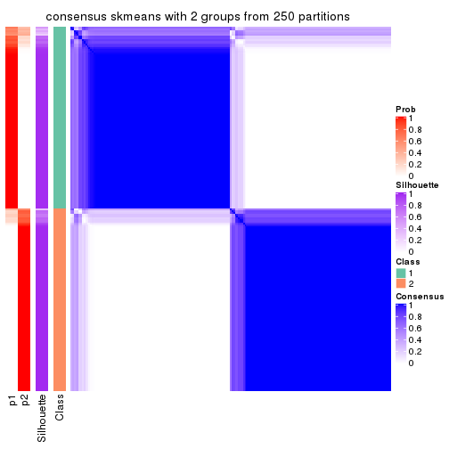</p>

</div>
<div id='tab-SD-skmeans-consensus-heatmap-2'>
<pre><code class="r">consensus_heatmap(res, k = 3)
</code></pre>

<p>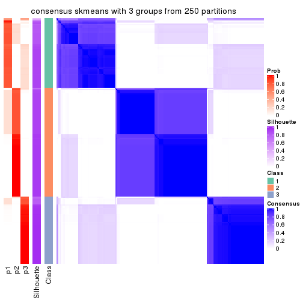</p>

</div>
<div id='tab-SD-skmeans-consensus-heatmap-3'>
<pre><code class="r">consensus_heatmap(res, k = 4)
</code></pre>

<p>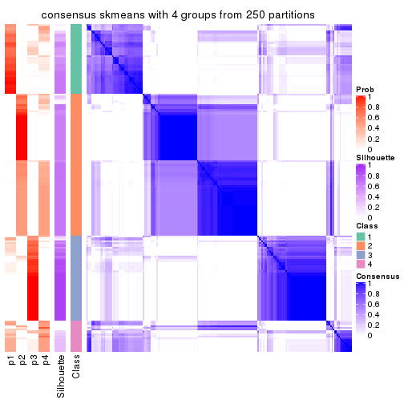</p>

</div>
<div id='tab-SD-skmeans-consensus-heatmap-4'>
<pre><code class="r">consensus_heatmap(res, k = 5)
</code></pre>

<p>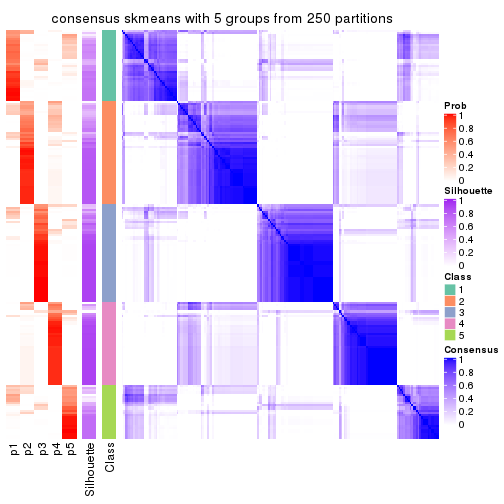</p>

</div>
<div id='tab-SD-skmeans-consensus-heatmap-5'>
<pre><code class="r">consensus_heatmap(res, k = 6)
</code></pre>

<p>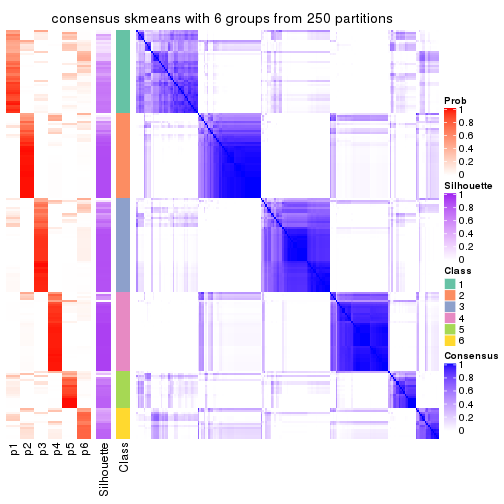</p>

</div>
</div>

Heatmaps for the membership of samples in all partitions to see how consistent they are:


<script>
$( function() {
	$( '#tabs-SD-skmeans-membership-heatmap' ).tabs();
} );
</script>
<div id='tabs-SD-skmeans-membership-heatmap'>
<ul>
<li><a href='#tab-SD-skmeans-membership-heatmap-1'>k = 2</a></li>
<li><a href='#tab-SD-skmeans-membership-heatmap-2'>k = 3</a></li>
<li><a href='#tab-SD-skmeans-membership-heatmap-3'>k = 4</a></li>
<li><a href='#tab-SD-skmeans-membership-heatmap-4'>k = 5</a></li>
<li><a href='#tab-SD-skmeans-membership-heatmap-5'>k = 6</a></li>
</ul>
<div id='tab-SD-skmeans-membership-heatmap-1'>
<pre><code class="r">membership_heatmap(res, k = 2)
</code></pre>

<p>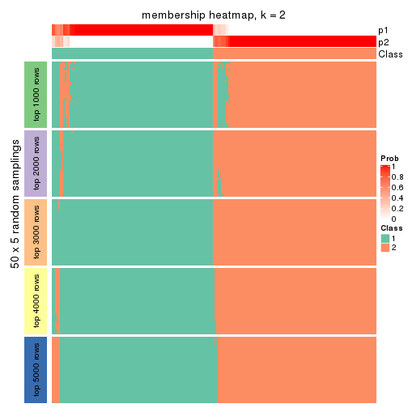</p>

</div>
<div id='tab-SD-skmeans-membership-heatmap-2'>
<pre><code class="r">membership_heatmap(res, k = 3)
</code></pre>

<p>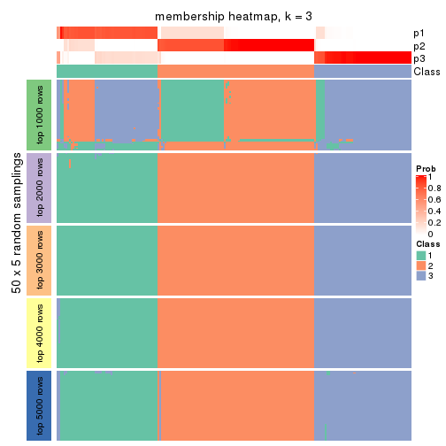</p>

</div>
<div id='tab-SD-skmeans-membership-heatmap-3'>
<pre><code class="r">membership_heatmap(res, k = 4)
</code></pre>

<p>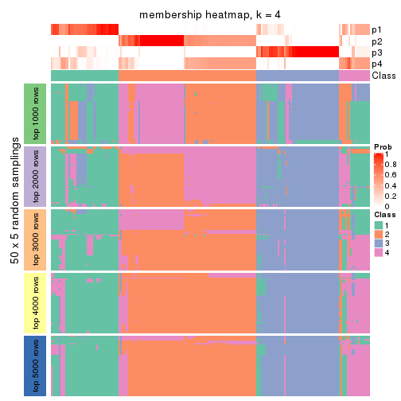</p>

</div>
<div id='tab-SD-skmeans-membership-heatmap-4'>
<pre><code class="r">membership_heatmap(res, k = 5)
</code></pre>

<p>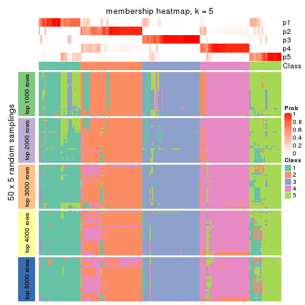</p>

</div>
<div id='tab-SD-skmeans-membership-heatmap-5'>
<pre><code class="r">membership_heatmap(res, k = 6)
</code></pre>

<p>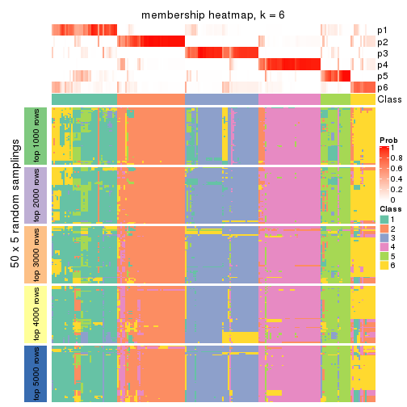</p>

</div>
</div>

As soon as we have had the classes for columns, we can look for signatures
which are significantly different between classes which can be candidate marks
for certain classes. Following are the heatmaps for signatures.


Signature heatmaps where rows are scaled:


<script>
$( function() {
	$( '#tabs-SD-skmeans-get-signatures' ).tabs();
} );
</script>
<div id='tabs-SD-skmeans-get-signatures'>
<ul>
<li><a href='#tab-SD-skmeans-get-signatures-1'>k = 2</a></li>
<li><a href='#tab-SD-skmeans-get-signatures-2'>k = 3</a></li>
<li><a href='#tab-SD-skmeans-get-signatures-3'>k = 4</a></li>
<li><a href='#tab-SD-skmeans-get-signatures-4'>k = 5</a></li>
<li><a href='#tab-SD-skmeans-get-signatures-5'>k = 6</a></li>
</ul>
<div id='tab-SD-skmeans-get-signatures-1'>
<pre><code class="r">get_signatures(res, k = 2)
</code></pre>

<p>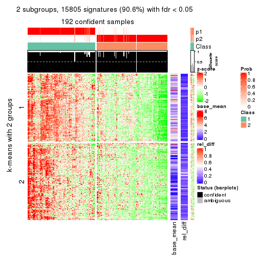</p>

</div>
<div id='tab-SD-skmeans-get-signatures-2'>
<pre><code class="r">get_signatures(res, k = 3)
</code></pre>

<p>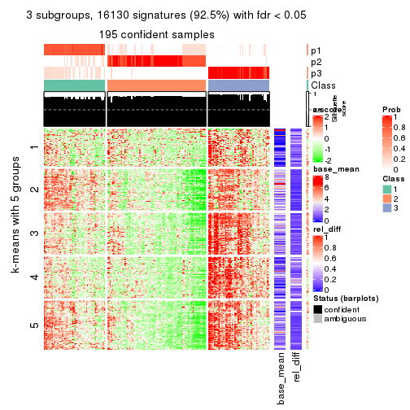</p>

</div>
<div id='tab-SD-skmeans-get-signatures-3'>
<pre><code class="r">get_signatures(res, k = 4)
</code></pre>

<p>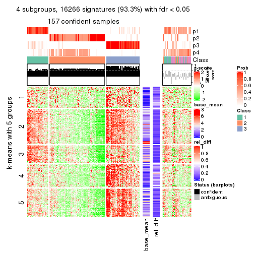</p>

</div>
<div id='tab-SD-skmeans-get-signatures-4'>
<pre><code class="r">get_signatures(res, k = 5)
</code></pre>

<p>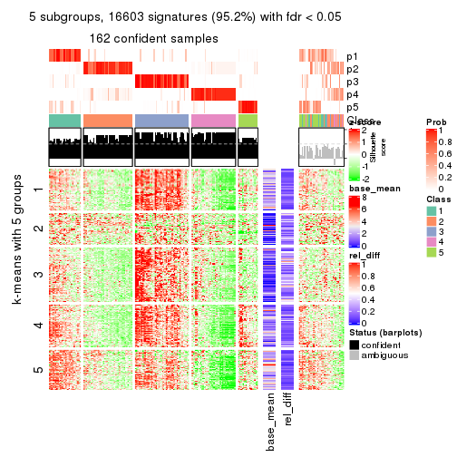</p>

</div>
<div id='tab-SD-skmeans-get-signatures-5'>
<pre><code class="r">get_signatures(res, k = 6)
</code></pre>

<p>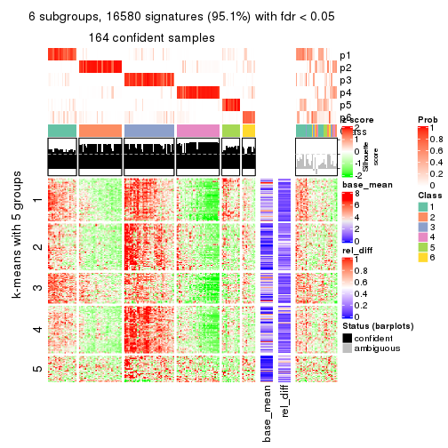</p>

</div>
</div>


Signature heatmaps where rows are not scaled:


<script>
$( function() {
	$( '#tabs-SD-skmeans-get-signatures-no-scale' ).tabs();
} );
</script>
<div id='tabs-SD-skmeans-get-signatures-no-scale'>
<ul>
<li><a href='#tab-SD-skmeans-get-signatures-no-scale-1'>k = 2</a></li>
<li><a href='#tab-SD-skmeans-get-signatures-no-scale-2'>k = 3</a></li>
<li><a href='#tab-SD-skmeans-get-signatures-no-scale-3'>k = 4</a></li>
<li><a href='#tab-SD-skmeans-get-signatures-no-scale-4'>k = 5</a></li>
<li><a href='#tab-SD-skmeans-get-signatures-no-scale-5'>k = 6</a></li>
</ul>
<div id='tab-SD-skmeans-get-signatures-no-scale-1'>
<pre><code class="r">get_signatures(res, k = 2, scale_rows = FALSE)
</code></pre>

<p>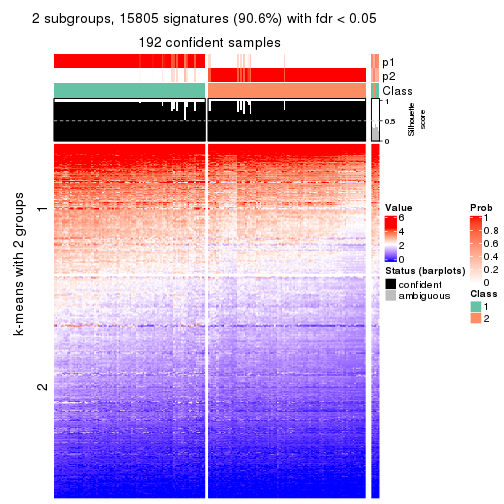</p>

</div>
<div id='tab-SD-skmeans-get-signatures-no-scale-2'>
<pre><code class="r">get_signatures(res, k = 3, scale_rows = FALSE)
</code></pre>

<p>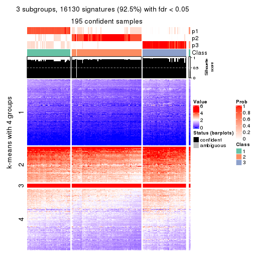</p>

</div>
<div id='tab-SD-skmeans-get-signatures-no-scale-3'>
<pre><code class="r">get_signatures(res, k = 4, scale_rows = FALSE)
</code></pre>

<p>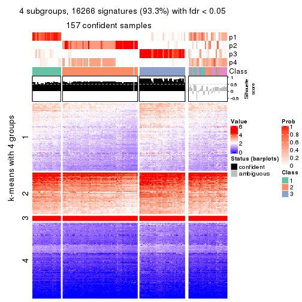</p>

</div>
<div id='tab-SD-skmeans-get-signatures-no-scale-4'>
<pre><code class="r">get_signatures(res, k = 5, scale_rows = FALSE)
</code></pre>

<p>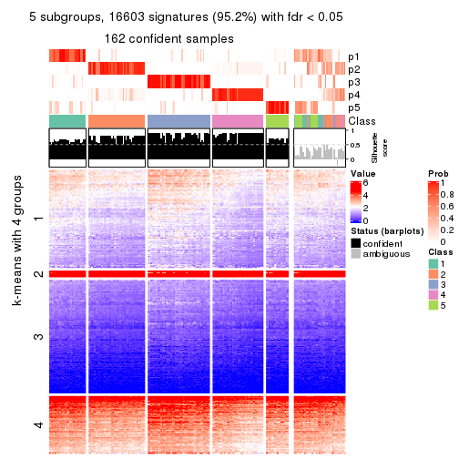</p>

</div>
<div id='tab-SD-skmeans-get-signatures-no-scale-5'>
<pre><code class="r">get_signatures(res, k = 6, scale_rows = FALSE)
</code></pre>

<p>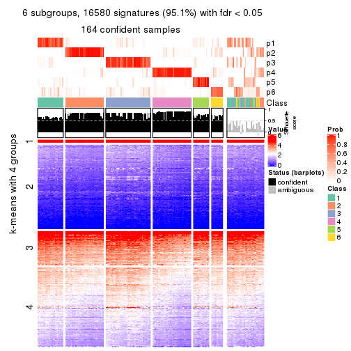</p>

</div>
</div>


Compare the overlap of signatures from different k:

```r
compare_signatures(res)
```

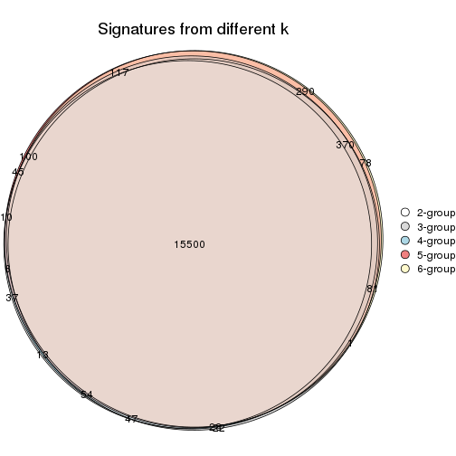

`get_signature()` returns a data frame invisibly. TO get the list of signatures, the function
call should be assigned to a variable explicitly. In following code, if `plot` argument is set
to `FALSE`, no heatmap is plotted while only the differential analysis is performed.

```r
# code only for demonstration
tb = get_signature(res, k = ..., plot = FALSE)
```

An example of the output of `tb` is:

```
#>   which_row         fdr    mean_1    mean_2 scaled_mean_1 scaled_mean_2 km
#> 1        38 0.042760348  8.373488  9.131774    -0.5533452     0.5164555  1
#> 2        40 0.018707592  7.106213  8.469186    -0.6173731     0.5762149  1
#> 3        55 0.019134737 10.221463 11.207825    -0.6159697     0.5749050  1
#> 4        59 0.006059896  5.921854  7.869574    -0.6899429     0.6439467  1
#> 5        60 0.018055526  8.928898 10.211722    -0.6204761     0.5791110  1
#> 6        98 0.009384629 15.714769 14.887706     0.6635654    -0.6193277  2
...
```

The columns in `tb` are:

1. `which_row`: row indices corresponding to the input matrix.
2. `fdr`: FDR for the differential test. 
3. `mean_x`: The mean value in group x.
4. `scaled_mean_x`: The mean value in group x after rows are scaled.
5. `km`: Row groups if k-means clustering is applied to rows.


UMAP plot which shows how samples are separated.


<script>
$( function() {
	$( '#tabs-SD-skmeans-dimension-reduction' ).tabs();
} );
</script>
<div id='tabs-SD-skmeans-dimension-reduction'>
<ul>
<li><a href='#tab-SD-skmeans-dimension-reduction-1'>k = 2</a></li>
<li><a href='#tab-SD-skmeans-dimension-reduction-2'>k = 3</a></li>
<li><a href='#tab-SD-skmeans-dimension-reduction-3'>k = 4</a></li>
<li><a href='#tab-SD-skmeans-dimension-reduction-4'>k = 5</a></li>
<li><a href='#tab-SD-skmeans-dimension-reduction-5'>k = 6</a></li>
</ul>
<div id='tab-SD-skmeans-dimension-reduction-1'>
<pre><code class="r">dimension_reduction(res, k = 2, method = &quot;UMAP&quot;)
</code></pre>

<p>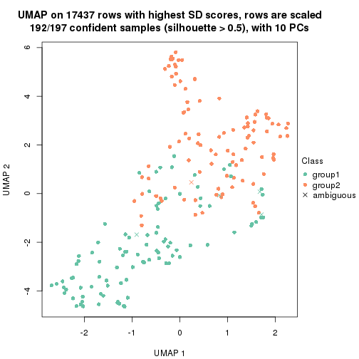</p>

</div>
<div id='tab-SD-skmeans-dimension-reduction-2'>
<pre><code class="r">dimension_reduction(res, k = 3, method = &quot;UMAP&quot;)
</code></pre>

<p>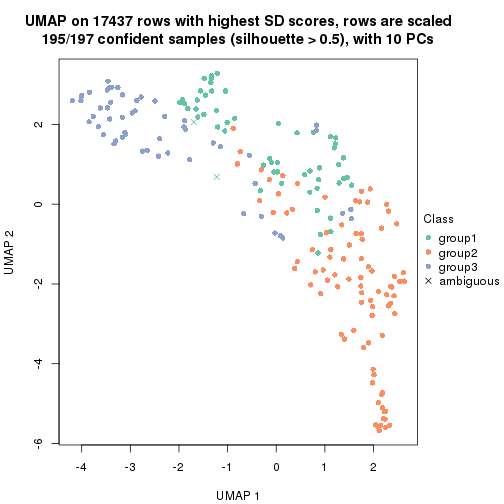</p>

</div>
<div id='tab-SD-skmeans-dimension-reduction-3'>
<pre><code class="r">dimension_reduction(res, k = 4, method = &quot;UMAP&quot;)
</code></pre>

<p>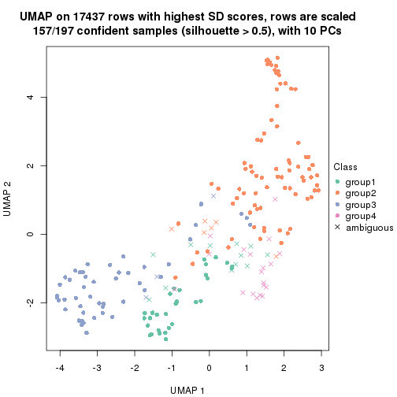</p>

</div>
<div id='tab-SD-skmeans-dimension-reduction-4'>
<pre><code class="r">dimension_reduction(res, k = 5, method = &quot;UMAP&quot;)
</code></pre>

<p>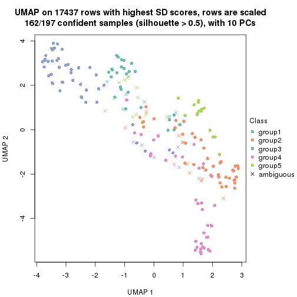</p>

</div>
<div id='tab-SD-skmeans-dimension-reduction-5'>
<pre><code class="r">dimension_reduction(res, k = 6, method = &quot;UMAP&quot;)
</code></pre>

<p>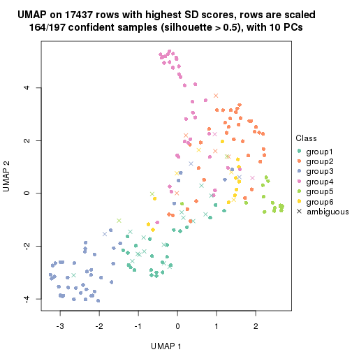</p>

</div>
</div>


Following heatmap shows how subgroups are split when increasing `k`:

```r
collect_classes(res)
```

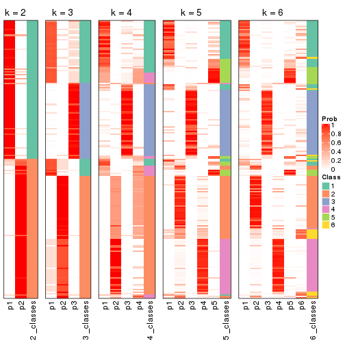


If matrix rows can be associated to genes, consider to use `GO_Enrichment(res,
...)` to perform function enrichment for the signature genes.


 

---------------------------------------------------


### SD:pam


The object with results only for a single top-value method and a single partition method 
can be extracted as:

```r
res = res_list["SD", "pam"]
# you can also extract it by
# res = res_list["SD:pam"]
```

A summary of `res` and all the functions that can be applied to it:

```r
res
```

```
#> A 'ConsensusPartition' object with k = 2, 3, 4, 5, 6.
#>   On a matrix with 17437 rows and 197 columns.
#>   Top rows (1000, 2000, 3000, 4000, 5000) are extracted by 'SD' method.
#>   Subgroups are detected by 'pam' method.
#>   Performed in total 1250 partitions by row resampling.
#>   Best k for subgroups seems to be 3.
#> 
#> Following methods can be applied to this 'ConsensusPartition' object:
#>  [1] "cola_report"             "collect_classes"         "collect_plots"          
#>  [4] "collect_stats"           "colnames"                "compare_signatures"     
#>  [7] "consensus_heatmap"       "dimension_reduction"     "functional_enrichment"  
#> [10] "get_anno_col"            "get_anno"                "get_classes"            
#> [13] "get_consensus"           "get_matrix"              "get_membership"         
#> [16] "get_param"               "get_signatures"          "get_stats"              
#> [19] "is_best_k"               "is_stable_k"             "membership_heatmap"     
#> [22] "ncol"                    "nrow"                    "plot_ecdf"              
#> [25] "rownames"                "select_partition_number" "show"                   
#> [28] "suggest_best_k"          "test_to_known_factors"
```

`collect_plots()` function collects all the plots made from `res` for all `k` (number of partitions)
into one single page to provide an easy and fast comparison between different `k`.

```r
collect_plots(res)
```

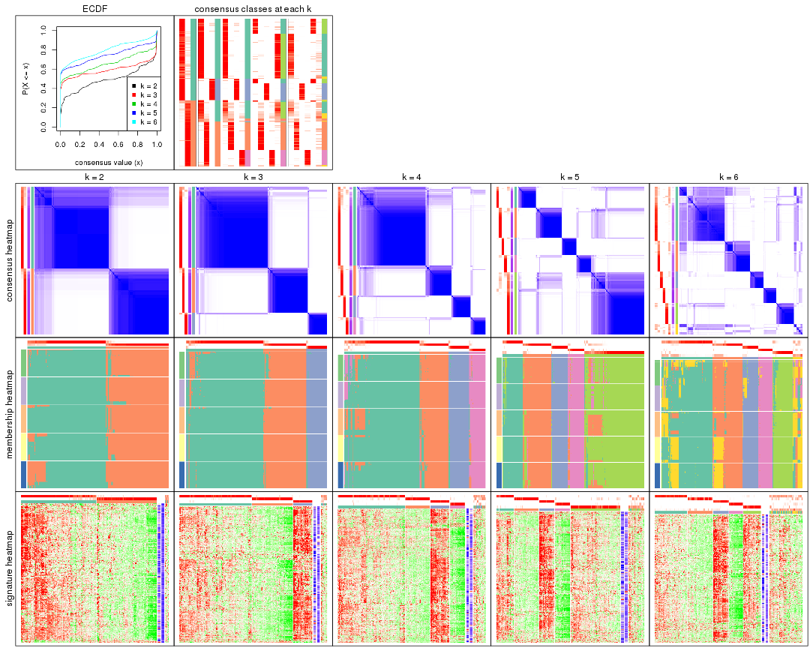

The plots are:

- The first row: a plot of the ECDF (Empirical cumulative distribution
  function) curves of the consensus matrix for each `k` and the heatmap of
  predicted classes for each `k`.
- The second row: heatmaps of the consensus matrix for each `k`.
- The third row: heatmaps of the membership matrix for each `k`.
- The fouth row: heatmaps of the signatures for each `k`.

All the plots in panels can be made by individual functions and they are
plotted later in this section.

`select_partition_number()` produces several plots showing different
statistics for choosing "optimized" `k`. There are following statistics:

- ECDF curves of the consensus matrix for each `k`;
- 1-PAC. [The PAC
  score](https://en.wikipedia.org/wiki/Consensus_clustering#Over-interpretation_potential_of_consensus_clustering)
  measures the proportion of the ambiguous subgrouping.
- Mean silhouette score.
- Concordance. The mean probability of fiting the consensus class ids in all
  partitions.
- Area increased. Denote $A_k$ as the area under the ECDF curve for current
  `k`, the area increased is defined as $A_k - A_{k-1}$.
- Rand index. The percent of pairs of samples that are both in a same cluster
  or both are not in a same cluster in the partition of k and k-1.
- Jaccard index. The ratio of pairs of samples are both in a same cluster in
  the partition of k and k-1 and the pairs of samples are both in a same
  cluster in the partition k or k-1.

The detailed explanations of these statistics can be found in [the cola
vignette](http://bioconductor.org/packages/devel/bioc/vignettes/cola/inst/doc/cola.html#toc_13).

Generally speaking, lower PAC score, higher mean silhouette score or higher
concordance corresponds to better partition. Rand index and Jaccard index
measure how similar the current partition is compared to partition with `k-1`.
If they are too similar, we won't accept `k` is better than `k-1`.

```r
select_partition_number(res)
```

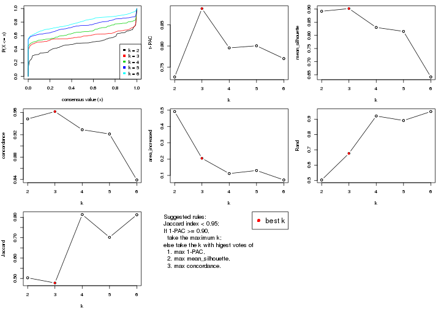

The numeric values for all these statistics can be obtained by `get_stats()`.

```r
get_stats(res)
```

```
#>   k 1-PAC mean_silhouette concordance area_increased  Rand Jaccard
#> 2 2 0.727           0.892       0.948          0.492 0.503   0.503
#> 3 3 0.889           0.902       0.962          0.205 0.677   0.478
#> 4 4 0.796           0.830       0.929          0.111 0.921   0.813
#> 5 5 0.801           0.815       0.921          0.130 0.891   0.702
#> 6 6 0.770           0.642       0.839          0.072 0.950   0.812
```

`suggest_best_k()` suggests the best $k$ based on these statistics. The rules are as follows:

- All $k$ with Jaccard index larger than 0.95 are removed because the increase of
  the partition number does not provides enough extra information. If all $k$ are removed,
  the best $k$ is assigned by `NA`.
- For $k$ with 1-PAC larger than 0.9, the maximal $k$ is taken as the "best k". Other $k$ is called "optional k".
- If it does not fit the second rule. The $k$ with the highest vote of highest
  1-PAC, mean silhouette and concordance is taken as the "best k".

```r
suggest_best_k(res)
```

```
#> [1] 3
```


Following shows the table of the partitions (You need to click the **show/hide
code output** link to see it). The membership matrix (columns with name `p*`)
is inferred by
[`clue::cl_consensus()`](https://www.rdocumentation.org/link/cl_consensus?package=clue)
function with the `SE` method. Basically the value in the membership matrix
represents the probability to belong to a certain group. The finall class
label for an item is determined with the group with highest probability it
belongs to.

In `get_classes()` function, the entropy is calculated from the membership
matrix and the silhouette score is calculated from the consensus matrix.


<script>
$( function() {
	$( '#tabs-SD-pam-get-classes' ).tabs();
} );
</script>
<div id='tabs-SD-pam-get-classes'>
<ul>
<li><a href='#tab-SD-pam-get-classes-1'>k = 2</a></li>
<li><a href='#tab-SD-pam-get-classes-2'>k = 3</a></li>
<li><a href='#tab-SD-pam-get-classes-3'>k = 4</a></li>
<li><a href='#tab-SD-pam-get-classes-4'>k = 5</a></li>
<li><a href='#tab-SD-pam-get-classes-5'>k = 6</a></li>
</ul>

<div id='tab-SD-pam-get-classes-1'>
<p><a id='tab-SD-pam-get-classes-1-a' style='color:#0366d6' href='#'>show/hide code output</a></p>
<pre><code class="r">cbind(get_classes(res, k = 2), get_membership(res, k = 2))
</code></pre>

<pre><code>#&gt;            class entropy silhouette    p1    p2
#&gt; SRR1380886     1  0.0000      0.934 1.000 0.000
#&gt; SRR1074385     1  0.0376      0.935 0.996 0.004
#&gt; SRR1374739     1  0.0000      0.934 1.000 0.000
#&gt; SRR1097883     1  0.0000      0.934 1.000 0.000
#&gt; SRR2167209     2  0.7299      0.740 0.204 0.796
#&gt; SRR816541      2  0.0000      0.955 0.000 1.000
#&gt; SRR663645      2  0.9896      0.158 0.440 0.560
#&gt; SRR1381505     2  0.0000      0.955 0.000 1.000
#&gt; SRR1416362     2  0.0000      0.955 0.000 1.000
#&gt; SRR1318503     2  0.8713      0.584 0.292 0.708
#&gt; SRR1341626     2  0.0000      0.955 0.000 1.000
#&gt; SRR1382440     1  0.0000      0.934 1.000 0.000
#&gt; SRR1088413     1  0.0376      0.935 0.996 0.004
#&gt; SRR1082080     2  0.0000      0.955 0.000 1.000
#&gt; SRR1455783     1  0.0376      0.935 0.996 0.004
#&gt; SRR1447760     2  0.0938      0.951 0.012 0.988
#&gt; SRR1487784     2  0.0000      0.955 0.000 1.000
#&gt; SRR1331037     2  0.0938      0.951 0.012 0.988
#&gt; SRR1095651     1  0.0000      0.934 1.000 0.000
#&gt; SRR1078066     1  0.0000      0.934 1.000 0.000
#&gt; SRR1120363     1  0.0376      0.935 0.996 0.004
#&gt; SRR821231      1  0.0000      0.934 1.000 0.000
#&gt; SRR1374373     1  0.9209      0.567 0.664 0.336
#&gt; SRR1324519     2  0.0000      0.955 0.000 1.000
#&gt; SRR1431121     1  0.0376      0.935 0.996 0.004
#&gt; SRR1091032     2  0.0000      0.955 0.000 1.000
#&gt; SRR1365575     2  0.0000      0.955 0.000 1.000
#&gt; SRR1072972     1  0.0000      0.934 1.000 0.000
#&gt; SRR1310690     2  0.0000      0.955 0.000 1.000
#&gt; SRR1383037     1  0.0000      0.934 1.000 0.000
#&gt; SRR1095479     1  0.0000      0.934 1.000 0.000
#&gt; SRR1070403     1  0.0000      0.934 1.000 0.000
#&gt; SRR1390203     1  0.0376      0.935 0.996 0.004
#&gt; SRR1072007     2  0.2236      0.939 0.036 0.964
#&gt; SRR1468787     1  0.6973      0.791 0.812 0.188
#&gt; SRR1347959     2  0.0000      0.955 0.000 1.000
#&gt; SRR1338513     1  0.0376      0.935 0.996 0.004
#&gt; SRR812598      2  0.0000      0.955 0.000 1.000
#&gt; SRR1446806     1  0.7056      0.787 0.808 0.192
#&gt; SRR1394275     1  0.0376      0.935 0.996 0.004
#&gt; SRR1443633     1  0.0000      0.934 1.000 0.000
#&gt; SRR1087728     1  0.0000      0.934 1.000 0.000
#&gt; SRR1098192     2  0.2236      0.939 0.036 0.964
#&gt; SRR1093340     2  0.0000      0.955 0.000 1.000
#&gt; SRR665405      2  0.4815      0.876 0.104 0.896
#&gt; SRR657077      2  0.3584      0.906 0.068 0.932
#&gt; SRR813208      1  0.0000      0.934 1.000 0.000
#&gt; SRR1416074     2  0.0000      0.955 0.000 1.000
#&gt; SRR1089688     2  0.2236      0.939 0.036 0.964
#&gt; SRR1353461     1  0.0000      0.934 1.000 0.000
#&gt; SRR1466321     1  0.8327      0.693 0.736 0.264
#&gt; SRR1073021     1  0.6048      0.828 0.852 0.148
#&gt; SRR1322816     2  0.0000      0.955 0.000 1.000
#&gt; SRR1457727     1  0.0000      0.934 1.000 0.000
#&gt; SRR1464226     2  0.2236      0.939 0.036 0.964
#&gt; SRR1398863     1  0.0376      0.935 0.996 0.004
#&gt; SRR1455631     2  0.4690      0.879 0.100 0.900
#&gt; SRR1307808     2  0.2236      0.939 0.036 0.964
#&gt; SRR1374585     2  0.0000      0.955 0.000 1.000
#&gt; SRR1072104     2  0.1843      0.943 0.028 0.972
#&gt; SRR1076868     2  0.0000      0.955 0.000 1.000
#&gt; SRR1335984     1  0.8955      0.615 0.688 0.312
#&gt; SRR1445939     1  0.1414      0.926 0.980 0.020
#&gt; SRR1453047     2  0.0000      0.955 0.000 1.000
#&gt; SRR1339788     1  0.0000      0.934 1.000 0.000
#&gt; SRR1084323     1  0.0376      0.935 0.996 0.004
#&gt; SRR1092937     1  0.0376      0.935 0.996 0.004
#&gt; SRR1074090     2  0.0000      0.955 0.000 1.000
#&gt; SRR1099833     1  0.0376      0.935 0.996 0.004
#&gt; SRR1093434     1  0.0000      0.934 1.000 0.000
#&gt; SRR1435857     1  0.0376      0.935 0.996 0.004
#&gt; SRR1480347     2  0.0000      0.955 0.000 1.000
#&gt; SRR1440787     2  0.0000      0.955 0.000 1.000
#&gt; SRR1430202     1  0.6973      0.791 0.812 0.188
#&gt; SRR1322730     2  0.0000      0.955 0.000 1.000
#&gt; SRR811029      2  0.1843      0.943 0.028 0.972
#&gt; SRR1390456     1  0.0000      0.934 1.000 0.000
#&gt; SRR1381140     1  0.0376      0.935 0.996 0.004
#&gt; SRR1388064     2  0.0000      0.955 0.000 1.000
#&gt; SRR1093577     1  0.0376      0.935 0.996 0.004
#&gt; SRR1414161     1  0.1843      0.921 0.972 0.028
#&gt; SRR1328738     1  0.8327      0.693 0.736 0.264
#&gt; SRR1311752     2  0.0000      0.955 0.000 1.000
#&gt; SRR1445960     2  0.0000      0.955 0.000 1.000
#&gt; SRR1403412     2  0.0376      0.954 0.004 0.996
#&gt; SRR2166748     1  0.0000      0.934 1.000 0.000
#&gt; SRR821666      2  0.0000      0.955 0.000 1.000
#&gt; SRR1330746     1  0.0000      0.934 1.000 0.000
#&gt; SRR1327872     2  0.0000      0.955 0.000 1.000
#&gt; SRR1100800     1  0.0376      0.935 0.996 0.004
#&gt; SRR1075174     1  0.0376      0.935 0.996 0.004
#&gt; SRR1434436     1  0.6973      0.791 0.812 0.188
#&gt; SRR1389409     2  0.0000      0.955 0.000 1.000
#&gt; SRR1085310     1  0.0376      0.935 0.996 0.004
#&gt; SRR1376718     2  0.0000      0.955 0.000 1.000
#&gt; SRR808590      2  0.0000      0.955 0.000 1.000
#&gt; SRR1084128     2  0.0000      0.955 0.000 1.000
#&gt; SRR1361692     1  0.6887      0.795 0.816 0.184
#&gt; SRR1431493     1  0.0000      0.934 1.000 0.000
#&gt; SRR1409084     1  0.0376      0.935 0.996 0.004
#&gt; SRR2166214     2  0.2236      0.939 0.036 0.964
#&gt; SRR1324102     2  0.2043      0.941 0.032 0.968
#&gt; SRR1079754     2  0.0000      0.955 0.000 1.000
#&gt; SRR1442127     1  0.0000      0.934 1.000 0.000
#&gt; SRR1076244     2  0.0938      0.951 0.012 0.988
#&gt; SRR1330901     2  0.2236      0.939 0.036 0.964
#&gt; SRR1073167     2  0.0000      0.955 0.000 1.000
#&gt; SRR1357541     1  0.0000      0.934 1.000 0.000
#&gt; SRR811607      1  0.8608      0.661 0.716 0.284
#&gt; SRR1468931     1  0.0000      0.934 1.000 0.000
#&gt; SRR1474908     2  0.9000      0.507 0.316 0.684
#&gt; SRR1309875     2  0.0000      0.955 0.000 1.000
#&gt; SRR598792      1  0.0000      0.934 1.000 0.000
#&gt; SRR1088537     2  0.0000      0.955 0.000 1.000
#&gt; SRR1457682     1  0.0376      0.935 0.996 0.004
#&gt; SRR1454289     2  0.9795      0.250 0.416 0.584
#&gt; SRR1069352     1  0.0000      0.934 1.000 0.000
#&gt; SRR1472728     2  0.0000      0.955 0.000 1.000
#&gt; SRR1091144     2  0.2423      0.936 0.040 0.960
#&gt; SRR1319118     1  0.0000      0.934 1.000 0.000
#&gt; SRR1403611     1  0.0376      0.935 0.996 0.004
#&gt; SRR1397762     1  0.0376      0.935 0.996 0.004
#&gt; SRR1317387     1  0.0000      0.934 1.000 0.000
#&gt; SRR1376426     2  0.0000      0.955 0.000 1.000
#&gt; SRR1097777     1  0.0000      0.934 1.000 0.000
#&gt; SRR1365743     1  0.0000      0.934 1.000 0.000
#&gt; SRR1458992     2  0.0376      0.954 0.004 0.996
#&gt; SRR1089537     1  0.4815      0.865 0.896 0.104
#&gt; SRR1397744     1  0.0376      0.935 0.996 0.004
#&gt; SRR1453893     2  0.0000      0.955 0.000 1.000
#&gt; SRR1098543     1  0.0376      0.935 0.996 0.004
#&gt; SRR1321765     1  0.0376      0.935 0.996 0.004
#&gt; SRR1440032     1  0.0938      0.930 0.988 0.012
#&gt; SRR1404507     2  0.0000      0.955 0.000 1.000
#&gt; SRR1404856     2  0.7453      0.727 0.212 0.788
#&gt; SRR812745      1  0.3274      0.899 0.940 0.060
#&gt; SRR1417524     1  0.0000      0.934 1.000 0.000
#&gt; SRR1407334     2  0.0000      0.955 0.000 1.000
#&gt; SRR1453991     1  0.0376      0.935 0.996 0.004
#&gt; SRR1415938     1  0.0376      0.935 0.996 0.004
#&gt; SRR1081259     1  0.6973      0.791 0.812 0.188
#&gt; SRR1436187     2  0.0000      0.955 0.000 1.000
#&gt; SRR1431948     1  0.0000      0.934 1.000 0.000
#&gt; SRR1453277     1  0.7528      0.759 0.784 0.216
#&gt; SRR1095407     2  0.9866      0.189 0.432 0.568
#&gt; SRR1359694     2  0.4690      0.879 0.100 0.900
#&gt; SRR656982      1  0.8813      0.635 0.700 0.300
#&gt; SRR1354338     2  0.2236      0.939 0.036 0.964
#&gt; SRR1088291     1  0.8443      0.681 0.728 0.272
#&gt; SRR1080624     1  0.0376      0.935 0.996 0.004
#&gt; SRR2166708     1  0.0000      0.934 1.000 0.000
#&gt; SRR1393572     1  0.0376      0.935 0.996 0.004
#&gt; SRR1429912     2  0.0000      0.955 0.000 1.000
#&gt; SRR1421048     2  0.3114      0.923 0.056 0.944
#&gt; SRR1434999     1  0.0000      0.934 1.000 0.000
#&gt; SRR656457      1  0.0000      0.934 1.000 0.000
#&gt; SRR1098928     1  0.0000      0.934 1.000 0.000
#&gt; SRR1343967     2  0.0000      0.955 0.000 1.000
#&gt; SRR1360766     1  0.6973      0.791 0.812 0.188
#&gt; SRR1464724     2  0.0938      0.951 0.012 0.988
#&gt; SRR1101542     2  0.0000      0.955 0.000 1.000
#&gt; SRR1401528     1  0.0000      0.934 1.000 0.000
#&gt; SRR1071519     1  0.0000      0.934 1.000 0.000
#&gt; SRR1086070     1  0.0376      0.935 0.996 0.004
#&gt; SRR1358645     2  0.4815      0.876 0.104 0.896
#&gt; SRR819771      1  0.0000      0.934 1.000 0.000
#&gt; SRR1418433     2  0.2236      0.939 0.036 0.964
#&gt; SRR821050      1  0.0376      0.935 0.996 0.004
#&gt; SRR1402091     2  0.0376      0.954 0.004 0.996
#&gt; SRR1322028     2  0.0376      0.954 0.004 0.996
#&gt; SRR1452556     2  0.0000      0.955 0.000 1.000
#&gt; SRR1340047     1  0.9044      0.602 0.680 0.320
#&gt; SRR1418302     2  0.0672      0.953 0.008 0.992
#&gt; SRR1073991     1  0.0000      0.934 1.000 0.000
#&gt; SRR1085187     2  0.0672      0.952 0.008 0.992
#&gt; SRR1357618     1  0.0000      0.934 1.000 0.000
#&gt; SRR1487764     1  0.8661      0.651 0.712 0.288
#&gt; SRR1075336     1  0.0376      0.935 0.996 0.004
#&gt; SRR1365471     2  0.0000      0.955 0.000 1.000
#&gt; SRR1414613     2  0.0000      0.955 0.000 1.000
#&gt; SRR658719      1  0.9775      0.384 0.588 0.412
#&gt; SRR1475128     1  0.0000      0.934 1.000 0.000
#&gt; SRR1367630     2  0.1633      0.945 0.024 0.976
#&gt; SRR1481146     2  0.2043      0.941 0.032 0.968
#&gt; SRR1465674     1  0.6973      0.791 0.812 0.188
#&gt; SRR1327303     1  0.7883      0.734 0.764 0.236
#&gt; SRR1390391     1  0.7602      0.755 0.780 0.220
#&gt; SRR1326020     1  0.9552      0.479 0.624 0.376
#&gt; SRR1381953     1  0.4690      0.868 0.900 0.100
#&gt; SRR1082544     2  0.0000      0.955 0.000 1.000
#&gt; SRR810761      1  0.0000      0.934 1.000 0.000
#&gt; SRR1070764     1  0.0000      0.934 1.000 0.000
#&gt; SRR1415919     1  0.0000      0.934 1.000 0.000
#&gt; SRR1490404     2  0.0000      0.955 0.000 1.000
#&gt; SRR1416773     1  0.6973      0.791 0.812 0.188
#&gt; SRR1377492     2  0.6438      0.798 0.164 0.836
#&gt; SRR1334314     1  0.7056      0.786 0.808 0.192
</code></pre>

<script>
$('#tab-SD-pam-get-classes-1-a').parent().next().next().hide();
$('#tab-SD-pam-get-classes-1-a').click(function(){
  $('#tab-SD-pam-get-classes-1-a').parent().next().next().toggle();
  return(false);
});
</script>
</div>

<div id='tab-SD-pam-get-classes-2'>
<p><a id='tab-SD-pam-get-classes-2-a' style='color:#0366d6' href='#'>show/hide code output</a></p>
<pre><code class="r">cbind(get_classes(res, k = 3), get_membership(res, k = 3))
</code></pre>

<pre><code>#&gt;            class entropy silhouette    p1    p2    p3
#&gt; SRR1380886     3  0.0592     0.9479 0.012 0.000 0.988
#&gt; SRR1074385     1  0.0000     0.9514 1.000 0.000 0.000
#&gt; SRR1374739     3  0.0000     0.9562 0.000 0.000 1.000
#&gt; SRR1097883     1  0.0000     0.9514 1.000 0.000 0.000
#&gt; SRR2167209     1  0.0000     0.9514 1.000 0.000 0.000
#&gt; SRR816541      2  0.0000     0.9560 0.000 1.000 0.000
#&gt; SRR663645      1  0.4931     0.7126 0.768 0.232 0.000
#&gt; SRR1381505     2  0.0000     0.9560 0.000 1.000 0.000
#&gt; SRR1416362     2  0.0000     0.9560 0.000 1.000 0.000
#&gt; SRR1318503     1  0.3267     0.8510 0.884 0.116 0.000
#&gt; SRR1341626     2  0.0000     0.9560 0.000 1.000 0.000
#&gt; SRR1382440     3  0.0000     0.9562 0.000 0.000 1.000
#&gt; SRR1088413     1  0.0000     0.9514 1.000 0.000 0.000
#&gt; SRR1082080     2  0.0000     0.9560 0.000 1.000 0.000
#&gt; SRR1455783     1  0.0000     0.9514 1.000 0.000 0.000
#&gt; SRR1447760     2  0.3752     0.7946 0.144 0.856 0.000
#&gt; SRR1487784     2  0.0000     0.9560 0.000 1.000 0.000
#&gt; SRR1331037     2  0.1860     0.9057 0.052 0.948 0.000
#&gt; SRR1095651     1  0.0237     0.9497 0.996 0.000 0.004
#&gt; SRR1078066     1  0.0592     0.9443 0.988 0.000 0.012
#&gt; SRR1120363     1  0.0000     0.9514 1.000 0.000 0.000
#&gt; SRR821231      3  0.2448     0.8797 0.076 0.000 0.924
#&gt; SRR1374373     1  0.0237     0.9497 0.996 0.004 0.000
#&gt; SRR1324519     2  0.0000     0.9560 0.000 1.000 0.000
#&gt; SRR1431121     1  0.0000     0.9514 1.000 0.000 0.000
#&gt; SRR1091032     2  0.0000     0.9560 0.000 1.000 0.000
#&gt; SRR1365575     2  0.0000     0.9560 0.000 1.000 0.000
#&gt; SRR1072972     1  0.0000     0.9514 1.000 0.000 0.000
#&gt; SRR1310690     2  0.0000     0.9560 0.000 1.000 0.000
#&gt; SRR1383037     3  0.0000     0.9562 0.000 0.000 1.000
#&gt; SRR1095479     1  0.2625     0.8775 0.916 0.000 0.084
#&gt; SRR1070403     3  0.0000     0.9562 0.000 0.000 1.000
#&gt; SRR1390203     1  0.0000     0.9514 1.000 0.000 0.000
#&gt; SRR1072007     1  0.0592     0.9451 0.988 0.012 0.000
#&gt; SRR1468787     1  0.0000     0.9514 1.000 0.000 0.000
#&gt; SRR1347959     2  0.4504     0.7027 0.196 0.804 0.000
#&gt; SRR1338513     1  0.0000     0.9514 1.000 0.000 0.000
#&gt; SRR812598      2  0.0000     0.9560 0.000 1.000 0.000
#&gt; SRR1446806     1  0.0000     0.9514 1.000 0.000 0.000
#&gt; SRR1394275     1  0.0000     0.9514 1.000 0.000 0.000
#&gt; SRR1443633     1  0.5254     0.6398 0.736 0.000 0.264
#&gt; SRR1087728     3  0.0000     0.9562 0.000 0.000 1.000
#&gt; SRR1098192     1  0.0592     0.9451 0.988 0.012 0.000
#&gt; SRR1093340     2  0.0000     0.9560 0.000 1.000 0.000
#&gt; SRR665405      1  0.0592     0.9451 0.988 0.012 0.000
#&gt; SRR657077      1  0.6192     0.3277 0.580 0.420 0.000
#&gt; SRR813208      3  0.0592     0.9479 0.012 0.000 0.988
#&gt; SRR1416074     2  0.0000     0.9560 0.000 1.000 0.000
#&gt; SRR1089688     1  0.6309    -0.0318 0.504 0.496 0.000
#&gt; SRR1353461     3  0.0424     0.9511 0.008 0.000 0.992
#&gt; SRR1466321     1  0.0000     0.9514 1.000 0.000 0.000
#&gt; SRR1073021     1  0.0000     0.9514 1.000 0.000 0.000
#&gt; SRR1322816     2  0.0000     0.9560 0.000 1.000 0.000
#&gt; SRR1457727     1  0.0000     0.9514 1.000 0.000 0.000
#&gt; SRR1464226     1  0.0892     0.9404 0.980 0.020 0.000
#&gt; SRR1398863     1  0.0000     0.9514 1.000 0.000 0.000
#&gt; SRR1455631     1  0.1031     0.9380 0.976 0.024 0.000
#&gt; SRR1307808     2  0.6286     0.1638 0.464 0.536 0.000
#&gt; SRR1374585     2  0.0000     0.9560 0.000 1.000 0.000
#&gt; SRR1072104     1  0.2165     0.9058 0.936 0.064 0.000
#&gt; SRR1076868     2  0.0000     0.9560 0.000 1.000 0.000
#&gt; SRR1335984     1  0.0000     0.9514 1.000 0.000 0.000
#&gt; SRR1445939     1  0.0000     0.9514 1.000 0.000 0.000
#&gt; SRR1453047     2  0.0000     0.9560 0.000 1.000 0.000
#&gt; SRR1339788     3  0.0000     0.9562 0.000 0.000 1.000
#&gt; SRR1084323     1  0.0000     0.9514 1.000 0.000 0.000
#&gt; SRR1092937     1  0.0000     0.9514 1.000 0.000 0.000
#&gt; SRR1074090     2  0.0000     0.9560 0.000 1.000 0.000
#&gt; SRR1099833     1  0.0000     0.9514 1.000 0.000 0.000
#&gt; SRR1093434     3  0.0000     0.9562 0.000 0.000 1.000
#&gt; SRR1435857     1  0.0000     0.9514 1.000 0.000 0.000
#&gt; SRR1480347     2  0.0000     0.9560 0.000 1.000 0.000
#&gt; SRR1440787     2  0.0000     0.9560 0.000 1.000 0.000
#&gt; SRR1430202     1  0.0000     0.9514 1.000 0.000 0.000
#&gt; SRR1322730     2  0.0000     0.9560 0.000 1.000 0.000
#&gt; SRR811029      1  0.4452     0.7636 0.808 0.192 0.000
#&gt; SRR1390456     3  0.0000     0.9562 0.000 0.000 1.000
#&gt; SRR1381140     1  0.0000     0.9514 1.000 0.000 0.000
#&gt; SRR1388064     2  0.0000     0.9560 0.000 1.000 0.000
#&gt; SRR1093577     1  0.0000     0.9514 1.000 0.000 0.000
#&gt; SRR1414161     1  0.0000     0.9514 1.000 0.000 0.000
#&gt; SRR1328738     1  0.0000     0.9514 1.000 0.000 0.000
#&gt; SRR1311752     2  0.0000     0.9560 0.000 1.000 0.000
#&gt; SRR1445960     2  0.0000     0.9560 0.000 1.000 0.000
#&gt; SRR1403412     2  0.1411     0.9227 0.036 0.964 0.000
#&gt; SRR2166748     1  0.0000     0.9514 1.000 0.000 0.000
#&gt; SRR821666      2  0.0000     0.9560 0.000 1.000 0.000
#&gt; SRR1330746     3  0.0000     0.9562 0.000 0.000 1.000
#&gt; SRR1327872     2  0.0000     0.9560 0.000 1.000 0.000
#&gt; SRR1100800     1  0.0000     0.9514 1.000 0.000 0.000
#&gt; SRR1075174     1  0.0000     0.9514 1.000 0.000 0.000
#&gt; SRR1434436     1  0.0000     0.9514 1.000 0.000 0.000
#&gt; SRR1389409     2  0.0000     0.9560 0.000 1.000 0.000
#&gt; SRR1085310     1  0.0000     0.9514 1.000 0.000 0.000
#&gt; SRR1376718     2  0.0000     0.9560 0.000 1.000 0.000
#&gt; SRR808590      2  0.0000     0.9560 0.000 1.000 0.000
#&gt; SRR1084128     2  0.0000     0.9560 0.000 1.000 0.000
#&gt; SRR1361692     1  0.0000     0.9514 1.000 0.000 0.000
#&gt; SRR1431493     1  0.6126     0.3029 0.600 0.000 0.400
#&gt; SRR1409084     1  0.0000     0.9514 1.000 0.000 0.000
#&gt; SRR2166214     1  0.0747     0.9428 0.984 0.016 0.000
#&gt; SRR1324102     1  0.1289     0.9319 0.968 0.032 0.000
#&gt; SRR1079754     2  0.0000     0.9560 0.000 1.000 0.000
#&gt; SRR1442127     3  0.0000     0.9562 0.000 0.000 1.000
#&gt; SRR1076244     2  0.4654     0.7065 0.208 0.792 0.000
#&gt; SRR1330901     1  0.2066     0.9077 0.940 0.060 0.000
#&gt; SRR1073167     2  0.0000     0.9560 0.000 1.000 0.000
#&gt; SRR1357541     1  0.0000     0.9514 1.000 0.000 0.000
#&gt; SRR811607      1  0.0000     0.9514 1.000 0.000 0.000
#&gt; SRR1468931     3  0.0000     0.9562 0.000 0.000 1.000
#&gt; SRR1474908     2  0.1411     0.9235 0.036 0.964 0.000
#&gt; SRR1309875     2  0.0000     0.9560 0.000 1.000 0.000
#&gt; SRR598792      3  0.0237     0.9539 0.004 0.000 0.996
#&gt; SRR1088537     1  0.6260     0.2448 0.552 0.448 0.000
#&gt; SRR1457682     1  0.0000     0.9514 1.000 0.000 0.000
#&gt; SRR1454289     1  0.0592     0.9451 0.988 0.012 0.000
#&gt; SRR1069352     3  0.0000     0.9562 0.000 0.000 1.000
#&gt; SRR1472728     2  0.0000     0.9560 0.000 1.000 0.000
#&gt; SRR1091144     1  0.1163     0.9346 0.972 0.028 0.000
#&gt; SRR1319118     1  0.2165     0.9007 0.936 0.000 0.064
#&gt; SRR1403611     1  0.0000     0.9514 1.000 0.000 0.000
#&gt; SRR1397762     1  0.0000     0.9514 1.000 0.000 0.000
#&gt; SRR1317387     1  0.0000     0.9514 1.000 0.000 0.000
#&gt; SRR1376426     2  0.0000     0.9560 0.000 1.000 0.000
#&gt; SRR1097777     1  0.0000     0.9514 1.000 0.000 0.000
#&gt; SRR1365743     1  0.0000     0.9514 1.000 0.000 0.000
#&gt; SRR1458992     2  0.0892     0.9374 0.020 0.980 0.000
#&gt; SRR1089537     1  0.0237     0.9496 0.996 0.004 0.000
#&gt; SRR1397744     1  0.0000     0.9514 1.000 0.000 0.000
#&gt; SRR1453893     2  0.0000     0.9560 0.000 1.000 0.000
#&gt; SRR1098543     1  0.0000     0.9514 1.000 0.000 0.000
#&gt; SRR1321765     1  0.0000     0.9514 1.000 0.000 0.000
#&gt; SRR1440032     1  0.0000     0.9514 1.000 0.000 0.000
#&gt; SRR1404507     2  0.0000     0.9560 0.000 1.000 0.000
#&gt; SRR1404856     1  0.0237     0.9496 0.996 0.004 0.000
#&gt; SRR812745      1  0.0000     0.9514 1.000 0.000 0.000
#&gt; SRR1417524     3  0.6307     0.0116 0.488 0.000 0.512
#&gt; SRR1407334     2  0.0000     0.9560 0.000 1.000 0.000
#&gt; SRR1453991     1  0.0000     0.9514 1.000 0.000 0.000
#&gt; SRR1415938     1  0.0000     0.9514 1.000 0.000 0.000
#&gt; SRR1081259     1  0.0000     0.9514 1.000 0.000 0.000
#&gt; SRR1436187     2  0.0000     0.9560 0.000 1.000 0.000
#&gt; SRR1431948     3  0.0000     0.9562 0.000 0.000 1.000
#&gt; SRR1453277     1  0.0000     0.9514 1.000 0.000 0.000
#&gt; SRR1095407     1  0.0000     0.9514 1.000 0.000 0.000
#&gt; SRR1359694     1  0.4750     0.7351 0.784 0.216 0.000
#&gt; SRR656982      1  0.0237     0.9496 0.996 0.004 0.000
#&gt; SRR1354338     1  0.1860     0.9145 0.948 0.052 0.000
#&gt; SRR1088291     1  0.0000     0.9514 1.000 0.000 0.000
#&gt; SRR1080624     1  0.0000     0.9514 1.000 0.000 0.000
#&gt; SRR2166708     3  0.0000     0.9562 0.000 0.000 1.000
#&gt; SRR1393572     1  0.0000     0.9514 1.000 0.000 0.000
#&gt; SRR1429912     2  0.0000     0.9560 0.000 1.000 0.000
#&gt; SRR1421048     1  0.1289     0.9317 0.968 0.032 0.000
#&gt; SRR1434999     3  0.6008     0.3846 0.372 0.000 0.628
#&gt; SRR656457      3  0.0000     0.9562 0.000 0.000 1.000
#&gt; SRR1098928     3  0.0000     0.9562 0.000 0.000 1.000
#&gt; SRR1343967     2  0.0000     0.9560 0.000 1.000 0.000
#&gt; SRR1360766     1  0.0000     0.9514 1.000 0.000 0.000
#&gt; SRR1464724     2  0.4178     0.7547 0.172 0.828 0.000
#&gt; SRR1101542     2  0.0000     0.9560 0.000 1.000 0.000
#&gt; SRR1401528     1  0.0237     0.9493 0.996 0.000 0.004
#&gt; SRR1071519     3  0.0000     0.9562 0.000 0.000 1.000
#&gt; SRR1086070     1  0.0000     0.9514 1.000 0.000 0.000
#&gt; SRR1358645     1  0.0747     0.9428 0.984 0.016 0.000
#&gt; SRR819771      3  0.0000     0.9562 0.000 0.000 1.000
#&gt; SRR1418433     1  0.3482     0.8309 0.872 0.128 0.000
#&gt; SRR821050      1  0.0000     0.9514 1.000 0.000 0.000
#&gt; SRR1402091     2  0.0237     0.9526 0.004 0.996 0.000
#&gt; SRR1322028     2  0.0237     0.9526 0.004 0.996 0.000
#&gt; SRR1452556     2  0.0000     0.9560 0.000 1.000 0.000
#&gt; SRR1340047     1  0.0000     0.9514 1.000 0.000 0.000
#&gt; SRR1418302     1  0.6079     0.4052 0.612 0.388 0.000
#&gt; SRR1073991     1  0.5497     0.5851 0.708 0.000 0.292
#&gt; SRR1085187     2  0.4291     0.7426 0.180 0.820 0.000
#&gt; SRR1357618     3  0.0000     0.9562 0.000 0.000 1.000
#&gt; SRR1487764     1  0.0424     0.9477 0.992 0.000 0.008
#&gt; SRR1075336     1  0.0000     0.9514 1.000 0.000 0.000
#&gt; SRR1365471     2  0.0000     0.9560 0.000 1.000 0.000
#&gt; SRR1414613     2  0.0000     0.9560 0.000 1.000 0.000
#&gt; SRR658719      1  0.4346     0.7726 0.816 0.184 0.000
#&gt; SRR1475128     3  0.0000     0.9562 0.000 0.000 1.000
#&gt; SRR1367630     1  0.4702     0.7406 0.788 0.212 0.000
#&gt; SRR1481146     1  0.2356     0.8985 0.928 0.072 0.000
#&gt; SRR1465674     1  0.0000     0.9514 1.000 0.000 0.000
#&gt; SRR1327303     1  0.0424     0.9478 0.992 0.008 0.000
#&gt; SRR1390391     1  0.0424     0.9478 0.992 0.008 0.000
#&gt; SRR1326020     1  0.0237     0.9496 0.996 0.004 0.000
#&gt; SRR1381953     1  0.0000     0.9514 1.000 0.000 0.000
#&gt; SRR1082544     2  0.0000     0.9560 0.000 1.000 0.000
#&gt; SRR810761      1  0.0000     0.9514 1.000 0.000 0.000
#&gt; SRR1070764     3  0.0237     0.9539 0.004 0.000 0.996
#&gt; SRR1415919     3  0.0000     0.9562 0.000 0.000 1.000
#&gt; SRR1490404     2  0.0000     0.9560 0.000 1.000 0.000
#&gt; SRR1416773     1  0.0000     0.9514 1.000 0.000 0.000
#&gt; SRR1377492     2  0.6180     0.3185 0.416 0.584 0.000
#&gt; SRR1334314     1  0.0000     0.9514 1.000 0.000 0.000
</code></pre>

<script>
$('#tab-SD-pam-get-classes-2-a').parent().next().next().hide();
$('#tab-SD-pam-get-classes-2-a').click(function(){
  $('#tab-SD-pam-get-classes-2-a').parent().next().next().toggle();
  return(false);
});
</script>
</div>

<div id='tab-SD-pam-get-classes-3'>
<p><a id='tab-SD-pam-get-classes-3-a' style='color:#0366d6' href='#'>show/hide code output</a></p>
<pre><code class="r">cbind(get_classes(res, k = 4), get_membership(res, k = 4))
</code></pre>

<pre><code>#&gt;            class entropy silhouette    p1    p2    p3    p4
#&gt; SRR1380886     3  0.0921     0.9133 0.028 0.000 0.972 0.000
#&gt; SRR1074385     1  0.0000     0.9075 1.000 0.000 0.000 0.000
#&gt; SRR1374739     3  0.0000     0.9417 0.000 0.000 1.000 0.000
#&gt; SRR1097883     1  0.0000     0.9075 1.000 0.000 0.000 0.000
#&gt; SRR2167209     1  0.0000     0.9075 1.000 0.000 0.000 0.000
#&gt; SRR816541      2  0.0000     0.9040 0.000 1.000 0.000 0.000
#&gt; SRR663645      1  0.5712     0.5033 0.644 0.048 0.000 0.308
#&gt; SRR1381505     4  0.0000     0.9337 0.000 0.000 0.000 1.000
#&gt; SRR1416362     2  0.0000     0.9040 0.000 1.000 0.000 0.000
#&gt; SRR1318503     1  0.4543     0.5640 0.676 0.324 0.000 0.000
#&gt; SRR1341626     2  0.0000     0.9040 0.000 1.000 0.000 0.000
#&gt; SRR1382440     3  0.0000     0.9417 0.000 0.000 1.000 0.000
#&gt; SRR1088413     1  0.0000     0.9075 1.000 0.000 0.000 0.000
#&gt; SRR1082080     2  0.0000     0.9040 0.000 1.000 0.000 0.000
#&gt; SRR1455783     1  0.0000     0.9075 1.000 0.000 0.000 0.000
#&gt; SRR1447760     2  0.4697     0.4369 0.356 0.644 0.000 0.000
#&gt; SRR1487784     2  0.0000     0.9040 0.000 1.000 0.000 0.000
#&gt; SRR1331037     2  0.4277     0.5369 0.280 0.720 0.000 0.000
#&gt; SRR1095651     1  0.0707     0.8972 0.980 0.000 0.020 0.000
#&gt; SRR1078066     1  0.0336     0.9033 0.992 0.000 0.008 0.000
#&gt; SRR1120363     1  0.0000     0.9075 1.000 0.000 0.000 0.000
#&gt; SRR821231      3  0.2149     0.8315 0.088 0.000 0.912 0.000
#&gt; SRR1374373     1  0.0188     0.9056 0.996 0.004 0.000 0.000
#&gt; SRR1324519     2  0.0000     0.9040 0.000 1.000 0.000 0.000
#&gt; SRR1431121     1  0.0000     0.9075 1.000 0.000 0.000 0.000
#&gt; SRR1091032     2  0.0000     0.9040 0.000 1.000 0.000 0.000
#&gt; SRR1365575     4  0.0000     0.9337 0.000 0.000 0.000 1.000
#&gt; SRR1072972     1  0.0000     0.9075 1.000 0.000 0.000 0.000
#&gt; SRR1310690     2  0.0000     0.9040 0.000 1.000 0.000 0.000
#&gt; SRR1383037     3  0.0000     0.9417 0.000 0.000 1.000 0.000
#&gt; SRR1095479     1  0.2081     0.8442 0.916 0.000 0.084 0.000
#&gt; SRR1070403     3  0.0000     0.9417 0.000 0.000 1.000 0.000
#&gt; SRR1390203     1  0.0000     0.9075 1.000 0.000 0.000 0.000
#&gt; SRR1072007     1  0.3942     0.6962 0.764 0.236 0.000 0.000
#&gt; SRR1468787     1  0.0000     0.9075 1.000 0.000 0.000 0.000
#&gt; SRR1347959     2  0.2814     0.7517 0.132 0.868 0.000 0.000
#&gt; SRR1338513     1  0.0000     0.9075 1.000 0.000 0.000 0.000
#&gt; SRR812598      2  0.4543     0.4757 0.000 0.676 0.000 0.324
#&gt; SRR1446806     1  0.0000     0.9075 1.000 0.000 0.000 0.000
#&gt; SRR1394275     1  0.0000     0.9075 1.000 0.000 0.000 0.000
#&gt; SRR1443633     1  0.4164     0.6326 0.736 0.000 0.264 0.000
#&gt; SRR1087728     3  0.0000     0.9417 0.000 0.000 1.000 0.000
#&gt; SRR1098192     1  0.4250     0.6454 0.724 0.276 0.000 0.000
#&gt; SRR1093340     2  0.0000     0.9040 0.000 1.000 0.000 0.000
#&gt; SRR665405      1  0.3278     0.8134 0.864 0.020 0.000 0.116
#&gt; SRR657077      2  0.4697     0.3760 0.356 0.644 0.000 0.000
#&gt; SRR813208      3  0.0707     0.9228 0.020 0.000 0.980 0.000
#&gt; SRR1416074     2  0.0000     0.9040 0.000 1.000 0.000 0.000
#&gt; SRR1089688     4  0.7587     0.3213 0.244 0.276 0.000 0.480
#&gt; SRR1353461     3  0.0592     0.9271 0.016 0.000 0.984 0.000
#&gt; SRR1466321     1  0.3649     0.7307 0.796 0.204 0.000 0.000
#&gt; SRR1073021     1  0.0000     0.9075 1.000 0.000 0.000 0.000
#&gt; SRR1322816     2  0.0000     0.9040 0.000 1.000 0.000 0.000
#&gt; SRR1457727     1  0.0000     0.9075 1.000 0.000 0.000 0.000
#&gt; SRR1464226     1  0.4250     0.6454 0.724 0.276 0.000 0.000
#&gt; SRR1398863     1  0.0000     0.9075 1.000 0.000 0.000 0.000
#&gt; SRR1455631     1  0.6407     0.5825 0.648 0.204 0.000 0.148
#&gt; SRR1307808     1  0.4817     0.3266 0.612 0.388 0.000 0.000
#&gt; SRR1374585     4  0.0000     0.9337 0.000 0.000 0.000 1.000
#&gt; SRR1072104     1  0.6648     0.5202 0.612 0.248 0.000 0.140
#&gt; SRR1076868     2  0.0000     0.9040 0.000 1.000 0.000 0.000
#&gt; SRR1335984     1  0.0000     0.9075 1.000 0.000 0.000 0.000
#&gt; SRR1445939     1  0.0000     0.9075 1.000 0.000 0.000 0.000
#&gt; SRR1453047     2  0.0000     0.9040 0.000 1.000 0.000 0.000
#&gt; SRR1339788     3  0.0000     0.9417 0.000 0.000 1.000 0.000
#&gt; SRR1084323     1  0.0000     0.9075 1.000 0.000 0.000 0.000
#&gt; SRR1092937     1  0.0000     0.9075 1.000 0.000 0.000 0.000
#&gt; SRR1074090     2  0.0000     0.9040 0.000 1.000 0.000 0.000
#&gt; SRR1099833     1  0.0000     0.9075 1.000 0.000 0.000 0.000
#&gt; SRR1093434     3  0.0000     0.9417 0.000 0.000 1.000 0.000
#&gt; SRR1435857     1  0.0000     0.9075 1.000 0.000 0.000 0.000
#&gt; SRR1480347     2  0.0000     0.9040 0.000 1.000 0.000 0.000
#&gt; SRR1440787     4  0.0000     0.9337 0.000 0.000 0.000 1.000
#&gt; SRR1430202     1  0.0000     0.9075 1.000 0.000 0.000 0.000
#&gt; SRR1322730     4  0.0000     0.9337 0.000 0.000 0.000 1.000
#&gt; SRR811029      1  0.4855     0.4013 0.600 0.400 0.000 0.000
#&gt; SRR1390456     3  0.0000     0.9417 0.000 0.000 1.000 0.000
#&gt; SRR1381140     1  0.0000     0.9075 1.000 0.000 0.000 0.000
#&gt; SRR1388064     4  0.0000     0.9337 0.000 0.000 0.000 1.000
#&gt; SRR1093577     1  0.0000     0.9075 1.000 0.000 0.000 0.000
#&gt; SRR1414161     1  0.0188     0.9056 0.996 0.004 0.000 0.000
#&gt; SRR1328738     1  0.0000     0.9075 1.000 0.000 0.000 0.000
#&gt; SRR1311752     2  0.0000     0.9040 0.000 1.000 0.000 0.000
#&gt; SRR1445960     2  0.1118     0.8705 0.036 0.964 0.000 0.000
#&gt; SRR1403412     2  0.0592     0.8906 0.016 0.984 0.000 0.000
#&gt; SRR2166748     1  0.0000     0.9075 1.000 0.000 0.000 0.000
#&gt; SRR821666      4  0.0000     0.9337 0.000 0.000 0.000 1.000
#&gt; SRR1330746     3  0.0000     0.9417 0.000 0.000 1.000 0.000
#&gt; SRR1327872     4  0.0000     0.9337 0.000 0.000 0.000 1.000
#&gt; SRR1100800     1  0.0000     0.9075 1.000 0.000 0.000 0.000
#&gt; SRR1075174     1  0.0000     0.9075 1.000 0.000 0.000 0.000
#&gt; SRR1434436     1  0.0000     0.9075 1.000 0.000 0.000 0.000
#&gt; SRR1389409     4  0.0000     0.9337 0.000 0.000 0.000 1.000
#&gt; SRR1085310     1  0.0000     0.9075 1.000 0.000 0.000 0.000
#&gt; SRR1376718     4  0.0000     0.9337 0.000 0.000 0.000 1.000
#&gt; SRR808590      4  0.0000     0.9337 0.000 0.000 0.000 1.000
#&gt; SRR1084128     2  0.0000     0.9040 0.000 1.000 0.000 0.000
#&gt; SRR1361692     1  0.2345     0.8362 0.900 0.100 0.000 0.000
#&gt; SRR1431493     1  0.4855     0.2931 0.600 0.000 0.400 0.000
#&gt; SRR1409084     1  0.0000     0.9075 1.000 0.000 0.000 0.000
#&gt; SRR2166214     1  0.7008     0.4287 0.564 0.160 0.000 0.276
#&gt; SRR1324102     1  0.4277     0.6396 0.720 0.280 0.000 0.000
#&gt; SRR1079754     4  0.3074     0.7850 0.000 0.152 0.000 0.848
#&gt; SRR1442127     3  0.0000     0.9417 0.000 0.000 1.000 0.000
#&gt; SRR1076244     4  0.4008     0.6847 0.000 0.244 0.000 0.756
#&gt; SRR1330901     1  0.2081     0.8528 0.916 0.084 0.000 0.000
#&gt; SRR1073167     2  0.0000     0.9040 0.000 1.000 0.000 0.000
#&gt; SRR1357541     1  0.0000     0.9075 1.000 0.000 0.000 0.000
#&gt; SRR811607      1  0.3649     0.7307 0.796 0.204 0.000 0.000
#&gt; SRR1468931     3  0.0000     0.9417 0.000 0.000 1.000 0.000
#&gt; SRR1474908     2  0.1867     0.8362 0.072 0.928 0.000 0.000
#&gt; SRR1309875     2  0.0000     0.9040 0.000 1.000 0.000 0.000
#&gt; SRR598792      3  0.0188     0.9387 0.004 0.000 0.996 0.000
#&gt; SRR1088537     2  0.4661     0.3974 0.348 0.652 0.000 0.000
#&gt; SRR1457682     1  0.0000     0.9075 1.000 0.000 0.000 0.000
#&gt; SRR1454289     1  0.1022     0.8885 0.968 0.032 0.000 0.000
#&gt; SRR1069352     3  0.0000     0.9417 0.000 0.000 1.000 0.000
#&gt; SRR1472728     2  0.0707     0.8874 0.020 0.980 0.000 0.000
#&gt; SRR1091144     1  0.2500     0.8584 0.916 0.040 0.000 0.044
#&gt; SRR1319118     1  0.1557     0.8713 0.944 0.000 0.056 0.000
#&gt; SRR1403611     1  0.0000     0.9075 1.000 0.000 0.000 0.000
#&gt; SRR1397762     1  0.0000     0.9075 1.000 0.000 0.000 0.000
#&gt; SRR1317387     1  0.0000     0.9075 1.000 0.000 0.000 0.000
#&gt; SRR1376426     2  0.0000     0.9040 0.000 1.000 0.000 0.000
#&gt; SRR1097777     1  0.0000     0.9075 1.000 0.000 0.000 0.000
#&gt; SRR1365743     1  0.0000     0.9075 1.000 0.000 0.000 0.000
#&gt; SRR1458992     2  0.2345     0.7983 0.100 0.900 0.000 0.000
#&gt; SRR1089537     1  0.1211     0.8843 0.960 0.000 0.000 0.040
#&gt; SRR1397744     1  0.0000     0.9075 1.000 0.000 0.000 0.000
#&gt; SRR1453893     4  0.0000     0.9337 0.000 0.000 0.000 1.000
#&gt; SRR1098543     1  0.0000     0.9075 1.000 0.000 0.000 0.000
#&gt; SRR1321765     1  0.0000     0.9075 1.000 0.000 0.000 0.000
#&gt; SRR1440032     1  0.0000     0.9075 1.000 0.000 0.000 0.000
#&gt; SRR1404507     4  0.0817     0.9179 0.000 0.024 0.000 0.976
#&gt; SRR1404856     1  0.0000     0.9075 1.000 0.000 0.000 0.000
#&gt; SRR812745      1  0.0000     0.9075 1.000 0.000 0.000 0.000
#&gt; SRR1417524     3  0.4998    -0.0175 0.488 0.000 0.512 0.000
#&gt; SRR1407334     4  0.0000     0.9337 0.000 0.000 0.000 1.000
#&gt; SRR1453991     1  0.0000     0.9075 1.000 0.000 0.000 0.000
#&gt; SRR1415938     1  0.0000     0.9075 1.000 0.000 0.000 0.000
#&gt; SRR1081259     1  0.0000     0.9075 1.000 0.000 0.000 0.000
#&gt; SRR1436187     4  0.0000     0.9337 0.000 0.000 0.000 1.000
#&gt; SRR1431948     3  0.0000     0.9417 0.000 0.000 1.000 0.000
#&gt; SRR1453277     1  0.0000     0.9075 1.000 0.000 0.000 0.000
#&gt; SRR1095407     1  0.0000     0.9075 1.000 0.000 0.000 0.000
#&gt; SRR1359694     1  0.4877     0.3835 0.592 0.408 0.000 0.000
#&gt; SRR656982      1  0.0000     0.9075 1.000 0.000 0.000 0.000
#&gt; SRR1354338     1  0.3726     0.7328 0.788 0.212 0.000 0.000
#&gt; SRR1088291     1  0.0000     0.9075 1.000 0.000 0.000 0.000
#&gt; SRR1080624     1  0.0000     0.9075 1.000 0.000 0.000 0.000
#&gt; SRR2166708     3  0.0000     0.9417 0.000 0.000 1.000 0.000
#&gt; SRR1393572     1  0.0000     0.9075 1.000 0.000 0.000 0.000
#&gt; SRR1429912     2  0.0000     0.9040 0.000 1.000 0.000 0.000
#&gt; SRR1421048     1  0.4008     0.6868 0.756 0.244 0.000 0.000
#&gt; SRR1434999     3  0.4761     0.3500 0.372 0.000 0.628 0.000
#&gt; SRR656457      3  0.0000     0.9417 0.000 0.000 1.000 0.000
#&gt; SRR1098928     3  0.0000     0.9417 0.000 0.000 1.000 0.000
#&gt; SRR1343967     2  0.0000     0.9040 0.000 1.000 0.000 0.000
#&gt; SRR1360766     1  0.0000     0.9075 1.000 0.000 0.000 0.000
#&gt; SRR1464724     4  0.0000     0.9337 0.000 0.000 0.000 1.000
#&gt; SRR1101542     4  0.0000     0.9337 0.000 0.000 0.000 1.000
#&gt; SRR1401528     1  0.0188     0.9054 0.996 0.000 0.004 0.000
#&gt; SRR1071519     3  0.0000     0.9417 0.000 0.000 1.000 0.000
#&gt; SRR1086070     1  0.0000     0.9075 1.000 0.000 0.000 0.000
#&gt; SRR1358645     1  0.3942     0.6962 0.764 0.236 0.000 0.000
#&gt; SRR819771      3  0.0000     0.9417 0.000 0.000 1.000 0.000
#&gt; SRR1418433     1  0.7670     0.0456 0.420 0.216 0.000 0.364
#&gt; SRR821050      1  0.0000     0.9075 1.000 0.000 0.000 0.000
#&gt; SRR1402091     2  0.0000     0.9040 0.000 1.000 0.000 0.000
#&gt; SRR1322028     2  0.0000     0.9040 0.000 1.000 0.000 0.000
#&gt; SRR1452556     4  0.0000     0.9337 0.000 0.000 0.000 1.000
#&gt; SRR1340047     1  0.0000     0.9075 1.000 0.000 0.000 0.000
#&gt; SRR1418302     2  0.4866     0.2483 0.404 0.596 0.000 0.000
#&gt; SRR1073991     1  0.4222     0.6141 0.728 0.000 0.272 0.000
#&gt; SRR1085187     4  0.1940     0.8453 0.076 0.000 0.000 0.924
#&gt; SRR1357618     3  0.0000     0.9417 0.000 0.000 1.000 0.000
#&gt; SRR1487764     1  0.0921     0.8928 0.972 0.000 0.028 0.000
#&gt; SRR1075336     1  0.0000     0.9075 1.000 0.000 0.000 0.000
#&gt; SRR1365471     2  0.0000     0.9040 0.000 1.000 0.000 0.000
#&gt; SRR1414613     2  0.0000     0.9040 0.000 1.000 0.000 0.000
#&gt; SRR658719      1  0.4817     0.4301 0.612 0.388 0.000 0.000
#&gt; SRR1475128     3  0.0000     0.9417 0.000 0.000 1.000 0.000
#&gt; SRR1367630     1  0.7816     0.1083 0.416 0.300 0.000 0.284
#&gt; SRR1481146     1  0.7738     0.1650 0.436 0.252 0.000 0.312
#&gt; SRR1465674     1  0.0000     0.9075 1.000 0.000 0.000 0.000
#&gt; SRR1327303     1  0.0000     0.9075 1.000 0.000 0.000 0.000
#&gt; SRR1390391     1  0.0000     0.9075 1.000 0.000 0.000 0.000
#&gt; SRR1326020     1  0.0336     0.9034 0.992 0.008 0.000 0.000
#&gt; SRR1381953     1  0.0000     0.9075 1.000 0.000 0.000 0.000
#&gt; SRR1082544     2  0.0000     0.9040 0.000 1.000 0.000 0.000
#&gt; SRR810761      1  0.0000     0.9075 1.000 0.000 0.000 0.000
#&gt; SRR1070764     3  0.0188     0.9387 0.004 0.000 0.996 0.000
#&gt; SRR1415919     3  0.0000     0.9417 0.000 0.000 1.000 0.000
#&gt; SRR1490404     2  0.0000     0.9040 0.000 1.000 0.000 0.000
#&gt; SRR1416773     1  0.0000     0.9075 1.000 0.000 0.000 0.000
#&gt; SRR1377492     4  0.5646     0.5964 0.056 0.272 0.000 0.672
#&gt; SRR1334314     1  0.3649     0.7307 0.796 0.204 0.000 0.000
</code></pre>

<script>
$('#tab-SD-pam-get-classes-3-a').parent().next().next().hide();
$('#tab-SD-pam-get-classes-3-a').click(function(){
  $('#tab-SD-pam-get-classes-3-a').parent().next().next().toggle();
  return(false);
});
</script>
</div>

<div id='tab-SD-pam-get-classes-4'>
<p><a id='tab-SD-pam-get-classes-4-a' style='color:#0366d6' href='#'>show/hide code output</a></p>
<pre><code class="r">cbind(get_classes(res, k = 5), get_membership(res, k = 5))
</code></pre>

<pre><code>#&gt;            class entropy silhouette    p1    p2    p3    p4    p5
#&gt; SRR1380886     3  0.0566     0.9455 0.004 0.000 0.984 0.000 0.012
#&gt; SRR1074385     5  0.0000     0.8781 0.000 0.000 0.000 0.000 1.000
#&gt; SRR1374739     3  0.0000     0.9590 0.000 0.000 1.000 0.000 0.000
#&gt; SRR1097883     1  0.0000     0.9025 1.000 0.000 0.000 0.000 0.000
#&gt; SRR2167209     1  0.0000     0.9025 1.000 0.000 0.000 0.000 0.000
#&gt; SRR816541      2  0.0000     0.9119 0.000 1.000 0.000 0.000 0.000
#&gt; SRR663645      5  0.4920     0.4932 0.000 0.048 0.000 0.308 0.644
#&gt; SRR1381505     4  0.0000     0.9310 0.000 0.000 0.000 1.000 0.000
#&gt; SRR1416362     2  0.0000     0.9119 0.000 1.000 0.000 0.000 0.000
#&gt; SRR1318503     5  0.3895     0.5792 0.000 0.320 0.000 0.000 0.680
#&gt; SRR1341626     2  0.0000     0.9119 0.000 1.000 0.000 0.000 0.000
#&gt; SRR1382440     3  0.0000     0.9590 0.000 0.000 1.000 0.000 0.000
#&gt; SRR1088413     5  0.0000     0.8781 0.000 0.000 0.000 0.000 1.000
#&gt; SRR1082080     2  0.0000     0.9119 0.000 1.000 0.000 0.000 0.000
#&gt; SRR1455783     5  0.0000     0.8781 0.000 0.000 0.000 0.000 1.000
#&gt; SRR1447760     2  0.4074     0.4312 0.000 0.636 0.000 0.000 0.364
#&gt; SRR1487784     2  0.0000     0.9119 0.000 1.000 0.000 0.000 0.000
#&gt; SRR1331037     2  0.3684     0.5663 0.000 0.720 0.000 0.000 0.280
#&gt; SRR1095651     5  0.0290     0.8745 0.000 0.000 0.008 0.000 0.992
#&gt; SRR1078066     1  0.0000     0.9025 1.000 0.000 0.000 0.000 0.000
#&gt; SRR1120363     1  0.0000     0.9025 1.000 0.000 0.000 0.000 0.000
#&gt; SRR821231      1  0.0404     0.8945 0.988 0.000 0.000 0.000 0.012
#&gt; SRR1374373     5  0.0000     0.8781 0.000 0.000 0.000 0.000 1.000
#&gt; SRR1324519     2  0.0000     0.9119 0.000 1.000 0.000 0.000 0.000
#&gt; SRR1431121     1  0.0000     0.9025 1.000 0.000 0.000 0.000 0.000
#&gt; SRR1091032     2  0.0000     0.9119 0.000 1.000 0.000 0.000 0.000
#&gt; SRR1365575     4  0.0000     0.9310 0.000 0.000 0.000 1.000 0.000
#&gt; SRR1072972     1  0.3424     0.6565 0.760 0.000 0.000 0.000 0.240
#&gt; SRR1310690     2  0.0000     0.9119 0.000 1.000 0.000 0.000 0.000
#&gt; SRR1383037     3  0.0000     0.9590 0.000 0.000 1.000 0.000 0.000
#&gt; SRR1095479     1  0.0000     0.9025 1.000 0.000 0.000 0.000 0.000
#&gt; SRR1070403     3  0.0000     0.9590 0.000 0.000 1.000 0.000 0.000
#&gt; SRR1390203     5  0.0000     0.8781 0.000 0.000 0.000 0.000 1.000
#&gt; SRR1072007     5  0.3242     0.7211 0.000 0.216 0.000 0.000 0.784
#&gt; SRR1468787     5  0.0000     0.8781 0.000 0.000 0.000 0.000 1.000
#&gt; SRR1347959     2  0.2424     0.7695 0.000 0.868 0.000 0.000 0.132
#&gt; SRR1338513     5  0.0000     0.8781 0.000 0.000 0.000 0.000 1.000
#&gt; SRR812598      2  0.3913     0.4840 0.000 0.676 0.000 0.324 0.000
#&gt; SRR1446806     5  0.0000     0.8781 0.000 0.000 0.000 0.000 1.000
#&gt; SRR1394275     5  0.0000     0.8781 0.000 0.000 0.000 0.000 1.000
#&gt; SRR1443633     1  0.0000     0.9025 1.000 0.000 0.000 0.000 0.000
#&gt; SRR1087728     3  0.0000     0.9590 0.000 0.000 1.000 0.000 0.000
#&gt; SRR1098192     5  0.3534     0.6795 0.000 0.256 0.000 0.000 0.744
#&gt; SRR1093340     2  0.0000     0.9119 0.000 1.000 0.000 0.000 0.000
#&gt; SRR665405      5  0.2722     0.8018 0.000 0.020 0.000 0.108 0.872
#&gt; SRR657077      2  0.4045     0.3564 0.000 0.644 0.000 0.000 0.356
#&gt; SRR813208      3  0.0404     0.9471 0.000 0.000 0.988 0.000 0.012
#&gt; SRR1416074     2  0.0000     0.9119 0.000 1.000 0.000 0.000 0.000
#&gt; SRR1089688     4  0.6535     0.3438 0.000 0.276 0.000 0.480 0.244
#&gt; SRR1353461     3  0.0290     0.9515 0.000 0.000 0.992 0.000 0.008
#&gt; SRR1466321     5  0.3143     0.7321 0.000 0.204 0.000 0.000 0.796
#&gt; SRR1073021     5  0.0000     0.8781 0.000 0.000 0.000 0.000 1.000
#&gt; SRR1322816     2  0.0000     0.9119 0.000 1.000 0.000 0.000 0.000
#&gt; SRR1457727     5  0.4030     0.3954 0.352 0.000 0.000 0.000 0.648
#&gt; SRR1464226     5  0.3534     0.6795 0.000 0.256 0.000 0.000 0.744
#&gt; SRR1398863     5  0.0000     0.8781 0.000 0.000 0.000 0.000 1.000
#&gt; SRR1455631     5  0.5519     0.6042 0.000 0.204 0.000 0.148 0.648
#&gt; SRR1307808     5  0.4088     0.3689 0.000 0.368 0.000 0.000 0.632
#&gt; SRR1374585     4  0.0000     0.9310 0.000 0.000 0.000 1.000 0.000
#&gt; SRR1072104     5  0.5689     0.5550 0.000 0.248 0.000 0.136 0.616
#&gt; SRR1076868     2  0.0000     0.9119 0.000 1.000 0.000 0.000 0.000
#&gt; SRR1335984     5  0.0000     0.8781 0.000 0.000 0.000 0.000 1.000
#&gt; SRR1445939     5  0.0000     0.8781 0.000 0.000 0.000 0.000 1.000
#&gt; SRR1453047     2  0.0000     0.9119 0.000 1.000 0.000 0.000 0.000
#&gt; SRR1339788     3  0.0000     0.9590 0.000 0.000 1.000 0.000 0.000
#&gt; SRR1084323     5  0.0000     0.8781 0.000 0.000 0.000 0.000 1.000
#&gt; SRR1092937     5  0.0000     0.8781 0.000 0.000 0.000 0.000 1.000
#&gt; SRR1074090     2  0.0000     0.9119 0.000 1.000 0.000 0.000 0.000
#&gt; SRR1099833     5  0.0000     0.8781 0.000 0.000 0.000 0.000 1.000
#&gt; SRR1093434     3  0.0000     0.9590 0.000 0.000 1.000 0.000 0.000
#&gt; SRR1435857     5  0.0000     0.8781 0.000 0.000 0.000 0.000 1.000
#&gt; SRR1480347     2  0.0000     0.9119 0.000 1.000 0.000 0.000 0.000
#&gt; SRR1440787     4  0.0000     0.9310 0.000 0.000 0.000 1.000 0.000
#&gt; SRR1430202     5  0.0000     0.8781 0.000 0.000 0.000 0.000 1.000
#&gt; SRR1322730     4  0.0000     0.9310 0.000 0.000 0.000 1.000 0.000
#&gt; SRR811029      5  0.4182     0.4141 0.000 0.400 0.000 0.000 0.600
#&gt; SRR1390456     3  0.0000     0.9590 0.000 0.000 1.000 0.000 0.000
#&gt; SRR1381140     5  0.0000     0.8781 0.000 0.000 0.000 0.000 1.000
#&gt; SRR1388064     4  0.0000     0.9310 0.000 0.000 0.000 1.000 0.000
#&gt; SRR1093577     5  0.0000     0.8781 0.000 0.000 0.000 0.000 1.000
#&gt; SRR1414161     5  0.0000     0.8781 0.000 0.000 0.000 0.000 1.000
#&gt; SRR1328738     5  0.0000     0.8781 0.000 0.000 0.000 0.000 1.000
#&gt; SRR1311752     2  0.0000     0.9119 0.000 1.000 0.000 0.000 0.000
#&gt; SRR1445960     2  0.0963     0.8808 0.000 0.964 0.000 0.000 0.036
#&gt; SRR1403412     2  0.0510     0.8993 0.000 0.984 0.000 0.000 0.016
#&gt; SRR2166748     1  0.0000     0.9025 1.000 0.000 0.000 0.000 0.000
#&gt; SRR821666      4  0.0000     0.9310 0.000 0.000 0.000 1.000 0.000
#&gt; SRR1330746     3  0.0000     0.9590 0.000 0.000 1.000 0.000 0.000
#&gt; SRR1327872     4  0.0000     0.9310 0.000 0.000 0.000 1.000 0.000
#&gt; SRR1100800     5  0.0000     0.8781 0.000 0.000 0.000 0.000 1.000
#&gt; SRR1075174     5  0.0000     0.8781 0.000 0.000 0.000 0.000 1.000
#&gt; SRR1434436     5  0.0000     0.8781 0.000 0.000 0.000 0.000 1.000
#&gt; SRR1389409     4  0.0000     0.9310 0.000 0.000 0.000 1.000 0.000
#&gt; SRR1085310     5  0.0000     0.8781 0.000 0.000 0.000 0.000 1.000
#&gt; SRR1376718     4  0.0000     0.9310 0.000 0.000 0.000 1.000 0.000
#&gt; SRR808590      4  0.0000     0.9310 0.000 0.000 0.000 1.000 0.000
#&gt; SRR1084128     2  0.0000     0.9119 0.000 1.000 0.000 0.000 0.000
#&gt; SRR1361692     5  0.2983     0.8085 0.040 0.096 0.000 0.000 0.864
#&gt; SRR1431493     1  0.0404     0.8945 0.988 0.000 0.000 0.000 0.012
#&gt; SRR1409084     5  0.0000     0.8781 0.000 0.000 0.000 0.000 1.000
#&gt; SRR2166214     5  0.6036     0.4543 0.000 0.160 0.000 0.276 0.564
#&gt; SRR1324102     5  0.3561     0.6746 0.000 0.260 0.000 0.000 0.740
#&gt; SRR1079754     4  0.2648     0.7843 0.000 0.152 0.000 0.848 0.000
#&gt; SRR1442127     3  0.0000     0.9590 0.000 0.000 1.000 0.000 0.000
#&gt; SRR1076244     4  0.3452     0.6855 0.000 0.244 0.000 0.756 0.000
#&gt; SRR1330901     5  0.1544     0.8424 0.000 0.068 0.000 0.000 0.932
#&gt; SRR1073167     2  0.0000     0.9119 0.000 1.000 0.000 0.000 0.000
#&gt; SRR1357541     1  0.0000     0.9025 1.000 0.000 0.000 0.000 0.000
#&gt; SRR811607      5  0.3143     0.7321 0.000 0.204 0.000 0.000 0.796
#&gt; SRR1468931     3  0.0000     0.9590 0.000 0.000 1.000 0.000 0.000
#&gt; SRR1474908     2  0.1270     0.8685 0.000 0.948 0.000 0.000 0.052
#&gt; SRR1309875     2  0.0000     0.9119 0.000 1.000 0.000 0.000 0.000
#&gt; SRR598792      3  0.2424     0.8192 0.132 0.000 0.868 0.000 0.000
#&gt; SRR1088537     2  0.4015     0.3782 0.000 0.652 0.000 0.000 0.348
#&gt; SRR1457682     5  0.3561     0.5946 0.260 0.000 0.000 0.000 0.740
#&gt; SRR1454289     5  0.0404     0.8726 0.000 0.012 0.000 0.000 0.988
#&gt; SRR1069352     1  0.0000     0.9025 1.000 0.000 0.000 0.000 0.000
#&gt; SRR1472728     2  0.0609     0.8967 0.000 0.980 0.000 0.000 0.020
#&gt; SRR1091144     5  0.1741     0.8475 0.000 0.040 0.000 0.024 0.936
#&gt; SRR1319118     1  0.6024     0.4541 0.560 0.000 0.152 0.000 0.288
#&gt; SRR1403611     5  0.0000     0.8781 0.000 0.000 0.000 0.000 1.000
#&gt; SRR1397762     5  0.0000     0.8781 0.000 0.000 0.000 0.000 1.000
#&gt; SRR1317387     5  0.3796     0.4987 0.300 0.000 0.000 0.000 0.700
#&gt; SRR1376426     2  0.0000     0.9119 0.000 1.000 0.000 0.000 0.000
#&gt; SRR1097777     5  0.1121     0.8467 0.044 0.000 0.000 0.000 0.956
#&gt; SRR1365743     5  0.0000     0.8781 0.000 0.000 0.000 0.000 1.000
#&gt; SRR1458992     2  0.2020     0.8138 0.000 0.900 0.000 0.000 0.100
#&gt; SRR1089537     5  0.0609     0.8686 0.000 0.000 0.000 0.020 0.980
#&gt; SRR1397744     1  0.4201     0.3303 0.592 0.000 0.000 0.000 0.408
#&gt; SRR1453893     4  0.0000     0.9310 0.000 0.000 0.000 1.000 0.000
#&gt; SRR1098543     5  0.0000     0.8781 0.000 0.000 0.000 0.000 1.000
#&gt; SRR1321765     1  0.0000     0.9025 1.000 0.000 0.000 0.000 0.000
#&gt; SRR1440032     5  0.0000     0.8781 0.000 0.000 0.000 0.000 1.000
#&gt; SRR1404507     4  0.0703     0.9142 0.000 0.024 0.000 0.976 0.000
#&gt; SRR1404856     5  0.0000     0.8781 0.000 0.000 0.000 0.000 1.000
#&gt; SRR812745      5  0.0000     0.8781 0.000 0.000 0.000 0.000 1.000
#&gt; SRR1417524     3  0.4297     0.0203 0.000 0.000 0.528 0.000 0.472
#&gt; SRR1407334     4  0.0000     0.9310 0.000 0.000 0.000 1.000 0.000
#&gt; SRR1453991     1  0.1792     0.8257 0.916 0.000 0.000 0.000 0.084
#&gt; SRR1415938     1  0.3636     0.6144 0.728 0.000 0.000 0.000 0.272
#&gt; SRR1081259     5  0.0000     0.8781 0.000 0.000 0.000 0.000 1.000
#&gt; SRR1436187     4  0.0000     0.9310 0.000 0.000 0.000 1.000 0.000
#&gt; SRR1431948     3  0.0000     0.9590 0.000 0.000 1.000 0.000 0.000
#&gt; SRR1453277     5  0.0000     0.8781 0.000 0.000 0.000 0.000 1.000
#&gt; SRR1095407     1  0.4242     0.1976 0.572 0.000 0.000 0.000 0.428
#&gt; SRR1359694     5  0.4201     0.3968 0.000 0.408 0.000 0.000 0.592
#&gt; SRR656982      5  0.0000     0.8781 0.000 0.000 0.000 0.000 1.000
#&gt; SRR1354338     5  0.3039     0.7529 0.000 0.192 0.000 0.000 0.808
#&gt; SRR1088291     5  0.0000     0.8781 0.000 0.000 0.000 0.000 1.000
#&gt; SRR1080624     5  0.0000     0.8781 0.000 0.000 0.000 0.000 1.000
#&gt; SRR2166708     3  0.0000     0.9590 0.000 0.000 1.000 0.000 0.000
#&gt; SRR1393572     5  0.0000     0.8781 0.000 0.000 0.000 0.000 1.000
#&gt; SRR1429912     2  0.0000     0.9119 0.000 1.000 0.000 0.000 0.000
#&gt; SRR1421048     5  0.3305     0.7137 0.000 0.224 0.000 0.000 0.776
#&gt; SRR1434999     1  0.0000     0.9025 1.000 0.000 0.000 0.000 0.000
#&gt; SRR656457      1  0.0000     0.9025 1.000 0.000 0.000 0.000 0.000
#&gt; SRR1098928     3  0.0000     0.9590 0.000 0.000 1.000 0.000 0.000
#&gt; SRR1343967     2  0.0000     0.9119 0.000 1.000 0.000 0.000 0.000
#&gt; SRR1360766     5  0.0000     0.8781 0.000 0.000 0.000 0.000 1.000
#&gt; SRR1464724     4  0.0000     0.9310 0.000 0.000 0.000 1.000 0.000
#&gt; SRR1101542     4  0.0000     0.9310 0.000 0.000 0.000 1.000 0.000
#&gt; SRR1401528     5  0.0000     0.8781 0.000 0.000 0.000 0.000 1.000
#&gt; SRR1071519     3  0.0000     0.9590 0.000 0.000 1.000 0.000 0.000
#&gt; SRR1086070     5  0.0000     0.8781 0.000 0.000 0.000 0.000 1.000
#&gt; SRR1358645     5  0.3242     0.7211 0.000 0.216 0.000 0.000 0.784
#&gt; SRR819771      1  0.0000     0.9025 1.000 0.000 0.000 0.000 0.000
#&gt; SRR1418433     5  0.6582     0.1826 0.000 0.216 0.000 0.344 0.440
#&gt; SRR821050      1  0.0290     0.8960 0.992 0.000 0.000 0.000 0.008
#&gt; SRR1402091     2  0.0000     0.9119 0.000 1.000 0.000 0.000 0.000
#&gt; SRR1322028     2  0.0000     0.9119 0.000 1.000 0.000 0.000 0.000
#&gt; SRR1452556     4  0.0000     0.9310 0.000 0.000 0.000 1.000 0.000
#&gt; SRR1340047     5  0.0000     0.8781 0.000 0.000 0.000 0.000 1.000
#&gt; SRR1418302     2  0.4192     0.2301 0.000 0.596 0.000 0.000 0.404
#&gt; SRR1073991     1  0.0000     0.9025 1.000 0.000 0.000 0.000 0.000
#&gt; SRR1085187     4  0.1732     0.8400 0.000 0.000 0.000 0.920 0.080
#&gt; SRR1357618     1  0.0000     0.9025 1.000 0.000 0.000 0.000 0.000
#&gt; SRR1487764     5  0.4210     0.2739 0.412 0.000 0.000 0.000 0.588
#&gt; SRR1075336     5  0.0000     0.8781 0.000 0.000 0.000 0.000 1.000
#&gt; SRR1365471     2  0.0000     0.9119 0.000 1.000 0.000 0.000 0.000
#&gt; SRR1414613     2  0.0000     0.9119 0.000 1.000 0.000 0.000 0.000
#&gt; SRR658719      5  0.4138     0.4508 0.000 0.384 0.000 0.000 0.616
#&gt; SRR1475128     3  0.0000     0.9590 0.000 0.000 1.000 0.000 0.000
#&gt; SRR1367630     5  0.6732     0.1875 0.000 0.300 0.000 0.284 0.416
#&gt; SRR1481146     5  0.6665     0.2291 0.000 0.252 0.000 0.312 0.436
#&gt; SRR1465674     1  0.0000     0.9025 1.000 0.000 0.000 0.000 0.000
#&gt; SRR1327303     5  0.0000     0.8781 0.000 0.000 0.000 0.000 1.000
#&gt; SRR1390391     5  0.0000     0.8781 0.000 0.000 0.000 0.000 1.000
#&gt; SRR1326020     5  0.0290     0.8747 0.000 0.008 0.000 0.000 0.992
#&gt; SRR1381953     5  0.0000     0.8781 0.000 0.000 0.000 0.000 1.000
#&gt; SRR1082544     2  0.0000     0.9119 0.000 1.000 0.000 0.000 0.000
#&gt; SRR810761      1  0.0000     0.9025 1.000 0.000 0.000 0.000 0.000
#&gt; SRR1070764     3  0.0000     0.9590 0.000 0.000 1.000 0.000 0.000
#&gt; SRR1415919     3  0.0000     0.9590 0.000 0.000 1.000 0.000 0.000
#&gt; SRR1490404     2  0.0000     0.9119 0.000 1.000 0.000 0.000 0.000
#&gt; SRR1416773     1  0.0000     0.9025 1.000 0.000 0.000 0.000 0.000
#&gt; SRR1377492     4  0.4863     0.5987 0.000 0.272 0.000 0.672 0.056
#&gt; SRR1334314     5  0.3143     0.7321 0.000 0.204 0.000 0.000 0.796
</code></pre>

<script>
$('#tab-SD-pam-get-classes-4-a').parent().next().next().hide();
$('#tab-SD-pam-get-classes-4-a').click(function(){
  $('#tab-SD-pam-get-classes-4-a').parent().next().next().toggle();
  return(false);
});
</script>
</div>

<div id='tab-SD-pam-get-classes-5'>
<p><a id='tab-SD-pam-get-classes-5-a' style='color:#0366d6' href='#'>show/hide code output</a></p>
<pre><code class="r">cbind(get_classes(res, k = 6), get_membership(res, k = 6))
</code></pre>

<pre><code>#&gt;            class entropy silhouette    p1    p2    p3    p4    p5    p6
#&gt; SRR1380886     3  0.2985     0.8638 0.036 0.000 0.844 0.000 0.004 0.116
#&gt; SRR1074385     1  0.0865     0.7248 0.964 0.000 0.000 0.000 0.000 0.036
#&gt; SRR1374739     3  0.0000     0.9383 0.000 0.000 1.000 0.000 0.000 0.000
#&gt; SRR1097883     5  0.0000     0.8942 0.000 0.000 0.000 0.000 1.000 0.000
#&gt; SRR2167209     5  0.0363     0.8901 0.000 0.000 0.000 0.000 0.988 0.012
#&gt; SRR816541      2  0.0000     0.7723 0.000 1.000 0.000 0.000 0.000 0.000
#&gt; SRR663645      1  0.6003    -0.0381 0.496 0.008 0.000 0.224 0.000 0.272
#&gt; SRR1381505     4  0.0000     0.9766 0.000 0.000 0.000 1.000 0.000 0.000
#&gt; SRR1416362     2  0.0000     0.7723 0.000 1.000 0.000 0.000 0.000 0.000
#&gt; SRR1318503     1  0.5867    -0.1513 0.420 0.196 0.000 0.000 0.000 0.384
#&gt; SRR1341626     2  0.0000     0.7723 0.000 1.000 0.000 0.000 0.000 0.000
#&gt; SRR1382440     3  0.0000     0.9383 0.000 0.000 1.000 0.000 0.000 0.000
#&gt; SRR1088413     1  0.1501     0.6999 0.924 0.000 0.000 0.000 0.000 0.076
#&gt; SRR1082080     2  0.0000     0.7723 0.000 1.000 0.000 0.000 0.000 0.000
#&gt; SRR1455783     1  0.0260     0.7306 0.992 0.000 0.000 0.000 0.000 0.008
#&gt; SRR1447760     2  0.3385     0.5087 0.180 0.788 0.000 0.000 0.000 0.032
#&gt; SRR1487784     2  0.0000     0.7723 0.000 1.000 0.000 0.000 0.000 0.000
#&gt; SRR1331037     2  0.2726     0.6149 0.112 0.856 0.000 0.000 0.000 0.032
#&gt; SRR1095651     1  0.1225     0.7209 0.952 0.000 0.012 0.000 0.000 0.036
#&gt; SRR1078066     5  0.0000     0.8942 0.000 0.000 0.000 0.000 1.000 0.000
#&gt; SRR1120363     5  0.0000     0.8942 0.000 0.000 0.000 0.000 1.000 0.000
#&gt; SRR821231      5  0.2034     0.8376 0.060 0.000 0.004 0.000 0.912 0.024
#&gt; SRR1374373     1  0.0790     0.7253 0.968 0.000 0.000 0.000 0.000 0.032
#&gt; SRR1324519     2  0.0000     0.7723 0.000 1.000 0.000 0.000 0.000 0.000
#&gt; SRR1431121     5  0.0000     0.8942 0.000 0.000 0.000 0.000 1.000 0.000
#&gt; SRR1091032     2  0.3717     0.5439 0.000 0.616 0.000 0.000 0.000 0.384
#&gt; SRR1365575     4  0.0000     0.9766 0.000 0.000 0.000 1.000 0.000 0.000
#&gt; SRR1072972     5  0.4890     0.5898 0.160 0.000 0.000 0.000 0.660 0.180
#&gt; SRR1310690     2  0.3717     0.5439 0.000 0.616 0.000 0.000 0.000 0.384
#&gt; SRR1383037     3  0.2416     0.8677 0.000 0.000 0.844 0.000 0.000 0.156
#&gt; SRR1095479     5  0.0000     0.8942 0.000 0.000 0.000 0.000 1.000 0.000
#&gt; SRR1070403     3  0.0000     0.9383 0.000 0.000 1.000 0.000 0.000 0.000
#&gt; SRR1390203     1  0.0632     0.7282 0.976 0.000 0.000 0.000 0.000 0.024
#&gt; SRR1072007     1  0.5181     0.0302 0.484 0.088 0.000 0.000 0.000 0.428
#&gt; SRR1468787     1  0.0632     0.7282 0.976 0.000 0.000 0.000 0.000 0.024
#&gt; SRR1347959     2  0.3717     0.5439 0.000 0.616 0.000 0.000 0.000 0.384
#&gt; SRR1338513     6  0.3843     0.0477 0.452 0.000 0.000 0.000 0.000 0.548
#&gt; SRR812598      2  0.5169     0.4474 0.000 0.588 0.000 0.292 0.000 0.120
#&gt; SRR1446806     1  0.0547     0.7291 0.980 0.000 0.000 0.000 0.000 0.020
#&gt; SRR1394275     1  0.0632     0.7282 0.976 0.000 0.000 0.000 0.000 0.024
#&gt; SRR1443633     5  0.0000     0.8942 0.000 0.000 0.000 0.000 1.000 0.000
#&gt; SRR1087728     3  0.0146     0.9368 0.000 0.000 0.996 0.000 0.004 0.000
#&gt; SRR1098192     1  0.5282     0.0279 0.484 0.100 0.000 0.000 0.000 0.416
#&gt; SRR1093340     2  0.3717     0.5439 0.000 0.616 0.000 0.000 0.000 0.384
#&gt; SRR665405      1  0.5093     0.0461 0.528 0.000 0.000 0.084 0.000 0.388
#&gt; SRR657077      2  0.5587     0.2163 0.140 0.436 0.000 0.000 0.000 0.424
#&gt; SRR813208      3  0.3618     0.8086 0.048 0.000 0.776 0.000 0.000 0.176
#&gt; SRR1416074     2  0.0000     0.7723 0.000 1.000 0.000 0.000 0.000 0.000
#&gt; SRR1089688     6  0.6280     0.1691 0.012 0.368 0.000 0.228 0.000 0.392
#&gt; SRR1353461     3  0.3098     0.8454 0.024 0.000 0.812 0.000 0.000 0.164
#&gt; SRR1466321     1  0.4871     0.2063 0.580 0.072 0.000 0.000 0.000 0.348
#&gt; SRR1073021     1  0.0632     0.7282 0.976 0.000 0.000 0.000 0.000 0.024
#&gt; SRR1322816     2  0.0000     0.7723 0.000 1.000 0.000 0.000 0.000 0.000
#&gt; SRR1457727     1  0.4094     0.3625 0.652 0.000 0.000 0.000 0.324 0.024
#&gt; SRR1464226     1  0.5282     0.0279 0.484 0.100 0.000 0.000 0.000 0.416
#&gt; SRR1398863     1  0.2631     0.5992 0.820 0.000 0.000 0.000 0.000 0.180
#&gt; SRR1455631     1  0.6394    -0.0988 0.420 0.080 0.000 0.088 0.000 0.412
#&gt; SRR1307808     2  0.4403    -0.0695 0.468 0.508 0.000 0.000 0.000 0.024
#&gt; SRR1374585     4  0.0000     0.9766 0.000 0.000 0.000 1.000 0.000 0.000
#&gt; SRR1072104     6  0.6162     0.1911 0.344 0.076 0.000 0.076 0.000 0.504
#&gt; SRR1076868     2  0.0000     0.7723 0.000 1.000 0.000 0.000 0.000 0.000
#&gt; SRR1335984     1  0.0547     0.7302 0.980 0.000 0.000 0.000 0.000 0.020
#&gt; SRR1445939     1  0.0790     0.7253 0.968 0.000 0.000 0.000 0.000 0.032
#&gt; SRR1453047     2  0.3717     0.5439 0.000 0.616 0.000 0.000 0.000 0.384
#&gt; SRR1339788     3  0.0000     0.9383 0.000 0.000 1.000 0.000 0.000 0.000
#&gt; SRR1084323     1  0.0790     0.7253 0.968 0.000 0.000 0.000 0.000 0.032
#&gt; SRR1092937     1  0.0790     0.7253 0.968 0.000 0.000 0.000 0.000 0.032
#&gt; SRR1074090     2  0.0000     0.7723 0.000 1.000 0.000 0.000 0.000 0.000
#&gt; SRR1099833     6  0.3797     0.0627 0.420 0.000 0.000 0.000 0.000 0.580
#&gt; SRR1093434     3  0.0000     0.9383 0.000 0.000 1.000 0.000 0.000 0.000
#&gt; SRR1435857     1  0.0632     0.7282 0.976 0.000 0.000 0.000 0.000 0.024
#&gt; SRR1480347     2  0.0000     0.7723 0.000 1.000 0.000 0.000 0.000 0.000
#&gt; SRR1440787     4  0.0000     0.9766 0.000 0.000 0.000 1.000 0.000 0.000
#&gt; SRR1430202     1  0.0260     0.7305 0.992 0.000 0.000 0.000 0.000 0.008
#&gt; SRR1322730     4  0.0713     0.9578 0.000 0.000 0.000 0.972 0.000 0.028
#&gt; SRR811029      6  0.5984     0.1935 0.344 0.236 0.000 0.000 0.000 0.420
#&gt; SRR1390456     3  0.0000     0.9383 0.000 0.000 1.000 0.000 0.000 0.000
#&gt; SRR1381140     1  0.0790     0.7253 0.968 0.000 0.000 0.000 0.000 0.032
#&gt; SRR1388064     4  0.0000     0.9766 0.000 0.000 0.000 1.000 0.000 0.000
#&gt; SRR1093577     1  0.0632     0.7282 0.976 0.000 0.000 0.000 0.000 0.024
#&gt; SRR1414161     1  0.0146     0.7302 0.996 0.004 0.000 0.000 0.000 0.000
#&gt; SRR1328738     1  0.0000     0.7300 1.000 0.000 0.000 0.000 0.000 0.000
#&gt; SRR1311752     2  0.0000     0.7723 0.000 1.000 0.000 0.000 0.000 0.000
#&gt; SRR1445960     2  0.0146     0.7701 0.000 0.996 0.000 0.000 0.000 0.004
#&gt; SRR1403412     2  0.3136     0.6769 0.016 0.796 0.000 0.000 0.000 0.188
#&gt; SRR2166748     5  0.0000     0.8942 0.000 0.000 0.000 0.000 1.000 0.000
#&gt; SRR821666      4  0.0000     0.9766 0.000 0.000 0.000 1.000 0.000 0.000
#&gt; SRR1330746     3  0.0000     0.9383 0.000 0.000 1.000 0.000 0.000 0.000
#&gt; SRR1327872     4  0.0260     0.9717 0.000 0.000 0.000 0.992 0.000 0.008
#&gt; SRR1100800     1  0.0632     0.7282 0.976 0.000 0.000 0.000 0.000 0.024
#&gt; SRR1075174     1  0.2378     0.6449 0.848 0.000 0.000 0.000 0.000 0.152
#&gt; SRR1434436     1  0.0937     0.7308 0.960 0.000 0.000 0.000 0.000 0.040
#&gt; SRR1389409     4  0.0000     0.9766 0.000 0.000 0.000 1.000 0.000 0.000
#&gt; SRR1085310     1  0.3756     0.2665 0.600 0.000 0.000 0.000 0.000 0.400
#&gt; SRR1376718     4  0.0000     0.9766 0.000 0.000 0.000 1.000 0.000 0.000
#&gt; SRR808590      4  0.0000     0.9766 0.000 0.000 0.000 1.000 0.000 0.000
#&gt; SRR1084128     2  0.2664     0.6831 0.000 0.816 0.000 0.000 0.000 0.184
#&gt; SRR1361692     1  0.4265     0.4958 0.732 0.024 0.000 0.000 0.036 0.208
#&gt; SRR1431493     5  0.1890     0.8389 0.060 0.000 0.000 0.000 0.916 0.024
#&gt; SRR1409084     1  0.0790     0.7296 0.968 0.000 0.000 0.000 0.000 0.032
#&gt; SRR2166214     6  0.5682     0.3421 0.268 0.000 0.000 0.208 0.000 0.524
#&gt; SRR1324102     1  0.5560    -0.0322 0.476 0.140 0.000 0.000 0.000 0.384
#&gt; SRR1079754     4  0.1714     0.8542 0.000 0.092 0.000 0.908 0.000 0.000
#&gt; SRR1442127     3  0.0146     0.9374 0.000 0.000 0.996 0.000 0.000 0.004
#&gt; SRR1076244     6  0.6082     0.1034 0.000 0.324 0.000 0.284 0.000 0.392
#&gt; SRR1330901     1  0.1910     0.6577 0.892 0.108 0.000 0.000 0.000 0.000
#&gt; SRR1073167     2  0.1075     0.7552 0.000 0.952 0.000 0.000 0.000 0.048
#&gt; SRR1357541     5  0.0000     0.8942 0.000 0.000 0.000 0.000 1.000 0.000
#&gt; SRR811607      1  0.5025     0.0787 0.492 0.072 0.000 0.000 0.000 0.436
#&gt; SRR1468931     3  0.0000     0.9383 0.000 0.000 1.000 0.000 0.000 0.000
#&gt; SRR1474908     2  0.1908     0.7045 0.028 0.916 0.000 0.000 0.000 0.056
#&gt; SRR1309875     2  0.3717     0.5439 0.000 0.616 0.000 0.000 0.000 0.384
#&gt; SRR598792      3  0.1501     0.8836 0.000 0.000 0.924 0.000 0.076 0.000
#&gt; SRR1088537     2  0.5516     0.3264 0.140 0.504 0.000 0.000 0.000 0.356
#&gt; SRR1457682     1  0.3766     0.4653 0.720 0.000 0.000 0.000 0.256 0.024
#&gt; SRR1454289     1  0.1498     0.7103 0.940 0.028 0.000 0.000 0.000 0.032
#&gt; SRR1069352     5  0.0000     0.8942 0.000 0.000 0.000 0.000 1.000 0.000
#&gt; SRR1472728     2  0.0000     0.7723 0.000 1.000 0.000 0.000 0.000 0.000
#&gt; SRR1091144     1  0.4625     0.1489 0.572 0.004 0.000 0.036 0.000 0.388
#&gt; SRR1319118     5  0.5364     0.3600 0.352 0.000 0.060 0.000 0.560 0.028
#&gt; SRR1403611     1  0.3854     0.1182 0.536 0.000 0.000 0.000 0.000 0.464
#&gt; SRR1397762     1  0.0363     0.7304 0.988 0.000 0.000 0.000 0.000 0.012
#&gt; SRR1317387     1  0.6099    -0.1017 0.376 0.000 0.000 0.000 0.288 0.336
#&gt; SRR1376426     2  0.0000     0.7723 0.000 1.000 0.000 0.000 0.000 0.000
#&gt; SRR1097777     1  0.1265     0.7117 0.948 0.000 0.000 0.000 0.044 0.008
#&gt; SRR1365743     1  0.2730     0.6055 0.808 0.000 0.000 0.000 0.000 0.192
#&gt; SRR1458992     2  0.0146     0.7701 0.000 0.996 0.000 0.000 0.000 0.004
#&gt; SRR1089537     1  0.4032     0.1785 0.572 0.000 0.000 0.008 0.000 0.420
#&gt; SRR1397744     5  0.3765     0.3492 0.404 0.000 0.000 0.000 0.596 0.000
#&gt; SRR1453893     4  0.0000     0.9766 0.000 0.000 0.000 1.000 0.000 0.000
#&gt; SRR1098543     1  0.0458     0.7299 0.984 0.000 0.000 0.000 0.000 0.016
#&gt; SRR1321765     5  0.0000     0.8942 0.000 0.000 0.000 0.000 1.000 0.000
#&gt; SRR1440032     1  0.1765     0.6908 0.904 0.000 0.000 0.000 0.000 0.096
#&gt; SRR1404507     4  0.2046     0.8944 0.000 0.060 0.000 0.908 0.000 0.032
#&gt; SRR1404856     1  0.1049     0.7204 0.960 0.000 0.000 0.000 0.008 0.032
#&gt; SRR812745      1  0.0790     0.7253 0.968 0.000 0.000 0.000 0.000 0.032
#&gt; SRR1417524     6  0.5750     0.1132 0.380 0.000 0.172 0.000 0.000 0.448
#&gt; SRR1407334     4  0.0000     0.9766 0.000 0.000 0.000 1.000 0.000 0.000
#&gt; SRR1453991     5  0.2445     0.7944 0.108 0.000 0.000 0.000 0.872 0.020
#&gt; SRR1415938     5  0.3719     0.6008 0.248 0.000 0.000 0.000 0.728 0.024
#&gt; SRR1081259     1  0.0790     0.7253 0.968 0.000 0.000 0.000 0.000 0.032
#&gt; SRR1436187     4  0.0000     0.9766 0.000 0.000 0.000 1.000 0.000 0.000
#&gt; SRR1431948     3  0.2003     0.8910 0.000 0.000 0.884 0.000 0.000 0.116
#&gt; SRR1453277     1  0.0547     0.7293 0.980 0.000 0.000 0.000 0.000 0.020
#&gt; SRR1095407     5  0.4136     0.1905 0.428 0.000 0.000 0.000 0.560 0.012
#&gt; SRR1359694     6  0.6081     0.1599 0.340 0.276 0.000 0.000 0.000 0.384
#&gt; SRR656982      1  0.1267     0.7038 0.940 0.000 0.000 0.000 0.000 0.060
#&gt; SRR1354338     1  0.5232     0.1314 0.536 0.104 0.000 0.000 0.000 0.360
#&gt; SRR1088291     1  0.0547     0.7306 0.980 0.000 0.000 0.000 0.000 0.020
#&gt; SRR1080624     1  0.1245     0.7211 0.952 0.000 0.000 0.000 0.016 0.032
#&gt; SRR2166708     3  0.0000     0.9383 0.000 0.000 1.000 0.000 0.000 0.000
#&gt; SRR1393572     1  0.0632     0.7282 0.976 0.000 0.000 0.000 0.000 0.024
#&gt; SRR1429912     2  0.3717     0.5439 0.000 0.616 0.000 0.000 0.000 0.384
#&gt; SRR1421048     1  0.5316     0.0188 0.480 0.104 0.000 0.000 0.000 0.416
#&gt; SRR1434999     5  0.0000     0.8942 0.000 0.000 0.000 0.000 1.000 0.000
#&gt; SRR656457      5  0.0000     0.8942 0.000 0.000 0.000 0.000 1.000 0.000
#&gt; SRR1098928     3  0.3198     0.6764 0.000 0.000 0.740 0.000 0.000 0.260
#&gt; SRR1343967     2  0.0000     0.7723 0.000 1.000 0.000 0.000 0.000 0.000
#&gt; SRR1360766     1  0.1610     0.6963 0.916 0.000 0.000 0.000 0.000 0.084
#&gt; SRR1464724     4  0.0713     0.9578 0.000 0.000 0.000 0.972 0.000 0.028
#&gt; SRR1101542     4  0.0000     0.9766 0.000 0.000 0.000 1.000 0.000 0.000
#&gt; SRR1401528     1  0.3860     0.1080 0.528 0.000 0.000 0.000 0.000 0.472
#&gt; SRR1071519     3  0.0000     0.9383 0.000 0.000 1.000 0.000 0.000 0.000
#&gt; SRR1086070     1  0.0865     0.7306 0.964 0.000 0.000 0.000 0.000 0.036
#&gt; SRR1358645     1  0.5282     0.0279 0.484 0.100 0.000 0.000 0.000 0.416
#&gt; SRR819771      5  0.0000     0.8942 0.000 0.000 0.000 0.000 1.000 0.000
#&gt; SRR1418433     6  0.3481     0.3860 0.072 0.000 0.000 0.124 0.000 0.804
#&gt; SRR821050      5  0.0260     0.8893 0.008 0.000 0.000 0.000 0.992 0.000
#&gt; SRR1402091     2  0.0146     0.7701 0.000 0.996 0.000 0.000 0.000 0.004
#&gt; SRR1322028     2  0.0000     0.7723 0.000 1.000 0.000 0.000 0.000 0.000
#&gt; SRR1452556     4  0.0000     0.9766 0.000 0.000 0.000 1.000 0.000 0.000
#&gt; SRR1340047     1  0.0935     0.7242 0.964 0.004 0.000 0.000 0.000 0.032
#&gt; SRR1418302     2  0.5629     0.2314 0.148 0.448 0.000 0.000 0.000 0.404
#&gt; SRR1073991     5  0.0363     0.8884 0.012 0.000 0.000 0.000 0.988 0.000
#&gt; SRR1085187     4  0.2760     0.8497 0.052 0.004 0.000 0.868 0.000 0.076
#&gt; SRR1357618     5  0.0000     0.8942 0.000 0.000 0.000 0.000 1.000 0.000
#&gt; SRR1487764     1  0.6099    -0.1373 0.384 0.000 0.000 0.000 0.316 0.300
#&gt; SRR1075336     1  0.0000     0.7300 1.000 0.000 0.000 0.000 0.000 0.000
#&gt; SRR1365471     2  0.3717     0.5439 0.000 0.616 0.000 0.000 0.000 0.384
#&gt; SRR1414613     2  0.0146     0.7713 0.000 0.996 0.000 0.000 0.000 0.004
#&gt; SRR658719      6  0.5956     0.1730 0.356 0.224 0.000 0.000 0.000 0.420
#&gt; SRR1475128     3  0.0000     0.9383 0.000 0.000 1.000 0.000 0.000 0.000
#&gt; SRR1367630     6  0.3259     0.2832 0.000 0.012 0.000 0.216 0.000 0.772
#&gt; SRR1481146     6  0.5479     0.3346 0.064 0.076 0.000 0.212 0.000 0.648
#&gt; SRR1465674     5  0.0363     0.8901 0.000 0.000 0.000 0.000 0.988 0.012
#&gt; SRR1327303     1  0.0865     0.7254 0.964 0.000 0.000 0.000 0.000 0.036
#&gt; SRR1390391     1  0.1007     0.7303 0.956 0.000 0.000 0.000 0.000 0.044
#&gt; SRR1326020     1  0.1204     0.7197 0.944 0.000 0.000 0.000 0.000 0.056
#&gt; SRR1381953     1  0.3823     0.1926 0.564 0.000 0.000 0.000 0.000 0.436
#&gt; SRR1082544     2  0.3717     0.5439 0.000 0.616 0.000 0.000 0.000 0.384
#&gt; SRR810761      5  0.0000     0.8942 0.000 0.000 0.000 0.000 1.000 0.000
#&gt; SRR1070764     3  0.2416     0.8677 0.000 0.000 0.844 0.000 0.000 0.156
#&gt; SRR1415919     3  0.0547     0.9325 0.000 0.000 0.980 0.000 0.000 0.020
#&gt; SRR1490404     2  0.0000     0.7723 0.000 1.000 0.000 0.000 0.000 0.000
#&gt; SRR1416773     5  0.0363     0.8901 0.000 0.000 0.000 0.000 0.988 0.012
#&gt; SRR1377492     6  0.5993     0.1562 0.000 0.376 0.000 0.232 0.000 0.392
#&gt; SRR1334314     1  0.5027     0.0772 0.488 0.072 0.000 0.000 0.000 0.440
</code></pre>

<script>
$('#tab-SD-pam-get-classes-5-a').parent().next().next().hide();
$('#tab-SD-pam-get-classes-5-a').click(function(){
  $('#tab-SD-pam-get-classes-5-a').parent().next().next().toggle();
  return(false);
});
</script>
</div>
</div>

Heatmaps for the consensus matrix. It visualizes the probability of two
samples to be in a same group.


<script>
$( function() {
	$( '#tabs-SD-pam-consensus-heatmap' ).tabs();
} );
</script>
<div id='tabs-SD-pam-consensus-heatmap'>
<ul>
<li><a href='#tab-SD-pam-consensus-heatmap-1'>k = 2</a></li>
<li><a href='#tab-SD-pam-consensus-heatmap-2'>k = 3</a></li>
<li><a href='#tab-SD-pam-consensus-heatmap-3'>k = 4</a></li>
<li><a href='#tab-SD-pam-consensus-heatmap-4'>k = 5</a></li>
<li><a href='#tab-SD-pam-consensus-heatmap-5'>k = 6</a></li>
</ul>
<div id='tab-SD-pam-consensus-heatmap-1'>
<pre><code class="r">consensus_heatmap(res, k = 2)
</code></pre>

<p>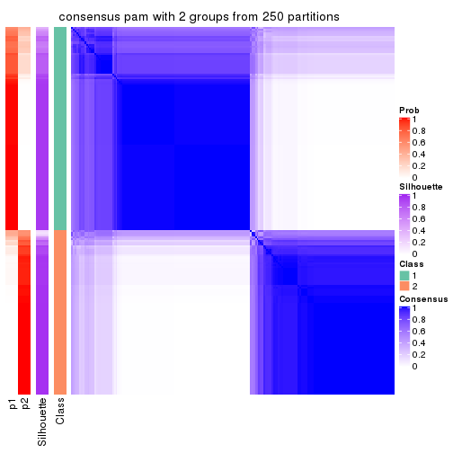</p>

</div>
<div id='tab-SD-pam-consensus-heatmap-2'>
<pre><code class="r">consensus_heatmap(res, k = 3)
</code></pre>

<p>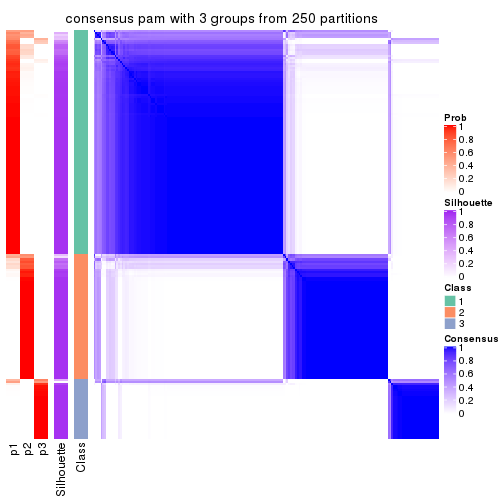</p>

</div>
<div id='tab-SD-pam-consensus-heatmap-3'>
<pre><code class="r">consensus_heatmap(res, k = 4)
</code></pre>

<p>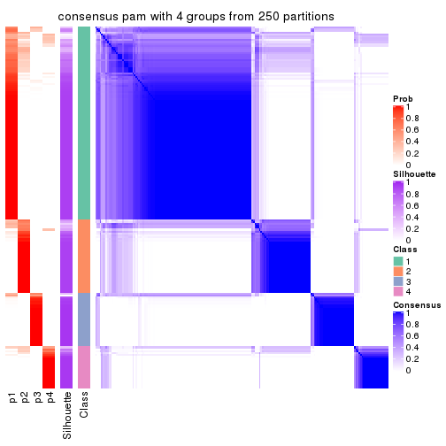</p>

</div>
<div id='tab-SD-pam-consensus-heatmap-4'>
<pre><code class="r">consensus_heatmap(res, k = 5)
</code></pre>

<p>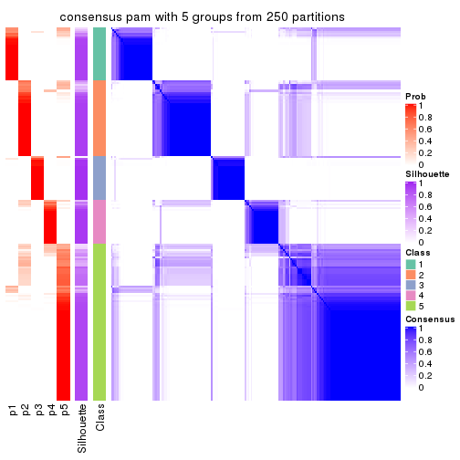</p>

</div>
<div id='tab-SD-pam-consensus-heatmap-5'>
<pre><code class="r">consensus_heatmap(res, k = 6)
</code></pre>

<p>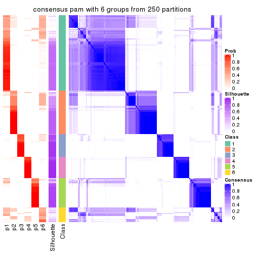</p>

</div>
</div>

Heatmaps for the membership of samples in all partitions to see how consistent they are:


<script>
$( function() {
	$( '#tabs-SD-pam-membership-heatmap' ).tabs();
} );
</script>
<div id='tabs-SD-pam-membership-heatmap'>
<ul>
<li><a href='#tab-SD-pam-membership-heatmap-1'>k = 2</a></li>
<li><a href='#tab-SD-pam-membership-heatmap-2'>k = 3</a></li>
<li><a href='#tab-SD-pam-membership-heatmap-3'>k = 4</a></li>
<li><a href='#tab-SD-pam-membership-heatmap-4'>k = 5</a></li>
<li><a href='#tab-SD-pam-membership-heatmap-5'>k = 6</a></li>
</ul>
<div id='tab-SD-pam-membership-heatmap-1'>
<pre><code class="r">membership_heatmap(res, k = 2)
</code></pre>

<p>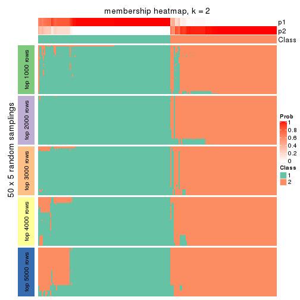</p>

</div>
<div id='tab-SD-pam-membership-heatmap-2'>
<pre><code class="r">membership_heatmap(res, k = 3)
</code></pre>

<p>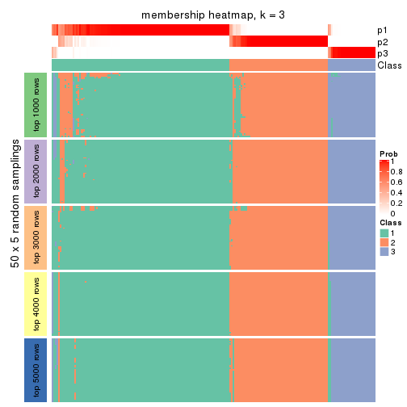</p>

</div>
<div id='tab-SD-pam-membership-heatmap-3'>
<pre><code class="r">membership_heatmap(res, k = 4)
</code></pre>

<p>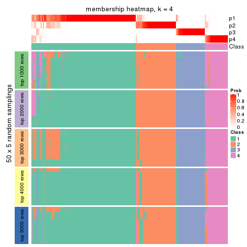</p>

</div>
<div id='tab-SD-pam-membership-heatmap-4'>
<pre><code class="r">membership_heatmap(res, k = 5)
</code></pre>

<p>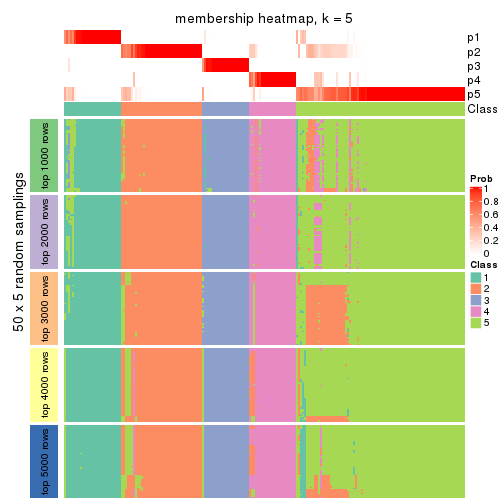</p>

</div>
<div id='tab-SD-pam-membership-heatmap-5'>
<pre><code class="r">membership_heatmap(res, k = 6)
</code></pre>

<p>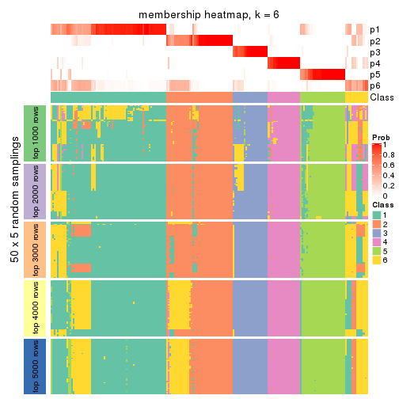</p>

</div>
</div>

As soon as we have had the classes for columns, we can look for signatures
which are significantly different between classes which can be candidate marks
for certain classes. Following are the heatmaps for signatures.


Signature heatmaps where rows are scaled:


<script>
$( function() {
	$( '#tabs-SD-pam-get-signatures' ).tabs();
} );
</script>
<div id='tabs-SD-pam-get-signatures'>
<ul>
<li><a href='#tab-SD-pam-get-signatures-1'>k = 2</a></li>
<li><a href='#tab-SD-pam-get-signatures-2'>k = 3</a></li>
<li><a href='#tab-SD-pam-get-signatures-3'>k = 4</a></li>
<li><a href='#tab-SD-pam-get-signatures-4'>k = 5</a></li>
<li><a href='#tab-SD-pam-get-signatures-5'>k = 6</a></li>
</ul>
<div id='tab-SD-pam-get-signatures-1'>
<pre><code class="r">get_signatures(res, k = 2)
</code></pre>

<p>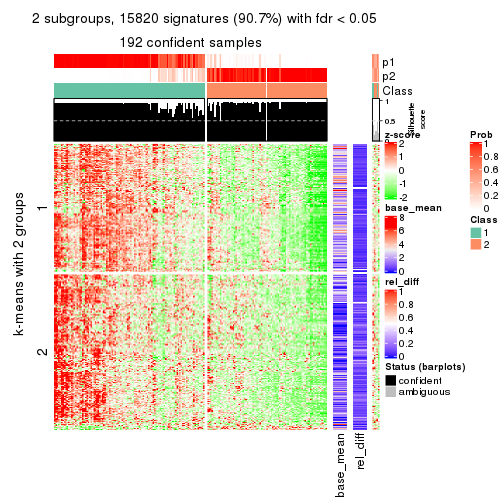</p>

</div>
<div id='tab-SD-pam-get-signatures-2'>
<pre><code class="r">get_signatures(res, k = 3)
</code></pre>

<p>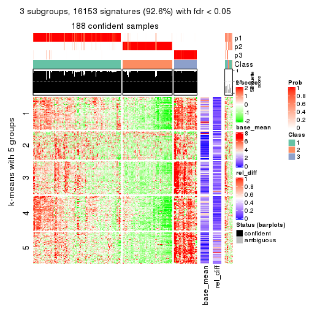</p>

</div>
<div id='tab-SD-pam-get-signatures-3'>
<pre><code class="r">get_signatures(res, k = 4)
</code></pre>

<p>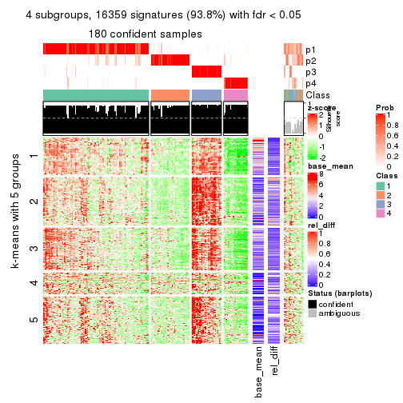</p>

</div>
<div id='tab-SD-pam-get-signatures-4'>
<pre><code class="r">get_signatures(res, k = 5)
</code></pre>

<p>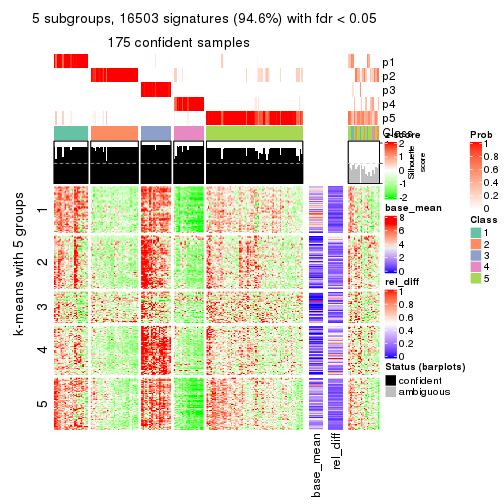</p>

</div>
<div id='tab-SD-pam-get-signatures-5'>
<pre><code class="r">get_signatures(res, k = 6)
</code></pre>

<p>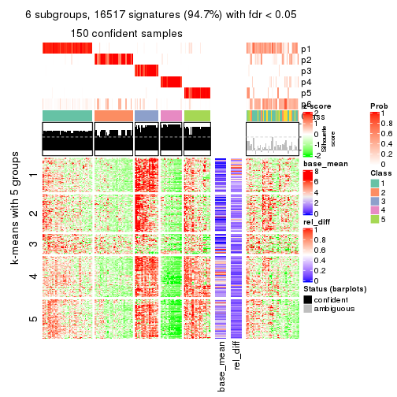</p>

</div>
</div>


Signature heatmaps where rows are not scaled:


<script>
$( function() {
	$( '#tabs-SD-pam-get-signatures-no-scale' ).tabs();
} );
</script>
<div id='tabs-SD-pam-get-signatures-no-scale'>
<ul>
<li><a href='#tab-SD-pam-get-signatures-no-scale-1'>k = 2</a></li>
<li><a href='#tab-SD-pam-get-signatures-no-scale-2'>k = 3</a></li>
<li><a href='#tab-SD-pam-get-signatures-no-scale-3'>k = 4</a></li>
<li><a href='#tab-SD-pam-get-signatures-no-scale-4'>k = 5</a></li>
<li><a href='#tab-SD-pam-get-signatures-no-scale-5'>k = 6</a></li>
</ul>
<div id='tab-SD-pam-get-signatures-no-scale-1'>
<pre><code class="r">get_signatures(res, k = 2, scale_rows = FALSE)
</code></pre>

<p>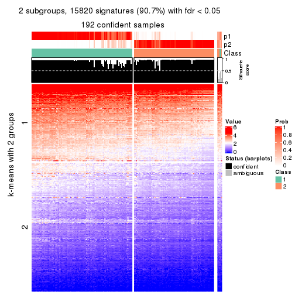</p>

</div>
<div id='tab-SD-pam-get-signatures-no-scale-2'>
<pre><code class="r">get_signatures(res, k = 3, scale_rows = FALSE)
</code></pre>

<p>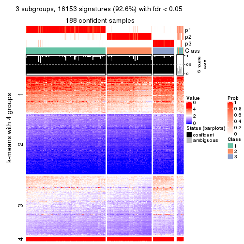</p>

</div>
<div id='tab-SD-pam-get-signatures-no-scale-3'>
<pre><code class="r">get_signatures(res, k = 4, scale_rows = FALSE)
</code></pre>

<p>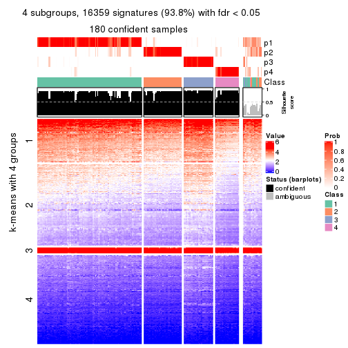</p>

</div>
<div id='tab-SD-pam-get-signatures-no-scale-4'>
<pre><code class="r">get_signatures(res, k = 5, scale_rows = FALSE)
</code></pre>

<p>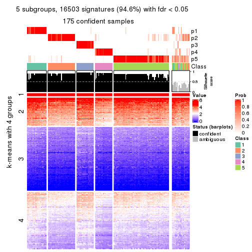</p>

</div>
<div id='tab-SD-pam-get-signatures-no-scale-5'>
<pre><code class="r">get_signatures(res, k = 6, scale_rows = FALSE)
</code></pre>

<p>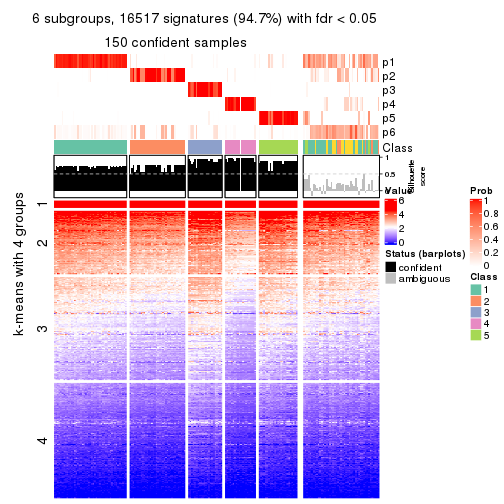</p>

</div>
</div>


Compare the overlap of signatures from different k:

```r
compare_signatures(res)
```

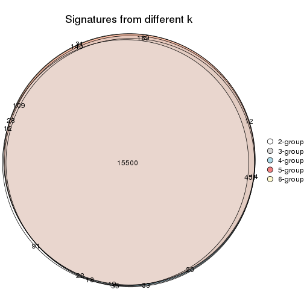

`get_signature()` returns a data frame invisibly. TO get the list of signatures, the function
call should be assigned to a variable explicitly. In following code, if `plot` argument is set
to `FALSE`, no heatmap is plotted while only the differential analysis is performed.

```r
# code only for demonstration
tb = get_signature(res, k = ..., plot = FALSE)
```

An example of the output of `tb` is:

```
#>   which_row         fdr    mean_1    mean_2 scaled_mean_1 scaled_mean_2 km
#> 1        38 0.042760348  8.373488  9.131774    -0.5533452     0.5164555  1
#> 2        40 0.018707592  7.106213  8.469186    -0.6173731     0.5762149  1
#> 3        55 0.019134737 10.221463 11.207825    -0.6159697     0.5749050  1
#> 4        59 0.006059896  5.921854  7.869574    -0.6899429     0.6439467  1
#> 5        60 0.018055526  8.928898 10.211722    -0.6204761     0.5791110  1
#> 6        98 0.009384629 15.714769 14.887706     0.6635654    -0.6193277  2
...
```

The columns in `tb` are:

1. `which_row`: row indices corresponding to the input matrix.
2. `fdr`: FDR for the differential test. 
3. `mean_x`: The mean value in group x.
4. `scaled_mean_x`: The mean value in group x after rows are scaled.
5. `km`: Row groups if k-means clustering is applied to rows.


UMAP plot which shows how samples are separated.


<script>
$( function() {
	$( '#tabs-SD-pam-dimension-reduction' ).tabs();
} );
</script>
<div id='tabs-SD-pam-dimension-reduction'>
<ul>
<li><a href='#tab-SD-pam-dimension-reduction-1'>k = 2</a></li>
<li><a href='#tab-SD-pam-dimension-reduction-2'>k = 3</a></li>
<li><a href='#tab-SD-pam-dimension-reduction-3'>k = 4</a></li>
<li><a href='#tab-SD-pam-dimension-reduction-4'>k = 5</a></li>
<li><a href='#tab-SD-pam-dimension-reduction-5'>k = 6</a></li>
</ul>
<div id='tab-SD-pam-dimension-reduction-1'>
<pre><code class="r">dimension_reduction(res, k = 2, method = &quot;UMAP&quot;)
</code></pre>

<p>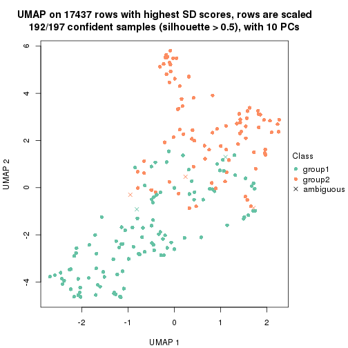</p>

</div>
<div id='tab-SD-pam-dimension-reduction-2'>
<pre><code class="r">dimension_reduction(res, k = 3, method = &quot;UMAP&quot;)
</code></pre>

<p>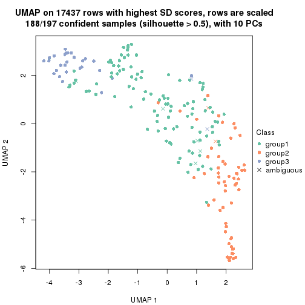</p>

</div>
<div id='tab-SD-pam-dimension-reduction-3'>
<pre><code class="r">dimension_reduction(res, k = 4, method = &quot;UMAP&quot;)
</code></pre>

<p>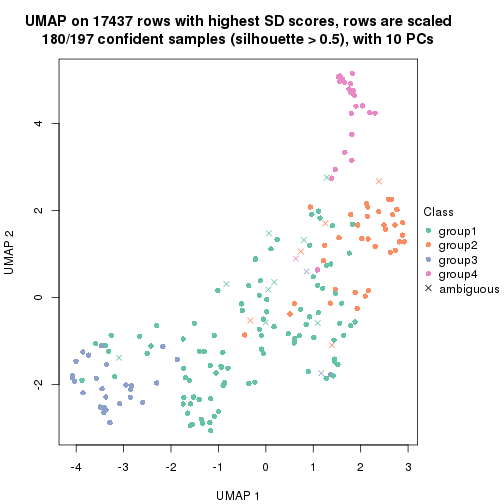</p>

</div>
<div id='tab-SD-pam-dimension-reduction-4'>
<pre><code class="r">dimension_reduction(res, k = 5, method = &quot;UMAP&quot;)
</code></pre>

<p>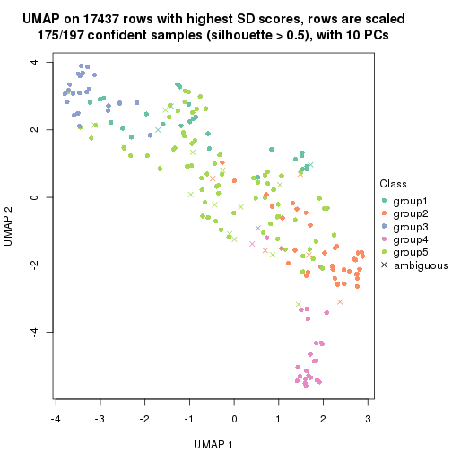</p>

</div>
<div id='tab-SD-pam-dimension-reduction-5'>
<pre><code class="r">dimension_reduction(res, k = 6, method = &quot;UMAP&quot;)
</code></pre>

<p>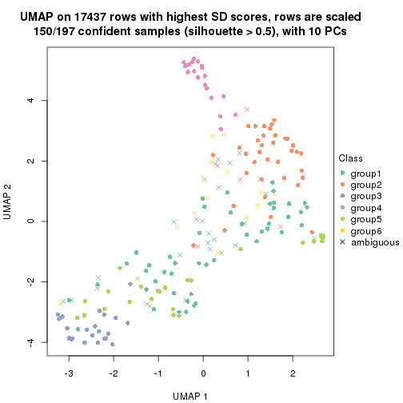</p>

</div>
</div>


Following heatmap shows how subgroups are split when increasing `k`:

```r
collect_classes(res)
```

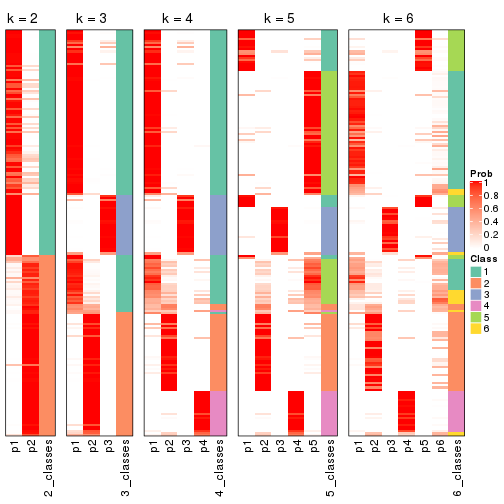


If matrix rows can be associated to genes, consider to use `GO_Enrichment(res,
...)` to perform function enrichment for the signature genes.


 

---------------------------------------------------


### SD:mclust


The object with results only for a single top-value method and a single partition method 
can be extracted as:

```r
res = res_list["SD", "mclust"]
# you can also extract it by
# res = res_list["SD:mclust"]
```

A summary of `res` and all the functions that can be applied to it:

```r
res
```

```
#> A 'ConsensusPartition' object with k = 2, 3, 4, 5, 6.
#>   On a matrix with 17437 rows and 197 columns.
#>   Top rows (1000, 2000, 3000, 4000, 5000) are extracted by 'SD' method.
#>   Subgroups are detected by 'mclust' method.
#>   Performed in total 1250 partitions by row resampling.
#>   Best k for subgroups seems to be 2.
#> 
#> Following methods can be applied to this 'ConsensusPartition' object:
#>  [1] "cola_report"             "collect_classes"         "collect_plots"          
#>  [4] "collect_stats"           "colnames"                "compare_signatures"     
#>  [7] "consensus_heatmap"       "dimension_reduction"     "functional_enrichment"  
#> [10] "get_anno_col"            "get_anno"                "get_classes"            
#> [13] "get_consensus"           "get_matrix"              "get_membership"         
#> [16] "get_param"               "get_signatures"          "get_stats"              
#> [19] "is_best_k"               "is_stable_k"             "membership_heatmap"     
#> [22] "ncol"                    "nrow"                    "plot_ecdf"              
#> [25] "rownames"                "select_partition_number" "show"                   
#> [28] "suggest_best_k"          "test_to_known_factors"
```

`collect_plots()` function collects all the plots made from `res` for all `k` (number of partitions)
into one single page to provide an easy and fast comparison between different `k`.

```r
collect_plots(res)
```

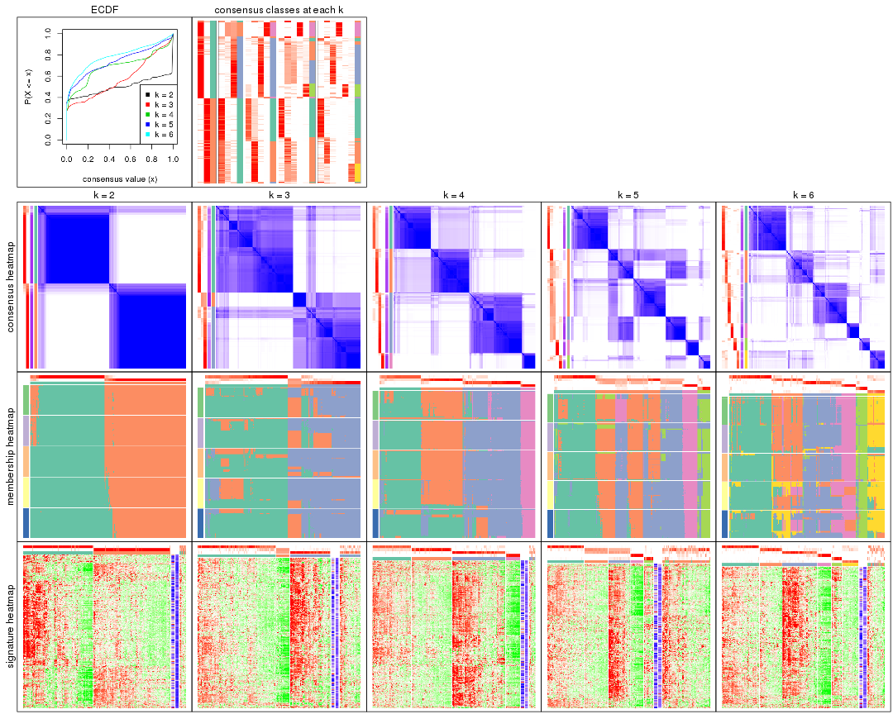

The plots are:

- The first row: a plot of the ECDF (Empirical cumulative distribution
  function) curves of the consensus matrix for each `k` and the heatmap of
  predicted classes for each `k`.
- The second row: heatmaps of the consensus matrix for each `k`.
- The third row: heatmaps of the membership matrix for each `k`.
- The fouth row: heatmaps of the signatures for each `k`.

All the plots in panels can be made by individual functions and they are
plotted later in this section.

`select_partition_number()` produces several plots showing different
statistics for choosing "optimized" `k`. There are following statistics:

- ECDF curves of the consensus matrix for each `k`;
- 1-PAC. [The PAC
  score](https://en.wikipedia.org/wiki/Consensus_clustering#Over-interpretation_potential_of_consensus_clustering)
  measures the proportion of the ambiguous subgrouping.
- Mean silhouette score.
- Concordance. The mean probability of fiting the consensus class ids in all
  partitions.
- Area increased. Denote $A_k$ as the area under the ECDF curve for current
  `k`, the area increased is defined as $A_k - A_{k-1}$.
- Rand index. The percent of pairs of samples that are both in a same cluster
  or both are not in a same cluster in the partition of k and k-1.
- Jaccard index. The ratio of pairs of samples are both in a same cluster in
  the partition of k and k-1 and the pairs of samples are both in a same
  cluster in the partition k or k-1.

The detailed explanations of these statistics can be found in [the cola
vignette](http://bioconductor.org/packages/devel/bioc/vignettes/cola/inst/doc/cola.html#toc_13).

Generally speaking, lower PAC score, higher mean silhouette score or higher
concordance corresponds to better partition. Rand index and Jaccard index
measure how similar the current partition is compared to partition with `k-1`.
If they are too similar, we won't accept `k` is better than `k-1`.

```r
select_partition_number(res)
```

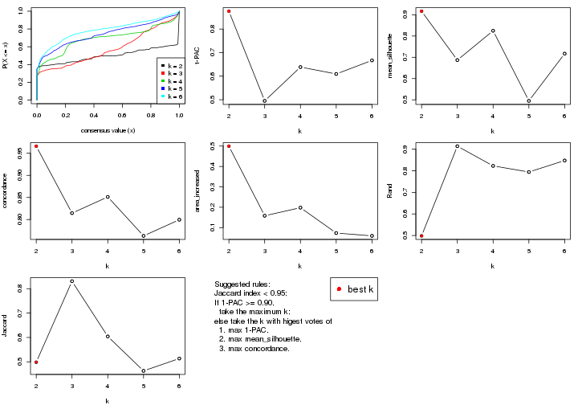

The numeric values for all these statistics can be obtained by `get_stats()`.

```r
get_stats(res)
```

```
#>   k 1-PAC mean_silhouette concordance area_increased  Rand Jaccard
#> 2 2 0.876           0.917       0.966         0.4992 0.498   0.498
#> 3 3 0.495           0.687       0.815         0.1583 0.914   0.831
#> 4 4 0.639           0.825       0.851         0.1979 0.823   0.604
#> 5 5 0.609           0.495       0.763         0.0734 0.794   0.463
#> 6 6 0.667           0.717       0.800         0.0596 0.848   0.514
```

`suggest_best_k()` suggests the best $k$ based on these statistics. The rules are as follows:

- All $k$ with Jaccard index larger than 0.95 are removed because the increase of
  the partition number does not provides enough extra information. If all $k$ are removed,
  the best $k$ is assigned by `NA`.
- For $k$ with 1-PAC larger than 0.9, the maximal $k$ is taken as the "best k". Other $k$ is called "optional k".
- If it does not fit the second rule. The $k$ with the highest vote of highest
  1-PAC, mean silhouette and concordance is taken as the "best k".

```r
suggest_best_k(res)
```

```
#> [1] 2
```


Following shows the table of the partitions (You need to click the **show/hide
code output** link to see it). The membership matrix (columns with name `p*`)
is inferred by
[`clue::cl_consensus()`](https://www.rdocumentation.org/link/cl_consensus?package=clue)
function with the `SE` method. Basically the value in the membership matrix
represents the probability to belong to a certain group. The finall class
label for an item is determined with the group with highest probability it
belongs to.

In `get_classes()` function, the entropy is calculated from the membership
matrix and the silhouette score is calculated from the consensus matrix.


<script>
$( function() {
	$( '#tabs-SD-mclust-get-classes' ).tabs();
} );
</script>
<div id='tabs-SD-mclust-get-classes'>
<ul>
<li><a href='#tab-SD-mclust-get-classes-1'>k = 2</a></li>
<li><a href='#tab-SD-mclust-get-classes-2'>k = 3</a></li>
<li><a href='#tab-SD-mclust-get-classes-3'>k = 4</a></li>
<li><a href='#tab-SD-mclust-get-classes-4'>k = 5</a></li>
<li><a href='#tab-SD-mclust-get-classes-5'>k = 6</a></li>
</ul>

<div id='tab-SD-mclust-get-classes-1'>
<p><a id='tab-SD-mclust-get-classes-1-a' style='color:#0366d6' href='#'>show/hide code output</a></p>
<pre><code class="r">cbind(get_classes(res, k = 2), get_membership(res, k = 2))
</code></pre>

<pre><code>#&gt;            class entropy silhouette    p1    p2
#&gt; SRR1380886     1  0.0000      0.962 1.000 0.000
#&gt; SRR1074385     2  0.0000      0.964 0.000 1.000
#&gt; SRR1374739     1  0.0000      0.962 1.000 0.000
#&gt; SRR1097883     2  0.8763      0.581 0.296 0.704
#&gt; SRR2167209     1  0.0000      0.962 1.000 0.000
#&gt; SRR816541      2  0.0000      0.964 0.000 1.000
#&gt; SRR663645      1  0.0672      0.955 0.992 0.008
#&gt; SRR1381505     1  0.0000      0.962 1.000 0.000
#&gt; SRR1416362     2  0.0000      0.964 0.000 1.000
#&gt; SRR1318503     2  0.0000      0.964 0.000 1.000
#&gt; SRR1341626     2  0.9896      0.210 0.440 0.560
#&gt; SRR1382440     1  0.0000      0.962 1.000 0.000
#&gt; SRR1088413     1  0.0000      0.962 1.000 0.000
#&gt; SRR1082080     2  0.0000      0.964 0.000 1.000
#&gt; SRR1455783     2  0.0000      0.964 0.000 1.000
#&gt; SRR1447760     1  0.9000      0.546 0.684 0.316
#&gt; SRR1487784     2  0.0000      0.964 0.000 1.000
#&gt; SRR1331037     2  0.0000      0.964 0.000 1.000
#&gt; SRR1095651     1  0.0000      0.962 1.000 0.000
#&gt; SRR1078066     1  0.0000      0.962 1.000 0.000
#&gt; SRR1120363     2  0.0000      0.964 0.000 1.000
#&gt; SRR821231      2  0.0000      0.964 0.000 1.000
#&gt; SRR1374373     2  0.0000      0.964 0.000 1.000
#&gt; SRR1324519     2  0.0000      0.964 0.000 1.000
#&gt; SRR1431121     2  0.0000      0.964 0.000 1.000
#&gt; SRR1091032     2  0.0000      0.964 0.000 1.000
#&gt; SRR1365575     1  0.0000      0.962 1.000 0.000
#&gt; SRR1072972     2  0.0000      0.964 0.000 1.000
#&gt; SRR1310690     2  0.0000      0.964 0.000 1.000
#&gt; SRR1383037     1  0.0000      0.962 1.000 0.000
#&gt; SRR1095479     2  0.7376      0.731 0.208 0.792
#&gt; SRR1070403     1  0.0000      0.962 1.000 0.000
#&gt; SRR1390203     2  0.0000      0.964 0.000 1.000
#&gt; SRR1072007     1  0.6048      0.812 0.852 0.148
#&gt; SRR1468787     1  0.0000      0.962 1.000 0.000
#&gt; SRR1347959     2  0.0000      0.964 0.000 1.000
#&gt; SRR1338513     1  0.0000      0.962 1.000 0.000
#&gt; SRR812598      2  0.9170      0.505 0.332 0.668
#&gt; SRR1446806     2  0.0000      0.964 0.000 1.000
#&gt; SRR1394275     2  0.0000      0.964 0.000 1.000
#&gt; SRR1443633     1  0.0000      0.962 1.000 0.000
#&gt; SRR1087728     1  0.0000      0.962 1.000 0.000
#&gt; SRR1098192     1  0.9710      0.346 0.600 0.400
#&gt; SRR1093340     2  0.0000      0.964 0.000 1.000
#&gt; SRR665405      1  0.0000      0.962 1.000 0.000
#&gt; SRR657077      2  0.0000      0.964 0.000 1.000
#&gt; SRR813208      1  0.0000      0.962 1.000 0.000
#&gt; SRR1416074     2  0.0000      0.964 0.000 1.000
#&gt; SRR1089688     1  0.0000      0.962 1.000 0.000
#&gt; SRR1353461     1  0.0376      0.959 0.996 0.004
#&gt; SRR1466321     2  0.0000      0.964 0.000 1.000
#&gt; SRR1073021     1  0.0938      0.952 0.988 0.012
#&gt; SRR1322816     2  0.0000      0.964 0.000 1.000
#&gt; SRR1457727     2  0.0000      0.964 0.000 1.000
#&gt; SRR1464226     1  0.8713      0.593 0.708 0.292
#&gt; SRR1398863     2  0.0000      0.964 0.000 1.000
#&gt; SRR1455631     1  0.0000      0.962 1.000 0.000
#&gt; SRR1307808     2  0.0000      0.964 0.000 1.000
#&gt; SRR1374585     1  0.0000      0.962 1.000 0.000
#&gt; SRR1072104     1  0.0000      0.962 1.000 0.000
#&gt; SRR1076868     2  0.0000      0.964 0.000 1.000
#&gt; SRR1335984     2  0.0000      0.964 0.000 1.000
#&gt; SRR1445939     2  0.0000      0.964 0.000 1.000
#&gt; SRR1453047     2  0.0000      0.964 0.000 1.000
#&gt; SRR1339788     1  0.0000      0.962 1.000 0.000
#&gt; SRR1084323     2  0.0000      0.964 0.000 1.000
#&gt; SRR1092937     2  0.0000      0.964 0.000 1.000
#&gt; SRR1074090     2  0.0000      0.964 0.000 1.000
#&gt; SRR1099833     1  0.0000      0.962 1.000 0.000
#&gt; SRR1093434     1  0.0000      0.962 1.000 0.000
#&gt; SRR1435857     2  0.0000      0.964 0.000 1.000
#&gt; SRR1480347     2  0.0000      0.964 0.000 1.000
#&gt; SRR1440787     1  0.0000      0.962 1.000 0.000
#&gt; SRR1430202     2  0.0000      0.964 0.000 1.000
#&gt; SRR1322730     1  0.0000      0.962 1.000 0.000
#&gt; SRR811029      2  0.9661      0.356 0.392 0.608
#&gt; SRR1390456     1  0.0000      0.962 1.000 0.000
#&gt; SRR1381140     2  0.0000      0.964 0.000 1.000
#&gt; SRR1388064     1  0.0000      0.962 1.000 0.000
#&gt; SRR1093577     2  0.2236      0.933 0.036 0.964
#&gt; SRR1414161     2  0.0000      0.964 0.000 1.000
#&gt; SRR1328738     2  0.4161      0.886 0.084 0.916
#&gt; SRR1311752     2  0.0000      0.964 0.000 1.000
#&gt; SRR1445960     2  0.0000      0.964 0.000 1.000
#&gt; SRR1403412     2  0.0000      0.964 0.000 1.000
#&gt; SRR2166748     2  0.0000      0.964 0.000 1.000
#&gt; SRR821666      1  0.0000      0.962 1.000 0.000
#&gt; SRR1330746     1  0.0000      0.962 1.000 0.000
#&gt; SRR1327872     1  0.0000      0.962 1.000 0.000
#&gt; SRR1100800     2  0.0000      0.964 0.000 1.000
#&gt; SRR1075174     2  0.0000      0.964 0.000 1.000
#&gt; SRR1434436     2  0.0000      0.964 0.000 1.000
#&gt; SRR1389409     1  0.0000      0.962 1.000 0.000
#&gt; SRR1085310     1  0.8861      0.570 0.696 0.304
#&gt; SRR1376718     1  0.0000      0.962 1.000 0.000
#&gt; SRR808590      1  0.0000      0.962 1.000 0.000
#&gt; SRR1084128     2  0.0000      0.964 0.000 1.000
#&gt; SRR1361692     2  0.7950      0.681 0.240 0.760
#&gt; SRR1431493     1  0.8813      0.578 0.700 0.300
#&gt; SRR1409084     2  0.0000      0.964 0.000 1.000
#&gt; SRR2166214     1  0.0000      0.962 1.000 0.000
#&gt; SRR1324102     2  0.0000      0.964 0.000 1.000
#&gt; SRR1079754     1  0.7299      0.737 0.796 0.204
#&gt; SRR1442127     1  0.0000      0.962 1.000 0.000
#&gt; SRR1076244     1  0.0000      0.962 1.000 0.000
#&gt; SRR1330901     2  0.0000      0.964 0.000 1.000
#&gt; SRR1073167     2  0.0000      0.964 0.000 1.000
#&gt; SRR1357541     1  0.0000      0.962 1.000 0.000
#&gt; SRR811607      2  0.0000      0.964 0.000 1.000
#&gt; SRR1468931     1  0.0000      0.962 1.000 0.000
#&gt; SRR1474908     2  0.0000      0.964 0.000 1.000
#&gt; SRR1309875     2  0.1184      0.951 0.016 0.984
#&gt; SRR598792      1  0.9635      0.378 0.612 0.388
#&gt; SRR1088537     2  0.0000      0.964 0.000 1.000
#&gt; SRR1457682     2  0.0000      0.964 0.000 1.000
#&gt; SRR1454289     2  0.0000      0.964 0.000 1.000
#&gt; SRR1069352     1  0.0000      0.962 1.000 0.000
#&gt; SRR1472728     2  0.0000      0.964 0.000 1.000
#&gt; SRR1091144     1  0.0000      0.962 1.000 0.000
#&gt; SRR1319118     2  0.4939      0.858 0.108 0.892
#&gt; SRR1403611     1  0.0000      0.962 1.000 0.000
#&gt; SRR1397762     2  0.7376      0.731 0.208 0.792
#&gt; SRR1317387     1  0.0000      0.962 1.000 0.000
#&gt; SRR1376426     2  0.0000      0.964 0.000 1.000
#&gt; SRR1097777     2  0.0000      0.964 0.000 1.000
#&gt; SRR1365743     1  0.9661      0.368 0.608 0.392
#&gt; SRR1458992     2  0.0000      0.964 0.000 1.000
#&gt; SRR1089537     1  0.0000      0.962 1.000 0.000
#&gt; SRR1397744     2  0.0000      0.964 0.000 1.000
#&gt; SRR1453893     1  0.0000      0.962 1.000 0.000
#&gt; SRR1098543     2  0.0000      0.964 0.000 1.000
#&gt; SRR1321765     1  0.0000      0.962 1.000 0.000
#&gt; SRR1440032     1  0.0000      0.962 1.000 0.000
#&gt; SRR1404507     1  0.0000      0.962 1.000 0.000
#&gt; SRR1404856     1  0.0000      0.962 1.000 0.000
#&gt; SRR812745      2  0.7139      0.748 0.196 0.804
#&gt; SRR1417524     1  0.0000      0.962 1.000 0.000
#&gt; SRR1407334     1  0.0000      0.962 1.000 0.000
#&gt; SRR1453991     2  0.0000      0.964 0.000 1.000
#&gt; SRR1415938     2  0.0000      0.964 0.000 1.000
#&gt; SRR1081259     2  0.0000      0.964 0.000 1.000
#&gt; SRR1436187     1  0.0000      0.962 1.000 0.000
#&gt; SRR1431948     1  0.0000      0.962 1.000 0.000
#&gt; SRR1453277     2  0.0000      0.964 0.000 1.000
#&gt; SRR1095407     1  0.0000      0.962 1.000 0.000
#&gt; SRR1359694     2  0.0000      0.964 0.000 1.000
#&gt; SRR656982      1  0.0000      0.962 1.000 0.000
#&gt; SRR1354338     2  0.9491      0.419 0.368 0.632
#&gt; SRR1088291     2  0.9795      0.287 0.416 0.584
#&gt; SRR1080624     2  0.0000      0.964 0.000 1.000
#&gt; SRR2166708     1  0.0000      0.962 1.000 0.000
#&gt; SRR1393572     2  0.0000      0.964 0.000 1.000
#&gt; SRR1429912     2  0.0000      0.964 0.000 1.000
#&gt; SRR1421048     2  0.0000      0.964 0.000 1.000
#&gt; SRR1434999     1  0.0000      0.962 1.000 0.000
#&gt; SRR656457      1  0.0000      0.962 1.000 0.000
#&gt; SRR1098928     1  0.0000      0.962 1.000 0.000
#&gt; SRR1343967     2  0.0000      0.964 0.000 1.000
#&gt; SRR1360766     2  0.3584      0.902 0.068 0.932
#&gt; SRR1464724     1  0.0000      0.962 1.000 0.000
#&gt; SRR1101542     1  0.0000      0.962 1.000 0.000
#&gt; SRR1401528     1  0.0938      0.952 0.988 0.012
#&gt; SRR1071519     1  0.0000      0.962 1.000 0.000
#&gt; SRR1086070     2  0.0000      0.964 0.000 1.000
#&gt; SRR1358645     2  0.0000      0.964 0.000 1.000
#&gt; SRR819771      1  0.0000      0.962 1.000 0.000
#&gt; SRR1418433     1  0.0000      0.962 1.000 0.000
#&gt; SRR821050      2  0.0000      0.964 0.000 1.000
#&gt; SRR1402091     2  0.0000      0.964 0.000 1.000
#&gt; SRR1322028     2  0.0000      0.964 0.000 1.000
#&gt; SRR1452556     1  0.0000      0.962 1.000 0.000
#&gt; SRR1340047     2  0.0000      0.964 0.000 1.000
#&gt; SRR1418302     1  0.9661      0.368 0.608 0.392
#&gt; SRR1073991     2  0.0000      0.964 0.000 1.000
#&gt; SRR1085187     1  0.0000      0.962 1.000 0.000
#&gt; SRR1357618     1  0.0000      0.962 1.000 0.000
#&gt; SRR1487764     1  0.0000      0.962 1.000 0.000
#&gt; SRR1075336     2  0.0000      0.964 0.000 1.000
#&gt; SRR1365471     2  0.0000      0.964 0.000 1.000
#&gt; SRR1414613     2  0.0000      0.964 0.000 1.000
#&gt; SRR658719      2  0.0000      0.964 0.000 1.000
#&gt; SRR1475128     1  0.0000      0.962 1.000 0.000
#&gt; SRR1367630     1  0.0000      0.962 1.000 0.000
#&gt; SRR1481146     1  0.0000      0.962 1.000 0.000
#&gt; SRR1465674     1  0.0000      0.962 1.000 0.000
#&gt; SRR1327303     2  0.0000      0.964 0.000 1.000
#&gt; SRR1390391     2  0.0000      0.964 0.000 1.000
#&gt; SRR1326020     1  0.0000      0.962 1.000 0.000
#&gt; SRR1381953     1  0.0000      0.962 1.000 0.000
#&gt; SRR1082544     1  0.5519      0.835 0.872 0.128
#&gt; SRR810761      1  0.0376      0.959 0.996 0.004
#&gt; SRR1070764     1  0.0000      0.962 1.000 0.000
#&gt; SRR1415919     1  0.0000      0.962 1.000 0.000
#&gt; SRR1490404     2  0.0000      0.964 0.000 1.000
#&gt; SRR1416773     1  0.0000      0.962 1.000 0.000
#&gt; SRR1377492     1  0.0000      0.962 1.000 0.000
#&gt; SRR1334314     2  0.0000      0.964 0.000 1.000
</code></pre>

<script>
$('#tab-SD-mclust-get-classes-1-a').parent().next().next().hide();
$('#tab-SD-mclust-get-classes-1-a').click(function(){
  $('#tab-SD-mclust-get-classes-1-a').parent().next().next().toggle();
  return(false);
});
</script>
</div>

<div id='tab-SD-mclust-get-classes-2'>
<p><a id='tab-SD-mclust-get-classes-2-a' style='color:#0366d6' href='#'>show/hide code output</a></p>
<pre><code class="r">cbind(get_classes(res, k = 3), get_membership(res, k = 3))
</code></pre>

<pre><code>#&gt;            class entropy silhouette    p1    p2    p3
#&gt; SRR1380886     3  0.1525     0.6349 0.004 0.032 0.964
#&gt; SRR1074385     1  0.0000     0.8504 1.000 0.000 0.000
#&gt; SRR1374739     3  0.0000     0.6547 0.000 0.000 1.000
#&gt; SRR1097883     1  0.7384     0.4984 0.660 0.068 0.272
#&gt; SRR2167209     3  0.1411     0.6457 0.000 0.036 0.964
#&gt; SRR816541      1  0.5216     0.8113 0.740 0.260 0.000
#&gt; SRR663645      3  0.9480    -0.2080 0.268 0.236 0.496
#&gt; SRR1381505     2  0.6295     0.9988 0.000 0.528 0.472
#&gt; SRR1416362     1  0.4796     0.8078 0.780 0.220 0.000
#&gt; SRR1318503     1  0.0237     0.8498 0.996 0.004 0.000
#&gt; SRR1341626     1  0.7433     0.5955 0.660 0.072 0.268
#&gt; SRR1382440     3  0.0000     0.6547 0.000 0.000 1.000
#&gt; SRR1088413     3  0.1337     0.6465 0.012 0.016 0.972
#&gt; SRR1082080     1  0.6126     0.7334 0.600 0.400 0.000
#&gt; SRR1455783     1  0.0000     0.8504 1.000 0.000 0.000
#&gt; SRR1447760     3  0.8050     0.1229 0.436 0.064 0.500
#&gt; SRR1487784     1  0.4062     0.8296 0.836 0.164 0.000
#&gt; SRR1331037     1  0.5431     0.8031 0.716 0.284 0.000
#&gt; SRR1095651     3  0.3267     0.5546 0.000 0.116 0.884
#&gt; SRR1078066     3  0.0892     0.6474 0.000 0.020 0.980
#&gt; SRR1120363     1  0.2066     0.8343 0.940 0.060 0.000
#&gt; SRR821231      1  0.0237     0.8498 0.996 0.004 0.000
#&gt; SRR1374373     1  0.4452     0.8321 0.808 0.192 0.000
#&gt; SRR1324519     1  0.6045     0.7485 0.620 0.380 0.000
#&gt; SRR1431121     1  0.0892     0.8471 0.980 0.020 0.000
#&gt; SRR1091032     1  0.5497     0.7993 0.708 0.292 0.000
#&gt; SRR1365575     2  0.6295     0.9988 0.000 0.528 0.472
#&gt; SRR1072972     1  0.0237     0.8498 0.996 0.004 0.000
#&gt; SRR1310690     1  0.7388     0.7766 0.692 0.208 0.100
#&gt; SRR1383037     3  0.0000     0.6547 0.000 0.000 1.000
#&gt; SRR1095479     1  0.6496     0.6193 0.736 0.056 0.208
#&gt; SRR1070403     3  0.0000     0.6547 0.000 0.000 1.000
#&gt; SRR1390203     1  0.0237     0.8498 0.996 0.004 0.000
#&gt; SRR1072007     1  0.7740     0.1271 0.508 0.048 0.444
#&gt; SRR1468787     3  0.1453     0.6489 0.008 0.024 0.968
#&gt; SRR1347959     1  0.1964     0.8509 0.944 0.056 0.000
#&gt; SRR1338513     3  0.3941     0.5002 0.000 0.156 0.844
#&gt; SRR812598      1  0.7458     0.7079 0.692 0.112 0.196
#&gt; SRR1446806     1  0.0892     0.8517 0.980 0.020 0.000
#&gt; SRR1394275     1  0.0000     0.8504 1.000 0.000 0.000
#&gt; SRR1443633     3  0.2096     0.6194 0.004 0.052 0.944
#&gt; SRR1087728     3  0.0000     0.6547 0.000 0.000 1.000
#&gt; SRR1098192     3  0.8055     0.0886 0.440 0.064 0.496
#&gt; SRR1093340     1  0.6126     0.7334 0.600 0.400 0.000
#&gt; SRR665405      3  0.3941     0.5002 0.000 0.156 0.844
#&gt; SRR657077      1  0.5216     0.8144 0.740 0.260 0.000
#&gt; SRR813208      3  0.0000     0.6547 0.000 0.000 1.000
#&gt; SRR1416074     1  0.6126     0.7334 0.600 0.400 0.000
#&gt; SRR1089688     3  0.5397     0.0512 0.000 0.280 0.720
#&gt; SRR1353461     3  0.4165     0.5391 0.076 0.048 0.876
#&gt; SRR1466321     1  0.0237     0.8498 0.996 0.004 0.000
#&gt; SRR1073021     3  0.6336     0.4027 0.180 0.064 0.756
#&gt; SRR1322816     1  0.5216     0.8113 0.740 0.260 0.000
#&gt; SRR1457727     1  0.0892     0.8471 0.980 0.020 0.000
#&gt; SRR1464226     3  0.7744     0.1026 0.448 0.048 0.504
#&gt; SRR1398863     1  0.0983     0.8521 0.980 0.016 0.004
#&gt; SRR1455631     3  0.5178     0.1740 0.000 0.256 0.744
#&gt; SRR1307808     1  0.0000     0.8504 1.000 0.000 0.000
#&gt; SRR1374585     2  0.6295     0.9988 0.000 0.528 0.472
#&gt; SRR1072104     3  0.7124    -0.1056 0.056 0.272 0.672
#&gt; SRR1076868     1  0.3879     0.8351 0.848 0.152 0.000
#&gt; SRR1335984     1  0.6541     0.8068 0.732 0.212 0.056
#&gt; SRR1445939     1  0.0892     0.8517 0.980 0.020 0.000
#&gt; SRR1453047     1  0.6062     0.7457 0.616 0.384 0.000
#&gt; SRR1339788     3  0.0000     0.6547 0.000 0.000 1.000
#&gt; SRR1084323     1  0.0000     0.8504 1.000 0.000 0.000
#&gt; SRR1092937     1  0.3253     0.8482 0.912 0.052 0.036
#&gt; SRR1074090     1  0.6126     0.7334 0.600 0.400 0.000
#&gt; SRR1099833     3  0.3941     0.5002 0.000 0.156 0.844
#&gt; SRR1093434     3  0.0000     0.6547 0.000 0.000 1.000
#&gt; SRR1435857     1  0.1860     0.8364 0.948 0.052 0.000
#&gt; SRR1480347     1  0.6062     0.7457 0.616 0.384 0.000
#&gt; SRR1440787     2  0.6295     0.9988 0.000 0.528 0.472
#&gt; SRR1430202     1  0.0747     0.8517 0.984 0.016 0.000
#&gt; SRR1322730     3  0.5760    -0.2282 0.000 0.328 0.672
#&gt; SRR811029      1  0.6341     0.6581 0.716 0.032 0.252
#&gt; SRR1390456     3  0.0000     0.6547 0.000 0.000 1.000
#&gt; SRR1381140     1  0.0747     0.8506 0.984 0.016 0.000
#&gt; SRR1388064     2  0.6295     0.9988 0.000 0.528 0.472
#&gt; SRR1093577     1  0.1620     0.8474 0.964 0.012 0.024
#&gt; SRR1414161     1  0.0237     0.8508 0.996 0.004 0.000
#&gt; SRR1328738     1  0.5631     0.7631 0.804 0.064 0.132
#&gt; SRR1311752     1  0.6126     0.7334 0.600 0.400 0.000
#&gt; SRR1445960     1  0.5216     0.8113 0.740 0.260 0.000
#&gt; SRR1403412     1  0.6858     0.7325 0.728 0.084 0.188
#&gt; SRR2166748     1  0.1964     0.8360 0.944 0.056 0.000
#&gt; SRR821666      2  0.6299     0.9908 0.000 0.524 0.476
#&gt; SRR1330746     3  0.0000     0.6547 0.000 0.000 1.000
#&gt; SRR1327872     2  0.6295     0.9988 0.000 0.528 0.472
#&gt; SRR1100800     1  0.2165     0.8324 0.936 0.064 0.000
#&gt; SRR1075174     1  0.2446     0.8520 0.936 0.052 0.012
#&gt; SRR1434436     1  0.0000     0.8504 1.000 0.000 0.000
#&gt; SRR1389409     2  0.6295     0.9988 0.000 0.528 0.472
#&gt; SRR1085310     3  0.7589     0.2181 0.360 0.052 0.588
#&gt; SRR1376718     2  0.6295     0.9988 0.000 0.528 0.472
#&gt; SRR808590      2  0.6295     0.9988 0.000 0.528 0.472
#&gt; SRR1084128     1  0.3879     0.8367 0.848 0.152 0.000
#&gt; SRR1361692     1  0.6810     0.6651 0.720 0.068 0.212
#&gt; SRR1431493     3  0.7600     0.2333 0.344 0.056 0.600
#&gt; SRR1409084     1  0.1753     0.8381 0.952 0.048 0.000
#&gt; SRR2166214     3  0.4399     0.4244 0.000 0.188 0.812
#&gt; SRR1324102     1  0.5291     0.8089 0.732 0.268 0.000
#&gt; SRR1079754     3  0.8148     0.2038 0.296 0.100 0.604
#&gt; SRR1442127     3  0.0000     0.6547 0.000 0.000 1.000
#&gt; SRR1076244     3  0.4452     0.4111 0.000 0.192 0.808
#&gt; SRR1330901     1  0.0000     0.8504 1.000 0.000 0.000
#&gt; SRR1073167     1  0.5327     0.8075 0.728 0.272 0.000
#&gt; SRR1357541     3  0.3148     0.5913 0.036 0.048 0.916
#&gt; SRR811607      1  0.0237     0.8498 0.996 0.004 0.000
#&gt; SRR1468931     3  0.0000     0.6547 0.000 0.000 1.000
#&gt; SRR1474908     1  0.5178     0.8127 0.744 0.256 0.000
#&gt; SRR1309875     1  0.6783     0.7430 0.736 0.088 0.176
#&gt; SRR598792      3  0.7517     0.2179 0.364 0.048 0.588
#&gt; SRR1088537     1  0.5216     0.8113 0.740 0.260 0.000
#&gt; SRR1457682     1  0.0237     0.8498 0.996 0.004 0.000
#&gt; SRR1454289     1  0.0000     0.8504 1.000 0.000 0.000
#&gt; SRR1069352     3  0.0592     0.6493 0.000 0.012 0.988
#&gt; SRR1472728     1  0.3267     0.8458 0.884 0.116 0.000
#&gt; SRR1091144     3  0.3941     0.5002 0.000 0.156 0.844
#&gt; SRR1319118     1  0.3669     0.8187 0.896 0.064 0.040
#&gt; SRR1403611     3  0.3941     0.5002 0.000 0.156 0.844
#&gt; SRR1397762     1  0.7027     0.5813 0.660 0.044 0.296
#&gt; SRR1317387     3  0.3412     0.5447 0.000 0.124 0.876
#&gt; SRR1376426     1  0.6126     0.7334 0.600 0.400 0.000
#&gt; SRR1097777     1  0.1643     0.8396 0.956 0.044 0.000
#&gt; SRR1365743     3  0.6937     0.2004 0.404 0.020 0.576
#&gt; SRR1458992     1  0.5216     0.8113 0.740 0.260 0.000
#&gt; SRR1089537     3  0.3941     0.5002 0.000 0.156 0.844
#&gt; SRR1397744     1  0.0424     0.8493 0.992 0.008 0.000
#&gt; SRR1453893     2  0.6295     0.9988 0.000 0.528 0.472
#&gt; SRR1098543     1  0.0237     0.8498 0.996 0.004 0.000
#&gt; SRR1321765     3  0.1411     0.6457 0.000 0.036 0.964
#&gt; SRR1440032     3  0.6255     0.2100 0.320 0.012 0.668
#&gt; SRR1404507     2  0.6299     0.9898 0.000 0.524 0.476
#&gt; SRR1404856     3  0.1289     0.6468 0.000 0.032 0.968
#&gt; SRR812745      1  0.6625     0.7267 0.736 0.068 0.196
#&gt; SRR1417524     3  0.3816     0.5094 0.000 0.148 0.852
#&gt; SRR1407334     2  0.6295     0.9988 0.000 0.528 0.472
#&gt; SRR1453991     1  0.0892     0.8471 0.980 0.020 0.000
#&gt; SRR1415938     1  0.0424     0.8493 0.992 0.008 0.000
#&gt; SRR1081259     1  0.2066     0.8514 0.940 0.060 0.000
#&gt; SRR1436187     2  0.6295     0.9988 0.000 0.528 0.472
#&gt; SRR1431948     3  0.0000     0.6547 0.000 0.000 1.000
#&gt; SRR1453277     1  0.7252     0.7011 0.704 0.100 0.196
#&gt; SRR1095407     3  0.1411     0.6457 0.000 0.036 0.964
#&gt; SRR1359694     1  0.0237     0.8498 0.996 0.004 0.000
#&gt; SRR656982      3  0.3941     0.5002 0.000 0.156 0.844
#&gt; SRR1354338     1  0.7222     0.6404 0.684 0.072 0.244
#&gt; SRR1088291     1  0.7953     0.3435 0.564 0.068 0.368
#&gt; SRR1080624     1  0.0424     0.8493 0.992 0.008 0.000
#&gt; SRR2166708     3  0.0000     0.6547 0.000 0.000 1.000
#&gt; SRR1393572     1  0.0237     0.8498 0.996 0.004 0.000
#&gt; SRR1429912     1  0.4974     0.8199 0.764 0.236 0.000
#&gt; SRR1421048     1  0.1129     0.8476 0.976 0.020 0.004
#&gt; SRR1434999     3  0.0892     0.6441 0.000 0.020 0.980
#&gt; SRR656457      3  0.0892     0.6441 0.000 0.020 0.980
#&gt; SRR1098928     3  0.0592     0.6493 0.000 0.012 0.988
#&gt; SRR1343967     1  0.6095     0.7390 0.608 0.392 0.000
#&gt; SRR1360766     1  0.6869     0.6106 0.688 0.048 0.264
#&gt; SRR1464724     2  0.6295     0.9988 0.000 0.528 0.472
#&gt; SRR1101542     2  0.6295     0.9988 0.000 0.528 0.472
#&gt; SRR1401528     3  0.6723     0.3175 0.248 0.048 0.704
#&gt; SRR1071519     3  0.0424     0.6521 0.000 0.008 0.992
#&gt; SRR1086070     1  0.0424     0.8500 0.992 0.008 0.000
#&gt; SRR1358645     1  0.5216     0.8113 0.740 0.260 0.000
#&gt; SRR819771      3  0.0000     0.6547 0.000 0.000 1.000
#&gt; SRR1418433     3  0.4452     0.4111 0.000 0.192 0.808
#&gt; SRR821050      1  0.2165     0.8324 0.936 0.064 0.000
#&gt; SRR1402091     1  0.5216     0.8113 0.740 0.260 0.000
#&gt; SRR1322028     1  0.5216     0.8113 0.740 0.260 0.000
#&gt; SRR1452556     2  0.6295     0.9988 0.000 0.528 0.472
#&gt; SRR1340047     1  0.5178     0.8127 0.744 0.256 0.000
#&gt; SRR1418302     1  0.7334     0.4766 0.624 0.048 0.328
#&gt; SRR1073991     1  0.1964     0.8351 0.944 0.056 0.000
#&gt; SRR1085187     3  0.3941     0.5002 0.000 0.156 0.844
#&gt; SRR1357618     3  0.0747     0.6475 0.000 0.016 0.984
#&gt; SRR1487764     3  0.3941     0.5002 0.000 0.156 0.844
#&gt; SRR1075336     1  0.1031     0.8462 0.976 0.024 0.000
#&gt; SRR1365471     1  0.6126     0.7334 0.600 0.400 0.000
#&gt; SRR1414613     1  0.3551     0.8406 0.868 0.132 0.000
#&gt; SRR658719      1  0.6858     0.7325 0.728 0.084 0.188
#&gt; SRR1475128     3  0.0000     0.6547 0.000 0.000 1.000
#&gt; SRR1367630     3  0.5397     0.0512 0.000 0.280 0.720
#&gt; SRR1481146     3  0.4062     0.4838 0.000 0.164 0.836
#&gt; SRR1465674     3  0.1411     0.6457 0.000 0.036 0.964
#&gt; SRR1327303     1  0.5138     0.8141 0.748 0.252 0.000
#&gt; SRR1390391     1  0.2625     0.8483 0.916 0.084 0.000
#&gt; SRR1326020     3  0.6685     0.3168 0.244 0.048 0.708
#&gt; SRR1381953     3  0.4602     0.5167 0.016 0.152 0.832
#&gt; SRR1082544     3  0.7534     0.2064 0.368 0.048 0.584
#&gt; SRR810761      3  0.4737     0.5260 0.084 0.064 0.852
#&gt; SRR1070764     3  0.0000     0.6547 0.000 0.000 1.000
#&gt; SRR1415919     3  0.0000     0.6547 0.000 0.000 1.000
#&gt; SRR1490404     1  0.5591     0.7936 0.696 0.304 0.000
#&gt; SRR1416773     3  0.1411     0.6457 0.000 0.036 0.964
#&gt; SRR1377492     3  0.3941     0.5002 0.000 0.156 0.844
#&gt; SRR1334314     1  0.1182     0.8519 0.976 0.012 0.012
</code></pre>

<script>
$('#tab-SD-mclust-get-classes-2-a').parent().next().next().hide();
$('#tab-SD-mclust-get-classes-2-a').click(function(){
  $('#tab-SD-mclust-get-classes-2-a').parent().next().next().toggle();
  return(false);
});
</script>
</div>

<div id='tab-SD-mclust-get-classes-3'>
<p><a id='tab-SD-mclust-get-classes-3-a' style='color:#0366d6' href='#'>show/hide code output</a></p>
<pre><code class="r">cbind(get_classes(res, k = 4), get_membership(res, k = 4))
</code></pre>

<pre><code>#&gt;            class entropy silhouette    p1    p2    p3    p4
#&gt; SRR1380886     3  0.2868     0.7864 0.000 0.136 0.864 0.000
#&gt; SRR1074385     1  0.3569     0.9180 0.804 0.196 0.000 0.000
#&gt; SRR1374739     3  0.0336     0.8610 0.008 0.000 0.992 0.000
#&gt; SRR1097883     3  0.7492    -0.1479 0.388 0.180 0.432 0.000
#&gt; SRR2167209     3  0.3751     0.7952 0.196 0.000 0.800 0.004
#&gt; SRR816541      2  0.0779     0.9064 0.016 0.980 0.000 0.004
#&gt; SRR663645      3  0.7703     0.4026 0.012 0.268 0.520 0.200
#&gt; SRR1381505     4  0.0469     0.9487 0.000 0.000 0.012 0.988
#&gt; SRR1416362     2  0.0657     0.9045 0.012 0.984 0.000 0.004
#&gt; SRR1318503     1  0.3569     0.9180 0.804 0.196 0.000 0.000
#&gt; SRR1341626     2  0.2111     0.8761 0.024 0.932 0.044 0.000
#&gt; SRR1382440     3  0.0000     0.8611 0.000 0.000 1.000 0.000
#&gt; SRR1088413     3  0.1305     0.8531 0.000 0.036 0.960 0.004
#&gt; SRR1082080     2  0.0188     0.9042 0.000 0.996 0.000 0.004
#&gt; SRR1455783     1  0.3649     0.9148 0.796 0.204 0.000 0.000
#&gt; SRR1447760     3  0.5911     0.6482 0.328 0.044 0.624 0.004
#&gt; SRR1487784     2  0.1004     0.9019 0.024 0.972 0.000 0.004
#&gt; SRR1331037     2  0.0895     0.9064 0.020 0.976 0.000 0.004
#&gt; SRR1095651     3  0.0592     0.8599 0.000 0.000 0.984 0.016
#&gt; SRR1078066     3  0.3751     0.7952 0.196 0.000 0.800 0.004
#&gt; SRR1120363     1  0.3400     0.9078 0.820 0.180 0.000 0.000
#&gt; SRR821231      1  0.3751     0.9166 0.800 0.196 0.004 0.000
#&gt; SRR1374373     2  0.1004     0.9035 0.024 0.972 0.000 0.004
#&gt; SRR1324519     2  0.0188     0.9060 0.004 0.996 0.000 0.000
#&gt; SRR1431121     1  0.3400     0.9078 0.820 0.180 0.000 0.000
#&gt; SRR1091032     2  0.0524     0.9068 0.008 0.988 0.000 0.004
#&gt; SRR1365575     4  0.0469     0.9487 0.000 0.000 0.012 0.988
#&gt; SRR1072972     1  0.3569     0.9180 0.804 0.196 0.000 0.000
#&gt; SRR1310690     2  0.0895     0.9053 0.020 0.976 0.000 0.004
#&gt; SRR1383037     3  0.0000     0.8611 0.000 0.000 1.000 0.000
#&gt; SRR1095479     1  0.6750     0.7040 0.612 0.180 0.208 0.000
#&gt; SRR1070403     3  0.0000     0.8611 0.000 0.000 1.000 0.000
#&gt; SRR1390203     1  0.3569     0.9180 0.804 0.196 0.000 0.000
#&gt; SRR1072007     2  0.6357     0.3372 0.068 0.544 0.388 0.000
#&gt; SRR1468787     3  0.3852     0.8029 0.180 0.012 0.808 0.000
#&gt; SRR1347959     2  0.1398     0.8928 0.040 0.956 0.000 0.004
#&gt; SRR1338513     3  0.1022     0.8577 0.000 0.000 0.968 0.032
#&gt; SRR812598      2  0.4317     0.7269 0.016 0.784 0.196 0.004
#&gt; SRR1446806     1  0.4193     0.8648 0.732 0.268 0.000 0.000
#&gt; SRR1394275     1  0.3569     0.9180 0.804 0.196 0.000 0.000
#&gt; SRR1443633     3  0.4277     0.8010 0.172 0.024 0.800 0.004
#&gt; SRR1087728     3  0.0000     0.8611 0.000 0.000 1.000 0.000
#&gt; SRR1098192     2  0.5485     0.5468 0.020 0.652 0.320 0.008
#&gt; SRR1093340     2  0.0188     0.9042 0.000 0.996 0.000 0.004
#&gt; SRR665405      3  0.1557     0.8517 0.000 0.000 0.944 0.056
#&gt; SRR657077      2  0.0895     0.9053 0.020 0.976 0.000 0.004
#&gt; SRR813208      3  0.0000     0.8611 0.000 0.000 1.000 0.000
#&gt; SRR1416074     2  0.0376     0.9052 0.004 0.992 0.000 0.004
#&gt; SRR1089688     3  0.4103     0.6633 0.000 0.000 0.744 0.256
#&gt; SRR1353461     3  0.1888     0.8430 0.044 0.016 0.940 0.000
#&gt; SRR1466321     1  0.3569     0.9180 0.804 0.196 0.000 0.000
#&gt; SRR1073021     3  0.4375     0.7156 0.032 0.180 0.788 0.000
#&gt; SRR1322816     2  0.0779     0.9064 0.016 0.980 0.000 0.004
#&gt; SRR1457727     1  0.3569     0.9180 0.804 0.196 0.000 0.000
#&gt; SRR1464226     2  0.5678     0.5491 0.044 0.640 0.316 0.000
#&gt; SRR1398863     1  0.3975     0.8909 0.760 0.240 0.000 0.000
#&gt; SRR1455631     3  0.3356     0.7646 0.000 0.000 0.824 0.176
#&gt; SRR1307808     1  0.3649     0.9149 0.796 0.204 0.000 0.000
#&gt; SRR1374585     4  0.0469     0.9487 0.000 0.000 0.012 0.988
#&gt; SRR1072104     3  0.5172     0.6798 0.012 0.032 0.740 0.216
#&gt; SRR1076868     2  0.0779     0.9052 0.016 0.980 0.000 0.004
#&gt; SRR1335984     2  0.2334     0.8322 0.088 0.908 0.000 0.004
#&gt; SRR1445939     1  0.4277     0.8517 0.720 0.280 0.000 0.000
#&gt; SRR1453047     2  0.0376     0.9052 0.004 0.992 0.000 0.004
#&gt; SRR1339788     3  0.0657     0.8610 0.004 0.012 0.984 0.000
#&gt; SRR1084323     1  0.3569     0.9180 0.804 0.196 0.000 0.000
#&gt; SRR1092937     1  0.6388     0.7258 0.596 0.328 0.072 0.004
#&gt; SRR1074090     2  0.0376     0.9052 0.004 0.992 0.000 0.004
#&gt; SRR1099833     3  0.1406     0.8582 0.000 0.016 0.960 0.024
#&gt; SRR1093434     3  0.0000     0.8611 0.000 0.000 1.000 0.000
#&gt; SRR1435857     1  0.3569     0.9180 0.804 0.196 0.000 0.000
#&gt; SRR1480347     2  0.0376     0.9052 0.004 0.992 0.000 0.004
#&gt; SRR1440787     4  0.0469     0.9487 0.000 0.000 0.012 0.988
#&gt; SRR1430202     1  0.4250     0.8564 0.724 0.276 0.000 0.000
#&gt; SRR1322730     4  0.3688     0.7354 0.000 0.000 0.208 0.792
#&gt; SRR811029      2  0.4386     0.7313 0.020 0.784 0.192 0.004
#&gt; SRR1390456     3  0.0000     0.8611 0.000 0.000 1.000 0.000
#&gt; SRR1381140     1  0.4250     0.8564 0.724 0.276 0.000 0.000
#&gt; SRR1388064     4  0.0469     0.9487 0.000 0.000 0.012 0.988
#&gt; SRR1093577     1  0.4716     0.8901 0.764 0.196 0.040 0.000
#&gt; SRR1414161     1  0.4304     0.8475 0.716 0.284 0.000 0.000
#&gt; SRR1328738     1  0.6620     0.7035 0.628 0.180 0.192 0.000
#&gt; SRR1311752     2  0.0376     0.9052 0.004 0.992 0.000 0.004
#&gt; SRR1445960     2  0.0779     0.9064 0.016 0.980 0.000 0.004
#&gt; SRR1403412     2  0.3972     0.7523 0.016 0.816 0.164 0.004
#&gt; SRR2166748     1  0.3400     0.9078 0.820 0.180 0.000 0.000
#&gt; SRR821666      4  0.0469     0.9487 0.000 0.000 0.012 0.988
#&gt; SRR1330746     3  0.0000     0.8611 0.000 0.000 1.000 0.000
#&gt; SRR1327872     4  0.2921     0.8255 0.000 0.000 0.140 0.860
#&gt; SRR1100800     1  0.3400     0.9078 0.820 0.180 0.000 0.000
#&gt; SRR1075174     1  0.5799     0.5807 0.552 0.420 0.024 0.004
#&gt; SRR1434436     1  0.3873     0.8995 0.772 0.228 0.000 0.000
#&gt; SRR1389409     4  0.0469     0.9487 0.000 0.000 0.012 0.988
#&gt; SRR1085310     3  0.4720     0.7061 0.188 0.044 0.768 0.000
#&gt; SRR1376718     4  0.0469     0.9487 0.000 0.000 0.012 0.988
#&gt; SRR808590      4  0.0469     0.9487 0.000 0.000 0.012 0.988
#&gt; SRR1084128     2  0.1209     0.8990 0.032 0.964 0.000 0.004
#&gt; SRR1361692     1  0.6586     0.7159 0.632 0.184 0.184 0.000
#&gt; SRR1431493     3  0.4423     0.7286 0.168 0.040 0.792 0.000
#&gt; SRR1409084     1  0.3569     0.9180 0.804 0.196 0.000 0.000
#&gt; SRR2166214     3  0.1867     0.8447 0.000 0.000 0.928 0.072
#&gt; SRR1324102     2  0.0524     0.9068 0.008 0.988 0.000 0.004
#&gt; SRR1079754     3  0.8204    -0.1457 0.012 0.256 0.376 0.356
#&gt; SRR1442127     3  0.0000     0.8611 0.000 0.000 1.000 0.000
#&gt; SRR1076244     4  0.5512    -0.0416 0.000 0.016 0.492 0.492
#&gt; SRR1330901     1  0.3801     0.9052 0.780 0.220 0.000 0.000
#&gt; SRR1073167     2  0.0524     0.9068 0.008 0.988 0.000 0.004
#&gt; SRR1357541     3  0.4277     0.8009 0.172 0.024 0.800 0.004
#&gt; SRR811607      1  0.3569     0.9180 0.804 0.196 0.000 0.000
#&gt; SRR1468931     3  0.0000     0.8611 0.000 0.000 1.000 0.000
#&gt; SRR1474908     2  0.0895     0.9056 0.020 0.976 0.000 0.004
#&gt; SRR1309875     2  0.3730     0.7790 0.016 0.836 0.144 0.004
#&gt; SRR598792      3  0.3523     0.7855 0.112 0.032 0.856 0.000
#&gt; SRR1088537     2  0.0895     0.9053 0.020 0.976 0.000 0.004
#&gt; SRR1457682     1  0.3569     0.9180 0.804 0.196 0.000 0.000
#&gt; SRR1454289     1  0.4304     0.8470 0.716 0.284 0.000 0.000
#&gt; SRR1069352     3  0.3583     0.7987 0.180 0.000 0.816 0.004
#&gt; SRR1472728     2  0.0817     0.9053 0.024 0.976 0.000 0.000
#&gt; SRR1091144     3  0.1557     0.8517 0.000 0.000 0.944 0.056
#&gt; SRR1319118     1  0.6655     0.7236 0.624 0.192 0.184 0.000
#&gt; SRR1403611     3  0.1510     0.8573 0.000 0.016 0.956 0.028
#&gt; SRR1397762     1  0.7286     0.2631 0.476 0.132 0.388 0.004
#&gt; SRR1317387     3  0.0592     0.8599 0.000 0.000 0.984 0.016
#&gt; SRR1376426     2  0.0376     0.9052 0.004 0.992 0.000 0.004
#&gt; SRR1097777     1  0.3569     0.9180 0.804 0.196 0.000 0.000
#&gt; SRR1365743     3  0.4786     0.7246 0.108 0.104 0.788 0.000
#&gt; SRR1458992     2  0.0779     0.9064 0.016 0.980 0.000 0.004
#&gt; SRR1089537     3  0.1584     0.8570 0.012 0.000 0.952 0.036
#&gt; SRR1397744     1  0.3569     0.9180 0.804 0.196 0.000 0.000
#&gt; SRR1453893     4  0.0469     0.9487 0.000 0.000 0.012 0.988
#&gt; SRR1098543     1  0.3569     0.9180 0.804 0.196 0.000 0.000
#&gt; SRR1321765     3  0.3751     0.7952 0.196 0.000 0.800 0.004
#&gt; SRR1440032     3  0.4419     0.7211 0.012 0.180 0.792 0.016
#&gt; SRR1404507     4  0.0817     0.9378 0.000 0.000 0.024 0.976
#&gt; SRR1404856     3  0.3751     0.7952 0.196 0.000 0.800 0.004
#&gt; SRR812745      2  0.5961     0.6677 0.088 0.688 0.220 0.004
#&gt; SRR1417524     3  0.0592     0.8599 0.000 0.000 0.984 0.016
#&gt; SRR1407334     4  0.0469     0.9487 0.000 0.000 0.012 0.988
#&gt; SRR1453991     1  0.3400     0.9078 0.820 0.180 0.000 0.000
#&gt; SRR1415938     1  0.3569     0.9180 0.804 0.196 0.000 0.000
#&gt; SRR1081259     1  0.4843     0.6831 0.604 0.396 0.000 0.000
#&gt; SRR1436187     4  0.0469     0.9487 0.000 0.000 0.012 0.988
#&gt; SRR1431948     3  0.0000     0.8611 0.000 0.000 1.000 0.000
#&gt; SRR1453277     2  0.3681     0.7699 0.124 0.848 0.024 0.004
#&gt; SRR1095407     3  0.3751     0.7952 0.196 0.000 0.800 0.004
#&gt; SRR1359694     1  0.3569     0.9180 0.804 0.196 0.000 0.000
#&gt; SRR656982      3  0.1389     0.8541 0.000 0.000 0.952 0.048
#&gt; SRR1354338     2  0.4756     0.7006 0.072 0.784 0.144 0.000
#&gt; SRR1088291     1  0.7495     0.2536 0.428 0.180 0.392 0.000
#&gt; SRR1080624     1  0.3569     0.9180 0.804 0.196 0.000 0.000
#&gt; SRR2166708     3  0.0000     0.8611 0.000 0.000 1.000 0.000
#&gt; SRR1393572     1  0.3569     0.9180 0.804 0.196 0.000 0.000
#&gt; SRR1429912     2  0.1022     0.9016 0.032 0.968 0.000 0.000
#&gt; SRR1421048     1  0.3969     0.9025 0.804 0.180 0.016 0.000
#&gt; SRR1434999     3  0.3751     0.7952 0.196 0.000 0.800 0.004
#&gt; SRR656457      3  0.3751     0.7952 0.196 0.000 0.800 0.004
#&gt; SRR1098928     3  0.0000     0.8611 0.000 0.000 1.000 0.000
#&gt; SRR1343967     2  0.0376     0.9052 0.004 0.992 0.000 0.004
#&gt; SRR1360766     3  0.6281     0.5321 0.128 0.216 0.656 0.000
#&gt; SRR1464724     4  0.0469     0.9487 0.000 0.000 0.012 0.988
#&gt; SRR1101542     4  0.0469     0.9487 0.000 0.000 0.012 0.988
#&gt; SRR1401528     3  0.2797     0.8217 0.068 0.032 0.900 0.000
#&gt; SRR1071519     3  0.0000     0.8611 0.000 0.000 1.000 0.000
#&gt; SRR1086070     1  0.3610     0.9167 0.800 0.200 0.000 0.000
#&gt; SRR1358645     2  0.0895     0.9053 0.020 0.976 0.000 0.004
#&gt; SRR819771      3  0.0707     0.8610 0.020 0.000 0.980 0.000
#&gt; SRR1418433     3  0.3390     0.7976 0.000 0.016 0.852 0.132
#&gt; SRR821050      1  0.3400     0.9078 0.820 0.180 0.000 0.000
#&gt; SRR1402091     2  0.0779     0.9064 0.016 0.980 0.000 0.004
#&gt; SRR1322028     2  0.0817     0.9051 0.024 0.976 0.000 0.000
#&gt; SRR1452556     4  0.0469     0.9487 0.000 0.000 0.012 0.988
#&gt; SRR1340047     2  0.1004     0.9036 0.024 0.972 0.000 0.004
#&gt; SRR1418302     2  0.4448     0.7349 0.024 0.784 0.188 0.004
#&gt; SRR1073991     1  0.3569     0.9180 0.804 0.196 0.000 0.000
#&gt; SRR1085187     3  0.4194     0.7977 0.172 0.000 0.800 0.028
#&gt; SRR1357618     3  0.3583     0.7987 0.180 0.000 0.816 0.004
#&gt; SRR1487764     3  0.0921     0.8586 0.000 0.000 0.972 0.028
#&gt; SRR1075336     1  0.3569     0.9180 0.804 0.196 0.000 0.000
#&gt; SRR1365471     2  0.0188     0.9042 0.000 0.996 0.000 0.004
#&gt; SRR1414613     2  0.1109     0.9015 0.028 0.968 0.000 0.004
#&gt; SRR658719      2  0.4217     0.7448 0.020 0.800 0.176 0.004
#&gt; SRR1475128     3  0.0000     0.8611 0.000 0.000 1.000 0.000
#&gt; SRR1367630     3  0.3907     0.6978 0.000 0.000 0.768 0.232
#&gt; SRR1481146     3  0.1557     0.8517 0.000 0.000 0.944 0.056
#&gt; SRR1465674     3  0.3751     0.7952 0.196 0.000 0.800 0.004
#&gt; SRR1327303     2  0.1576     0.8825 0.048 0.948 0.000 0.004
#&gt; SRR1390391     2  0.1576     0.8888 0.048 0.948 0.000 0.004
#&gt; SRR1326020     3  0.3497     0.7924 0.036 0.104 0.860 0.000
#&gt; SRR1381953     3  0.0592     0.8592 0.000 0.016 0.984 0.000
#&gt; SRR1082544     3  0.6253     0.4625 0.048 0.308 0.628 0.016
#&gt; SRR810761      3  0.4079     0.7257 0.020 0.180 0.800 0.000
#&gt; SRR1070764     3  0.0000     0.8611 0.000 0.000 1.000 0.000
#&gt; SRR1415919     3  0.0000     0.8611 0.000 0.000 1.000 0.000
#&gt; SRR1490404     2  0.0524     0.9062 0.008 0.988 0.000 0.004
#&gt; SRR1416773     3  0.3751     0.7952 0.196 0.000 0.800 0.004
#&gt; SRR1377492     3  0.1637     0.8502 0.000 0.000 0.940 0.060
#&gt; SRR1334314     1  0.4399     0.9008 0.768 0.212 0.020 0.000
</code></pre>

<script>
$('#tab-SD-mclust-get-classes-3-a').parent().next().next().hide();
$('#tab-SD-mclust-get-classes-3-a').click(function(){
  $('#tab-SD-mclust-get-classes-3-a').parent().next().next().toggle();
  return(false);
});
</script>
</div>

<div id='tab-SD-mclust-get-classes-4'>
<p><a id='tab-SD-mclust-get-classes-4-a' style='color:#0366d6' href='#'>show/hide code output</a></p>
<pre><code class="r">cbind(get_classes(res, k = 5), get_membership(res, k = 5))
</code></pre>

<pre><code>#&gt;            class entropy silhouette    p1    p2    p3    p4    p5
#&gt; SRR1380886     3  0.6542     0.9106 0.028 0.412 0.460 0.000 0.100
#&gt; SRR1074385     1  0.2389     0.7988 0.880 0.116 0.000 0.000 0.004
#&gt; SRR1374739     3  0.6603     0.8243 0.000 0.392 0.396 0.000 0.212
#&gt; SRR1097883     1  0.2433     0.8209 0.908 0.024 0.012 0.000 0.056
#&gt; SRR2167209     5  0.0404     0.7316 0.000 0.000 0.012 0.000 0.988
#&gt; SRR816541      2  0.4940     0.5201 0.032 0.576 0.392 0.000 0.000
#&gt; SRR663645      2  0.7489    -0.6524 0.016 0.464 0.288 0.204 0.028
#&gt; SRR1381505     4  0.0000     0.9013 0.000 0.000 0.000 1.000 0.000
#&gt; SRR1416362     2  0.6420     0.4213 0.204 0.496 0.300 0.000 0.000
#&gt; SRR1318503     1  0.0000     0.8635 1.000 0.000 0.000 0.000 0.000
#&gt; SRR1341626     2  0.3309     0.4579 0.036 0.836 0.128 0.000 0.000
#&gt; SRR1382440     5  0.6253    -0.3153 0.000 0.388 0.148 0.000 0.464
#&gt; SRR1088413     3  0.6720     0.8940 0.044 0.416 0.448 0.000 0.092
#&gt; SRR1082080     2  0.4905     0.5072 0.024 0.500 0.476 0.000 0.000
#&gt; SRR1455783     1  0.2629     0.7817 0.860 0.136 0.000 0.000 0.004
#&gt; SRR1447760     1  0.6656     0.2988 0.584 0.104 0.064 0.000 0.248
#&gt; SRR1487784     2  0.6463     0.3926 0.228 0.496 0.276 0.000 0.000
#&gt; SRR1331037     2  0.5100     0.5160 0.036 0.516 0.448 0.000 0.000
#&gt; SRR1095651     3  0.5773     0.9411 0.000 0.396 0.512 0.000 0.092
#&gt; SRR1078066     5  0.0609     0.7351 0.000 0.000 0.020 0.000 0.980
#&gt; SRR1120363     1  0.0451     0.8631 0.988 0.004 0.000 0.000 0.008
#&gt; SRR821231      1  0.2563     0.7606 0.872 0.120 0.000 0.000 0.008
#&gt; SRR1374373     2  0.5274     0.5195 0.056 0.572 0.372 0.000 0.000
#&gt; SRR1324519     2  0.4622     0.5130 0.012 0.548 0.440 0.000 0.000
#&gt; SRR1431121     1  0.0451     0.8631 0.988 0.004 0.000 0.000 0.008
#&gt; SRR1091032     2  0.5114     0.5105 0.036 0.488 0.476 0.000 0.000
#&gt; SRR1365575     4  0.0000     0.9013 0.000 0.000 0.000 1.000 0.000
#&gt; SRR1072972     1  0.2017     0.8088 0.912 0.080 0.000 0.000 0.008
#&gt; SRR1310690     2  0.4789     0.5189 0.024 0.584 0.392 0.000 0.000
#&gt; SRR1383037     3  0.5773     0.9411 0.000 0.396 0.512 0.000 0.092
#&gt; SRR1095479     1  0.2629     0.7762 0.880 0.104 0.004 0.000 0.012
#&gt; SRR1070403     3  0.6554     0.8387 0.000 0.392 0.408 0.000 0.200
#&gt; SRR1390203     1  0.0162     0.8631 0.996 0.000 0.000 0.000 0.004
#&gt; SRR1072007     2  0.1117     0.3373 0.016 0.964 0.020 0.000 0.000
#&gt; SRR1468787     3  0.7087     0.8025 0.016 0.372 0.380 0.000 0.232
#&gt; SRR1347959     2  0.6195     0.1771 0.368 0.488 0.144 0.000 0.000
#&gt; SRR1338513     2  0.7637    -0.7916 0.000 0.396 0.368 0.152 0.084
#&gt; SRR812598      2  0.0771     0.3408 0.020 0.976 0.004 0.000 0.000
#&gt; SRR1446806     1  0.4066     0.5008 0.672 0.324 0.000 0.000 0.004
#&gt; SRR1394275     1  0.2674     0.7799 0.856 0.140 0.000 0.000 0.004
#&gt; SRR1443633     5  0.6500     0.5559 0.168 0.120 0.080 0.000 0.632
#&gt; SRR1087728     3  0.5773     0.9411 0.000 0.396 0.512 0.000 0.092
#&gt; SRR1098192     2  0.0609     0.3353 0.020 0.980 0.000 0.000 0.000
#&gt; SRR1093340     2  0.4906     0.5063 0.024 0.496 0.480 0.000 0.000
#&gt; SRR665405      2  0.7749    -0.7627 0.000 0.400 0.340 0.176 0.084
#&gt; SRR657077      2  0.5133     0.5207 0.044 0.568 0.388 0.000 0.000
#&gt; SRR813208      3  0.5773     0.9411 0.000 0.396 0.512 0.000 0.092
#&gt; SRR1416074     2  0.4906     0.5063 0.024 0.496 0.480 0.000 0.000
#&gt; SRR1089688     2  0.7553    -0.6513 0.000 0.400 0.272 0.284 0.044
#&gt; SRR1353461     2  0.5844    -0.7240 0.004 0.544 0.360 0.000 0.092
#&gt; SRR1466321     1  0.0162     0.8631 0.996 0.000 0.000 0.000 0.004
#&gt; SRR1073021     1  0.5369     0.5450 0.724 0.100 0.040 0.000 0.136
#&gt; SRR1322816     2  0.4789     0.5189 0.024 0.584 0.392 0.000 0.000
#&gt; SRR1457727     1  0.0290     0.8633 0.992 0.000 0.000 0.000 0.008
#&gt; SRR1464226     2  0.0609     0.3353 0.020 0.980 0.000 0.000 0.000
#&gt; SRR1398863     2  0.4196     0.1843 0.356 0.640 0.000 0.000 0.004
#&gt; SRR1455631     2  0.7709    -0.7545 0.000 0.400 0.340 0.184 0.076
#&gt; SRR1307808     1  0.0771     0.8583 0.976 0.020 0.000 0.000 0.004
#&gt; SRR1374585     4  0.0000     0.9013 0.000 0.000 0.000 1.000 0.000
#&gt; SRR1072104     2  0.7519    -0.7089 0.008 0.408 0.340 0.212 0.032
#&gt; SRR1076868     2  0.6396     0.2538 0.324 0.488 0.188 0.000 0.000
#&gt; SRR1335984     2  0.4866     0.5190 0.028 0.580 0.392 0.000 0.000
#&gt; SRR1445939     1  0.4450     0.1175 0.508 0.488 0.000 0.000 0.004
#&gt; SRR1453047     2  0.4906     0.5063 0.024 0.496 0.480 0.000 0.000
#&gt; SRR1339788     3  0.6938     0.8053 0.012 0.384 0.392 0.000 0.212
#&gt; SRR1084323     1  0.2233     0.8078 0.892 0.104 0.000 0.000 0.004
#&gt; SRR1092937     2  0.2112     0.3207 0.084 0.908 0.004 0.000 0.004
#&gt; SRR1074090     2  0.4906     0.5063 0.024 0.496 0.480 0.000 0.000
#&gt; SRR1099833     2  0.7637    -0.7916 0.000 0.396 0.368 0.152 0.084
#&gt; SRR1093434     3  0.5773     0.9411 0.000 0.396 0.512 0.000 0.092
#&gt; SRR1435857     1  0.0290     0.8633 0.992 0.000 0.000 0.000 0.008
#&gt; SRR1480347     2  0.4906     0.5063 0.024 0.496 0.480 0.000 0.000
#&gt; SRR1440787     4  0.0000     0.9013 0.000 0.000 0.000 1.000 0.000
#&gt; SRR1430202     1  0.4047     0.5088 0.676 0.320 0.000 0.000 0.004
#&gt; SRR1322730     4  0.4252     0.3501 0.000 0.340 0.008 0.652 0.000
#&gt; SRR811029      2  0.0898     0.3232 0.020 0.972 0.008 0.000 0.000
#&gt; SRR1390456     3  0.5773     0.9411 0.000 0.396 0.512 0.000 0.092
#&gt; SRR1381140     1  0.3906     0.5674 0.704 0.292 0.000 0.000 0.004
#&gt; SRR1388064     4  0.0162     0.8993 0.000 0.004 0.000 0.996 0.000
#&gt; SRR1093577     1  0.0579     0.8608 0.984 0.008 0.000 0.000 0.008
#&gt; SRR1414161     1  0.3196     0.7273 0.804 0.192 0.000 0.000 0.004
#&gt; SRR1328738     1  0.2054     0.8146 0.916 0.072 0.004 0.000 0.008
#&gt; SRR1311752     2  0.4906     0.5063 0.024 0.496 0.480 0.000 0.000
#&gt; SRR1445960     2  0.4789     0.5189 0.024 0.584 0.392 0.000 0.000
#&gt; SRR1403412     2  0.1012     0.3507 0.020 0.968 0.012 0.000 0.000
#&gt; SRR2166748     1  0.0451     0.8631 0.988 0.004 0.000 0.000 0.008
#&gt; SRR821666      4  0.0162     0.8993 0.000 0.004 0.000 0.996 0.000
#&gt; SRR1330746     3  0.5773     0.9411 0.000 0.396 0.512 0.000 0.092
#&gt; SRR1327872     4  0.2966     0.6458 0.000 0.184 0.000 0.816 0.000
#&gt; SRR1100800     1  0.0290     0.8633 0.992 0.000 0.000 0.000 0.008
#&gt; SRR1075174     2  0.1892     0.3157 0.080 0.916 0.000 0.000 0.004
#&gt; SRR1434436     1  0.2583     0.7854 0.864 0.132 0.000 0.000 0.004
#&gt; SRR1389409     4  0.0000     0.9013 0.000 0.000 0.000 1.000 0.000
#&gt; SRR1085310     2  0.7271    -0.7086 0.176 0.444 0.336 0.000 0.044
#&gt; SRR1376718     4  0.0000     0.9013 0.000 0.000 0.000 1.000 0.000
#&gt; SRR808590      4  0.0000     0.9013 0.000 0.000 0.000 1.000 0.000
#&gt; SRR1084128     2  0.6218     0.4798 0.148 0.488 0.364 0.000 0.000
#&gt; SRR1361692     1  0.2295     0.7978 0.900 0.088 0.004 0.000 0.008
#&gt; SRR1431493     1  0.6910    -0.1985 0.452 0.392 0.048 0.000 0.108
#&gt; SRR1409084     1  0.1251     0.8532 0.956 0.036 0.000 0.000 0.008
#&gt; SRR2166214     2  0.7787    -0.7642 0.000 0.396 0.340 0.176 0.088
#&gt; SRR1324102     2  0.5177     0.5128 0.040 0.488 0.472 0.000 0.000
#&gt; SRR1079754     2  0.5839    -0.3211 0.008 0.636 0.164 0.192 0.000
#&gt; SRR1442127     3  0.6229     0.9040 0.000 0.392 0.464 0.000 0.144
#&gt; SRR1076244     4  0.6895    -0.3409 0.000 0.400 0.112 0.444 0.044
#&gt; SRR1330901     1  0.0955     0.8549 0.968 0.028 0.000 0.000 0.004
#&gt; SRR1073167     2  0.5111     0.5133 0.036 0.500 0.464 0.000 0.000
#&gt; SRR1357541     5  0.6687     0.5267 0.220 0.112 0.072 0.000 0.596
#&gt; SRR811607      1  0.0162     0.8631 0.996 0.000 0.000 0.000 0.004
#&gt; SRR1468931     3  0.5895     0.9354 0.000 0.396 0.500 0.000 0.104
#&gt; SRR1474908     2  0.5010     0.5202 0.036 0.572 0.392 0.000 0.000
#&gt; SRR1309875     2  0.3151     0.4618 0.020 0.836 0.144 0.000 0.000
#&gt; SRR598792      2  0.7889    -0.6677 0.236 0.416 0.260 0.000 0.088
#&gt; SRR1088537     2  0.5077     0.5204 0.040 0.568 0.392 0.000 0.000
#&gt; SRR1457682     1  0.0000     0.8635 1.000 0.000 0.000 0.000 0.000
#&gt; SRR1454289     1  0.2629     0.7817 0.860 0.136 0.000 0.000 0.004
#&gt; SRR1069352     5  0.4963     0.1872 0.000 0.352 0.040 0.000 0.608
#&gt; SRR1472728     2  0.5019     0.5189 0.032 0.532 0.436 0.000 0.000
#&gt; SRR1091144     2  0.7749    -0.7627 0.000 0.400 0.340 0.176 0.084
#&gt; SRR1319118     1  0.2492     0.7996 0.900 0.020 0.008 0.000 0.072
#&gt; SRR1403611     2  0.7637    -0.7916 0.000 0.396 0.368 0.152 0.084
#&gt; SRR1397762     2  0.2674     0.2755 0.084 0.888 0.020 0.000 0.008
#&gt; SRR1317387     3  0.5918     0.9387 0.000 0.396 0.508 0.004 0.092
#&gt; SRR1376426     2  0.4906     0.5063 0.024 0.496 0.480 0.000 0.000
#&gt; SRR1097777     1  0.0290     0.8633 0.992 0.000 0.000 0.000 0.008
#&gt; SRR1365743     2  0.6032    -0.6772 0.024 0.560 0.344 0.000 0.072
#&gt; SRR1458992     2  0.4789     0.5189 0.024 0.584 0.392 0.000 0.000
#&gt; SRR1089537     2  0.7843    -0.7743 0.000 0.396 0.340 0.160 0.104
#&gt; SRR1397744     1  0.0290     0.8633 0.992 0.000 0.000 0.000 0.008
#&gt; SRR1453893     4  0.0000     0.9013 0.000 0.000 0.000 1.000 0.000
#&gt; SRR1098543     1  0.0162     0.8631 0.996 0.000 0.000 0.000 0.004
#&gt; SRR1321765     5  0.0609     0.7351 0.000 0.000 0.020 0.000 0.980
#&gt; SRR1440032     3  0.7047     0.8775 0.020 0.420 0.436 0.032 0.092
#&gt; SRR1404507     4  0.0992     0.8728 0.000 0.024 0.008 0.968 0.000
#&gt; SRR1404856     5  0.4818     0.5353 0.000 0.100 0.180 0.000 0.720
#&gt; SRR812745      2  0.0955     0.3303 0.028 0.968 0.004 0.000 0.000
#&gt; SRR1417524     3  0.5773     0.9411 0.000 0.396 0.512 0.000 0.092
#&gt; SRR1407334     4  0.0000     0.9013 0.000 0.000 0.000 1.000 0.000
#&gt; SRR1453991     1  0.0290     0.8633 0.992 0.000 0.000 0.000 0.008
#&gt; SRR1415938     1  0.0162     0.8635 0.996 0.000 0.000 0.000 0.004
#&gt; SRR1081259     2  0.4802    -0.0765 0.480 0.504 0.012 0.000 0.004
#&gt; SRR1436187     4  0.0000     0.9013 0.000 0.000 0.000 1.000 0.000
#&gt; SRR1431948     3  0.5773     0.9411 0.000 0.396 0.512 0.000 0.092
#&gt; SRR1453277     2  0.5482     0.4807 0.144 0.652 0.204 0.000 0.000
#&gt; SRR1095407     5  0.0404     0.7316 0.000 0.000 0.012 0.000 0.988
#&gt; SRR1359694     1  0.0162     0.8631 0.996 0.000 0.000 0.000 0.004
#&gt; SRR656982      3  0.7438     0.8089 0.000 0.396 0.400 0.116 0.088
#&gt; SRR1354338     2  0.4062     0.4054 0.196 0.764 0.040 0.000 0.000
#&gt; SRR1088291     1  0.2753     0.7694 0.876 0.104 0.012 0.000 0.008
#&gt; SRR1080624     1  0.0290     0.8633 0.992 0.000 0.000 0.000 0.008
#&gt; SRR2166708     3  0.6603     0.8238 0.000 0.392 0.396 0.000 0.212
#&gt; SRR1393572     1  0.0162     0.8631 0.996 0.000 0.000 0.000 0.004
#&gt; SRR1429912     2  0.6287     0.4631 0.184 0.520 0.296 0.000 0.000
#&gt; SRR1421048     1  0.0451     0.8631 0.988 0.004 0.000 0.000 0.008
#&gt; SRR1434999     5  0.0609     0.7351 0.000 0.000 0.020 0.000 0.980
#&gt; SRR656457      5  0.0609     0.7351 0.000 0.000 0.020 0.000 0.980
#&gt; SRR1098928     3  0.5773     0.9411 0.000 0.396 0.512 0.000 0.092
#&gt; SRR1343967     2  0.4906     0.5063 0.024 0.496 0.480 0.000 0.000
#&gt; SRR1360766     2  0.7841    -0.0574 0.292 0.388 0.248 0.000 0.072
#&gt; SRR1464724     4  0.0162     0.8991 0.000 0.000 0.004 0.996 0.000
#&gt; SRR1101542     4  0.0000     0.9013 0.000 0.000 0.000 1.000 0.000
#&gt; SRR1401528     2  0.5924    -0.7164 0.008 0.552 0.348 0.000 0.092
#&gt; SRR1071519     3  0.6774     0.8654 0.012 0.392 0.420 0.000 0.176
#&gt; SRR1086070     1  0.2536     0.7889 0.868 0.128 0.000 0.000 0.004
#&gt; SRR1358645     2  0.5264     0.5203 0.052 0.556 0.392 0.000 0.000
#&gt; SRR819771      5  0.5576    -0.0882 0.000 0.388 0.076 0.000 0.536
#&gt; SRR1418433     2  0.7810    -0.7460 0.000 0.400 0.316 0.204 0.080
#&gt; SRR821050      1  0.0451     0.8631 0.988 0.004 0.000 0.000 0.008
#&gt; SRR1402091     2  0.4789     0.5189 0.024 0.584 0.392 0.000 0.000
#&gt; SRR1322028     2  0.5052     0.5203 0.036 0.552 0.412 0.000 0.000
#&gt; SRR1452556     4  0.0000     0.9013 0.000 0.000 0.000 1.000 0.000
#&gt; SRR1340047     2  0.4940     0.5198 0.032 0.576 0.392 0.000 0.000
#&gt; SRR1418302     2  0.0609     0.3353 0.020 0.980 0.000 0.000 0.000
#&gt; SRR1073991     1  0.0290     0.8633 0.992 0.000 0.000 0.000 0.008
#&gt; SRR1085187     5  0.6305     0.1674 0.000 0.104 0.340 0.020 0.536
#&gt; SRR1357618     5  0.0771     0.7347 0.000 0.004 0.020 0.000 0.976
#&gt; SRR1487764     3  0.5815     0.9393 0.000 0.396 0.508 0.000 0.096
#&gt; SRR1075336     1  0.0000     0.8635 1.000 0.000 0.000 0.000 0.000
#&gt; SRR1365471     2  0.4906     0.5063 0.024 0.496 0.480 0.000 0.000
#&gt; SRR1414613     2  0.6336     0.4588 0.172 0.488 0.340 0.000 0.000
#&gt; SRR658719      2  0.0771     0.3339 0.020 0.976 0.004 0.000 0.000
#&gt; SRR1475128     3  0.5773     0.9411 0.000 0.396 0.512 0.000 0.092
#&gt; SRR1367630     2  0.7467    -0.7206 0.000 0.400 0.340 0.216 0.044
#&gt; SRR1481146     2  0.7787    -0.7642 0.000 0.396 0.340 0.176 0.088
#&gt; SRR1465674     5  0.0404     0.7316 0.000 0.000 0.012 0.000 0.988
#&gt; SRR1327303     2  0.4866     0.5190 0.028 0.580 0.392 0.000 0.000
#&gt; SRR1390391     2  0.4723     0.4695 0.132 0.736 0.132 0.000 0.000
#&gt; SRR1326020     2  0.5899    -0.6541 0.020 0.568 0.344 0.000 0.068
#&gt; SRR1381953     3  0.5799     0.9289 0.000 0.416 0.492 0.000 0.092
#&gt; SRR1082544     2  0.3100     0.1857 0.032 0.880 0.064 0.004 0.020
#&gt; SRR810761      1  0.7136     0.0507 0.508 0.108 0.080 0.000 0.304
#&gt; SRR1070764     3  0.5773     0.9411 0.000 0.396 0.512 0.000 0.092
#&gt; SRR1415919     3  0.5773     0.9411 0.000 0.396 0.512 0.000 0.092
#&gt; SRR1490404     2  0.5944     0.4974 0.108 0.488 0.404 0.000 0.000
#&gt; SRR1416773     5  0.0404     0.7316 0.000 0.000 0.012 0.000 0.988
#&gt; SRR1377492     2  0.7770    -0.7685 0.000 0.396 0.344 0.172 0.088
#&gt; SRR1334314     1  0.0162     0.8638 0.996 0.004 0.000 0.000 0.000
</code></pre>

<script>
$('#tab-SD-mclust-get-classes-4-a').parent().next().next().hide();
$('#tab-SD-mclust-get-classes-4-a').click(function(){
  $('#tab-SD-mclust-get-classes-4-a').parent().next().next().toggle();
  return(false);
});
</script>
</div>

<div id='tab-SD-mclust-get-classes-5'>
<p><a id='tab-SD-mclust-get-classes-5-a' style='color:#0366d6' href='#'>show/hide code output</a></p>
<pre><code class="r">cbind(get_classes(res, k = 6), get_membership(res, k = 6))
</code></pre>

<pre><code>#&gt;            class entropy silhouette    p1    p2    p3    p4    p5    p6
#&gt; SRR1380886     3  0.3752    0.68112 0.148 0.016 0.796 0.000 0.004 0.036
#&gt; SRR1074385     1  0.2482    0.79315 0.848 0.148 0.000 0.000 0.004 0.000
#&gt; SRR1374739     3  0.0806    0.78360 0.000 0.000 0.972 0.000 0.020 0.008
#&gt; SRR1097883     1  0.1444    0.86757 0.928 0.000 0.000 0.000 0.000 0.072
#&gt; SRR2167209     5  0.0146    0.82793 0.000 0.000 0.004 0.000 0.996 0.000
#&gt; SRR816541      2  0.2907    0.54994 0.020 0.828 0.000 0.000 0.000 0.152
#&gt; SRR663645      2  0.5771    0.19805 0.000 0.508 0.244 0.248 0.000 0.000
#&gt; SRR1381505     4  0.0000    0.92248 0.000 0.000 0.000 1.000 0.000 0.000
#&gt; SRR1416362     6  0.4251    0.78865 0.208 0.076 0.000 0.000 0.000 0.716
#&gt; SRR1318503     1  0.0146    0.88649 0.996 0.004 0.000 0.000 0.000 0.000
#&gt; SRR1341626     2  0.4507    0.55228 0.196 0.716 0.076 0.000 0.000 0.012
#&gt; SRR1382440     3  0.2214    0.72015 0.000 0.000 0.888 0.000 0.096 0.016
#&gt; SRR1088413     3  0.3407    0.73472 0.088 0.036 0.844 0.004 0.004 0.024
#&gt; SRR1082080     6  0.3455    0.83732 0.056 0.144 0.000 0.000 0.000 0.800
#&gt; SRR1455783     1  0.1411    0.86907 0.936 0.060 0.000 0.000 0.004 0.000
#&gt; SRR1447760     1  0.4819    0.57386 0.688 0.020 0.004 0.000 0.228 0.060
#&gt; SRR1487784     6  0.4382    0.77429 0.228 0.076 0.000 0.000 0.000 0.696
#&gt; SRR1331037     6  0.4831    0.80049 0.164 0.168 0.000 0.000 0.000 0.668
#&gt; SRR1095651     3  0.0146    0.79476 0.000 0.000 0.996 0.004 0.000 0.000
#&gt; SRR1078066     5  0.0922    0.83012 0.004 0.000 0.024 0.000 0.968 0.004
#&gt; SRR1120363     1  0.1204    0.87674 0.944 0.000 0.000 0.000 0.000 0.056
#&gt; SRR821231      1  0.2728    0.83692 0.872 0.040 0.080 0.000 0.000 0.008
#&gt; SRR1374373     2  0.2527    0.61332 0.168 0.832 0.000 0.000 0.000 0.000
#&gt; SRR1324519     2  0.4403   -0.11671 0.024 0.508 0.000 0.000 0.000 0.468
#&gt; SRR1431121     1  0.1391    0.87767 0.944 0.000 0.016 0.000 0.000 0.040
#&gt; SRR1091032     6  0.4064    0.67248 0.020 0.336 0.000 0.000 0.000 0.644
#&gt; SRR1365575     4  0.0000    0.92248 0.000 0.000 0.000 1.000 0.000 0.000
#&gt; SRR1072972     1  0.2625    0.82974 0.872 0.072 0.056 0.000 0.000 0.000
#&gt; SRR1310690     2  0.0363    0.65667 0.012 0.988 0.000 0.000 0.000 0.000
#&gt; SRR1383037     3  0.1863    0.79731 0.000 0.000 0.896 0.000 0.000 0.104
#&gt; SRR1095479     1  0.2432    0.81993 0.876 0.000 0.100 0.000 0.000 0.024
#&gt; SRR1070403     3  0.0914    0.78125 0.000 0.000 0.968 0.000 0.016 0.016
#&gt; SRR1390203     1  0.0000    0.88548 1.000 0.000 0.000 0.000 0.000 0.000
#&gt; SRR1072007     2  0.1663    0.67359 0.000 0.912 0.088 0.000 0.000 0.000
#&gt; SRR1468787     3  0.6919    0.12875 0.132 0.020 0.452 0.000 0.336 0.060
#&gt; SRR1347959     6  0.5230    0.60560 0.344 0.108 0.000 0.000 0.000 0.548
#&gt; SRR1338513     3  0.4565    0.73775 0.000 0.152 0.732 0.096 0.000 0.020
#&gt; SRR812598      2  0.2658    0.66741 0.008 0.864 0.112 0.016 0.000 0.000
#&gt; SRR1446806     1  0.2520    0.78805 0.844 0.152 0.000 0.000 0.004 0.000
#&gt; SRR1394275     1  0.1411    0.86935 0.936 0.060 0.000 0.000 0.004 0.000
#&gt; SRR1443633     5  0.5084    0.58339 0.236 0.000 0.028 0.000 0.660 0.076
#&gt; SRR1087728     3  0.0000    0.79365 0.000 0.000 1.000 0.000 0.000 0.000
#&gt; SRR1098192     2  0.3417    0.61964 0.000 0.796 0.160 0.044 0.000 0.000
#&gt; SRR1093340     6  0.3416    0.83800 0.056 0.140 0.000 0.000 0.000 0.804
#&gt; SRR665405      3  0.5113    0.64275 0.000 0.168 0.628 0.204 0.000 0.000
#&gt; SRR657077      2  0.2805    0.61560 0.160 0.828 0.000 0.000 0.000 0.012
#&gt; SRR813208      3  0.1863    0.79731 0.000 0.000 0.896 0.000 0.000 0.104
#&gt; SRR1416074     6  0.3435    0.84040 0.060 0.136 0.000 0.000 0.000 0.804
#&gt; SRR1089688     3  0.5393    0.57467 0.000 0.168 0.576 0.256 0.000 0.000
#&gt; SRR1353461     3  0.2491    0.79592 0.000 0.020 0.868 0.000 0.000 0.112
#&gt; SRR1466321     1  0.0146    0.88649 0.996 0.004 0.000 0.000 0.000 0.000
#&gt; SRR1073021     1  0.2002    0.85820 0.908 0.000 0.004 0.000 0.012 0.076
#&gt; SRR1322816     2  0.2869    0.55386 0.020 0.832 0.000 0.000 0.000 0.148
#&gt; SRR1457727     1  0.0458    0.88395 0.984 0.000 0.016 0.000 0.000 0.000
#&gt; SRR1464226     2  0.1910    0.66917 0.000 0.892 0.108 0.000 0.000 0.000
#&gt; SRR1398863     2  0.5662    0.18793 0.428 0.436 0.132 0.000 0.004 0.000
#&gt; SRR1455631     3  0.5316    0.59624 0.000 0.168 0.592 0.240 0.000 0.000
#&gt; SRR1307808     1  0.0935    0.88198 0.964 0.032 0.000 0.000 0.004 0.000
#&gt; SRR1374585     4  0.0000    0.92248 0.000 0.000 0.000 1.000 0.000 0.000
#&gt; SRR1072104     2  0.6023    0.00454 0.000 0.428 0.284 0.288 0.000 0.000
#&gt; SRR1076868     6  0.4547    0.72386 0.276 0.068 0.000 0.000 0.000 0.656
#&gt; SRR1335984     2  0.0146    0.65490 0.000 0.996 0.000 0.000 0.000 0.004
#&gt; SRR1445939     1  0.3961    0.16615 0.556 0.440 0.000 0.000 0.004 0.000
#&gt; SRR1453047     6  0.3551    0.83793 0.060 0.148 0.000 0.000 0.000 0.792
#&gt; SRR1339788     3  0.4377    0.63972 0.088 0.000 0.768 0.000 0.100 0.044
#&gt; SRR1084323     1  0.1958    0.83420 0.896 0.100 0.000 0.000 0.004 0.000
#&gt; SRR1092937     2  0.4512    0.62638 0.192 0.708 0.096 0.000 0.004 0.000
#&gt; SRR1074090     6  0.3435    0.84040 0.060 0.136 0.000 0.000 0.000 0.804
#&gt; SRR1099833     3  0.2218    0.79843 0.000 0.000 0.884 0.012 0.000 0.104
#&gt; SRR1093434     3  0.0260    0.79106 0.000 0.000 0.992 0.000 0.000 0.008
#&gt; SRR1435857     1  0.1124    0.88389 0.956 0.036 0.000 0.000 0.000 0.008
#&gt; SRR1480347     6  0.3455    0.83791 0.056 0.144 0.000 0.000 0.000 0.800
#&gt; SRR1440787     4  0.0000    0.92248 0.000 0.000 0.000 1.000 0.000 0.000
#&gt; SRR1430202     1  0.2520    0.79049 0.844 0.152 0.000 0.000 0.004 0.000
#&gt; SRR1322730     4  0.4831    0.54823 0.000 0.168 0.164 0.668 0.000 0.000
#&gt; SRR811029      2  0.2597    0.63889 0.000 0.824 0.176 0.000 0.000 0.000
#&gt; SRR1390456     3  0.1327    0.79875 0.000 0.000 0.936 0.000 0.000 0.064
#&gt; SRR1381140     1  0.3508    0.56532 0.704 0.292 0.000 0.000 0.004 0.000
#&gt; SRR1388064     4  0.1327    0.87884 0.000 0.064 0.000 0.936 0.000 0.000
#&gt; SRR1093577     1  0.1675    0.87439 0.936 0.008 0.032 0.000 0.000 0.024
#&gt; SRR1414161     1  0.2738    0.75678 0.820 0.176 0.000 0.000 0.004 0.000
#&gt; SRR1328738     1  0.1204    0.87674 0.944 0.000 0.000 0.000 0.000 0.056
#&gt; SRR1311752     6  0.3435    0.84040 0.060 0.136 0.000 0.000 0.000 0.804
#&gt; SRR1445960     2  0.2218    0.60465 0.012 0.884 0.000 0.000 0.000 0.104
#&gt; SRR1403412     2  0.1610    0.67348 0.000 0.916 0.084 0.000 0.000 0.000
#&gt; SRR2166748     1  0.1007    0.88030 0.956 0.000 0.000 0.000 0.000 0.044
#&gt; SRR821666      4  0.0000    0.92248 0.000 0.000 0.000 1.000 0.000 0.000
#&gt; SRR1330746     3  0.1556    0.79822 0.000 0.000 0.920 0.000 0.000 0.080
#&gt; SRR1327872     4  0.3786    0.71845 0.000 0.168 0.064 0.768 0.000 0.000
#&gt; SRR1100800     1  0.0363    0.88528 0.988 0.000 0.000 0.000 0.000 0.012
#&gt; SRR1075174     2  0.5147    0.60531 0.180 0.640 0.176 0.000 0.004 0.000
#&gt; SRR1434436     1  0.0858    0.88306 0.968 0.028 0.000 0.000 0.004 0.000
#&gt; SRR1389409     4  0.0000    0.92248 0.000 0.000 0.000 1.000 0.000 0.000
#&gt; SRR1085310     3  0.4734    0.55316 0.152 0.168 0.680 0.000 0.000 0.000
#&gt; SRR1376718     4  0.0000    0.92248 0.000 0.000 0.000 1.000 0.000 0.000
#&gt; SRR808590      4  0.0000    0.92248 0.000 0.000 0.000 1.000 0.000 0.000
#&gt; SRR1084128     6  0.4896    0.77345 0.216 0.132 0.000 0.000 0.000 0.652
#&gt; SRR1361692     1  0.1391    0.87787 0.944 0.000 0.016 0.000 0.000 0.040
#&gt; SRR1431493     1  0.5205    0.34646 0.576 0.000 0.348 0.000 0.032 0.044
#&gt; SRR1409084     1  0.1204    0.87310 0.944 0.056 0.000 0.000 0.000 0.000
#&gt; SRR2166214     3  0.5162    0.63357 0.000 0.168 0.620 0.212 0.000 0.000
#&gt; SRR1324102     6  0.4408    0.74272 0.052 0.292 0.000 0.000 0.000 0.656
#&gt; SRR1079754     2  0.5787    0.28072 0.000 0.528 0.212 0.256 0.000 0.004
#&gt; SRR1442127     3  0.0146    0.79256 0.000 0.000 0.996 0.000 0.000 0.004
#&gt; SRR1076244     3  0.5701    0.66227 0.000 0.168 0.620 0.176 0.000 0.036
#&gt; SRR1330901     1  0.0692    0.88500 0.976 0.020 0.000 0.000 0.004 0.000
#&gt; SRR1073167     6  0.4500    0.57452 0.036 0.392 0.000 0.000 0.000 0.572
#&gt; SRR1357541     5  0.5025    0.55742 0.252 0.000 0.020 0.000 0.652 0.076
#&gt; SRR811607      1  0.0291    0.88649 0.992 0.004 0.000 0.000 0.004 0.000
#&gt; SRR1468931     3  0.0458    0.78764 0.000 0.000 0.984 0.000 0.000 0.016
#&gt; SRR1474908     2  0.2750    0.56936 0.020 0.844 0.000 0.000 0.000 0.136
#&gt; SRR1309875     2  0.1349    0.67096 0.004 0.940 0.056 0.000 0.000 0.000
#&gt; SRR598792      3  0.2002    0.78550 0.012 0.076 0.908 0.000 0.000 0.004
#&gt; SRR1088537     2  0.3746    0.45879 0.048 0.760 0.000 0.000 0.000 0.192
#&gt; SRR1457682     1  0.0146    0.88649 0.996 0.004 0.000 0.000 0.000 0.000
#&gt; SRR1454289     1  0.0748    0.88449 0.976 0.016 0.000 0.000 0.004 0.004
#&gt; SRR1069352     5  0.3816    0.60360 0.000 0.000 0.296 0.000 0.688 0.016
#&gt; SRR1472728     2  0.5513   -0.24614 0.132 0.476 0.000 0.000 0.000 0.392
#&gt; SRR1091144     3  0.5138    0.63817 0.000 0.168 0.624 0.208 0.000 0.000
#&gt; SRR1319118     1  0.2471    0.86704 0.896 0.040 0.020 0.000 0.000 0.044
#&gt; SRR1403611     3  0.2218    0.79843 0.000 0.000 0.884 0.012 0.000 0.104
#&gt; SRR1397762     2  0.3864    0.50576 0.004 0.648 0.344 0.000 0.004 0.000
#&gt; SRR1317387     3  0.0146    0.79476 0.000 0.000 0.996 0.004 0.000 0.000
#&gt; SRR1376426     6  0.3453    0.84013 0.064 0.132 0.000 0.000 0.000 0.804
#&gt; SRR1097777     1  0.0713    0.88431 0.972 0.028 0.000 0.000 0.000 0.000
#&gt; SRR1365743     3  0.2491    0.79592 0.000 0.020 0.868 0.000 0.000 0.112
#&gt; SRR1458992     2  0.2473    0.57586 0.008 0.856 0.000 0.000 0.000 0.136
#&gt; SRR1089537     3  0.4858    0.68711 0.000 0.020 0.704 0.152 0.124 0.000
#&gt; SRR1397744     1  0.0000    0.88548 1.000 0.000 0.000 0.000 0.000 0.000
#&gt; SRR1453893     4  0.0000    0.92248 0.000 0.000 0.000 1.000 0.000 0.000
#&gt; SRR1098543     1  0.0146    0.88649 0.996 0.004 0.000 0.000 0.000 0.000
#&gt; SRR1321765     5  0.0291    0.82775 0.004 0.000 0.004 0.000 0.992 0.000
#&gt; SRR1440032     3  0.5601    0.42883 0.092 0.304 0.580 0.012 0.000 0.012
#&gt; SRR1404507     4  0.3134    0.76755 0.000 0.168 0.024 0.808 0.000 0.000
#&gt; SRR1404856     5  0.2076    0.80891 0.004 0.020 0.016 0.000 0.920 0.040
#&gt; SRR812745      2  0.2597    0.63889 0.000 0.824 0.176 0.000 0.000 0.000
#&gt; SRR1417524     3  0.1863    0.80172 0.000 0.000 0.920 0.044 0.000 0.036
#&gt; SRR1407334     4  0.0000    0.92248 0.000 0.000 0.000 1.000 0.000 0.000
#&gt; SRR1453991     1  0.1007    0.88054 0.956 0.000 0.000 0.000 0.000 0.044
#&gt; SRR1415938     1  0.0891    0.88595 0.968 0.024 0.008 0.000 0.000 0.000
#&gt; SRR1081259     1  0.3971    0.18858 0.548 0.448 0.000 0.000 0.004 0.000
#&gt; SRR1436187     4  0.0000    0.92248 0.000 0.000 0.000 1.000 0.000 0.000
#&gt; SRR1431948     3  0.1863    0.79731 0.000 0.000 0.896 0.000 0.000 0.104
#&gt; SRR1453277     2  0.2632    0.63557 0.164 0.832 0.004 0.000 0.000 0.000
#&gt; SRR1095407     5  0.0146    0.82793 0.000 0.000 0.004 0.000 0.996 0.000
#&gt; SRR1359694     1  0.0146    0.88649 0.996 0.004 0.000 0.000 0.000 0.000
#&gt; SRR656982      3  0.4595    0.70554 0.000 0.168 0.696 0.136 0.000 0.000
#&gt; SRR1354338     2  0.4822    0.30136 0.400 0.548 0.048 0.000 0.000 0.004
#&gt; SRR1088291     1  0.1267    0.87498 0.940 0.000 0.000 0.000 0.000 0.060
#&gt; SRR1080624     1  0.0000    0.88548 1.000 0.000 0.000 0.000 0.000 0.000
#&gt; SRR2166708     3  0.1088    0.77740 0.000 0.000 0.960 0.000 0.024 0.016
#&gt; SRR1393572     1  0.0146    0.88649 0.996 0.004 0.000 0.000 0.000 0.000
#&gt; SRR1429912     1  0.4803    0.45608 0.672 0.108 0.000 0.000 0.004 0.216
#&gt; SRR1421048     1  0.1349    0.87663 0.940 0.004 0.000 0.000 0.000 0.056
#&gt; SRR1434999     5  0.0632    0.83044 0.000 0.000 0.024 0.000 0.976 0.000
#&gt; SRR656457      5  0.0632    0.83044 0.000 0.000 0.024 0.000 0.976 0.000
#&gt; SRR1098928     3  0.1814    0.79723 0.000 0.000 0.900 0.000 0.000 0.100
#&gt; SRR1343967     6  0.3953    0.83009 0.104 0.132 0.000 0.000 0.000 0.764
#&gt; SRR1360766     2  0.5696    0.44454 0.256 0.524 0.220 0.000 0.000 0.000
#&gt; SRR1464724     4  0.2527    0.78978 0.000 0.168 0.000 0.832 0.000 0.000
#&gt; SRR1101542     4  0.0000    0.92248 0.000 0.000 0.000 1.000 0.000 0.000
#&gt; SRR1401528     3  0.2573    0.79570 0.000 0.024 0.864 0.000 0.000 0.112
#&gt; SRR1071519     3  0.1003    0.78076 0.000 0.000 0.964 0.000 0.016 0.020
#&gt; SRR1086070     1  0.2100    0.83167 0.884 0.112 0.000 0.000 0.004 0.000
#&gt; SRR1358645     2  0.2738    0.60608 0.176 0.820 0.000 0.000 0.004 0.000
#&gt; SRR819771      5  0.4152    0.31860 0.000 0.000 0.440 0.000 0.548 0.012
#&gt; SRR1418433     3  0.5221    0.72163 0.000 0.168 0.684 0.100 0.000 0.048
#&gt; SRR821050      1  0.1204    0.87674 0.944 0.000 0.000 0.000 0.000 0.056
#&gt; SRR1402091     2  0.2538    0.58511 0.016 0.860 0.000 0.000 0.000 0.124
#&gt; SRR1322028     6  0.5667    0.49508 0.160 0.368 0.000 0.000 0.000 0.472
#&gt; SRR1452556     4  0.0000    0.92248 0.000 0.000 0.000 1.000 0.000 0.000
#&gt; SRR1340047     2  0.3010    0.61993 0.132 0.836 0.000 0.000 0.004 0.028
#&gt; SRR1418302     2  0.1663    0.67331 0.000 0.912 0.088 0.000 0.000 0.000
#&gt; SRR1073991     1  0.1528    0.88421 0.944 0.028 0.016 0.000 0.000 0.012
#&gt; SRR1085187     5  0.4290    0.27965 0.000 0.020 0.364 0.004 0.612 0.000
#&gt; SRR1357618     5  0.1007    0.82579 0.000 0.000 0.044 0.000 0.956 0.000
#&gt; SRR1487764     3  0.4473    0.73152 0.000 0.156 0.732 0.100 0.012 0.000
#&gt; SRR1075336     1  0.0146    0.88649 0.996 0.004 0.000 0.000 0.000 0.000
#&gt; SRR1365471     6  0.3416    0.83800 0.056 0.140 0.000 0.000 0.000 0.804
#&gt; SRR1414613     6  0.4745    0.78826 0.204 0.124 0.000 0.000 0.000 0.672
#&gt; SRR658719      2  0.2597    0.63889 0.000 0.824 0.176 0.000 0.000 0.000
#&gt; SRR1475128     3  0.0146    0.79256 0.000 0.000 0.996 0.000 0.000 0.004
#&gt; SRR1367630     3  0.5650    0.42276 0.000 0.168 0.500 0.332 0.000 0.000
#&gt; SRR1481146     3  0.5162    0.63357 0.000 0.168 0.620 0.212 0.000 0.000
#&gt; SRR1465674     5  0.0146    0.82793 0.000 0.000 0.004 0.000 0.996 0.000
#&gt; SRR1327303     2  0.2454    0.62011 0.160 0.840 0.000 0.000 0.000 0.000
#&gt; SRR1390391     2  0.3245    0.63257 0.172 0.800 0.028 0.000 0.000 0.000
#&gt; SRR1326020     3  0.3864    0.26528 0.000 0.480 0.520 0.000 0.000 0.000
#&gt; SRR1381953     3  0.4427    0.74018 0.000 0.192 0.724 0.012 0.000 0.072
#&gt; SRR1082544     2  0.6024    0.49184 0.212 0.592 0.136 0.060 0.000 0.000
#&gt; SRR810761      1  0.5086    0.49504 0.640 0.000 0.020 0.000 0.264 0.076
#&gt; SRR1070764     3  0.1957    0.79674 0.000 0.000 0.888 0.000 0.000 0.112
#&gt; SRR1415919     3  0.1863    0.79731 0.000 0.000 0.896 0.000 0.000 0.104
#&gt; SRR1490404     6  0.4111    0.82502 0.144 0.108 0.000 0.000 0.000 0.748
#&gt; SRR1416773     5  0.0146    0.82793 0.000 0.000 0.004 0.000 0.996 0.000
#&gt; SRR1377492     3  0.4767    0.68957 0.000 0.168 0.676 0.156 0.000 0.000
#&gt; SRR1334314     1  0.2094    0.85345 0.908 0.064 0.024 0.000 0.000 0.004
</code></pre>

<script>
$('#tab-SD-mclust-get-classes-5-a').parent().next().next().hide();
$('#tab-SD-mclust-get-classes-5-a').click(function(){
  $('#tab-SD-mclust-get-classes-5-a').parent().next().next().toggle();
  return(false);
});
</script>
</div>
</div>

Heatmaps for the consensus matrix. It visualizes the probability of two
samples to be in a same group.


<script>
$( function() {
	$( '#tabs-SD-mclust-consensus-heatmap' ).tabs();
} );
</script>
<div id='tabs-SD-mclust-consensus-heatmap'>
<ul>
<li><a href='#tab-SD-mclust-consensus-heatmap-1'>k = 2</a></li>
<li><a href='#tab-SD-mclust-consensus-heatmap-2'>k = 3</a></li>
<li><a href='#tab-SD-mclust-consensus-heatmap-3'>k = 4</a></li>
<li><a href='#tab-SD-mclust-consensus-heatmap-4'>k = 5</a></li>
<li><a href='#tab-SD-mclust-consensus-heatmap-5'>k = 6</a></li>
</ul>
<div id='tab-SD-mclust-consensus-heatmap-1'>
<pre><code class="r">consensus_heatmap(res, k = 2)
</code></pre>

<p>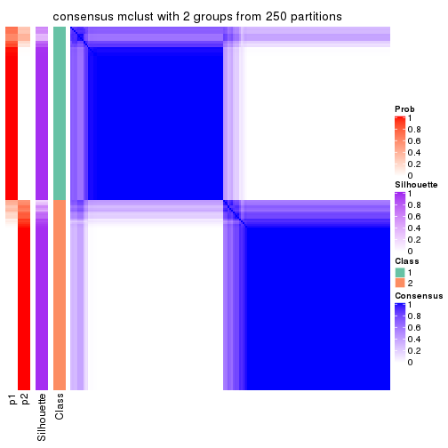</p>

</div>
<div id='tab-SD-mclust-consensus-heatmap-2'>
<pre><code class="r">consensus_heatmap(res, k = 3)
</code></pre>

<p>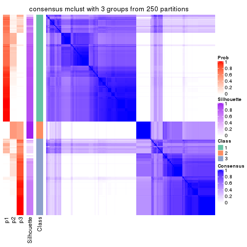</p>

</div>
<div id='tab-SD-mclust-consensus-heatmap-3'>
<pre><code class="r">consensus_heatmap(res, k = 4)
</code></pre>

<p>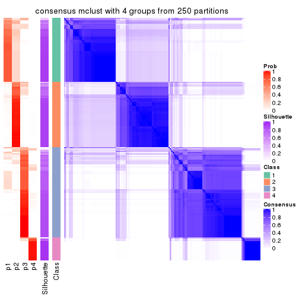</p>

</div>
<div id='tab-SD-mclust-consensus-heatmap-4'>
<pre><code class="r">consensus_heatmap(res, k = 5)
</code></pre>

<p>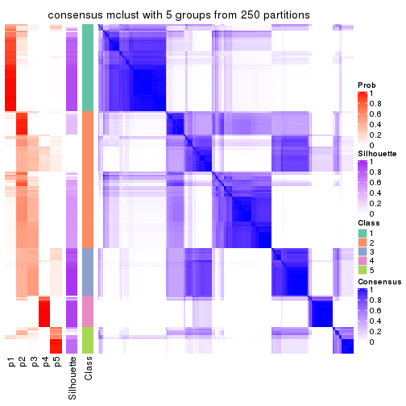</p>

</div>
<div id='tab-SD-mclust-consensus-heatmap-5'>
<pre><code class="r">consensus_heatmap(res, k = 6)
</code></pre>

<p>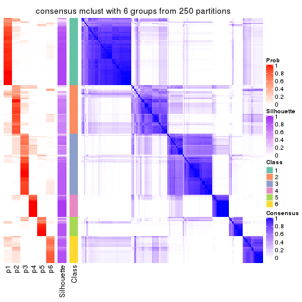</p>

</div>
</div>

Heatmaps for the membership of samples in all partitions to see how consistent they are:


<script>
$( function() {
	$( '#tabs-SD-mclust-membership-heatmap' ).tabs();
} );
</script>
<div id='tabs-SD-mclust-membership-heatmap'>
<ul>
<li><a href='#tab-SD-mclust-membership-heatmap-1'>k = 2</a></li>
<li><a href='#tab-SD-mclust-membership-heatmap-2'>k = 3</a></li>
<li><a href='#tab-SD-mclust-membership-heatmap-3'>k = 4</a></li>
<li><a href='#tab-SD-mclust-membership-heatmap-4'>k = 5</a></li>
<li><a href='#tab-SD-mclust-membership-heatmap-5'>k = 6</a></li>
</ul>
<div id='tab-SD-mclust-membership-heatmap-1'>
<pre><code class="r">membership_heatmap(res, k = 2)
</code></pre>

<p>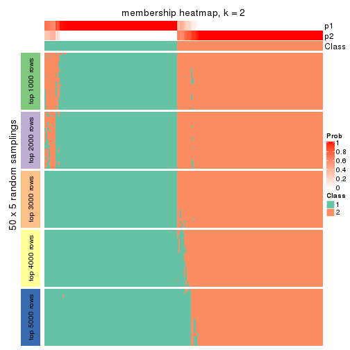</p>

</div>
<div id='tab-SD-mclust-membership-heatmap-2'>
<pre><code class="r">membership_heatmap(res, k = 3)
</code></pre>

<p>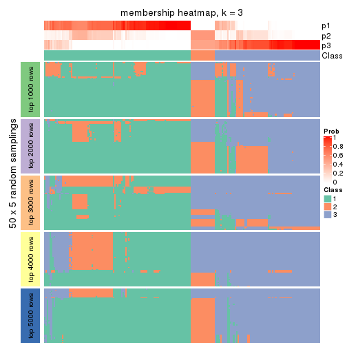</p>

</div>
<div id='tab-SD-mclust-membership-heatmap-3'>
<pre><code class="r">membership_heatmap(res, k = 4)
</code></pre>

<p>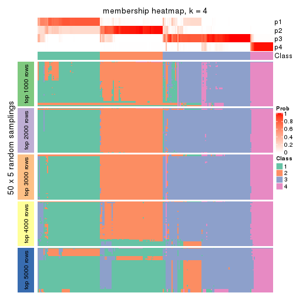</p>

</div>
<div id='tab-SD-mclust-membership-heatmap-4'>
<pre><code class="r">membership_heatmap(res, k = 5)
</code></pre>

<p>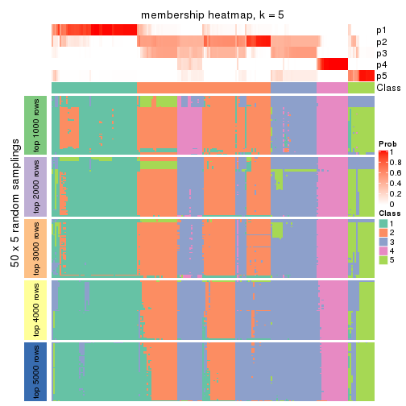</p>

</div>
<div id='tab-SD-mclust-membership-heatmap-5'>
<pre><code class="r">membership_heatmap(res, k = 6)
</code></pre>

<p>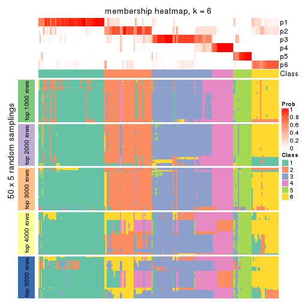</p>

</div>
</div>

As soon as we have had the classes for columns, we can look for signatures
which are significantly different between classes which can be candidate marks
for certain classes. Following are the heatmaps for signatures.


Signature heatmaps where rows are scaled:


<script>
$( function() {
	$( '#tabs-SD-mclust-get-signatures' ).tabs();
} );
</script>
<div id='tabs-SD-mclust-get-signatures'>
<ul>
<li><a href='#tab-SD-mclust-get-signatures-1'>k = 2</a></li>
<li><a href='#tab-SD-mclust-get-signatures-2'>k = 3</a></li>
<li><a href='#tab-SD-mclust-get-signatures-3'>k = 4</a></li>
<li><a href='#tab-SD-mclust-get-signatures-4'>k = 5</a></li>
<li><a href='#tab-SD-mclust-get-signatures-5'>k = 6</a></li>
</ul>
<div id='tab-SD-mclust-get-signatures-1'>
<pre><code class="r">get_signatures(res, k = 2)
</code></pre>

<p>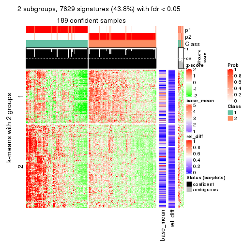</p>

</div>
<div id='tab-SD-mclust-get-signatures-2'>
<pre><code class="r">get_signatures(res, k = 3)
</code></pre>

<p>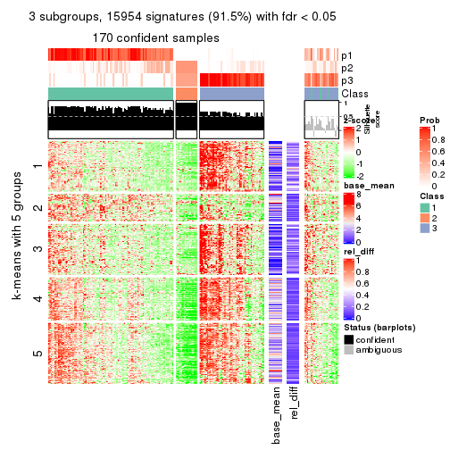</p>

</div>
<div id='tab-SD-mclust-get-signatures-3'>
<pre><code class="r">get_signatures(res, k = 4)
</code></pre>

<p>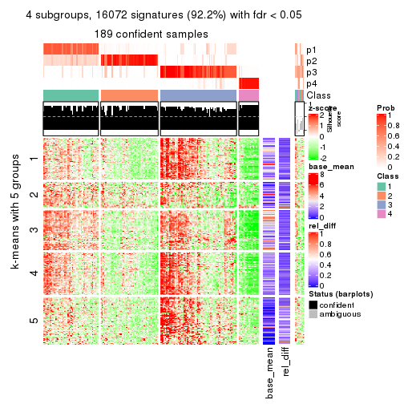</p>

</div>
<div id='tab-SD-mclust-get-signatures-4'>
<pre><code class="r">get_signatures(res, k = 5)
</code></pre>

<p>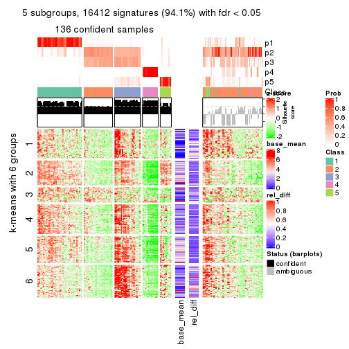</p>

</div>
<div id='tab-SD-mclust-get-signatures-5'>
<pre><code class="r">get_signatures(res, k = 6)
</code></pre>

<p>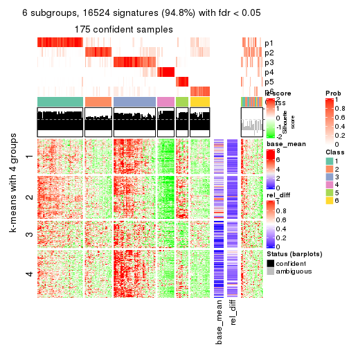</p>

</div>
</div>


Signature heatmaps where rows are not scaled:


<script>
$( function() {
	$( '#tabs-SD-mclust-get-signatures-no-scale' ).tabs();
} );
</script>
<div id='tabs-SD-mclust-get-signatures-no-scale'>
<ul>
<li><a href='#tab-SD-mclust-get-signatures-no-scale-1'>k = 2</a></li>
<li><a href='#tab-SD-mclust-get-signatures-no-scale-2'>k = 3</a></li>
<li><a href='#tab-SD-mclust-get-signatures-no-scale-3'>k = 4</a></li>
<li><a href='#tab-SD-mclust-get-signatures-no-scale-4'>k = 5</a></li>
<li><a href='#tab-SD-mclust-get-signatures-no-scale-5'>k = 6</a></li>
</ul>
<div id='tab-SD-mclust-get-signatures-no-scale-1'>
<pre><code class="r">get_signatures(res, k = 2, scale_rows = FALSE)
</code></pre>

<p>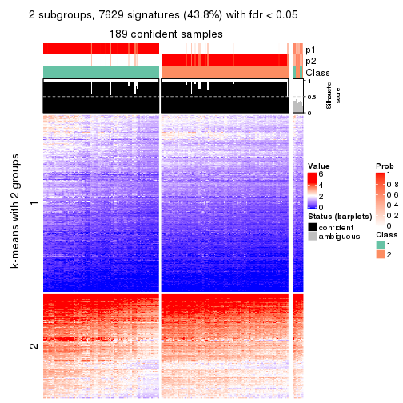</p>

</div>
<div id='tab-SD-mclust-get-signatures-no-scale-2'>
<pre><code class="r">get_signatures(res, k = 3, scale_rows = FALSE)
</code></pre>

<p>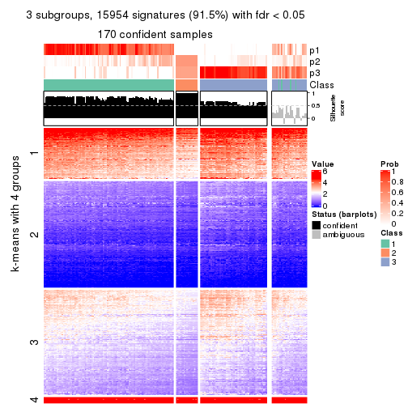</p>

</div>
<div id='tab-SD-mclust-get-signatures-no-scale-3'>
<pre><code class="r">get_signatures(res, k = 4, scale_rows = FALSE)
</code></pre>

<p>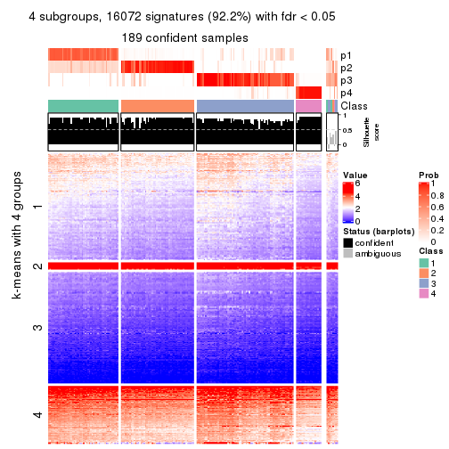</p>

</div>
<div id='tab-SD-mclust-get-signatures-no-scale-4'>
<pre><code class="r">get_signatures(res, k = 5, scale_rows = FALSE)
</code></pre>

<p>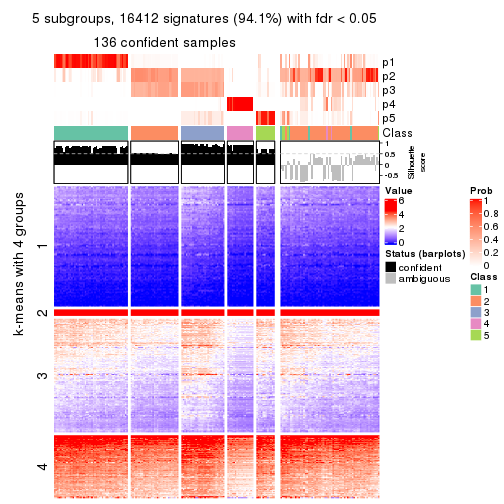</p>

</div>
<div id='tab-SD-mclust-get-signatures-no-scale-5'>
<pre><code class="r">get_signatures(res, k = 6, scale_rows = FALSE)
</code></pre>

<p>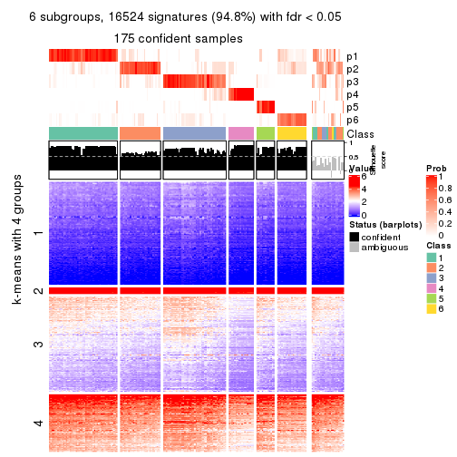</p>

</div>
</div>


Compare the overlap of signatures from different k:

```r
compare_signatures(res)
```

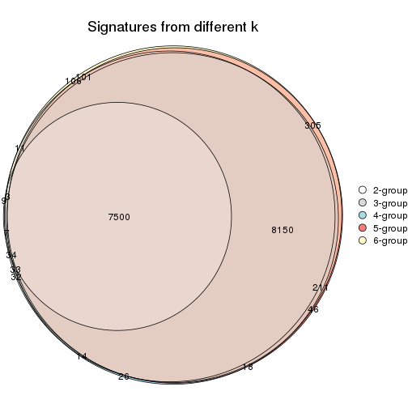

`get_signature()` returns a data frame invisibly. TO get the list of signatures, the function
call should be assigned to a variable explicitly. In following code, if `plot` argument is set
to `FALSE`, no heatmap is plotted while only the differential analysis is performed.

```r
# code only for demonstration
tb = get_signature(res, k = ..., plot = FALSE)
```

An example of the output of `tb` is:

```
#>   which_row         fdr    mean_1    mean_2 scaled_mean_1 scaled_mean_2 km
#> 1        38 0.042760348  8.373488  9.131774    -0.5533452     0.5164555  1
#> 2        40 0.018707592  7.106213  8.469186    -0.6173731     0.5762149  1
#> 3        55 0.019134737 10.221463 11.207825    -0.6159697     0.5749050  1
#> 4        59 0.006059896  5.921854  7.869574    -0.6899429     0.6439467  1
#> 5        60 0.018055526  8.928898 10.211722    -0.6204761     0.5791110  1
#> 6        98 0.009384629 15.714769 14.887706     0.6635654    -0.6193277  2
...
```

The columns in `tb` are:

1. `which_row`: row indices corresponding to the input matrix.
2. `fdr`: FDR for the differential test. 
3. `mean_x`: The mean value in group x.
4. `scaled_mean_x`: The mean value in group x after rows are scaled.
5. `km`: Row groups if k-means clustering is applied to rows.


UMAP plot which shows how samples are separated.


<script>
$( function() {
	$( '#tabs-SD-mclust-dimension-reduction' ).tabs();
} );
</script>
<div id='tabs-SD-mclust-dimension-reduction'>
<ul>
<li><a href='#tab-SD-mclust-dimension-reduction-1'>k = 2</a></li>
<li><a href='#tab-SD-mclust-dimension-reduction-2'>k = 3</a></li>
<li><a href='#tab-SD-mclust-dimension-reduction-3'>k = 4</a></li>
<li><a href='#tab-SD-mclust-dimension-reduction-4'>k = 5</a></li>
<li><a href='#tab-SD-mclust-dimension-reduction-5'>k = 6</a></li>
</ul>
<div id='tab-SD-mclust-dimension-reduction-1'>
<pre><code class="r">dimension_reduction(res, k = 2, method = &quot;UMAP&quot;)
</code></pre>

<p>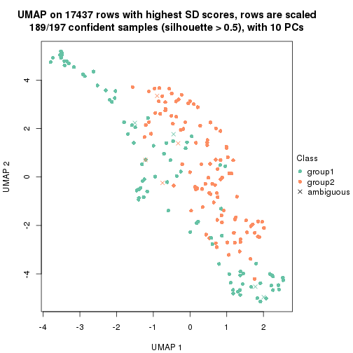</p>

</div>
<div id='tab-SD-mclust-dimension-reduction-2'>
<pre><code class="r">dimension_reduction(res, k = 3, method = &quot;UMAP&quot;)
</code></pre>

<p>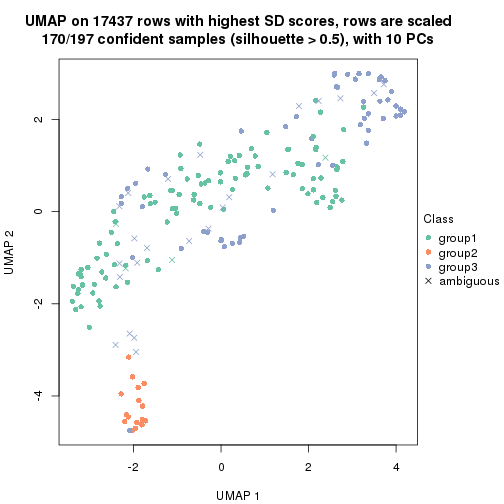</p>

</div>
<div id='tab-SD-mclust-dimension-reduction-3'>
<pre><code class="r">dimension_reduction(res, k = 4, method = &quot;UMAP&quot;)
</code></pre>

<p>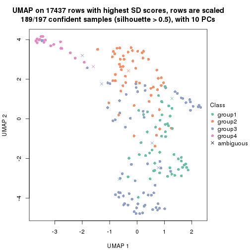</p>

</div>
<div id='tab-SD-mclust-dimension-reduction-4'>
<pre><code class="r">dimension_reduction(res, k = 5, method = &quot;UMAP&quot;)
</code></pre>

<p>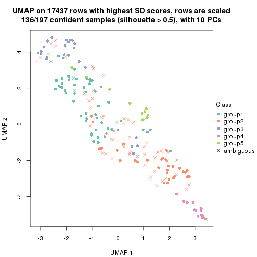</p>

</div>
<div id='tab-SD-mclust-dimension-reduction-5'>
<pre><code class="r">dimension_reduction(res, k = 6, method = &quot;UMAP&quot;)
</code></pre>

<p>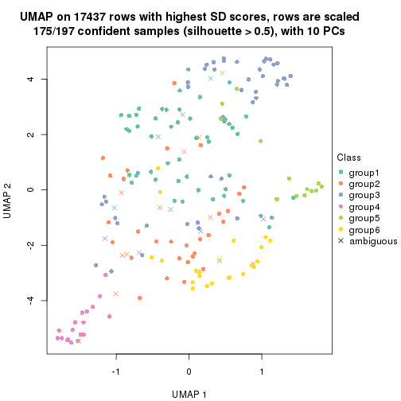</p>

</div>
</div>


Following heatmap shows how subgroups are split when increasing `k`:

```r
collect_classes(res)
```

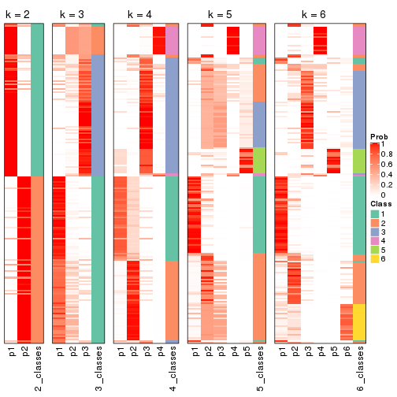


If matrix rows can be associated to genes, consider to use `GO_Enrichment(res,
...)` to perform function enrichment for the signature genes.


 

---------------------------------------------------


### SD:NMF


The object with results only for a single top-value method and a single partition method 
can be extracted as:

```r
res = res_list["SD", "NMF"]
# you can also extract it by
# res = res_list["SD:NMF"]
```

A summary of `res` and all the functions that can be applied to it:

```r
res
```

```
#> A 'ConsensusPartition' object with k = 2, 3, 4, 5, 6.
#>   On a matrix with 17437 rows and 197 columns.
#>   Top rows (1000, 2000, 3000, 4000, 5000) are extracted by 'SD' method.
#>   Subgroups are detected by 'NMF' method.
#>   Performed in total 1250 partitions by row resampling.
#>   Best k for subgroups seems to be 2.
#> 
#> Following methods can be applied to this 'ConsensusPartition' object:
#>  [1] "cola_report"             "collect_classes"         "collect_plots"          
#>  [4] "collect_stats"           "colnames"                "compare_signatures"     
#>  [7] "consensus_heatmap"       "dimension_reduction"     "functional_enrichment"  
#> [10] "get_anno_col"            "get_anno"                "get_classes"            
#> [13] "get_consensus"           "get_matrix"              "get_membership"         
#> [16] "get_param"               "get_signatures"          "get_stats"              
#> [19] "is_best_k"               "is_stable_k"             "membership_heatmap"     
#> [22] "ncol"                    "nrow"                    "plot_ecdf"              
#> [25] "rownames"                "select_partition_number" "show"                   
#> [28] "suggest_best_k"          "test_to_known_factors"
```

`collect_plots()` function collects all the plots made from `res` for all `k` (number of partitions)
into one single page to provide an easy and fast comparison between different `k`.

```r
collect_plots(res)
```

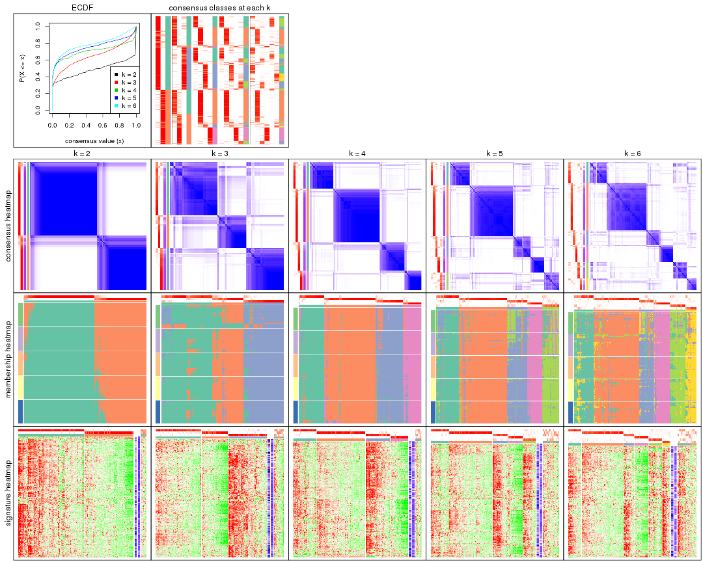

The plots are:

- The first row: a plot of the ECDF (Empirical cumulative distribution
  function) curves of the consensus matrix for each `k` and the heatmap of
  predicted classes for each `k`.
- The second row: heatmaps of the consensus matrix for each `k`.
- The third row: heatmaps of the membership matrix for each `k`.
- The fouth row: heatmaps of the signatures for each `k`.

All the plots in panels can be made by individual functions and they are
plotted later in this section.

`select_partition_number()` produces several plots showing different
statistics for choosing "optimized" `k`. There are following statistics:

- ECDF curves of the consensus matrix for each `k`;
- 1-PAC. [The PAC
  score](https://en.wikipedia.org/wiki/Consensus_clustering#Over-interpretation_potential_of_consensus_clustering)
  measures the proportion of the ambiguous subgrouping.
- Mean silhouette score.
- Concordance. The mean probability of fiting the consensus class ids in all
  partitions.
- Area increased. Denote $A_k$ as the area under the ECDF curve for current
  `k`, the area increased is defined as $A_k - A_{k-1}$.
- Rand index. The percent of pairs of samples that are both in a same cluster
  or both are not in a same cluster in the partition of k and k-1.
- Jaccard index. The ratio of pairs of samples are both in a same cluster in
  the partition of k and k-1 and the pairs of samples are both in a same
  cluster in the partition k or k-1.

The detailed explanations of these statistics can be found in [the cola
vignette](http://bioconductor.org/packages/devel/bioc/vignettes/cola/inst/doc/cola.html#toc_13).

Generally speaking, lower PAC score, higher mean silhouette score or higher
concordance corresponds to better partition. Rand index and Jaccard index
measure how similar the current partition is compared to partition with `k-1`.
If they are too similar, we won't accept `k` is better than `k-1`.

```r
select_partition_number(res)
```

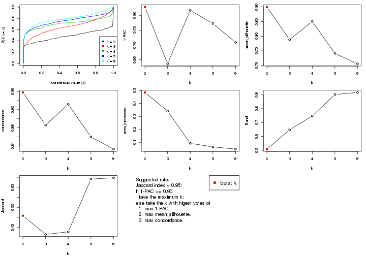

The numeric values for all these statistics can be obtained by `get_stats()`.

```r
get_stats(res)
```

```
#>   k 1-PAC mean_silhouette concordance area_increased  Rand Jaccard
#> 2 2 0.828           0.899       0.958         0.4854 0.508   0.508
#> 3 3 0.637           0.789       0.886         0.3411 0.648   0.415
#> 4 4 0.817           0.850       0.932         0.0921 0.748   0.428
#> 5 5 0.772           0.741       0.860         0.0648 0.903   0.691
#> 6 6 0.709           0.706       0.833         0.0475 0.918   0.698
```

`suggest_best_k()` suggests the best $k$ based on these statistics. The rules are as follows:

- All $k$ with Jaccard index larger than 0.95 are removed because the increase of
  the partition number does not provides enough extra information. If all $k$ are removed,
  the best $k$ is assigned by `NA`.
- For $k$ with 1-PAC larger than 0.9, the maximal $k$ is taken as the "best k". Other $k$ is called "optional k".
- If it does not fit the second rule. The $k$ with the highest vote of highest
  1-PAC, mean silhouette and concordance is taken as the "best k".

```r
suggest_best_k(res)
```

```
#> [1] 2
```


Following shows the table of the partitions (You need to click the **show/hide
code output** link to see it). The membership matrix (columns with name `p*`)
is inferred by
[`clue::cl_consensus()`](https://www.rdocumentation.org/link/cl_consensus?package=clue)
function with the `SE` method. Basically the value in the membership matrix
represents the probability to belong to a certain group. The finall class
label for an item is determined with the group with highest probability it
belongs to.

In `get_classes()` function, the entropy is calculated from the membership
matrix and the silhouette score is calculated from the consensus matrix.


<script>
$( function() {
	$( '#tabs-SD-NMF-get-classes' ).tabs();
} );
</script>
<div id='tabs-SD-NMF-get-classes'>
<ul>
<li><a href='#tab-SD-NMF-get-classes-1'>k = 2</a></li>
<li><a href='#tab-SD-NMF-get-classes-2'>k = 3</a></li>
<li><a href='#tab-SD-NMF-get-classes-3'>k = 4</a></li>
<li><a href='#tab-SD-NMF-get-classes-4'>k = 5</a></li>
<li><a href='#tab-SD-NMF-get-classes-5'>k = 6</a></li>
</ul>

<div id='tab-SD-NMF-get-classes-1'>
<p><a id='tab-SD-NMF-get-classes-1-a' style='color:#0366d6' href='#'>show/hide code output</a></p>
<pre><code class="r">cbind(get_classes(res, k = 2), get_membership(res, k = 2))
</code></pre>

<pre><code>#&gt;            class entropy silhouette    p1    p2
#&gt; SRR1380886     1  0.0000     0.9675 1.000 0.000
#&gt; SRR1074385     1  0.0000     0.9675 1.000 0.000
#&gt; SRR1374739     1  0.0000     0.9675 1.000 0.000
#&gt; SRR1097883     1  0.0000     0.9675 1.000 0.000
#&gt; SRR2167209     1  0.0000     0.9675 1.000 0.000
#&gt; SRR816541      2  0.0000     0.9369 0.000 1.000
#&gt; SRR663645      2  0.1843     0.9188 0.028 0.972
#&gt; SRR1381505     2  0.0000     0.9369 0.000 1.000
#&gt; SRR1416362     2  0.0000     0.9369 0.000 1.000
#&gt; SRR1318503     2  0.6438     0.7993 0.164 0.836
#&gt; SRR1341626     2  0.0000     0.9369 0.000 1.000
#&gt; SRR1382440     1  0.0000     0.9675 1.000 0.000
#&gt; SRR1088413     1  0.0000     0.9675 1.000 0.000
#&gt; SRR1082080     2  0.0000     0.9369 0.000 1.000
#&gt; SRR1455783     1  0.0376     0.9644 0.996 0.004
#&gt; SRR1447760     1  0.0000     0.9675 1.000 0.000
#&gt; SRR1487784     2  0.0000     0.9369 0.000 1.000
#&gt; SRR1331037     2  0.0000     0.9369 0.000 1.000
#&gt; SRR1095651     1  0.0000     0.9675 1.000 0.000
#&gt; SRR1078066     1  0.0000     0.9675 1.000 0.000
#&gt; SRR1120363     1  0.0000     0.9675 1.000 0.000
#&gt; SRR821231      1  0.0000     0.9675 1.000 0.000
#&gt; SRR1374373     2  0.9754     0.3656 0.408 0.592
#&gt; SRR1324519     2  0.0000     0.9369 0.000 1.000
#&gt; SRR1431121     1  0.0000     0.9675 1.000 0.000
#&gt; SRR1091032     2  0.0000     0.9369 0.000 1.000
#&gt; SRR1365575     2  0.0000     0.9369 0.000 1.000
#&gt; SRR1072972     1  0.0000     0.9675 1.000 0.000
#&gt; SRR1310690     2  0.0000     0.9369 0.000 1.000
#&gt; SRR1383037     1  0.0000     0.9675 1.000 0.000
#&gt; SRR1095479     1  0.0000     0.9675 1.000 0.000
#&gt; SRR1070403     1  0.0000     0.9675 1.000 0.000
#&gt; SRR1390203     1  0.4562     0.8750 0.904 0.096
#&gt; SRR1072007     2  1.0000     0.0743 0.496 0.504
#&gt; SRR1468787     1  0.0000     0.9675 1.000 0.000
#&gt; SRR1347959     2  0.0000     0.9369 0.000 1.000
#&gt; SRR1338513     1  0.0000     0.9675 1.000 0.000
#&gt; SRR812598      2  0.0000     0.9369 0.000 1.000
#&gt; SRR1446806     1  0.9580     0.3538 0.620 0.380
#&gt; SRR1394275     1  0.0000     0.9675 1.000 0.000
#&gt; SRR1443633     1  0.0000     0.9675 1.000 0.000
#&gt; SRR1087728     1  0.0000     0.9675 1.000 0.000
#&gt; SRR1098192     2  0.0000     0.9369 0.000 1.000
#&gt; SRR1093340     2  0.0000     0.9369 0.000 1.000
#&gt; SRR665405      1  0.0000     0.9675 1.000 0.000
#&gt; SRR657077      2  0.0000     0.9369 0.000 1.000
#&gt; SRR813208      1  0.0000     0.9675 1.000 0.000
#&gt; SRR1416074     2  0.0000     0.9369 0.000 1.000
#&gt; SRR1089688     1  0.3274     0.9138 0.940 0.060
#&gt; SRR1353461     1  0.0000     0.9675 1.000 0.000
#&gt; SRR1466321     2  0.6247     0.8082 0.156 0.844
#&gt; SRR1073021     1  0.0000     0.9675 1.000 0.000
#&gt; SRR1322816     2  0.0000     0.9369 0.000 1.000
#&gt; SRR1457727     1  0.0000     0.9675 1.000 0.000
#&gt; SRR1464226     2  0.0000     0.9369 0.000 1.000
#&gt; SRR1398863     1  0.0000     0.9675 1.000 0.000
#&gt; SRR1455631     2  0.9710     0.3864 0.400 0.600
#&gt; SRR1307808     2  0.7745     0.7202 0.228 0.772
#&gt; SRR1374585     2  0.0000     0.9369 0.000 1.000
#&gt; SRR1072104     2  0.7745     0.7213 0.228 0.772
#&gt; SRR1076868     2  0.0000     0.9369 0.000 1.000
#&gt; SRR1335984     2  0.8909     0.5937 0.308 0.692
#&gt; SRR1445939     2  0.8861     0.5986 0.304 0.696
#&gt; SRR1453047     2  0.0000     0.9369 0.000 1.000
#&gt; SRR1339788     1  0.0000     0.9675 1.000 0.000
#&gt; SRR1084323     1  0.4161     0.8885 0.916 0.084
#&gt; SRR1092937     1  0.0938     0.9578 0.988 0.012
#&gt; SRR1074090     2  0.0000     0.9369 0.000 1.000
#&gt; SRR1099833     1  0.0000     0.9675 1.000 0.000
#&gt; SRR1093434     1  0.0000     0.9675 1.000 0.000
#&gt; SRR1435857     1  0.0000     0.9675 1.000 0.000
#&gt; SRR1480347     2  0.0000     0.9369 0.000 1.000
#&gt; SRR1440787     2  0.0000     0.9369 0.000 1.000
#&gt; SRR1430202     1  0.2043     0.9402 0.968 0.032
#&gt; SRR1322730     2  0.0000     0.9369 0.000 1.000
#&gt; SRR811029      2  0.0000     0.9369 0.000 1.000
#&gt; SRR1390456     1  0.0000     0.9675 1.000 0.000
#&gt; SRR1381140     1  0.9754     0.2696 0.592 0.408
#&gt; SRR1388064     2  0.0000     0.9369 0.000 1.000
#&gt; SRR1093577     1  0.0000     0.9675 1.000 0.000
#&gt; SRR1414161     1  0.9686     0.3068 0.604 0.396
#&gt; SRR1328738     1  0.0376     0.9644 0.996 0.004
#&gt; SRR1311752     2  0.0000     0.9369 0.000 1.000
#&gt; SRR1445960     2  0.0000     0.9369 0.000 1.000
#&gt; SRR1403412     2  0.0000     0.9369 0.000 1.000
#&gt; SRR2166748     1  0.0000     0.9675 1.000 0.000
#&gt; SRR821666      2  0.0000     0.9369 0.000 1.000
#&gt; SRR1330746     1  0.0000     0.9675 1.000 0.000
#&gt; SRR1327872     2  0.0000     0.9369 0.000 1.000
#&gt; SRR1100800     1  0.0000     0.9675 1.000 0.000
#&gt; SRR1075174     1  0.2603     0.9292 0.956 0.044
#&gt; SRR1434436     2  0.5178     0.8481 0.116 0.884
#&gt; SRR1389409     2  0.0000     0.9369 0.000 1.000
#&gt; SRR1085310     1  0.0000     0.9675 1.000 0.000
#&gt; SRR1376718     2  0.0000     0.9369 0.000 1.000
#&gt; SRR808590      2  0.0000     0.9369 0.000 1.000
#&gt; SRR1084128     2  0.0000     0.9369 0.000 1.000
#&gt; SRR1361692     1  0.0000     0.9675 1.000 0.000
#&gt; SRR1431493     1  0.0000     0.9675 1.000 0.000
#&gt; SRR1409084     1  0.0000     0.9675 1.000 0.000
#&gt; SRR2166214     1  0.0376     0.9644 0.996 0.004
#&gt; SRR1324102     2  0.0000     0.9369 0.000 1.000
#&gt; SRR1079754     2  0.0000     0.9369 0.000 1.000
#&gt; SRR1442127     1  0.0000     0.9675 1.000 0.000
#&gt; SRR1076244     2  0.8555     0.6278 0.280 0.720
#&gt; SRR1330901     2  0.5178     0.8479 0.116 0.884
#&gt; SRR1073167     2  0.0000     0.9369 0.000 1.000
#&gt; SRR1357541     1  0.0000     0.9675 1.000 0.000
#&gt; SRR811607      2  0.7056     0.7697 0.192 0.808
#&gt; SRR1468931     1  0.0000     0.9675 1.000 0.000
#&gt; SRR1474908     2  0.0000     0.9369 0.000 1.000
#&gt; SRR1309875     2  0.0000     0.9369 0.000 1.000
#&gt; SRR598792      1  0.0000     0.9675 1.000 0.000
#&gt; SRR1088537     2  0.0000     0.9369 0.000 1.000
#&gt; SRR1457682     1  0.5059     0.8567 0.888 0.112
#&gt; SRR1454289     2  0.8386     0.6601 0.268 0.732
#&gt; SRR1069352     1  0.0000     0.9675 1.000 0.000
#&gt; SRR1472728     2  0.0000     0.9369 0.000 1.000
#&gt; SRR1091144     1  0.0000     0.9675 1.000 0.000
#&gt; SRR1319118     1  0.0000     0.9675 1.000 0.000
#&gt; SRR1403611     1  0.0000     0.9675 1.000 0.000
#&gt; SRR1397762     1  0.3114     0.9176 0.944 0.056
#&gt; SRR1317387     1  0.0000     0.9675 1.000 0.000
#&gt; SRR1376426     2  0.0000     0.9369 0.000 1.000
#&gt; SRR1097777     1  0.0000     0.9675 1.000 0.000
#&gt; SRR1365743     1  0.0000     0.9675 1.000 0.000
#&gt; SRR1458992     2  0.0000     0.9369 0.000 1.000
#&gt; SRR1089537     1  0.0000     0.9675 1.000 0.000
#&gt; SRR1397744     1  0.0000     0.9675 1.000 0.000
#&gt; SRR1453893     2  0.0000     0.9369 0.000 1.000
#&gt; SRR1098543     1  0.0672     0.9612 0.992 0.008
#&gt; SRR1321765     1  0.0000     0.9675 1.000 0.000
#&gt; SRR1440032     1  0.0000     0.9675 1.000 0.000
#&gt; SRR1404507     2  0.0000     0.9369 0.000 1.000
#&gt; SRR1404856     1  0.0000     0.9675 1.000 0.000
#&gt; SRR812745      2  0.9323     0.5110 0.348 0.652
#&gt; SRR1417524     1  0.0000     0.9675 1.000 0.000
#&gt; SRR1407334     2  0.0000     0.9369 0.000 1.000
#&gt; SRR1453991     1  0.0000     0.9675 1.000 0.000
#&gt; SRR1415938     1  0.0000     0.9675 1.000 0.000
#&gt; SRR1081259     1  0.4815     0.8658 0.896 0.104
#&gt; SRR1436187     2  0.0000     0.9369 0.000 1.000
#&gt; SRR1431948     1  0.0000     0.9675 1.000 0.000
#&gt; SRR1453277     1  0.0000     0.9675 1.000 0.000
#&gt; SRR1095407     1  0.0000     0.9675 1.000 0.000
#&gt; SRR1359694     2  0.0000     0.9369 0.000 1.000
#&gt; SRR656982      1  0.0000     0.9675 1.000 0.000
#&gt; SRR1354338     2  0.0376     0.9345 0.004 0.996
#&gt; SRR1088291     1  0.0000     0.9675 1.000 0.000
#&gt; SRR1080624     1  0.0000     0.9675 1.000 0.000
#&gt; SRR2166708     1  0.0000     0.9675 1.000 0.000
#&gt; SRR1393572     1  0.0000     0.9675 1.000 0.000
#&gt; SRR1429912     2  0.9209     0.5369 0.336 0.664
#&gt; SRR1421048     1  0.9996    -0.0289 0.512 0.488
#&gt; SRR1434999     1  0.0000     0.9675 1.000 0.000
#&gt; SRR656457      1  0.0000     0.9675 1.000 0.000
#&gt; SRR1098928     1  0.0000     0.9675 1.000 0.000
#&gt; SRR1343967     2  0.0000     0.9369 0.000 1.000
#&gt; SRR1360766     1  0.0000     0.9675 1.000 0.000
#&gt; SRR1464724     2  0.0376     0.9344 0.004 0.996
#&gt; SRR1101542     2  0.0000     0.9369 0.000 1.000
#&gt; SRR1401528     1  0.0000     0.9675 1.000 0.000
#&gt; SRR1071519     1  0.0000     0.9675 1.000 0.000
#&gt; SRR1086070     1  0.0000     0.9675 1.000 0.000
#&gt; SRR1358645     2  0.0000     0.9369 0.000 1.000
#&gt; SRR819771      1  0.0000     0.9675 1.000 0.000
#&gt; SRR1418433     1  0.8144     0.6516 0.748 0.252
#&gt; SRR821050      1  0.0000     0.9675 1.000 0.000
#&gt; SRR1402091     2  0.0000     0.9369 0.000 1.000
#&gt; SRR1322028     2  0.0000     0.9369 0.000 1.000
#&gt; SRR1452556     2  0.0000     0.9369 0.000 1.000
#&gt; SRR1340047     1  0.9393     0.4184 0.644 0.356
#&gt; SRR1418302     2  0.0000     0.9369 0.000 1.000
#&gt; SRR1073991     1  0.0000     0.9675 1.000 0.000
#&gt; SRR1085187     1  0.0000     0.9675 1.000 0.000
#&gt; SRR1357618     1  0.0000     0.9675 1.000 0.000
#&gt; SRR1487764     1  0.0000     0.9675 1.000 0.000
#&gt; SRR1075336     1  0.0000     0.9675 1.000 0.000
#&gt; SRR1365471     2  0.0000     0.9369 0.000 1.000
#&gt; SRR1414613     2  0.0000     0.9369 0.000 1.000
#&gt; SRR658719      2  0.2948     0.9013 0.052 0.948
#&gt; SRR1475128     1  0.0000     0.9675 1.000 0.000
#&gt; SRR1367630     1  0.8861     0.5412 0.696 0.304
#&gt; SRR1481146     2  0.9850     0.3082 0.428 0.572
#&gt; SRR1465674     1  0.0000     0.9675 1.000 0.000
#&gt; SRR1327303     1  0.5408     0.8411 0.876 0.124
#&gt; SRR1390391     2  0.4298     0.8724 0.088 0.912
#&gt; SRR1326020     1  0.0000     0.9675 1.000 0.000
#&gt; SRR1381953     1  0.0000     0.9675 1.000 0.000
#&gt; SRR1082544     2  0.0000     0.9369 0.000 1.000
#&gt; SRR810761      1  0.0000     0.9675 1.000 0.000
#&gt; SRR1070764     1  0.0000     0.9675 1.000 0.000
#&gt; SRR1415919     1  0.0000     0.9675 1.000 0.000
#&gt; SRR1490404     2  0.0000     0.9369 0.000 1.000
#&gt; SRR1416773     1  0.0000     0.9675 1.000 0.000
#&gt; SRR1377492     1  0.0000     0.9675 1.000 0.000
#&gt; SRR1334314     1  0.0000     0.9675 1.000 0.000
</code></pre>

<script>
$('#tab-SD-NMF-get-classes-1-a').parent().next().next().hide();
$('#tab-SD-NMF-get-classes-1-a').click(function(){
  $('#tab-SD-NMF-get-classes-1-a').parent().next().next().toggle();
  return(false);
});
</script>
</div>

<div id='tab-SD-NMF-get-classes-2'>
<p><a id='tab-SD-NMF-get-classes-2-a' style='color:#0366d6' href='#'>show/hide code output</a></p>
<pre><code class="r">cbind(get_classes(res, k = 3), get_membership(res, k = 3))
</code></pre>

<pre><code>#&gt;            class entropy silhouette    p1    p2    p3
#&gt; SRR1380886     3  0.0000     0.9161 0.000 0.000 1.000
#&gt; SRR1074385     1  0.2860     0.8288 0.912 0.004 0.084
#&gt; SRR1374739     3  0.0000     0.9161 0.000 0.000 1.000
#&gt; SRR1097883     1  0.4504     0.7013 0.804 0.000 0.196
#&gt; SRR2167209     1  0.4235     0.7274 0.824 0.000 0.176
#&gt; SRR816541      2  0.5178     0.6691 0.256 0.744 0.000
#&gt; SRR663645      2  0.0237     0.8589 0.000 0.996 0.004
#&gt; SRR1381505     2  0.0000     0.8606 0.000 1.000 0.000
#&gt; SRR1416362     1  0.2537     0.8497 0.920 0.080 0.000
#&gt; SRR1318503     1  0.0000     0.8590 1.000 0.000 0.000
#&gt; SRR1341626     1  0.5098     0.6709 0.752 0.248 0.000
#&gt; SRR1382440     3  0.0592     0.9140 0.012 0.000 0.988
#&gt; SRR1088413     3  0.1529     0.9051 0.040 0.000 0.960
#&gt; SRR1082080     1  0.6244     0.1839 0.560 0.440 0.000
#&gt; SRR1455783     1  0.1643     0.8611 0.956 0.044 0.000
#&gt; SRR1447760     1  0.0000     0.8590 1.000 0.000 0.000
#&gt; SRR1487784     1  0.2356     0.8535 0.928 0.072 0.000
#&gt; SRR1331037     1  0.2165     0.8570 0.936 0.064 0.000
#&gt; SRR1095651     3  0.0000     0.9161 0.000 0.000 1.000
#&gt; SRR1078066     3  0.5905     0.5302 0.352 0.000 0.648
#&gt; SRR1120363     1  0.0424     0.8572 0.992 0.000 0.008
#&gt; SRR821231      3  0.1163     0.9095 0.028 0.000 0.972
#&gt; SRR1374373     1  0.2959     0.8377 0.900 0.100 0.000
#&gt; SRR1324519     2  0.6192     0.3289 0.420 0.580 0.000
#&gt; SRR1431121     1  0.2261     0.8231 0.932 0.000 0.068
#&gt; SRR1091032     2  0.6062     0.4266 0.384 0.616 0.000
#&gt; SRR1365575     2  0.0000     0.8606 0.000 1.000 0.000
#&gt; SRR1072972     3  0.2356     0.8933 0.072 0.000 0.928
#&gt; SRR1310690     2  0.4654     0.7289 0.208 0.792 0.000
#&gt; SRR1383037     3  0.0000     0.9161 0.000 0.000 1.000
#&gt; SRR1095479     3  0.3038     0.8699 0.104 0.000 0.896
#&gt; SRR1070403     3  0.0000     0.9161 0.000 0.000 1.000
#&gt; SRR1390203     1  0.1031     0.8616 0.976 0.024 0.000
#&gt; SRR1072007     2  0.4232     0.8077 0.044 0.872 0.084
#&gt; SRR1468787     3  0.5733     0.5829 0.324 0.000 0.676
#&gt; SRR1347959     1  0.2066     0.8585 0.940 0.060 0.000
#&gt; SRR1338513     3  0.0424     0.9126 0.000 0.008 0.992
#&gt; SRR812598      2  0.1411     0.8500 0.036 0.964 0.000
#&gt; SRR1446806     1  0.2066     0.8585 0.940 0.060 0.000
#&gt; SRR1394275     1  0.1832     0.8579 0.956 0.008 0.036
#&gt; SRR1443633     3  0.4702     0.7620 0.212 0.000 0.788
#&gt; SRR1087728     3  0.0000     0.9161 0.000 0.000 1.000
#&gt; SRR1098192     2  0.1643     0.8468 0.044 0.956 0.000
#&gt; SRR1093340     1  0.4121     0.7754 0.832 0.168 0.000
#&gt; SRR665405      3  0.2878     0.8517 0.000 0.096 0.904
#&gt; SRR657077      2  0.6111     0.3924 0.396 0.604 0.000
#&gt; SRR813208      3  0.0000     0.9161 0.000 0.000 1.000
#&gt; SRR1416074     1  0.3267     0.8254 0.884 0.116 0.000
#&gt; SRR1089688     2  0.6302     0.0685 0.000 0.520 0.480
#&gt; SRR1353461     3  0.0000     0.9161 0.000 0.000 1.000
#&gt; SRR1466321     1  0.0592     0.8609 0.988 0.012 0.000
#&gt; SRR1073021     1  0.4399     0.7124 0.812 0.000 0.188
#&gt; SRR1322816     2  0.3412     0.8049 0.124 0.876 0.000
#&gt; SRR1457727     1  0.0592     0.8559 0.988 0.000 0.012
#&gt; SRR1464226     2  0.0000     0.8606 0.000 1.000 0.000
#&gt; SRR1398863     3  0.4605     0.7389 0.204 0.000 0.796
#&gt; SRR1455631     2  0.1643     0.8428 0.000 0.956 0.044
#&gt; SRR1307808     1  0.0237     0.8598 0.996 0.004 0.000
#&gt; SRR1374585     2  0.0000     0.8606 0.000 1.000 0.000
#&gt; SRR1072104     2  0.0000     0.8606 0.000 1.000 0.000
#&gt; SRR1076868     1  0.2066     0.8585 0.940 0.060 0.000
#&gt; SRR1335984     2  0.6224     0.6755 0.240 0.728 0.032
#&gt; SRR1445939     1  0.3551     0.8132 0.868 0.132 0.000
#&gt; SRR1453047     1  0.4399     0.7522 0.812 0.188 0.000
#&gt; SRR1339788     3  0.0000     0.9161 0.000 0.000 1.000
#&gt; SRR1084323     1  0.2301     0.8594 0.936 0.060 0.004
#&gt; SRR1092937     3  0.3769     0.8219 0.104 0.016 0.880
#&gt; SRR1074090     1  0.3816     0.7964 0.852 0.148 0.000
#&gt; SRR1099833     3  0.5178     0.6280 0.000 0.256 0.744
#&gt; SRR1093434     3  0.0000     0.9161 0.000 0.000 1.000
#&gt; SRR1435857     1  0.5650     0.5098 0.688 0.000 0.312
#&gt; SRR1480347     1  0.5327     0.6239 0.728 0.272 0.000
#&gt; SRR1440787     2  0.0000     0.8606 0.000 1.000 0.000
#&gt; SRR1430202     1  0.1860     0.8600 0.948 0.052 0.000
#&gt; SRR1322730     2  0.0592     0.8562 0.000 0.988 0.012
#&gt; SRR811029      2  0.0424     0.8589 0.008 0.992 0.000
#&gt; SRR1390456     3  0.0000     0.9161 0.000 0.000 1.000
#&gt; SRR1381140     1  0.2066     0.8585 0.940 0.060 0.000
#&gt; SRR1388064     2  0.0000     0.8606 0.000 1.000 0.000
#&gt; SRR1093577     1  0.0592     0.8564 0.988 0.000 0.012
#&gt; SRR1414161     1  0.2066     0.8585 0.940 0.060 0.000
#&gt; SRR1328738     1  0.0000     0.8590 1.000 0.000 0.000
#&gt; SRR1311752     1  0.2959     0.8374 0.900 0.100 0.000
#&gt; SRR1445960     2  0.3686     0.7922 0.140 0.860 0.000
#&gt; SRR1403412     2  0.3192     0.8111 0.112 0.888 0.000
#&gt; SRR2166748     3  0.6225     0.3212 0.432 0.000 0.568
#&gt; SRR821666      2  0.0000     0.8606 0.000 1.000 0.000
#&gt; SRR1330746     3  0.0000     0.9161 0.000 0.000 1.000
#&gt; SRR1327872     2  0.0000     0.8606 0.000 1.000 0.000
#&gt; SRR1100800     1  0.2356     0.8213 0.928 0.000 0.072
#&gt; SRR1075174     3  0.3851     0.7912 0.136 0.004 0.860
#&gt; SRR1434436     1  0.2066     0.8585 0.940 0.060 0.000
#&gt; SRR1389409     2  0.0000     0.8606 0.000 1.000 0.000
#&gt; SRR1085310     3  0.0237     0.9154 0.004 0.000 0.996
#&gt; SRR1376718     2  0.0000     0.8606 0.000 1.000 0.000
#&gt; SRR808590      2  0.0000     0.8606 0.000 1.000 0.000
#&gt; SRR1084128     1  0.4291     0.7632 0.820 0.180 0.000
#&gt; SRR1361692     1  0.1163     0.8504 0.972 0.000 0.028
#&gt; SRR1431493     3  0.3038     0.8702 0.104 0.000 0.896
#&gt; SRR1409084     1  0.4139     0.7905 0.860 0.016 0.124
#&gt; SRR2166214     3  0.4235     0.7671 0.000 0.176 0.824
#&gt; SRR1324102     1  0.5254     0.6397 0.736 0.264 0.000
#&gt; SRR1079754     2  0.0000     0.8606 0.000 1.000 0.000
#&gt; SRR1442127     3  0.0000     0.9161 0.000 0.000 1.000
#&gt; SRR1076244     2  0.3941     0.7313 0.000 0.844 0.156
#&gt; SRR1330901     1  0.1163     0.8617 0.972 0.028 0.000
#&gt; SRR1073167     1  0.5988     0.4079 0.632 0.368 0.000
#&gt; SRR1357541     1  0.5926     0.3983 0.644 0.000 0.356
#&gt; SRR811607      1  0.0000     0.8590 1.000 0.000 0.000
#&gt; SRR1468931     3  0.0000     0.9161 0.000 0.000 1.000
#&gt; SRR1474908     2  0.6026     0.4502 0.376 0.624 0.000
#&gt; SRR1309875     2  0.3116     0.8135 0.108 0.892 0.000
#&gt; SRR598792      3  0.0000     0.9161 0.000 0.000 1.000
#&gt; SRR1088537     1  0.4291     0.7624 0.820 0.180 0.000
#&gt; SRR1457682     1  0.0000     0.8590 1.000 0.000 0.000
#&gt; SRR1454289     1  0.1643     0.8611 0.956 0.044 0.000
#&gt; SRR1069352     3  0.2448     0.8886 0.076 0.000 0.924
#&gt; SRR1472728     1  0.5058     0.6759 0.756 0.244 0.000
#&gt; SRR1091144     3  0.2050     0.9057 0.028 0.020 0.952
#&gt; SRR1319118     3  0.1860     0.8982 0.052 0.000 0.948
#&gt; SRR1403611     3  0.2356     0.8672 0.000 0.072 0.928
#&gt; SRR1397762     3  0.4618     0.7733 0.136 0.024 0.840
#&gt; SRR1317387     3  0.0000     0.9161 0.000 0.000 1.000
#&gt; SRR1376426     1  0.2625     0.8474 0.916 0.084 0.000
#&gt; SRR1097777     1  0.5733     0.5151 0.676 0.000 0.324
#&gt; SRR1365743     3  0.0000     0.9161 0.000 0.000 1.000
#&gt; SRR1458992     2  0.5560     0.5900 0.300 0.700 0.000
#&gt; SRR1089537     3  0.2096     0.9001 0.052 0.004 0.944
#&gt; SRR1397744     1  0.0000     0.8590 1.000 0.000 0.000
#&gt; SRR1453893     2  0.0000     0.8606 0.000 1.000 0.000
#&gt; SRR1098543     1  0.0237     0.8598 0.996 0.004 0.000
#&gt; SRR1321765     1  0.6079     0.3098 0.612 0.000 0.388
#&gt; SRR1440032     3  0.2200     0.8884 0.004 0.056 0.940
#&gt; SRR1404507     2  0.0000     0.8606 0.000 1.000 0.000
#&gt; SRR1404856     1  0.4178     0.7325 0.828 0.000 0.172
#&gt; SRR812745      2  0.7372     0.7108 0.128 0.704 0.168
#&gt; SRR1417524     3  0.0000     0.9161 0.000 0.000 1.000
#&gt; SRR1407334     2  0.0000     0.8606 0.000 1.000 0.000
#&gt; SRR1453991     1  0.0000     0.8590 1.000 0.000 0.000
#&gt; SRR1415938     1  0.3752     0.7794 0.856 0.000 0.144
#&gt; SRR1081259     1  0.2066     0.8585 0.940 0.060 0.000
#&gt; SRR1436187     2  0.0000     0.8606 0.000 1.000 0.000
#&gt; SRR1431948     3  0.0000     0.9161 0.000 0.000 1.000
#&gt; SRR1453277     3  0.5763     0.6266 0.276 0.008 0.716
#&gt; SRR1095407     1  0.4654     0.6839 0.792 0.000 0.208
#&gt; SRR1359694     1  0.0424     0.8604 0.992 0.008 0.000
#&gt; SRR656982      3  0.0592     0.9139 0.012 0.000 0.988
#&gt; SRR1354338     1  0.2537     0.8505 0.920 0.080 0.000
#&gt; SRR1088291     1  0.0424     0.8572 0.992 0.000 0.008
#&gt; SRR1080624     1  0.0000     0.8590 1.000 0.000 0.000
#&gt; SRR2166708     3  0.0000     0.9161 0.000 0.000 1.000
#&gt; SRR1393572     1  0.0000     0.8590 1.000 0.000 0.000
#&gt; SRR1429912     1  0.1964     0.8593 0.944 0.056 0.000
#&gt; SRR1421048     1  0.0000     0.8590 1.000 0.000 0.000
#&gt; SRR1434999     3  0.2356     0.8907 0.072 0.000 0.928
#&gt; SRR656457      3  0.2448     0.8886 0.076 0.000 0.924
#&gt; SRR1098928     3  0.0000     0.9161 0.000 0.000 1.000
#&gt; SRR1343967     1  0.2878     0.8401 0.904 0.096 0.000
#&gt; SRR1360766     3  0.0747     0.9116 0.016 0.000 0.984
#&gt; SRR1464724     2  0.2448     0.8087 0.000 0.924 0.076
#&gt; SRR1101542     2  0.0000     0.8606 0.000 1.000 0.000
#&gt; SRR1401528     3  0.0000     0.9161 0.000 0.000 1.000
#&gt; SRR1071519     3  0.0000     0.9161 0.000 0.000 1.000
#&gt; SRR1086070     1  0.2173     0.8536 0.944 0.008 0.048
#&gt; SRR1358645     1  0.3340     0.8226 0.880 0.120 0.000
#&gt; SRR819771      3  0.2066     0.8963 0.060 0.000 0.940
#&gt; SRR1418433     2  0.5216     0.5939 0.000 0.740 0.260
#&gt; SRR821050      1  0.3752     0.7601 0.856 0.000 0.144
#&gt; SRR1402091     2  0.4702     0.7242 0.212 0.788 0.000
#&gt; SRR1322028     1  0.2066     0.8585 0.940 0.060 0.000
#&gt; SRR1452556     2  0.0000     0.8606 0.000 1.000 0.000
#&gt; SRR1340047     1  0.2537     0.8501 0.920 0.080 0.000
#&gt; SRR1418302     2  0.0000     0.8606 0.000 1.000 0.000
#&gt; SRR1073991     3  0.5905     0.4893 0.352 0.000 0.648
#&gt; SRR1085187     1  0.6460     0.1263 0.556 0.004 0.440
#&gt; SRR1357618     3  0.2625     0.8837 0.084 0.000 0.916
#&gt; SRR1487764     3  0.0000     0.9161 0.000 0.000 1.000
#&gt; SRR1075336     1  0.0000     0.8590 1.000 0.000 0.000
#&gt; SRR1365471     1  0.5968     0.4198 0.636 0.364 0.000
#&gt; SRR1414613     1  0.2537     0.8498 0.920 0.080 0.000
#&gt; SRR658719      2  0.4033     0.7945 0.136 0.856 0.008
#&gt; SRR1475128     3  0.0000     0.9161 0.000 0.000 1.000
#&gt; SRR1367630     2  0.6302     0.0394 0.000 0.520 0.480
#&gt; SRR1481146     2  0.0592     0.8570 0.000 0.988 0.012
#&gt; SRR1465674     1  0.6126     0.2732 0.600 0.000 0.400
#&gt; SRR1327303     1  0.6652     0.7221 0.744 0.084 0.172
#&gt; SRR1390391     2  0.5905     0.5041 0.352 0.648 0.000
#&gt; SRR1326020     3  0.0424     0.9126 0.000 0.008 0.992
#&gt; SRR1381953     3  0.0000     0.9161 0.000 0.000 1.000
#&gt; SRR1082544     2  0.5926     0.4958 0.356 0.644 0.000
#&gt; SRR810761      3  0.5363     0.6722 0.276 0.000 0.724
#&gt; SRR1070764     3  0.0000     0.9161 0.000 0.000 1.000
#&gt; SRR1415919     3  0.0000     0.9161 0.000 0.000 1.000
#&gt; SRR1490404     1  0.2066     0.8585 0.940 0.060 0.000
#&gt; SRR1416773     3  0.5882     0.5400 0.348 0.000 0.652
#&gt; SRR1377492     3  0.1031     0.9037 0.000 0.024 0.976
#&gt; SRR1334314     1  0.0237     0.8582 0.996 0.000 0.004
</code></pre>

<script>
$('#tab-SD-NMF-get-classes-2-a').parent().next().next().hide();
$('#tab-SD-NMF-get-classes-2-a').click(function(){
  $('#tab-SD-NMF-get-classes-2-a').parent().next().next().toggle();
  return(false);
});
</script>
</div>

<div id='tab-SD-NMF-get-classes-3'>
<p><a id='tab-SD-NMF-get-classes-3-a' style='color:#0366d6' href='#'>show/hide code output</a></p>
<pre><code class="r">cbind(get_classes(res, k = 4), get_membership(res, k = 4))
</code></pre>

<pre><code>#&gt;            class entropy silhouette    p1    p2    p3    p4
#&gt; SRR1380886     3  0.0707     0.8646 0.020 0.000 0.980 0.000
#&gt; SRR1074385     2  0.0000     0.9562 0.000 1.000 0.000 0.000
#&gt; SRR1374739     1  0.4331     0.5767 0.712 0.000 0.288 0.000
#&gt; SRR1097883     1  0.0817     0.9044 0.976 0.024 0.000 0.000
#&gt; SRR2167209     1  0.0592     0.9082 0.984 0.016 0.000 0.000
#&gt; SRR816541      2  0.0817     0.9448 0.000 0.976 0.000 0.024
#&gt; SRR663645      4  0.0000     0.9165 0.000 0.000 0.000 1.000
#&gt; SRR1381505     4  0.0000     0.9165 0.000 0.000 0.000 1.000
#&gt; SRR1416362     2  0.0000     0.9562 0.000 1.000 0.000 0.000
#&gt; SRR1318503     2  0.0000     0.9562 0.000 1.000 0.000 0.000
#&gt; SRR1341626     2  0.3649     0.7494 0.000 0.796 0.000 0.204
#&gt; SRR1382440     1  0.0921     0.8999 0.972 0.000 0.028 0.000
#&gt; SRR1088413     1  0.0817     0.9023 0.976 0.000 0.024 0.000
#&gt; SRR1082080     2  0.0469     0.9514 0.000 0.988 0.000 0.012
#&gt; SRR1455783     2  0.0000     0.9562 0.000 1.000 0.000 0.000
#&gt; SRR1447760     1  0.1637     0.8760 0.940 0.060 0.000 0.000
#&gt; SRR1487784     2  0.0000     0.9562 0.000 1.000 0.000 0.000
#&gt; SRR1331037     2  0.0000     0.9562 0.000 1.000 0.000 0.000
#&gt; SRR1095651     3  0.2469     0.8139 0.108 0.000 0.892 0.000
#&gt; SRR1078066     1  0.0000     0.9109 1.000 0.000 0.000 0.000
#&gt; SRR1120363     1  0.2469     0.8289 0.892 0.108 0.000 0.000
#&gt; SRR821231      3  0.1677     0.8586 0.040 0.012 0.948 0.000
#&gt; SRR1374373     2  0.0000     0.9562 0.000 1.000 0.000 0.000
#&gt; SRR1324519     2  0.0000     0.9562 0.000 1.000 0.000 0.000
#&gt; SRR1431121     1  0.3907     0.6718 0.768 0.232 0.000 0.000
#&gt; SRR1091032     2  0.0817     0.9448 0.000 0.976 0.000 0.024
#&gt; SRR1365575     4  0.0000     0.9165 0.000 0.000 0.000 1.000
#&gt; SRR1072972     3  0.4436     0.6893 0.020 0.216 0.764 0.000
#&gt; SRR1310690     2  0.0817     0.9448 0.000 0.976 0.000 0.024
#&gt; SRR1383037     3  0.0592     0.8646 0.016 0.000 0.984 0.000
#&gt; SRR1095479     1  0.0469     0.9079 0.988 0.000 0.012 0.000
#&gt; SRR1070403     3  0.0592     0.8649 0.016 0.000 0.984 0.000
#&gt; SRR1390203     2  0.0000     0.9562 0.000 1.000 0.000 0.000
#&gt; SRR1072007     2  0.6705     0.1419 0.012 0.512 0.060 0.416
#&gt; SRR1468787     1  0.0336     0.9105 0.992 0.008 0.000 0.000
#&gt; SRR1347959     2  0.0000     0.9562 0.000 1.000 0.000 0.000
#&gt; SRR1338513     3  0.0707     0.8643 0.020 0.000 0.980 0.000
#&gt; SRR812598      2  0.4999     0.0779 0.000 0.508 0.000 0.492
#&gt; SRR1446806     2  0.0188     0.9549 0.000 0.996 0.004 0.000
#&gt; SRR1394275     2  0.0188     0.9544 0.004 0.996 0.000 0.000
#&gt; SRR1443633     1  0.0336     0.9105 0.992 0.008 0.000 0.000
#&gt; SRR1087728     3  0.1474     0.8544 0.052 0.000 0.948 0.000
#&gt; SRR1098192     4  0.4262     0.6273 0.000 0.236 0.008 0.756
#&gt; SRR1093340     2  0.0000     0.9562 0.000 1.000 0.000 0.000
#&gt; SRR665405      4  0.5713     0.4359 0.040 0.000 0.340 0.620
#&gt; SRR657077      2  0.0707     0.9473 0.000 0.980 0.000 0.020
#&gt; SRR813208      3  0.1389     0.8555 0.048 0.000 0.952 0.000
#&gt; SRR1416074     2  0.0000     0.9562 0.000 1.000 0.000 0.000
#&gt; SRR1089688     4  0.4585     0.5201 0.000 0.000 0.332 0.668
#&gt; SRR1353461     3  0.0000     0.8646 0.000 0.000 1.000 0.000
#&gt; SRR1466321     2  0.0000     0.9562 0.000 1.000 0.000 0.000
#&gt; SRR1073021     1  0.0817     0.9044 0.976 0.024 0.000 0.000
#&gt; SRR1322816     2  0.0817     0.9448 0.000 0.976 0.000 0.024
#&gt; SRR1457727     2  0.0000     0.9562 0.000 1.000 0.000 0.000
#&gt; SRR1464226     4  0.0188     0.9142 0.000 0.000 0.004 0.996
#&gt; SRR1398863     2  0.4164     0.6457 0.000 0.736 0.264 0.000
#&gt; SRR1455631     4  0.2593     0.8391 0.104 0.000 0.004 0.892
#&gt; SRR1307808     2  0.0000     0.9562 0.000 1.000 0.000 0.000
#&gt; SRR1374585     4  0.0000     0.9165 0.000 0.000 0.000 1.000
#&gt; SRR1072104     4  0.0469     0.9096 0.000 0.000 0.012 0.988
#&gt; SRR1076868     2  0.0000     0.9562 0.000 1.000 0.000 0.000
#&gt; SRR1335984     2  0.3402     0.7952 0.000 0.832 0.164 0.004
#&gt; SRR1445939     2  0.0188     0.9549 0.000 0.996 0.004 0.000
#&gt; SRR1453047     2  0.0000     0.9562 0.000 1.000 0.000 0.000
#&gt; SRR1339788     1  0.4072     0.6493 0.748 0.000 0.252 0.000
#&gt; SRR1084323     2  0.0000     0.9562 0.000 1.000 0.000 0.000
#&gt; SRR1092937     3  0.5184     0.5767 0.024 0.304 0.672 0.000
#&gt; SRR1074090     2  0.0000     0.9562 0.000 1.000 0.000 0.000
#&gt; SRR1099833     3  0.2450     0.8270 0.016 0.000 0.912 0.072
#&gt; SRR1093434     3  0.0592     0.8655 0.016 0.000 0.984 0.000
#&gt; SRR1435857     2  0.2179     0.8971 0.064 0.924 0.012 0.000
#&gt; SRR1480347     2  0.0000     0.9562 0.000 1.000 0.000 0.000
#&gt; SRR1440787     4  0.0000     0.9165 0.000 0.000 0.000 1.000
#&gt; SRR1430202     2  0.0000     0.9562 0.000 1.000 0.000 0.000
#&gt; SRR1322730     4  0.0000     0.9165 0.000 0.000 0.000 1.000
#&gt; SRR811029      3  0.4609     0.6672 0.000 0.224 0.752 0.024
#&gt; SRR1390456     3  0.1557     0.8513 0.056 0.000 0.944 0.000
#&gt; SRR1381140     2  0.0188     0.9549 0.000 0.996 0.004 0.000
#&gt; SRR1388064     4  0.0000     0.9165 0.000 0.000 0.000 1.000
#&gt; SRR1093577     1  0.1211     0.8907 0.960 0.040 0.000 0.000
#&gt; SRR1414161     2  0.0000     0.9562 0.000 1.000 0.000 0.000
#&gt; SRR1328738     1  0.2530     0.8264 0.888 0.112 0.000 0.000
#&gt; SRR1311752     2  0.0000     0.9562 0.000 1.000 0.000 0.000
#&gt; SRR1445960     2  0.0707     0.9473 0.000 0.980 0.000 0.020
#&gt; SRR1403412     2  0.4222     0.6169 0.000 0.728 0.272 0.000
#&gt; SRR2166748     1  0.0921     0.9022 0.972 0.028 0.000 0.000
#&gt; SRR821666      4  0.0000     0.9165 0.000 0.000 0.000 1.000
#&gt; SRR1330746     3  0.0000     0.8646 0.000 0.000 1.000 0.000
#&gt; SRR1327872     4  0.0000     0.9165 0.000 0.000 0.000 1.000
#&gt; SRR1100800     2  0.2868     0.8272 0.136 0.864 0.000 0.000
#&gt; SRR1075174     3  0.3528     0.7150 0.000 0.192 0.808 0.000
#&gt; SRR1434436     2  0.0000     0.9562 0.000 1.000 0.000 0.000
#&gt; SRR1389409     4  0.0000     0.9165 0.000 0.000 0.000 1.000
#&gt; SRR1085310     3  0.1302     0.8573 0.044 0.000 0.956 0.000
#&gt; SRR1376718     4  0.0000     0.9165 0.000 0.000 0.000 1.000
#&gt; SRR808590      4  0.0000     0.9165 0.000 0.000 0.000 1.000
#&gt; SRR1084128     2  0.0000     0.9562 0.000 1.000 0.000 0.000
#&gt; SRR1361692     1  0.0188     0.9106 0.996 0.004 0.000 0.000
#&gt; SRR1431493     1  0.0188     0.9100 0.996 0.000 0.004 0.000
#&gt; SRR1409084     2  0.0376     0.9526 0.004 0.992 0.004 0.000
#&gt; SRR2166214     4  0.6492     0.5728 0.220 0.000 0.144 0.636
#&gt; SRR1324102     2  0.0592     0.9495 0.000 0.984 0.000 0.016
#&gt; SRR1079754     4  0.0000     0.9165 0.000 0.000 0.000 1.000
#&gt; SRR1442127     1  0.1867     0.8677 0.928 0.000 0.072 0.000
#&gt; SRR1076244     3  0.2345     0.8004 0.000 0.000 0.900 0.100
#&gt; SRR1330901     2  0.0000     0.9562 0.000 1.000 0.000 0.000
#&gt; SRR1073167     2  0.0336     0.9533 0.000 0.992 0.000 0.008
#&gt; SRR1357541     1  0.0707     0.9065 0.980 0.020 0.000 0.000
#&gt; SRR811607      2  0.0000     0.9562 0.000 1.000 0.000 0.000
#&gt; SRR1468931     3  0.0592     0.8649 0.016 0.000 0.984 0.000
#&gt; SRR1474908     2  0.1118     0.9358 0.000 0.964 0.036 0.000
#&gt; SRR1309875     2  0.1635     0.9253 0.000 0.948 0.044 0.008
#&gt; SRR598792      3  0.0000     0.8646 0.000 0.000 1.000 0.000
#&gt; SRR1088537     2  0.0336     0.9533 0.000 0.992 0.000 0.008
#&gt; SRR1457682     2  0.0000     0.9562 0.000 1.000 0.000 0.000
#&gt; SRR1454289     2  0.0000     0.9562 0.000 1.000 0.000 0.000
#&gt; SRR1069352     1  0.0000     0.9109 1.000 0.000 0.000 0.000
#&gt; SRR1472728     2  0.0000     0.9562 0.000 1.000 0.000 0.000
#&gt; SRR1091144     1  0.2589     0.8179 0.884 0.000 0.000 0.116
#&gt; SRR1319118     3  0.5649     0.2855 0.392 0.028 0.580 0.000
#&gt; SRR1403611     3  0.0592     0.8646 0.016 0.000 0.984 0.000
#&gt; SRR1397762     3  0.4348     0.7080 0.024 0.196 0.780 0.000
#&gt; SRR1317387     1  0.2921     0.7971 0.860 0.000 0.140 0.000
#&gt; SRR1376426     2  0.0000     0.9562 0.000 1.000 0.000 0.000
#&gt; SRR1097777     2  0.2999     0.8238 0.004 0.864 0.132 0.000
#&gt; SRR1365743     3  0.0000     0.8646 0.000 0.000 1.000 0.000
#&gt; SRR1458992     2  0.1305     0.9343 0.000 0.960 0.036 0.004
#&gt; SRR1089537     1  0.0336     0.9088 0.992 0.000 0.000 0.008
#&gt; SRR1397744     2  0.0000     0.9562 0.000 1.000 0.000 0.000
#&gt; SRR1453893     4  0.0000     0.9165 0.000 0.000 0.000 1.000
#&gt; SRR1098543     2  0.0000     0.9562 0.000 1.000 0.000 0.000
#&gt; SRR1321765     1  0.0000     0.9109 1.000 0.000 0.000 0.000
#&gt; SRR1440032     1  0.6426     0.4736 0.620 0.000 0.108 0.272
#&gt; SRR1404507     4  0.0000     0.9165 0.000 0.000 0.000 1.000
#&gt; SRR1404856     1  0.0817     0.9044 0.976 0.024 0.000 0.000
#&gt; SRR812745      3  0.3801     0.6828 0.000 0.220 0.780 0.000
#&gt; SRR1417524     3  0.0592     0.8655 0.016 0.000 0.984 0.000
#&gt; SRR1407334     4  0.0000     0.9165 0.000 0.000 0.000 1.000
#&gt; SRR1453991     2  0.3528     0.7505 0.192 0.808 0.000 0.000
#&gt; SRR1415938     2  0.0188     0.9544 0.004 0.996 0.000 0.000
#&gt; SRR1081259     2  0.0000     0.9562 0.000 1.000 0.000 0.000
#&gt; SRR1436187     4  0.0000     0.9165 0.000 0.000 0.000 1.000
#&gt; SRR1431948     3  0.0000     0.8646 0.000 0.000 1.000 0.000
#&gt; SRR1453277     2  0.2466     0.8794 0.004 0.900 0.096 0.000
#&gt; SRR1095407     1  0.0000     0.9109 1.000 0.000 0.000 0.000
#&gt; SRR1359694     2  0.0000     0.9562 0.000 1.000 0.000 0.000
#&gt; SRR656982      1  0.0592     0.9077 0.984 0.000 0.016 0.000
#&gt; SRR1354338     1  0.7269     0.1876 0.456 0.396 0.000 0.148
#&gt; SRR1088291     1  0.0592     0.9082 0.984 0.016 0.000 0.000
#&gt; SRR1080624     2  0.0336     0.9520 0.008 0.992 0.000 0.000
#&gt; SRR2166708     3  0.0707     0.8641 0.020 0.000 0.980 0.000
#&gt; SRR1393572     2  0.0000     0.9562 0.000 1.000 0.000 0.000
#&gt; SRR1429912     2  0.0000     0.9562 0.000 1.000 0.000 0.000
#&gt; SRR1421048     2  0.4382     0.5659 0.296 0.704 0.000 0.000
#&gt; SRR1434999     1  0.0000     0.9109 1.000 0.000 0.000 0.000
#&gt; SRR656457      1  0.0000     0.9109 1.000 0.000 0.000 0.000
#&gt; SRR1098928     3  0.1211     0.8588 0.040 0.000 0.960 0.000
#&gt; SRR1343967     2  0.0000     0.9562 0.000 1.000 0.000 0.000
#&gt; SRR1360766     3  0.1978     0.8223 0.004 0.068 0.928 0.000
#&gt; SRR1464724     4  0.4564     0.5267 0.000 0.000 0.328 0.672
#&gt; SRR1101542     4  0.0000     0.9165 0.000 0.000 0.000 1.000
#&gt; SRR1401528     3  0.0000     0.8646 0.000 0.000 1.000 0.000
#&gt; SRR1071519     3  0.1557     0.8515 0.056 0.000 0.944 0.000
#&gt; SRR1086070     2  0.0188     0.9549 0.000 0.996 0.004 0.000
#&gt; SRR1358645     2  0.0000     0.9562 0.000 1.000 0.000 0.000
#&gt; SRR819771      1  0.0469     0.9079 0.988 0.000 0.012 0.000
#&gt; SRR1418433     3  0.0188     0.8636 0.000 0.000 0.996 0.004
#&gt; SRR821050      1  0.4776     0.4247 0.624 0.376 0.000 0.000
#&gt; SRR1402091     2  0.0592     0.9496 0.000 0.984 0.000 0.016
#&gt; SRR1322028     2  0.0000     0.9562 0.000 1.000 0.000 0.000
#&gt; SRR1452556     4  0.0000     0.9165 0.000 0.000 0.000 1.000
#&gt; SRR1340047     2  0.0921     0.9414 0.000 0.972 0.028 0.000
#&gt; SRR1418302     3  0.6180     0.5208 0.000 0.296 0.624 0.080
#&gt; SRR1073991     3  0.7781     0.1534 0.248 0.344 0.408 0.000
#&gt; SRR1085187     1  0.0000     0.9109 1.000 0.000 0.000 0.000
#&gt; SRR1357618     1  0.0000     0.9109 1.000 0.000 0.000 0.000
#&gt; SRR1487764     3  0.4843     0.3391 0.396 0.000 0.604 0.000
#&gt; SRR1075336     2  0.0000     0.9562 0.000 1.000 0.000 0.000
#&gt; SRR1365471     2  0.0592     0.9495 0.000 0.984 0.000 0.016
#&gt; SRR1414613     2  0.0000     0.9562 0.000 1.000 0.000 0.000
#&gt; SRR658719      3  0.4304     0.6030 0.000 0.284 0.716 0.000
#&gt; SRR1475128     3  0.0592     0.8655 0.016 0.000 0.984 0.000
#&gt; SRR1367630     4  0.2222     0.8683 0.016 0.000 0.060 0.924
#&gt; SRR1481146     4  0.2530     0.8324 0.112 0.000 0.000 0.888
#&gt; SRR1465674     1  0.0000     0.9109 1.000 0.000 0.000 0.000
#&gt; SRR1327303     2  0.0817     0.9442 0.000 0.976 0.024 0.000
#&gt; SRR1390391     2  0.1022     0.9388 0.000 0.968 0.032 0.000
#&gt; SRR1326020     3  0.0000     0.8646 0.000 0.000 1.000 0.000
#&gt; SRR1381953     3  0.0000     0.8646 0.000 0.000 1.000 0.000
#&gt; SRR1082544     4  0.4609     0.6440 0.024 0.224 0.000 0.752
#&gt; SRR810761      1  0.0188     0.9110 0.996 0.004 0.000 0.000
#&gt; SRR1070764     3  0.0000     0.8646 0.000 0.000 1.000 0.000
#&gt; SRR1415919     3  0.0000     0.8646 0.000 0.000 1.000 0.000
#&gt; SRR1490404     2  0.0000     0.9562 0.000 1.000 0.000 0.000
#&gt; SRR1416773     1  0.0000     0.9109 1.000 0.000 0.000 0.000
#&gt; SRR1377492     3  0.6706     0.3846 0.124 0.000 0.588 0.288
#&gt; SRR1334314     2  0.2760     0.8448 0.128 0.872 0.000 0.000
</code></pre>

<script>
$('#tab-SD-NMF-get-classes-3-a').parent().next().next().hide();
$('#tab-SD-NMF-get-classes-3-a').click(function(){
  $('#tab-SD-NMF-get-classes-3-a').parent().next().next().toggle();
  return(false);
});
</script>
</div>

<div id='tab-SD-NMF-get-classes-4'>
<p><a id='tab-SD-NMF-get-classes-4-a' style='color:#0366d6' href='#'>show/hide code output</a></p>
<pre><code class="r">cbind(get_classes(res, k = 5), get_membership(res, k = 5))
</code></pre>

<pre><code>#&gt;            class entropy silhouette    p1    p2    p3    p4    p5
#&gt; SRR1380886     3  0.1478    0.71608 0.064 0.000 0.936 0.000 0.000
#&gt; SRR1074385     2  0.0290    0.91970 0.000 0.992 0.008 0.000 0.000
#&gt; SRR1374739     1  0.4452    0.17574 0.500 0.000 0.496 0.000 0.004
#&gt; SRR1097883     1  0.0162    0.83247 0.996 0.000 0.000 0.000 0.004
#&gt; SRR2167209     1  0.0794    0.82708 0.972 0.000 0.000 0.000 0.028
#&gt; SRR816541      2  0.0566    0.91833 0.000 0.984 0.004 0.000 0.012
#&gt; SRR663645      4  0.0404    0.93347 0.000 0.000 0.000 0.988 0.012
#&gt; SRR1381505     4  0.0000    0.93573 0.000 0.000 0.000 1.000 0.000
#&gt; SRR1416362     2  0.0290    0.91912 0.000 0.992 0.008 0.000 0.000
#&gt; SRR1318503     2  0.1018    0.90937 0.016 0.968 0.000 0.000 0.016
#&gt; SRR1341626     2  0.3167    0.76070 0.004 0.820 0.000 0.004 0.172
#&gt; SRR1382440     1  0.4351    0.71248 0.768 0.000 0.132 0.000 0.100
#&gt; SRR1088413     1  0.5148    0.63661 0.688 0.000 0.192 0.000 0.120
#&gt; SRR1082080     2  0.0000    0.91936 0.000 1.000 0.000 0.000 0.000
#&gt; SRR1455783     2  0.0324    0.91885 0.000 0.992 0.004 0.000 0.004
#&gt; SRR1447760     1  0.1285    0.82359 0.956 0.004 0.004 0.000 0.036
#&gt; SRR1487784     2  0.0000    0.91936 0.000 1.000 0.000 0.000 0.000
#&gt; SRR1331037     2  0.0162    0.91911 0.000 0.996 0.004 0.000 0.000
#&gt; SRR1095651     5  0.3007    0.65427 0.004 0.000 0.104 0.028 0.864
#&gt; SRR1078066     1  0.0162    0.83285 0.996 0.000 0.004 0.000 0.000
#&gt; SRR1120363     1  0.1153    0.82713 0.964 0.024 0.004 0.000 0.008
#&gt; SRR821231      5  0.6167    0.50380 0.020 0.116 0.272 0.000 0.592
#&gt; SRR1374373     2  0.1671    0.87314 0.000 0.924 0.000 0.000 0.076
#&gt; SRR1324519     2  0.0451    0.91835 0.000 0.988 0.004 0.000 0.008
#&gt; SRR1431121     1  0.1885    0.80620 0.932 0.044 0.004 0.000 0.020
#&gt; SRR1091032     2  0.0290    0.91889 0.000 0.992 0.000 0.000 0.008
#&gt; SRR1365575     4  0.0162    0.93512 0.000 0.000 0.000 0.996 0.004
#&gt; SRR1072972     2  0.5080    0.40001 0.000 0.628 0.056 0.000 0.316
#&gt; SRR1310690     2  0.0727    0.91636 0.000 0.980 0.004 0.004 0.012
#&gt; SRR1383037     5  0.2773    0.56322 0.000 0.000 0.164 0.000 0.836
#&gt; SRR1095479     5  0.3521    0.67550 0.172 0.012 0.008 0.000 0.808
#&gt; SRR1070403     3  0.1670    0.72433 0.052 0.000 0.936 0.000 0.012
#&gt; SRR1390203     2  0.0865    0.91368 0.000 0.972 0.004 0.000 0.024
#&gt; SRR1072007     5  0.2769    0.69320 0.020 0.024 0.000 0.064 0.892
#&gt; SRR1468787     1  0.2966    0.73756 0.816 0.000 0.184 0.000 0.000
#&gt; SRR1347959     2  0.0000    0.91936 0.000 1.000 0.000 0.000 0.000
#&gt; SRR1338513     3  0.1981    0.73011 0.000 0.000 0.920 0.016 0.064
#&gt; SRR812598      2  0.4874    0.31175 0.000 0.600 0.000 0.032 0.368
#&gt; SRR1446806     2  0.1043    0.90608 0.000 0.960 0.040 0.000 0.000
#&gt; SRR1394275     2  0.1341    0.89687 0.000 0.944 0.056 0.000 0.000
#&gt; SRR1443633     1  0.0703    0.83223 0.976 0.000 0.024 0.000 0.000
#&gt; SRR1087728     3  0.3612    0.70221 0.008 0.000 0.764 0.000 0.228
#&gt; SRR1098192     5  0.3877    0.59204 0.000 0.212 0.000 0.024 0.764
#&gt; SRR1093340     2  0.0290    0.91928 0.000 0.992 0.000 0.000 0.008
#&gt; SRR665405      4  0.6125    0.61092 0.084 0.000 0.104 0.672 0.140
#&gt; SRR657077      2  0.2605    0.79966 0.000 0.852 0.000 0.000 0.148
#&gt; SRR813208      5  0.1197    0.65593 0.000 0.000 0.048 0.000 0.952
#&gt; SRR1416074     2  0.0324    0.91885 0.000 0.992 0.004 0.000 0.004
#&gt; SRR1089688     4  0.2753    0.81589 0.000 0.000 0.136 0.856 0.008
#&gt; SRR1353461     3  0.3039    0.71309 0.000 0.000 0.808 0.000 0.192
#&gt; SRR1466321     2  0.0898    0.91130 0.008 0.972 0.000 0.000 0.020
#&gt; SRR1073021     1  0.2561    0.76751 0.856 0.000 0.144 0.000 0.000
#&gt; SRR1322816     2  0.0566    0.91748 0.000 0.984 0.004 0.000 0.012
#&gt; SRR1457727     2  0.0740    0.91655 0.008 0.980 0.008 0.000 0.004
#&gt; SRR1464226     5  0.2116    0.67757 0.000 0.004 0.008 0.076 0.912
#&gt; SRR1398863     2  0.3274    0.70869 0.000 0.780 0.220 0.000 0.000
#&gt; SRR1455631     5  0.4234    0.63855 0.056 0.000 0.000 0.184 0.760
#&gt; SRR1307808     2  0.0162    0.91920 0.000 0.996 0.000 0.000 0.004
#&gt; SRR1374585     4  0.0404    0.93347 0.000 0.000 0.000 0.988 0.012
#&gt; SRR1072104     5  0.4219    0.33133 0.000 0.000 0.000 0.416 0.584
#&gt; SRR1076868     2  0.0324    0.91903 0.004 0.992 0.000 0.000 0.004
#&gt; SRR1335984     3  0.3817    0.52696 0.000 0.252 0.740 0.004 0.004
#&gt; SRR1445939     2  0.0510    0.91734 0.000 0.984 0.016 0.000 0.000
#&gt; SRR1453047     2  0.0162    0.91920 0.000 0.996 0.000 0.000 0.004
#&gt; SRR1339788     1  0.4437    0.29362 0.532 0.000 0.464 0.000 0.004
#&gt; SRR1084323     2  0.0404    0.91835 0.000 0.988 0.000 0.000 0.012
#&gt; SRR1092937     5  0.4642    0.47849 0.000 0.308 0.032 0.000 0.660
#&gt; SRR1074090     2  0.0162    0.91911 0.000 0.996 0.004 0.000 0.000
#&gt; SRR1099833     5  0.4258    0.65986 0.000 0.000 0.072 0.160 0.768
#&gt; SRR1093434     3  0.1830    0.73223 0.028 0.000 0.932 0.000 0.040
#&gt; SRR1435857     2  0.4455    0.65902 0.068 0.744 0.188 0.000 0.000
#&gt; SRR1480347     2  0.0162    0.91920 0.000 0.996 0.000 0.000 0.004
#&gt; SRR1440787     4  0.0162    0.93512 0.000 0.000 0.000 0.996 0.004
#&gt; SRR1430202     2  0.0609    0.91632 0.000 0.980 0.020 0.000 0.000
#&gt; SRR1322730     4  0.0162    0.93512 0.000 0.000 0.000 0.996 0.004
#&gt; SRR811029      3  0.7285    0.45439 0.000 0.152 0.516 0.076 0.256
#&gt; SRR1390456     5  0.4616    0.55305 0.036 0.000 0.288 0.000 0.676
#&gt; SRR1381140     2  0.0609    0.91611 0.000 0.980 0.020 0.000 0.000
#&gt; SRR1388064     4  0.0000    0.93573 0.000 0.000 0.000 1.000 0.000
#&gt; SRR1093577     5  0.5163    0.53590 0.296 0.068 0.000 0.000 0.636
#&gt; SRR1414161     2  0.0771    0.91624 0.000 0.976 0.020 0.000 0.004
#&gt; SRR1328738     1  0.1907    0.80461 0.928 0.028 0.000 0.000 0.044
#&gt; SRR1311752     2  0.0000    0.91936 0.000 1.000 0.000 0.000 0.000
#&gt; SRR1445960     2  0.0807    0.91549 0.000 0.976 0.012 0.000 0.012
#&gt; SRR1403412     3  0.5329    0.40466 0.000 0.336 0.596 0.000 0.068
#&gt; SRR2166748     1  0.2312    0.81173 0.912 0.012 0.016 0.000 0.060
#&gt; SRR821666      4  0.0404    0.93347 0.000 0.000 0.000 0.988 0.012
#&gt; SRR1330746     3  0.1106    0.73816 0.012 0.000 0.964 0.000 0.024
#&gt; SRR1327872     4  0.0000    0.93573 0.000 0.000 0.000 1.000 0.000
#&gt; SRR1100800     1  0.6519    0.22613 0.436 0.368 0.196 0.000 0.000
#&gt; SRR1075174     3  0.4433    0.68933 0.000 0.060 0.740 0.000 0.200
#&gt; SRR1434436     2  0.0162    0.91920 0.000 0.996 0.000 0.000 0.004
#&gt; SRR1389409     4  0.0000    0.93573 0.000 0.000 0.000 1.000 0.000
#&gt; SRR1085310     5  0.4539    0.65380 0.036 0.048 0.136 0.000 0.780
#&gt; SRR1376718     4  0.0162    0.93512 0.000 0.000 0.000 0.996 0.004
#&gt; SRR808590      4  0.0404    0.93347 0.000 0.000 0.000 0.988 0.012
#&gt; SRR1084128     2  0.0162    0.91937 0.000 0.996 0.000 0.000 0.004
#&gt; SRR1361692     1  0.4535    0.49898 0.684 0.024 0.000 0.004 0.288
#&gt; SRR1431493     5  0.3928    0.55793 0.296 0.004 0.000 0.000 0.700
#&gt; SRR1409084     2  0.3670    0.76735 0.112 0.820 0.000 0.000 0.068
#&gt; SRR2166214     4  0.6043    0.59331 0.204 0.000 0.076 0.656 0.064
#&gt; SRR1324102     2  0.0703    0.91274 0.000 0.976 0.000 0.000 0.024
#&gt; SRR1079754     4  0.2280    0.83332 0.000 0.000 0.000 0.880 0.120
#&gt; SRR1442127     1  0.2376    0.81018 0.904 0.000 0.052 0.000 0.044
#&gt; SRR1076244     3  0.4925    0.47858 0.000 0.000 0.632 0.324 0.044
#&gt; SRR1330901     2  0.0162    0.91920 0.000 0.996 0.000 0.000 0.004
#&gt; SRR1073167     2  0.0000    0.91936 0.000 1.000 0.000 0.000 0.000
#&gt; SRR1357541     1  0.1197    0.82491 0.952 0.000 0.048 0.000 0.000
#&gt; SRR811607      2  0.0162    0.91920 0.000 0.996 0.000 0.000 0.004
#&gt; SRR1468931     3  0.1809    0.71962 0.060 0.000 0.928 0.000 0.012
#&gt; SRR1474908     2  0.4510    0.21420 0.000 0.560 0.432 0.000 0.008
#&gt; SRR1309875     2  0.0955    0.91113 0.000 0.968 0.028 0.000 0.004
#&gt; SRR598792      3  0.3684    0.66932 0.000 0.000 0.720 0.000 0.280
#&gt; SRR1088537     2  0.1197    0.89444 0.000 0.952 0.000 0.000 0.048
#&gt; SRR1457682     2  0.0451    0.91816 0.004 0.988 0.000 0.000 0.008
#&gt; SRR1454289     2  0.0324    0.91977 0.004 0.992 0.004 0.000 0.000
#&gt; SRR1069352     1  0.0992    0.82972 0.968 0.000 0.024 0.000 0.008
#&gt; SRR1472728     2  0.0566    0.91748 0.000 0.984 0.004 0.000 0.012
#&gt; SRR1091144     1  0.6055    0.62882 0.676 0.000 0.140 0.072 0.112
#&gt; SRR1319118     3  0.3741    0.47059 0.264 0.004 0.732 0.000 0.000
#&gt; SRR1403611     5  0.2329    0.60900 0.000 0.000 0.124 0.000 0.876
#&gt; SRR1397762     5  0.3242    0.64980 0.000 0.116 0.040 0.000 0.844
#&gt; SRR1317387     5  0.3874    0.66406 0.200 0.000 0.016 0.008 0.776
#&gt; SRR1376426     2  0.0162    0.91937 0.000 0.996 0.000 0.000 0.004
#&gt; SRR1097777     2  0.5143    0.36370 0.048 0.584 0.368 0.000 0.000
#&gt; SRR1365743     3  0.3366    0.69911 0.000 0.000 0.768 0.000 0.232
#&gt; SRR1458992     2  0.4794    0.09365 0.000 0.520 0.464 0.004 0.012
#&gt; SRR1089537     5  0.6555    0.32672 0.380 0.000 0.044 0.080 0.496
#&gt; SRR1397744     2  0.2012    0.87043 0.060 0.920 0.000 0.000 0.020
#&gt; SRR1453893     4  0.0404    0.93347 0.000 0.000 0.000 0.988 0.012
#&gt; SRR1098543     2  0.0162    0.91920 0.000 0.996 0.000 0.000 0.004
#&gt; SRR1321765     1  0.1410    0.81845 0.940 0.000 0.060 0.000 0.000
#&gt; SRR1440032     5  0.5258    0.53044 0.064 0.000 0.004 0.296 0.636
#&gt; SRR1404507     4  0.0000    0.93573 0.000 0.000 0.000 1.000 0.000
#&gt; SRR1404856     1  0.0324    0.83323 0.992 0.000 0.004 0.000 0.004
#&gt; SRR812745      5  0.5535   -0.00436 0.000 0.080 0.352 0.000 0.568
#&gt; SRR1417524     3  0.1124    0.73999 0.004 0.000 0.960 0.000 0.036
#&gt; SRR1407334     4  0.0404    0.93347 0.000 0.000 0.000 0.988 0.012
#&gt; SRR1453991     2  0.4536    0.59732 0.240 0.712 0.000 0.000 0.048
#&gt; SRR1415938     2  0.1965    0.86503 0.000 0.904 0.096 0.000 0.000
#&gt; SRR1081259     2  0.0162    0.91911 0.000 0.996 0.004 0.000 0.000
#&gt; SRR1436187     4  0.0162    0.93512 0.000 0.000 0.000 0.996 0.004
#&gt; SRR1431948     3  0.4171    0.52924 0.000 0.000 0.604 0.000 0.396
#&gt; SRR1453277     3  0.2522    0.68850 0.024 0.076 0.896 0.000 0.004
#&gt; SRR1095407     1  0.0794    0.82708 0.972 0.000 0.000 0.000 0.028
#&gt; SRR1359694     2  0.0566    0.91738 0.004 0.984 0.000 0.000 0.012
#&gt; SRR656982      1  0.3684    0.64315 0.720 0.000 0.280 0.000 0.000
#&gt; SRR1354338     1  0.6694    0.21452 0.520 0.292 0.000 0.020 0.168
#&gt; SRR1088291     1  0.0955    0.82592 0.968 0.004 0.000 0.000 0.028
#&gt; SRR1080624     2  0.0671    0.91596 0.016 0.980 0.000 0.000 0.004
#&gt; SRR2166708     3  0.1410    0.71878 0.060 0.000 0.940 0.000 0.000
#&gt; SRR1393572     2  0.0324    0.91903 0.004 0.992 0.000 0.000 0.004
#&gt; SRR1429912     2  0.0162    0.91920 0.000 0.996 0.000 0.000 0.004
#&gt; SRR1421048     2  0.3401    0.79495 0.096 0.840 0.000 0.000 0.064
#&gt; SRR1434999     1  0.0566    0.83250 0.984 0.000 0.004 0.000 0.012
#&gt; SRR656457      1  0.0162    0.83316 0.996 0.000 0.004 0.000 0.000
#&gt; SRR1098928     5  0.3684    0.50680 0.000 0.000 0.280 0.000 0.720
#&gt; SRR1343967     2  0.0162    0.91920 0.000 0.996 0.000 0.000 0.004
#&gt; SRR1360766     3  0.1082    0.72881 0.028 0.008 0.964 0.000 0.000
#&gt; SRR1464724     4  0.3163    0.78241 0.000 0.000 0.164 0.824 0.012
#&gt; SRR1101542     4  0.0162    0.93512 0.000 0.000 0.000 0.996 0.004
#&gt; SRR1401528     3  0.3508    0.68635 0.000 0.000 0.748 0.000 0.252
#&gt; SRR1071519     3  0.4629    0.67682 0.052 0.000 0.704 0.000 0.244
#&gt; SRR1086070     2  0.1041    0.91142 0.000 0.964 0.032 0.000 0.004
#&gt; SRR1358645     2  0.0162    0.91920 0.000 0.996 0.000 0.000 0.004
#&gt; SRR819771      5  0.4045    0.50311 0.356 0.000 0.000 0.000 0.644
#&gt; SRR1418433     3  0.3906    0.69141 0.000 0.000 0.744 0.016 0.240
#&gt; SRR821050      1  0.2513    0.79018 0.904 0.060 0.016 0.000 0.020
#&gt; SRR1402091     2  0.0807    0.91568 0.000 0.976 0.012 0.000 0.012
#&gt; SRR1322028     2  0.0324    0.91885 0.000 0.992 0.004 0.000 0.004
#&gt; SRR1452556     4  0.0290    0.93431 0.000 0.000 0.000 0.992 0.008
#&gt; SRR1340047     2  0.2280    0.83774 0.000 0.880 0.120 0.000 0.000
#&gt; SRR1418302     2  0.8056   -0.08746 0.000 0.416 0.268 0.184 0.132
#&gt; SRR1073991     3  0.6731   -0.07516 0.372 0.188 0.432 0.000 0.008
#&gt; SRR1085187     1  0.0404    0.83133 0.988 0.000 0.000 0.000 0.012
#&gt; SRR1357618     1  0.1648    0.82246 0.940 0.000 0.040 0.000 0.020
#&gt; SRR1487764     1  0.6132    0.36998 0.564 0.000 0.212 0.000 0.224
#&gt; SRR1075336     2  0.1026    0.91271 0.004 0.968 0.004 0.000 0.024
#&gt; SRR1365471     2  0.0703    0.91271 0.000 0.976 0.000 0.000 0.024
#&gt; SRR1414613     2  0.0000    0.91936 0.000 1.000 0.000 0.000 0.000
#&gt; SRR658719      3  0.5964    0.35940 0.000 0.340 0.536 0.000 0.124
#&gt; SRR1475128     3  0.1741    0.73335 0.024 0.000 0.936 0.000 0.040
#&gt; SRR1367630     5  0.4533    0.25206 0.000 0.000 0.008 0.448 0.544
#&gt; SRR1481146     4  0.3214    0.80042 0.120 0.000 0.000 0.844 0.036
#&gt; SRR1465674     1  0.0404    0.83133 0.988 0.000 0.000 0.000 0.012
#&gt; SRR1327303     2  0.4489    0.30391 0.000 0.572 0.420 0.000 0.008
#&gt; SRR1390391     2  0.1571    0.88964 0.000 0.936 0.060 0.000 0.004
#&gt; SRR1326020     3  0.1270    0.74134 0.000 0.000 0.948 0.000 0.052
#&gt; SRR1381953     3  0.1043    0.74132 0.000 0.000 0.960 0.000 0.040
#&gt; SRR1082544     5  0.4572    0.65532 0.180 0.044 0.000 0.020 0.756
#&gt; SRR810761      1  0.0290    0.83294 0.992 0.000 0.008 0.000 0.000
#&gt; SRR1070764     3  0.3684    0.66911 0.000 0.000 0.720 0.000 0.280
#&gt; SRR1415919     3  0.4150    0.55481 0.000 0.000 0.612 0.000 0.388
#&gt; SRR1490404     2  0.0162    0.91911 0.000 0.996 0.004 0.000 0.000
#&gt; SRR1416773     1  0.0963    0.82404 0.964 0.000 0.000 0.000 0.036
#&gt; SRR1377492     3  0.5104    0.38526 0.044 0.000 0.644 0.304 0.008
#&gt; SRR1334314     5  0.5346    0.15754 0.052 0.452 0.000 0.000 0.496
</code></pre>

<script>
$('#tab-SD-NMF-get-classes-4-a').parent().next().next().hide();
$('#tab-SD-NMF-get-classes-4-a').click(function(){
  $('#tab-SD-NMF-get-classes-4-a').parent().next().next().toggle();
  return(false);
});
</script>
</div>

<div id='tab-SD-NMF-get-classes-5'>
<p><a id='tab-SD-NMF-get-classes-5-a' style='color:#0366d6' href='#'>show/hide code output</a></p>
<pre><code class="r">cbind(get_classes(res, k = 6), get_membership(res, k = 6))
</code></pre>

<pre><code>#&gt;            class entropy silhouette    p1    p2    p3    p4    p5    p6
#&gt; SRR1380886     1  0.0972     0.7325 0.964 0.000 0.000 0.000 0.008 0.028
#&gt; SRR1074385     2  0.2890     0.8562 0.096 0.864 0.016 0.000 0.004 0.020
#&gt; SRR1374739     1  0.1930     0.7289 0.916 0.000 0.000 0.000 0.036 0.048
#&gt; SRR1097883     5  0.4152     0.5651 0.304 0.000 0.032 0.000 0.664 0.000
#&gt; SRR2167209     5  0.1176     0.7961 0.020 0.000 0.024 0.000 0.956 0.000
#&gt; SRR816541      2  0.2380     0.8747 0.064 0.900 0.024 0.004 0.004 0.004
#&gt; SRR663645      4  0.0653     0.8883 0.000 0.004 0.012 0.980 0.004 0.000
#&gt; SRR1381505     4  0.0291     0.8927 0.000 0.000 0.004 0.992 0.004 0.000
#&gt; SRR1416362     2  0.1124     0.8892 0.000 0.956 0.000 0.000 0.036 0.008
#&gt; SRR1318503     2  0.1391     0.8898 0.000 0.944 0.016 0.000 0.040 0.000
#&gt; SRR1341626     2  0.4534     0.7407 0.140 0.736 0.112 0.004 0.004 0.004
#&gt; SRR1382440     1  0.3079     0.6979 0.844 0.000 0.056 0.000 0.096 0.004
#&gt; SRR1088413     1  0.1787     0.7337 0.932 0.000 0.032 0.000 0.016 0.020
#&gt; SRR1082080     2  0.0405     0.8927 0.008 0.988 0.000 0.000 0.004 0.000
#&gt; SRR1455783     2  0.2458     0.8713 0.084 0.888 0.016 0.000 0.008 0.004
#&gt; SRR1447760     5  0.1148     0.7913 0.004 0.020 0.016 0.000 0.960 0.000
#&gt; SRR1487784     2  0.0508     0.8928 0.004 0.984 0.000 0.000 0.012 0.000
#&gt; SRR1331037     2  0.0798     0.8959 0.004 0.976 0.012 0.000 0.004 0.004
#&gt; SRR1095651     3  0.3989     0.6787 0.024 0.000 0.768 0.036 0.000 0.172
#&gt; SRR1078066     5  0.3582     0.6538 0.252 0.000 0.016 0.000 0.732 0.000
#&gt; SRR1120363     5  0.4405     0.7023 0.100 0.108 0.032 0.000 0.760 0.000
#&gt; SRR821231      1  0.4640     0.5987 0.732 0.096 0.152 0.000 0.008 0.012
#&gt; SRR1374373     2  0.1663     0.8711 0.000 0.912 0.088 0.000 0.000 0.000
#&gt; SRR1324519     2  0.0665     0.8938 0.000 0.980 0.008 0.004 0.008 0.000
#&gt; SRR1431121     5  0.1413     0.7876 0.004 0.036 0.008 0.000 0.948 0.004
#&gt; SRR1091032     2  0.0458     0.8945 0.000 0.984 0.016 0.000 0.000 0.000
#&gt; SRR1365575     4  0.0405     0.8926 0.000 0.000 0.008 0.988 0.004 0.000
#&gt; SRR1072972     2  0.6230     0.4471 0.148 0.580 0.208 0.000 0.004 0.060
#&gt; SRR1310690     2  0.3000     0.8505 0.096 0.860 0.028 0.004 0.004 0.008
#&gt; SRR1383037     3  0.3789     0.3557 0.000 0.000 0.584 0.000 0.000 0.416
#&gt; SRR1095479     3  0.3557     0.6976 0.000 0.008 0.800 0.000 0.148 0.044
#&gt; SRR1070403     1  0.1863     0.7041 0.896 0.000 0.000 0.000 0.000 0.104
#&gt; SRR1390203     2  0.3023     0.8204 0.000 0.828 0.000 0.000 0.140 0.032
#&gt; SRR1072007     3  0.3666     0.7200 0.004 0.016 0.840 0.036 0.036 0.068
#&gt; SRR1468787     1  0.1806     0.7189 0.908 0.000 0.004 0.000 0.088 0.000
#&gt; SRR1347959     2  0.0405     0.8940 0.004 0.988 0.000 0.000 0.008 0.000
#&gt; SRR1338513     1  0.3825     0.5643 0.744 0.000 0.004 0.032 0.000 0.220
#&gt; SRR812598      2  0.4422     0.4861 0.000 0.644 0.320 0.028 0.004 0.004
#&gt; SRR1446806     2  0.3000     0.8573 0.000 0.860 0.016 0.000 0.048 0.076
#&gt; SRR1394275     2  0.3208     0.8587 0.088 0.852 0.016 0.000 0.008 0.036
#&gt; SRR1443633     5  0.4428     0.3694 0.388 0.000 0.032 0.000 0.580 0.000
#&gt; SRR1087728     6  0.2471     0.7314 0.052 0.000 0.056 0.000 0.004 0.888
#&gt; SRR1098192     3  0.3178     0.6277 0.000 0.176 0.804 0.016 0.000 0.004
#&gt; SRR1093340     2  0.1180     0.8933 0.008 0.960 0.024 0.000 0.004 0.004
#&gt; SRR665405      5  0.5475     0.3329 0.000 0.000 0.044 0.052 0.564 0.340
#&gt; SRR657077      2  0.4124     0.4693 0.000 0.644 0.332 0.024 0.000 0.000
#&gt; SRR813208      3  0.2538     0.7059 0.000 0.000 0.860 0.000 0.016 0.124
#&gt; SRR1416074     2  0.0508     0.8923 0.012 0.984 0.000 0.000 0.004 0.000
#&gt; SRR1089688     4  0.0976     0.8839 0.008 0.000 0.008 0.968 0.000 0.016
#&gt; SRR1353461     6  0.1333     0.7343 0.048 0.000 0.008 0.000 0.000 0.944
#&gt; SRR1466321     2  0.3340     0.7765 0.000 0.784 0.016 0.000 0.196 0.004
#&gt; SRR1073021     1  0.1838     0.7261 0.916 0.000 0.016 0.000 0.068 0.000
#&gt; SRR1322816     2  0.1439     0.8898 0.008 0.952 0.024 0.004 0.004 0.008
#&gt; SRR1457727     2  0.2195     0.8880 0.028 0.912 0.024 0.000 0.036 0.000
#&gt; SRR1464226     3  0.3202     0.6988 0.000 0.000 0.816 0.040 0.000 0.144
#&gt; SRR1398863     2  0.3649     0.7994 0.112 0.800 0.004 0.000 0.000 0.084
#&gt; SRR1455631     3  0.2587     0.7059 0.000 0.000 0.868 0.108 0.020 0.004
#&gt; SRR1307808     2  0.1307     0.8919 0.008 0.952 0.008 0.000 0.032 0.000
#&gt; SRR1374585     4  0.0146     0.8930 0.000 0.000 0.004 0.996 0.000 0.000
#&gt; SRR1072104     4  0.4615     0.0897 0.040 0.000 0.424 0.536 0.000 0.000
#&gt; SRR1076868     2  0.0779     0.8951 0.008 0.976 0.008 0.000 0.008 0.000
#&gt; SRR1335984     1  0.6822    -0.0312 0.404 0.264 0.028 0.004 0.004 0.296
#&gt; SRR1445939     2  0.1929     0.8883 0.004 0.924 0.008 0.000 0.016 0.048
#&gt; SRR1453047     2  0.0914     0.8948 0.000 0.968 0.016 0.000 0.016 0.000
#&gt; SRR1339788     1  0.0820     0.7350 0.972 0.000 0.000 0.000 0.016 0.012
#&gt; SRR1084323     2  0.2213     0.8758 0.000 0.904 0.004 0.000 0.044 0.048
#&gt; SRR1092937     3  0.4832     0.4386 0.000 0.324 0.612 0.000 0.008 0.056
#&gt; SRR1074090     2  0.1015     0.8907 0.012 0.968 0.012 0.000 0.004 0.004
#&gt; SRR1099833     3  0.4030     0.6614 0.000 0.000 0.748 0.172 0.000 0.080
#&gt; SRR1093434     1  0.1644     0.7144 0.920 0.000 0.004 0.000 0.000 0.076
#&gt; SRR1435857     1  0.1812     0.7065 0.924 0.060 0.008 0.000 0.004 0.004
#&gt; SRR1480347     2  0.0508     0.8927 0.000 0.984 0.004 0.000 0.012 0.000
#&gt; SRR1440787     4  0.0405     0.8926 0.000 0.000 0.008 0.988 0.004 0.000
#&gt; SRR1430202     2  0.1552     0.8890 0.004 0.940 0.000 0.000 0.036 0.020
#&gt; SRR1322730     4  0.0146     0.8930 0.000 0.000 0.004 0.996 0.000 0.000
#&gt; SRR811029      6  0.5045     0.5879 0.000 0.132 0.132 0.028 0.004 0.704
#&gt; SRR1390456     3  0.5065     0.4966 0.320 0.000 0.596 0.000 0.008 0.076
#&gt; SRR1381140     2  0.3009     0.8405 0.000 0.844 0.004 0.000 0.040 0.112
#&gt; SRR1388064     4  0.0146     0.8929 0.000 0.000 0.000 0.996 0.004 0.000
#&gt; SRR1093577     3  0.4085     0.6700 0.020 0.108 0.780 0.000 0.092 0.000
#&gt; SRR1414161     2  0.3138     0.8206 0.144 0.828 0.016 0.000 0.004 0.008
#&gt; SRR1328738     5  0.2094     0.7822 0.008 0.016 0.068 0.000 0.908 0.000
#&gt; SRR1311752     2  0.0363     0.8924 0.000 0.988 0.000 0.000 0.012 0.000
#&gt; SRR1445960     2  0.3214     0.8547 0.076 0.860 0.028 0.008 0.004 0.024
#&gt; SRR1403412     6  0.3409     0.6040 0.000 0.184 0.024 0.000 0.004 0.788
#&gt; SRR2166748     5  0.2401     0.7764 0.000 0.020 0.036 0.000 0.900 0.044
#&gt; SRR821666      4  0.1096     0.8776 0.000 0.008 0.020 0.964 0.004 0.004
#&gt; SRR1330746     1  0.3448     0.5077 0.716 0.000 0.004 0.000 0.000 0.280
#&gt; SRR1327872     4  0.0291     0.8929 0.000 0.000 0.004 0.992 0.004 0.000
#&gt; SRR1100800     1  0.1484     0.7220 0.944 0.040 0.004 0.000 0.008 0.004
#&gt; SRR1075174     6  0.1138     0.7312 0.004 0.024 0.012 0.000 0.000 0.960
#&gt; SRR1434436     2  0.0806     0.8931 0.000 0.972 0.008 0.000 0.020 0.000
#&gt; SRR1389409     4  0.0405     0.8926 0.000 0.000 0.008 0.988 0.004 0.000
#&gt; SRR1085310     3  0.3427     0.6835 0.156 0.032 0.804 0.000 0.000 0.008
#&gt; SRR1376718     4  0.0405     0.8926 0.000 0.000 0.008 0.988 0.004 0.000
#&gt; SRR808590      4  0.0146     0.8930 0.000 0.000 0.004 0.996 0.000 0.000
#&gt; SRR1084128     2  0.0870     0.8924 0.012 0.972 0.012 0.000 0.004 0.000
#&gt; SRR1361692     5  0.3241     0.7407 0.000 0.036 0.112 0.000 0.836 0.016
#&gt; SRR1431493     3  0.2773     0.6915 0.008 0.000 0.836 0.000 0.152 0.004
#&gt; SRR1409084     2  0.4926     0.6400 0.000 0.676 0.060 0.000 0.232 0.032
#&gt; SRR2166214     5  0.4456     0.6478 0.000 0.000 0.020 0.096 0.744 0.140
#&gt; SRR1324102     2  0.1268     0.8936 0.008 0.952 0.036 0.000 0.004 0.000
#&gt; SRR1079754     4  0.3352     0.7100 0.000 0.016 0.180 0.796 0.004 0.004
#&gt; SRR1442127     1  0.5070     0.4077 0.624 0.000 0.072 0.000 0.288 0.016
#&gt; SRR1076244     4  0.3659     0.6471 0.012 0.000 0.012 0.752 0.000 0.224
#&gt; SRR1330901     2  0.1230     0.8924 0.008 0.956 0.008 0.000 0.028 0.000
#&gt; SRR1073167     2  0.0405     0.8936 0.000 0.988 0.008 0.000 0.004 0.000
#&gt; SRR1357541     1  0.4491     0.2181 0.576 0.000 0.036 0.000 0.388 0.000
#&gt; SRR811607      2  0.1364     0.8869 0.000 0.944 0.004 0.000 0.048 0.004
#&gt; SRR1468931     1  0.1584     0.7234 0.928 0.000 0.000 0.000 0.008 0.064
#&gt; SRR1474908     6  0.4526     0.4986 0.000 0.244 0.016 0.000 0.048 0.692
#&gt; SRR1309875     2  0.2316     0.8733 0.000 0.900 0.028 0.004 0.004 0.064
#&gt; SRR598792      6  0.1984     0.7342 0.032 0.000 0.056 0.000 0.000 0.912
#&gt; SRR1088537     2  0.2945     0.8546 0.048 0.860 0.084 0.004 0.004 0.000
#&gt; SRR1457682     2  0.2894     0.8425 0.000 0.852 0.036 0.000 0.108 0.004
#&gt; SRR1454289     2  0.2265     0.8802 0.068 0.900 0.024 0.000 0.008 0.000
#&gt; SRR1069352     1  0.4636     0.0232 0.516 0.000 0.040 0.000 0.444 0.000
#&gt; SRR1472728     2  0.1483     0.8917 0.032 0.948 0.004 0.004 0.008 0.004
#&gt; SRR1091144     1  0.3969     0.6716 0.800 0.000 0.076 0.084 0.040 0.000
#&gt; SRR1319118     1  0.0291     0.7335 0.992 0.000 0.000 0.000 0.004 0.004
#&gt; SRR1403611     3  0.3371     0.5812 0.000 0.000 0.708 0.000 0.000 0.292
#&gt; SRR1397762     3  0.3472     0.6840 0.000 0.100 0.808 0.000 0.000 0.092
#&gt; SRR1317387     3  0.3582     0.7180 0.008 0.000 0.820 0.008 0.108 0.056
#&gt; SRR1376426     2  0.1363     0.8902 0.028 0.952 0.012 0.000 0.004 0.004
#&gt; SRR1097777     1  0.5009     0.3298 0.612 0.328 0.028 0.000 0.020 0.012
#&gt; SRR1365743     6  0.1367     0.7357 0.012 0.000 0.044 0.000 0.000 0.944
#&gt; SRR1458992     2  0.5715     0.2454 0.048 0.520 0.032 0.008 0.004 0.388
#&gt; SRR1089537     3  0.6385     0.2336 0.356 0.000 0.472 0.084 0.088 0.000
#&gt; SRR1397744     2  0.3593     0.7791 0.004 0.788 0.044 0.000 0.164 0.000
#&gt; SRR1453893     4  0.0260     0.8925 0.000 0.000 0.008 0.992 0.000 0.000
#&gt; SRR1098543     2  0.0862     0.8934 0.004 0.972 0.008 0.000 0.016 0.000
#&gt; SRR1321765     1  0.4432     0.2706 0.600 0.000 0.036 0.000 0.364 0.000
#&gt; SRR1440032     3  0.5921     0.3444 0.300 0.000 0.460 0.240 0.000 0.000
#&gt; SRR1404507     4  0.1194     0.8784 0.000 0.000 0.004 0.956 0.008 0.032
#&gt; SRR1404856     5  0.2191     0.7789 0.120 0.000 0.004 0.000 0.876 0.000
#&gt; SRR812745      6  0.4660     0.3124 0.000 0.060 0.328 0.000 0.000 0.612
#&gt; SRR1417524     1  0.4157     0.1317 0.544 0.000 0.012 0.000 0.000 0.444
#&gt; SRR1407334     4  0.0508     0.8907 0.000 0.000 0.012 0.984 0.000 0.004
#&gt; SRR1453991     5  0.2822     0.7168 0.000 0.108 0.040 0.000 0.852 0.000
#&gt; SRR1415938     2  0.4086     0.8086 0.004 0.788 0.024 0.000 0.068 0.116
#&gt; SRR1081259     2  0.1082     0.8904 0.040 0.956 0.000 0.000 0.004 0.000
#&gt; SRR1436187     4  0.0405     0.8926 0.000 0.000 0.008 0.988 0.004 0.000
#&gt; SRR1431948     6  0.2135     0.6947 0.000 0.000 0.128 0.000 0.000 0.872
#&gt; SRR1453277     1  0.5478     0.2871 0.580 0.088 0.016 0.000 0.004 0.312
#&gt; SRR1095407     5  0.1908     0.7968 0.056 0.000 0.028 0.000 0.916 0.000
#&gt; SRR1359694     2  0.1232     0.8944 0.004 0.956 0.024 0.000 0.016 0.000
#&gt; SRR656982      1  0.0603     0.7353 0.980 0.000 0.000 0.000 0.016 0.004
#&gt; SRR1354338     5  0.3420     0.7260 0.000 0.060 0.108 0.004 0.824 0.004
#&gt; SRR1088291     5  0.3731     0.7814 0.112 0.012 0.064 0.000 0.808 0.004
#&gt; SRR1080624     2  0.3394     0.8394 0.040 0.836 0.032 0.000 0.092 0.000
#&gt; SRR2166708     1  0.4308     0.0352 0.516 0.000 0.004 0.000 0.012 0.468
#&gt; SRR1393572     2  0.1622     0.8927 0.016 0.940 0.028 0.000 0.016 0.000
#&gt; SRR1429912     2  0.0972     0.8910 0.000 0.964 0.008 0.000 0.028 0.000
#&gt; SRR1421048     2  0.4751     0.6378 0.004 0.672 0.096 0.000 0.228 0.000
#&gt; SRR1434999     5  0.1434     0.7976 0.048 0.000 0.012 0.000 0.940 0.000
#&gt; SRR656457      5  0.3231     0.7223 0.200 0.000 0.016 0.000 0.784 0.000
#&gt; SRR1098928     3  0.4774     0.5904 0.192 0.000 0.672 0.000 0.000 0.136
#&gt; SRR1343967     2  0.0717     0.8932 0.000 0.976 0.008 0.000 0.016 0.000
#&gt; SRR1360766     1  0.2558     0.6538 0.840 0.000 0.004 0.000 0.000 0.156
#&gt; SRR1464724     4  0.0837     0.8857 0.004 0.000 0.004 0.972 0.000 0.020
#&gt; SRR1101542     4  0.0146     0.8929 0.000 0.000 0.000 0.996 0.004 0.000
#&gt; SRR1401528     6  0.3578     0.6719 0.164 0.000 0.052 0.000 0.000 0.784
#&gt; SRR1071519     6  0.4789     0.2840 0.364 0.000 0.044 0.000 0.008 0.584
#&gt; SRR1086070     2  0.3800     0.7757 0.000 0.776 0.008 0.000 0.048 0.168
#&gt; SRR1358645     2  0.1605     0.8866 0.000 0.936 0.016 0.000 0.044 0.004
#&gt; SRR819771      3  0.3202     0.6902 0.024 0.000 0.800 0.000 0.176 0.000
#&gt; SRR1418433     6  0.1461     0.7311 0.000 0.000 0.044 0.016 0.000 0.940
#&gt; SRR821050      5  0.2384     0.7753 0.004 0.044 0.032 0.000 0.904 0.016
#&gt; SRR1402091     2  0.2785     0.8500 0.108 0.864 0.016 0.004 0.004 0.004
#&gt; SRR1322028     2  0.1511     0.8868 0.044 0.940 0.012 0.000 0.004 0.000
#&gt; SRR1452556     4  0.0405     0.8922 0.000 0.000 0.008 0.988 0.000 0.004
#&gt; SRR1340047     2  0.3512     0.6577 0.000 0.720 0.000 0.000 0.008 0.272
#&gt; SRR1418302     4  0.6753     0.1677 0.140 0.340 0.028 0.464 0.004 0.024
#&gt; SRR1073991     1  0.0914     0.7345 0.968 0.000 0.016 0.000 0.016 0.000
#&gt; SRR1085187     5  0.3557     0.7689 0.140 0.000 0.056 0.004 0.800 0.000
#&gt; SRR1357618     1  0.5312     0.1787 0.524 0.000 0.112 0.000 0.364 0.000
#&gt; SRR1487764     5  0.5357     0.1832 0.008 0.000 0.084 0.000 0.496 0.412
#&gt; SRR1075336     2  0.3604     0.8421 0.020 0.836 0.080 0.000 0.044 0.020
#&gt; SRR1365471     2  0.0632     0.8946 0.000 0.976 0.024 0.000 0.000 0.000
#&gt; SRR1414613     2  0.0837     0.8929 0.000 0.972 0.004 0.000 0.020 0.004
#&gt; SRR658719      6  0.4005     0.5949 0.004 0.192 0.056 0.000 0.000 0.748
#&gt; SRR1475128     1  0.1957     0.6969 0.888 0.000 0.000 0.000 0.000 0.112
#&gt; SRR1367630     4  0.4584    -0.0106 0.000 0.000 0.452 0.512 0.000 0.036
#&gt; SRR1481146     4  0.3193     0.7619 0.000 0.000 0.124 0.824 0.052 0.000
#&gt; SRR1465674     5  0.3104     0.7376 0.184 0.000 0.016 0.000 0.800 0.000
#&gt; SRR1327303     2  0.5428     0.5183 0.296 0.608 0.024 0.004 0.004 0.064
#&gt; SRR1390391     2  0.2246     0.8824 0.024 0.916 0.020 0.004 0.004 0.032
#&gt; SRR1326020     6  0.4315     0.0240 0.488 0.004 0.012 0.000 0.000 0.496
#&gt; SRR1381953     6  0.4157     0.1632 0.444 0.000 0.012 0.000 0.000 0.544
#&gt; SRR1082544     3  0.3299     0.7209 0.000 0.060 0.836 0.012 0.092 0.000
#&gt; SRR810761      5  0.4087     0.5996 0.276 0.000 0.036 0.000 0.688 0.000
#&gt; SRR1070764     6  0.1812     0.7268 0.008 0.000 0.080 0.000 0.000 0.912
#&gt; SRR1415919     6  0.2135     0.6929 0.000 0.000 0.128 0.000 0.000 0.872
#&gt; SRR1490404     2  0.0665     0.8950 0.008 0.980 0.004 0.000 0.008 0.000
#&gt; SRR1416773     5  0.1779     0.7959 0.064 0.000 0.016 0.000 0.920 0.000
#&gt; SRR1377492     1  0.3351     0.6348 0.800 0.000 0.004 0.168 0.000 0.028
#&gt; SRR1334314     3  0.4910     0.4777 0.000 0.292 0.628 0.000 0.072 0.008
</code></pre>

<script>
$('#tab-SD-NMF-get-classes-5-a').parent().next().next().hide();
$('#tab-SD-NMF-get-classes-5-a').click(function(){
  $('#tab-SD-NMF-get-classes-5-a').parent().next().next().toggle();
  return(false);
});
</script>
</div>
</div>

Heatmaps for the consensus matrix. It visualizes the probability of two
samples to be in a same group.


<script>
$( function() {
	$( '#tabs-SD-NMF-consensus-heatmap' ).tabs();
} );
</script>
<div id='tabs-SD-NMF-consensus-heatmap'>
<ul>
<li><a href='#tab-SD-NMF-consensus-heatmap-1'>k = 2</a></li>
<li><a href='#tab-SD-NMF-consensus-heatmap-2'>k = 3</a></li>
<li><a href='#tab-SD-NMF-consensus-heatmap-3'>k = 4</a></li>
<li><a href='#tab-SD-NMF-consensus-heatmap-4'>k = 5</a></li>
<li><a href='#tab-SD-NMF-consensus-heatmap-5'>k = 6</a></li>
</ul>
<div id='tab-SD-NMF-consensus-heatmap-1'>
<pre><code class="r">consensus_heatmap(res, k = 2)
</code></pre>

<p>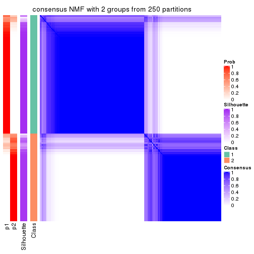</p>

</div>
<div id='tab-SD-NMF-consensus-heatmap-2'>
<pre><code class="r">consensus_heatmap(res, k = 3)
</code></pre>

<p>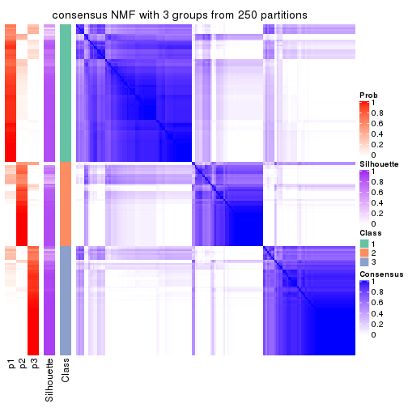</p>

</div>
<div id='tab-SD-NMF-consensus-heatmap-3'>
<pre><code class="r">consensus_heatmap(res, k = 4)
</code></pre>

<p>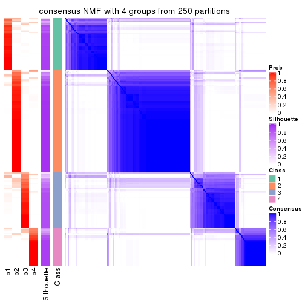</p>

</div>
<div id='tab-SD-NMF-consensus-heatmap-4'>
<pre><code class="r">consensus_heatmap(res, k = 5)
</code></pre>

<p>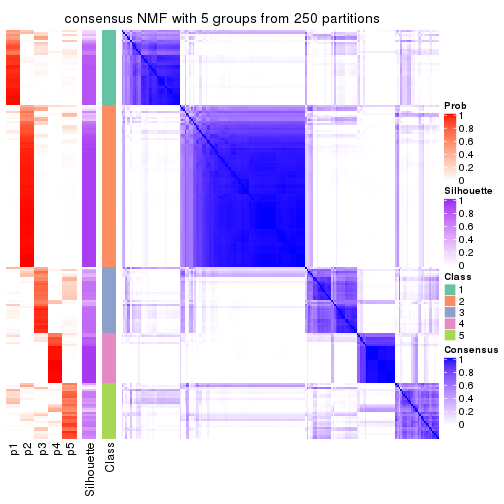</p>

</div>
<div id='tab-SD-NMF-consensus-heatmap-5'>
<pre><code class="r">consensus_heatmap(res, k = 6)
</code></pre>

<p>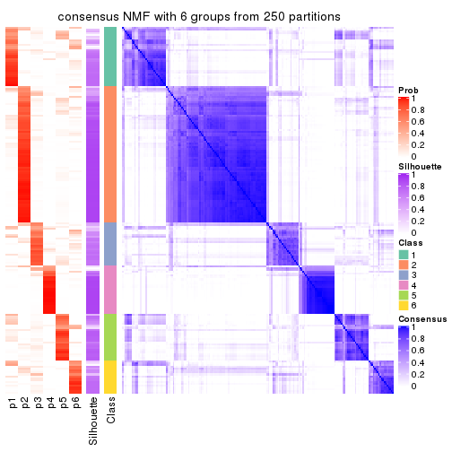</p>

</div>
</div>

Heatmaps for the membership of samples in all partitions to see how consistent they are:


<script>
$( function() {
	$( '#tabs-SD-NMF-membership-heatmap' ).tabs();
} );
</script>
<div id='tabs-SD-NMF-membership-heatmap'>
<ul>
<li><a href='#tab-SD-NMF-membership-heatmap-1'>k = 2</a></li>
<li><a href='#tab-SD-NMF-membership-heatmap-2'>k = 3</a></li>
<li><a href='#tab-SD-NMF-membership-heatmap-3'>k = 4</a></li>
<li><a href='#tab-SD-NMF-membership-heatmap-4'>k = 5</a></li>
<li><a href='#tab-SD-NMF-membership-heatmap-5'>k = 6</a></li>
</ul>
<div id='tab-SD-NMF-membership-heatmap-1'>
<pre><code class="r">membership_heatmap(res, k = 2)
</code></pre>

<p>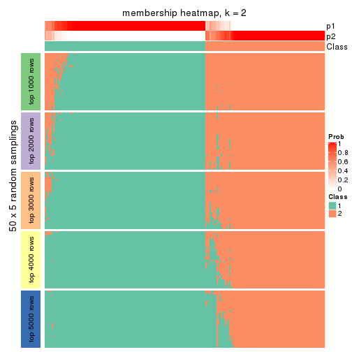</p>

</div>
<div id='tab-SD-NMF-membership-heatmap-2'>
<pre><code class="r">membership_heatmap(res, k = 3)
</code></pre>

<p>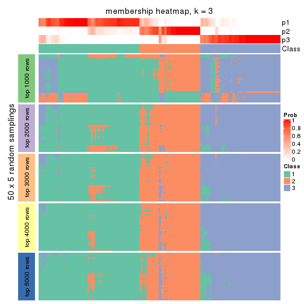</p>

</div>
<div id='tab-SD-NMF-membership-heatmap-3'>
<pre><code class="r">membership_heatmap(res, k = 4)
</code></pre>

<p>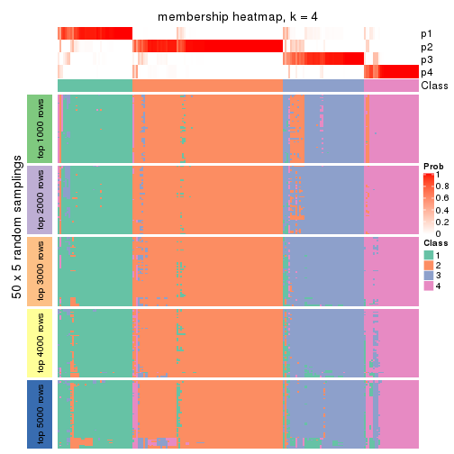</p>

</div>
<div id='tab-SD-NMF-membership-heatmap-4'>
<pre><code class="r">membership_heatmap(res, k = 5)
</code></pre>

<p>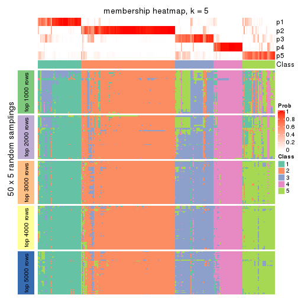</p>

</div>
<div id='tab-SD-NMF-membership-heatmap-5'>
<pre><code class="r">membership_heatmap(res, k = 6)
</code></pre>

<p>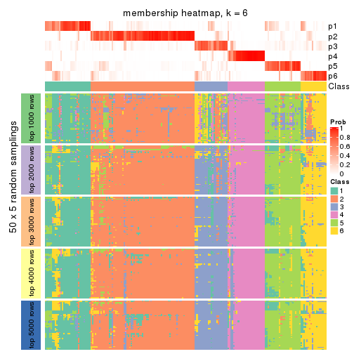</p>

</div>
</div>

As soon as we have had the classes for columns, we can look for signatures
which are significantly different between classes which can be candidate marks
for certain classes. Following are the heatmaps for signatures.


Signature heatmaps where rows are scaled:


<script>
$( function() {
	$( '#tabs-SD-NMF-get-signatures' ).tabs();
} );
</script>
<div id='tabs-SD-NMF-get-signatures'>
<ul>
<li><a href='#tab-SD-NMF-get-signatures-1'>k = 2</a></li>
<li><a href='#tab-SD-NMF-get-signatures-2'>k = 3</a></li>
<li><a href='#tab-SD-NMF-get-signatures-3'>k = 4</a></li>
<li><a href='#tab-SD-NMF-get-signatures-4'>k = 5</a></li>
<li><a href='#tab-SD-NMF-get-signatures-5'>k = 6</a></li>
</ul>
<div id='tab-SD-NMF-get-signatures-1'>
<pre><code class="r">get_signatures(res, k = 2)
</code></pre>

<p>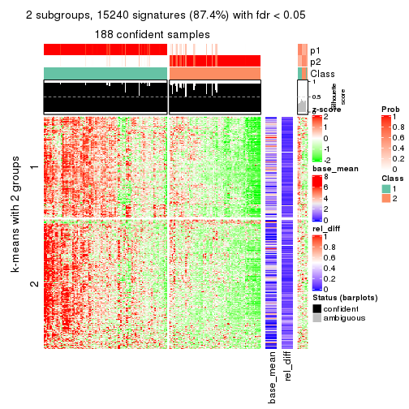</p>

</div>
<div id='tab-SD-NMF-get-signatures-2'>
<pre><code class="r">get_signatures(res, k = 3)
</code></pre>

<p>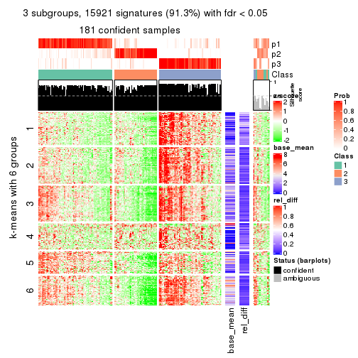</p>

</div>
<div id='tab-SD-NMF-get-signatures-3'>
<pre><code class="r">get_signatures(res, k = 4)
</code></pre>

<p>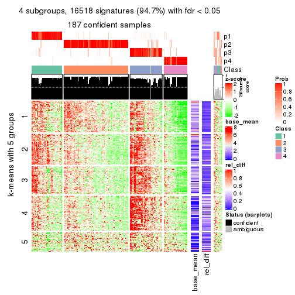</p>

</div>
<div id='tab-SD-NMF-get-signatures-4'>
<pre><code class="r">get_signatures(res, k = 5)
</code></pre>

<p>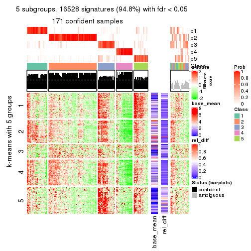</p>

</div>
<div id='tab-SD-NMF-get-signatures-5'>
<pre><code class="r">get_signatures(res, k = 6)
</code></pre>

<p>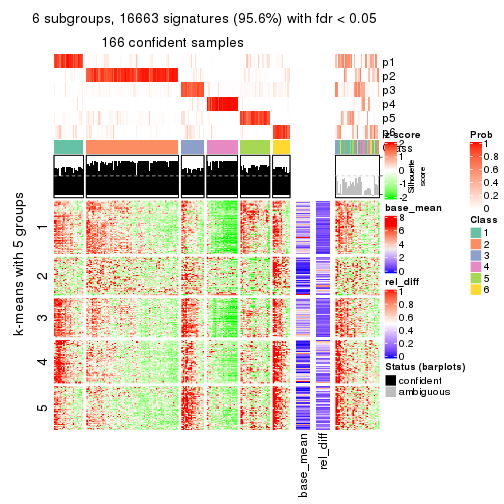</p>

</div>
</div>


Signature heatmaps where rows are not scaled:


<script>
$( function() {
	$( '#tabs-SD-NMF-get-signatures-no-scale' ).tabs();
} );
</script>
<div id='tabs-SD-NMF-get-signatures-no-scale'>
<ul>
<li><a href='#tab-SD-NMF-get-signatures-no-scale-1'>k = 2</a></li>
<li><a href='#tab-SD-NMF-get-signatures-no-scale-2'>k = 3</a></li>
<li><a href='#tab-SD-NMF-get-signatures-no-scale-3'>k = 4</a></li>
<li><a href='#tab-SD-NMF-get-signatures-no-scale-4'>k = 5</a></li>
<li><a href='#tab-SD-NMF-get-signatures-no-scale-5'>k = 6</a></li>
</ul>
<div id='tab-SD-NMF-get-signatures-no-scale-1'>
<pre><code class="r">get_signatures(res, k = 2, scale_rows = FALSE)
</code></pre>

<p>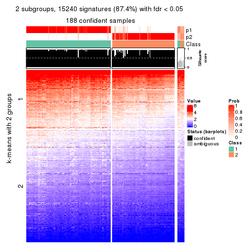</p>

</div>
<div id='tab-SD-NMF-get-signatures-no-scale-2'>
<pre><code class="r">get_signatures(res, k = 3, scale_rows = FALSE)
</code></pre>

<p>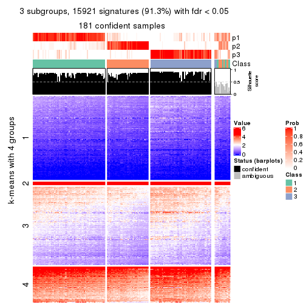</p>

</div>
<div id='tab-SD-NMF-get-signatures-no-scale-3'>
<pre><code class="r">get_signatures(res, k = 4, scale_rows = FALSE)
</code></pre>

<p>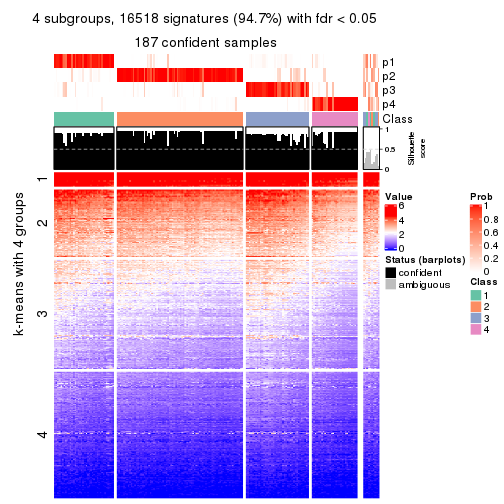</p>

</div>
<div id='tab-SD-NMF-get-signatures-no-scale-4'>
<pre><code class="r">get_signatures(res, k = 5, scale_rows = FALSE)
</code></pre>

<p>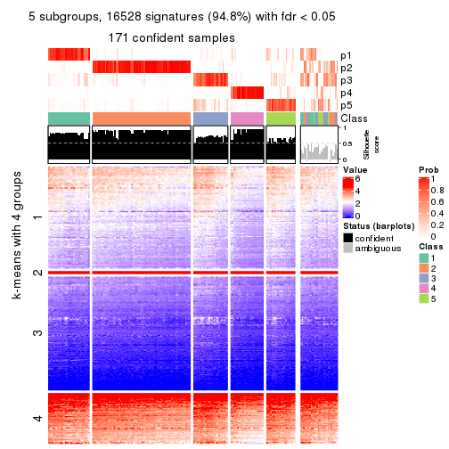</p>

</div>
<div id='tab-SD-NMF-get-signatures-no-scale-5'>
<pre><code class="r">get_signatures(res, k = 6, scale_rows = FALSE)
</code></pre>

<p>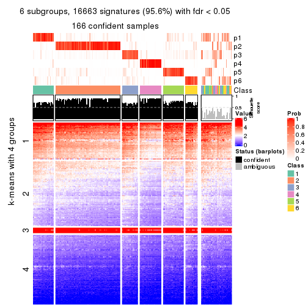</p>

</div>
</div>


Compare the overlap of signatures from different k:

```r
compare_signatures(res)
```

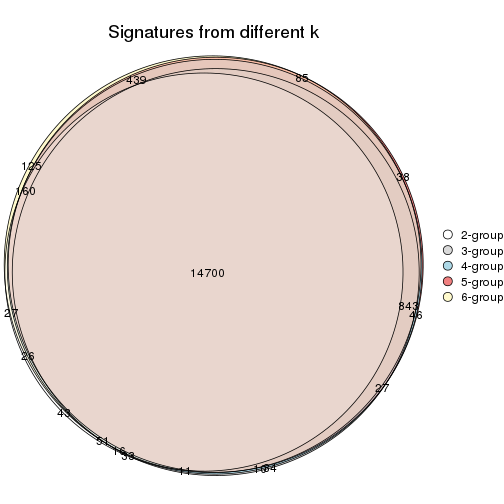

`get_signature()` returns a data frame invisibly. TO get the list of signatures, the function
call should be assigned to a variable explicitly. In following code, if `plot` argument is set
to `FALSE`, no heatmap is plotted while only the differential analysis is performed.

```r
# code only for demonstration
tb = get_signature(res, k = ..., plot = FALSE)
```

An example of the output of `tb` is:

```
#>   which_row         fdr    mean_1    mean_2 scaled_mean_1 scaled_mean_2 km
#> 1        38 0.042760348  8.373488  9.131774    -0.5533452     0.5164555  1
#> 2        40 0.018707592  7.106213  8.469186    -0.6173731     0.5762149  1
#> 3        55 0.019134737 10.221463 11.207825    -0.6159697     0.5749050  1
#> 4        59 0.006059896  5.921854  7.869574    -0.6899429     0.6439467  1
#> 5        60 0.018055526  8.928898 10.211722    -0.6204761     0.5791110  1
#> 6        98 0.009384629 15.714769 14.887706     0.6635654    -0.6193277  2
...
```

The columns in `tb` are:

1. `which_row`: row indices corresponding to the input matrix.
2. `fdr`: FDR for the differential test. 
3. `mean_x`: The mean value in group x.
4. `scaled_mean_x`: The mean value in group x after rows are scaled.
5. `km`: Row groups if k-means clustering is applied to rows.


UMAP plot which shows how samples are separated.


<script>
$( function() {
	$( '#tabs-SD-NMF-dimension-reduction' ).tabs();
} );
</script>
<div id='tabs-SD-NMF-dimension-reduction'>
<ul>
<li><a href='#tab-SD-NMF-dimension-reduction-1'>k = 2</a></li>
<li><a href='#tab-SD-NMF-dimension-reduction-2'>k = 3</a></li>
<li><a href='#tab-SD-NMF-dimension-reduction-3'>k = 4</a></li>
<li><a href='#tab-SD-NMF-dimension-reduction-4'>k = 5</a></li>
<li><a href='#tab-SD-NMF-dimension-reduction-5'>k = 6</a></li>
</ul>
<div id='tab-SD-NMF-dimension-reduction-1'>
<pre><code class="r">dimension_reduction(res, k = 2, method = &quot;UMAP&quot;)
</code></pre>

<p>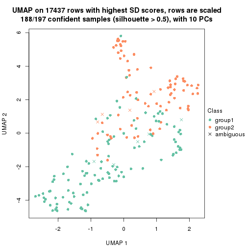</p>

</div>
<div id='tab-SD-NMF-dimension-reduction-2'>
<pre><code class="r">dimension_reduction(res, k = 3, method = &quot;UMAP&quot;)
</code></pre>

<p>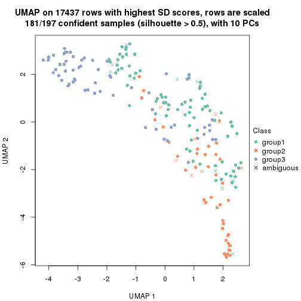</p>

</div>
<div id='tab-SD-NMF-dimension-reduction-3'>
<pre><code class="r">dimension_reduction(res, k = 4, method = &quot;UMAP&quot;)
</code></pre>

<p>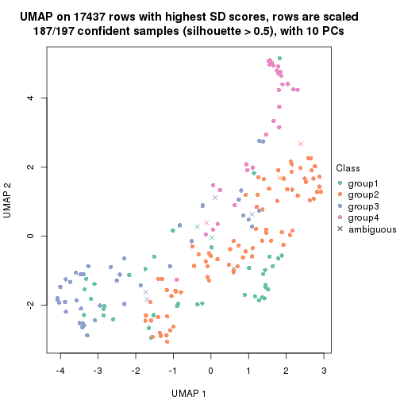</p>

</div>
<div id='tab-SD-NMF-dimension-reduction-4'>
<pre><code class="r">dimension_reduction(res, k = 5, method = &quot;UMAP&quot;)
</code></pre>

<p>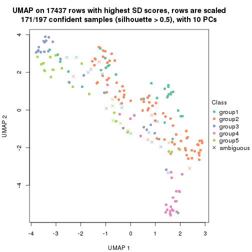</p>

</div>
<div id='tab-SD-NMF-dimension-reduction-5'>
<pre><code class="r">dimension_reduction(res, k = 6, method = &quot;UMAP&quot;)
</code></pre>

<p>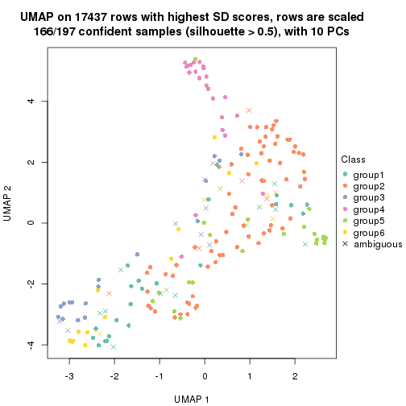</p>

</div>
</div>


Following heatmap shows how subgroups are split when increasing `k`:

```r
collect_classes(res)
```

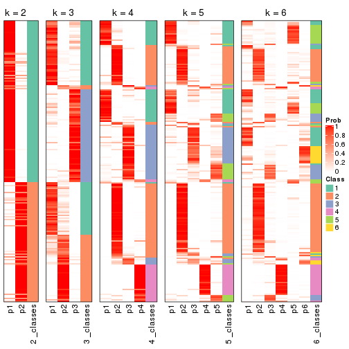


If matrix rows can be associated to genes, consider to use `GO_Enrichment(res,
...)` to perform function enrichment for the signature genes.


 

---------------------------------------------------


### CV:hclust


The object with results only for a single top-value method and a single partition method 
can be extracted as:

```r
res = res_list["CV", "hclust"]
# you can also extract it by
# res = res_list["CV:hclust"]
```

A summary of `res` and all the functions that can be applied to it:

```r
res
```

```
#> A 'ConsensusPartition' object with k = 2, 3, 4, 5, 6.
#>   On a matrix with 17437 rows and 197 columns.
#>   Top rows (1000, 2000, 3000, 4000, 5000) are extracted by 'CV' method.
#>   Subgroups are detected by 'hclust' method.
#>   Performed in total 1250 partitions by row resampling.
#>   Best k for subgroups seems to be 3.
#> 
#> Following methods can be applied to this 'ConsensusPartition' object:
#>  [1] "cola_report"             "collect_classes"         "collect_plots"          
#>  [4] "collect_stats"           "colnames"                "compare_signatures"     
#>  [7] "consensus_heatmap"       "dimension_reduction"     "functional_enrichment"  
#> [10] "get_anno_col"            "get_anno"                "get_classes"            
#> [13] "get_consensus"           "get_matrix"              "get_membership"         
#> [16] "get_param"               "get_signatures"          "get_stats"              
#> [19] "is_best_k"               "is_stable_k"             "membership_heatmap"     
#> [22] "ncol"                    "nrow"                    "plot_ecdf"              
#> [25] "rownames"                "select_partition_number" "show"                   
#> [28] "suggest_best_k"          "test_to_known_factors"
```

`collect_plots()` function collects all the plots made from `res` for all `k` (number of partitions)
into one single page to provide an easy and fast comparison between different `k`.

```r
collect_plots(res)
```

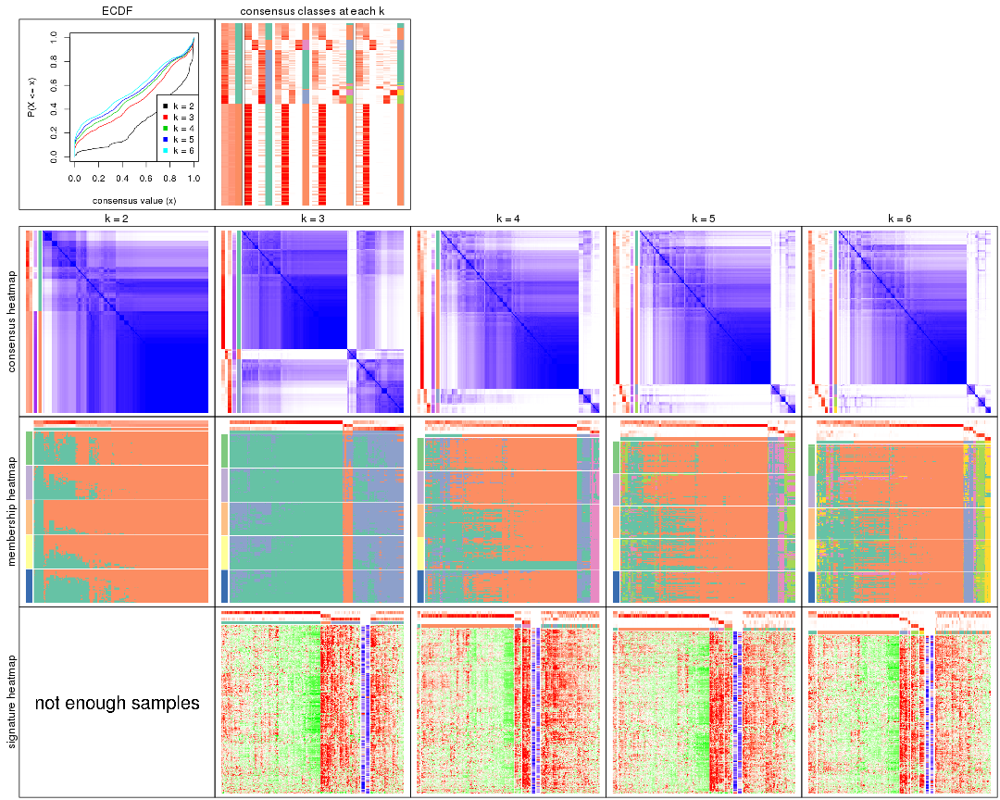

The plots are:

- The first row: a plot of the ECDF (Empirical cumulative distribution
  function) curves of the consensus matrix for each `k` and the heatmap of
  predicted classes for each `k`.
- The second row: heatmaps of the consensus matrix for each `k`.
- The third row: heatmaps of the membership matrix for each `k`.
- The fouth row: heatmaps of the signatures for each `k`.

All the plots in panels can be made by individual functions and they are
plotted later in this section.

`select_partition_number()` produces several plots showing different
statistics for choosing "optimized" `k`. There are following statistics:

- ECDF curves of the consensus matrix for each `k`;
- 1-PAC. [The PAC
  score](https://en.wikipedia.org/wiki/Consensus_clustering#Over-interpretation_potential_of_consensus_clustering)
  measures the proportion of the ambiguous subgrouping.
- Mean silhouette score.
- Concordance. The mean probability of fiting the consensus class ids in all
  partitions.
- Area increased. Denote $A_k$ as the area under the ECDF curve for current
  `k`, the area increased is defined as $A_k - A_{k-1}$.
- Rand index. The percent of pairs of samples that are both in a same cluster
  or both are not in a same cluster in the partition of k and k-1.
- Jaccard index. The ratio of pairs of samples are both in a same cluster in
  the partition of k and k-1 and the pairs of samples are both in a same
  cluster in the partition k or k-1.

The detailed explanations of these statistics can be found in [the cola
vignette](http://bioconductor.org/packages/devel/bioc/vignettes/cola/inst/doc/cola.html#toc_13).

Generally speaking, lower PAC score, higher mean silhouette score or higher
concordance corresponds to better partition. Rand index and Jaccard index
measure how similar the current partition is compared to partition with `k-1`.
If they are too similar, we won't accept `k` is better than `k-1`.

```r
select_partition_number(res)
```

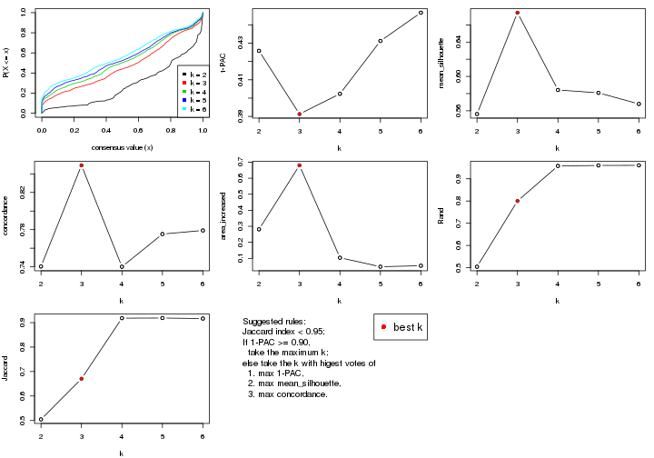

The numeric values for all these statistics can be obtained by `get_stats()`.

```r
get_stats(res)
```

```
#>   k 1-PAC mean_silhouette concordance area_increased  Rand Jaccard
#> 2 2 0.426           0.556       0.740         0.2810 0.504   0.504
#> 3 3 0.391           0.674       0.849         0.6802 0.800   0.671
#> 4 4 0.402           0.584       0.740         0.1039 0.958   0.918
#> 5 5 0.431           0.581       0.775         0.0477 0.960   0.919
#> 6 6 0.447           0.568       0.779         0.0540 0.960   0.917
```

`suggest_best_k()` suggests the best $k$ based on these statistics. The rules are as follows:

- All $k$ with Jaccard index larger than 0.95 are removed because the increase of
  the partition number does not provides enough extra information. If all $k$ are removed,
  the best $k$ is assigned by `NA`.
- For $k$ with 1-PAC larger than 0.9, the maximal $k$ is taken as the "best k". Other $k$ is called "optional k".
- If it does not fit the second rule. The $k$ with the highest vote of highest
  1-PAC, mean silhouette and concordance is taken as the "best k".

```r
suggest_best_k(res)
```

```
#> [1] 3
```


Following shows the table of the partitions (You need to click the **show/hide
code output** link to see it). The membership matrix (columns with name `p*`)
is inferred by
[`clue::cl_consensus()`](https://www.rdocumentation.org/link/cl_consensus?package=clue)
function with the `SE` method. Basically the value in the membership matrix
represents the probability to belong to a certain group. The finall class
label for an item is determined with the group with highest probability it
belongs to.

In `get_classes()` function, the entropy is calculated from the membership
matrix and the silhouette score is calculated from the consensus matrix.


<script>
$( function() {
	$( '#tabs-CV-hclust-get-classes' ).tabs();
} );
</script>
<div id='tabs-CV-hclust-get-classes'>
<ul>
<li><a href='#tab-CV-hclust-get-classes-1'>k = 2</a></li>
<li><a href='#tab-CV-hclust-get-classes-2'>k = 3</a></li>
<li><a href='#tab-CV-hclust-get-classes-3'>k = 4</a></li>
<li><a href='#tab-CV-hclust-get-classes-4'>k = 5</a></li>
<li><a href='#tab-CV-hclust-get-classes-5'>k = 6</a></li>
</ul>

<div id='tab-CV-hclust-get-classes-1'>
<p><a id='tab-CV-hclust-get-classes-1-a' style='color:#0366d6' href='#'>show/hide code output</a></p>
<pre><code class="r">cbind(get_classes(res, k = 2), get_membership(res, k = 2))
</code></pre>

<pre><code>#&gt;            class entropy silhouette    p1    p2
#&gt; SRR1380886     1  0.6148     0.3592 0.848 0.152
#&gt; SRR1074385     2  0.9970     0.9499 0.468 0.532
#&gt; SRR1374739     1  0.5842     0.4702 0.860 0.140
#&gt; SRR1097883     1  0.9248    -0.2683 0.660 0.340
#&gt; SRR2167209     2  0.9922     0.9786 0.448 0.552
#&gt; SRR816541      2  0.9922     0.9786 0.448 0.552
#&gt; SRR663645      2  0.9922     0.9786 0.448 0.552
#&gt; SRR1381505     2  0.9922     0.9786 0.448 0.552
#&gt; SRR1416362     2  0.9922     0.9786 0.448 0.552
#&gt; SRR1318503     2  0.9954     0.9614 0.460 0.540
#&gt; SRR1341626     2  0.9922     0.9786 0.448 0.552
#&gt; SRR1382440     1  0.0672     0.4909 0.992 0.008
#&gt; SRR1088413     1  0.9977    -0.7927 0.528 0.472
#&gt; SRR1082080     2  0.9922     0.9786 0.448 0.552
#&gt; SRR1455783     2  0.9996     0.9063 0.488 0.512
#&gt; SRR1447760     2  0.9922     0.9786 0.448 0.552
#&gt; SRR1487784     2  0.9922     0.9786 0.448 0.552
#&gt; SRR1331037     2  0.9922     0.9786 0.448 0.552
#&gt; SRR1095651     1  0.4939     0.4846 0.892 0.108
#&gt; SRR1078066     2  0.9933     0.9728 0.452 0.548
#&gt; SRR1120363     2  0.9996     0.9062 0.488 0.512
#&gt; SRR821231      1  0.4431     0.4617 0.908 0.092
#&gt; SRR1374373     2  0.9922     0.9786 0.448 0.552
#&gt; SRR1324519     2  0.9922     0.9786 0.448 0.552
#&gt; SRR1431121     1  0.9393    -0.3328 0.644 0.356
#&gt; SRR1091032     2  0.9996     0.9045 0.488 0.512
#&gt; SRR1365575     2  0.9922     0.9786 0.448 0.552
#&gt; SRR1072972     1  0.3879     0.4707 0.924 0.076
#&gt; SRR1310690     2  0.9922     0.9786 0.448 0.552
#&gt; SRR1383037     1  0.9881     0.3769 0.564 0.436
#&gt; SRR1095479     1  0.3431     0.4691 0.936 0.064
#&gt; SRR1070403     1  0.6247     0.4665 0.844 0.156
#&gt; SRR1390203     1  0.9427    -0.3483 0.640 0.360
#&gt; SRR1072007     2  0.9933     0.9732 0.452 0.548
#&gt; SRR1468787     2  0.9933     0.9728 0.452 0.548
#&gt; SRR1347959     2  0.9922     0.9786 0.448 0.552
#&gt; SRR1338513     1  0.8327     0.2241 0.736 0.264
#&gt; SRR812598      2  0.9922     0.9786 0.448 0.552
#&gt; SRR1446806     2  0.9993     0.9159 0.484 0.516
#&gt; SRR1394275     2  0.9988     0.9245 0.480 0.520
#&gt; SRR1443633     1  0.6048     0.3644 0.852 0.148
#&gt; SRR1087728     1  0.0672     0.4909 0.992 0.008
#&gt; SRR1098192     2  0.9922     0.9786 0.448 0.552
#&gt; SRR1093340     2  0.9922     0.9786 0.448 0.552
#&gt; SRR665405      1  0.8386     0.0523 0.732 0.268
#&gt; SRR657077      2  0.9933     0.9731 0.452 0.548
#&gt; SRR813208      1  0.9850     0.3796 0.572 0.428
#&gt; SRR1416074     2  0.9922     0.9786 0.448 0.552
#&gt; SRR1089688     2  0.9970     0.9442 0.468 0.532
#&gt; SRR1353461     1  0.9795     0.3830 0.584 0.416
#&gt; SRR1466321     2  1.0000     0.8836 0.496 0.504
#&gt; SRR1073021     2  0.9933     0.9728 0.452 0.548
#&gt; SRR1322816     2  0.9922     0.9786 0.448 0.552
#&gt; SRR1457727     1  0.9944    -0.7396 0.544 0.456
#&gt; SRR1464226     1  0.9044    -0.1672 0.680 0.320
#&gt; SRR1398863     1  0.6531     0.3714 0.832 0.168
#&gt; SRR1455631     2  0.9954     0.9628 0.460 0.540
#&gt; SRR1307808     2  0.9922     0.9786 0.448 0.552
#&gt; SRR1374585     2  0.9922     0.9786 0.448 0.552
#&gt; SRR1072104     2  0.9922     0.9786 0.448 0.552
#&gt; SRR1076868     2  0.9922     0.9786 0.448 0.552
#&gt; SRR1335984     2  0.9998     0.8813 0.492 0.508
#&gt; SRR1445939     1  0.9248    -0.2578 0.660 0.340
#&gt; SRR1453047     2  0.9996     0.9045 0.488 0.512
#&gt; SRR1339788     1  0.4815     0.4416 0.896 0.104
#&gt; SRR1084323     1  0.4161     0.4607 0.916 0.084
#&gt; SRR1092937     1  0.5178     0.4209 0.884 0.116
#&gt; SRR1074090     2  0.9922     0.9786 0.448 0.552
#&gt; SRR1099833     1  0.5178     0.4697 0.884 0.116
#&gt; SRR1093434     1  0.6247     0.4665 0.844 0.156
#&gt; SRR1435857     2  0.9996     0.9063 0.488 0.512
#&gt; SRR1480347     2  0.9922     0.9786 0.448 0.552
#&gt; SRR1440787     2  0.9922     0.9786 0.448 0.552
#&gt; SRR1430202     2  0.9963     0.9549 0.464 0.536
#&gt; SRR1322730     2  0.9922     0.9786 0.448 0.552
#&gt; SRR811029      1  0.9815    -0.5947 0.580 0.420
#&gt; SRR1390456     1  0.9881     0.3771 0.564 0.436
#&gt; SRR1381140     1  0.9248    -0.2578 0.660 0.340
#&gt; SRR1388064     2  0.9922     0.9786 0.448 0.552
#&gt; SRR1093577     2  0.9922     0.9786 0.448 0.552
#&gt; SRR1414161     2  0.9922     0.9786 0.448 0.552
#&gt; SRR1328738     2  0.9970     0.9518 0.468 0.532
#&gt; SRR1311752     2  0.9922     0.9786 0.448 0.552
#&gt; SRR1445960     2  0.9922     0.9786 0.448 0.552
#&gt; SRR1403412     1  0.9815    -0.5947 0.580 0.420
#&gt; SRR2166748     1  0.3431     0.4691 0.936 0.064
#&gt; SRR821666      2  0.9922     0.9786 0.448 0.552
#&gt; SRR1330746     1  0.6247     0.4665 0.844 0.156
#&gt; SRR1327872     2  0.9922     0.9786 0.448 0.552
#&gt; SRR1100800     2  0.9996     0.9063 0.488 0.512
#&gt; SRR1075174     1  0.9286    -0.2760 0.656 0.344
#&gt; SRR1434436     2  0.9970     0.9494 0.468 0.532
#&gt; SRR1389409     2  0.9922     0.9786 0.448 0.552
#&gt; SRR1085310     1  0.9552    -0.4178 0.624 0.376
#&gt; SRR1376718     2  0.9922     0.9786 0.448 0.552
#&gt; SRR808590      2  0.9922     0.9786 0.448 0.552
#&gt; SRR1084128     2  0.9922     0.9786 0.448 0.552
#&gt; SRR1361692     1  0.9209    -0.2396 0.664 0.336
#&gt; SRR1431493     1  0.4690     0.4306 0.900 0.100
#&gt; SRR1409084     1  0.9129    -0.2018 0.672 0.328
#&gt; SRR2166214     1  0.8386     0.0523 0.732 0.268
#&gt; SRR1324102     2  0.9922     0.9786 0.448 0.552
#&gt; SRR1079754     2  0.9922     0.9786 0.448 0.552
#&gt; SRR1442127     1  0.0672     0.4909 0.992 0.008
#&gt; SRR1076244     2  0.9988     0.9176 0.480 0.520
#&gt; SRR1330901     2  0.9922     0.9786 0.448 0.552
#&gt; SRR1073167     2  0.9922     0.9786 0.448 0.552
#&gt; SRR1357541     1  0.9393    -0.3398 0.644 0.356
#&gt; SRR811607      2  0.9922     0.9786 0.448 0.552
#&gt; SRR1468931     1  0.3431     0.4888 0.936 0.064
#&gt; SRR1474908     2  0.9993     0.9159 0.484 0.516
#&gt; SRR1309875     2  0.9996     0.9045 0.488 0.512
#&gt; SRR598792      1  0.9000     0.4138 0.684 0.316
#&gt; SRR1088537     2  0.9922     0.9786 0.448 0.552
#&gt; SRR1457682     1  0.9922    -0.7052 0.552 0.448
#&gt; SRR1454289     2  0.9922     0.9786 0.448 0.552
#&gt; SRR1069352     1  0.2948     0.4759 0.948 0.052
#&gt; SRR1472728     2  0.9922     0.9786 0.448 0.552
#&gt; SRR1091144     2  0.9922     0.9786 0.448 0.552
#&gt; SRR1319118     1  0.9358    -0.3204 0.648 0.352
#&gt; SRR1403611     1  0.6048     0.4834 0.852 0.148
#&gt; SRR1397762     1  0.8955    -0.1351 0.688 0.312
#&gt; SRR1317387     1  0.5294     0.4770 0.880 0.120
#&gt; SRR1376426     2  0.9922     0.9786 0.448 0.552
#&gt; SRR1097777     1  0.9970    -0.7801 0.532 0.468
#&gt; SRR1365743     1  0.9881     0.3769 0.564 0.436
#&gt; SRR1458992     2  0.9922     0.9786 0.448 0.552
#&gt; SRR1089537     2  0.9922     0.9786 0.448 0.552
#&gt; SRR1397744     1  0.9993    -0.8260 0.516 0.484
#&gt; SRR1453893     2  0.9922     0.9786 0.448 0.552
#&gt; SRR1098543     1  0.9944    -0.7305 0.544 0.456
#&gt; SRR1321765     2  0.9922     0.9786 0.448 0.552
#&gt; SRR1440032     1  0.9954    -0.7420 0.540 0.460
#&gt; SRR1404507     2  0.9922     0.9786 0.448 0.552
#&gt; SRR1404856     2  0.9922     0.9786 0.448 0.552
#&gt; SRR812745      1  0.8813    -0.0823 0.700 0.300
#&gt; SRR1417524     1  0.3733     0.4885 0.928 0.072
#&gt; SRR1407334     2  0.9922     0.9786 0.448 0.552
#&gt; SRR1453991     1  1.0000    -0.8644 0.504 0.496
#&gt; SRR1415938     1  0.9427    -0.3483 0.640 0.360
#&gt; SRR1081259     2  0.9922     0.9786 0.448 0.552
#&gt; SRR1436187     2  0.9922     0.9786 0.448 0.552
#&gt; SRR1431948     1  0.9922     0.3724 0.552 0.448
#&gt; SRR1453277     2  0.9933     0.9728 0.452 0.548
#&gt; SRR1095407     2  0.9922     0.9786 0.448 0.552
#&gt; SRR1359694     2  0.9922     0.9786 0.448 0.552
#&gt; SRR656982      1  0.9732    -0.5140 0.596 0.404
#&gt; SRR1354338     2  0.9922     0.9786 0.448 0.552
#&gt; SRR1088291     2  0.9954     0.9625 0.460 0.540
#&gt; SRR1080624     2  0.9922     0.9786 0.448 0.552
#&gt; SRR2166708     1  0.6247     0.4665 0.844 0.156
#&gt; SRR1393572     2  0.9944     0.9681 0.456 0.544
#&gt; SRR1429912     2  0.9996     0.9045 0.488 0.512
#&gt; SRR1421048     2  0.9922     0.9786 0.448 0.552
#&gt; SRR1434999     1  0.1184     0.4915 0.984 0.016
#&gt; SRR656457      1  0.2043     0.4842 0.968 0.032
#&gt; SRR1098928     1  0.9286     0.4039 0.656 0.344
#&gt; SRR1343967     2  0.9922     0.9786 0.448 0.552
#&gt; SRR1360766     1  0.9393    -0.3388 0.644 0.356
#&gt; SRR1464724     1  0.9998    -0.8396 0.508 0.492
#&gt; SRR1101542     2  0.9922     0.9786 0.448 0.552
#&gt; SRR1401528     1  0.3431     0.4907 0.936 0.064
#&gt; SRR1071519     1  0.9922     0.3724 0.552 0.448
#&gt; SRR1086070     1  0.6623     0.3388 0.828 0.172
#&gt; SRR1358645     2  0.9996     0.9045 0.488 0.512
#&gt; SRR819771      1  0.0672     0.4909 0.992 0.008
#&gt; SRR1418433     1  0.7745     0.1856 0.772 0.228
#&gt; SRR821050      1  0.9998    -0.8553 0.508 0.492
#&gt; SRR1402091     1  0.9358    -0.2863 0.648 0.352
#&gt; SRR1322028     2  0.9922     0.9786 0.448 0.552
#&gt; SRR1452556     2  0.9988     0.9172 0.480 0.520
#&gt; SRR1340047     2  0.9977     0.9446 0.472 0.528
#&gt; SRR1418302     1  1.0000    -0.8644 0.504 0.496
#&gt; SRR1073991     2  1.0000     0.8888 0.496 0.504
#&gt; SRR1085187     2  0.9922     0.9786 0.448 0.552
#&gt; SRR1357618     1  0.2043     0.4842 0.968 0.032
#&gt; SRR1487764     1  0.0672     0.4909 0.992 0.008
#&gt; SRR1075336     1  0.9775    -0.5652 0.588 0.412
#&gt; SRR1365471     2  0.9922     0.9786 0.448 0.552
#&gt; SRR1414613     2  0.9922     0.9786 0.448 0.552
#&gt; SRR658719      1  0.3431     0.4919 0.936 0.064
#&gt; SRR1475128     1  0.6148     0.4675 0.848 0.152
#&gt; SRR1367630     2  0.9922     0.9786 0.448 0.552
#&gt; SRR1481146     2  0.9922     0.9786 0.448 0.552
#&gt; SRR1465674     2  0.9922     0.9786 0.448 0.552
#&gt; SRR1327303     1  0.9358    -0.2863 0.648 0.352
#&gt; SRR1390391     2  0.9993     0.9159 0.484 0.516
#&gt; SRR1326020     1  0.9881    -0.6494 0.564 0.436
#&gt; SRR1381953     1  0.8327     0.0684 0.736 0.264
#&gt; SRR1082544     2  0.9922     0.9786 0.448 0.552
#&gt; SRR810761      1  0.8499     0.0212 0.724 0.276
#&gt; SRR1070764     1  0.9881     0.3769 0.564 0.436
#&gt; SRR1415919     1  0.9922     0.3724 0.552 0.448
#&gt; SRR1490404     2  0.9922     0.9786 0.448 0.552
#&gt; SRR1416773     2  0.9922     0.9786 0.448 0.552
#&gt; SRR1377492     1  0.9996    -0.8249 0.512 0.488
#&gt; SRR1334314     2  0.9993     0.9170 0.484 0.516
</code></pre>

<script>
$('#tab-CV-hclust-get-classes-1-a').parent().next().next().hide();
$('#tab-CV-hclust-get-classes-1-a').click(function(){
  $('#tab-CV-hclust-get-classes-1-a').parent().next().next().toggle();
  return(false);
});
</script>
</div>

<div id='tab-CV-hclust-get-classes-2'>
<p><a id='tab-CV-hclust-get-classes-2-a' style='color:#0366d6' href='#'>show/hide code output</a></p>
<pre><code class="r">cbind(get_classes(res, k = 3), get_membership(res, k = 3))
</code></pre>

<pre><code>#&gt;            class entropy silhouette    p1    p2    p3
#&gt; SRR1380886     3  0.4235     0.6457 0.176 0.000 0.824
#&gt; SRR1074385     1  0.5058     0.6792 0.756 0.000 0.244
#&gt; SRR1374739     3  0.3686     0.4162 0.000 0.140 0.860
#&gt; SRR1097883     3  0.6204     0.3638 0.424 0.000 0.576
#&gt; SRR2167209     1  0.0000     0.8482 1.000 0.000 0.000
#&gt; SRR816541      1  0.2261     0.8304 0.932 0.000 0.068
#&gt; SRR663645      1  0.1163     0.8469 0.972 0.000 0.028
#&gt; SRR1381505     1  0.0000     0.8482 1.000 0.000 0.000
#&gt; SRR1416362     1  0.0424     0.8491 0.992 0.000 0.008
#&gt; SRR1318503     1  0.4399     0.7442 0.812 0.000 0.188
#&gt; SRR1341626     1  0.0000     0.8482 1.000 0.000 0.000
#&gt; SRR1382440     3  0.0000     0.5544 0.000 0.000 1.000
#&gt; SRR1088413     1  0.6026     0.3953 0.624 0.000 0.376
#&gt; SRR1082080     1  0.0000     0.8482 1.000 0.000 0.000
#&gt; SRR1455783     1  0.5650     0.5548 0.688 0.000 0.312
#&gt; SRR1447760     1  0.0237     0.8486 0.996 0.000 0.004
#&gt; SRR1487784     1  0.0000     0.8482 1.000 0.000 0.000
#&gt; SRR1331037     1  0.0000     0.8482 1.000 0.000 0.000
#&gt; SRR1095651     3  0.4660     0.5820 0.072 0.072 0.856
#&gt; SRR1078066     1  0.1860     0.8311 0.948 0.000 0.052
#&gt; SRR1120363     1  0.3686     0.7858 0.860 0.000 0.140
#&gt; SRR821231      3  0.3445     0.6365 0.088 0.016 0.896
#&gt; SRR1374373     1  0.2261     0.8304 0.932 0.000 0.068
#&gt; SRR1324519     1  0.0000     0.8482 1.000 0.000 0.000
#&gt; SRR1431121     3  0.6244     0.3023 0.440 0.000 0.560
#&gt; SRR1091032     1  0.4654     0.7210 0.792 0.000 0.208
#&gt; SRR1365575     1  0.0000     0.8482 1.000 0.000 0.000
#&gt; SRR1072972     3  0.3183     0.6281 0.076 0.016 0.908
#&gt; SRR1310690     1  0.0000     0.8482 1.000 0.000 0.000
#&gt; SRR1383037     2  0.4605     0.8749 0.000 0.796 0.204
#&gt; SRR1095479     3  0.2584     0.6239 0.064 0.008 0.928
#&gt; SRR1070403     3  0.4002     0.3837 0.000 0.160 0.840
#&gt; SRR1390203     3  0.6260     0.2788 0.448 0.000 0.552
#&gt; SRR1072007     1  0.1753     0.8404 0.952 0.000 0.048
#&gt; SRR1468787     1  0.1860     0.8334 0.948 0.000 0.052
#&gt; SRR1347959     1  0.0000     0.8482 1.000 0.000 0.000
#&gt; SRR1338513     3  0.6688     0.5696 0.308 0.028 0.664
#&gt; SRR812598      1  0.0424     0.8495 0.992 0.000 0.008
#&gt; SRR1446806     1  0.5254     0.6480 0.736 0.000 0.264
#&gt; SRR1394275     1  0.5291     0.6384 0.732 0.000 0.268
#&gt; SRR1443633     3  0.4291     0.6182 0.180 0.000 0.820
#&gt; SRR1087728     3  0.0475     0.5578 0.004 0.004 0.992
#&gt; SRR1098192     1  0.1411     0.8437 0.964 0.000 0.036
#&gt; SRR1093340     1  0.0000     0.8482 1.000 0.000 0.000
#&gt; SRR665405      3  0.5785     0.5541 0.332 0.000 0.668
#&gt; SRR657077      1  0.1964     0.8364 0.944 0.000 0.056
#&gt; SRR813208      2  0.5058     0.8640 0.000 0.756 0.244
#&gt; SRR1416074     1  0.0000     0.8482 1.000 0.000 0.000
#&gt; SRR1089688     1  0.2066     0.8324 0.940 0.000 0.060
#&gt; SRR1353461     2  0.5178     0.8503 0.000 0.744 0.256
#&gt; SRR1466321     1  0.5216     0.6555 0.740 0.000 0.260
#&gt; SRR1073021     1  0.1860     0.8334 0.948 0.000 0.052
#&gt; SRR1322816     1  0.3340     0.7983 0.880 0.000 0.120
#&gt; SRR1457727     1  0.6095     0.3437 0.608 0.000 0.392
#&gt; SRR1464226     3  0.6126     0.4240 0.400 0.000 0.600
#&gt; SRR1398863     3  0.5062     0.6151 0.184 0.016 0.800
#&gt; SRR1455631     1  0.0892     0.8466 0.980 0.000 0.020
#&gt; SRR1307808     1  0.0237     0.8486 0.996 0.000 0.004
#&gt; SRR1374585     1  0.0000     0.8482 1.000 0.000 0.000
#&gt; SRR1072104     1  0.1031     0.8478 0.976 0.000 0.024
#&gt; SRR1076868     1  0.0000     0.8482 1.000 0.000 0.000
#&gt; SRR1335984     1  0.5678     0.5508 0.684 0.000 0.316
#&gt; SRR1445939     3  0.6126     0.4227 0.400 0.000 0.600
#&gt; SRR1453047     1  0.4178     0.7566 0.828 0.000 0.172
#&gt; SRR1339788     3  0.3682     0.6376 0.116 0.008 0.876
#&gt; SRR1084323     3  0.3207     0.6323 0.084 0.012 0.904
#&gt; SRR1092937     3  0.3644     0.6492 0.124 0.004 0.872
#&gt; SRR1074090     1  0.0000     0.8482 1.000 0.000 0.000
#&gt; SRR1099833     3  0.4256     0.6338 0.096 0.036 0.868
#&gt; SRR1093434     3  0.4002     0.3837 0.000 0.160 0.840
#&gt; SRR1435857     1  0.5733     0.5290 0.676 0.000 0.324
#&gt; SRR1480347     1  0.0000     0.8482 1.000 0.000 0.000
#&gt; SRR1440787     1  0.0000     0.8482 1.000 0.000 0.000
#&gt; SRR1430202     1  0.4842     0.7004 0.776 0.000 0.224
#&gt; SRR1322730     1  0.1031     0.8473 0.976 0.000 0.024
#&gt; SRR811029      1  0.6192     0.2426 0.580 0.000 0.420
#&gt; SRR1390456     2  0.4974     0.8659 0.000 0.764 0.236
#&gt; SRR1381140     3  0.6126     0.4227 0.400 0.000 0.600
#&gt; SRR1388064     1  0.0000     0.8482 1.000 0.000 0.000
#&gt; SRR1093577     1  0.0424     0.8492 0.992 0.000 0.008
#&gt; SRR1414161     1  0.4555     0.7261 0.800 0.000 0.200
#&gt; SRR1328738     1  0.4504     0.7372 0.804 0.000 0.196
#&gt; SRR1311752     1  0.0237     0.8486 0.996 0.000 0.004
#&gt; SRR1445960     1  0.4654     0.7230 0.792 0.000 0.208
#&gt; SRR1403412     1  0.6192     0.2426 0.580 0.000 0.420
#&gt; SRR2166748     3  0.2584     0.6239 0.064 0.008 0.928
#&gt; SRR821666      1  0.0000     0.8482 1.000 0.000 0.000
#&gt; SRR1330746     3  0.4002     0.3837 0.000 0.160 0.840
#&gt; SRR1327872     1  0.0747     0.8485 0.984 0.000 0.016
#&gt; SRR1100800     1  0.5733     0.5290 0.676 0.000 0.324
#&gt; SRR1075174     3  0.6154     0.4031 0.408 0.000 0.592
#&gt; SRR1434436     1  0.5138     0.6648 0.748 0.000 0.252
#&gt; SRR1389409     1  0.0000     0.8482 1.000 0.000 0.000
#&gt; SRR1085310     3  0.6309     0.1034 0.496 0.000 0.504
#&gt; SRR1376718     1  0.0000     0.8482 1.000 0.000 0.000
#&gt; SRR808590      1  0.0000     0.8482 1.000 0.000 0.000
#&gt; SRR1084128     1  0.0000     0.8482 1.000 0.000 0.000
#&gt; SRR1361692     1  0.6295    -0.0265 0.528 0.000 0.472
#&gt; SRR1431493     3  0.3192     0.6452 0.112 0.000 0.888
#&gt; SRR1409084     3  0.6140     0.4155 0.404 0.000 0.596
#&gt; SRR2166214     3  0.5785     0.5541 0.332 0.000 0.668
#&gt; SRR1324102     1  0.1289     0.8449 0.968 0.000 0.032
#&gt; SRR1079754     1  0.0000     0.8482 1.000 0.000 0.000
#&gt; SRR1442127     3  0.0475     0.5578 0.004 0.004 0.992
#&gt; SRR1076244     1  0.2796     0.8054 0.908 0.000 0.092
#&gt; SRR1330901     1  0.0237     0.8486 0.996 0.000 0.004
#&gt; SRR1073167     1  0.0424     0.8492 0.992 0.000 0.008
#&gt; SRR1357541     3  0.6286     0.2377 0.464 0.000 0.536
#&gt; SRR811607      1  0.3816     0.7776 0.852 0.000 0.148
#&gt; SRR1468931     3  0.2902     0.5317 0.016 0.064 0.920
#&gt; SRR1474908     1  0.5216     0.6528 0.740 0.000 0.260
#&gt; SRR1309875     1  0.4974     0.6863 0.764 0.000 0.236
#&gt; SRR598792      2  0.6483     0.7024 0.008 0.600 0.392
#&gt; SRR1088537     1  0.0747     0.8484 0.984 0.000 0.016
#&gt; SRR1457682     1  0.6079     0.3635 0.612 0.000 0.388
#&gt; SRR1454289     1  0.0747     0.8486 0.984 0.000 0.016
#&gt; SRR1069352     3  0.1753     0.6069 0.048 0.000 0.952
#&gt; SRR1472728     1  0.0747     0.8486 0.984 0.000 0.016
#&gt; SRR1091144     1  0.0237     0.8490 0.996 0.000 0.004
#&gt; SRR1319118     3  0.6180     0.3755 0.416 0.000 0.584
#&gt; SRR1403611     3  0.6062     0.4800 0.072 0.148 0.780
#&gt; SRR1397762     3  0.6079     0.4491 0.388 0.000 0.612
#&gt; SRR1317387     3  0.4982     0.6035 0.096 0.064 0.840
#&gt; SRR1376426     1  0.0000     0.8482 1.000 0.000 0.000
#&gt; SRR1097777     1  0.6062     0.3690 0.616 0.000 0.384
#&gt; SRR1365743     2  0.3619     0.8697 0.000 0.864 0.136
#&gt; SRR1458992     1  0.4654     0.7229 0.792 0.000 0.208
#&gt; SRR1089537     1  0.0592     0.8489 0.988 0.000 0.012
#&gt; SRR1397744     1  0.5882     0.4659 0.652 0.000 0.348
#&gt; SRR1453893     1  0.0237     0.8483 0.996 0.000 0.004
#&gt; SRR1098543     1  0.5968     0.4341 0.636 0.000 0.364
#&gt; SRR1321765     1  0.0747     0.8425 0.984 0.000 0.016
#&gt; SRR1440032     1  0.5882     0.4647 0.652 0.000 0.348
#&gt; SRR1404507     1  0.0592     0.8492 0.988 0.000 0.012
#&gt; SRR1404856     1  0.0237     0.8488 0.996 0.000 0.004
#&gt; SRR812745      3  0.6026     0.4741 0.376 0.000 0.624
#&gt; SRR1417524     3  0.2998     0.5408 0.016 0.068 0.916
#&gt; SRR1407334     1  0.0000     0.8482 1.000 0.000 0.000
#&gt; SRR1453991     1  0.5678     0.5395 0.684 0.000 0.316
#&gt; SRR1415938     3  0.6260     0.2788 0.448 0.000 0.552
#&gt; SRR1081259     1  0.1411     0.8437 0.964 0.000 0.036
#&gt; SRR1436187     1  0.0000     0.8482 1.000 0.000 0.000
#&gt; SRR1431948     2  0.0000     0.8009 0.000 1.000 0.000
#&gt; SRR1453277     1  0.5016     0.6808 0.760 0.000 0.240
#&gt; SRR1095407     1  0.0000     0.8482 1.000 0.000 0.000
#&gt; SRR1359694     1  0.0592     0.8488 0.988 0.000 0.012
#&gt; SRR656982      1  0.5497     0.4884 0.708 0.000 0.292
#&gt; SRR1354338     1  0.0000     0.8482 1.000 0.000 0.000
#&gt; SRR1088291     1  0.4796     0.7082 0.780 0.000 0.220
#&gt; SRR1080624     1  0.0892     0.8482 0.980 0.000 0.020
#&gt; SRR2166708     3  0.4002     0.3837 0.000 0.160 0.840
#&gt; SRR1393572     1  0.4121     0.7634 0.832 0.000 0.168
#&gt; SRR1429912     1  0.5016     0.6829 0.760 0.000 0.240
#&gt; SRR1421048     1  0.0237     0.8489 0.996 0.000 0.004
#&gt; SRR1434999     3  0.0829     0.5549 0.004 0.012 0.984
#&gt; SRR656457      3  0.1163     0.5856 0.028 0.000 0.972
#&gt; SRR1098928     2  0.6280     0.5448 0.000 0.540 0.460
#&gt; SRR1343967     1  0.0237     0.8486 0.996 0.000 0.004
#&gt; SRR1360766     3  0.6192     0.3641 0.420 0.000 0.580
#&gt; SRR1464724     1  0.3412     0.7703 0.876 0.000 0.124
#&gt; SRR1101542     1  0.0000     0.8482 1.000 0.000 0.000
#&gt; SRR1401528     3  0.3042     0.5896 0.040 0.040 0.920
#&gt; SRR1071519     2  0.4291     0.8752 0.000 0.820 0.180
#&gt; SRR1086070     3  0.4575     0.6517 0.184 0.004 0.812
#&gt; SRR1358645     1  0.5016     0.6807 0.760 0.000 0.240
#&gt; SRR819771      3  0.0000     0.5544 0.000 0.000 1.000
#&gt; SRR1418433     3  0.5327     0.6318 0.272 0.000 0.728
#&gt; SRR821050      1  0.5859     0.4808 0.656 0.000 0.344
#&gt; SRR1402091     3  0.6215     0.3454 0.428 0.000 0.572
#&gt; SRR1322028     1  0.0237     0.8486 0.996 0.000 0.004
#&gt; SRR1452556     1  0.1860     0.8226 0.948 0.000 0.052
#&gt; SRR1340047     1  0.5016     0.6850 0.760 0.000 0.240
#&gt; SRR1418302     1  0.5363     0.6242 0.724 0.000 0.276
#&gt; SRR1073991     1  0.5785     0.5127 0.668 0.000 0.332
#&gt; SRR1085187     1  0.0000     0.8482 1.000 0.000 0.000
#&gt; SRR1357618     3  0.1163     0.5856 0.028 0.000 0.972
#&gt; SRR1487764     3  0.0475     0.5578 0.004 0.004 0.992
#&gt; SRR1075336     1  0.6252     0.1460 0.556 0.000 0.444
#&gt; SRR1365471     1  0.0000     0.8482 1.000 0.000 0.000
#&gt; SRR1414613     1  0.1964     0.8359 0.944 0.000 0.056
#&gt; SRR658719      3  0.2793     0.5721 0.028 0.044 0.928
#&gt; SRR1475128     3  0.4002     0.3850 0.000 0.160 0.840
#&gt; SRR1367630     1  0.1031     0.8478 0.976 0.000 0.024
#&gt; SRR1481146     1  0.0424     0.8485 0.992 0.000 0.008
#&gt; SRR1465674     1  0.0000     0.8482 1.000 0.000 0.000
#&gt; SRR1327303     3  0.6215     0.3454 0.428 0.000 0.572
#&gt; SRR1390391     1  0.5254     0.6480 0.736 0.000 0.264
#&gt; SRR1326020     1  0.6286     0.0581 0.536 0.000 0.464
#&gt; SRR1381953     3  0.5678     0.5731 0.316 0.000 0.684
#&gt; SRR1082544     1  0.0237     0.8489 0.996 0.000 0.004
#&gt; SRR810761      3  0.5882     0.5318 0.348 0.000 0.652
#&gt; SRR1070764     2  0.3619     0.8697 0.000 0.864 0.136
#&gt; SRR1415919     2  0.0000     0.8009 0.000 1.000 0.000
#&gt; SRR1490404     1  0.0000     0.8482 1.000 0.000 0.000
#&gt; SRR1416773     1  0.0000     0.8482 1.000 0.000 0.000
#&gt; SRR1377492     1  0.4002     0.7499 0.840 0.000 0.160
#&gt; SRR1334314     1  0.5529     0.5949 0.704 0.000 0.296
</code></pre>

<script>
$('#tab-CV-hclust-get-classes-2-a').parent().next().next().hide();
$('#tab-CV-hclust-get-classes-2-a').click(function(){
  $('#tab-CV-hclust-get-classes-2-a').parent().next().next().toggle();
  return(false);
});
</script>
</div>

<div id='tab-CV-hclust-get-classes-3'>
<p><a id='tab-CV-hclust-get-classes-3-a' style='color:#0366d6' href='#'>show/hide code output</a></p>
<pre><code class="r">cbind(get_classes(res, k = 4), get_membership(res, k = 4))
</code></pre>

<pre><code>#&gt;            class entropy silhouette    p1    p2    p3    p4
#&gt; SRR1380886     1  0.6740    0.22275 0.600 0.144 0.256 0.000
#&gt; SRR1074385     2  0.4635    0.61754 0.268 0.720 0.012 0.000
#&gt; SRR1374739     3  0.4903    0.41803 0.248 0.000 0.724 0.028
#&gt; SRR1097883     1  0.7568    0.38688 0.408 0.400 0.192 0.000
#&gt; SRR2167209     2  0.0000    0.81903 0.000 1.000 0.000 0.000
#&gt; SRR816541      2  0.1940    0.79996 0.076 0.924 0.000 0.000
#&gt; SRR663645      2  0.1474    0.81471 0.052 0.948 0.000 0.000
#&gt; SRR1381505     2  0.0000    0.81903 0.000 1.000 0.000 0.000
#&gt; SRR1416362     2  0.0592    0.82120 0.016 0.984 0.000 0.000
#&gt; SRR1318503     2  0.3870    0.69990 0.208 0.788 0.004 0.000
#&gt; SRR1341626     2  0.0000    0.81903 0.000 1.000 0.000 0.000
#&gt; SRR1382440     3  0.4916    0.60398 0.424 0.000 0.576 0.000
#&gt; SRR1088413     2  0.6097    0.27676 0.364 0.580 0.056 0.000
#&gt; SRR1082080     2  0.0000    0.81903 0.000 1.000 0.000 0.000
#&gt; SRR1455783     2  0.4917    0.48510 0.336 0.656 0.008 0.000
#&gt; SRR1447760     2  0.0336    0.81999 0.008 0.992 0.000 0.000
#&gt; SRR1487784     2  0.0188    0.82001 0.004 0.996 0.000 0.000
#&gt; SRR1331037     2  0.0336    0.82029 0.008 0.992 0.000 0.000
#&gt; SRR1095651     1  0.7042   -0.09680 0.580 0.064 0.320 0.036
#&gt; SRR1078066     2  0.1661    0.79776 0.052 0.944 0.004 0.000
#&gt; SRR1120363     2  0.3597    0.74777 0.148 0.836 0.016 0.000
#&gt; SRR821231      1  0.5292    0.09168 0.728 0.064 0.208 0.000
#&gt; SRR1374373     2  0.1978    0.80367 0.068 0.928 0.004 0.000
#&gt; SRR1324519     2  0.0188    0.82001 0.004 0.996 0.000 0.000
#&gt; SRR1431121     1  0.5498    0.38365 0.576 0.404 0.020 0.000
#&gt; SRR1091032     2  0.3975    0.66570 0.240 0.760 0.000 0.000
#&gt; SRR1365575     2  0.0000    0.81903 0.000 1.000 0.000 0.000
#&gt; SRR1072972     1  0.4153    0.15371 0.820 0.048 0.132 0.000
#&gt; SRR1310690     2  0.0188    0.82001 0.004 0.996 0.000 0.000
#&gt; SRR1383037     4  0.4888    0.82033 0.124 0.000 0.096 0.780
#&gt; SRR1095479     1  0.5123    0.06440 0.724 0.044 0.232 0.000
#&gt; SRR1070403     3  0.5025    0.39883 0.252 0.000 0.716 0.032
#&gt; SRR1390203     1  0.5517    0.36372 0.568 0.412 0.020 0.000
#&gt; SRR1072007     2  0.1557    0.81145 0.056 0.944 0.000 0.000
#&gt; SRR1468787     2  0.1743    0.80013 0.056 0.940 0.004 0.000
#&gt; SRR1347959     2  0.0188    0.82001 0.004 0.996 0.000 0.000
#&gt; SRR1338513     1  0.7024    0.40540 0.580 0.268 0.148 0.004
#&gt; SRR812598      2  0.0336    0.82100 0.008 0.992 0.000 0.000
#&gt; SRR1446806     2  0.4560    0.58246 0.296 0.700 0.004 0.000
#&gt; SRR1394275     2  0.4722    0.56579 0.300 0.692 0.008 0.000
#&gt; SRR1443633     1  0.7191    0.08948 0.500 0.148 0.352 0.000
#&gt; SRR1087728     3  0.4866    0.63077 0.404 0.000 0.596 0.000
#&gt; SRR1098192     2  0.1118    0.81763 0.036 0.964 0.000 0.000
#&gt; SRR1093340     2  0.0000    0.81903 0.000 1.000 0.000 0.000
#&gt; SRR665405      1  0.6711    0.53392 0.576 0.308 0.116 0.000
#&gt; SRR657077      2  0.2011    0.80175 0.080 0.920 0.000 0.000
#&gt; SRR813208      4  0.5624    0.80155 0.148 0.000 0.128 0.724
#&gt; SRR1416074     2  0.0188    0.82001 0.004 0.996 0.000 0.000
#&gt; SRR1089688     2  0.2266    0.79772 0.084 0.912 0.004 0.000
#&gt; SRR1353461     4  0.5576    0.77878 0.184 0.000 0.096 0.720
#&gt; SRR1466321     2  0.4431    0.57591 0.304 0.696 0.000 0.000
#&gt; SRR1073021     2  0.1661    0.80082 0.052 0.944 0.004 0.000
#&gt; SRR1322816     2  0.2814    0.76222 0.132 0.868 0.000 0.000
#&gt; SRR1457727     2  0.5969    0.22881 0.392 0.564 0.044 0.000
#&gt; SRR1464226     1  0.5947    0.46164 0.572 0.384 0.044 0.000
#&gt; SRR1398863     1  0.5674    0.30673 0.720 0.148 0.132 0.000
#&gt; SRR1455631     2  0.1022    0.81877 0.032 0.968 0.000 0.000
#&gt; SRR1307808     2  0.0469    0.82092 0.012 0.988 0.000 0.000
#&gt; SRR1374585     2  0.0000    0.81903 0.000 1.000 0.000 0.000
#&gt; SRR1072104     2  0.1389    0.81587 0.048 0.952 0.000 0.000
#&gt; SRR1076868     2  0.0000    0.81903 0.000 1.000 0.000 0.000
#&gt; SRR1335984     2  0.5252    0.46468 0.336 0.644 0.020 0.000
#&gt; SRR1445939     1  0.5742    0.48152 0.596 0.368 0.036 0.000
#&gt; SRR1453047     2  0.3649    0.70630 0.204 0.796 0.000 0.000
#&gt; SRR1339788     1  0.6495   -0.11329 0.560 0.084 0.356 0.000
#&gt; SRR1084323     1  0.5109    0.14672 0.744 0.060 0.196 0.000
#&gt; SRR1092937     1  0.4168    0.30956 0.828 0.092 0.080 0.000
#&gt; SRR1074090     2  0.0000    0.81903 0.000 1.000 0.000 0.000
#&gt; SRR1099833     1  0.5986    0.09708 0.668 0.072 0.256 0.004
#&gt; SRR1093434     3  0.5025    0.39883 0.252 0.000 0.716 0.032
#&gt; SRR1435857     2  0.4973    0.45707 0.348 0.644 0.008 0.000
#&gt; SRR1480347     2  0.0000    0.81903 0.000 1.000 0.000 0.000
#&gt; SRR1440787     2  0.0000    0.81903 0.000 1.000 0.000 0.000
#&gt; SRR1430202     2  0.4283    0.63980 0.256 0.740 0.004 0.000
#&gt; SRR1322730     2  0.1302    0.81762 0.044 0.956 0.000 0.000
#&gt; SRR811029      2  0.5650    0.11849 0.432 0.544 0.024 0.000
#&gt; SRR1390456     4  0.5496    0.79461 0.108 0.000 0.160 0.732
#&gt; SRR1381140     1  0.5742    0.48152 0.596 0.368 0.036 0.000
#&gt; SRR1388064     2  0.0000    0.81903 0.000 1.000 0.000 0.000
#&gt; SRR1093577     2  0.0592    0.82136 0.016 0.984 0.000 0.000
#&gt; SRR1414161     2  0.4248    0.67404 0.220 0.768 0.012 0.000
#&gt; SRR1328738     2  0.4248    0.68133 0.220 0.768 0.012 0.000
#&gt; SRR1311752     2  0.0188    0.81980 0.004 0.996 0.000 0.000
#&gt; SRR1445960     2  0.4122    0.67032 0.236 0.760 0.004 0.000
#&gt; SRR1403412     2  0.5650    0.11849 0.432 0.544 0.024 0.000
#&gt; SRR2166748     1  0.5123    0.06440 0.724 0.044 0.232 0.000
#&gt; SRR821666      2  0.0000    0.81903 0.000 1.000 0.000 0.000
#&gt; SRR1330746     3  0.5025    0.39883 0.252 0.000 0.716 0.032
#&gt; SRR1327872     2  0.0921    0.82031 0.028 0.972 0.000 0.000
#&gt; SRR1100800     2  0.4973    0.45707 0.348 0.644 0.008 0.000
#&gt; SRR1075174     1  0.5496    0.46687 0.604 0.372 0.024 0.000
#&gt; SRR1434436     2  0.4509    0.59470 0.288 0.708 0.004 0.000
#&gt; SRR1389409     2  0.0000    0.81903 0.000 1.000 0.000 0.000
#&gt; SRR1085310     1  0.5859    0.18207 0.496 0.472 0.032 0.000
#&gt; SRR1376718     2  0.0000    0.81903 0.000 1.000 0.000 0.000
#&gt; SRR808590      2  0.0000    0.81903 0.000 1.000 0.000 0.000
#&gt; SRR1084128     2  0.0188    0.82001 0.004 0.996 0.000 0.000
#&gt; SRR1361692     2  0.7250   -0.11052 0.336 0.504 0.160 0.000
#&gt; SRR1431493     1  0.5757    0.10183 0.684 0.076 0.240 0.000
#&gt; SRR1409084     1  0.5883    0.45497 0.572 0.388 0.040 0.000
#&gt; SRR2166214     1  0.6711    0.53392 0.576 0.308 0.116 0.000
#&gt; SRR1324102     2  0.1022    0.81863 0.032 0.968 0.000 0.000
#&gt; SRR1079754     2  0.0000    0.81903 0.000 1.000 0.000 0.000
#&gt; SRR1442127     3  0.4866    0.63077 0.404 0.000 0.596 0.000
#&gt; SRR1076244     2  0.3048    0.76643 0.108 0.876 0.016 0.000
#&gt; SRR1330901     2  0.0469    0.82092 0.012 0.988 0.000 0.000
#&gt; SRR1073167     2  0.0336    0.82087 0.008 0.992 0.000 0.000
#&gt; SRR1357541     2  0.7393   -0.30906 0.400 0.436 0.164 0.000
#&gt; SRR811607      2  0.3626    0.72399 0.184 0.812 0.004 0.000
#&gt; SRR1468931     1  0.5447   -0.42118 0.528 0.008 0.460 0.004
#&gt; SRR1474908     2  0.4535    0.58751 0.292 0.704 0.004 0.000
#&gt; SRR1309875     2  0.4222    0.62131 0.272 0.728 0.000 0.000
#&gt; SRR598792      4  0.6828    0.51292 0.264 0.000 0.148 0.588
#&gt; SRR1088537     2  0.0592    0.82085 0.016 0.984 0.000 0.000
#&gt; SRR1457682     2  0.5300    0.27024 0.408 0.580 0.012 0.000
#&gt; SRR1454289     2  0.1118    0.81784 0.036 0.964 0.000 0.000
#&gt; SRR1069352     3  0.5917    0.48970 0.444 0.036 0.520 0.000
#&gt; SRR1472728     2  0.1118    0.81784 0.036 0.964 0.000 0.000
#&gt; SRR1091144     2  0.0469    0.82087 0.012 0.988 0.000 0.000
#&gt; SRR1319118     1  0.6543    0.43818 0.544 0.372 0.084 0.000
#&gt; SRR1403611     1  0.7971   -0.15341 0.544 0.064 0.284 0.108
#&gt; SRR1397762     1  0.5793    0.49459 0.600 0.360 0.040 0.000
#&gt; SRR1317387     1  0.7303   -0.02406 0.568 0.084 0.312 0.036
#&gt; SRR1376426     2  0.0000    0.81903 0.000 1.000 0.000 0.000
#&gt; SRR1097777     2  0.5936    0.26887 0.380 0.576 0.044 0.000
#&gt; SRR1365743     4  0.3447    0.82062 0.128 0.000 0.020 0.852
#&gt; SRR1458992     2  0.4122    0.67074 0.236 0.760 0.004 0.000
#&gt; SRR1089537     2  0.1022    0.81856 0.032 0.968 0.000 0.000
#&gt; SRR1397744     2  0.5298    0.37683 0.372 0.612 0.016 0.000
#&gt; SRR1453893     2  0.0188    0.81922 0.004 0.996 0.000 0.000
#&gt; SRR1098543     2  0.5231    0.35490 0.384 0.604 0.012 0.000
#&gt; SRR1321765     2  0.0657    0.81249 0.012 0.984 0.004 0.000
#&gt; SRR1440032     2  0.5371    0.37070 0.364 0.616 0.020 0.000
#&gt; SRR1404507     2  0.0817    0.82075 0.024 0.976 0.000 0.000
#&gt; SRR1404856     2  0.0336    0.81962 0.008 0.992 0.000 0.000
#&gt; SRR812745      1  0.5985    0.51148 0.596 0.352 0.052 0.000
#&gt; SRR1417524     1  0.5655   -0.31252 0.604 0.004 0.368 0.024
#&gt; SRR1407334     2  0.0000    0.81903 0.000 1.000 0.000 0.000
#&gt; SRR1453991     2  0.5167    0.45537 0.340 0.644 0.016 0.000
#&gt; SRR1415938     1  0.5517    0.36372 0.568 0.412 0.020 0.000
#&gt; SRR1081259     2  0.1118    0.81763 0.036 0.964 0.000 0.000
#&gt; SRR1436187     2  0.0000    0.81903 0.000 1.000 0.000 0.000
#&gt; SRR1431948     4  0.0000    0.76248 0.000 0.000 0.000 1.000
#&gt; SRR1453277     2  0.4661    0.62486 0.256 0.728 0.016 0.000
#&gt; SRR1095407     2  0.0000    0.81903 0.000 1.000 0.000 0.000
#&gt; SRR1359694     2  0.0817    0.82035 0.024 0.976 0.000 0.000
#&gt; SRR656982      2  0.5256    0.41847 0.260 0.700 0.040 0.000
#&gt; SRR1354338     2  0.0188    0.81984 0.004 0.996 0.000 0.000
#&gt; SRR1088291     2  0.4387    0.65150 0.236 0.752 0.012 0.000
#&gt; SRR1080624     2  0.1022    0.81955 0.032 0.968 0.000 0.000
#&gt; SRR2166708     3  0.5025    0.39883 0.252 0.000 0.716 0.032
#&gt; SRR1393572     2  0.3791    0.71061 0.200 0.796 0.004 0.000
#&gt; SRR1429912     2  0.4277    0.61378 0.280 0.720 0.000 0.000
#&gt; SRR1421048     2  0.0336    0.82074 0.008 0.992 0.000 0.000
#&gt; SRR1434999     3  0.4746    0.64059 0.368 0.000 0.632 0.000
#&gt; SRR656457      3  0.5112    0.62018 0.384 0.008 0.608 0.000
#&gt; SRR1098928     4  0.7410    0.46861 0.256 0.000 0.228 0.516
#&gt; SRR1343967     2  0.0188    0.81980 0.004 0.996 0.000 0.000
#&gt; SRR1360766     1  0.6500    0.42954 0.544 0.376 0.080 0.000
#&gt; SRR1464724     2  0.3612    0.73132 0.100 0.856 0.044 0.000
#&gt; SRR1101542     2  0.0000    0.81903 0.000 1.000 0.000 0.000
#&gt; SRR1401528     1  0.4619   -0.03170 0.780 0.016 0.188 0.016
#&gt; SRR1071519     4  0.4605    0.82153 0.108 0.000 0.092 0.800
#&gt; SRR1086070     1  0.4966    0.42490 0.768 0.156 0.076 0.000
#&gt; SRR1358645     2  0.4250    0.61520 0.276 0.724 0.000 0.000
#&gt; SRR819771      3  0.4916    0.60398 0.424 0.000 0.576 0.000
#&gt; SRR1418433     1  0.6300    0.50224 0.640 0.252 0.108 0.000
#&gt; SRR821050      2  0.5527    0.39023 0.356 0.616 0.028 0.000
#&gt; SRR1402091     1  0.5860    0.42008 0.580 0.380 0.040 0.000
#&gt; SRR1322028     2  0.0336    0.82065 0.008 0.992 0.000 0.000
#&gt; SRR1452556     2  0.1936    0.78878 0.032 0.940 0.028 0.000
#&gt; SRR1340047     2  0.4482    0.62710 0.264 0.728 0.008 0.000
#&gt; SRR1418302     2  0.4477    0.55145 0.312 0.688 0.000 0.000
#&gt; SRR1073991     2  0.5024    0.43310 0.360 0.632 0.008 0.000
#&gt; SRR1085187     2  0.0000    0.81903 0.000 1.000 0.000 0.000
#&gt; SRR1357618     3  0.5112    0.62018 0.384 0.008 0.608 0.000
#&gt; SRR1487764     3  0.4830    0.63787 0.392 0.000 0.608 0.000
#&gt; SRR1075336     2  0.5682    0.00908 0.456 0.520 0.024 0.000
#&gt; SRR1365471     2  0.0000    0.81903 0.000 1.000 0.000 0.000
#&gt; SRR1414613     2  0.1792    0.80594 0.068 0.932 0.000 0.000
#&gt; SRR658719      1  0.4040   -0.13070 0.752 0.000 0.248 0.000
#&gt; SRR1475128     3  0.5113    0.39047 0.264 0.000 0.704 0.032
#&gt; SRR1367630     2  0.1389    0.81587 0.048 0.952 0.000 0.000
#&gt; SRR1481146     2  0.0707    0.82027 0.020 0.980 0.000 0.000
#&gt; SRR1465674     2  0.0000    0.81903 0.000 1.000 0.000 0.000
#&gt; SRR1327303     1  0.5860    0.42008 0.580 0.380 0.040 0.000
#&gt; SRR1390391     2  0.4560    0.58246 0.296 0.700 0.004 0.000
#&gt; SRR1326020     2  0.6010   -0.10126 0.472 0.488 0.040 0.000
#&gt; SRR1381953     1  0.6422    0.46664 0.616 0.280 0.104 0.000
#&gt; SRR1082544     2  0.0336    0.82099 0.008 0.992 0.000 0.000
#&gt; SRR810761      1  0.7660    0.43820 0.452 0.316 0.232 0.000
#&gt; SRR1070764     4  0.3447    0.82062 0.128 0.000 0.020 0.852
#&gt; SRR1415919     4  0.0000    0.76248 0.000 0.000 0.000 1.000
#&gt; SRR1490404     2  0.0000    0.81903 0.000 1.000 0.000 0.000
#&gt; SRR1416773     2  0.0000    0.81903 0.000 1.000 0.000 0.000
#&gt; SRR1377492     2  0.3768    0.69881 0.184 0.808 0.008 0.000
#&gt; SRR1334314     2  0.4978    0.52074 0.324 0.664 0.012 0.000
</code></pre>

<script>
$('#tab-CV-hclust-get-classes-3-a').parent().next().next().hide();
$('#tab-CV-hclust-get-classes-3-a').click(function(){
  $('#tab-CV-hclust-get-classes-3-a').parent().next().next().toggle();
  return(false);
});
</script>
</div>

<div id='tab-CV-hclust-get-classes-4'>
<p><a id='tab-CV-hclust-get-classes-4-a' style='color:#0366d6' href='#'>show/hide code output</a></p>
<pre><code class="r">cbind(get_classes(res, k = 5), get_membership(res, k = 5))
</code></pre>

<pre><code>#&gt;            class entropy silhouette    p1    p2    p3    p4    p5
#&gt; SRR1380886     1  0.7201    0.20082 0.548 0.124 0.000 0.224 0.104
#&gt; SRR1074385     2  0.4102    0.56129 0.300 0.692 0.000 0.004 0.004
#&gt; SRR1374739     4  0.2344    0.72782 0.032 0.000 0.000 0.904 0.064
#&gt; SRR1097883     2  0.7673   -0.41227 0.356 0.384 0.000 0.068 0.192
#&gt; SRR2167209     2  0.0000    0.80422 0.000 1.000 0.000 0.000 0.000
#&gt; SRR816541      2  0.1851    0.77955 0.088 0.912 0.000 0.000 0.000
#&gt; SRR663645      2  0.1478    0.79591 0.064 0.936 0.000 0.000 0.000
#&gt; SRR1381505     2  0.0000    0.80422 0.000 1.000 0.000 0.000 0.000
#&gt; SRR1416362     2  0.0510    0.80664 0.016 0.984 0.000 0.000 0.000
#&gt; SRR1318503     2  0.3491    0.66448 0.228 0.768 0.000 0.004 0.000
#&gt; SRR1341626     2  0.0000    0.80422 0.000 1.000 0.000 0.000 0.000
#&gt; SRR1382440     5  0.5379    0.67448 0.164 0.000 0.000 0.168 0.668
#&gt; SRR1088413     2  0.5750    0.16437 0.380 0.552 0.000 0.032 0.036
#&gt; SRR1082080     2  0.0000    0.80422 0.000 1.000 0.000 0.000 0.000
#&gt; SRR1455783     2  0.4362    0.42383 0.360 0.632 0.000 0.004 0.004
#&gt; SRR1447760     2  0.0290    0.80541 0.008 0.992 0.000 0.000 0.000
#&gt; SRR1487784     2  0.0162    0.80534 0.004 0.996 0.000 0.000 0.000
#&gt; SRR1331037     2  0.0290    0.80569 0.008 0.992 0.000 0.000 0.000
#&gt; SRR1095651     5  0.6787    0.32640 0.352 0.060 0.008 0.064 0.516
#&gt; SRR1078066     2  0.1571    0.78173 0.060 0.936 0.000 0.000 0.004
#&gt; SRR1120363     2  0.3264    0.72038 0.164 0.820 0.000 0.000 0.016
#&gt; SRR821231      1  0.6311    0.08384 0.612 0.056 0.000 0.248 0.084
#&gt; SRR1374373     2  0.1792    0.78357 0.084 0.916 0.000 0.000 0.000
#&gt; SRR1324519     2  0.0162    0.80534 0.004 0.996 0.000 0.000 0.000
#&gt; SRR1431121     1  0.5310    0.44398 0.572 0.380 0.000 0.008 0.040
#&gt; SRR1091032     2  0.3561    0.62628 0.260 0.740 0.000 0.000 0.000
#&gt; SRR1365575     2  0.0000    0.80422 0.000 1.000 0.000 0.000 0.000
#&gt; SRR1072972     1  0.5074    0.18293 0.732 0.040 0.000 0.176 0.052
#&gt; SRR1310690     2  0.0162    0.80534 0.004 0.996 0.000 0.000 0.000
#&gt; SRR1383037     3  0.4348    0.79484 0.032 0.000 0.768 0.180 0.020
#&gt; SRR1095479     1  0.5478   -0.23038 0.580 0.036 0.000 0.020 0.364
#&gt; SRR1070403     4  0.0865    0.77541 0.024 0.000 0.000 0.972 0.004
#&gt; SRR1390203     1  0.5262    0.42659 0.568 0.388 0.000 0.008 0.036
#&gt; SRR1072007     2  0.1341    0.79721 0.056 0.944 0.000 0.000 0.000
#&gt; SRR1468787     2  0.1571    0.78405 0.060 0.936 0.000 0.000 0.004
#&gt; SRR1347959     2  0.0162    0.80534 0.004 0.996 0.000 0.000 0.000
#&gt; SRR1338513     1  0.7539    0.39089 0.484 0.248 0.000 0.188 0.080
#&gt; SRR812598      2  0.0510    0.80620 0.016 0.984 0.000 0.000 0.000
#&gt; SRR1446806     2  0.3932    0.52313 0.328 0.672 0.000 0.000 0.000
#&gt; SRR1394275     2  0.4236    0.50422 0.328 0.664 0.000 0.004 0.004
#&gt; SRR1443633     1  0.7617   -0.08432 0.416 0.128 0.000 0.100 0.356
#&gt; SRR1087728     5  0.5728    0.67899 0.176 0.000 0.000 0.200 0.624
#&gt; SRR1098192     2  0.1121    0.80076 0.044 0.956 0.000 0.000 0.000
#&gt; SRR1093340     2  0.0000    0.80422 0.000 1.000 0.000 0.000 0.000
#&gt; SRR665405      1  0.6666    0.49592 0.476 0.288 0.000 0.004 0.232
#&gt; SRR657077      2  0.1851    0.78384 0.088 0.912 0.000 0.000 0.000
#&gt; SRR813208      3  0.5337    0.78306 0.040 0.000 0.708 0.192 0.060
#&gt; SRR1416074     2  0.0162    0.80534 0.004 0.996 0.000 0.000 0.000
#&gt; SRR1089688     2  0.2179    0.77479 0.100 0.896 0.000 0.000 0.004
#&gt; SRR1353461     3  0.4810    0.73145 0.084 0.000 0.712 0.204 0.000
#&gt; SRR1466321     2  0.3966    0.50447 0.336 0.664 0.000 0.000 0.000
#&gt; SRR1073021     2  0.1571    0.78250 0.060 0.936 0.000 0.000 0.004
#&gt; SRR1322816     2  0.2648    0.73227 0.152 0.848 0.000 0.000 0.000
#&gt; SRR1457727     2  0.5770    0.13361 0.392 0.540 0.000 0.028 0.040
#&gt; SRR1464226     1  0.6021    0.50371 0.536 0.364 0.000 0.012 0.088
#&gt; SRR1398863     1  0.6023    0.32905 0.656 0.132 0.000 0.176 0.036
#&gt; SRR1455631     2  0.0880    0.80411 0.032 0.968 0.000 0.000 0.000
#&gt; SRR1307808     2  0.0510    0.80641 0.016 0.984 0.000 0.000 0.000
#&gt; SRR1374585     2  0.0000    0.80422 0.000 1.000 0.000 0.000 0.000
#&gt; SRR1072104     2  0.1410    0.79734 0.060 0.940 0.000 0.000 0.000
#&gt; SRR1076868     2  0.0000    0.80422 0.000 1.000 0.000 0.000 0.000
#&gt; SRR1335984     2  0.4607    0.38420 0.368 0.616 0.000 0.012 0.004
#&gt; SRR1445939     1  0.5042    0.53509 0.628 0.332 0.000 0.012 0.028
#&gt; SRR1453047     2  0.3336    0.66661 0.228 0.772 0.000 0.000 0.000
#&gt; SRR1339788     1  0.7151   -0.14309 0.468 0.068 0.000 0.352 0.112
#&gt; SRR1084323     1  0.5554   -0.10107 0.636 0.044 0.000 0.032 0.288
#&gt; SRR1092937     1  0.4465    0.28625 0.800 0.068 0.000 0.076 0.056
#&gt; SRR1074090     2  0.0000    0.80422 0.000 1.000 0.000 0.000 0.000
#&gt; SRR1099833     1  0.7345   -0.00605 0.504 0.064 0.000 0.232 0.200
#&gt; SRR1093434     4  0.0992    0.77289 0.024 0.000 0.000 0.968 0.008
#&gt; SRR1435857     2  0.4414    0.38381 0.376 0.616 0.000 0.004 0.004
#&gt; SRR1480347     2  0.0000    0.80422 0.000 1.000 0.000 0.000 0.000
#&gt; SRR1440787     2  0.0000    0.80422 0.000 1.000 0.000 0.000 0.000
#&gt; SRR1430202     2  0.3707    0.59293 0.284 0.716 0.000 0.000 0.000
#&gt; SRR1322730     2  0.1270    0.80116 0.052 0.948 0.000 0.000 0.000
#&gt; SRR811029      2  0.4886   -0.03493 0.468 0.512 0.000 0.004 0.016
#&gt; SRR1390456     3  0.4597    0.75264 0.012 0.000 0.704 0.260 0.024
#&gt; SRR1381140     1  0.5042    0.53509 0.628 0.332 0.000 0.012 0.028
#&gt; SRR1388064     2  0.0000    0.80422 0.000 1.000 0.000 0.000 0.000
#&gt; SRR1093577     2  0.0510    0.80668 0.016 0.984 0.000 0.000 0.000
#&gt; SRR1414161     2  0.3762    0.63476 0.244 0.748 0.000 0.004 0.004
#&gt; SRR1328738     2  0.3734    0.64609 0.240 0.752 0.000 0.004 0.004
#&gt; SRR1311752     2  0.0162    0.80513 0.004 0.996 0.000 0.000 0.000
#&gt; SRR1445960     2  0.3689    0.63028 0.256 0.740 0.000 0.000 0.004
#&gt; SRR1403412     2  0.4886   -0.03493 0.468 0.512 0.000 0.004 0.016
#&gt; SRR2166748     1  0.5478   -0.23038 0.580 0.036 0.000 0.020 0.364
#&gt; SRR821666      2  0.0000    0.80422 0.000 1.000 0.000 0.000 0.000
#&gt; SRR1330746     4  0.0865    0.77541 0.024 0.000 0.000 0.972 0.004
#&gt; SRR1327872     2  0.0963    0.80461 0.036 0.964 0.000 0.000 0.000
#&gt; SRR1100800     2  0.4414    0.38381 0.376 0.616 0.000 0.004 0.004
#&gt; SRR1075174     1  0.4791    0.52332 0.636 0.336 0.000 0.008 0.020
#&gt; SRR1434436     2  0.3895    0.53760 0.320 0.680 0.000 0.000 0.000
#&gt; SRR1389409     2  0.0000    0.80422 0.000 1.000 0.000 0.000 0.000
#&gt; SRR1085310     1  0.5492    0.25622 0.500 0.452 0.000 0.020 0.028
#&gt; SRR1376718     2  0.0000    0.80422 0.000 1.000 0.000 0.000 0.000
#&gt; SRR808590      2  0.0000    0.80422 0.000 1.000 0.000 0.000 0.000
#&gt; SRR1084128     2  0.0162    0.80534 0.004 0.996 0.000 0.000 0.000
#&gt; SRR1361692     2  0.6972   -0.14943 0.248 0.496 0.000 0.024 0.232
#&gt; SRR1431493     1  0.6828   -0.11985 0.544 0.060 0.000 0.108 0.288
#&gt; SRR1409084     1  0.5985    0.49703 0.536 0.368 0.000 0.012 0.084
#&gt; SRR2166214     1  0.6666    0.49592 0.476 0.288 0.000 0.004 0.232
#&gt; SRR1324102     2  0.1043    0.80189 0.040 0.960 0.000 0.000 0.000
#&gt; SRR1079754     2  0.0000    0.80422 0.000 1.000 0.000 0.000 0.000
#&gt; SRR1442127     5  0.5728    0.67899 0.176 0.000 0.000 0.200 0.624
#&gt; SRR1076244     2  0.2873    0.73991 0.128 0.856 0.000 0.000 0.016
#&gt; SRR1330901     2  0.0510    0.80641 0.016 0.984 0.000 0.000 0.000
#&gt; SRR1073167     2  0.0290    0.80614 0.008 0.992 0.000 0.000 0.000
#&gt; SRR1357541     2  0.7519   -0.32775 0.344 0.420 0.000 0.064 0.172
#&gt; SRR811607      2  0.3456    0.68591 0.204 0.788 0.000 0.004 0.004
#&gt; SRR1468931     4  0.4789    0.38709 0.368 0.004 0.000 0.608 0.020
#&gt; SRR1474908     2  0.3913    0.52931 0.324 0.676 0.000 0.000 0.000
#&gt; SRR1309875     2  0.3774    0.56962 0.296 0.704 0.000 0.000 0.000
#&gt; SRR598792      3  0.6491    0.54500 0.176 0.000 0.588 0.028 0.208
#&gt; SRR1088537     2  0.0609    0.80633 0.020 0.980 0.000 0.000 0.000
#&gt; SRR1457682     2  0.4843    0.16553 0.428 0.552 0.000 0.004 0.016
#&gt; SRR1454289     2  0.1121    0.80154 0.044 0.956 0.000 0.000 0.000
#&gt; SRR1069352     5  0.6814    0.57454 0.268 0.024 0.000 0.188 0.520
#&gt; SRR1472728     2  0.1121    0.80154 0.044 0.956 0.000 0.000 0.000
#&gt; SRR1091144     2  0.0404    0.80635 0.012 0.988 0.000 0.000 0.000
#&gt; SRR1319118     1  0.6449    0.49460 0.536 0.340 0.000 0.084 0.040
#&gt; SRR1403611     5  0.7402    0.27269 0.324 0.060 0.064 0.044 0.508
#&gt; SRR1397762     1  0.5903    0.53371 0.568 0.340 0.000 0.016 0.076
#&gt; SRR1317387     5  0.7139    0.32013 0.356 0.080 0.008 0.072 0.484
#&gt; SRR1376426     2  0.0000    0.80422 0.000 1.000 0.000 0.000 0.000
#&gt; SRR1097777     2  0.5696    0.16547 0.388 0.548 0.000 0.028 0.036
#&gt; SRR1365743     3  0.3457    0.79933 0.080 0.000 0.848 0.064 0.008
#&gt; SRR1458992     2  0.3689    0.63000 0.256 0.740 0.000 0.000 0.004
#&gt; SRR1089537     2  0.1043    0.80244 0.040 0.960 0.000 0.000 0.000
#&gt; SRR1397744     2  0.4759    0.31365 0.388 0.592 0.000 0.004 0.016
#&gt; SRR1453893     2  0.0162    0.80444 0.004 0.996 0.000 0.000 0.000
#&gt; SRR1098543     2  0.4798    0.26014 0.404 0.576 0.000 0.004 0.016
#&gt; SRR1321765     2  0.0671    0.79820 0.016 0.980 0.000 0.000 0.004
#&gt; SRR1440032     2  0.4696    0.25743 0.400 0.584 0.000 0.004 0.012
#&gt; SRR1404507     2  0.0703    0.80640 0.024 0.976 0.000 0.000 0.000
#&gt; SRR1404856     2  0.0290    0.80479 0.008 0.992 0.000 0.000 0.000
#&gt; SRR812745      1  0.5975    0.54649 0.564 0.332 0.000 0.012 0.092
#&gt; SRR1417524     4  0.6569    0.12405 0.384 0.000 0.004 0.436 0.176
#&gt; SRR1407334     2  0.0162    0.80526 0.004 0.996 0.000 0.000 0.000
#&gt; SRR1453991     2  0.4567    0.40299 0.356 0.628 0.000 0.004 0.012
#&gt; SRR1415938     1  0.5262    0.42659 0.568 0.388 0.000 0.008 0.036
#&gt; SRR1081259     2  0.1121    0.80076 0.044 0.956 0.000 0.000 0.000
#&gt; SRR1436187     2  0.0000    0.80422 0.000 1.000 0.000 0.000 0.000
#&gt; SRR1431948     3  0.0162    0.76218 0.004 0.000 0.996 0.000 0.000
#&gt; SRR1453277     2  0.4037    0.57479 0.288 0.704 0.000 0.004 0.004
#&gt; SRR1095407     2  0.0000    0.80422 0.000 1.000 0.000 0.000 0.000
#&gt; SRR1359694     2  0.0794    0.80550 0.028 0.972 0.000 0.000 0.000
#&gt; SRR656982      2  0.4982    0.38215 0.252 0.692 0.000 0.032 0.024
#&gt; SRR1354338     2  0.0162    0.80519 0.004 0.996 0.000 0.000 0.000
#&gt; SRR1088291     2  0.3920    0.59918 0.268 0.724 0.000 0.004 0.004
#&gt; SRR1080624     2  0.1043    0.80386 0.040 0.960 0.000 0.000 0.000
#&gt; SRR2166708     4  0.0865    0.77541 0.024 0.000 0.000 0.972 0.004
#&gt; SRR1393572     2  0.3585    0.67057 0.220 0.772 0.000 0.004 0.004
#&gt; SRR1429912     2  0.3816    0.56054 0.304 0.696 0.000 0.000 0.000
#&gt; SRR1421048     2  0.0290    0.80599 0.008 0.992 0.000 0.000 0.000
#&gt; SRR1434999     5  0.5974    0.53209 0.132 0.000 0.000 0.320 0.548
#&gt; SRR656457      5  0.5804    0.63140 0.160 0.004 0.000 0.208 0.628
#&gt; SRR1098928     3  0.7525    0.45313 0.104 0.000 0.496 0.256 0.144
#&gt; SRR1343967     2  0.0162    0.80513 0.004 0.996 0.000 0.000 0.000
#&gt; SRR1360766     1  0.6394    0.48798 0.536 0.344 0.000 0.084 0.036
#&gt; SRR1464724     2  0.3410    0.70889 0.092 0.840 0.000 0.000 0.068
#&gt; SRR1101542     2  0.0162    0.80526 0.004 0.996 0.000 0.000 0.000
#&gt; SRR1401528     1  0.5654   -0.04053 0.664 0.012 0.012 0.240 0.072
#&gt; SRR1071519     3  0.3398    0.78537 0.004 0.000 0.780 0.216 0.000
#&gt; SRR1086070     1  0.5117    0.40556 0.748 0.128 0.000 0.072 0.052
#&gt; SRR1358645     2  0.3816    0.55794 0.304 0.696 0.000 0.000 0.000
#&gt; SRR819771      5  0.5379    0.67448 0.164 0.000 0.000 0.168 0.668
#&gt; SRR1418433     1  0.6481    0.46109 0.540 0.236 0.000 0.008 0.216
#&gt; SRR821050      2  0.5099    0.32792 0.368 0.596 0.000 0.016 0.020
#&gt; SRR1402091     1  0.5518    0.47574 0.580 0.348 0.000 0.068 0.004
#&gt; SRR1322028     2  0.0290    0.80607 0.008 0.992 0.000 0.000 0.000
#&gt; SRR1452556     2  0.1648    0.77127 0.020 0.940 0.000 0.000 0.040
#&gt; SRR1340047     2  0.3906    0.57887 0.292 0.704 0.000 0.000 0.004
#&gt; SRR1418302     2  0.3949    0.49745 0.332 0.668 0.000 0.000 0.000
#&gt; SRR1073991     2  0.4449    0.35663 0.388 0.604 0.000 0.004 0.004
#&gt; SRR1085187     2  0.0000    0.80422 0.000 1.000 0.000 0.000 0.000
#&gt; SRR1357618     5  0.5804    0.63140 0.160 0.004 0.000 0.208 0.628
#&gt; SRR1487764     5  0.5779    0.67246 0.172 0.000 0.000 0.212 0.616
#&gt; SRR1075336     1  0.4974    0.11241 0.488 0.488 0.000 0.004 0.020
#&gt; SRR1365471     2  0.0000    0.80422 0.000 1.000 0.000 0.000 0.000
#&gt; SRR1414613     2  0.1792    0.78472 0.084 0.916 0.000 0.000 0.000
#&gt; SRR658719      1  0.5525   -0.17011 0.636 0.000 0.000 0.240 0.124
#&gt; SRR1475128     4  0.1605    0.75984 0.040 0.000 0.004 0.944 0.012
#&gt; SRR1367630     2  0.1410    0.79734 0.060 0.940 0.000 0.000 0.000
#&gt; SRR1481146     2  0.0703    0.80537 0.024 0.976 0.000 0.000 0.000
#&gt; SRR1465674     2  0.0000    0.80422 0.000 1.000 0.000 0.000 0.000
#&gt; SRR1327303     1  0.5518    0.47574 0.580 0.348 0.000 0.068 0.004
#&gt; SRR1390391     2  0.3932    0.52313 0.328 0.672 0.000 0.000 0.000
#&gt; SRR1326020     1  0.5869    0.18858 0.468 0.460 0.000 0.052 0.020
#&gt; SRR1381953     1  0.6434    0.48259 0.588 0.248 0.000 0.132 0.032
#&gt; SRR1082544     2  0.0290    0.80625 0.008 0.992 0.000 0.000 0.000
#&gt; SRR810761      1  0.7812    0.39749 0.384 0.300 0.000 0.068 0.248
#&gt; SRR1070764     3  0.3457    0.79933 0.080 0.000 0.848 0.064 0.008
#&gt; SRR1415919     3  0.0162    0.76218 0.004 0.000 0.996 0.000 0.000
#&gt; SRR1490404     2  0.0000    0.80422 0.000 1.000 0.000 0.000 0.000
#&gt; SRR1416773     2  0.0000    0.80422 0.000 1.000 0.000 0.000 0.000
#&gt; SRR1377492     2  0.3544    0.66419 0.200 0.788 0.000 0.008 0.004
#&gt; SRR1334314     2  0.4434    0.45863 0.348 0.640 0.000 0.004 0.008
</code></pre>

<script>
$('#tab-CV-hclust-get-classes-4-a').parent().next().next().hide();
$('#tab-CV-hclust-get-classes-4-a').click(function(){
  $('#tab-CV-hclust-get-classes-4-a').parent().next().next().toggle();
  return(false);
});
</script>
</div>

<div id='tab-CV-hclust-get-classes-5'>
<p><a id='tab-CV-hclust-get-classes-5-a' style='color:#0366d6' href='#'>show/hide code output</a></p>
<pre><code class="r">cbind(get_classes(res, k = 6), get_membership(res, k = 6))
</code></pre>

<pre><code>#&gt;            class entropy silhouette    p1    p2    p3    p4    p5    p6
#&gt; SRR1380886     1  0.6551    0.13569 0.564 0.084 0.000 0.008 0.188 0.156
#&gt; SRR1074385     2  0.3847    0.48557 0.348 0.644 0.000 0.000 0.008 0.000
#&gt; SRR1374739     6  0.2383    0.79817 0.024 0.000 0.000 0.000 0.096 0.880
#&gt; SRR1097883     1  0.6409    0.42450 0.352 0.336 0.000 0.000 0.300 0.012
#&gt; SRR2167209     2  0.0000    0.79847 0.000 1.000 0.000 0.000 0.000 0.000
#&gt; SRR816541      2  0.1957    0.76128 0.112 0.888 0.000 0.000 0.000 0.000
#&gt; SRR663645      2  0.1501    0.78696 0.076 0.924 0.000 0.000 0.000 0.000
#&gt; SRR1381505     2  0.0000    0.79847 0.000 1.000 0.000 0.000 0.000 0.000
#&gt; SRR1416362     2  0.0458    0.80123 0.016 0.984 0.000 0.000 0.000 0.000
#&gt; SRR1318503     2  0.3383    0.61549 0.268 0.728 0.000 0.000 0.004 0.000
#&gt; SRR1341626     2  0.0000    0.79847 0.000 1.000 0.000 0.000 0.000 0.000
#&gt; SRR1382440     5  0.2401    0.73248 0.028 0.000 0.000 0.072 0.892 0.008
#&gt; SRR1088413     2  0.5704    0.04761 0.392 0.508 0.000 0.008 0.068 0.024
#&gt; SRR1082080     2  0.0000    0.79847 0.000 1.000 0.000 0.000 0.000 0.000
#&gt; SRR1455783     2  0.4032    0.30150 0.420 0.572 0.000 0.000 0.008 0.000
#&gt; SRR1447760     2  0.0260    0.79973 0.008 0.992 0.000 0.000 0.000 0.000
#&gt; SRR1487784     2  0.0146    0.79960 0.004 0.996 0.000 0.000 0.000 0.000
#&gt; SRR1331037     2  0.0458    0.80164 0.016 0.984 0.000 0.000 0.000 0.000
#&gt; SRR1095651     4  0.5489    0.79554 0.120 0.044 0.000 0.696 0.116 0.024
#&gt; SRR1078066     2  0.1908    0.77082 0.056 0.916 0.000 0.000 0.028 0.000
#&gt; SRR1120363     2  0.3269    0.69080 0.184 0.792 0.000 0.000 0.024 0.000
#&gt; SRR821231      1  0.6250    0.01821 0.616 0.040 0.000 0.096 0.048 0.200
#&gt; SRR1374373     2  0.1765    0.77379 0.096 0.904 0.000 0.000 0.000 0.000
#&gt; SRR1324519     2  0.0146    0.79960 0.004 0.996 0.000 0.000 0.000 0.000
#&gt; SRR1431121     1  0.4677    0.51508 0.644 0.308 0.000 0.028 0.012 0.008
#&gt; SRR1091032     2  0.3446    0.56057 0.308 0.692 0.000 0.000 0.000 0.000
#&gt; SRR1365575     2  0.0000    0.79847 0.000 1.000 0.000 0.000 0.000 0.000
#&gt; SRR1072972     1  0.4501    0.10191 0.764 0.016 0.000 0.080 0.020 0.120
#&gt; SRR1310690     2  0.0146    0.79960 0.004 0.996 0.000 0.000 0.000 0.000
#&gt; SRR1383037     3  0.4213    0.79588 0.036 0.000 0.776 0.024 0.016 0.148
#&gt; SRR1095479     1  0.6324   -0.41328 0.428 0.016 0.000 0.404 0.136 0.016
#&gt; SRR1070403     6  0.1092    0.85445 0.020 0.000 0.000 0.000 0.020 0.960
#&gt; SRR1390203     1  0.4495    0.50608 0.648 0.312 0.000 0.028 0.004 0.008
#&gt; SRR1072007     2  0.1387    0.78887 0.068 0.932 0.000 0.000 0.000 0.000
#&gt; SRR1468787     2  0.1682    0.78031 0.052 0.928 0.000 0.000 0.020 0.000
#&gt; SRR1347959     2  0.0146    0.79960 0.004 0.996 0.000 0.000 0.000 0.000
#&gt; SRR1338513     1  0.7610    0.28258 0.476 0.232 0.004 0.108 0.044 0.136
#&gt; SRR812598      2  0.0790    0.79887 0.032 0.968 0.000 0.000 0.000 0.000
#&gt; SRR1446806     2  0.3695    0.44415 0.376 0.624 0.000 0.000 0.000 0.000
#&gt; SRR1394275     2  0.3955    0.40651 0.384 0.608 0.000 0.000 0.008 0.000
#&gt; SRR1443633     5  0.5957    0.06322 0.376 0.092 0.000 0.004 0.496 0.032
#&gt; SRR1087728     5  0.2867    0.76148 0.040 0.000 0.000 0.064 0.872 0.024
#&gt; SRR1098192     2  0.1141    0.79343 0.052 0.948 0.000 0.000 0.000 0.000
#&gt; SRR1093340     2  0.0000    0.79847 0.000 1.000 0.000 0.000 0.000 0.000
#&gt; SRR665405      1  0.7145    0.36731 0.448 0.232 0.000 0.132 0.188 0.000
#&gt; SRR657077      2  0.1765    0.77567 0.096 0.904 0.000 0.000 0.000 0.000
#&gt; SRR813208      3  0.5287    0.78645 0.052 0.000 0.712 0.080 0.020 0.136
#&gt; SRR1416074     2  0.0146    0.79960 0.004 0.996 0.000 0.000 0.000 0.000
#&gt; SRR1089688     2  0.2191    0.76050 0.120 0.876 0.000 0.000 0.004 0.000
#&gt; SRR1353461     3  0.4632    0.75116 0.092 0.000 0.728 0.024 0.000 0.156
#&gt; SRR1466321     2  0.3747    0.39242 0.396 0.604 0.000 0.000 0.000 0.000
#&gt; SRR1073021     2  0.1745    0.77648 0.056 0.924 0.000 0.000 0.020 0.000
#&gt; SRR1322816     2  0.2664    0.70036 0.184 0.816 0.000 0.000 0.000 0.000
#&gt; SRR1457727     2  0.5613   -0.00748 0.412 0.488 0.000 0.004 0.080 0.016
#&gt; SRR1464226     1  0.5893    0.51874 0.556 0.308 0.000 0.096 0.036 0.004
#&gt; SRR1398863     1  0.5693    0.25201 0.684 0.108 0.000 0.064 0.024 0.120
#&gt; SRR1455631     2  0.0865    0.79815 0.036 0.964 0.000 0.000 0.000 0.000
#&gt; SRR1307808     2  0.0458    0.80096 0.016 0.984 0.000 0.000 0.000 0.000
#&gt; SRR1374585     2  0.0000    0.79847 0.000 1.000 0.000 0.000 0.000 0.000
#&gt; SRR1072104     2  0.1444    0.78834 0.072 0.928 0.000 0.000 0.000 0.000
#&gt; SRR1076868     2  0.0000    0.79847 0.000 1.000 0.000 0.000 0.000 0.000
#&gt; SRR1335984     2  0.4165    0.29199 0.420 0.568 0.000 0.004 0.008 0.000
#&gt; SRR1445939     1  0.4349    0.54578 0.684 0.264 0.000 0.048 0.004 0.000
#&gt; SRR1453047     2  0.3288    0.60780 0.276 0.724 0.000 0.000 0.000 0.000
#&gt; SRR1339788     1  0.6830   -0.12830 0.464 0.044 0.000 0.012 0.196 0.284
#&gt; SRR1084323     1  0.5874   -0.31292 0.488 0.020 0.000 0.408 0.060 0.024
#&gt; SRR1092937     1  0.4709    0.21299 0.772 0.048 0.004 0.100 0.028 0.048
#&gt; SRR1074090     2  0.0000    0.79847 0.000 1.000 0.000 0.000 0.000 0.000
#&gt; SRR1099833     1  0.7941   -0.18642 0.452 0.056 0.004 0.180 0.128 0.180
#&gt; SRR1093434     6  0.1620    0.84896 0.024 0.000 0.000 0.012 0.024 0.940
#&gt; SRR1435857     2  0.4062    0.24364 0.440 0.552 0.000 0.000 0.008 0.000
#&gt; SRR1480347     2  0.0000    0.79847 0.000 1.000 0.000 0.000 0.000 0.000
#&gt; SRR1440787     2  0.0000    0.79847 0.000 1.000 0.000 0.000 0.000 0.000
#&gt; SRR1430202     2  0.3547    0.52563 0.332 0.668 0.000 0.000 0.000 0.000
#&gt; SRR1322730     2  0.1327    0.79191 0.064 0.936 0.000 0.000 0.000 0.000
#&gt; SRR811029      1  0.4374    0.18331 0.532 0.448 0.000 0.016 0.004 0.000
#&gt; SRR1390456     3  0.4763    0.75303 0.020 0.000 0.704 0.040 0.016 0.220
#&gt; SRR1381140     1  0.4349    0.54578 0.684 0.264 0.000 0.048 0.004 0.000
#&gt; SRR1388064     2  0.0000    0.79847 0.000 1.000 0.000 0.000 0.000 0.000
#&gt; SRR1093577     2  0.0692    0.80123 0.020 0.976 0.000 0.000 0.004 0.000
#&gt; SRR1414161     2  0.3555    0.58747 0.280 0.712 0.000 0.000 0.008 0.000
#&gt; SRR1328738     2  0.3650    0.60008 0.272 0.716 0.000 0.004 0.008 0.000
#&gt; SRR1311752     2  0.0146    0.79940 0.004 0.996 0.000 0.000 0.000 0.000
#&gt; SRR1445960     2  0.3489    0.58829 0.288 0.708 0.000 0.000 0.004 0.000
#&gt; SRR1403412     1  0.4374    0.18331 0.532 0.448 0.000 0.016 0.004 0.000
#&gt; SRR2166748     1  0.6324   -0.41328 0.428 0.016 0.000 0.404 0.136 0.016
#&gt; SRR821666      2  0.0000    0.79847 0.000 1.000 0.000 0.000 0.000 0.000
#&gt; SRR1330746     6  0.1237    0.85412 0.020 0.000 0.000 0.004 0.020 0.956
#&gt; SRR1327872     2  0.1075    0.79654 0.048 0.952 0.000 0.000 0.000 0.000
#&gt; SRR1100800     2  0.4062    0.24364 0.440 0.552 0.000 0.000 0.008 0.000
#&gt; SRR1075174     1  0.4183    0.54650 0.692 0.268 0.000 0.036 0.004 0.000
#&gt; SRR1434436     2  0.3695    0.44628 0.376 0.624 0.000 0.000 0.000 0.000
#&gt; SRR1389409     2  0.0000    0.79847 0.000 1.000 0.000 0.000 0.000 0.000
#&gt; SRR1085310     1  0.4855    0.36401 0.568 0.388 0.000 0.024 0.012 0.008
#&gt; SRR1376718     2  0.0000    0.79847 0.000 1.000 0.000 0.000 0.000 0.000
#&gt; SRR808590      2  0.0000    0.79847 0.000 1.000 0.000 0.000 0.000 0.000
#&gt; SRR1084128     2  0.0146    0.79960 0.004 0.996 0.000 0.000 0.000 0.000
#&gt; SRR1361692     2  0.5902   -0.12546 0.172 0.488 0.000 0.008 0.332 0.000
#&gt; SRR1431493     1  0.5987   -0.19681 0.492 0.044 0.000 0.036 0.400 0.028
#&gt; SRR1409084     1  0.5843    0.52130 0.556 0.312 0.000 0.096 0.032 0.004
#&gt; SRR2166214     1  0.7145    0.36731 0.448 0.232 0.000 0.132 0.188 0.000
#&gt; SRR1324102     2  0.1075    0.79467 0.048 0.952 0.000 0.000 0.000 0.000
#&gt; SRR1079754     2  0.0000    0.79847 0.000 1.000 0.000 0.000 0.000 0.000
#&gt; SRR1442127     5  0.2867    0.76148 0.040 0.000 0.000 0.064 0.872 0.024
#&gt; SRR1076244     2  0.3091    0.71308 0.148 0.824 0.000 0.024 0.004 0.000
#&gt; SRR1330901     2  0.0458    0.80096 0.016 0.984 0.000 0.000 0.000 0.000
#&gt; SRR1073167     2  0.0260    0.80052 0.008 0.992 0.000 0.000 0.000 0.000
#&gt; SRR1357541     2  0.6369   -0.37684 0.348 0.372 0.000 0.000 0.268 0.012
#&gt; SRR811607      2  0.3373    0.63751 0.248 0.744 0.000 0.000 0.008 0.000
#&gt; SRR1468931     6  0.5350    0.26542 0.380 0.004 0.000 0.044 0.028 0.544
#&gt; SRR1474908     2  0.3695    0.44374 0.376 0.624 0.000 0.000 0.000 0.000
#&gt; SRR1309875     2  0.3634    0.47273 0.356 0.644 0.000 0.000 0.000 0.000
#&gt; SRR598792      3  0.5533    0.46864 0.072 0.000 0.596 0.300 0.016 0.016
#&gt; SRR1088537     2  0.0632    0.80055 0.024 0.976 0.000 0.000 0.000 0.000
#&gt; SRR1457682     1  0.4264    0.00763 0.500 0.484 0.000 0.016 0.000 0.000
#&gt; SRR1454289     2  0.1075    0.79606 0.048 0.952 0.000 0.000 0.000 0.000
#&gt; SRR1069352     5  0.4314    0.60165 0.156 0.008 0.000 0.032 0.764 0.040
#&gt; SRR1472728     2  0.1075    0.79606 0.048 0.952 0.000 0.000 0.000 0.000
#&gt; SRR1091144     2  0.0547    0.80088 0.020 0.980 0.000 0.000 0.000 0.000
#&gt; SRR1319118     1  0.6009    0.48944 0.572 0.288 0.000 0.012 0.084 0.044
#&gt; SRR1403611     4  0.2818    0.69881 0.036 0.044 0.000 0.884 0.028 0.008
#&gt; SRR1397762     1  0.5722    0.52506 0.596 0.280 0.000 0.080 0.036 0.008
#&gt; SRR1317387     4  0.6203    0.75049 0.132 0.072 0.000 0.632 0.140 0.024
#&gt; SRR1376426     2  0.0000    0.79847 0.000 1.000 0.000 0.000 0.000 0.000
#&gt; SRR1097777     2  0.5530    0.02508 0.408 0.496 0.000 0.004 0.080 0.012
#&gt; SRR1365743     3  0.3019    0.80469 0.060 0.000 0.864 0.028 0.000 0.048
#&gt; SRR1458992     2  0.3489    0.58811 0.288 0.708 0.000 0.000 0.004 0.000
#&gt; SRR1089537     2  0.1204    0.79371 0.056 0.944 0.000 0.000 0.000 0.000
#&gt; SRR1397744     2  0.4450    0.15992 0.448 0.528 0.000 0.000 0.020 0.004
#&gt; SRR1453893     2  0.0260    0.79951 0.008 0.992 0.000 0.000 0.000 0.000
#&gt; SRR1098543     2  0.4260    0.08952 0.472 0.512 0.000 0.016 0.000 0.000
#&gt; SRR1321765     2  0.1003    0.79265 0.016 0.964 0.000 0.000 0.020 0.000
#&gt; SRR1440032     2  0.4303    0.09572 0.460 0.524 0.000 0.012 0.004 0.000
#&gt; SRR1404507     2  0.0937    0.79945 0.040 0.960 0.000 0.000 0.000 0.000
#&gt; SRR1404856     2  0.0405    0.80060 0.008 0.988 0.000 0.000 0.004 0.000
#&gt; SRR812745      1  0.5873    0.51194 0.580 0.276 0.000 0.100 0.040 0.004
#&gt; SRR1417524     1  0.7561   -0.38498 0.352 0.000 0.016 0.132 0.152 0.348
#&gt; SRR1407334     2  0.0146    0.79956 0.004 0.996 0.000 0.000 0.000 0.000
#&gt; SRR1453991     2  0.4334    0.27180 0.408 0.568 0.000 0.000 0.024 0.000
#&gt; SRR1415938     1  0.4495    0.50608 0.648 0.312 0.000 0.028 0.004 0.008
#&gt; SRR1081259     2  0.1141    0.79343 0.052 0.948 0.000 0.000 0.000 0.000
#&gt; SRR1436187     2  0.0000    0.79847 0.000 1.000 0.000 0.000 0.000 0.000
#&gt; SRR1431948     3  0.0547    0.76340 0.000 0.000 0.980 0.020 0.000 0.000
#&gt; SRR1453277     2  0.3774    0.51329 0.328 0.664 0.000 0.000 0.008 0.000
#&gt; SRR1095407     2  0.0000    0.79847 0.000 1.000 0.000 0.000 0.000 0.000
#&gt; SRR1359694     2  0.0865    0.79914 0.036 0.964 0.000 0.000 0.000 0.000
#&gt; SRR656982      2  0.4713    0.36854 0.264 0.672 0.000 0.004 0.044 0.016
#&gt; SRR1354338     2  0.0260    0.80013 0.008 0.992 0.000 0.000 0.000 0.000
#&gt; SRR1088291     2  0.3766    0.53911 0.304 0.684 0.000 0.000 0.012 0.000
#&gt; SRR1080624     2  0.1075    0.79725 0.048 0.952 0.000 0.000 0.000 0.000
#&gt; SRR2166708     6  0.1092    0.85445 0.020 0.000 0.000 0.000 0.020 0.960
#&gt; SRR1393572     2  0.3606    0.61631 0.264 0.724 0.000 0.004 0.008 0.000
#&gt; SRR1429912     2  0.3659    0.46144 0.364 0.636 0.000 0.000 0.000 0.000
#&gt; SRR1421048     2  0.0363    0.80072 0.012 0.988 0.000 0.000 0.000 0.000
#&gt; SRR1434999     5  0.4002    0.65701 0.020 0.000 0.000 0.048 0.772 0.160
#&gt; SRR656457      5  0.2119    0.74055 0.044 0.000 0.000 0.008 0.912 0.036
#&gt; SRR1098928     3  0.7449    0.49368 0.068 0.000 0.504 0.100 0.112 0.216
#&gt; SRR1343967     2  0.0146    0.79940 0.004 0.996 0.000 0.000 0.000 0.000
#&gt; SRR1360766     1  0.5980    0.49127 0.572 0.292 0.000 0.012 0.080 0.044
#&gt; SRR1464724     2  0.3709    0.68131 0.100 0.808 0.000 0.076 0.016 0.000
#&gt; SRR1101542     2  0.0146    0.79956 0.004 0.996 0.000 0.000 0.000 0.000
#&gt; SRR1401528     1  0.5801   -0.04612 0.664 0.008 0.016 0.092 0.044 0.176
#&gt; SRR1071519     3  0.2912    0.77552 0.000 0.000 0.784 0.000 0.000 0.216
#&gt; SRR1086070     1  0.5108    0.34794 0.732 0.108 0.000 0.092 0.024 0.044
#&gt; SRR1358645     2  0.3659    0.45844 0.364 0.636 0.000 0.000 0.000 0.000
#&gt; SRR819771      5  0.2401    0.73248 0.028 0.000 0.000 0.072 0.892 0.008
#&gt; SRR1418433     1  0.6775    0.31834 0.508 0.180 0.000 0.228 0.080 0.004
#&gt; SRR821050      2  0.4962    0.18422 0.412 0.536 0.000 0.004 0.040 0.008
#&gt; SRR1402091     1  0.4674    0.45171 0.652 0.300 0.000 0.012 0.016 0.020
#&gt; SRR1322028     2  0.0260    0.80041 0.008 0.992 0.000 0.000 0.000 0.000
#&gt; SRR1452556     2  0.1844    0.75914 0.024 0.924 0.000 0.048 0.004 0.000
#&gt; SRR1340047     2  0.3699    0.51449 0.336 0.660 0.000 0.004 0.000 0.000
#&gt; SRR1418302     2  0.3737    0.38119 0.392 0.608 0.000 0.000 0.000 0.000
#&gt; SRR1073991     2  0.4076    0.21312 0.452 0.540 0.000 0.000 0.008 0.000
#&gt; SRR1085187     2  0.0000    0.79847 0.000 1.000 0.000 0.000 0.000 0.000
#&gt; SRR1357618     5  0.2119    0.74055 0.044 0.000 0.000 0.008 0.912 0.036
#&gt; SRR1487764     5  0.2839    0.76455 0.040 0.000 0.000 0.052 0.876 0.032
#&gt; SRR1075336     1  0.4415    0.27597 0.556 0.420 0.000 0.020 0.004 0.000
#&gt; SRR1365471     2  0.0000    0.79847 0.000 1.000 0.000 0.000 0.000 0.000
#&gt; SRR1414613     2  0.1863    0.77065 0.104 0.896 0.000 0.000 0.000 0.000
#&gt; SRR658719      1  0.5397   -0.20855 0.624 0.000 0.000 0.192 0.012 0.172
#&gt; SRR1475128     6  0.2351    0.82785 0.040 0.000 0.008 0.016 0.028 0.908
#&gt; SRR1367630     2  0.1444    0.78834 0.072 0.928 0.000 0.000 0.000 0.000
#&gt; SRR1481146     2  0.0713    0.79937 0.028 0.972 0.000 0.000 0.000 0.000
#&gt; SRR1465674     2  0.0000    0.79847 0.000 1.000 0.000 0.000 0.000 0.000
#&gt; SRR1327303     1  0.4674    0.45171 0.652 0.300 0.000 0.012 0.016 0.020
#&gt; SRR1390391     2  0.3695    0.44415 0.376 0.624 0.000 0.000 0.000 0.000
#&gt; SRR1326020     1  0.5469    0.27249 0.508 0.412 0.000 0.008 0.052 0.020
#&gt; SRR1381953     1  0.6258    0.42206 0.620 0.200 0.004 0.024 0.072 0.080
#&gt; SRR1082544     2  0.0363    0.80085 0.012 0.988 0.000 0.000 0.000 0.000
#&gt; SRR810761      1  0.7021    0.34469 0.364 0.252 0.000 0.032 0.336 0.016
#&gt; SRR1070764     3  0.3019    0.80469 0.060 0.000 0.864 0.028 0.000 0.048
#&gt; SRR1415919     3  0.0547    0.76340 0.000 0.000 0.980 0.020 0.000 0.000
#&gt; SRR1490404     2  0.0000    0.79847 0.000 1.000 0.000 0.000 0.000 0.000
#&gt; SRR1416773     2  0.0000    0.79847 0.000 1.000 0.000 0.000 0.000 0.000
#&gt; SRR1377492     2  0.3578    0.63749 0.220 0.760 0.000 0.008 0.004 0.008
#&gt; SRR1334314     2  0.4151    0.33105 0.412 0.576 0.000 0.004 0.008 0.000
</code></pre>

<script>
$('#tab-CV-hclust-get-classes-5-a').parent().next().next().hide();
$('#tab-CV-hclust-get-classes-5-a').click(function(){
  $('#tab-CV-hclust-get-classes-5-a').parent().next().next().toggle();
  return(false);
});
</script>
</div>
</div>

Heatmaps for the consensus matrix. It visualizes the probability of two
samples to be in a same group.


<script>
$( function() {
	$( '#tabs-CV-hclust-consensus-heatmap' ).tabs();
} );
</script>
<div id='tabs-CV-hclust-consensus-heatmap'>
<ul>
<li><a href='#tab-CV-hclust-consensus-heatmap-1'>k = 2</a></li>
<li><a href='#tab-CV-hclust-consensus-heatmap-2'>k = 3</a></li>
<li><a href='#tab-CV-hclust-consensus-heatmap-3'>k = 4</a></li>
<li><a href='#tab-CV-hclust-consensus-heatmap-4'>k = 5</a></li>
<li><a href='#tab-CV-hclust-consensus-heatmap-5'>k = 6</a></li>
</ul>
<div id='tab-CV-hclust-consensus-heatmap-1'>
<pre><code class="r">consensus_heatmap(res, k = 2)
</code></pre>

<p>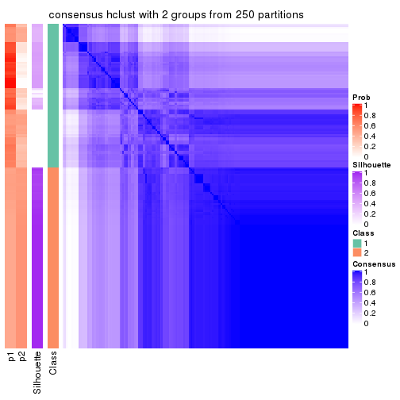</p>

</div>
<div id='tab-CV-hclust-consensus-heatmap-2'>
<pre><code class="r">consensus_heatmap(res, k = 3)
</code></pre>

<p>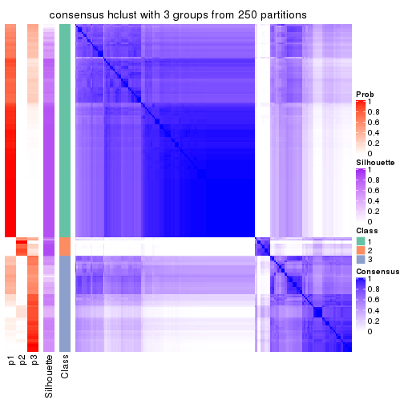</p>

</div>
<div id='tab-CV-hclust-consensus-heatmap-3'>
<pre><code class="r">consensus_heatmap(res, k = 4)
</code></pre>

<p>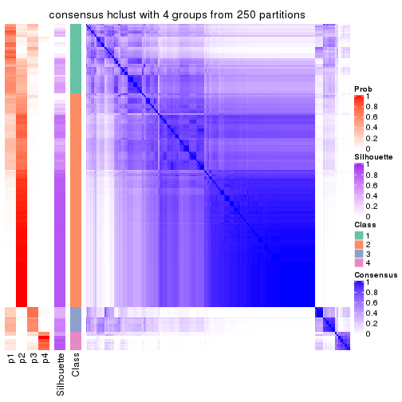</p>

</div>
<div id='tab-CV-hclust-consensus-heatmap-4'>
<pre><code class="r">consensus_heatmap(res, k = 5)
</code></pre>

<p>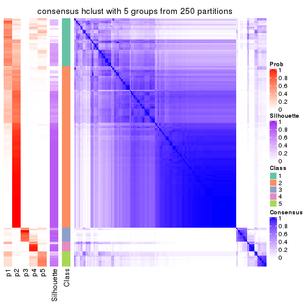</p>

</div>
<div id='tab-CV-hclust-consensus-heatmap-5'>
<pre><code class="r">consensus_heatmap(res, k = 6)
</code></pre>

<p>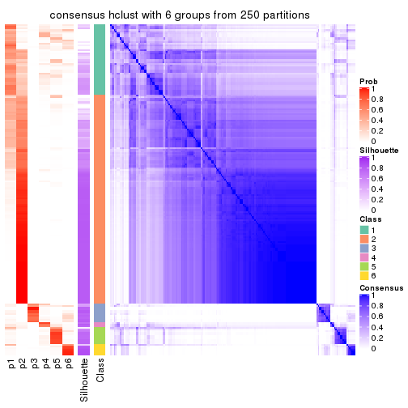</p>

</div>
</div>

Heatmaps for the membership of samples in all partitions to see how consistent they are:


<script>
$( function() {
	$( '#tabs-CV-hclust-membership-heatmap' ).tabs();
} );
</script>
<div id='tabs-CV-hclust-membership-heatmap'>
<ul>
<li><a href='#tab-CV-hclust-membership-heatmap-1'>k = 2</a></li>
<li><a href='#tab-CV-hclust-membership-heatmap-2'>k = 3</a></li>
<li><a href='#tab-CV-hclust-membership-heatmap-3'>k = 4</a></li>
<li><a href='#tab-CV-hclust-membership-heatmap-4'>k = 5</a></li>
<li><a href='#tab-CV-hclust-membership-heatmap-5'>k = 6</a></li>
</ul>
<div id='tab-CV-hclust-membership-heatmap-1'>
<pre><code class="r">membership_heatmap(res, k = 2)
</code></pre>

<p>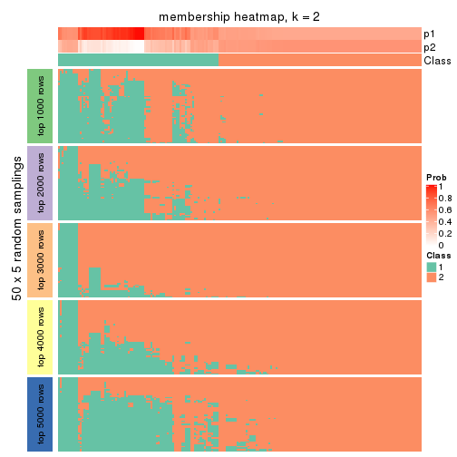</p>

</div>
<div id='tab-CV-hclust-membership-heatmap-2'>
<pre><code class="r">membership_heatmap(res, k = 3)
</code></pre>

<p>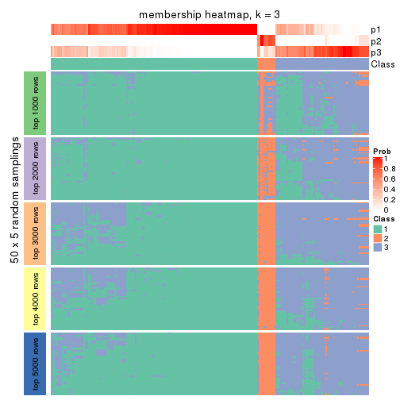</p>

</div>
<div id='tab-CV-hclust-membership-heatmap-3'>
<pre><code class="r">membership_heatmap(res, k = 4)
</code></pre>

<p>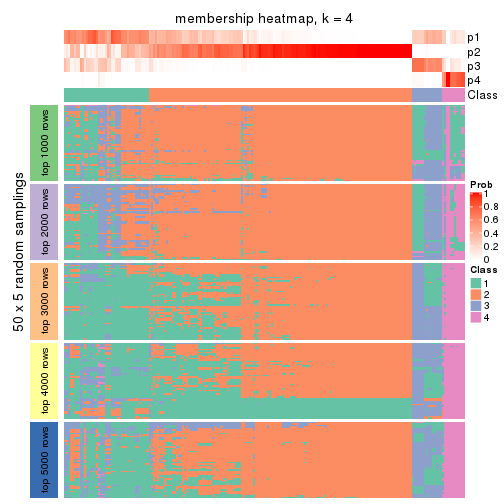</p>

</div>
<div id='tab-CV-hclust-membership-heatmap-4'>
<pre><code class="r">membership_heatmap(res, k = 5)
</code></pre>

<p>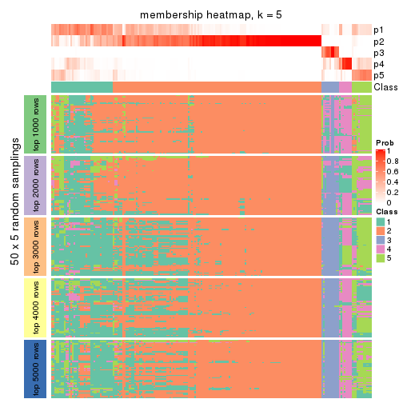</p>

</div>
<div id='tab-CV-hclust-membership-heatmap-5'>
<pre><code class="r">membership_heatmap(res, k = 6)
</code></pre>

<p>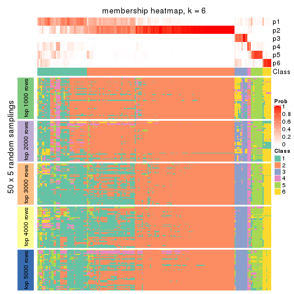</p>

</div>
</div>

As soon as we have had the classes for columns, we can look for signatures
which are significantly different between classes which can be candidate marks
for certain classes. Following are the heatmaps for signatures.


Signature heatmaps where rows are scaled:


<script>
$( function() {
	$( '#tabs-CV-hclust-get-signatures' ).tabs();
} );
</script>
<div id='tabs-CV-hclust-get-signatures'>
<ul>
<li><a href='#tab-CV-hclust-get-signatures-1'>k = 2</a></li>
<li><a href='#tab-CV-hclust-get-signatures-2'>k = 3</a></li>
<li><a href='#tab-CV-hclust-get-signatures-3'>k = 4</a></li>
<li><a href='#tab-CV-hclust-get-signatures-4'>k = 5</a></li>
<li><a href='#tab-CV-hclust-get-signatures-5'>k = 6</a></li>
</ul>
<div id='tab-CV-hclust-get-signatures-1'>
<pre><code class="r">get_signatures(res, k = 2)
</code></pre>

<p></p>

</div>
<div id='tab-CV-hclust-get-signatures-2'>
<pre><code class="r">get_signatures(res, k = 3)
</code></pre>

<p>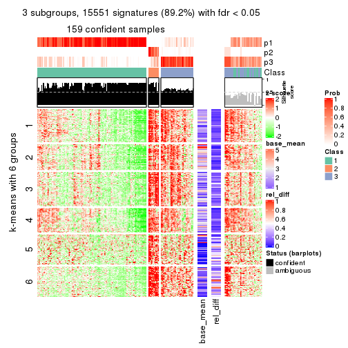</p>

</div>
<div id='tab-CV-hclust-get-signatures-3'>
<pre><code class="r">get_signatures(res, k = 4)
</code></pre>

<p>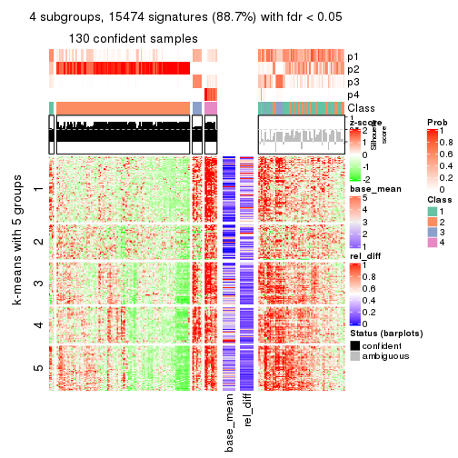</p>

</div>
<div id='tab-CV-hclust-get-signatures-4'>
<pre><code class="r">get_signatures(res, k = 5)
</code></pre>

<p>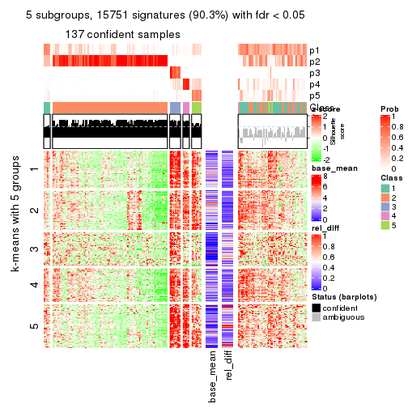</p>

</div>
<div id='tab-CV-hclust-get-signatures-5'>
<pre><code class="r">get_signatures(res, k = 6)
</code></pre>

<p>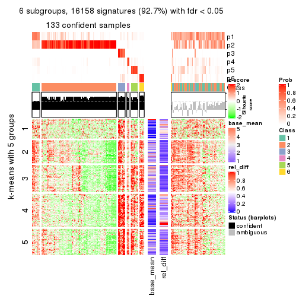</p>

</div>
</div>


Signature heatmaps where rows are not scaled:


<script>
$( function() {
	$( '#tabs-CV-hclust-get-signatures-no-scale' ).tabs();
} );
</script>
<div id='tabs-CV-hclust-get-signatures-no-scale'>
<ul>
<li><a href='#tab-CV-hclust-get-signatures-no-scale-1'>k = 2</a></li>
<li><a href='#tab-CV-hclust-get-signatures-no-scale-2'>k = 3</a></li>
<li><a href='#tab-CV-hclust-get-signatures-no-scale-3'>k = 4</a></li>
<li><a href='#tab-CV-hclust-get-signatures-no-scale-4'>k = 5</a></li>
<li><a href='#tab-CV-hclust-get-signatures-no-scale-5'>k = 6</a></li>
</ul>
<div id='tab-CV-hclust-get-signatures-no-scale-1'>
<pre><code class="r">get_signatures(res, k = 2, scale_rows = FALSE)
</code></pre>

<p></p>

</div>
<div id='tab-CV-hclust-get-signatures-no-scale-2'>
<pre><code class="r">get_signatures(res, k = 3, scale_rows = FALSE)
</code></pre>

<p>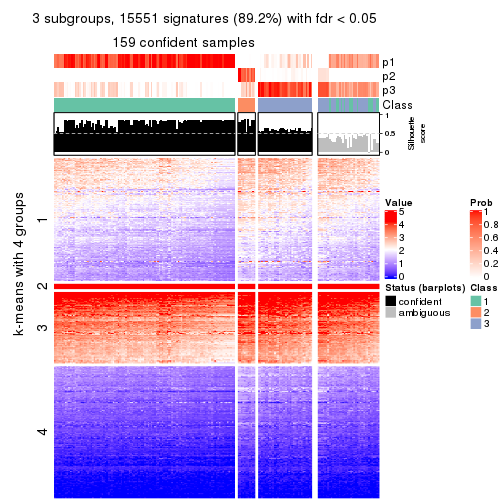</p>

</div>
<div id='tab-CV-hclust-get-signatures-no-scale-3'>
<pre><code class="r">get_signatures(res, k = 4, scale_rows = FALSE)
</code></pre>

<p>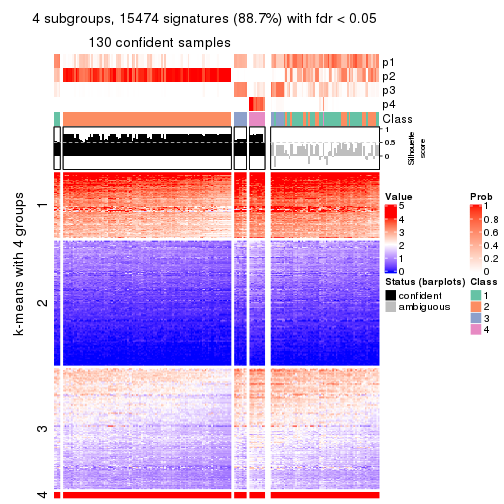</p>

</div>
<div id='tab-CV-hclust-get-signatures-no-scale-4'>
<pre><code class="r">get_signatures(res, k = 5, scale_rows = FALSE)
</code></pre>

<p>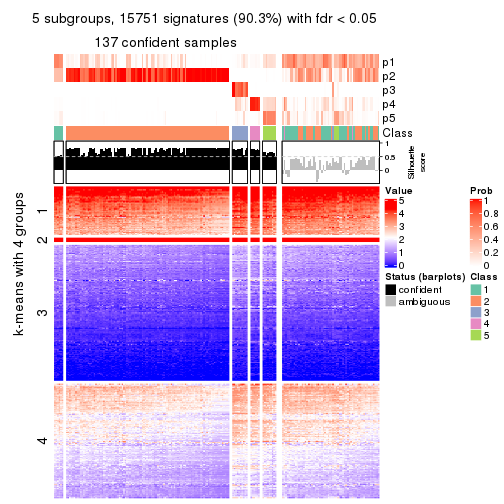</p>

</div>
<div id='tab-CV-hclust-get-signatures-no-scale-5'>
<pre><code class="r">get_signatures(res, k = 6, scale_rows = FALSE)
</code></pre>

<p>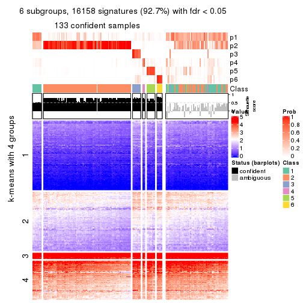</p>

</div>
</div>


Compare the overlap of signatures from different k:

```r
compare_signatures(res)
```

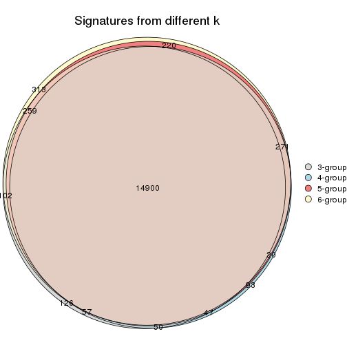

`get_signature()` returns a data frame invisibly. TO get the list of signatures, the function
call should be assigned to a variable explicitly. In following code, if `plot` argument is set
to `FALSE`, no heatmap is plotted while only the differential analysis is performed.

```r
# code only for demonstration
tb = get_signature(res, k = ..., plot = FALSE)
```

An example of the output of `tb` is:

```
#>   which_row         fdr    mean_1    mean_2 scaled_mean_1 scaled_mean_2 km
#> 1        38 0.042760348  8.373488  9.131774    -0.5533452     0.5164555  1
#> 2        40 0.018707592  7.106213  8.469186    -0.6173731     0.5762149  1
#> 3        55 0.019134737 10.221463 11.207825    -0.6159697     0.5749050  1
#> 4        59 0.006059896  5.921854  7.869574    -0.6899429     0.6439467  1
#> 5        60 0.018055526  8.928898 10.211722    -0.6204761     0.5791110  1
#> 6        98 0.009384629 15.714769 14.887706     0.6635654    -0.6193277  2
...
```

The columns in `tb` are:

1. `which_row`: row indices corresponding to the input matrix.
2. `fdr`: FDR for the differential test. 
3. `mean_x`: The mean value in group x.
4. `scaled_mean_x`: The mean value in group x after rows are scaled.
5. `km`: Row groups if k-means clustering is applied to rows.


UMAP plot which shows how samples are separated.


<script>
$( function() {
	$( '#tabs-CV-hclust-dimension-reduction' ).tabs();
} );
</script>
<div id='tabs-CV-hclust-dimension-reduction'>
<ul>
<li><a href='#tab-CV-hclust-dimension-reduction-1'>k = 2</a></li>
<li><a href='#tab-CV-hclust-dimension-reduction-2'>k = 3</a></li>
<li><a href='#tab-CV-hclust-dimension-reduction-3'>k = 4</a></li>
<li><a href='#tab-CV-hclust-dimension-reduction-4'>k = 5</a></li>
<li><a href='#tab-CV-hclust-dimension-reduction-5'>k = 6</a></li>
</ul>
<div id='tab-CV-hclust-dimension-reduction-1'>
<pre><code class="r">dimension_reduction(res, k = 2, method = &quot;UMAP&quot;)
</code></pre>

<p>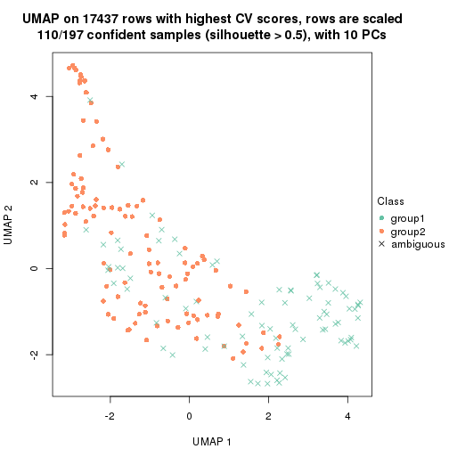</p>

</div>
<div id='tab-CV-hclust-dimension-reduction-2'>
<pre><code class="r">dimension_reduction(res, k = 3, method = &quot;UMAP&quot;)
</code></pre>

<p>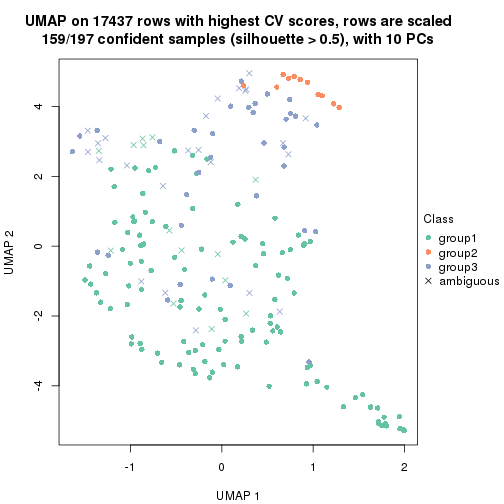</p>

</div>
<div id='tab-CV-hclust-dimension-reduction-3'>
<pre><code class="r">dimension_reduction(res, k = 4, method = &quot;UMAP&quot;)
</code></pre>

<p>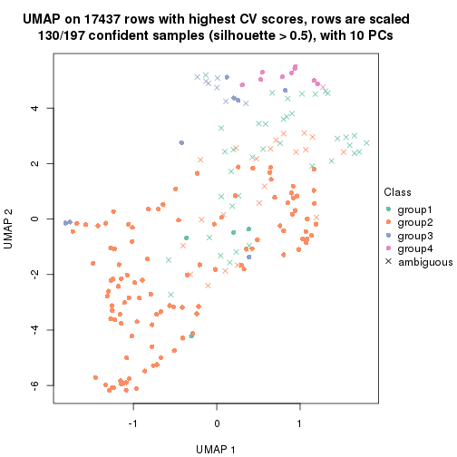</p>

</div>
<div id='tab-CV-hclust-dimension-reduction-4'>
<pre><code class="r">dimension_reduction(res, k = 5, method = &quot;UMAP&quot;)
</code></pre>

<p>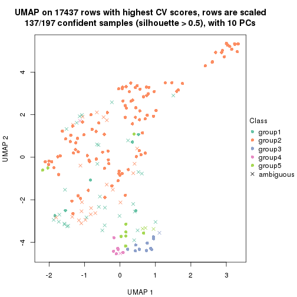</p>

</div>
<div id='tab-CV-hclust-dimension-reduction-5'>
<pre><code class="r">dimension_reduction(res, k = 6, method = &quot;UMAP&quot;)
</code></pre>

<p>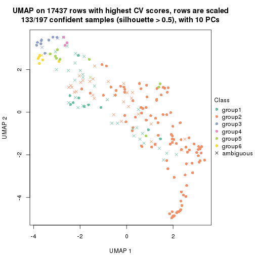</p>

</div>
</div>


Following heatmap shows how subgroups are split when increasing `k`:

```r
collect_classes(res)
```

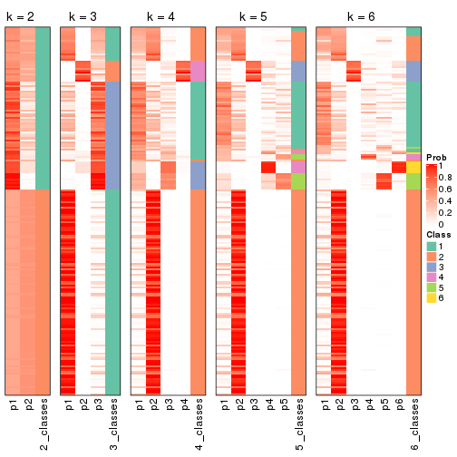


If matrix rows can be associated to genes, consider to use `GO_Enrichment(res,
...)` to perform function enrichment for the signature genes.


 

---------------------------------------------------


### CV:kmeans*


The object with results only for a single top-value method and a single partition method 
can be extracted as:

```r
res = res_list["CV", "kmeans"]
# you can also extract it by
# res = res_list["CV:kmeans"]
```

A summary of `res` and all the functions that can be applied to it:

```r
res
```

```
#> A 'ConsensusPartition' object with k = 2, 3, 4, 5, 6.
#>   On a matrix with 17437 rows and 197 columns.
#>   Top rows (1000, 2000, 3000, 4000, 5000) are extracted by 'CV' method.
#>   Subgroups are detected by 'kmeans' method.
#>   Performed in total 1250 partitions by row resampling.
#>   Best k for subgroups seems to be 2.
#> 
#> Following methods can be applied to this 'ConsensusPartition' object:
#>  [1] "cola_report"             "collect_classes"         "collect_plots"          
#>  [4] "collect_stats"           "colnames"                "compare_signatures"     
#>  [7] "consensus_heatmap"       "dimension_reduction"     "functional_enrichment"  
#> [10] "get_anno_col"            "get_anno"                "get_classes"            
#> [13] "get_consensus"           "get_matrix"              "get_membership"         
#> [16] "get_param"               "get_signatures"          "get_stats"              
#> [19] "is_best_k"               "is_stable_k"             "membership_heatmap"     
#> [22] "ncol"                    "nrow"                    "plot_ecdf"              
#> [25] "rownames"                "select_partition_number" "show"                   
#> [28] "suggest_best_k"          "test_to_known_factors"
```

`collect_plots()` function collects all the plots made from `res` for all `k` (number of partitions)
into one single page to provide an easy and fast comparison between different `k`.

```r
collect_plots(res)
```

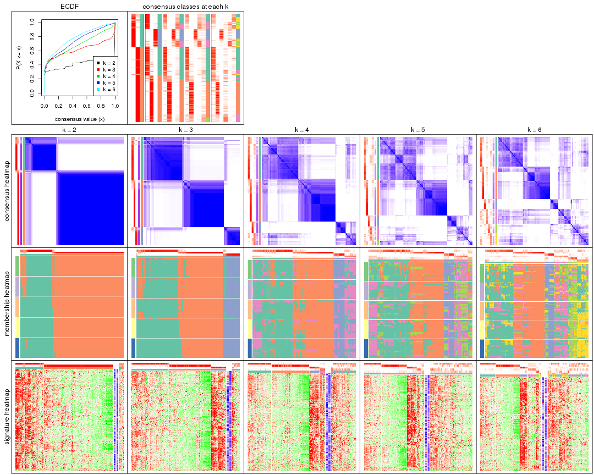

The plots are:

- The first row: a plot of the ECDF (Empirical cumulative distribution
  function) curves of the consensus matrix for each `k` and the heatmap of
  predicted classes for each `k`.
- The second row: heatmaps of the consensus matrix for each `k`.
- The third row: heatmaps of the membership matrix for each `k`.
- The fouth row: heatmaps of the signatures for each `k`.

All the plots in panels can be made by individual functions and they are
plotted later in this section.

`select_partition_number()` produces several plots showing different
statistics for choosing "optimized" `k`. There are following statistics:

- ECDF curves of the consensus matrix for each `k`;
- 1-PAC. [The PAC
  score](https://en.wikipedia.org/wiki/Consensus_clustering#Over-interpretation_potential_of_consensus_clustering)
  measures the proportion of the ambiguous subgrouping.
- Mean silhouette score.
- Concordance. The mean probability of fiting the consensus class ids in all
  partitions.
- Area increased. Denote $A_k$ as the area under the ECDF curve for current
  `k`, the area increased is defined as $A_k - A_{k-1}$.
- Rand index. The percent of pairs of samples that are both in a same cluster
  or both are not in a same cluster in the partition of k and k-1.
- Jaccard index. The ratio of pairs of samples are both in a same cluster in
  the partition of k and k-1 and the pairs of samples are both in a same
  cluster in the partition k or k-1.

The detailed explanations of these statistics can be found in [the cola
vignette](http://bioconductor.org/packages/devel/bioc/vignettes/cola/inst/doc/cola.html#toc_13).

Generally speaking, lower PAC score, higher mean silhouette score or higher
concordance corresponds to better partition. Rand index and Jaccard index
measure how similar the current partition is compared to partition with `k-1`.
If they are too similar, we won't accept `k` is better than `k-1`.

```r
select_partition_number(res)
```

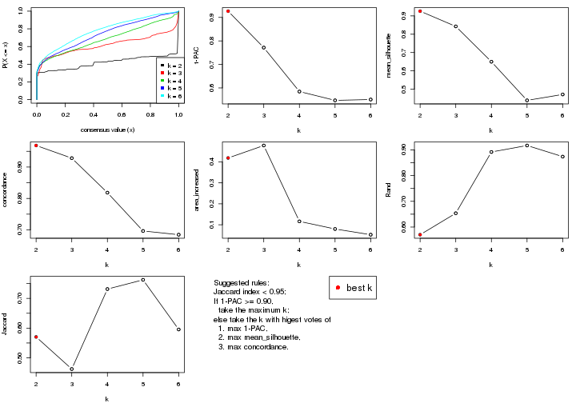

The numeric values for all these statistics can be obtained by `get_stats()`.

```r
get_stats(res)
```

```
#>   k 1-PAC mean_silhouette concordance area_increased  Rand Jaccard
#> 2 2 0.927           0.926       0.969         0.4185 0.570   0.570
#> 3 3 0.772           0.843       0.928         0.4780 0.654   0.462
#> 4 4 0.585           0.650       0.818         0.1162 0.892   0.731
#> 5 5 0.547           0.439       0.697         0.0799 0.917   0.762
#> 6 6 0.551           0.471       0.685         0.0527 0.874   0.595
```

`suggest_best_k()` suggests the best $k$ based on these statistics. The rules are as follows:

- All $k$ with Jaccard index larger than 0.95 are removed because the increase of
  the partition number does not provides enough extra information. If all $k$ are removed,
  the best $k$ is assigned by `NA`.
- For $k$ with 1-PAC larger than 0.9, the maximal $k$ is taken as the "best k". Other $k$ is called "optional k".
- If it does not fit the second rule. The $k$ with the highest vote of highest
  1-PAC, mean silhouette and concordance is taken as the "best k".

```r
suggest_best_k(res)
```

```
#> [1] 2
```


Following shows the table of the partitions (You need to click the **show/hide
code output** link to see it). The membership matrix (columns with name `p*`)
is inferred by
[`clue::cl_consensus()`](https://www.rdocumentation.org/link/cl_consensus?package=clue)
function with the `SE` method. Basically the value in the membership matrix
represents the probability to belong to a certain group. The finall class
label for an item is determined with the group with highest probability it
belongs to.

In `get_classes()` function, the entropy is calculated from the membership
matrix and the silhouette score is calculated from the consensus matrix.


<script>
$( function() {
	$( '#tabs-CV-kmeans-get-classes' ).tabs();
} );
</script>
<div id='tabs-CV-kmeans-get-classes'>
<ul>
<li><a href='#tab-CV-kmeans-get-classes-1'>k = 2</a></li>
<li><a href='#tab-CV-kmeans-get-classes-2'>k = 3</a></li>
<li><a href='#tab-CV-kmeans-get-classes-3'>k = 4</a></li>
<li><a href='#tab-CV-kmeans-get-classes-4'>k = 5</a></li>
<li><a href='#tab-CV-kmeans-get-classes-5'>k = 6</a></li>
</ul>

<div id='tab-CV-kmeans-get-classes-1'>
<p><a id='tab-CV-kmeans-get-classes-1-a' style='color:#0366d6' href='#'>show/hide code output</a></p>
<pre><code class="r">cbind(get_classes(res, k = 2), get_membership(res, k = 2))
</code></pre>

<pre><code>#&gt;            class entropy silhouette    p1    p2
#&gt; SRR1380886     1  0.0000      0.924 1.000 0.000
#&gt; SRR1074385     2  0.0000      0.985 0.000 1.000
#&gt; SRR1374739     1  0.0000      0.924 1.000 0.000
#&gt; SRR1097883     2  0.0000      0.985 0.000 1.000
#&gt; SRR2167209     2  0.0000      0.985 0.000 1.000
#&gt; SRR816541      2  0.0000      0.985 0.000 1.000
#&gt; SRR663645      2  0.0000      0.985 0.000 1.000
#&gt; SRR1381505     2  0.0000      0.985 0.000 1.000
#&gt; SRR1416362     2  0.0000      0.985 0.000 1.000
#&gt; SRR1318503     2  0.0000      0.985 0.000 1.000
#&gt; SRR1341626     2  0.0000      0.985 0.000 1.000
#&gt; SRR1382440     1  0.0000      0.924 1.000 0.000
#&gt; SRR1088413     2  0.0000      0.985 0.000 1.000
#&gt; SRR1082080     2  0.0000      0.985 0.000 1.000
#&gt; SRR1455783     2  0.0000      0.985 0.000 1.000
#&gt; SRR1447760     2  0.0000      0.985 0.000 1.000
#&gt; SRR1487784     2  0.0000      0.985 0.000 1.000
#&gt; SRR1331037     2  0.0000      0.985 0.000 1.000
#&gt; SRR1095651     1  0.0000      0.924 1.000 0.000
#&gt; SRR1078066     2  0.0000      0.985 0.000 1.000
#&gt; SRR1120363     2  0.0000      0.985 0.000 1.000
#&gt; SRR821231      1  0.0000      0.924 1.000 0.000
#&gt; SRR1374373     2  0.0000      0.985 0.000 1.000
#&gt; SRR1324519     2  0.0000      0.985 0.000 1.000
#&gt; SRR1431121     1  0.8608      0.654 0.716 0.284
#&gt; SRR1091032     2  0.0000      0.985 0.000 1.000
#&gt; SRR1365575     2  0.0000      0.985 0.000 1.000
#&gt; SRR1072972     1  0.0000      0.924 1.000 0.000
#&gt; SRR1310690     2  0.0000      0.985 0.000 1.000
#&gt; SRR1383037     1  0.0000      0.924 1.000 0.000
#&gt; SRR1095479     1  0.0000      0.924 1.000 0.000
#&gt; SRR1070403     1  0.0000      0.924 1.000 0.000
#&gt; SRR1390203     2  1.0000     -0.155 0.500 0.500
#&gt; SRR1072007     2  0.0000      0.985 0.000 1.000
#&gt; SRR1468787     2  0.0000      0.985 0.000 1.000
#&gt; SRR1347959     2  0.0000      0.985 0.000 1.000
#&gt; SRR1338513     1  0.0000      0.924 1.000 0.000
#&gt; SRR812598      2  0.0000      0.985 0.000 1.000
#&gt; SRR1446806     2  0.0000      0.985 0.000 1.000
#&gt; SRR1394275     2  0.0000      0.985 0.000 1.000
#&gt; SRR1443633     1  0.0000      0.924 1.000 0.000
#&gt; SRR1087728     1  0.0000      0.924 1.000 0.000
#&gt; SRR1098192     2  0.0000      0.985 0.000 1.000
#&gt; SRR1093340     2  0.0000      0.985 0.000 1.000
#&gt; SRR665405      1  0.8813      0.630 0.700 0.300
#&gt; SRR657077      2  0.0000      0.985 0.000 1.000
#&gt; SRR813208      1  0.0000      0.924 1.000 0.000
#&gt; SRR1416074     2  0.0000      0.985 0.000 1.000
#&gt; SRR1089688     2  0.0000      0.985 0.000 1.000
#&gt; SRR1353461     1  0.0000      0.924 1.000 0.000
#&gt; SRR1466321     2  0.0000      0.985 0.000 1.000
#&gt; SRR1073021     2  0.0000      0.985 0.000 1.000
#&gt; SRR1322816     2  0.0000      0.985 0.000 1.000
#&gt; SRR1457727     2  0.3733      0.905 0.072 0.928
#&gt; SRR1464226     2  0.0000      0.985 0.000 1.000
#&gt; SRR1398863     1  0.5946      0.809 0.856 0.144
#&gt; SRR1455631     2  0.0000      0.985 0.000 1.000
#&gt; SRR1307808     2  0.0000      0.985 0.000 1.000
#&gt; SRR1374585     2  0.0000      0.985 0.000 1.000
#&gt; SRR1072104     2  0.0000      0.985 0.000 1.000
#&gt; SRR1076868     2  0.0000      0.985 0.000 1.000
#&gt; SRR1335984     2  0.0000      0.985 0.000 1.000
#&gt; SRR1445939     1  0.9732      0.430 0.596 0.404
#&gt; SRR1453047     2  0.0000      0.985 0.000 1.000
#&gt; SRR1339788     1  0.0000      0.924 1.000 0.000
#&gt; SRR1084323     1  0.0000      0.924 1.000 0.000
#&gt; SRR1092937     1  0.0000      0.924 1.000 0.000
#&gt; SRR1074090     2  0.0000      0.985 0.000 1.000
#&gt; SRR1099833     1  0.0000      0.924 1.000 0.000
#&gt; SRR1093434     1  0.0000      0.924 1.000 0.000
#&gt; SRR1435857     2  0.0000      0.985 0.000 1.000
#&gt; SRR1480347     2  0.0000      0.985 0.000 1.000
#&gt; SRR1440787     2  0.0000      0.985 0.000 1.000
#&gt; SRR1430202     2  0.0000      0.985 0.000 1.000
#&gt; SRR1322730     2  0.0000      0.985 0.000 1.000
#&gt; SRR811029      2  0.0000      0.985 0.000 1.000
#&gt; SRR1390456     1  0.0000      0.924 1.000 0.000
#&gt; SRR1381140     1  0.8763      0.636 0.704 0.296
#&gt; SRR1388064     2  0.0000      0.985 0.000 1.000
#&gt; SRR1093577     2  0.0000      0.985 0.000 1.000
#&gt; SRR1414161     2  0.0000      0.985 0.000 1.000
#&gt; SRR1328738     2  0.0000      0.985 0.000 1.000
#&gt; SRR1311752     2  0.0000      0.985 0.000 1.000
#&gt; SRR1445960     2  0.0000      0.985 0.000 1.000
#&gt; SRR1403412     2  0.0000      0.985 0.000 1.000
#&gt; SRR2166748     1  0.0000      0.924 1.000 0.000
#&gt; SRR821666      2  0.0000      0.985 0.000 1.000
#&gt; SRR1330746     1  0.0000      0.924 1.000 0.000
#&gt; SRR1327872     2  0.0000      0.985 0.000 1.000
#&gt; SRR1100800     2  0.0000      0.985 0.000 1.000
#&gt; SRR1075174     1  0.8763      0.636 0.704 0.296
#&gt; SRR1434436     2  0.0000      0.985 0.000 1.000
#&gt; SRR1389409     2  0.0000      0.985 0.000 1.000
#&gt; SRR1085310     1  0.9732      0.430 0.596 0.404
#&gt; SRR1376718     2  0.0000      0.985 0.000 1.000
#&gt; SRR808590      2  0.0000      0.985 0.000 1.000
#&gt; SRR1084128     2  0.0000      0.985 0.000 1.000
#&gt; SRR1361692     2  0.0000      0.985 0.000 1.000
#&gt; SRR1431493     1  0.0000      0.924 1.000 0.000
#&gt; SRR1409084     1  0.9732      0.430 0.596 0.404
#&gt; SRR2166214     1  0.9732      0.430 0.596 0.404
#&gt; SRR1324102     2  0.0000      0.985 0.000 1.000
#&gt; SRR1079754     2  0.0000      0.985 0.000 1.000
#&gt; SRR1442127     1  0.0000      0.924 1.000 0.000
#&gt; SRR1076244     2  0.0000      0.985 0.000 1.000
#&gt; SRR1330901     2  0.0000      0.985 0.000 1.000
#&gt; SRR1073167     2  0.0000      0.985 0.000 1.000
#&gt; SRR1357541     2  0.0000      0.985 0.000 1.000
#&gt; SRR811607      2  0.0000      0.985 0.000 1.000
#&gt; SRR1468931     1  0.0000      0.924 1.000 0.000
#&gt; SRR1474908     2  0.0000      0.985 0.000 1.000
#&gt; SRR1309875     2  0.0000      0.985 0.000 1.000
#&gt; SRR598792      1  0.0000      0.924 1.000 0.000
#&gt; SRR1088537     2  0.0000      0.985 0.000 1.000
#&gt; SRR1457682     2  0.0000      0.985 0.000 1.000
#&gt; SRR1454289     2  0.0000      0.985 0.000 1.000
#&gt; SRR1069352     1  0.0000      0.924 1.000 0.000
#&gt; SRR1472728     2  0.0000      0.985 0.000 1.000
#&gt; SRR1091144     2  0.0000      0.985 0.000 1.000
#&gt; SRR1319118     2  0.9954      0.087 0.460 0.540
#&gt; SRR1403611     1  0.3114      0.887 0.944 0.056
#&gt; SRR1397762     1  0.9710      0.439 0.600 0.400
#&gt; SRR1317387     1  0.0000      0.924 1.000 0.000
#&gt; SRR1376426     2  0.0000      0.985 0.000 1.000
#&gt; SRR1097777     2  0.3431      0.915 0.064 0.936
#&gt; SRR1365743     1  0.0000      0.924 1.000 0.000
#&gt; SRR1458992     2  0.0000      0.985 0.000 1.000
#&gt; SRR1089537     2  0.0000      0.985 0.000 1.000
#&gt; SRR1397744     2  0.3733      0.905 0.072 0.928
#&gt; SRR1453893     2  0.0000      0.985 0.000 1.000
#&gt; SRR1098543     2  0.0000      0.985 0.000 1.000
#&gt; SRR1321765     2  0.0000      0.985 0.000 1.000
#&gt; SRR1440032     2  0.0000      0.985 0.000 1.000
#&gt; SRR1404507     2  0.0000      0.985 0.000 1.000
#&gt; SRR1404856     2  0.0000      0.985 0.000 1.000
#&gt; SRR812745      1  0.9732      0.430 0.596 0.404
#&gt; SRR1417524     1  0.0000      0.924 1.000 0.000
#&gt; SRR1407334     2  0.0000      0.985 0.000 1.000
#&gt; SRR1453991     2  0.0000      0.985 0.000 1.000
#&gt; SRR1415938     1  0.7376      0.748 0.792 0.208
#&gt; SRR1081259     2  0.0000      0.985 0.000 1.000
#&gt; SRR1436187     2  0.0000      0.985 0.000 1.000
#&gt; SRR1431948     1  0.0000      0.924 1.000 0.000
#&gt; SRR1453277     2  0.0000      0.985 0.000 1.000
#&gt; SRR1095407     2  0.0000      0.985 0.000 1.000
#&gt; SRR1359694     2  0.0000      0.985 0.000 1.000
#&gt; SRR656982      2  0.0000      0.985 0.000 1.000
#&gt; SRR1354338     2  0.0000      0.985 0.000 1.000
#&gt; SRR1088291     2  0.0000      0.985 0.000 1.000
#&gt; SRR1080624     2  0.0000      0.985 0.000 1.000
#&gt; SRR2166708     1  0.0000      0.924 1.000 0.000
#&gt; SRR1393572     2  0.0000      0.985 0.000 1.000
#&gt; SRR1429912     2  0.0000      0.985 0.000 1.000
#&gt; SRR1421048     2  0.0000      0.985 0.000 1.000
#&gt; SRR1434999     1  0.0000      0.924 1.000 0.000
#&gt; SRR656457      1  0.0000      0.924 1.000 0.000
#&gt; SRR1098928     1  0.0000      0.924 1.000 0.000
#&gt; SRR1343967     2  0.0000      0.985 0.000 1.000
#&gt; SRR1360766     2  0.0938      0.973 0.012 0.988
#&gt; SRR1464724     2  0.0000      0.985 0.000 1.000
#&gt; SRR1101542     2  0.0000      0.985 0.000 1.000
#&gt; SRR1401528     1  0.0000      0.924 1.000 0.000
#&gt; SRR1071519     1  0.0000      0.924 1.000 0.000
#&gt; SRR1086070     1  0.0000      0.924 1.000 0.000
#&gt; SRR1358645     2  0.0000      0.985 0.000 1.000
#&gt; SRR819771      1  0.0000      0.924 1.000 0.000
#&gt; SRR1418433     1  0.4022      0.869 0.920 0.080
#&gt; SRR821050      2  0.0000      0.985 0.000 1.000
#&gt; SRR1402091     2  0.0000      0.985 0.000 1.000
#&gt; SRR1322028     2  0.0000      0.985 0.000 1.000
#&gt; SRR1452556     2  0.0000      0.985 0.000 1.000
#&gt; SRR1340047     2  0.0000      0.985 0.000 1.000
#&gt; SRR1418302     2  0.0000      0.985 0.000 1.000
#&gt; SRR1073991     2  0.0000      0.985 0.000 1.000
#&gt; SRR1085187     2  0.0000      0.985 0.000 1.000
#&gt; SRR1357618     1  0.0672      0.919 0.992 0.008
#&gt; SRR1487764     1  0.0000      0.924 1.000 0.000
#&gt; SRR1075336     2  0.0000      0.985 0.000 1.000
#&gt; SRR1365471     2  0.0000      0.985 0.000 1.000
#&gt; SRR1414613     2  0.0000      0.985 0.000 1.000
#&gt; SRR658719      1  0.0000      0.924 1.000 0.000
#&gt; SRR1475128     1  0.0000      0.924 1.000 0.000
#&gt; SRR1367630     2  0.0000      0.985 0.000 1.000
#&gt; SRR1481146     2  0.0000      0.985 0.000 1.000
#&gt; SRR1465674     2  0.0000      0.985 0.000 1.000
#&gt; SRR1327303     2  0.9286      0.436 0.344 0.656
#&gt; SRR1390391     2  0.0000      0.985 0.000 1.000
#&gt; SRR1326020     2  0.0672      0.977 0.008 0.992
#&gt; SRR1381953     1  0.0000      0.924 1.000 0.000
#&gt; SRR1082544     2  0.0000      0.985 0.000 1.000
#&gt; SRR810761      1  0.8861      0.622 0.696 0.304
#&gt; SRR1070764     1  0.0000      0.924 1.000 0.000
#&gt; SRR1415919     1  0.0000      0.924 1.000 0.000
#&gt; SRR1490404     2  0.0000      0.985 0.000 1.000
#&gt; SRR1416773     2  0.0000      0.985 0.000 1.000
#&gt; SRR1377492     2  0.8386      0.602 0.268 0.732
#&gt; SRR1334314     2  0.0000      0.985 0.000 1.000
</code></pre>

<script>
$('#tab-CV-kmeans-get-classes-1-a').parent().next().next().hide();
$('#tab-CV-kmeans-get-classes-1-a').click(function(){
  $('#tab-CV-kmeans-get-classes-1-a').parent().next().next().toggle();
  return(false);
});
</script>
</div>

<div id='tab-CV-kmeans-get-classes-2'>
<p><a id='tab-CV-kmeans-get-classes-2-a' style='color:#0366d6' href='#'>show/hide code output</a></p>
<pre><code class="r">cbind(get_classes(res, k = 3), get_membership(res, k = 3))
</code></pre>

<pre><code>#&gt;            class entropy silhouette    p1    p2    p3
#&gt; SRR1380886     1  0.1753    0.87386 0.952 0.000 0.048
#&gt; SRR1074385     1  0.1289    0.90089 0.968 0.032 0.000
#&gt; SRR1374739     3  0.0424    0.91065 0.008 0.000 0.992
#&gt; SRR1097883     1  0.1163    0.90076 0.972 0.028 0.000
#&gt; SRR2167209     2  0.0747    0.93105 0.016 0.984 0.000
#&gt; SRR816541      2  0.0000    0.94194 0.000 1.000 0.000
#&gt; SRR663645      1  0.6295    0.19694 0.528 0.472 0.000
#&gt; SRR1381505     2  0.0000    0.94194 0.000 1.000 0.000
#&gt; SRR1416362     2  0.0000    0.94194 0.000 1.000 0.000
#&gt; SRR1318503     2  0.0000    0.94194 0.000 1.000 0.000
#&gt; SRR1341626     2  0.0000    0.94194 0.000 1.000 0.000
#&gt; SRR1382440     3  0.6180    0.44370 0.416 0.000 0.584
#&gt; SRR1088413     1  0.1031    0.90011 0.976 0.024 0.000
#&gt; SRR1082080     2  0.0000    0.94194 0.000 1.000 0.000
#&gt; SRR1455783     1  0.5254    0.67123 0.736 0.264 0.000
#&gt; SRR1447760     2  0.0000    0.94194 0.000 1.000 0.000
#&gt; SRR1487784     2  0.0000    0.94194 0.000 1.000 0.000
#&gt; SRR1331037     2  0.0000    0.94194 0.000 1.000 0.000
#&gt; SRR1095651     3  0.5138    0.71024 0.252 0.000 0.748
#&gt; SRR1078066     1  0.1163    0.90076 0.972 0.028 0.000
#&gt; SRR1120363     1  0.4121    0.78147 0.832 0.168 0.000
#&gt; SRR821231      1  0.1964    0.86500 0.944 0.000 0.056
#&gt; SRR1374373     2  0.0592    0.93423 0.012 0.988 0.000
#&gt; SRR1324519     2  0.0000    0.94194 0.000 1.000 0.000
#&gt; SRR1431121     1  0.0237    0.89075 0.996 0.004 0.000
#&gt; SRR1091032     2  0.0000    0.94194 0.000 1.000 0.000
#&gt; SRR1365575     2  0.0000    0.94194 0.000 1.000 0.000
#&gt; SRR1072972     1  0.0747    0.88717 0.984 0.000 0.016
#&gt; SRR1310690     2  0.0000    0.94194 0.000 1.000 0.000
#&gt; SRR1383037     3  0.0424    0.91159 0.008 0.000 0.992
#&gt; SRR1095479     3  0.6274    0.35966 0.456 0.000 0.544
#&gt; SRR1070403     3  0.0424    0.91065 0.008 0.000 0.992
#&gt; SRR1390203     1  0.1129    0.89897 0.976 0.020 0.004
#&gt; SRR1072007     2  0.0000    0.94194 0.000 1.000 0.000
#&gt; SRR1468787     2  0.4702    0.71412 0.212 0.788 0.000
#&gt; SRR1347959     2  0.0000    0.94194 0.000 1.000 0.000
#&gt; SRR1338513     1  0.1411    0.87711 0.964 0.000 0.036
#&gt; SRR812598      2  0.0000    0.94194 0.000 1.000 0.000
#&gt; SRR1446806     1  0.1289    0.90089 0.968 0.032 0.000
#&gt; SRR1394275     1  0.1289    0.90089 0.968 0.032 0.000
#&gt; SRR1443633     1  0.1031    0.88236 0.976 0.000 0.024
#&gt; SRR1087728     3  0.0892    0.90972 0.020 0.000 0.980
#&gt; SRR1098192     2  0.2356    0.88242 0.072 0.928 0.000
#&gt; SRR1093340     2  0.0000    0.94194 0.000 1.000 0.000
#&gt; SRR665405      1  0.0661    0.89003 0.988 0.004 0.008
#&gt; SRR657077      2  0.4555    0.72179 0.200 0.800 0.000
#&gt; SRR813208      3  0.0424    0.91159 0.008 0.000 0.992
#&gt; SRR1416074     2  0.0000    0.94194 0.000 1.000 0.000
#&gt; SRR1089688     1  0.6215    0.32450 0.572 0.428 0.000
#&gt; SRR1353461     3  0.0592    0.91146 0.012 0.000 0.988
#&gt; SRR1466321     1  0.4399    0.75946 0.812 0.188 0.000
#&gt; SRR1073021     2  0.4346    0.75410 0.184 0.816 0.000
#&gt; SRR1322816     2  0.0000    0.94194 0.000 1.000 0.000
#&gt; SRR1457727     1  0.1031    0.90011 0.976 0.024 0.000
#&gt; SRR1464226     1  0.1289    0.90089 0.968 0.032 0.000
#&gt; SRR1398863     1  0.0747    0.88717 0.984 0.000 0.016
#&gt; SRR1455631     2  0.0000    0.94194 0.000 1.000 0.000
#&gt; SRR1307808     2  0.0000    0.94194 0.000 1.000 0.000
#&gt; SRR1374585     2  0.0000    0.94194 0.000 1.000 0.000
#&gt; SRR1072104     2  0.0000    0.94194 0.000 1.000 0.000
#&gt; SRR1076868     2  0.0000    0.94194 0.000 1.000 0.000
#&gt; SRR1335984     1  0.1289    0.90089 0.968 0.032 0.000
#&gt; SRR1445939     1  0.1129    0.89897 0.976 0.020 0.004
#&gt; SRR1453047     2  0.0000    0.94194 0.000 1.000 0.000
#&gt; SRR1339788     1  0.4750    0.68448 0.784 0.000 0.216
#&gt; SRR1084323     1  0.0592    0.88676 0.988 0.000 0.012
#&gt; SRR1092937     1  0.1163    0.88193 0.972 0.000 0.028
#&gt; SRR1074090     2  0.0000    0.94194 0.000 1.000 0.000
#&gt; SRR1099833     3  0.3340    0.83907 0.120 0.000 0.880
#&gt; SRR1093434     3  0.0424    0.91065 0.008 0.000 0.992
#&gt; SRR1435857     1  0.1289    0.90089 0.968 0.032 0.000
#&gt; SRR1480347     2  0.0000    0.94194 0.000 1.000 0.000
#&gt; SRR1440787     2  0.0000    0.94194 0.000 1.000 0.000
#&gt; SRR1430202     1  0.1289    0.90089 0.968 0.032 0.000
#&gt; SRR1322730     1  0.6274    0.24769 0.544 0.456 0.000
#&gt; SRR811029      1  0.5497    0.62799 0.708 0.292 0.000
#&gt; SRR1390456     3  0.0000    0.91101 0.000 0.000 1.000
#&gt; SRR1381140     1  0.0983    0.89773 0.980 0.016 0.004
#&gt; SRR1388064     2  0.0000    0.94194 0.000 1.000 0.000
#&gt; SRR1093577     2  0.6274    0.07690 0.456 0.544 0.000
#&gt; SRR1414161     2  0.4974    0.66362 0.236 0.764 0.000
#&gt; SRR1328738     1  0.1289    0.90089 0.968 0.032 0.000
#&gt; SRR1311752     2  0.0000    0.94194 0.000 1.000 0.000
#&gt; SRR1445960     2  0.0000    0.94194 0.000 1.000 0.000
#&gt; SRR1403412     1  0.1289    0.90089 0.968 0.032 0.000
#&gt; SRR2166748     1  0.4702    0.62365 0.788 0.000 0.212
#&gt; SRR821666      2  0.0000    0.94194 0.000 1.000 0.000
#&gt; SRR1330746     3  0.0424    0.91065 0.008 0.000 0.992
#&gt; SRR1327872     2  0.0000    0.94194 0.000 1.000 0.000
#&gt; SRR1100800     1  0.1860    0.88891 0.948 0.052 0.000
#&gt; SRR1075174     1  0.0983    0.89773 0.980 0.016 0.004
#&gt; SRR1434436     1  0.1411    0.89928 0.964 0.036 0.000
#&gt; SRR1389409     2  0.0000    0.94194 0.000 1.000 0.000
#&gt; SRR1085310     1  0.0892    0.89931 0.980 0.020 0.000
#&gt; SRR1376718     2  0.0000    0.94194 0.000 1.000 0.000
#&gt; SRR808590      2  0.0000    0.94194 0.000 1.000 0.000
#&gt; SRR1084128     2  0.0000    0.94194 0.000 1.000 0.000
#&gt; SRR1361692     2  0.6260    0.09227 0.448 0.552 0.000
#&gt; SRR1431493     3  0.6235    0.40414 0.436 0.000 0.564
#&gt; SRR1409084     1  0.0983    0.89751 0.980 0.016 0.004
#&gt; SRR2166214     1  0.0661    0.89291 0.988 0.008 0.004
#&gt; SRR1324102     2  0.0000    0.94194 0.000 1.000 0.000
#&gt; SRR1079754     2  0.0000    0.94194 0.000 1.000 0.000
#&gt; SRR1442127     3  0.2165    0.88961 0.064 0.000 0.936
#&gt; SRR1076244     1  0.1289    0.90089 0.968 0.032 0.000
#&gt; SRR1330901     2  0.0000    0.94194 0.000 1.000 0.000
#&gt; SRR1073167     2  0.0000    0.94194 0.000 1.000 0.000
#&gt; SRR1357541     1  0.1289    0.90089 0.968 0.032 0.000
#&gt; SRR811607      1  0.2448    0.87063 0.924 0.076 0.000
#&gt; SRR1468931     3  0.0424    0.91065 0.008 0.000 0.992
#&gt; SRR1474908     1  0.1289    0.90089 0.968 0.032 0.000
#&gt; SRR1309875     1  0.6302    0.17192 0.520 0.480 0.000
#&gt; SRR598792      3  0.0747    0.91063 0.016 0.000 0.984
#&gt; SRR1088537     2  0.0000    0.94194 0.000 1.000 0.000
#&gt; SRR1457682     1  0.1289    0.90089 0.968 0.032 0.000
#&gt; SRR1454289     2  0.1529    0.91183 0.040 0.960 0.000
#&gt; SRR1069352     3  0.3551    0.83574 0.132 0.000 0.868
#&gt; SRR1472728     2  0.0000    0.94194 0.000 1.000 0.000
#&gt; SRR1091144     2  0.0747    0.93105 0.016 0.984 0.000
#&gt; SRR1319118     1  0.1031    0.88688 0.976 0.000 0.024
#&gt; SRR1403611     3  0.6026    0.52776 0.376 0.000 0.624
#&gt; SRR1397762     1  0.1129    0.89897 0.976 0.020 0.004
#&gt; SRR1317387     3  0.6192    0.44290 0.420 0.000 0.580
#&gt; SRR1376426     2  0.0000    0.94194 0.000 1.000 0.000
#&gt; SRR1097777     1  0.1163    0.90073 0.972 0.028 0.000
#&gt; SRR1365743     3  0.0424    0.91159 0.008 0.000 0.992
#&gt; SRR1458992     2  0.4121    0.77289 0.168 0.832 0.000
#&gt; SRR1089537     2  0.5988    0.36331 0.368 0.632 0.000
#&gt; SRR1397744     1  0.1289    0.90089 0.968 0.032 0.000
#&gt; SRR1453893     2  0.0000    0.94194 0.000 1.000 0.000
#&gt; SRR1098543     1  0.1289    0.90089 0.968 0.032 0.000
#&gt; SRR1321765     2  0.3879    0.79830 0.152 0.848 0.000
#&gt; SRR1440032     1  0.3038    0.84610 0.896 0.104 0.000
#&gt; SRR1404507     2  0.0000    0.94194 0.000 1.000 0.000
#&gt; SRR1404856     2  0.0747    0.93105 0.016 0.984 0.000
#&gt; SRR812745      1  0.1129    0.89897 0.976 0.020 0.004
#&gt; SRR1417524     3  0.0424    0.91065 0.008 0.000 0.992
#&gt; SRR1407334     2  0.0000    0.94194 0.000 1.000 0.000
#&gt; SRR1453991     1  0.1860    0.88996 0.948 0.052 0.000
#&gt; SRR1415938     1  0.0983    0.89773 0.980 0.016 0.004
#&gt; SRR1081259     1  0.3340    0.82955 0.880 0.120 0.000
#&gt; SRR1436187     2  0.0000    0.94194 0.000 1.000 0.000
#&gt; SRR1431948     3  0.0892    0.90998 0.020 0.000 0.980
#&gt; SRR1453277     1  0.5327    0.64574 0.728 0.272 0.000
#&gt; SRR1095407     2  0.0747    0.93105 0.016 0.984 0.000
#&gt; SRR1359694     2  0.0000    0.94194 0.000 1.000 0.000
#&gt; SRR656982      2  0.6302    0.05147 0.480 0.520 0.000
#&gt; SRR1354338     2  0.0000    0.94194 0.000 1.000 0.000
#&gt; SRR1088291     1  0.1289    0.90089 0.968 0.032 0.000
#&gt; SRR1080624     2  0.4555    0.72179 0.200 0.800 0.000
#&gt; SRR2166708     3  0.0424    0.91065 0.008 0.000 0.992
#&gt; SRR1393572     1  0.4002    0.78743 0.840 0.160 0.000
#&gt; SRR1429912     2  0.3879    0.79474 0.152 0.848 0.000
#&gt; SRR1421048     2  0.0000    0.94194 0.000 1.000 0.000
#&gt; SRR1434999     3  0.0747    0.90932 0.016 0.000 0.984
#&gt; SRR656457      1  0.6302    0.00616 0.520 0.000 0.480
#&gt; SRR1098928     3  0.0424    0.91159 0.008 0.000 0.992
#&gt; SRR1343967     2  0.0000    0.94194 0.000 1.000 0.000
#&gt; SRR1360766     1  0.1129    0.89901 0.976 0.020 0.004
#&gt; SRR1464724     2  0.4346    0.75410 0.184 0.816 0.000
#&gt; SRR1101542     2  0.0000    0.94194 0.000 1.000 0.000
#&gt; SRR1401528     3  0.0592    0.91146 0.012 0.000 0.988
#&gt; SRR1071519     3  0.0424    0.91159 0.008 0.000 0.992
#&gt; SRR1086070     1  0.0892    0.88709 0.980 0.000 0.020
#&gt; SRR1358645     1  0.6267    0.26005 0.548 0.452 0.000
#&gt; SRR819771      3  0.0892    0.90972 0.020 0.000 0.980
#&gt; SRR1418433     1  0.0592    0.88676 0.988 0.000 0.012
#&gt; SRR821050      1  0.1289    0.90089 0.968 0.032 0.000
#&gt; SRR1402091     2  0.4504    0.73887 0.196 0.804 0.000
#&gt; SRR1322028     2  0.0000    0.94194 0.000 1.000 0.000
#&gt; SRR1452556     2  0.0000    0.94194 0.000 1.000 0.000
#&gt; SRR1340047     1  0.1289    0.90089 0.968 0.032 0.000
#&gt; SRR1418302     1  0.6126    0.40354 0.600 0.400 0.000
#&gt; SRR1073991     1  0.1163    0.90073 0.972 0.028 0.000
#&gt; SRR1085187     2  0.0000    0.94194 0.000 1.000 0.000
#&gt; SRR1357618     1  0.1031    0.88236 0.976 0.000 0.024
#&gt; SRR1487764     1  0.2625    0.82307 0.916 0.000 0.084
#&gt; SRR1075336     1  0.1289    0.90089 0.968 0.032 0.000
#&gt; SRR1365471     2  0.0000    0.94194 0.000 1.000 0.000
#&gt; SRR1414613     2  0.0000    0.94194 0.000 1.000 0.000
#&gt; SRR658719      3  0.1289    0.90473 0.032 0.000 0.968
#&gt; SRR1475128     3  0.0424    0.91065 0.008 0.000 0.992
#&gt; SRR1367630     2  0.4555    0.72179 0.200 0.800 0.000
#&gt; SRR1481146     2  0.0000    0.94194 0.000 1.000 0.000
#&gt; SRR1465674     2  0.1163    0.92162 0.028 0.972 0.000
#&gt; SRR1327303     1  0.1711    0.88588 0.960 0.008 0.032
#&gt; SRR1390391     1  0.1289    0.90089 0.968 0.032 0.000
#&gt; SRR1326020     1  0.1182    0.89513 0.976 0.012 0.012
#&gt; SRR1381953     1  0.1753    0.87373 0.952 0.000 0.048
#&gt; SRR1082544     2  0.0000    0.94194 0.000 1.000 0.000
#&gt; SRR810761      1  0.0661    0.89322 0.988 0.008 0.004
#&gt; SRR1070764     3  0.0747    0.91063 0.016 0.000 0.984
#&gt; SRR1415919     3  0.0892    0.90998 0.020 0.000 0.980
#&gt; SRR1490404     2  0.0000    0.94194 0.000 1.000 0.000
#&gt; SRR1416773     2  0.0000    0.94194 0.000 1.000 0.000
#&gt; SRR1377492     1  0.1170    0.89195 0.976 0.008 0.016
#&gt; SRR1334314     1  0.3116    0.84235 0.892 0.108 0.000
</code></pre>

<script>
$('#tab-CV-kmeans-get-classes-2-a').parent().next().next().hide();
$('#tab-CV-kmeans-get-classes-2-a').click(function(){
  $('#tab-CV-kmeans-get-classes-2-a').parent().next().next().toggle();
  return(false);
});
</script>
</div>

<div id='tab-CV-kmeans-get-classes-3'>
<p><a id='tab-CV-kmeans-get-classes-3-a' style='color:#0366d6' href='#'>show/hide code output</a></p>
<pre><code class="r">cbind(get_classes(res, k = 4), get_membership(res, k = 4))
</code></pre>

<pre><code>#&gt;            class entropy silhouette    p1    p2    p3    p4
#&gt; SRR1380886     1  0.4820    0.44180 0.692 0.000 0.012 0.296
#&gt; SRR1074385     1  0.0592    0.70747 0.984 0.000 0.000 0.016
#&gt; SRR1374739     3  0.3726    0.78336 0.000 0.000 0.788 0.212
#&gt; SRR1097883     1  0.3024    0.67184 0.852 0.000 0.000 0.148
#&gt; SRR2167209     2  0.5185    0.73690 0.076 0.748 0.000 0.176
#&gt; SRR816541      2  0.0188    0.88058 0.004 0.996 0.000 0.000
#&gt; SRR663645      1  0.6926    0.17208 0.496 0.392 0.000 0.112
#&gt; SRR1381505     2  0.1118    0.87361 0.000 0.964 0.000 0.036
#&gt; SRR1416362     2  0.0188    0.88058 0.004 0.996 0.000 0.000
#&gt; SRR1318503     2  0.4049    0.71998 0.212 0.780 0.000 0.008
#&gt; SRR1341626     2  0.0188    0.88058 0.004 0.996 0.000 0.000
#&gt; SRR1382440     4  0.5077    0.60178 0.080 0.000 0.160 0.760
#&gt; SRR1088413     1  0.2281    0.68741 0.904 0.000 0.000 0.096
#&gt; SRR1082080     2  0.0188    0.88058 0.004 0.996 0.000 0.000
#&gt; SRR1455783     1  0.3962    0.64336 0.820 0.152 0.000 0.028
#&gt; SRR1447760     2  0.1489    0.87175 0.004 0.952 0.000 0.044
#&gt; SRR1487784     2  0.0188    0.88058 0.004 0.996 0.000 0.000
#&gt; SRR1331037     2  0.0188    0.88058 0.004 0.996 0.000 0.000
#&gt; SRR1095651     4  0.5431    0.55694 0.064 0.000 0.224 0.712
#&gt; SRR1078066     1  0.4136    0.62023 0.788 0.016 0.000 0.196
#&gt; SRR1120363     1  0.3320    0.68802 0.876 0.068 0.000 0.056
#&gt; SRR821231      1  0.5780   -0.15105 0.496 0.000 0.028 0.476
#&gt; SRR1374373     2  0.5512    0.05353 0.488 0.496 0.000 0.016
#&gt; SRR1324519     2  0.0188    0.88058 0.004 0.996 0.000 0.000
#&gt; SRR1431121     1  0.4454    0.43187 0.692 0.000 0.000 0.308
#&gt; SRR1091032     2  0.3893    0.73346 0.196 0.796 0.000 0.008
#&gt; SRR1365575     2  0.1118    0.87361 0.000 0.964 0.000 0.036
#&gt; SRR1072972     1  0.4543    0.39629 0.676 0.000 0.000 0.324
#&gt; SRR1310690     2  0.0188    0.88058 0.004 0.996 0.000 0.000
#&gt; SRR1383037     3  0.0336    0.85628 0.000 0.000 0.992 0.008
#&gt; SRR1095479     4  0.6282    0.61047 0.160 0.000 0.176 0.664
#&gt; SRR1070403     3  0.3074    0.83134 0.000 0.000 0.848 0.152
#&gt; SRR1390203     1  0.4331    0.46529 0.712 0.000 0.000 0.288
#&gt; SRR1072007     2  0.5031    0.71544 0.212 0.740 0.000 0.048
#&gt; SRR1468787     1  0.7145    0.19543 0.508 0.348 0.000 0.144
#&gt; SRR1347959     2  0.0188    0.88058 0.004 0.996 0.000 0.000
#&gt; SRR1338513     4  0.5311    0.47430 0.328 0.000 0.024 0.648
#&gt; SRR812598      2  0.0188    0.88058 0.004 0.996 0.000 0.000
#&gt; SRR1446806     1  0.1211    0.70526 0.960 0.000 0.000 0.040
#&gt; SRR1394275     1  0.1302    0.70641 0.956 0.000 0.000 0.044
#&gt; SRR1443633     1  0.5296   -0.10683 0.500 0.000 0.008 0.492
#&gt; SRR1087728     4  0.4877    0.16636 0.000 0.000 0.408 0.592
#&gt; SRR1098192     2  0.5026    0.58262 0.312 0.672 0.000 0.016
#&gt; SRR1093340     2  0.0188    0.88058 0.004 0.996 0.000 0.000
#&gt; SRR665405      4  0.4697    0.38313 0.356 0.000 0.000 0.644
#&gt; SRR657077      2  0.5785    0.56452 0.272 0.664 0.000 0.064
#&gt; SRR813208      3  0.0469    0.85696 0.000 0.000 0.988 0.012
#&gt; SRR1416074     2  0.0188    0.88058 0.004 0.996 0.000 0.000
#&gt; SRR1089688     1  0.7006    0.33565 0.536 0.328 0.000 0.136
#&gt; SRR1353461     3  0.0707    0.85306 0.000 0.000 0.980 0.020
#&gt; SRR1466321     1  0.4344    0.66971 0.816 0.108 0.000 0.076
#&gt; SRR1073021     2  0.6741    0.15376 0.424 0.484 0.000 0.092
#&gt; SRR1322816     2  0.0376    0.88011 0.004 0.992 0.000 0.004
#&gt; SRR1457727     1  0.1118    0.70711 0.964 0.000 0.000 0.036
#&gt; SRR1464226     1  0.4356    0.51483 0.708 0.000 0.000 0.292
#&gt; SRR1398863     1  0.1792    0.69935 0.932 0.000 0.000 0.068
#&gt; SRR1455631     2  0.5496    0.71146 0.188 0.724 0.000 0.088
#&gt; SRR1307808     2  0.0336    0.88011 0.008 0.992 0.000 0.000
#&gt; SRR1374585     2  0.1118    0.87361 0.000 0.964 0.000 0.036
#&gt; SRR1072104     2  0.5938    0.64866 0.232 0.676 0.000 0.092
#&gt; SRR1076868     2  0.0188    0.88058 0.004 0.996 0.000 0.000
#&gt; SRR1335984     1  0.1411    0.70977 0.960 0.020 0.000 0.020
#&gt; SRR1445939     1  0.4406    0.44945 0.700 0.000 0.000 0.300
#&gt; SRR1453047     2  0.3893    0.73346 0.196 0.796 0.000 0.008
#&gt; SRR1339788     4  0.6698    0.39874 0.372 0.000 0.096 0.532
#&gt; SRR1084323     4  0.5510    0.15631 0.480 0.000 0.016 0.504
#&gt; SRR1092937     1  0.5459    0.07992 0.552 0.000 0.016 0.432
#&gt; SRR1074090     2  0.0188    0.88058 0.004 0.996 0.000 0.000
#&gt; SRR1099833     4  0.6337    0.41636 0.072 0.000 0.360 0.568
#&gt; SRR1093434     3  0.3219    0.82419 0.000 0.000 0.836 0.164
#&gt; SRR1435857     1  0.0817    0.70855 0.976 0.000 0.000 0.024
#&gt; SRR1480347     2  0.0188    0.88058 0.004 0.996 0.000 0.000
#&gt; SRR1440787     2  0.1118    0.87361 0.000 0.964 0.000 0.036
#&gt; SRR1430202     1  0.0672    0.71000 0.984 0.008 0.000 0.008
#&gt; SRR1322730     1  0.7024    0.27049 0.512 0.360 0.000 0.128
#&gt; SRR811029      1  0.4595    0.62203 0.780 0.176 0.000 0.044
#&gt; SRR1390456     3  0.1716    0.85252 0.000 0.000 0.936 0.064
#&gt; SRR1381140     1  0.4277    0.46866 0.720 0.000 0.000 0.280
#&gt; SRR1388064     2  0.1118    0.87361 0.000 0.964 0.000 0.036
#&gt; SRR1093577     1  0.5496    0.53219 0.704 0.232 0.000 0.064
#&gt; SRR1414161     1  0.5159    0.38775 0.624 0.364 0.000 0.012
#&gt; SRR1328738     1  0.2179    0.70054 0.924 0.012 0.000 0.064
#&gt; SRR1311752     2  0.0188    0.88058 0.004 0.996 0.000 0.000
#&gt; SRR1445960     2  0.4697    0.57267 0.296 0.696 0.000 0.008
#&gt; SRR1403412     1  0.1724    0.71186 0.948 0.020 0.000 0.032
#&gt; SRR2166748     4  0.5864    0.59705 0.264 0.000 0.072 0.664
#&gt; SRR821666      2  0.0921    0.87547 0.000 0.972 0.000 0.028
#&gt; SRR1330746     3  0.3074    0.83134 0.000 0.000 0.848 0.152
#&gt; SRR1327872     2  0.5186    0.73800 0.164 0.752 0.000 0.084
#&gt; SRR1100800     1  0.2675    0.69870 0.908 0.044 0.000 0.048
#&gt; SRR1075174     1  0.4193    0.48485 0.732 0.000 0.000 0.268
#&gt; SRR1434436     1  0.1545    0.70920 0.952 0.008 0.000 0.040
#&gt; SRR1389409     2  0.1118    0.87361 0.000 0.964 0.000 0.036
#&gt; SRR1085310     1  0.4500    0.42787 0.684 0.000 0.000 0.316
#&gt; SRR1376718     2  0.1118    0.87361 0.000 0.964 0.000 0.036
#&gt; SRR808590      2  0.1118    0.87361 0.000 0.964 0.000 0.036
#&gt; SRR1084128     2  0.0188    0.88058 0.004 0.996 0.000 0.000
#&gt; SRR1361692     1  0.6443    0.17029 0.528 0.400 0.000 0.072
#&gt; SRR1431493     4  0.5771    0.60764 0.144 0.000 0.144 0.712
#&gt; SRR1409084     1  0.4866    0.26417 0.596 0.000 0.000 0.404
#&gt; SRR2166214     4  0.4697    0.38313 0.356 0.000 0.000 0.644
#&gt; SRR1324102     2  0.0188    0.88058 0.004 0.996 0.000 0.000
#&gt; SRR1079754     2  0.0188    0.88058 0.004 0.996 0.000 0.000
#&gt; SRR1442127     4  0.4453    0.49843 0.012 0.000 0.244 0.744
#&gt; SRR1076244     1  0.3554    0.67571 0.844 0.020 0.000 0.136
#&gt; SRR1330901     2  0.0336    0.88011 0.008 0.992 0.000 0.000
#&gt; SRR1073167     2  0.0188    0.88058 0.004 0.996 0.000 0.000
#&gt; SRR1357541     1  0.3172    0.64988 0.840 0.000 0.000 0.160
#&gt; SRR811607      1  0.2002    0.70381 0.936 0.044 0.000 0.020
#&gt; SRR1468931     3  0.3528    0.81037 0.000 0.000 0.808 0.192
#&gt; SRR1474908     1  0.1716    0.69976 0.936 0.000 0.000 0.064
#&gt; SRR1309875     1  0.6296    0.34915 0.548 0.388 0.000 0.064
#&gt; SRR598792      3  0.0817    0.85188 0.000 0.000 0.976 0.024
#&gt; SRR1088537     2  0.0188    0.88058 0.004 0.996 0.000 0.000
#&gt; SRR1457682     1  0.3569    0.61056 0.804 0.000 0.000 0.196
#&gt; SRR1454289     2  0.3224    0.81801 0.120 0.864 0.000 0.016
#&gt; SRR1069352     4  0.5022    0.53436 0.044 0.000 0.220 0.736
#&gt; SRR1472728     2  0.2921    0.79398 0.140 0.860 0.000 0.000
#&gt; SRR1091144     2  0.4150    0.80638 0.056 0.824 0.000 0.120
#&gt; SRR1319118     1  0.1792    0.70063 0.932 0.000 0.000 0.068
#&gt; SRR1403611     4  0.6529    0.40232 0.080 0.000 0.388 0.532
#&gt; SRR1397762     1  0.4679    0.36126 0.648 0.000 0.000 0.352
#&gt; SRR1317387     4  0.4804    0.60586 0.072 0.000 0.148 0.780
#&gt; SRR1376426     2  0.0188    0.88058 0.004 0.996 0.000 0.000
#&gt; SRR1097777     1  0.0921    0.70607 0.972 0.000 0.000 0.028
#&gt; SRR1365743     3  0.1118    0.84776 0.000 0.000 0.964 0.036
#&gt; SRR1458992     1  0.5236    0.23496 0.560 0.432 0.000 0.008
#&gt; SRR1089537     2  0.7688    0.30733 0.284 0.456 0.000 0.260
#&gt; SRR1397744     1  0.2149    0.69133 0.912 0.000 0.000 0.088
#&gt; SRR1453893     2  0.1118    0.87361 0.000 0.964 0.000 0.036
#&gt; SRR1098543     1  0.1867    0.69714 0.928 0.000 0.000 0.072
#&gt; SRR1321765     2  0.7004    0.52182 0.220 0.580 0.000 0.200
#&gt; SRR1440032     1  0.4969    0.63856 0.772 0.088 0.000 0.140
#&gt; SRR1404507     2  0.1302    0.87212 0.000 0.956 0.000 0.044
#&gt; SRR1404856     2  0.4688    0.78220 0.080 0.792 0.000 0.128
#&gt; SRR812745      1  0.4605    0.39866 0.664 0.000 0.000 0.336
#&gt; SRR1417524     3  0.4605    0.58483 0.000 0.000 0.664 0.336
#&gt; SRR1407334     2  0.1118    0.87361 0.000 0.964 0.000 0.036
#&gt; SRR1453991     1  0.1798    0.70844 0.944 0.016 0.000 0.040
#&gt; SRR1415938     1  0.4564    0.39132 0.672 0.000 0.000 0.328
#&gt; SRR1081259     1  0.2174    0.70378 0.928 0.052 0.000 0.020
#&gt; SRR1436187     2  0.1118    0.87361 0.000 0.964 0.000 0.036
#&gt; SRR1431948     3  0.0817    0.85188 0.000 0.000 0.976 0.024
#&gt; SRR1453277     1  0.3486    0.67372 0.864 0.092 0.000 0.044
#&gt; SRR1095407     2  0.5185    0.73690 0.076 0.748 0.000 0.176
#&gt; SRR1359694     2  0.0188    0.88058 0.004 0.996 0.000 0.000
#&gt; SRR656982      1  0.6098    0.47413 0.676 0.200 0.000 0.124
#&gt; SRR1354338     2  0.2197    0.86437 0.024 0.928 0.000 0.048
#&gt; SRR1088291     1  0.2730    0.69211 0.896 0.016 0.000 0.088
#&gt; SRR1080624     2  0.5781    0.38834 0.380 0.584 0.000 0.036
#&gt; SRR2166708     3  0.3074    0.83134 0.000 0.000 0.848 0.152
#&gt; SRR1393572     1  0.2489    0.69611 0.912 0.068 0.000 0.020
#&gt; SRR1429912     1  0.5408    0.03824 0.500 0.488 0.000 0.012
#&gt; SRR1421048     2  0.0524    0.87970 0.008 0.988 0.000 0.004
#&gt; SRR1434999     4  0.4661    0.27598 0.000 0.000 0.348 0.652
#&gt; SRR656457      4  0.5548    0.54328 0.200 0.000 0.084 0.716
#&gt; SRR1098928     3  0.0336    0.85712 0.000 0.000 0.992 0.008
#&gt; SRR1343967     2  0.0188    0.88058 0.004 0.996 0.000 0.000
#&gt; SRR1360766     1  0.1302    0.70522 0.956 0.000 0.000 0.044
#&gt; SRR1464724     2  0.4805    0.75743 0.132 0.784 0.000 0.084
#&gt; SRR1101542     2  0.1118    0.87361 0.000 0.964 0.000 0.036
#&gt; SRR1401528     3  0.4535    0.50189 0.004 0.000 0.704 0.292
#&gt; SRR1071519     3  0.0000    0.85595 0.000 0.000 1.000 0.000
#&gt; SRR1086070     1  0.4477    0.41769 0.688 0.000 0.000 0.312
#&gt; SRR1358645     1  0.5920    0.44957 0.612 0.336 0.000 0.052
#&gt; SRR819771      4  0.4776    0.30990 0.000 0.000 0.376 0.624
#&gt; SRR1418433     4  0.5428    0.37944 0.380 0.000 0.020 0.600
#&gt; SRR821050      1  0.1637    0.70672 0.940 0.000 0.000 0.060
#&gt; SRR1402091     2  0.5500    0.09737 0.464 0.520 0.000 0.016
#&gt; SRR1322028     2  0.0188    0.88058 0.004 0.996 0.000 0.000
#&gt; SRR1452556     2  0.1211    0.87310 0.000 0.960 0.000 0.040
#&gt; SRR1340047     1  0.1452    0.70906 0.956 0.008 0.000 0.036
#&gt; SRR1418302     1  0.6197    0.45911 0.604 0.324 0.000 0.072
#&gt; SRR1073991     1  0.1211    0.70696 0.960 0.000 0.000 0.040
#&gt; SRR1085187     2  0.1302    0.87148 0.000 0.956 0.000 0.044
#&gt; SRR1357618     4  0.4621    0.56016 0.284 0.000 0.008 0.708
#&gt; SRR1487764     4  0.3335    0.63202 0.120 0.000 0.020 0.860
#&gt; SRR1075336     1  0.1389    0.70383 0.952 0.000 0.000 0.048
#&gt; SRR1365471     2  0.0188    0.88058 0.004 0.996 0.000 0.000
#&gt; SRR1414613     2  0.0657    0.87851 0.012 0.984 0.000 0.004
#&gt; SRR658719      3  0.6792    0.00207 0.112 0.000 0.548 0.340
#&gt; SRR1475128     3  0.3074    0.83134 0.000 0.000 0.848 0.152
#&gt; SRR1367630     2  0.6544    0.52236 0.284 0.604 0.000 0.112
#&gt; SRR1481146     2  0.5351    0.74386 0.152 0.744 0.000 0.104
#&gt; SRR1465674     2  0.6397    0.62310 0.164 0.652 0.000 0.184
#&gt; SRR1327303     1  0.2174    0.69957 0.928 0.000 0.020 0.052
#&gt; SRR1390391     1  0.1716    0.69840 0.936 0.000 0.000 0.064
#&gt; SRR1326020     1  0.1118    0.70779 0.964 0.000 0.000 0.036
#&gt; SRR1381953     1  0.2949    0.67952 0.888 0.000 0.024 0.088
#&gt; SRR1082544     2  0.0921    0.87525 0.000 0.972 0.000 0.028
#&gt; SRR810761      1  0.4999   -0.07389 0.508 0.000 0.000 0.492
#&gt; SRR1070764     3  0.0817    0.85188 0.000 0.000 0.976 0.024
#&gt; SRR1415919     3  0.0817    0.85188 0.000 0.000 0.976 0.024
#&gt; SRR1490404     2  0.0188    0.88058 0.004 0.996 0.000 0.000
#&gt; SRR1416773     2  0.3587    0.82866 0.040 0.856 0.000 0.104
#&gt; SRR1377492     1  0.4875    0.49124 0.692 0.004 0.008 0.296
#&gt; SRR1334314     1  0.2908    0.70759 0.896 0.040 0.000 0.064
</code></pre>

<script>
$('#tab-CV-kmeans-get-classes-3-a').parent().next().next().hide();
$('#tab-CV-kmeans-get-classes-3-a').click(function(){
  $('#tab-CV-kmeans-get-classes-3-a').parent().next().next().toggle();
  return(false);
});
</script>
</div>

<div id='tab-CV-kmeans-get-classes-4'>
<p><a id='tab-CV-kmeans-get-classes-4-a' style='color:#0366d6' href='#'>show/hide code output</a></p>
<pre><code class="r">cbind(get_classes(res, k = 5), get_membership(res, k = 5))
</code></pre>

<pre><code>#&gt;            class entropy silhouette    p1    p2    p3    p4    p5
#&gt; SRR1380886     1  0.6497     0.1265 0.540 0.000 0.012 0.176 0.272
#&gt; SRR1074385     1  0.1329     0.5900 0.956 0.004 0.000 0.008 0.032
#&gt; SRR1374739     3  0.5301     0.7165 0.000 0.000 0.676 0.176 0.148
#&gt; SRR1097883     1  0.5177     0.5066 0.676 0.000 0.000 0.104 0.220
#&gt; SRR2167209     5  0.7551     0.6279 0.152 0.360 0.000 0.076 0.412
#&gt; SRR816541      2  0.0162     0.7342 0.004 0.996 0.000 0.000 0.000
#&gt; SRR663645      1  0.7253    -0.2820 0.400 0.220 0.000 0.028 0.352
#&gt; SRR1381505     2  0.2873     0.6690 0.000 0.860 0.000 0.020 0.120
#&gt; SRR1416362     2  0.0324     0.7341 0.004 0.992 0.000 0.000 0.004
#&gt; SRR1318503     2  0.5302     0.0605 0.344 0.592 0.000 0.000 0.064
#&gt; SRR1341626     2  0.0000     0.7351 0.000 1.000 0.000 0.000 0.000
#&gt; SRR1382440     4  0.4188     0.4951 0.012 0.000 0.080 0.800 0.108
#&gt; SRR1088413     1  0.4113     0.4994 0.740 0.000 0.000 0.028 0.232
#&gt; SRR1082080     2  0.0000     0.7351 0.000 1.000 0.000 0.000 0.000
#&gt; SRR1455783     1  0.3730     0.5410 0.832 0.104 0.000 0.016 0.048
#&gt; SRR1447760     2  0.3650     0.5722 0.028 0.796 0.000 0.000 0.176
#&gt; SRR1487784     2  0.0000     0.7351 0.000 1.000 0.000 0.000 0.000
#&gt; SRR1331037     2  0.0671     0.7292 0.016 0.980 0.000 0.000 0.004
#&gt; SRR1095651     4  0.4922     0.5365 0.028 0.000 0.112 0.756 0.104
#&gt; SRR1078066     1  0.6759     0.0660 0.480 0.044 0.000 0.100 0.376
#&gt; SRR1120363     1  0.4370     0.4943 0.764 0.064 0.000 0.004 0.168
#&gt; SRR821231      4  0.6967     0.2099 0.396 0.000 0.024 0.412 0.168
#&gt; SRR1374373     1  0.5409     0.1843 0.612 0.304 0.000 0.000 0.084
#&gt; SRR1324519     2  0.0000     0.7351 0.000 1.000 0.000 0.000 0.000
#&gt; SRR1431121     1  0.6263     0.1366 0.532 0.000 0.000 0.276 0.192
#&gt; SRR1091032     2  0.5052     0.1135 0.340 0.612 0.000 0.000 0.048
#&gt; SRR1365575     2  0.2873     0.6690 0.000 0.860 0.000 0.020 0.120
#&gt; SRR1072972     1  0.6545    -0.0189 0.460 0.000 0.000 0.324 0.216
#&gt; SRR1310690     2  0.0162     0.7347 0.000 0.996 0.000 0.000 0.004
#&gt; SRR1383037     3  0.0510     0.8113 0.000 0.000 0.984 0.016 0.000
#&gt; SRR1095479     4  0.5565     0.5687 0.056 0.000 0.064 0.700 0.180
#&gt; SRR1070403     3  0.4757     0.7612 0.000 0.000 0.732 0.120 0.148
#&gt; SRR1390203     1  0.6491     0.1235 0.528 0.012 0.000 0.300 0.160
#&gt; SRR1072007     1  0.6738    -0.3489 0.412 0.308 0.000 0.000 0.280
#&gt; SRR1468787     1  0.7152    -0.2258 0.420 0.124 0.000 0.056 0.400
#&gt; SRR1347959     2  0.0671     0.7296 0.016 0.980 0.000 0.000 0.004
#&gt; SRR1338513     4  0.6770     0.5396 0.156 0.000 0.032 0.536 0.276
#&gt; SRR812598      2  0.0162     0.7342 0.004 0.996 0.000 0.000 0.000
#&gt; SRR1446806     1  0.2819     0.5736 0.884 0.008 0.000 0.032 0.076
#&gt; SRR1394275     1  0.2364     0.5882 0.908 0.008 0.000 0.020 0.064
#&gt; SRR1443633     4  0.6451     0.2407 0.364 0.000 0.000 0.452 0.184
#&gt; SRR1087728     4  0.5260     0.2195 0.000 0.000 0.264 0.648 0.088
#&gt; SRR1098192     2  0.5918    -0.1965 0.440 0.468 0.000 0.004 0.088
#&gt; SRR1093340     2  0.0000     0.7351 0.000 1.000 0.000 0.000 0.000
#&gt; SRR665405      4  0.6303     0.4778 0.204 0.000 0.000 0.528 0.268
#&gt; SRR657077      2  0.6567    -0.0440 0.296 0.528 0.000 0.016 0.160
#&gt; SRR813208      3  0.0510     0.8113 0.000 0.000 0.984 0.016 0.000
#&gt; SRR1416074     2  0.0000     0.7351 0.000 1.000 0.000 0.000 0.000
#&gt; SRR1089688     1  0.6885    -0.1223 0.452 0.136 0.000 0.032 0.380
#&gt; SRR1353461     3  0.0693     0.8087 0.000 0.000 0.980 0.012 0.008
#&gt; SRR1466321     1  0.4451     0.5533 0.788 0.048 0.000 0.036 0.128
#&gt; SRR1073021     1  0.6906    -0.1977 0.448 0.176 0.000 0.020 0.356
#&gt; SRR1322816     2  0.1701     0.7047 0.048 0.936 0.000 0.000 0.016
#&gt; SRR1457727     1  0.3276     0.5675 0.836 0.000 0.000 0.032 0.132
#&gt; SRR1464226     1  0.7056    -0.0597 0.408 0.012 0.000 0.308 0.272
#&gt; SRR1398863     1  0.4393     0.4964 0.756 0.000 0.000 0.076 0.168
#&gt; SRR1455631     2  0.7051    -0.3035 0.236 0.428 0.000 0.016 0.320
#&gt; SRR1307808     2  0.3437     0.5748 0.120 0.832 0.000 0.000 0.048
#&gt; SRR1374585     2  0.2722     0.6768 0.000 0.872 0.000 0.020 0.108
#&gt; SRR1072104     2  0.7137    -0.3984 0.308 0.356 0.000 0.012 0.324
#&gt; SRR1076868     2  0.0000     0.7351 0.000 1.000 0.000 0.000 0.000
#&gt; SRR1335984     1  0.2390     0.5702 0.896 0.020 0.000 0.000 0.084
#&gt; SRR1445939     1  0.6470     0.0512 0.500 0.004 0.000 0.316 0.180
#&gt; SRR1453047     2  0.5107     0.0805 0.356 0.596 0.000 0.000 0.048
#&gt; SRR1339788     5  0.7776    -0.4077 0.256 0.000 0.060 0.340 0.344
#&gt; SRR1084323     4  0.6531     0.3248 0.336 0.000 0.000 0.456 0.208
#&gt; SRR1092937     1  0.7069    -0.2483 0.368 0.000 0.012 0.364 0.256
#&gt; SRR1074090     2  0.0000     0.7351 0.000 1.000 0.000 0.000 0.000
#&gt; SRR1099833     4  0.7081     0.4373 0.060 0.000 0.216 0.544 0.180
#&gt; SRR1093434     3  0.5010     0.7436 0.000 0.000 0.708 0.144 0.148
#&gt; SRR1435857     1  0.2580     0.5821 0.900 0.020 0.000 0.016 0.064
#&gt; SRR1480347     2  0.0000     0.7351 0.000 1.000 0.000 0.000 0.000
#&gt; SRR1440787     2  0.3061     0.6555 0.000 0.844 0.000 0.020 0.136
#&gt; SRR1430202     1  0.1012     0.5865 0.968 0.020 0.000 0.000 0.012
#&gt; SRR1322730     1  0.7174    -0.2001 0.420 0.172 0.000 0.036 0.372
#&gt; SRR811029      1  0.3427     0.5422 0.844 0.112 0.000 0.012 0.032
#&gt; SRR1390456     3  0.2139     0.8047 0.000 0.000 0.916 0.032 0.052
#&gt; SRR1381140     1  0.6374     0.0737 0.512 0.000 0.000 0.280 0.208
#&gt; SRR1388064     2  0.2921     0.6657 0.000 0.856 0.000 0.020 0.124
#&gt; SRR1093577     1  0.5312     0.3847 0.684 0.124 0.000 0.004 0.188
#&gt; SRR1414161     1  0.5029     0.2462 0.648 0.292 0.000 0.000 0.060
#&gt; SRR1328738     1  0.3693     0.5180 0.808 0.032 0.000 0.004 0.156
#&gt; SRR1311752     2  0.0162     0.7342 0.004 0.996 0.000 0.000 0.000
#&gt; SRR1445960     2  0.5206    -0.0744 0.428 0.528 0.000 0.000 0.044
#&gt; SRR1403412     1  0.2270     0.5882 0.916 0.020 0.000 0.012 0.052
#&gt; SRR2166748     4  0.5467     0.5765 0.104 0.000 0.020 0.692 0.184
#&gt; SRR821666      2  0.2448     0.6877 0.000 0.892 0.000 0.020 0.088
#&gt; SRR1330746     3  0.4757     0.7612 0.000 0.000 0.732 0.120 0.148
#&gt; SRR1327872     2  0.7427    -0.2101 0.248 0.428 0.000 0.040 0.284
#&gt; SRR1100800     1  0.3527     0.5286 0.820 0.028 0.000 0.004 0.148
#&gt; SRR1075174     1  0.6279     0.1131 0.532 0.000 0.000 0.268 0.200
#&gt; SRR1434436     1  0.2395     0.5914 0.912 0.024 0.000 0.016 0.048
#&gt; SRR1389409     2  0.2873     0.6690 0.000 0.860 0.000 0.020 0.120
#&gt; SRR1085310     1  0.6149     0.1254 0.540 0.000 0.000 0.296 0.164
#&gt; SRR1376718     2  0.2873     0.6690 0.000 0.860 0.000 0.020 0.120
#&gt; SRR808590      2  0.2873     0.6690 0.000 0.860 0.000 0.020 0.120
#&gt; SRR1084128     2  0.0451     0.7330 0.008 0.988 0.000 0.000 0.004
#&gt; SRR1361692     1  0.6602    -0.1056 0.516 0.224 0.000 0.008 0.252
#&gt; SRR1431493     4  0.5342     0.5553 0.096 0.000 0.060 0.736 0.108
#&gt; SRR1409084     1  0.6695    -0.1797 0.392 0.000 0.000 0.368 0.240
#&gt; SRR2166214     4  0.6303     0.4778 0.204 0.000 0.000 0.528 0.268
#&gt; SRR1324102     2  0.1117     0.7227 0.020 0.964 0.000 0.000 0.016
#&gt; SRR1079754     2  0.0510     0.7302 0.000 0.984 0.000 0.000 0.016
#&gt; SRR1442127     4  0.4195     0.4763 0.008 0.000 0.104 0.796 0.092
#&gt; SRR1076244     1  0.5044     0.3402 0.608 0.004 0.000 0.036 0.352
#&gt; SRR1330901     2  0.2270     0.6675 0.076 0.904 0.000 0.000 0.020
#&gt; SRR1073167     2  0.0451     0.7331 0.004 0.988 0.000 0.000 0.008
#&gt; SRR1357541     1  0.5733     0.2989 0.580 0.004 0.000 0.092 0.324
#&gt; SRR811607      1  0.3634     0.5280 0.832 0.076 0.000 0.004 0.088
#&gt; SRR1468931     3  0.5881     0.6715 0.004 0.000 0.620 0.180 0.196
#&gt; SRR1474908     1  0.2935     0.5768 0.876 0.012 0.000 0.024 0.088
#&gt; SRR1309875     1  0.6469     0.1237 0.524 0.348 0.000 0.032 0.096
#&gt; SRR598792      3  0.1485     0.8014 0.000 0.000 0.948 0.032 0.020
#&gt; SRR1088537     2  0.1741     0.7019 0.040 0.936 0.000 0.000 0.024
#&gt; SRR1457682     1  0.6567     0.2607 0.560 0.020 0.000 0.228 0.192
#&gt; SRR1454289     2  0.4967     0.2807 0.244 0.688 0.000 0.004 0.064
#&gt; SRR1069352     4  0.4497     0.4924 0.016 0.000 0.072 0.776 0.136
#&gt; SRR1472728     2  0.4854     0.1928 0.308 0.648 0.000 0.000 0.044
#&gt; SRR1091144     5  0.6307     0.4790 0.120 0.408 0.000 0.008 0.464
#&gt; SRR1319118     1  0.4392     0.5239 0.748 0.000 0.004 0.048 0.200
#&gt; SRR1403611     4  0.6698     0.2928 0.036 0.000 0.368 0.488 0.108
#&gt; SRR1397762     1  0.6781     0.0223 0.476 0.016 0.000 0.332 0.176
#&gt; SRR1317387     4  0.3551     0.5584 0.016 0.000 0.068 0.848 0.068
#&gt; SRR1376426     2  0.0162     0.7339 0.000 0.996 0.000 0.000 0.004
#&gt; SRR1097777     1  0.2824     0.5705 0.872 0.000 0.000 0.032 0.096
#&gt; SRR1365743     3  0.1753     0.7965 0.000 0.000 0.936 0.032 0.032
#&gt; SRR1458992     1  0.5156     0.2175 0.620 0.320 0.000 0.000 0.060
#&gt; SRR1089537     5  0.6841     0.4723 0.248 0.156 0.000 0.044 0.552
#&gt; SRR1397744     1  0.3780     0.5616 0.828 0.012 0.000 0.060 0.100
#&gt; SRR1453893     2  0.3236     0.6420 0.000 0.828 0.000 0.020 0.152
#&gt; SRR1098543     1  0.3400     0.5670 0.852 0.016 0.000 0.036 0.096
#&gt; SRR1321765     5  0.8007     0.6193 0.232 0.284 0.000 0.096 0.388
#&gt; SRR1440032     1  0.5329     0.3090 0.608 0.032 0.000 0.020 0.340
#&gt; SRR1404507     2  0.3757     0.5770 0.000 0.772 0.000 0.020 0.208
#&gt; SRR1404856     5  0.6671     0.5440 0.144 0.408 0.000 0.016 0.432
#&gt; SRR812745      1  0.6688     0.0658 0.500 0.016 0.000 0.316 0.168
#&gt; SRR1417524     3  0.5920     0.5881 0.000 0.000 0.580 0.272 0.148
#&gt; SRR1407334     2  0.3319     0.6337 0.000 0.820 0.000 0.020 0.160
#&gt; SRR1453991     1  0.3387     0.5360 0.836 0.032 0.000 0.004 0.128
#&gt; SRR1415938     1  0.6241     0.0428 0.512 0.000 0.000 0.324 0.164
#&gt; SRR1081259     1  0.3956     0.5195 0.808 0.080 0.000 0.004 0.108
#&gt; SRR1436187     2  0.2921     0.6657 0.000 0.856 0.000 0.020 0.124
#&gt; SRR1431948     3  0.1399     0.8028 0.000 0.000 0.952 0.028 0.020
#&gt; SRR1453277     1  0.3840     0.5116 0.808 0.076 0.000 0.000 0.116
#&gt; SRR1095407     5  0.7529     0.6228 0.148 0.364 0.000 0.076 0.412
#&gt; SRR1359694     2  0.2260     0.6784 0.064 0.908 0.000 0.000 0.028
#&gt; SRR656982      1  0.6087     0.1797 0.532 0.064 0.000 0.028 0.376
#&gt; SRR1354338     2  0.4800     0.4255 0.088 0.716 0.000 0.000 0.196
#&gt; SRR1088291     1  0.4066     0.4946 0.768 0.032 0.000 0.004 0.196
#&gt; SRR1080624     1  0.6012    -0.1778 0.484 0.400 0.000 0.000 0.116
#&gt; SRR2166708     3  0.4757     0.7612 0.000 0.000 0.732 0.120 0.148
#&gt; SRR1393572     1  0.3526     0.5238 0.832 0.096 0.000 0.000 0.072
#&gt; SRR1429912     1  0.5411     0.2388 0.624 0.304 0.000 0.008 0.064
#&gt; SRR1421048     2  0.3116     0.6167 0.076 0.860 0.000 0.000 0.064
#&gt; SRR1434999     4  0.5672     0.2833 0.000 0.000 0.188 0.632 0.180
#&gt; SRR656457      4  0.5887     0.3774 0.072 0.000 0.024 0.600 0.304
#&gt; SRR1098928     3  0.0771     0.8128 0.000 0.000 0.976 0.020 0.004
#&gt; SRR1343967     2  0.0162     0.7342 0.004 0.996 0.000 0.000 0.000
#&gt; SRR1360766     1  0.3276     0.5554 0.836 0.000 0.000 0.032 0.132
#&gt; SRR1464724     2  0.6939    -0.1159 0.156 0.504 0.000 0.036 0.304
#&gt; SRR1101542     2  0.3513     0.6096 0.000 0.800 0.000 0.020 0.180
#&gt; SRR1401528     3  0.6782     0.0579 0.024 0.000 0.504 0.312 0.160
#&gt; SRR1071519     3  0.0771     0.8128 0.000 0.000 0.976 0.020 0.004
#&gt; SRR1086070     1  0.6579    -0.0297 0.460 0.000 0.000 0.308 0.232
#&gt; SRR1358645     1  0.5937     0.2374 0.604 0.292 0.000 0.024 0.080
#&gt; SRR819771      4  0.4351     0.3816 0.004 0.000 0.244 0.724 0.028
#&gt; SRR1418433     4  0.6352     0.5228 0.172 0.000 0.008 0.552 0.268
#&gt; SRR821050      1  0.2873     0.5873 0.860 0.000 0.000 0.020 0.120
#&gt; SRR1402091     1  0.5960    -0.0837 0.504 0.396 0.000 0.004 0.096
#&gt; SRR1322028     2  0.1740     0.7001 0.056 0.932 0.000 0.000 0.012
#&gt; SRR1452556     2  0.3278     0.6375 0.000 0.824 0.000 0.020 0.156
#&gt; SRR1340047     1  0.1518     0.5910 0.952 0.012 0.000 0.016 0.020
#&gt; SRR1418302     1  0.6389     0.2697 0.584 0.272 0.000 0.036 0.108
#&gt; SRR1073991     1  0.2740     0.5835 0.876 0.000 0.000 0.028 0.096
#&gt; SRR1085187     2  0.3724     0.5753 0.000 0.776 0.000 0.020 0.204
#&gt; SRR1357618     4  0.5629     0.3970 0.100 0.000 0.000 0.588 0.312
#&gt; SRR1487764     4  0.2664     0.5866 0.040 0.000 0.004 0.892 0.064
#&gt; SRR1075336     1  0.2629     0.5609 0.860 0.000 0.000 0.004 0.136
#&gt; SRR1365471     2  0.0000     0.7351 0.000 1.000 0.000 0.000 0.000
#&gt; SRR1414613     2  0.2077     0.6771 0.084 0.908 0.000 0.000 0.008
#&gt; SRR658719      4  0.8431     0.3197 0.176 0.000 0.292 0.324 0.208
#&gt; SRR1475128     3  0.4757     0.7612 0.000 0.000 0.732 0.120 0.148
#&gt; SRR1367630     5  0.7419     0.3763 0.320 0.304 0.000 0.028 0.348
#&gt; SRR1481146     2  0.7206    -0.3718 0.252 0.388 0.000 0.020 0.340
#&gt; SRR1465674     5  0.7749     0.6446 0.180 0.324 0.000 0.084 0.412
#&gt; SRR1327303     1  0.3963     0.5500 0.820 0.000 0.032 0.036 0.112
#&gt; SRR1390391     1  0.3107     0.5708 0.868 0.012 0.000 0.032 0.088
#&gt; SRR1326020     1  0.2795     0.5695 0.872 0.000 0.000 0.028 0.100
#&gt; SRR1381953     1  0.5328     0.4736 0.720 0.000 0.036 0.084 0.160
#&gt; SRR1082544     2  0.1893     0.7135 0.024 0.928 0.000 0.000 0.048
#&gt; SRR810761      4  0.6336     0.2973 0.340 0.000 0.000 0.488 0.172
#&gt; SRR1070764     3  0.1485     0.8014 0.000 0.000 0.948 0.032 0.020
#&gt; SRR1415919     3  0.1399     0.8028 0.000 0.000 0.952 0.028 0.020
#&gt; SRR1490404     2  0.0000     0.7351 0.000 1.000 0.000 0.000 0.000
#&gt; SRR1416773     2  0.6125    -0.3419 0.104 0.508 0.000 0.008 0.380
#&gt; SRR1377492     1  0.5891     0.1371 0.468 0.000 0.000 0.100 0.432
#&gt; SRR1334314     1  0.4218     0.5611 0.808 0.044 0.000 0.040 0.108
</code></pre>

<script>
$('#tab-CV-kmeans-get-classes-4-a').parent().next().next().hide();
$('#tab-CV-kmeans-get-classes-4-a').click(function(){
  $('#tab-CV-kmeans-get-classes-4-a').parent().next().next().toggle();
  return(false);
});
</script>
</div>

<div id='tab-CV-kmeans-get-classes-5'>
<p><a id='tab-CV-kmeans-get-classes-5-a' style='color:#0366d6' href='#'>show/hide code output</a></p>
<pre><code class="r">cbind(get_classes(res, k = 6), get_membership(res, k = 6))
</code></pre>

<pre><code>#&gt;            class entropy silhouette    p1    p2    p3    p4    p5    p6
#&gt; SRR1380886     1  0.6155     0.0658 0.532 0.000 0.000 0.036 0.160 0.272
#&gt; SRR1074385     1  0.2262     0.5865 0.896 0.008 0.000 0.016 0.000 0.080
#&gt; SRR1374739     3  0.5916     0.3848 0.000 0.000 0.448 0.060 0.432 0.060
#&gt; SRR1097883     1  0.6132     0.3907 0.556 0.000 0.000 0.272 0.068 0.104
#&gt; SRR2167209     4  0.5849     0.5711 0.100 0.172 0.000 0.632 0.096 0.000
#&gt; SRR816541      2  0.0820     0.7593 0.012 0.972 0.000 0.016 0.000 0.000
#&gt; SRR663645      4  0.7243     0.5400 0.244 0.152 0.000 0.468 0.012 0.124
#&gt; SRR1381505     2  0.3620     0.6718 0.000 0.804 0.000 0.140 0.020 0.036
#&gt; SRR1416362     2  0.0508     0.7605 0.004 0.984 0.000 0.012 0.000 0.000
#&gt; SRR1318503     2  0.5641     0.0572 0.340 0.512 0.000 0.144 0.000 0.004
#&gt; SRR1341626     2  0.0146     0.7612 0.000 0.996 0.000 0.004 0.000 0.000
#&gt; SRR1382440     5  0.3418     0.5799 0.004 0.000 0.024 0.020 0.824 0.128
#&gt; SRR1088413     1  0.5147     0.5151 0.696 0.000 0.000 0.144 0.048 0.112
#&gt; SRR1082080     2  0.0405     0.7596 0.000 0.988 0.000 0.008 0.000 0.004
#&gt; SRR1455783     1  0.4295     0.5824 0.776 0.104 0.000 0.056 0.000 0.064
#&gt; SRR1447760     2  0.4417     0.2560 0.024 0.588 0.000 0.384 0.000 0.004
#&gt; SRR1487784     2  0.0000     0.7613 0.000 1.000 0.000 0.000 0.000 0.000
#&gt; SRR1331037     2  0.0909     0.7571 0.020 0.968 0.000 0.012 0.000 0.000
#&gt; SRR1095651     5  0.6369     0.2085 0.012 0.000 0.052 0.084 0.444 0.408
#&gt; SRR1078066     4  0.5560     0.4293 0.268 0.012 0.000 0.600 0.112 0.008
#&gt; SRR1120363     1  0.4833     0.3589 0.640 0.060 0.000 0.288 0.000 0.012
#&gt; SRR821231      6  0.6224     0.3927 0.360 0.000 0.004 0.020 0.156 0.460
#&gt; SRR1374373     1  0.5318     0.2258 0.588 0.252 0.000 0.160 0.000 0.000
#&gt; SRR1324519     2  0.0146     0.7612 0.000 0.996 0.000 0.004 0.000 0.000
#&gt; SRR1431121     1  0.5089    -0.1757 0.532 0.000 0.000 0.032 0.028 0.408
#&gt; SRR1091032     2  0.5598     0.1507 0.344 0.540 0.000 0.096 0.000 0.020
#&gt; SRR1365575     2  0.3620     0.6718 0.000 0.804 0.000 0.140 0.020 0.036
#&gt; SRR1072972     6  0.4796     0.4254 0.396 0.000 0.000 0.024 0.020 0.560
#&gt; SRR1310690     2  0.0692     0.7592 0.004 0.976 0.000 0.020 0.000 0.000
#&gt; SRR1383037     3  0.0146     0.7279 0.000 0.000 0.996 0.000 0.004 0.000
#&gt; SRR1095479     6  0.5859     0.0965 0.052 0.000 0.028 0.024 0.372 0.524
#&gt; SRR1070403     3  0.5799     0.5243 0.000 0.000 0.536 0.060 0.344 0.060
#&gt; SRR1390203     6  0.4548     0.3810 0.464 0.008 0.000 0.008 0.008 0.512
#&gt; SRR1072007     4  0.6282     0.4986 0.292 0.204 0.000 0.480 0.000 0.024
#&gt; SRR1468787     4  0.5708     0.5009 0.240 0.052 0.000 0.620 0.084 0.004
#&gt; SRR1347959     2  0.1176     0.7522 0.024 0.956 0.000 0.020 0.000 0.000
#&gt; SRR1338513     6  0.5613     0.2545 0.076 0.000 0.008 0.080 0.168 0.668
#&gt; SRR812598      2  0.0622     0.7606 0.008 0.980 0.000 0.012 0.000 0.000
#&gt; SRR1446806     1  0.2488     0.5453 0.864 0.008 0.000 0.004 0.000 0.124
#&gt; SRR1394275     1  0.2834     0.5651 0.848 0.008 0.000 0.016 0.000 0.128
#&gt; SRR1443633     5  0.6881    -0.0163 0.368 0.000 0.000 0.104 0.400 0.128
#&gt; SRR1087728     5  0.3812     0.5152 0.000 0.000 0.132 0.008 0.788 0.072
#&gt; SRR1098192     2  0.6450    -0.1747 0.384 0.400 0.000 0.184 0.000 0.032
#&gt; SRR1093340     2  0.0000     0.7613 0.000 1.000 0.000 0.000 0.000 0.000
#&gt; SRR665405      6  0.6121     0.3636 0.116 0.000 0.000 0.120 0.156 0.608
#&gt; SRR657077      2  0.6756    -0.1272 0.204 0.452 0.000 0.292 0.004 0.048
#&gt; SRR813208      3  0.0748     0.7254 0.000 0.000 0.976 0.004 0.004 0.016
#&gt; SRR1416074     2  0.0000     0.7613 0.000 1.000 0.000 0.000 0.000 0.000
#&gt; SRR1089688     4  0.6914     0.5313 0.244 0.064 0.000 0.508 0.020 0.164
#&gt; SRR1353461     3  0.1151     0.7219 0.000 0.000 0.956 0.000 0.012 0.032
#&gt; SRR1466321     1  0.4957     0.5442 0.712 0.040 0.000 0.128 0.000 0.120
#&gt; SRR1073021     4  0.6285     0.4767 0.252 0.100 0.000 0.572 0.064 0.012
#&gt; SRR1322816     2  0.2480     0.6991 0.104 0.872 0.000 0.024 0.000 0.000
#&gt; SRR1457727     1  0.3776     0.5044 0.792 0.000 0.000 0.036 0.024 0.148
#&gt; SRR1464226     6  0.5528     0.5039 0.268 0.008 0.000 0.100 0.016 0.608
#&gt; SRR1398863     1  0.4360     0.3478 0.672 0.000 0.000 0.024 0.016 0.288
#&gt; SRR1455631     4  0.6471     0.4440 0.144 0.296 0.000 0.508 0.008 0.044
#&gt; SRR1307808     2  0.4218     0.5595 0.112 0.748 0.000 0.136 0.000 0.004
#&gt; SRR1374585     2  0.3540     0.6773 0.000 0.812 0.000 0.132 0.020 0.036
#&gt; SRR1072104     4  0.7081     0.5484 0.200 0.216 0.000 0.480 0.008 0.096
#&gt; SRR1076868     2  0.0291     0.7603 0.000 0.992 0.000 0.004 0.000 0.004
#&gt; SRR1335984     1  0.2610     0.6116 0.884 0.004 0.000 0.048 0.004 0.060
#&gt; SRR1445939     6  0.4644     0.4528 0.440 0.004 0.000 0.024 0.004 0.528
#&gt; SRR1453047     2  0.6099     0.0658 0.352 0.500 0.000 0.096 0.000 0.052
#&gt; SRR1339788     5  0.7078     0.2932 0.124 0.000 0.016 0.124 0.504 0.232
#&gt; SRR1084323     6  0.6291     0.5006 0.264 0.000 0.016 0.032 0.136 0.552
#&gt; SRR1092937     6  0.4902     0.5214 0.316 0.000 0.004 0.020 0.036 0.624
#&gt; SRR1074090     2  0.0000     0.7613 0.000 1.000 0.000 0.000 0.000 0.000
#&gt; SRR1099833     6  0.6329     0.0603 0.036 0.000 0.072 0.072 0.216 0.604
#&gt; SRR1093434     3  0.5857     0.4851 0.000 0.000 0.508 0.060 0.372 0.060
#&gt; SRR1435857     1  0.3364     0.5975 0.832 0.012 0.000 0.068 0.000 0.088
#&gt; SRR1480347     2  0.0000     0.7613 0.000 1.000 0.000 0.000 0.000 0.000
#&gt; SRR1440787     2  0.3770     0.6618 0.000 0.788 0.000 0.156 0.020 0.036
#&gt; SRR1430202     1  0.1528     0.6195 0.944 0.012 0.000 0.028 0.000 0.016
#&gt; SRR1322730     4  0.7257     0.5156 0.244 0.096 0.000 0.464 0.016 0.180
#&gt; SRR811029      1  0.3610     0.6002 0.824 0.088 0.000 0.052 0.000 0.036
#&gt; SRR1390456     3  0.3852     0.6823 0.000 0.000 0.804 0.040 0.108 0.048
#&gt; SRR1381140     6  0.4778     0.3972 0.464 0.000 0.000 0.040 0.004 0.492
#&gt; SRR1388064     2  0.3658     0.6709 0.000 0.800 0.000 0.144 0.020 0.036
#&gt; SRR1093577     1  0.5526     0.1719 0.552 0.104 0.000 0.332 0.008 0.004
#&gt; SRR1414161     1  0.4550     0.3806 0.676 0.240 0.000 0.084 0.000 0.000
#&gt; SRR1328738     1  0.3550     0.5053 0.752 0.004 0.000 0.232 0.008 0.004
#&gt; SRR1311752     2  0.0551     0.7596 0.008 0.984 0.000 0.004 0.000 0.004
#&gt; SRR1445960     2  0.5389    -0.0557 0.444 0.456 0.000 0.096 0.000 0.004
#&gt; SRR1403412     1  0.2579     0.6067 0.884 0.008 0.000 0.048 0.000 0.060
#&gt; SRR2166748     6  0.5776     0.1241 0.052 0.000 0.024 0.024 0.364 0.536
#&gt; SRR821666      2  0.3371     0.6898 0.000 0.828 0.000 0.116 0.020 0.036
#&gt; SRR1330746     3  0.5799     0.5243 0.000 0.000 0.536 0.060 0.344 0.060
#&gt; SRR1327872     4  0.7403     0.4587 0.176 0.252 0.000 0.448 0.020 0.104
#&gt; SRR1100800     1  0.3833     0.5484 0.764 0.012 0.000 0.200 0.012 0.012
#&gt; SRR1075174     1  0.4537    -0.3718 0.488 0.000 0.000 0.024 0.004 0.484
#&gt; SRR1434436     1  0.2432     0.5949 0.892 0.016 0.000 0.020 0.000 0.072
#&gt; SRR1389409     2  0.3620     0.6718 0.000 0.804 0.000 0.140 0.020 0.036
#&gt; SRR1085310     1  0.4930    -0.3662 0.480 0.004 0.000 0.024 0.016 0.476
#&gt; SRR1376718     2  0.3620     0.6718 0.000 0.804 0.000 0.140 0.020 0.036
#&gt; SRR808590      2  0.3658     0.6709 0.000 0.800 0.000 0.144 0.020 0.036
#&gt; SRR1084128     2  0.1088     0.7554 0.016 0.960 0.000 0.024 0.000 0.000
#&gt; SRR1361692     4  0.6204     0.4237 0.364 0.164 0.000 0.452 0.016 0.004
#&gt; SRR1431493     5  0.5931     0.3927 0.080 0.000 0.008 0.048 0.576 0.288
#&gt; SRR1409084     6  0.5003     0.5332 0.252 0.000 0.000 0.044 0.044 0.660
#&gt; SRR2166214     6  0.6121     0.3636 0.116 0.000 0.000 0.120 0.156 0.608
#&gt; SRR1324102     2  0.2279     0.7272 0.048 0.900 0.000 0.048 0.000 0.004
#&gt; SRR1079754     2  0.0891     0.7580 0.000 0.968 0.000 0.024 0.000 0.008
#&gt; SRR1442127     5  0.3277     0.5778 0.004 0.000 0.028 0.012 0.832 0.124
#&gt; SRR1076244     4  0.6627     0.2955 0.364 0.008 0.000 0.384 0.020 0.224
#&gt; SRR1330901     2  0.3214     0.6686 0.080 0.836 0.000 0.080 0.000 0.004
#&gt; SRR1073167     2  0.1116     0.7554 0.008 0.960 0.000 0.028 0.000 0.004
#&gt; SRR1357541     4  0.5581     0.0836 0.424 0.000 0.000 0.460 0.108 0.008
#&gt; SRR811607      1  0.3183     0.5747 0.828 0.040 0.000 0.128 0.000 0.004
#&gt; SRR1468931     5  0.6675    -0.3596 0.000 0.000 0.376 0.060 0.404 0.160
#&gt; SRR1474908     1  0.2488     0.5485 0.864 0.008 0.000 0.004 0.000 0.124
#&gt; SRR1309875     1  0.6502     0.2185 0.512 0.284 0.000 0.092 0.000 0.112
#&gt; SRR598792      3  0.1138     0.7203 0.000 0.000 0.960 0.012 0.024 0.004
#&gt; SRR1088537     2  0.2814     0.6985 0.052 0.864 0.000 0.080 0.000 0.004
#&gt; SRR1457682     1  0.5182    -0.2487 0.484 0.024 0.000 0.040 0.000 0.452
#&gt; SRR1454289     2  0.5605     0.3105 0.212 0.600 0.000 0.172 0.000 0.016
#&gt; SRR1069352     5  0.3433     0.5741 0.004 0.000 0.040 0.024 0.836 0.096
#&gt; SRR1472728     2  0.4727     0.4387 0.224 0.676 0.000 0.096 0.000 0.004
#&gt; SRR1091144     4  0.5126     0.5920 0.068 0.172 0.000 0.708 0.020 0.032
#&gt; SRR1319118     1  0.4889     0.4340 0.684 0.000 0.000 0.056 0.036 0.224
#&gt; SRR1403611     3  0.7373    -0.2592 0.016 0.000 0.328 0.060 0.316 0.280
#&gt; SRR1397762     6  0.4820     0.4710 0.408 0.008 0.000 0.012 0.020 0.552
#&gt; SRR1317387     5  0.5320     0.3907 0.008 0.000 0.016 0.064 0.596 0.316
#&gt; SRR1376426     2  0.0000     0.7613 0.000 1.000 0.000 0.000 0.000 0.000
#&gt; SRR1097777     1  0.3559     0.4972 0.800 0.000 0.000 0.036 0.012 0.152
#&gt; SRR1365743     3  0.1364     0.7167 0.000 0.000 0.952 0.012 0.016 0.020
#&gt; SRR1458992     1  0.5103     0.2922 0.612 0.280 0.000 0.104 0.000 0.004
#&gt; SRR1089537     4  0.5484     0.5568 0.092 0.052 0.000 0.708 0.036 0.112
#&gt; SRR1397744     1  0.3846     0.5037 0.776 0.004 0.000 0.040 0.008 0.172
#&gt; SRR1453893     2  0.4200     0.6201 0.000 0.744 0.000 0.192 0.020 0.044
#&gt; SRR1098543     1  0.2302     0.5480 0.872 0.008 0.000 0.000 0.000 0.120
#&gt; SRR1321765     4  0.6028     0.5719 0.152 0.120 0.000 0.628 0.096 0.004
#&gt; SRR1440032     4  0.6087     0.3699 0.376 0.020 0.000 0.484 0.012 0.108
#&gt; SRR1404507     2  0.5409     0.3379 0.004 0.572 0.000 0.336 0.020 0.068
#&gt; SRR1404856     4  0.5349     0.5983 0.100 0.192 0.000 0.668 0.036 0.004
#&gt; SRR812745      6  0.4608     0.4390 0.432 0.008 0.000 0.012 0.008 0.540
#&gt; SRR1417524     5  0.6121    -0.2753 0.000 0.000 0.364 0.052 0.488 0.096
#&gt; SRR1407334     2  0.4350     0.6021 0.000 0.728 0.000 0.204 0.020 0.048
#&gt; SRR1453991     1  0.3717     0.5309 0.768 0.012 0.000 0.200 0.004 0.016
#&gt; SRR1415938     6  0.4612     0.4460 0.424 0.000 0.000 0.020 0.012 0.544
#&gt; SRR1081259     1  0.4167     0.5511 0.772 0.056 0.000 0.140 0.000 0.032
#&gt; SRR1436187     2  0.3696     0.6673 0.000 0.796 0.000 0.148 0.020 0.036
#&gt; SRR1431948     3  0.0862     0.7240 0.000 0.000 0.972 0.008 0.016 0.004
#&gt; SRR1453277     1  0.3728     0.5714 0.800 0.056 0.000 0.132 0.004 0.008
#&gt; SRR1095407     4  0.5849     0.5711 0.100 0.172 0.000 0.632 0.096 0.000
#&gt; SRR1359694     2  0.3213     0.6745 0.076 0.836 0.000 0.084 0.000 0.004
#&gt; SRR656982      4  0.6503     0.2384 0.372 0.020 0.000 0.472 0.060 0.076
#&gt; SRR1354338     2  0.5483     0.0217 0.088 0.488 0.000 0.412 0.000 0.012
#&gt; SRR1088291     1  0.4490     0.4891 0.696 0.008 0.000 0.252 0.016 0.028
#&gt; SRR1080624     1  0.6169    -0.1750 0.400 0.336 0.000 0.260 0.000 0.004
#&gt; SRR2166708     3  0.5799     0.5243 0.000 0.000 0.536 0.060 0.344 0.060
#&gt; SRR1393572     1  0.3546     0.5693 0.808 0.056 0.000 0.128 0.000 0.008
#&gt; SRR1429912     1  0.6083     0.3042 0.576 0.244 0.000 0.112 0.000 0.068
#&gt; SRR1421048     2  0.3992     0.5634 0.072 0.748 0.000 0.180 0.000 0.000
#&gt; SRR1434999     5  0.2865     0.4850 0.000 0.000 0.080 0.020 0.868 0.032
#&gt; SRR656457      5  0.3130     0.5018 0.008 0.000 0.004 0.176 0.808 0.004
#&gt; SRR1098928     3  0.1552     0.7273 0.000 0.000 0.940 0.020 0.036 0.004
#&gt; SRR1343967     2  0.0551     0.7596 0.008 0.984 0.000 0.004 0.000 0.004
#&gt; SRR1360766     1  0.4402     0.5202 0.744 0.000 0.000 0.068 0.024 0.164
#&gt; SRR1464724     4  0.7368     0.2047 0.076 0.348 0.000 0.392 0.028 0.156
#&gt; SRR1101542     2  0.4560     0.5587 0.000 0.696 0.000 0.236 0.020 0.048
#&gt; SRR1401528     6  0.5444     0.1523 0.052 0.000 0.376 0.000 0.036 0.536
#&gt; SRR1071519     3  0.1448     0.7269 0.000 0.000 0.948 0.016 0.024 0.012
#&gt; SRR1086070     6  0.4395     0.4505 0.396 0.000 0.000 0.016 0.008 0.580
#&gt; SRR1358645     1  0.6332     0.2712 0.556 0.228 0.000 0.140 0.000 0.076
#&gt; SRR819771      5  0.4654     0.5105 0.004 0.000 0.172 0.012 0.720 0.092
#&gt; SRR1418433     6  0.6160     0.3378 0.092 0.000 0.020 0.092 0.164 0.632
#&gt; SRR821050      1  0.3605     0.5963 0.804 0.000 0.000 0.108 0.004 0.084
#&gt; SRR1402091     1  0.6418     0.0287 0.440 0.384 0.000 0.064 0.000 0.112
#&gt; SRR1322028     2  0.2651     0.7068 0.088 0.872 0.000 0.036 0.000 0.004
#&gt; SRR1452556     2  0.4288     0.6083 0.000 0.732 0.000 0.204 0.020 0.044
#&gt; SRR1340047     1  0.2386     0.6003 0.896 0.012 0.000 0.028 0.000 0.064
#&gt; SRR1418302     1  0.6437     0.3233 0.560 0.204 0.000 0.120 0.000 0.116
#&gt; SRR1073991     1  0.3714     0.5248 0.804 0.000 0.000 0.044 0.024 0.128
#&gt; SRR1085187     2  0.4806     0.4484 0.000 0.620 0.000 0.324 0.032 0.024
#&gt; SRR1357618     5  0.4084     0.4724 0.024 0.000 0.000 0.252 0.712 0.012
#&gt; SRR1487764     5  0.5199     0.3642 0.008 0.000 0.012 0.060 0.600 0.320
#&gt; SRR1075336     1  0.3369     0.5953 0.832 0.000 0.000 0.072 0.012 0.084
#&gt; SRR1365471     2  0.0000     0.7613 0.000 1.000 0.000 0.000 0.000 0.000
#&gt; SRR1414613     2  0.3172     0.6473 0.148 0.816 0.000 0.036 0.000 0.000
#&gt; SRR658719      6  0.6356     0.3817 0.192 0.000 0.208 0.008 0.040 0.552
#&gt; SRR1475128     3  0.5799     0.5243 0.000 0.000 0.536 0.060 0.344 0.060
#&gt; SRR1367630     4  0.7222     0.5626 0.196 0.196 0.000 0.480 0.012 0.116
#&gt; SRR1481146     4  0.6697     0.5341 0.148 0.236 0.000 0.536 0.016 0.064
#&gt; SRR1465674     4  0.5874     0.5682 0.136 0.128 0.000 0.636 0.100 0.000
#&gt; SRR1327303     1  0.4392     0.4785 0.736 0.000 0.004 0.036 0.028 0.196
#&gt; SRR1390391     1  0.2400     0.5455 0.872 0.008 0.000 0.004 0.000 0.116
#&gt; SRR1326020     1  0.3854     0.5017 0.768 0.000 0.000 0.032 0.016 0.184
#&gt; SRR1381953     1  0.5092     0.3430 0.652 0.000 0.008 0.024 0.052 0.264
#&gt; SRR1082544     2  0.2886     0.6934 0.016 0.836 0.000 0.144 0.000 0.004
#&gt; SRR810761      5  0.6966    -0.1049 0.356 0.000 0.000 0.076 0.376 0.192
#&gt; SRR1070764     3  0.1251     0.7185 0.000 0.000 0.956 0.008 0.024 0.012
#&gt; SRR1415919     3  0.0862     0.7240 0.000 0.000 0.972 0.008 0.016 0.004
#&gt; SRR1490404     2  0.0000     0.7613 0.000 1.000 0.000 0.000 0.000 0.000
#&gt; SRR1416773     4  0.5523     0.5374 0.076 0.248 0.000 0.624 0.052 0.000
#&gt; SRR1377492     4  0.7044     0.2772 0.300 0.000 0.000 0.372 0.068 0.260
#&gt; SRR1334314     1  0.4657     0.5506 0.736 0.036 0.000 0.140 0.000 0.088
</code></pre>

<script>
$('#tab-CV-kmeans-get-classes-5-a').parent().next().next().hide();
$('#tab-CV-kmeans-get-classes-5-a').click(function(){
  $('#tab-CV-kmeans-get-classes-5-a').parent().next().next().toggle();
  return(false);
});
</script>
</div>
</div>

Heatmaps for the consensus matrix. It visualizes the probability of two
samples to be in a same group.


<script>
$( function() {
	$( '#tabs-CV-kmeans-consensus-heatmap' ).tabs();
} );
</script>
<div id='tabs-CV-kmeans-consensus-heatmap'>
<ul>
<li><a href='#tab-CV-kmeans-consensus-heatmap-1'>k = 2</a></li>
<li><a href='#tab-CV-kmeans-consensus-heatmap-2'>k = 3</a></li>
<li><a href='#tab-CV-kmeans-consensus-heatmap-3'>k = 4</a></li>
<li><a href='#tab-CV-kmeans-consensus-heatmap-4'>k = 5</a></li>
<li><a href='#tab-CV-kmeans-consensus-heatmap-5'>k = 6</a></li>
</ul>
<div id='tab-CV-kmeans-consensus-heatmap-1'>
<pre><code class="r">consensus_heatmap(res, k = 2)
</code></pre>

<p>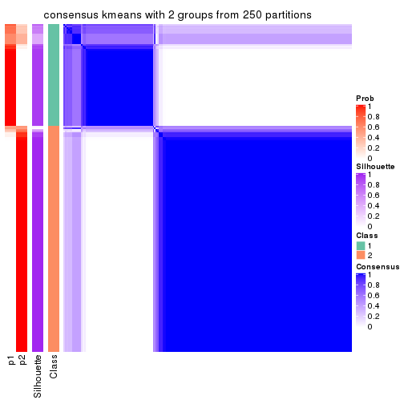</p>

</div>
<div id='tab-CV-kmeans-consensus-heatmap-2'>
<pre><code class="r">consensus_heatmap(res, k = 3)
</code></pre>

<p>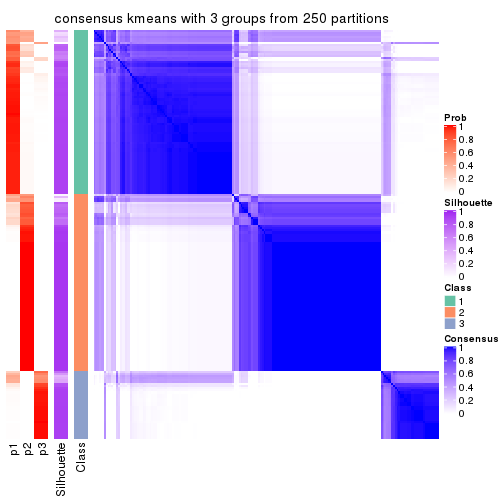</p>

</div>
<div id='tab-CV-kmeans-consensus-heatmap-3'>
<pre><code class="r">consensus_heatmap(res, k = 4)
</code></pre>

<p>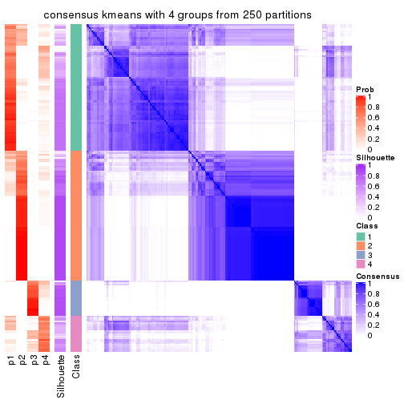</p>

</div>
<div id='tab-CV-kmeans-consensus-heatmap-4'>
<pre><code class="r">consensus_heatmap(res, k = 5)
</code></pre>

<p>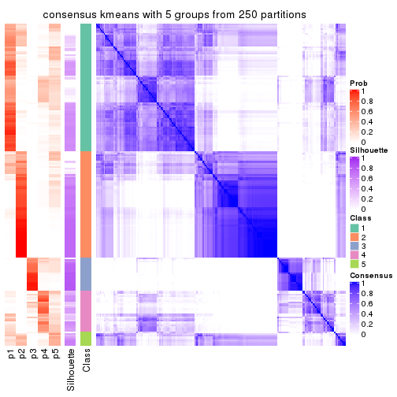</p>

</div>
<div id='tab-CV-kmeans-consensus-heatmap-5'>
<pre><code class="r">consensus_heatmap(res, k = 6)
</code></pre>

<p>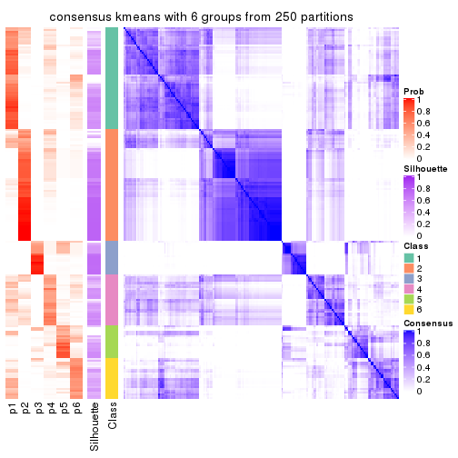</p>

</div>
</div>

Heatmaps for the membership of samples in all partitions to see how consistent they are:


<script>
$( function() {
	$( '#tabs-CV-kmeans-membership-heatmap' ).tabs();
} );
</script>
<div id='tabs-CV-kmeans-membership-heatmap'>
<ul>
<li><a href='#tab-CV-kmeans-membership-heatmap-1'>k = 2</a></li>
<li><a href='#tab-CV-kmeans-membership-heatmap-2'>k = 3</a></li>
<li><a href='#tab-CV-kmeans-membership-heatmap-3'>k = 4</a></li>
<li><a href='#tab-CV-kmeans-membership-heatmap-4'>k = 5</a></li>
<li><a href='#tab-CV-kmeans-membership-heatmap-5'>k = 6</a></li>
</ul>
<div id='tab-CV-kmeans-membership-heatmap-1'>
<pre><code class="r">membership_heatmap(res, k = 2)
</code></pre>

<p>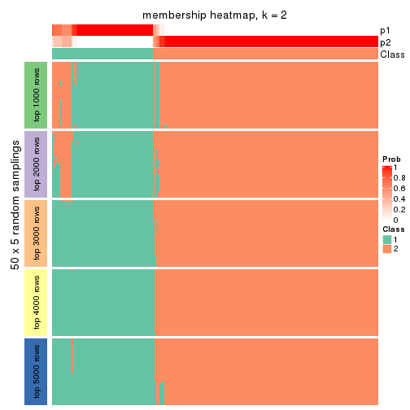</p>

</div>
<div id='tab-CV-kmeans-membership-heatmap-2'>
<pre><code class="r">membership_heatmap(res, k = 3)
</code></pre>

<p>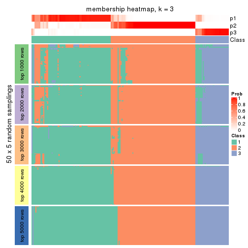</p>

</div>
<div id='tab-CV-kmeans-membership-heatmap-3'>
<pre><code class="r">membership_heatmap(res, k = 4)
</code></pre>

<p>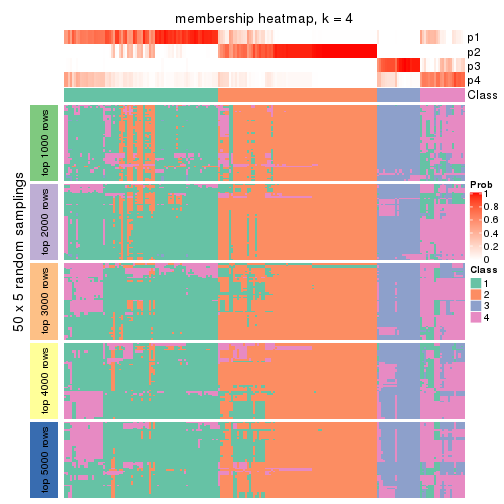</p>

</div>
<div id='tab-CV-kmeans-membership-heatmap-4'>
<pre><code class="r">membership_heatmap(res, k = 5)
</code></pre>

<p>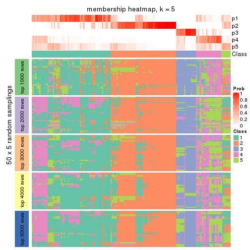</p>

</div>
<div id='tab-CV-kmeans-membership-heatmap-5'>
<pre><code class="r">membership_heatmap(res, k = 6)
</code></pre>

<p>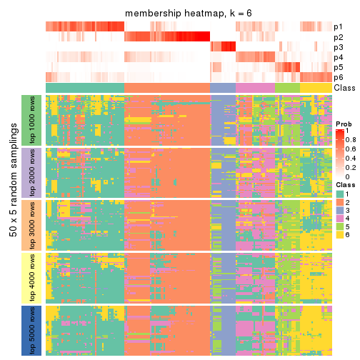</p>

</div>
</div>

As soon as we have had the classes for columns, we can look for signatures
which are significantly different between classes which can be candidate marks
for certain classes. Following are the heatmaps for signatures.


Signature heatmaps where rows are scaled:


<script>
$( function() {
	$( '#tabs-CV-kmeans-get-signatures' ).tabs();
} );
</script>
<div id='tabs-CV-kmeans-get-signatures'>
<ul>
<li><a href='#tab-CV-kmeans-get-signatures-1'>k = 2</a></li>
<li><a href='#tab-CV-kmeans-get-signatures-2'>k = 3</a></li>
<li><a href='#tab-CV-kmeans-get-signatures-3'>k = 4</a></li>
<li><a href='#tab-CV-kmeans-get-signatures-4'>k = 5</a></li>
<li><a href='#tab-CV-kmeans-get-signatures-5'>k = 6</a></li>
</ul>
<div id='tab-CV-kmeans-get-signatures-1'>
<pre><code class="r">get_signatures(res, k = 2)
</code></pre>

<p>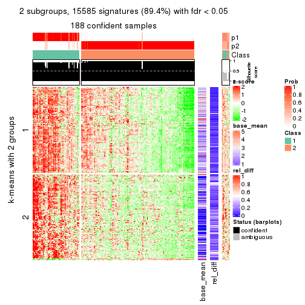</p>

</div>
<div id='tab-CV-kmeans-get-signatures-2'>
<pre><code class="r">get_signatures(res, k = 3)
</code></pre>

<p>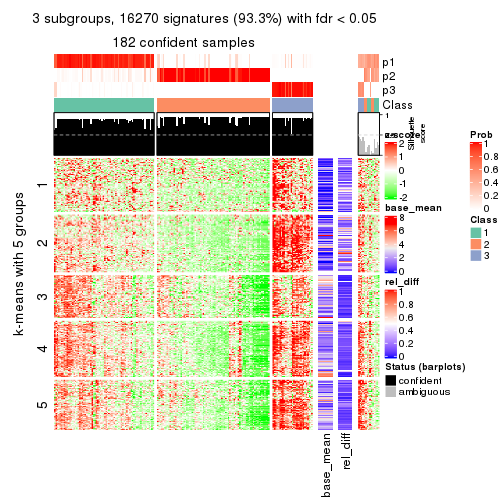</p>

</div>
<div id='tab-CV-kmeans-get-signatures-3'>
<pre><code class="r">get_signatures(res, k = 4)
</code></pre>

<p>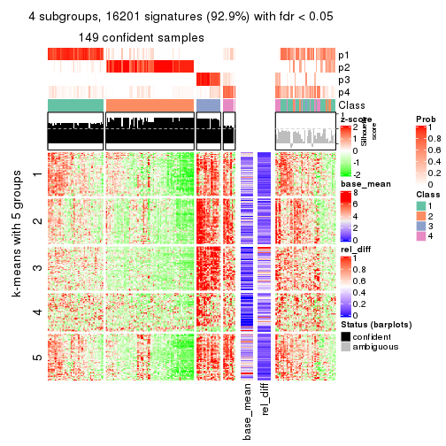</p>

</div>
<div id='tab-CV-kmeans-get-signatures-4'>
<pre><code class="r">get_signatures(res, k = 5)
</code></pre>

<p>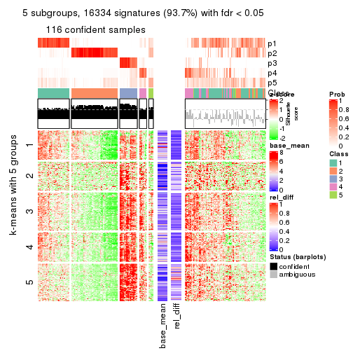</p>

</div>
<div id='tab-CV-kmeans-get-signatures-5'>
<pre><code class="r">get_signatures(res, k = 6)
</code></pre>

<p>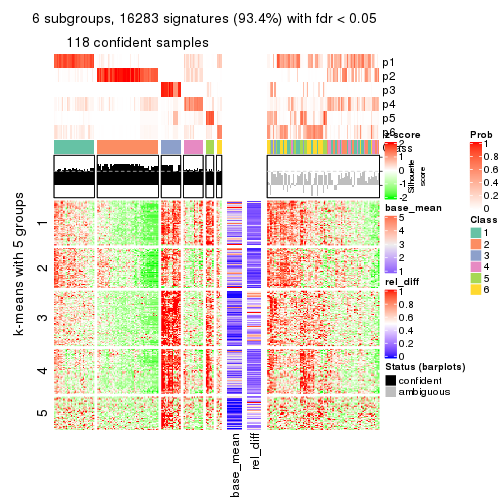</p>

</div>
</div>


Signature heatmaps where rows are not scaled:


<script>
$( function() {
	$( '#tabs-CV-kmeans-get-signatures-no-scale' ).tabs();
} );
</script>
<div id='tabs-CV-kmeans-get-signatures-no-scale'>
<ul>
<li><a href='#tab-CV-kmeans-get-signatures-no-scale-1'>k = 2</a></li>
<li><a href='#tab-CV-kmeans-get-signatures-no-scale-2'>k = 3</a></li>
<li><a href='#tab-CV-kmeans-get-signatures-no-scale-3'>k = 4</a></li>
<li><a href='#tab-CV-kmeans-get-signatures-no-scale-4'>k = 5</a></li>
<li><a href='#tab-CV-kmeans-get-signatures-no-scale-5'>k = 6</a></li>
</ul>
<div id='tab-CV-kmeans-get-signatures-no-scale-1'>
<pre><code class="r">get_signatures(res, k = 2, scale_rows = FALSE)
</code></pre>

<p>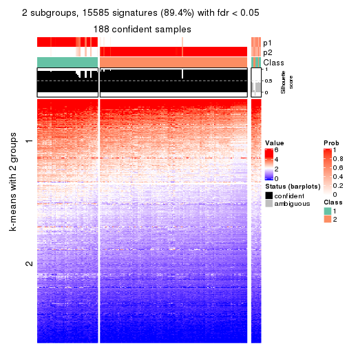</p>

</div>
<div id='tab-CV-kmeans-get-signatures-no-scale-2'>
<pre><code class="r">get_signatures(res, k = 3, scale_rows = FALSE)
</code></pre>

<p>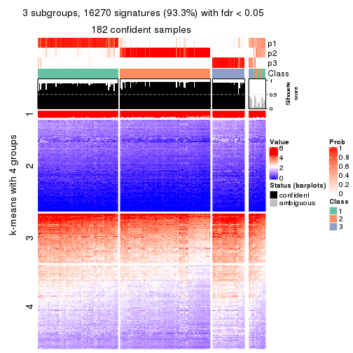</p>

</div>
<div id='tab-CV-kmeans-get-signatures-no-scale-3'>
<pre><code class="r">get_signatures(res, k = 4, scale_rows = FALSE)
</code></pre>

<p>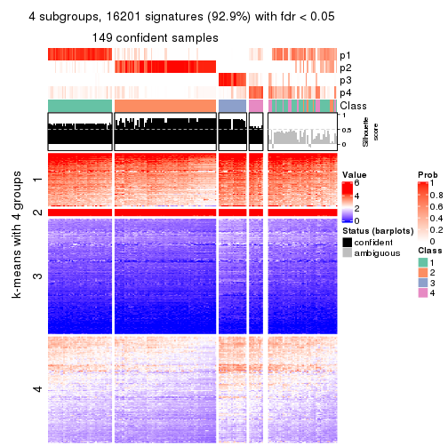</p>

</div>
<div id='tab-CV-kmeans-get-signatures-no-scale-4'>
<pre><code class="r">get_signatures(res, k = 5, scale_rows = FALSE)
</code></pre>

<p>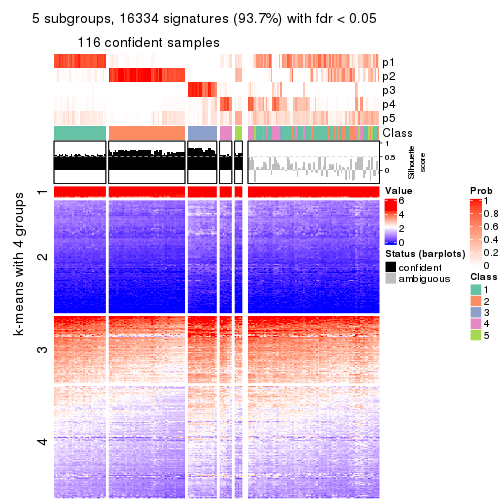</p>

</div>
<div id='tab-CV-kmeans-get-signatures-no-scale-5'>
<pre><code class="r">get_signatures(res, k = 6, scale_rows = FALSE)
</code></pre>

<p>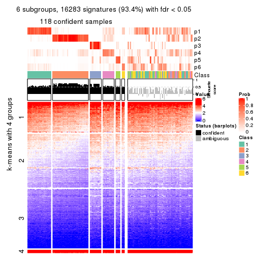</p>

</div>
</div>


Compare the overlap of signatures from different k:

```r
compare_signatures(res)
```

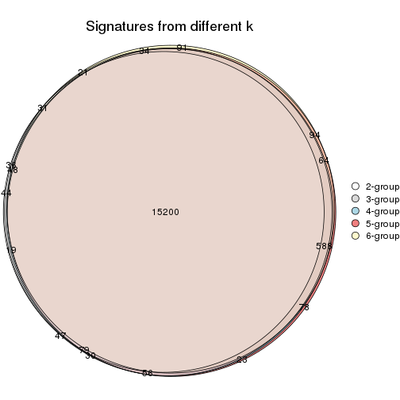

`get_signature()` returns a data frame invisibly. TO get the list of signatures, the function
call should be assigned to a variable explicitly. In following code, if `plot` argument is set
to `FALSE`, no heatmap is plotted while only the differential analysis is performed.

```r
# code only for demonstration
tb = get_signature(res, k = ..., plot = FALSE)
```

An example of the output of `tb` is:

```
#>   which_row         fdr    mean_1    mean_2 scaled_mean_1 scaled_mean_2 km
#> 1        38 0.042760348  8.373488  9.131774    -0.5533452     0.5164555  1
#> 2        40 0.018707592  7.106213  8.469186    -0.6173731     0.5762149  1
#> 3        55 0.019134737 10.221463 11.207825    -0.6159697     0.5749050  1
#> 4        59 0.006059896  5.921854  7.869574    -0.6899429     0.6439467  1
#> 5        60 0.018055526  8.928898 10.211722    -0.6204761     0.5791110  1
#> 6        98 0.009384629 15.714769 14.887706     0.6635654    -0.6193277  2
...
```

The columns in `tb` are:

1. `which_row`: row indices corresponding to the input matrix.
2. `fdr`: FDR for the differential test. 
3. `mean_x`: The mean value in group x.
4. `scaled_mean_x`: The mean value in group x after rows are scaled.
5. `km`: Row groups if k-means clustering is applied to rows.


UMAP plot which shows how samples are separated.


<script>
$( function() {
	$( '#tabs-CV-kmeans-dimension-reduction' ).tabs();
} );
</script>
<div id='tabs-CV-kmeans-dimension-reduction'>
<ul>
<li><a href='#tab-CV-kmeans-dimension-reduction-1'>k = 2</a></li>
<li><a href='#tab-CV-kmeans-dimension-reduction-2'>k = 3</a></li>
<li><a href='#tab-CV-kmeans-dimension-reduction-3'>k = 4</a></li>
<li><a href='#tab-CV-kmeans-dimension-reduction-4'>k = 5</a></li>
<li><a href='#tab-CV-kmeans-dimension-reduction-5'>k = 6</a></li>
</ul>
<div id='tab-CV-kmeans-dimension-reduction-1'>
<pre><code class="r">dimension_reduction(res, k = 2, method = &quot;UMAP&quot;)
</code></pre>

<p>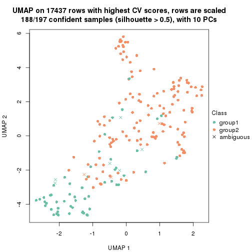</p>

</div>
<div id='tab-CV-kmeans-dimension-reduction-2'>
<pre><code class="r">dimension_reduction(res, k = 3, method = &quot;UMAP&quot;)
</code></pre>

<p>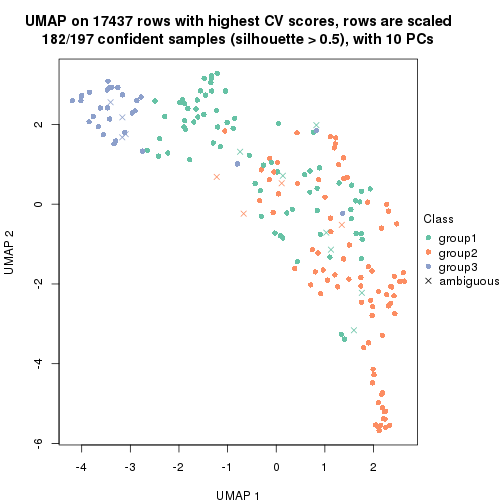</p>

</div>
<div id='tab-CV-kmeans-dimension-reduction-3'>
<pre><code class="r">dimension_reduction(res, k = 4, method = &quot;UMAP&quot;)
</code></pre>

<p>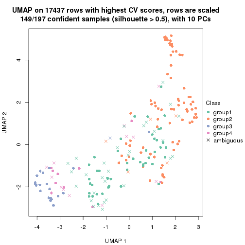</p>

</div>
<div id='tab-CV-kmeans-dimension-reduction-4'>
<pre><code class="r">dimension_reduction(res, k = 5, method = &quot;UMAP&quot;)
</code></pre>

<p>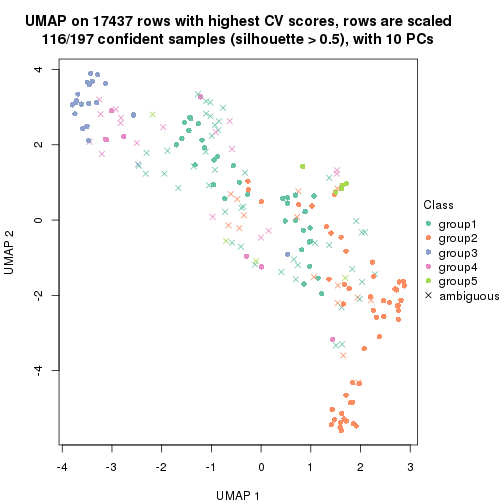</p>

</div>
<div id='tab-CV-kmeans-dimension-reduction-5'>
<pre><code class="r">dimension_reduction(res, k = 6, method = &quot;UMAP&quot;)
</code></pre>

<p>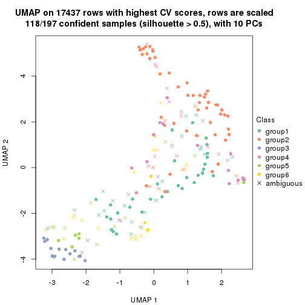</p>

</div>
</div>


Following heatmap shows how subgroups are split when increasing `k`:

```r
collect_classes(res)
```

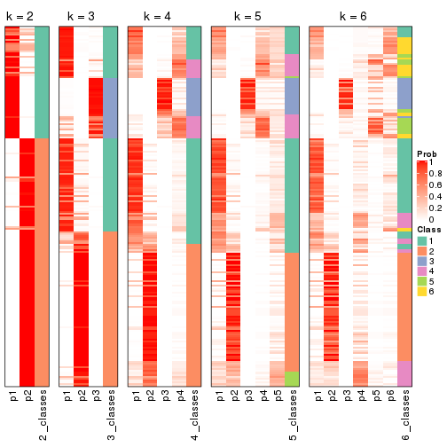


If matrix rows can be associated to genes, consider to use `GO_Enrichment(res,
...)` to perform function enrichment for the signature genes.


 

---------------------------------------------------


### CV:skmeans


The object with results only for a single top-value method and a single partition method 
can be extracted as:

```r
res = res_list["CV", "skmeans"]
# you can also extract it by
# res = res_list["CV:skmeans"]
```

A summary of `res` and all the functions that can be applied to it:

```r
res
```

```
#> A 'ConsensusPartition' object with k = 2, 3, 4, 5, 6.
#>   On a matrix with 17437 rows and 197 columns.
#>   Top rows (1000, 2000, 3000, 4000, 5000) are extracted by 'CV' method.
#>   Subgroups are detected by 'skmeans' method.
#>   Performed in total 1250 partitions by row resampling.
#>   Best k for subgroups seems to be 2.
#> 
#> Following methods can be applied to this 'ConsensusPartition' object:
#>  [1] "cola_report"             "collect_classes"         "collect_plots"          
#>  [4] "collect_stats"           "colnames"                "compare_signatures"     
#>  [7] "consensus_heatmap"       "dimension_reduction"     "functional_enrichment"  
#> [10] "get_anno_col"            "get_anno"                "get_classes"            
#> [13] "get_consensus"           "get_matrix"              "get_membership"         
#> [16] "get_param"               "get_signatures"          "get_stats"              
#> [19] "is_best_k"               "is_stable_k"             "membership_heatmap"     
#> [22] "ncol"                    "nrow"                    "plot_ecdf"              
#> [25] "rownames"                "select_partition_number" "show"                   
#> [28] "suggest_best_k"          "test_to_known_factors"
```

`collect_plots()` function collects all the plots made from `res` for all `k` (number of partitions)
into one single page to provide an easy and fast comparison between different `k`.

```r
collect_plots(res)
```

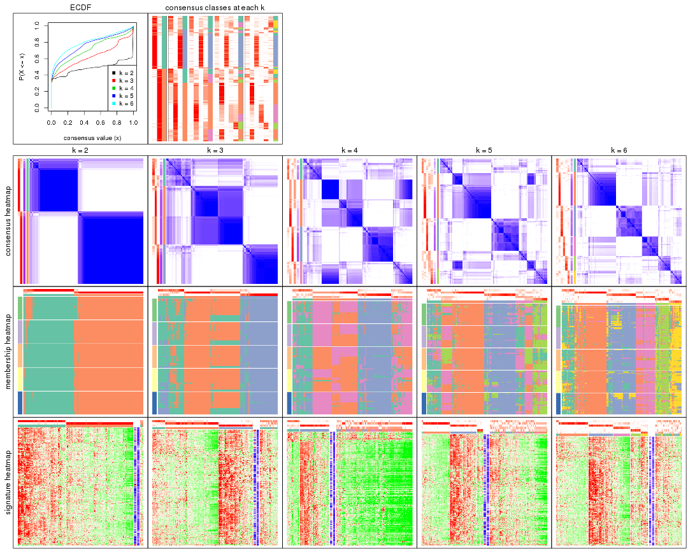

The plots are:

- The first row: a plot of the ECDF (Empirical cumulative distribution
  function) curves of the consensus matrix for each `k` and the heatmap of
  predicted classes for each `k`.
- The second row: heatmaps of the consensus matrix for each `k`.
- The third row: heatmaps of the membership matrix for each `k`.
- The fouth row: heatmaps of the signatures for each `k`.

All the plots in panels can be made by individual functions and they are
plotted later in this section.

`select_partition_number()` produces several plots showing different
statistics for choosing "optimized" `k`. There are following statistics:

- ECDF curves of the consensus matrix for each `k`;
- 1-PAC. [The PAC
  score](https://en.wikipedia.org/wiki/Consensus_clustering#Over-interpretation_potential_of_consensus_clustering)
  measures the proportion of the ambiguous subgrouping.
- Mean silhouette score.
- Concordance. The mean probability of fiting the consensus class ids in all
  partitions.
- Area increased. Denote $A_k$ as the area under the ECDF curve for current
  `k`, the area increased is defined as $A_k - A_{k-1}$.
- Rand index. The percent of pairs of samples that are both in a same cluster
  or both are not in a same cluster in the partition of k and k-1.
- Jaccard index. The ratio of pairs of samples are both in a same cluster in
  the partition of k and k-1 and the pairs of samples are both in a same
  cluster in the partition k or k-1.

The detailed explanations of these statistics can be found in [the cola
vignette](http://bioconductor.org/packages/devel/bioc/vignettes/cola/inst/doc/cola.html#toc_13).

Generally speaking, lower PAC score, higher mean silhouette score or higher
concordance corresponds to better partition. Rand index and Jaccard index
measure how similar the current partition is compared to partition with `k-1`.
If they are too similar, we won't accept `k` is better than `k-1`.

```r
select_partition_number(res)
```

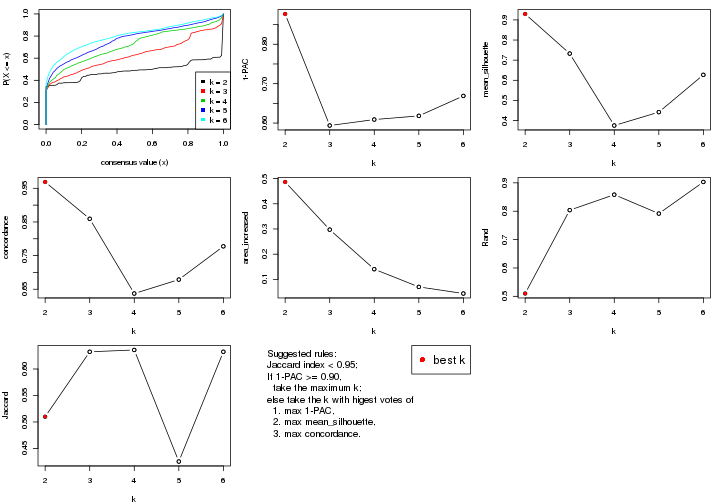

The numeric values for all these statistics can be obtained by `get_stats()`.

```r
get_stats(res)
```

```
#>   k 1-PAC mean_silhouette concordance area_increased  Rand Jaccard
#> 2 2 0.877           0.929       0.969         0.4864 0.510   0.510
#> 3 3 0.594           0.733       0.859         0.2974 0.804   0.632
#> 4 4 0.609           0.375       0.637         0.1405 0.858   0.636
#> 5 5 0.618           0.442       0.679         0.0703 0.792   0.425
#> 6 6 0.669           0.627       0.778         0.0442 0.903   0.632
```

`suggest_best_k()` suggests the best $k$ based on these statistics. The rules are as follows:

- All $k$ with Jaccard index larger than 0.95 are removed because the increase of
  the partition number does not provides enough extra information. If all $k$ are removed,
  the best $k$ is assigned by `NA`.
- For $k$ with 1-PAC larger than 0.9, the maximal $k$ is taken as the "best k". Other $k$ is called "optional k".
- If it does not fit the second rule. The $k$ with the highest vote of highest
  1-PAC, mean silhouette and concordance is taken as the "best k".

```r
suggest_best_k(res)
```

```
#> [1] 2
```


Following shows the table of the partitions (You need to click the **show/hide
code output** link to see it). The membership matrix (columns with name `p*`)
is inferred by
[`clue::cl_consensus()`](https://www.rdocumentation.org/link/cl_consensus?package=clue)
function with the `SE` method. Basically the value in the membership matrix
represents the probability to belong to a certain group. The finall class
label for an item is determined with the group with highest probability it
belongs to.

In `get_classes()` function, the entropy is calculated from the membership
matrix and the silhouette score is calculated from the consensus matrix.


<script>
$( function() {
	$( '#tabs-CV-skmeans-get-classes' ).tabs();
} );
</script>
<div id='tabs-CV-skmeans-get-classes'>
<ul>
<li><a href='#tab-CV-skmeans-get-classes-1'>k = 2</a></li>
<li><a href='#tab-CV-skmeans-get-classes-2'>k = 3</a></li>
<li><a href='#tab-CV-skmeans-get-classes-3'>k = 4</a></li>
<li><a href='#tab-CV-skmeans-get-classes-4'>k = 5</a></li>
<li><a href='#tab-CV-skmeans-get-classes-5'>k = 6</a></li>
</ul>

<div id='tab-CV-skmeans-get-classes-1'>
<p><a id='tab-CV-skmeans-get-classes-1-a' style='color:#0366d6' href='#'>show/hide code output</a></p>
<pre><code class="r">cbind(get_classes(res, k = 2), get_membership(res, k = 2))
</code></pre>

<pre><code>#&gt;            class entropy silhouette    p1    p2
#&gt; SRR1380886     1   0.000      0.947 1.000 0.000
#&gt; SRR1074385     1   0.722      0.770 0.800 0.200
#&gt; SRR1374739     1   0.000      0.947 1.000 0.000
#&gt; SRR1097883     1   0.311      0.907 0.944 0.056
#&gt; SRR2167209     2   0.000      0.982 0.000 1.000
#&gt; SRR816541      2   0.000      0.982 0.000 1.000
#&gt; SRR663645      2   0.000      0.982 0.000 1.000
#&gt; SRR1381505     2   0.000      0.982 0.000 1.000
#&gt; SRR1416362     2   0.000      0.982 0.000 1.000
#&gt; SRR1318503     2   0.000      0.982 0.000 1.000
#&gt; SRR1341626     2   0.000      0.982 0.000 1.000
#&gt; SRR1382440     1   0.000      0.947 1.000 0.000
#&gt; SRR1088413     1   0.000      0.947 1.000 0.000
#&gt; SRR1082080     2   0.000      0.982 0.000 1.000
#&gt; SRR1455783     2   0.689      0.756 0.184 0.816
#&gt; SRR1447760     2   0.000      0.982 0.000 1.000
#&gt; SRR1487784     2   0.000      0.982 0.000 1.000
#&gt; SRR1331037     2   0.000      0.982 0.000 1.000
#&gt; SRR1095651     1   0.000      0.947 1.000 0.000
#&gt; SRR1078066     2   0.722      0.743 0.200 0.800
#&gt; SRR1120363     2   0.000      0.982 0.000 1.000
#&gt; SRR821231      1   0.000      0.947 1.000 0.000
#&gt; SRR1374373     2   0.000      0.982 0.000 1.000
#&gt; SRR1324519     2   0.000      0.982 0.000 1.000
#&gt; SRR1431121     1   0.000      0.947 1.000 0.000
#&gt; SRR1091032     2   0.000      0.982 0.000 1.000
#&gt; SRR1365575     2   0.000      0.982 0.000 1.000
#&gt; SRR1072972     1   0.000      0.947 1.000 0.000
#&gt; SRR1310690     2   0.000      0.982 0.000 1.000
#&gt; SRR1383037     1   0.000      0.947 1.000 0.000
#&gt; SRR1095479     1   0.000      0.947 1.000 0.000
#&gt; SRR1070403     1   0.000      0.947 1.000 0.000
#&gt; SRR1390203     1   0.714      0.773 0.804 0.196
#&gt; SRR1072007     2   0.000      0.982 0.000 1.000
#&gt; SRR1468787     2   0.697      0.761 0.188 0.812
#&gt; SRR1347959     2   0.000      0.982 0.000 1.000
#&gt; SRR1338513     1   0.000      0.947 1.000 0.000
#&gt; SRR812598      2   0.000      0.982 0.000 1.000
#&gt; SRR1446806     1   0.802      0.710 0.756 0.244
#&gt; SRR1394275     1   0.985      0.324 0.572 0.428
#&gt; SRR1443633     1   0.000      0.947 1.000 0.000
#&gt; SRR1087728     1   0.000      0.947 1.000 0.000
#&gt; SRR1098192     2   0.000      0.982 0.000 1.000
#&gt; SRR1093340     2   0.000      0.982 0.000 1.000
#&gt; SRR665405      1   0.000      0.947 1.000 0.000
#&gt; SRR657077      2   0.000      0.982 0.000 1.000
#&gt; SRR813208      1   0.000      0.947 1.000 0.000
#&gt; SRR1416074     2   0.000      0.982 0.000 1.000
#&gt; SRR1089688     2   0.000      0.982 0.000 1.000
#&gt; SRR1353461     1   0.000      0.947 1.000 0.000
#&gt; SRR1466321     2   0.000      0.982 0.000 1.000
#&gt; SRR1073021     2   0.000      0.982 0.000 1.000
#&gt; SRR1322816     2   0.000      0.982 0.000 1.000
#&gt; SRR1457727     1   0.000      0.947 1.000 0.000
#&gt; SRR1464226     1   0.722      0.768 0.800 0.200
#&gt; SRR1398863     1   0.000      0.947 1.000 0.000
#&gt; SRR1455631     2   0.000      0.982 0.000 1.000
#&gt; SRR1307808     2   0.000      0.982 0.000 1.000
#&gt; SRR1374585     2   0.000      0.982 0.000 1.000
#&gt; SRR1072104     2   0.000      0.982 0.000 1.000
#&gt; SRR1076868     2   0.000      0.982 0.000 1.000
#&gt; SRR1335984     2   0.689      0.767 0.184 0.816
#&gt; SRR1445939     1   0.000      0.947 1.000 0.000
#&gt; SRR1453047     2   0.000      0.982 0.000 1.000
#&gt; SRR1339788     1   0.000      0.947 1.000 0.000
#&gt; SRR1084323     1   0.000      0.947 1.000 0.000
#&gt; SRR1092937     1   0.000      0.947 1.000 0.000
#&gt; SRR1074090     2   0.000      0.982 0.000 1.000
#&gt; SRR1099833     1   0.000      0.947 1.000 0.000
#&gt; SRR1093434     1   0.000      0.947 1.000 0.000
#&gt; SRR1435857     2   0.443      0.884 0.092 0.908
#&gt; SRR1480347     2   0.000      0.982 0.000 1.000
#&gt; SRR1440787     2   0.000      0.982 0.000 1.000
#&gt; SRR1430202     2   0.000      0.982 0.000 1.000
#&gt; SRR1322730     2   0.000      0.982 0.000 1.000
#&gt; SRR811029      2   0.000      0.982 0.000 1.000
#&gt; SRR1390456     1   0.000      0.947 1.000 0.000
#&gt; SRR1381140     1   0.000      0.947 1.000 0.000
#&gt; SRR1388064     2   0.000      0.982 0.000 1.000
#&gt; SRR1093577     2   0.000      0.982 0.000 1.000
#&gt; SRR1414161     2   0.000      0.982 0.000 1.000
#&gt; SRR1328738     2   0.000      0.982 0.000 1.000
#&gt; SRR1311752     2   0.000      0.982 0.000 1.000
#&gt; SRR1445960     2   0.000      0.982 0.000 1.000
#&gt; SRR1403412     2   0.000      0.982 0.000 1.000
#&gt; SRR2166748     1   0.000      0.947 1.000 0.000
#&gt; SRR821666      2   0.000      0.982 0.000 1.000
#&gt; SRR1330746     1   0.000      0.947 1.000 0.000
#&gt; SRR1327872     2   0.000      0.982 0.000 1.000
#&gt; SRR1100800     2   0.000      0.982 0.000 1.000
#&gt; SRR1075174     1   0.000      0.947 1.000 0.000
#&gt; SRR1434436     2   0.000      0.982 0.000 1.000
#&gt; SRR1389409     2   0.000      0.982 0.000 1.000
#&gt; SRR1085310     1   0.000      0.947 1.000 0.000
#&gt; SRR1376718     2   0.000      0.982 0.000 1.000
#&gt; SRR808590      2   0.000      0.982 0.000 1.000
#&gt; SRR1084128     2   0.000      0.982 0.000 1.000
#&gt; SRR1361692     2   0.000      0.982 0.000 1.000
#&gt; SRR1431493     1   0.000      0.947 1.000 0.000
#&gt; SRR1409084     1   0.000      0.947 1.000 0.000
#&gt; SRR2166214     1   0.000      0.947 1.000 0.000
#&gt; SRR1324102     2   0.000      0.982 0.000 1.000
#&gt; SRR1079754     2   0.000      0.982 0.000 1.000
#&gt; SRR1442127     1   0.000      0.947 1.000 0.000
#&gt; SRR1076244     1   0.998      0.121 0.524 0.476
#&gt; SRR1330901     2   0.000      0.982 0.000 1.000
#&gt; SRR1073167     2   0.000      0.982 0.000 1.000
#&gt; SRR1357541     1   0.904      0.569 0.680 0.320
#&gt; SRR811607      2   0.000      0.982 0.000 1.000
#&gt; SRR1468931     1   0.000      0.947 1.000 0.000
#&gt; SRR1474908     2   0.949      0.365 0.368 0.632
#&gt; SRR1309875     2   0.000      0.982 0.000 1.000
#&gt; SRR598792      1   0.000      0.947 1.000 0.000
#&gt; SRR1088537     2   0.000      0.982 0.000 1.000
#&gt; SRR1457682     1   0.971      0.401 0.600 0.400
#&gt; SRR1454289     2   0.000      0.982 0.000 1.000
#&gt; SRR1069352     1   0.000      0.947 1.000 0.000
#&gt; SRR1472728     2   0.000      0.982 0.000 1.000
#&gt; SRR1091144     2   0.000      0.982 0.000 1.000
#&gt; SRR1319118     1   0.000      0.947 1.000 0.000
#&gt; SRR1403611     1   0.000      0.947 1.000 0.000
#&gt; SRR1397762     1   0.680      0.791 0.820 0.180
#&gt; SRR1317387     1   0.000      0.947 1.000 0.000
#&gt; SRR1376426     2   0.000      0.982 0.000 1.000
#&gt; SRR1097777     1   0.000      0.947 1.000 0.000
#&gt; SRR1365743     1   0.000      0.947 1.000 0.000
#&gt; SRR1458992     2   0.000      0.982 0.000 1.000
#&gt; SRR1089537     2   0.000      0.982 0.000 1.000
#&gt; SRR1397744     1   0.781      0.727 0.768 0.232
#&gt; SRR1453893     2   0.000      0.982 0.000 1.000
#&gt; SRR1098543     1   0.722      0.768 0.800 0.200
#&gt; SRR1321765     2   0.000      0.982 0.000 1.000
#&gt; SRR1440032     2   0.000      0.982 0.000 1.000
#&gt; SRR1404507     2   0.000      0.982 0.000 1.000
#&gt; SRR1404856     2   0.000      0.982 0.000 1.000
#&gt; SRR812745      1   0.722      0.768 0.800 0.200
#&gt; SRR1417524     1   0.000      0.947 1.000 0.000
#&gt; SRR1407334     2   0.000      0.982 0.000 1.000
#&gt; SRR1453991     2   0.000      0.982 0.000 1.000
#&gt; SRR1415938     1   0.000      0.947 1.000 0.000
#&gt; SRR1081259     2   0.000      0.982 0.000 1.000
#&gt; SRR1436187     2   0.000      0.982 0.000 1.000
#&gt; SRR1431948     1   0.000      0.947 1.000 0.000
#&gt; SRR1453277     2   0.000      0.982 0.000 1.000
#&gt; SRR1095407     2   0.000      0.982 0.000 1.000
#&gt; SRR1359694     2   0.000      0.982 0.000 1.000
#&gt; SRR656982      2   0.730      0.737 0.204 0.796
#&gt; SRR1354338     2   0.000      0.982 0.000 1.000
#&gt; SRR1088291     2   0.358      0.913 0.068 0.932
#&gt; SRR1080624     2   0.000      0.982 0.000 1.000
#&gt; SRR2166708     1   0.000      0.947 1.000 0.000
#&gt; SRR1393572     2   0.000      0.982 0.000 1.000
#&gt; SRR1429912     2   0.000      0.982 0.000 1.000
#&gt; SRR1421048     2   0.000      0.982 0.000 1.000
#&gt; SRR1434999     1   0.000      0.947 1.000 0.000
#&gt; SRR656457      1   0.000      0.947 1.000 0.000
#&gt; SRR1098928     1   0.000      0.947 1.000 0.000
#&gt; SRR1343967     2   0.000      0.982 0.000 1.000
#&gt; SRR1360766     1   0.358      0.895 0.932 0.068
#&gt; SRR1464724     2   0.141      0.963 0.020 0.980
#&gt; SRR1101542     2   0.000      0.982 0.000 1.000
#&gt; SRR1401528     1   0.000      0.947 1.000 0.000
#&gt; SRR1071519     1   0.000      0.947 1.000 0.000
#&gt; SRR1086070     1   0.000      0.947 1.000 0.000
#&gt; SRR1358645     2   0.000      0.982 0.000 1.000
#&gt; SRR819771      1   0.000      0.947 1.000 0.000
#&gt; SRR1418433     1   0.000      0.947 1.000 0.000
#&gt; SRR821050      1   0.000      0.947 1.000 0.000
#&gt; SRR1402091     2   0.141      0.963 0.020 0.980
#&gt; SRR1322028     2   0.000      0.982 0.000 1.000
#&gt; SRR1452556     2   0.000      0.982 0.000 1.000
#&gt; SRR1340047     2   0.141      0.964 0.020 0.980
#&gt; SRR1418302     2   0.000      0.982 0.000 1.000
#&gt; SRR1073991     1   0.000      0.947 1.000 0.000
#&gt; SRR1085187     2   0.000      0.982 0.000 1.000
#&gt; SRR1357618     1   0.000      0.947 1.000 0.000
#&gt; SRR1487764     1   0.000      0.947 1.000 0.000
#&gt; SRR1075336     2   0.961      0.370 0.384 0.616
#&gt; SRR1365471     2   0.000      0.982 0.000 1.000
#&gt; SRR1414613     2   0.000      0.982 0.000 1.000
#&gt; SRR658719      1   0.000      0.947 1.000 0.000
#&gt; SRR1475128     1   0.000      0.947 1.000 0.000
#&gt; SRR1367630     2   0.000      0.982 0.000 1.000
#&gt; SRR1481146     2   0.000      0.982 0.000 1.000
#&gt; SRR1465674     2   0.000      0.982 0.000 1.000
#&gt; SRR1327303     1   0.738      0.738 0.792 0.208
#&gt; SRR1390391     1   0.781      0.727 0.768 0.232
#&gt; SRR1326020     1   0.343      0.898 0.936 0.064
#&gt; SRR1381953     1   0.000      0.947 1.000 0.000
#&gt; SRR1082544     2   0.000      0.982 0.000 1.000
#&gt; SRR810761      1   0.000      0.947 1.000 0.000
#&gt; SRR1070764     1   0.000      0.947 1.000 0.000
#&gt; SRR1415919     1   0.000      0.947 1.000 0.000
#&gt; SRR1490404     2   0.000      0.982 0.000 1.000
#&gt; SRR1416773     2   0.000      0.982 0.000 1.000
#&gt; SRR1377492     1   0.871      0.600 0.708 0.292
#&gt; SRR1334314     2   0.000      0.982 0.000 1.000
</code></pre>

<script>
$('#tab-CV-skmeans-get-classes-1-a').parent().next().next().hide();
$('#tab-CV-skmeans-get-classes-1-a').click(function(){
  $('#tab-CV-skmeans-get-classes-1-a').parent().next().next().toggle();
  return(false);
});
</script>
</div>

<div id='tab-CV-skmeans-get-classes-2'>
<p><a id='tab-CV-skmeans-get-classes-2-a' style='color:#0366d6' href='#'>show/hide code output</a></p>
<pre><code class="r">cbind(get_classes(res, k = 3), get_membership(res, k = 3))
</code></pre>

<pre><code>#&gt;            class entropy silhouette    p1    p2    p3
#&gt; SRR1380886     3  0.2165     0.8630 0.064 0.000 0.936
#&gt; SRR1074385     1  0.3213     0.6542 0.900 0.008 0.092
#&gt; SRR1374739     3  0.0237     0.9026 0.004 0.000 0.996
#&gt; SRR1097883     1  0.4121     0.5692 0.832 0.000 0.168
#&gt; SRR2167209     2  0.1529     0.8169 0.040 0.960 0.000
#&gt; SRR816541      2  0.4346     0.8480 0.184 0.816 0.000
#&gt; SRR663645      2  0.0237     0.8386 0.004 0.996 0.000
#&gt; SRR1381505     2  0.0000     0.8402 0.000 1.000 0.000
#&gt; SRR1416362     2  0.4346     0.8480 0.184 0.816 0.000
#&gt; SRR1318503     2  0.4555     0.8363 0.200 0.800 0.000
#&gt; SRR1341626     2  0.4346     0.8480 0.184 0.816 0.000
#&gt; SRR1382440     3  0.0000     0.9033 0.000 0.000 1.000
#&gt; SRR1088413     3  0.5254     0.6518 0.264 0.000 0.736
#&gt; SRR1082080     2  0.4346     0.8480 0.184 0.816 0.000
#&gt; SRR1455783     1  0.3213     0.6749 0.900 0.092 0.008
#&gt; SRR1447760     2  0.0237     0.8384 0.004 0.996 0.000
#&gt; SRR1487784     2  0.4346     0.8480 0.184 0.816 0.000
#&gt; SRR1331037     2  0.4346     0.8480 0.184 0.816 0.000
#&gt; SRR1095651     3  0.0000     0.9033 0.000 0.000 1.000
#&gt; SRR1078066     2  0.6349     0.5772 0.080 0.764 0.156
#&gt; SRR1120363     1  0.5216     0.4825 0.740 0.260 0.000
#&gt; SRR821231      3  0.0237     0.9026 0.004 0.000 0.996
#&gt; SRR1374373     2  0.4346     0.8480 0.184 0.816 0.000
#&gt; SRR1324519     2  0.4346     0.8480 0.184 0.816 0.000
#&gt; SRR1431121     1  0.5785     0.4117 0.668 0.000 0.332
#&gt; SRR1091032     2  0.5291     0.7562 0.268 0.732 0.000
#&gt; SRR1365575     2  0.0000     0.8402 0.000 1.000 0.000
#&gt; SRR1072972     3  0.0424     0.8997 0.008 0.000 0.992
#&gt; SRR1310690     2  0.4346     0.8480 0.184 0.816 0.000
#&gt; SRR1383037     3  0.0000     0.9033 0.000 0.000 1.000
#&gt; SRR1095479     3  0.3038     0.8121 0.104 0.000 0.896
#&gt; SRR1070403     3  0.0237     0.9026 0.004 0.000 0.996
#&gt; SRR1390203     1  0.5881     0.5451 0.728 0.016 0.256
#&gt; SRR1072007     2  0.0424     0.8364 0.008 0.992 0.000
#&gt; SRR1468787     2  0.4786     0.6756 0.044 0.844 0.112
#&gt; SRR1347959     2  0.4346     0.8480 0.184 0.816 0.000
#&gt; SRR1338513     3  0.0000     0.9033 0.000 0.000 1.000
#&gt; SRR812598      2  0.4346     0.8480 0.184 0.816 0.000
#&gt; SRR1446806     1  0.3832     0.6496 0.880 0.020 0.100
#&gt; SRR1394275     1  0.0661     0.6714 0.988 0.004 0.008
#&gt; SRR1443633     3  0.1643     0.8799 0.044 0.000 0.956
#&gt; SRR1087728     3  0.0000     0.9033 0.000 0.000 1.000
#&gt; SRR1098192     2  0.4346     0.8480 0.184 0.816 0.000
#&gt; SRR1093340     2  0.4346     0.8480 0.184 0.816 0.000
#&gt; SRR665405      3  0.7784     0.1924 0.388 0.056 0.556
#&gt; SRR657077      2  0.0424     0.8419 0.008 0.992 0.000
#&gt; SRR813208      3  0.0000     0.9033 0.000 0.000 1.000
#&gt; SRR1416074     2  0.4346     0.8480 0.184 0.816 0.000
#&gt; SRR1089688     2  0.0000     0.8402 0.000 1.000 0.000
#&gt; SRR1353461     3  0.0000     0.9033 0.000 0.000 1.000
#&gt; SRR1466321     1  0.2261     0.6816 0.932 0.068 0.000
#&gt; SRR1073021     2  0.4291     0.8154 0.180 0.820 0.000
#&gt; SRR1322816     2  0.4346     0.8480 0.184 0.816 0.000
#&gt; SRR1457727     3  0.6244     0.2658 0.440 0.000 0.560
#&gt; SRR1464226     1  0.9220     0.3467 0.468 0.156 0.376
#&gt; SRR1398863     3  0.5016     0.6714 0.240 0.000 0.760
#&gt; SRR1455631     2  0.0000     0.8402 0.000 1.000 0.000
#&gt; SRR1307808     2  0.4346     0.8480 0.184 0.816 0.000
#&gt; SRR1374585     2  0.0000     0.8402 0.000 1.000 0.000
#&gt; SRR1072104     2  0.0000     0.8402 0.000 1.000 0.000
#&gt; SRR1076868     2  0.4346     0.8480 0.184 0.816 0.000
#&gt; SRR1335984     1  0.6673     0.3176 0.636 0.344 0.020
#&gt; SRR1445939     1  0.5835     0.4411 0.660 0.000 0.340
#&gt; SRR1453047     2  0.6180     0.4504 0.416 0.584 0.000
#&gt; SRR1339788     3  0.1753     0.8759 0.048 0.000 0.952
#&gt; SRR1084323     3  0.0237     0.9014 0.004 0.000 0.996
#&gt; SRR1092937     3  0.0000     0.9033 0.000 0.000 1.000
#&gt; SRR1074090     2  0.4346     0.8480 0.184 0.816 0.000
#&gt; SRR1099833     3  0.0000     0.9033 0.000 0.000 1.000
#&gt; SRR1093434     3  0.0237     0.9026 0.004 0.000 0.996
#&gt; SRR1435857     1  0.0747     0.6762 0.984 0.016 0.000
#&gt; SRR1480347     2  0.4346     0.8480 0.184 0.816 0.000
#&gt; SRR1440787     2  0.0000     0.8402 0.000 1.000 0.000
#&gt; SRR1430202     1  0.5138     0.5202 0.748 0.252 0.000
#&gt; SRR1322730     2  0.0000     0.8402 0.000 1.000 0.000
#&gt; SRR811029      1  0.5948     0.3187 0.640 0.360 0.000
#&gt; SRR1390456     3  0.0000     0.9033 0.000 0.000 1.000
#&gt; SRR1381140     1  0.6295     0.1125 0.528 0.000 0.472
#&gt; SRR1388064     2  0.0000     0.8402 0.000 1.000 0.000
#&gt; SRR1093577     2  0.5016     0.8153 0.240 0.760 0.000
#&gt; SRR1414161     2  0.5760     0.6682 0.328 0.672 0.000
#&gt; SRR1328738     1  0.5497     0.4146 0.708 0.292 0.000
#&gt; SRR1311752     2  0.4346     0.8480 0.184 0.816 0.000
#&gt; SRR1445960     2  0.4504     0.8389 0.196 0.804 0.000
#&gt; SRR1403412     1  0.5733     0.4005 0.676 0.324 0.000
#&gt; SRR2166748     3  0.3879     0.7568 0.152 0.000 0.848
#&gt; SRR821666      2  0.0000     0.8402 0.000 1.000 0.000
#&gt; SRR1330746     3  0.0237     0.9026 0.004 0.000 0.996
#&gt; SRR1327872     2  0.0000     0.8402 0.000 1.000 0.000
#&gt; SRR1100800     1  0.4796     0.5418 0.780 0.220 0.000
#&gt; SRR1075174     1  0.6295     0.1023 0.528 0.000 0.472
#&gt; SRR1434436     1  0.1860     0.6832 0.948 0.052 0.000
#&gt; SRR1389409     2  0.0000     0.8402 0.000 1.000 0.000
#&gt; SRR1085310     1  0.6244     0.2206 0.560 0.000 0.440
#&gt; SRR1376718     2  0.0000     0.8402 0.000 1.000 0.000
#&gt; SRR808590      2  0.0000     0.8402 0.000 1.000 0.000
#&gt; SRR1084128     2  0.4346     0.8480 0.184 0.816 0.000
#&gt; SRR1361692     2  0.1031     0.8296 0.024 0.976 0.000
#&gt; SRR1431493     3  0.0000     0.9033 0.000 0.000 1.000
#&gt; SRR1409084     3  0.5835     0.4189 0.340 0.000 0.660
#&gt; SRR2166214     3  0.7784     0.1924 0.388 0.056 0.556
#&gt; SRR1324102     2  0.4346     0.8480 0.184 0.816 0.000
#&gt; SRR1079754     2  0.4002     0.8494 0.160 0.840 0.000
#&gt; SRR1442127     3  0.0000     0.9033 0.000 0.000 1.000
#&gt; SRR1076244     3  0.6468     0.2047 0.004 0.444 0.552
#&gt; SRR1330901     2  0.4346     0.8480 0.184 0.816 0.000
#&gt; SRR1073167     2  0.4346     0.8480 0.184 0.816 0.000
#&gt; SRR1357541     1  0.8614     0.4793 0.600 0.172 0.228
#&gt; SRR811607      1  0.6307    -0.2412 0.512 0.488 0.000
#&gt; SRR1468931     3  0.0237     0.9026 0.004 0.000 0.996
#&gt; SRR1474908     1  0.1999     0.6798 0.952 0.036 0.012
#&gt; SRR1309875     1  0.5882     0.3458 0.652 0.348 0.000
#&gt; SRR598792      3  0.0000     0.9033 0.000 0.000 1.000
#&gt; SRR1088537     2  0.4346     0.8480 0.184 0.816 0.000
#&gt; SRR1457682     1  0.5356     0.6123 0.784 0.020 0.196
#&gt; SRR1454289     2  0.4399     0.8456 0.188 0.812 0.000
#&gt; SRR1069352     3  0.0237     0.9026 0.004 0.000 0.996
#&gt; SRR1472728     2  0.4346     0.8480 0.184 0.816 0.000
#&gt; SRR1091144     2  0.0892     0.8298 0.020 0.980 0.000
#&gt; SRR1319118     3  0.3686     0.7895 0.140 0.000 0.860
#&gt; SRR1403611     3  0.0237     0.9014 0.004 0.000 0.996
#&gt; SRR1397762     1  0.6750     0.4576 0.640 0.024 0.336
#&gt; SRR1317387     3  0.0000     0.9033 0.000 0.000 1.000
#&gt; SRR1376426     2  0.4346     0.8480 0.184 0.816 0.000
#&gt; SRR1097777     3  0.5810     0.5086 0.336 0.000 0.664
#&gt; SRR1365743     3  0.0000     0.9033 0.000 0.000 1.000
#&gt; SRR1458992     2  0.4504     0.8389 0.196 0.804 0.000
#&gt; SRR1089537     2  0.1636     0.8197 0.020 0.964 0.016
#&gt; SRR1397744     1  0.4291     0.6101 0.820 0.000 0.180
#&gt; SRR1453893     2  0.0000     0.8402 0.000 1.000 0.000
#&gt; SRR1098543     1  0.5092     0.6237 0.804 0.020 0.176
#&gt; SRR1321765     2  0.1860     0.8092 0.052 0.948 0.000
#&gt; SRR1440032     2  0.3267     0.7382 0.116 0.884 0.000
#&gt; SRR1404507     2  0.0000     0.8402 0.000 1.000 0.000
#&gt; SRR1404856     2  0.1411     0.8198 0.036 0.964 0.000
#&gt; SRR812745      1  0.6726     0.4632 0.644 0.024 0.332
#&gt; SRR1417524     3  0.0237     0.9026 0.004 0.000 0.996
#&gt; SRR1407334     2  0.0000     0.8402 0.000 1.000 0.000
#&gt; SRR1453991     1  0.1163     0.6803 0.972 0.028 0.000
#&gt; SRR1415938     1  0.6154     0.2906 0.592 0.000 0.408
#&gt; SRR1081259     2  0.5291     0.7634 0.268 0.732 0.000
#&gt; SRR1436187     2  0.0000     0.8402 0.000 1.000 0.000
#&gt; SRR1431948     3  0.0000     0.9033 0.000 0.000 1.000
#&gt; SRR1453277     2  0.6260     0.4122 0.448 0.552 0.000
#&gt; SRR1095407     2  0.1529     0.8169 0.040 0.960 0.000
#&gt; SRR1359694     2  0.4346     0.8480 0.184 0.816 0.000
#&gt; SRR656982      2  0.6148     0.4951 0.028 0.728 0.244
#&gt; SRR1354338     2  0.0000     0.8402 0.000 1.000 0.000
#&gt; SRR1088291     1  0.4702     0.5610 0.788 0.212 0.000
#&gt; SRR1080624     2  0.4555     0.8420 0.200 0.800 0.000
#&gt; SRR2166708     3  0.0237     0.9026 0.004 0.000 0.996
#&gt; SRR1393572     2  0.5621     0.7064 0.308 0.692 0.000
#&gt; SRR1429912     1  0.6295    -0.0874 0.528 0.472 0.000
#&gt; SRR1421048     2  0.4399     0.8468 0.188 0.812 0.000
#&gt; SRR1434999     3  0.0237     0.9026 0.004 0.000 0.996
#&gt; SRR656457      3  0.1163     0.8895 0.028 0.000 0.972
#&gt; SRR1098928     3  0.0000     0.9033 0.000 0.000 1.000
#&gt; SRR1343967     2  0.4346     0.8480 0.184 0.816 0.000
#&gt; SRR1360766     3  0.5216     0.6411 0.260 0.000 0.740
#&gt; SRR1464724     2  0.0747     0.8306 0.000 0.984 0.016
#&gt; SRR1101542     2  0.0000     0.8402 0.000 1.000 0.000
#&gt; SRR1401528     3  0.0000     0.9033 0.000 0.000 1.000
#&gt; SRR1071519     3  0.0000     0.9033 0.000 0.000 1.000
#&gt; SRR1086070     3  0.1163     0.8878 0.028 0.000 0.972
#&gt; SRR1358645     1  0.6302    -0.1299 0.520 0.480 0.000
#&gt; SRR819771      3  0.0000     0.9033 0.000 0.000 1.000
#&gt; SRR1418433     3  0.3551     0.7809 0.132 0.000 0.868
#&gt; SRR821050      1  0.4346     0.5405 0.816 0.000 0.184
#&gt; SRR1402091     2  0.5061     0.8253 0.208 0.784 0.008
#&gt; SRR1322028     2  0.4346     0.8480 0.184 0.816 0.000
#&gt; SRR1452556     2  0.0000     0.8402 0.000 1.000 0.000
#&gt; SRR1340047     1  0.6284     0.4297 0.680 0.304 0.016
#&gt; SRR1418302     1  0.5810     0.3740 0.664 0.336 0.000
#&gt; SRR1073991     1  0.6192     0.1491 0.580 0.000 0.420
#&gt; SRR1085187     2  0.0747     0.8321 0.016 0.984 0.000
#&gt; SRR1357618     3  0.1860     0.8742 0.052 0.000 0.948
#&gt; SRR1487764     3  0.0000     0.9033 0.000 0.000 1.000
#&gt; SRR1075336     1  0.6239     0.6153 0.768 0.160 0.072
#&gt; SRR1365471     2  0.4346     0.8480 0.184 0.816 0.000
#&gt; SRR1414613     2  0.4452     0.8420 0.192 0.808 0.000
#&gt; SRR658719      3  0.0000     0.9033 0.000 0.000 1.000
#&gt; SRR1475128     3  0.0237     0.9026 0.004 0.000 0.996
#&gt; SRR1367630     2  0.0000     0.8402 0.000 1.000 0.000
#&gt; SRR1481146     2  0.0000     0.8402 0.000 1.000 0.000
#&gt; SRR1465674     2  0.1643     0.8144 0.044 0.956 0.000
#&gt; SRR1327303     3  0.5881     0.6158 0.256 0.016 0.728
#&gt; SRR1390391     1  0.3637     0.6609 0.892 0.024 0.084
#&gt; SRR1326020     3  0.5420     0.6557 0.240 0.008 0.752
#&gt; SRR1381953     3  0.1163     0.8893 0.028 0.000 0.972
#&gt; SRR1082544     2  0.0237     0.8411 0.004 0.996 0.000
#&gt; SRR810761      3  0.0424     0.9010 0.008 0.000 0.992
#&gt; SRR1070764     3  0.0000     0.9033 0.000 0.000 1.000
#&gt; SRR1415919     3  0.0000     0.9033 0.000 0.000 1.000
#&gt; SRR1490404     2  0.4346     0.8480 0.184 0.816 0.000
#&gt; SRR1416773     2  0.1411     0.8198 0.036 0.964 0.000
#&gt; SRR1377492     3  0.5692     0.5236 0.008 0.268 0.724
#&gt; SRR1334314     1  0.4575     0.6062 0.812 0.184 0.004
</code></pre>

<script>
$('#tab-CV-skmeans-get-classes-2-a').parent().next().next().hide();
$('#tab-CV-skmeans-get-classes-2-a').click(function(){
  $('#tab-CV-skmeans-get-classes-2-a').parent().next().next().toggle();
  return(false);
});
</script>
</div>

<div id='tab-CV-skmeans-get-classes-3'>
<p><a id='tab-CV-skmeans-get-classes-3-a' style='color:#0366d6' href='#'>show/hide code output</a></p>
<pre><code class="r">cbind(get_classes(res, k = 4), get_membership(res, k = 4))
</code></pre>

<pre><code>#&gt;            class entropy silhouette    p1    p2    p3    p4
#&gt; SRR1380886     3  0.3958   0.759826 0.160 0.000 0.816 0.024
#&gt; SRR1074385     1  0.7293   0.301473 0.524 0.008 0.132 0.336
#&gt; SRR1374739     3  0.1824   0.849805 0.060 0.000 0.936 0.004
#&gt; SRR1097883     1  0.5417   0.505889 0.676 0.000 0.040 0.284
#&gt; SRR2167209     2  0.5808   0.160899 0.032 0.544 0.000 0.424
#&gt; SRR816541      2  0.5000  -0.099302 0.000 0.504 0.000 0.496
#&gt; SRR663645      2  0.0657   0.434635 0.012 0.984 0.000 0.004
#&gt; SRR1381505     2  0.0469   0.441680 0.000 0.988 0.000 0.012
#&gt; SRR1416362     2  0.5000  -0.099302 0.000 0.504 0.000 0.496
#&gt; SRR1318503     4  0.5407   0.118538 0.012 0.484 0.000 0.504
#&gt; SRR1341626     2  0.5000  -0.099302 0.000 0.504 0.000 0.496
#&gt; SRR1382440     3  0.0921   0.861998 0.028 0.000 0.972 0.000
#&gt; SRR1088413     4  0.7866  -0.326181 0.328 0.000 0.284 0.388
#&gt; SRR1082080     2  0.5000  -0.099302 0.000 0.504 0.000 0.496
#&gt; SRR1455783     1  0.7467  -0.132659 0.468 0.156 0.004 0.372
#&gt; SRR1447760     2  0.1489   0.429867 0.004 0.952 0.000 0.044
#&gt; SRR1487784     2  0.5000  -0.099302 0.000 0.504 0.000 0.496
#&gt; SRR1331037     2  0.5000  -0.099302 0.000 0.504 0.000 0.496
#&gt; SRR1095651     3  0.1118   0.851326 0.036 0.000 0.964 0.000
#&gt; SRR1078066     4  0.7997  -0.074403 0.160 0.360 0.024 0.456
#&gt; SRR1120363     4  0.4820   0.037963 0.296 0.012 0.000 0.692
#&gt; SRR821231      3  0.1824   0.849805 0.060 0.000 0.936 0.004
#&gt; SRR1374373     2  0.5000  -0.099302 0.000 0.504 0.000 0.496
#&gt; SRR1324519     2  0.5000  -0.099302 0.000 0.504 0.000 0.496
#&gt; SRR1431121     1  0.4328   0.633031 0.748 0.000 0.244 0.008
#&gt; SRR1091032     4  0.5600   0.158436 0.020 0.468 0.000 0.512
#&gt; SRR1365575     2  0.0469   0.441680 0.000 0.988 0.000 0.012
#&gt; SRR1072972     3  0.1792   0.828370 0.068 0.000 0.932 0.000
#&gt; SRR1310690     2  0.5000  -0.099302 0.000 0.504 0.000 0.496
#&gt; SRR1383037     3  0.0188   0.861240 0.004 0.000 0.996 0.000
#&gt; SRR1095479     3  0.4406   0.419749 0.300 0.000 0.700 0.000
#&gt; SRR1070403     3  0.1824   0.849805 0.060 0.000 0.936 0.004
#&gt; SRR1390203     1  0.4842   0.672692 0.760 0.000 0.192 0.048
#&gt; SRR1072007     2  0.1576   0.422905 0.004 0.948 0.000 0.048
#&gt; SRR1468787     2  0.6265   0.123999 0.056 0.500 0.000 0.444
#&gt; SRR1347959     2  0.5000  -0.099302 0.000 0.504 0.000 0.496
#&gt; SRR1338513     3  0.0000   0.861590 0.000 0.000 1.000 0.000
#&gt; SRR812598      2  0.5000  -0.099302 0.000 0.504 0.000 0.496
#&gt; SRR1446806     1  0.4700   0.634048 0.812 0.016 0.064 0.108
#&gt; SRR1394275     1  0.2888   0.601328 0.872 0.004 0.000 0.124
#&gt; SRR1443633     3  0.3587   0.801803 0.104 0.000 0.856 0.040
#&gt; SRR1087728     3  0.0469   0.860201 0.012 0.000 0.988 0.000
#&gt; SRR1098192     4  0.5935   0.148362 0.036 0.468 0.000 0.496
#&gt; SRR1093340     2  0.5000  -0.099302 0.000 0.504 0.000 0.496
#&gt; SRR665405      1  0.6969   0.508974 0.564 0.064 0.344 0.028
#&gt; SRR657077      2  0.3074   0.320039 0.000 0.848 0.000 0.152
#&gt; SRR813208      3  0.0188   0.861240 0.004 0.000 0.996 0.000
#&gt; SRR1416074     2  0.5000  -0.099302 0.000 0.504 0.000 0.496
#&gt; SRR1089688     2  0.0000   0.442232 0.000 1.000 0.000 0.000
#&gt; SRR1353461     3  0.0592   0.858482 0.016 0.000 0.984 0.000
#&gt; SRR1466321     1  0.5471   0.484093 0.684 0.048 0.000 0.268
#&gt; SRR1073021     4  0.5181   0.229235 0.100 0.128 0.004 0.768
#&gt; SRR1322816     2  0.5000  -0.112498 0.000 0.500 0.000 0.500
#&gt; SRR1457727     1  0.7269  -0.040367 0.456 0.000 0.396 0.148
#&gt; SRR1464226     1  0.7091   0.568842 0.584 0.100 0.296 0.020
#&gt; SRR1398863     3  0.5786   0.532154 0.308 0.000 0.640 0.052
#&gt; SRR1455631     2  0.1792   0.409076 0.000 0.932 0.000 0.068
#&gt; SRR1307808     2  0.5000  -0.099302 0.000 0.504 0.000 0.496
#&gt; SRR1374585     2  0.0592   0.439945 0.000 0.984 0.000 0.016
#&gt; SRR1072104     2  0.0000   0.442232 0.000 1.000 0.000 0.000
#&gt; SRR1076868     2  0.5000  -0.099302 0.000 0.504 0.000 0.496
#&gt; SRR1335984     4  0.8144   0.327867 0.336 0.220 0.016 0.428
#&gt; SRR1445939     1  0.4877   0.664525 0.752 0.000 0.204 0.044
#&gt; SRR1453047     4  0.6315   0.219609 0.060 0.432 0.000 0.508
#&gt; SRR1339788     3  0.3760   0.778659 0.136 0.000 0.836 0.028
#&gt; SRR1084323     3  0.1792   0.829406 0.068 0.000 0.932 0.000
#&gt; SRR1092937     3  0.0921   0.854321 0.028 0.000 0.972 0.000
#&gt; SRR1074090     2  0.5000  -0.099302 0.000 0.504 0.000 0.496
#&gt; SRR1099833     3  0.0188   0.861240 0.004 0.000 0.996 0.000
#&gt; SRR1093434     3  0.1824   0.849805 0.060 0.000 0.936 0.004
#&gt; SRR1435857     1  0.4800   0.426756 0.656 0.004 0.000 0.340
#&gt; SRR1480347     2  0.5000  -0.099302 0.000 0.504 0.000 0.496
#&gt; SRR1440787     2  0.0336   0.442180 0.000 0.992 0.000 0.008
#&gt; SRR1430202     4  0.7567   0.371702 0.276 0.240 0.000 0.484
#&gt; SRR1322730     2  0.0469   0.436499 0.012 0.988 0.000 0.000
#&gt; SRR811029      4  0.7890   0.326653 0.308 0.312 0.000 0.380
#&gt; SRR1390456     3  0.0000   0.861590 0.000 0.000 1.000 0.000
#&gt; SRR1381140     1  0.4964   0.625583 0.724 0.000 0.244 0.032
#&gt; SRR1388064     2  0.0188   0.442307 0.000 0.996 0.000 0.004
#&gt; SRR1093577     4  0.3370   0.294415 0.048 0.080 0.000 0.872
#&gt; SRR1414161     4  0.6367   0.280156 0.068 0.392 0.000 0.540
#&gt; SRR1328738     4  0.3501   0.243759 0.132 0.020 0.000 0.848
#&gt; SRR1311752     2  0.5000  -0.099302 0.000 0.504 0.000 0.496
#&gt; SRR1445960     4  0.4996   0.122668 0.000 0.484 0.000 0.516
#&gt; SRR1403412     4  0.7832   0.341755 0.344 0.264 0.000 0.392
#&gt; SRR2166748     3  0.4776   0.207117 0.376 0.000 0.624 0.000
#&gt; SRR821666      2  0.2345   0.378790 0.000 0.900 0.000 0.100
#&gt; SRR1330746     3  0.1824   0.849805 0.060 0.000 0.936 0.004
#&gt; SRR1327872     2  0.0000   0.442232 0.000 1.000 0.000 0.000
#&gt; SRR1100800     4  0.3873   0.141612 0.228 0.000 0.000 0.772
#&gt; SRR1075174     1  0.5463   0.610869 0.692 0.000 0.256 0.052
#&gt; SRR1434436     1  0.5814   0.353722 0.644 0.056 0.000 0.300
#&gt; SRR1389409     2  0.0469   0.441680 0.000 0.988 0.000 0.012
#&gt; SRR1085310     1  0.5189   0.508907 0.616 0.000 0.372 0.012
#&gt; SRR1376718     2  0.0469   0.441680 0.000 0.988 0.000 0.012
#&gt; SRR808590      2  0.0469   0.441680 0.000 0.988 0.000 0.012
#&gt; SRR1084128     2  0.5000  -0.099302 0.000 0.504 0.000 0.496
#&gt; SRR1361692     2  0.5558   0.204750 0.028 0.608 0.000 0.364
#&gt; SRR1431493     3  0.0188   0.862020 0.004 0.000 0.996 0.000
#&gt; SRR1409084     1  0.4916   0.392441 0.576 0.000 0.424 0.000
#&gt; SRR2166214     1  0.6969   0.508974 0.564 0.064 0.344 0.028
#&gt; SRR1324102     2  0.5000  -0.099302 0.000 0.504 0.000 0.496
#&gt; SRR1079754     2  0.4994  -0.097110 0.000 0.520 0.000 0.480
#&gt; SRR1442127     3  0.0336   0.861913 0.008 0.000 0.992 0.000
#&gt; SRR1076244     2  0.6472   0.152206 0.056 0.664 0.244 0.036
#&gt; SRR1330901     2  0.5000  -0.099302 0.000 0.504 0.000 0.496
#&gt; SRR1073167     2  0.5000  -0.099302 0.000 0.504 0.000 0.496
#&gt; SRR1357541     4  0.8465  -0.283345 0.328 0.060 0.148 0.464
#&gt; SRR811607      4  0.6654   0.350693 0.116 0.296 0.000 0.588
#&gt; SRR1468931     3  0.1824   0.849805 0.060 0.000 0.936 0.004
#&gt; SRR1474908     1  0.3926   0.581960 0.820 0.016 0.004 0.160
#&gt; SRR1309875     1  0.7520  -0.058422 0.456 0.192 0.000 0.352
#&gt; SRR598792      3  0.0921   0.854795 0.028 0.000 0.972 0.000
#&gt; SRR1088537     2  0.5000  -0.099302 0.000 0.504 0.000 0.496
#&gt; SRR1457682     1  0.5591   0.674973 0.732 0.004 0.168 0.096
#&gt; SRR1454289     4  0.5607   0.115845 0.020 0.484 0.000 0.496
#&gt; SRR1069352     3  0.1978   0.849112 0.068 0.000 0.928 0.004
#&gt; SRR1472728     4  0.5409   0.097707 0.012 0.492 0.000 0.496
#&gt; SRR1091144     2  0.4889   0.209512 0.004 0.636 0.000 0.360
#&gt; SRR1319118     3  0.4755   0.700508 0.200 0.000 0.760 0.040
#&gt; SRR1403611     3  0.1474   0.840811 0.052 0.000 0.948 0.000
#&gt; SRR1397762     1  0.5767   0.620239 0.660 0.000 0.280 0.060
#&gt; SRR1317387     3  0.0592   0.860310 0.016 0.000 0.984 0.000
#&gt; SRR1376426     2  0.5000  -0.099302 0.000 0.504 0.000 0.496
#&gt; SRR1097777     1  0.6557  -0.145348 0.476 0.000 0.448 0.076
#&gt; SRR1365743     3  0.1118   0.850030 0.036 0.000 0.964 0.000
#&gt; SRR1458992     4  0.5277   0.174522 0.008 0.460 0.000 0.532
#&gt; SRR1089537     2  0.5060   0.176921 0.000 0.584 0.004 0.412
#&gt; SRR1397744     1  0.4937   0.669732 0.764 0.000 0.172 0.064
#&gt; SRR1453893     2  0.0188   0.442307 0.000 0.996 0.000 0.004
#&gt; SRR1098543     1  0.5495   0.674141 0.728 0.000 0.176 0.096
#&gt; SRR1321765     2  0.6506   0.113897 0.072 0.472 0.000 0.456
#&gt; SRR1440032     2  0.6160   0.188784 0.072 0.612 0.000 0.316
#&gt; SRR1404507     2  0.0000   0.442232 0.000 1.000 0.000 0.000
#&gt; SRR1404856     2  0.5535   0.167338 0.020 0.560 0.000 0.420
#&gt; SRR812745      1  0.5520   0.649357 0.696 0.000 0.244 0.060
#&gt; SRR1417524     3  0.1824   0.849805 0.060 0.000 0.936 0.004
#&gt; SRR1407334     2  0.0000   0.442232 0.000 1.000 0.000 0.000
#&gt; SRR1453991     4  0.5080  -0.177193 0.420 0.004 0.000 0.576
#&gt; SRR1415938     1  0.4250   0.612902 0.724 0.000 0.276 0.000
#&gt; SRR1081259     4  0.6523   0.309786 0.088 0.348 0.000 0.564
#&gt; SRR1436187     2  0.0336   0.442180 0.000 0.992 0.000 0.008
#&gt; SRR1431948     3  0.0921   0.854795 0.028 0.000 0.972 0.000
#&gt; SRR1453277     4  0.6570   0.370942 0.164 0.204 0.000 0.632
#&gt; SRR1095407     2  0.5808   0.160899 0.032 0.544 0.000 0.424
#&gt; SRR1359694     2  0.5000  -0.099302 0.000 0.504 0.000 0.496
#&gt; SRR656982      2  0.8552  -0.007612 0.052 0.420 0.168 0.360
#&gt; SRR1354338     2  0.1211   0.435007 0.000 0.960 0.000 0.040
#&gt; SRR1088291     4  0.4401   0.000241 0.272 0.004 0.000 0.724
#&gt; SRR1080624     4  0.5024   0.256466 0.008 0.360 0.000 0.632
#&gt; SRR2166708     3  0.1824   0.849805 0.060 0.000 0.936 0.004
#&gt; SRR1393572     4  0.6376   0.220995 0.064 0.432 0.000 0.504
#&gt; SRR1429912     4  0.7544   0.300067 0.196 0.352 0.000 0.452
#&gt; SRR1421048     4  0.5163   0.115097 0.004 0.480 0.000 0.516
#&gt; SRR1434999     3  0.1902   0.849832 0.064 0.000 0.932 0.004
#&gt; SRR656457      3  0.5857   0.620389 0.108 0.000 0.696 0.196
#&gt; SRR1098928     3  0.0188   0.861240 0.004 0.000 0.996 0.000
#&gt; SRR1343967     2  0.5000  -0.099302 0.000 0.504 0.000 0.496
#&gt; SRR1360766     3  0.7073   0.435275 0.256 0.000 0.564 0.180
#&gt; SRR1464724     2  0.1362   0.422676 0.020 0.964 0.012 0.004
#&gt; SRR1101542     2  0.0000   0.442232 0.000 1.000 0.000 0.000
#&gt; SRR1401528     3  0.0469   0.859769 0.012 0.000 0.988 0.000
#&gt; SRR1071519     3  0.0188   0.861240 0.004 0.000 0.996 0.000
#&gt; SRR1086070     3  0.2647   0.780670 0.120 0.000 0.880 0.000
#&gt; SRR1358645     4  0.7469   0.285979 0.180 0.368 0.000 0.452
#&gt; SRR819771      3  0.0592   0.860310 0.016 0.000 0.984 0.000
#&gt; SRR1418433     3  0.4746   0.232792 0.368 0.000 0.632 0.000
#&gt; SRR821050      1  0.3356   0.577024 0.824 0.000 0.000 0.176
#&gt; SRR1402091     4  0.6580   0.232373 0.040 0.424 0.020 0.516
#&gt; SRR1322028     2  0.5000  -0.099302 0.000 0.504 0.000 0.496
#&gt; SRR1452556     2  0.0188   0.442307 0.000 0.996 0.000 0.004
#&gt; SRR1340047     4  0.7721   0.370508 0.268 0.244 0.004 0.484
#&gt; SRR1418302     1  0.7293   0.052017 0.496 0.164 0.000 0.340
#&gt; SRR1073991     1  0.7494   0.153419 0.484 0.000 0.312 0.204
#&gt; SRR1085187     2  0.5007   0.215089 0.008 0.636 0.000 0.356
#&gt; SRR1357618     3  0.7115   0.201197 0.128 0.000 0.452 0.420
#&gt; SRR1487764     3  0.0592   0.860310 0.016 0.000 0.984 0.000
#&gt; SRR1075336     4  0.5447  -0.235874 0.460 0.004 0.008 0.528
#&gt; SRR1365471     2  0.5000  -0.099302 0.000 0.504 0.000 0.496
#&gt; SRR1414613     4  0.4998   0.112365 0.000 0.488 0.000 0.512
#&gt; SRR658719      3  0.0707   0.856961 0.020 0.000 0.980 0.000
#&gt; SRR1475128     3  0.1824   0.849805 0.060 0.000 0.936 0.004
#&gt; SRR1367630     2  0.0000   0.442232 0.000 1.000 0.000 0.000
#&gt; SRR1481146     2  0.2469   0.376552 0.000 0.892 0.000 0.108
#&gt; SRR1465674     2  0.6120   0.143697 0.048 0.520 0.000 0.432
#&gt; SRR1327303     3  0.7112   0.510012 0.228 0.028 0.624 0.120
#&gt; SRR1390391     1  0.4963   0.628857 0.788 0.012 0.064 0.136
#&gt; SRR1326020     3  0.6673   0.552246 0.236 0.020 0.648 0.096
#&gt; SRR1381953     3  0.3335   0.794609 0.128 0.000 0.856 0.016
#&gt; SRR1082544     2  0.2011   0.396703 0.000 0.920 0.000 0.080
#&gt; SRR810761      3  0.2861   0.841398 0.096 0.000 0.888 0.016
#&gt; SRR1070764     3  0.0921   0.854795 0.028 0.000 0.972 0.000
#&gt; SRR1415919     3  0.0921   0.854795 0.028 0.000 0.972 0.000
#&gt; SRR1490404     2  0.5000  -0.099302 0.000 0.504 0.000 0.496
#&gt; SRR1416773     2  0.5724   0.166294 0.028 0.548 0.000 0.424
#&gt; SRR1377492     3  0.6581   0.427681 0.036 0.312 0.612 0.040
#&gt; SRR1334314     1  0.6670   0.271093 0.540 0.080 0.004 0.376
</code></pre>

<script>
$('#tab-CV-skmeans-get-classes-3-a').parent().next().next().hide();
$('#tab-CV-skmeans-get-classes-3-a').click(function(){
  $('#tab-CV-skmeans-get-classes-3-a').parent().next().next().toggle();
  return(false);
});
</script>
</div>

<div id='tab-CV-skmeans-get-classes-4'>
<p><a id='tab-CV-skmeans-get-classes-4-a' style='color:#0366d6' href='#'>show/hide code output</a></p>
<pre><code class="r">cbind(get_classes(res, k = 5), get_membership(res, k = 5))
</code></pre>

<pre><code>#&gt;            class entropy silhouette    p1    p2    p3    p4    p5
#&gt; SRR1380886     3  0.5208   5.30e-01 0.328 0.000 0.624 0.020 0.028
#&gt; SRR1074385     1  0.6203   5.01e-01 0.676 0.132 0.060 0.124 0.008
#&gt; SRR1374739     3  0.3516   7.50e-01 0.164 0.000 0.812 0.020 0.004
#&gt; SRR1097883     5  0.5741   2.94e-01 0.072 0.000 0.008 0.368 0.552
#&gt; SRR2167209     5  0.1485   6.33e-01 0.000 0.032 0.000 0.020 0.948
#&gt; SRR816541      2  0.0162   7.09e-01 0.000 0.996 0.000 0.004 0.000
#&gt; SRR663645      4  0.6855   1.69e-01 0.000 0.296 0.004 0.420 0.280
#&gt; SRR1381505     2  0.6724  -5.15e-02 0.000 0.392 0.000 0.356 0.252
#&gt; SRR1416362     2  0.0000   7.10e-01 0.000 1.000 0.000 0.000 0.000
#&gt; SRR1318503     2  0.1116   6.97e-01 0.004 0.964 0.000 0.028 0.004
#&gt; SRR1341626     2  0.0162   7.09e-01 0.000 0.996 0.000 0.004 0.000
#&gt; SRR1382440     3  0.2420   7.96e-01 0.016 0.000 0.912 0.036 0.036
#&gt; SRR1088413     1  0.6178  -6.24e-03 0.516 0.000 0.076 0.024 0.384
#&gt; SRR1082080     2  0.0451   7.07e-01 0.000 0.988 0.000 0.004 0.008
#&gt; SRR1455783     2  0.6524  -1.31e-01 0.200 0.444 0.000 0.356 0.000
#&gt; SRR1447760     2  0.6673   2.51e-02 0.000 0.424 0.000 0.244 0.332
#&gt; SRR1487784     2  0.0000   7.10e-01 0.000 1.000 0.000 0.000 0.000
#&gt; SRR1331037     2  0.0000   7.10e-01 0.000 1.000 0.000 0.000 0.000
#&gt; SRR1095651     3  0.2757   7.64e-01 0.032 0.000 0.888 0.072 0.008
#&gt; SRR1078066     5  0.3056   5.85e-01 0.112 0.000 0.008 0.020 0.860
#&gt; SRR1120363     5  0.6847   4.21e-01 0.060 0.184 0.000 0.176 0.580
#&gt; SRR821231      3  0.3340   7.59e-01 0.156 0.000 0.824 0.016 0.004
#&gt; SRR1374373     2  0.0000   7.10e-01 0.000 1.000 0.000 0.000 0.000
#&gt; SRR1324519     2  0.0162   7.09e-01 0.000 0.996 0.000 0.004 0.000
#&gt; SRR1431121     4  0.7612  -1.17e-01 0.220 0.000 0.260 0.452 0.068
#&gt; SRR1091032     2  0.2136   6.55e-01 0.008 0.904 0.000 0.088 0.000
#&gt; SRR1365575     2  0.6734  -5.82e-02 0.000 0.388 0.000 0.356 0.256
#&gt; SRR1072972     3  0.2677   7.78e-01 0.112 0.000 0.872 0.016 0.000
#&gt; SRR1310690     2  0.0000   7.10e-01 0.000 1.000 0.000 0.000 0.000
#&gt; SRR1383037     3  0.0451   8.07e-01 0.008 0.000 0.988 0.004 0.000
#&gt; SRR1095479     3  0.5455   5.29e-01 0.108 0.000 0.688 0.188 0.016
#&gt; SRR1070403     3  0.3516   7.50e-01 0.164 0.000 0.812 0.020 0.004
#&gt; SRR1390203     4  0.6685  -1.16e-01 0.284 0.024 0.160 0.532 0.000
#&gt; SRR1072007     4  0.7270   9.95e-02 0.020 0.336 0.000 0.360 0.284
#&gt; SRR1468787     5  0.1731   6.27e-01 0.040 0.012 0.008 0.000 0.940
#&gt; SRR1347959     2  0.0000   7.10e-01 0.000 1.000 0.000 0.000 0.000
#&gt; SRR1338513     3  0.1549   8.07e-01 0.040 0.000 0.944 0.016 0.000
#&gt; SRR812598      2  0.0162   7.09e-01 0.000 0.996 0.000 0.004 0.000
#&gt; SRR1446806     1  0.5033   5.08e-01 0.724 0.032 0.036 0.204 0.004
#&gt; SRR1394275     1  0.4952   4.83e-01 0.672 0.052 0.000 0.272 0.004
#&gt; SRR1443633     3  0.5602   6.60e-01 0.120 0.000 0.704 0.040 0.136
#&gt; SRR1087728     3  0.1503   7.98e-01 0.008 0.000 0.952 0.020 0.020
#&gt; SRR1098192     2  0.2251   6.70e-01 0.024 0.916 0.000 0.052 0.008
#&gt; SRR1093340     2  0.0000   7.10e-01 0.000 1.000 0.000 0.000 0.000
#&gt; SRR665405      4  0.7271  -2.28e-02 0.192 0.000 0.364 0.408 0.036
#&gt; SRR657077      2  0.6202   1.41e-01 0.000 0.496 0.000 0.356 0.148
#&gt; SRR813208      3  0.0566   8.07e-01 0.012 0.000 0.984 0.004 0.000
#&gt; SRR1416074     2  0.0000   7.10e-01 0.000 1.000 0.000 0.000 0.000
#&gt; SRR1089688     4  0.6874   1.61e-01 0.004 0.296 0.000 0.412 0.288
#&gt; SRR1353461     3  0.1628   8.02e-01 0.056 0.000 0.936 0.008 0.000
#&gt; SRR1466321     4  0.6850  -1.72e-01 0.276 0.236 0.000 0.476 0.012
#&gt; SRR1073021     5  0.5075   5.29e-01 0.092 0.172 0.004 0.008 0.724
#&gt; SRR1322816     2  0.0898   7.01e-01 0.008 0.972 0.000 0.020 0.000
#&gt; SRR1457727     1  0.5224   4.45e-01 0.740 0.000 0.104 0.044 0.112
#&gt; SRR1464226     4  0.6427   8.15e-03 0.164 0.004 0.292 0.536 0.004
#&gt; SRR1398863     1  0.4822   2.50e-01 0.616 0.000 0.352 0.032 0.000
#&gt; SRR1455631     4  0.6779   1.69e-01 0.000 0.288 0.000 0.388 0.324
#&gt; SRR1307808     2  0.0162   7.09e-01 0.000 0.996 0.000 0.004 0.000
#&gt; SRR1374585     2  0.6709  -3.86e-02 0.000 0.400 0.000 0.352 0.248
#&gt; SRR1072104     4  0.6772   1.20e-01 0.000 0.332 0.000 0.388 0.280
#&gt; SRR1076868     2  0.0451   7.07e-01 0.000 0.988 0.000 0.004 0.008
#&gt; SRR1335984     1  0.5633   4.18e-01 0.664 0.256 0.016 0.036 0.028
#&gt; SRR1445939     1  0.6675   2.79e-01 0.512 0.012 0.204 0.272 0.000
#&gt; SRR1453047     2  0.3282   5.59e-01 0.008 0.804 0.000 0.188 0.000
#&gt; SRR1339788     3  0.5246   5.77e-01 0.288 0.000 0.652 0.020 0.040
#&gt; SRR1084323     3  0.3086   7.49e-01 0.040 0.000 0.864 0.092 0.004
#&gt; SRR1092937     3  0.2325   8.04e-01 0.068 0.000 0.904 0.028 0.000
#&gt; SRR1074090     2  0.0000   7.10e-01 0.000 1.000 0.000 0.000 0.000
#&gt; SRR1099833     3  0.0865   8.07e-01 0.024 0.000 0.972 0.004 0.000
#&gt; SRR1093434     3  0.3476   7.52e-01 0.160 0.000 0.816 0.020 0.004
#&gt; SRR1435857     4  0.7281  -1.70e-01 0.224 0.196 0.000 0.516 0.064
#&gt; SRR1480347     2  0.0000   7.10e-01 0.000 1.000 0.000 0.000 0.000
#&gt; SRR1440787     2  0.6734  -5.82e-02 0.000 0.388 0.000 0.356 0.256
#&gt; SRR1430202     1  0.6324   2.77e-01 0.432 0.412 0.000 0.156 0.000
#&gt; SRR1322730     4  0.6714   1.72e-01 0.000 0.296 0.000 0.424 0.280
#&gt; SRR811029      1  0.5843   3.05e-01 0.508 0.404 0.000 0.084 0.004
#&gt; SRR1390456     3  0.1041   8.09e-01 0.032 0.000 0.964 0.000 0.004
#&gt; SRR1381140     1  0.5314   4.56e-01 0.672 0.000 0.192 0.136 0.000
#&gt; SRR1388064     2  0.6764  -8.82e-02 0.000 0.372 0.000 0.360 0.268
#&gt; SRR1093577     5  0.4403   4.12e-01 0.004 0.340 0.000 0.008 0.648
#&gt; SRR1414161     2  0.2969   6.08e-01 0.128 0.852 0.000 0.020 0.000
#&gt; SRR1328738     5  0.5704   4.73e-01 0.064 0.224 0.000 0.044 0.668
#&gt; SRR1311752     2  0.0000   7.10e-01 0.000 1.000 0.000 0.000 0.000
#&gt; SRR1445960     2  0.1386   6.93e-01 0.016 0.952 0.000 0.032 0.000
#&gt; SRR1403412     1  0.5434   3.79e-01 0.580 0.356 0.000 0.060 0.004
#&gt; SRR2166748     3  0.5916   4.40e-01 0.124 0.000 0.632 0.228 0.016
#&gt; SRR821666      2  0.6134   1.63e-01 0.000 0.516 0.000 0.340 0.144
#&gt; SRR1330746     3  0.3516   7.50e-01 0.164 0.000 0.812 0.020 0.004
#&gt; SRR1327872     4  0.6763   1.34e-01 0.000 0.324 0.000 0.396 0.280
#&gt; SRR1100800     5  0.7041   3.83e-01 0.224 0.136 0.000 0.080 0.560
#&gt; SRR1075174     1  0.5305   4.66e-01 0.680 0.000 0.204 0.112 0.004
#&gt; SRR1434436     1  0.6790   3.04e-01 0.376 0.288 0.000 0.336 0.000
#&gt; SRR1389409     2  0.6724  -5.15e-02 0.000 0.392 0.000 0.356 0.252
#&gt; SRR1085310     3  0.6979  -1.57e-01 0.256 0.000 0.372 0.364 0.008
#&gt; SRR1376718     2  0.6734  -5.82e-02 0.000 0.388 0.000 0.356 0.256
#&gt; SRR808590      2  0.6734  -5.82e-02 0.000 0.388 0.000 0.356 0.256
#&gt; SRR1084128     2  0.0162   7.09e-01 0.000 0.996 0.000 0.004 0.000
#&gt; SRR1361692     5  0.4891   5.16e-01 0.008 0.208 0.000 0.068 0.716
#&gt; SRR1431493     3  0.1041   8.09e-01 0.032 0.000 0.964 0.000 0.004
#&gt; SRR1409084     4  0.6557  -3.38e-02 0.172 0.000 0.404 0.420 0.004
#&gt; SRR2166214     4  0.7267  -2.24e-02 0.192 0.000 0.360 0.412 0.036
#&gt; SRR1324102     2  0.0854   7.04e-01 0.004 0.976 0.000 0.012 0.008
#&gt; SRR1079754     2  0.2193   6.49e-01 0.000 0.900 0.000 0.092 0.008
#&gt; SRR1442127     3  0.1690   8.00e-01 0.008 0.000 0.944 0.024 0.024
#&gt; SRR1076244     4  0.8214   8.77e-03 0.216 0.044 0.044 0.428 0.268
#&gt; SRR1330901     2  0.0000   7.10e-01 0.000 1.000 0.000 0.000 0.000
#&gt; SRR1073167     2  0.0740   7.05e-01 0.004 0.980 0.000 0.008 0.008
#&gt; SRR1357541     5  0.5123   4.94e-01 0.188 0.012 0.028 0.040 0.732
#&gt; SRR811607      2  0.5830   4.34e-01 0.112 0.700 0.000 0.084 0.104
#&gt; SRR1468931     3  0.3594   7.45e-01 0.172 0.000 0.804 0.020 0.004
#&gt; SRR1474908     1  0.4898   4.94e-01 0.684 0.068 0.000 0.248 0.000
#&gt; SRR1309875     2  0.6055  -3.33e-03 0.120 0.472 0.000 0.408 0.000
#&gt; SRR598792      3  0.1485   7.96e-01 0.020 0.000 0.948 0.032 0.000
#&gt; SRR1088537     2  0.0693   7.05e-01 0.000 0.980 0.000 0.012 0.008
#&gt; SRR1457682     4  0.7131  -7.82e-02 0.232 0.068 0.160 0.540 0.000
#&gt; SRR1454289     2  0.2104   6.76e-01 0.024 0.924 0.000 0.044 0.008
#&gt; SRR1069352     3  0.3702   7.79e-01 0.092 0.000 0.840 0.036 0.032
#&gt; SRR1472728     2  0.1200   7.00e-01 0.012 0.964 0.000 0.016 0.008
#&gt; SRR1091144     5  0.5309   2.17e-01 0.004 0.056 0.000 0.336 0.604
#&gt; SRR1319118     3  0.5579   3.51e-01 0.408 0.000 0.536 0.020 0.036
#&gt; SRR1403611     3  0.3049   7.55e-01 0.032 0.000 0.872 0.084 0.012
#&gt; SRR1397762     4  0.7298  -2.74e-02 0.204 0.044 0.284 0.468 0.000
#&gt; SRR1317387     3  0.1954   7.93e-01 0.008 0.000 0.932 0.028 0.032
#&gt; SRR1376426     2  0.0000   7.10e-01 0.000 1.000 0.000 0.000 0.000
#&gt; SRR1097777     1  0.4160   4.85e-01 0.780 0.000 0.168 0.044 0.008
#&gt; SRR1365743     3  0.1493   8.00e-01 0.028 0.000 0.948 0.024 0.000
#&gt; SRR1458992     2  0.1907   6.79e-01 0.044 0.928 0.000 0.028 0.000
#&gt; SRR1089537     5  0.4482   2.32e-01 0.000 0.012 0.000 0.376 0.612
#&gt; SRR1397744     1  0.7473   3.74e-01 0.496 0.004 0.132 0.284 0.084
#&gt; SRR1453893     2  0.6779  -1.03e-01 0.000 0.364 0.000 0.360 0.276
#&gt; SRR1098543     4  0.7239  -1.49e-01 0.300 0.064 0.144 0.492 0.000
#&gt; SRR1321765     5  0.2217   6.37e-01 0.024 0.044 0.000 0.012 0.920
#&gt; SRR1440032     4  0.7460  -8.76e-02 0.124 0.084 0.000 0.396 0.396
#&gt; SRR1404507     2  0.6779  -1.03e-01 0.000 0.364 0.000 0.360 0.276
#&gt; SRR1404856     5  0.2761   5.63e-01 0.000 0.024 0.000 0.104 0.872
#&gt; SRR812745      4  0.7349  -6.25e-02 0.260 0.036 0.264 0.440 0.000
#&gt; SRR1417524     3  0.3476   7.52e-01 0.160 0.000 0.816 0.020 0.004
#&gt; SRR1407334     2  0.6779  -1.03e-01 0.000 0.364 0.000 0.360 0.276
#&gt; SRR1453991     5  0.7902   2.62e-01 0.132 0.188 0.000 0.220 0.460
#&gt; SRR1415938     4  0.6758  -9.48e-02 0.292 0.000 0.304 0.404 0.000
#&gt; SRR1081259     2  0.4231   5.56e-01 0.132 0.792 0.000 0.064 0.012
#&gt; SRR1436187     2  0.6754  -7.00e-02 0.000 0.380 0.000 0.356 0.264
#&gt; SRR1431948     3  0.1485   7.96e-01 0.020 0.000 0.948 0.032 0.000
#&gt; SRR1453277     2  0.6613   4.63e-02 0.316 0.532 0.000 0.032 0.120
#&gt; SRR1095407     5  0.1485   6.33e-01 0.000 0.032 0.000 0.020 0.948
#&gt; SRR1359694     2  0.0740   7.05e-01 0.004 0.980 0.000 0.008 0.008
#&gt; SRR656982      5  0.6667   4.20e-01 0.148 0.020 0.160 0.040 0.632
#&gt; SRR1354338     2  0.6722   8.84e-05 0.000 0.416 0.000 0.316 0.268
#&gt; SRR1088291     5  0.6370   4.42e-01 0.236 0.100 0.000 0.052 0.612
#&gt; SRR1080624     2  0.2865   6.15e-01 0.004 0.856 0.000 0.008 0.132
#&gt; SRR2166708     3  0.3516   7.50e-01 0.164 0.000 0.812 0.020 0.004
#&gt; SRR1393572     2  0.2362   6.61e-01 0.024 0.900 0.000 0.076 0.000
#&gt; SRR1429912     2  0.4219   4.52e-01 0.024 0.716 0.000 0.260 0.000
#&gt; SRR1421048     2  0.1270   6.89e-01 0.000 0.948 0.000 0.000 0.052
#&gt; SRR1434999     3  0.3685   7.75e-01 0.112 0.000 0.832 0.040 0.016
#&gt; SRR656457      3  0.6905   1.40e-01 0.128 0.000 0.436 0.036 0.400
#&gt; SRR1098928     3  0.0566   8.07e-01 0.012 0.000 0.984 0.004 0.000
#&gt; SRR1343967     2  0.0000   7.10e-01 0.000 1.000 0.000 0.000 0.000
#&gt; SRR1360766     1  0.6063   2.75e-01 0.588 0.000 0.296 0.020 0.096
#&gt; SRR1464724     4  0.7290   1.58e-01 0.008 0.292 0.012 0.408 0.280
#&gt; SRR1101542     4  0.6791   6.60e-02 0.000 0.356 0.000 0.360 0.284
#&gt; SRR1401528     3  0.1697   8.02e-01 0.060 0.000 0.932 0.008 0.000
#&gt; SRR1071519     3  0.0451   8.07e-01 0.008 0.000 0.988 0.004 0.000
#&gt; SRR1086070     3  0.3412   7.33e-01 0.152 0.000 0.820 0.028 0.000
#&gt; SRR1358645     2  0.4892   3.77e-01 0.032 0.656 0.000 0.304 0.008
#&gt; SRR819771      3  0.1772   7.95e-01 0.008 0.000 0.940 0.020 0.032
#&gt; SRR1418433     3  0.5758   3.81e-01 0.132 0.000 0.600 0.268 0.000
#&gt; SRR821050      5  0.6946  -4.61e-02 0.304 0.000 0.004 0.332 0.360
#&gt; SRR1402091     2  0.4450   4.94e-01 0.188 0.756 0.044 0.012 0.000
#&gt; SRR1322028     2  0.0000   7.10e-01 0.000 1.000 0.000 0.000 0.000
#&gt; SRR1452556     2  0.6779  -1.03e-01 0.000 0.364 0.000 0.360 0.276
#&gt; SRR1340047     2  0.6300  -2.86e-01 0.424 0.424 0.000 0.152 0.000
#&gt; SRR1418302     4  0.6567  -6.28e-02 0.160 0.372 0.000 0.460 0.008
#&gt; SRR1073991     1  0.5338   3.67e-01 0.704 0.000 0.056 0.040 0.200
#&gt; SRR1085187     5  0.5137   3.74e-01 0.000 0.108 0.000 0.208 0.684
#&gt; SRR1357618     5  0.5409   4.17e-01 0.124 0.000 0.152 0.020 0.704
#&gt; SRR1487764     3  0.1772   7.95e-01 0.008 0.000 0.940 0.020 0.032
#&gt; SRR1075336     1  0.5349   2.65e-01 0.660 0.024 0.004 0.036 0.276
#&gt; SRR1365471     2  0.0000   7.10e-01 0.000 1.000 0.000 0.000 0.000
#&gt; SRR1414613     2  0.0898   6.99e-01 0.008 0.972 0.000 0.020 0.000
#&gt; SRR658719      3  0.2130   7.96e-01 0.080 0.000 0.908 0.012 0.000
#&gt; SRR1475128     3  0.3394   7.57e-01 0.152 0.000 0.824 0.020 0.004
#&gt; SRR1367630     4  0.6763   1.34e-01 0.000 0.324 0.000 0.396 0.280
#&gt; SRR1481146     4  0.6767   1.79e-01 0.000 0.276 0.000 0.388 0.336
#&gt; SRR1465674     5  0.1310   6.35e-01 0.020 0.024 0.000 0.000 0.956
#&gt; SRR1327303     1  0.5396   2.60e-01 0.620 0.024 0.328 0.008 0.020
#&gt; SRR1390391     1  0.5529   4.85e-01 0.640 0.068 0.016 0.276 0.000
#&gt; SRR1326020     1  0.5161   2.41e-01 0.624 0.012 0.336 0.008 0.020
#&gt; SRR1381953     3  0.4609   6.41e-01 0.260 0.000 0.704 0.020 0.016
#&gt; SRR1082544     2  0.5964   2.88e-01 0.000 0.588 0.000 0.232 0.180
#&gt; SRR810761      3  0.5027   7.14e-01 0.072 0.000 0.756 0.052 0.120
#&gt; SRR1070764     3  0.1485   7.96e-01 0.020 0.000 0.948 0.032 0.000
#&gt; SRR1415919     3  0.1485   7.96e-01 0.020 0.000 0.948 0.032 0.000
#&gt; SRR1490404     2  0.0000   7.10e-01 0.000 1.000 0.000 0.000 0.000
#&gt; SRR1416773     5  0.2077   6.24e-01 0.000 0.040 0.000 0.040 0.920
#&gt; SRR1377492     3  0.7941   2.21e-01 0.092 0.012 0.480 0.208 0.208
#&gt; SRR1334314     4  0.7357  -8.13e-02 0.136 0.332 0.000 0.460 0.072
</code></pre>

<script>
$('#tab-CV-skmeans-get-classes-4-a').parent().next().next().hide();
$('#tab-CV-skmeans-get-classes-4-a').click(function(){
  $('#tab-CV-skmeans-get-classes-4-a').parent().next().next().toggle();
  return(false);
});
</script>
</div>

<div id='tab-CV-skmeans-get-classes-5'>
<p><a id='tab-CV-skmeans-get-classes-5-a' style='color:#0366d6' href='#'>show/hide code output</a></p>
<pre><code class="r">cbind(get_classes(res, k = 6), get_membership(res, k = 6))
</code></pre>

<pre><code>#&gt;            class entropy silhouette    p1    p2    p3    p4    p5    p6
#&gt; SRR1380886     3  0.5186   0.349593 0.368 0.000 0.544 0.004 0.084 0.000
#&gt; SRR1074385     1  0.4883   0.507183 0.748 0.036 0.032 0.008 0.032 0.144
#&gt; SRR1374739     3  0.3017   0.719824 0.164 0.000 0.816 0.000 0.020 0.000
#&gt; SRR1097883     5  0.4152   0.524211 0.028 0.000 0.000 0.008 0.696 0.268
#&gt; SRR2167209     5  0.2398   0.713748 0.000 0.020 0.000 0.104 0.876 0.000
#&gt; SRR816541      2  0.0405   0.878700 0.004 0.988 0.000 0.008 0.000 0.000
#&gt; SRR663645      4  0.2373   0.737238 0.000 0.104 0.000 0.880 0.008 0.008
#&gt; SRR1381505     4  0.3984   0.662283 0.000 0.396 0.000 0.596 0.008 0.000
#&gt; SRR1416362     2  0.0146   0.879562 0.000 0.996 0.000 0.004 0.000 0.000
#&gt; SRR1318503     2  0.1577   0.857697 0.000 0.940 0.000 0.008 0.016 0.036
#&gt; SRR1341626     2  0.0146   0.879562 0.000 0.996 0.000 0.004 0.000 0.000
#&gt; SRR1382440     3  0.4179   0.751940 0.032 0.000 0.808 0.040 0.060 0.060
#&gt; SRR1088413     1  0.5572   0.064124 0.500 0.000 0.084 0.008 0.400 0.008
#&gt; SRR1082080     2  0.0603   0.875249 0.000 0.980 0.000 0.016 0.000 0.004
#&gt; SRR1455783     6  0.6285   0.155875 0.148 0.360 0.000 0.016 0.012 0.464
#&gt; SRR1447760     2  0.5726  -0.209379 0.000 0.496 0.000 0.316 0.188 0.000
#&gt; SRR1487784     2  0.0146   0.879562 0.000 0.996 0.000 0.004 0.000 0.000
#&gt; SRR1331037     2  0.0146   0.879562 0.000 0.996 0.000 0.004 0.000 0.000
#&gt; SRR1095651     3  0.3621   0.729834 0.008 0.000 0.804 0.044 0.004 0.140
#&gt; SRR1078066     5  0.0777   0.702768 0.004 0.000 0.000 0.024 0.972 0.000
#&gt; SRR1120363     5  0.5392   0.618521 0.024 0.104 0.000 0.028 0.692 0.152
#&gt; SRR821231      3  0.2945   0.727240 0.156 0.000 0.824 0.000 0.020 0.000
#&gt; SRR1374373     2  0.0665   0.877730 0.008 0.980 0.000 0.000 0.004 0.008
#&gt; SRR1324519     2  0.0146   0.879562 0.000 0.996 0.000 0.004 0.000 0.000
#&gt; SRR1431121     6  0.5375   0.543666 0.052 0.000 0.140 0.028 0.072 0.708
#&gt; SRR1091032     2  0.1605   0.857066 0.004 0.936 0.000 0.016 0.000 0.044
#&gt; SRR1365575     4  0.3984   0.662283 0.000 0.396 0.000 0.596 0.008 0.000
#&gt; SRR1072972     3  0.3961   0.710026 0.148 0.000 0.768 0.000 0.004 0.080
#&gt; SRR1310690     2  0.0146   0.879562 0.000 0.996 0.000 0.004 0.000 0.000
#&gt; SRR1383037     3  0.1010   0.789686 0.000 0.000 0.960 0.004 0.000 0.036
#&gt; SRR1095479     3  0.5185   0.390287 0.012 0.000 0.576 0.044 0.012 0.356
#&gt; SRR1070403     3  0.3017   0.719824 0.164 0.000 0.816 0.000 0.020 0.000
#&gt; SRR1390203     6  0.2475   0.578225 0.036 0.012 0.060 0.000 0.000 0.892
#&gt; SRR1072007     4  0.4478   0.729206 0.024 0.296 0.000 0.660 0.020 0.000
#&gt; SRR1468787     5  0.2001   0.711779 0.004 0.004 0.000 0.092 0.900 0.000
#&gt; SRR1347959     2  0.0146   0.879562 0.000 0.996 0.000 0.004 0.000 0.000
#&gt; SRR1338513     3  0.1511   0.791009 0.032 0.000 0.944 0.012 0.000 0.012
#&gt; SRR812598      2  0.0291   0.878935 0.004 0.992 0.000 0.004 0.000 0.000
#&gt; SRR1446806     1  0.4811   0.447526 0.668 0.004 0.012 0.032 0.012 0.272
#&gt; SRR1394275     1  0.4769   0.304631 0.564 0.004 0.000 0.024 0.012 0.396
#&gt; SRR1443633     3  0.6191   0.586848 0.116 0.000 0.600 0.028 0.220 0.036
#&gt; SRR1087728     3  0.3557   0.758199 0.012 0.000 0.840 0.036 0.040 0.072
#&gt; SRR1098192     2  0.2631   0.820759 0.016 0.884 0.000 0.020 0.004 0.076
#&gt; SRR1093340     2  0.0146   0.879562 0.000 0.996 0.000 0.004 0.000 0.000
#&gt; SRR665405      6  0.5945   0.539518 0.052 0.000 0.192 0.092 0.024 0.640
#&gt; SRR657077      4  0.3759   0.714417 0.008 0.248 0.000 0.732 0.008 0.004
#&gt; SRR813208      3  0.0865   0.789341 0.000 0.000 0.964 0.000 0.000 0.036
#&gt; SRR1416074     2  0.0146   0.879562 0.000 0.996 0.000 0.004 0.000 0.000
#&gt; SRR1089688     4  0.2323   0.724218 0.000 0.084 0.000 0.892 0.012 0.012
#&gt; SRR1353461     3  0.1930   0.784513 0.048 0.000 0.916 0.000 0.000 0.036
#&gt; SRR1466321     6  0.5606   0.405691 0.172 0.068 0.000 0.020 0.064 0.676
#&gt; SRR1073021     5  0.2558   0.705344 0.040 0.036 0.000 0.024 0.896 0.004
#&gt; SRR1322816     2  0.0779   0.875823 0.008 0.976 0.000 0.008 0.000 0.008
#&gt; SRR1457727     1  0.4965   0.539822 0.740 0.000 0.040 0.020 0.108 0.092
#&gt; SRR1464226     6  0.3997   0.583461 0.004 0.004 0.148 0.072 0.000 0.772
#&gt; SRR1398863     1  0.4756   0.464775 0.688 0.000 0.236 0.004 0.020 0.052
#&gt; SRR1455631     4  0.3388   0.755017 0.000 0.156 0.000 0.804 0.036 0.004
#&gt; SRR1307808     2  0.0146   0.879108 0.000 0.996 0.000 0.000 0.000 0.004
#&gt; SRR1374585     4  0.3984   0.662283 0.000 0.396 0.000 0.596 0.008 0.000
#&gt; SRR1072104     4  0.2092   0.750784 0.000 0.124 0.000 0.876 0.000 0.000
#&gt; SRR1076868     2  0.0603   0.875249 0.000 0.980 0.000 0.016 0.000 0.004
#&gt; SRR1335984     1  0.4182   0.526224 0.796 0.104 0.000 0.016 0.040 0.044
#&gt; SRR1445939     6  0.5798   0.129844 0.360 0.000 0.092 0.032 0.000 0.516
#&gt; SRR1453047     2  0.3147   0.743650 0.008 0.816 0.000 0.016 0.000 0.160
#&gt; SRR1339788     3  0.5109   0.448154 0.312 0.000 0.592 0.004 0.092 0.000
#&gt; SRR1084323     3  0.3804   0.698333 0.008 0.000 0.768 0.040 0.000 0.184
#&gt; SRR1092937     3  0.2333   0.789930 0.040 0.000 0.896 0.004 0.000 0.060
#&gt; SRR1074090     2  0.0146   0.879562 0.000 0.996 0.000 0.004 0.000 0.000
#&gt; SRR1099833     3  0.0777   0.790202 0.004 0.000 0.972 0.000 0.000 0.024
#&gt; SRR1093434     3  0.3017   0.719824 0.164 0.000 0.816 0.000 0.020 0.000
#&gt; SRR1435857     6  0.5397   0.428273 0.108 0.084 0.000 0.008 0.100 0.700
#&gt; SRR1480347     2  0.0146   0.879562 0.000 0.996 0.000 0.004 0.000 0.000
#&gt; SRR1440787     4  0.3923   0.689573 0.000 0.372 0.000 0.620 0.008 0.000
#&gt; SRR1430202     1  0.6628   0.246338 0.456 0.324 0.000 0.024 0.016 0.180
#&gt; SRR1322730     4  0.2311   0.737058 0.000 0.104 0.000 0.880 0.000 0.016
#&gt; SRR811029      1  0.6492   0.386491 0.572 0.212 0.000 0.056 0.020 0.140
#&gt; SRR1390456     3  0.0405   0.792380 0.008 0.000 0.988 0.000 0.004 0.000
#&gt; SRR1381140     1  0.6070   0.283732 0.544 0.000 0.104 0.036 0.008 0.308
#&gt; SRR1388064     4  0.3741   0.739689 0.000 0.320 0.000 0.672 0.008 0.000
#&gt; SRR1093577     5  0.4368   0.544061 0.004 0.248 0.000 0.020 0.704 0.024
#&gt; SRR1414161     2  0.3746   0.682038 0.204 0.764 0.000 0.012 0.004 0.016
#&gt; SRR1328738     5  0.4371   0.667149 0.036 0.084 0.000 0.020 0.788 0.072
#&gt; SRR1311752     2  0.0146   0.879108 0.000 0.996 0.000 0.000 0.000 0.004
#&gt; SRR1445960     2  0.1755   0.856849 0.032 0.932 0.000 0.008 0.000 0.028
#&gt; SRR1403412     1  0.5694   0.467226 0.664 0.144 0.000 0.036 0.020 0.136
#&gt; SRR2166748     3  0.5291   0.254309 0.012 0.000 0.524 0.044 0.012 0.408
#&gt; SRR821666      4  0.3982   0.530054 0.000 0.460 0.000 0.536 0.004 0.000
#&gt; SRR1330746     3  0.3053   0.717348 0.168 0.000 0.812 0.000 0.020 0.000
#&gt; SRR1327872     4  0.2003   0.746310 0.000 0.116 0.000 0.884 0.000 0.000
#&gt; SRR1100800     5  0.5595   0.489725 0.212 0.048 0.000 0.008 0.648 0.084
#&gt; SRR1075174     1  0.6174   0.326011 0.564 0.000 0.124 0.036 0.012 0.264
#&gt; SRR1434436     6  0.6392  -0.138448 0.356 0.188 0.000 0.028 0.000 0.428
#&gt; SRR1389409     4  0.3984   0.662283 0.000 0.396 0.000 0.596 0.008 0.000
#&gt; SRR1085310     6  0.4969   0.531173 0.100 0.000 0.240 0.000 0.008 0.652
#&gt; SRR1376718     4  0.3984   0.662283 0.000 0.396 0.000 0.596 0.008 0.000
#&gt; SRR808590      4  0.3984   0.662283 0.000 0.396 0.000 0.596 0.008 0.000
#&gt; SRR1084128     2  0.0146   0.879562 0.000 0.996 0.000 0.004 0.000 0.000
#&gt; SRR1361692     5  0.5769   0.584594 0.028 0.156 0.000 0.140 0.652 0.024
#&gt; SRR1431493     3  0.0748   0.792120 0.016 0.000 0.976 0.000 0.004 0.004
#&gt; SRR1409084     6  0.4481   0.518750 0.008 0.000 0.244 0.048 0.004 0.696
#&gt; SRR2166214     6  0.5945   0.539518 0.052 0.000 0.192 0.092 0.024 0.640
#&gt; SRR1324102     2  0.0862   0.873003 0.004 0.972 0.000 0.016 0.000 0.008
#&gt; SRR1079754     2  0.1957   0.769249 0.000 0.888 0.000 0.112 0.000 0.000
#&gt; SRR1442127     3  0.3223   0.770422 0.016 0.000 0.864 0.032 0.044 0.044
#&gt; SRR1076244     4  0.2813   0.592263 0.084 0.004 0.008 0.876 0.012 0.016
#&gt; SRR1330901     2  0.0405   0.877591 0.000 0.988 0.000 0.008 0.000 0.004
#&gt; SRR1073167     2  0.0748   0.874265 0.004 0.976 0.000 0.016 0.000 0.004
#&gt; SRR1357541     5  0.1313   0.688083 0.028 0.000 0.004 0.000 0.952 0.016
#&gt; SRR811607      2  0.5783   0.570663 0.116 0.668 0.000 0.012 0.088 0.116
#&gt; SRR1468931     3  0.3122   0.712406 0.176 0.000 0.804 0.000 0.020 0.000
#&gt; SRR1474908     1  0.4760   0.353218 0.584 0.004 0.000 0.032 0.008 0.372
#&gt; SRR1309875     6  0.4555   0.212656 0.012 0.440 0.000 0.016 0.000 0.532
#&gt; SRR598792      3  0.2933   0.759266 0.008 0.000 0.852 0.032 0.000 0.108
#&gt; SRR1088537     2  0.0748   0.874265 0.004 0.976 0.000 0.016 0.000 0.004
#&gt; SRR1457682     6  0.2501   0.579657 0.012 0.040 0.048 0.004 0.000 0.896
#&gt; SRR1454289     2  0.2095   0.845236 0.028 0.916 0.000 0.016 0.000 0.040
#&gt; SRR1069352     3  0.4565   0.758901 0.076 0.000 0.780 0.032 0.072 0.040
#&gt; SRR1472728     2  0.1458   0.863611 0.020 0.948 0.000 0.016 0.000 0.016
#&gt; SRR1091144     4  0.3619   0.495557 0.000 0.024 0.000 0.744 0.232 0.000
#&gt; SRR1319118     3  0.5451   0.115445 0.444 0.000 0.456 0.008 0.092 0.000
#&gt; SRR1403611     3  0.4115   0.695524 0.008 0.000 0.760 0.048 0.008 0.176
#&gt; SRR1397762     6  0.3458   0.593486 0.016 0.012 0.168 0.004 0.000 0.800
#&gt; SRR1317387     3  0.3776   0.746751 0.008 0.000 0.824 0.040 0.052 0.076
#&gt; SRR1376426     2  0.0146   0.879562 0.000 0.996 0.000 0.004 0.000 0.000
#&gt; SRR1097777     1  0.5482   0.526384 0.712 0.000 0.072 0.036 0.076 0.104
#&gt; SRR1365743     3  0.2149   0.771251 0.004 0.000 0.888 0.004 0.000 0.104
#&gt; SRR1458992     2  0.2349   0.824565 0.080 0.892 0.000 0.008 0.000 0.020
#&gt; SRR1089537     4  0.2135   0.571405 0.000 0.000 0.000 0.872 0.128 0.000
#&gt; SRR1397744     6  0.6984   0.000467 0.372 0.004 0.068 0.040 0.072 0.444
#&gt; SRR1453893     4  0.3271   0.770206 0.000 0.232 0.000 0.760 0.008 0.000
#&gt; SRR1098543     6  0.3996   0.543390 0.112 0.032 0.064 0.000 0.000 0.792
#&gt; SRR1321765     5  0.2257   0.720214 0.004 0.028 0.000 0.060 0.904 0.004
#&gt; SRR1440032     4  0.3815   0.525639 0.120 0.008 0.000 0.808 0.040 0.024
#&gt; SRR1404507     4  0.2838   0.771888 0.000 0.188 0.000 0.808 0.004 0.000
#&gt; SRR1404856     5  0.3719   0.627354 0.000 0.024 0.000 0.248 0.728 0.000
#&gt; SRR812745      6  0.3525   0.588986 0.032 0.012 0.156 0.000 0.000 0.800
#&gt; SRR1417524     3  0.2869   0.729620 0.148 0.000 0.832 0.000 0.020 0.000
#&gt; SRR1407334     4  0.2805   0.771480 0.000 0.184 0.000 0.812 0.004 0.000
#&gt; SRR1453991     5  0.7091   0.449300 0.112 0.140 0.000 0.028 0.532 0.188
#&gt; SRR1415938     6  0.3996   0.579229 0.080 0.000 0.168 0.000 0.000 0.752
#&gt; SRR1081259     2  0.5350   0.601632 0.144 0.692 0.000 0.048 0.008 0.108
#&gt; SRR1436187     4  0.3887   0.694537 0.000 0.360 0.000 0.632 0.008 0.000
#&gt; SRR1431948     3  0.2933   0.759266 0.008 0.000 0.852 0.032 0.000 0.108
#&gt; SRR1453277     2  0.6682  -0.140120 0.380 0.424 0.000 0.012 0.140 0.044
#&gt; SRR1095407     5  0.2432   0.715232 0.000 0.024 0.000 0.100 0.876 0.000
#&gt; SRR1359694     2  0.0862   0.874069 0.004 0.972 0.000 0.016 0.000 0.008
#&gt; SRR656982      5  0.7064   0.326072 0.172 0.004 0.164 0.164 0.496 0.000
#&gt; SRR1354338     2  0.5261  -0.450976 0.000 0.460 0.000 0.444 0.096 0.000
#&gt; SRR1088291     5  0.4081   0.615206 0.152 0.020 0.000 0.012 0.780 0.036
#&gt; SRR1080624     2  0.2510   0.817221 0.004 0.884 0.000 0.016 0.088 0.008
#&gt; SRR2166708     3  0.3017   0.719824 0.164 0.000 0.816 0.000 0.020 0.000
#&gt; SRR1393572     2  0.3732   0.752284 0.052 0.808 0.000 0.004 0.016 0.120
#&gt; SRR1429912     2  0.3812   0.600925 0.012 0.728 0.000 0.012 0.000 0.248
#&gt; SRR1421048     2  0.1949   0.824209 0.000 0.904 0.000 0.004 0.088 0.004
#&gt; SRR1434999     3  0.4046   0.766169 0.084 0.000 0.812 0.032 0.044 0.028
#&gt; SRR656457      5  0.5918   0.174052 0.064 0.000 0.336 0.032 0.548 0.020
#&gt; SRR1098928     3  0.0790   0.789830 0.000 0.000 0.968 0.000 0.000 0.032
#&gt; SRR1343967     2  0.0146   0.879108 0.000 0.996 0.000 0.000 0.000 0.004
#&gt; SRR1360766     1  0.5171   0.408592 0.628 0.000 0.248 0.008 0.116 0.000
#&gt; SRR1464724     4  0.3017   0.748045 0.000 0.132 0.004 0.840 0.008 0.016
#&gt; SRR1101542     4  0.2595   0.767471 0.000 0.160 0.000 0.836 0.004 0.000
#&gt; SRR1401528     3  0.2119   0.782283 0.060 0.000 0.904 0.000 0.000 0.036
#&gt; SRR1071519     3  0.0790   0.789830 0.000 0.000 0.968 0.000 0.000 0.032
#&gt; SRR1086070     3  0.4183   0.682769 0.116 0.000 0.752 0.004 0.000 0.128
#&gt; SRR1358645     2  0.4416   0.513531 0.012 0.668 0.000 0.032 0.000 0.288
#&gt; SRR819771      3  0.3752   0.752039 0.012 0.000 0.828 0.036 0.052 0.072
#&gt; SRR1418433     3  0.5168   0.131005 0.008 0.000 0.488 0.064 0.000 0.440
#&gt; SRR821050      5  0.6230   0.048339 0.176 0.000 0.000 0.020 0.416 0.388
#&gt; SRR1402091     2  0.4924   0.546706 0.224 0.680 0.080 0.004 0.008 0.004
#&gt; SRR1322028     2  0.0000   0.879403 0.000 1.000 0.000 0.000 0.000 0.000
#&gt; SRR1452556     4  0.3373   0.767043 0.000 0.248 0.000 0.744 0.008 0.000
#&gt; SRR1340047     1  0.6843   0.263825 0.432 0.276 0.004 0.028 0.008 0.252
#&gt; SRR1418302     6  0.4938   0.352128 0.024 0.344 0.000 0.036 0.000 0.596
#&gt; SRR1073991     1  0.4901   0.429742 0.684 0.000 0.032 0.008 0.236 0.040
#&gt; SRR1085187     5  0.5631   0.211101 0.000 0.168 0.000 0.324 0.508 0.000
#&gt; SRR1357618     5  0.2407   0.653265 0.048 0.000 0.056 0.004 0.892 0.000
#&gt; SRR1487764     3  0.3696   0.753141 0.012 0.000 0.832 0.036 0.052 0.068
#&gt; SRR1075336     1  0.5335   0.481163 0.656 0.000 0.000 0.036 0.204 0.104
#&gt; SRR1365471     2  0.0146   0.879562 0.000 0.996 0.000 0.004 0.000 0.000
#&gt; SRR1414613     2  0.0767   0.875676 0.004 0.976 0.000 0.008 0.000 0.012
#&gt; SRR658719      3  0.2003   0.785185 0.044 0.000 0.912 0.000 0.000 0.044
#&gt; SRR1475128     3  0.2869   0.729599 0.148 0.000 0.832 0.000 0.020 0.000
#&gt; SRR1367630     4  0.2243   0.743482 0.000 0.112 0.000 0.880 0.004 0.004
#&gt; SRR1481146     4  0.2932   0.753713 0.000 0.140 0.000 0.836 0.020 0.004
#&gt; SRR1465674     5  0.1829   0.719569 0.000 0.024 0.000 0.056 0.920 0.000
#&gt; SRR1327303     1  0.4669   0.441886 0.684 0.000 0.248 0.008 0.052 0.008
#&gt; SRR1390391     1  0.4761   0.296693 0.528 0.028 0.000 0.012 0.000 0.432
#&gt; SRR1326020     1  0.4492   0.421586 0.680 0.000 0.260 0.008 0.052 0.000
#&gt; SRR1381953     3  0.4555   0.497007 0.328 0.000 0.628 0.008 0.036 0.000
#&gt; SRR1082544     2  0.3329   0.578624 0.000 0.768 0.000 0.220 0.004 0.008
#&gt; SRR810761      3  0.6270   0.601454 0.064 0.000 0.612 0.040 0.212 0.072
#&gt; SRR1070764     3  0.3024   0.755243 0.008 0.000 0.844 0.032 0.000 0.116
#&gt; SRR1415919     3  0.2933   0.759266 0.008 0.000 0.852 0.032 0.000 0.108
#&gt; SRR1490404     2  0.0146   0.879562 0.000 0.996 0.000 0.004 0.000 0.000
#&gt; SRR1416773     5  0.3336   0.694095 0.000 0.056 0.000 0.132 0.812 0.000
#&gt; SRR1377492     4  0.5571  -0.110817 0.088 0.000 0.424 0.472 0.016 0.000
#&gt; SRR1334314     6  0.4930   0.426244 0.004 0.252 0.000 0.016 0.064 0.664
</code></pre>

<script>
$('#tab-CV-skmeans-get-classes-5-a').parent().next().next().hide();
$('#tab-CV-skmeans-get-classes-5-a').click(function(){
  $('#tab-CV-skmeans-get-classes-5-a').parent().next().next().toggle();
  return(false);
});
</script>
</div>
</div>

Heatmaps for the consensus matrix. It visualizes the probability of two
samples to be in a same group.


<script>
$( function() {
	$( '#tabs-CV-skmeans-consensus-heatmap' ).tabs();
} );
</script>
<div id='tabs-CV-skmeans-consensus-heatmap'>
<ul>
<li><a href='#tab-CV-skmeans-consensus-heatmap-1'>k = 2</a></li>
<li><a href='#tab-CV-skmeans-consensus-heatmap-2'>k = 3</a></li>
<li><a href='#tab-CV-skmeans-consensus-heatmap-3'>k = 4</a></li>
<li><a href='#tab-CV-skmeans-consensus-heatmap-4'>k = 5</a></li>
<li><a href='#tab-CV-skmeans-consensus-heatmap-5'>k = 6</a></li>
</ul>
<div id='tab-CV-skmeans-consensus-heatmap-1'>
<pre><code class="r">consensus_heatmap(res, k = 2)
</code></pre>

<p>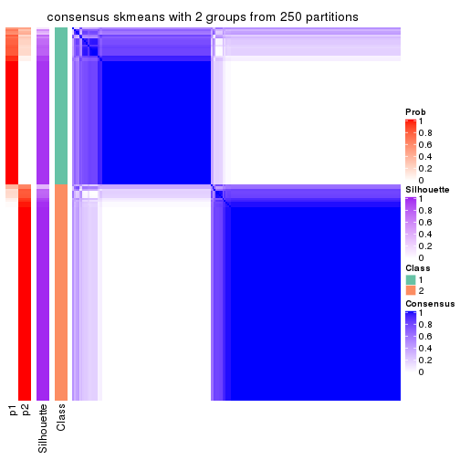</p>

</div>
<div id='tab-CV-skmeans-consensus-heatmap-2'>
<pre><code class="r">consensus_heatmap(res, k = 3)
</code></pre>

<p>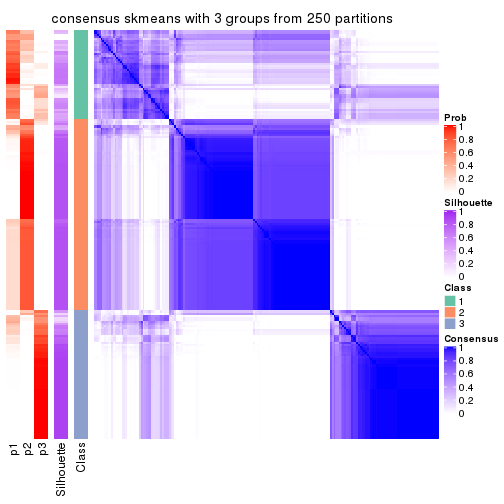</p>

</div>
<div id='tab-CV-skmeans-consensus-heatmap-3'>
<pre><code class="r">consensus_heatmap(res, k = 4)
</code></pre>

<p>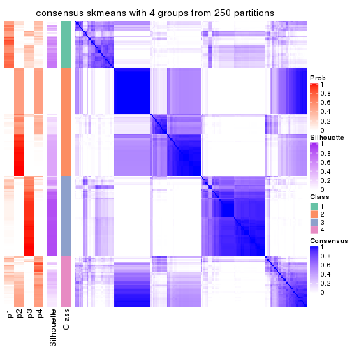</p>

</div>
<div id='tab-CV-skmeans-consensus-heatmap-4'>
<pre><code class="r">consensus_heatmap(res, k = 5)
</code></pre>

<p>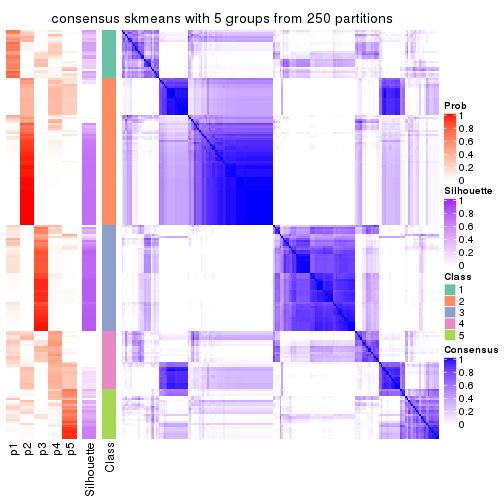</p>

</div>
<div id='tab-CV-skmeans-consensus-heatmap-5'>
<pre><code class="r">consensus_heatmap(res, k = 6)
</code></pre>

<p>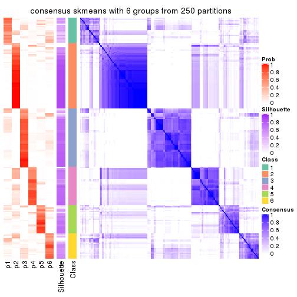</p>

</div>
</div>

Heatmaps for the membership of samples in all partitions to see how consistent they are:


<script>
$( function() {
	$( '#tabs-CV-skmeans-membership-heatmap' ).tabs();
} );
</script>
<div id='tabs-CV-skmeans-membership-heatmap'>
<ul>
<li><a href='#tab-CV-skmeans-membership-heatmap-1'>k = 2</a></li>
<li><a href='#tab-CV-skmeans-membership-heatmap-2'>k = 3</a></li>
<li><a href='#tab-CV-skmeans-membership-heatmap-3'>k = 4</a></li>
<li><a href='#tab-CV-skmeans-membership-heatmap-4'>k = 5</a></li>
<li><a href='#tab-CV-skmeans-membership-heatmap-5'>k = 6</a></li>
</ul>
<div id='tab-CV-skmeans-membership-heatmap-1'>
<pre><code class="r">membership_heatmap(res, k = 2)
</code></pre>

<p>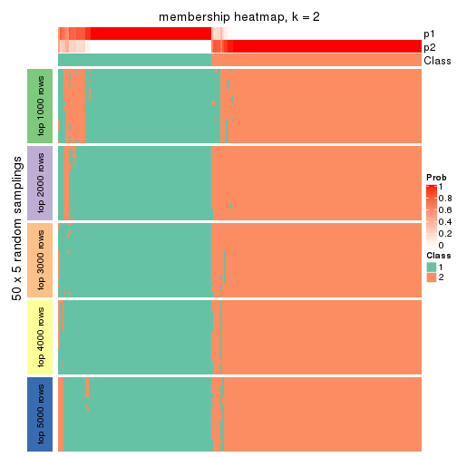</p>

</div>
<div id='tab-CV-skmeans-membership-heatmap-2'>
<pre><code class="r">membership_heatmap(res, k = 3)
</code></pre>

<p>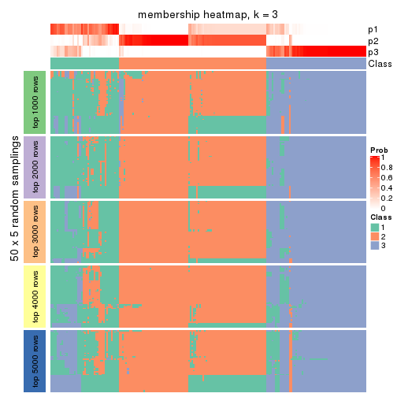</p>

</div>
<div id='tab-CV-skmeans-membership-heatmap-3'>
<pre><code class="r">membership_heatmap(res, k = 4)
</code></pre>

<p>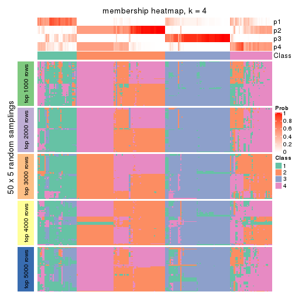</p>

</div>
<div id='tab-CV-skmeans-membership-heatmap-4'>
<pre><code class="r">membership_heatmap(res, k = 5)
</code></pre>

<p>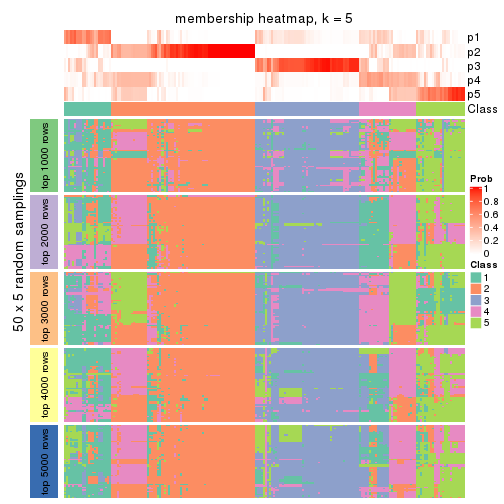</p>

</div>
<div id='tab-CV-skmeans-membership-heatmap-5'>
<pre><code class="r">membership_heatmap(res, k = 6)
</code></pre>

<p>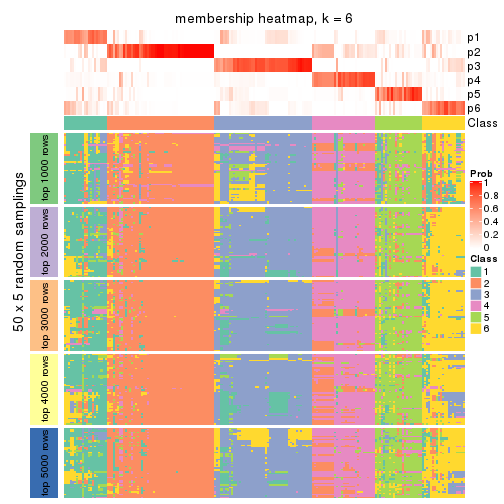</p>

</div>
</div>

As soon as we have had the classes for columns, we can look for signatures
which are significantly different between classes which can be candidate marks
for certain classes. Following are the heatmaps for signatures.


Signature heatmaps where rows are scaled:


<script>
$( function() {
	$( '#tabs-CV-skmeans-get-signatures' ).tabs();
} );
</script>
<div id='tabs-CV-skmeans-get-signatures'>
<ul>
<li><a href='#tab-CV-skmeans-get-signatures-1'>k = 2</a></li>
<li><a href='#tab-CV-skmeans-get-signatures-2'>k = 3</a></li>
<li><a href='#tab-CV-skmeans-get-signatures-3'>k = 4</a></li>
<li><a href='#tab-CV-skmeans-get-signatures-4'>k = 5</a></li>
<li><a href='#tab-CV-skmeans-get-signatures-5'>k = 6</a></li>
</ul>
<div id='tab-CV-skmeans-get-signatures-1'>
<pre><code class="r">get_signatures(res, k = 2)
</code></pre>

<p>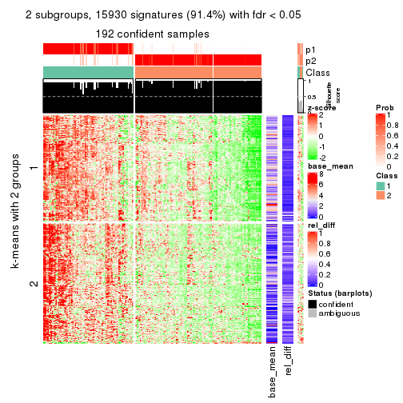</p>

</div>
<div id='tab-CV-skmeans-get-signatures-2'>
<pre><code class="r">get_signatures(res, k = 3)
</code></pre>

<p>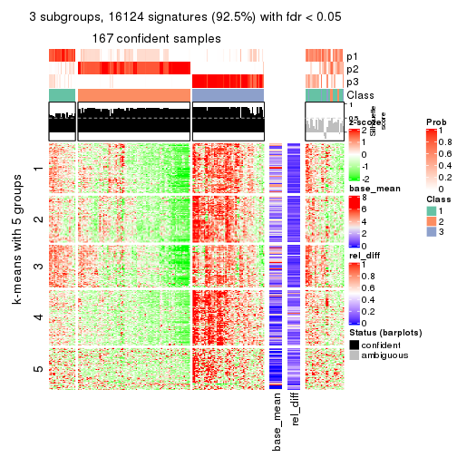</p>

</div>
<div id='tab-CV-skmeans-get-signatures-3'>
<pre><code class="r">get_signatures(res, k = 4)
</code></pre>

<p>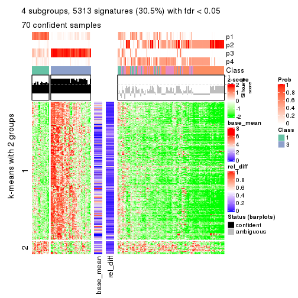</p>

</div>
<div id='tab-CV-skmeans-get-signatures-4'>
<pre><code class="r">get_signatures(res, k = 5)
</code></pre>

<p>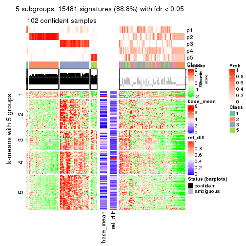</p>

</div>
<div id='tab-CV-skmeans-get-signatures-5'>
<pre><code class="r">get_signatures(res, k = 6)
</code></pre>

<p>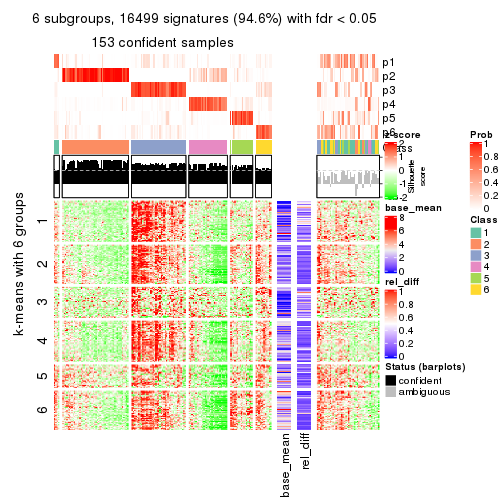</p>

</div>
</div>


Signature heatmaps where rows are not scaled:


<script>
$( function() {
	$( '#tabs-CV-skmeans-get-signatures-no-scale' ).tabs();
} );
</script>
<div id='tabs-CV-skmeans-get-signatures-no-scale'>
<ul>
<li><a href='#tab-CV-skmeans-get-signatures-no-scale-1'>k = 2</a></li>
<li><a href='#tab-CV-skmeans-get-signatures-no-scale-2'>k = 3</a></li>
<li><a href='#tab-CV-skmeans-get-signatures-no-scale-3'>k = 4</a></li>
<li><a href='#tab-CV-skmeans-get-signatures-no-scale-4'>k = 5</a></li>
<li><a href='#tab-CV-skmeans-get-signatures-no-scale-5'>k = 6</a></li>
</ul>
<div id='tab-CV-skmeans-get-signatures-no-scale-1'>
<pre><code class="r">get_signatures(res, k = 2, scale_rows = FALSE)
</code></pre>

<p>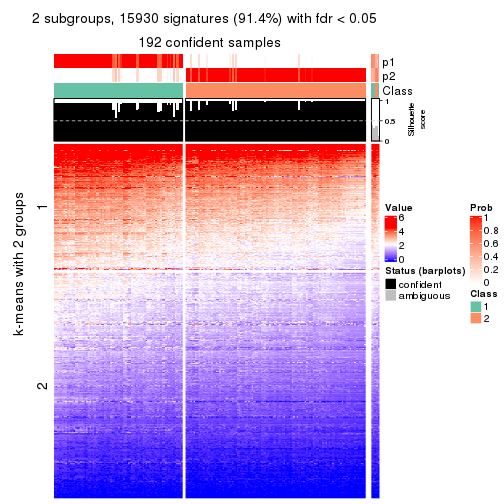</p>

</div>
<div id='tab-CV-skmeans-get-signatures-no-scale-2'>
<pre><code class="r">get_signatures(res, k = 3, scale_rows = FALSE)
</code></pre>

<p>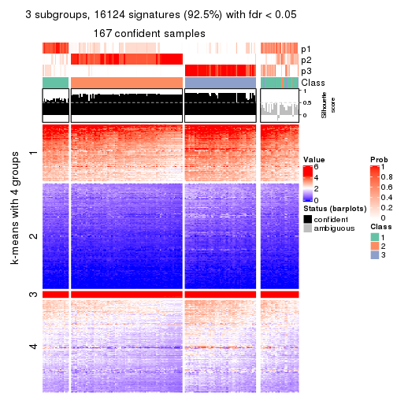</p>

</div>
<div id='tab-CV-skmeans-get-signatures-no-scale-3'>
<pre><code class="r">get_signatures(res, k = 4, scale_rows = FALSE)
</code></pre>

<p>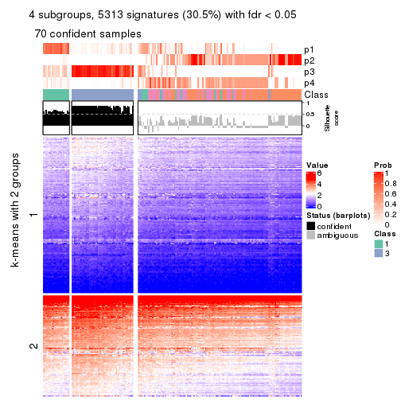</p>

</div>
<div id='tab-CV-skmeans-get-signatures-no-scale-4'>
<pre><code class="r">get_signatures(res, k = 5, scale_rows = FALSE)
</code></pre>

<p>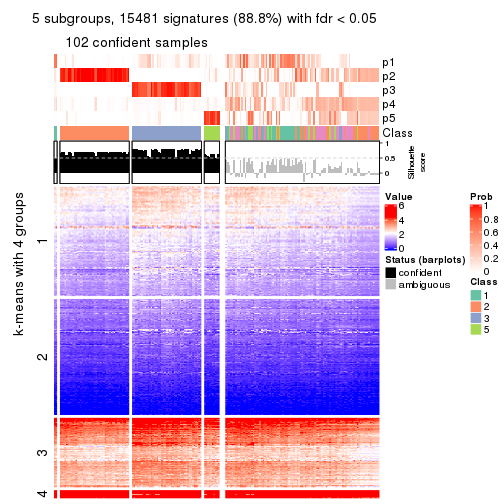</p>

</div>
<div id='tab-CV-skmeans-get-signatures-no-scale-5'>
<pre><code class="r">get_signatures(res, k = 6, scale_rows = FALSE)
</code></pre>

<p>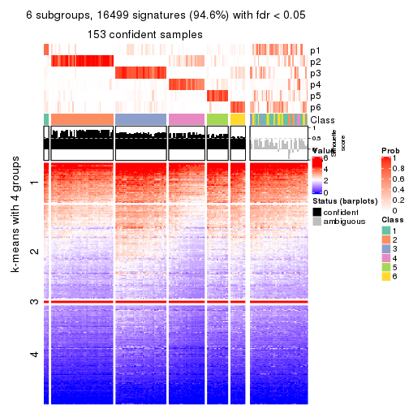</p>

</div>
</div>


Compare the overlap of signatures from different k:

```r
compare_signatures(res)
```

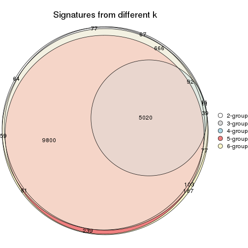

`get_signature()` returns a data frame invisibly. TO get the list of signatures, the function
call should be assigned to a variable explicitly. In following code, if `plot` argument is set
to `FALSE`, no heatmap is plotted while only the differential analysis is performed.

```r
# code only for demonstration
tb = get_signature(res, k = ..., plot = FALSE)
```

An example of the output of `tb` is:

```
#>   which_row         fdr    mean_1    mean_2 scaled_mean_1 scaled_mean_2 km
#> 1        38 0.042760348  8.373488  9.131774    -0.5533452     0.5164555  1
#> 2        40 0.018707592  7.106213  8.469186    -0.6173731     0.5762149  1
#> 3        55 0.019134737 10.221463 11.207825    -0.6159697     0.5749050  1
#> 4        59 0.006059896  5.921854  7.869574    -0.6899429     0.6439467  1
#> 5        60 0.018055526  8.928898 10.211722    -0.6204761     0.5791110  1
#> 6        98 0.009384629 15.714769 14.887706     0.6635654    -0.6193277  2
...
```

The columns in `tb` are:

1. `which_row`: row indices corresponding to the input matrix.
2. `fdr`: FDR for the differential test. 
3. `mean_x`: The mean value in group x.
4. `scaled_mean_x`: The mean value in group x after rows are scaled.
5. `km`: Row groups if k-means clustering is applied to rows.


UMAP plot which shows how samples are separated.


<script>
$( function() {
	$( '#tabs-CV-skmeans-dimension-reduction' ).tabs();
} );
</script>
<div id='tabs-CV-skmeans-dimension-reduction'>
<ul>
<li><a href='#tab-CV-skmeans-dimension-reduction-1'>k = 2</a></li>
<li><a href='#tab-CV-skmeans-dimension-reduction-2'>k = 3</a></li>
<li><a href='#tab-CV-skmeans-dimension-reduction-3'>k = 4</a></li>
<li><a href='#tab-CV-skmeans-dimension-reduction-4'>k = 5</a></li>
<li><a href='#tab-CV-skmeans-dimension-reduction-5'>k = 6</a></li>
</ul>
<div id='tab-CV-skmeans-dimension-reduction-1'>
<pre><code class="r">dimension_reduction(res, k = 2, method = &quot;UMAP&quot;)
</code></pre>

<p>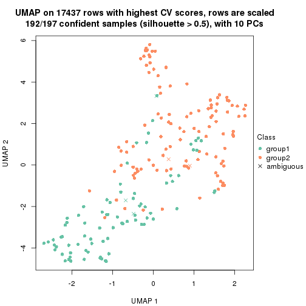</p>

</div>
<div id='tab-CV-skmeans-dimension-reduction-2'>
<pre><code class="r">dimension_reduction(res, k = 3, method = &quot;UMAP&quot;)
</code></pre>

<p>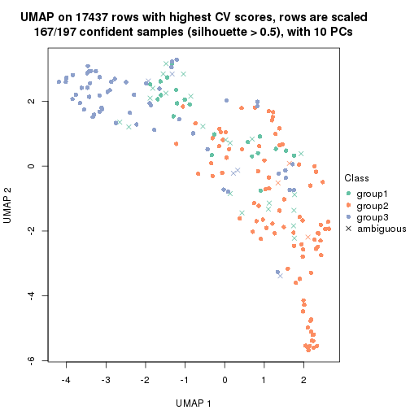</p>

</div>
<div id='tab-CV-skmeans-dimension-reduction-3'>
<pre><code class="r">dimension_reduction(res, k = 4, method = &quot;UMAP&quot;)
</code></pre>

<p>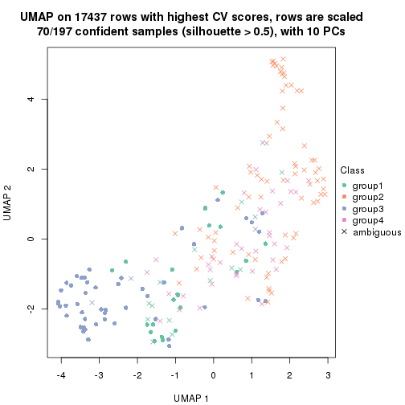</p>

</div>
<div id='tab-CV-skmeans-dimension-reduction-4'>
<pre><code class="r">dimension_reduction(res, k = 5, method = &quot;UMAP&quot;)
</code></pre>

<p>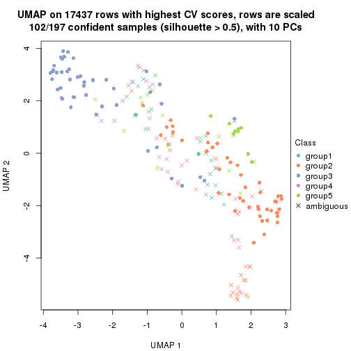</p>

</div>
<div id='tab-CV-skmeans-dimension-reduction-5'>
<pre><code class="r">dimension_reduction(res, k = 6, method = &quot;UMAP&quot;)
</code></pre>

<p>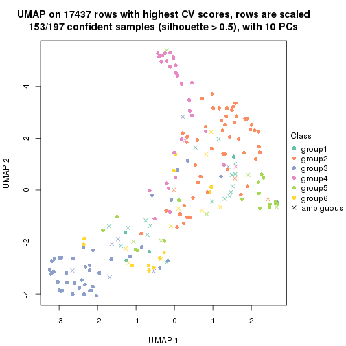</p>

</div>
</div>


Following heatmap shows how subgroups are split when increasing `k`:

```r
collect_classes(res)
```

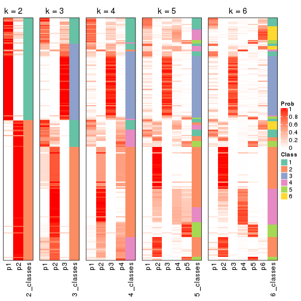


If matrix rows can be associated to genes, consider to use `GO_Enrichment(res,
...)` to perform function enrichment for the signature genes.


 

---------------------------------------------------


### CV:pam


The object with results only for a single top-value method and a single partition method 
can be extracted as:

```r
res = res_list["CV", "pam"]
# you can also extract it by
# res = res_list["CV:pam"]
```

A summary of `res` and all the functions that can be applied to it:

```r
res
```

```
#> A 'ConsensusPartition' object with k = 2, 3, 4, 5, 6.
#>   On a matrix with 17437 rows and 197 columns.
#>   Top rows (1000, 2000, 3000, 4000, 5000) are extracted by 'CV' method.
#>   Subgroups are detected by 'pam' method.
#>   Performed in total 1250 partitions by row resampling.
#>   Best k for subgroups seems to be 2.
#> 
#> Following methods can be applied to this 'ConsensusPartition' object:
#>  [1] "cola_report"             "collect_classes"         "collect_plots"          
#>  [4] "collect_stats"           "colnames"                "compare_signatures"     
#>  [7] "consensus_heatmap"       "dimension_reduction"     "functional_enrichment"  
#> [10] "get_anno_col"            "get_anno"                "get_classes"            
#> [13] "get_consensus"           "get_matrix"              "get_membership"         
#> [16] "get_param"               "get_signatures"          "get_stats"              
#> [19] "is_best_k"               "is_stable_k"             "membership_heatmap"     
#> [22] "ncol"                    "nrow"                    "plot_ecdf"              
#> [25] "rownames"                "select_partition_number" "show"                   
#> [28] "suggest_best_k"          "test_to_known_factors"
```

`collect_plots()` function collects all the plots made from `res` for all `k` (number of partitions)
into one single page to provide an easy and fast comparison between different `k`.

```r
collect_plots(res)
```

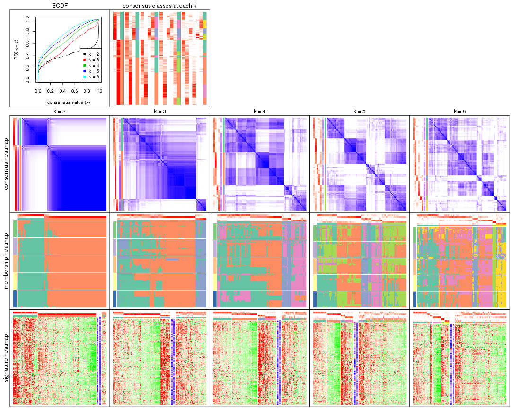

The plots are:

- The first row: a plot of the ECDF (Empirical cumulative distribution
  function) curves of the consensus matrix for each `k` and the heatmap of
  predicted classes for each `k`.
- The second row: heatmaps of the consensus matrix for each `k`.
- The third row: heatmaps of the membership matrix for each `k`.
- The fouth row: heatmaps of the signatures for each `k`.

All the plots in panels can be made by individual functions and they are
plotted later in this section.

`select_partition_number()` produces several plots showing different
statistics for choosing "optimized" `k`. There are following statistics:

- ECDF curves of the consensus matrix for each `k`;
- 1-PAC. [The PAC
  score](https://en.wikipedia.org/wiki/Consensus_clustering#Over-interpretation_potential_of_consensus_clustering)
  measures the proportion of the ambiguous subgrouping.
- Mean silhouette score.
- Concordance. The mean probability of fiting the consensus class ids in all
  partitions.
- Area increased. Denote $A_k$ as the area under the ECDF curve for current
  `k`, the area increased is defined as $A_k - A_{k-1}$.
- Rand index. The percent of pairs of samples that are both in a same cluster
  or both are not in a same cluster in the partition of k and k-1.
- Jaccard index. The ratio of pairs of samples are both in a same cluster in
  the partition of k and k-1 and the pairs of samples are both in a same
  cluster in the partition k or k-1.

The detailed explanations of these statistics can be found in [the cola
vignette](http://bioconductor.org/packages/devel/bioc/vignettes/cola/inst/doc/cola.html#toc_13).

Generally speaking, lower PAC score, higher mean silhouette score or higher
concordance corresponds to better partition. Rand index and Jaccard index
measure how similar the current partition is compared to partition with `k-1`.
If they are too similar, we won't accept `k` is better than `k-1`.

```r
select_partition_number(res)
```

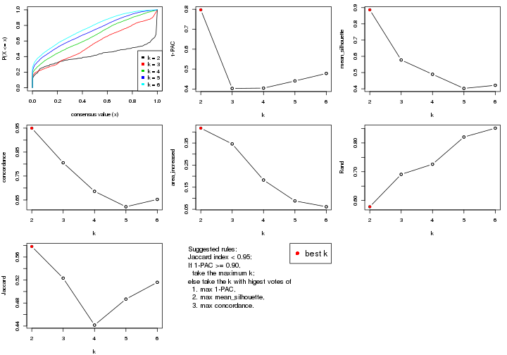

The numeric values for all these statistics can be obtained by `get_stats()`.

```r
get_stats(res)
```

```
#>   k 1-PAC mean_silhouette concordance area_increased  Rand Jaccard
#> 2 2 0.797           0.886       0.950         0.4174 0.578   0.578
#> 3 3 0.403           0.577       0.805         0.3461 0.691   0.523
#> 4 4 0.405           0.489       0.686         0.1824 0.726   0.442
#> 5 5 0.441           0.402       0.622         0.0877 0.821   0.487
#> 6 6 0.478           0.422       0.652         0.0614 0.851   0.516
```

`suggest_best_k()` suggests the best $k$ based on these statistics. The rules are as follows:

- All $k$ with Jaccard index larger than 0.95 are removed because the increase of
  the partition number does not provides enough extra information. If all $k$ are removed,
  the best $k$ is assigned by `NA`.
- For $k$ with 1-PAC larger than 0.9, the maximal $k$ is taken as the "best k". Other $k$ is called "optional k".
- If it does not fit the second rule. The $k$ with the highest vote of highest
  1-PAC, mean silhouette and concordance is taken as the "best k".

```r
suggest_best_k(res)
```

```
#> [1] 2
```


Following shows the table of the partitions (You need to click the **show/hide
code output** link to see it). The membership matrix (columns with name `p*`)
is inferred by
[`clue::cl_consensus()`](https://www.rdocumentation.org/link/cl_consensus?package=clue)
function with the `SE` method. Basically the value in the membership matrix
represents the probability to belong to a certain group. The finall class
label for an item is determined with the group with highest probability it
belongs to.

In `get_classes()` function, the entropy is calculated from the membership
matrix and the silhouette score is calculated from the consensus matrix.


<script>
$( function() {
	$( '#tabs-CV-pam-get-classes' ).tabs();
} );
</script>
<div id='tabs-CV-pam-get-classes'>
<ul>
<li><a href='#tab-CV-pam-get-classes-1'>k = 2</a></li>
<li><a href='#tab-CV-pam-get-classes-2'>k = 3</a></li>
<li><a href='#tab-CV-pam-get-classes-3'>k = 4</a></li>
<li><a href='#tab-CV-pam-get-classes-4'>k = 5</a></li>
<li><a href='#tab-CV-pam-get-classes-5'>k = 6</a></li>
</ul>

<div id='tab-CV-pam-get-classes-1'>
<p><a id='tab-CV-pam-get-classes-1-a' style='color:#0366d6' href='#'>show/hide code output</a></p>
<pre><code class="r">cbind(get_classes(res, k = 2), get_membership(res, k = 2))
</code></pre>

<pre><code>#&gt;            class entropy silhouette    p1    p2
#&gt; SRR1380886     1  0.9732    0.37933 0.596 0.404
#&gt; SRR1074385     2  0.1633    0.94292 0.024 0.976
#&gt; SRR1374739     1  0.0000    0.90873 1.000 0.000
#&gt; SRR1097883     2  0.0000    0.96089 0.000 1.000
#&gt; SRR2167209     2  0.0000    0.96089 0.000 1.000
#&gt; SRR816541      2  0.0000    0.96089 0.000 1.000
#&gt; SRR663645      2  0.0376    0.95818 0.004 0.996
#&gt; SRR1381505     2  0.0000    0.96089 0.000 1.000
#&gt; SRR1416362     2  0.0000    0.96089 0.000 1.000
#&gt; SRR1318503     2  0.0000    0.96089 0.000 1.000
#&gt; SRR1341626     2  0.0000    0.96089 0.000 1.000
#&gt; SRR1382440     1  0.3431    0.89659 0.936 0.064
#&gt; SRR1088413     2  0.4815    0.86611 0.104 0.896
#&gt; SRR1082080     2  0.0000    0.96089 0.000 1.000
#&gt; SRR1455783     2  0.0000    0.96089 0.000 1.000
#&gt; SRR1447760     2  0.0000    0.96089 0.000 1.000
#&gt; SRR1487784     2  0.0000    0.96089 0.000 1.000
#&gt; SRR1331037     2  0.0000    0.96089 0.000 1.000
#&gt; SRR1095651     1  0.0672    0.90943 0.992 0.008
#&gt; SRR1078066     2  0.0938    0.95241 0.012 0.988
#&gt; SRR1120363     2  0.0000    0.96089 0.000 1.000
#&gt; SRR821231      1  0.0938    0.90951 0.988 0.012
#&gt; SRR1374373     2  0.0000    0.96089 0.000 1.000
#&gt; SRR1324519     2  0.0000    0.96089 0.000 1.000
#&gt; SRR1431121     2  0.5294    0.84897 0.120 0.880
#&gt; SRR1091032     2  0.0000    0.96089 0.000 1.000
#&gt; SRR1365575     2  0.0000    0.96089 0.000 1.000
#&gt; SRR1072972     1  0.2778    0.90275 0.952 0.048
#&gt; SRR1310690     2  0.0000    0.96089 0.000 1.000
#&gt; SRR1383037     1  0.0000    0.90873 1.000 0.000
#&gt; SRR1095479     1  0.5842    0.84315 0.860 0.140
#&gt; SRR1070403     1  0.0000    0.90873 1.000 0.000
#&gt; SRR1390203     2  0.1843    0.93950 0.028 0.972
#&gt; SRR1072007     2  0.0000    0.96089 0.000 1.000
#&gt; SRR1468787     2  0.0000    0.96089 0.000 1.000
#&gt; SRR1347959     2  0.0000    0.96089 0.000 1.000
#&gt; SRR1338513     1  0.2603    0.90415 0.956 0.044
#&gt; SRR812598      2  0.0000    0.96089 0.000 1.000
#&gt; SRR1446806     2  0.0376    0.95824 0.004 0.996
#&gt; SRR1394275     2  0.1184    0.94968 0.016 0.984
#&gt; SRR1443633     2  0.7453    0.72294 0.212 0.788
#&gt; SRR1087728     1  0.0000    0.90873 1.000 0.000
#&gt; SRR1098192     2  0.0000    0.96089 0.000 1.000
#&gt; SRR1093340     2  0.0000    0.96089 0.000 1.000
#&gt; SRR665405      1  0.5842    0.84750 0.860 0.140
#&gt; SRR657077      2  0.0000    0.96089 0.000 1.000
#&gt; SRR813208      1  0.0000    0.90873 1.000 0.000
#&gt; SRR1416074     2  0.0000    0.96089 0.000 1.000
#&gt; SRR1089688     1  0.8016    0.73975 0.756 0.244
#&gt; SRR1353461     1  0.0000    0.90873 1.000 0.000
#&gt; SRR1466321     2  0.0000    0.96089 0.000 1.000
#&gt; SRR1073021     2  0.1184    0.94937 0.016 0.984
#&gt; SRR1322816     2  0.0000    0.96089 0.000 1.000
#&gt; SRR1457727     2  0.2948    0.92026 0.052 0.948
#&gt; SRR1464226     2  0.9000    0.47483 0.316 0.684
#&gt; SRR1398863     1  0.9710    0.39080 0.600 0.400
#&gt; SRR1455631     2  0.0000    0.96089 0.000 1.000
#&gt; SRR1307808     2  0.0000    0.96089 0.000 1.000
#&gt; SRR1374585     2  0.0000    0.96089 0.000 1.000
#&gt; SRR1072104     2  0.0000    0.96089 0.000 1.000
#&gt; SRR1076868     2  0.0000    0.96089 0.000 1.000
#&gt; SRR1335984     2  0.2948    0.91864 0.052 0.948
#&gt; SRR1445939     2  0.9983   -0.00221 0.476 0.524
#&gt; SRR1453047     2  0.0000    0.96089 0.000 1.000
#&gt; SRR1339788     1  0.0672    0.90949 0.992 0.008
#&gt; SRR1084323     1  0.7219    0.78104 0.800 0.200
#&gt; SRR1092937     1  0.1843    0.90822 0.972 0.028
#&gt; SRR1074090     2  0.0000    0.96089 0.000 1.000
#&gt; SRR1099833     1  0.2043    0.90721 0.968 0.032
#&gt; SRR1093434     1  0.0000    0.90873 1.000 0.000
#&gt; SRR1435857     2  0.0000    0.96089 0.000 1.000
#&gt; SRR1480347     2  0.0000    0.96089 0.000 1.000
#&gt; SRR1440787     2  0.0000    0.96089 0.000 1.000
#&gt; SRR1430202     2  0.0000    0.96089 0.000 1.000
#&gt; SRR1322730     2  0.9323    0.39360 0.348 0.652
#&gt; SRR811029      2  0.0000    0.96089 0.000 1.000
#&gt; SRR1390456     1  0.0000    0.90873 1.000 0.000
#&gt; SRR1381140     2  0.9909    0.12708 0.444 0.556
#&gt; SRR1388064     2  0.0000    0.96089 0.000 1.000
#&gt; SRR1093577     2  0.0000    0.96089 0.000 1.000
#&gt; SRR1414161     2  0.0000    0.96089 0.000 1.000
#&gt; SRR1328738     2  0.0000    0.96089 0.000 1.000
#&gt; SRR1311752     2  0.0000    0.96089 0.000 1.000
#&gt; SRR1445960     2  0.0000    0.96089 0.000 1.000
#&gt; SRR1403412     2  0.0000    0.96089 0.000 1.000
#&gt; SRR2166748     1  0.7528    0.76964 0.784 0.216
#&gt; SRR821666      2  0.0000    0.96089 0.000 1.000
#&gt; SRR1330746     1  0.0000    0.90873 1.000 0.000
#&gt; SRR1327872     2  0.0000    0.96089 0.000 1.000
#&gt; SRR1100800     2  0.0000    0.96089 0.000 1.000
#&gt; SRR1075174     1  0.9977    0.18606 0.528 0.472
#&gt; SRR1434436     2  0.0000    0.96089 0.000 1.000
#&gt; SRR1389409     2  0.0000    0.96089 0.000 1.000
#&gt; SRR1085310     1  0.9998    0.12977 0.508 0.492
#&gt; SRR1376718     2  0.0000    0.96089 0.000 1.000
#&gt; SRR808590      2  0.0000    0.96089 0.000 1.000
#&gt; SRR1084128     2  0.0000    0.96089 0.000 1.000
#&gt; SRR1361692     2  0.0000    0.96089 0.000 1.000
#&gt; SRR1431493     1  0.2603    0.90406 0.956 0.044
#&gt; SRR1409084     1  0.7453    0.77819 0.788 0.212
#&gt; SRR2166214     1  0.6623    0.82038 0.828 0.172
#&gt; SRR1324102     2  0.0000    0.96089 0.000 1.000
#&gt; SRR1079754     2  0.0000    0.96089 0.000 1.000
#&gt; SRR1442127     1  0.1843    0.90770 0.972 0.028
#&gt; SRR1076244     1  0.4298    0.88416 0.912 0.088
#&gt; SRR1330901     2  0.0000    0.96089 0.000 1.000
#&gt; SRR1073167     2  0.0000    0.96089 0.000 1.000
#&gt; SRR1357541     2  0.0000    0.96089 0.000 1.000
#&gt; SRR811607      2  0.0000    0.96089 0.000 1.000
#&gt; SRR1468931     1  0.0000    0.90873 1.000 0.000
#&gt; SRR1474908     2  0.0376    0.95824 0.004 0.996
#&gt; SRR1309875     2  0.0000    0.96089 0.000 1.000
#&gt; SRR598792      1  0.0000    0.90873 1.000 0.000
#&gt; SRR1088537     2  0.0000    0.96089 0.000 1.000
#&gt; SRR1457682     2  0.0376    0.95818 0.004 0.996
#&gt; SRR1454289     2  0.0000    0.96089 0.000 1.000
#&gt; SRR1069352     1  0.0672    0.90949 0.992 0.008
#&gt; SRR1472728     2  0.0000    0.96089 0.000 1.000
#&gt; SRR1091144     2  0.0000    0.96089 0.000 1.000
#&gt; SRR1319118     1  0.6712    0.80706 0.824 0.176
#&gt; SRR1403611     1  0.5629    0.85390 0.868 0.132
#&gt; SRR1397762     2  0.9977   -0.03487 0.472 0.528
#&gt; SRR1317387     1  0.2778    0.90297 0.952 0.048
#&gt; SRR1376426     2  0.0000    0.96089 0.000 1.000
#&gt; SRR1097777     2  0.8813    0.54995 0.300 0.700
#&gt; SRR1365743     1  0.0000    0.90873 1.000 0.000
#&gt; SRR1458992     2  0.0000    0.96089 0.000 1.000
#&gt; SRR1089537     1  0.8661    0.67410 0.712 0.288
#&gt; SRR1397744     2  0.1184    0.94887 0.016 0.984
#&gt; SRR1453893     2  0.0000    0.96089 0.000 1.000
#&gt; SRR1098543     2  0.0376    0.95818 0.004 0.996
#&gt; SRR1321765     2  0.0000    0.96089 0.000 1.000
#&gt; SRR1440032     2  0.6247    0.78415 0.156 0.844
#&gt; SRR1404507     2  0.0000    0.96089 0.000 1.000
#&gt; SRR1404856     2  0.0000    0.96089 0.000 1.000
#&gt; SRR812745      2  0.9909    0.07899 0.444 0.556
#&gt; SRR1417524     1  0.0000    0.90873 1.000 0.000
#&gt; SRR1407334     2  0.0000    0.96089 0.000 1.000
#&gt; SRR1453991     2  0.0000    0.96089 0.000 1.000
#&gt; SRR1415938     1  0.8207    0.71222 0.744 0.256
#&gt; SRR1081259     2  0.0000    0.96089 0.000 1.000
#&gt; SRR1436187     2  0.0000    0.96089 0.000 1.000
#&gt; SRR1431948     1  0.0000    0.90873 1.000 0.000
#&gt; SRR1453277     2  0.0000    0.96089 0.000 1.000
#&gt; SRR1095407     2  0.0000    0.96089 0.000 1.000
#&gt; SRR1359694     2  0.0000    0.96089 0.000 1.000
#&gt; SRR656982      2  0.4022    0.89033 0.080 0.920
#&gt; SRR1354338     2  0.0000    0.96089 0.000 1.000
#&gt; SRR1088291     2  0.1414    0.94619 0.020 0.980
#&gt; SRR1080624     2  0.0000    0.96089 0.000 1.000
#&gt; SRR2166708     1  0.0000    0.90873 1.000 0.000
#&gt; SRR1393572     2  0.0000    0.96089 0.000 1.000
#&gt; SRR1429912     2  0.0000    0.96089 0.000 1.000
#&gt; SRR1421048     2  0.0000    0.96089 0.000 1.000
#&gt; SRR1434999     1  0.0000    0.90873 1.000 0.000
#&gt; SRR656457      1  0.0672    0.90842 0.992 0.008
#&gt; SRR1098928     1  0.0000    0.90873 1.000 0.000
#&gt; SRR1343967     2  0.0000    0.96089 0.000 1.000
#&gt; SRR1360766     2  0.4298    0.88214 0.088 0.912
#&gt; SRR1464724     2  0.0000    0.96089 0.000 1.000
#&gt; SRR1101542     2  0.0000    0.96089 0.000 1.000
#&gt; SRR1401528     1  0.0000    0.90873 1.000 0.000
#&gt; SRR1071519     1  0.0000    0.90873 1.000 0.000
#&gt; SRR1086070     1  0.2948    0.90110 0.948 0.052
#&gt; SRR1358645     2  0.0000    0.96089 0.000 1.000
#&gt; SRR819771      1  0.0672    0.90960 0.992 0.008
#&gt; SRR1418433     1  0.4562    0.87786 0.904 0.096
#&gt; SRR821050      2  0.1414    0.94619 0.020 0.980
#&gt; SRR1402091     2  0.3879    0.89437 0.076 0.924
#&gt; SRR1322028     2  0.0000    0.96089 0.000 1.000
#&gt; SRR1452556     2  0.0000    0.96089 0.000 1.000
#&gt; SRR1340047     2  0.3274    0.91011 0.060 0.940
#&gt; SRR1418302     2  0.0000    0.96089 0.000 1.000
#&gt; SRR1073991     2  0.2236    0.93390 0.036 0.964
#&gt; SRR1085187     2  0.0000    0.96089 0.000 1.000
#&gt; SRR1357618     1  0.9427    0.51680 0.640 0.360
#&gt; SRR1487764     1  0.2948    0.90110 0.948 0.052
#&gt; SRR1075336     2  0.2778    0.92232 0.048 0.952
#&gt; SRR1365471     2  0.0000    0.96089 0.000 1.000
#&gt; SRR1414613     2  0.0000    0.96089 0.000 1.000
#&gt; SRR658719      1  0.1414    0.90895 0.980 0.020
#&gt; SRR1475128     1  0.0000    0.90873 1.000 0.000
#&gt; SRR1367630     2  0.8144    0.61855 0.252 0.748
#&gt; SRR1481146     2  0.0000    0.96089 0.000 1.000
#&gt; SRR1465674     2  0.0000    0.96089 0.000 1.000
#&gt; SRR1327303     2  0.9129    0.49176 0.328 0.672
#&gt; SRR1390391     2  0.0000    0.96089 0.000 1.000
#&gt; SRR1326020     2  0.4815    0.86591 0.104 0.896
#&gt; SRR1381953     1  0.2603    0.90406 0.956 0.044
#&gt; SRR1082544     2  0.0000    0.96089 0.000 1.000
#&gt; SRR810761      2  0.2778    0.92399 0.048 0.952
#&gt; SRR1070764     1  0.0000    0.90873 1.000 0.000
#&gt; SRR1415919     1  0.0000    0.90873 1.000 0.000
#&gt; SRR1490404     2  0.0000    0.96089 0.000 1.000
#&gt; SRR1416773     2  0.0000    0.96089 0.000 1.000
#&gt; SRR1377492     1  0.3274    0.89860 0.940 0.060
#&gt; SRR1334314     2  0.0000    0.96089 0.000 1.000
</code></pre>

<script>
$('#tab-CV-pam-get-classes-1-a').parent().next().next().hide();
$('#tab-CV-pam-get-classes-1-a').click(function(){
  $('#tab-CV-pam-get-classes-1-a').parent().next().next().toggle();
  return(false);
});
</script>
</div>

<div id='tab-CV-pam-get-classes-2'>
<p><a id='tab-CV-pam-get-classes-2-a' style='color:#0366d6' href='#'>show/hide code output</a></p>
<pre><code class="r">cbind(get_classes(res, k = 3), get_membership(res, k = 3))
</code></pre>

<pre><code>#&gt;            class entropy silhouette    p1    p2    p3
#&gt; SRR1380886     1  0.4834    0.61689 0.792 0.204 0.004
#&gt; SRR1074385     1  0.6140    0.43331 0.596 0.404 0.000
#&gt; SRR1374739     3  0.5560    0.70895 0.300 0.000 0.700
#&gt; SRR1097883     1  0.6204    0.39389 0.576 0.424 0.000
#&gt; SRR2167209     2  0.4842    0.62902 0.224 0.776 0.000
#&gt; SRR816541      2  0.0475    0.83812 0.004 0.992 0.004
#&gt; SRR663645      2  0.6322    0.42727 0.276 0.700 0.024
#&gt; SRR1381505     2  0.0892    0.83374 0.000 0.980 0.020
#&gt; SRR1416362     2  0.0000    0.83816 0.000 1.000 0.000
#&gt; SRR1318503     2  0.0747    0.83615 0.016 0.984 0.000
#&gt; SRR1341626     2  0.0237    0.83774 0.000 0.996 0.004
#&gt; SRR1382440     1  0.6668    0.18811 0.696 0.040 0.264
#&gt; SRR1088413     1  0.4887    0.61382 0.772 0.228 0.000
#&gt; SRR1082080     2  0.0892    0.83374 0.000 0.980 0.020
#&gt; SRR1455783     2  0.5138    0.49996 0.252 0.748 0.000
#&gt; SRR1447760     2  0.0848    0.83852 0.008 0.984 0.008
#&gt; SRR1487784     2  0.0747    0.83462 0.000 0.984 0.016
#&gt; SRR1331037     2  0.0475    0.83812 0.004 0.992 0.004
#&gt; SRR1095651     3  0.4931    0.78352 0.232 0.000 0.768
#&gt; SRR1078066     1  0.6398    0.41144 0.580 0.416 0.004
#&gt; SRR1120363     2  0.5760    0.32471 0.328 0.672 0.000
#&gt; SRR821231      1  0.1163    0.42998 0.972 0.000 0.028
#&gt; SRR1374373     2  0.2165    0.81190 0.064 0.936 0.000
#&gt; SRR1324519     2  0.0892    0.83374 0.000 0.980 0.020
#&gt; SRR1431121     1  0.4796    0.61680 0.780 0.220 0.000
#&gt; SRR1091032     2  0.0424    0.83781 0.008 0.992 0.000
#&gt; SRR1365575     2  0.0892    0.83374 0.000 0.980 0.020
#&gt; SRR1072972     1  0.3941    0.28652 0.844 0.000 0.156
#&gt; SRR1310690     2  0.0237    0.83821 0.004 0.996 0.000
#&gt; SRR1383037     3  0.1964    0.83310 0.056 0.000 0.944
#&gt; SRR1095479     3  0.7059    0.19431 0.460 0.020 0.520
#&gt; SRR1070403     3  0.0892    0.82935 0.020 0.000 0.980
#&gt; SRR1390203     1  0.6309    0.23431 0.504 0.496 0.000
#&gt; SRR1072007     2  0.1411    0.82996 0.036 0.964 0.000
#&gt; SRR1468787     2  0.6260   -0.00518 0.448 0.552 0.000
#&gt; SRR1347959     2  0.0592    0.83710 0.012 0.988 0.000
#&gt; SRR1338513     1  0.4861    0.24056 0.800 0.008 0.192
#&gt; SRR812598      2  0.0747    0.83462 0.000 0.984 0.016
#&gt; SRR1446806     1  0.6095    0.45803 0.608 0.392 0.000
#&gt; SRR1394275     1  0.6026    0.47940 0.624 0.376 0.000
#&gt; SRR1443633     1  0.6292    0.61753 0.740 0.216 0.044
#&gt; SRR1087728     3  0.4931    0.78252 0.232 0.000 0.768
#&gt; SRR1098192     2  0.1289    0.83002 0.032 0.968 0.000
#&gt; SRR1093340     2  0.0892    0.83374 0.000 0.980 0.020
#&gt; SRR665405      1  0.8156    0.45912 0.644 0.196 0.160
#&gt; SRR657077      2  0.5024    0.57634 0.220 0.776 0.004
#&gt; SRR813208      3  0.4002    0.82123 0.160 0.000 0.840
#&gt; SRR1416074     2  0.0892    0.83374 0.000 0.980 0.020
#&gt; SRR1089688     2  0.8869    0.13997 0.280 0.560 0.160
#&gt; SRR1353461     3  0.3941    0.82267 0.156 0.000 0.844
#&gt; SRR1466321     2  0.6252   -0.02258 0.444 0.556 0.000
#&gt; SRR1073021     2  0.5291    0.55459 0.268 0.732 0.000
#&gt; SRR1322816     2  0.0237    0.83821 0.004 0.996 0.000
#&gt; SRR1457727     1  0.5859    0.51990 0.656 0.344 0.000
#&gt; SRR1464226     1  0.7394    0.21685 0.496 0.472 0.032
#&gt; SRR1398863     1  0.5109    0.61951 0.780 0.212 0.008
#&gt; SRR1455631     2  0.3918    0.71265 0.140 0.856 0.004
#&gt; SRR1307808     2  0.1289    0.83001 0.032 0.968 0.000
#&gt; SRR1374585     2  0.0892    0.83374 0.000 0.980 0.020
#&gt; SRR1072104     2  0.6516   -0.15231 0.480 0.516 0.004
#&gt; SRR1076868     2  0.0892    0.83374 0.000 0.980 0.020
#&gt; SRR1335984     1  0.6140    0.43072 0.596 0.404 0.000
#&gt; SRR1445939     1  0.5455    0.54455 0.776 0.204 0.020
#&gt; SRR1453047     2  0.0424    0.83781 0.008 0.992 0.000
#&gt; SRR1339788     1  0.2537    0.39317 0.920 0.000 0.080
#&gt; SRR1084323     1  0.6126    0.31135 0.712 0.020 0.268
#&gt; SRR1092937     1  0.4654    0.20966 0.792 0.000 0.208
#&gt; SRR1074090     2  0.1129    0.83518 0.004 0.976 0.020
#&gt; SRR1099833     1  0.6505   -0.51216 0.528 0.004 0.468
#&gt; SRR1093434     3  0.5216    0.75013 0.260 0.000 0.740
#&gt; SRR1435857     1  0.6308    0.23255 0.508 0.492 0.000
#&gt; SRR1480347     2  0.0661    0.83778 0.004 0.988 0.008
#&gt; SRR1440787     2  0.0892    0.83374 0.000 0.980 0.020
#&gt; SRR1430202     2  0.6307   -0.19147 0.488 0.512 0.000
#&gt; SRR1322730     1  0.8797    0.47156 0.568 0.276 0.156
#&gt; SRR811029      2  0.4002    0.68846 0.160 0.840 0.000
#&gt; SRR1390456     3  0.2537    0.83026 0.080 0.000 0.920
#&gt; SRR1381140     1  0.4654    0.61955 0.792 0.208 0.000
#&gt; SRR1388064     2  0.0892    0.83374 0.000 0.980 0.020
#&gt; SRR1093577     2  0.4346    0.65747 0.184 0.816 0.000
#&gt; SRR1414161     2  0.5948    0.32973 0.360 0.640 0.000
#&gt; SRR1328738     1  0.6286    0.30270 0.536 0.464 0.000
#&gt; SRR1311752     2  0.0475    0.83827 0.004 0.992 0.004
#&gt; SRR1445960     2  0.2448    0.79914 0.076 0.924 0.000
#&gt; SRR1403412     2  0.6309   -0.20477 0.496 0.504 0.000
#&gt; SRR2166748     1  0.8296    0.16005 0.508 0.080 0.412
#&gt; SRR821666      2  0.0892    0.83374 0.000 0.980 0.020
#&gt; SRR1330746     3  0.2537    0.83356 0.080 0.000 0.920
#&gt; SRR1327872     2  0.1129    0.83585 0.020 0.976 0.004
#&gt; SRR1100800     2  0.6204    0.12204 0.424 0.576 0.000
#&gt; SRR1075174     1  0.2537    0.54110 0.920 0.080 0.000
#&gt; SRR1434436     1  0.6260    0.34436 0.552 0.448 0.000
#&gt; SRR1389409     2  0.0892    0.83374 0.000 0.980 0.020
#&gt; SRR1085310     1  0.3619    0.57544 0.864 0.136 0.000
#&gt; SRR1376718     2  0.0892    0.83374 0.000 0.980 0.020
#&gt; SRR808590      2  0.0892    0.83374 0.000 0.980 0.020
#&gt; SRR1084128     2  0.0892    0.83374 0.000 0.980 0.020
#&gt; SRR1361692     1  0.6280    0.31618 0.540 0.460 0.000
#&gt; SRR1431493     1  0.4453    0.31081 0.836 0.012 0.152
#&gt; SRR1409084     1  0.8311    0.45751 0.628 0.216 0.156
#&gt; SRR2166214     1  0.8361    0.45780 0.624 0.216 0.160
#&gt; SRR1324102     2  0.0892    0.83472 0.020 0.980 0.000
#&gt; SRR1079754     2  0.0892    0.83374 0.000 0.980 0.020
#&gt; SRR1442127     1  0.5216    0.14861 0.740 0.000 0.260
#&gt; SRR1076244     1  0.6848    0.32205 0.736 0.100 0.164
#&gt; SRR1330901     2  0.0237    0.83821 0.004 0.996 0.000
#&gt; SRR1073167     2  0.0237    0.83821 0.004 0.996 0.000
#&gt; SRR1357541     1  0.6252    0.34894 0.556 0.444 0.000
#&gt; SRR811607      1  0.6274    0.32449 0.544 0.456 0.000
#&gt; SRR1468931     1  0.5497    0.08386 0.708 0.000 0.292
#&gt; SRR1474908     1  0.6286    0.30898 0.536 0.464 0.000
#&gt; SRR1309875     2  0.0237    0.83821 0.004 0.996 0.000
#&gt; SRR598792      3  0.2356    0.83362 0.072 0.000 0.928
#&gt; SRR1088537     2  0.0237    0.83821 0.004 0.996 0.000
#&gt; SRR1457682     2  0.6111    0.13615 0.396 0.604 0.000
#&gt; SRR1454289     2  0.1163    0.83312 0.028 0.972 0.000
#&gt; SRR1069352     1  0.5650    0.10488 0.688 0.000 0.312
#&gt; SRR1472728     2  0.0237    0.83821 0.004 0.996 0.000
#&gt; SRR1091144     2  0.5036    0.69716 0.172 0.808 0.020
#&gt; SRR1319118     1  0.1529    0.50096 0.960 0.040 0.000
#&gt; SRR1403611     3  0.7232    0.59707 0.172 0.116 0.712
#&gt; SRR1397762     1  0.7384    0.55115 0.660 0.272 0.068
#&gt; SRR1317387     1  0.6126   -0.21905 0.644 0.004 0.352
#&gt; SRR1376426     2  0.0892    0.83374 0.000 0.980 0.020
#&gt; SRR1097777     1  0.4842    0.61758 0.776 0.224 0.000
#&gt; SRR1365743     3  0.4062    0.82074 0.164 0.000 0.836
#&gt; SRR1458992     2  0.1163    0.83191 0.028 0.972 0.000
#&gt; SRR1089537     1  0.9280    0.32201 0.452 0.388 0.160
#&gt; SRR1397744     2  0.6309   -0.24487 0.500 0.500 0.000
#&gt; SRR1453893     2  0.1482    0.83577 0.012 0.968 0.020
#&gt; SRR1098543     1  0.6260    0.34521 0.552 0.448 0.000
#&gt; SRR1321765     2  0.4953    0.68862 0.176 0.808 0.016
#&gt; SRR1440032     2  0.6483   -0.03695 0.452 0.544 0.004
#&gt; SRR1404507     2  0.0892    0.83374 0.000 0.980 0.020
#&gt; SRR1404856     2  0.1529    0.82696 0.040 0.960 0.000
#&gt; SRR812745      1  0.7001    0.51054 0.628 0.340 0.032
#&gt; SRR1417524     3  0.6180    0.60916 0.416 0.000 0.584
#&gt; SRR1407334     2  0.0892    0.83374 0.000 0.980 0.020
#&gt; SRR1453991     2  0.5291    0.50269 0.268 0.732 0.000
#&gt; SRR1415938     1  0.2496    0.52411 0.928 0.068 0.004
#&gt; SRR1081259     2  0.4702    0.64010 0.212 0.788 0.000
#&gt; SRR1436187     2  0.0892    0.83374 0.000 0.980 0.020
#&gt; SRR1431948     3  0.0892    0.82935 0.020 0.000 0.980
#&gt; SRR1453277     1  0.6299    0.27610 0.524 0.476 0.000
#&gt; SRR1095407     2  0.2959    0.77988 0.100 0.900 0.000
#&gt; SRR1359694     2  0.0237    0.83821 0.004 0.996 0.000
#&gt; SRR656982      2  0.6267    0.11221 0.452 0.548 0.000
#&gt; SRR1354338     2  0.1636    0.83402 0.020 0.964 0.016
#&gt; SRR1088291     1  0.6192    0.40202 0.580 0.420 0.000
#&gt; SRR1080624     2  0.1411    0.82839 0.036 0.964 0.000
#&gt; SRR2166708     3  0.0892    0.82935 0.020 0.000 0.980
#&gt; SRR1393572     2  0.6062    0.15887 0.384 0.616 0.000
#&gt; SRR1429912     2  0.1031    0.83341 0.024 0.976 0.000
#&gt; SRR1421048     2  0.0237    0.83821 0.004 0.996 0.000
#&gt; SRR1434999     3  0.6267    0.42992 0.452 0.000 0.548
#&gt; SRR656457      1  0.3983    0.38846 0.852 0.004 0.144
#&gt; SRR1098928     3  0.5254    0.76827 0.264 0.000 0.736
#&gt; SRR1343967     2  0.0237    0.83821 0.004 0.996 0.000
#&gt; SRR1360766     1  0.4931    0.61122 0.768 0.232 0.000
#&gt; SRR1464724     2  0.5200    0.67981 0.184 0.796 0.020
#&gt; SRR1101542     2  0.1315    0.83546 0.008 0.972 0.020
#&gt; SRR1401528     1  0.5138    0.10639 0.748 0.000 0.252
#&gt; SRR1071519     3  0.0892    0.82935 0.020 0.000 0.980
#&gt; SRR1086070     1  0.4002    0.28193 0.840 0.000 0.160
#&gt; SRR1358645     2  0.0237    0.83821 0.004 0.996 0.000
#&gt; SRR819771      3  0.4172    0.81154 0.156 0.004 0.840
#&gt; SRR1418433     1  0.7971    0.16250 0.624 0.096 0.280
#&gt; SRR821050      1  0.6062    0.46427 0.616 0.384 0.000
#&gt; SRR1402091     2  0.5621    0.49163 0.308 0.692 0.000
#&gt; SRR1322028     2  0.1163    0.83152 0.028 0.972 0.000
#&gt; SRR1452556     2  0.1482    0.83535 0.012 0.968 0.020
#&gt; SRR1340047     1  0.5560    0.56637 0.700 0.300 0.000
#&gt; SRR1418302     2  0.2625    0.78913 0.084 0.916 0.000
#&gt; SRR1073991     1  0.5835    0.52559 0.660 0.340 0.000
#&gt; SRR1085187     2  0.0892    0.83374 0.000 0.980 0.020
#&gt; SRR1357618     1  0.5267    0.58445 0.816 0.140 0.044
#&gt; SRR1487764     1  0.4555    0.26542 0.800 0.000 0.200
#&gt; SRR1075336     1  0.5650    0.55471 0.688 0.312 0.000
#&gt; SRR1365471     2  0.0892    0.83374 0.000 0.980 0.020
#&gt; SRR1414613     2  0.0424    0.83791 0.008 0.992 0.000
#&gt; SRR658719      1  0.5968    0.05674 0.636 0.000 0.364
#&gt; SRR1475128     3  0.4346    0.81830 0.184 0.000 0.816
#&gt; SRR1367630     2  0.6282    0.30676 0.384 0.612 0.004
#&gt; SRR1481146     2  0.5072    0.66075 0.196 0.792 0.012
#&gt; SRR1465674     2  0.5058    0.59368 0.244 0.756 0.000
#&gt; SRR1327303     1  0.5858    0.61603 0.740 0.240 0.020
#&gt; SRR1390391     1  0.6235    0.37401 0.564 0.436 0.000
#&gt; SRR1326020     1  0.5058    0.60411 0.756 0.244 0.000
#&gt; SRR1381953     1  0.4453    0.30696 0.836 0.012 0.152
#&gt; SRR1082544     2  0.0592    0.83723 0.012 0.988 0.000
#&gt; SRR810761      1  0.7056    0.56142 0.656 0.300 0.044
#&gt; SRR1070764     3  0.4504    0.80500 0.196 0.000 0.804
#&gt; SRR1415919     3  0.0892    0.82935 0.020 0.000 0.980
#&gt; SRR1490404     2  0.0237    0.83821 0.004 0.996 0.000
#&gt; SRR1416773     2  0.0983    0.83766 0.016 0.980 0.004
#&gt; SRR1377492     1  0.7441    0.19634 0.700 0.136 0.164
#&gt; SRR1334314     2  0.5905    0.27846 0.352 0.648 0.000
</code></pre>

<script>
$('#tab-CV-pam-get-classes-2-a').parent().next().next().hide();
$('#tab-CV-pam-get-classes-2-a').click(function(){
  $('#tab-CV-pam-get-classes-2-a').parent().next().next().toggle();
  return(false);
});
</script>
</div>

<div id='tab-CV-pam-get-classes-3'>
<p><a id='tab-CV-pam-get-classes-3-a' style='color:#0366d6' href='#'>show/hide code output</a></p>
<pre><code class="r">cbind(get_classes(res, k = 4), get_membership(res, k = 4))
</code></pre>

<pre><code>#&gt;            class entropy silhouette    p1    p2    p3    p4
#&gt; SRR1380886     1  0.4072     0.5103 0.748 0.000 0.000 0.252
#&gt; SRR1074385     1  0.3948     0.6650 0.840 0.064 0.000 0.096
#&gt; SRR1374739     4  0.4994     0.2130 0.000 0.000 0.480 0.520
#&gt; SRR1097883     1  0.3372     0.6508 0.868 0.036 0.000 0.096
#&gt; SRR2167209     1  0.4194     0.4207 0.764 0.228 0.000 0.008
#&gt; SRR816541      2  0.4948     0.5356 0.440 0.560 0.000 0.000
#&gt; SRR663645      1  0.6907     0.0252 0.532 0.348 0.000 0.120
#&gt; SRR1381505     2  0.0336     0.6280 0.000 0.992 0.000 0.008
#&gt; SRR1416362     2  0.4679     0.6034 0.352 0.648 0.000 0.000
#&gt; SRR1318503     2  0.4866     0.5601 0.404 0.596 0.000 0.000
#&gt; SRR1341626     2  0.4804     0.5897 0.384 0.616 0.000 0.000
#&gt; SRR1382440     4  0.4286     0.5961 0.136 0.000 0.052 0.812
#&gt; SRR1088413     1  0.3751     0.5577 0.800 0.004 0.000 0.196
#&gt; SRR1082080     2  0.1118     0.6385 0.036 0.964 0.000 0.000
#&gt; SRR1455783     1  0.6482     0.0444 0.504 0.424 0.000 0.072
#&gt; SRR1447760     2  0.3074     0.6439 0.152 0.848 0.000 0.000
#&gt; SRR1487784     2  0.0188     0.6316 0.004 0.996 0.000 0.000
#&gt; SRR1331037     2  0.4679     0.6021 0.352 0.648 0.000 0.000
#&gt; SRR1095651     3  0.6016     0.5347 0.044 0.000 0.544 0.412
#&gt; SRR1078066     1  0.1953     0.6570 0.940 0.044 0.004 0.012
#&gt; SRR1120363     1  0.6586     0.2290 0.544 0.368 0.000 0.088
#&gt; SRR821231      4  0.5151     0.2879 0.464 0.000 0.004 0.532
#&gt; SRR1374373     1  0.5167    -0.4063 0.508 0.488 0.000 0.004
#&gt; SRR1324519     2  0.0188     0.6309 0.004 0.996 0.000 0.000
#&gt; SRR1431121     1  0.3726     0.5372 0.788 0.000 0.000 0.212
#&gt; SRR1091032     2  0.4817     0.5797 0.388 0.612 0.000 0.000
#&gt; SRR1365575     2  0.0336     0.6280 0.000 0.992 0.000 0.008
#&gt; SRR1072972     4  0.3975     0.5162 0.240 0.000 0.000 0.760
#&gt; SRR1310690     2  0.4730     0.5977 0.364 0.636 0.000 0.000
#&gt; SRR1383037     3  0.4018     0.6609 0.004 0.000 0.772 0.224
#&gt; SRR1095479     3  0.6677     0.5379 0.100 0.000 0.552 0.348
#&gt; SRR1070403     3  0.0336     0.6765 0.000 0.000 0.992 0.008
#&gt; SRR1390203     1  0.5434     0.6403 0.740 0.128 0.000 0.132
#&gt; SRR1072007     2  0.5296     0.4586 0.492 0.500 0.000 0.008
#&gt; SRR1468787     1  0.2654     0.6173 0.888 0.108 0.000 0.004
#&gt; SRR1347959     2  0.4730     0.5925 0.364 0.636 0.000 0.000
#&gt; SRR1338513     4  0.1661     0.5997 0.052 0.000 0.004 0.944
#&gt; SRR812598      2  0.2814     0.6265 0.132 0.868 0.000 0.000
#&gt; SRR1446806     1  0.3761     0.6654 0.852 0.068 0.000 0.080
#&gt; SRR1394275     1  0.4419     0.6595 0.812 0.084 0.000 0.104
#&gt; SRR1443633     1  0.4775     0.5253 0.740 0.000 0.028 0.232
#&gt; SRR1087728     4  0.4857     0.3709 0.016 0.000 0.284 0.700
#&gt; SRR1098192     2  0.5161     0.4768 0.476 0.520 0.000 0.004
#&gt; SRR1093340     2  0.1302     0.6427 0.044 0.956 0.000 0.000
#&gt; SRR665405      4  0.4105     0.5889 0.156 0.032 0.000 0.812
#&gt; SRR657077      1  0.5764    -0.2514 0.520 0.452 0.000 0.028
#&gt; SRR813208      3  0.5386     0.6134 0.024 0.000 0.632 0.344
#&gt; SRR1416074     2  0.0000     0.6304 0.000 1.000 0.000 0.000
#&gt; SRR1089688     4  0.5517     0.5188 0.184 0.092 0.000 0.724
#&gt; SRR1353461     3  0.5291     0.6230 0.024 0.000 0.652 0.324
#&gt; SRR1466321     1  0.3856     0.6250 0.832 0.136 0.000 0.032
#&gt; SRR1073021     1  0.4158     0.4407 0.768 0.224 0.000 0.008
#&gt; SRR1322816     2  0.4948     0.5345 0.440 0.560 0.000 0.000
#&gt; SRR1457727     1  0.3149     0.6509 0.880 0.032 0.000 0.088
#&gt; SRR1464226     4  0.7325     0.2305 0.208 0.264 0.000 0.528
#&gt; SRR1398863     1  0.4134     0.5065 0.740 0.000 0.000 0.260
#&gt; SRR1455631     2  0.5550     0.4614 0.428 0.552 0.000 0.020
#&gt; SRR1307808     2  0.4996     0.4633 0.484 0.516 0.000 0.000
#&gt; SRR1374585     2  0.0336     0.6280 0.000 0.992 0.000 0.008
#&gt; SRR1072104     1  0.4323     0.5298 0.776 0.204 0.000 0.020
#&gt; SRR1076868     2  0.0469     0.6347 0.012 0.988 0.000 0.000
#&gt; SRR1335984     1  0.3894     0.6493 0.844 0.068 0.000 0.088
#&gt; SRR1445939     4  0.6672     0.1507 0.408 0.088 0.000 0.504
#&gt; SRR1453047     2  0.4985     0.5002 0.468 0.532 0.000 0.000
#&gt; SRR1339788     4  0.6192     0.3362 0.436 0.000 0.052 0.512
#&gt; SRR1084323     3  0.7663     0.2018 0.380 0.000 0.408 0.212
#&gt; SRR1092937     4  0.3377     0.5934 0.140 0.000 0.012 0.848
#&gt; SRR1074090     2  0.3610     0.6464 0.200 0.800 0.000 0.000
#&gt; SRR1099833     4  0.2644     0.5619 0.032 0.000 0.060 0.908
#&gt; SRR1093434     4  0.4999     0.1827 0.000 0.000 0.492 0.508
#&gt; SRR1435857     1  0.4150     0.6498 0.824 0.120 0.000 0.056
#&gt; SRR1480347     2  0.3400     0.6418 0.180 0.820 0.000 0.000
#&gt; SRR1440787     2  0.0524     0.6277 0.004 0.988 0.000 0.008
#&gt; SRR1430202     1  0.4758     0.6290 0.780 0.156 0.000 0.064
#&gt; SRR1322730     4  0.5747     0.5214 0.196 0.100 0.000 0.704
#&gt; SRR811029      1  0.6149    -0.2614 0.480 0.472 0.000 0.048
#&gt; SRR1390456     3  0.3486     0.5298 0.000 0.000 0.812 0.188
#&gt; SRR1381140     1  0.4164     0.5054 0.736 0.000 0.000 0.264
#&gt; SRR1388064     2  0.1452     0.6274 0.036 0.956 0.000 0.008
#&gt; SRR1093577     1  0.5105    -0.2416 0.564 0.432 0.000 0.004
#&gt; SRR1414161     1  0.3837     0.4850 0.776 0.224 0.000 0.000
#&gt; SRR1328738     1  0.2675     0.6321 0.892 0.100 0.000 0.008
#&gt; SRR1311752     2  0.4522     0.6179 0.320 0.680 0.000 0.000
#&gt; SRR1445960     1  0.4998    -0.4143 0.512 0.488 0.000 0.000
#&gt; SRR1403412     1  0.3088     0.6221 0.864 0.128 0.000 0.008
#&gt; SRR2166748     3  0.7050     0.4200 0.292 0.000 0.552 0.156
#&gt; SRR821666      2  0.0524     0.6301 0.004 0.988 0.000 0.008
#&gt; SRR1330746     3  0.0921     0.6765 0.000 0.000 0.972 0.028
#&gt; SRR1327872     2  0.5268     0.5202 0.452 0.540 0.000 0.008
#&gt; SRR1100800     1  0.3813     0.6053 0.828 0.148 0.000 0.024
#&gt; SRR1075174     1  0.4916     0.0203 0.576 0.000 0.000 0.424
#&gt; SRR1434436     1  0.4989     0.6415 0.764 0.164 0.000 0.072
#&gt; SRR1389409     2  0.0336     0.6280 0.000 0.992 0.000 0.008
#&gt; SRR1085310     1  0.5999    -0.0121 0.552 0.044 0.000 0.404
#&gt; SRR1376718     2  0.0336     0.6280 0.000 0.992 0.000 0.008
#&gt; SRR808590      2  0.2412     0.6151 0.084 0.908 0.000 0.008
#&gt; SRR1084128     2  0.1867     0.6469 0.072 0.928 0.000 0.000
#&gt; SRR1361692     1  0.5056     0.6404 0.760 0.164 0.000 0.076
#&gt; SRR1431493     4  0.4543     0.5131 0.324 0.000 0.000 0.676
#&gt; SRR1409084     4  0.4318     0.5833 0.116 0.068 0.000 0.816
#&gt; SRR2166214     4  0.4459     0.5747 0.188 0.032 0.000 0.780
#&gt; SRR1324102     2  0.4985     0.4969 0.468 0.532 0.000 0.000
#&gt; SRR1079754     2  0.2530     0.6246 0.112 0.888 0.000 0.000
#&gt; SRR1442127     4  0.1936     0.5979 0.028 0.000 0.032 0.940
#&gt; SRR1076244     4  0.3149     0.6082 0.088 0.032 0.000 0.880
#&gt; SRR1330901     2  0.4746     0.5937 0.368 0.632 0.000 0.000
#&gt; SRR1073167     2  0.4941     0.5369 0.436 0.564 0.000 0.000
#&gt; SRR1357541     1  0.2319     0.6618 0.924 0.040 0.000 0.036
#&gt; SRR811607      1  0.4071     0.6538 0.832 0.104 0.000 0.064
#&gt; SRR1468931     4  0.4379     0.5462 0.036 0.000 0.172 0.792
#&gt; SRR1474908     1  0.4782     0.6514 0.780 0.152 0.000 0.068
#&gt; SRR1309875     2  0.4761     0.5938 0.372 0.628 0.000 0.000
#&gt; SRR598792      3  0.2281     0.6866 0.000 0.000 0.904 0.096
#&gt; SRR1088537     2  0.4713     0.5984 0.360 0.640 0.000 0.000
#&gt; SRR1457682     1  0.6404     0.5456 0.644 0.220 0.000 0.136
#&gt; SRR1454289     2  0.5132     0.5152 0.448 0.548 0.000 0.004
#&gt; SRR1069352     4  0.4072     0.5761 0.052 0.000 0.120 0.828
#&gt; SRR1472728     2  0.4713     0.6001 0.360 0.640 0.000 0.000
#&gt; SRR1091144     2  0.5345     0.2654 0.428 0.560 0.000 0.012
#&gt; SRR1319118     1  0.4948    -0.0584 0.560 0.000 0.000 0.440
#&gt; SRR1403611     3  0.7683     0.5278 0.112 0.060 0.592 0.236
#&gt; SRR1397762     4  0.6652     0.2668 0.396 0.088 0.000 0.516
#&gt; SRR1317387     4  0.3547     0.5811 0.072 0.000 0.064 0.864
#&gt; SRR1376426     2  0.0000     0.6304 0.000 1.000 0.000 0.000
#&gt; SRR1097777     1  0.4053     0.5409 0.768 0.004 0.000 0.228
#&gt; SRR1365743     3  0.5311     0.6281 0.024 0.000 0.648 0.328
#&gt; SRR1458992     2  0.4985     0.4968 0.468 0.532 0.000 0.000
#&gt; SRR1089537     4  0.5572     0.5138 0.196 0.088 0.000 0.716
#&gt; SRR1397744     1  0.5875     0.5759 0.684 0.224 0.000 0.092
#&gt; SRR1453893     2  0.0927     0.6265 0.016 0.976 0.000 0.008
#&gt; SRR1098543     1  0.4362     0.6612 0.816 0.088 0.000 0.096
#&gt; SRR1321765     1  0.5134     0.1890 0.664 0.320 0.012 0.004
#&gt; SRR1440032     1  0.6969     0.4564 0.584 0.224 0.000 0.192
#&gt; SRR1404507     2  0.0524     0.6283 0.004 0.988 0.000 0.008
#&gt; SRR1404856     2  0.5000     0.4441 0.496 0.504 0.000 0.000
#&gt; SRR812745      1  0.7216     0.1122 0.448 0.140 0.000 0.412
#&gt; SRR1417524     4  0.4579     0.5027 0.032 0.000 0.200 0.768
#&gt; SRR1407334     2  0.2412     0.6181 0.084 0.908 0.000 0.008
#&gt; SRR1453991     1  0.6074    -0.1109 0.500 0.456 0.000 0.044
#&gt; SRR1415938     1  0.5550    -0.1241 0.552 0.020 0.000 0.428
#&gt; SRR1081259     1  0.5284     0.1108 0.616 0.368 0.000 0.016
#&gt; SRR1436187     2  0.0336     0.6280 0.000 0.992 0.000 0.008
#&gt; SRR1431948     3  0.0921     0.6802 0.000 0.000 0.972 0.028
#&gt; SRR1453277     1  0.4072     0.6490 0.828 0.120 0.000 0.052
#&gt; SRR1095407     1  0.5220    -0.2257 0.568 0.424 0.000 0.008
#&gt; SRR1359694     2  0.4730     0.5975 0.364 0.636 0.000 0.000
#&gt; SRR656982      1  0.5883     0.4892 0.700 0.172 0.000 0.128
#&gt; SRR1354338     2  0.4053     0.6356 0.228 0.768 0.000 0.004
#&gt; SRR1088291     1  0.2256     0.6565 0.924 0.056 0.000 0.020
#&gt; SRR1080624     2  0.4994     0.4716 0.480 0.520 0.000 0.000
#&gt; SRR2166708     3  0.0469     0.6768 0.000 0.000 0.988 0.012
#&gt; SRR1393572     1  0.6153     0.3197 0.604 0.328 0.000 0.068
#&gt; SRR1429912     2  0.5165     0.4656 0.484 0.512 0.000 0.004
#&gt; SRR1421048     2  0.4961     0.5258 0.448 0.552 0.000 0.000
#&gt; SRR1434999     4  0.4866     0.3147 0.000 0.000 0.404 0.596
#&gt; SRR656457      1  0.6906    -0.2881 0.484 0.000 0.108 0.408
#&gt; SRR1098928     4  0.4356     0.4035 0.000 0.000 0.292 0.708
#&gt; SRR1343967     2  0.4679     0.6021 0.352 0.648 0.000 0.000
#&gt; SRR1360766     1  0.3908     0.5461 0.784 0.004 0.000 0.212
#&gt; SRR1464724     2  0.4546     0.3701 0.256 0.732 0.000 0.012
#&gt; SRR1101542     2  0.2412     0.6162 0.084 0.908 0.000 0.008
#&gt; SRR1401528     4  0.2021     0.5891 0.040 0.000 0.024 0.936
#&gt; SRR1071519     3  0.1022     0.6780 0.000 0.000 0.968 0.032
#&gt; SRR1086070     4  0.3649     0.5333 0.204 0.000 0.000 0.796
#&gt; SRR1358645     2  0.4955     0.5316 0.444 0.556 0.000 0.000
#&gt; SRR819771      3  0.6186     0.5872 0.064 0.000 0.584 0.352
#&gt; SRR1418433     4  0.3283     0.6193 0.104 0.020 0.004 0.872
#&gt; SRR821050      1  0.3176     0.6616 0.880 0.036 0.000 0.084
#&gt; SRR1402091     1  0.6904     0.1746 0.556 0.312 0.000 0.132
#&gt; SRR1322028     2  0.4925     0.5375 0.428 0.572 0.000 0.000
#&gt; SRR1452556     2  0.2542     0.6118 0.084 0.904 0.000 0.012
#&gt; SRR1340047     1  0.4491     0.6371 0.800 0.060 0.000 0.140
#&gt; SRR1418302     1  0.5842    -0.1903 0.520 0.448 0.000 0.032
#&gt; SRR1073991     1  0.3525     0.6491 0.860 0.040 0.000 0.100
#&gt; SRR1085187     2  0.0188     0.6296 0.000 0.996 0.000 0.004
#&gt; SRR1357618     1  0.5364     0.1765 0.652 0.000 0.028 0.320
#&gt; SRR1487764     4  0.1833     0.6003 0.032 0.000 0.024 0.944
#&gt; SRR1075336     1  0.3399     0.6554 0.868 0.040 0.000 0.092
#&gt; SRR1365471     2  0.1118     0.6413 0.036 0.964 0.000 0.000
#&gt; SRR1414613     2  0.4776     0.5894 0.376 0.624 0.000 0.000
#&gt; SRR658719      3  0.7371     0.4178 0.232 0.000 0.524 0.244
#&gt; SRR1475128     3  0.5137     0.3966 0.024 0.000 0.680 0.296
#&gt; SRR1367630     1  0.7005     0.4299 0.572 0.172 0.000 0.256
#&gt; SRR1481146     1  0.5686     0.1919 0.592 0.376 0.000 0.032
#&gt; SRR1465674     1  0.4053     0.4322 0.768 0.228 0.000 0.004
#&gt; SRR1327303     1  0.4319     0.5451 0.760 0.012 0.000 0.228
#&gt; SRR1390391     1  0.4300     0.6606 0.820 0.092 0.000 0.088
#&gt; SRR1326020     1  0.3494     0.5771 0.824 0.004 0.000 0.172
#&gt; SRR1381953     4  0.4277     0.5164 0.280 0.000 0.000 0.720
#&gt; SRR1082544     2  0.4964     0.5848 0.380 0.616 0.000 0.004
#&gt; SRR810761      1  0.3659     0.6013 0.840 0.000 0.024 0.136
#&gt; SRR1070764     3  0.5587     0.5929 0.028 0.000 0.600 0.372
#&gt; SRR1415919     3  0.0000     0.6760 0.000 0.000 1.000 0.000
#&gt; SRR1490404     2  0.4543     0.6066 0.324 0.676 0.000 0.000
#&gt; SRR1416773     2  0.5099     0.5804 0.380 0.612 0.000 0.008
#&gt; SRR1377492     4  0.3123     0.5759 0.156 0.000 0.000 0.844
#&gt; SRR1334314     1  0.5195     0.3962 0.692 0.276 0.000 0.032
</code></pre>

<script>
$('#tab-CV-pam-get-classes-3-a').parent().next().next().hide();
$('#tab-CV-pam-get-classes-3-a').click(function(){
  $('#tab-CV-pam-get-classes-3-a').parent().next().next().toggle();
  return(false);
});
</script>
</div>

<div id='tab-CV-pam-get-classes-4'>
<p><a id='tab-CV-pam-get-classes-4-a' style='color:#0366d6' href='#'>show/hide code output</a></p>
<pre><code class="r">cbind(get_classes(res, k = 5), get_membership(res, k = 5))
</code></pre>

<pre><code>#&gt;            class entropy silhouette    p1    p2    p3    p4    p5
#&gt; SRR1380886     1  0.3123    0.68208 0.812 0.000 0.000 0.004 0.184
#&gt; SRR1074385     1  0.4658    0.55219 0.556 0.004 0.000 0.008 0.432
#&gt; SRR1374739     3  0.7705    0.13345 0.060 0.000 0.376 0.336 0.228
#&gt; SRR1097883     1  0.5097    0.60252 0.568 0.004 0.000 0.032 0.396
#&gt; SRR2167209     5  0.5934    0.42498 0.112 0.252 0.000 0.016 0.620
#&gt; SRR816541      5  0.4273   -0.00352 0.000 0.448 0.000 0.000 0.552
#&gt; SRR663645      5  0.7355    0.35029 0.132 0.268 0.000 0.092 0.508
#&gt; SRR1381505     2  0.0324    0.61949 0.000 0.992 0.000 0.004 0.004
#&gt; SRR1416362     2  0.3966    0.48685 0.000 0.664 0.000 0.000 0.336
#&gt; SRR1318503     2  0.4307    0.20004 0.000 0.504 0.000 0.000 0.496
#&gt; SRR1341626     2  0.4304    0.19708 0.000 0.516 0.000 0.000 0.484
#&gt; SRR1382440     4  0.2921    0.57110 0.148 0.000 0.004 0.844 0.004
#&gt; SRR1088413     1  0.3790    0.65085 0.724 0.000 0.000 0.004 0.272
#&gt; SRR1082080     2  0.3039    0.59197 0.000 0.808 0.000 0.000 0.192
#&gt; SRR1455783     5  0.6801    0.34653 0.308 0.316 0.000 0.000 0.376
#&gt; SRR1447760     2  0.2605    0.61732 0.000 0.852 0.000 0.000 0.148
#&gt; SRR1487784     2  0.0794    0.62723 0.000 0.972 0.000 0.000 0.028
#&gt; SRR1331037     2  0.4101    0.48582 0.004 0.664 0.000 0.000 0.332
#&gt; SRR1095651     4  0.4837   -0.28126 0.016 0.000 0.424 0.556 0.004
#&gt; SRR1078066     5  0.5046   -0.01750 0.328 0.020 0.000 0.020 0.632
#&gt; SRR1120363     5  0.6696    0.23894 0.372 0.240 0.000 0.000 0.388
#&gt; SRR821231      1  0.4471    0.62495 0.768 0.000 0.004 0.108 0.120
#&gt; SRR1374373     5  0.4576    0.20689 0.016 0.376 0.000 0.000 0.608
#&gt; SRR1324519     2  0.2230    0.60226 0.000 0.884 0.000 0.000 0.116
#&gt; SRR1431121     1  0.3098    0.68709 0.836 0.000 0.000 0.016 0.148
#&gt; SRR1091032     5  0.4306   -0.20411 0.000 0.492 0.000 0.000 0.508
#&gt; SRR1365575     2  0.0324    0.61949 0.000 0.992 0.000 0.004 0.004
#&gt; SRR1072972     1  0.3210    0.33420 0.788 0.000 0.000 0.212 0.000
#&gt; SRR1310690     2  0.4088    0.43509 0.000 0.632 0.000 0.000 0.368
#&gt; SRR1383037     3  0.5140    0.49768 0.084 0.000 0.664 0.252 0.000
#&gt; SRR1095479     3  0.6680    0.45660 0.188 0.000 0.500 0.300 0.012
#&gt; SRR1070403     3  0.5738    0.52579 0.060 0.000 0.664 0.048 0.228
#&gt; SRR1390203     1  0.4358    0.57780 0.696 0.012 0.000 0.008 0.284
#&gt; SRR1072007     5  0.4613    0.11137 0.004 0.408 0.000 0.008 0.580
#&gt; SRR1468787     5  0.5373    0.11793 0.300 0.044 0.000 0.020 0.636
#&gt; SRR1347959     2  0.4088    0.44454 0.000 0.632 0.000 0.000 0.368
#&gt; SRR1338513     4  0.3336    0.63307 0.228 0.000 0.000 0.772 0.000
#&gt; SRR812598      2  0.4074    0.39528 0.000 0.636 0.000 0.000 0.364
#&gt; SRR1446806     1  0.4390    0.57653 0.568 0.004 0.000 0.000 0.428
#&gt; SRR1394275     1  0.5355    0.62762 0.604 0.044 0.000 0.012 0.340
#&gt; SRR1443633     1  0.5183    0.62345 0.692 0.000 0.004 0.200 0.104
#&gt; SRR1087728     4  0.3885    0.44522 0.040 0.000 0.176 0.784 0.000
#&gt; SRR1098192     5  0.4219    0.09368 0.000 0.416 0.000 0.000 0.584
#&gt; SRR1093340     2  0.2648    0.62536 0.000 0.848 0.000 0.000 0.152
#&gt; SRR665405      4  0.5407    0.57747 0.128 0.008 0.000 0.684 0.180
#&gt; SRR657077      5  0.6211    0.25365 0.128 0.368 0.000 0.004 0.500
#&gt; SRR813208      3  0.5668    0.45761 0.172 0.000 0.632 0.196 0.000
#&gt; SRR1416074     2  0.0510    0.62522 0.000 0.984 0.000 0.000 0.016
#&gt; SRR1089688     4  0.4899    0.57383 0.020 0.064 0.000 0.736 0.180
#&gt; SRR1353461     3  0.5638    0.45908 0.172 0.000 0.636 0.192 0.000
#&gt; SRR1466321     5  0.5276    0.20527 0.300 0.056 0.000 0.008 0.636
#&gt; SRR1073021     5  0.5145    0.47868 0.120 0.160 0.000 0.008 0.712
#&gt; SRR1322816     5  0.4273   -0.00202 0.000 0.448 0.000 0.000 0.552
#&gt; SRR1457727     1  0.4639    0.62107 0.612 0.000 0.000 0.020 0.368
#&gt; SRR1464226     5  0.7722   -0.07214 0.132 0.108 0.000 0.372 0.388
#&gt; SRR1398863     1  0.3282    0.68418 0.804 0.000 0.000 0.008 0.188
#&gt; SRR1455631     2  0.5299    0.20310 0.040 0.520 0.000 0.004 0.436
#&gt; SRR1307808     2  0.4560    0.12125 0.008 0.508 0.000 0.000 0.484
#&gt; SRR1374585     2  0.0451    0.62125 0.000 0.988 0.000 0.004 0.008
#&gt; SRR1072104     5  0.5630    0.39730 0.188 0.144 0.000 0.008 0.660
#&gt; SRR1076868     2  0.0963    0.62970 0.000 0.964 0.000 0.000 0.036
#&gt; SRR1335984     5  0.4367    0.06216 0.372 0.008 0.000 0.000 0.620
#&gt; SRR1445939     1  0.3585    0.58138 0.844 0.016 0.000 0.052 0.088
#&gt; SRR1453047     5  0.4150    0.13934 0.000 0.388 0.000 0.000 0.612
#&gt; SRR1339788     1  0.5493    0.52253 0.672 0.000 0.008 0.196 0.124
#&gt; SRR1084323     1  0.6186    0.01033 0.556 0.000 0.340 0.036 0.068
#&gt; SRR1092937     4  0.4668    0.47596 0.384 0.000 0.008 0.600 0.008
#&gt; SRR1074090     2  0.3612    0.56280 0.000 0.732 0.000 0.000 0.268
#&gt; SRR1099833     4  0.3942    0.63156 0.204 0.004 0.016 0.772 0.004
#&gt; SRR1093434     3  0.7787    0.14081 0.068 0.000 0.376 0.328 0.228
#&gt; SRR1435857     5  0.5341    0.06501 0.356 0.064 0.000 0.000 0.580
#&gt; SRR1480347     2  0.2471    0.62206 0.000 0.864 0.000 0.000 0.136
#&gt; SRR1440787     2  0.0451    0.61886 0.000 0.988 0.000 0.004 0.008
#&gt; SRR1430202     5  0.5779   -0.30640 0.456 0.088 0.000 0.000 0.456
#&gt; SRR1322730     4  0.5559    0.36849 0.008 0.060 0.000 0.572 0.360
#&gt; SRR811029      5  0.6288    0.25080 0.156 0.372 0.000 0.000 0.472
#&gt; SRR1390456     3  0.5506    0.52253 0.060 0.000 0.696 0.048 0.196
#&gt; SRR1381140     1  0.1764    0.63279 0.928 0.000 0.000 0.008 0.064
#&gt; SRR1388064     2  0.1430    0.61095 0.000 0.944 0.000 0.004 0.052
#&gt; SRR1093577     5  0.4840    0.29026 0.040 0.320 0.000 0.000 0.640
#&gt; SRR1414161     5  0.5123    0.48959 0.160 0.144 0.000 0.000 0.696
#&gt; SRR1328738     5  0.4440    0.02283 0.324 0.012 0.000 0.004 0.660
#&gt; SRR1311752     2  0.3816    0.52400 0.000 0.696 0.000 0.000 0.304
#&gt; SRR1445960     5  0.4354    0.20807 0.008 0.368 0.000 0.000 0.624
#&gt; SRR1403412     5  0.4885    0.24642 0.276 0.056 0.000 0.000 0.668
#&gt; SRR2166748     3  0.6692    0.45896 0.232 0.000 0.496 0.264 0.008
#&gt; SRR821666      2  0.0671    0.62145 0.000 0.980 0.000 0.004 0.016
#&gt; SRR1330746     3  0.5457    0.52747 0.060 0.000 0.680 0.032 0.228
#&gt; SRR1327872     5  0.4425    0.00695 0.000 0.452 0.000 0.004 0.544
#&gt; SRR1100800     5  0.5304    0.22737 0.292 0.080 0.000 0.000 0.628
#&gt; SRR1075174     1  0.2206    0.63944 0.912 0.004 0.000 0.016 0.068
#&gt; SRR1434436     1  0.6170    0.47797 0.492 0.120 0.000 0.004 0.384
#&gt; SRR1389409     2  0.0324    0.61949 0.000 0.992 0.000 0.004 0.004
#&gt; SRR1085310     1  0.4949    0.67115 0.656 0.000 0.000 0.056 0.288
#&gt; SRR1376718     2  0.0324    0.61949 0.000 0.992 0.000 0.004 0.004
#&gt; SRR808590      2  0.3266    0.50509 0.000 0.796 0.000 0.004 0.200
#&gt; SRR1084128     2  0.3210    0.59679 0.000 0.788 0.000 0.000 0.212
#&gt; SRR1361692     1  0.6292    0.42415 0.448 0.152 0.000 0.000 0.400
#&gt; SRR1431493     1  0.5215    0.30384 0.592 0.000 0.000 0.352 0.056
#&gt; SRR1409084     4  0.6483    0.50117 0.224 0.024 0.000 0.580 0.172
#&gt; SRR2166214     4  0.5513    0.56751 0.132 0.008 0.000 0.672 0.188
#&gt; SRR1324102     5  0.4262    0.03276 0.000 0.440 0.000 0.000 0.560
#&gt; SRR1079754     2  0.3999    0.42580 0.000 0.656 0.000 0.000 0.344
#&gt; SRR1442127     4  0.1502    0.61743 0.056 0.000 0.004 0.940 0.000
#&gt; SRR1076244     4  0.4368    0.64978 0.184 0.036 0.000 0.764 0.016
#&gt; SRR1330901     2  0.4126    0.42407 0.000 0.620 0.000 0.000 0.380
#&gt; SRR1073167     2  0.4287    0.21313 0.000 0.540 0.000 0.000 0.460
#&gt; SRR1357541     5  0.4934   -0.32702 0.432 0.004 0.000 0.020 0.544
#&gt; SRR811607      5  0.4446   -0.28860 0.400 0.008 0.000 0.000 0.592
#&gt; SRR1468931     4  0.7621    0.21999 0.228 0.000 0.080 0.472 0.220
#&gt; SRR1474908     1  0.5626    0.44825 0.504 0.076 0.000 0.000 0.420
#&gt; SRR1309875     2  0.4443    0.24083 0.004 0.524 0.000 0.000 0.472
#&gt; SRR598792      3  0.5737    0.56815 0.112 0.000 0.680 0.176 0.032
#&gt; SRR1088537     2  0.4030    0.45946 0.000 0.648 0.000 0.000 0.352
#&gt; SRR1457682     1  0.5203    0.42938 0.600 0.032 0.000 0.012 0.356
#&gt; SRR1454289     2  0.4283    0.23665 0.000 0.544 0.000 0.000 0.456
#&gt; SRR1069352     4  0.3993    0.52144 0.216 0.000 0.028 0.756 0.000
#&gt; SRR1472728     2  0.4262    0.32149 0.000 0.560 0.000 0.000 0.440
#&gt; SRR1091144     5  0.5008    0.05482 0.012 0.476 0.000 0.012 0.500
#&gt; SRR1319118     1  0.3846    0.65358 0.800 0.000 0.000 0.056 0.144
#&gt; SRR1403611     3  0.7438    0.35831 0.052 0.028 0.540 0.252 0.128
#&gt; SRR1397762     1  0.6252    0.49693 0.580 0.012 0.000 0.156 0.252
#&gt; SRR1317387     4  0.3459    0.65374 0.116 0.000 0.000 0.832 0.052
#&gt; SRR1376426     2  0.0510    0.62522 0.000 0.984 0.000 0.000 0.016
#&gt; SRR1097777     1  0.3596    0.68631 0.776 0.000 0.000 0.012 0.212
#&gt; SRR1365743     3  0.5087    0.51899 0.292 0.000 0.644 0.064 0.000
#&gt; SRR1458992     5  0.4383    0.07322 0.004 0.424 0.000 0.000 0.572
#&gt; SRR1089537     4  0.4651    0.55857 0.004 0.060 0.000 0.728 0.208
#&gt; SRR1397744     1  0.6373    0.43476 0.572 0.204 0.000 0.012 0.212
#&gt; SRR1453893     2  0.1952    0.60471 0.000 0.912 0.000 0.004 0.084
#&gt; SRR1098543     1  0.4706    0.47725 0.496 0.008 0.000 0.004 0.492
#&gt; SRR1321765     5  0.6314    0.33540 0.068 0.320 0.000 0.048 0.564
#&gt; SRR1440032     5  0.8549    0.06237 0.196 0.240 0.000 0.280 0.284
#&gt; SRR1404507     2  0.2124    0.59319 0.000 0.900 0.000 0.004 0.096
#&gt; SRR1404856     5  0.4912   -0.07155 0.008 0.480 0.000 0.012 0.500
#&gt; SRR812745      1  0.6159    0.50608 0.584 0.020 0.000 0.108 0.288
#&gt; SRR1417524     4  0.4065    0.63194 0.180 0.000 0.048 0.772 0.000
#&gt; SRR1407334     2  0.3123    0.52496 0.000 0.812 0.000 0.004 0.184
#&gt; SRR1453991     5  0.6662    0.25302 0.160 0.372 0.000 0.012 0.456
#&gt; SRR1415938     1  0.4111    0.62385 0.788 0.000 0.000 0.092 0.120
#&gt; SRR1081259     5  0.5814    0.39047 0.128 0.288 0.000 0.000 0.584
#&gt; SRR1436187     2  0.0324    0.61949 0.000 0.992 0.000 0.004 0.004
#&gt; SRR1431948     3  0.2329    0.59039 0.000 0.000 0.876 0.124 0.000
#&gt; SRR1453277     5  0.5114   -0.40754 0.476 0.036 0.000 0.000 0.488
#&gt; SRR1095407     5  0.5061    0.10510 0.020 0.444 0.000 0.008 0.528
#&gt; SRR1359694     2  0.4210    0.38227 0.000 0.588 0.000 0.000 0.412
#&gt; SRR656982      5  0.6461    0.32531 0.300 0.156 0.000 0.012 0.532
#&gt; SRR1354338     2  0.4114    0.55559 0.016 0.712 0.000 0.000 0.272
#&gt; SRR1088291     5  0.4471    0.10085 0.292 0.004 0.000 0.020 0.684
#&gt; SRR1080624     5  0.4300   -0.06384 0.000 0.476 0.000 0.000 0.524
#&gt; SRR2166708     3  0.5802    0.52423 0.060 0.000 0.660 0.052 0.228
#&gt; SRR1393572     5  0.6657    0.19945 0.372 0.228 0.000 0.000 0.400
#&gt; SRR1429912     5  0.4074    0.19226 0.000 0.364 0.000 0.000 0.636
#&gt; SRR1421048     5  0.4278   -0.00629 0.000 0.452 0.000 0.000 0.548
#&gt; SRR1434999     4  0.6438    0.09985 0.052 0.000 0.240 0.604 0.104
#&gt; SRR656457      1  0.6473    0.53779 0.532 0.000 0.020 0.320 0.128
#&gt; SRR1098928     4  0.3790    0.51809 0.004 0.000 0.272 0.724 0.000
#&gt; SRR1343967     2  0.4015    0.46315 0.000 0.652 0.000 0.000 0.348
#&gt; SRR1360766     1  0.3783    0.66157 0.740 0.000 0.000 0.008 0.252
#&gt; SRR1464724     2  0.4601    0.29402 0.032 0.720 0.000 0.012 0.236
#&gt; SRR1101542     2  0.2179    0.58249 0.000 0.896 0.000 0.004 0.100
#&gt; SRR1401528     4  0.3521    0.63114 0.232 0.000 0.004 0.764 0.000
#&gt; SRR1071519     3  0.3569    0.58650 0.004 0.000 0.816 0.152 0.028
#&gt; SRR1086070     1  0.3969    0.11262 0.692 0.000 0.000 0.304 0.004
#&gt; SRR1358645     5  0.4415    0.00848 0.004 0.444 0.000 0.000 0.552
#&gt; SRR819771      3  0.5920    0.36594 0.088 0.000 0.464 0.444 0.004
#&gt; SRR1418433     4  0.4826    0.64692 0.156 0.012 0.000 0.744 0.088
#&gt; SRR821050      1  0.4904    0.48301 0.504 0.000 0.000 0.024 0.472
#&gt; SRR1402091     5  0.6052    0.31811 0.180 0.248 0.000 0.000 0.572
#&gt; SRR1322028     2  0.4242    0.30893 0.000 0.572 0.000 0.000 0.428
#&gt; SRR1452556     2  0.2806    0.54695 0.000 0.844 0.000 0.004 0.152
#&gt; SRR1340047     1  0.5118    0.50067 0.548 0.040 0.000 0.000 0.412
#&gt; SRR1418302     5  0.6226    0.31141 0.156 0.340 0.000 0.000 0.504
#&gt; SRR1073991     1  0.4706    0.63683 0.632 0.004 0.000 0.020 0.344
#&gt; SRR1085187     2  0.0324    0.62213 0.000 0.992 0.000 0.004 0.004
#&gt; SRR1357618     1  0.6184    0.65054 0.576 0.000 0.004 0.212 0.208
#&gt; SRR1487764     4  0.1831    0.62319 0.076 0.000 0.004 0.920 0.000
#&gt; SRR1075336     1  0.4986    0.52140 0.532 0.012 0.000 0.012 0.444
#&gt; SRR1365471     2  0.2605    0.62671 0.000 0.852 0.000 0.000 0.148
#&gt; SRR1414613     2  0.4114    0.42862 0.000 0.624 0.000 0.000 0.376
#&gt; SRR658719      3  0.4974    0.37810 0.484 0.000 0.492 0.020 0.004
#&gt; SRR1475128     3  0.8013    0.43107 0.200 0.000 0.440 0.136 0.224
#&gt; SRR1367630     5  0.7426    0.07257 0.088 0.120 0.000 0.344 0.448
#&gt; SRR1481146     5  0.5925    0.39093 0.124 0.288 0.000 0.004 0.584
#&gt; SRR1465674     5  0.5288    0.48259 0.120 0.164 0.000 0.012 0.704
#&gt; SRR1327303     1  0.4843    0.63831 0.676 0.004 0.000 0.044 0.276
#&gt; SRR1390391     1  0.4504    0.55897 0.564 0.008 0.000 0.000 0.428
#&gt; SRR1326020     1  0.4118    0.58188 0.660 0.000 0.000 0.004 0.336
#&gt; SRR1381953     1  0.4403    0.08623 0.608 0.000 0.000 0.384 0.008
#&gt; SRR1082544     2  0.4192    0.38785 0.000 0.596 0.000 0.000 0.404
#&gt; SRR810761      1  0.5906    0.66102 0.616 0.000 0.004 0.176 0.204
#&gt; SRR1070764     3  0.5235    0.50429 0.312 0.000 0.620 0.068 0.000
#&gt; SRR1415919     3  0.0324    0.58906 0.000 0.000 0.992 0.004 0.004
#&gt; SRR1490404     2  0.3305    0.56612 0.000 0.776 0.000 0.000 0.224
#&gt; SRR1416773     2  0.4299    0.39229 0.000 0.608 0.000 0.004 0.388
#&gt; SRR1377492     4  0.4186    0.63664 0.184 0.004 0.000 0.768 0.044
#&gt; SRR1334314     5  0.6181    0.45603 0.252 0.196 0.000 0.000 0.552
</code></pre>

<script>
$('#tab-CV-pam-get-classes-4-a').parent().next().next().hide();
$('#tab-CV-pam-get-classes-4-a').click(function(){
  $('#tab-CV-pam-get-classes-4-a').parent().next().next().toggle();
  return(false);
});
</script>
</div>

<div id='tab-CV-pam-get-classes-5'>
<p><a id='tab-CV-pam-get-classes-5-a' style='color:#0366d6' href='#'>show/hide code output</a></p>
<pre><code class="r">cbind(get_classes(res, k = 6), get_membership(res, k = 6))
</code></pre>

<pre><code>#&gt;            class entropy silhouette    p1    p2    p3    p4    p5    p6
#&gt; SRR1380886     1  0.1910    0.62832 0.892 0.000 0.000 0.000 0.000 0.108
#&gt; SRR1074385     1  0.3653    0.53350 0.692 0.300 0.000 0.000 0.000 0.008
#&gt; SRR1374739     5  0.0000    0.84262 0.000 0.000 0.000 0.000 1.000 0.000
#&gt; SRR1097883     1  0.4086    0.55410 0.676 0.300 0.012 0.000 0.000 0.012
#&gt; SRR2167209     2  0.5411    0.36397 0.152 0.560 0.000 0.288 0.000 0.000
#&gt; SRR816541      2  0.2632    0.45450 0.000 0.832 0.000 0.164 0.000 0.004
#&gt; SRR663645      2  0.4456    0.40121 0.072 0.720 0.000 0.196 0.000 0.012
#&gt; SRR1381505     4  0.0937    0.65853 0.000 0.040 0.000 0.960 0.000 0.000
#&gt; SRR1416362     2  0.4467    0.04724 0.020 0.496 0.000 0.480 0.000 0.004
#&gt; SRR1318503     2  0.4153    0.46123 0.068 0.752 0.004 0.172 0.000 0.004
#&gt; SRR1341626     2  0.2996    0.40713 0.000 0.772 0.000 0.228 0.000 0.000
#&gt; SRR1382440     6  0.5737    0.41445 0.176 0.000 0.204 0.024 0.000 0.596
#&gt; SRR1088413     1  0.3372    0.63495 0.816 0.084 0.000 0.000 0.000 0.100
#&gt; SRR1082080     4  0.3868    0.28422 0.000 0.496 0.000 0.504 0.000 0.000
#&gt; SRR1455783     2  0.4061    0.39267 0.248 0.708 0.000 0.044 0.000 0.000
#&gt; SRR1447760     4  0.4062    0.49678 0.024 0.316 0.000 0.660 0.000 0.000
#&gt; SRR1487784     4  0.3136    0.59274 0.004 0.228 0.000 0.768 0.000 0.000
#&gt; SRR1331037     2  0.4346    0.07241 0.008 0.524 0.004 0.460 0.000 0.004
#&gt; SRR1095651     6  0.4197    0.36586 0.032 0.000 0.284 0.004 0.000 0.680
#&gt; SRR1078066     2  0.4581    0.02979 0.448 0.524 0.004 0.020 0.000 0.004
#&gt; SRR1120363     2  0.3615    0.27950 0.292 0.700 0.000 0.008 0.000 0.000
#&gt; SRR821231      1  0.2618    0.63723 0.860 0.000 0.024 0.000 0.000 0.116
#&gt; SRR1374373     2  0.3708    0.50315 0.068 0.800 0.004 0.124 0.000 0.004
#&gt; SRR1324519     4  0.3747    0.45928 0.000 0.396 0.000 0.604 0.000 0.000
#&gt; SRR1431121     1  0.2469    0.63863 0.896 0.004 0.060 0.012 0.000 0.028
#&gt; SRR1091032     2  0.3654    0.47821 0.060 0.792 0.000 0.144 0.000 0.004
#&gt; SRR1365575     4  0.0937    0.65853 0.000 0.040 0.000 0.960 0.000 0.000
#&gt; SRR1072972     1  0.4266    0.54647 0.736 0.000 0.060 0.012 0.000 0.192
#&gt; SRR1310690     2  0.3923    0.17910 0.004 0.580 0.000 0.416 0.000 0.000
#&gt; SRR1383037     3  0.3778    0.58300 0.028 0.000 0.784 0.000 0.024 0.164
#&gt; SRR1095479     3  0.5951   -0.03960 0.112 0.000 0.476 0.028 0.000 0.384
#&gt; SRR1070403     5  0.0000    0.84262 0.000 0.000 0.000 0.000 1.000 0.000
#&gt; SRR1390203     1  0.6216    0.52845 0.572 0.272 0.084 0.020 0.000 0.052
#&gt; SRR1072007     2  0.3492    0.47991 0.032 0.788 0.000 0.176 0.000 0.004
#&gt; SRR1468787     2  0.4760    0.11280 0.436 0.520 0.000 0.040 0.000 0.004
#&gt; SRR1347959     2  0.4460    0.17676 0.024 0.568 0.004 0.404 0.000 0.000
#&gt; SRR1338513     6  0.2003    0.57281 0.116 0.000 0.000 0.000 0.000 0.884
#&gt; SRR812598      2  0.3464    0.21095 0.000 0.688 0.000 0.312 0.000 0.000
#&gt; SRR1446806     1  0.3078    0.64540 0.796 0.192 0.000 0.000 0.000 0.012
#&gt; SRR1394275     1  0.2971    0.66652 0.832 0.144 0.000 0.020 0.000 0.004
#&gt; SRR1443633     1  0.5082    0.46996 0.668 0.000 0.224 0.032 0.000 0.076
#&gt; SRR1087728     6  0.4546    0.20275 0.008 0.000 0.444 0.020 0.000 0.528
#&gt; SRR1098192     2  0.2785    0.48536 0.008 0.852 0.004 0.128 0.000 0.008
#&gt; SRR1093340     4  0.3747    0.35157 0.000 0.396 0.000 0.604 0.000 0.000
#&gt; SRR665405      6  0.5407    0.55714 0.036 0.112 0.060 0.076 0.000 0.716
#&gt; SRR657077      2  0.4176    0.40340 0.064 0.716 0.000 0.220 0.000 0.000
#&gt; SRR813208      3  0.3834    0.57036 0.036 0.000 0.732 0.000 0.000 0.232
#&gt; SRR1416074     4  0.2969    0.59854 0.000 0.224 0.000 0.776 0.000 0.000
#&gt; SRR1089688     6  0.5453    0.45152 0.012 0.192 0.000 0.180 0.000 0.616
#&gt; SRR1353461     3  0.4393    0.55731 0.060 0.000 0.708 0.000 0.008 0.224
#&gt; SRR1466321     2  0.3972    0.37277 0.300 0.680 0.000 0.016 0.000 0.004
#&gt; SRR1073021     2  0.5061    0.48362 0.240 0.636 0.000 0.120 0.000 0.004
#&gt; SRR1322816     2  0.2491    0.45273 0.000 0.836 0.000 0.164 0.000 0.000
#&gt; SRR1457727     1  0.2003    0.66926 0.884 0.116 0.000 0.000 0.000 0.000
#&gt; SRR1464226     2  0.6290    0.30455 0.068 0.600 0.044 0.056 0.000 0.232
#&gt; SRR1398863     1  0.2243    0.62867 0.880 0.004 0.004 0.000 0.000 0.112
#&gt; SRR1455631     2  0.4260    0.31630 0.024 0.640 0.000 0.332 0.000 0.004
#&gt; SRR1307808     2  0.4571    0.32801 0.048 0.636 0.004 0.312 0.000 0.000
#&gt; SRR1374585     4  0.1444    0.66058 0.000 0.072 0.000 0.928 0.000 0.000
#&gt; SRR1072104     2  0.4278    0.41732 0.076 0.712 0.000 0.212 0.000 0.000
#&gt; SRR1076868     4  0.3314    0.57818 0.000 0.256 0.004 0.740 0.000 0.000
#&gt; SRR1335984     2  0.5073    0.12162 0.376 0.548 0.000 0.004 0.000 0.072
#&gt; SRR1445939     1  0.5634    0.55931 0.680 0.060 0.088 0.020 0.000 0.152
#&gt; SRR1453047     2  0.2146    0.51739 0.044 0.908 0.000 0.044 0.000 0.004
#&gt; SRR1339788     1  0.3653    0.55308 0.748 0.000 0.004 0.000 0.020 0.228
#&gt; SRR1084323     1  0.5304    0.35479 0.604 0.000 0.292 0.020 0.000 0.084
#&gt; SRR1092937     6  0.3583    0.38982 0.260 0.000 0.004 0.008 0.000 0.728
#&gt; SRR1074090     2  0.3995    0.00742 0.000 0.516 0.004 0.480 0.000 0.000
#&gt; SRR1099833     6  0.2282    0.56871 0.088 0.000 0.024 0.000 0.000 0.888
#&gt; SRR1093434     5  0.0000    0.84262 0.000 0.000 0.000 0.000 1.000 0.000
#&gt; SRR1435857     2  0.3684    0.19747 0.372 0.628 0.000 0.000 0.000 0.000
#&gt; SRR1480347     4  0.4088    0.48706 0.020 0.308 0.004 0.668 0.000 0.000
#&gt; SRR1440787     4  0.1007    0.65804 0.000 0.044 0.000 0.956 0.000 0.000
#&gt; SRR1430202     1  0.4652    0.27556 0.508 0.460 0.000 0.016 0.000 0.016
#&gt; SRR1322730     2  0.6035    0.08435 0.012 0.468 0.000 0.176 0.000 0.344
#&gt; SRR811029      2  0.4682    0.44722 0.176 0.696 0.000 0.124 0.000 0.004
#&gt; SRR1390456     5  0.3428    0.50793 0.000 0.000 0.304 0.000 0.696 0.000
#&gt; SRR1381140     1  0.4626    0.58853 0.756 0.020 0.080 0.020 0.000 0.124
#&gt; SRR1388064     4  0.1663    0.64514 0.000 0.088 0.000 0.912 0.000 0.000
#&gt; SRR1093577     2  0.1349    0.52263 0.056 0.940 0.000 0.000 0.000 0.004
#&gt; SRR1414161     2  0.4469    0.49041 0.220 0.700 0.000 0.076 0.000 0.004
#&gt; SRR1328738     2  0.4713    0.16970 0.380 0.580 0.008 0.004 0.000 0.028
#&gt; SRR1311752     2  0.4313    0.01844 0.012 0.504 0.004 0.480 0.000 0.000
#&gt; SRR1445960     2  0.3876    0.49399 0.068 0.772 0.000 0.156 0.000 0.004
#&gt; SRR1403412     2  0.3741    0.32561 0.320 0.672 0.000 0.008 0.000 0.000
#&gt; SRR2166748     3  0.6414    0.07818 0.220 0.000 0.436 0.024 0.000 0.320
#&gt; SRR821666      4  0.1714    0.66164 0.000 0.092 0.000 0.908 0.000 0.000
#&gt; SRR1330746     5  0.0000    0.84262 0.000 0.000 0.000 0.000 1.000 0.000
#&gt; SRR1327872     2  0.3531    0.36713 0.000 0.672 0.000 0.328 0.000 0.000
#&gt; SRR1100800     2  0.3862   -0.02243 0.476 0.524 0.000 0.000 0.000 0.000
#&gt; SRR1075174     1  0.4612    0.58356 0.764 0.028 0.080 0.020 0.000 0.108
#&gt; SRR1434436     1  0.5209    0.50671 0.672 0.184 0.004 0.120 0.000 0.020
#&gt; SRR1389409     4  0.0937    0.65853 0.000 0.040 0.000 0.960 0.000 0.000
#&gt; SRR1085310     1  0.2331    0.67328 0.888 0.080 0.000 0.000 0.000 0.032
#&gt; SRR1376718     4  0.0937    0.65853 0.000 0.040 0.000 0.960 0.000 0.000
#&gt; SRR808590      4  0.3464    0.41798 0.000 0.312 0.000 0.688 0.000 0.000
#&gt; SRR1084128     4  0.3867    0.27650 0.000 0.488 0.000 0.512 0.000 0.000
#&gt; SRR1361692     1  0.6290    0.23875 0.480 0.300 0.008 0.200 0.000 0.012
#&gt; SRR1431493     1  0.3217    0.55122 0.768 0.008 0.000 0.000 0.000 0.224
#&gt; SRR1409084     6  0.6326    0.44018 0.124 0.156 0.084 0.020 0.000 0.616
#&gt; SRR2166214     6  0.5904    0.54514 0.084 0.116 0.060 0.060 0.000 0.680
#&gt; SRR1324102     2  0.3087    0.45367 0.012 0.808 0.004 0.176 0.000 0.000
#&gt; SRR1079754     2  0.3742    0.15943 0.000 0.648 0.000 0.348 0.000 0.004
#&gt; SRR1442127     6  0.3792    0.55522 0.044 0.000 0.144 0.020 0.000 0.792
#&gt; SRR1076244     6  0.4243    0.58538 0.096 0.028 0.000 0.104 0.000 0.772
#&gt; SRR1330901     2  0.5066    0.16629 0.064 0.496 0.004 0.436 0.000 0.000
#&gt; SRR1073167     2  0.3684    0.29819 0.000 0.664 0.004 0.332 0.000 0.000
#&gt; SRR1357541     1  0.4082    0.26473 0.560 0.432 0.000 0.004 0.000 0.004
#&gt; SRR811607      2  0.3915   -0.01906 0.412 0.584 0.000 0.000 0.000 0.004
#&gt; SRR1468931     5  0.4570    0.48611 0.092 0.000 0.000 0.000 0.680 0.228
#&gt; SRR1474908     1  0.4371    0.41404 0.580 0.392 0.000 0.028 0.000 0.000
#&gt; SRR1309875     2  0.3887    0.39538 0.020 0.724 0.000 0.248 0.000 0.008
#&gt; SRR598792      3  0.4832    0.38780 0.004 0.000 0.680 0.012 0.232 0.072
#&gt; SRR1088537     2  0.4088    0.13640 0.004 0.556 0.004 0.436 0.000 0.000
#&gt; SRR1457682     2  0.6530   -0.21440 0.376 0.464 0.088 0.020 0.000 0.052
#&gt; SRR1454289     2  0.4506    0.31621 0.032 0.636 0.004 0.324 0.000 0.004
#&gt; SRR1069352     6  0.6127    0.36929 0.196 0.000 0.228 0.032 0.000 0.544
#&gt; SRR1472728     2  0.3693    0.34802 0.008 0.708 0.004 0.280 0.000 0.000
#&gt; SRR1091144     4  0.4531    0.01995 0.032 0.464 0.000 0.504 0.000 0.000
#&gt; SRR1319118     1  0.2053    0.63001 0.888 0.004 0.000 0.000 0.000 0.108
#&gt; SRR1403611     3  0.6325    0.22681 0.072 0.024 0.492 0.044 0.000 0.368
#&gt; SRR1397762     1  0.6825    0.47589 0.492 0.308 0.084 0.020 0.000 0.096
#&gt; SRR1317387     6  0.3013    0.58585 0.140 0.000 0.024 0.004 0.000 0.832
#&gt; SRR1376426     4  0.2969    0.59854 0.000 0.224 0.000 0.776 0.000 0.000
#&gt; SRR1097777     1  0.2163    0.64052 0.892 0.016 0.000 0.000 0.000 0.092
#&gt; SRR1365743     3  0.3895    0.57861 0.052 0.000 0.788 0.008 0.008 0.144
#&gt; SRR1458992     2  0.2558    0.46203 0.004 0.840 0.000 0.156 0.000 0.000
#&gt; SRR1089537     6  0.5278    0.43028 0.000 0.204 0.000 0.192 0.000 0.604
#&gt; SRR1397744     1  0.4515    0.50027 0.656 0.280 0.000 0.064 0.000 0.000
#&gt; SRR1453893     4  0.2597    0.59474 0.000 0.176 0.000 0.824 0.000 0.000
#&gt; SRR1098543     1  0.4532    0.24897 0.500 0.468 0.000 0.000 0.000 0.032
#&gt; SRR1321765     2  0.6164    0.39688 0.120 0.588 0.048 0.232 0.000 0.012
#&gt; SRR1440032     4  0.7706   -0.15344 0.212 0.244 0.000 0.284 0.000 0.260
#&gt; SRR1404507     4  0.2854    0.54330 0.000 0.208 0.000 0.792 0.000 0.000
#&gt; SRR1404856     2  0.4736    0.35198 0.072 0.620 0.000 0.308 0.000 0.000
#&gt; SRR812745      1  0.6706    0.53721 0.556 0.220 0.088 0.020 0.000 0.116
#&gt; SRR1417524     6  0.3434    0.56323 0.084 0.000 0.040 0.000 0.040 0.836
#&gt; SRR1407334     4  0.3446    0.43028 0.000 0.308 0.000 0.692 0.000 0.000
#&gt; SRR1453991     2  0.4360    0.48399 0.184 0.724 0.000 0.088 0.000 0.004
#&gt; SRR1415938     1  0.4204    0.61528 0.800 0.036 0.084 0.020 0.000 0.060
#&gt; SRR1081259     2  0.4070    0.51206 0.120 0.784 0.004 0.076 0.000 0.016
#&gt; SRR1436187     4  0.0937    0.65853 0.000 0.040 0.000 0.960 0.000 0.000
#&gt; SRR1431948     3  0.2346    0.51355 0.000 0.000 0.868 0.000 0.124 0.008
#&gt; SRR1453277     1  0.3833    0.36148 0.556 0.444 0.000 0.000 0.000 0.000
#&gt; SRR1095407     4  0.5520   -0.23539 0.100 0.444 0.000 0.448 0.000 0.008
#&gt; SRR1359694     2  0.3672    0.33439 0.008 0.712 0.004 0.276 0.000 0.000
#&gt; SRR656982      2  0.6695    0.34979 0.280 0.492 0.000 0.124 0.000 0.104
#&gt; SRR1354338     2  0.4887   -0.10615 0.048 0.476 0.000 0.472 0.000 0.004
#&gt; SRR1088291     2  0.3699    0.28660 0.336 0.660 0.000 0.000 0.000 0.004
#&gt; SRR1080624     2  0.3776    0.43589 0.052 0.760 0.000 0.188 0.000 0.000
#&gt; SRR2166708     5  0.0000    0.84262 0.000 0.000 0.000 0.000 1.000 0.000
#&gt; SRR1393572     2  0.4886   -0.14542 0.476 0.484 0.008 0.016 0.000 0.016
#&gt; SRR1429912     2  0.2231    0.52115 0.068 0.900 0.000 0.028 0.000 0.004
#&gt; SRR1421048     2  0.3662    0.47939 0.044 0.780 0.000 0.172 0.000 0.004
#&gt; SRR1434999     6  0.6090    0.23135 0.000 0.000 0.156 0.020 0.356 0.468
#&gt; SRR656457      1  0.5484    0.48001 0.664 0.004 0.164 0.020 0.008 0.140
#&gt; SRR1098928     6  0.5404    0.14777 0.000 0.000 0.312 0.000 0.140 0.548
#&gt; SRR1343967     2  0.4370    0.11859 0.016 0.536 0.004 0.444 0.000 0.000
#&gt; SRR1360766     1  0.3502    0.63368 0.812 0.076 0.004 0.000 0.000 0.108
#&gt; SRR1464724     4  0.3915    0.54138 0.116 0.056 0.004 0.800 0.000 0.024
#&gt; SRR1101542     4  0.2340    0.60843 0.000 0.148 0.000 0.852 0.000 0.000
#&gt; SRR1401528     6  0.2302    0.56738 0.120 0.000 0.000 0.008 0.000 0.872
#&gt; SRR1071519     3  0.4933    0.32322 0.000 0.000 0.624 0.016 0.304 0.056
#&gt; SRR1086070     1  0.5526    0.18249 0.480 0.000 0.076 0.020 0.000 0.424
#&gt; SRR1358645     2  0.2884    0.45394 0.004 0.824 0.000 0.164 0.000 0.008
#&gt; SRR819771      6  0.4856    0.16386 0.016 0.000 0.448 0.028 0.000 0.508
#&gt; SRR1418433     6  0.4150    0.59394 0.060 0.036 0.028 0.068 0.000 0.808
#&gt; SRR821050      1  0.3991    0.55664 0.704 0.272 0.008 0.004 0.000 0.012
#&gt; SRR1402091     2  0.6216    0.43122 0.180 0.592 0.000 0.120 0.000 0.108
#&gt; SRR1322028     2  0.4230    0.25943 0.024 0.612 0.000 0.364 0.000 0.000
#&gt; SRR1452556     4  0.3384    0.52917 0.004 0.228 0.000 0.760 0.000 0.008
#&gt; SRR1340047     1  0.5790    0.45143 0.620 0.240 0.012 0.084 0.000 0.044
#&gt; SRR1418302     2  0.3439    0.49133 0.096 0.828 0.000 0.060 0.000 0.016
#&gt; SRR1073991     1  0.1753    0.66573 0.912 0.084 0.000 0.000 0.000 0.004
#&gt; SRR1085187     4  0.2597    0.63187 0.000 0.176 0.000 0.824 0.000 0.000
#&gt; SRR1357618     1  0.5874    0.49663 0.656 0.080 0.168 0.020 0.000 0.076
#&gt; SRR1487764     6  0.3352    0.55848 0.032 0.000 0.148 0.008 0.000 0.812
#&gt; SRR1075336     1  0.3788    0.55974 0.704 0.280 0.000 0.004 0.000 0.012
#&gt; SRR1365471     4  0.3717    0.35809 0.000 0.384 0.000 0.616 0.000 0.000
#&gt; SRR1414613     2  0.4631    0.16994 0.032 0.536 0.000 0.428 0.000 0.004
#&gt; SRR658719      1  0.5804    0.25809 0.528 0.000 0.328 0.020 0.000 0.124
#&gt; SRR1475128     5  0.3521    0.68797 0.040 0.000 0.024 0.000 0.820 0.116
#&gt; SRR1367630     2  0.6514    0.04303 0.032 0.436 0.000 0.216 0.000 0.316
#&gt; SRR1481146     2  0.5073    0.36858 0.080 0.636 0.000 0.268 0.000 0.016
#&gt; SRR1465674     2  0.3932    0.41951 0.248 0.720 0.000 0.028 0.000 0.004
#&gt; SRR1327303     1  0.4795    0.60284 0.672 0.176 0.000 0.000 0.000 0.152
#&gt; SRR1390391     1  0.3584    0.52896 0.688 0.308 0.000 0.000 0.000 0.004
#&gt; SRR1326020     1  0.4474    0.60191 0.704 0.188 0.000 0.000 0.000 0.108
#&gt; SRR1381953     1  0.3727    0.35088 0.612 0.000 0.000 0.000 0.000 0.388
#&gt; SRR1082544     2  0.5065    0.23163 0.068 0.532 0.004 0.396 0.000 0.000
#&gt; SRR810761      1  0.3419    0.60432 0.812 0.000 0.104 0.000 0.000 0.084
#&gt; SRR1070764     3  0.3094    0.57923 0.036 0.000 0.824 0.000 0.000 0.140
#&gt; SRR1415919     3  0.3175    0.40686 0.000 0.000 0.744 0.000 0.256 0.000
#&gt; SRR1490404     4  0.4343    0.31342 0.020 0.384 0.004 0.592 0.000 0.000
#&gt; SRR1416773     2  0.5157    0.17355 0.072 0.484 0.004 0.440 0.000 0.000
#&gt; SRR1377492     6  0.2926    0.57309 0.112 0.012 0.000 0.024 0.000 0.852
#&gt; SRR1334314     2  0.3602    0.51151 0.176 0.784 0.000 0.032 0.000 0.008
</code></pre>

<script>
$('#tab-CV-pam-get-classes-5-a').parent().next().next().hide();
$('#tab-CV-pam-get-classes-5-a').click(function(){
  $('#tab-CV-pam-get-classes-5-a').parent().next().next().toggle();
  return(false);
});
</script>
</div>
</div>

Heatmaps for the consensus matrix. It visualizes the probability of two
samples to be in a same group.


<script>
$( function() {
	$( '#tabs-CV-pam-consensus-heatmap' ).tabs();
} );
</script>
<div id='tabs-CV-pam-consensus-heatmap'>
<ul>
<li><a href='#tab-CV-pam-consensus-heatmap-1'>k = 2</a></li>
<li><a href='#tab-CV-pam-consensus-heatmap-2'>k = 3</a></li>
<li><a href='#tab-CV-pam-consensus-heatmap-3'>k = 4</a></li>
<li><a href='#tab-CV-pam-consensus-heatmap-4'>k = 5</a></li>
<li><a href='#tab-CV-pam-consensus-heatmap-5'>k = 6</a></li>
</ul>
<div id='tab-CV-pam-consensus-heatmap-1'>
<pre><code class="r">consensus_heatmap(res, k = 2)
</code></pre>

<p>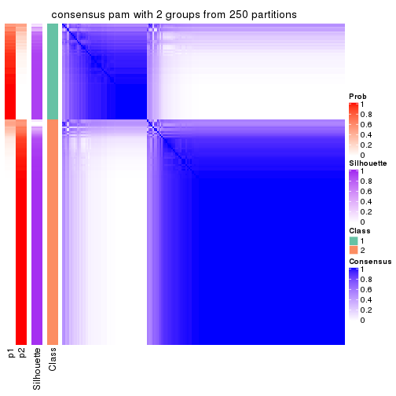</p>

</div>
<div id='tab-CV-pam-consensus-heatmap-2'>
<pre><code class="r">consensus_heatmap(res, k = 3)
</code></pre>

<p>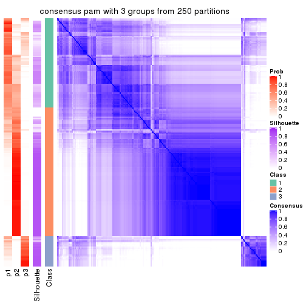</p>

</div>
<div id='tab-CV-pam-consensus-heatmap-3'>
<pre><code class="r">consensus_heatmap(res, k = 4)
</code></pre>

<p>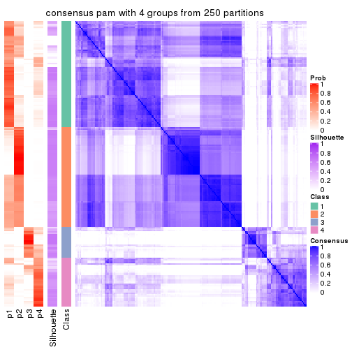</p>

</div>
<div id='tab-CV-pam-consensus-heatmap-4'>
<pre><code class="r">consensus_heatmap(res, k = 5)
</code></pre>

<p>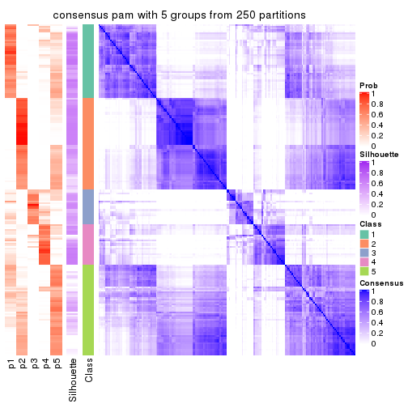</p>

</div>
<div id='tab-CV-pam-consensus-heatmap-5'>
<pre><code class="r">consensus_heatmap(res, k = 6)
</code></pre>

<p>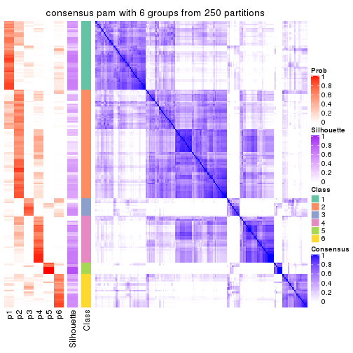</p>

</div>
</div>

Heatmaps for the membership of samples in all partitions to see how consistent they are:


<script>
$( function() {
	$( '#tabs-CV-pam-membership-heatmap' ).tabs();
} );
</script>
<div id='tabs-CV-pam-membership-heatmap'>
<ul>
<li><a href='#tab-CV-pam-membership-heatmap-1'>k = 2</a></li>
<li><a href='#tab-CV-pam-membership-heatmap-2'>k = 3</a></li>
<li><a href='#tab-CV-pam-membership-heatmap-3'>k = 4</a></li>
<li><a href='#tab-CV-pam-membership-heatmap-4'>k = 5</a></li>
<li><a href='#tab-CV-pam-membership-heatmap-5'>k = 6</a></li>
</ul>
<div id='tab-CV-pam-membership-heatmap-1'>
<pre><code class="r">membership_heatmap(res, k = 2)
</code></pre>

<p>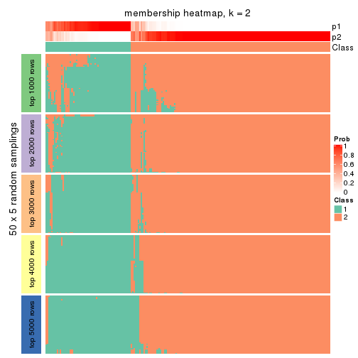</p>

</div>
<div id='tab-CV-pam-membership-heatmap-2'>
<pre><code class="r">membership_heatmap(res, k = 3)
</code></pre>

<p>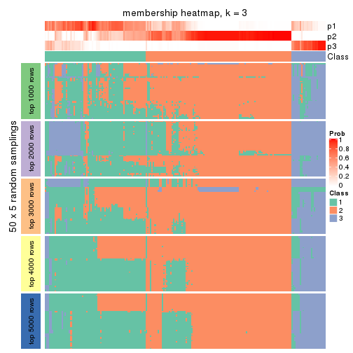</p>

</div>
<div id='tab-CV-pam-membership-heatmap-3'>
<pre><code class="r">membership_heatmap(res, k = 4)
</code></pre>

<p>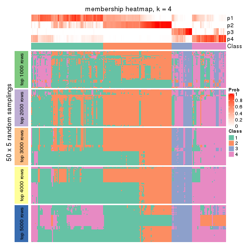</p>

</div>
<div id='tab-CV-pam-membership-heatmap-4'>
<pre><code class="r">membership_heatmap(res, k = 5)
</code></pre>

<p>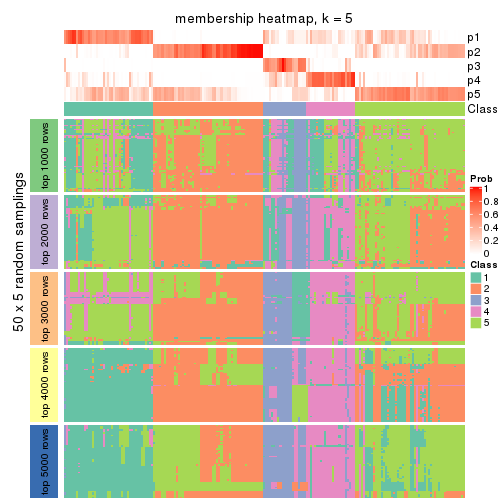</p>

</div>
<div id='tab-CV-pam-membership-heatmap-5'>
<pre><code class="r">membership_heatmap(res, k = 6)
</code></pre>

<p>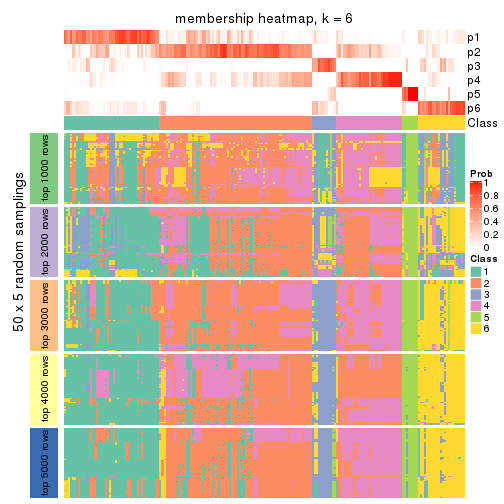</p>

</div>
</div>

As soon as we have had the classes for columns, we can look for signatures
which are significantly different between classes which can be candidate marks
for certain classes. Following are the heatmaps for signatures.


Signature heatmaps where rows are scaled:


<script>
$( function() {
	$( '#tabs-CV-pam-get-signatures' ).tabs();
} );
</script>
<div id='tabs-CV-pam-get-signatures'>
<ul>
<li><a href='#tab-CV-pam-get-signatures-1'>k = 2</a></li>
<li><a href='#tab-CV-pam-get-signatures-2'>k = 3</a></li>
<li><a href='#tab-CV-pam-get-signatures-3'>k = 4</a></li>
<li><a href='#tab-CV-pam-get-signatures-4'>k = 5</a></li>
<li><a href='#tab-CV-pam-get-signatures-5'>k = 6</a></li>
</ul>
<div id='tab-CV-pam-get-signatures-1'>
<pre><code class="r">get_signatures(res, k = 2)
</code></pre>

<p>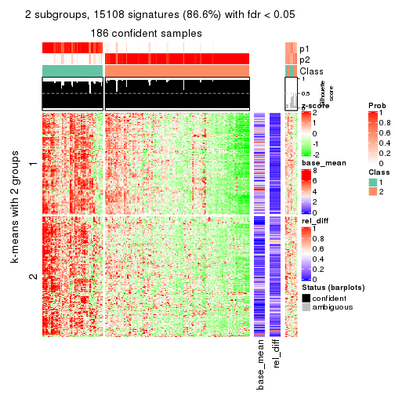</p>

</div>
<div id='tab-CV-pam-get-signatures-2'>
<pre><code class="r">get_signatures(res, k = 3)
</code></pre>

<p>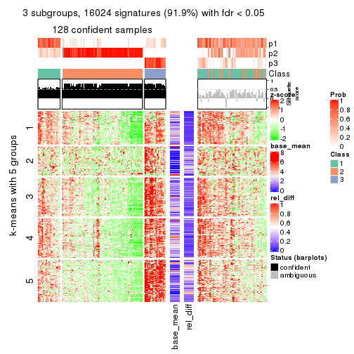</p>

</div>
<div id='tab-CV-pam-get-signatures-3'>
<pre><code class="r">get_signatures(res, k = 4)
</code></pre>

<p>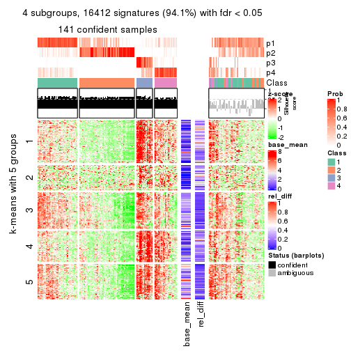</p>

</div>
<div id='tab-CV-pam-get-signatures-4'>
<pre><code class="r">get_signatures(res, k = 5)
</code></pre>

<p>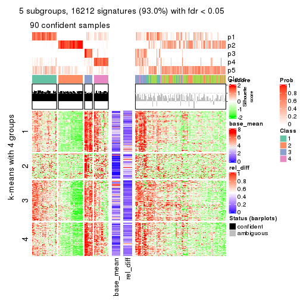</p>

</div>
<div id='tab-CV-pam-get-signatures-5'>
<pre><code class="r">get_signatures(res, k = 6)
</code></pre>

<p>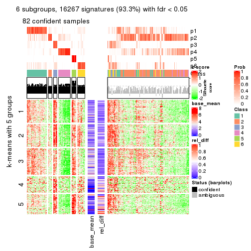</p>

</div>
</div>


Signature heatmaps where rows are not scaled:


<script>
$( function() {
	$( '#tabs-CV-pam-get-signatures-no-scale' ).tabs();
} );
</script>
<div id='tabs-CV-pam-get-signatures-no-scale'>
<ul>
<li><a href='#tab-CV-pam-get-signatures-no-scale-1'>k = 2</a></li>
<li><a href='#tab-CV-pam-get-signatures-no-scale-2'>k = 3</a></li>
<li><a href='#tab-CV-pam-get-signatures-no-scale-3'>k = 4</a></li>
<li><a href='#tab-CV-pam-get-signatures-no-scale-4'>k = 5</a></li>
<li><a href='#tab-CV-pam-get-signatures-no-scale-5'>k = 6</a></li>
</ul>
<div id='tab-CV-pam-get-signatures-no-scale-1'>
<pre><code class="r">get_signatures(res, k = 2, scale_rows = FALSE)
</code></pre>

<p>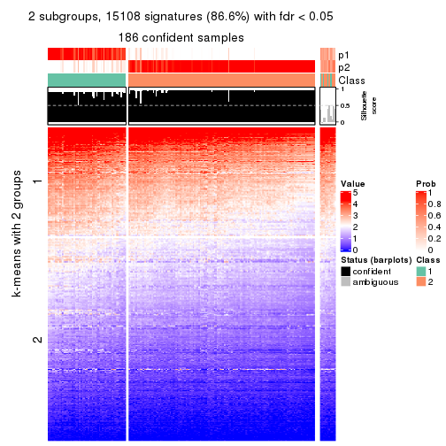</p>

</div>
<div id='tab-CV-pam-get-signatures-no-scale-2'>
<pre><code class="r">get_signatures(res, k = 3, scale_rows = FALSE)
</code></pre>

<p>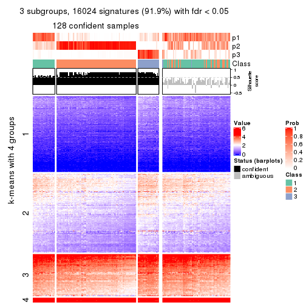</p>

</div>
<div id='tab-CV-pam-get-signatures-no-scale-3'>
<pre><code class="r">get_signatures(res, k = 4, scale_rows = FALSE)
</code></pre>

<p>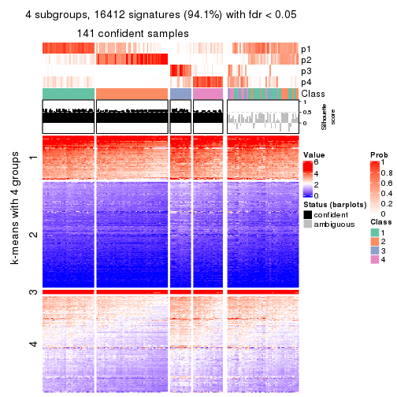</p>

</div>
<div id='tab-CV-pam-get-signatures-no-scale-4'>
<pre><code class="r">get_signatures(res, k = 5, scale_rows = FALSE)
</code></pre>

<p>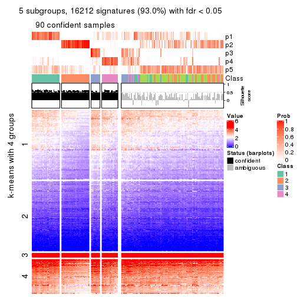</p>

</div>
<div id='tab-CV-pam-get-signatures-no-scale-5'>
<pre><code class="r">get_signatures(res, k = 6, scale_rows = FALSE)
</code></pre>

<p>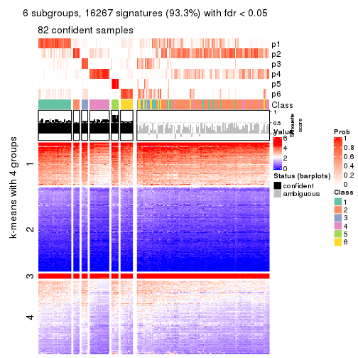</p>

</div>
</div>


Compare the overlap of signatures from different k:

```r
compare_signatures(res)
```

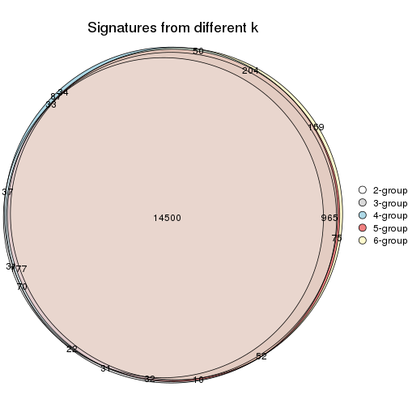

`get_signature()` returns a data frame invisibly. TO get the list of signatures, the function
call should be assigned to a variable explicitly. In following code, if `plot` argument is set
to `FALSE`, no heatmap is plotted while only the differential analysis is performed.

```r
# code only for demonstration
tb = get_signature(res, k = ..., plot = FALSE)
```

An example of the output of `tb` is:

```
#>   which_row         fdr    mean_1    mean_2 scaled_mean_1 scaled_mean_2 km
#> 1        38 0.042760348  8.373488  9.131774    -0.5533452     0.5164555  1
#> 2        40 0.018707592  7.106213  8.469186    -0.6173731     0.5762149  1
#> 3        55 0.019134737 10.221463 11.207825    -0.6159697     0.5749050  1
#> 4        59 0.006059896  5.921854  7.869574    -0.6899429     0.6439467  1
#> 5        60 0.018055526  8.928898 10.211722    -0.6204761     0.5791110  1
#> 6        98 0.009384629 15.714769 14.887706     0.6635654    -0.6193277  2
...
```

The columns in `tb` are:

1. `which_row`: row indices corresponding to the input matrix.
2. `fdr`: FDR for the differential test. 
3. `mean_x`: The mean value in group x.
4. `scaled_mean_x`: The mean value in group x after rows are scaled.
5. `km`: Row groups if k-means clustering is applied to rows.


UMAP plot which shows how samples are separated.


<script>
$( function() {
	$( '#tabs-CV-pam-dimension-reduction' ).tabs();
} );
</script>
<div id='tabs-CV-pam-dimension-reduction'>
<ul>
<li><a href='#tab-CV-pam-dimension-reduction-1'>k = 2</a></li>
<li><a href='#tab-CV-pam-dimension-reduction-2'>k = 3</a></li>
<li><a href='#tab-CV-pam-dimension-reduction-3'>k = 4</a></li>
<li><a href='#tab-CV-pam-dimension-reduction-4'>k = 5</a></li>
<li><a href='#tab-CV-pam-dimension-reduction-5'>k = 6</a></li>
</ul>
<div id='tab-CV-pam-dimension-reduction-1'>
<pre><code class="r">dimension_reduction(res, k = 2, method = &quot;UMAP&quot;)
</code></pre>

<p>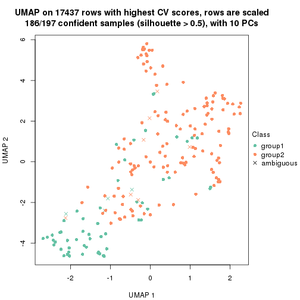</p>

</div>
<div id='tab-CV-pam-dimension-reduction-2'>
<pre><code class="r">dimension_reduction(res, k = 3, method = &quot;UMAP&quot;)
</code></pre>

<p>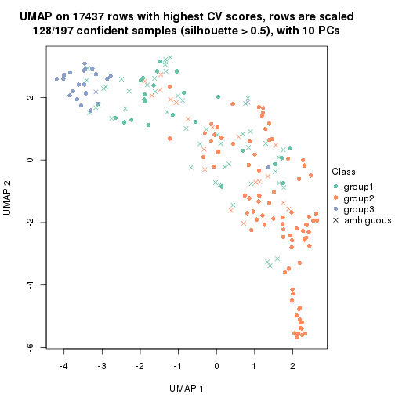</p>

</div>
<div id='tab-CV-pam-dimension-reduction-3'>
<pre><code class="r">dimension_reduction(res, k = 4, method = &quot;UMAP&quot;)
</code></pre>

<p>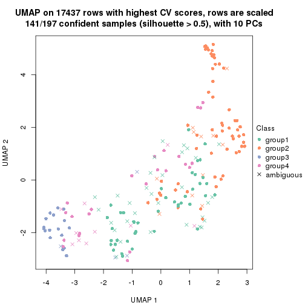</p>

</div>
<div id='tab-CV-pam-dimension-reduction-4'>
<pre><code class="r">dimension_reduction(res, k = 5, method = &quot;UMAP&quot;)
</code></pre>

<p>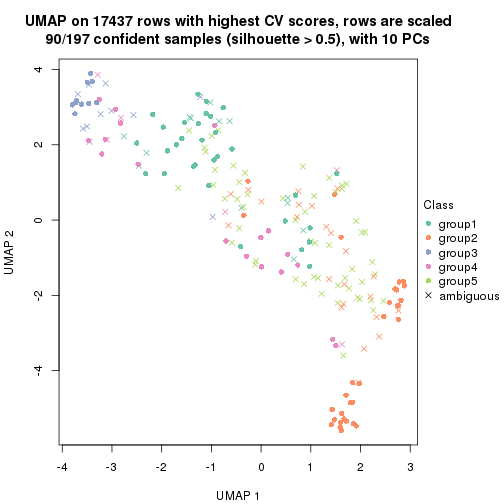</p>

</div>
<div id='tab-CV-pam-dimension-reduction-5'>
<pre><code class="r">dimension_reduction(res, k = 6, method = &quot;UMAP&quot;)
</code></pre>

<p>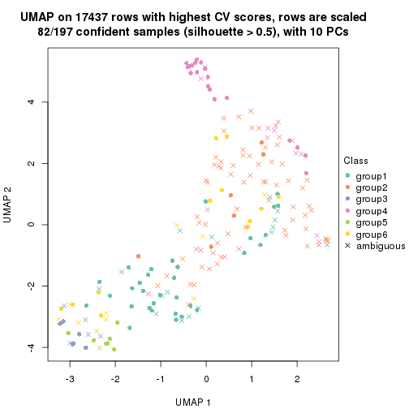</p>

</div>
</div>


Following heatmap shows how subgroups are split when increasing `k`:

```r
collect_classes(res)
```

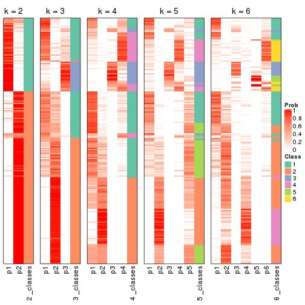


If matrix rows can be associated to genes, consider to use `GO_Enrichment(res,
...)` to perform function enrichment for the signature genes.


 

---------------------------------------------------


### CV:mclust


The object with results only for a single top-value method and a single partition method 
can be extracted as:

```r
res = res_list["CV", "mclust"]
# you can also extract it by
# res = res_list["CV:mclust"]
```

A summary of `res` and all the functions that can be applied to it:

```r
res
```

```
#> A 'ConsensusPartition' object with k = 2, 3, 4, 5, 6.
#>   On a matrix with 17437 rows and 197 columns.
#>   Top rows (1000, 2000, 3000, 4000, 5000) are extracted by 'CV' method.
#>   Subgroups are detected by 'mclust' method.
#>   Performed in total 1250 partitions by row resampling.
#>   Best k for subgroups seems to be 2.
#> 
#> Following methods can be applied to this 'ConsensusPartition' object:
#>  [1] "cola_report"             "collect_classes"         "collect_plots"          
#>  [4] "collect_stats"           "colnames"                "compare_signatures"     
#>  [7] "consensus_heatmap"       "dimension_reduction"     "functional_enrichment"  
#> [10] "get_anno_col"            "get_anno"                "get_classes"            
#> [13] "get_consensus"           "get_matrix"              "get_membership"         
#> [16] "get_param"               "get_signatures"          "get_stats"              
#> [19] "is_best_k"               "is_stable_k"             "membership_heatmap"     
#> [22] "ncol"                    "nrow"                    "plot_ecdf"              
#> [25] "rownames"                "select_partition_number" "show"                   
#> [28] "suggest_best_k"          "test_to_known_factors"
```

`collect_plots()` function collects all the plots made from `res` for all `k` (number of partitions)
into one single page to provide an easy and fast comparison between different `k`.

```r
collect_plots(res)
```

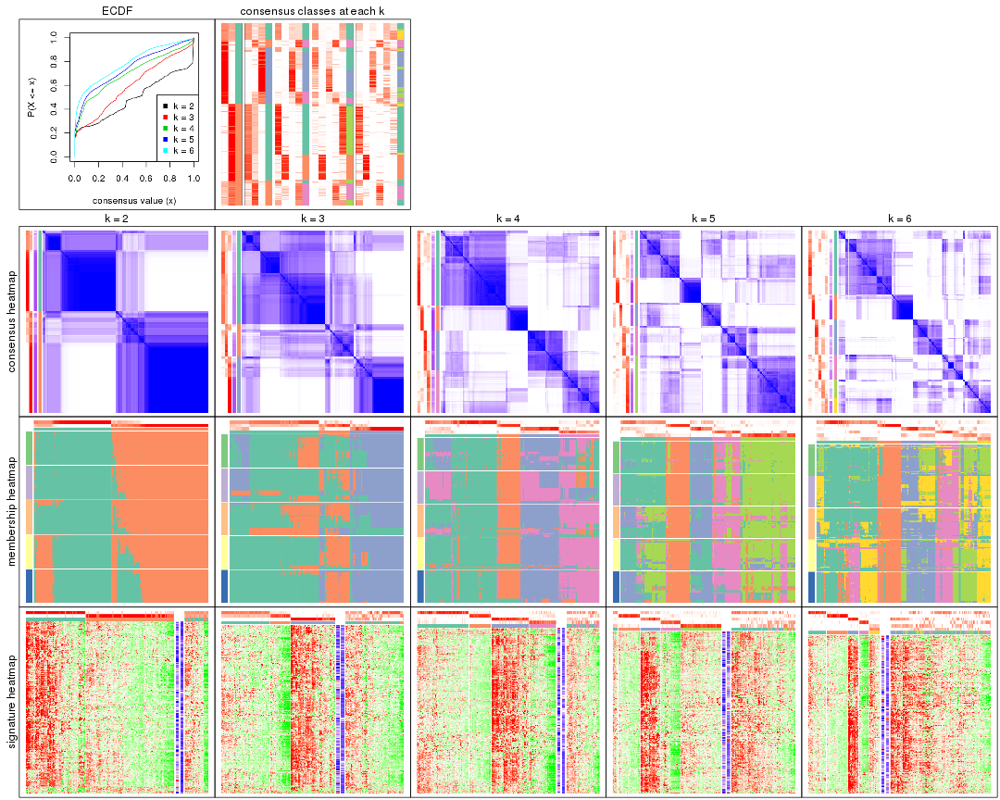

The plots are:

- The first row: a plot of the ECDF (Empirical cumulative distribution
  function) curves of the consensus matrix for each `k` and the heatmap of
  predicted classes for each `k`.
- The second row: heatmaps of the consensus matrix for each `k`.
- The third row: heatmaps of the membership matrix for each `k`.
- The fouth row: heatmaps of the signatures for each `k`.

All the plots in panels can be made by individual functions and they are
plotted later in this section.

`select_partition_number()` produces several plots showing different
statistics for choosing "optimized" `k`. There are following statistics:

- ECDF curves of the consensus matrix for each `k`;
- 1-PAC. [The PAC
  score](https://en.wikipedia.org/wiki/Consensus_clustering#Over-interpretation_potential_of_consensus_clustering)
  measures the proportion of the ambiguous subgrouping.
- Mean silhouette score.
- Concordance. The mean probability of fiting the consensus class ids in all
  partitions.
- Area increased. Denote $A_k$ as the area under the ECDF curve for current
  `k`, the area increased is defined as $A_k - A_{k-1}$.
- Rand index. The percent of pairs of samples that are both in a same cluster
  or both are not in a same cluster in the partition of k and k-1.
- Jaccard index. The ratio of pairs of samples are both in a same cluster in
  the partition of k and k-1 and the pairs of samples are both in a same
  cluster in the partition k or k-1.

The detailed explanations of these statistics can be found in [the cola
vignette](http://bioconductor.org/packages/devel/bioc/vignettes/cola/inst/doc/cola.html#toc_13).

Generally speaking, lower PAC score, higher mean silhouette score or higher
concordance corresponds to better partition. Rand index and Jaccard index
measure how similar the current partition is compared to partition with `k-1`.
If they are too similar, we won't accept `k` is better than `k-1`.

```r
select_partition_number(res)
```

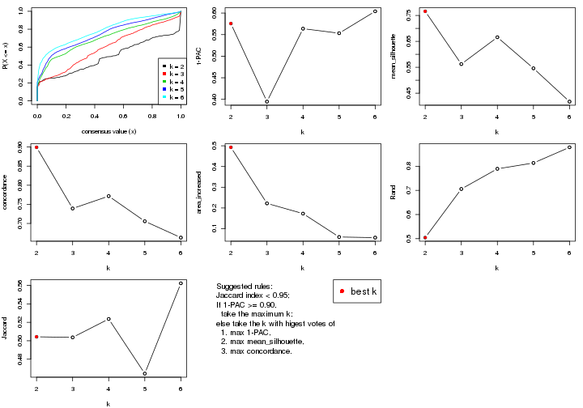

The numeric values for all these statistics can be obtained by `get_stats()`.

```r
get_stats(res)
```

```
#>   k 1-PAC mean_silhouette concordance area_increased  Rand Jaccard
#> 2 2 0.576           0.766       0.899         0.4927 0.504   0.504
#> 3 3 0.395           0.562       0.739         0.2221 0.706   0.504
#> 4 4 0.564           0.666       0.772         0.1727 0.789   0.524
#> 5 5 0.553           0.546       0.706         0.0599 0.814   0.464
#> 6 6 0.604           0.418       0.663         0.0569 0.878   0.562
```

`suggest_best_k()` suggests the best $k$ based on these statistics. The rules are as follows:

- All $k$ with Jaccard index larger than 0.95 are removed because the increase of
  the partition number does not provides enough extra information. If all $k$ are removed,
  the best $k$ is assigned by `NA`.
- For $k$ with 1-PAC larger than 0.9, the maximal $k$ is taken as the "best k". Other $k$ is called "optional k".
- If it does not fit the second rule. The $k$ with the highest vote of highest
  1-PAC, mean silhouette and concordance is taken as the "best k".

```r
suggest_best_k(res)
```

```
#> [1] 2
```


Following shows the table of the partitions (You need to click the **show/hide
code output** link to see it). The membership matrix (columns with name `p*`)
is inferred by
[`clue::cl_consensus()`](https://www.rdocumentation.org/link/cl_consensus?package=clue)
function with the `SE` method. Basically the value in the membership matrix
represents the probability to belong to a certain group. The finall class
label for an item is determined with the group with highest probability it
belongs to.

In `get_classes()` function, the entropy is calculated from the membership
matrix and the silhouette score is calculated from the consensus matrix.


<script>
$( function() {
	$( '#tabs-CV-mclust-get-classes' ).tabs();
} );
</script>
<div id='tabs-CV-mclust-get-classes'>
<ul>
<li><a href='#tab-CV-mclust-get-classes-1'>k = 2</a></li>
<li><a href='#tab-CV-mclust-get-classes-2'>k = 3</a></li>
<li><a href='#tab-CV-mclust-get-classes-3'>k = 4</a></li>
<li><a href='#tab-CV-mclust-get-classes-4'>k = 5</a></li>
<li><a href='#tab-CV-mclust-get-classes-5'>k = 6</a></li>
</ul>

<div id='tab-CV-mclust-get-classes-1'>
<p><a id='tab-CV-mclust-get-classes-1-a' style='color:#0366d6' href='#'>show/hide code output</a></p>
<pre><code class="r">cbind(get_classes(res, k = 2), get_membership(res, k = 2))
</code></pre>

<pre><code>#&gt;            class entropy silhouette    p1    p2
#&gt; SRR1380886     1  0.0376    0.87194 0.996 0.004
#&gt; SRR1074385     2  0.0376    0.88161 0.004 0.996
#&gt; SRR1374739     1  0.0000    0.87294 1.000 0.000
#&gt; SRR1097883     2  0.8267    0.56447 0.260 0.740
#&gt; SRR2167209     1  0.0376    0.87194 0.996 0.004
#&gt; SRR816541      2  0.0000    0.88427 0.000 1.000
#&gt; SRR663645      2  0.9129    0.55736 0.328 0.672
#&gt; SRR1381505     2  0.9850    0.35006 0.428 0.572
#&gt; SRR1416362     2  0.0000    0.88427 0.000 1.000
#&gt; SRR1318503     2  0.0000    0.88427 0.000 1.000
#&gt; SRR1341626     2  0.0000    0.88427 0.000 1.000
#&gt; SRR1382440     1  0.0000    0.87294 1.000 0.000
#&gt; SRR1088413     1  0.2236    0.85253 0.964 0.036
#&gt; SRR1082080     2  0.0000    0.88427 0.000 1.000
#&gt; SRR1455783     2  0.0000    0.88427 0.000 1.000
#&gt; SRR1447760     2  0.8144    0.66662 0.252 0.748
#&gt; SRR1487784     2  0.0000    0.88427 0.000 1.000
#&gt; SRR1331037     2  0.0000    0.88427 0.000 1.000
#&gt; SRR1095651     1  0.0000    0.87294 1.000 0.000
#&gt; SRR1078066     1  0.0000    0.87294 1.000 0.000
#&gt; SRR1120363     2  0.0000    0.88427 0.000 1.000
#&gt; SRR821231      1  0.9170    0.54274 0.668 0.332
#&gt; SRR1374373     2  0.0000    0.88427 0.000 1.000
#&gt; SRR1324519     2  0.0000    0.88427 0.000 1.000
#&gt; SRR1431121     1  0.9983    0.25350 0.524 0.476
#&gt; SRR1091032     2  0.0000    0.88427 0.000 1.000
#&gt; SRR1365575     2  0.9393    0.51466 0.356 0.644
#&gt; SRR1072972     1  0.9850    0.38634 0.572 0.428
#&gt; SRR1310690     2  0.0000    0.88427 0.000 1.000
#&gt; SRR1383037     1  0.0000    0.87294 1.000 0.000
#&gt; SRR1095479     1  0.0000    0.87294 1.000 0.000
#&gt; SRR1070403     1  0.0000    0.87294 1.000 0.000
#&gt; SRR1390203     2  0.9922    0.00675 0.448 0.552
#&gt; SRR1072007     2  0.2778    0.85527 0.048 0.952
#&gt; SRR1468787     1  0.0938    0.86806 0.988 0.012
#&gt; SRR1347959     2  0.0000    0.88427 0.000 1.000
#&gt; SRR1338513     1  0.0000    0.87294 1.000 0.000
#&gt; SRR812598      2  0.0000    0.88427 0.000 1.000
#&gt; SRR1446806     2  0.0000    0.88427 0.000 1.000
#&gt; SRR1394275     2  0.0000    0.88427 0.000 1.000
#&gt; SRR1443633     1  0.0376    0.87194 0.996 0.004
#&gt; SRR1087728     1  0.0000    0.87294 1.000 0.000
#&gt; SRR1098192     2  0.0000    0.88427 0.000 1.000
#&gt; SRR1093340     2  0.0000    0.88427 0.000 1.000
#&gt; SRR665405      1  0.0000    0.87294 1.000 0.000
#&gt; SRR657077      2  0.2778    0.85526 0.048 0.952
#&gt; SRR813208      1  0.0000    0.87294 1.000 0.000
#&gt; SRR1416074     2  0.0000    0.88427 0.000 1.000
#&gt; SRR1089688     2  0.9850    0.35522 0.428 0.572
#&gt; SRR1353461     1  0.0000    0.87294 1.000 0.000
#&gt; SRR1466321     2  0.0000    0.88427 0.000 1.000
#&gt; SRR1073021     1  0.0938    0.86806 0.988 0.012
#&gt; SRR1322816     2  0.0000    0.88427 0.000 1.000
#&gt; SRR1457727     1  0.9850    0.38634 0.572 0.428
#&gt; SRR1464226     1  0.2236    0.85256 0.964 0.036
#&gt; SRR1398863     1  0.9850    0.38634 0.572 0.428
#&gt; SRR1455631     1  0.8713    0.48289 0.708 0.292
#&gt; SRR1307808     2  0.0000    0.88427 0.000 1.000
#&gt; SRR1374585     2  0.7139    0.73163 0.196 0.804
#&gt; SRR1072104     2  0.8443    0.63967 0.272 0.728
#&gt; SRR1076868     2  0.0000    0.88427 0.000 1.000
#&gt; SRR1335984     2  0.2423    0.85561 0.040 0.960
#&gt; SRR1445939     1  0.9850    0.38634 0.572 0.428
#&gt; SRR1453047     2  0.0000    0.88427 0.000 1.000
#&gt; SRR1339788     1  0.0000    0.87294 1.000 0.000
#&gt; SRR1084323     1  0.9850    0.38634 0.572 0.428
#&gt; SRR1092937     1  0.9850    0.38634 0.572 0.428
#&gt; SRR1074090     2  0.0000    0.88427 0.000 1.000
#&gt; SRR1099833     1  0.0000    0.87294 1.000 0.000
#&gt; SRR1093434     1  0.0000    0.87294 1.000 0.000
#&gt; SRR1435857     2  0.0000    0.88427 0.000 1.000
#&gt; SRR1480347     2  0.0000    0.88427 0.000 1.000
#&gt; SRR1440787     2  0.9522    0.48320 0.372 0.628
#&gt; SRR1430202     2  0.0000    0.88427 0.000 1.000
#&gt; SRR1322730     2  0.9393    0.50860 0.356 0.644
#&gt; SRR811029      2  0.0000    0.88427 0.000 1.000
#&gt; SRR1390456     1  0.0000    0.87294 1.000 0.000
#&gt; SRR1381140     1  0.9850    0.38634 0.572 0.428
#&gt; SRR1388064     2  0.8608    0.62425 0.284 0.716
#&gt; SRR1093577     2  0.0000    0.88427 0.000 1.000
#&gt; SRR1414161     2  0.0000    0.88427 0.000 1.000
#&gt; SRR1328738     2  0.0000    0.88427 0.000 1.000
#&gt; SRR1311752     2  0.0000    0.88427 0.000 1.000
#&gt; SRR1445960     2  0.0000    0.88427 0.000 1.000
#&gt; SRR1403412     2  0.8267    0.56424 0.260 0.740
#&gt; SRR2166748     1  0.0000    0.87294 1.000 0.000
#&gt; SRR821666      2  0.0000    0.88427 0.000 1.000
#&gt; SRR1330746     1  0.0000    0.87294 1.000 0.000
#&gt; SRR1327872     2  0.9170    0.55605 0.332 0.668
#&gt; SRR1100800     2  0.0000    0.88427 0.000 1.000
#&gt; SRR1075174     1  0.9850    0.38634 0.572 0.428
#&gt; SRR1434436     2  0.0000    0.88427 0.000 1.000
#&gt; SRR1389409     1  0.9686    0.26920 0.604 0.396
#&gt; SRR1085310     2  0.9922    0.27624 0.448 0.552
#&gt; SRR1376718     2  0.9393    0.51466 0.356 0.644
#&gt; SRR808590      2  0.7528    0.71038 0.216 0.784
#&gt; SRR1084128     2  0.0000    0.88427 0.000 1.000
#&gt; SRR1361692     2  0.8763    0.60532 0.296 0.704
#&gt; SRR1431493     1  0.0000    0.87294 1.000 0.000
#&gt; SRR1409084     1  0.1184    0.86602 0.984 0.016
#&gt; SRR2166214     1  0.0000    0.87294 1.000 0.000
#&gt; SRR1324102     2  0.0000    0.88427 0.000 1.000
#&gt; SRR1079754     2  0.5408    0.79763 0.124 0.876
#&gt; SRR1442127     1  0.0000    0.87294 1.000 0.000
#&gt; SRR1076244     2  0.7528    0.71178 0.216 0.784
#&gt; SRR1330901     2  0.0000    0.88427 0.000 1.000
#&gt; SRR1073167     2  0.0000    0.88427 0.000 1.000
#&gt; SRR1357541     1  0.3274    0.83332 0.940 0.060
#&gt; SRR811607      2  0.0000    0.88427 0.000 1.000
#&gt; SRR1468931     1  0.0000    0.87294 1.000 0.000
#&gt; SRR1474908     2  0.0000    0.88427 0.000 1.000
#&gt; SRR1309875     2  0.8608    0.51903 0.284 0.716
#&gt; SRR598792      1  0.0000    0.87294 1.000 0.000
#&gt; SRR1088537     2  0.0000    0.88427 0.000 1.000
#&gt; SRR1457682     2  0.9815    0.11854 0.420 0.580
#&gt; SRR1454289     2  0.0000    0.88427 0.000 1.000
#&gt; SRR1069352     1  0.0000    0.87294 1.000 0.000
#&gt; SRR1472728     2  0.0000    0.88427 0.000 1.000
#&gt; SRR1091144     1  0.0376    0.87194 0.996 0.004
#&gt; SRR1319118     1  0.0376    0.87194 0.996 0.004
#&gt; SRR1403611     1  0.0000    0.87294 1.000 0.000
#&gt; SRR1397762     1  0.0376    0.87181 0.996 0.004
#&gt; SRR1317387     1  0.0000    0.87294 1.000 0.000
#&gt; SRR1376426     2  0.0000    0.88427 0.000 1.000
#&gt; SRR1097777     2  0.1184    0.87412 0.016 0.984
#&gt; SRR1365743     1  0.0000    0.87294 1.000 0.000
#&gt; SRR1458992     2  0.0000    0.88427 0.000 1.000
#&gt; SRR1089537     1  0.0000    0.87294 1.000 0.000
#&gt; SRR1397744     2  0.0000    0.88427 0.000 1.000
#&gt; SRR1453893     2  0.7528    0.71035 0.216 0.784
#&gt; SRR1098543     2  0.0000    0.88427 0.000 1.000
#&gt; SRR1321765     1  0.0672    0.87026 0.992 0.008
#&gt; SRR1440032     2  0.9209    0.54370 0.336 0.664
#&gt; SRR1404507     2  0.7299    0.72339 0.204 0.796
#&gt; SRR1404856     1  0.3733    0.82379 0.928 0.072
#&gt; SRR812745      1  0.9248    0.52865 0.660 0.340
#&gt; SRR1417524     1  0.0000    0.87294 1.000 0.000
#&gt; SRR1407334     2  0.6801    0.74739 0.180 0.820
#&gt; SRR1453991     2  0.0000    0.88427 0.000 1.000
#&gt; SRR1415938     1  0.9850    0.38634 0.572 0.428
#&gt; SRR1081259     2  0.0000    0.88427 0.000 1.000
#&gt; SRR1436187     1  0.9710    0.24656 0.600 0.400
#&gt; SRR1431948     1  0.0000    0.87294 1.000 0.000
#&gt; SRR1453277     2  0.0000    0.88427 0.000 1.000
#&gt; SRR1095407     1  0.0000    0.87294 1.000 0.000
#&gt; SRR1359694     2  0.0000    0.88427 0.000 1.000
#&gt; SRR656982      1  0.2603    0.84671 0.956 0.044
#&gt; SRR1354338     2  0.8499    0.63397 0.276 0.724
#&gt; SRR1088291     2  0.0000    0.88427 0.000 1.000
#&gt; SRR1080624     2  0.0000    0.88427 0.000 1.000
#&gt; SRR2166708     1  0.0000    0.87294 1.000 0.000
#&gt; SRR1393572     2  0.0000    0.88427 0.000 1.000
#&gt; SRR1429912     2  0.0000    0.88427 0.000 1.000
#&gt; SRR1421048     2  0.0000    0.88427 0.000 1.000
#&gt; SRR1434999     1  0.0000    0.87294 1.000 0.000
#&gt; SRR656457      1  0.0000    0.87294 1.000 0.000
#&gt; SRR1098928     1  0.0000    0.87294 1.000 0.000
#&gt; SRR1343967     2  0.0000    0.88427 0.000 1.000
#&gt; SRR1360766     1  0.9850    0.38634 0.572 0.428
#&gt; SRR1464724     2  0.8144    0.67256 0.252 0.748
#&gt; SRR1101542     2  0.9983    0.22232 0.476 0.524
#&gt; SRR1401528     1  0.6148    0.75229 0.848 0.152
#&gt; SRR1071519     1  0.0000    0.87294 1.000 0.000
#&gt; SRR1086070     1  0.9850    0.38634 0.572 0.428
#&gt; SRR1358645     2  0.0000    0.88427 0.000 1.000
#&gt; SRR819771      1  0.0000    0.87294 1.000 0.000
#&gt; SRR1418433     1  0.0000    0.87294 1.000 0.000
#&gt; SRR821050      2  0.0000    0.88427 0.000 1.000
#&gt; SRR1402091     1  0.9850    0.38634 0.572 0.428
#&gt; SRR1322028     2  0.0000    0.88427 0.000 1.000
#&gt; SRR1452556     2  0.7376    0.71909 0.208 0.792
#&gt; SRR1340047     2  0.0000    0.88427 0.000 1.000
#&gt; SRR1418302     2  0.1633    0.86870 0.024 0.976
#&gt; SRR1073991     2  0.8016    0.59865 0.244 0.756
#&gt; SRR1085187     1  0.0672    0.87021 0.992 0.008
#&gt; SRR1357618     1  0.0000    0.87294 1.000 0.000
#&gt; SRR1487764     1  0.0000    0.87294 1.000 0.000
#&gt; SRR1075336     2  0.0000    0.88427 0.000 1.000
#&gt; SRR1365471     2  0.0000    0.88427 0.000 1.000
#&gt; SRR1414613     2  0.0000    0.88427 0.000 1.000
#&gt; SRR658719      1  0.9833    0.39404 0.576 0.424
#&gt; SRR1475128     1  0.0000    0.87294 1.000 0.000
#&gt; SRR1367630     2  0.9795    0.38165 0.416 0.584
#&gt; SRR1481146     1  0.2423    0.84526 0.960 0.040
#&gt; SRR1465674     1  0.0376    0.87194 0.996 0.004
#&gt; SRR1327303     1  0.9775    0.41551 0.588 0.412
#&gt; SRR1390391     2  0.7219    0.67506 0.200 0.800
#&gt; SRR1326020     1  0.9850    0.38634 0.572 0.428
#&gt; SRR1381953     1  0.6801    0.73355 0.820 0.180
#&gt; SRR1082544     2  0.9358    0.51939 0.352 0.648
#&gt; SRR810761      1  0.0672    0.87021 0.992 0.008
#&gt; SRR1070764     1  0.0000    0.87294 1.000 0.000
#&gt; SRR1415919     1  0.0000    0.87294 1.000 0.000
#&gt; SRR1490404     2  0.0000    0.88427 0.000 1.000
#&gt; SRR1416773     1  0.0672    0.87026 0.992 0.008
#&gt; SRR1377492     1  0.0376    0.87194 0.996 0.004
#&gt; SRR1334314     2  0.0000    0.88427 0.000 1.000
</code></pre>

<script>
$('#tab-CV-mclust-get-classes-1-a').parent().next().next().hide();
$('#tab-CV-mclust-get-classes-1-a').click(function(){
  $('#tab-CV-mclust-get-classes-1-a').parent().next().next().toggle();
  return(false);
});
</script>
</div>

<div id='tab-CV-mclust-get-classes-2'>
<p><a id='tab-CV-mclust-get-classes-2-a' style='color:#0366d6' href='#'>show/hide code output</a></p>
<pre><code class="r">cbind(get_classes(res, k = 3), get_membership(res, k = 3))
</code></pre>

<pre><code>#&gt;            class entropy silhouette    p1    p2    p3
#&gt; SRR1380886     3  0.5897    0.65661 0.132 0.076 0.792
#&gt; SRR1074385     1  0.5529    0.64049 0.704 0.296 0.000
#&gt; SRR1374739     3  0.0000    0.84374 0.000 0.000 1.000
#&gt; SRR1097883     1  0.9606    0.39831 0.428 0.368 0.204
#&gt; SRR2167209     3  0.6305    0.18847 0.000 0.484 0.516
#&gt; SRR816541      1  0.4121    0.43133 0.832 0.168 0.000
#&gt; SRR663645      2  0.5746    0.56843 0.180 0.780 0.040
#&gt; SRR1381505     2  0.3528    0.64457 0.092 0.892 0.016
#&gt; SRR1416362     1  0.3879    0.42747 0.848 0.152 0.000
#&gt; SRR1318503     1  0.6126    0.57515 0.600 0.400 0.000
#&gt; SRR1341626     1  0.4605    0.46887 0.796 0.204 0.000
#&gt; SRR1382440     3  0.0000    0.84374 0.000 0.000 1.000
#&gt; SRR1088413     3  0.6867    0.51504 0.040 0.288 0.672
#&gt; SRR1082080     1  0.3941    0.42334 0.844 0.156 0.000
#&gt; SRR1455783     1  0.5733    0.63630 0.676 0.324 0.000
#&gt; SRR1447760     2  0.4920    0.64671 0.108 0.840 0.052
#&gt; SRR1487784     1  0.3816    0.43127 0.852 0.148 0.000
#&gt; SRR1331037     1  0.4750    0.58659 0.784 0.216 0.000
#&gt; SRR1095651     3  0.0000    0.84374 0.000 0.000 1.000
#&gt; SRR1078066     3  0.4062    0.70532 0.000 0.164 0.836
#&gt; SRR1120363     1  0.6079    0.60452 0.612 0.388 0.000
#&gt; SRR821231      1  0.8316    0.26117 0.496 0.080 0.424
#&gt; SRR1374373     1  0.5760    0.63545 0.672 0.328 0.000
#&gt; SRR1324519     1  0.4062    0.42837 0.836 0.164 0.000
#&gt; SRR1431121     1  0.9772    0.36150 0.440 0.268 0.292
#&gt; SRR1091032     1  0.5529    0.64049 0.704 0.296 0.000
#&gt; SRR1365575     2  0.3377    0.64508 0.092 0.896 0.012
#&gt; SRR1072972     1  0.8310    0.26893 0.500 0.080 0.420
#&gt; SRR1310690     1  0.3879    0.43419 0.848 0.152 0.000
#&gt; SRR1383037     3  0.0000    0.84374 0.000 0.000 1.000
#&gt; SRR1095479     3  0.0000    0.84374 0.000 0.000 1.000
#&gt; SRR1070403     3  0.0000    0.84374 0.000 0.000 1.000
#&gt; SRR1390203     1  0.9399    0.43592 0.500 0.292 0.208
#&gt; SRR1072007     2  0.6205    0.09166 0.336 0.656 0.008
#&gt; SRR1468787     3  0.6651    0.48942 0.024 0.320 0.656
#&gt; SRR1347959     1  0.3752    0.43472 0.856 0.144 0.000
#&gt; SRR1338513     3  0.1643    0.81595 0.000 0.044 0.956
#&gt; SRR812598      1  0.5706    0.50927 0.680 0.320 0.000
#&gt; SRR1446806     1  0.5529    0.64049 0.704 0.296 0.000
#&gt; SRR1394275     1  0.5529    0.64049 0.704 0.296 0.000
#&gt; SRR1443633     3  0.2486    0.80374 0.008 0.060 0.932
#&gt; SRR1087728     3  0.0000    0.84374 0.000 0.000 1.000
#&gt; SRR1098192     1  0.6168    0.58833 0.588 0.412 0.000
#&gt; SRR1093340     1  0.3941    0.42334 0.844 0.156 0.000
#&gt; SRR665405      3  0.3038    0.76067 0.000 0.104 0.896
#&gt; SRR657077      1  0.6282    0.58393 0.612 0.384 0.004
#&gt; SRR813208      3  0.0000    0.84374 0.000 0.000 1.000
#&gt; SRR1416074     1  0.3879    0.42755 0.848 0.152 0.000
#&gt; SRR1089688     2  0.4821    0.64401 0.064 0.848 0.088
#&gt; SRR1353461     3  0.0000    0.84374 0.000 0.000 1.000
#&gt; SRR1466321     1  0.5529    0.64049 0.704 0.296 0.000
#&gt; SRR1073021     3  0.6168    0.59920 0.036 0.224 0.740
#&gt; SRR1322816     1  0.5859    0.57309 0.656 0.344 0.000
#&gt; SRR1457727     1  0.9457    0.39292 0.500 0.236 0.264
#&gt; SRR1464226     3  0.6522    0.49794 0.032 0.272 0.696
#&gt; SRR1398863     1  0.8316    0.26117 0.496 0.080 0.424
#&gt; SRR1455631     2  0.6696    0.36278 0.020 0.632 0.348
#&gt; SRR1307808     1  0.5859    0.62813 0.656 0.344 0.000
#&gt; SRR1374585     2  0.6688    0.43203 0.408 0.580 0.012
#&gt; SRR1072104     2  0.4575    0.60053 0.160 0.828 0.012
#&gt; SRR1076868     1  0.4702    0.44628 0.788 0.212 0.000
#&gt; SRR1335984     1  0.5529    0.64049 0.704 0.296 0.000
#&gt; SRR1445939     1  0.9464    0.40560 0.500 0.248 0.252
#&gt; SRR1453047     1  0.5529    0.64049 0.704 0.296 0.000
#&gt; SRR1339788     3  0.0000    0.84374 0.000 0.000 1.000
#&gt; SRR1084323     1  0.8316    0.26117 0.496 0.080 0.424
#&gt; SRR1092937     1  0.8310    0.26893 0.500 0.080 0.420
#&gt; SRR1074090     1  0.3941    0.42334 0.844 0.156 0.000
#&gt; SRR1099833     3  0.0000    0.84374 0.000 0.000 1.000
#&gt; SRR1093434     3  0.0000    0.84374 0.000 0.000 1.000
#&gt; SRR1435857     1  0.5926    0.62432 0.644 0.356 0.000
#&gt; SRR1480347     1  0.4452    0.44302 0.808 0.192 0.000
#&gt; SRR1440787     2  0.2446    0.66226 0.052 0.936 0.012
#&gt; SRR1430202     1  0.5529    0.64049 0.704 0.296 0.000
#&gt; SRR1322730     2  0.5719    0.59343 0.156 0.792 0.052
#&gt; SRR811029      1  0.5529    0.64049 0.704 0.296 0.000
#&gt; SRR1390456     3  0.0000    0.84374 0.000 0.000 1.000
#&gt; SRR1381140     1  0.9239    0.35204 0.500 0.172 0.328
#&gt; SRR1388064     2  0.4514    0.63554 0.156 0.832 0.012
#&gt; SRR1093577     1  0.6280    0.51230 0.540 0.460 0.000
#&gt; SRR1414161     1  0.5529    0.64049 0.704 0.296 0.000
#&gt; SRR1328738     1  0.5948    0.62224 0.640 0.360 0.000
#&gt; SRR1311752     1  0.3941    0.42334 0.844 0.156 0.000
#&gt; SRR1445960     1  0.6062    0.58558 0.616 0.384 0.000
#&gt; SRR1403412     1  0.6659    0.62700 0.668 0.304 0.028
#&gt; SRR2166748     3  0.0000    0.84374 0.000 0.000 1.000
#&gt; SRR821666      1  0.3941    0.42334 0.844 0.156 0.000
#&gt; SRR1330746     3  0.0000    0.84374 0.000 0.000 1.000
#&gt; SRR1327872     2  0.4563    0.64893 0.112 0.852 0.036
#&gt; SRR1100800     1  0.5560    0.64036 0.700 0.300 0.000
#&gt; SRR1075174     1  0.9452    0.39798 0.500 0.232 0.268
#&gt; SRR1434436     1  0.5529    0.64049 0.704 0.296 0.000
#&gt; SRR1389409     2  0.3445    0.64720 0.088 0.896 0.016
#&gt; SRR1085310     2  0.9991   -0.01371 0.312 0.344 0.344
#&gt; SRR1376718     2  0.3459    0.64240 0.096 0.892 0.012
#&gt; SRR808590      2  0.6427    0.49623 0.348 0.640 0.012
#&gt; SRR1084128     1  0.3816    0.46427 0.852 0.148 0.000
#&gt; SRR1361692     2  0.4742    0.65003 0.104 0.848 0.048
#&gt; SRR1431493     3  0.0000    0.84374 0.000 0.000 1.000
#&gt; SRR1409084     3  0.6301    0.52919 0.028 0.260 0.712
#&gt; SRR2166214     3  0.3267    0.75021 0.000 0.116 0.884
#&gt; SRR1324102     1  0.5650    0.50152 0.688 0.312 0.000
#&gt; SRR1079754     1  0.6396    0.29312 0.664 0.320 0.016
#&gt; SRR1442127     3  0.0000    0.84374 0.000 0.000 1.000
#&gt; SRR1076244     2  0.6647   -0.12973 0.452 0.540 0.008
#&gt; SRR1330901     1  0.3879    0.45697 0.848 0.152 0.000
#&gt; SRR1073167     1  0.4504    0.45098 0.804 0.196 0.000
#&gt; SRR1357541     3  0.7274    0.20388 0.028 0.452 0.520
#&gt; SRR811607      1  0.5529    0.64049 0.704 0.296 0.000
#&gt; SRR1468931     3  0.0000    0.84374 0.000 0.000 1.000
#&gt; SRR1474908     1  0.5529    0.64049 0.704 0.296 0.000
#&gt; SRR1309875     1  0.8726    0.51220 0.564 0.296 0.140
#&gt; SRR598792      3  0.0000    0.84374 0.000 0.000 1.000
#&gt; SRR1088537     1  0.5859    0.52980 0.656 0.344 0.000
#&gt; SRR1457682     1  0.9367    0.44033 0.504 0.292 0.204
#&gt; SRR1454289     1  0.5760    0.63511 0.672 0.328 0.000
#&gt; SRR1069352     3  0.0000    0.84374 0.000 0.000 1.000
#&gt; SRR1472728     1  0.5948    0.56395 0.640 0.360 0.000
#&gt; SRR1091144     2  0.6516   -0.11752 0.004 0.516 0.480
#&gt; SRR1319118     3  0.6231    0.63158 0.148 0.080 0.772
#&gt; SRR1403611     3  0.0000    0.84374 0.000 0.000 1.000
#&gt; SRR1397762     3  0.8810    0.28109 0.172 0.252 0.576
#&gt; SRR1317387     3  0.0000    0.84374 0.000 0.000 1.000
#&gt; SRR1376426     1  0.3941    0.42334 0.844 0.156 0.000
#&gt; SRR1097777     1  0.5529    0.64049 0.704 0.296 0.000
#&gt; SRR1365743     3  0.0000    0.84374 0.000 0.000 1.000
#&gt; SRR1458992     1  0.5621    0.63952 0.692 0.308 0.000
#&gt; SRR1089537     3  0.5216    0.61059 0.000 0.260 0.740
#&gt; SRR1397744     1  0.5560    0.64036 0.700 0.300 0.000
#&gt; SRR1453893     2  0.5848    0.54385 0.268 0.720 0.012
#&gt; SRR1098543     1  0.5529    0.64049 0.704 0.296 0.000
#&gt; SRR1321765     2  0.6291   -0.06647 0.000 0.532 0.468
#&gt; SRR1440032     2  0.4390    0.61389 0.148 0.840 0.012
#&gt; SRR1404507     2  0.5122    0.51501 0.200 0.788 0.012
#&gt; SRR1404856     2  0.6849    0.19807 0.020 0.600 0.380
#&gt; SRR812745      1  0.9457    0.39955 0.500 0.236 0.264
#&gt; SRR1417524     3  0.0000    0.84374 0.000 0.000 1.000
#&gt; SRR1407334     2  0.6404    0.47647 0.344 0.644 0.012
#&gt; SRR1453991     1  0.6079    0.60452 0.612 0.388 0.000
#&gt; SRR1415938     1  0.9460    0.41941 0.500 0.260 0.240
#&gt; SRR1081259     1  0.5706    0.63726 0.680 0.320 0.000
#&gt; SRR1436187     2  0.2599    0.66216 0.052 0.932 0.016
#&gt; SRR1431948     3  0.0000    0.84374 0.000 0.000 1.000
#&gt; SRR1453277     1  0.5529    0.64049 0.704 0.296 0.000
#&gt; SRR1095407     3  0.6192    0.33845 0.000 0.420 0.580
#&gt; SRR1359694     1  0.3941    0.43672 0.844 0.156 0.000
#&gt; SRR656982      3  0.6744    0.51247 0.032 0.300 0.668
#&gt; SRR1354338     2  0.3845    0.63148 0.116 0.872 0.012
#&gt; SRR1088291     1  0.6008    0.61537 0.628 0.372 0.000
#&gt; SRR1080624     1  0.5678    0.63810 0.684 0.316 0.000
#&gt; SRR2166708     3  0.0000    0.84374 0.000 0.000 1.000
#&gt; SRR1393572     1  0.5529    0.64049 0.704 0.296 0.000
#&gt; SRR1429912     1  0.5988    0.61871 0.632 0.368 0.000
#&gt; SRR1421048     1  0.6260    0.52900 0.552 0.448 0.000
#&gt; SRR1434999     3  0.0000    0.84374 0.000 0.000 1.000
#&gt; SRR656457      3  0.0000    0.84374 0.000 0.000 1.000
#&gt; SRR1098928     3  0.0000    0.84374 0.000 0.000 1.000
#&gt; SRR1343967     1  0.3941    0.42334 0.844 0.156 0.000
#&gt; SRR1360766     1  0.9419    0.36458 0.496 0.208 0.296
#&gt; SRR1464724     2  0.7199    0.55813 0.204 0.704 0.092
#&gt; SRR1101542     2  0.0829    0.66421 0.004 0.984 0.012
#&gt; SRR1401528     3  0.8039   -0.08016 0.428 0.064 0.508
#&gt; SRR1071519     3  0.0000    0.84374 0.000 0.000 1.000
#&gt; SRR1086070     1  0.8316    0.26117 0.496 0.080 0.424
#&gt; SRR1358645     1  0.5529    0.64049 0.704 0.296 0.000
#&gt; SRR819771      3  0.0000    0.84374 0.000 0.000 1.000
#&gt; SRR1418433     3  0.0424    0.83924 0.000 0.008 0.992
#&gt; SRR821050      1  0.5835    0.63109 0.660 0.340 0.000
#&gt; SRR1402091     1  0.9419    0.36609 0.496 0.208 0.296
#&gt; SRR1322028     1  0.5882    0.61686 0.652 0.348 0.000
#&gt; SRR1452556     2  0.5122    0.55904 0.200 0.788 0.012
#&gt; SRR1340047     1  0.5529    0.64049 0.704 0.296 0.000
#&gt; SRR1418302     1  0.6082    0.63395 0.692 0.296 0.012
#&gt; SRR1073991     1  0.6964    0.61321 0.684 0.264 0.052
#&gt; SRR1085187     2  0.6308   -0.15882 0.000 0.508 0.492
#&gt; SRR1357618     3  0.0000    0.84374 0.000 0.000 1.000
#&gt; SRR1487764     3  0.0000    0.84374 0.000 0.000 1.000
#&gt; SRR1075336     1  0.5529    0.64049 0.704 0.296 0.000
#&gt; SRR1365471     1  0.3941    0.42334 0.844 0.156 0.000
#&gt; SRR1414613     1  0.5882    0.55337 0.652 0.348 0.000
#&gt; SRR658719      1  0.8316    0.26117 0.496 0.080 0.424
#&gt; SRR1475128     3  0.0000    0.84374 0.000 0.000 1.000
#&gt; SRR1367630     2  0.3966    0.65122 0.100 0.876 0.024
#&gt; SRR1481146     3  0.5785    0.47411 0.000 0.332 0.668
#&gt; SRR1465674     3  0.6252    0.29281 0.000 0.444 0.556
#&gt; SRR1327303     1  0.8255    0.25181 0.496 0.076 0.428
#&gt; SRR1390391     1  0.5928    0.63669 0.696 0.296 0.008
#&gt; SRR1326020     1  0.9303    0.35701 0.500 0.184 0.316
#&gt; SRR1381953     3  0.8304   -0.00683 0.416 0.080 0.504
#&gt; SRR1082544     2  0.1620    0.66512 0.024 0.964 0.012
#&gt; SRR810761      3  0.6475    0.55002 0.028 0.280 0.692
#&gt; SRR1070764     3  0.0000    0.84374 0.000 0.000 1.000
#&gt; SRR1415919     3  0.0000    0.84374 0.000 0.000 1.000
#&gt; SRR1490404     1  0.3941    0.42334 0.844 0.156 0.000
#&gt; SRR1416773     2  0.6111    0.19178 0.000 0.604 0.396
#&gt; SRR1377492     3  0.6025    0.63142 0.028 0.232 0.740
#&gt; SRR1334314     1  0.6140    0.59295 0.596 0.404 0.000
</code></pre>

<script>
$('#tab-CV-mclust-get-classes-2-a').parent().next().next().hide();
$('#tab-CV-mclust-get-classes-2-a').click(function(){
  $('#tab-CV-mclust-get-classes-2-a').parent().next().next().toggle();
  return(false);
});
</script>
</div>

<div id='tab-CV-mclust-get-classes-3'>
<p><a id='tab-CV-mclust-get-classes-3-a' style='color:#0366d6' href='#'>show/hide code output</a></p>
<pre><code class="r">cbind(get_classes(res, k = 4), get_membership(res, k = 4))
</code></pre>

<pre><code>#&gt;            class entropy silhouette    p1    p2    p3    p4
#&gt; SRR1380886     1  0.8203     0.2745 0.464 0.024 0.296 0.216
#&gt; SRR1074385     1  0.1452     0.7418 0.956 0.008 0.000 0.036
#&gt; SRR1374739     3  0.2408     0.8475 0.000 0.036 0.920 0.044
#&gt; SRR1097883     1  0.5859     0.3733 0.588 0.004 0.032 0.376
#&gt; SRR2167209     4  0.3993     0.5959 0.028 0.020 0.104 0.848
#&gt; SRR816541      2  0.1867     0.9192 0.072 0.928 0.000 0.000
#&gt; SRR663645      4  0.5451     0.4385 0.464 0.008 0.004 0.524
#&gt; SRR1381505     4  0.5394     0.5734 0.060 0.228 0.000 0.712
#&gt; SRR1416362     2  0.1716     0.9223 0.064 0.936 0.000 0.000
#&gt; SRR1318503     1  0.1722     0.7354 0.944 0.048 0.000 0.008
#&gt; SRR1341626     2  0.6669     0.2742 0.104 0.564 0.000 0.332
#&gt; SRR1382440     3  0.3444     0.8425 0.000 0.000 0.816 0.184
#&gt; SRR1088413     4  0.7554     0.3221 0.180 0.020 0.232 0.568
#&gt; SRR1082080     2  0.1716     0.9223 0.064 0.936 0.000 0.000
#&gt; SRR1455783     1  0.0895     0.7413 0.976 0.020 0.000 0.004
#&gt; SRR1447760     4  0.5923     0.6264 0.216 0.100 0.000 0.684
#&gt; SRR1487784     2  0.1716     0.9223 0.064 0.936 0.000 0.000
#&gt; SRR1331037     2  0.3907     0.7342 0.232 0.768 0.000 0.000
#&gt; SRR1095651     3  0.3668     0.8428 0.000 0.004 0.808 0.188
#&gt; SRR1078066     4  0.6296    -0.0497 0.028 0.020 0.400 0.552
#&gt; SRR1120363     1  0.3161     0.6370 0.864 0.012 0.000 0.124
#&gt; SRR821231      1  0.7437     0.4216 0.536 0.004 0.248 0.212
#&gt; SRR1374373     1  0.0779     0.7422 0.980 0.016 0.000 0.004
#&gt; SRR1324519     2  0.1716     0.9223 0.064 0.936 0.000 0.000
#&gt; SRR1431121     1  0.5740     0.6069 0.700 0.000 0.092 0.208
#&gt; SRR1091032     1  0.1004     0.7410 0.972 0.024 0.000 0.004
#&gt; SRR1365575     4  0.5354     0.5677 0.056 0.232 0.000 0.712
#&gt; SRR1072972     1  0.7680     0.4665 0.552 0.020 0.232 0.196
#&gt; SRR1310690     2  0.1792     0.9211 0.068 0.932 0.000 0.000
#&gt; SRR1383037     3  0.0469     0.8563 0.000 0.012 0.988 0.000
#&gt; SRR1095479     3  0.4019     0.8377 0.000 0.012 0.792 0.196
#&gt; SRR1070403     3  0.2494     0.8455 0.000 0.036 0.916 0.048
#&gt; SRR1390203     1  0.5978     0.6406 0.732 0.028 0.088 0.152
#&gt; SRR1072007     1  0.5292    -0.3617 0.512 0.008 0.000 0.480
#&gt; SRR1468787     4  0.5079     0.5482 0.048 0.020 0.152 0.780
#&gt; SRR1347959     2  0.1792     0.9211 0.068 0.932 0.000 0.000
#&gt; SRR1338513     3  0.4775     0.7916 0.028 0.000 0.740 0.232
#&gt; SRR812598      2  0.4277     0.6660 0.280 0.720 0.000 0.000
#&gt; SRR1446806     1  0.0592     0.7439 0.984 0.016 0.000 0.000
#&gt; SRR1394275     1  0.0707     0.7431 0.980 0.020 0.000 0.000
#&gt; SRR1443633     3  0.6502     0.7117 0.084 0.020 0.660 0.236
#&gt; SRR1087728     3  0.0592     0.8596 0.000 0.000 0.984 0.016
#&gt; SRR1098192     1  0.0937     0.7402 0.976 0.012 0.000 0.012
#&gt; SRR1093340     2  0.1716     0.9223 0.064 0.936 0.000 0.000
#&gt; SRR665405      3  0.4176     0.8338 0.008 0.012 0.800 0.180
#&gt; SRR657077      1  0.2908     0.6914 0.896 0.040 0.000 0.064
#&gt; SRR813208      3  0.0469     0.8563 0.000 0.012 0.988 0.000
#&gt; SRR1416074     2  0.1716     0.9223 0.064 0.936 0.000 0.000
#&gt; SRR1089688     4  0.5175     0.5947 0.328 0.012 0.004 0.656
#&gt; SRR1353461     3  0.1059     0.8555 0.012 0.016 0.972 0.000
#&gt; SRR1466321     1  0.1042     0.7407 0.972 0.020 0.000 0.008
#&gt; SRR1073021     4  0.6441     0.4047 0.084 0.020 0.228 0.668
#&gt; SRR1322816     1  0.4679     0.2677 0.648 0.352 0.000 0.000
#&gt; SRR1457727     1  0.6540     0.5647 0.648 0.004 0.144 0.204
#&gt; SRR1464226     4  0.7448     0.3921 0.196 0.012 0.228 0.564
#&gt; SRR1398863     1  0.7844     0.4460 0.536 0.024 0.244 0.196
#&gt; SRR1455631     4  0.4362     0.6707 0.136 0.008 0.040 0.816
#&gt; SRR1307808     1  0.3402     0.6388 0.832 0.164 0.000 0.004
#&gt; SRR1374585     4  0.5543     0.4050 0.028 0.360 0.000 0.612
#&gt; SRR1072104     4  0.5337     0.5007 0.424 0.012 0.000 0.564
#&gt; SRR1076868     2  0.2773     0.9025 0.072 0.900 0.000 0.028
#&gt; SRR1335984     1  0.1109     0.7425 0.968 0.004 0.000 0.028
#&gt; SRR1445939     1  0.7343     0.5566 0.612 0.028 0.180 0.180
#&gt; SRR1453047     1  0.1909     0.7373 0.940 0.048 0.004 0.008
#&gt; SRR1339788     3  0.4466     0.8436 0.000 0.036 0.784 0.180
#&gt; SRR1084323     1  0.7848     0.4680 0.544 0.028 0.240 0.188
#&gt; SRR1092937     1  0.7085     0.5064 0.588 0.004 0.216 0.192
#&gt; SRR1074090     2  0.1716     0.9223 0.064 0.936 0.000 0.000
#&gt; SRR1099833     3  0.3768     0.8360 0.000 0.008 0.808 0.184
#&gt; SRR1093434     3  0.2227     0.8518 0.000 0.036 0.928 0.036
#&gt; SRR1435857     1  0.0657     0.7419 0.984 0.012 0.000 0.004
#&gt; SRR1480347     2  0.1867     0.9192 0.072 0.928 0.000 0.000
#&gt; SRR1440787     4  0.5361     0.5897 0.068 0.208 0.000 0.724
#&gt; SRR1430202     1  0.0592     0.7439 0.984 0.016 0.000 0.000
#&gt; SRR1322730     4  0.5392     0.4461 0.460 0.012 0.000 0.528
#&gt; SRR811029      1  0.1339     0.7426 0.964 0.024 0.008 0.004
#&gt; SRR1390456     3  0.0779     0.8596 0.000 0.004 0.980 0.016
#&gt; SRR1381140     1  0.7793     0.4802 0.552 0.028 0.236 0.184
#&gt; SRR1388064     4  0.5757     0.5600 0.076 0.240 0.000 0.684
#&gt; SRR1093577     1  0.4594     0.2854 0.712 0.008 0.000 0.280
#&gt; SRR1414161     1  0.0469     0.7440 0.988 0.012 0.000 0.000
#&gt; SRR1328738     1  0.1584     0.7323 0.952 0.012 0.000 0.036
#&gt; SRR1311752     2  0.1716     0.9223 0.064 0.936 0.000 0.000
#&gt; SRR1445960     1  0.2530     0.6852 0.888 0.112 0.000 0.000
#&gt; SRR1403412     1  0.1510     0.7442 0.956 0.016 0.000 0.028
#&gt; SRR2166748     3  0.4201     0.8359 0.004 0.012 0.788 0.196
#&gt; SRR821666      2  0.1716     0.9223 0.064 0.936 0.000 0.000
#&gt; SRR1330746     3  0.2494     0.8455 0.000 0.036 0.916 0.048
#&gt; SRR1327872     4  0.5189     0.5631 0.372 0.012 0.000 0.616
#&gt; SRR1100800     1  0.1059     0.7417 0.972 0.012 0.000 0.016
#&gt; SRR1075174     1  0.7158     0.5688 0.632 0.028 0.164 0.176
#&gt; SRR1434436     1  0.0592     0.7439 0.984 0.016 0.000 0.000
#&gt; SRR1389409     4  0.5394     0.5734 0.060 0.228 0.000 0.712
#&gt; SRR1085310     1  0.4471     0.6483 0.768 0.004 0.016 0.212
#&gt; SRR1376718     4  0.5354     0.5677 0.056 0.232 0.000 0.712
#&gt; SRR808590      4  0.5835     0.3920 0.040 0.372 0.000 0.588
#&gt; SRR1084128     2  0.2011     0.9161 0.080 0.920 0.000 0.000
#&gt; SRR1361692     4  0.4917     0.5996 0.336 0.008 0.000 0.656
#&gt; SRR1431493     3  0.3764     0.8260 0.000 0.000 0.784 0.216
#&gt; SRR1409084     3  0.6804     0.6383 0.128 0.012 0.632 0.228
#&gt; SRR2166214     3  0.5166     0.7991 0.044 0.012 0.756 0.188
#&gt; SRR1324102     2  0.4018     0.7409 0.224 0.772 0.000 0.004
#&gt; SRR1079754     2  0.7798    -0.0877 0.256 0.408 0.000 0.336
#&gt; SRR1442127     3  0.3400     0.8447 0.000 0.000 0.820 0.180
#&gt; SRR1076244     1  0.4382     0.3658 0.704 0.000 0.000 0.296
#&gt; SRR1330901     2  0.2081     0.9107 0.084 0.916 0.000 0.000
#&gt; SRR1073167     2  0.2011     0.9132 0.080 0.920 0.000 0.000
#&gt; SRR1357541     4  0.4717     0.6206 0.088 0.020 0.076 0.816
#&gt; SRR811607      1  0.0707     0.7431 0.980 0.020 0.000 0.000
#&gt; SRR1468931     3  0.2131     0.8533 0.000 0.036 0.932 0.032
#&gt; SRR1474908     1  0.0469     0.7438 0.988 0.012 0.000 0.000
#&gt; SRR1309875     1  0.2107     0.7391 0.940 0.024 0.020 0.016
#&gt; SRR598792      3  0.1271     0.8529 0.012 0.012 0.968 0.008
#&gt; SRR1088537     1  0.3893     0.6234 0.796 0.196 0.000 0.008
#&gt; SRR1457682     1  0.5885     0.6474 0.740 0.028 0.088 0.144
#&gt; SRR1454289     1  0.1004     0.7420 0.972 0.024 0.000 0.004
#&gt; SRR1069352     3  0.4149     0.8471 0.000 0.028 0.804 0.168
#&gt; SRR1472728     1  0.2281     0.6994 0.904 0.096 0.000 0.000
#&gt; SRR1091144     4  0.3703     0.6176 0.032 0.020 0.080 0.868
#&gt; SRR1319118     1  0.8102     0.3127 0.476 0.020 0.280 0.224
#&gt; SRR1403611     3  0.3895     0.8403 0.000 0.012 0.804 0.184
#&gt; SRR1397762     1  0.7810     0.4536 0.536 0.024 0.260 0.180
#&gt; SRR1317387     3  0.3400     0.8433 0.000 0.000 0.820 0.180
#&gt; SRR1376426     2  0.1716     0.9223 0.064 0.936 0.000 0.000
#&gt; SRR1097777     1  0.3626     0.6676 0.812 0.004 0.000 0.184
#&gt; SRR1365743     3  0.1516     0.8508 0.016 0.016 0.960 0.008
#&gt; SRR1458992     1  0.0592     0.7439 0.984 0.016 0.000 0.000
#&gt; SRR1089537     3  0.5387     0.5862 0.016 0.000 0.584 0.400
#&gt; SRR1397744     1  0.0779     0.7426 0.980 0.016 0.000 0.004
#&gt; SRR1453893     4  0.6970     0.5254 0.168 0.256 0.000 0.576
#&gt; SRR1098543     1  0.0779     0.7426 0.980 0.016 0.000 0.004
#&gt; SRR1321765     4  0.3761     0.6282 0.044 0.020 0.068 0.868
#&gt; SRR1440032     4  0.5383     0.4598 0.452 0.012 0.000 0.536
#&gt; SRR1404507     4  0.5257     0.4750 0.444 0.008 0.000 0.548
#&gt; SRR1404856     4  0.3560     0.6433 0.048 0.024 0.048 0.880
#&gt; SRR812745      1  0.7478     0.5442 0.596 0.028 0.196 0.180
#&gt; SRR1417524     3  0.1733     0.8602 0.000 0.024 0.948 0.028
#&gt; SRR1407334     4  0.5865     0.4457 0.048 0.340 0.000 0.612
#&gt; SRR1453991     1  0.1042     0.7417 0.972 0.020 0.000 0.008
#&gt; SRR1415938     1  0.7215     0.5708 0.624 0.028 0.152 0.196
#&gt; SRR1081259     1  0.0469     0.7434 0.988 0.012 0.000 0.000
#&gt; SRR1436187     4  0.5328     0.5865 0.064 0.212 0.000 0.724
#&gt; SRR1431948     3  0.0804     0.8530 0.000 0.012 0.980 0.008
#&gt; SRR1453277     1  0.0336     0.7428 0.992 0.008 0.000 0.000
#&gt; SRR1095407     4  0.4169     0.5841 0.028 0.020 0.116 0.836
#&gt; SRR1359694     2  0.1792     0.9211 0.068 0.932 0.000 0.000
#&gt; SRR656982      4  0.6441     0.4153 0.080 0.020 0.236 0.664
#&gt; SRR1354338     4  0.4868     0.6195 0.304 0.012 0.000 0.684
#&gt; SRR1088291     1  0.2727     0.6939 0.900 0.012 0.004 0.084
#&gt; SRR1080624     1  0.0937     0.7398 0.976 0.012 0.000 0.012
#&gt; SRR2166708     3  0.2494     0.8455 0.000 0.036 0.916 0.048
#&gt; SRR1393572     1  0.0336     0.7428 0.992 0.008 0.000 0.000
#&gt; SRR1429912     1  0.1209     0.7396 0.964 0.032 0.000 0.004
#&gt; SRR1421048     4  0.7328     0.4562 0.392 0.156 0.000 0.452
#&gt; SRR1434999     3  0.1629     0.8587 0.000 0.024 0.952 0.024
#&gt; SRR656457      3  0.3862     0.8520 0.000 0.024 0.824 0.152
#&gt; SRR1098928     3  0.0524     0.8595 0.000 0.004 0.988 0.008
#&gt; SRR1343967     2  0.1716     0.9223 0.064 0.936 0.000 0.000
#&gt; SRR1360766     1  0.7036     0.4903 0.576 0.000 0.212 0.212
#&gt; SRR1464724     4  0.5467     0.5245 0.400 0.008 0.008 0.584
#&gt; SRR1101542     4  0.5383     0.6182 0.100 0.160 0.000 0.740
#&gt; SRR1401528     1  0.6489     0.3368 0.516 0.016 0.428 0.040
#&gt; SRR1071519     3  0.1004     0.8588 0.000 0.024 0.972 0.004
#&gt; SRR1086070     1  0.7931     0.4484 0.532 0.028 0.244 0.196
#&gt; SRR1358645     1  0.1042     0.7407 0.972 0.020 0.000 0.008
#&gt; SRR819771      3  0.1022     0.8657 0.000 0.000 0.968 0.032
#&gt; SRR1418433     3  0.4240     0.8333 0.004 0.012 0.784 0.200
#&gt; SRR821050      1  0.1970     0.7347 0.932 0.008 0.000 0.060
#&gt; SRR1402091     1  0.7130     0.5242 0.596 0.008 0.200 0.196
#&gt; SRR1322028     1  0.4916     0.0508 0.576 0.424 0.000 0.000
#&gt; SRR1452556     4  0.6516     0.5904 0.308 0.100 0.000 0.592
#&gt; SRR1340047     1  0.0592     0.7439 0.984 0.016 0.000 0.000
#&gt; SRR1418302     1  0.1843     0.7392 0.948 0.028 0.016 0.008
#&gt; SRR1073991     1  0.4599     0.6531 0.780 0.004 0.032 0.184
#&gt; SRR1085187     4  0.3744     0.6220 0.028 0.028 0.076 0.868
#&gt; SRR1357618     3  0.4267     0.8360 0.000 0.024 0.788 0.188
#&gt; SRR1487764     3  0.3486     0.8411 0.000 0.000 0.812 0.188
#&gt; SRR1075336     1  0.0672     0.7433 0.984 0.008 0.000 0.008
#&gt; SRR1365471     2  0.1792     0.9193 0.068 0.932 0.000 0.000
#&gt; SRR1414613     1  0.4522     0.3651 0.680 0.320 0.000 0.000
#&gt; SRR658719      1  0.7883     0.4192 0.520 0.028 0.292 0.160
#&gt; SRR1475128     3  0.2131     0.8533 0.000 0.036 0.932 0.032
#&gt; SRR1367630     4  0.5279     0.5321 0.400 0.012 0.000 0.588
#&gt; SRR1481146     4  0.4011     0.6573 0.084 0.004 0.068 0.844
#&gt; SRR1465674     4  0.4226     0.5813 0.028 0.020 0.120 0.832
#&gt; SRR1327303     1  0.7479     0.3997 0.524 0.004 0.272 0.200
#&gt; SRR1390391     1  0.2852     0.7271 0.904 0.024 0.008 0.064
#&gt; SRR1326020     1  0.7088     0.5078 0.588 0.004 0.212 0.196
#&gt; SRR1381953     1  0.7510     0.4029 0.524 0.004 0.252 0.220
#&gt; SRR1082544     4  0.5751     0.5912 0.088 0.196 0.004 0.712
#&gt; SRR810761      4  0.6873     0.2183 0.076 0.020 0.320 0.584
#&gt; SRR1070764     3  0.0804     0.8530 0.000 0.012 0.980 0.008
#&gt; SRR1415919     3  0.0804     0.8530 0.000 0.012 0.980 0.008
#&gt; SRR1490404     2  0.1716     0.9223 0.064 0.936 0.000 0.000
#&gt; SRR1416773     4  0.2845     0.6587 0.056 0.004 0.036 0.904
#&gt; SRR1377492     4  0.6313     0.3753 0.060 0.020 0.264 0.656
#&gt; SRR1334314     1  0.1174     0.7345 0.968 0.012 0.000 0.020
</code></pre>

<script>
$('#tab-CV-mclust-get-classes-3-a').parent().next().next().hide();
$('#tab-CV-mclust-get-classes-3-a').click(function(){
  $('#tab-CV-mclust-get-classes-3-a').parent().next().next().toggle();
  return(false);
});
</script>
</div>

<div id='tab-CV-mclust-get-classes-4'>
<p><a id='tab-CV-mclust-get-classes-4-a' style='color:#0366d6' href='#'>show/hide code output</a></p>
<pre><code class="r">cbind(get_classes(res, k = 5), get_membership(res, k = 5))
</code></pre>

<pre><code>#&gt;            class entropy silhouette    p1    p2    p3    p4    p5
#&gt; SRR1380886     1  0.6822   0.558264 0.548 0.004 0.136 0.036 0.276
#&gt; SRR1074385     5  0.4671   0.619307 0.232 0.032 0.000 0.016 0.720
#&gt; SRR1374739     3  0.2660   0.775484 0.128 0.000 0.864 0.008 0.000
#&gt; SRR1097883     1  0.6925   0.309639 0.472 0.032 0.000 0.148 0.348
#&gt; SRR2167209     4  0.4210   0.619708 0.064 0.000 0.140 0.788 0.008
#&gt; SRR816541      2  0.1892   0.894270 0.000 0.916 0.000 0.004 0.080
#&gt; SRR663645      5  0.5045   0.030207 0.024 0.004 0.000 0.464 0.508
#&gt; SRR1381505     4  0.2929   0.698184 0.000 0.076 0.004 0.876 0.044
#&gt; SRR1416362     2  0.1270   0.913244 0.000 0.948 0.000 0.000 0.052
#&gt; SRR1318503     5  0.2537   0.769737 0.016 0.056 0.000 0.024 0.904
#&gt; SRR1341626     2  0.5613   0.362836 0.000 0.592 0.000 0.308 0.100
#&gt; SRR1382440     1  0.4142  -0.101136 0.684 0.004 0.308 0.004 0.000
#&gt; SRR1088413     1  0.7682   0.431630 0.492 0.000 0.144 0.228 0.136
#&gt; SRR1082080     2  0.1270   0.913244 0.000 0.948 0.000 0.000 0.052
#&gt; SRR1455783     5  0.1186   0.761283 0.008 0.008 0.000 0.020 0.964
#&gt; SRR1447760     4  0.4419   0.654978 0.000 0.020 0.032 0.760 0.188
#&gt; SRR1487784     2  0.1270   0.913244 0.000 0.948 0.000 0.000 0.052
#&gt; SRR1331037     2  0.4047   0.553428 0.000 0.676 0.000 0.004 0.320
#&gt; SRR1095651     1  0.3395   0.072967 0.764 0.000 0.236 0.000 0.000
#&gt; SRR1078066     1  0.6831   0.287645 0.448 0.000 0.228 0.316 0.008
#&gt; SRR1120363     5  0.4286   0.745959 0.084 0.020 0.000 0.096 0.800
#&gt; SRR821231      1  0.5767   0.503550 0.620 0.040 0.004 0.036 0.300
#&gt; SRR1374373     5  0.2642   0.764470 0.084 0.024 0.000 0.004 0.888
#&gt; SRR1324519     2  0.1270   0.913244 0.000 0.948 0.000 0.000 0.052
#&gt; SRR1431121     1  0.5976   0.439695 0.568 0.036 0.000 0.052 0.344
#&gt; SRR1091032     5  0.1710   0.755662 0.012 0.020 0.000 0.024 0.944
#&gt; SRR1365575     4  0.2989   0.696835 0.000 0.080 0.004 0.872 0.044
#&gt; SRR1072972     1  0.5381   0.478755 0.596 0.024 0.004 0.020 0.356
#&gt; SRR1310690     2  0.1502   0.910862 0.000 0.940 0.000 0.004 0.056
#&gt; SRR1383037     3  0.4101   0.794841 0.372 0.000 0.628 0.000 0.000
#&gt; SRR1095479     1  0.3916   0.086844 0.732 0.012 0.256 0.000 0.000
#&gt; SRR1070403     3  0.0798   0.707399 0.016 0.000 0.976 0.008 0.000
#&gt; SRR1390203     5  0.6056   0.007361 0.316 0.020 0.048 0.020 0.596
#&gt; SRR1072007     5  0.4341   0.236224 0.000 0.004 0.000 0.404 0.592
#&gt; SRR1468787     4  0.6869   0.064049 0.348 0.000 0.132 0.484 0.036
#&gt; SRR1347959     2  0.1270   0.913244 0.000 0.948 0.000 0.000 0.052
#&gt; SRR1338513     1  0.5145   0.245990 0.712 0.004 0.212 0.048 0.024
#&gt; SRR812598      2  0.3715   0.662524 0.000 0.736 0.000 0.004 0.260
#&gt; SRR1446806     5  0.1978   0.760407 0.044 0.024 0.000 0.004 0.928
#&gt; SRR1394275     5  0.2390   0.764606 0.060 0.024 0.000 0.008 0.908
#&gt; SRR1443633     1  0.7420   0.419511 0.484 0.000 0.296 0.128 0.092
#&gt; SRR1087728     3  0.4276   0.785540 0.380 0.004 0.616 0.000 0.000
#&gt; SRR1098192     5  0.2758   0.763190 0.012 0.024 0.000 0.076 0.888
#&gt; SRR1093340     2  0.1270   0.913244 0.000 0.948 0.000 0.000 0.052
#&gt; SRR665405      1  0.3530   0.151797 0.784 0.012 0.204 0.000 0.000
#&gt; SRR657077      5  0.3844   0.612000 0.004 0.028 0.000 0.180 0.788
#&gt; SRR813208      3  0.4126   0.793014 0.380 0.000 0.620 0.000 0.000
#&gt; SRR1416074     2  0.1270   0.913244 0.000 0.948 0.000 0.000 0.052
#&gt; SRR1089688     4  0.4972   0.051416 0.020 0.004 0.000 0.500 0.476
#&gt; SRR1353461     3  0.4573   0.793827 0.260 0.016 0.708 0.012 0.004
#&gt; SRR1466321     5  0.1413   0.759071 0.012 0.012 0.000 0.020 0.956
#&gt; SRR1073021     4  0.8348  -0.221816 0.260 0.000 0.180 0.368 0.192
#&gt; SRR1322816     5  0.4135   0.440443 0.000 0.340 0.000 0.004 0.656
#&gt; SRR1457727     1  0.5615   0.463172 0.596 0.040 0.000 0.028 0.336
#&gt; SRR1464226     1  0.7403   0.357033 0.540 0.012 0.108 0.248 0.092
#&gt; SRR1398863     1  0.5523   0.467161 0.564 0.032 0.004 0.016 0.384
#&gt; SRR1455631     4  0.5322   0.672317 0.084 0.008 0.036 0.740 0.132
#&gt; SRR1307808     5  0.3814   0.745705 0.064 0.116 0.000 0.004 0.816
#&gt; SRR1374585     4  0.4065   0.546276 0.000 0.264 0.000 0.720 0.016
#&gt; SRR1072104     5  0.4307  -0.025351 0.000 0.000 0.000 0.500 0.500
#&gt; SRR1076868     2  0.1965   0.903648 0.000 0.924 0.000 0.024 0.052
#&gt; SRR1335984     5  0.4644   0.621764 0.236 0.040 0.000 0.008 0.716
#&gt; SRR1445939     1  0.6328   0.413227 0.456 0.020 0.048 0.020 0.456
#&gt; SRR1453047     5  0.2006   0.752547 0.020 0.024 0.000 0.024 0.932
#&gt; SRR1339788     3  0.4235   0.240034 0.424 0.000 0.576 0.000 0.000
#&gt; SRR1084323     1  0.5545   0.470466 0.520 0.020 0.024 0.004 0.432
#&gt; SRR1092937     1  0.5224   0.457863 0.600 0.020 0.004 0.016 0.360
#&gt; SRR1074090     2  0.1270   0.913244 0.000 0.948 0.000 0.000 0.052
#&gt; SRR1099833     1  0.3663   0.162947 0.776 0.000 0.208 0.016 0.000
#&gt; SRR1093434     3  0.1628   0.735823 0.056 0.000 0.936 0.008 0.000
#&gt; SRR1435857     5  0.3135   0.764253 0.088 0.020 0.000 0.024 0.868
#&gt; SRR1480347     2  0.1557   0.910878 0.000 0.940 0.000 0.008 0.052
#&gt; SRR1440787     4  0.2726   0.703310 0.000 0.064 0.000 0.884 0.052
#&gt; SRR1430202     5  0.3170   0.752257 0.124 0.024 0.000 0.004 0.848
#&gt; SRR1322730     5  0.4595   0.000161 0.004 0.004 0.000 0.488 0.504
#&gt; SRR811029      5  0.1913   0.753784 0.020 0.020 0.000 0.024 0.936
#&gt; SRR1390456     3  0.4370   0.801568 0.332 0.004 0.656 0.008 0.000
#&gt; SRR1381140     1  0.5170   0.438128 0.512 0.020 0.012 0.000 0.456
#&gt; SRR1388064     4  0.3975   0.668495 0.000 0.144 0.000 0.792 0.064
#&gt; SRR1093577     5  0.4735   0.496774 0.012 0.020 0.000 0.300 0.668
#&gt; SRR1414161     5  0.3146   0.746999 0.128 0.028 0.000 0.000 0.844
#&gt; SRR1328738     5  0.3701   0.764180 0.088 0.024 0.000 0.048 0.840
#&gt; SRR1311752     2  0.1270   0.913244 0.000 0.948 0.000 0.000 0.052
#&gt; SRR1445960     5  0.3088   0.711380 0.004 0.164 0.000 0.004 0.828
#&gt; SRR1403412     5  0.2700   0.733066 0.088 0.024 0.000 0.004 0.884
#&gt; SRR2166748     1  0.4674   0.095269 0.676 0.024 0.292 0.008 0.000
#&gt; SRR821666      2  0.1341   0.911380 0.000 0.944 0.000 0.000 0.056
#&gt; SRR1330746     3  0.0798   0.707399 0.016 0.000 0.976 0.008 0.000
#&gt; SRR1327872     4  0.4434   0.135893 0.000 0.004 0.000 0.536 0.460
#&gt; SRR1100800     5  0.3801   0.735728 0.128 0.036 0.000 0.016 0.820
#&gt; SRR1075174     1  0.4824   0.410467 0.512 0.020 0.000 0.000 0.468
#&gt; SRR1434436     5  0.1739   0.761604 0.032 0.024 0.000 0.004 0.940
#&gt; SRR1389409     4  0.2929   0.698184 0.000 0.076 0.004 0.876 0.044
#&gt; SRR1085310     5  0.8156  -0.213285 0.332 0.016 0.088 0.168 0.396
#&gt; SRR1376718     4  0.2894   0.692858 0.000 0.084 0.004 0.876 0.036
#&gt; SRR808590      4  0.5019   0.232631 0.000 0.436 0.000 0.532 0.032
#&gt; SRR1084128     2  0.2074   0.882419 0.000 0.896 0.000 0.000 0.104
#&gt; SRR1361692     4  0.4481   0.241574 0.008 0.000 0.000 0.576 0.416
#&gt; SRR1431493     1  0.4234   0.163904 0.724 0.004 0.252 0.020 0.000
#&gt; SRR1409084     1  0.7140   0.336812 0.596 0.024 0.160 0.164 0.056
#&gt; SRR2166214     1  0.3774   0.166856 0.780 0.012 0.200 0.008 0.000
#&gt; SRR1324102     2  0.4003   0.626341 0.000 0.704 0.000 0.008 0.288
#&gt; SRR1079754     2  0.6308  -0.057105 0.000 0.456 0.000 0.388 0.156
#&gt; SRR1442127     1  0.4081  -0.058698 0.696 0.004 0.296 0.004 0.000
#&gt; SRR1076244     5  0.5200   0.441542 0.068 0.000 0.000 0.304 0.628
#&gt; SRR1330901     2  0.1830   0.903927 0.000 0.924 0.000 0.008 0.068
#&gt; SRR1073167     2  0.1894   0.899834 0.000 0.920 0.000 0.008 0.072
#&gt; SRR1357541     1  0.7624   0.191485 0.388 0.000 0.156 0.376 0.080
#&gt; SRR811607      5  0.3051   0.753262 0.120 0.028 0.000 0.000 0.852
#&gt; SRR1468931     3  0.2605   0.774340 0.148 0.000 0.852 0.000 0.000
#&gt; SRR1474908     5  0.1492   0.758535 0.040 0.008 0.000 0.004 0.948
#&gt; SRR1309875     5  0.2095   0.749717 0.028 0.020 0.000 0.024 0.928
#&gt; SRR598792      3  0.4040   0.799198 0.260 0.016 0.724 0.000 0.000
#&gt; SRR1088537     5  0.4349   0.680250 0.000 0.176 0.000 0.068 0.756
#&gt; SRR1457682     5  0.5377   0.220030 0.280 0.020 0.020 0.020 0.660
#&gt; SRR1454289     5  0.2653   0.759344 0.096 0.024 0.000 0.000 0.880
#&gt; SRR1069352     1  0.4557  -0.217609 0.552 0.004 0.440 0.004 0.000
#&gt; SRR1472728     5  0.3088   0.705084 0.004 0.164 0.000 0.004 0.828
#&gt; SRR1091144     4  0.4258   0.620534 0.076 0.000 0.128 0.788 0.008
#&gt; SRR1319118     1  0.6640   0.559538 0.556 0.000 0.132 0.036 0.276
#&gt; SRR1403611     1  0.3700   0.066057 0.752 0.008 0.240 0.000 0.000
#&gt; SRR1397762     1  0.6793   0.476975 0.568 0.024 0.088 0.032 0.288
#&gt; SRR1317387     1  0.3817   0.049829 0.740 0.004 0.252 0.004 0.000
#&gt; SRR1376426     2  0.1270   0.913244 0.000 0.948 0.000 0.000 0.052
#&gt; SRR1097777     1  0.5725   0.396148 0.560 0.040 0.000 0.028 0.372
#&gt; SRR1365743     3  0.4397   0.793586 0.264 0.024 0.708 0.000 0.004
#&gt; SRR1458992     5  0.2228   0.765169 0.040 0.048 0.000 0.000 0.912
#&gt; SRR1089537     1  0.6669  -0.254382 0.460 0.004 0.212 0.324 0.000
#&gt; SRR1397744     5  0.2086   0.759288 0.048 0.008 0.000 0.020 0.924
#&gt; SRR1453893     4  0.5871   0.551784 0.000 0.184 0.000 0.604 0.212
#&gt; SRR1098543     5  0.1772   0.761529 0.032 0.008 0.000 0.020 0.940
#&gt; SRR1321765     4  0.4167   0.623086 0.064 0.000 0.136 0.792 0.008
#&gt; SRR1440032     5  0.4595   0.000161 0.004 0.004 0.000 0.488 0.504
#&gt; SRR1404507     5  0.4291   0.064442 0.000 0.000 0.000 0.464 0.536
#&gt; SRR1404856     4  0.3916   0.641506 0.056 0.000 0.116 0.816 0.012
#&gt; SRR812745      1  0.6357   0.490021 0.512 0.024 0.048 0.020 0.396
#&gt; SRR1417524     3  0.3707   0.795601 0.284 0.000 0.716 0.000 0.000
#&gt; SRR1407334     4  0.4960   0.540643 0.000 0.268 0.000 0.668 0.064
#&gt; SRR1453991     5  0.3113   0.772049 0.064 0.024 0.000 0.036 0.876
#&gt; SRR1415938     1  0.6208   0.439646 0.476 0.020 0.040 0.020 0.444
#&gt; SRR1081259     5  0.2669   0.758460 0.104 0.020 0.000 0.000 0.876
#&gt; SRR1436187     4  0.2588   0.703293 0.000 0.060 0.000 0.892 0.048
#&gt; SRR1431948     3  0.4150   0.792769 0.388 0.000 0.612 0.000 0.000
#&gt; SRR1453277     5  0.3953   0.720717 0.144 0.040 0.000 0.012 0.804
#&gt; SRR1095407     4  0.4088   0.619224 0.064 0.000 0.140 0.792 0.004
#&gt; SRR1359694     2  0.1571   0.909624 0.000 0.936 0.000 0.004 0.060
#&gt; SRR656982      1  0.7557   0.296979 0.456 0.000 0.140 0.312 0.092
#&gt; SRR1354338     4  0.4227   0.238944 0.000 0.000 0.000 0.580 0.420
#&gt; SRR1088291     5  0.4516   0.740871 0.092 0.028 0.000 0.092 0.788
#&gt; SRR1080624     5  0.3539   0.758554 0.092 0.032 0.000 0.028 0.848
#&gt; SRR2166708     3  0.0798   0.707399 0.016 0.000 0.976 0.008 0.000
#&gt; SRR1393572     5  0.3209   0.744125 0.120 0.028 0.000 0.004 0.848
#&gt; SRR1429912     5  0.2429   0.764616 0.004 0.076 0.000 0.020 0.900
#&gt; SRR1421048     5  0.5396   0.047676 0.000 0.056 0.000 0.444 0.500
#&gt; SRR1434999     3  0.3838   0.797725 0.280 0.004 0.716 0.000 0.000
#&gt; SRR656457      3  0.4302   0.732117 0.344 0.004 0.648 0.004 0.000
#&gt; SRR1098928     3  0.4225   0.796016 0.364 0.004 0.632 0.000 0.000
#&gt; SRR1343967     2  0.1270   0.913244 0.000 0.948 0.000 0.000 0.052
#&gt; SRR1360766     1  0.5931   0.497070 0.604 0.028 0.016 0.036 0.316
#&gt; SRR1464724     5  0.5459  -0.049916 0.060 0.000 0.000 0.468 0.472
#&gt; SRR1101542     4  0.2729   0.711930 0.004 0.028 0.000 0.884 0.084
#&gt; SRR1401528     3  0.7735  -0.224532 0.340 0.024 0.344 0.016 0.276
#&gt; SRR1071519     3  0.3336   0.805342 0.228 0.000 0.772 0.000 0.000
#&gt; SRR1086070     1  0.5292   0.461228 0.532 0.020 0.004 0.012 0.432
#&gt; SRR1358645     5  0.1617   0.755706 0.012 0.020 0.000 0.020 0.948
#&gt; SRR819771      3  0.4580   0.685103 0.460 0.004 0.532 0.004 0.000
#&gt; SRR1418433     1  0.3751   0.143370 0.772 0.012 0.212 0.004 0.000
#&gt; SRR821050      5  0.5165   0.591924 0.244 0.032 0.000 0.036 0.688
#&gt; SRR1402091     1  0.5713   0.329017 0.528 0.040 0.004 0.016 0.412
#&gt; SRR1322028     5  0.4101   0.392273 0.000 0.372 0.000 0.000 0.628
#&gt; SRR1452556     4  0.5328   0.385165 0.000 0.064 0.000 0.584 0.352
#&gt; SRR1340047     5  0.3023   0.754547 0.112 0.024 0.000 0.004 0.860
#&gt; SRR1418302     5  0.1913   0.752205 0.020 0.020 0.000 0.024 0.936
#&gt; SRR1073991     1  0.5770   0.351659 0.540 0.040 0.000 0.028 0.392
#&gt; SRR1085187     4  0.4203   0.628218 0.056 0.000 0.132 0.796 0.016
#&gt; SRR1357618     1  0.4507  -0.172419 0.580 0.004 0.412 0.004 0.000
#&gt; SRR1487764     1  0.3762   0.082758 0.748 0.004 0.244 0.004 0.000
#&gt; SRR1075336     5  0.4062   0.702014 0.168 0.028 0.000 0.016 0.788
#&gt; SRR1365471     2  0.1270   0.913244 0.000 0.948 0.000 0.000 0.052
#&gt; SRR1414613     5  0.4059   0.537546 0.004 0.292 0.000 0.004 0.700
#&gt; SRR658719      1  0.6688   0.512692 0.476 0.020 0.096 0.012 0.396
#&gt; SRR1475128     3  0.2886   0.783570 0.148 0.000 0.844 0.008 0.000
#&gt; SRR1367630     4  0.4698   0.084138 0.008 0.004 0.000 0.520 0.468
#&gt; SRR1481146     4  0.5547   0.615936 0.148 0.008 0.060 0.724 0.060
#&gt; SRR1465674     4  0.4830   0.566589 0.120 0.000 0.140 0.736 0.004
#&gt; SRR1327303     1  0.6041   0.500330 0.604 0.040 0.016 0.032 0.308
#&gt; SRR1390391     5  0.2722   0.706004 0.108 0.020 0.000 0.000 0.872
#&gt; SRR1326020     1  0.5720   0.479941 0.604 0.040 0.004 0.028 0.324
#&gt; SRR1381953     1  0.6258   0.520573 0.600 0.028 0.036 0.036 0.300
#&gt; SRR1082544     4  0.2929   0.710576 0.004 0.044 0.000 0.876 0.076
#&gt; SRR810761      1  0.7652   0.340687 0.444 0.000 0.180 0.296 0.080
#&gt; SRR1070764     3  0.4425   0.787184 0.392 0.008 0.600 0.000 0.000
#&gt; SRR1415919     3  0.4138   0.792909 0.384 0.000 0.616 0.000 0.000
#&gt; SRR1490404     2  0.1270   0.913244 0.000 0.948 0.000 0.000 0.052
#&gt; SRR1416773     4  0.3779   0.667122 0.068 0.000 0.060 0.840 0.032
#&gt; SRR1377492     1  0.7523   0.313480 0.452 0.000 0.168 0.308 0.072
#&gt; SRR1334314     5  0.2642   0.739803 0.008 0.008 0.000 0.104 0.880
</code></pre>

<script>
$('#tab-CV-mclust-get-classes-4-a').parent().next().next().hide();
$('#tab-CV-mclust-get-classes-4-a').click(function(){
  $('#tab-CV-mclust-get-classes-4-a').parent().next().next().toggle();
  return(false);
});
</script>
</div>

<div id='tab-CV-mclust-get-classes-5'>
<p><a id='tab-CV-mclust-get-classes-5-a' style='color:#0366d6' href='#'>show/hide code output</a></p>
<pre><code class="r">cbind(get_classes(res, k = 6), get_membership(res, k = 6))
</code></pre>

<pre><code>#&gt;            class entropy silhouette    p1    p2    p3    p4    p5    p6
#&gt; SRR1380886     5  0.5498    0.33932 0.032 0.000 0.092 0.000 0.608 0.268
#&gt; SRR1074385     6  0.4666    0.00549 0.420 0.000 0.000 0.000 0.044 0.536
#&gt; SRR1374739     3  0.4799   -0.02685 0.000 0.000 0.580 0.008 0.368 0.044
#&gt; SRR1097883     6  0.7170    0.28220 0.348 0.000 0.008 0.064 0.224 0.356
#&gt; SRR2167209     4  0.5669    0.26856 0.012 0.000 0.000 0.488 0.388 0.112
#&gt; SRR816541      2  0.1387    0.84802 0.068 0.932 0.000 0.000 0.000 0.000
#&gt; SRR663645      1  0.5000    0.22290 0.524 0.000 0.000 0.416 0.008 0.052
#&gt; SRR1381505     4  0.1780    0.62784 0.012 0.028 0.000 0.932 0.000 0.028
#&gt; SRR1416362     2  0.0458    0.88825 0.016 0.984 0.000 0.000 0.000 0.000
#&gt; SRR1318503     1  0.3892    0.50782 0.732 0.236 0.000 0.008 0.000 0.024
#&gt; SRR1341626     2  0.3740    0.59347 0.032 0.740 0.000 0.228 0.000 0.000
#&gt; SRR1382440     3  0.3862    0.46847 0.000 0.000 0.608 0.000 0.388 0.004
#&gt; SRR1088413     5  0.5949    0.28330 0.072 0.000 0.048 0.016 0.592 0.272
#&gt; SRR1082080     2  0.0260    0.89148 0.008 0.992 0.000 0.000 0.000 0.000
#&gt; SRR1455783     1  0.0260    0.54614 0.992 0.000 0.000 0.000 0.000 0.008
#&gt; SRR1447760     4  0.3616    0.49424 0.232 0.008 0.000 0.748 0.012 0.000
#&gt; SRR1487784     2  0.0260    0.89148 0.008 0.992 0.000 0.000 0.000 0.000
#&gt; SRR1331037     2  0.4079    0.50909 0.288 0.680 0.000 0.000 0.000 0.032
#&gt; SRR1095651     3  0.4209    0.49145 0.000 0.000 0.588 0.004 0.396 0.012
#&gt; SRR1078066     5  0.5395    0.39810 0.016 0.000 0.064 0.272 0.628 0.020
#&gt; SRR1120363     1  0.4465    0.44974 0.628 0.000 0.000 0.036 0.004 0.332
#&gt; SRR821231      6  0.5562    0.67372 0.052 0.000 0.052 0.000 0.332 0.564
#&gt; SRR1374373     1  0.3741    0.44332 0.672 0.008 0.000 0.000 0.000 0.320
#&gt; SRR1324519     2  0.0260    0.89148 0.008 0.992 0.000 0.000 0.000 0.000
#&gt; SRR1431121     6  0.6487    0.64339 0.140 0.000 0.044 0.004 0.364 0.448
#&gt; SRR1091032     1  0.0717    0.54758 0.976 0.000 0.000 0.000 0.008 0.016
#&gt; SRR1365575     4  0.1829    0.62676 0.008 0.036 0.000 0.928 0.000 0.028
#&gt; SRR1072972     6  0.6201    0.62599 0.112 0.000 0.048 0.000 0.360 0.480
#&gt; SRR1310690     2  0.0363    0.89006 0.012 0.988 0.000 0.000 0.000 0.000
#&gt; SRR1383037     3  0.0820    0.52294 0.000 0.000 0.972 0.000 0.012 0.016
#&gt; SRR1095479     3  0.4562    0.48612 0.000 0.000 0.576 0.004 0.388 0.032
#&gt; SRR1070403     5  0.5255    0.14105 0.000 0.000 0.440 0.008 0.480 0.072
#&gt; SRR1390203     1  0.6740   -0.12278 0.496 0.000 0.128 0.000 0.264 0.112
#&gt; SRR1072007     1  0.4587    0.33200 0.596 0.000 0.000 0.356 0.000 0.048
#&gt; SRR1468787     5  0.5513    0.27526 0.036 0.000 0.012 0.340 0.572 0.040
#&gt; SRR1347959     2  0.0508    0.88919 0.012 0.984 0.000 0.000 0.000 0.004
#&gt; SRR1338513     3  0.5708    0.36214 0.016 0.000 0.488 0.008 0.408 0.080
#&gt; SRR812598      2  0.3620    0.46404 0.352 0.648 0.000 0.000 0.000 0.000
#&gt; SRR1446806     1  0.2362    0.48893 0.860 0.000 0.000 0.000 0.004 0.136
#&gt; SRR1394275     1  0.3244    0.47379 0.732 0.000 0.000 0.000 0.000 0.268
#&gt; SRR1443633     5  0.5584    0.36694 0.040 0.000 0.160 0.016 0.672 0.112
#&gt; SRR1087728     3  0.2362    0.52127 0.000 0.000 0.860 0.000 0.136 0.004
#&gt; SRR1098192     1  0.3651    0.51662 0.752 0.008 0.000 0.224 0.000 0.016
#&gt; SRR1093340     2  0.0260    0.89148 0.008 0.992 0.000 0.000 0.000 0.000
#&gt; SRR665405      3  0.4402    0.47442 0.004 0.000 0.564 0.000 0.412 0.020
#&gt; SRR657077      1  0.1294    0.55226 0.956 0.004 0.008 0.024 0.000 0.008
#&gt; SRR813208      3  0.1390    0.52947 0.000 0.004 0.948 0.000 0.032 0.016
#&gt; SRR1416074     2  0.0260    0.89148 0.008 0.992 0.000 0.000 0.000 0.000
#&gt; SRR1089688     1  0.5270    0.13724 0.476 0.000 0.000 0.452 0.020 0.052
#&gt; SRR1353461     3  0.1549    0.51567 0.004 0.004 0.944 0.000 0.024 0.024
#&gt; SRR1466321     1  0.0820    0.54707 0.972 0.000 0.000 0.000 0.012 0.016
#&gt; SRR1073021     5  0.7094    0.41594 0.048 0.000 0.064 0.280 0.496 0.112
#&gt; SRR1322816     1  0.2915    0.52966 0.808 0.184 0.000 0.000 0.000 0.008
#&gt; SRR1457727     6  0.5374    0.71280 0.076 0.000 0.032 0.000 0.280 0.612
#&gt; SRR1464226     3  0.6466    0.36114 0.056 0.000 0.476 0.028 0.376 0.064
#&gt; SRR1398863     6  0.5825    0.68956 0.092 0.000 0.044 0.000 0.304 0.560
#&gt; SRR1455631     4  0.6484    0.43117 0.216 0.000 0.224 0.520 0.016 0.024
#&gt; SRR1307808     1  0.4939    0.43437 0.612 0.096 0.000 0.000 0.000 0.292
#&gt; SRR1374585     4  0.3740    0.55300 0.012 0.200 0.000 0.764 0.000 0.024
#&gt; SRR1072104     1  0.4866    0.19198 0.516 0.000 0.000 0.432 0.004 0.048
#&gt; SRR1076868     2  0.2373    0.82099 0.008 0.880 0.000 0.104 0.000 0.008
#&gt; SRR1335984     6  0.4615   -0.00872 0.424 0.000 0.000 0.000 0.040 0.536
#&gt; SRR1445939     1  0.7010   -0.30461 0.396 0.000 0.120 0.000 0.352 0.132
#&gt; SRR1453047     1  0.0820    0.54707 0.972 0.000 0.000 0.000 0.012 0.016
#&gt; SRR1339788     5  0.4554    0.17415 0.000 0.000 0.360 0.004 0.600 0.036
#&gt; SRR1084323     5  0.6972   -0.14694 0.376 0.000 0.080 0.004 0.384 0.156
#&gt; SRR1092937     6  0.6204    0.65956 0.104 0.000 0.056 0.000 0.344 0.496
#&gt; SRR1074090     2  0.0260    0.89148 0.008 0.992 0.000 0.000 0.000 0.000
#&gt; SRR1099833     3  0.4685    0.45717 0.004 0.000 0.568 0.000 0.388 0.040
#&gt; SRR1093434     5  0.4931    0.11893 0.000 0.000 0.464 0.008 0.484 0.044
#&gt; SRR1435857     1  0.3515    0.44131 0.676 0.000 0.000 0.000 0.000 0.324
#&gt; SRR1480347     2  0.0260    0.89148 0.008 0.992 0.000 0.000 0.000 0.000
#&gt; SRR1440787     4  0.1405    0.63269 0.024 0.024 0.000 0.948 0.000 0.004
#&gt; SRR1430202     1  0.3847    0.31000 0.544 0.000 0.000 0.000 0.000 0.456
#&gt; SRR1322730     1  0.5004    0.22899 0.516 0.000 0.000 0.420 0.004 0.060
#&gt; SRR811029      1  0.0790    0.54470 0.968 0.000 0.000 0.000 0.000 0.032
#&gt; SRR1390456     3  0.2176    0.47143 0.000 0.000 0.896 0.000 0.080 0.024
#&gt; SRR1381140     1  0.7053   -0.38455 0.368 0.000 0.088 0.000 0.356 0.188
#&gt; SRR1388064     4  0.3112    0.63157 0.068 0.096 0.000 0.836 0.000 0.000
#&gt; SRR1093577     1  0.4829    0.41507 0.612 0.000 0.000 0.308 0.000 0.080
#&gt; SRR1414161     1  0.3838    0.31679 0.552 0.000 0.000 0.000 0.000 0.448
#&gt; SRR1328738     1  0.4078    0.44477 0.656 0.000 0.000 0.024 0.000 0.320
#&gt; SRR1311752     2  0.0260    0.89148 0.008 0.992 0.000 0.000 0.000 0.000
#&gt; SRR1445960     1  0.3884    0.50365 0.724 0.240 0.000 0.000 0.000 0.036
#&gt; SRR1403412     1  0.2968    0.43530 0.816 0.000 0.000 0.000 0.016 0.168
#&gt; SRR2166748     3  0.4578    0.48151 0.000 0.000 0.568 0.004 0.396 0.032
#&gt; SRR821666      2  0.0260    0.89148 0.008 0.992 0.000 0.000 0.000 0.000
#&gt; SRR1330746     5  0.5255    0.14105 0.000 0.000 0.440 0.008 0.480 0.072
#&gt; SRR1327872     1  0.4780    0.11271 0.480 0.000 0.000 0.476 0.004 0.040
#&gt; SRR1100800     1  0.3737    0.38154 0.608 0.000 0.000 0.000 0.000 0.392
#&gt; SRR1075174     1  0.6788   -0.38307 0.396 0.000 0.052 0.000 0.340 0.212
#&gt; SRR1434436     1  0.2003    0.50406 0.884 0.000 0.000 0.000 0.000 0.116
#&gt; SRR1389409     4  0.1679    0.62720 0.008 0.028 0.000 0.936 0.000 0.028
#&gt; SRR1085310     1  0.6854   -0.09991 0.500 0.000 0.128 0.016 0.280 0.076
#&gt; SRR1376718     4  0.1755    0.62714 0.008 0.032 0.000 0.932 0.000 0.028
#&gt; SRR808590      4  0.4208    0.11913 0.008 0.452 0.000 0.536 0.000 0.004
#&gt; SRR1084128     2  0.3446    0.59284 0.308 0.692 0.000 0.000 0.000 0.000
#&gt; SRR1361692     4  0.4886   -0.13415 0.468 0.000 0.000 0.480 0.004 0.048
#&gt; SRR1431493     3  0.5083    0.33726 0.000 0.000 0.472 0.008 0.464 0.056
#&gt; SRR1409084     3  0.6180    0.37721 0.048 0.000 0.480 0.016 0.392 0.064
#&gt; SRR2166214     3  0.4408    0.47149 0.004 0.000 0.560 0.000 0.416 0.020
#&gt; SRR1324102     2  0.3050    0.63768 0.236 0.764 0.000 0.000 0.000 0.000
#&gt; SRR1079754     2  0.5989   -0.00706 0.248 0.432 0.000 0.320 0.000 0.000
#&gt; SRR1442127     3  0.3881    0.46447 0.000 0.000 0.600 0.000 0.396 0.004
#&gt; SRR1076244     1  0.5394    0.43542 0.588 0.000 0.000 0.308 0.024 0.080
#&gt; SRR1330901     2  0.0632    0.88459 0.024 0.976 0.000 0.000 0.000 0.000
#&gt; SRR1073167     2  0.1141    0.86305 0.052 0.948 0.000 0.000 0.000 0.000
#&gt; SRR1357541     5  0.6519    0.34897 0.092 0.000 0.012 0.244 0.556 0.096
#&gt; SRR811607      1  0.3817    0.34397 0.568 0.000 0.000 0.000 0.000 0.432
#&gt; SRR1468931     3  0.4471   -0.03760 0.000 0.000 0.532 0.008 0.444 0.016
#&gt; SRR1474908     1  0.1957    0.50606 0.888 0.000 0.000 0.000 0.000 0.112
#&gt; SRR1309875     1  0.1262    0.54004 0.956 0.000 0.008 0.000 0.016 0.020
#&gt; SRR598792      3  0.1148    0.51942 0.000 0.004 0.960 0.000 0.020 0.016
#&gt; SRR1088537     1  0.5008    0.42876 0.612 0.280 0.000 0.108 0.000 0.000
#&gt; SRR1457682     1  0.6219    0.01240 0.564 0.000 0.136 0.004 0.244 0.052
#&gt; SRR1454289     1  0.3634    0.41414 0.644 0.000 0.000 0.000 0.000 0.356
#&gt; SRR1069352     5  0.3930    0.03907 0.000 0.000 0.420 0.000 0.576 0.004
#&gt; SRR1472728     1  0.2312    0.54695 0.876 0.112 0.000 0.000 0.000 0.012
#&gt; SRR1091144     4  0.5669    0.26856 0.012 0.000 0.000 0.488 0.388 0.112
#&gt; SRR1319118     5  0.5517    0.30690 0.040 0.000 0.076 0.000 0.600 0.284
#&gt; SRR1403611     3  0.4305    0.49704 0.000 0.004 0.600 0.004 0.380 0.012
#&gt; SRR1397762     3  0.6943    0.30965 0.100 0.004 0.436 0.004 0.348 0.108
#&gt; SRR1317387     3  0.3862    0.48860 0.000 0.000 0.608 0.000 0.388 0.004
#&gt; SRR1376426     2  0.0260    0.89148 0.008 0.992 0.000 0.000 0.000 0.000
#&gt; SRR1097777     6  0.5288    0.68935 0.164 0.000 0.000 0.000 0.240 0.596
#&gt; SRR1365743     3  0.1546    0.52150 0.004 0.004 0.944 0.000 0.028 0.020
#&gt; SRR1458992     1  0.5227    0.45161 0.612 0.200 0.000 0.000 0.000 0.188
#&gt; SRR1089537     3  0.7247    0.14885 0.008 0.000 0.432 0.268 0.196 0.096
#&gt; SRR1397744     1  0.1434    0.52986 0.940 0.000 0.000 0.000 0.012 0.048
#&gt; SRR1453893     4  0.5497    0.35154 0.268 0.176 0.000 0.556 0.000 0.000
#&gt; SRR1098543     1  0.1327    0.53025 0.936 0.000 0.000 0.000 0.000 0.064
#&gt; SRR1321765     4  0.5669    0.26856 0.012 0.000 0.000 0.488 0.388 0.112
#&gt; SRR1440032     1  0.4910    0.21695 0.520 0.000 0.000 0.424 0.004 0.052
#&gt; SRR1404507     1  0.4746    0.21928 0.532 0.004 0.000 0.424 0.000 0.040
#&gt; SRR1404856     4  0.5652    0.28575 0.012 0.000 0.000 0.500 0.376 0.112
#&gt; SRR812745      5  0.7171    0.01772 0.352 0.000 0.188 0.000 0.356 0.104
#&gt; SRR1417524     3  0.4024    0.04505 0.000 0.000 0.592 0.004 0.400 0.004
#&gt; SRR1407334     4  0.4770    0.46081 0.072 0.284 0.000 0.640 0.004 0.000
#&gt; SRR1453991     1  0.3261    0.52241 0.780 0.000 0.000 0.016 0.000 0.204
#&gt; SRR1415938     1  0.6989   -0.30571 0.396 0.000 0.124 0.000 0.356 0.124
#&gt; SRR1081259     1  0.3695    0.40393 0.624 0.000 0.000 0.000 0.000 0.376
#&gt; SRR1436187     4  0.1353    0.62893 0.012 0.024 0.000 0.952 0.000 0.012
#&gt; SRR1431948     3  0.0777    0.51826 0.000 0.004 0.972 0.000 0.000 0.024
#&gt; SRR1453277     1  0.3847    0.30178 0.544 0.000 0.000 0.000 0.000 0.456
#&gt; SRR1095407     4  0.5669    0.26856 0.012 0.000 0.000 0.488 0.388 0.112
#&gt; SRR1359694     2  0.0363    0.89006 0.012 0.988 0.000 0.000 0.000 0.000
#&gt; SRR656982      5  0.6475    0.29540 0.084 0.000 0.040 0.056 0.576 0.244
#&gt; SRR1354338     4  0.4886   -0.14382 0.468 0.000 0.000 0.480 0.004 0.048
#&gt; SRR1088291     1  0.4238    0.44079 0.628 0.000 0.000 0.028 0.000 0.344
#&gt; SRR1080624     1  0.3668    0.43146 0.668 0.000 0.000 0.004 0.000 0.328
#&gt; SRR2166708     5  0.5255    0.14105 0.000 0.000 0.440 0.008 0.480 0.072
#&gt; SRR1393572     1  0.3817    0.34621 0.568 0.000 0.000 0.000 0.000 0.432
#&gt; SRR1429912     1  0.3261    0.52477 0.780 0.204 0.000 0.000 0.000 0.016
#&gt; SRR1421048     1  0.5017    0.10182 0.484 0.044 0.000 0.460 0.000 0.012
#&gt; SRR1434999     3  0.3965    0.07088 0.000 0.000 0.616 0.004 0.376 0.004
#&gt; SRR656457      3  0.4117    0.01336 0.000 0.000 0.528 0.004 0.464 0.004
#&gt; SRR1098928     3  0.0935    0.51781 0.000 0.000 0.964 0.000 0.032 0.004
#&gt; SRR1343967     2  0.0260    0.89148 0.008 0.992 0.000 0.000 0.000 0.000
#&gt; SRR1360766     6  0.5517    0.68367 0.072 0.000 0.036 0.000 0.312 0.580
#&gt; SRR1464724     1  0.5043    0.23665 0.520 0.000 0.000 0.424 0.032 0.024
#&gt; SRR1101542     4  0.2785    0.61201 0.128 0.008 0.000 0.852 0.008 0.004
#&gt; SRR1401528     3  0.6776    0.09539 0.284 0.004 0.464 0.000 0.192 0.056
#&gt; SRR1071519     3  0.1245    0.51147 0.000 0.000 0.952 0.000 0.032 0.016
#&gt; SRR1086070     1  0.6960   -0.40457 0.364 0.000 0.072 0.000 0.364 0.200
#&gt; SRR1358645     1  0.0820    0.54707 0.972 0.000 0.000 0.000 0.012 0.016
#&gt; SRR819771      3  0.2772    0.53005 0.000 0.000 0.816 0.000 0.180 0.004
#&gt; SRR1418433     3  0.4649    0.47599 0.000 0.000 0.560 0.004 0.400 0.036
#&gt; SRR821050      1  0.5169    0.18596 0.536 0.000 0.000 0.004 0.080 0.380
#&gt; SRR1402091     6  0.5869    0.70513 0.140 0.000 0.036 0.000 0.240 0.584
#&gt; SRR1322028     1  0.4437    0.34762 0.576 0.392 0.000 0.000 0.000 0.032
#&gt; SRR1452556     4  0.4941    0.20498 0.360 0.064 0.000 0.572 0.000 0.004
#&gt; SRR1340047     1  0.3789    0.34669 0.584 0.000 0.000 0.000 0.000 0.416
#&gt; SRR1418302     1  0.0909    0.54512 0.968 0.000 0.000 0.000 0.012 0.020
#&gt; SRR1073991     6  0.5145    0.66659 0.176 0.000 0.000 0.000 0.200 0.624
#&gt; SRR1085187     4  0.5531    0.27152 0.012 0.000 0.004 0.520 0.380 0.084
#&gt; SRR1357618     5  0.4006    0.06795 0.000 0.000 0.392 0.004 0.600 0.004
#&gt; SRR1487764     3  0.3923    0.47510 0.000 0.000 0.580 0.000 0.416 0.004
#&gt; SRR1075336     1  0.4062    0.30401 0.552 0.000 0.000 0.000 0.008 0.440
#&gt; SRR1365471     2  0.0260    0.89148 0.008 0.992 0.000 0.000 0.000 0.000
#&gt; SRR1414613     1  0.3650    0.48407 0.708 0.280 0.000 0.000 0.000 0.012
#&gt; SRR658719      1  0.7449   -0.37458 0.344 0.004 0.144 0.000 0.340 0.168
#&gt; SRR1475128     3  0.4527    0.03465 0.000 0.000 0.604 0.008 0.360 0.028
#&gt; SRR1367630     1  0.4887    0.11624 0.476 0.000 0.000 0.472 0.004 0.048
#&gt; SRR1481146     4  0.6853    0.28435 0.112 0.000 0.260 0.516 0.096 0.016
#&gt; SRR1465674     4  0.5669    0.26856 0.012 0.000 0.000 0.488 0.388 0.112
#&gt; SRR1327303     6  0.5678    0.64173 0.052 0.000 0.064 0.000 0.320 0.564
#&gt; SRR1390391     1  0.3071    0.42077 0.804 0.000 0.000 0.000 0.016 0.180
#&gt; SRR1326020     6  0.5581    0.71292 0.088 0.000 0.040 0.000 0.268 0.604
#&gt; SRR1381953     6  0.5485    0.66826 0.060 0.000 0.040 0.000 0.328 0.572
#&gt; SRR1082544     4  0.2313    0.62987 0.100 0.012 0.000 0.884 0.004 0.000
#&gt; SRR810761      5  0.5932    0.31766 0.052 0.000 0.176 0.044 0.656 0.072
#&gt; SRR1070764     3  0.1138    0.52903 0.000 0.004 0.960 0.000 0.024 0.012
#&gt; SRR1415919     3  0.0777    0.51826 0.000 0.004 0.972 0.000 0.000 0.024
#&gt; SRR1490404     2  0.0260    0.89148 0.008 0.992 0.000 0.000 0.000 0.000
#&gt; SRR1416773     4  0.4240    0.59260 0.036 0.000 0.012 0.792 0.068 0.092
#&gt; SRR1377492     5  0.6200    0.42467 0.044 0.000 0.096 0.044 0.624 0.192
#&gt; SRR1334314     1  0.2066    0.56061 0.904 0.000 0.000 0.072 0.000 0.024
</code></pre>

<script>
$('#tab-CV-mclust-get-classes-5-a').parent().next().next().hide();
$('#tab-CV-mclust-get-classes-5-a').click(function(){
  $('#tab-CV-mclust-get-classes-5-a').parent().next().next().toggle();
  return(false);
});
</script>
</div>
</div>

Heatmaps for the consensus matrix. It visualizes the probability of two
samples to be in a same group.


<script>
$( function() {
	$( '#tabs-CV-mclust-consensus-heatmap' ).tabs();
} );
</script>
<div id='tabs-CV-mclust-consensus-heatmap'>
<ul>
<li><a href='#tab-CV-mclust-consensus-heatmap-1'>k = 2</a></li>
<li><a href='#tab-CV-mclust-consensus-heatmap-2'>k = 3</a></li>
<li><a href='#tab-CV-mclust-consensus-heatmap-3'>k = 4</a></li>
<li><a href='#tab-CV-mclust-consensus-heatmap-4'>k = 5</a></li>
<li><a href='#tab-CV-mclust-consensus-heatmap-5'>k = 6</a></li>
</ul>
<div id='tab-CV-mclust-consensus-heatmap-1'>
<pre><code class="r">consensus_heatmap(res, k = 2)
</code></pre>

<p>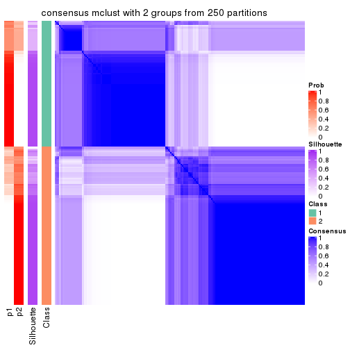</p>

</div>
<div id='tab-CV-mclust-consensus-heatmap-2'>
<pre><code class="r">consensus_heatmap(res, k = 3)
</code></pre>

<p>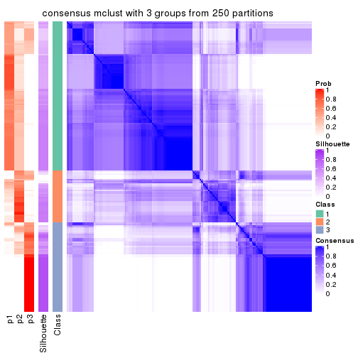</p>

</div>
<div id='tab-CV-mclust-consensus-heatmap-3'>
<pre><code class="r">consensus_heatmap(res, k = 4)
</code></pre>

<p>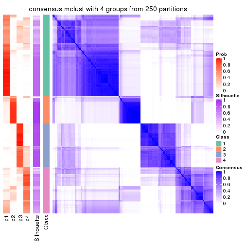</p>

</div>
<div id='tab-CV-mclust-consensus-heatmap-4'>
<pre><code class="r">consensus_heatmap(res, k = 5)
</code></pre>

<p>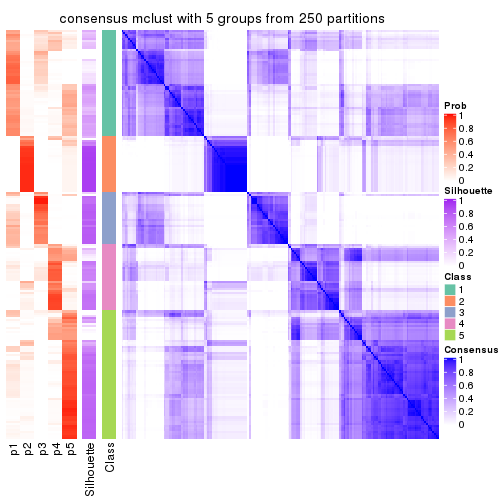</p>

</div>
<div id='tab-CV-mclust-consensus-heatmap-5'>
<pre><code class="r">consensus_heatmap(res, k = 6)
</code></pre>

<p>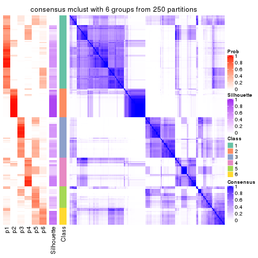</p>

</div>
</div>

Heatmaps for the membership of samples in all partitions to see how consistent they are:


<script>
$( function() {
	$( '#tabs-CV-mclust-membership-heatmap' ).tabs();
} );
</script>
<div id='tabs-CV-mclust-membership-heatmap'>
<ul>
<li><a href='#tab-CV-mclust-membership-heatmap-1'>k = 2</a></li>
<li><a href='#tab-CV-mclust-membership-heatmap-2'>k = 3</a></li>
<li><a href='#tab-CV-mclust-membership-heatmap-3'>k = 4</a></li>
<li><a href='#tab-CV-mclust-membership-heatmap-4'>k = 5</a></li>
<li><a href='#tab-CV-mclust-membership-heatmap-5'>k = 6</a></li>
</ul>
<div id='tab-CV-mclust-membership-heatmap-1'>
<pre><code class="r">membership_heatmap(res, k = 2)
</code></pre>

<p>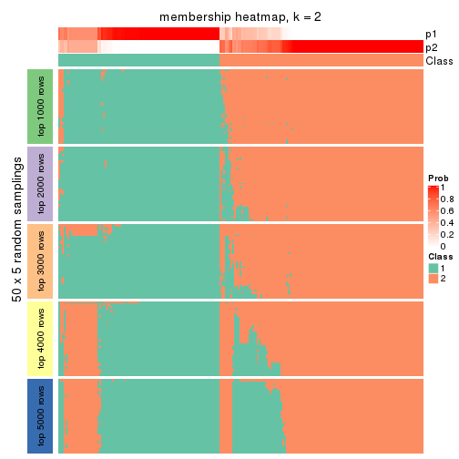</p>

</div>
<div id='tab-CV-mclust-membership-heatmap-2'>
<pre><code class="r">membership_heatmap(res, k = 3)
</code></pre>

<p>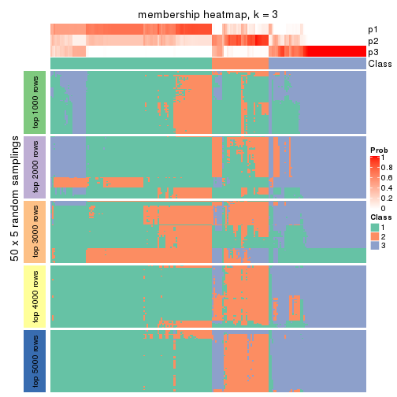</p>

</div>
<div id='tab-CV-mclust-membership-heatmap-3'>
<pre><code class="r">membership_heatmap(res, k = 4)
</code></pre>

<p>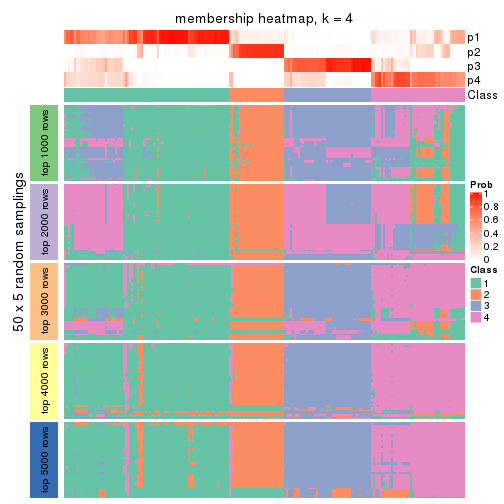</p>

</div>
<div id='tab-CV-mclust-membership-heatmap-4'>
<pre><code class="r">membership_heatmap(res, k = 5)
</code></pre>

<p>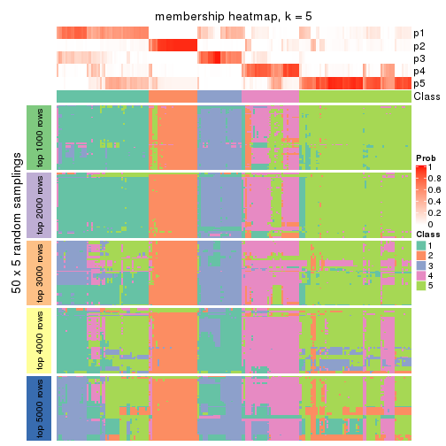</p>

</div>
<div id='tab-CV-mclust-membership-heatmap-5'>
<pre><code class="r">membership_heatmap(res, k = 6)
</code></pre>

<p>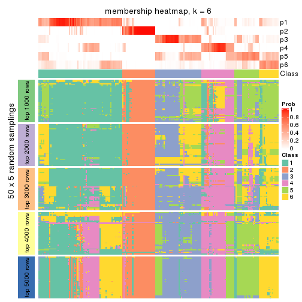</p>

</div>
</div>

As soon as we have had the classes for columns, we can look for signatures
which are significantly different between classes which can be candidate marks
for certain classes. Following are the heatmaps for signatures.


Signature heatmaps where rows are scaled:


<script>
$( function() {
	$( '#tabs-CV-mclust-get-signatures' ).tabs();
} );
</script>
<div id='tabs-CV-mclust-get-signatures'>
<ul>
<li><a href='#tab-CV-mclust-get-signatures-1'>k = 2</a></li>
<li><a href='#tab-CV-mclust-get-signatures-2'>k = 3</a></li>
<li><a href='#tab-CV-mclust-get-signatures-3'>k = 4</a></li>
<li><a href='#tab-CV-mclust-get-signatures-4'>k = 5</a></li>
<li><a href='#tab-CV-mclust-get-signatures-5'>k = 6</a></li>
</ul>
<div id='tab-CV-mclust-get-signatures-1'>
<pre><code class="r">get_signatures(res, k = 2)
</code></pre>

<p>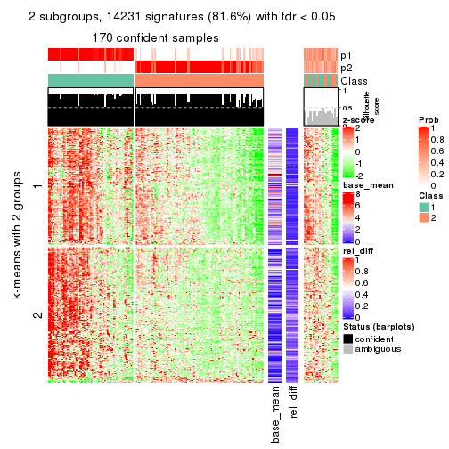</p>

</div>
<div id='tab-CV-mclust-get-signatures-2'>
<pre><code class="r">get_signatures(res, k = 3)
</code></pre>

<p>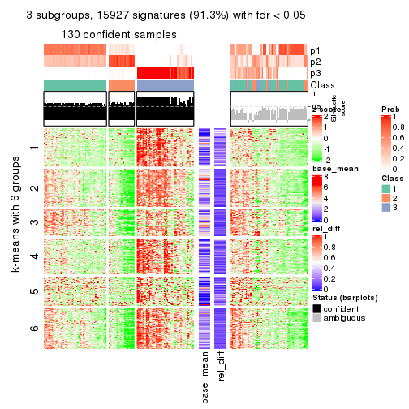</p>

</div>
<div id='tab-CV-mclust-get-signatures-3'>
<pre><code class="r">get_signatures(res, k = 4)
</code></pre>

<p>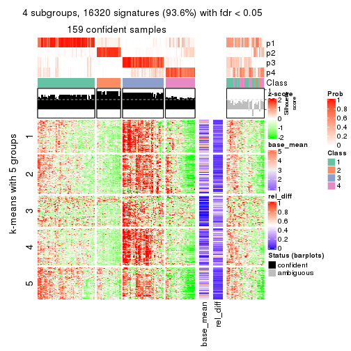</p>

</div>
<div id='tab-CV-mclust-get-signatures-4'>
<pre><code class="r">get_signatures(res, k = 5)
</code></pre>

<p>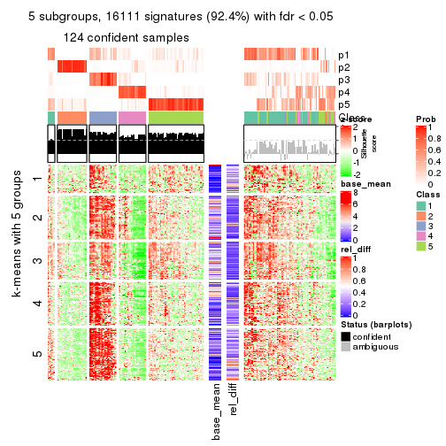</p>

</div>
<div id='tab-CV-mclust-get-signatures-5'>
<pre><code class="r">get_signatures(res, k = 6)
</code></pre>

<p>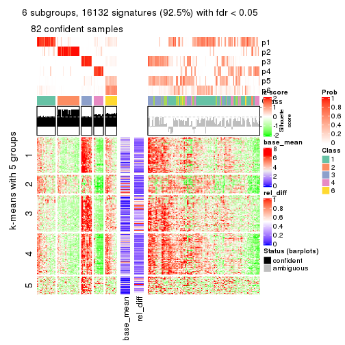</p>

</div>
</div>


Signature heatmaps where rows are not scaled:


<script>
$( function() {
	$( '#tabs-CV-mclust-get-signatures-no-scale' ).tabs();
} );
</script>
<div id='tabs-CV-mclust-get-signatures-no-scale'>
<ul>
<li><a href='#tab-CV-mclust-get-signatures-no-scale-1'>k = 2</a></li>
<li><a href='#tab-CV-mclust-get-signatures-no-scale-2'>k = 3</a></li>
<li><a href='#tab-CV-mclust-get-signatures-no-scale-3'>k = 4</a></li>
<li><a href='#tab-CV-mclust-get-signatures-no-scale-4'>k = 5</a></li>
<li><a href='#tab-CV-mclust-get-signatures-no-scale-5'>k = 6</a></li>
</ul>
<div id='tab-CV-mclust-get-signatures-no-scale-1'>
<pre><code class="r">get_signatures(res, k = 2, scale_rows = FALSE)
</code></pre>

<p>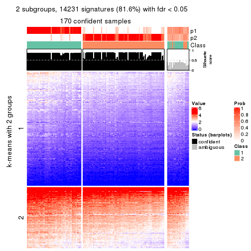</p>

</div>
<div id='tab-CV-mclust-get-signatures-no-scale-2'>
<pre><code class="r">get_signatures(res, k = 3, scale_rows = FALSE)
</code></pre>

<p>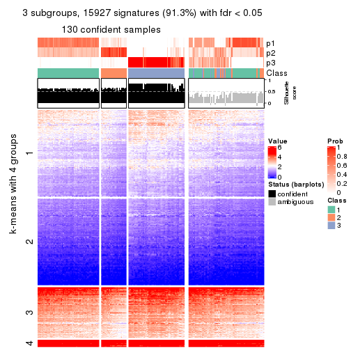</p>

</div>
<div id='tab-CV-mclust-get-signatures-no-scale-3'>
<pre><code class="r">get_signatures(res, k = 4, scale_rows = FALSE)
</code></pre>

<p>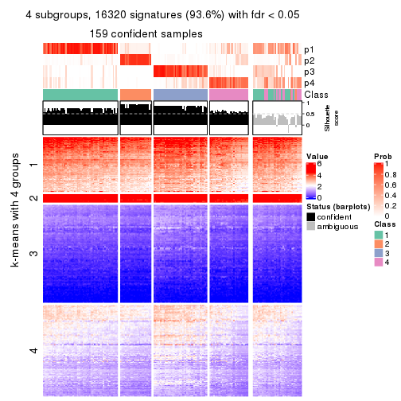</p>

</div>
<div id='tab-CV-mclust-get-signatures-no-scale-4'>
<pre><code class="r">get_signatures(res, k = 5, scale_rows = FALSE)
</code></pre>

<p>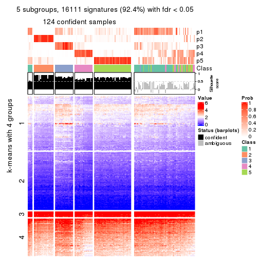</p>

</div>
<div id='tab-CV-mclust-get-signatures-no-scale-5'>
<pre><code class="r">get_signatures(res, k = 6, scale_rows = FALSE)
</code></pre>

<p>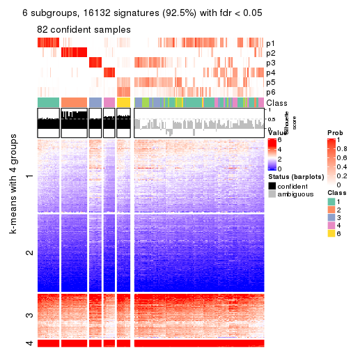</p>

</div>
</div>


Compare the overlap of signatures from different k:

```r
compare_signatures(res)
```

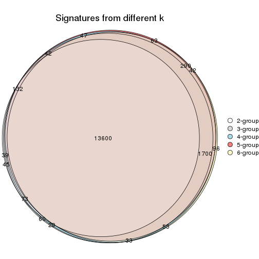

`get_signature()` returns a data frame invisibly. TO get the list of signatures, the function
call should be assigned to a variable explicitly. In following code, if `plot` argument is set
to `FALSE`, no heatmap is plotted while only the differential analysis is performed.

```r
# code only for demonstration
tb = get_signature(res, k = ..., plot = FALSE)
```

An example of the output of `tb` is:

```
#>   which_row         fdr    mean_1    mean_2 scaled_mean_1 scaled_mean_2 km
#> 1        38 0.042760348  8.373488  9.131774    -0.5533452     0.5164555  1
#> 2        40 0.018707592  7.106213  8.469186    -0.6173731     0.5762149  1
#> 3        55 0.019134737 10.221463 11.207825    -0.6159697     0.5749050  1
#> 4        59 0.006059896  5.921854  7.869574    -0.6899429     0.6439467  1
#> 5        60 0.018055526  8.928898 10.211722    -0.6204761     0.5791110  1
#> 6        98 0.009384629 15.714769 14.887706     0.6635654    -0.6193277  2
...
```

The columns in `tb` are:

1. `which_row`: row indices corresponding to the input matrix.
2. `fdr`: FDR for the differential test. 
3. `mean_x`: The mean value in group x.
4. `scaled_mean_x`: The mean value in group x after rows are scaled.
5. `km`: Row groups if k-means clustering is applied to rows.


UMAP plot which shows how samples are separated.


<script>
$( function() {
	$( '#tabs-CV-mclust-dimension-reduction' ).tabs();
} );
</script>
<div id='tabs-CV-mclust-dimension-reduction'>
<ul>
<li><a href='#tab-CV-mclust-dimension-reduction-1'>k = 2</a></li>
<li><a href='#tab-CV-mclust-dimension-reduction-2'>k = 3</a></li>
<li><a href='#tab-CV-mclust-dimension-reduction-3'>k = 4</a></li>
<li><a href='#tab-CV-mclust-dimension-reduction-4'>k = 5</a></li>
<li><a href='#tab-CV-mclust-dimension-reduction-5'>k = 6</a></li>
</ul>
<div id='tab-CV-mclust-dimension-reduction-1'>
<pre><code class="r">dimension_reduction(res, k = 2, method = &quot;UMAP&quot;)
</code></pre>

<p>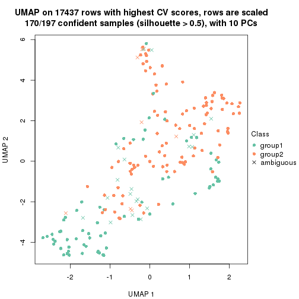</p>

</div>
<div id='tab-CV-mclust-dimension-reduction-2'>
<pre><code class="r">dimension_reduction(res, k = 3, method = &quot;UMAP&quot;)
</code></pre>

<p>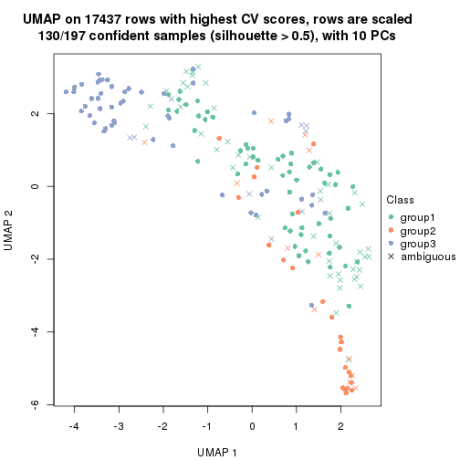</p>

</div>
<div id='tab-CV-mclust-dimension-reduction-3'>
<pre><code class="r">dimension_reduction(res, k = 4, method = &quot;UMAP&quot;)
</code></pre>

<p>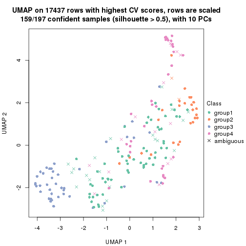</p>

</div>
<div id='tab-CV-mclust-dimension-reduction-4'>
<pre><code class="r">dimension_reduction(res, k = 5, method = &quot;UMAP&quot;)
</code></pre>

<p>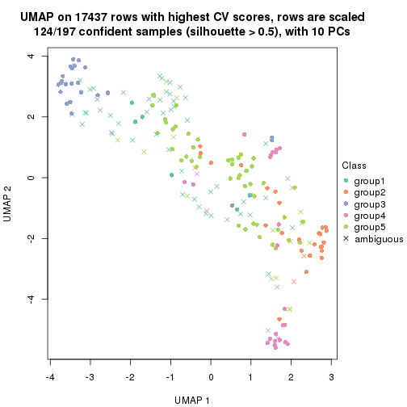</p>

</div>
<div id='tab-CV-mclust-dimension-reduction-5'>
<pre><code class="r">dimension_reduction(res, k = 6, method = &quot;UMAP&quot;)
</code></pre>

<p>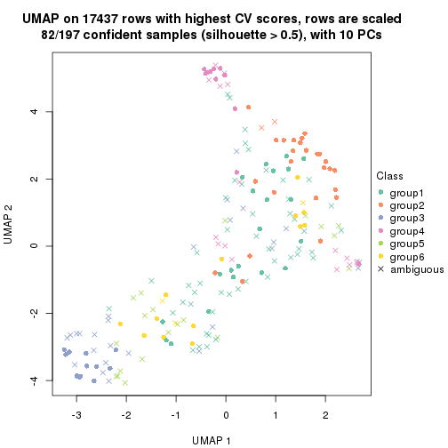</p>

</div>
</div>


Following heatmap shows how subgroups are split when increasing `k`:

```r
collect_classes(res)
```

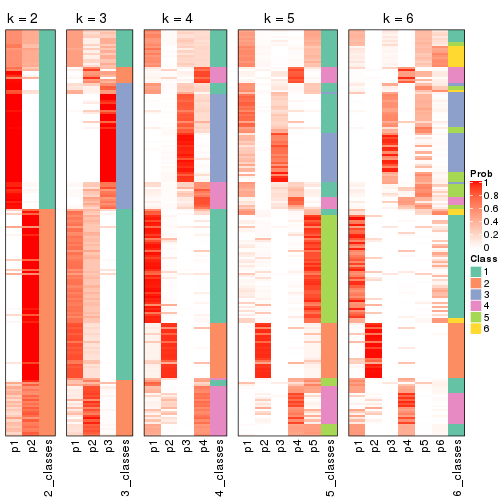


If matrix rows can be associated to genes, consider to use `GO_Enrichment(res,
...)` to perform function enrichment for the signature genes.


 

---------------------------------------------------


### CV:NMF*


The object with results only for a single top-value method and a single partition method 
can be extracted as:

```r
res = res_list["CV", "NMF"]
# you can also extract it by
# res = res_list["CV:NMF"]
```

A summary of `res` and all the functions that can be applied to it:

```r
res
```

```
#> A 'ConsensusPartition' object with k = 2, 3, 4, 5, 6.
#>   On a matrix with 17437 rows and 197 columns.
#>   Top rows (1000, 2000, 3000, 4000, 5000) are extracted by 'CV' method.
#>   Subgroups are detected by 'NMF' method.
#>   Performed in total 1250 partitions by row resampling.
#>   Best k for subgroups seems to be 2.
#> 
#> Following methods can be applied to this 'ConsensusPartition' object:
#>  [1] "cola_report"             "collect_classes"         "collect_plots"          
#>  [4] "collect_stats"           "colnames"                "compare_signatures"     
#>  [7] "consensus_heatmap"       "dimension_reduction"     "functional_enrichment"  
#> [10] "get_anno_col"            "get_anno"                "get_classes"            
#> [13] "get_consensus"           "get_matrix"              "get_membership"         
#> [16] "get_param"               "get_signatures"          "get_stats"              
#> [19] "is_best_k"               "is_stable_k"             "membership_heatmap"     
#> [22] "ncol"                    "nrow"                    "plot_ecdf"              
#> [25] "rownames"                "select_partition_number" "show"                   
#> [28] "suggest_best_k"          "test_to_known_factors"
```

`collect_plots()` function collects all the plots made from `res` for all `k` (number of partitions)
into one single page to provide an easy and fast comparison between different `k`.

```r
collect_plots(res)
```

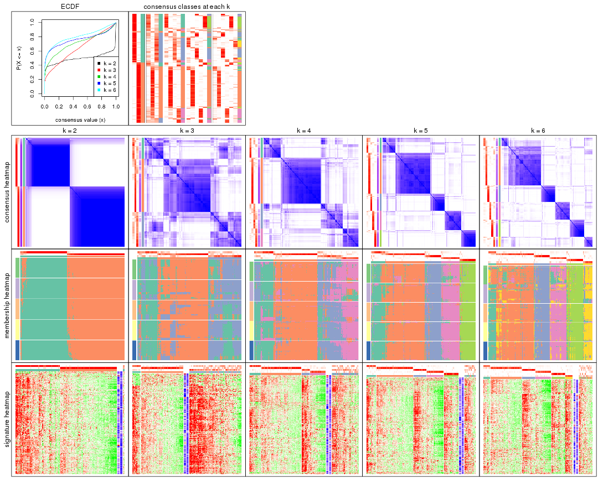

The plots are:

- The first row: a plot of the ECDF (Empirical cumulative distribution
  function) curves of the consensus matrix for each `k` and the heatmap of
  predicted classes for each `k`.
- The second row: heatmaps of the consensus matrix for each `k`.
- The third row: heatmaps of the membership matrix for each `k`.
- The fouth row: heatmaps of the signatures for each `k`.

All the plots in panels can be made by individual functions and they are
plotted later in this section.

`select_partition_number()` produces several plots showing different
statistics for choosing "optimized" `k`. There are following statistics:

- ECDF curves of the consensus matrix for each `k`;
- 1-PAC. [The PAC
  score](https://en.wikipedia.org/wiki/Consensus_clustering#Over-interpretation_potential_of_consensus_clustering)
  measures the proportion of the ambiguous subgrouping.
- Mean silhouette score.
- Concordance. The mean probability of fiting the consensus class ids in all
  partitions.
- Area increased. Denote $A_k$ as the area under the ECDF curve for current
  `k`, the area increased is defined as $A_k - A_{k-1}$.
- Rand index. The percent of pairs of samples that are both in a same cluster
  or both are not in a same cluster in the partition of k and k-1.
- Jaccard index. The ratio of pairs of samples are both in a same cluster in
  the partition of k and k-1 and the pairs of samples are both in a same
  cluster in the partition k or k-1.

The detailed explanations of these statistics can be found in [the cola
vignette](http://bioconductor.org/packages/devel/bioc/vignettes/cola/inst/doc/cola.html#toc_13).

Generally speaking, lower PAC score, higher mean silhouette score or higher
concordance corresponds to better partition. Rand index and Jaccard index
measure how similar the current partition is compared to partition with `k-1`.
If they are too similar, we won't accept `k` is better than `k-1`.

```r
select_partition_number(res)
```

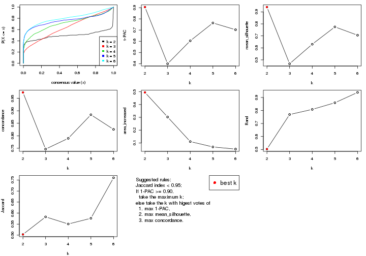

The numeric values for all these statistics can be obtained by `get_stats()`.

```r
get_stats(res)
```

```
#>   k 1-PAC mean_silhouette concordance area_increased  Rand Jaccard
#> 2 2 0.905           0.940       0.974         0.4947 0.503   0.503
#> 3 3 0.399           0.468       0.747         0.3026 0.769   0.583
#> 4 4 0.604           0.631       0.790         0.1105 0.808   0.551
#> 5 5 0.764           0.775       0.884         0.0686 0.859   0.576
#> 6 6 0.703           0.706       0.826         0.0519 0.939   0.760
```

`suggest_best_k()` suggests the best $k$ based on these statistics. The rules are as follows:

- All $k$ with Jaccard index larger than 0.95 are removed because the increase of
  the partition number does not provides enough extra information. If all $k$ are removed,
  the best $k$ is assigned by `NA`.
- For $k$ with 1-PAC larger than 0.9, the maximal $k$ is taken as the "best k". Other $k$ is called "optional k".
- If it does not fit the second rule. The $k$ with the highest vote of highest
  1-PAC, mean silhouette and concordance is taken as the "best k".

```r
suggest_best_k(res)
```

```
#> [1] 2
```


Following shows the table of the partitions (You need to click the **show/hide
code output** link to see it). The membership matrix (columns with name `p*`)
is inferred by
[`clue::cl_consensus()`](https://www.rdocumentation.org/link/cl_consensus?package=clue)
function with the `SE` method. Basically the value in the membership matrix
represents the probability to belong to a certain group. The finall class
label for an item is determined with the group with highest probability it
belongs to.

In `get_classes()` function, the entropy is calculated from the membership
matrix and the silhouette score is calculated from the consensus matrix.


<script>
$( function() {
	$( '#tabs-CV-NMF-get-classes' ).tabs();
} );
</script>
<div id='tabs-CV-NMF-get-classes'>
<ul>
<li><a href='#tab-CV-NMF-get-classes-1'>k = 2</a></li>
<li><a href='#tab-CV-NMF-get-classes-2'>k = 3</a></li>
<li><a href='#tab-CV-NMF-get-classes-3'>k = 4</a></li>
<li><a href='#tab-CV-NMF-get-classes-4'>k = 5</a></li>
<li><a href='#tab-CV-NMF-get-classes-5'>k = 6</a></li>
</ul>

<div id='tab-CV-NMF-get-classes-1'>
<p><a id='tab-CV-NMF-get-classes-1-a' style='color:#0366d6' href='#'>show/hide code output</a></p>
<pre><code class="r">cbind(get_classes(res, k = 2), get_membership(res, k = 2))
</code></pre>

<pre><code>#&gt;            class entropy silhouette    p1    p2
#&gt; SRR1380886     1  0.0000     0.9606 1.000 0.000
#&gt; SRR1074385     2  0.0938     0.9734 0.012 0.988
#&gt; SRR1374739     1  0.0000     0.9606 1.000 0.000
#&gt; SRR1097883     1  0.0938     0.9516 0.988 0.012
#&gt; SRR2167209     1  0.0000     0.9606 1.000 0.000
#&gt; SRR816541      2  0.0000     0.9816 0.000 1.000
#&gt; SRR663645      1  0.9661     0.3783 0.608 0.392
#&gt; SRR1381505     2  0.0000     0.9816 0.000 1.000
#&gt; SRR1416362     2  0.0000     0.9816 0.000 1.000
#&gt; SRR1318503     2  0.0000     0.9816 0.000 1.000
#&gt; SRR1341626     2  0.0000     0.9816 0.000 1.000
#&gt; SRR1382440     1  0.0000     0.9606 1.000 0.000
#&gt; SRR1088413     1  0.0000     0.9606 1.000 0.000
#&gt; SRR1082080     2  0.0000     0.9816 0.000 1.000
#&gt; SRR1455783     2  0.0000     0.9816 0.000 1.000
#&gt; SRR1447760     2  0.0000     0.9816 0.000 1.000
#&gt; SRR1487784     2  0.0000     0.9816 0.000 1.000
#&gt; SRR1331037     2  0.0000     0.9816 0.000 1.000
#&gt; SRR1095651     1  0.0000     0.9606 1.000 0.000
#&gt; SRR1078066     1  0.0000     0.9606 1.000 0.000
#&gt; SRR1120363     2  0.1184     0.9705 0.016 0.984
#&gt; SRR821231      1  0.0000     0.9606 1.000 0.000
#&gt; SRR1374373     2  0.0000     0.9816 0.000 1.000
#&gt; SRR1324519     2  0.0000     0.9816 0.000 1.000
#&gt; SRR1431121     1  0.0000     0.9606 1.000 0.000
#&gt; SRR1091032     2  0.0000     0.9816 0.000 1.000
#&gt; SRR1365575     2  0.0000     0.9816 0.000 1.000
#&gt; SRR1072972     1  0.0000     0.9606 1.000 0.000
#&gt; SRR1310690     2  0.0000     0.9816 0.000 1.000
#&gt; SRR1383037     1  0.0000     0.9606 1.000 0.000
#&gt; SRR1095479     1  0.0376     0.9576 0.996 0.004
#&gt; SRR1070403     1  0.0000     0.9606 1.000 0.000
#&gt; SRR1390203     2  0.0938     0.9733 0.012 0.988
#&gt; SRR1072007     1  0.9044     0.5507 0.680 0.320
#&gt; SRR1468787     1  0.0000     0.9606 1.000 0.000
#&gt; SRR1347959     2  0.0000     0.9816 0.000 1.000
#&gt; SRR1338513     1  0.0000     0.9606 1.000 0.000
#&gt; SRR812598      2  0.0000     0.9816 0.000 1.000
#&gt; SRR1446806     2  0.0000     0.9816 0.000 1.000
#&gt; SRR1394275     2  0.0000     0.9816 0.000 1.000
#&gt; SRR1443633     1  0.0000     0.9606 1.000 0.000
#&gt; SRR1087728     1  0.0000     0.9606 1.000 0.000
#&gt; SRR1098192     2  0.0000     0.9816 0.000 1.000
#&gt; SRR1093340     2  0.0000     0.9816 0.000 1.000
#&gt; SRR665405      1  0.0000     0.9606 1.000 0.000
#&gt; SRR657077      2  0.0000     0.9816 0.000 1.000
#&gt; SRR813208      1  0.0000     0.9606 1.000 0.000
#&gt; SRR1416074     2  0.0000     0.9816 0.000 1.000
#&gt; SRR1089688     1  0.1633     0.9419 0.976 0.024
#&gt; SRR1353461     1  0.0000     0.9606 1.000 0.000
#&gt; SRR1466321     2  0.0000     0.9816 0.000 1.000
#&gt; SRR1073021     1  0.0000     0.9606 1.000 0.000
#&gt; SRR1322816     2  0.0000     0.9816 0.000 1.000
#&gt; SRR1457727     1  0.0000     0.9606 1.000 0.000
#&gt; SRR1464226     2  0.0938     0.9734 0.012 0.988
#&gt; SRR1398863     1  0.0000     0.9606 1.000 0.000
#&gt; SRR1455631     2  0.0000     0.9816 0.000 1.000
#&gt; SRR1307808     2  0.0000     0.9816 0.000 1.000
#&gt; SRR1374585     2  0.0000     0.9816 0.000 1.000
#&gt; SRR1072104     2  0.0000     0.9816 0.000 1.000
#&gt; SRR1076868     2  0.0000     0.9816 0.000 1.000
#&gt; SRR1335984     2  0.1633     0.9643 0.024 0.976
#&gt; SRR1445939     2  0.0000     0.9816 0.000 1.000
#&gt; SRR1453047     2  0.0000     0.9816 0.000 1.000
#&gt; SRR1339788     1  0.0000     0.9606 1.000 0.000
#&gt; SRR1084323     1  0.6438     0.8018 0.836 0.164
#&gt; SRR1092937     1  0.0000     0.9606 1.000 0.000
#&gt; SRR1074090     2  0.0000     0.9816 0.000 1.000
#&gt; SRR1099833     1  0.0000     0.9606 1.000 0.000
#&gt; SRR1093434     1  0.0000     0.9606 1.000 0.000
#&gt; SRR1435857     1  0.1184     0.9485 0.984 0.016
#&gt; SRR1480347     2  0.0000     0.9816 0.000 1.000
#&gt; SRR1440787     2  0.0000     0.9816 0.000 1.000
#&gt; SRR1430202     2  0.5519     0.8561 0.128 0.872
#&gt; SRR1322730     2  0.2236     0.9544 0.036 0.964
#&gt; SRR811029      2  0.0000     0.9816 0.000 1.000
#&gt; SRR1390456     1  0.0000     0.9606 1.000 0.000
#&gt; SRR1381140     2  0.0000     0.9816 0.000 1.000
#&gt; SRR1388064     2  0.0000     0.9816 0.000 1.000
#&gt; SRR1093577     2  0.0000     0.9816 0.000 1.000
#&gt; SRR1414161     2  0.0000     0.9816 0.000 1.000
#&gt; SRR1328738     2  0.0000     0.9816 0.000 1.000
#&gt; SRR1311752     2  0.0000     0.9816 0.000 1.000
#&gt; SRR1445960     2  0.0000     0.9816 0.000 1.000
#&gt; SRR1403412     2  0.0000     0.9816 0.000 1.000
#&gt; SRR2166748     1  0.0000     0.9606 1.000 0.000
#&gt; SRR821666      2  0.0000     0.9816 0.000 1.000
#&gt; SRR1330746     1  0.0000     0.9606 1.000 0.000
#&gt; SRR1327872     2  0.0000     0.9816 0.000 1.000
#&gt; SRR1100800     1  0.8386     0.6483 0.732 0.268
#&gt; SRR1075174     1  0.7376     0.7439 0.792 0.208
#&gt; SRR1434436     2  0.0000     0.9816 0.000 1.000
#&gt; SRR1389409     2  0.0000     0.9816 0.000 1.000
#&gt; SRR1085310     1  0.9998     0.0558 0.508 0.492
#&gt; SRR1376718     2  0.0000     0.9816 0.000 1.000
#&gt; SRR808590      2  0.0000     0.9816 0.000 1.000
#&gt; SRR1084128     2  0.0000     0.9816 0.000 1.000
#&gt; SRR1361692     2  0.8555     0.6108 0.280 0.720
#&gt; SRR1431493     1  0.0000     0.9606 1.000 0.000
#&gt; SRR1409084     1  0.8386     0.6498 0.732 0.268
#&gt; SRR2166214     1  0.0000     0.9606 1.000 0.000
#&gt; SRR1324102     2  0.0000     0.9816 0.000 1.000
#&gt; SRR1079754     2  0.0000     0.9816 0.000 1.000
#&gt; SRR1442127     1  0.0000     0.9606 1.000 0.000
#&gt; SRR1076244     1  0.0000     0.9606 1.000 0.000
#&gt; SRR1330901     2  0.0000     0.9816 0.000 1.000
#&gt; SRR1073167     2  0.0000     0.9816 0.000 1.000
#&gt; SRR1357541     1  0.0000     0.9606 1.000 0.000
#&gt; SRR811607      2  0.0000     0.9816 0.000 1.000
#&gt; SRR1468931     1  0.0000     0.9606 1.000 0.000
#&gt; SRR1474908     2  0.0000     0.9816 0.000 1.000
#&gt; SRR1309875     2  0.0000     0.9816 0.000 1.000
#&gt; SRR598792      1  0.0000     0.9606 1.000 0.000
#&gt; SRR1088537     2  0.0000     0.9816 0.000 1.000
#&gt; SRR1457682     2  0.0000     0.9816 0.000 1.000
#&gt; SRR1454289     2  0.0000     0.9816 0.000 1.000
#&gt; SRR1069352     1  0.0000     0.9606 1.000 0.000
#&gt; SRR1472728     2  0.0000     0.9816 0.000 1.000
#&gt; SRR1091144     1  0.0000     0.9606 1.000 0.000
#&gt; SRR1319118     1  0.0000     0.9606 1.000 0.000
#&gt; SRR1403611     1  0.7376     0.7439 0.792 0.208
#&gt; SRR1397762     2  0.7528     0.7275 0.216 0.784
#&gt; SRR1317387     1  0.0000     0.9606 1.000 0.000
#&gt; SRR1376426     2  0.0000     0.9816 0.000 1.000
#&gt; SRR1097777     1  0.0000     0.9606 1.000 0.000
#&gt; SRR1365743     1  0.0000     0.9606 1.000 0.000
#&gt; SRR1458992     2  0.0000     0.9816 0.000 1.000
#&gt; SRR1089537     1  0.0000     0.9606 1.000 0.000
#&gt; SRR1397744     2  0.0000     0.9816 0.000 1.000
#&gt; SRR1453893     2  0.0000     0.9816 0.000 1.000
#&gt; SRR1098543     2  0.0000     0.9816 0.000 1.000
#&gt; SRR1321765     1  0.5946     0.8259 0.856 0.144
#&gt; SRR1440032     2  0.8207     0.6575 0.256 0.744
#&gt; SRR1404507     2  0.0000     0.9816 0.000 1.000
#&gt; SRR1404856     1  0.0000     0.9606 1.000 0.000
#&gt; SRR812745      2  0.2948     0.9386 0.052 0.948
#&gt; SRR1417524     1  0.0000     0.9606 1.000 0.000
#&gt; SRR1407334     2  0.0672     0.9761 0.008 0.992
#&gt; SRR1453991     2  0.0000     0.9816 0.000 1.000
#&gt; SRR1415938     1  0.5946     0.8252 0.856 0.144
#&gt; SRR1081259     2  0.1633     0.9641 0.024 0.976
#&gt; SRR1436187     2  0.0000     0.9816 0.000 1.000
#&gt; SRR1431948     1  0.0000     0.9606 1.000 0.000
#&gt; SRR1453277     2  0.3879     0.9148 0.076 0.924
#&gt; SRR1095407     1  0.0000     0.9606 1.000 0.000
#&gt; SRR1359694     2  0.0000     0.9816 0.000 1.000
#&gt; SRR656982      1  0.0000     0.9606 1.000 0.000
#&gt; SRR1354338     2  0.0000     0.9816 0.000 1.000
#&gt; SRR1088291     2  0.6247     0.8185 0.156 0.844
#&gt; SRR1080624     2  0.0376     0.9789 0.004 0.996
#&gt; SRR2166708     1  0.0000     0.9606 1.000 0.000
#&gt; SRR1393572     2  0.4939     0.8758 0.108 0.892
#&gt; SRR1429912     2  0.0000     0.9816 0.000 1.000
#&gt; SRR1421048     2  0.0000     0.9816 0.000 1.000
#&gt; SRR1434999     1  0.0000     0.9606 1.000 0.000
#&gt; SRR656457      1  0.0000     0.9606 1.000 0.000
#&gt; SRR1098928     1  0.0000     0.9606 1.000 0.000
#&gt; SRR1343967     2  0.0000     0.9816 0.000 1.000
#&gt; SRR1360766     1  0.0000     0.9606 1.000 0.000
#&gt; SRR1464724     1  0.0000     0.9606 1.000 0.000
#&gt; SRR1101542     2  0.1414     0.9677 0.020 0.980
#&gt; SRR1401528     1  0.0000     0.9606 1.000 0.000
#&gt; SRR1071519     1  0.0000     0.9606 1.000 0.000
#&gt; SRR1086070     1  0.0000     0.9606 1.000 0.000
#&gt; SRR1358645     2  0.0000     0.9816 0.000 1.000
#&gt; SRR819771      1  0.0000     0.9606 1.000 0.000
#&gt; SRR1418433     1  0.0000     0.9606 1.000 0.000
#&gt; SRR821050      1  0.0000     0.9606 1.000 0.000
#&gt; SRR1402091     1  0.9732     0.3473 0.596 0.404
#&gt; SRR1322028     2  0.0000     0.9816 0.000 1.000
#&gt; SRR1452556     2  0.0000     0.9816 0.000 1.000
#&gt; SRR1340047     2  0.0000     0.9816 0.000 1.000
#&gt; SRR1418302     2  0.0000     0.9816 0.000 1.000
#&gt; SRR1073991     1  0.0000     0.9606 1.000 0.000
#&gt; SRR1085187     2  0.3431     0.9260 0.064 0.936
#&gt; SRR1357618     1  0.0000     0.9606 1.000 0.000
#&gt; SRR1487764     1  0.0000     0.9606 1.000 0.000
#&gt; SRR1075336     2  0.7674     0.7186 0.224 0.776
#&gt; SRR1365471     2  0.0000     0.9816 0.000 1.000
#&gt; SRR1414613     2  0.0000     0.9816 0.000 1.000
#&gt; SRR658719      1  0.8081     0.6769 0.752 0.248
#&gt; SRR1475128     1  0.0000     0.9606 1.000 0.000
#&gt; SRR1367630     2  0.2423     0.9506 0.040 0.960
#&gt; SRR1481146     2  0.0000     0.9816 0.000 1.000
#&gt; SRR1465674     1  0.0000     0.9606 1.000 0.000
#&gt; SRR1327303     1  0.0000     0.9606 1.000 0.000
#&gt; SRR1390391     2  0.0000     0.9816 0.000 1.000
#&gt; SRR1326020     1  0.0000     0.9606 1.000 0.000
#&gt; SRR1381953     1  0.0000     0.9606 1.000 0.000
#&gt; SRR1082544     2  0.0000     0.9816 0.000 1.000
#&gt; SRR810761      1  0.0000     0.9606 1.000 0.000
#&gt; SRR1070764     1  0.0000     0.9606 1.000 0.000
#&gt; SRR1415919     1  0.0000     0.9606 1.000 0.000
#&gt; SRR1490404     2  0.0000     0.9816 0.000 1.000
#&gt; SRR1416773     2  0.4562     0.8921 0.096 0.904
#&gt; SRR1377492     1  0.0000     0.9606 1.000 0.000
#&gt; SRR1334314     2  0.2236     0.9538 0.036 0.964
</code></pre>

<script>
$('#tab-CV-NMF-get-classes-1-a').parent().next().next().hide();
$('#tab-CV-NMF-get-classes-1-a').click(function(){
  $('#tab-CV-NMF-get-classes-1-a').parent().next().next().toggle();
  return(false);
});
</script>
</div>

<div id='tab-CV-NMF-get-classes-2'>
<p><a id='tab-CV-NMF-get-classes-2-a' style='color:#0366d6' href='#'>show/hide code output</a></p>
<pre><code class="r">cbind(get_classes(res, k = 3), get_membership(res, k = 3))
</code></pre>

<pre><code>#&gt;            class entropy silhouette    p1    p2    p3
#&gt; SRR1380886     3  0.6280    -0.1740 0.460 0.000 0.540
#&gt; SRR1074385     2  0.2096     0.8004 0.004 0.944 0.052
#&gt; SRR1374739     3  0.6308    -0.2440 0.492 0.000 0.508
#&gt; SRR1097883     1  0.6425     0.4591 0.764 0.140 0.096
#&gt; SRR2167209     1  0.3619     0.5565 0.864 0.000 0.136
#&gt; SRR816541      2  0.1163     0.8055 0.000 0.972 0.028
#&gt; SRR663645      3  0.5595     0.4128 0.228 0.016 0.756
#&gt; SRR1381505     2  0.5465     0.6124 0.288 0.712 0.000
#&gt; SRR1416362     2  0.0237     0.8095 0.004 0.996 0.000
#&gt; SRR1318503     2  0.0000     0.8095 0.000 1.000 0.000
#&gt; SRR1341626     2  0.1163     0.8060 0.028 0.972 0.000
#&gt; SRR1382440     1  0.4796     0.5584 0.780 0.000 0.220
#&gt; SRR1088413     1  0.6386     0.3765 0.584 0.004 0.412
#&gt; SRR1082080     2  0.1529     0.8024 0.040 0.960 0.000
#&gt; SRR1455783     2  0.2448     0.7912 0.000 0.924 0.076
#&gt; SRR1447760     1  0.6483    -0.1056 0.544 0.452 0.004
#&gt; SRR1487784     2  0.0592     0.8090 0.012 0.988 0.000
#&gt; SRR1331037     2  0.0000     0.8095 0.000 1.000 0.000
#&gt; SRR1095651     3  0.5291     0.3575 0.268 0.000 0.732
#&gt; SRR1078066     1  0.5098     0.5513 0.752 0.000 0.248
#&gt; SRR1120363     2  0.4733     0.6879 0.196 0.800 0.004
#&gt; SRR821231      3  0.6314    -0.0237 0.392 0.004 0.604
#&gt; SRR1374373     2  0.0475     0.8098 0.004 0.992 0.004
#&gt; SRR1324519     2  0.0592     0.8081 0.000 0.988 0.012
#&gt; SRR1431121     1  0.9309     0.1835 0.520 0.216 0.264
#&gt; SRR1091032     2  0.1753     0.8011 0.000 0.952 0.048
#&gt; SRR1365575     2  0.5291     0.6342 0.268 0.732 0.000
#&gt; SRR1072972     3  0.6309     0.4004 0.128 0.100 0.772
#&gt; SRR1310690     2  0.0000     0.8095 0.000 1.000 0.000
#&gt; SRR1383037     3  0.2537     0.4315 0.080 0.000 0.920
#&gt; SRR1095479     3  0.5939     0.3868 0.224 0.028 0.748
#&gt; SRR1070403     3  0.6252    -0.1383 0.444 0.000 0.556
#&gt; SRR1390203     2  0.6299     0.2223 0.000 0.524 0.476
#&gt; SRR1072007     3  0.7267     0.4140 0.112 0.180 0.708
#&gt; SRR1468787     1  0.5431     0.5272 0.716 0.000 0.284
#&gt; SRR1347959     2  0.0000     0.8095 0.000 1.000 0.000
#&gt; SRR1338513     3  0.2537     0.4304 0.080 0.000 0.920
#&gt; SRR812598      2  0.2384     0.8009 0.008 0.936 0.056
#&gt; SRR1446806     2  0.1529     0.8038 0.000 0.960 0.040
#&gt; SRR1394275     2  0.2356     0.7930 0.000 0.928 0.072
#&gt; SRR1443633     1  0.6307     0.2412 0.512 0.000 0.488
#&gt; SRR1087728     3  0.6215    -0.0101 0.428 0.000 0.572
#&gt; SRR1098192     2  0.3941     0.7423 0.156 0.844 0.000
#&gt; SRR1093340     2  0.0892     0.8078 0.020 0.980 0.000
#&gt; SRR665405      3  0.5529     0.3307 0.296 0.000 0.704
#&gt; SRR657077      2  0.5659     0.7201 0.152 0.796 0.052
#&gt; SRR813208      3  0.2959     0.4239 0.100 0.000 0.900
#&gt; SRR1416074     2  0.0892     0.8078 0.020 0.980 0.000
#&gt; SRR1089688     3  0.6676     0.2401 0.476 0.008 0.516
#&gt; SRR1353461     3  0.1163     0.4569 0.028 0.000 0.972
#&gt; SRR1466321     2  0.2625     0.7890 0.000 0.916 0.084
#&gt; SRR1073021     1  0.7039     0.4603 0.648 0.040 0.312
#&gt; SRR1322816     2  0.3116     0.7755 0.000 0.892 0.108
#&gt; SRR1457727     1  0.9266     0.0284 0.424 0.156 0.420
#&gt; SRR1464226     3  0.9374     0.1913 0.192 0.316 0.492
#&gt; SRR1398863     3  0.7651     0.3813 0.124 0.196 0.680
#&gt; SRR1455631     1  0.8434    -0.1187 0.496 0.416 0.088
#&gt; SRR1307808     2  0.0424     0.8093 0.008 0.992 0.000
#&gt; SRR1374585     2  0.4887     0.6753 0.228 0.772 0.000
#&gt; SRR1072104     2  0.7876     0.5163 0.308 0.612 0.080
#&gt; SRR1076868     2  0.1753     0.7997 0.048 0.952 0.000
#&gt; SRR1335984     2  0.4110     0.7342 0.004 0.844 0.152
#&gt; SRR1445939     2  0.6664     0.2421 0.008 0.528 0.464
#&gt; SRR1453047     2  0.2165     0.7972 0.000 0.936 0.064
#&gt; SRR1339788     1  0.6280     0.3064 0.540 0.000 0.460
#&gt; SRR1084323     3  0.7624     0.4061 0.104 0.224 0.672
#&gt; SRR1092937     3  0.2066     0.4420 0.060 0.000 0.940
#&gt; SRR1074090     2  0.0424     0.8086 0.000 0.992 0.008
#&gt; SRR1099833     3  0.3551     0.4473 0.132 0.000 0.868
#&gt; SRR1093434     3  0.6225    -0.1127 0.432 0.000 0.568
#&gt; SRR1435857     3  0.7419     0.3900 0.088 0.232 0.680
#&gt; SRR1480347     2  0.0592     0.8090 0.012 0.988 0.000
#&gt; SRR1440787     2  0.6879     0.3693 0.428 0.556 0.016
#&gt; SRR1430202     2  0.5443     0.6209 0.004 0.736 0.260
#&gt; SRR1322730     3  0.9633     0.2428 0.300 0.236 0.464
#&gt; SRR811029      2  0.4465     0.7259 0.004 0.820 0.176
#&gt; SRR1390456     3  0.6079    -0.0506 0.388 0.000 0.612
#&gt; SRR1381140     2  0.6267     0.2699 0.000 0.548 0.452
#&gt; SRR1388064     2  0.7213     0.5862 0.272 0.668 0.060
#&gt; SRR1093577     2  0.4062     0.7235 0.164 0.836 0.000
#&gt; SRR1414161     2  0.1289     0.8047 0.000 0.968 0.032
#&gt; SRR1328738     2  0.1411     0.8073 0.036 0.964 0.000
#&gt; SRR1311752     2  0.0892     0.8080 0.020 0.980 0.000
#&gt; SRR1445960     2  0.3340     0.7679 0.000 0.880 0.120
#&gt; SRR1403412     3  0.6299    -0.0863 0.000 0.476 0.524
#&gt; SRR2166748     3  0.5119     0.4254 0.160 0.028 0.812
#&gt; SRR821666      2  0.4452     0.7072 0.192 0.808 0.000
#&gt; SRR1330746     3  0.6204    -0.0954 0.424 0.000 0.576
#&gt; SRR1327872     3  0.9878     0.1754 0.340 0.264 0.396
#&gt; SRR1100800     2  0.7801     0.1365 0.428 0.520 0.052
#&gt; SRR1075174     3  0.6501     0.3484 0.020 0.316 0.664
#&gt; SRR1434436     2  0.2878     0.7823 0.000 0.904 0.096
#&gt; SRR1389409     2  0.5621     0.5874 0.308 0.692 0.000
#&gt; SRR1085310     2  0.6308     0.1912 0.000 0.508 0.492
#&gt; SRR1376718     2  0.5363     0.6255 0.276 0.724 0.000
#&gt; SRR808590      2  0.5158     0.6695 0.232 0.764 0.004
#&gt; SRR1084128     2  0.0592     0.8090 0.012 0.988 0.000
#&gt; SRR1361692     1  0.6057     0.3886 0.760 0.196 0.044
#&gt; SRR1431493     1  0.5706     0.4942 0.680 0.000 0.320
#&gt; SRR1409084     3  0.7988     0.3882 0.200 0.144 0.656
#&gt; SRR2166214     3  0.5706     0.3076 0.320 0.000 0.680
#&gt; SRR1324102     2  0.1163     0.8065 0.028 0.972 0.000
#&gt; SRR1079754     2  0.4110     0.7384 0.152 0.844 0.004
#&gt; SRR1442127     1  0.5291     0.5411 0.732 0.000 0.268
#&gt; SRR1076244     3  0.4654     0.4278 0.208 0.000 0.792
#&gt; SRR1330901     2  0.0237     0.8095 0.004 0.996 0.000
#&gt; SRR1073167     2  0.0424     0.8093 0.008 0.992 0.000
#&gt; SRR1357541     1  0.5285     0.5527 0.752 0.004 0.244
#&gt; SRR811607      2  0.0424     0.8086 0.000 0.992 0.008
#&gt; SRR1468931     3  0.6267    -0.1567 0.452 0.000 0.548
#&gt; SRR1474908     2  0.5835     0.5026 0.000 0.660 0.340
#&gt; SRR1309875     2  0.6565     0.3587 0.008 0.576 0.416
#&gt; SRR598792      3  0.1163     0.4588 0.028 0.000 0.972
#&gt; SRR1088537     2  0.1411     0.8045 0.036 0.964 0.000
#&gt; SRR1457682     2  0.5926     0.4855 0.000 0.644 0.356
#&gt; SRR1454289     2  0.1964     0.7976 0.056 0.944 0.000
#&gt; SRR1069352     1  0.5397     0.5283 0.720 0.000 0.280
#&gt; SRR1472728     2  0.0592     0.8094 0.012 0.988 0.000
#&gt; SRR1091144     1  0.0829     0.5015 0.984 0.004 0.012
#&gt; SRR1319118     3  0.6302    -0.2186 0.480 0.000 0.520
#&gt; SRR1403611     3  0.7067     0.2305 0.468 0.020 0.512
#&gt; SRR1397762     3  0.6745     0.0379 0.012 0.428 0.560
#&gt; SRR1317387     1  0.6168     0.1408 0.588 0.000 0.412
#&gt; SRR1376426     2  0.1411     0.8037 0.036 0.964 0.000
#&gt; SRR1097777     3  0.7263     0.0144 0.372 0.036 0.592
#&gt; SRR1365743     3  0.1411     0.4694 0.000 0.036 0.964
#&gt; SRR1458992     2  0.6291     0.2223 0.000 0.532 0.468
#&gt; SRR1089537     1  0.4235     0.3082 0.824 0.000 0.176
#&gt; SRR1397744     2  0.2537     0.7898 0.000 0.920 0.080
#&gt; SRR1453893     2  0.7918     0.5641 0.256 0.640 0.104
#&gt; SRR1098543     2  0.2356     0.7930 0.000 0.928 0.072
#&gt; SRR1321765     1  0.2926     0.5127 0.924 0.036 0.040
#&gt; SRR1440032     2  0.9914     0.1147 0.328 0.392 0.280
#&gt; SRR1404507     3  0.9812     0.2080 0.340 0.248 0.412
#&gt; SRR1404856     1  0.2165     0.5337 0.936 0.000 0.064
#&gt; SRR812745      2  0.6683     0.1560 0.008 0.496 0.496
#&gt; SRR1417524     3  0.6079    -0.0226 0.388 0.000 0.612
#&gt; SRR1407334     3  0.9895     0.0778 0.272 0.332 0.396
#&gt; SRR1453991     2  0.1529     0.8030 0.000 0.960 0.040
#&gt; SRR1415938     3  0.5678     0.3407 0.000 0.316 0.684
#&gt; SRR1081259     2  0.3112     0.8019 0.028 0.916 0.056
#&gt; SRR1436187     2  0.7178     0.2764 0.464 0.512 0.024
#&gt; SRR1431948     3  0.1643     0.4592 0.044 0.000 0.956
#&gt; SRR1453277     2  0.3784     0.7373 0.132 0.864 0.004
#&gt; SRR1095407     1  0.2356     0.5371 0.928 0.000 0.072
#&gt; SRR1359694     2  0.1529     0.8024 0.040 0.960 0.000
#&gt; SRR656982      1  0.6307     0.2542 0.512 0.000 0.488
#&gt; SRR1354338     2  0.6095     0.4602 0.392 0.608 0.000
#&gt; SRR1088291     2  0.6373     0.5567 0.268 0.704 0.028
#&gt; SRR1080624     2  0.3607     0.7556 0.112 0.880 0.008
#&gt; SRR2166708     3  0.6244    -0.1295 0.440 0.000 0.560
#&gt; SRR1393572     2  0.3045     0.7910 0.020 0.916 0.064
#&gt; SRR1429912     2  0.3551     0.7603 0.000 0.868 0.132
#&gt; SRR1421048     2  0.0237     0.8096 0.004 0.996 0.000
#&gt; SRR1434999     1  0.4931     0.5565 0.768 0.000 0.232
#&gt; SRR656457      1  0.5098     0.5506 0.752 0.000 0.248
#&gt; SRR1098928     3  0.2537     0.4284 0.080 0.000 0.920
#&gt; SRR1343967     2  0.0424     0.8093 0.008 0.992 0.000
#&gt; SRR1360766     1  0.7075     0.2223 0.496 0.020 0.484
#&gt; SRR1464724     3  0.6180     0.3014 0.416 0.000 0.584
#&gt; SRR1101542     1  0.9042    -0.0992 0.500 0.144 0.356
#&gt; SRR1401528     3  0.1620     0.4616 0.024 0.012 0.964
#&gt; SRR1071519     3  0.4842     0.2680 0.224 0.000 0.776
#&gt; SRR1086070     3  0.4999     0.4441 0.028 0.152 0.820
#&gt; SRR1358645     2  0.6587     0.3411 0.008 0.568 0.424
#&gt; SRR819771      1  0.5678     0.4864 0.684 0.000 0.316
#&gt; SRR1418433     3  0.5268     0.4137 0.212 0.012 0.776
#&gt; SRR821050      3  0.6806     0.2798 0.228 0.060 0.712
#&gt; SRR1402091     2  0.9017     0.0885 0.148 0.516 0.336
#&gt; SRR1322028     2  0.0592     0.8081 0.000 0.988 0.012
#&gt; SRR1452556     3  0.9982     0.0784 0.332 0.308 0.360
#&gt; SRR1340047     2  0.5363     0.6041 0.000 0.724 0.276
#&gt; SRR1418302     2  0.4514     0.7450 0.012 0.832 0.156
#&gt; SRR1073991     3  0.8511    -0.0902 0.428 0.092 0.480
#&gt; SRR1085187     1  0.3412     0.4226 0.876 0.124 0.000
#&gt; SRR1357618     1  0.4842     0.5604 0.776 0.000 0.224
#&gt; SRR1487764     1  0.6244     0.1569 0.560 0.000 0.440
#&gt; SRR1075336     2  0.5263     0.7117 0.116 0.824 0.060
#&gt; SRR1365471     2  0.0892     0.8078 0.020 0.980 0.000
#&gt; SRR1414613     2  0.1964     0.7987 0.000 0.944 0.056
#&gt; SRR658719      3  0.5595     0.4161 0.016 0.228 0.756
#&gt; SRR1475128     3  0.6111    -0.0361 0.396 0.000 0.604
#&gt; SRR1367630     3  0.9974     0.0512 0.308 0.324 0.368
#&gt; SRR1481146     1  0.8025    -0.1078 0.516 0.420 0.064
#&gt; SRR1465674     1  0.3879     0.5608 0.848 0.000 0.152
#&gt; SRR1327303     3  0.7741     0.0215 0.376 0.056 0.568
#&gt; SRR1390391     2  0.4399     0.7116 0.000 0.812 0.188
#&gt; SRR1326020     3  0.7905     0.1003 0.340 0.072 0.588
#&gt; SRR1381953     3  0.6008     0.0144 0.372 0.000 0.628
#&gt; SRR1082544     2  0.6126     0.5226 0.352 0.644 0.004
#&gt; SRR810761      1  0.4235     0.5610 0.824 0.000 0.176
#&gt; SRR1070764     3  0.0475     0.4657 0.004 0.004 0.992
#&gt; SRR1415919     3  0.2711     0.4450 0.088 0.000 0.912
#&gt; SRR1490404     2  0.0000     0.8095 0.000 1.000 0.000
#&gt; SRR1416773     1  0.5529     0.2640 0.704 0.296 0.000
#&gt; SRR1377492     1  0.6180     0.2396 0.584 0.000 0.416
#&gt; SRR1334314     2  0.5902     0.5439 0.004 0.680 0.316
</code></pre>

<script>
$('#tab-CV-NMF-get-classes-2-a').parent().next().next().hide();
$('#tab-CV-NMF-get-classes-2-a').click(function(){
  $('#tab-CV-NMF-get-classes-2-a').parent().next().next().toggle();
  return(false);
});
</script>
</div>

<div id='tab-CV-NMF-get-classes-3'>
<p><a id='tab-CV-NMF-get-classes-3-a' style='color:#0366d6' href='#'>show/hide code output</a></p>
<pre><code class="r">cbind(get_classes(res, k = 4), get_membership(res, k = 4))
</code></pre>

<pre><code>#&gt;            class entropy silhouette    p1    p2    p3    p4
#&gt; SRR1380886     1  0.4830   0.419181 0.608 0.000 0.392 0.000
#&gt; SRR1074385     2  0.1209   0.893071 0.000 0.964 0.032 0.004
#&gt; SRR1374739     1  0.4761   0.445012 0.628 0.000 0.372 0.000
#&gt; SRR1097883     1  0.4869   0.386320 0.708 0.276 0.004 0.012
#&gt; SRR2167209     1  0.2197   0.691363 0.916 0.000 0.004 0.080
#&gt; SRR816541      2  0.0188   0.896939 0.000 0.996 0.004 0.000
#&gt; SRR663645      4  0.4164   0.378095 0.000 0.000 0.264 0.736
#&gt; SRR1381505     4  0.4158   0.719577 0.008 0.224 0.000 0.768
#&gt; SRR1416362     2  0.0592   0.896066 0.000 0.984 0.000 0.016
#&gt; SRR1318503     2  0.0000   0.897148 0.000 1.000 0.000 0.000
#&gt; SRR1341626     2  0.1022   0.888996 0.000 0.968 0.000 0.032
#&gt; SRR1382440     1  0.1820   0.700967 0.944 0.000 0.020 0.036
#&gt; SRR1088413     1  0.3528   0.616042 0.808 0.000 0.192 0.000
#&gt; SRR1082080     2  0.0707   0.894377 0.000 0.980 0.000 0.020
#&gt; SRR1455783     2  0.0779   0.895673 0.000 0.980 0.016 0.004
#&gt; SRR1447760     1  0.6100   0.396854 0.644 0.084 0.000 0.272
#&gt; SRR1487784     2  0.0469   0.896502 0.000 0.988 0.000 0.012
#&gt; SRR1331037     2  0.0188   0.897411 0.000 0.996 0.000 0.004
#&gt; SRR1095651     3  0.6315   0.335873 0.064 0.000 0.540 0.396
#&gt; SRR1078066     1  0.0188   0.707822 0.996 0.000 0.000 0.004
#&gt; SRR1120363     2  0.4462   0.659835 0.256 0.736 0.004 0.004
#&gt; SRR821231      3  0.4967  -0.130600 0.452 0.000 0.548 0.000
#&gt; SRR1374373     2  0.0336   0.897437 0.000 0.992 0.000 0.008
#&gt; SRR1324519     2  0.0336   0.897437 0.000 0.992 0.000 0.008
#&gt; SRR1431121     2  0.6798   0.532328 0.284 0.620 0.036 0.060
#&gt; SRR1091032     2  0.0524   0.896889 0.000 0.988 0.008 0.004
#&gt; SRR1365575     4  0.3837   0.720584 0.000 0.224 0.000 0.776
#&gt; SRR1072972     3  0.6315   0.314888 0.100 0.244 0.652 0.004
#&gt; SRR1310690     2  0.0188   0.897411 0.000 0.996 0.000 0.004
#&gt; SRR1383037     3  0.4361   0.578085 0.020 0.000 0.772 0.208
#&gt; SRR1095479     3  0.6915   0.507348 0.112 0.016 0.616 0.256
#&gt; SRR1070403     1  0.4981   0.295713 0.536 0.000 0.464 0.000
#&gt; SRR1390203     2  0.6339   0.552110 0.000 0.656 0.196 0.148
#&gt; SRR1072007     3  0.6160   0.473553 0.004 0.060 0.616 0.320
#&gt; SRR1468787     1  0.1389   0.694724 0.952 0.000 0.048 0.000
#&gt; SRR1347959     2  0.0336   0.897095 0.000 0.992 0.000 0.008
#&gt; SRR1338513     3  0.4776   0.553588 0.024 0.000 0.732 0.244
#&gt; SRR812598      2  0.0927   0.897049 0.000 0.976 0.008 0.016
#&gt; SRR1446806     2  0.0336   0.896905 0.000 0.992 0.008 0.000
#&gt; SRR1394275     2  0.0895   0.894930 0.000 0.976 0.020 0.004
#&gt; SRR1443633     1  0.3649   0.603878 0.796 0.000 0.204 0.000
#&gt; SRR1087728     3  0.6522   0.432271 0.280 0.000 0.608 0.112
#&gt; SRR1098192     2  0.5705   0.335932 0.004 0.628 0.032 0.336
#&gt; SRR1093340     2  0.0469   0.896714 0.000 0.988 0.000 0.012
#&gt; SRR665405      3  0.5581   0.341306 0.020 0.000 0.532 0.448
#&gt; SRR657077      4  0.4250   0.653577 0.000 0.276 0.000 0.724
#&gt; SRR813208      3  0.5900   0.527164 0.096 0.000 0.684 0.220
#&gt; SRR1416074     2  0.0707   0.894485 0.000 0.980 0.000 0.020
#&gt; SRR1089688     4  0.2722   0.743328 0.064 0.000 0.032 0.904
#&gt; SRR1353461     3  0.1398   0.524094 0.040 0.004 0.956 0.000
#&gt; SRR1466321     2  0.2644   0.861520 0.000 0.908 0.032 0.060
#&gt; SRR1073021     1  0.2255   0.682446 0.920 0.012 0.068 0.000
#&gt; SRR1322816     2  0.2224   0.885035 0.000 0.928 0.040 0.032
#&gt; SRR1457727     2  0.7396   0.224463 0.216 0.516 0.268 0.000
#&gt; SRR1464226     3  0.5754   0.352692 0.016 0.008 0.548 0.428
#&gt; SRR1398863     3  0.5856   0.113730 0.036 0.408 0.556 0.000
#&gt; SRR1455631     4  0.2589   0.756176 0.116 0.000 0.000 0.884
#&gt; SRR1307808     2  0.0336   0.897002 0.000 0.992 0.000 0.008
#&gt; SRR1374585     4  0.4103   0.689702 0.000 0.256 0.000 0.744
#&gt; SRR1072104     4  0.2599   0.783644 0.020 0.064 0.004 0.912
#&gt; SRR1076868     2  0.0779   0.894732 0.004 0.980 0.000 0.016
#&gt; SRR1335984     2  0.2859   0.829463 0.008 0.880 0.112 0.000
#&gt; SRR1445939     2  0.6445   0.422179 0.000 0.600 0.304 0.096
#&gt; SRR1453047     2  0.2124   0.876767 0.000 0.932 0.028 0.040
#&gt; SRR1339788     1  0.4331   0.537067 0.712 0.000 0.288 0.000
#&gt; SRR1084323     3  0.5416   0.568254 0.020 0.056 0.756 0.168
#&gt; SRR1092937     3  0.1488   0.531086 0.032 0.000 0.956 0.012
#&gt; SRR1074090     2  0.0188   0.896939 0.000 0.996 0.004 0.000
#&gt; SRR1099833     3  0.5097   0.348280 0.004 0.000 0.568 0.428
#&gt; SRR1093434     3  0.4999  -0.230184 0.492 0.000 0.508 0.000
#&gt; SRR1435857     2  0.5555   0.705868 0.004 0.740 0.140 0.116
#&gt; SRR1480347     2  0.0188   0.897221 0.000 0.996 0.000 0.004
#&gt; SRR1440787     4  0.3693   0.780657 0.072 0.072 0.000 0.856
#&gt; SRR1430202     2  0.2281   0.859348 0.000 0.904 0.096 0.000
#&gt; SRR1322730     4  0.1661   0.716782 0.004 0.000 0.052 0.944
#&gt; SRR811029      2  0.2021   0.886127 0.000 0.936 0.040 0.024
#&gt; SRR1390456     3  0.5582   0.000584 0.400 0.000 0.576 0.024
#&gt; SRR1381140     2  0.2976   0.840253 0.000 0.872 0.120 0.008
#&gt; SRR1388064     4  0.2198   0.783667 0.008 0.072 0.000 0.920
#&gt; SRR1093577     2  0.4820   0.583163 0.296 0.692 0.000 0.012
#&gt; SRR1414161     2  0.0804   0.897685 0.000 0.980 0.012 0.008
#&gt; SRR1328738     2  0.1042   0.892932 0.020 0.972 0.000 0.008
#&gt; SRR1311752     2  0.0469   0.896502 0.000 0.988 0.000 0.012
#&gt; SRR1445960     2  0.1151   0.896137 0.000 0.968 0.024 0.008
#&gt; SRR1403412     2  0.4252   0.696836 0.000 0.744 0.252 0.004
#&gt; SRR2166748     3  0.6529   0.533549 0.108 0.012 0.656 0.224
#&gt; SRR821666      4  0.4382   0.642753 0.000 0.296 0.000 0.704
#&gt; SRR1330746     3  0.4994  -0.199984 0.480 0.000 0.520 0.000
#&gt; SRR1327872     4  0.1706   0.736283 0.016 0.000 0.036 0.948
#&gt; SRR1100800     2  0.3025   0.854066 0.044 0.896 0.056 0.004
#&gt; SRR1075174     3  0.6202   0.399870 0.000 0.312 0.612 0.076
#&gt; SRR1434436     2  0.1452   0.888723 0.000 0.956 0.036 0.008
#&gt; SRR1389409     4  0.3870   0.732132 0.004 0.208 0.000 0.788
#&gt; SRR1085310     2  0.5911   0.617335 0.000 0.692 0.196 0.112
#&gt; SRR1376718     4  0.3610   0.737059 0.000 0.200 0.000 0.800
#&gt; SRR808590      4  0.3764   0.726206 0.000 0.216 0.000 0.784
#&gt; SRR1084128     2  0.0707   0.894836 0.000 0.980 0.000 0.020
#&gt; SRR1361692     1  0.4635   0.500032 0.720 0.012 0.000 0.268
#&gt; SRR1431493     1  0.1510   0.705862 0.956 0.000 0.028 0.016
#&gt; SRR1409084     3  0.5717   0.444423 0.028 0.004 0.608 0.360
#&gt; SRR2166214     3  0.5597   0.297496 0.020 0.000 0.516 0.464
#&gt; SRR1324102     2  0.0469   0.896279 0.000 0.988 0.000 0.012
#&gt; SRR1079754     4  0.4713   0.549409 0.000 0.360 0.000 0.640
#&gt; SRR1442127     1  0.3144   0.673413 0.884 0.000 0.072 0.044
#&gt; SRR1076244     3  0.4981   0.234543 0.000 0.000 0.536 0.464
#&gt; SRR1330901     2  0.0336   0.897002 0.000 0.992 0.000 0.008
#&gt; SRR1073167     2  0.0188   0.897221 0.000 0.996 0.000 0.004
#&gt; SRR1357541     1  0.0188   0.707822 0.996 0.000 0.000 0.004
#&gt; SRR811607      2  0.0000   0.897148 0.000 1.000 0.000 0.000
#&gt; SRR1468931     1  0.4967   0.320328 0.548 0.000 0.452 0.000
#&gt; SRR1474908     2  0.1661   0.883936 0.000 0.944 0.052 0.004
#&gt; SRR1309875     2  0.6240   0.568537 0.000 0.668 0.176 0.156
#&gt; SRR598792      3  0.2384   0.575594 0.008 0.004 0.916 0.072
#&gt; SRR1088537     2  0.1022   0.890288 0.000 0.968 0.000 0.032
#&gt; SRR1457682     2  0.5462   0.677943 0.000 0.736 0.112 0.152
#&gt; SRR1454289     2  0.1398   0.884453 0.004 0.956 0.000 0.040
#&gt; SRR1069352     1  0.0524   0.708086 0.988 0.000 0.004 0.008
#&gt; SRR1472728     2  0.0188   0.897221 0.000 0.996 0.000 0.004
#&gt; SRR1091144     1  0.4948   0.059970 0.560 0.000 0.000 0.440
#&gt; SRR1319118     1  0.4916   0.370579 0.576 0.000 0.424 0.000
#&gt; SRR1403611     4  0.5420   0.355931 0.044 0.000 0.272 0.684
#&gt; SRR1397762     3  0.6719   0.477645 0.000 0.180 0.616 0.204
#&gt; SRR1317387     4  0.5940   0.616194 0.240 0.000 0.088 0.672
#&gt; SRR1376426     2  0.0921   0.891191 0.000 0.972 0.000 0.028
#&gt; SRR1097777     2  0.7608  -0.115296 0.200 0.408 0.392 0.000
#&gt; SRR1365743     3  0.3271   0.589306 0.000 0.012 0.856 0.132
#&gt; SRR1458992     2  0.2859   0.849177 0.000 0.880 0.112 0.008
#&gt; SRR1089537     4  0.3768   0.716766 0.184 0.000 0.008 0.808
#&gt; SRR1397744     2  0.1256   0.891809 0.000 0.964 0.028 0.008
#&gt; SRR1453893     4  0.2805   0.776045 0.000 0.100 0.012 0.888
#&gt; SRR1098543     2  0.0657   0.896303 0.000 0.984 0.012 0.004
#&gt; SRR1321765     1  0.2412   0.688852 0.908 0.008 0.000 0.084
#&gt; SRR1440032     4  0.3471   0.774666 0.080 0.032 0.012 0.876
#&gt; SRR1404507     4  0.2089   0.738001 0.000 0.020 0.048 0.932
#&gt; SRR1404856     1  0.2469   0.677943 0.892 0.000 0.000 0.108
#&gt; SRR812745      3  0.7039   0.417267 0.000 0.256 0.568 0.176
#&gt; SRR1417524     3  0.5004   0.021351 0.392 0.000 0.604 0.004
#&gt; SRR1407334     4  0.2125   0.772412 0.004 0.052 0.012 0.932
#&gt; SRR1453991     2  0.1484   0.892170 0.004 0.960 0.016 0.020
#&gt; SRR1415938     3  0.7172   0.240730 0.000 0.376 0.484 0.140
#&gt; SRR1081259     2  0.3424   0.833108 0.012 0.880 0.036 0.072
#&gt; SRR1436187     4  0.3616   0.766895 0.112 0.036 0.000 0.852
#&gt; SRR1431948     3  0.4098   0.581182 0.012 0.000 0.784 0.204
#&gt; SRR1453277     2  0.1575   0.890133 0.012 0.956 0.028 0.004
#&gt; SRR1095407     1  0.2216   0.687219 0.908 0.000 0.000 0.092
#&gt; SRR1359694     2  0.0336   0.897002 0.000 0.992 0.000 0.008
#&gt; SRR656982      1  0.4661   0.474906 0.652 0.000 0.348 0.000
#&gt; SRR1354338     4  0.4840   0.755646 0.100 0.116 0.000 0.784
#&gt; SRR1088291     2  0.3668   0.756971 0.188 0.808 0.004 0.000
#&gt; SRR1080624     2  0.0376   0.897857 0.004 0.992 0.004 0.000
#&gt; SRR2166708     1  0.4996   0.250317 0.516 0.000 0.484 0.000
#&gt; SRR1393572     2  0.1109   0.893436 0.004 0.968 0.028 0.000
#&gt; SRR1429912     2  0.2319   0.872464 0.000 0.924 0.036 0.040
#&gt; SRR1421048     2  0.0524   0.898117 0.008 0.988 0.000 0.004
#&gt; SRR1434999     1  0.0707   0.707829 0.980 0.000 0.000 0.020
#&gt; SRR656457      1  0.0657   0.708443 0.984 0.000 0.004 0.012
#&gt; SRR1098928     3  0.4656   0.572599 0.056 0.000 0.784 0.160
#&gt; SRR1343967     2  0.0336   0.897095 0.000 0.992 0.000 0.008
#&gt; SRR1360766     1  0.6215   0.419929 0.600 0.072 0.328 0.000
#&gt; SRR1464724     4  0.3813   0.691742 0.024 0.000 0.148 0.828
#&gt; SRR1101542     4  0.2101   0.755122 0.060 0.000 0.012 0.928
#&gt; SRR1401528     3  0.1743   0.514493 0.056 0.004 0.940 0.000
#&gt; SRR1071519     3  0.3486   0.388507 0.188 0.000 0.812 0.000
#&gt; SRR1086070     3  0.2382   0.538389 0.004 0.080 0.912 0.004
#&gt; SRR1358645     2  0.7790  -0.073428 0.000 0.420 0.316 0.264
#&gt; SRR819771      1  0.3399   0.642532 0.868 0.000 0.092 0.040
#&gt; SRR1418433     3  0.5548   0.415646 0.024 0.000 0.588 0.388
#&gt; SRR821050      3  0.9160   0.279998 0.236 0.248 0.424 0.092
#&gt; SRR1402091     2  0.5343   0.604261 0.052 0.708 0.240 0.000
#&gt; SRR1322028     2  0.0188   0.896939 0.000 0.996 0.004 0.000
#&gt; SRR1452556     4  0.1598   0.755896 0.004 0.020 0.020 0.956
#&gt; SRR1340047     2  0.2401   0.866215 0.000 0.904 0.092 0.004
#&gt; SRR1418302     2  0.3312   0.839050 0.000 0.876 0.052 0.072
#&gt; SRR1073991     1  0.7862   0.090559 0.388 0.280 0.332 0.000
#&gt; SRR1085187     1  0.5130   0.333959 0.652 0.016 0.000 0.332
#&gt; SRR1357618     1  0.0592   0.708073 0.984 0.000 0.000 0.016
#&gt; SRR1487764     3  0.7921   0.037236 0.328 0.000 0.348 0.324
#&gt; SRR1075336     2  0.1059   0.895361 0.012 0.972 0.016 0.000
#&gt; SRR1365471     2  0.0469   0.896714 0.000 0.988 0.000 0.012
#&gt; SRR1414613     2  0.0657   0.896303 0.000 0.984 0.012 0.004
#&gt; SRR658719      3  0.4204   0.446323 0.020 0.192 0.788 0.000
#&gt; SRR1475128     3  0.4830   0.025201 0.392 0.000 0.608 0.000
#&gt; SRR1367630     4  0.1297   0.748592 0.020 0.000 0.016 0.964
#&gt; SRR1481146     4  0.3105   0.745621 0.140 0.000 0.004 0.856
#&gt; SRR1465674     1  0.1637   0.701337 0.940 0.000 0.000 0.060
#&gt; SRR1327303     3  0.6889  -0.093932 0.396 0.108 0.496 0.000
#&gt; SRR1390391     2  0.1305   0.892366 0.000 0.960 0.036 0.004
#&gt; SRR1326020     3  0.7015   0.143363 0.264 0.168 0.568 0.000
#&gt; SRR1381953     3  0.4804   0.047621 0.384 0.000 0.616 0.000
#&gt; SRR1082544     4  0.4953   0.757110 0.120 0.104 0.000 0.776
#&gt; SRR810761      1  0.1389   0.704599 0.952 0.000 0.000 0.048
#&gt; SRR1070764     3  0.3751   0.584387 0.000 0.004 0.800 0.196
#&gt; SRR1415919     3  0.3831   0.583155 0.004 0.000 0.792 0.204
#&gt; SRR1490404     2  0.0188   0.897221 0.000 0.996 0.000 0.004
#&gt; SRR1416773     1  0.5203   0.121713 0.576 0.008 0.000 0.416
#&gt; SRR1377492     4  0.7401   0.144384 0.188 0.000 0.316 0.496
#&gt; SRR1334314     2  0.4428   0.770394 0.000 0.808 0.068 0.124
</code></pre>

<script>
$('#tab-CV-NMF-get-classes-3-a').parent().next().next().hide();
$('#tab-CV-NMF-get-classes-3-a').click(function(){
  $('#tab-CV-NMF-get-classes-3-a').parent().next().next().toggle();
  return(false);
});
</script>
</div>

<div id='tab-CV-NMF-get-classes-4'>
<p><a id='tab-CV-NMF-get-classes-4-a' style='color:#0366d6' href='#'>show/hide code output</a></p>
<pre><code class="r">cbind(get_classes(res, k = 5), get_membership(res, k = 5))
</code></pre>

<pre><code>#&gt;            class entropy silhouette    p1    p2    p3    p4    p5
#&gt; SRR1380886     3  0.1041     0.8428 0.000 0.004 0.964 0.000 0.032
#&gt; SRR1074385     2  0.1357     0.8932 0.004 0.948 0.048 0.000 0.000
#&gt; SRR1374739     3  0.0404     0.8531 0.000 0.000 0.988 0.000 0.012
#&gt; SRR1097883     5  0.0000     0.9147 0.000 0.000 0.000 0.000 1.000
#&gt; SRR2167209     5  0.0162     0.9148 0.000 0.000 0.004 0.000 0.996
#&gt; SRR816541      2  0.0162     0.8998 0.004 0.996 0.000 0.000 0.000
#&gt; SRR663645      4  0.3730     0.6533 0.288 0.000 0.000 0.712 0.000
#&gt; SRR1381505     4  0.1893     0.8600 0.024 0.048 0.000 0.928 0.000
#&gt; SRR1416362     2  0.1410     0.8937 0.000 0.940 0.000 0.060 0.000
#&gt; SRR1318503     2  0.0162     0.8992 0.004 0.996 0.000 0.000 0.000
#&gt; SRR1341626     2  0.1831     0.8777 0.004 0.920 0.000 0.076 0.000
#&gt; SRR1382440     5  0.0162     0.9142 0.004 0.000 0.000 0.000 0.996
#&gt; SRR1088413     5  0.3123     0.7764 0.000 0.012 0.160 0.000 0.828
#&gt; SRR1082080     2  0.1518     0.8957 0.004 0.944 0.000 0.048 0.004
#&gt; SRR1455783     2  0.1168     0.8965 0.032 0.960 0.000 0.008 0.000
#&gt; SRR1447760     5  0.1195     0.8939 0.000 0.028 0.000 0.012 0.960
#&gt; SRR1487784     2  0.1043     0.9003 0.000 0.960 0.000 0.040 0.000
#&gt; SRR1331037     2  0.1043     0.9011 0.000 0.960 0.000 0.040 0.000
#&gt; SRR1095651     1  0.6652    -0.0310 0.420 0.000 0.232 0.348 0.000
#&gt; SRR1078066     5  0.0290     0.9140 0.000 0.000 0.008 0.000 0.992
#&gt; SRR1120363     2  0.4940     0.2365 0.020 0.540 0.000 0.004 0.436
#&gt; SRR821231      3  0.0162     0.8558 0.000 0.004 0.996 0.000 0.000
#&gt; SRR1374373     2  0.2011     0.8776 0.004 0.908 0.000 0.088 0.000
#&gt; SRR1324519     2  0.2179     0.8686 0.004 0.896 0.000 0.100 0.000
#&gt; SRR1431121     5  0.5107     0.4311 0.064 0.296 0.000 0.000 0.640
#&gt; SRR1091032     2  0.1205     0.8902 0.040 0.956 0.000 0.004 0.000
#&gt; SRR1365575     4  0.1357     0.8518 0.004 0.048 0.000 0.948 0.000
#&gt; SRR1072972     2  0.6219    -0.0265 0.140 0.440 0.420 0.000 0.000
#&gt; SRR1310690     2  0.0703     0.9026 0.000 0.976 0.000 0.024 0.000
#&gt; SRR1383037     3  0.5555     0.0139 0.452 0.000 0.480 0.068 0.000
#&gt; SRR1095479     1  0.0404     0.7171 0.988 0.000 0.000 0.012 0.000
#&gt; SRR1070403     3  0.0000     0.8568 0.000 0.000 1.000 0.000 0.000
#&gt; SRR1390203     1  0.3932     0.5637 0.672 0.328 0.000 0.000 0.000
#&gt; SRR1072007     1  0.2769     0.7051 0.888 0.028 0.004 0.076 0.004
#&gt; SRR1468787     5  0.0880     0.9036 0.000 0.000 0.032 0.000 0.968
#&gt; SRR1347959     2  0.1043     0.9006 0.000 0.960 0.000 0.040 0.000
#&gt; SRR1338513     3  0.3906     0.7018 0.084 0.000 0.804 0.112 0.000
#&gt; SRR812598      2  0.2773     0.7842 0.000 0.836 0.000 0.164 0.000
#&gt; SRR1446806     2  0.0324     0.9001 0.004 0.992 0.000 0.004 0.000
#&gt; SRR1394275     2  0.1043     0.8888 0.040 0.960 0.000 0.000 0.000
#&gt; SRR1443633     5  0.0912     0.9089 0.012 0.000 0.016 0.000 0.972
#&gt; SRR1087728     1  0.4401     0.4300 0.684 0.000 0.004 0.016 0.296
#&gt; SRR1098192     4  0.6426     0.2168 0.156 0.368 0.000 0.472 0.004
#&gt; SRR1093340     2  0.0794     0.9016 0.000 0.972 0.000 0.028 0.000
#&gt; SRR665405      1  0.2069     0.6993 0.912 0.000 0.000 0.076 0.012
#&gt; SRR657077      4  0.1168     0.8661 0.008 0.032 0.000 0.960 0.000
#&gt; SRR813208      1  0.6296     0.1111 0.456 0.000 0.408 0.132 0.004
#&gt; SRR1416074     2  0.1478     0.8919 0.000 0.936 0.000 0.064 0.000
#&gt; SRR1089688     4  0.2329     0.8506 0.124 0.000 0.000 0.876 0.000
#&gt; SRR1353461     3  0.0162     0.8554 0.000 0.004 0.996 0.000 0.000
#&gt; SRR1466321     2  0.3707     0.5799 0.284 0.716 0.000 0.000 0.000
#&gt; SRR1073021     5  0.0566     0.9116 0.000 0.004 0.012 0.000 0.984
#&gt; SRR1322816     2  0.2006     0.8809 0.012 0.916 0.000 0.072 0.000
#&gt; SRR1457727     2  0.4089     0.6749 0.004 0.736 0.244 0.000 0.016
#&gt; SRR1464226     1  0.1341     0.7029 0.944 0.000 0.000 0.056 0.000
#&gt; SRR1398863     3  0.3796     0.4816 0.000 0.300 0.700 0.000 0.000
#&gt; SRR1455631     4  0.1831     0.8691 0.076 0.000 0.000 0.920 0.004
#&gt; SRR1307808     2  0.0932     0.9017 0.004 0.972 0.000 0.020 0.004
#&gt; SRR1374585     4  0.1571     0.8440 0.004 0.060 0.000 0.936 0.000
#&gt; SRR1072104     4  0.0566     0.8729 0.012 0.000 0.000 0.984 0.004
#&gt; SRR1076868     2  0.1285     0.8990 0.004 0.956 0.000 0.036 0.004
#&gt; SRR1335984     2  0.2605     0.8115 0.000 0.852 0.148 0.000 0.000
#&gt; SRR1445939     2  0.4138     0.3208 0.384 0.616 0.000 0.000 0.000
#&gt; SRR1453047     2  0.2439     0.8296 0.120 0.876 0.000 0.004 0.000
#&gt; SRR1339788     3  0.1671     0.8100 0.000 0.000 0.924 0.000 0.076
#&gt; SRR1084323     3  0.7217     0.1071 0.320 0.240 0.416 0.024 0.000
#&gt; SRR1092937     3  0.2773     0.7289 0.164 0.000 0.836 0.000 0.000
#&gt; SRR1074090     2  0.0000     0.9000 0.000 1.000 0.000 0.000 0.000
#&gt; SRR1099833     4  0.4088     0.7830 0.168 0.000 0.056 0.776 0.000
#&gt; SRR1093434     3  0.0000     0.8568 0.000 0.000 1.000 0.000 0.000
#&gt; SRR1435857     2  0.3730     0.5949 0.288 0.712 0.000 0.000 0.000
#&gt; SRR1480347     2  0.0865     0.9017 0.004 0.972 0.000 0.024 0.000
#&gt; SRR1440787     4  0.0486     0.8728 0.004 0.004 0.000 0.988 0.004
#&gt; SRR1430202     2  0.0771     0.8982 0.004 0.976 0.020 0.000 0.000
#&gt; SRR1322730     4  0.1965     0.8637 0.096 0.000 0.000 0.904 0.000
#&gt; SRR811029      2  0.1522     0.8986 0.012 0.944 0.000 0.044 0.000
#&gt; SRR1390456     3  0.1124     0.8360 0.004 0.000 0.960 0.036 0.000
#&gt; SRR1381140     2  0.1041     0.8945 0.032 0.964 0.004 0.000 0.000
#&gt; SRR1388064     4  0.1041     0.8754 0.032 0.000 0.000 0.964 0.004
#&gt; SRR1093577     5  0.2605     0.7468 0.000 0.148 0.000 0.000 0.852
#&gt; SRR1414161     2  0.1978     0.8889 0.004 0.928 0.024 0.044 0.000
#&gt; SRR1328738     2  0.2329     0.8413 0.000 0.876 0.000 0.000 0.124
#&gt; SRR1311752     2  0.1116     0.9011 0.004 0.964 0.000 0.028 0.004
#&gt; SRR1445960     2  0.1444     0.8971 0.012 0.948 0.000 0.040 0.000
#&gt; SRR1403412     2  0.2100     0.8862 0.012 0.924 0.048 0.016 0.000
#&gt; SRR2166748     1  0.0162     0.7169 0.996 0.000 0.000 0.000 0.004
#&gt; SRR821666      4  0.1892     0.8253 0.004 0.080 0.000 0.916 0.000
#&gt; SRR1330746     3  0.0000     0.8568 0.000 0.000 1.000 0.000 0.000
#&gt; SRR1327872     4  0.1952     0.8640 0.084 0.000 0.000 0.912 0.004
#&gt; SRR1100800     2  0.2349     0.8613 0.012 0.900 0.004 0.000 0.084
#&gt; SRR1075174     2  0.4795     0.5847 0.224 0.704 0.072 0.000 0.000
#&gt; SRR1434436     2  0.1331     0.8934 0.040 0.952 0.000 0.008 0.000
#&gt; SRR1389409     4  0.1124     0.8620 0.000 0.036 0.000 0.960 0.004
#&gt; SRR1085310     1  0.4256     0.3296 0.564 0.436 0.000 0.000 0.000
#&gt; SRR1376718     4  0.1195     0.8679 0.012 0.028 0.000 0.960 0.000
#&gt; SRR808590      4  0.0955     0.8654 0.004 0.028 0.000 0.968 0.000
#&gt; SRR1084128     2  0.2338     0.8595 0.004 0.884 0.000 0.112 0.000
#&gt; SRR1361692     5  0.2233     0.8381 0.004 0.000 0.000 0.104 0.892
#&gt; SRR1431493     5  0.1270     0.8869 0.000 0.000 0.052 0.000 0.948
#&gt; SRR1409084     1  0.1043     0.7108 0.960 0.000 0.000 0.040 0.000
#&gt; SRR2166214     1  0.2470     0.6844 0.884 0.000 0.000 0.104 0.012
#&gt; SRR1324102     2  0.1605     0.8964 0.012 0.944 0.000 0.040 0.004
#&gt; SRR1079754     4  0.2011     0.8173 0.004 0.088 0.000 0.908 0.000
#&gt; SRR1442127     5  0.1651     0.8863 0.036 0.000 0.012 0.008 0.944
#&gt; SRR1076244     4  0.4503     0.7619 0.124 0.000 0.120 0.756 0.000
#&gt; SRR1330901     2  0.0727     0.9021 0.004 0.980 0.000 0.012 0.004
#&gt; SRR1073167     2  0.1026     0.9017 0.004 0.968 0.000 0.024 0.004
#&gt; SRR1357541     5  0.0000     0.9147 0.000 0.000 0.000 0.000 1.000
#&gt; SRR811607      2  0.0404     0.9024 0.000 0.988 0.000 0.012 0.000
#&gt; SRR1468931     3  0.0000     0.8568 0.000 0.000 1.000 0.000 0.000
#&gt; SRR1474908     2  0.1197     0.8856 0.048 0.952 0.000 0.000 0.000
#&gt; SRR1309875     1  0.3752     0.6200 0.708 0.292 0.000 0.000 0.000
#&gt; SRR598792      1  0.4262     0.0911 0.560 0.000 0.440 0.000 0.000
#&gt; SRR1088537     2  0.1605     0.8964 0.012 0.944 0.000 0.040 0.004
#&gt; SRR1457682     1  0.3684     0.6297 0.720 0.280 0.000 0.000 0.000
#&gt; SRR1454289     2  0.2067     0.8888 0.028 0.924 0.000 0.044 0.004
#&gt; SRR1069352     5  0.0693     0.9118 0.012 0.000 0.008 0.000 0.980
#&gt; SRR1472728     2  0.1682     0.8948 0.012 0.940 0.000 0.044 0.004
#&gt; SRR1091144     4  0.3861     0.6354 0.004 0.000 0.000 0.712 0.284
#&gt; SRR1319118     3  0.0162     0.8559 0.000 0.000 0.996 0.000 0.004
#&gt; SRR1403611     4  0.4235     0.4438 0.424 0.000 0.000 0.576 0.000
#&gt; SRR1397762     1  0.2011     0.7087 0.908 0.088 0.004 0.000 0.000
#&gt; SRR1317387     5  0.5184     0.5921 0.136 0.000 0.000 0.176 0.688
#&gt; SRR1376426     2  0.2389     0.8560 0.004 0.880 0.000 0.116 0.000
#&gt; SRR1097777     2  0.4360     0.5780 0.020 0.680 0.300 0.000 0.000
#&gt; SRR1365743     1  0.4096     0.4966 0.724 0.012 0.260 0.004 0.000
#&gt; SRR1458992     2  0.0865     0.9003 0.004 0.972 0.024 0.000 0.000
#&gt; SRR1089537     4  0.4466     0.7496 0.076 0.000 0.000 0.748 0.176
#&gt; SRR1397744     2  0.1197     0.8868 0.048 0.952 0.000 0.000 0.000
#&gt; SRR1453893     4  0.0880     0.8751 0.032 0.000 0.000 0.968 0.000
#&gt; SRR1098543     2  0.0510     0.8973 0.016 0.984 0.000 0.000 0.000
#&gt; SRR1321765     5  0.0162     0.9137 0.000 0.000 0.000 0.004 0.996
#&gt; SRR1440032     4  0.2392     0.8525 0.104 0.004 0.000 0.888 0.004
#&gt; SRR1404507     4  0.1908     0.8640 0.092 0.000 0.000 0.908 0.000
#&gt; SRR1404856     5  0.0000     0.9147 0.000 0.000 0.000 0.000 1.000
#&gt; SRR812745      1  0.3109     0.6733 0.800 0.200 0.000 0.000 0.000
#&gt; SRR1417524     3  0.0000     0.8568 0.000 0.000 1.000 0.000 0.000
#&gt; SRR1407334     4  0.1341     0.8743 0.056 0.000 0.000 0.944 0.000
#&gt; SRR1453991     2  0.1732     0.8666 0.080 0.920 0.000 0.000 0.000
#&gt; SRR1415938     1  0.3774     0.6144 0.704 0.296 0.000 0.000 0.000
#&gt; SRR1081259     2  0.3072     0.8389 0.100 0.868 0.012 0.016 0.004
#&gt; SRR1436187     4  0.1116     0.8750 0.028 0.004 0.000 0.964 0.004
#&gt; SRR1431948     1  0.1997     0.7064 0.924 0.000 0.036 0.040 0.000
#&gt; SRR1453277     2  0.1756     0.8966 0.008 0.940 0.016 0.036 0.000
#&gt; SRR1095407     5  0.0000     0.9147 0.000 0.000 0.000 0.000 1.000
#&gt; SRR1359694     2  0.1285     0.8990 0.004 0.956 0.000 0.036 0.004
#&gt; SRR656982      3  0.1121     0.8348 0.000 0.000 0.956 0.000 0.044
#&gt; SRR1354338     4  0.1518     0.8528 0.004 0.048 0.000 0.944 0.004
#&gt; SRR1088291     5  0.3774     0.5010 0.000 0.296 0.000 0.000 0.704
#&gt; SRR1080624     2  0.1116     0.9009 0.004 0.964 0.000 0.004 0.028
#&gt; SRR2166708     3  0.0000     0.8568 0.000 0.000 1.000 0.000 0.000
#&gt; SRR1393572     2  0.0880     0.9003 0.000 0.968 0.032 0.000 0.000
#&gt; SRR1429912     2  0.2127     0.8415 0.108 0.892 0.000 0.000 0.000
#&gt; SRR1421048     2  0.1908     0.8631 0.000 0.908 0.000 0.000 0.092
#&gt; SRR1434999     5  0.0579     0.9132 0.008 0.000 0.008 0.000 0.984
#&gt; SRR656457      5  0.0290     0.9143 0.000 0.000 0.008 0.000 0.992
#&gt; SRR1098928     3  0.3804     0.6891 0.160 0.000 0.796 0.044 0.000
#&gt; SRR1343967     2  0.0613     0.9019 0.004 0.984 0.000 0.008 0.004
#&gt; SRR1360766     3  0.0880     0.8381 0.000 0.032 0.968 0.000 0.000
#&gt; SRR1464724     4  0.3810     0.8134 0.100 0.000 0.088 0.812 0.000
#&gt; SRR1101542     4  0.2230     0.8534 0.116 0.000 0.000 0.884 0.000
#&gt; SRR1401528     3  0.0290     0.8545 0.008 0.000 0.992 0.000 0.000
#&gt; SRR1071519     3  0.1965     0.7950 0.096 0.000 0.904 0.000 0.000
#&gt; SRR1086070     3  0.5599     0.3376 0.092 0.328 0.580 0.000 0.000
#&gt; SRR1358645     1  0.1121     0.7164 0.956 0.044 0.000 0.000 0.000
#&gt; SRR819771      5  0.0566     0.9112 0.012 0.000 0.004 0.000 0.984
#&gt; SRR1418433     1  0.1908     0.6763 0.908 0.000 0.000 0.092 0.000
#&gt; SRR821050      1  0.5832     0.5147 0.624 0.128 0.008 0.000 0.240
#&gt; SRR1402091     3  0.3999     0.4257 0.000 0.344 0.656 0.000 0.000
#&gt; SRR1322028     2  0.0000     0.9000 0.000 1.000 0.000 0.000 0.000
#&gt; SRR1452556     4  0.1478     0.8727 0.064 0.000 0.000 0.936 0.000
#&gt; SRR1340047     2  0.4255     0.7796 0.068 0.800 0.112 0.020 0.000
#&gt; SRR1418302     1  0.4551     0.2933 0.556 0.436 0.000 0.004 0.004
#&gt; SRR1073991     2  0.4628     0.6065 0.004 0.688 0.276 0.000 0.032
#&gt; SRR1085187     5  0.0000     0.9147 0.000 0.000 0.000 0.000 1.000
#&gt; SRR1357618     5  0.0162     0.9148 0.000 0.000 0.004 0.000 0.996
#&gt; SRR1487764     5  0.5365     0.4674 0.284 0.000 0.000 0.088 0.628
#&gt; SRR1075336     2  0.0613     0.9022 0.004 0.984 0.004 0.000 0.008
#&gt; SRR1365471     2  0.0794     0.9016 0.000 0.972 0.000 0.028 0.000
#&gt; SRR1414613     2  0.1012     0.9014 0.012 0.968 0.000 0.020 0.000
#&gt; SRR658719      3  0.0771     0.8472 0.000 0.020 0.976 0.004 0.000
#&gt; SRR1475128     3  0.0000     0.8568 0.000 0.000 1.000 0.000 0.000
#&gt; SRR1367630     4  0.1831     0.8679 0.076 0.004 0.000 0.920 0.000
#&gt; SRR1481146     4  0.1877     0.8719 0.064 0.000 0.000 0.924 0.012
#&gt; SRR1465674     5  0.0162     0.9148 0.000 0.000 0.004 0.000 0.996
#&gt; SRR1327303     3  0.0000     0.8568 0.000 0.000 1.000 0.000 0.000
#&gt; SRR1390391     2  0.0451     0.9010 0.008 0.988 0.000 0.004 0.000
#&gt; SRR1326020     3  0.0000     0.8568 0.000 0.000 1.000 0.000 0.000
#&gt; SRR1381953     3  0.0000     0.8568 0.000 0.000 1.000 0.000 0.000
#&gt; SRR1082544     4  0.4010     0.8191 0.044 0.068 0.000 0.828 0.060
#&gt; SRR810761      5  0.0162     0.9148 0.000 0.000 0.004 0.000 0.996
#&gt; SRR1070764     1  0.1121     0.7052 0.956 0.000 0.044 0.000 0.000
#&gt; SRR1415919     1  0.2378     0.7005 0.904 0.000 0.048 0.048 0.000
#&gt; SRR1490404     2  0.0510     0.9013 0.000 0.984 0.000 0.016 0.000
#&gt; SRR1416773     5  0.0000     0.9147 0.000 0.000 0.000 0.000 1.000
#&gt; SRR1377492     3  0.5516     0.3987 0.096 0.000 0.608 0.296 0.000
#&gt; SRR1334314     1  0.4161     0.4357 0.608 0.392 0.000 0.000 0.000
</code></pre>

<script>
$('#tab-CV-NMF-get-classes-4-a').parent().next().next().hide();
$('#tab-CV-NMF-get-classes-4-a').click(function(){
  $('#tab-CV-NMF-get-classes-4-a').parent().next().next().toggle();
  return(false);
});
</script>
</div>

<div id='tab-CV-NMF-get-classes-5'>
<p><a id='tab-CV-NMF-get-classes-5-a' style='color:#0366d6' href='#'>show/hide code output</a></p>
<pre><code class="r">cbind(get_classes(res, k = 6), get_membership(res, k = 6))
</code></pre>

<pre><code>#&gt;            class entropy silhouette    p1    p2    p3    p4    p5    p6
#&gt; SRR1380886     3  0.1453    0.85483 0.008 0.008 0.944 0.000 0.040 0.000
#&gt; SRR1074385     2  0.2699    0.77017 0.020 0.864 0.108 0.000 0.000 0.008
#&gt; SRR1374739     3  0.0547    0.87040 0.000 0.000 0.980 0.000 0.020 0.000
#&gt; SRR1097883     5  0.0000    0.87365 0.000 0.000 0.000 0.000 1.000 0.000
#&gt; SRR2167209     5  0.0000    0.87365 0.000 0.000 0.000 0.000 1.000 0.000
#&gt; SRR816541      2  0.2501    0.76057 0.108 0.872 0.000 0.016 0.000 0.004
#&gt; SRR663645      4  0.4496    0.72816 0.136 0.000 0.000 0.708 0.000 0.156
#&gt; SRR1381505     4  0.1933    0.81974 0.044 0.032 0.000 0.920 0.000 0.004
#&gt; SRR1416362     2  0.4056    0.72505 0.088 0.788 0.000 0.096 0.000 0.028
#&gt; SRR1318503     2  0.0653    0.79636 0.012 0.980 0.000 0.000 0.004 0.004
#&gt; SRR1341626     2  0.6018    0.35978 0.300 0.536 0.000 0.128 0.000 0.036
#&gt; SRR1382440     5  0.0858    0.86753 0.028 0.000 0.000 0.000 0.968 0.004
#&gt; SRR1088413     3  0.4662    0.26552 0.020 0.016 0.560 0.000 0.404 0.000
#&gt; SRR1082080     2  0.2910    0.77367 0.068 0.868 0.000 0.044 0.000 0.020
#&gt; SRR1455783     2  0.2565    0.78096 0.104 0.872 0.000 0.008 0.000 0.016
#&gt; SRR1447760     5  0.0862    0.86649 0.008 0.016 0.000 0.004 0.972 0.000
#&gt; SRR1487784     2  0.0622    0.80086 0.012 0.980 0.000 0.008 0.000 0.000
#&gt; SRR1331037     2  0.1218    0.80142 0.012 0.956 0.000 0.028 0.000 0.004
#&gt; SRR1095651     6  0.1888    0.75436 0.004 0.000 0.012 0.068 0.000 0.916
#&gt; SRR1078066     5  0.0000    0.87365 0.000 0.000 0.000 0.000 1.000 0.000
#&gt; SRR1120363     2  0.5299    0.24653 0.052 0.520 0.000 0.000 0.404 0.024
#&gt; SRR821231      3  0.0520    0.87166 0.000 0.008 0.984 0.000 0.000 0.008
#&gt; SRR1374373     2  0.4301    0.73773 0.072 0.768 0.000 0.036 0.000 0.124
#&gt; SRR1324519     2  0.4121    0.71733 0.112 0.784 0.000 0.068 0.000 0.036
#&gt; SRR1431121     5  0.5560    0.03792 0.384 0.140 0.000 0.000 0.476 0.000
#&gt; SRR1091032     2  0.2135    0.76963 0.128 0.872 0.000 0.000 0.000 0.000
#&gt; SRR1365575     4  0.2103    0.82697 0.040 0.024 0.000 0.916 0.000 0.020
#&gt; SRR1072972     3  0.4843    0.49945 0.144 0.192 0.664 0.000 0.000 0.000
#&gt; SRR1310690     2  0.1889    0.79344 0.020 0.920 0.000 0.056 0.000 0.004
#&gt; SRR1383037     6  0.4946    0.54722 0.032 0.000 0.292 0.040 0.000 0.636
#&gt; SRR1095479     6  0.2365    0.74998 0.084 0.008 0.000 0.012 0.004 0.892
#&gt; SRR1070403     3  0.0000    0.87606 0.000 0.000 1.000 0.000 0.000 0.000
#&gt; SRR1390203     1  0.3454    0.76268 0.768 0.208 0.000 0.000 0.000 0.024
#&gt; SRR1072007     6  0.3291    0.73171 0.060 0.036 0.000 0.056 0.000 0.848
#&gt; SRR1468787     5  0.2762    0.71022 0.000 0.000 0.196 0.000 0.804 0.000
#&gt; SRR1347959     2  0.0951    0.80087 0.008 0.968 0.000 0.020 0.000 0.004
#&gt; SRR1338513     3  0.2767    0.77843 0.004 0.000 0.868 0.056 0.000 0.072
#&gt; SRR812598      2  0.2085    0.79733 0.024 0.912 0.000 0.056 0.000 0.008
#&gt; SRR1446806     2  0.0820    0.79508 0.012 0.972 0.000 0.000 0.000 0.016
#&gt; SRR1394275     2  0.1957    0.77068 0.112 0.888 0.000 0.000 0.000 0.000
#&gt; SRR1443633     5  0.0405    0.87277 0.000 0.000 0.004 0.000 0.988 0.008
#&gt; SRR1087728     5  0.5579    0.46692 0.156 0.000 0.000 0.016 0.600 0.228
#&gt; SRR1098192     2  0.6475    0.10724 0.056 0.420 0.000 0.132 0.000 0.392
#&gt; SRR1093340     2  0.1850    0.79614 0.016 0.924 0.000 0.052 0.000 0.008
#&gt; SRR665405      1  0.4058    0.51939 0.748 0.000 0.000 0.044 0.012 0.196
#&gt; SRR657077      4  0.4784    0.74812 0.120 0.032 0.000 0.724 0.000 0.124
#&gt; SRR813208      6  0.6289    0.29597 0.040 0.000 0.372 0.136 0.000 0.452
#&gt; SRR1416074     2  0.1196    0.80138 0.008 0.952 0.000 0.040 0.000 0.000
#&gt; SRR1089688     4  0.2579    0.80074 0.040 0.000 0.000 0.872 0.000 0.088
#&gt; SRR1353461     3  0.1204    0.84252 0.000 0.000 0.944 0.000 0.000 0.056
#&gt; SRR1466321     1  0.3221    0.73174 0.736 0.264 0.000 0.000 0.000 0.000
#&gt; SRR1073021     5  0.1605    0.85417 0.012 0.016 0.032 0.000 0.940 0.000
#&gt; SRR1322816     2  0.4549    0.69094 0.164 0.736 0.000 0.068 0.000 0.032
#&gt; SRR1457727     2  0.2632    0.78839 0.008 0.884 0.076 0.000 0.008 0.024
#&gt; SRR1464226     1  0.4524    0.14288 0.560 0.000 0.000 0.036 0.000 0.404
#&gt; SRR1398863     3  0.2482    0.73394 0.000 0.148 0.848 0.000 0.000 0.004
#&gt; SRR1455631     4  0.3109    0.72158 0.000 0.000 0.000 0.772 0.004 0.224
#&gt; SRR1307808     2  0.1623    0.79765 0.032 0.940 0.000 0.004 0.004 0.020
#&gt; SRR1374585     4  0.1478    0.82983 0.020 0.032 0.000 0.944 0.000 0.004
#&gt; SRR1072104     4  0.3033    0.81681 0.108 0.012 0.000 0.848 0.000 0.032
#&gt; SRR1076868     2  0.2839    0.77607 0.068 0.872 0.000 0.048 0.004 0.008
#&gt; SRR1335984     2  0.4262    0.10582 0.016 0.508 0.476 0.000 0.000 0.000
#&gt; SRR1445939     2  0.4798    0.38206 0.060 0.564 0.000 0.000 0.000 0.376
#&gt; SRR1453047     2  0.3854    0.15822 0.464 0.536 0.000 0.000 0.000 0.000
#&gt; SRR1339788     3  0.0865    0.86211 0.000 0.000 0.964 0.000 0.036 0.000
#&gt; SRR1084323     6  0.2556    0.72610 0.012 0.052 0.048 0.000 0.000 0.888
#&gt; SRR1092937     6  0.2191    0.73526 0.000 0.004 0.120 0.000 0.000 0.876
#&gt; SRR1074090     2  0.0260    0.79582 0.008 0.992 0.000 0.000 0.000 0.000
#&gt; SRR1099833     4  0.4665    0.63290 0.008 0.000 0.068 0.672 0.000 0.252
#&gt; SRR1093434     3  0.0000    0.87606 0.000 0.000 1.000 0.000 0.000 0.000
#&gt; SRR1435857     1  0.4308    0.70880 0.676 0.280 0.004 0.000 0.000 0.040
#&gt; SRR1480347     2  0.1464    0.79797 0.036 0.944 0.000 0.004 0.000 0.016
#&gt; SRR1440787     4  0.2224    0.82956 0.064 0.012 0.000 0.904 0.000 0.020
#&gt; SRR1430202     2  0.1555    0.79907 0.008 0.940 0.012 0.000 0.000 0.040
#&gt; SRR1322730     4  0.2129    0.83076 0.040 0.000 0.000 0.904 0.000 0.056
#&gt; SRR811029      2  0.6342    0.31624 0.144 0.476 0.000 0.044 0.000 0.336
#&gt; SRR1390456     3  0.1745    0.82813 0.000 0.000 0.920 0.012 0.000 0.068
#&gt; SRR1381140     2  0.4151    0.59537 0.044 0.692 0.000 0.000 0.000 0.264
#&gt; SRR1388064     4  0.1116    0.83378 0.004 0.008 0.000 0.960 0.000 0.028
#&gt; SRR1093577     5  0.3805    0.42416 0.004 0.328 0.000 0.000 0.664 0.004
#&gt; SRR1414161     2  0.3215    0.77792 0.060 0.860 0.040 0.032 0.000 0.008
#&gt; SRR1328738     2  0.3626    0.59954 0.004 0.704 0.000 0.000 0.288 0.004
#&gt; SRR1311752     2  0.1453    0.79607 0.040 0.944 0.000 0.008 0.000 0.008
#&gt; SRR1445960     2  0.3904    0.73640 0.132 0.792 0.000 0.044 0.000 0.032
#&gt; SRR1403412     2  0.5521    0.51127 0.084 0.620 0.044 0.000 0.000 0.252
#&gt; SRR2166748     6  0.2948    0.67172 0.188 0.000 0.000 0.000 0.008 0.804
#&gt; SRR821666      4  0.3374    0.79710 0.096 0.036 0.000 0.836 0.000 0.032
#&gt; SRR1330746     3  0.0000    0.87606 0.000 0.000 1.000 0.000 0.000 0.000
#&gt; SRR1327872     4  0.2745    0.82500 0.068 0.000 0.000 0.864 0.000 0.068
#&gt; SRR1100800     2  0.3541    0.71999 0.032 0.804 0.016 0.000 0.148 0.000
#&gt; SRR1075174     2  0.5287    0.17862 0.076 0.492 0.008 0.000 0.000 0.424
#&gt; SRR1434436     2  0.2547    0.78468 0.112 0.868 0.000 0.004 0.000 0.016
#&gt; SRR1389409     4  0.1434    0.83187 0.020 0.024 0.000 0.948 0.000 0.008
#&gt; SRR1085310     1  0.3136    0.75589 0.768 0.228 0.000 0.000 0.000 0.004
#&gt; SRR1376718     4  0.1036    0.83049 0.008 0.024 0.000 0.964 0.000 0.004
#&gt; SRR808590      4  0.3369    0.79598 0.108 0.028 0.000 0.832 0.000 0.032
#&gt; SRR1084128     2  0.4556    0.69021 0.120 0.748 0.000 0.096 0.000 0.036
#&gt; SRR1361692     5  0.3795    0.74655 0.024 0.000 0.000 0.044 0.796 0.136
#&gt; SRR1431493     5  0.2748    0.78791 0.000 0.000 0.024 0.000 0.848 0.128
#&gt; SRR1409084     6  0.2872    0.71871 0.140 0.000 0.000 0.024 0.000 0.836
#&gt; SRR2166214     1  0.4239    0.51131 0.740 0.000 0.000 0.052 0.016 0.192
#&gt; SRR1324102     2  0.2941    0.78198 0.060 0.868 0.000 0.024 0.000 0.048
#&gt; SRR1079754     4  0.3714    0.79352 0.096 0.048 0.000 0.816 0.000 0.040
#&gt; SRR1442127     5  0.1508    0.85809 0.016 0.000 0.004 0.020 0.948 0.012
#&gt; SRR1076244     6  0.4866    0.29721 0.000 0.000 0.068 0.364 0.000 0.568
#&gt; SRR1330901     2  0.1074    0.79773 0.028 0.960 0.000 0.000 0.000 0.012
#&gt; SRR1073167     2  0.2422    0.78410 0.072 0.892 0.000 0.024 0.000 0.012
#&gt; SRR1357541     5  0.0000    0.87365 0.000 0.000 0.000 0.000 1.000 0.000
#&gt; SRR811607      2  0.1007    0.80065 0.004 0.968 0.004 0.016 0.000 0.008
#&gt; SRR1468931     3  0.0146    0.87580 0.000 0.000 0.996 0.000 0.004 0.000
#&gt; SRR1474908     2  0.2006    0.78214 0.080 0.904 0.000 0.000 0.000 0.016
#&gt; SRR1309875     1  0.3364    0.76133 0.780 0.196 0.000 0.000 0.000 0.024
#&gt; SRR598792      6  0.2312    0.74127 0.012 0.000 0.112 0.000 0.000 0.876
#&gt; SRR1088537     2  0.3332    0.75769 0.068 0.840 0.000 0.072 0.000 0.020
#&gt; SRR1457682     1  0.3512    0.75795 0.772 0.196 0.000 0.000 0.000 0.032
#&gt; SRR1454289     2  0.4602    0.69979 0.068 0.748 0.000 0.056 0.000 0.128
#&gt; SRR1069352     5  0.0000    0.87365 0.000 0.000 0.000 0.000 1.000 0.000
#&gt; SRR1472728     2  0.3039    0.76938 0.068 0.860 0.000 0.052 0.000 0.020
#&gt; SRR1091144     4  0.3589    0.73625 0.040 0.000 0.000 0.800 0.148 0.012
#&gt; SRR1319118     3  0.0146    0.87580 0.000 0.000 0.996 0.000 0.004 0.000
#&gt; SRR1403611     6  0.1765    0.74234 0.000 0.000 0.000 0.096 0.000 0.904
#&gt; SRR1397762     1  0.3381    0.61759 0.800 0.044 0.000 0.000 0.000 0.156
#&gt; SRR1317387     5  0.4797    0.50567 0.012 0.000 0.000 0.056 0.640 0.292
#&gt; SRR1376426     2  0.4784    0.66216 0.120 0.724 0.000 0.124 0.000 0.032
#&gt; SRR1097777     2  0.4121    0.69287 0.028 0.768 0.156 0.000 0.000 0.048
#&gt; SRR1365743     6  0.2568    0.75287 0.024 0.004 0.088 0.004 0.000 0.880
#&gt; SRR1458992     2  0.3539    0.63883 0.024 0.756 0.220 0.000 0.000 0.000
#&gt; SRR1089537     4  0.4975    0.68108 0.032 0.000 0.000 0.704 0.124 0.140
#&gt; SRR1397744     2  0.2389    0.78661 0.060 0.888 0.000 0.000 0.000 0.052
#&gt; SRR1453893     4  0.1542    0.82777 0.004 0.008 0.000 0.936 0.000 0.052
#&gt; SRR1098543     2  0.1176    0.79374 0.024 0.956 0.000 0.000 0.000 0.020
#&gt; SRR1321765     5  0.1923    0.84475 0.036 0.020 0.000 0.008 0.928 0.008
#&gt; SRR1440032     4  0.5987    0.21997 0.116 0.020 0.000 0.468 0.004 0.392
#&gt; SRR1404507     4  0.3755    0.75303 0.036 0.000 0.000 0.744 0.000 0.220
#&gt; SRR1404856     5  0.0405    0.87267 0.004 0.000 0.000 0.000 0.988 0.008
#&gt; SRR812745      6  0.5172    0.30613 0.268 0.132 0.000 0.000 0.000 0.600
#&gt; SRR1417524     3  0.0146    0.87517 0.000 0.000 0.996 0.004 0.000 0.000
#&gt; SRR1407334     4  0.1649    0.83728 0.016 0.008 0.000 0.936 0.000 0.040
#&gt; SRR1453991     2  0.2732    0.78584 0.056 0.880 0.000 0.000 0.020 0.044
#&gt; SRR1415938     1  0.3394    0.76201 0.776 0.200 0.000 0.000 0.000 0.024
#&gt; SRR1081259     2  0.5169    0.54508 0.052 0.624 0.000 0.036 0.000 0.288
#&gt; SRR1436187     4  0.2001    0.82288 0.044 0.020 0.000 0.920 0.000 0.016
#&gt; SRR1431948     6  0.2282    0.75976 0.068 0.000 0.012 0.020 0.000 0.900
#&gt; SRR1453277     2  0.4207    0.74997 0.064 0.804 0.080 0.028 0.004 0.020
#&gt; SRR1095407     5  0.0000    0.87365 0.000 0.000 0.000 0.000 1.000 0.000
#&gt; SRR1359694     2  0.2755    0.77544 0.068 0.876 0.000 0.040 0.000 0.016
#&gt; SRR656982      3  0.1226    0.85865 0.000 0.004 0.952 0.000 0.040 0.004
#&gt; SRR1354338     4  0.6456    0.60348 0.120 0.040 0.000 0.596 0.048 0.196
#&gt; SRR1088291     5  0.3003    0.67635 0.016 0.172 0.000 0.000 0.812 0.000
#&gt; SRR1080624     2  0.2257    0.79336 0.060 0.904 0.000 0.000 0.020 0.016
#&gt; SRR2166708     3  0.0000    0.87606 0.000 0.000 1.000 0.000 0.000 0.000
#&gt; SRR1393572     2  0.1938    0.80137 0.004 0.920 0.040 0.000 0.000 0.036
#&gt; SRR1429912     1  0.3647    0.58495 0.640 0.360 0.000 0.000 0.000 0.000
#&gt; SRR1421048     2  0.3933    0.58119 0.036 0.716 0.000 0.000 0.248 0.000
#&gt; SRR1434999     5  0.0632    0.86893 0.000 0.000 0.000 0.000 0.976 0.024
#&gt; SRR656457      5  0.0146    0.87311 0.000 0.000 0.004 0.000 0.996 0.000
#&gt; SRR1098928     3  0.2323    0.80490 0.012 0.000 0.892 0.012 0.000 0.084
#&gt; SRR1343967     2  0.0837    0.79944 0.020 0.972 0.000 0.004 0.000 0.004
#&gt; SRR1360766     3  0.0146    0.87561 0.000 0.004 0.996 0.000 0.000 0.000
#&gt; SRR1464724     4  0.4584    0.37386 0.000 0.000 0.040 0.556 0.000 0.404
#&gt; SRR1101542     4  0.2277    0.80911 0.032 0.000 0.000 0.892 0.000 0.076
#&gt; SRR1401528     3  0.0146    0.87569 0.000 0.004 0.996 0.000 0.000 0.000
#&gt; SRR1071519     3  0.0692    0.86771 0.004 0.000 0.976 0.000 0.000 0.020
#&gt; SRR1086070     2  0.6108    0.13009 0.032 0.456 0.124 0.000 0.000 0.388
#&gt; SRR1358645     6  0.5921   -0.18017 0.400 0.160 0.000 0.008 0.000 0.432
#&gt; SRR819771      5  0.1421    0.86025 0.028 0.000 0.000 0.000 0.944 0.028
#&gt; SRR1418433     6  0.2404    0.75358 0.080 0.000 0.000 0.036 0.000 0.884
#&gt; SRR821050      5  0.5647    0.31701 0.344 0.052 0.000 0.000 0.548 0.056
#&gt; SRR1402091     3  0.2697    0.67264 0.000 0.188 0.812 0.000 0.000 0.000
#&gt; SRR1322028     2  0.0603    0.79716 0.016 0.980 0.000 0.000 0.000 0.004
#&gt; SRR1452556     4  0.3206    0.79575 0.028 0.004 0.000 0.816 0.000 0.152
#&gt; SRR1340047     2  0.5766    0.19237 0.024 0.464 0.080 0.004 0.000 0.428
#&gt; SRR1418302     1  0.3756    0.67562 0.788 0.152 0.000 0.048 0.000 0.012
#&gt; SRR1073991     3  0.4266    0.56288 0.012 0.236 0.712 0.000 0.040 0.000
#&gt; SRR1085187     5  0.1471    0.84581 0.004 0.000 0.000 0.064 0.932 0.000
#&gt; SRR1357618     5  0.0000    0.87365 0.000 0.000 0.000 0.000 1.000 0.000
#&gt; SRR1487764     5  0.4749    0.65883 0.040 0.000 0.000 0.068 0.720 0.172
#&gt; SRR1075336     2  0.2685    0.78159 0.036 0.880 0.000 0.000 0.016 0.068
#&gt; SRR1365471     2  0.0951    0.79959 0.008 0.968 0.000 0.020 0.000 0.004
#&gt; SRR1414613     2  0.2981    0.77421 0.116 0.848 0.000 0.016 0.000 0.020
#&gt; SRR658719      3  0.6965   -0.00728 0.084 0.124 0.440 0.012 0.000 0.340
#&gt; SRR1475128     3  0.0000    0.87606 0.000 0.000 1.000 0.000 0.000 0.000
#&gt; SRR1367630     4  0.2563    0.83147 0.072 0.000 0.000 0.876 0.000 0.052
#&gt; SRR1481146     4  0.1952    0.83673 0.052 0.000 0.000 0.920 0.012 0.016
#&gt; SRR1465674     5  0.0000    0.87365 0.000 0.000 0.000 0.000 1.000 0.000
#&gt; SRR1327303     3  0.0146    0.87569 0.000 0.004 0.996 0.000 0.000 0.000
#&gt; SRR1390391     2  0.1994    0.79335 0.040 0.924 0.008 0.020 0.000 0.008
#&gt; SRR1326020     3  0.0000    0.87606 0.000 0.000 1.000 0.000 0.000 0.000
#&gt; SRR1381953     3  0.0000    0.87606 0.000 0.000 1.000 0.000 0.000 0.000
#&gt; SRR1082544     4  0.5014    0.72590 0.076 0.076 0.000 0.748 0.028 0.072
#&gt; SRR810761      5  0.0000    0.87365 0.000 0.000 0.000 0.000 1.000 0.000
#&gt; SRR1070764     1  0.4206    0.28052 0.624 0.000 0.008 0.012 0.000 0.356
#&gt; SRR1415919     6  0.2478    0.75779 0.076 0.000 0.012 0.024 0.000 0.888
#&gt; SRR1490404     2  0.0508    0.79650 0.012 0.984 0.000 0.000 0.000 0.004
#&gt; SRR1416773     5  0.0000    0.87365 0.000 0.000 0.000 0.000 1.000 0.000
#&gt; SRR1377492     3  0.5151    0.43922 0.012 0.000 0.616 0.284 0.000 0.088
#&gt; SRR1334314     1  0.3564    0.72989 0.724 0.264 0.000 0.000 0.000 0.012
</code></pre>

<script>
$('#tab-CV-NMF-get-classes-5-a').parent().next().next().hide();
$('#tab-CV-NMF-get-classes-5-a').click(function(){
  $('#tab-CV-NMF-get-classes-5-a').parent().next().next().toggle();
  return(false);
});
</script>
</div>
</div>

Heatmaps for the consensus matrix. It visualizes the probability of two
samples to be in a same group.


<script>
$( function() {
	$( '#tabs-CV-NMF-consensus-heatmap' ).tabs();
} );
</script>
<div id='tabs-CV-NMF-consensus-heatmap'>
<ul>
<li><a href='#tab-CV-NMF-consensus-heatmap-1'>k = 2</a></li>
<li><a href='#tab-CV-NMF-consensus-heatmap-2'>k = 3</a></li>
<li><a href='#tab-CV-NMF-consensus-heatmap-3'>k = 4</a></li>
<li><a href='#tab-CV-NMF-consensus-heatmap-4'>k = 5</a></li>
<li><a href='#tab-CV-NMF-consensus-heatmap-5'>k = 6</a></li>
</ul>
<div id='tab-CV-NMF-consensus-heatmap-1'>
<pre><code class="r">consensus_heatmap(res, k = 2)
</code></pre>

<p>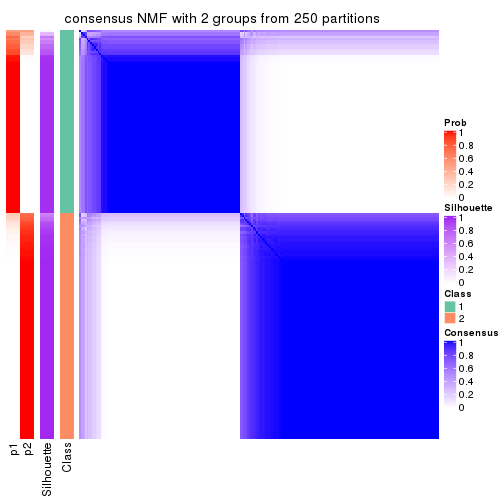</p>

</div>
<div id='tab-CV-NMF-consensus-heatmap-2'>
<pre><code class="r">consensus_heatmap(res, k = 3)
</code></pre>

<p>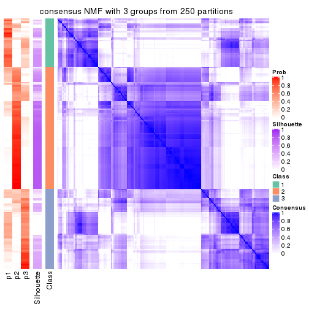</p>

</div>
<div id='tab-CV-NMF-consensus-heatmap-3'>
<pre><code class="r">consensus_heatmap(res, k = 4)
</code></pre>

<p>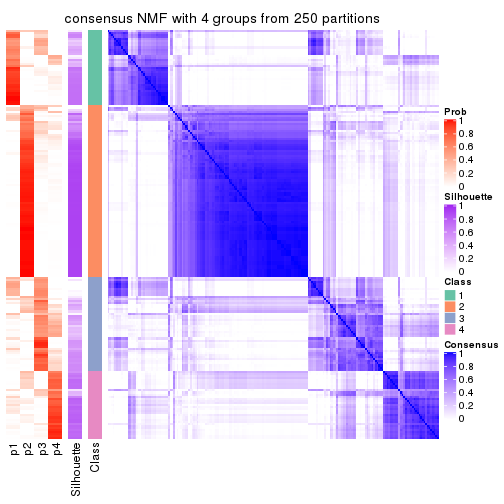</p>

</div>
<div id='tab-CV-NMF-consensus-heatmap-4'>
<pre><code class="r">consensus_heatmap(res, k = 5)
</code></pre>

<p>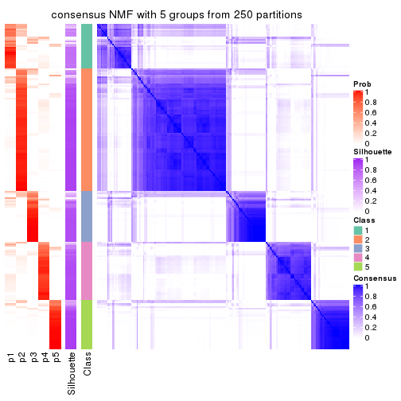</p>

</div>
<div id='tab-CV-NMF-consensus-heatmap-5'>
<pre><code class="r">consensus_heatmap(res, k = 6)
</code></pre>

<p>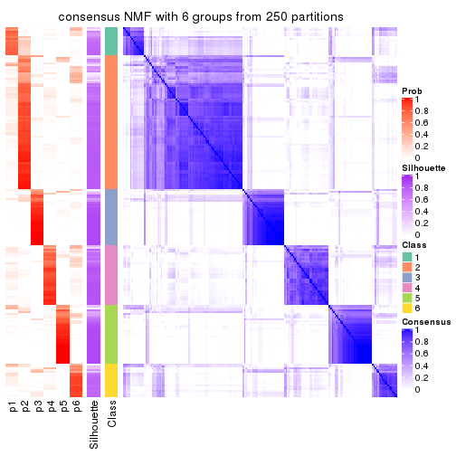</p>

</div>
</div>

Heatmaps for the membership of samples in all partitions to see how consistent they are:


<script>
$( function() {
	$( '#tabs-CV-NMF-membership-heatmap' ).tabs();
} );
</script>
<div id='tabs-CV-NMF-membership-heatmap'>
<ul>
<li><a href='#tab-CV-NMF-membership-heatmap-1'>k = 2</a></li>
<li><a href='#tab-CV-NMF-membership-heatmap-2'>k = 3</a></li>
<li><a href='#tab-CV-NMF-membership-heatmap-3'>k = 4</a></li>
<li><a href='#tab-CV-NMF-membership-heatmap-4'>k = 5</a></li>
<li><a href='#tab-CV-NMF-membership-heatmap-5'>k = 6</a></li>
</ul>
<div id='tab-CV-NMF-membership-heatmap-1'>
<pre><code class="r">membership_heatmap(res, k = 2)
</code></pre>

<p>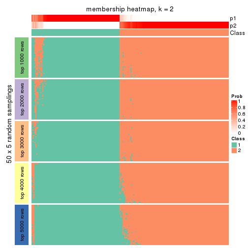</p>

</div>
<div id='tab-CV-NMF-membership-heatmap-2'>
<pre><code class="r">membership_heatmap(res, k = 3)
</code></pre>

<p>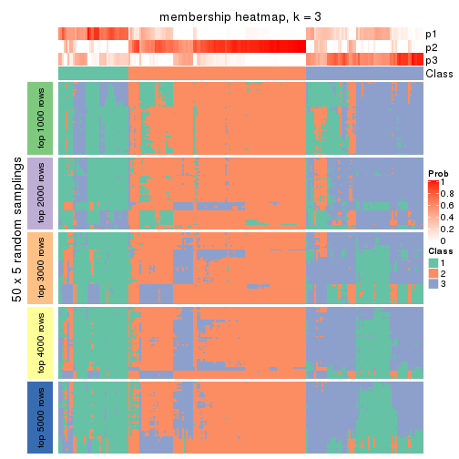</p>

</div>
<div id='tab-CV-NMF-membership-heatmap-3'>
<pre><code class="r">membership_heatmap(res, k = 4)
</code></pre>

<p>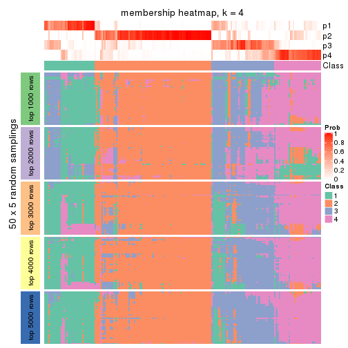</p>

</div>
<div id='tab-CV-NMF-membership-heatmap-4'>
<pre><code class="r">membership_heatmap(res, k = 5)
</code></pre>

<p>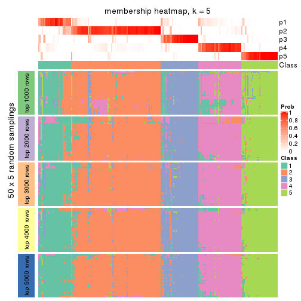</p>

</div>
<div id='tab-CV-NMF-membership-heatmap-5'>
<pre><code class="r">membership_heatmap(res, k = 6)
</code></pre>

<p>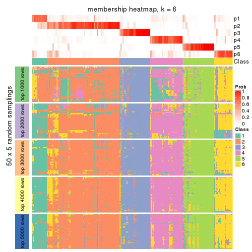</p>

</div>
</div>

As soon as we have had the classes for columns, we can look for signatures
which are significantly different between classes which can be candidate marks
for certain classes. Following are the heatmaps for signatures.


Signature heatmaps where rows are scaled:


<script>
$( function() {
	$( '#tabs-CV-NMF-get-signatures' ).tabs();
} );
</script>
<div id='tabs-CV-NMF-get-signatures'>
<ul>
<li><a href='#tab-CV-NMF-get-signatures-1'>k = 2</a></li>
<li><a href='#tab-CV-NMF-get-signatures-2'>k = 3</a></li>
<li><a href='#tab-CV-NMF-get-signatures-3'>k = 4</a></li>
<li><a href='#tab-CV-NMF-get-signatures-4'>k = 5</a></li>
<li><a href='#tab-CV-NMF-get-signatures-5'>k = 6</a></li>
</ul>
<div id='tab-CV-NMF-get-signatures-1'>
<pre><code class="r">get_signatures(res, k = 2)
</code></pre>

<p>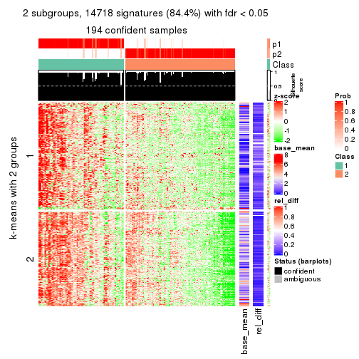</p>

</div>
<div id='tab-CV-NMF-get-signatures-2'>
<pre><code class="r">get_signatures(res, k = 3)
</code></pre>

<p>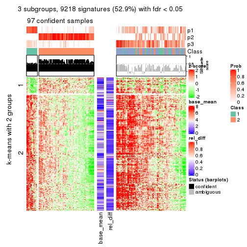</p>

</div>
<div id='tab-CV-NMF-get-signatures-3'>
<pre><code class="r">get_signatures(res, k = 4)
</code></pre>

<p>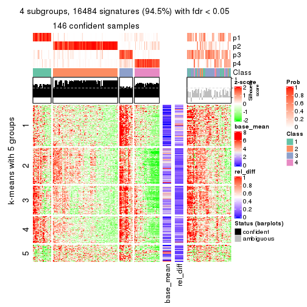</p>

</div>
<div id='tab-CV-NMF-get-signatures-4'>
<pre><code class="r">get_signatures(res, k = 5)
</code></pre>

<p>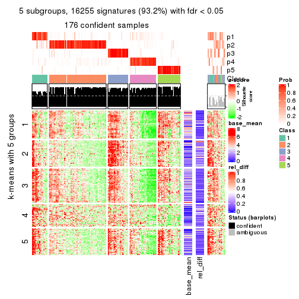</p>

</div>
<div id='tab-CV-NMF-get-signatures-5'>
<pre><code class="r">get_signatures(res, k = 6)
</code></pre>

<p>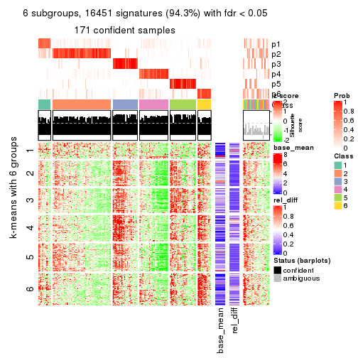</p>

</div>
</div>


Signature heatmaps where rows are not scaled:


<script>
$( function() {
	$( '#tabs-CV-NMF-get-signatures-no-scale' ).tabs();
} );
</script>
<div id='tabs-CV-NMF-get-signatures-no-scale'>
<ul>
<li><a href='#tab-CV-NMF-get-signatures-no-scale-1'>k = 2</a></li>
<li><a href='#tab-CV-NMF-get-signatures-no-scale-2'>k = 3</a></li>
<li><a href='#tab-CV-NMF-get-signatures-no-scale-3'>k = 4</a></li>
<li><a href='#tab-CV-NMF-get-signatures-no-scale-4'>k = 5</a></li>
<li><a href='#tab-CV-NMF-get-signatures-no-scale-5'>k = 6</a></li>
</ul>
<div id='tab-CV-NMF-get-signatures-no-scale-1'>
<pre><code class="r">get_signatures(res, k = 2, scale_rows = FALSE)
</code></pre>

<p>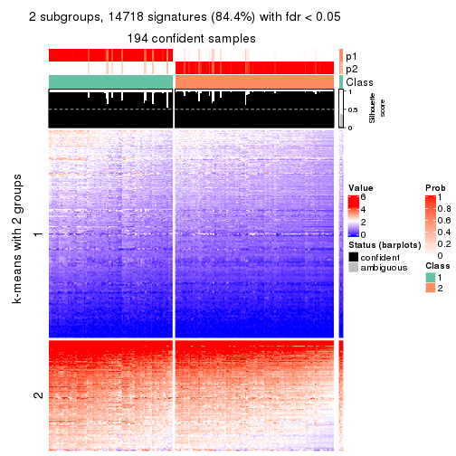</p>

</div>
<div id='tab-CV-NMF-get-signatures-no-scale-2'>
<pre><code class="r">get_signatures(res, k = 3, scale_rows = FALSE)
</code></pre>

<p>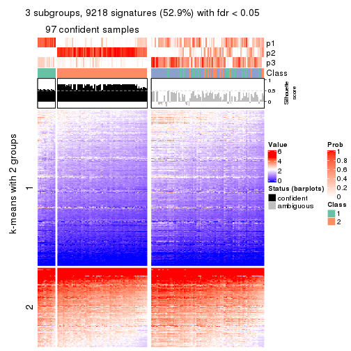</p>

</div>
<div id='tab-CV-NMF-get-signatures-no-scale-3'>
<pre><code class="r">get_signatures(res, k = 4, scale_rows = FALSE)
</code></pre>

<p>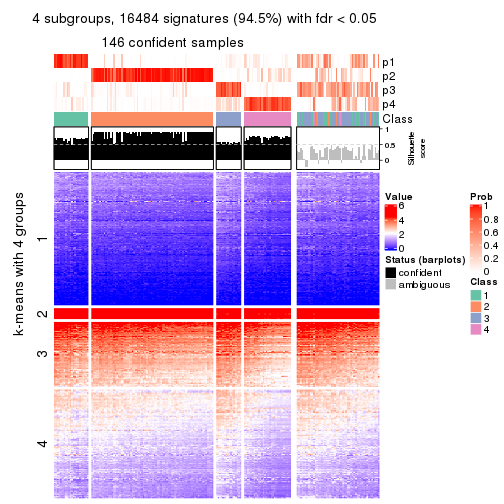</p>

</div>
<div id='tab-CV-NMF-get-signatures-no-scale-4'>
<pre><code class="r">get_signatures(res, k = 5, scale_rows = FALSE)
</code></pre>

<p>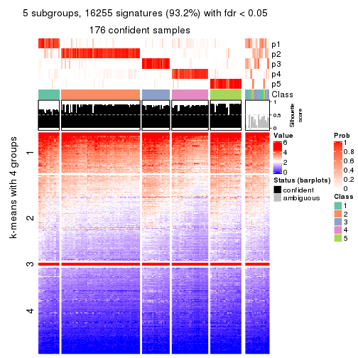</p>

</div>
<div id='tab-CV-NMF-get-signatures-no-scale-5'>
<pre><code class="r">get_signatures(res, k = 6, scale_rows = FALSE)
</code></pre>

<p>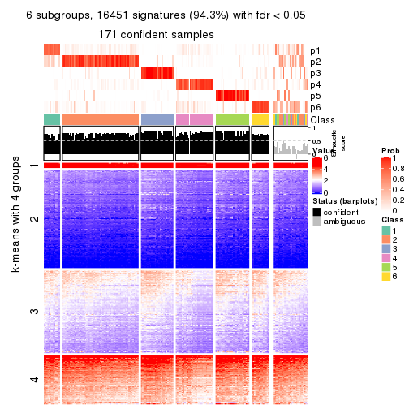</p>

</div>
</div>


Compare the overlap of signatures from different k:

```r
compare_signatures(res)
```

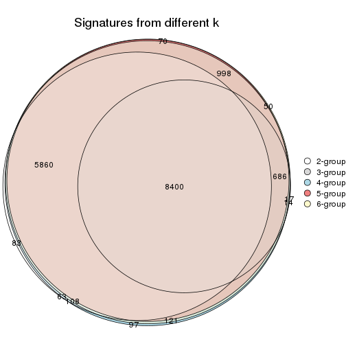

`get_signature()` returns a data frame invisibly. TO get the list of signatures, the function
call should be assigned to a variable explicitly. In following code, if `plot` argument is set
to `FALSE`, no heatmap is plotted while only the differential analysis is performed.

```r
# code only for demonstration
tb = get_signature(res, k = ..., plot = FALSE)
```

An example of the output of `tb` is:

```
#>   which_row         fdr    mean_1    mean_2 scaled_mean_1 scaled_mean_2 km
#> 1        38 0.042760348  8.373488  9.131774    -0.5533452     0.5164555  1
#> 2        40 0.018707592  7.106213  8.469186    -0.6173731     0.5762149  1
#> 3        55 0.019134737 10.221463 11.207825    -0.6159697     0.5749050  1
#> 4        59 0.006059896  5.921854  7.869574    -0.6899429     0.6439467  1
#> 5        60 0.018055526  8.928898 10.211722    -0.6204761     0.5791110  1
#> 6        98 0.009384629 15.714769 14.887706     0.6635654    -0.6193277  2
...
```

The columns in `tb` are:

1. `which_row`: row indices corresponding to the input matrix.
2. `fdr`: FDR for the differential test. 
3. `mean_x`: The mean value in group x.
4. `scaled_mean_x`: The mean value in group x after rows are scaled.
5. `km`: Row groups if k-means clustering is applied to rows.


UMAP plot which shows how samples are separated.


<script>
$( function() {
	$( '#tabs-CV-NMF-dimension-reduction' ).tabs();
} );
</script>
<div id='tabs-CV-NMF-dimension-reduction'>
<ul>
<li><a href='#tab-CV-NMF-dimension-reduction-1'>k = 2</a></li>
<li><a href='#tab-CV-NMF-dimension-reduction-2'>k = 3</a></li>
<li><a href='#tab-CV-NMF-dimension-reduction-3'>k = 4</a></li>
<li><a href='#tab-CV-NMF-dimension-reduction-4'>k = 5</a></li>
<li><a href='#tab-CV-NMF-dimension-reduction-5'>k = 6</a></li>
</ul>
<div id='tab-CV-NMF-dimension-reduction-1'>
<pre><code class="r">dimension_reduction(res, k = 2, method = &quot;UMAP&quot;)
</code></pre>

<p>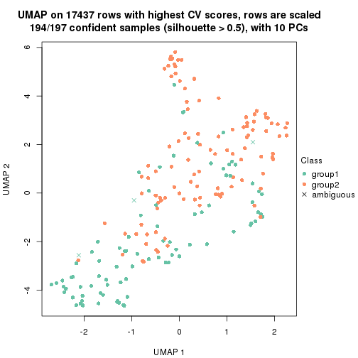</p>

</div>
<div id='tab-CV-NMF-dimension-reduction-2'>
<pre><code class="r">dimension_reduction(res, k = 3, method = &quot;UMAP&quot;)
</code></pre>

<p>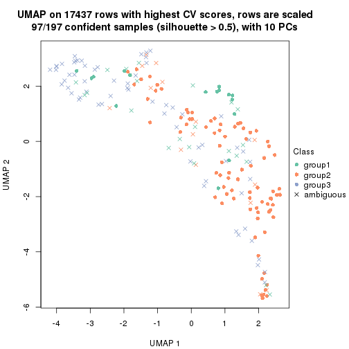</p>

</div>
<div id='tab-CV-NMF-dimension-reduction-3'>
<pre><code class="r">dimension_reduction(res, k = 4, method = &quot;UMAP&quot;)
</code></pre>

<p>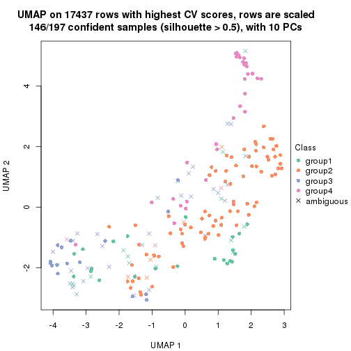</p>

</div>
<div id='tab-CV-NMF-dimension-reduction-4'>
<pre><code class="r">dimension_reduction(res, k = 5, method = &quot;UMAP&quot;)
</code></pre>

<p>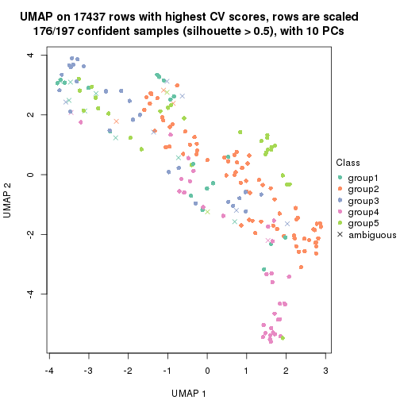</p>

</div>
<div id='tab-CV-NMF-dimension-reduction-5'>
<pre><code class="r">dimension_reduction(res, k = 6, method = &quot;UMAP&quot;)
</code></pre>

<p>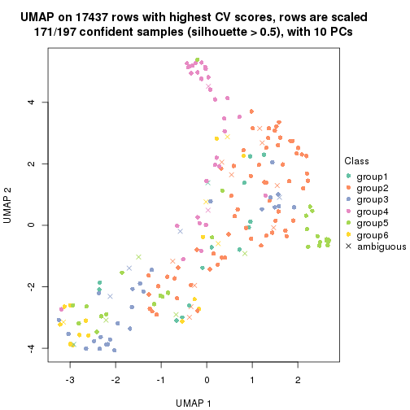</p>

</div>
</div>


Following heatmap shows how subgroups are split when increasing `k`:

```r
collect_classes(res)
```

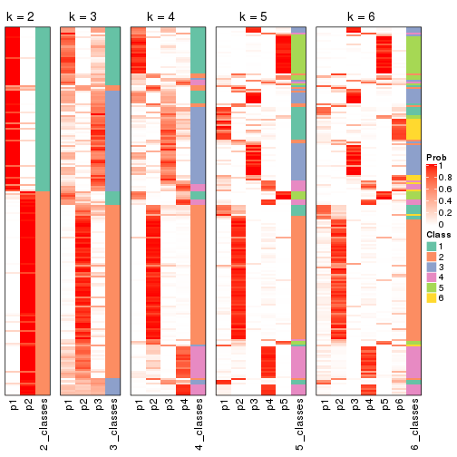


If matrix rows can be associated to genes, consider to use `GO_Enrichment(res,
...)` to perform function enrichment for the signature genes.


 

---------------------------------------------------


### MAD:hclust


The object with results only for a single top-value method and a single partition method 
can be extracted as:

```r
res = res_list["MAD", "hclust"]
# you can also extract it by
# res = res_list["MAD:hclust"]
```

A summary of `res` and all the functions that can be applied to it:

```r
res
```

```
#> A 'ConsensusPartition' object with k = 2, 3, 4, 5, 6.
#>   On a matrix with 17437 rows and 197 columns.
#>   Top rows (1000, 2000, 3000, 4000, 5000) are extracted by 'MAD' method.
#>   Subgroups are detected by 'hclust' method.
#>   Performed in total 1250 partitions by row resampling.
#>   Best k for subgroups seems to be 2.
#> 
#> Following methods can be applied to this 'ConsensusPartition' object:
#>  [1] "cola_report"             "collect_classes"         "collect_plots"          
#>  [4] "collect_stats"           "colnames"                "compare_signatures"     
#>  [7] "consensus_heatmap"       "dimension_reduction"     "functional_enrichment"  
#> [10] "get_anno_col"            "get_anno"                "get_classes"            
#> [13] "get_consensus"           "get_matrix"              "get_membership"         
#> [16] "get_param"               "get_signatures"          "get_stats"              
#> [19] "is_best_k"               "is_stable_k"             "membership_heatmap"     
#> [22] "ncol"                    "nrow"                    "plot_ecdf"              
#> [25] "rownames"                "select_partition_number" "show"                   
#> [28] "suggest_best_k"          "test_to_known_factors"
```

`collect_plots()` function collects all the plots made from `res` for all `k` (number of partitions)
into one single page to provide an easy and fast comparison between different `k`.

```r
collect_plots(res)
```

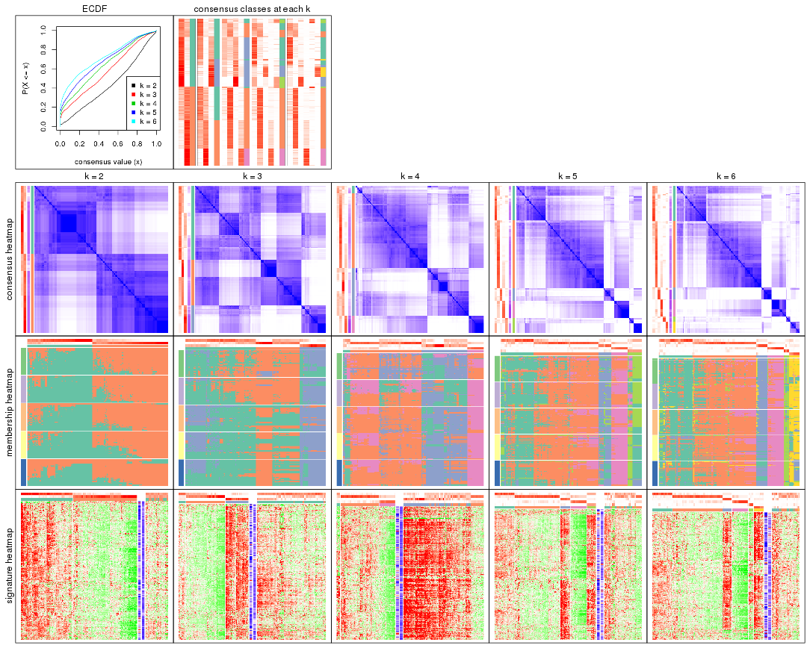

The plots are:

- The first row: a plot of the ECDF (Empirical cumulative distribution
  function) curves of the consensus matrix for each `k` and the heatmap of
  predicted classes for each `k`.
- The second row: heatmaps of the consensus matrix for each `k`.
- The third row: heatmaps of the membership matrix for each `k`.
- The fouth row: heatmaps of the signatures for each `k`.

All the plots in panels can be made by individual functions and they are
plotted later in this section.

`select_partition_number()` produces several plots showing different
statistics for choosing "optimized" `k`. There are following statistics:

- ECDF curves of the consensus matrix for each `k`;
- 1-PAC. [The PAC
  score](https://en.wikipedia.org/wiki/Consensus_clustering#Over-interpretation_potential_of_consensus_clustering)
  measures the proportion of the ambiguous subgrouping.
- Mean silhouette score.
- Concordance. The mean probability of fiting the consensus class ids in all
  partitions.
- Area increased. Denote $A_k$ as the area under the ECDF curve for current
  `k`, the area increased is defined as $A_k - A_{k-1}$.
- Rand index. The percent of pairs of samples that are both in a same cluster
  or both are not in a same cluster in the partition of k and k-1.
- Jaccard index. The ratio of pairs of samples are both in a same cluster in
  the partition of k and k-1 and the pairs of samples are both in a same
  cluster in the partition k or k-1.

The detailed explanations of these statistics can be found in [the cola
vignette](http://bioconductor.org/packages/devel/bioc/vignettes/cola/inst/doc/cola.html#toc_13).

Generally speaking, lower PAC score, higher mean silhouette score or higher
concordance corresponds to better partition. Rand index and Jaccard index
measure how similar the current partition is compared to partition with `k-1`.
If they are too similar, we won't accept `k` is better than `k-1`.

```r
select_partition_number(res)
```

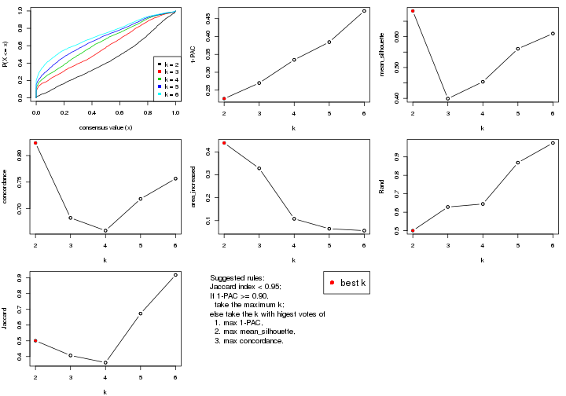

The numeric values for all these statistics can be obtained by `get_stats()`.

```r
get_stats(res)
```

```
#>   k 1-PAC mean_silhouette concordance area_increased  Rand Jaccard
#> 2 2 0.226           0.683       0.824         0.4389 0.500   0.500
#> 3 3 0.270           0.399       0.683         0.3282 0.628   0.407
#> 4 4 0.335           0.454       0.659         0.1079 0.645   0.361
#> 5 5 0.384           0.561       0.718         0.0644 0.869   0.673
#> 6 6 0.471           0.610       0.757         0.0563 0.975   0.919
```

`suggest_best_k()` suggests the best $k$ based on these statistics. The rules are as follows:

- All $k$ with Jaccard index larger than 0.95 are removed because the increase of
  the partition number does not provides enough extra information. If all $k$ are removed,
  the best $k$ is assigned by `NA`.
- For $k$ with 1-PAC larger than 0.9, the maximal $k$ is taken as the "best k". Other $k$ is called "optional k".
- If it does not fit the second rule. The $k$ with the highest vote of highest
  1-PAC, mean silhouette and concordance is taken as the "best k".

```r
suggest_best_k(res)
```

```
#> [1] 2
```


Following shows the table of the partitions (You need to click the **show/hide
code output** link to see it). The membership matrix (columns with name `p*`)
is inferred by
[`clue::cl_consensus()`](https://www.rdocumentation.org/link/cl_consensus?package=clue)
function with the `SE` method. Basically the value in the membership matrix
represents the probability to belong to a certain group. The finall class
label for an item is determined with the group with highest probability it
belongs to.

In `get_classes()` function, the entropy is calculated from the membership
matrix and the silhouette score is calculated from the consensus matrix.


<script>
$( function() {
	$( '#tabs-MAD-hclust-get-classes' ).tabs();
} );
</script>
<div id='tabs-MAD-hclust-get-classes'>
<ul>
<li><a href='#tab-MAD-hclust-get-classes-1'>k = 2</a></li>
<li><a href='#tab-MAD-hclust-get-classes-2'>k = 3</a></li>
<li><a href='#tab-MAD-hclust-get-classes-3'>k = 4</a></li>
<li><a href='#tab-MAD-hclust-get-classes-4'>k = 5</a></li>
<li><a href='#tab-MAD-hclust-get-classes-5'>k = 6</a></li>
</ul>

<div id='tab-MAD-hclust-get-classes-1'>
<p><a id='tab-MAD-hclust-get-classes-1-a' style='color:#0366d6' href='#'>show/hide code output</a></p>
<pre><code class="r">cbind(get_classes(res, k = 2), get_membership(res, k = 2))
</code></pre>

<pre><code>#&gt;            class entropy silhouette    p1    p2
#&gt; SRR1380886     1  0.4298     0.8168 0.912 0.088
#&gt; SRR1074385     1  0.4939     0.8128 0.892 0.108
#&gt; SRR1374739     1  0.0000     0.7979 1.000 0.000
#&gt; SRR1097883     1  0.5737     0.7962 0.864 0.136
#&gt; SRR2167209     2  0.9933     0.2707 0.452 0.548
#&gt; SRR816541      2  0.1843     0.7807 0.028 0.972
#&gt; SRR663645      2  0.8327     0.7121 0.264 0.736
#&gt; SRR1381505     2  0.0000     0.7645 0.000 1.000
#&gt; SRR1416362     2  0.4815     0.7905 0.104 0.896
#&gt; SRR1318503     2  0.9977     0.2366 0.472 0.528
#&gt; SRR1341626     2  0.2236     0.7837 0.036 0.964
#&gt; SRR1382440     1  0.0000     0.7979 1.000 0.000
#&gt; SRR1088413     1  0.4431     0.8163 0.908 0.092
#&gt; SRR1082080     2  0.1843     0.7806 0.028 0.972
#&gt; SRR1455783     1  0.6623     0.7660 0.828 0.172
#&gt; SRR1447760     2  0.9129     0.6180 0.328 0.672
#&gt; SRR1487784     2  0.4690     0.7909 0.100 0.900
#&gt; SRR1331037     2  0.8499     0.7000 0.276 0.724
#&gt; SRR1095651     1  0.4690     0.8068 0.900 0.100
#&gt; SRR1078066     1  0.7453     0.7228 0.788 0.212
#&gt; SRR1120363     1  0.4562     0.8158 0.904 0.096
#&gt; SRR821231      1  0.1843     0.8076 0.972 0.028
#&gt; SRR1374373     2  0.9129     0.6239 0.328 0.672
#&gt; SRR1324519     2  0.3114     0.7886 0.056 0.944
#&gt; SRR1431121     1  0.3733     0.8166 0.928 0.072
#&gt; SRR1091032     2  0.4298     0.7917 0.088 0.912
#&gt; SRR1365575     2  0.0000     0.7645 0.000 1.000
#&gt; SRR1072972     1  0.4161     0.8176 0.916 0.084
#&gt; SRR1310690     2  0.2948     0.7880 0.052 0.948
#&gt; SRR1383037     1  0.0000     0.7979 1.000 0.000
#&gt; SRR1095479     1  0.2603     0.8122 0.956 0.044
#&gt; SRR1070403     1  0.0000     0.7979 1.000 0.000
#&gt; SRR1390203     1  0.4022     0.8171 0.920 0.080
#&gt; SRR1072007     2  0.6247     0.7807 0.156 0.844
#&gt; SRR1468787     1  0.9970     0.0321 0.532 0.468
#&gt; SRR1347959     2  0.4022     0.7909 0.080 0.920
#&gt; SRR1338513     1  0.5629     0.7920 0.868 0.132
#&gt; SRR812598      2  0.0000     0.7645 0.000 1.000
#&gt; SRR1446806     2  0.9248     0.6027 0.340 0.660
#&gt; SRR1394275     1  0.9661     0.3562 0.608 0.392
#&gt; SRR1443633     1  0.4939     0.8053 0.892 0.108
#&gt; SRR1087728     1  0.0376     0.7989 0.996 0.004
#&gt; SRR1098192     2  0.2423     0.7850 0.040 0.960
#&gt; SRR1093340     2  0.1843     0.7806 0.028 0.972
#&gt; SRR665405      2  0.7528     0.7539 0.216 0.784
#&gt; SRR657077      2  0.8267     0.7156 0.260 0.740
#&gt; SRR813208      1  0.0000     0.7979 1.000 0.000
#&gt; SRR1416074     2  0.4690     0.7909 0.100 0.900
#&gt; SRR1089688     2  0.7453     0.7559 0.212 0.788
#&gt; SRR1353461     1  0.0000     0.7979 1.000 0.000
#&gt; SRR1466321     2  1.0000     0.1401 0.496 0.504
#&gt; SRR1073021     1  0.9963     0.0537 0.536 0.464
#&gt; SRR1322816     2  0.3431     0.7903 0.064 0.936
#&gt; SRR1457727     1  0.3114     0.8150 0.944 0.056
#&gt; SRR1464226     2  0.6623     0.7732 0.172 0.828
#&gt; SRR1398863     1  0.4939     0.8128 0.892 0.108
#&gt; SRR1455631     2  0.8443     0.7028 0.272 0.728
#&gt; SRR1307808     2  0.8608     0.6833 0.284 0.716
#&gt; SRR1374585     2  0.0000     0.7645 0.000 1.000
#&gt; SRR1072104     2  0.5946     0.7837 0.144 0.856
#&gt; SRR1076868     2  0.4939     0.7903 0.108 0.892
#&gt; SRR1335984     2  0.8386     0.7120 0.268 0.732
#&gt; SRR1445939     1  0.8813     0.5891 0.700 0.300
#&gt; SRR1453047     2  0.4298     0.7917 0.088 0.912
#&gt; SRR1339788     1  0.0000     0.7979 1.000 0.000
#&gt; SRR1084323     1  0.9460     0.4336 0.636 0.364
#&gt; SRR1092937     1  0.9754     0.2920 0.592 0.408
#&gt; SRR1074090     2  0.3114     0.7886 0.056 0.944
#&gt; SRR1099833     1  0.5629     0.7920 0.868 0.132
#&gt; SRR1093434     1  0.0000     0.7979 1.000 0.000
#&gt; SRR1435857     1  0.9286     0.4883 0.656 0.344
#&gt; SRR1480347     2  0.1843     0.7806 0.028 0.972
#&gt; SRR1440787     2  0.0000     0.7645 0.000 1.000
#&gt; SRR1430202     2  0.9248     0.6027 0.340 0.660
#&gt; SRR1322730     2  0.1184     0.7734 0.016 0.984
#&gt; SRR811029      2  0.6148     0.7818 0.152 0.848
#&gt; SRR1390456     1  0.0000     0.7979 1.000 0.000
#&gt; SRR1381140     1  0.5842     0.7927 0.860 0.140
#&gt; SRR1388064     2  0.0000     0.7645 0.000 1.000
#&gt; SRR1093577     1  0.9286     0.4851 0.656 0.344
#&gt; SRR1414161     1  0.9732     0.3159 0.596 0.404
#&gt; SRR1328738     1  0.9427     0.4438 0.640 0.360
#&gt; SRR1311752     2  0.1843     0.7806 0.028 0.972
#&gt; SRR1445960     2  0.7299     0.7570 0.204 0.796
#&gt; SRR1403412     2  0.6148     0.7818 0.152 0.848
#&gt; SRR2166748     1  0.2603     0.8122 0.956 0.044
#&gt; SRR821666      2  0.0000     0.7645 0.000 1.000
#&gt; SRR1330746     1  0.0000     0.7979 1.000 0.000
#&gt; SRR1327872     2  0.0672     0.7680 0.008 0.992
#&gt; SRR1100800     1  0.3733     0.8168 0.928 0.072
#&gt; SRR1075174     1  0.8813     0.5865 0.700 0.300
#&gt; SRR1434436     2  1.0000     0.1235 0.496 0.504
#&gt; SRR1389409     2  0.0000     0.7645 0.000 1.000
#&gt; SRR1085310     1  0.5294     0.8072 0.880 0.120
#&gt; SRR1376718     2  0.0000     0.7645 0.000 1.000
#&gt; SRR808590      2  0.0000     0.7645 0.000 1.000
#&gt; SRR1084128     2  0.7883     0.7335 0.236 0.764
#&gt; SRR1361692     1  0.7453     0.7300 0.788 0.212
#&gt; SRR1431493     1  0.2423     0.8111 0.960 0.040
#&gt; SRR1409084     1  0.7376     0.7271 0.792 0.208
#&gt; SRR2166214     2  0.7528     0.7539 0.216 0.784
#&gt; SRR1324102     2  0.2423     0.7850 0.040 0.960
#&gt; SRR1079754     2  0.0000     0.7645 0.000 1.000
#&gt; SRR1442127     1  0.0376     0.7989 0.996 0.004
#&gt; SRR1076244     2  0.1843     0.7788 0.028 0.972
#&gt; SRR1330901     2  0.8608     0.6833 0.284 0.716
#&gt; SRR1073167     2  0.2423     0.7850 0.040 0.960
#&gt; SRR1357541     1  0.5737     0.7962 0.864 0.136
#&gt; SRR811607      2  0.9996     0.1650 0.488 0.512
#&gt; SRR1468931     1  0.0000     0.7979 1.000 0.000
#&gt; SRR1474908     2  0.8713     0.6791 0.292 0.708
#&gt; SRR1309875     2  0.3584     0.7902 0.068 0.932
#&gt; SRR598792      1  0.0376     0.7994 0.996 0.004
#&gt; SRR1088537     2  0.8713     0.6771 0.292 0.708
#&gt; SRR1457682     1  0.7528     0.7165 0.784 0.216
#&gt; SRR1454289     2  0.9775     0.4265 0.412 0.588
#&gt; SRR1069352     1  0.0000     0.7979 1.000 0.000
#&gt; SRR1472728     2  0.8267     0.7143 0.260 0.740
#&gt; SRR1091144     2  0.6438     0.7759 0.164 0.836
#&gt; SRR1319118     1  0.4022     0.8170 0.920 0.080
#&gt; SRR1403611     1  0.5842     0.7836 0.860 0.140
#&gt; SRR1397762     1  0.7219     0.7402 0.800 0.200
#&gt; SRR1317387     1  0.5294     0.8025 0.880 0.120
#&gt; SRR1376426     2  0.3114     0.7886 0.056 0.944
#&gt; SRR1097777     1  0.3584     0.8162 0.932 0.068
#&gt; SRR1365743     1  0.0000     0.7979 1.000 0.000
#&gt; SRR1458992     2  0.7299     0.7570 0.204 0.796
#&gt; SRR1089537     2  0.9866     0.3816 0.432 0.568
#&gt; SRR1397744     1  0.3584     0.8178 0.932 0.068
#&gt; SRR1453893     2  0.0000     0.7645 0.000 1.000
#&gt; SRR1098543     1  0.7376     0.7271 0.792 0.208
#&gt; SRR1321765     1  0.9833     0.2699 0.576 0.424
#&gt; SRR1440032     2  0.9922     0.3250 0.448 0.552
#&gt; SRR1404507     2  0.1184     0.7719 0.016 0.984
#&gt; SRR1404856     2  0.9522     0.5278 0.372 0.628
#&gt; SRR812745      1  0.9710     0.3356 0.600 0.400
#&gt; SRR1417524     1  0.6712     0.7590 0.824 0.176
#&gt; SRR1407334     2  0.0000     0.7645 0.000 1.000
#&gt; SRR1453991     1  0.4022     0.8175 0.920 0.080
#&gt; SRR1415938     1  0.4022     0.8171 0.920 0.080
#&gt; SRR1081259     2  0.9129     0.6239 0.328 0.672
#&gt; SRR1436187     2  0.0000     0.7645 0.000 1.000
#&gt; SRR1431948     1  0.0000     0.7979 1.000 0.000
#&gt; SRR1453277     2  0.9686     0.4803 0.396 0.604
#&gt; SRR1095407     2  0.9933     0.2707 0.452 0.548
#&gt; SRR1359694     2  0.9909     0.3326 0.444 0.556
#&gt; SRR656982      2  0.9998     0.1503 0.492 0.508
#&gt; SRR1354338     2  0.8555     0.6934 0.280 0.720
#&gt; SRR1088291     1  0.9944     0.0889 0.544 0.456
#&gt; SRR1080624     1  0.5629     0.8034 0.868 0.132
#&gt; SRR2166708     1  0.0000     0.7979 1.000 0.000
#&gt; SRR1393572     1  0.9963     0.0458 0.536 0.464
#&gt; SRR1429912     2  0.8386     0.7035 0.268 0.732
#&gt; SRR1421048     2  0.9850     0.3788 0.428 0.572
#&gt; SRR1434999     1  0.6801     0.7527 0.820 0.180
#&gt; SRR656457      1  0.6801     0.7527 0.820 0.180
#&gt; SRR1098928     1  0.4562     0.8070 0.904 0.096
#&gt; SRR1343967     2  0.1843     0.7806 0.028 0.972
#&gt; SRR1360766     1  0.9522     0.4385 0.628 0.372
#&gt; SRR1464724     2  0.1843     0.7788 0.028 0.972
#&gt; SRR1101542     2  0.0000     0.7645 0.000 1.000
#&gt; SRR1401528     1  0.4431     0.8157 0.908 0.092
#&gt; SRR1071519     1  0.0000     0.7979 1.000 0.000
#&gt; SRR1086070     1  0.5737     0.7951 0.864 0.136
#&gt; SRR1358645     2  0.9970     0.2442 0.468 0.532
#&gt; SRR819771      1  0.0000     0.7979 1.000 0.000
#&gt; SRR1418433     2  0.2043     0.7788 0.032 0.968
#&gt; SRR821050      1  0.5178     0.8111 0.884 0.116
#&gt; SRR1402091     2  0.7745     0.7418 0.228 0.772
#&gt; SRR1322028     2  0.5059     0.7915 0.112 0.888
#&gt; SRR1452556     2  0.0000     0.7645 0.000 1.000
#&gt; SRR1340047     2  0.9460     0.5536 0.364 0.636
#&gt; SRR1418302     2  0.3584     0.7902 0.068 0.932
#&gt; SRR1073991     1  0.3733     0.8168 0.928 0.072
#&gt; SRR1085187     2  0.1414     0.7730 0.020 0.980
#&gt; SRR1357618     1  0.0000     0.7979 1.000 0.000
#&gt; SRR1487764     1  0.9944     0.0921 0.544 0.456
#&gt; SRR1075336     1  0.9170     0.5160 0.668 0.332
#&gt; SRR1365471     2  0.1843     0.7806 0.028 0.972
#&gt; SRR1414613     2  0.7139     0.7617 0.196 0.804
#&gt; SRR658719      2  0.8144     0.7239 0.252 0.748
#&gt; SRR1475128     1  0.0000     0.7979 1.000 0.000
#&gt; SRR1367630     2  0.5946     0.7837 0.144 0.856
#&gt; SRR1481146     2  0.8443     0.7028 0.272 0.728
#&gt; SRR1465674     1  0.9866     0.2441 0.568 0.432
#&gt; SRR1327303     2  0.7745     0.7418 0.228 0.772
#&gt; SRR1390391     2  0.9491     0.5560 0.368 0.632
#&gt; SRR1326020     2  0.8386     0.7120 0.268 0.732
#&gt; SRR1381953     1  0.8955     0.5627 0.688 0.312
#&gt; SRR1082544     2  0.5629     0.7866 0.132 0.868
#&gt; SRR810761      1  0.5519     0.8009 0.872 0.128
#&gt; SRR1070764     1  0.0000     0.7979 1.000 0.000
#&gt; SRR1415919     1  0.0000     0.7979 1.000 0.000
#&gt; SRR1490404     2  0.4939     0.7903 0.108 0.892
#&gt; SRR1416773     1  0.9866     0.2441 0.568 0.432
#&gt; SRR1377492     2  0.7453     0.7559 0.212 0.788
#&gt; SRR1334314     2  0.9983     0.2199 0.476 0.524
</code></pre>

<script>
$('#tab-MAD-hclust-get-classes-1-a').parent().next().next().hide();
$('#tab-MAD-hclust-get-classes-1-a').click(function(){
  $('#tab-MAD-hclust-get-classes-1-a').parent().next().next().toggle();
  return(false);
});
</script>
</div>

<div id='tab-MAD-hclust-get-classes-2'>
<p><a id='tab-MAD-hclust-get-classes-2-a' style='color:#0366d6' href='#'>show/hide code output</a></p>
<pre><code class="r">cbind(get_classes(res, k = 3), get_membership(res, k = 3))
</code></pre>

<pre><code>#&gt;            class entropy silhouette    p1    p2    p3
#&gt; SRR1380886     1  0.6252   -0.15351 0.556 0.000 0.444
#&gt; SRR1074385     1  0.6247    0.03755 0.620 0.004 0.376
#&gt; SRR1374739     3  0.2796    0.82621 0.092 0.000 0.908
#&gt; SRR1097883     1  0.5882    0.06536 0.652 0.000 0.348
#&gt; SRR2167209     1  0.4654    0.35124 0.792 0.208 0.000
#&gt; SRR816541      2  0.5560    0.69339 0.300 0.700 0.000
#&gt; SRR663645      1  0.6476   -0.18848 0.548 0.448 0.004
#&gt; SRR1381505     2  0.0000    0.63383 0.000 1.000 0.000
#&gt; SRR1416362     2  0.6126    0.59934 0.400 0.600 0.000
#&gt; SRR1318503     1  0.5826    0.42088 0.764 0.204 0.032
#&gt; SRR1341626     2  0.5650    0.69011 0.312 0.688 0.000
#&gt; SRR1382440     3  0.2796    0.82621 0.092 0.000 0.908
#&gt; SRR1088413     1  0.6168   -0.05850 0.588 0.000 0.412
#&gt; SRR1082080     2  0.5560    0.69349 0.300 0.700 0.000
#&gt; SRR1455783     1  0.7726    0.11281 0.572 0.056 0.372
#&gt; SRR1447760     1  0.5859    0.11899 0.656 0.344 0.000
#&gt; SRR1487784     2  0.6095    0.61039 0.392 0.608 0.000
#&gt; SRR1331037     1  0.6062   -0.02305 0.616 0.384 0.000
#&gt; SRR1095651     3  0.5363    0.59587 0.276 0.000 0.724
#&gt; SRR1078066     1  0.5465    0.26119 0.712 0.000 0.288
#&gt; SRR1120363     1  0.6398   -0.05035 0.580 0.004 0.416
#&gt; SRR821231      3  0.4796    0.73325 0.220 0.000 0.780
#&gt; SRR1374373     1  0.5785    0.13404 0.668 0.332 0.000
#&gt; SRR1324519     2  0.5882    0.66497 0.348 0.652 0.000
#&gt; SRR1431121     1  0.6252   -0.13117 0.556 0.000 0.444
#&gt; SRR1091032     2  0.6045    0.63296 0.380 0.620 0.000
#&gt; SRR1365575     2  0.0000    0.63383 0.000 1.000 0.000
#&gt; SRR1072972     1  0.6260   -0.16867 0.552 0.000 0.448
#&gt; SRR1310690     2  0.5733    0.68322 0.324 0.676 0.000
#&gt; SRR1383037     3  0.1031    0.80774 0.024 0.000 0.976
#&gt; SRR1095479     3  0.6111    0.51960 0.396 0.000 0.604
#&gt; SRR1070403     3  0.2796    0.82621 0.092 0.000 0.908
#&gt; SRR1390203     1  0.6235   -0.11403 0.564 0.000 0.436
#&gt; SRR1072007     2  0.6204    0.54754 0.424 0.576 0.000
#&gt; SRR1468787     1  0.5285    0.47665 0.812 0.148 0.040
#&gt; SRR1347959     2  0.6008    0.63879 0.372 0.628 0.000
#&gt; SRR1338513     3  0.6255    0.51911 0.320 0.012 0.668
#&gt; SRR812598      2  0.1411    0.64692 0.036 0.964 0.000
#&gt; SRR1446806     1  0.6228    0.19778 0.672 0.316 0.012
#&gt; SRR1394275     1  0.6460    0.52523 0.764 0.112 0.124
#&gt; SRR1443633     1  0.6252   -0.17639 0.556 0.000 0.444
#&gt; SRR1087728     3  0.2448    0.81545 0.076 0.000 0.924
#&gt; SRR1098192     2  0.5678    0.68826 0.316 0.684 0.000
#&gt; SRR1093340     2  0.5560    0.69349 0.300 0.700 0.000
#&gt; SRR665405      1  0.6309   -0.34138 0.504 0.496 0.000
#&gt; SRR657077      1  0.6442   -0.16572 0.564 0.432 0.004
#&gt; SRR813208      3  0.1031    0.80774 0.024 0.000 0.976
#&gt; SRR1416074     2  0.6095    0.61039 0.392 0.608 0.000
#&gt; SRR1089688     2  0.6305    0.36457 0.484 0.516 0.000
#&gt; SRR1353461     3  0.1289    0.80642 0.032 0.000 0.968
#&gt; SRR1466321     1  0.5850    0.44129 0.772 0.188 0.040
#&gt; SRR1073021     1  0.5222    0.47973 0.816 0.144 0.040
#&gt; SRR1322816     2  0.5926    0.66115 0.356 0.644 0.000
#&gt; SRR1457727     3  0.6309    0.24632 0.500 0.000 0.500
#&gt; SRR1464226     2  0.6260    0.50419 0.448 0.552 0.000
#&gt; SRR1398863     1  0.6247    0.03755 0.620 0.004 0.376
#&gt; SRR1455631     1  0.6180   -0.12484 0.584 0.416 0.000
#&gt; SRR1307808     1  0.6314   -0.02120 0.604 0.392 0.004
#&gt; SRR1374585     2  0.0000    0.63383 0.000 1.000 0.000
#&gt; SRR1072104     2  0.6168    0.56847 0.412 0.588 0.000
#&gt; SRR1076868     2  0.6140    0.59293 0.404 0.596 0.000
#&gt; SRR1335984     1  0.6661   -0.07297 0.588 0.400 0.012
#&gt; SRR1445939     1  0.6794    0.46415 0.728 0.076 0.196
#&gt; SRR1453047     2  0.6045    0.63296 0.380 0.620 0.000
#&gt; SRR1339788     3  0.2796    0.82621 0.092 0.000 0.908
#&gt; SRR1084323     1  0.6605    0.53372 0.752 0.096 0.152
#&gt; SRR1092937     1  0.6037    0.51807 0.788 0.112 0.100
#&gt; SRR1074090     2  0.5882    0.66497 0.348 0.652 0.000
#&gt; SRR1099833     3  0.6255    0.51911 0.320 0.012 0.668
#&gt; SRR1093434     3  0.2796    0.82621 0.092 0.000 0.908
#&gt; SRR1435857     1  0.6699    0.51242 0.744 0.092 0.164
#&gt; SRR1480347     2  0.5560    0.69349 0.300 0.700 0.000
#&gt; SRR1440787     2  0.0000    0.63383 0.000 1.000 0.000
#&gt; SRR1430202     1  0.6228    0.19778 0.672 0.316 0.012
#&gt; SRR1322730     2  0.2625    0.65816 0.084 0.916 0.000
#&gt; SRR811029      2  0.6299    0.45134 0.476 0.524 0.000
#&gt; SRR1390456     3  0.0747    0.80490 0.016 0.000 0.984
#&gt; SRR1381140     1  0.6704    0.04615 0.608 0.016 0.376
#&gt; SRR1388064     2  0.0237    0.63581 0.004 0.996 0.000
#&gt; SRR1093577     1  0.6063    0.53218 0.784 0.084 0.132
#&gt; SRR1414161     1  0.6462    0.51798 0.764 0.120 0.116
#&gt; SRR1328738     1  0.5793    0.53285 0.800 0.084 0.116
#&gt; SRR1311752     2  0.5560    0.69349 0.300 0.700 0.000
#&gt; SRR1445960     1  0.6299   -0.32035 0.524 0.476 0.000
#&gt; SRR1403412     2  0.6299    0.45134 0.476 0.524 0.000
#&gt; SRR2166748     3  0.6111    0.51960 0.396 0.000 0.604
#&gt; SRR821666      2  0.0000    0.63383 0.000 1.000 0.000
#&gt; SRR1330746     3  0.2796    0.82621 0.092 0.000 0.908
#&gt; SRR1327872     2  0.1031    0.63630 0.024 0.976 0.000
#&gt; SRR1100800     1  0.6235   -0.12323 0.564 0.000 0.436
#&gt; SRR1075174     1  0.6841    0.46608 0.724 0.076 0.200
#&gt; SRR1434436     1  0.4723    0.45147 0.824 0.160 0.016
#&gt; SRR1389409     2  0.0000    0.63383 0.000 1.000 0.000
#&gt; SRR1085310     1  0.6373   -0.04236 0.588 0.004 0.408
#&gt; SRR1376718     2  0.0000    0.63383 0.000 1.000 0.000
#&gt; SRR808590      2  0.0000    0.63383 0.000 1.000 0.000
#&gt; SRR1084128     1  0.6252   -0.22089 0.556 0.444 0.000
#&gt; SRR1361692     1  0.6053    0.32055 0.720 0.020 0.260
#&gt; SRR1431493     3  0.6168    0.49865 0.412 0.000 0.588
#&gt; SRR1409084     1  0.8019    0.22341 0.576 0.076 0.348
#&gt; SRR2166214     1  0.6309   -0.34138 0.504 0.496 0.000
#&gt; SRR1324102     2  0.5678    0.68826 0.316 0.684 0.000
#&gt; SRR1079754     2  0.0892    0.64216 0.020 0.980 0.000
#&gt; SRR1442127     3  0.2448    0.81545 0.076 0.000 0.924
#&gt; SRR1076244     2  0.3192    0.66051 0.112 0.888 0.000
#&gt; SRR1330901     1  0.6314   -0.02120 0.604 0.392 0.004
#&gt; SRR1073167     2  0.5678    0.68826 0.316 0.684 0.000
#&gt; SRR1357541     1  0.5882    0.06536 0.652 0.000 0.348
#&gt; SRR811607      1  0.5455    0.43984 0.788 0.184 0.028
#&gt; SRR1468931     3  0.2796    0.82621 0.092 0.000 0.908
#&gt; SRR1474908     1  0.5948    0.05425 0.640 0.360 0.000
#&gt; SRR1309875     2  0.5882    0.66660 0.348 0.652 0.000
#&gt; SRR598792      3  0.4002    0.78594 0.160 0.000 0.840
#&gt; SRR1088537     1  0.6026    0.00162 0.624 0.376 0.000
#&gt; SRR1457682     1  0.8000    0.23410 0.580 0.076 0.344
#&gt; SRR1454289     1  0.5178    0.31256 0.744 0.256 0.000
#&gt; SRR1069352     3  0.2796    0.82621 0.092 0.000 0.908
#&gt; SRR1472728     1  0.6180   -0.13474 0.584 0.416 0.000
#&gt; SRR1091144     2  0.6225    0.52978 0.432 0.568 0.000
#&gt; SRR1319118     1  0.6215   -0.10896 0.572 0.000 0.428
#&gt; SRR1403611     3  0.6402    0.63348 0.200 0.056 0.744
#&gt; SRR1397762     1  0.7141    0.13262 0.600 0.032 0.368
#&gt; SRR1317387     3  0.5733    0.52373 0.324 0.000 0.676
#&gt; SRR1376426     2  0.5882    0.66497 0.348 0.652 0.000
#&gt; SRR1097777     1  0.6274   -0.15729 0.544 0.000 0.456
#&gt; SRR1365743     3  0.1289    0.80642 0.032 0.000 0.968
#&gt; SRR1458992     1  0.6299   -0.32035 0.524 0.476 0.000
#&gt; SRR1089537     1  0.8907    0.21420 0.528 0.332 0.140
#&gt; SRR1397744     1  0.6295   -0.21636 0.528 0.000 0.472
#&gt; SRR1453893     2  0.0000    0.63383 0.000 1.000 0.000
#&gt; SRR1098543     1  0.7944    0.21808 0.580 0.072 0.348
#&gt; SRR1321765     1  0.4526    0.46759 0.856 0.104 0.040
#&gt; SRR1440032     1  0.6771    0.33852 0.684 0.276 0.040
#&gt; SRR1404507     2  0.1289    0.63446 0.032 0.968 0.000
#&gt; SRR1404856     1  0.5650    0.21914 0.688 0.312 0.000
#&gt; SRR812745      1  0.7228    0.50666 0.708 0.104 0.188
#&gt; SRR1417524     3  0.7208    0.37884 0.340 0.040 0.620
#&gt; SRR1407334     2  0.0000    0.63383 0.000 1.000 0.000
#&gt; SRR1453991     1  0.6225   -0.10473 0.568 0.000 0.432
#&gt; SRR1415938     1  0.6235   -0.11403 0.564 0.000 0.436
#&gt; SRR1081259     1  0.5785    0.13404 0.668 0.332 0.000
#&gt; SRR1436187     2  0.0000    0.63383 0.000 1.000 0.000
#&gt; SRR1431948     3  0.0237    0.79549 0.004 0.000 0.996
#&gt; SRR1453277     1  0.6998    0.28730 0.664 0.292 0.044
#&gt; SRR1095407     1  0.4654    0.35124 0.792 0.208 0.000
#&gt; SRR1359694     1  0.5335    0.36630 0.760 0.232 0.008
#&gt; SRR656982      1  0.5741    0.44306 0.776 0.188 0.036
#&gt; SRR1354338     1  0.6095   -0.06198 0.608 0.392 0.000
#&gt; SRR1088291     1  0.5267    0.48423 0.816 0.140 0.044
#&gt; SRR1080624     1  0.6617    0.05632 0.600 0.012 0.388
#&gt; SRR2166708     3  0.2796    0.82621 0.092 0.000 0.908
#&gt; SRR1393572     1  0.6027    0.47960 0.776 0.164 0.060
#&gt; SRR1429912     1  0.6140   -0.07296 0.596 0.404 0.000
#&gt; SRR1421048     1  0.4931    0.35607 0.768 0.232 0.000
#&gt; SRR1434999     1  0.5431    0.23788 0.716 0.000 0.284
#&gt; SRR656457      1  0.5431    0.23788 0.716 0.000 0.284
#&gt; SRR1098928     3  0.5216    0.61315 0.260 0.000 0.740
#&gt; SRR1343967     2  0.5560    0.69349 0.300 0.700 0.000
#&gt; SRR1360766     1  0.6936    0.50775 0.732 0.108 0.160
#&gt; SRR1464724     2  0.3116    0.65956 0.108 0.892 0.000
#&gt; SRR1101542     2  0.0000    0.63383 0.000 1.000 0.000
#&gt; SRR1401528     3  0.6359    0.42012 0.404 0.004 0.592
#&gt; SRR1071519     3  0.2537    0.82347 0.080 0.000 0.920
#&gt; SRR1086070     1  0.6566    0.04231 0.612 0.012 0.376
#&gt; SRR1358645     1  0.4915    0.42196 0.804 0.184 0.012
#&gt; SRR819771      3  0.2796    0.82621 0.092 0.000 0.908
#&gt; SRR1418433     2  0.3267    0.65897 0.116 0.884 0.000
#&gt; SRR821050      1  0.6483    0.02460 0.600 0.008 0.392
#&gt; SRR1402091     1  0.6235   -0.20255 0.564 0.436 0.000
#&gt; SRR1322028     2  0.6180    0.58021 0.416 0.584 0.000
#&gt; SRR1452556     2  0.0000    0.63383 0.000 1.000 0.000
#&gt; SRR1340047     1  0.6051    0.25351 0.696 0.292 0.012
#&gt; SRR1418302     2  0.5882    0.66660 0.348 0.652 0.000
#&gt; SRR1073991     1  0.6244   -0.13271 0.560 0.000 0.440
#&gt; SRR1085187     2  0.2959    0.62523 0.100 0.900 0.000
#&gt; SRR1357618     3  0.2796    0.82621 0.092 0.000 0.908
#&gt; SRR1487764     1  0.9472    0.26549 0.480 0.204 0.316
#&gt; SRR1075336     1  0.6622    0.51268 0.748 0.088 0.164
#&gt; SRR1365471     2  0.5560    0.69349 0.300 0.700 0.000
#&gt; SRR1414613     2  0.6309    0.38781 0.496 0.504 0.000
#&gt; SRR658719      1  0.6154   -0.11641 0.592 0.408 0.000
#&gt; SRR1475128     3  0.2796    0.82621 0.092 0.000 0.908
#&gt; SRR1367630     2  0.6168    0.56847 0.412 0.588 0.000
#&gt; SRR1481146     1  0.6180   -0.12484 0.584 0.416 0.000
#&gt; SRR1465674     1  0.4172    0.46653 0.868 0.104 0.028
#&gt; SRR1327303     1  0.6235   -0.20255 0.564 0.436 0.000
#&gt; SRR1390391     1  0.7741    0.21265 0.608 0.324 0.068
#&gt; SRR1326020     1  0.6798   -0.07151 0.584 0.400 0.016
#&gt; SRR1381953     1  0.8562    0.27075 0.540 0.108 0.352
#&gt; SRR1082544     2  0.6204    0.56716 0.424 0.576 0.000
#&gt; SRR810761      1  0.5926    0.04732 0.644 0.000 0.356
#&gt; SRR1070764     3  0.1289    0.80642 0.032 0.000 0.968
#&gt; SRR1415919     3  0.0237    0.79549 0.004 0.000 0.996
#&gt; SRR1490404     2  0.6140    0.59293 0.404 0.596 0.000
#&gt; SRR1416773     1  0.4172    0.46653 0.868 0.104 0.028
#&gt; SRR1377492     2  0.6305    0.36457 0.484 0.516 0.000
#&gt; SRR1334314     1  0.5891    0.42668 0.764 0.200 0.036
</code></pre>

<script>
$('#tab-MAD-hclust-get-classes-2-a').parent().next().next().hide();
$('#tab-MAD-hclust-get-classes-2-a').click(function(){
  $('#tab-MAD-hclust-get-classes-2-a').parent().next().next().toggle();
  return(false);
});
</script>
</div>

<div id='tab-MAD-hclust-get-classes-3'>
<p><a id='tab-MAD-hclust-get-classes-3-a' style='color:#0366d6' href='#'>show/hide code output</a></p>
<pre><code class="r">cbind(get_classes(res, k = 4), get_membership(res, k = 4))
</code></pre>

<pre><code>#&gt;            class entropy silhouette    p1    p2    p3    p4
#&gt; SRR1380886     3  0.7357     0.4026 0.320 0.180 0.500 0.000
#&gt; SRR1074385     3  0.7748     0.3317 0.332 0.244 0.424 0.000
#&gt; SRR1374739     3  0.0000     0.3813 0.000 0.000 1.000 0.000
#&gt; SRR1097883     3  0.7888     0.2212 0.380 0.200 0.412 0.008
#&gt; SRR2167209     1  0.6875     0.5086 0.520 0.368 0.000 0.112
#&gt; SRR816541      2  0.4477     0.3493 0.000 0.688 0.000 0.312
#&gt; SRR663645      2  0.3385     0.6499 0.040 0.880 0.008 0.072
#&gt; SRR1381505     4  0.3726     0.9352 0.000 0.212 0.000 0.788
#&gt; SRR1416362     2  0.3610     0.5397 0.000 0.800 0.000 0.200
#&gt; SRR1318503     2  0.5072     0.4593 0.208 0.740 0.052 0.000
#&gt; SRR1341626     2  0.4382     0.3788 0.000 0.704 0.000 0.296
#&gt; SRR1382440     3  0.0188     0.3813 0.000 0.000 0.996 0.004
#&gt; SRR1088413     3  0.7540     0.3834 0.328 0.204 0.468 0.000
#&gt; SRR1082080     2  0.4477     0.3513 0.000 0.688 0.000 0.312
#&gt; SRR1455783     3  0.7807     0.2858 0.288 0.292 0.420 0.000
#&gt; SRR1447760     2  0.3760     0.5929 0.156 0.828 0.004 0.012
#&gt; SRR1487784     2  0.3688     0.5309 0.000 0.792 0.000 0.208
#&gt; SRR1331037     2  0.2353     0.6515 0.040 0.928 0.008 0.024
#&gt; SRR1095651     3  0.9412     0.0131 0.328 0.192 0.360 0.120
#&gt; SRR1078066     1  0.8509     0.1830 0.404 0.192 0.364 0.040
#&gt; SRR1120363     3  0.7685     0.3793 0.320 0.204 0.472 0.004
#&gt; SRR821231      3  0.5242     0.4011 0.136 0.056 0.780 0.028
#&gt; SRR1374373     2  0.2520     0.6234 0.088 0.904 0.004 0.004
#&gt; SRR1324519     2  0.4134     0.4532 0.000 0.740 0.000 0.260
#&gt; SRR1431121     3  0.7340     0.4014 0.324 0.176 0.500 0.000
#&gt; SRR1091032     2  0.4194     0.5107 0.008 0.764 0.000 0.228
#&gt; SRR1365575     4  0.3726     0.9352 0.000 0.212 0.000 0.788
#&gt; SRR1072972     3  0.7725     0.3647 0.336 0.204 0.456 0.004
#&gt; SRR1310690     2  0.4331     0.4013 0.000 0.712 0.000 0.288
#&gt; SRR1383037     3  0.6877     0.2388 0.252 0.012 0.616 0.120
#&gt; SRR1095479     3  0.5785     0.4009 0.272 0.064 0.664 0.000
#&gt; SRR1070403     3  0.0000     0.3813 0.000 0.000 1.000 0.000
#&gt; SRR1390203     3  0.7386     0.3988 0.320 0.184 0.496 0.000
#&gt; SRR1072007     2  0.4617     0.5620 0.032 0.764 0.000 0.204
#&gt; SRR1468787     2  0.6186     0.3579 0.256 0.660 0.076 0.008
#&gt; SRR1347959     2  0.3873     0.5025 0.000 0.772 0.000 0.228
#&gt; SRR1338513     1  0.9538    -0.0356 0.328 0.228 0.324 0.120
#&gt; SRR812598      4  0.4331     0.8754 0.000 0.288 0.000 0.712
#&gt; SRR1446806     2  0.3694     0.6110 0.092 0.864 0.028 0.016
#&gt; SRR1394275     2  0.6946     0.1718 0.252 0.580 0.168 0.000
#&gt; SRR1443633     3  0.7462     0.1751 0.320 0.156 0.516 0.008
#&gt; SRR1087728     3  0.5687     0.3273 0.144 0.020 0.748 0.088
#&gt; SRR1098192     2  0.4356     0.3862 0.000 0.708 0.000 0.292
#&gt; SRR1093340     2  0.4454     0.3572 0.000 0.692 0.000 0.308
#&gt; SRR665405      2  0.4586     0.5841 0.068 0.796 0.000 0.136
#&gt; SRR657077      2  0.3189     0.6565 0.048 0.888 0.004 0.060
#&gt; SRR813208      3  0.6877     0.2388 0.252 0.012 0.616 0.120
#&gt; SRR1416074     2  0.3688     0.5309 0.000 0.792 0.000 0.208
#&gt; SRR1089688     2  0.4197     0.6078 0.036 0.808 0.000 0.156
#&gt; SRR1353461     3  0.6927     0.2349 0.260 0.012 0.608 0.120
#&gt; SRR1466321     2  0.5240     0.4560 0.188 0.740 0.072 0.000
#&gt; SRR1073021     2  0.6247     0.3505 0.256 0.656 0.080 0.008
#&gt; SRR1322816     2  0.4040     0.4700 0.000 0.752 0.000 0.248
#&gt; SRR1457727     3  0.7031     0.4141 0.288 0.156 0.556 0.000
#&gt; SRR1464226     2  0.4818     0.5844 0.044 0.772 0.004 0.180
#&gt; SRR1398863     3  0.7748     0.3317 0.332 0.244 0.424 0.000
#&gt; SRR1455631     2  0.2892     0.6486 0.068 0.896 0.000 0.036
#&gt; SRR1307808     2  0.4663     0.6413 0.096 0.816 0.016 0.072
#&gt; SRR1374585     4  0.3726     0.9352 0.000 0.212 0.000 0.788
#&gt; SRR1072104     2  0.4387     0.5501 0.024 0.776 0.000 0.200
#&gt; SRR1076868     2  0.3569     0.5434 0.000 0.804 0.000 0.196
#&gt; SRR1335984     2  0.3170     0.6552 0.044 0.896 0.016 0.044
#&gt; SRR1445939     2  0.7587    -0.0785 0.292 0.476 0.232 0.000
#&gt; SRR1453047     2  0.4194     0.5107 0.008 0.764 0.000 0.228
#&gt; SRR1339788     3  0.0000     0.3813 0.000 0.000 1.000 0.000
#&gt; SRR1084323     2  0.7231     0.1160 0.268 0.540 0.192 0.000
#&gt; SRR1092937     2  0.6704     0.2314 0.264 0.600 0.136 0.000
#&gt; SRR1074090     2  0.4103     0.4591 0.000 0.744 0.000 0.256
#&gt; SRR1099833     1  0.9538    -0.0356 0.328 0.228 0.324 0.120
#&gt; SRR1093434     3  0.0000     0.3813 0.000 0.000 1.000 0.000
#&gt; SRR1435857     2  0.7390     0.0290 0.284 0.512 0.204 0.000
#&gt; SRR1480347     2  0.4454     0.3572 0.000 0.692 0.000 0.308
#&gt; SRR1440787     4  0.3726     0.9352 0.000 0.212 0.000 0.788
#&gt; SRR1430202     2  0.3694     0.6110 0.092 0.864 0.028 0.016
#&gt; SRR1322730     4  0.4800     0.7975 0.004 0.340 0.000 0.656
#&gt; SRR811029      2  0.3196     0.6074 0.008 0.856 0.000 0.136
#&gt; SRR1390456     3  0.6596     0.2371 0.248 0.004 0.628 0.120
#&gt; SRR1381140     3  0.7756     0.3349 0.328 0.248 0.424 0.000
#&gt; SRR1388064     4  0.3801     0.9320 0.000 0.220 0.000 0.780
#&gt; SRR1093577     2  0.7216     0.0889 0.284 0.536 0.180 0.000
#&gt; SRR1414161     2  0.6810     0.1989 0.248 0.596 0.156 0.000
#&gt; SRR1328738     2  0.7023     0.1497 0.272 0.564 0.164 0.000
#&gt; SRR1311752     2  0.4454     0.3572 0.000 0.692 0.000 0.308
#&gt; SRR1445960     2  0.1940     0.6388 0.000 0.924 0.000 0.076
#&gt; SRR1403412     2  0.3196     0.6074 0.008 0.856 0.000 0.136
#&gt; SRR2166748     3  0.5785     0.4002 0.272 0.064 0.664 0.000
#&gt; SRR821666      4  0.3764     0.9340 0.000 0.216 0.000 0.784
#&gt; SRR1330746     3  0.0000     0.3813 0.000 0.000 1.000 0.000
#&gt; SRR1327872     4  0.4122     0.9223 0.004 0.236 0.000 0.760
#&gt; SRR1100800     3  0.7363     0.3997 0.332 0.176 0.492 0.000
#&gt; SRR1075174     2  0.7693    -0.0525 0.276 0.488 0.232 0.004
#&gt; SRR1434436     2  0.5090     0.4372 0.228 0.728 0.044 0.000
#&gt; SRR1389409     4  0.3726     0.9352 0.000 0.212 0.000 0.788
#&gt; SRR1085310     3  0.7951     0.2815 0.352 0.248 0.396 0.004
#&gt; SRR1376718     4  0.3726     0.9352 0.000 0.212 0.000 0.788
#&gt; SRR808590      4  0.3726     0.9352 0.000 0.212 0.000 0.788
#&gt; SRR1084128     2  0.3056     0.6570 0.040 0.888 0.000 0.072
#&gt; SRR1361692     2  0.8068    -0.3558 0.340 0.352 0.304 0.004
#&gt; SRR1431493     3  0.5949     0.4029 0.288 0.068 0.644 0.000
#&gt; SRR1409084     3  0.7856     0.2180 0.276 0.336 0.388 0.000
#&gt; SRR2166214     2  0.4586     0.5841 0.068 0.796 0.000 0.136
#&gt; SRR1324102     2  0.4356     0.3862 0.000 0.708 0.000 0.292
#&gt; SRR1079754     4  0.4134     0.9047 0.000 0.260 0.000 0.740
#&gt; SRR1442127     3  0.5687     0.3273 0.144 0.020 0.748 0.088
#&gt; SRR1076244     4  0.4950     0.7355 0.004 0.376 0.000 0.620
#&gt; SRR1330901     2  0.4663     0.6413 0.096 0.816 0.016 0.072
#&gt; SRR1073167     2  0.4356     0.3862 0.000 0.708 0.000 0.292
#&gt; SRR1357541     3  0.7888     0.2212 0.380 0.200 0.412 0.008
#&gt; SRR811607      2  0.5031     0.4514 0.212 0.740 0.048 0.000
#&gt; SRR1468931     3  0.0000     0.3813 0.000 0.000 1.000 0.000
#&gt; SRR1474908     2  0.2699     0.6434 0.068 0.904 0.000 0.028
#&gt; SRR1309875     2  0.4134     0.4439 0.000 0.740 0.000 0.260
#&gt; SRR598792      3  0.4199     0.3931 0.104 0.028 0.840 0.028
#&gt; SRR1088537     2  0.2521     0.6462 0.064 0.912 0.000 0.024
#&gt; SRR1457682     3  0.7860     0.2060 0.276 0.340 0.384 0.000
#&gt; SRR1454289     2  0.4005     0.5400 0.176 0.808 0.008 0.008
#&gt; SRR1069352     3  0.0000     0.3813 0.000 0.000 1.000 0.000
#&gt; SRR1472728     2  0.2411     0.6563 0.040 0.920 0.000 0.040
#&gt; SRR1091144     2  0.4957     0.5586 0.048 0.748 0.000 0.204
#&gt; SRR1319118     3  0.7432     0.3968 0.336 0.184 0.480 0.000
#&gt; SRR1403611     3  0.9553    -0.0151 0.312 0.188 0.356 0.144
#&gt; SRR1397762     3  0.8197     0.1447 0.332 0.324 0.336 0.008
#&gt; SRR1317387     3  0.9474    -0.0111 0.328 0.216 0.340 0.116
#&gt; SRR1376426     2  0.4072     0.4626 0.000 0.748 0.000 0.252
#&gt; SRR1097777     3  0.7282     0.4058 0.316 0.172 0.512 0.000
#&gt; SRR1365743     3  0.6927     0.2349 0.260 0.012 0.608 0.120
#&gt; SRR1458992     2  0.1940     0.6388 0.000 0.924 0.000 0.076
#&gt; SRR1089537     2  0.7045     0.4274 0.152 0.672 0.108 0.068
#&gt; SRR1397744     3  0.7205     0.4090 0.304 0.168 0.528 0.000
#&gt; SRR1453893     4  0.3726     0.9352 0.000 0.212 0.000 0.788
#&gt; SRR1098543     3  0.7862     0.2209 0.280 0.332 0.388 0.000
#&gt; SRR1321765     1  0.8035     0.5946 0.552 0.268 0.084 0.096
#&gt; SRR1440032     2  0.5850     0.5269 0.152 0.744 0.064 0.040
#&gt; SRR1404507     4  0.4252     0.9098 0.004 0.252 0.000 0.744
#&gt; SRR1404856     2  0.5081     0.5532 0.172 0.768 0.012 0.048
#&gt; SRR812745      2  0.7286     0.1796 0.228 0.584 0.176 0.012
#&gt; SRR1417524     3  0.9686    -0.1208 0.284 0.276 0.308 0.132
#&gt; SRR1407334     4  0.3726     0.9352 0.000 0.212 0.000 0.788
#&gt; SRR1453991     3  0.7410     0.3964 0.328 0.184 0.488 0.000
#&gt; SRR1415938     3  0.7386     0.3988 0.320 0.184 0.496 0.000
#&gt; SRR1081259     2  0.2520     0.6234 0.088 0.904 0.004 0.004
#&gt; SRR1436187     4  0.3726     0.9352 0.000 0.212 0.000 0.788
#&gt; SRR1431948     3  0.6350     0.2129 0.252 0.000 0.636 0.112
#&gt; SRR1453277     2  0.5043     0.5701 0.112 0.796 0.068 0.024
#&gt; SRR1095407     1  0.6875     0.5086 0.520 0.368 0.000 0.112
#&gt; SRR1359694     2  0.4727     0.5097 0.192 0.772 0.028 0.008
#&gt; SRR656982      2  0.5837     0.4395 0.212 0.708 0.068 0.012
#&gt; SRR1354338     2  0.2522     0.6444 0.076 0.908 0.000 0.016
#&gt; SRR1088291     2  0.6087     0.3596 0.244 0.668 0.084 0.004
#&gt; SRR1080624     3  0.7724     0.3311 0.320 0.244 0.436 0.000
#&gt; SRR2166708     3  0.0188     0.3806 0.004 0.000 0.996 0.000
#&gt; SRR1393572     2  0.5850     0.3662 0.244 0.676 0.080 0.000
#&gt; SRR1429912     2  0.4292     0.6467 0.088 0.832 0.008 0.072
#&gt; SRR1421048     2  0.4034     0.5262 0.180 0.804 0.012 0.004
#&gt; SRR1434999     1  0.7788     0.3728 0.500 0.092 0.360 0.048
#&gt; SRR656457      1  0.7788     0.3728 0.500 0.092 0.360 0.048
#&gt; SRR1098928     3  0.9398     0.0138 0.320 0.184 0.372 0.124
#&gt; SRR1343967     2  0.4454     0.3572 0.000 0.692 0.000 0.308
#&gt; SRR1360766     2  0.8203     0.0615 0.260 0.504 0.200 0.036
#&gt; SRR1464724     4  0.4905     0.7608 0.004 0.364 0.000 0.632
#&gt; SRR1101542     4  0.3726     0.9352 0.000 0.212 0.000 0.788
#&gt; SRR1401528     3  0.9059     0.2045 0.312 0.204 0.404 0.080
#&gt; SRR1071519     3  0.1624     0.3743 0.020 0.000 0.952 0.028
#&gt; SRR1086070     3  0.7748     0.3384 0.332 0.244 0.424 0.000
#&gt; SRR1358645     2  0.4599     0.4752 0.212 0.760 0.028 0.000
#&gt; SRR819771      3  0.0188     0.3813 0.000 0.000 0.996 0.004
#&gt; SRR1418433     4  0.5085     0.7315 0.008 0.376 0.000 0.616
#&gt; SRR821050      3  0.7660     0.3501 0.316 0.232 0.452 0.000
#&gt; SRR1402091     2  0.1767     0.6571 0.012 0.944 0.000 0.044
#&gt; SRR1322028     2  0.3937     0.5617 0.012 0.800 0.000 0.188
#&gt; SRR1452556     4  0.3726     0.9352 0.000 0.212 0.000 0.788
#&gt; SRR1340047     2  0.4097     0.5928 0.112 0.840 0.032 0.016
#&gt; SRR1418302     2  0.4134     0.4439 0.000 0.740 0.000 0.260
#&gt; SRR1073991     3  0.7333     0.4014 0.332 0.172 0.496 0.000
#&gt; SRR1085187     4  0.5448     0.7992 0.056 0.244 0.000 0.700
#&gt; SRR1357618     3  0.0188     0.3813 0.000 0.000 0.996 0.004
#&gt; SRR1487764     2  0.8346     0.1918 0.148 0.568 0.156 0.128
#&gt; SRR1075336     2  0.7389     0.0648 0.272 0.516 0.212 0.000
#&gt; SRR1365471     2  0.4454     0.3572 0.000 0.692 0.000 0.308
#&gt; SRR1414613     2  0.3999     0.6221 0.036 0.824 0.000 0.140
#&gt; SRR658719      2  0.1911     0.6575 0.020 0.944 0.004 0.032
#&gt; SRR1475128     3  0.0000     0.3813 0.000 0.000 1.000 0.000
#&gt; SRR1367630     2  0.4387     0.5501 0.024 0.776 0.000 0.200
#&gt; SRR1481146     2  0.2892     0.6486 0.068 0.896 0.000 0.036
#&gt; SRR1465674     1  0.7791     0.5963 0.572 0.264 0.072 0.092
#&gt; SRR1327303     2  0.1767     0.6571 0.012 0.944 0.000 0.044
#&gt; SRR1390391     2  0.4419     0.5858 0.088 0.828 0.072 0.012
#&gt; SRR1326020     2  0.3283     0.6548 0.044 0.892 0.020 0.044
#&gt; SRR1381953     2  0.9109    -0.1444 0.200 0.448 0.248 0.104
#&gt; SRR1082544     2  0.4332     0.5676 0.032 0.792 0.000 0.176
#&gt; SRR810761      3  0.7827     0.2479 0.388 0.188 0.416 0.008
#&gt; SRR1070764     3  0.6927     0.2349 0.260 0.012 0.608 0.120
#&gt; SRR1415919     3  0.6350     0.2129 0.252 0.000 0.636 0.112
#&gt; SRR1490404     2  0.3569     0.5434 0.000 0.804 0.000 0.196
#&gt; SRR1416773     1  0.7791     0.5963 0.572 0.264 0.072 0.092
#&gt; SRR1377492     2  0.4197     0.6078 0.036 0.808 0.000 0.156
#&gt; SRR1334314     2  0.5148     0.4529 0.208 0.736 0.056 0.000
</code></pre>

<script>
$('#tab-MAD-hclust-get-classes-3-a').parent().next().next().hide();
$('#tab-MAD-hclust-get-classes-3-a').click(function(){
  $('#tab-MAD-hclust-get-classes-3-a').parent().next().next().toggle();
  return(false);
});
</script>
</div>

<div id='tab-MAD-hclust-get-classes-4'>
<p><a id='tab-MAD-hclust-get-classes-4-a' style='color:#0366d6' href='#'>show/hide code output</a></p>
<pre><code class="r">cbind(get_classes(res, k = 5), get_membership(res, k = 5))
</code></pre>

<pre><code>#&gt;            class entropy silhouette    p1    p2    p3    p4    p5
#&gt; SRR1380886     1   0.317     0.6664 0.872 0.084 0.020 0.008 0.016
#&gt; SRR1074385     1   0.347     0.6823 0.832 0.128 0.036 0.004 0.000
#&gt; SRR1374739     5   0.563     0.5807 0.428 0.000 0.076 0.000 0.496
#&gt; SRR1097883     1   0.539     0.5469 0.724 0.092 0.008 0.024 0.152
#&gt; SRR2167209     5   0.792     0.1192 0.108 0.180 0.012 0.204 0.496
#&gt; SRR816541      2   0.351     0.4722 0.000 0.748 0.000 0.252 0.000
#&gt; SRR663645      2   0.388     0.6934 0.088 0.832 0.004 0.060 0.016
#&gt; SRR1381505     4   0.324     0.9228 0.000 0.216 0.000 0.784 0.000
#&gt; SRR1416362     2   0.288     0.6242 0.004 0.848 0.000 0.144 0.004
#&gt; SRR1318503     2   0.515     0.4292 0.300 0.652 0.004 0.028 0.016
#&gt; SRR1341626     2   0.342     0.4959 0.000 0.760 0.000 0.240 0.000
#&gt; SRR1382440     5   0.573     0.5824 0.428 0.000 0.072 0.004 0.496
#&gt; SRR1088413     1   0.309     0.6797 0.868 0.096 0.024 0.008 0.004
#&gt; SRR1082080     2   0.353     0.4717 0.000 0.744 0.000 0.256 0.000
#&gt; SRR1455783     1   0.360     0.6559 0.784 0.200 0.000 0.016 0.000
#&gt; SRR1447760     2   0.539     0.6295 0.120 0.732 0.000 0.076 0.072
#&gt; SRR1487784     2   0.296     0.6172 0.004 0.840 0.000 0.152 0.004
#&gt; SRR1331037     2   0.263     0.7052 0.084 0.892 0.004 0.012 0.008
#&gt; SRR1095651     3   0.489     0.6098 0.224 0.068 0.704 0.000 0.004
#&gt; SRR1078066     1   0.735     0.0489 0.452 0.104 0.008 0.068 0.368
#&gt; SRR1120363     1   0.270     0.6787 0.880 0.100 0.000 0.012 0.008
#&gt; SRR821231      1   0.566    -0.0644 0.660 0.012 0.124 0.000 0.204
#&gt; SRR1374373     2   0.350     0.6671 0.144 0.828 0.004 0.012 0.012
#&gt; SRR1324519     2   0.327     0.5544 0.000 0.796 0.000 0.200 0.004
#&gt; SRR1431121     1   0.189     0.6644 0.920 0.072 0.000 0.000 0.008
#&gt; SRR1091032     2   0.325     0.6032 0.008 0.820 0.000 0.168 0.004
#&gt; SRR1365575     4   0.324     0.9228 0.000 0.216 0.000 0.784 0.000
#&gt; SRR1072972     1   0.495     0.6290 0.752 0.104 0.124 0.004 0.016
#&gt; SRR1310690     2   0.334     0.5138 0.000 0.772 0.000 0.228 0.000
#&gt; SRR1383037     3   0.444     0.6684 0.156 0.000 0.756 0.000 0.088
#&gt; SRR1095479     1   0.319     0.4012 0.868 0.012 0.060 0.000 0.060
#&gt; SRR1070403     5   0.559     0.5830 0.428 0.000 0.072 0.000 0.500
#&gt; SRR1390203     1   0.189     0.6700 0.916 0.080 0.000 0.000 0.004
#&gt; SRR1072007     2   0.389     0.6284 0.036 0.792 0.000 0.168 0.004
#&gt; SRR1468787     2   0.578     0.2402 0.364 0.568 0.004 0.036 0.028
#&gt; SRR1347959     2   0.297     0.5962 0.000 0.828 0.000 0.168 0.004
#&gt; SRR1338513     3   0.564     0.5807 0.220 0.108 0.660 0.008 0.004
#&gt; SRR812598      4   0.386     0.8494 0.000 0.312 0.000 0.688 0.000
#&gt; SRR1446806     2   0.362     0.6585 0.156 0.816 0.004 0.016 0.008
#&gt; SRR1394275     2   0.512    -0.1201 0.480 0.492 0.004 0.020 0.004
#&gt; SRR1443633     1   0.630     0.2569 0.608 0.080 0.016 0.024 0.272
#&gt; SRR1087728     3   0.640     0.2259 0.384 0.000 0.444 0.000 0.172
#&gt; SRR1098192     2   0.340     0.5023 0.000 0.764 0.000 0.236 0.000
#&gt; SRR1093340     2   0.351     0.4767 0.000 0.748 0.000 0.252 0.000
#&gt; SRR665405      2   0.451     0.6050 0.012 0.784 0.004 0.108 0.092
#&gt; SRR657077      2   0.338     0.7018 0.080 0.860 0.004 0.044 0.012
#&gt; SRR813208      3   0.444     0.6684 0.156 0.000 0.756 0.000 0.088
#&gt; SRR1416074     2   0.296     0.6172 0.004 0.840 0.000 0.152 0.004
#&gt; SRR1089688     2   0.408     0.6333 0.012 0.796 0.008 0.160 0.024
#&gt; SRR1353461     3   0.406     0.6757 0.152 0.000 0.784 0.000 0.064
#&gt; SRR1466321     2   0.496     0.4148 0.316 0.648 0.004 0.020 0.012
#&gt; SRR1073021     2   0.580     0.2271 0.368 0.564 0.004 0.036 0.028
#&gt; SRR1322816     2   0.316     0.5690 0.000 0.808 0.000 0.188 0.004
#&gt; SRR1457727     1   0.329     0.6231 0.864 0.068 0.016 0.000 0.052
#&gt; SRR1464226     2   0.371     0.6466 0.044 0.816 0.000 0.136 0.004
#&gt; SRR1398863     1   0.347     0.6823 0.832 0.128 0.036 0.004 0.000
#&gt; SRR1455631     2   0.351     0.7003 0.072 0.860 0.008 0.040 0.020
#&gt; SRR1307808     2   0.399     0.6955 0.128 0.808 0.000 0.052 0.012
#&gt; SRR1374585     4   0.324     0.9228 0.000 0.216 0.000 0.784 0.000
#&gt; SRR1072104     2   0.340     0.6195 0.012 0.812 0.000 0.172 0.004
#&gt; SRR1076868     2   0.283     0.6271 0.004 0.852 0.000 0.140 0.004
#&gt; SRR1335984     2   0.309     0.7024 0.088 0.872 0.004 0.024 0.012
#&gt; SRR1445939     1   0.509     0.4414 0.588 0.380 0.020 0.008 0.004
#&gt; SRR1453047     2   0.325     0.6032 0.008 0.820 0.000 0.168 0.004
#&gt; SRR1339788     5   0.559     0.5830 0.428 0.000 0.072 0.000 0.500
#&gt; SRR1084323     1   0.521     0.2221 0.516 0.452 0.004 0.020 0.008
#&gt; SRR1092937     2   0.531    -0.0293 0.452 0.512 0.004 0.020 0.012
#&gt; SRR1074090     2   0.323     0.5592 0.000 0.800 0.000 0.196 0.004
#&gt; SRR1099833     3   0.564     0.5807 0.220 0.108 0.660 0.008 0.004
#&gt; SRR1093434     5   0.559     0.5830 0.428 0.000 0.072 0.000 0.500
#&gt; SRR1435857     1   0.533     0.3266 0.552 0.408 0.004 0.024 0.012
#&gt; SRR1480347     2   0.351     0.4767 0.000 0.748 0.000 0.252 0.000
#&gt; SRR1440787     4   0.324     0.9228 0.000 0.216 0.000 0.784 0.000
#&gt; SRR1430202     2   0.362     0.6585 0.156 0.816 0.004 0.016 0.008
#&gt; SRR1322730     4   0.410     0.7620 0.000 0.372 0.000 0.628 0.000
#&gt; SRR811029      2   0.319     0.6667 0.032 0.852 0.004 0.112 0.000
#&gt; SRR1390456     3   0.465     0.6552 0.156 0.000 0.740 0.000 0.104
#&gt; SRR1381140     1   0.333     0.6749 0.820 0.164 0.008 0.008 0.000
#&gt; SRR1388064     4   0.340     0.9171 0.000 0.236 0.000 0.764 0.000
#&gt; SRR1093577     1   0.541     0.2754 0.532 0.428 0.012 0.016 0.012
#&gt; SRR1414161     2   0.511    -0.0619 0.464 0.508 0.004 0.020 0.004
#&gt; SRR1328738     1   0.524     0.1435 0.500 0.468 0.004 0.016 0.012
#&gt; SRR1311752     2   0.351     0.4767 0.000 0.748 0.000 0.252 0.000
#&gt; SRR1445960     2   0.221     0.6889 0.020 0.924 0.004 0.040 0.012
#&gt; SRR1403412     2   0.319     0.6667 0.032 0.852 0.004 0.112 0.000
#&gt; SRR2166748     1   0.305     0.4079 0.876 0.012 0.052 0.000 0.060
#&gt; SRR821666      4   0.327     0.9218 0.000 0.220 0.000 0.780 0.000
#&gt; SRR1330746     5   0.559     0.5830 0.428 0.000 0.072 0.000 0.500
#&gt; SRR1327872     4   0.345     0.9113 0.000 0.244 0.000 0.756 0.000
#&gt; SRR1100800     1   0.193     0.6668 0.920 0.072 0.004 0.004 0.000
#&gt; SRR1075174     1   0.543     0.3986 0.556 0.396 0.036 0.008 0.004
#&gt; SRR1434436     2   0.493     0.4112 0.308 0.656 0.004 0.020 0.012
#&gt; SRR1389409     4   0.324     0.9228 0.000 0.216 0.000 0.784 0.000
#&gt; SRR1085310     1   0.553     0.5685 0.664 0.156 0.176 0.004 0.000
#&gt; SRR1376718     4   0.324     0.9228 0.000 0.216 0.000 0.784 0.000
#&gt; SRR808590      4   0.324     0.9228 0.000 0.216 0.000 0.784 0.000
#&gt; SRR1084128     2   0.353     0.6995 0.080 0.852 0.004 0.052 0.012
#&gt; SRR1361692     1   0.492     0.5964 0.680 0.268 0.008 0.000 0.044
#&gt; SRR1431493     1   0.277     0.4427 0.892 0.012 0.048 0.000 0.048
#&gt; SRR1409084     1   0.409     0.6361 0.736 0.240 0.000 0.024 0.000
#&gt; SRR2166214     2   0.451     0.6050 0.012 0.784 0.004 0.108 0.092
#&gt; SRR1324102     2   0.340     0.5023 0.000 0.764 0.000 0.236 0.000
#&gt; SRR1079754     4   0.368     0.8844 0.000 0.280 0.000 0.720 0.000
#&gt; SRR1442127     3   0.640     0.2259 0.384 0.000 0.444 0.000 0.172
#&gt; SRR1076244     4   0.422     0.6860 0.000 0.416 0.000 0.584 0.000
#&gt; SRR1330901     2   0.399     0.6955 0.128 0.808 0.000 0.052 0.012
#&gt; SRR1073167     2   0.340     0.5023 0.000 0.764 0.000 0.236 0.000
#&gt; SRR1357541     1   0.539     0.5469 0.724 0.092 0.008 0.024 0.152
#&gt; SRR811607      2   0.505     0.4051 0.316 0.644 0.004 0.024 0.012
#&gt; SRR1468931     5   0.559     0.5830 0.428 0.000 0.072 0.000 0.500
#&gt; SRR1474908     2   0.301     0.7010 0.104 0.868 0.004 0.016 0.008
#&gt; SRR1309875     2   0.330     0.5489 0.004 0.792 0.000 0.204 0.000
#&gt; SRR598792      1   0.585    -0.3233 0.592 0.000 0.144 0.000 0.264
#&gt; SRR1088537     2   0.332     0.6991 0.112 0.852 0.004 0.020 0.012
#&gt; SRR1457682     1   0.411     0.6312 0.732 0.244 0.000 0.024 0.000
#&gt; SRR1454289     2   0.451     0.5502 0.224 0.736 0.004 0.024 0.012
#&gt; SRR1069352     5   0.563     0.5807 0.428 0.000 0.076 0.000 0.496
#&gt; SRR1472728     2   0.304     0.7029 0.084 0.876 0.004 0.024 0.012
#&gt; SRR1091144     2   0.402     0.6114 0.016 0.768 0.000 0.204 0.012
#&gt; SRR1319118     1   0.241     0.6731 0.900 0.080 0.012 0.008 0.000
#&gt; SRR1403611     3   0.367     0.5777 0.068 0.076 0.840 0.016 0.000
#&gt; SRR1397762     1   0.651     0.4913 0.544 0.252 0.192 0.012 0.000
#&gt; SRR1317387     3   0.532     0.5738 0.256 0.084 0.656 0.000 0.004
#&gt; SRR1376426     2   0.323     0.5623 0.000 0.800 0.000 0.196 0.004
#&gt; SRR1097777     1   0.221     0.6577 0.912 0.068 0.004 0.000 0.016
#&gt; SRR1365743     3   0.406     0.6757 0.152 0.000 0.784 0.000 0.064
#&gt; SRR1458992     2   0.221     0.6889 0.020 0.924 0.004 0.040 0.012
#&gt; SRR1089537     2   0.784     0.3324 0.188 0.524 0.168 0.100 0.020
#&gt; SRR1397744     1   0.307     0.6518 0.872 0.084 0.016 0.000 0.028
#&gt; SRR1453893     4   0.324     0.9228 0.000 0.216 0.000 0.784 0.000
#&gt; SRR1098543     1   0.400     0.6368 0.740 0.240 0.000 0.020 0.000
#&gt; SRR1321765     5   0.803     0.1813 0.228 0.116 0.012 0.168 0.476
#&gt; SRR1440032     2   0.520     0.5369 0.252 0.684 0.008 0.044 0.012
#&gt; SRR1404507     4   0.368     0.8922 0.000 0.280 0.000 0.720 0.000
#&gt; SRR1404856     2   0.587     0.5890 0.148 0.696 0.004 0.092 0.060
#&gt; SRR812745      2   0.651     0.1177 0.336 0.532 0.108 0.016 0.008
#&gt; SRR1417524     3   0.653     0.4626 0.180 0.236 0.564 0.000 0.020
#&gt; SRR1407334     4   0.342     0.9151 0.000 0.240 0.000 0.760 0.000
#&gt; SRR1453991     1   0.173     0.6731 0.920 0.080 0.000 0.000 0.000
#&gt; SRR1415938     1   0.189     0.6700 0.916 0.080 0.000 0.000 0.004
#&gt; SRR1081259     2   0.350     0.6671 0.144 0.828 0.004 0.012 0.012
#&gt; SRR1436187     4   0.324     0.9228 0.000 0.216 0.000 0.784 0.000
#&gt; SRR1431948     3   0.402     0.6310 0.104 0.000 0.796 0.000 0.100
#&gt; SRR1453277     2   0.434     0.5954 0.228 0.740 0.004 0.020 0.008
#&gt; SRR1095407     5   0.792     0.1192 0.108 0.180 0.012 0.204 0.496
#&gt; SRR1359694     2   0.486     0.5007 0.264 0.692 0.004 0.028 0.012
#&gt; SRR656982      2   0.556     0.3882 0.304 0.628 0.004 0.040 0.024
#&gt; SRR1354338     2   0.336     0.7037 0.084 0.864 0.008 0.024 0.020
#&gt; SRR1088291     2   0.578     0.2449 0.364 0.568 0.004 0.036 0.028
#&gt; SRR1080624     1   0.272     0.6852 0.852 0.144 0.000 0.000 0.004
#&gt; SRR2166708     5   0.554     0.5809 0.432 0.000 0.068 0.000 0.500
#&gt; SRR1393572     2   0.520     0.2437 0.384 0.580 0.004 0.020 0.012
#&gt; SRR1429912     2   0.393     0.7018 0.112 0.816 0.000 0.060 0.012
#&gt; SRR1421048     2   0.470     0.5311 0.240 0.716 0.004 0.028 0.012
#&gt; SRR1434999     5   0.573     0.2711 0.264 0.004 0.012 0.084 0.636
#&gt; SRR656457      5   0.573     0.2711 0.264 0.004 0.012 0.084 0.636
#&gt; SRR1098928     3   0.507     0.6159 0.212 0.064 0.708 0.000 0.016
#&gt; SRR1343967     2   0.351     0.4767 0.000 0.748 0.000 0.252 0.000
#&gt; SRR1360766     1   0.583     0.1828 0.472 0.468 0.032 0.012 0.016
#&gt; SRR1464724     4   0.418     0.7216 0.000 0.400 0.000 0.600 0.000
#&gt; SRR1101542     4   0.324     0.9228 0.000 0.216 0.000 0.784 0.000
#&gt; SRR1401528     1   0.638     0.0730 0.484 0.128 0.380 0.004 0.004
#&gt; SRR1071519     5   0.619     0.5073 0.412 0.000 0.136 0.000 0.452
#&gt; SRR1086070     1   0.329     0.6764 0.824 0.160 0.008 0.008 0.000
#&gt; SRR1358645     2   0.491     0.4489 0.288 0.672 0.004 0.024 0.012
#&gt; SRR819771      5   0.573     0.5824 0.428 0.000 0.072 0.004 0.496
#&gt; SRR1418433     4   0.437     0.6819 0.004 0.416 0.000 0.580 0.000
#&gt; SRR821050      1   0.271     0.6856 0.860 0.132 0.000 0.000 0.008
#&gt; SRR1402091     2   0.230     0.6981 0.040 0.920 0.004 0.024 0.012
#&gt; SRR1322028     2   0.307     0.6396 0.012 0.844 0.000 0.140 0.004
#&gt; SRR1452556     4   0.324     0.9228 0.000 0.216 0.000 0.784 0.000
#&gt; SRR1340047     2   0.373     0.6312 0.180 0.796 0.004 0.016 0.004
#&gt; SRR1418302     2   0.330     0.5489 0.004 0.792 0.000 0.204 0.000
#&gt; SRR1073991     1   0.186     0.6638 0.924 0.068 0.004 0.004 0.000
#&gt; SRR1085187     4   0.481     0.7693 0.000 0.208 0.012 0.724 0.056
#&gt; SRR1357618     5   0.573     0.5824 0.428 0.000 0.072 0.004 0.496
#&gt; SRR1487764     2   0.704     0.2921 0.100 0.540 0.300 0.036 0.024
#&gt; SRR1075336     1   0.508     0.3183 0.560 0.412 0.008 0.016 0.004
#&gt; SRR1365471     2   0.351     0.4767 0.000 0.748 0.000 0.252 0.000
#&gt; SRR1414613     2   0.375     0.6809 0.052 0.832 0.004 0.104 0.008
#&gt; SRR658719      2   0.244     0.7026 0.052 0.912 0.008 0.020 0.008
#&gt; SRR1475128     5   0.559     0.5830 0.428 0.000 0.072 0.000 0.500
#&gt; SRR1367630     2   0.340     0.6195 0.012 0.812 0.000 0.172 0.004
#&gt; SRR1481146     2   0.351     0.7003 0.072 0.860 0.008 0.040 0.020
#&gt; SRR1465674     5   0.797     0.1778 0.228 0.112 0.012 0.164 0.484
#&gt; SRR1327303     2   0.230     0.6981 0.040 0.920 0.004 0.024 0.012
#&gt; SRR1390391     2   0.392     0.6083 0.228 0.756 0.004 0.008 0.004
#&gt; SRR1326020     2   0.315     0.7023 0.092 0.868 0.004 0.024 0.012
#&gt; SRR1381953     2   0.735    -0.1485 0.312 0.428 0.232 0.008 0.020
#&gt; SRR1082544     2   0.352     0.6366 0.020 0.820 0.000 0.152 0.008
#&gt; SRR810761      1   0.514     0.5671 0.748 0.088 0.008 0.024 0.132
#&gt; SRR1070764     3   0.406     0.6757 0.152 0.000 0.784 0.000 0.064
#&gt; SRR1415919     3   0.402     0.6310 0.104 0.000 0.796 0.000 0.100
#&gt; SRR1490404     2   0.283     0.6271 0.004 0.852 0.000 0.140 0.004
#&gt; SRR1416773     5   0.797     0.1778 0.228 0.112 0.012 0.164 0.484
#&gt; SRR1377492     2   0.408     0.6333 0.012 0.796 0.008 0.160 0.024
#&gt; SRR1334314     2   0.517     0.4193 0.304 0.648 0.004 0.028 0.016
</code></pre>

<script>
$('#tab-MAD-hclust-get-classes-4-a').parent().next().next().hide();
$('#tab-MAD-hclust-get-classes-4-a').click(function(){
  $('#tab-MAD-hclust-get-classes-4-a').parent().next().next().toggle();
  return(false);
});
</script>
</div>

<div id='tab-MAD-hclust-get-classes-5'>
<p><a id='tab-MAD-hclust-get-classes-5-a' style='color:#0366d6' href='#'>show/hide code output</a></p>
<pre><code class="r">cbind(get_classes(res, k = 6), get_membership(res, k = 6))
</code></pre>

<pre><code>#&gt;            class entropy silhouette    p1    p2    p3    p4    p5    p6
#&gt; SRR1380886     1   0.287     0.6844 0.872 0.044 0.068 0.004 0.000 0.012
#&gt; SRR1074385     1   0.277     0.6902 0.876 0.068 0.036 0.000 0.000 0.020
#&gt; SRR1374739     3   0.228     0.8713 0.128 0.000 0.868 0.000 0.000 0.004
#&gt; SRR1097883     1   0.461     0.5477 0.720 0.028 0.064 0.000 0.188 0.000
#&gt; SRR2167209     5   0.234     0.7544 0.020 0.072 0.000 0.012 0.896 0.000
#&gt; SRR816541      2   0.324     0.5584 0.000 0.732 0.000 0.268 0.000 0.000
#&gt; SRR663645      2   0.390     0.7147 0.104 0.804 0.008 0.068 0.016 0.000
#&gt; SRR1381505     4   0.156     0.8596 0.000 0.080 0.000 0.920 0.000 0.000
#&gt; SRR1416362     2   0.244     0.6751 0.004 0.852 0.000 0.144 0.000 0.000
#&gt; SRR1318503     2   0.487     0.4049 0.324 0.620 0.012 0.008 0.036 0.000
#&gt; SRR1341626     2   0.310     0.5805 0.000 0.756 0.000 0.244 0.000 0.000
#&gt; SRR1382440     3   0.257     0.8684 0.136 0.000 0.852 0.000 0.012 0.000
#&gt; SRR1088413     1   0.268     0.6931 0.888 0.048 0.040 0.004 0.000 0.020
#&gt; SRR1082080     2   0.320     0.5615 0.000 0.740 0.000 0.260 0.000 0.000
#&gt; SRR1455783     1   0.373     0.6743 0.784 0.172 0.028 0.012 0.004 0.000
#&gt; SRR1447760     2   0.491     0.6176 0.112 0.704 0.008 0.012 0.164 0.000
#&gt; SRR1487784     2   0.252     0.6701 0.004 0.844 0.000 0.152 0.000 0.000
#&gt; SRR1331037     2   0.211     0.7137 0.092 0.896 0.000 0.008 0.004 0.000
#&gt; SRR1095651     6   0.562     0.6465 0.232 0.004 0.092 0.008 0.028 0.636
#&gt; SRR1078066     1   0.642    -0.2320 0.416 0.040 0.156 0.000 0.388 0.000
#&gt; SRR1120363     1   0.261     0.6930 0.888 0.056 0.028 0.000 0.028 0.000
#&gt; SRR821231      1   0.523    -0.2663 0.484 0.000 0.432 0.000 0.004 0.080
#&gt; SRR1374373     2   0.338     0.6647 0.168 0.804 0.008 0.008 0.012 0.000
#&gt; SRR1324519     2   0.291     0.6200 0.000 0.784 0.000 0.216 0.000 0.000
#&gt; SRR1431121     1   0.172     0.6838 0.932 0.032 0.032 0.000 0.004 0.000
#&gt; SRR1091032     2   0.278     0.6613 0.008 0.824 0.000 0.168 0.000 0.000
#&gt; SRR1365575     4   0.156     0.8596 0.000 0.080 0.000 0.920 0.000 0.000
#&gt; SRR1072972     1   0.431     0.6215 0.772 0.044 0.072 0.000 0.000 0.112
#&gt; SRR1310690     2   0.310     0.5900 0.000 0.756 0.000 0.244 0.000 0.000
#&gt; SRR1383037     6   0.336     0.7232 0.052 0.000 0.116 0.000 0.008 0.824
#&gt; SRR1095479     1   0.367     0.3563 0.712 0.000 0.276 0.000 0.004 0.008
#&gt; SRR1070403     3   0.214     0.8721 0.128 0.000 0.872 0.000 0.000 0.000
#&gt; SRR1390203     1   0.179     0.6883 0.928 0.040 0.028 0.000 0.004 0.000
#&gt; SRR1072007     2   0.393     0.6802 0.036 0.776 0.004 0.168 0.016 0.000
#&gt; SRR1468787     2   0.548     0.1758 0.392 0.516 0.008 0.008 0.076 0.000
#&gt; SRR1347959     2   0.253     0.6552 0.000 0.832 0.000 0.168 0.000 0.000
#&gt; SRR1338513     6   0.650     0.6204 0.232 0.036 0.100 0.012 0.032 0.588
#&gt; SRR812598      4   0.317     0.7698 0.000 0.256 0.000 0.744 0.000 0.000
#&gt; SRR1446806     2   0.302     0.6616 0.156 0.824 0.000 0.012 0.008 0.000
#&gt; SRR1394275     1   0.470     0.1426 0.504 0.464 0.004 0.012 0.016 0.000
#&gt; SRR1443633     1   0.614     0.2611 0.552 0.028 0.236 0.000 0.180 0.004
#&gt; SRR1087728     3   0.631     0.1543 0.200 0.000 0.416 0.004 0.012 0.368
#&gt; SRR1098192     2   0.308     0.5855 0.000 0.760 0.000 0.240 0.000 0.000
#&gt; SRR1093340     2   0.315     0.5692 0.000 0.748 0.000 0.252 0.000 0.000
#&gt; SRR665405      2   0.458     0.6196 0.012 0.740 0.016 0.068 0.164 0.000
#&gt; SRR657077      2   0.335     0.7247 0.096 0.840 0.008 0.044 0.012 0.000
#&gt; SRR813208      6   0.336     0.7232 0.052 0.000 0.116 0.000 0.008 0.824
#&gt; SRR1416074     2   0.252     0.6701 0.004 0.844 0.000 0.152 0.000 0.000
#&gt; SRR1089688     2   0.490     0.6301 0.016 0.724 0.024 0.160 0.076 0.000
#&gt; SRR1353461     6   0.334     0.7246 0.044 0.000 0.104 0.012 0.004 0.836
#&gt; SRR1466321     2   0.477     0.3967 0.332 0.620 0.012 0.008 0.028 0.000
#&gt; SRR1073021     2   0.548     0.1615 0.396 0.512 0.008 0.008 0.076 0.000
#&gt; SRR1322816     2   0.282     0.6312 0.000 0.796 0.000 0.204 0.000 0.000
#&gt; SRR1457727     1   0.270     0.6444 0.864 0.028 0.104 0.000 0.004 0.000
#&gt; SRR1464226     2   0.397     0.6880 0.044 0.788 0.000 0.140 0.024 0.004
#&gt; SRR1398863     1   0.277     0.6902 0.876 0.068 0.036 0.000 0.000 0.020
#&gt; SRR1455631     2   0.362     0.7182 0.084 0.836 0.012 0.020 0.044 0.004
#&gt; SRR1307808     2   0.377     0.6964 0.124 0.804 0.004 0.052 0.016 0.000
#&gt; SRR1374585     4   0.156     0.8596 0.000 0.080 0.000 0.920 0.000 0.000
#&gt; SRR1072104     2   0.377     0.6650 0.012 0.784 0.000 0.168 0.032 0.004
#&gt; SRR1076868     2   0.240     0.6775 0.004 0.856 0.000 0.140 0.000 0.000
#&gt; SRR1335984     2   0.271     0.7160 0.096 0.872 0.004 0.016 0.012 0.000
#&gt; SRR1445939     1   0.470     0.4425 0.604 0.360 0.012 0.008 0.008 0.008
#&gt; SRR1453047     2   0.278     0.6613 0.008 0.824 0.000 0.168 0.000 0.000
#&gt; SRR1339788     3   0.214     0.8721 0.128 0.000 0.872 0.000 0.000 0.000
#&gt; SRR1084323     1   0.476     0.2798 0.548 0.416 0.016 0.012 0.008 0.000
#&gt; SRR1092937     2   0.504    -0.0901 0.476 0.476 0.024 0.012 0.012 0.000
#&gt; SRR1074090     2   0.285     0.6258 0.000 0.792 0.000 0.208 0.000 0.000
#&gt; SRR1099833     6   0.650     0.6204 0.232 0.036 0.100 0.012 0.032 0.588
#&gt; SRR1093434     3   0.214     0.8721 0.128 0.000 0.872 0.000 0.000 0.000
#&gt; SRR1435857     1   0.497     0.3703 0.580 0.368 0.012 0.012 0.028 0.000
#&gt; SRR1480347     2   0.315     0.5692 0.000 0.748 0.000 0.252 0.000 0.000
#&gt; SRR1440787     4   0.156     0.8596 0.000 0.080 0.000 0.920 0.000 0.000
#&gt; SRR1430202     2   0.302     0.6616 0.156 0.824 0.000 0.012 0.008 0.000
#&gt; SRR1322730     4   0.355     0.6912 0.000 0.300 0.000 0.696 0.004 0.000
#&gt; SRR811029      2   0.278     0.7042 0.032 0.860 0.000 0.104 0.004 0.000
#&gt; SRR1390456     6   0.348     0.7130 0.044 0.000 0.140 0.000 0.008 0.808
#&gt; SRR1381140     1   0.325     0.6874 0.828 0.136 0.020 0.008 0.000 0.008
#&gt; SRR1388064     4   0.245     0.8413 0.000 0.160 0.000 0.840 0.000 0.000
#&gt; SRR1093577     1   0.503     0.3514 0.580 0.364 0.024 0.008 0.024 0.000
#&gt; SRR1414161     1   0.471     0.0882 0.488 0.480 0.004 0.012 0.016 0.000
#&gt; SRR1328738     1   0.490     0.2114 0.540 0.416 0.012 0.008 0.024 0.000
#&gt; SRR1311752     2   0.315     0.5692 0.000 0.748 0.000 0.252 0.000 0.000
#&gt; SRR1445960     2   0.195     0.7164 0.020 0.924 0.004 0.044 0.008 0.000
#&gt; SRR1403412     2   0.278     0.7042 0.032 0.860 0.000 0.104 0.004 0.000
#&gt; SRR2166748     1   0.338     0.3792 0.728 0.000 0.268 0.000 0.004 0.000
#&gt; SRR821666      4   0.161     0.8591 0.000 0.084 0.000 0.916 0.000 0.000
#&gt; SRR1330746     3   0.214     0.8721 0.128 0.000 0.872 0.000 0.000 0.000
#&gt; SRR1327872     4   0.245     0.8362 0.000 0.160 0.000 0.840 0.000 0.000
#&gt; SRR1100800     1   0.164     0.6895 0.936 0.036 0.024 0.000 0.000 0.004
#&gt; SRR1075174     1   0.496     0.4074 0.580 0.372 0.008 0.008 0.008 0.024
#&gt; SRR1434436     2   0.444     0.4027 0.328 0.640 0.012 0.012 0.008 0.000
#&gt; SRR1389409     4   0.156     0.8596 0.000 0.080 0.000 0.920 0.000 0.000
#&gt; SRR1085310     1   0.515     0.5572 0.696 0.084 0.044 0.000 0.004 0.172
#&gt; SRR1376718     4   0.156     0.8596 0.000 0.080 0.000 0.920 0.000 0.000
#&gt; SRR808590      4   0.156     0.8596 0.000 0.080 0.000 0.920 0.000 0.000
#&gt; SRR1084128     2   0.333     0.7235 0.096 0.836 0.008 0.056 0.004 0.000
#&gt; SRR1361692     1   0.471     0.5864 0.684 0.248 0.020 0.000 0.044 0.004
#&gt; SRR1431493     1   0.340     0.4796 0.768 0.000 0.216 0.000 0.004 0.012
#&gt; SRR1409084     1   0.412     0.6569 0.748 0.204 0.020 0.012 0.016 0.000
#&gt; SRR2166214     2   0.458     0.6196 0.012 0.740 0.016 0.068 0.164 0.000
#&gt; SRR1324102     2   0.308     0.5855 0.000 0.760 0.000 0.240 0.000 0.000
#&gt; SRR1079754     4   0.294     0.8023 0.000 0.220 0.000 0.780 0.000 0.000
#&gt; SRR1442127     3   0.631     0.1543 0.200 0.000 0.416 0.004 0.012 0.368
#&gt; SRR1076244     4   0.394     0.5914 0.000 0.348 0.000 0.640 0.012 0.000
#&gt; SRR1330901     2   0.377     0.6964 0.124 0.804 0.004 0.052 0.016 0.000
#&gt; SRR1073167     2   0.308     0.5855 0.000 0.760 0.000 0.240 0.000 0.000
#&gt; SRR1357541     1   0.461     0.5477 0.720 0.028 0.064 0.000 0.188 0.000
#&gt; SRR811607      2   0.478     0.3918 0.328 0.624 0.012 0.012 0.024 0.000
#&gt; SRR1468931     3   0.214     0.8721 0.128 0.000 0.872 0.000 0.000 0.000
#&gt; SRR1474908     2   0.247     0.7022 0.104 0.876 0.000 0.012 0.008 0.000
#&gt; SRR1309875     2   0.302     0.6191 0.000 0.784 0.000 0.212 0.004 0.000
#&gt; SRR598792      3   0.520     0.4866 0.384 0.000 0.520 0.000 0.000 0.096
#&gt; SRR1088537     2   0.335     0.6962 0.136 0.824 0.008 0.020 0.012 0.000
#&gt; SRR1457682     1   0.415     0.6521 0.744 0.208 0.020 0.012 0.016 0.000
#&gt; SRR1454289     2   0.447     0.5410 0.244 0.704 0.012 0.016 0.024 0.000
#&gt; SRR1069352     3   0.268     0.8694 0.132 0.000 0.852 0.000 0.008 0.008
#&gt; SRR1472728     2   0.286     0.7195 0.096 0.864 0.008 0.028 0.004 0.000
#&gt; SRR1091144     2   0.458     0.6484 0.012 0.736 0.004 0.164 0.080 0.004
#&gt; SRR1319118     1   0.228     0.6932 0.908 0.048 0.028 0.004 0.000 0.012
#&gt; SRR1403611     6   0.531     0.6275 0.052 0.056 0.068 0.036 0.036 0.752
#&gt; SRR1397762     1   0.653     0.4878 0.560 0.192 0.044 0.008 0.008 0.188
#&gt; SRR1317387     6   0.626     0.6104 0.264 0.020 0.104 0.008 0.028 0.576
#&gt; SRR1376426     2   0.276     0.6300 0.000 0.804 0.000 0.196 0.000 0.000
#&gt; SRR1097777     1   0.214     0.6795 0.912 0.032 0.048 0.000 0.004 0.004
#&gt; SRR1365743     6   0.334     0.7246 0.044 0.000 0.104 0.012 0.004 0.836
#&gt; SRR1458992     2   0.195     0.7164 0.020 0.924 0.004 0.044 0.008 0.000
#&gt; SRR1089537     2   0.866     0.2437 0.204 0.428 0.112 0.052 0.112 0.092
#&gt; SRR1397744     1   0.258     0.6739 0.880 0.044 0.072 0.000 0.004 0.000
#&gt; SRR1453893     4   0.156     0.8596 0.000 0.080 0.000 0.920 0.000 0.000
#&gt; SRR1098543     1   0.401     0.6601 0.756 0.200 0.020 0.012 0.012 0.000
#&gt; SRR1321765     5   0.283     0.8047 0.128 0.016 0.008 0.000 0.848 0.000
#&gt; SRR1440032     2   0.500     0.5192 0.284 0.648 0.012 0.040 0.012 0.004
#&gt; SRR1404507     4   0.293     0.8124 0.000 0.200 0.000 0.796 0.004 0.000
#&gt; SRR1404856     2   0.563     0.5746 0.144 0.652 0.008 0.036 0.160 0.000
#&gt; SRR812745      2   0.656     0.0681 0.352 0.488 0.032 0.008 0.020 0.100
#&gt; SRR1417524     6   0.716     0.4891 0.200 0.164 0.072 0.008 0.028 0.528
#&gt; SRR1407334     4   0.245     0.8416 0.000 0.160 0.000 0.840 0.000 0.000
#&gt; SRR1453991     1   0.171     0.6915 0.932 0.040 0.024 0.000 0.004 0.000
#&gt; SRR1415938     1   0.179     0.6883 0.928 0.040 0.028 0.000 0.004 0.000
#&gt; SRR1081259     2   0.338     0.6647 0.168 0.804 0.008 0.008 0.012 0.000
#&gt; SRR1436187     4   0.156     0.8596 0.000 0.080 0.000 0.920 0.000 0.000
#&gt; SRR1431948     6   0.326     0.6582 0.000 0.000 0.136 0.028 0.012 0.824
#&gt; SRR1453277     2   0.361     0.5849 0.248 0.736 0.000 0.012 0.004 0.000
#&gt; SRR1095407     5   0.234     0.7544 0.020 0.072 0.000 0.012 0.896 0.000
#&gt; SRR1359694     2   0.487     0.4755 0.292 0.648 0.012 0.020 0.028 0.000
#&gt; SRR656982      2   0.537     0.3453 0.328 0.580 0.008 0.012 0.072 0.000
#&gt; SRR1354338     2   0.327     0.7126 0.092 0.848 0.012 0.004 0.040 0.004
#&gt; SRR1088291     2   0.547     0.1922 0.388 0.524 0.012 0.008 0.068 0.000
#&gt; SRR1080624     1   0.260     0.6993 0.872 0.100 0.020 0.000 0.008 0.000
#&gt; SRR2166708     3   0.230     0.8578 0.144 0.000 0.856 0.000 0.000 0.000
#&gt; SRR1393572     2   0.499     0.1787 0.416 0.536 0.012 0.012 0.024 0.000
#&gt; SRR1429912     2   0.369     0.7039 0.108 0.816 0.004 0.052 0.020 0.000
#&gt; SRR1421048     2   0.450     0.5324 0.252 0.696 0.012 0.012 0.028 0.000
#&gt; SRR1434999     5   0.503     0.6120 0.100 0.000 0.304 0.000 0.596 0.000
#&gt; SRR656457      5   0.503     0.6120 0.100 0.000 0.304 0.000 0.596 0.000
#&gt; SRR1098928     6   0.548     0.6499 0.220 0.000 0.108 0.004 0.028 0.640
#&gt; SRR1343967     2   0.315     0.5692 0.000 0.748 0.000 0.252 0.000 0.000
#&gt; SRR1360766     1   0.587     0.2614 0.500 0.404 0.040 0.004 0.020 0.032
#&gt; SRR1464724     4   0.388     0.6294 0.000 0.332 0.000 0.656 0.012 0.000
#&gt; SRR1101542     4   0.156     0.8596 0.000 0.080 0.000 0.920 0.000 0.000
#&gt; SRR1401528     1   0.616     0.0603 0.504 0.060 0.048 0.004 0.012 0.372
#&gt; SRR1071519     3   0.380     0.8167 0.136 0.000 0.784 0.000 0.004 0.076
#&gt; SRR1086070     1   0.321     0.6890 0.832 0.132 0.020 0.008 0.000 0.008
#&gt; SRR1358645     2   0.471     0.4363 0.308 0.644 0.016 0.016 0.016 0.000
#&gt; SRR819771      3   0.283     0.8666 0.136 0.000 0.844 0.000 0.012 0.008
#&gt; SRR1418433     4   0.408     0.5872 0.004 0.348 0.000 0.636 0.012 0.000
#&gt; SRR821050      1   0.267     0.7004 0.872 0.092 0.028 0.000 0.008 0.000
#&gt; SRR1402091     2   0.195     0.7213 0.044 0.924 0.004 0.020 0.008 0.000
#&gt; SRR1322028     2   0.300     0.6880 0.016 0.832 0.000 0.144 0.008 0.000
#&gt; SRR1452556     4   0.156     0.8596 0.000 0.080 0.000 0.920 0.000 0.000
#&gt; SRR1340047     2   0.326     0.6365 0.184 0.796 0.000 0.012 0.008 0.000
#&gt; SRR1418302     2   0.302     0.6191 0.000 0.784 0.000 0.212 0.004 0.000
#&gt; SRR1073991     1   0.172     0.6869 0.932 0.036 0.028 0.000 0.000 0.004
#&gt; SRR1085187     4   0.392     0.6388 0.000 0.060 0.000 0.748 0.192 0.000
#&gt; SRR1357618     3   0.283     0.8666 0.136 0.000 0.844 0.000 0.012 0.008
#&gt; SRR1487764     2   0.718     0.2638 0.112 0.504 0.028 0.028 0.044 0.284
#&gt; SRR1075336     1   0.468     0.3764 0.604 0.360 0.008 0.008 0.016 0.004
#&gt; SRR1365471     2   0.315     0.5692 0.000 0.748 0.000 0.252 0.000 0.000
#&gt; SRR1414613     2   0.350     0.7138 0.068 0.816 0.008 0.108 0.000 0.000
#&gt; SRR658719      2   0.230     0.7239 0.064 0.904 0.012 0.012 0.008 0.000
#&gt; SRR1475128     3   0.214     0.8721 0.128 0.000 0.872 0.000 0.000 0.000
#&gt; SRR1367630     2   0.377     0.6650 0.012 0.784 0.000 0.168 0.032 0.004
#&gt; SRR1481146     2   0.362     0.7182 0.084 0.836 0.012 0.020 0.044 0.004
#&gt; SRR1465674     5   0.254     0.8088 0.124 0.016 0.000 0.000 0.860 0.000
#&gt; SRR1327303     2   0.195     0.7213 0.044 0.924 0.004 0.020 0.008 0.000
#&gt; SRR1390391     2   0.351     0.6009 0.248 0.740 0.000 0.008 0.004 0.000
#&gt; SRR1326020     2   0.276     0.7156 0.100 0.868 0.004 0.016 0.012 0.000
#&gt; SRR1381953     2   0.743    -0.1873 0.332 0.364 0.044 0.004 0.028 0.228
#&gt; SRR1082544     2   0.358     0.6826 0.020 0.812 0.000 0.136 0.028 0.004
#&gt; SRR810761      1   0.437     0.5764 0.748 0.028 0.060 0.000 0.164 0.000
#&gt; SRR1070764     6   0.334     0.7246 0.044 0.000 0.104 0.012 0.004 0.836
#&gt; SRR1415919     6   0.326     0.6582 0.000 0.000 0.136 0.028 0.012 0.824
#&gt; SRR1490404     2   0.240     0.6775 0.004 0.856 0.000 0.140 0.000 0.000
#&gt; SRR1416773     5   0.254     0.8088 0.124 0.016 0.000 0.000 0.860 0.000
#&gt; SRR1377492     2   0.490     0.6301 0.016 0.724 0.024 0.160 0.076 0.000
#&gt; SRR1334314     2   0.489     0.3965 0.328 0.616 0.012 0.008 0.036 0.000
</code></pre>

<script>
$('#tab-MAD-hclust-get-classes-5-a').parent().next().next().hide();
$('#tab-MAD-hclust-get-classes-5-a').click(function(){
  $('#tab-MAD-hclust-get-classes-5-a').parent().next().next().toggle();
  return(false);
});
</script>
</div>
</div>

Heatmaps for the consensus matrix. It visualizes the probability of two
samples to be in a same group.


<script>
$( function() {
	$( '#tabs-MAD-hclust-consensus-heatmap' ).tabs();
} );
</script>
<div id='tabs-MAD-hclust-consensus-heatmap'>
<ul>
<li><a href='#tab-MAD-hclust-consensus-heatmap-1'>k = 2</a></li>
<li><a href='#tab-MAD-hclust-consensus-heatmap-2'>k = 3</a></li>
<li><a href='#tab-MAD-hclust-consensus-heatmap-3'>k = 4</a></li>
<li><a href='#tab-MAD-hclust-consensus-heatmap-4'>k = 5</a></li>
<li><a href='#tab-MAD-hclust-consensus-heatmap-5'>k = 6</a></li>
</ul>
<div id='tab-MAD-hclust-consensus-heatmap-1'>
<pre><code class="r">consensus_heatmap(res, k = 2)
</code></pre>

<p>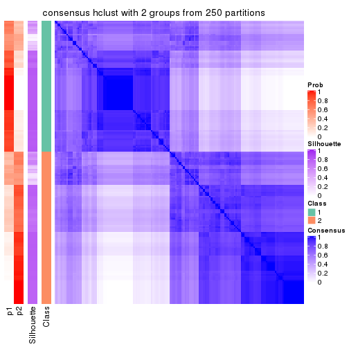</p>

</div>
<div id='tab-MAD-hclust-consensus-heatmap-2'>
<pre><code class="r">consensus_heatmap(res, k = 3)
</code></pre>

<p>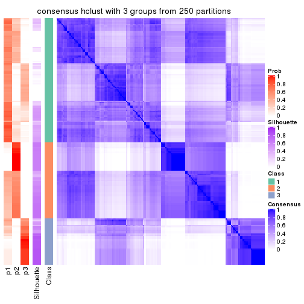</p>

</div>
<div id='tab-MAD-hclust-consensus-heatmap-3'>
<pre><code class="r">consensus_heatmap(res, k = 4)
</code></pre>

<p>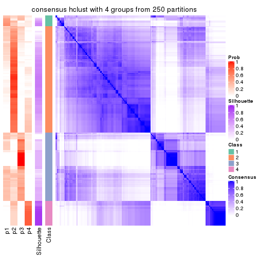</p>

</div>
<div id='tab-MAD-hclust-consensus-heatmap-4'>
<pre><code class="r">consensus_heatmap(res, k = 5)
</code></pre>

<p>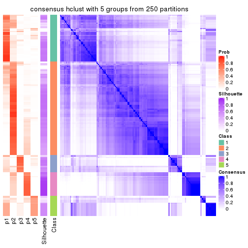</p>

</div>
<div id='tab-MAD-hclust-consensus-heatmap-5'>
<pre><code class="r">consensus_heatmap(res, k = 6)
</code></pre>

<p>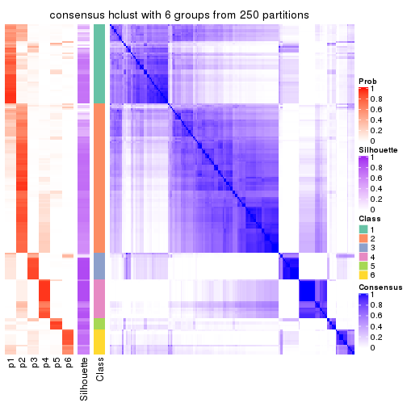</p>

</div>
</div>

Heatmaps for the membership of samples in all partitions to see how consistent they are:


<script>
$( function() {
	$( '#tabs-MAD-hclust-membership-heatmap' ).tabs();
} );
</script>
<div id='tabs-MAD-hclust-membership-heatmap'>
<ul>
<li><a href='#tab-MAD-hclust-membership-heatmap-1'>k = 2</a></li>
<li><a href='#tab-MAD-hclust-membership-heatmap-2'>k = 3</a></li>
<li><a href='#tab-MAD-hclust-membership-heatmap-3'>k = 4</a></li>
<li><a href='#tab-MAD-hclust-membership-heatmap-4'>k = 5</a></li>
<li><a href='#tab-MAD-hclust-membership-heatmap-5'>k = 6</a></li>
</ul>
<div id='tab-MAD-hclust-membership-heatmap-1'>
<pre><code class="r">membership_heatmap(res, k = 2)
</code></pre>

<p>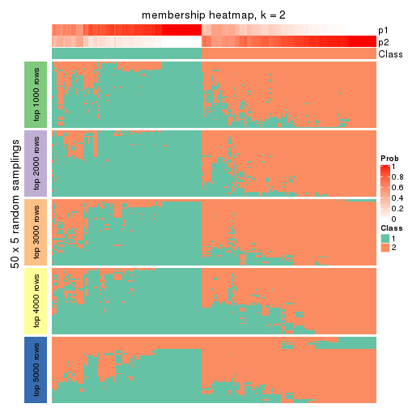</p>

</div>
<div id='tab-MAD-hclust-membership-heatmap-2'>
<pre><code class="r">membership_heatmap(res, k = 3)
</code></pre>

<p>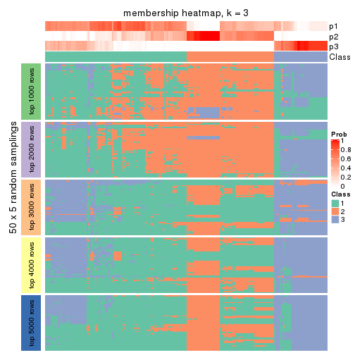</p>

</div>
<div id='tab-MAD-hclust-membership-heatmap-3'>
<pre><code class="r">membership_heatmap(res, k = 4)
</code></pre>

<p>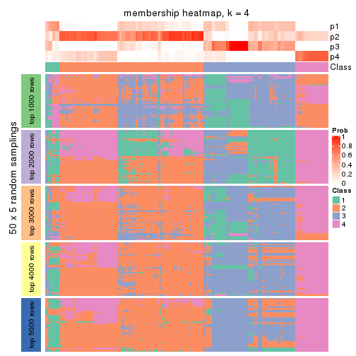</p>

</div>
<div id='tab-MAD-hclust-membership-heatmap-4'>
<pre><code class="r">membership_heatmap(res, k = 5)
</code></pre>

<p>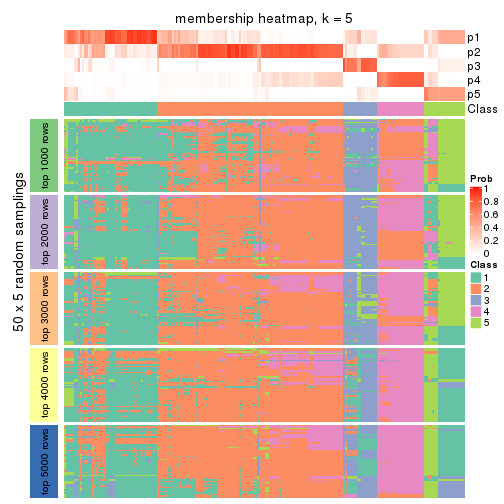</p>

</div>
<div id='tab-MAD-hclust-membership-heatmap-5'>
<pre><code class="r">membership_heatmap(res, k = 6)
</code></pre>

<p>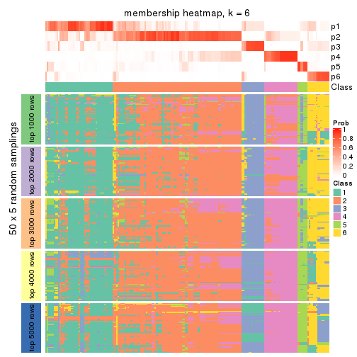</p>

</div>
</div>

As soon as we have had the classes for columns, we can look for signatures
which are significantly different between classes which can be candidate marks
for certain classes. Following are the heatmaps for signatures.


Signature heatmaps where rows are scaled:


<script>
$( function() {
	$( '#tabs-MAD-hclust-get-signatures' ).tabs();
} );
</script>
<div id='tabs-MAD-hclust-get-signatures'>
<ul>
<li><a href='#tab-MAD-hclust-get-signatures-1'>k = 2</a></li>
<li><a href='#tab-MAD-hclust-get-signatures-2'>k = 3</a></li>
<li><a href='#tab-MAD-hclust-get-signatures-3'>k = 4</a></li>
<li><a href='#tab-MAD-hclust-get-signatures-4'>k = 5</a></li>
<li><a href='#tab-MAD-hclust-get-signatures-5'>k = 6</a></li>
</ul>
<div id='tab-MAD-hclust-get-signatures-1'>
<pre><code class="r">get_signatures(res, k = 2)
</code></pre>

<p>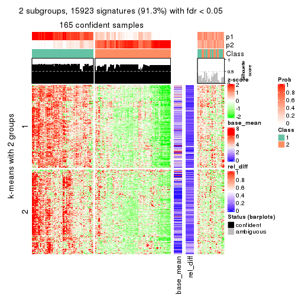</p>

</div>
<div id='tab-MAD-hclust-get-signatures-2'>
<pre><code class="r">get_signatures(res, k = 3)
</code></pre>

<p>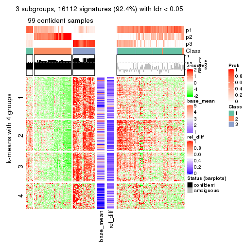</p>

</div>
<div id='tab-MAD-hclust-get-signatures-3'>
<pre><code class="r">get_signatures(res, k = 4)
</code></pre>

<p>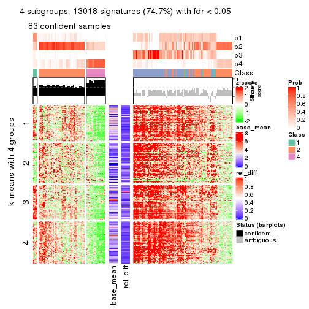</p>

</div>
<div id='tab-MAD-hclust-get-signatures-4'>
<pre><code class="r">get_signatures(res, k = 5)
</code></pre>

<p>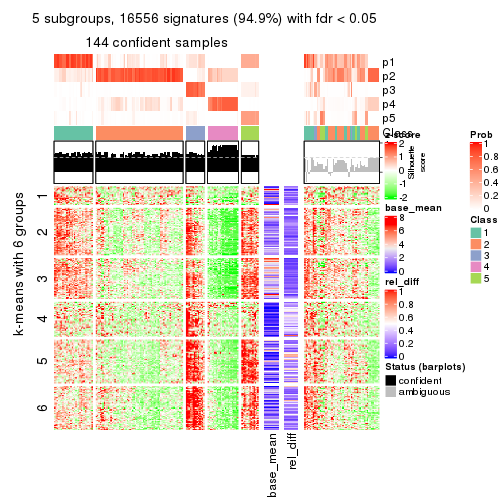</p>

</div>
<div id='tab-MAD-hclust-get-signatures-5'>
<pre><code class="r">get_signatures(res, k = 6)
</code></pre>

<p>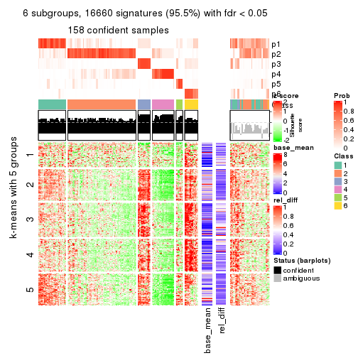</p>

</div>
</div>


Signature heatmaps where rows are not scaled:


<script>
$( function() {
	$( '#tabs-MAD-hclust-get-signatures-no-scale' ).tabs();
} );
</script>
<div id='tabs-MAD-hclust-get-signatures-no-scale'>
<ul>
<li><a href='#tab-MAD-hclust-get-signatures-no-scale-1'>k = 2</a></li>
<li><a href='#tab-MAD-hclust-get-signatures-no-scale-2'>k = 3</a></li>
<li><a href='#tab-MAD-hclust-get-signatures-no-scale-3'>k = 4</a></li>
<li><a href='#tab-MAD-hclust-get-signatures-no-scale-4'>k = 5</a></li>
<li><a href='#tab-MAD-hclust-get-signatures-no-scale-5'>k = 6</a></li>
</ul>
<div id='tab-MAD-hclust-get-signatures-no-scale-1'>
<pre><code class="r">get_signatures(res, k = 2, scale_rows = FALSE)
</code></pre>

<p>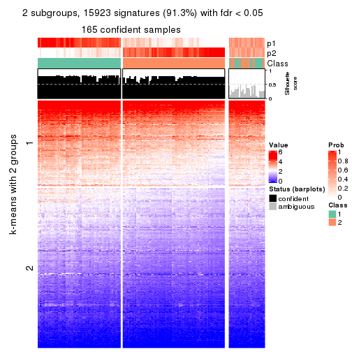</p>

</div>
<div id='tab-MAD-hclust-get-signatures-no-scale-2'>
<pre><code class="r">get_signatures(res, k = 3, scale_rows = FALSE)
</code></pre>

<p>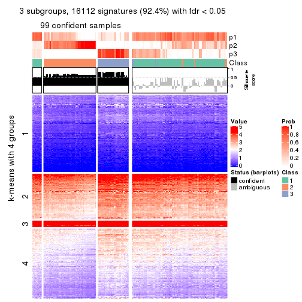</p>

</div>
<div id='tab-MAD-hclust-get-signatures-no-scale-3'>
<pre><code class="r">get_signatures(res, k = 4, scale_rows = FALSE)
</code></pre>

<p>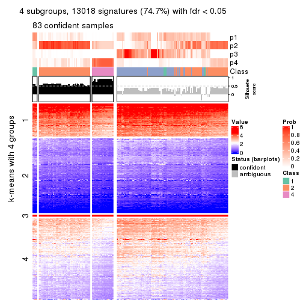</p>

</div>
<div id='tab-MAD-hclust-get-signatures-no-scale-4'>
<pre><code class="r">get_signatures(res, k = 5, scale_rows = FALSE)
</code></pre>

<p>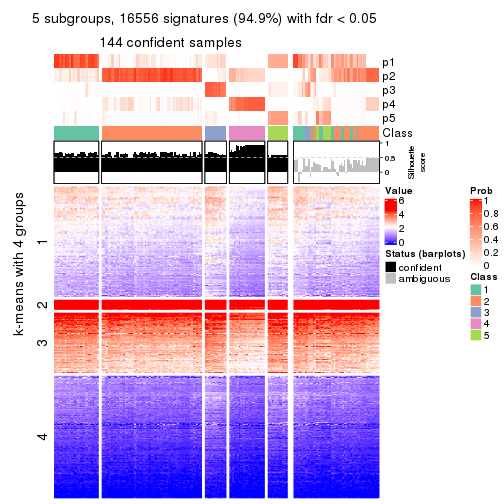</p>

</div>
<div id='tab-MAD-hclust-get-signatures-no-scale-5'>
<pre><code class="r">get_signatures(res, k = 6, scale_rows = FALSE)
</code></pre>

<p>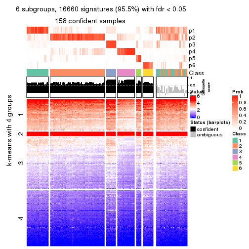</p>

</div>
</div>


Compare the overlap of signatures from different k:

```r
compare_signatures(res)
```

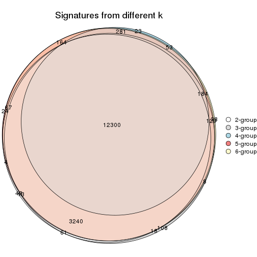

`get_signature()` returns a data frame invisibly. TO get the list of signatures, the function
call should be assigned to a variable explicitly. In following code, if `plot` argument is set
to `FALSE`, no heatmap is plotted while only the differential analysis is performed.

```r
# code only for demonstration
tb = get_signature(res, k = ..., plot = FALSE)
```

An example of the output of `tb` is:

```
#>   which_row         fdr    mean_1    mean_2 scaled_mean_1 scaled_mean_2 km
#> 1        38 0.042760348  8.373488  9.131774    -0.5533452     0.5164555  1
#> 2        40 0.018707592  7.106213  8.469186    -0.6173731     0.5762149  1
#> 3        55 0.019134737 10.221463 11.207825    -0.6159697     0.5749050  1
#> 4        59 0.006059896  5.921854  7.869574    -0.6899429     0.6439467  1
#> 5        60 0.018055526  8.928898 10.211722    -0.6204761     0.5791110  1
#> 6        98 0.009384629 15.714769 14.887706     0.6635654    -0.6193277  2
...
```

The columns in `tb` are:

1. `which_row`: row indices corresponding to the input matrix.
2. `fdr`: FDR for the differential test. 
3. `mean_x`: The mean value in group x.
4. `scaled_mean_x`: The mean value in group x after rows are scaled.
5. `km`: Row groups if k-means clustering is applied to rows.


UMAP plot which shows how samples are separated.


<script>
$( function() {
	$( '#tabs-MAD-hclust-dimension-reduction' ).tabs();
} );
</script>
<div id='tabs-MAD-hclust-dimension-reduction'>
<ul>
<li><a href='#tab-MAD-hclust-dimension-reduction-1'>k = 2</a></li>
<li><a href='#tab-MAD-hclust-dimension-reduction-2'>k = 3</a></li>
<li><a href='#tab-MAD-hclust-dimension-reduction-3'>k = 4</a></li>
<li><a href='#tab-MAD-hclust-dimension-reduction-4'>k = 5</a></li>
<li><a href='#tab-MAD-hclust-dimension-reduction-5'>k = 6</a></li>
</ul>
<div id='tab-MAD-hclust-dimension-reduction-1'>
<pre><code class="r">dimension_reduction(res, k = 2, method = &quot;UMAP&quot;)
</code></pre>

<p>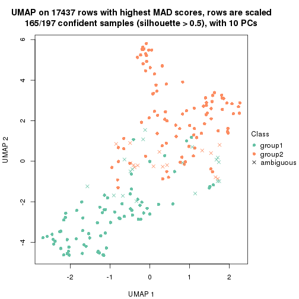</p>

</div>
<div id='tab-MAD-hclust-dimension-reduction-2'>
<pre><code class="r">dimension_reduction(res, k = 3, method = &quot;UMAP&quot;)
</code></pre>

<p>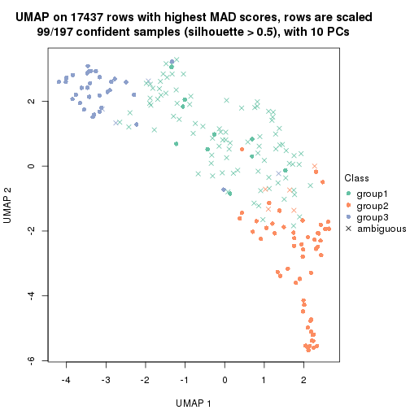</p>

</div>
<div id='tab-MAD-hclust-dimension-reduction-3'>
<pre><code class="r">dimension_reduction(res, k = 4, method = &quot;UMAP&quot;)
</code></pre>

<p>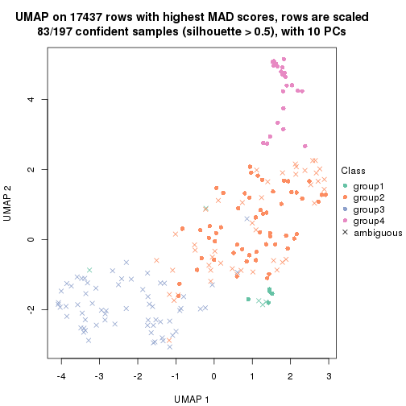</p>

</div>
<div id='tab-MAD-hclust-dimension-reduction-4'>
<pre><code class="r">dimension_reduction(res, k = 5, method = &quot;UMAP&quot;)
</code></pre>

<p>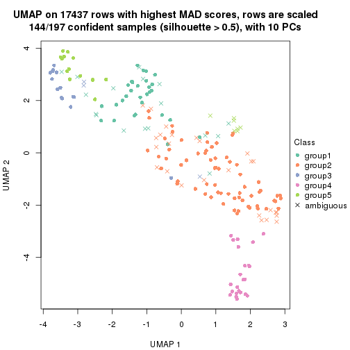</p>

</div>
<div id='tab-MAD-hclust-dimension-reduction-5'>
<pre><code class="r">dimension_reduction(res, k = 6, method = &quot;UMAP&quot;)
</code></pre>

<p>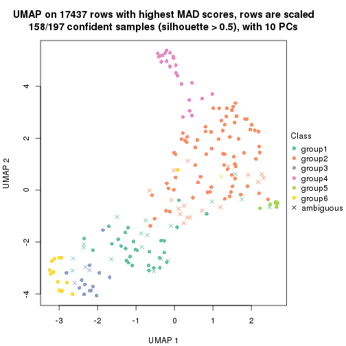</p>

</div>
</div>


Following heatmap shows how subgroups are split when increasing `k`:

```r
collect_classes(res)
```

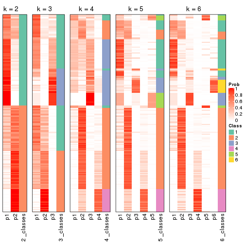


If matrix rows can be associated to genes, consider to use `GO_Enrichment(res,
...)` to perform function enrichment for the signature genes.


 

---------------------------------------------------


### MAD:kmeans


The object with results only for a single top-value method and a single partition method 
can be extracted as:

```r
res = res_list["MAD", "kmeans"]
# you can also extract it by
# res = res_list["MAD:kmeans"]
```

A summary of `res` and all the functions that can be applied to it:

```r
res
```

```
#> A 'ConsensusPartition' object with k = 2, 3, 4, 5, 6.
#>   On a matrix with 17437 rows and 197 columns.
#>   Top rows (1000, 2000, 3000, 4000, 5000) are extracted by 'MAD' method.
#>   Subgroups are detected by 'kmeans' method.
#>   Performed in total 1250 partitions by row resampling.
#>   Best k for subgroups seems to be 2.
#> 
#> Following methods can be applied to this 'ConsensusPartition' object:
#>  [1] "cola_report"             "collect_classes"         "collect_plots"          
#>  [4] "collect_stats"           "colnames"                "compare_signatures"     
#>  [7] "consensus_heatmap"       "dimension_reduction"     "functional_enrichment"  
#> [10] "get_anno_col"            "get_anno"                "get_classes"            
#> [13] "get_consensus"           "get_matrix"              "get_membership"         
#> [16] "get_param"               "get_signatures"          "get_stats"              
#> [19] "is_best_k"               "is_stable_k"             "membership_heatmap"     
#> [22] "ncol"                    "nrow"                    "plot_ecdf"              
#> [25] "rownames"                "select_partition_number" "show"                   
#> [28] "suggest_best_k"          "test_to_known_factors"
```

`collect_plots()` function collects all the plots made from `res` for all `k` (number of partitions)
into one single page to provide an easy and fast comparison between different `k`.

```r
collect_plots(res)
```

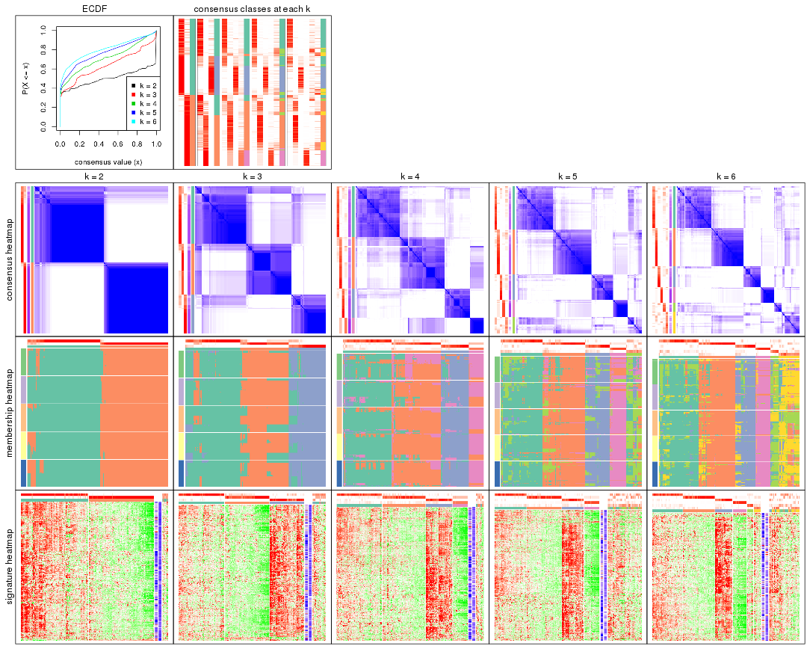

The plots are:

- The first row: a plot of the ECDF (Empirical cumulative distribution
  function) curves of the consensus matrix for each `k` and the heatmap of
  predicted classes for each `k`.
- The second row: heatmaps of the consensus matrix for each `k`.
- The third row: heatmaps of the membership matrix for each `k`.
- The fouth row: heatmaps of the signatures for each `k`.

All the plots in panels can be made by individual functions and they are
plotted later in this section.

`select_partition_number()` produces several plots showing different
statistics for choosing "optimized" `k`. There are following statistics:

- ECDF curves of the consensus matrix for each `k`;
- 1-PAC. [The PAC
  score](https://en.wikipedia.org/wiki/Consensus_clustering#Over-interpretation_potential_of_consensus_clustering)
  measures the proportion of the ambiguous subgrouping.
- Mean silhouette score.
- Concordance. The mean probability of fiting the consensus class ids in all
  partitions.
- Area increased. Denote $A_k$ as the area under the ECDF curve for current
  `k`, the area increased is defined as $A_k - A_{k-1}$.
- Rand index. The percent of pairs of samples that are both in a same cluster
  or both are not in a same cluster in the partition of k and k-1.
- Jaccard index. The ratio of pairs of samples are both in a same cluster in
  the partition of k and k-1 and the pairs of samples are both in a same
  cluster in the partition k or k-1.

The detailed explanations of these statistics can be found in [the cola
vignette](http://bioconductor.org/packages/devel/bioc/vignettes/cola/inst/doc/cola.html#toc_13).

Generally speaking, lower PAC score, higher mean silhouette score or higher
concordance corresponds to better partition. Rand index and Jaccard index
measure how similar the current partition is compared to partition with `k-1`.
If they are too similar, we won't accept `k` is better than `k-1`.

```r
select_partition_number(res)
```

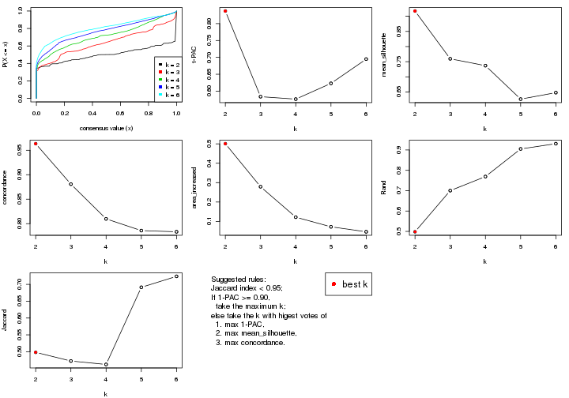

The numeric values for all these statistics can be obtained by `get_stats()`.

```r
get_stats(res)
```

```
#>   k 1-PAC mean_silhouette concordance area_increased  Rand Jaccard
#> 2 2 0.837           0.917       0.963         0.5009 0.498   0.498
#> 3 3 0.584           0.760       0.881         0.2788 0.700   0.472
#> 4 4 0.576           0.737       0.810         0.1216 0.769   0.462
#> 5 5 0.623           0.626       0.786         0.0720 0.905   0.691
#> 6 6 0.695           0.648       0.783         0.0463 0.931   0.724
```

`suggest_best_k()` suggests the best $k$ based on these statistics. The rules are as follows:

- All $k$ with Jaccard index larger than 0.95 are removed because the increase of
  the partition number does not provides enough extra information. If all $k$ are removed,
  the best $k$ is assigned by `NA`.
- For $k$ with 1-PAC larger than 0.9, the maximal $k$ is taken as the "best k". Other $k$ is called "optional k".
- If it does not fit the second rule. The $k$ with the highest vote of highest
  1-PAC, mean silhouette and concordance is taken as the "best k".

```r
suggest_best_k(res)
```

```
#> [1] 2
```


Following shows the table of the partitions (You need to click the **show/hide
code output** link to see it). The membership matrix (columns with name `p*`)
is inferred by
[`clue::cl_consensus()`](https://www.rdocumentation.org/link/cl_consensus?package=clue)
function with the `SE` method. Basically the value in the membership matrix
represents the probability to belong to a certain group. The finall class
label for an item is determined with the group with highest probability it
belongs to.

In `get_classes()` function, the entropy is calculated from the membership
matrix and the silhouette score is calculated from the consensus matrix.


<script>
$( function() {
	$( '#tabs-MAD-kmeans-get-classes' ).tabs();
} );
</script>
<div id='tabs-MAD-kmeans-get-classes'>
<ul>
<li><a href='#tab-MAD-kmeans-get-classes-1'>k = 2</a></li>
<li><a href='#tab-MAD-kmeans-get-classes-2'>k = 3</a></li>
<li><a href='#tab-MAD-kmeans-get-classes-3'>k = 4</a></li>
<li><a href='#tab-MAD-kmeans-get-classes-4'>k = 5</a></li>
<li><a href='#tab-MAD-kmeans-get-classes-5'>k = 6</a></li>
</ul>

<div id='tab-MAD-kmeans-get-classes-1'>
<p><a id='tab-MAD-kmeans-get-classes-1-a' style='color:#0366d6' href='#'>show/hide code output</a></p>
<pre><code class="r">cbind(get_classes(res, k = 2), get_membership(res, k = 2))
</code></pre>

<pre><code>#&gt;            class entropy silhouette    p1    p2
#&gt; SRR1380886     1   0.000      0.940 1.000 0.000
#&gt; SRR1074385     1   0.000      0.940 1.000 0.000
#&gt; SRR1374739     1   0.000      0.940 1.000 0.000
#&gt; SRR1097883     1   0.000      0.940 1.000 0.000
#&gt; SRR2167209     2   0.936      0.412 0.352 0.648
#&gt; SRR816541      2   0.000      0.984 0.000 1.000
#&gt; SRR663645      2   0.000      0.984 0.000 1.000
#&gt; SRR1381505     2   0.000      0.984 0.000 1.000
#&gt; SRR1416362     2   0.000      0.984 0.000 1.000
#&gt; SRR1318503     1   0.886      0.614 0.696 0.304
#&gt; SRR1341626     2   0.000      0.984 0.000 1.000
#&gt; SRR1382440     1   0.000      0.940 1.000 0.000
#&gt; SRR1088413     1   0.000      0.940 1.000 0.000
#&gt; SRR1082080     2   0.000      0.984 0.000 1.000
#&gt; SRR1455783     1   0.000      0.940 1.000 0.000
#&gt; SRR1447760     2   0.000      0.984 0.000 1.000
#&gt; SRR1487784     2   0.000      0.984 0.000 1.000
#&gt; SRR1331037     2   0.000      0.984 0.000 1.000
#&gt; SRR1095651     1   0.000      0.940 1.000 0.000
#&gt; SRR1078066     1   0.000      0.940 1.000 0.000
#&gt; SRR1120363     1   0.000      0.940 1.000 0.000
#&gt; SRR821231      1   0.000      0.940 1.000 0.000
#&gt; SRR1374373     2   0.000      0.984 0.000 1.000
#&gt; SRR1324519     2   0.000      0.984 0.000 1.000
#&gt; SRR1431121     1   0.000      0.940 1.000 0.000
#&gt; SRR1091032     2   0.000      0.984 0.000 1.000
#&gt; SRR1365575     2   0.000      0.984 0.000 1.000
#&gt; SRR1072972     1   0.000      0.940 1.000 0.000
#&gt; SRR1310690     2   0.000      0.984 0.000 1.000
#&gt; SRR1383037     1   0.000      0.940 1.000 0.000
#&gt; SRR1095479     1   0.000      0.940 1.000 0.000
#&gt; SRR1070403     1   0.000      0.940 1.000 0.000
#&gt; SRR1390203     1   0.000      0.940 1.000 0.000
#&gt; SRR1072007     2   0.000      0.984 0.000 1.000
#&gt; SRR1468787     1   0.985      0.326 0.572 0.428
#&gt; SRR1347959     2   0.000      0.984 0.000 1.000
#&gt; SRR1338513     1   0.000      0.940 1.000 0.000
#&gt; SRR812598      2   0.000      0.984 0.000 1.000
#&gt; SRR1446806     1   0.802      0.703 0.756 0.244
#&gt; SRR1394275     1   0.000      0.940 1.000 0.000
#&gt; SRR1443633     1   0.000      0.940 1.000 0.000
#&gt; SRR1087728     1   0.000      0.940 1.000 0.000
#&gt; SRR1098192     2   0.000      0.984 0.000 1.000
#&gt; SRR1093340     2   0.000      0.984 0.000 1.000
#&gt; SRR665405      2   0.000      0.984 0.000 1.000
#&gt; SRR657077      2   0.000      0.984 0.000 1.000
#&gt; SRR813208      1   0.000      0.940 1.000 0.000
#&gt; SRR1416074     2   0.000      0.984 0.000 1.000
#&gt; SRR1089688     2   0.000      0.984 0.000 1.000
#&gt; SRR1353461     1   0.000      0.940 1.000 0.000
#&gt; SRR1466321     1   0.973      0.394 0.596 0.404
#&gt; SRR1073021     1   0.000      0.940 1.000 0.000
#&gt; SRR1322816     2   0.000      0.984 0.000 1.000
#&gt; SRR1457727     1   0.000      0.940 1.000 0.000
#&gt; SRR1464226     2   0.000      0.984 0.000 1.000
#&gt; SRR1398863     1   0.000      0.940 1.000 0.000
#&gt; SRR1455631     2   0.000      0.984 0.000 1.000
#&gt; SRR1307808     2   0.000      0.984 0.000 1.000
#&gt; SRR1374585     2   0.000      0.984 0.000 1.000
#&gt; SRR1072104     2   0.000      0.984 0.000 1.000
#&gt; SRR1076868     2   0.000      0.984 0.000 1.000
#&gt; SRR1335984     2   0.000      0.984 0.000 1.000
#&gt; SRR1445939     1   0.141      0.927 0.980 0.020
#&gt; SRR1453047     2   0.000      0.984 0.000 1.000
#&gt; SRR1339788     1   0.000      0.940 1.000 0.000
#&gt; SRR1084323     1   0.000      0.940 1.000 0.000
#&gt; SRR1092937     1   0.000      0.940 1.000 0.000
#&gt; SRR1074090     2   0.000      0.984 0.000 1.000
#&gt; SRR1099833     1   0.494      0.856 0.892 0.108
#&gt; SRR1093434     1   0.000      0.940 1.000 0.000
#&gt; SRR1435857     1   0.000      0.940 1.000 0.000
#&gt; SRR1480347     2   0.000      0.984 0.000 1.000
#&gt; SRR1440787     2   0.000      0.984 0.000 1.000
#&gt; SRR1430202     1   0.988      0.306 0.564 0.436
#&gt; SRR1322730     2   0.000      0.984 0.000 1.000
#&gt; SRR811029      2   0.000      0.984 0.000 1.000
#&gt; SRR1390456     1   0.000      0.940 1.000 0.000
#&gt; SRR1381140     1   0.000      0.940 1.000 0.000
#&gt; SRR1388064     2   0.000      0.984 0.000 1.000
#&gt; SRR1093577     1   0.000      0.940 1.000 0.000
#&gt; SRR1414161     1   0.730      0.747 0.796 0.204
#&gt; SRR1328738     1   0.949      0.477 0.632 0.368
#&gt; SRR1311752     2   0.000      0.984 0.000 1.000
#&gt; SRR1445960     2   0.000      0.984 0.000 1.000
#&gt; SRR1403412     2   0.000      0.984 0.000 1.000
#&gt; SRR2166748     1   0.000      0.940 1.000 0.000
#&gt; SRR821666      2   0.000      0.984 0.000 1.000
#&gt; SRR1330746     1   0.000      0.940 1.000 0.000
#&gt; SRR1327872     2   0.000      0.984 0.000 1.000
#&gt; SRR1100800     1   0.000      0.940 1.000 0.000
#&gt; SRR1075174     1   0.000      0.940 1.000 0.000
#&gt; SRR1434436     1   0.767      0.731 0.776 0.224
#&gt; SRR1389409     2   0.000      0.984 0.000 1.000
#&gt; SRR1085310     1   0.000      0.940 1.000 0.000
#&gt; SRR1376718     2   0.000      0.984 0.000 1.000
#&gt; SRR808590      2   0.000      0.984 0.000 1.000
#&gt; SRR1084128     2   0.000      0.984 0.000 1.000
#&gt; SRR1361692     1   0.494      0.860 0.892 0.108
#&gt; SRR1431493     1   0.000      0.940 1.000 0.000
#&gt; SRR1409084     1   0.000      0.940 1.000 0.000
#&gt; SRR2166214     2   0.000      0.984 0.000 1.000
#&gt; SRR1324102     2   0.000      0.984 0.000 1.000
#&gt; SRR1079754     2   0.000      0.984 0.000 1.000
#&gt; SRR1442127     1   0.000      0.940 1.000 0.000
#&gt; SRR1076244     2   0.000      0.984 0.000 1.000
#&gt; SRR1330901     2   0.000      0.984 0.000 1.000
#&gt; SRR1073167     2   0.000      0.984 0.000 1.000
#&gt; SRR1357541     1   0.000      0.940 1.000 0.000
#&gt; SRR811607      2   0.973      0.259 0.404 0.596
#&gt; SRR1468931     1   0.000      0.940 1.000 0.000
#&gt; SRR1474908     2   0.000      0.984 0.000 1.000
#&gt; SRR1309875     2   0.000      0.984 0.000 1.000
#&gt; SRR598792      1   0.000      0.940 1.000 0.000
#&gt; SRR1088537     2   0.000      0.984 0.000 1.000
#&gt; SRR1457682     1   0.000      0.940 1.000 0.000
#&gt; SRR1454289     1   0.913      0.547 0.672 0.328
#&gt; SRR1069352     1   0.000      0.940 1.000 0.000
#&gt; SRR1472728     2   0.000      0.984 0.000 1.000
#&gt; SRR1091144     2   0.000      0.984 0.000 1.000
#&gt; SRR1319118     1   0.000      0.940 1.000 0.000
#&gt; SRR1403611     1   0.697      0.767 0.812 0.188
#&gt; SRR1397762     1   0.000      0.940 1.000 0.000
#&gt; SRR1317387     1   0.000      0.940 1.000 0.000
#&gt; SRR1376426     2   0.000      0.984 0.000 1.000
#&gt; SRR1097777     1   0.000      0.940 1.000 0.000
#&gt; SRR1365743     1   0.000      0.940 1.000 0.000
#&gt; SRR1458992     2   0.000      0.984 0.000 1.000
#&gt; SRR1089537     1   0.714      0.757 0.804 0.196
#&gt; SRR1397744     1   0.000      0.940 1.000 0.000
#&gt; SRR1453893     2   0.000      0.984 0.000 1.000
#&gt; SRR1098543     1   0.000      0.940 1.000 0.000
#&gt; SRR1321765     1   0.000      0.940 1.000 0.000
#&gt; SRR1440032     1   0.224      0.916 0.964 0.036
#&gt; SRR1404507     2   0.000      0.984 0.000 1.000
#&gt; SRR1404856     2   0.689      0.755 0.184 0.816
#&gt; SRR812745      1   0.975      0.400 0.592 0.408
#&gt; SRR1417524     1   0.000      0.940 1.000 0.000
#&gt; SRR1407334     2   0.000      0.984 0.000 1.000
#&gt; SRR1453991     1   0.000      0.940 1.000 0.000
#&gt; SRR1415938     1   0.000      0.940 1.000 0.000
#&gt; SRR1081259     1   0.615      0.817 0.848 0.152
#&gt; SRR1436187     2   0.000      0.984 0.000 1.000
#&gt; SRR1431948     1   0.000      0.940 1.000 0.000
#&gt; SRR1453277     2   0.689      0.754 0.184 0.816
#&gt; SRR1095407     1   0.955      0.459 0.624 0.376
#&gt; SRR1359694     2   0.295      0.930 0.052 0.948
#&gt; SRR656982      2   0.184      0.956 0.028 0.972
#&gt; SRR1354338     2   0.000      0.984 0.000 1.000
#&gt; SRR1088291     1   0.895      0.590 0.688 0.312
#&gt; SRR1080624     1   0.000      0.940 1.000 0.000
#&gt; SRR2166708     1   0.000      0.940 1.000 0.000
#&gt; SRR1393572     1   0.000      0.940 1.000 0.000
#&gt; SRR1429912     2   0.000      0.984 0.000 1.000
#&gt; SRR1421048     2   0.184      0.956 0.028 0.972
#&gt; SRR1434999     1   0.000      0.940 1.000 0.000
#&gt; SRR656457      1   0.000      0.940 1.000 0.000
#&gt; SRR1098928     1   0.000      0.940 1.000 0.000
#&gt; SRR1343967     2   0.000      0.984 0.000 1.000
#&gt; SRR1360766     1   0.469      0.866 0.900 0.100
#&gt; SRR1464724     2   0.000      0.984 0.000 1.000
#&gt; SRR1101542     2   0.000      0.984 0.000 1.000
#&gt; SRR1401528     1   0.000      0.940 1.000 0.000
#&gt; SRR1071519     1   0.000      0.940 1.000 0.000
#&gt; SRR1086070     1   0.000      0.940 1.000 0.000
#&gt; SRR1358645     2   0.000      0.984 0.000 1.000
#&gt; SRR819771      1   0.000      0.940 1.000 0.000
#&gt; SRR1418433     2   0.000      0.984 0.000 1.000
#&gt; SRR821050      1   0.000      0.940 1.000 0.000
#&gt; SRR1402091     2   0.000      0.984 0.000 1.000
#&gt; SRR1322028     2   0.000      0.984 0.000 1.000
#&gt; SRR1452556     2   0.000      0.984 0.000 1.000
#&gt; SRR1340047     2   0.000      0.984 0.000 1.000
#&gt; SRR1418302     2   0.000      0.984 0.000 1.000
#&gt; SRR1073991     1   0.000      0.940 1.000 0.000
#&gt; SRR1085187     2   0.000      0.984 0.000 1.000
#&gt; SRR1357618     1   0.000      0.940 1.000 0.000
#&gt; SRR1487764     1   0.929      0.528 0.656 0.344
#&gt; SRR1075336     1   0.000      0.940 1.000 0.000
#&gt; SRR1365471     2   0.000      0.984 0.000 1.000
#&gt; SRR1414613     2   0.000      0.984 0.000 1.000
#&gt; SRR658719      2   0.000      0.984 0.000 1.000
#&gt; SRR1475128     1   0.000      0.940 1.000 0.000
#&gt; SRR1367630     2   0.000      0.984 0.000 1.000
#&gt; SRR1481146     2   0.000      0.984 0.000 1.000
#&gt; SRR1465674     1   0.443      0.873 0.908 0.092
#&gt; SRR1327303     2   0.000      0.984 0.000 1.000
#&gt; SRR1390391     2   0.615      0.802 0.152 0.848
#&gt; SRR1326020     2   0.000      0.984 0.000 1.000
#&gt; SRR1381953     1   0.469      0.866 0.900 0.100
#&gt; SRR1082544     2   0.000      0.984 0.000 1.000
#&gt; SRR810761      1   0.000      0.940 1.000 0.000
#&gt; SRR1070764     1   0.000      0.940 1.000 0.000
#&gt; SRR1415919     1   0.000      0.940 1.000 0.000
#&gt; SRR1490404     2   0.000      0.984 0.000 1.000
#&gt; SRR1416773     1   0.443      0.873 0.908 0.092
#&gt; SRR1377492     2   0.000      0.984 0.000 1.000
#&gt; SRR1334314     1   0.814      0.691 0.748 0.252
</code></pre>

<script>
$('#tab-MAD-kmeans-get-classes-1-a').parent().next().next().hide();
$('#tab-MAD-kmeans-get-classes-1-a').click(function(){
  $('#tab-MAD-kmeans-get-classes-1-a').parent().next().next().toggle();
  return(false);
});
</script>
</div>

<div id='tab-MAD-kmeans-get-classes-2'>
<p><a id='tab-MAD-kmeans-get-classes-2-a' style='color:#0366d6' href='#'>show/hide code output</a></p>
<pre><code class="r">cbind(get_classes(res, k = 3), get_membership(res, k = 3))
</code></pre>

<pre><code>#&gt;            class entropy silhouette    p1    p2    p3
#&gt; SRR1380886     3  0.0000     0.8697 0.000 0.000 1.000
#&gt; SRR1074385     1  0.3879     0.7204 0.848 0.000 0.152
#&gt; SRR1374739     3  0.0000     0.8697 0.000 0.000 1.000
#&gt; SRR1097883     3  0.5988     0.5296 0.368 0.000 0.632
#&gt; SRR2167209     1  0.0237     0.8680 0.996 0.000 0.004
#&gt; SRR816541      2  0.4062     0.8662 0.164 0.836 0.000
#&gt; SRR663645      1  0.6204     0.0543 0.576 0.424 0.000
#&gt; SRR1381505     2  0.0000     0.8392 0.000 1.000 0.000
#&gt; SRR1416362     2  0.4235     0.8589 0.176 0.824 0.000
#&gt; SRR1318503     1  0.0000     0.8687 1.000 0.000 0.000
#&gt; SRR1341626     2  0.4062     0.8662 0.164 0.836 0.000
#&gt; SRR1382440     3  0.0000     0.8697 0.000 0.000 1.000
#&gt; SRR1088413     3  0.5650     0.6214 0.312 0.000 0.688
#&gt; SRR1082080     2  0.4002     0.8659 0.160 0.840 0.000
#&gt; SRR1455783     1  0.5291     0.5165 0.732 0.000 0.268
#&gt; SRR1447760     1  0.0000     0.8687 1.000 0.000 0.000
#&gt; SRR1487784     2  0.4654     0.8345 0.208 0.792 0.000
#&gt; SRR1331037     1  0.5968     0.2014 0.636 0.364 0.000
#&gt; SRR1095651     3  0.3879     0.7768 0.152 0.000 0.848
#&gt; SRR1078066     3  0.6309     0.1601 0.496 0.000 0.504
#&gt; SRR1120363     1  0.4062     0.7052 0.836 0.000 0.164
#&gt; SRR821231      3  0.1031     0.8624 0.024 0.000 0.976
#&gt; SRR1374373     1  0.0000     0.8687 1.000 0.000 0.000
#&gt; SRR1324519     2  0.2448     0.8548 0.076 0.924 0.000
#&gt; SRR1431121     3  0.5968     0.5369 0.364 0.000 0.636
#&gt; SRR1091032     2  0.4121     0.8639 0.168 0.832 0.000
#&gt; SRR1365575     2  0.0000     0.8392 0.000 1.000 0.000
#&gt; SRR1072972     3  0.1031     0.8624 0.024 0.000 0.976
#&gt; SRR1310690     2  0.4062     0.8662 0.164 0.836 0.000
#&gt; SRR1383037     3  0.0000     0.8697 0.000 0.000 1.000
#&gt; SRR1095479     3  0.0237     0.8687 0.004 0.000 0.996
#&gt; SRR1070403     3  0.0000     0.8697 0.000 0.000 1.000
#&gt; SRR1390203     1  0.3879     0.7204 0.848 0.000 0.152
#&gt; SRR1072007     2  0.6305     0.3451 0.484 0.516 0.000
#&gt; SRR1468787     1  0.0747     0.8645 0.984 0.000 0.016
#&gt; SRR1347959     1  0.5968     0.2305 0.636 0.364 0.000
#&gt; SRR1338513     1  0.1525     0.8573 0.964 0.004 0.032
#&gt; SRR812598      2  0.0000     0.8392 0.000 1.000 0.000
#&gt; SRR1446806     1  0.0000     0.8687 1.000 0.000 0.000
#&gt; SRR1394275     1  0.0000     0.8687 1.000 0.000 0.000
#&gt; SRR1443633     3  0.5733     0.5925 0.324 0.000 0.676
#&gt; SRR1087728     3  0.0000     0.8697 0.000 0.000 1.000
#&gt; SRR1098192     2  0.4062     0.8662 0.164 0.836 0.000
#&gt; SRR1093340     2  0.4062     0.8662 0.164 0.836 0.000
#&gt; SRR665405      1  0.5882     0.3071 0.652 0.348 0.000
#&gt; SRR657077      1  0.6225    -0.0284 0.568 0.432 0.000
#&gt; SRR813208      3  0.0000     0.8697 0.000 0.000 1.000
#&gt; SRR1416074     2  0.4062     0.8662 0.164 0.836 0.000
#&gt; SRR1089688     2  0.3038     0.8603 0.104 0.896 0.000
#&gt; SRR1353461     3  0.0000     0.8697 0.000 0.000 1.000
#&gt; SRR1466321     1  0.0000     0.8687 1.000 0.000 0.000
#&gt; SRR1073021     1  0.1163     0.8591 0.972 0.000 0.028
#&gt; SRR1322816     2  0.4062     0.8662 0.164 0.836 0.000
#&gt; SRR1457727     3  0.5760     0.6004 0.328 0.000 0.672
#&gt; SRR1464226     2  0.6062     0.5870 0.384 0.616 0.000
#&gt; SRR1398863     1  0.3879     0.7204 0.848 0.000 0.152
#&gt; SRR1455631     1  0.6126     0.1478 0.600 0.400 0.000
#&gt; SRR1307808     1  0.0000     0.8687 1.000 0.000 0.000
#&gt; SRR1374585     2  0.0000     0.8392 0.000 1.000 0.000
#&gt; SRR1072104     2  0.4654     0.8282 0.208 0.792 0.000
#&gt; SRR1076868     2  0.4062     0.8662 0.164 0.836 0.000
#&gt; SRR1335984     1  0.3752     0.7126 0.856 0.144 0.000
#&gt; SRR1445939     1  0.0892     0.8619 0.980 0.000 0.020
#&gt; SRR1453047     2  0.4062     0.8662 0.164 0.836 0.000
#&gt; SRR1339788     3  0.0000     0.8697 0.000 0.000 1.000
#&gt; SRR1084323     1  0.2356     0.8204 0.928 0.000 0.072
#&gt; SRR1092937     1  0.0000     0.8687 1.000 0.000 0.000
#&gt; SRR1074090     2  0.4062     0.8662 0.164 0.836 0.000
#&gt; SRR1099833     3  0.6955     0.4944 0.332 0.032 0.636
#&gt; SRR1093434     3  0.0000     0.8697 0.000 0.000 1.000
#&gt; SRR1435857     1  0.0892     0.8632 0.980 0.000 0.020
#&gt; SRR1480347     2  0.0592     0.8403 0.012 0.988 0.000
#&gt; SRR1440787     2  0.0000     0.8392 0.000 1.000 0.000
#&gt; SRR1430202     1  0.0000     0.8687 1.000 0.000 0.000
#&gt; SRR1322730     2  0.0000     0.8392 0.000 1.000 0.000
#&gt; SRR811029      2  0.4062     0.8662 0.164 0.836 0.000
#&gt; SRR1390456     3  0.0000     0.8697 0.000 0.000 1.000
#&gt; SRR1381140     1  0.0892     0.8619 0.980 0.000 0.020
#&gt; SRR1388064     2  0.0000     0.8392 0.000 1.000 0.000
#&gt; SRR1093577     1  0.2261     0.8260 0.932 0.000 0.068
#&gt; SRR1414161     1  0.0000     0.8687 1.000 0.000 0.000
#&gt; SRR1328738     1  0.0000     0.8687 1.000 0.000 0.000
#&gt; SRR1311752     2  0.4062     0.8662 0.164 0.836 0.000
#&gt; SRR1445960     2  0.4235     0.8589 0.176 0.824 0.000
#&gt; SRR1403412     2  0.4062     0.8662 0.164 0.836 0.000
#&gt; SRR2166748     3  0.6008     0.5219 0.372 0.000 0.628
#&gt; SRR821666      2  0.0000     0.8392 0.000 1.000 0.000
#&gt; SRR1330746     3  0.0000     0.8697 0.000 0.000 1.000
#&gt; SRR1327872     2  0.0000     0.8392 0.000 1.000 0.000
#&gt; SRR1100800     1  0.4062     0.7052 0.836 0.000 0.164
#&gt; SRR1075174     1  0.1860     0.8402 0.948 0.000 0.052
#&gt; SRR1434436     1  0.0000     0.8687 1.000 0.000 0.000
#&gt; SRR1389409     2  0.0000     0.8392 0.000 1.000 0.000
#&gt; SRR1085310     3  0.5431     0.6516 0.284 0.000 0.716
#&gt; SRR1376718     2  0.0000     0.8392 0.000 1.000 0.000
#&gt; SRR808590      2  0.0000     0.8392 0.000 1.000 0.000
#&gt; SRR1084128     1  0.6225    -0.0284 0.568 0.432 0.000
#&gt; SRR1361692     1  0.0000     0.8687 1.000 0.000 0.000
#&gt; SRR1431493     3  0.0747     0.8651 0.016 0.000 0.984
#&gt; SRR1409084     1  0.2356     0.8209 0.928 0.000 0.072
#&gt; SRR2166214     1  0.6235    -0.0131 0.564 0.436 0.000
#&gt; SRR1324102     2  0.5621     0.7138 0.308 0.692 0.000
#&gt; SRR1079754     2  0.0000     0.8392 0.000 1.000 0.000
#&gt; SRR1442127     3  0.0000     0.8697 0.000 0.000 1.000
#&gt; SRR1076244     2  0.0000     0.8392 0.000 1.000 0.000
#&gt; SRR1330901     1  0.0000     0.8687 1.000 0.000 0.000
#&gt; SRR1073167     2  0.4062     0.8662 0.164 0.836 0.000
#&gt; SRR1357541     3  0.5948     0.5434 0.360 0.000 0.640
#&gt; SRR811607      1  0.0000     0.8687 1.000 0.000 0.000
#&gt; SRR1468931     3  0.0000     0.8697 0.000 0.000 1.000
#&gt; SRR1474908     2  0.6308     0.3068 0.492 0.508 0.000
#&gt; SRR1309875     2  0.4062     0.8662 0.164 0.836 0.000
#&gt; SRR598792      3  0.0000     0.8697 0.000 0.000 1.000
#&gt; SRR1088537     2  0.6180     0.5179 0.416 0.584 0.000
#&gt; SRR1457682     1  0.1163     0.8571 0.972 0.000 0.028
#&gt; SRR1454289     1  0.0000     0.8687 1.000 0.000 0.000
#&gt; SRR1069352     3  0.0000     0.8697 0.000 0.000 1.000
#&gt; SRR1472728     2  0.6168     0.5270 0.412 0.588 0.000
#&gt; SRR1091144     2  0.4750     0.8203 0.216 0.784 0.000
#&gt; SRR1319118     3  0.5760     0.5971 0.328 0.000 0.672
#&gt; SRR1403611     3  0.4953     0.7052 0.016 0.176 0.808
#&gt; SRR1397762     1  0.6291    -0.0696 0.532 0.000 0.468
#&gt; SRR1317387     3  0.0000     0.8697 0.000 0.000 1.000
#&gt; SRR1376426     2  0.4062     0.8662 0.164 0.836 0.000
#&gt; SRR1097777     3  0.6286     0.3171 0.464 0.000 0.536
#&gt; SRR1365743     3  0.4062     0.7669 0.164 0.000 0.836
#&gt; SRR1458992     2  0.4555     0.8411 0.200 0.800 0.000
#&gt; SRR1089537     1  0.3192     0.7795 0.888 0.112 0.000
#&gt; SRR1397744     1  0.5529     0.4570 0.704 0.000 0.296
#&gt; SRR1453893     2  0.0000     0.8392 0.000 1.000 0.000
#&gt; SRR1098543     1  0.4452     0.6617 0.808 0.000 0.192
#&gt; SRR1321765     1  0.4346     0.6837 0.816 0.000 0.184
#&gt; SRR1440032     1  0.0000     0.8687 1.000 0.000 0.000
#&gt; SRR1404507     2  0.0000     0.8392 0.000 1.000 0.000
#&gt; SRR1404856     1  0.0000     0.8687 1.000 0.000 0.000
#&gt; SRR812745      1  0.0000     0.8687 1.000 0.000 0.000
#&gt; SRR1417524     3  0.4452     0.7299 0.192 0.000 0.808
#&gt; SRR1407334     2  0.0000     0.8392 0.000 1.000 0.000
#&gt; SRR1453991     1  0.2625     0.8095 0.916 0.000 0.084
#&gt; SRR1415938     3  0.5988     0.5325 0.368 0.000 0.632
#&gt; SRR1081259     1  0.0000     0.8687 1.000 0.000 0.000
#&gt; SRR1436187     2  0.0000     0.8392 0.000 1.000 0.000
#&gt; SRR1431948     3  0.0000     0.8697 0.000 0.000 1.000
#&gt; SRR1453277     1  0.0000     0.8687 1.000 0.000 0.000
#&gt; SRR1095407     1  0.0592     0.8660 0.988 0.000 0.012
#&gt; SRR1359694     1  0.0000     0.8687 1.000 0.000 0.000
#&gt; SRR656982      1  0.0000     0.8687 1.000 0.000 0.000
#&gt; SRR1354338     1  0.0592     0.8626 0.988 0.012 0.000
#&gt; SRR1088291     1  0.0424     0.8672 0.992 0.000 0.008
#&gt; SRR1080624     1  0.1643     0.8456 0.956 0.000 0.044
#&gt; SRR2166708     3  0.0000     0.8697 0.000 0.000 1.000
#&gt; SRR1393572     1  0.1031     0.8597 0.976 0.000 0.024
#&gt; SRR1429912     1  0.5560     0.4031 0.700 0.300 0.000
#&gt; SRR1421048     1  0.0000     0.8687 1.000 0.000 0.000
#&gt; SRR1434999     3  0.3192     0.8072 0.112 0.000 0.888
#&gt; SRR656457      3  0.0000     0.8697 0.000 0.000 1.000
#&gt; SRR1098928     3  0.0000     0.8697 0.000 0.000 1.000
#&gt; SRR1343967     2  0.4062     0.8662 0.164 0.836 0.000
#&gt; SRR1360766     1  0.1031     0.8613 0.976 0.000 0.024
#&gt; SRR1464724     2  0.0000     0.8392 0.000 1.000 0.000
#&gt; SRR1101542     2  0.0000     0.8392 0.000 1.000 0.000
#&gt; SRR1401528     3  0.1529     0.8556 0.040 0.000 0.960
#&gt; SRR1071519     3  0.0000     0.8697 0.000 0.000 1.000
#&gt; SRR1086070     1  0.3879     0.7204 0.848 0.000 0.152
#&gt; SRR1358645     1  0.0592     0.8625 0.988 0.012 0.000
#&gt; SRR819771      3  0.0000     0.8697 0.000 0.000 1.000
#&gt; SRR1418433     2  0.0000     0.8392 0.000 1.000 0.000
#&gt; SRR821050      1  0.1289     0.8566 0.968 0.000 0.032
#&gt; SRR1402091     2  0.4062     0.8662 0.164 0.836 0.000
#&gt; SRR1322028     2  0.6192     0.5088 0.420 0.580 0.000
#&gt; SRR1452556     2  0.0000     0.8392 0.000 1.000 0.000
#&gt; SRR1340047     1  0.0000     0.8687 1.000 0.000 0.000
#&gt; SRR1418302     2  0.4750     0.8271 0.216 0.784 0.000
#&gt; SRR1073991     3  0.1529     0.8561 0.040 0.000 0.960
#&gt; SRR1085187     2  0.0000     0.8392 0.000 1.000 0.000
#&gt; SRR1357618     3  0.0000     0.8697 0.000 0.000 1.000
#&gt; SRR1487764     1  0.4654     0.6791 0.792 0.000 0.208
#&gt; SRR1075336     1  0.0424     0.8672 0.992 0.000 0.008
#&gt; SRR1365471     2  0.4062     0.8662 0.164 0.836 0.000
#&gt; SRR1414613     2  0.5948     0.6311 0.360 0.640 0.000
#&gt; SRR658719      1  0.6079     0.1468 0.612 0.388 0.000
#&gt; SRR1475128     3  0.0000     0.8697 0.000 0.000 1.000
#&gt; SRR1367630     2  0.4654     0.8282 0.208 0.792 0.000
#&gt; SRR1481146     2  0.6280     0.3741 0.460 0.540 0.000
#&gt; SRR1465674     1  0.0892     0.8632 0.980 0.000 0.020
#&gt; SRR1327303     1  0.0000     0.8687 1.000 0.000 0.000
#&gt; SRR1390391     1  0.0592     0.8625 0.988 0.012 0.000
#&gt; SRR1326020     2  0.6307     0.3338 0.488 0.512 0.000
#&gt; SRR1381953     1  0.2959     0.8102 0.900 0.000 0.100
#&gt; SRR1082544     2  0.4062     0.8662 0.164 0.836 0.000
#&gt; SRR810761      3  0.5882     0.5618 0.348 0.000 0.652
#&gt; SRR1070764     3  0.0000     0.8697 0.000 0.000 1.000
#&gt; SRR1415919     3  0.0000     0.8697 0.000 0.000 1.000
#&gt; SRR1490404     2  0.4062     0.8662 0.164 0.836 0.000
#&gt; SRR1416773     1  0.0892     0.8632 0.980 0.000 0.020
#&gt; SRR1377492     2  0.3267     0.8612 0.116 0.884 0.000
#&gt; SRR1334314     1  0.0000     0.8687 1.000 0.000 0.000
</code></pre>

<script>
$('#tab-MAD-kmeans-get-classes-2-a').parent().next().next().hide();
$('#tab-MAD-kmeans-get-classes-2-a').click(function(){
  $('#tab-MAD-kmeans-get-classes-2-a').parent().next().next().toggle();
  return(false);
});
</script>
</div>

<div id='tab-MAD-kmeans-get-classes-3'>
<p><a id='tab-MAD-kmeans-get-classes-3-a' style='color:#0366d6' href='#'>show/hide code output</a></p>
<pre><code class="r">cbind(get_classes(res, k = 4), get_membership(res, k = 4))
</code></pre>

<pre><code>#&gt;            class entropy silhouette    p1    p2    p3    p4
#&gt; SRR1380886     3  0.1890     0.8656 0.056 0.000 0.936 0.008
#&gt; SRR1074385     1  0.1452     0.8389 0.956 0.000 0.008 0.036
#&gt; SRR1374739     3  0.0336     0.8851 0.000 0.000 0.992 0.008
#&gt; SRR1097883     1  0.5361     0.7170 0.744 0.000 0.148 0.108
#&gt; SRR2167209     1  0.4956     0.7932 0.756 0.056 0.000 0.188
#&gt; SRR816541      2  0.2831     0.5875 0.004 0.876 0.000 0.120
#&gt; SRR663645      2  0.5628     0.6516 0.144 0.724 0.000 0.132
#&gt; SRR1381505     4  0.4564     0.9856 0.000 0.328 0.000 0.672
#&gt; SRR1416362     2  0.1520     0.6966 0.020 0.956 0.000 0.024
#&gt; SRR1318503     1  0.2021     0.8367 0.932 0.056 0.000 0.012
#&gt; SRR1341626     2  0.2773     0.5917 0.004 0.880 0.000 0.116
#&gt; SRR1382440     3  0.0336     0.8851 0.000 0.000 0.992 0.008
#&gt; SRR1088413     1  0.5986     0.5175 0.620 0.000 0.320 0.060
#&gt; SRR1082080     2  0.2831     0.5875 0.004 0.876 0.000 0.120
#&gt; SRR1455783     1  0.2227     0.8345 0.928 0.000 0.036 0.036
#&gt; SRR1447760     1  0.5140     0.7643 0.760 0.144 0.000 0.096
#&gt; SRR1487784     2  0.1256     0.7064 0.028 0.964 0.000 0.008
#&gt; SRR1331037     2  0.4399     0.6671 0.224 0.760 0.000 0.016
#&gt; SRR1095651     3  0.5567     0.8087 0.088 0.008 0.740 0.164
#&gt; SRR1078066     1  0.5905     0.6939 0.700 0.000 0.144 0.156
#&gt; SRR1120363     1  0.3325     0.8115 0.864 0.000 0.024 0.112
#&gt; SRR821231      3  0.3278     0.8255 0.116 0.000 0.864 0.020
#&gt; SRR1374373     2  0.5535     0.5846 0.304 0.656 0.000 0.040
#&gt; SRR1324519     2  0.2831     0.5875 0.004 0.876 0.000 0.120
#&gt; SRR1431121     1  0.5293     0.7162 0.748 0.000 0.152 0.100
#&gt; SRR1091032     2  0.0895     0.7057 0.020 0.976 0.000 0.004
#&gt; SRR1365575     4  0.4564     0.9856 0.000 0.328 0.000 0.672
#&gt; SRR1072972     3  0.4986     0.6897 0.216 0.000 0.740 0.044
#&gt; SRR1310690     2  0.0336     0.6945 0.000 0.992 0.000 0.008
#&gt; SRR1383037     3  0.2216     0.8737 0.000 0.000 0.908 0.092
#&gt; SRR1095479     3  0.4171     0.7988 0.116 0.000 0.824 0.060
#&gt; SRR1070403     3  0.0336     0.8851 0.000 0.000 0.992 0.008
#&gt; SRR1390203     1  0.1510     0.8397 0.956 0.000 0.016 0.028
#&gt; SRR1072007     2  0.4127     0.7066 0.124 0.824 0.000 0.052
#&gt; SRR1468787     1  0.5204     0.7917 0.752 0.088 0.000 0.160
#&gt; SRR1347959     2  0.4053     0.6736 0.228 0.768 0.000 0.004
#&gt; SRR1338513     2  0.8894     0.2812 0.296 0.428 0.068 0.208
#&gt; SRR812598      4  0.4925     0.8101 0.000 0.428 0.000 0.572
#&gt; SRR1446806     1  0.3308     0.8108 0.872 0.092 0.000 0.036
#&gt; SRR1394275     1  0.1305     0.8395 0.960 0.004 0.000 0.036
#&gt; SRR1443633     1  0.6248     0.6057 0.644 0.000 0.252 0.104
#&gt; SRR1087728     3  0.1557     0.8814 0.000 0.000 0.944 0.056
#&gt; SRR1098192     2  0.0188     0.6988 0.000 0.996 0.000 0.004
#&gt; SRR1093340     2  0.2831     0.5875 0.004 0.876 0.000 0.120
#&gt; SRR665405      2  0.5875     0.6301 0.104 0.692 0.000 0.204
#&gt; SRR657077      2  0.3647     0.7080 0.152 0.832 0.000 0.016
#&gt; SRR813208      3  0.2216     0.8737 0.000 0.000 0.908 0.092
#&gt; SRR1416074     2  0.2831     0.5875 0.004 0.876 0.000 0.120
#&gt; SRR1089688     2  0.3668     0.5464 0.004 0.808 0.000 0.188
#&gt; SRR1353461     3  0.2466     0.8725 0.004 0.000 0.900 0.096
#&gt; SRR1466321     1  0.2610     0.8210 0.900 0.088 0.000 0.012
#&gt; SRR1073021     1  0.3495     0.8097 0.844 0.000 0.016 0.140
#&gt; SRR1322816     2  0.2831     0.5875 0.004 0.876 0.000 0.120
#&gt; SRR1457727     1  0.4491     0.7577 0.800 0.000 0.140 0.060
#&gt; SRR1464226     2  0.3342     0.7165 0.100 0.868 0.000 0.032
#&gt; SRR1398863     1  0.1639     0.8386 0.952 0.004 0.008 0.036
#&gt; SRR1455631     2  0.5963     0.6310 0.116 0.688 0.000 0.196
#&gt; SRR1307808     1  0.4098     0.7069 0.784 0.204 0.000 0.012
#&gt; SRR1374585     4  0.4564     0.9856 0.000 0.328 0.000 0.672
#&gt; SRR1072104     2  0.3390     0.6331 0.016 0.852 0.000 0.132
#&gt; SRR1076868     2  0.1576     0.6695 0.004 0.948 0.000 0.048
#&gt; SRR1335984     2  0.5489     0.6064 0.296 0.664 0.000 0.040
#&gt; SRR1445939     1  0.2007     0.8385 0.940 0.020 0.004 0.036
#&gt; SRR1453047     2  0.0657     0.6933 0.004 0.984 0.000 0.012
#&gt; SRR1339788     3  0.0336     0.8851 0.000 0.000 0.992 0.008
#&gt; SRR1084323     1  0.1452     0.8389 0.956 0.000 0.008 0.036
#&gt; SRR1092937     1  0.3587     0.8061 0.856 0.104 0.000 0.040
#&gt; SRR1074090     2  0.2831     0.5875 0.004 0.876 0.000 0.120
#&gt; SRR1099833     3  0.7403     0.6516 0.056 0.084 0.600 0.260
#&gt; SRR1093434     3  0.0000     0.8856 0.000 0.000 1.000 0.000
#&gt; SRR1435857     1  0.1004     0.8420 0.972 0.000 0.004 0.024
#&gt; SRR1480347     2  0.4866    -0.3871 0.000 0.596 0.000 0.404
#&gt; SRR1440787     4  0.4564     0.9856 0.000 0.328 0.000 0.672
#&gt; SRR1430202     1  0.3308     0.8108 0.872 0.092 0.000 0.036
#&gt; SRR1322730     4  0.4697     0.9433 0.000 0.356 0.000 0.644
#&gt; SRR811029      2  0.0804     0.7057 0.008 0.980 0.000 0.012
#&gt; SRR1390456     3  0.2149     0.8743 0.000 0.000 0.912 0.088
#&gt; SRR1381140     1  0.1584     0.8389 0.952 0.012 0.000 0.036
#&gt; SRR1388064     4  0.4564     0.9856 0.000 0.328 0.000 0.672
#&gt; SRR1093577     1  0.0992     0.8428 0.976 0.004 0.008 0.012
#&gt; SRR1414161     1  0.3308     0.7987 0.872 0.092 0.000 0.036
#&gt; SRR1328738     1  0.3505     0.8158 0.864 0.088 0.000 0.048
#&gt; SRR1311752     2  0.2831     0.5875 0.004 0.876 0.000 0.120
#&gt; SRR1445960     2  0.0469     0.7027 0.012 0.988 0.000 0.000
#&gt; SRR1403412     2  0.2255     0.6692 0.012 0.920 0.000 0.068
#&gt; SRR2166748     1  0.4969     0.7361 0.772 0.000 0.140 0.088
#&gt; SRR821666      4  0.4564     0.9856 0.000 0.328 0.000 0.672
#&gt; SRR1330746     3  0.0707     0.8858 0.000 0.000 0.980 0.020
#&gt; SRR1327872     4  0.4564     0.9856 0.000 0.328 0.000 0.672
#&gt; SRR1100800     1  0.2521     0.8297 0.912 0.000 0.024 0.064
#&gt; SRR1075174     1  0.2099     0.8377 0.936 0.012 0.008 0.044
#&gt; SRR1434436     1  0.2892     0.8248 0.896 0.068 0.000 0.036
#&gt; SRR1389409     4  0.4564     0.9856 0.000 0.328 0.000 0.672
#&gt; SRR1085310     3  0.6746     0.5920 0.272 0.004 0.604 0.120
#&gt; SRR1376718     4  0.4564     0.9856 0.000 0.328 0.000 0.672
#&gt; SRR808590      4  0.4564     0.9856 0.000 0.328 0.000 0.672
#&gt; SRR1084128     2  0.3450     0.7079 0.156 0.836 0.000 0.008
#&gt; SRR1361692     1  0.3421     0.8168 0.868 0.088 0.000 0.044
#&gt; SRR1431493     3  0.3996     0.8104 0.104 0.000 0.836 0.060
#&gt; SRR1409084     1  0.0672     0.8420 0.984 0.000 0.008 0.008
#&gt; SRR2166214     2  0.5690     0.6347 0.096 0.708 0.000 0.196
#&gt; SRR1324102     2  0.2408     0.7176 0.104 0.896 0.000 0.000
#&gt; SRR1079754     4  0.4605     0.9756 0.000 0.336 0.000 0.664
#&gt; SRR1442127     3  0.0707     0.8858 0.000 0.000 0.980 0.020
#&gt; SRR1076244     2  0.4985    -0.5292 0.000 0.532 0.000 0.468
#&gt; SRR1330901     1  0.3764     0.7512 0.816 0.172 0.000 0.012
#&gt; SRR1073167     2  0.0672     0.6981 0.008 0.984 0.000 0.008
#&gt; SRR1357541     1  0.5361     0.7170 0.744 0.000 0.148 0.108
#&gt; SRR811607      1  0.2610     0.8210 0.900 0.088 0.000 0.012
#&gt; SRR1468931     3  0.0336     0.8851 0.000 0.000 0.992 0.008
#&gt; SRR1474908     2  0.4406     0.6804 0.192 0.780 0.000 0.028
#&gt; SRR1309875     2  0.2149     0.6174 0.000 0.912 0.000 0.088
#&gt; SRR598792      3  0.0000     0.8856 0.000 0.000 1.000 0.000
#&gt; SRR1088537     2  0.2530     0.7167 0.112 0.888 0.000 0.000
#&gt; SRR1457682     1  0.0712     0.8425 0.984 0.004 0.004 0.008
#&gt; SRR1454289     1  0.2480     0.8102 0.904 0.088 0.000 0.008
#&gt; SRR1069352     3  0.1978     0.8659 0.004 0.000 0.928 0.068
#&gt; SRR1472728     2  0.2530     0.7169 0.112 0.888 0.000 0.000
#&gt; SRR1091144     2  0.4012     0.6191 0.016 0.800 0.000 0.184
#&gt; SRR1319118     1  0.5397     0.6768 0.716 0.000 0.220 0.064
#&gt; SRR1403611     3  0.5749     0.7419 0.016 0.040 0.692 0.252
#&gt; SRR1397762     1  0.7339     0.1768 0.524 0.016 0.348 0.112
#&gt; SRR1317387     3  0.3501     0.8606 0.020 0.000 0.848 0.132
#&gt; SRR1376426     2  0.2831     0.5875 0.004 0.876 0.000 0.120
#&gt; SRR1097777     1  0.4499     0.7674 0.804 0.000 0.124 0.072
#&gt; SRR1365743     3  0.5701     0.7885 0.124 0.008 0.736 0.132
#&gt; SRR1458992     2  0.0707     0.7051 0.020 0.980 0.000 0.000
#&gt; SRR1089537     1  0.6933     0.6010 0.584 0.172 0.000 0.244
#&gt; SRR1397744     1  0.3320     0.8058 0.876 0.000 0.068 0.056
#&gt; SRR1453893     4  0.4564     0.9856 0.000 0.328 0.000 0.672
#&gt; SRR1098543     1  0.1406     0.8395 0.960 0.000 0.024 0.016
#&gt; SRR1321765     1  0.5371     0.7342 0.732 0.000 0.080 0.188
#&gt; SRR1440032     1  0.4581     0.7845 0.800 0.120 0.000 0.080
#&gt; SRR1404507     4  0.4564     0.9856 0.000 0.328 0.000 0.672
#&gt; SRR1404856     1  0.5272     0.7885 0.744 0.084 0.000 0.172
#&gt; SRR812745      2  0.5569     0.5888 0.296 0.660 0.000 0.044
#&gt; SRR1417524     3  0.5274     0.8039 0.016 0.064 0.768 0.152
#&gt; SRR1407334     4  0.4564     0.9856 0.000 0.328 0.000 0.672
#&gt; SRR1453991     1  0.2048     0.8331 0.928 0.000 0.008 0.064
#&gt; SRR1415938     1  0.4336     0.7698 0.812 0.000 0.128 0.060
#&gt; SRR1081259     1  0.3525     0.8036 0.860 0.100 0.000 0.040
#&gt; SRR1436187     4  0.4564     0.9856 0.000 0.328 0.000 0.672
#&gt; SRR1431948     3  0.2216     0.8737 0.000 0.000 0.908 0.092
#&gt; SRR1453277     2  0.6147     0.4429 0.380 0.564 0.000 0.056
#&gt; SRR1095407     1  0.4880     0.7933 0.760 0.052 0.000 0.188
#&gt; SRR1359694     1  0.3808     0.7479 0.812 0.176 0.000 0.012
#&gt; SRR656982      2  0.6893     0.4954 0.300 0.564 0.000 0.136
#&gt; SRR1354338     2  0.5873     0.6162 0.256 0.668 0.000 0.076
#&gt; SRR1088291     1  0.3894     0.8192 0.844 0.088 0.000 0.068
#&gt; SRR1080624     1  0.1452     0.8398 0.956 0.000 0.008 0.036
#&gt; SRR2166708     3  0.0336     0.8851 0.000 0.000 0.992 0.008
#&gt; SRR1393572     1  0.0188     0.8428 0.996 0.004 0.000 0.000
#&gt; SRR1429912     2  0.4228     0.6661 0.232 0.760 0.000 0.008
#&gt; SRR1421048     1  0.3907     0.7815 0.828 0.140 0.000 0.032
#&gt; SRR1434999     3  0.7098     0.2600 0.312 0.000 0.536 0.152
#&gt; SRR656457      3  0.5483     0.7075 0.128 0.000 0.736 0.136
#&gt; SRR1098928     3  0.2216     0.8737 0.000 0.000 0.908 0.092
#&gt; SRR1343967     2  0.2831     0.5875 0.004 0.876 0.000 0.120
#&gt; SRR1360766     1  0.3427     0.8136 0.872 0.088 0.004 0.036
#&gt; SRR1464724     4  0.4564     0.9765 0.000 0.328 0.000 0.672
#&gt; SRR1101542     4  0.4564     0.9856 0.000 0.328 0.000 0.672
#&gt; SRR1401528     3  0.5173     0.8187 0.096 0.004 0.768 0.132
#&gt; SRR1071519     3  0.0336     0.8851 0.000 0.000 0.992 0.008
#&gt; SRR1086070     1  0.1706     0.8381 0.948 0.000 0.016 0.036
#&gt; SRR1358645     2  0.5489     0.5969 0.296 0.664 0.000 0.040
#&gt; SRR819771      3  0.1389     0.8773 0.000 0.000 0.952 0.048
#&gt; SRR1418433     2  0.4401     0.3227 0.004 0.724 0.000 0.272
#&gt; SRR821050      1  0.2334     0.8284 0.908 0.000 0.004 0.088
#&gt; SRR1402091     2  0.0376     0.6970 0.004 0.992 0.000 0.004
#&gt; SRR1322028     2  0.2973     0.7110 0.144 0.856 0.000 0.000
#&gt; SRR1452556     4  0.4564     0.9856 0.000 0.328 0.000 0.672
#&gt; SRR1340047     2  0.5557     0.5817 0.308 0.652 0.000 0.040
#&gt; SRR1418302     2  0.1151     0.7098 0.024 0.968 0.000 0.008
#&gt; SRR1073991     1  0.5980     0.3548 0.560 0.000 0.396 0.044
#&gt; SRR1085187     4  0.4406     0.9477 0.000 0.300 0.000 0.700
#&gt; SRR1357618     3  0.2053     0.8643 0.004 0.000 0.924 0.072
#&gt; SRR1487764     1  0.9274     0.1490 0.376 0.328 0.104 0.192
#&gt; SRR1075336     1  0.1209     0.8402 0.964 0.000 0.004 0.032
#&gt; SRR1365471     2  0.2831     0.5875 0.004 0.876 0.000 0.120
#&gt; SRR1414613     2  0.2944     0.7152 0.128 0.868 0.000 0.004
#&gt; SRR658719      2  0.4904     0.6589 0.216 0.744 0.000 0.040
#&gt; SRR1475128     3  0.0336     0.8859 0.000 0.000 0.992 0.008
#&gt; SRR1367630     2  0.3280     0.6343 0.016 0.860 0.000 0.124
#&gt; SRR1481146     2  0.5486     0.6328 0.080 0.720 0.000 0.200
#&gt; SRR1465674     1  0.5206     0.7862 0.752 0.044 0.012 0.192
#&gt; SRR1327303     2  0.5535     0.5871 0.304 0.656 0.000 0.040
#&gt; SRR1390391     2  0.5599     0.5672 0.316 0.644 0.000 0.040
#&gt; SRR1326020     2  0.4405     0.6905 0.152 0.800 0.000 0.048
#&gt; SRR1381953     2  0.9061     0.0223 0.372 0.376 0.140 0.112
#&gt; SRR1082544     2  0.0336     0.6945 0.000 0.992 0.000 0.008
#&gt; SRR810761      1  0.5452     0.7087 0.736 0.000 0.156 0.108
#&gt; SRR1070764     3  0.2216     0.8737 0.000 0.000 0.908 0.092
#&gt; SRR1415919     3  0.2149     0.8743 0.000 0.000 0.912 0.088
#&gt; SRR1490404     2  0.2831     0.5875 0.004 0.876 0.000 0.120
#&gt; SRR1416773     1  0.4941     0.7904 0.760 0.044 0.004 0.192
#&gt; SRR1377492     2  0.4228     0.5251 0.008 0.760 0.000 0.232
#&gt; SRR1334314     1  0.2676     0.8210 0.896 0.092 0.000 0.012
</code></pre>

<script>
$('#tab-MAD-kmeans-get-classes-3-a').parent().next().next().hide();
$('#tab-MAD-kmeans-get-classes-3-a').click(function(){
  $('#tab-MAD-kmeans-get-classes-3-a').parent().next().next().toggle();
  return(false);
});
</script>
</div>

<div id='tab-MAD-kmeans-get-classes-4'>
<p><a id='tab-MAD-kmeans-get-classes-4-a' style='color:#0366d6' href='#'>show/hide code output</a></p>
<pre><code class="r">cbind(get_classes(res, k = 5), get_membership(res, k = 5))
</code></pre>

<pre><code>#&gt;            class entropy silhouette    p1    p2    p3    p4    p5
#&gt; SRR1380886     3  0.1934    0.78239 0.052 0.000 0.928 0.004 0.016
#&gt; SRR1074385     1  0.1116    0.74725 0.964 0.004 0.000 0.004 0.028
#&gt; SRR1374739     3  0.0290    0.81163 0.000 0.000 0.992 0.000 0.008
#&gt; SRR1097883     1  0.5923    0.45299 0.616 0.000 0.120 0.012 0.252
#&gt; SRR2167209     5  0.4686    0.19927 0.384 0.020 0.000 0.000 0.596
#&gt; SRR816541      2  0.0963    0.80570 0.000 0.964 0.000 0.036 0.000
#&gt; SRR663645      2  0.7264    0.17444 0.068 0.464 0.000 0.128 0.340
#&gt; SRR1381505     4  0.2329    0.93221 0.000 0.124 0.000 0.876 0.000
#&gt; SRR1416362     2  0.0451    0.81112 0.000 0.988 0.000 0.008 0.004
#&gt; SRR1318503     1  0.2824    0.71449 0.872 0.032 0.000 0.000 0.096
#&gt; SRR1341626     2  0.0963    0.80570 0.000 0.964 0.000 0.036 0.000
#&gt; SRR1382440     3  0.0162    0.81245 0.000 0.000 0.996 0.000 0.004
#&gt; SRR1088413     1  0.5728    0.48527 0.648 0.000 0.196 0.008 0.148
#&gt; SRR1082080     2  0.0963    0.80570 0.000 0.964 0.000 0.036 0.000
#&gt; SRR1455783     1  0.1412    0.74958 0.952 0.004 0.008 0.000 0.036
#&gt; SRR1447760     5  0.6133    0.09531 0.436 0.128 0.000 0.000 0.436
#&gt; SRR1487784     2  0.0833    0.81117 0.016 0.976 0.000 0.004 0.004
#&gt; SRR1331037     2  0.2646    0.74631 0.124 0.868 0.000 0.004 0.004
#&gt; SRR1095651     3  0.6861    0.46806 0.052 0.000 0.496 0.104 0.348
#&gt; SRR1078066     5  0.6208    0.00344 0.396 0.000 0.100 0.012 0.492
#&gt; SRR1120363     1  0.3719    0.63081 0.776 0.000 0.004 0.012 0.208
#&gt; SRR821231      3  0.4220    0.63483 0.200 0.000 0.760 0.008 0.032
#&gt; SRR1374373     2  0.6120    0.43430 0.276 0.568 0.000 0.004 0.152
#&gt; SRR1324519     2  0.0963    0.80570 0.000 0.964 0.000 0.036 0.000
#&gt; SRR1431121     1  0.5577    0.52421 0.672 0.000 0.128 0.012 0.188
#&gt; SRR1091032     2  0.0898    0.81106 0.020 0.972 0.000 0.000 0.008
#&gt; SRR1365575     4  0.2329    0.93221 0.000 0.124 0.000 0.876 0.000
#&gt; SRR1072972     1  0.5590    0.12384 0.504 0.000 0.436 0.008 0.052
#&gt; SRR1310690     2  0.0451    0.81067 0.000 0.988 0.000 0.008 0.004
#&gt; SRR1383037     3  0.4199    0.75504 0.000 0.000 0.772 0.068 0.160
#&gt; SRR1095479     3  0.5279    0.58492 0.184 0.000 0.700 0.012 0.104
#&gt; SRR1070403     3  0.0162    0.81245 0.000 0.000 0.996 0.000 0.004
#&gt; SRR1390203     1  0.1041    0.74867 0.964 0.004 0.000 0.000 0.032
#&gt; SRR1072007     2  0.5617    0.61586 0.060 0.676 0.000 0.044 0.220
#&gt; SRR1468787     5  0.4848    0.15621 0.420 0.024 0.000 0.000 0.556
#&gt; SRR1347959     2  0.1704    0.79143 0.068 0.928 0.000 0.000 0.004
#&gt; SRR1338513     5  0.7663    0.41088 0.188 0.104 0.044 0.096 0.568
#&gt; SRR812598      4  0.3707    0.74305 0.000 0.284 0.000 0.716 0.000
#&gt; SRR1446806     1  0.1901    0.73943 0.932 0.024 0.000 0.004 0.040
#&gt; SRR1394275     1  0.0865    0.74887 0.972 0.004 0.000 0.000 0.024
#&gt; SRR1443633     1  0.6642    0.24593 0.504 0.000 0.180 0.012 0.304
#&gt; SRR1087728     3  0.2376    0.80098 0.000 0.000 0.904 0.052 0.044
#&gt; SRR1098192     2  0.2462    0.76866 0.000 0.880 0.000 0.008 0.112
#&gt; SRR1093340     2  0.0963    0.80570 0.000 0.964 0.000 0.036 0.000
#&gt; SRR665405      5  0.6791    0.06405 0.040 0.364 0.000 0.112 0.484
#&gt; SRR657077      2  0.3956    0.73511 0.080 0.808 0.000 0.004 0.108
#&gt; SRR813208      3  0.4199    0.75504 0.000 0.000 0.772 0.068 0.160
#&gt; SRR1416074     2  0.0963    0.80570 0.000 0.964 0.000 0.036 0.000
#&gt; SRR1089688     2  0.6289    0.36324 0.000 0.536 0.000 0.236 0.228
#&gt; SRR1353461     3  0.4619    0.75956 0.024 0.000 0.772 0.068 0.136
#&gt; SRR1466321     1  0.2740    0.71451 0.876 0.028 0.000 0.000 0.096
#&gt; SRR1073021     1  0.4757    0.41302 0.628 0.000 0.012 0.012 0.348
#&gt; SRR1322816     2  0.0963    0.80570 0.000 0.964 0.000 0.036 0.000
#&gt; SRR1457727     1  0.4208    0.63479 0.788 0.000 0.148 0.012 0.052
#&gt; SRR1464226     2  0.5065    0.63373 0.028 0.708 0.000 0.044 0.220
#&gt; SRR1398863     1  0.1864    0.73133 0.924 0.004 0.000 0.004 0.068
#&gt; SRR1455631     5  0.7169    0.16539 0.064 0.320 0.000 0.128 0.488
#&gt; SRR1307808     2  0.5143    0.16487 0.428 0.532 0.000 0.000 0.040
#&gt; SRR1374585     4  0.2329    0.93221 0.000 0.124 0.000 0.876 0.000
#&gt; SRR1072104     2  0.5762    0.49527 0.004 0.620 0.000 0.128 0.248
#&gt; SRR1076868     2  0.0671    0.81010 0.000 0.980 0.000 0.016 0.004
#&gt; SRR1335984     2  0.4890    0.62220 0.216 0.708 0.000 0.004 0.072
#&gt; SRR1445939     1  0.1202    0.74630 0.960 0.004 0.000 0.004 0.032
#&gt; SRR1453047     2  0.0451    0.81112 0.000 0.988 0.000 0.008 0.004
#&gt; SRR1339788     3  0.0671    0.80738 0.000 0.000 0.980 0.004 0.016
#&gt; SRR1084323     1  0.1116    0.74725 0.964 0.004 0.000 0.004 0.028
#&gt; SRR1092937     1  0.3299    0.66264 0.828 0.016 0.000 0.004 0.152
#&gt; SRR1074090     2  0.0963    0.80570 0.000 0.964 0.000 0.036 0.000
#&gt; SRR1099833     5  0.7748   -0.10177 0.100 0.012 0.296 0.116 0.476
#&gt; SRR1093434     3  0.0000    0.81307 0.000 0.000 1.000 0.000 0.000
#&gt; SRR1435857     1  0.0566    0.75164 0.984 0.004 0.000 0.000 0.012
#&gt; SRR1480347     2  0.2813    0.66266 0.000 0.832 0.000 0.168 0.000
#&gt; SRR1440787     4  0.2329    0.93221 0.000 0.124 0.000 0.876 0.000
#&gt; SRR1430202     1  0.1901    0.73943 0.932 0.024 0.000 0.004 0.040
#&gt; SRR1322730     4  0.4376    0.74354 0.000 0.092 0.000 0.764 0.144
#&gt; SRR811029      2  0.2623    0.78055 0.004 0.884 0.000 0.016 0.096
#&gt; SRR1390456     3  0.2946    0.79057 0.000 0.000 0.868 0.044 0.088
#&gt; SRR1381140     1  0.1202    0.74630 0.960 0.004 0.000 0.004 0.032
#&gt; SRR1388064     4  0.2329    0.93221 0.000 0.124 0.000 0.876 0.000
#&gt; SRR1093577     1  0.2424    0.71794 0.868 0.000 0.000 0.000 0.132
#&gt; SRR1414161     1  0.1739    0.73846 0.940 0.032 0.000 0.004 0.024
#&gt; SRR1328738     1  0.4086    0.54390 0.736 0.024 0.000 0.000 0.240
#&gt; SRR1311752     2  0.0880    0.80663 0.000 0.968 0.000 0.032 0.000
#&gt; SRR1445960     2  0.0486    0.81189 0.004 0.988 0.000 0.004 0.004
#&gt; SRR1403412     2  0.1799    0.80880 0.012 0.940 0.000 0.020 0.028
#&gt; SRR2166748     1  0.5056    0.58348 0.724 0.000 0.100 0.012 0.164
#&gt; SRR821666      4  0.2329    0.93221 0.000 0.124 0.000 0.876 0.000
#&gt; SRR1330746     3  0.0510    0.81382 0.000 0.000 0.984 0.016 0.000
#&gt; SRR1327872     4  0.2329    0.93221 0.000 0.124 0.000 0.876 0.000
#&gt; SRR1100800     1  0.1628    0.73710 0.936 0.000 0.000 0.008 0.056
#&gt; SRR1075174     1  0.2170    0.71828 0.904 0.004 0.000 0.004 0.088
#&gt; SRR1434436     1  0.1728    0.74235 0.940 0.020 0.000 0.004 0.036
#&gt; SRR1389409     4  0.2329    0.93221 0.000 0.124 0.000 0.876 0.000
#&gt; SRR1085310     3  0.7282    0.19854 0.376 0.000 0.384 0.032 0.208
#&gt; SRR1376718     4  0.2329    0.93221 0.000 0.124 0.000 0.876 0.000
#&gt; SRR808590      4  0.2329    0.93221 0.000 0.124 0.000 0.876 0.000
#&gt; SRR1084128     2  0.1571    0.79841 0.060 0.936 0.000 0.000 0.004
#&gt; SRR1361692     1  0.4086    0.55314 0.736 0.024 0.000 0.000 0.240
#&gt; SRR1431493     3  0.5046    0.63762 0.112 0.000 0.728 0.012 0.148
#&gt; SRR1409084     1  0.0162    0.75110 0.996 0.004 0.000 0.000 0.000
#&gt; SRR2166214     5  0.6710   -0.02924 0.032 0.400 0.000 0.112 0.456
#&gt; SRR1324102     2  0.1251    0.80732 0.036 0.956 0.000 0.000 0.008
#&gt; SRR1079754     4  0.2561    0.91172 0.000 0.144 0.000 0.856 0.000
#&gt; SRR1442127     3  0.0771    0.81377 0.000 0.000 0.976 0.020 0.004
#&gt; SRR1076244     4  0.5086    0.67452 0.000 0.144 0.000 0.700 0.156
#&gt; SRR1330901     1  0.3994    0.56394 0.772 0.188 0.000 0.000 0.040
#&gt; SRR1073167     2  0.0486    0.81230 0.004 0.988 0.000 0.004 0.004
#&gt; SRR1357541     1  0.6233    0.37775 0.568 0.000 0.136 0.012 0.284
#&gt; SRR811607      1  0.2362    0.72720 0.900 0.024 0.000 0.000 0.076
#&gt; SRR1468931     3  0.0162    0.81245 0.000 0.000 0.996 0.000 0.004
#&gt; SRR1474908     2  0.3844    0.68743 0.180 0.788 0.000 0.004 0.028
#&gt; SRR1309875     2  0.0865    0.80786 0.000 0.972 0.000 0.024 0.004
#&gt; SRR598792      3  0.0579    0.81462 0.000 0.000 0.984 0.008 0.008
#&gt; SRR1088537     2  0.1251    0.80715 0.036 0.956 0.000 0.000 0.008
#&gt; SRR1457682     1  0.1041    0.74712 0.964 0.004 0.000 0.000 0.032
#&gt; SRR1454289     1  0.2850    0.69630 0.872 0.092 0.000 0.000 0.036
#&gt; SRR1069352     3  0.2864    0.73451 0.000 0.000 0.852 0.012 0.136
#&gt; SRR1472728     2  0.1124    0.80636 0.036 0.960 0.000 0.000 0.004
#&gt; SRR1091144     2  0.6273    0.10091 0.004 0.440 0.000 0.128 0.428
#&gt; SRR1319118     1  0.4832    0.54950 0.716 0.000 0.216 0.008 0.060
#&gt; SRR1403611     5  0.7290   -0.31792 0.036 0.008 0.396 0.148 0.412
#&gt; SRR1397762     1  0.6063    0.36396 0.624 0.004 0.104 0.020 0.248
#&gt; SRR1317387     3  0.5525    0.62299 0.000 0.000 0.612 0.100 0.288
#&gt; SRR1376426     2  0.0963    0.80570 0.000 0.964 0.000 0.036 0.000
#&gt; SRR1097777     1  0.3773    0.66749 0.824 0.000 0.108 0.008 0.060
#&gt; SRR1365743     3  0.7136    0.55057 0.172 0.000 0.548 0.072 0.208
#&gt; SRR1458992     2  0.0566    0.81232 0.012 0.984 0.000 0.004 0.000
#&gt; SRR1089537     5  0.5772    0.44847 0.152 0.036 0.000 0.128 0.684
#&gt; SRR1397744     1  0.2689    0.72124 0.888 0.000 0.016 0.012 0.084
#&gt; SRR1453893     4  0.2329    0.93221 0.000 0.124 0.000 0.876 0.000
#&gt; SRR1098543     1  0.0566    0.75123 0.984 0.004 0.000 0.000 0.012
#&gt; SRR1321765     5  0.5220    0.03952 0.428 0.000 0.024 0.012 0.536
#&gt; SRR1440032     1  0.5755   -0.07693 0.476 0.020 0.000 0.044 0.460
#&gt; SRR1404507     4  0.2329    0.93221 0.000 0.124 0.000 0.876 0.000
#&gt; SRR1404856     5  0.5382    0.22594 0.380 0.024 0.000 0.024 0.572
#&gt; SRR812745      1  0.6887   -0.16283 0.404 0.308 0.000 0.004 0.284
#&gt; SRR1417524     5  0.6596   -0.23385 0.032 0.008 0.396 0.076 0.488
#&gt; SRR1407334     4  0.2329    0.93221 0.000 0.124 0.000 0.876 0.000
#&gt; SRR1453991     1  0.2612    0.71089 0.868 0.000 0.000 0.008 0.124
#&gt; SRR1415938     1  0.3881    0.65692 0.812 0.000 0.128 0.008 0.052
#&gt; SRR1081259     1  0.2582    0.71988 0.892 0.024 0.000 0.004 0.080
#&gt; SRR1436187     4  0.2329    0.93221 0.000 0.124 0.000 0.876 0.000
#&gt; SRR1431948     3  0.3861    0.76992 0.000 0.000 0.804 0.068 0.128
#&gt; SRR1453277     2  0.5000    0.58631 0.240 0.688 0.000 0.004 0.068
#&gt; SRR1095407     5  0.4686    0.19927 0.384 0.020 0.000 0.000 0.596
#&gt; SRR1359694     1  0.4276    0.57555 0.764 0.168 0.000 0.000 0.068
#&gt; SRR656982      5  0.6882    0.12626 0.128 0.340 0.000 0.040 0.492
#&gt; SRR1354338     2  0.6258    0.31118 0.184 0.528 0.000 0.000 0.288
#&gt; SRR1088291     1  0.4243    0.52820 0.712 0.024 0.000 0.000 0.264
#&gt; SRR1080624     1  0.1571    0.73927 0.936 0.000 0.000 0.004 0.060
#&gt; SRR2166708     3  0.0671    0.80738 0.000 0.000 0.980 0.004 0.016
#&gt; SRR1393572     1  0.0162    0.75110 0.996 0.004 0.000 0.000 0.000
#&gt; SRR1429912     2  0.2674    0.74728 0.120 0.868 0.000 0.000 0.012
#&gt; SRR1421048     1  0.4930    0.48119 0.684 0.072 0.000 0.000 0.244
#&gt; SRR1434999     5  0.6528    0.01529 0.136 0.000 0.408 0.012 0.444
#&gt; SRR656457      3  0.4968    0.41792 0.020 0.000 0.612 0.012 0.356
#&gt; SRR1098928     3  0.4349    0.74490 0.000 0.000 0.756 0.068 0.176
#&gt; SRR1343967     2  0.0963    0.80570 0.000 0.964 0.000 0.036 0.000
#&gt; SRR1360766     1  0.2812    0.71252 0.876 0.024 0.000 0.004 0.096
#&gt; SRR1464724     4  0.2249    0.89907 0.000 0.096 0.000 0.896 0.008
#&gt; SRR1101542     4  0.2329    0.93221 0.000 0.124 0.000 0.876 0.000
#&gt; SRR1401528     3  0.6833    0.60045 0.132 0.000 0.584 0.072 0.212
#&gt; SRR1071519     3  0.0000    0.81307 0.000 0.000 1.000 0.000 0.000
#&gt; SRR1086070     1  0.1285    0.74807 0.956 0.004 0.000 0.004 0.036
#&gt; SRR1358645     2  0.5047    0.60884 0.208 0.700 0.000 0.004 0.088
#&gt; SRR819771      3  0.2411    0.76626 0.000 0.000 0.884 0.008 0.108
#&gt; SRR1418433     4  0.6669    0.24497 0.004 0.324 0.000 0.460 0.212
#&gt; SRR821050      1  0.2818    0.70793 0.860 0.000 0.004 0.008 0.128
#&gt; SRR1402091     2  0.0451    0.81128 0.000 0.988 0.000 0.008 0.004
#&gt; SRR1322028     2  0.1430    0.79989 0.052 0.944 0.000 0.000 0.004
#&gt; SRR1452556     4  0.2329    0.93221 0.000 0.124 0.000 0.876 0.000
#&gt; SRR1340047     2  0.4273    0.64650 0.212 0.748 0.000 0.004 0.036
#&gt; SRR1418302     2  0.2464    0.77709 0.004 0.892 0.000 0.012 0.092
#&gt; SRR1073991     1  0.5579    0.34984 0.580 0.000 0.352 0.012 0.056
#&gt; SRR1085187     4  0.3532    0.83994 0.000 0.076 0.000 0.832 0.092
#&gt; SRR1357618     3  0.2953    0.72872 0.000 0.000 0.844 0.012 0.144
#&gt; SRR1487764     5  0.5963    0.43853 0.112 0.036 0.060 0.072 0.720
#&gt; SRR1075336     1  0.0865    0.75158 0.972 0.004 0.000 0.000 0.024
#&gt; SRR1365471     2  0.0963    0.80570 0.000 0.964 0.000 0.036 0.000
#&gt; SRR1414613     2  0.1357    0.80218 0.048 0.948 0.000 0.000 0.004
#&gt; SRR658719      2  0.3967    0.74383 0.088 0.808 0.000 0.004 0.100
#&gt; SRR1475128     3  0.0290    0.81367 0.000 0.000 0.992 0.008 0.000
#&gt; SRR1367630     2  0.5869    0.46014 0.004 0.600 0.000 0.128 0.268
#&gt; SRR1481146     5  0.6928    0.06437 0.040 0.364 0.000 0.128 0.468
#&gt; SRR1465674     5  0.4897    0.19485 0.384 0.016 0.004 0.004 0.592
#&gt; SRR1327303     2  0.4619    0.63620 0.212 0.728 0.000 0.004 0.056
#&gt; SRR1390391     2  0.5898    0.26887 0.384 0.520 0.000 0.004 0.092
#&gt; SRR1326020     2  0.6134    0.57854 0.120 0.648 0.000 0.044 0.188
#&gt; SRR1381953     5  0.8813    0.30601 0.280 0.136 0.104 0.072 0.408
#&gt; SRR1082544     2  0.2179    0.78122 0.000 0.896 0.000 0.004 0.100
#&gt; SRR810761      1  0.6062    0.43015 0.600 0.000 0.132 0.012 0.256
#&gt; SRR1070764     3  0.3861    0.76992 0.000 0.000 0.804 0.068 0.128
#&gt; SRR1415919     3  0.3620    0.77680 0.000 0.000 0.824 0.068 0.108
#&gt; SRR1490404     2  0.0880    0.80663 0.000 0.968 0.000 0.032 0.000
#&gt; SRR1416773     5  0.4875    0.20826 0.376 0.016 0.004 0.004 0.600
#&gt; SRR1377492     2  0.6655    0.05637 0.000 0.404 0.000 0.228 0.368
#&gt; SRR1334314     1  0.3454    0.67310 0.816 0.028 0.000 0.000 0.156
</code></pre>

<script>
$('#tab-MAD-kmeans-get-classes-4-a').parent().next().next().hide();
$('#tab-MAD-kmeans-get-classes-4-a').click(function(){
  $('#tab-MAD-kmeans-get-classes-4-a').parent().next().next().toggle();
  return(false);
});
</script>
</div>

<div id='tab-MAD-kmeans-get-classes-5'>
<p><a id='tab-MAD-kmeans-get-classes-5-a' style='color:#0366d6' href='#'>show/hide code output</a></p>
<pre><code class="r">cbind(get_classes(res, k = 6), get_membership(res, k = 6))
</code></pre>

<pre><code>#&gt;            class entropy silhouette    p1    p2    p3    p4    p5    p6
#&gt; SRR1380886     3  0.1668    0.75159 0.060 0.000 0.928 0.004 0.008 0.000
#&gt; SRR1074385     1  0.0806    0.74947 0.972 0.000 0.000 0.000 0.008 0.020
#&gt; SRR1374739     3  0.0146    0.79239 0.000 0.000 0.996 0.000 0.004 0.000
#&gt; SRR1097883     1  0.5842    0.34271 0.560 0.000 0.128 0.020 0.288 0.004
#&gt; SRR2167209     5  0.2758    0.75674 0.112 0.012 0.000 0.000 0.860 0.016
#&gt; SRR816541      2  0.0363    0.85478 0.000 0.988 0.000 0.012 0.000 0.000
#&gt; SRR663645      6  0.5877    0.57798 0.012 0.208 0.000 0.048 0.104 0.628
#&gt; SRR1381505     4  0.1082    0.93527 0.000 0.040 0.000 0.956 0.004 0.000
#&gt; SRR1416362     2  0.0146    0.85531 0.000 0.996 0.000 0.004 0.000 0.000
#&gt; SRR1318503     1  0.3516    0.68342 0.792 0.024 0.000 0.000 0.172 0.012
#&gt; SRR1341626     2  0.0363    0.85478 0.000 0.988 0.000 0.012 0.000 0.000
#&gt; SRR1382440     3  0.0291    0.79268 0.000 0.000 0.992 0.004 0.004 0.000
#&gt; SRR1088413     1  0.6519    0.50784 0.600 0.000 0.120 0.020 0.116 0.144
#&gt; SRR1082080     2  0.0363    0.85478 0.000 0.988 0.000 0.012 0.000 0.000
#&gt; SRR1455783     1  0.0405    0.75225 0.988 0.000 0.000 0.000 0.004 0.008
#&gt; SRR1447760     5  0.4977    0.56624 0.132 0.148 0.000 0.000 0.696 0.024
#&gt; SRR1487784     2  0.0146    0.85531 0.000 0.996 0.000 0.004 0.000 0.000
#&gt; SRR1331037     2  0.1075    0.83688 0.048 0.952 0.000 0.000 0.000 0.000
#&gt; SRR1095651     6  0.4165    0.30287 0.000 0.000 0.160 0.000 0.100 0.740
#&gt; SRR1078066     5  0.4422    0.67989 0.176 0.000 0.068 0.020 0.736 0.000
#&gt; SRR1120363     1  0.3705    0.62529 0.740 0.000 0.000 0.020 0.236 0.004
#&gt; SRR821231      3  0.5456    0.32012 0.340 0.000 0.576 0.024 0.044 0.016
#&gt; SRR1374373     2  0.6530    0.13324 0.216 0.452 0.000 0.000 0.036 0.296
#&gt; SRR1324519     2  0.0363    0.85478 0.000 0.988 0.000 0.012 0.000 0.000
#&gt; SRR1431121     1  0.4996    0.57439 0.700 0.000 0.124 0.020 0.152 0.004
#&gt; SRR1091032     2  0.0291    0.85543 0.004 0.992 0.000 0.004 0.000 0.000
#&gt; SRR1365575     4  0.1082    0.93527 0.000 0.040 0.000 0.956 0.004 0.000
#&gt; SRR1072972     1  0.5072    0.59610 0.720 0.000 0.156 0.024 0.068 0.032
#&gt; SRR1310690     2  0.1010    0.84702 0.000 0.960 0.000 0.004 0.000 0.036
#&gt; SRR1383037     3  0.5357    0.62269 0.000 0.000 0.604 0.020 0.092 0.284
#&gt; SRR1095479     3  0.6216    0.23737 0.328 0.000 0.520 0.024 0.108 0.020
#&gt; SRR1070403     3  0.0146    0.79241 0.000 0.000 0.996 0.004 0.000 0.000
#&gt; SRR1390203     1  0.0603    0.75249 0.980 0.000 0.000 0.000 0.016 0.004
#&gt; SRR1072007     6  0.4821    0.29342 0.016 0.416 0.000 0.000 0.028 0.540
#&gt; SRR1468787     5  0.3685    0.72064 0.132 0.012 0.000 0.000 0.800 0.056
#&gt; SRR1347959     2  0.0858    0.84754 0.028 0.968 0.000 0.004 0.000 0.000
#&gt; SRR1338513     6  0.2455    0.51995 0.012 0.004 0.000 0.000 0.112 0.872
#&gt; SRR812598      4  0.3482    0.53534 0.000 0.316 0.000 0.684 0.000 0.000
#&gt; SRR1446806     1  0.2407    0.73179 0.892 0.004 0.000 0.000 0.056 0.048
#&gt; SRR1394275     1  0.0603    0.75105 0.980 0.000 0.000 0.000 0.004 0.016
#&gt; SRR1443633     5  0.6278    0.29827 0.336 0.000 0.172 0.020 0.468 0.004
#&gt; SRR1087728     3  0.1745    0.78098 0.000 0.000 0.920 0.000 0.012 0.068
#&gt; SRR1098192     2  0.3360    0.61082 0.000 0.732 0.000 0.000 0.004 0.264
#&gt; SRR1093340     2  0.0260    0.85528 0.000 0.992 0.000 0.008 0.000 0.000
#&gt; SRR665405      6  0.5303    0.55526 0.000 0.112 0.000 0.020 0.232 0.636
#&gt; SRR657077      2  0.4355    0.64741 0.048 0.748 0.000 0.004 0.024 0.176
#&gt; SRR813208      3  0.5357    0.62269 0.000 0.000 0.604 0.020 0.092 0.284
#&gt; SRR1416074     2  0.0363    0.85478 0.000 0.988 0.000 0.012 0.000 0.000
#&gt; SRR1089688     6  0.6221    0.48211 0.000 0.304 0.000 0.112 0.060 0.524
#&gt; SRR1353461     3  0.5558    0.65299 0.028 0.000 0.640 0.020 0.072 0.240
#&gt; SRR1466321     1  0.3317    0.69233 0.804 0.016 0.000 0.000 0.168 0.012
#&gt; SRR1073021     1  0.4650    0.17856 0.504 0.004 0.004 0.016 0.468 0.004
#&gt; SRR1322816     2  0.0363    0.85478 0.000 0.988 0.000 0.012 0.000 0.000
#&gt; SRR1457727     1  0.3851    0.67211 0.808 0.000 0.100 0.024 0.064 0.004
#&gt; SRR1464226     6  0.4345    0.39621 0.012 0.372 0.000 0.000 0.012 0.604
#&gt; SRR1398863     1  0.1769    0.73732 0.924 0.000 0.000 0.004 0.012 0.060
#&gt; SRR1455631     6  0.5870    0.53142 0.016 0.108 0.000 0.028 0.240 0.608
#&gt; SRR1307808     2  0.5167    0.43453 0.260 0.628 0.000 0.000 0.100 0.012
#&gt; SRR1374585     4  0.0937    0.93567 0.000 0.040 0.000 0.960 0.000 0.000
#&gt; SRR1072104     6  0.5432    0.45896 0.000 0.344 0.000 0.048 0.044 0.564
#&gt; SRR1076868     2  0.0146    0.85531 0.000 0.996 0.000 0.004 0.000 0.000
#&gt; SRR1335984     2  0.5178    0.53266 0.196 0.644 0.000 0.000 0.008 0.152
#&gt; SRR1445939     1  0.1296    0.74265 0.948 0.004 0.000 0.000 0.004 0.044
#&gt; SRR1453047     2  0.0146    0.85531 0.000 0.996 0.000 0.004 0.000 0.000
#&gt; SRR1339788     3  0.0405    0.78895 0.000 0.000 0.988 0.004 0.008 0.000
#&gt; SRR1084323     1  0.0603    0.75028 0.980 0.000 0.000 0.000 0.004 0.016
#&gt; SRR1092937     1  0.3954    0.63632 0.764 0.008 0.000 0.000 0.056 0.172
#&gt; SRR1074090     2  0.0363    0.85478 0.000 0.988 0.000 0.012 0.000 0.000
#&gt; SRR1099833     6  0.2151    0.47901 0.008 0.000 0.016 0.000 0.072 0.904
#&gt; SRR1093434     3  0.0000    0.79306 0.000 0.000 1.000 0.000 0.000 0.000
#&gt; SRR1435857     1  0.1010    0.75282 0.960 0.000 0.000 0.004 0.036 0.000
#&gt; SRR1480347     2  0.1327    0.81447 0.000 0.936 0.000 0.064 0.000 0.000
#&gt; SRR1440787     4  0.1082    0.93527 0.000 0.040 0.000 0.956 0.004 0.000
#&gt; SRR1430202     1  0.2407    0.73179 0.892 0.004 0.000 0.000 0.056 0.048
#&gt; SRR1322730     4  0.4466    0.14112 0.000 0.016 0.000 0.536 0.008 0.440
#&gt; SRR811029      2  0.3589    0.66701 0.012 0.752 0.000 0.000 0.008 0.228
#&gt; SRR1390456     3  0.3763    0.72596 0.000 0.000 0.788 0.008 0.060 0.144
#&gt; SRR1381140     1  0.1082    0.74432 0.956 0.000 0.000 0.000 0.004 0.040
#&gt; SRR1388064     4  0.1226    0.93310 0.000 0.040 0.000 0.952 0.004 0.004
#&gt; SRR1093577     1  0.4383    0.64485 0.716 0.000 0.000 0.000 0.176 0.108
#&gt; SRR1414161     1  0.1788    0.73657 0.928 0.028 0.000 0.000 0.004 0.040
#&gt; SRR1328738     1  0.5007    0.41515 0.592 0.016 0.000 0.000 0.340 0.052
#&gt; SRR1311752     2  0.0260    0.85528 0.000 0.992 0.000 0.008 0.000 0.000
#&gt; SRR1445960     2  0.1141    0.83825 0.000 0.948 0.000 0.000 0.000 0.052
#&gt; SRR1403412     2  0.2501    0.79163 0.016 0.872 0.000 0.000 0.004 0.108
#&gt; SRR2166748     1  0.4473    0.63828 0.756 0.000 0.092 0.024 0.124 0.004
#&gt; SRR821666      4  0.0937    0.93567 0.000 0.040 0.000 0.960 0.000 0.000
#&gt; SRR1330746     3  0.0551    0.79302 0.000 0.000 0.984 0.008 0.004 0.004
#&gt; SRR1327872     4  0.1226    0.93310 0.000 0.040 0.000 0.952 0.004 0.004
#&gt; SRR1100800     1  0.1644    0.74375 0.932 0.000 0.000 0.012 0.052 0.004
#&gt; SRR1075174     1  0.2112    0.72359 0.896 0.000 0.000 0.000 0.016 0.088
#&gt; SRR1434436     1  0.2046    0.74107 0.916 0.008 0.000 0.000 0.044 0.032
#&gt; SRR1389409     4  0.1082    0.93527 0.000 0.040 0.000 0.956 0.004 0.000
#&gt; SRR1085310     1  0.6745    0.17382 0.444 0.000 0.080 0.012 0.096 0.368
#&gt; SRR1376718     4  0.1082    0.93527 0.000 0.040 0.000 0.956 0.004 0.000
#&gt; SRR808590      4  0.0937    0.93567 0.000 0.040 0.000 0.960 0.000 0.000
#&gt; SRR1084128     2  0.1621    0.82990 0.048 0.936 0.000 0.004 0.008 0.004
#&gt; SRR1361692     1  0.4981    0.43436 0.600 0.016 0.000 0.000 0.332 0.052
#&gt; SRR1431493     3  0.6050    0.39353 0.196 0.000 0.596 0.020 0.168 0.020
#&gt; SRR1409084     1  0.1010    0.75122 0.960 0.000 0.000 0.000 0.036 0.004
#&gt; SRR2166214     6  0.5549    0.55126 0.000 0.132 0.000 0.020 0.244 0.604
#&gt; SRR1324102     2  0.0508    0.85439 0.012 0.984 0.000 0.004 0.000 0.000
#&gt; SRR1079754     4  0.1296    0.93080 0.000 0.044 0.000 0.948 0.004 0.004
#&gt; SRR1442127     3  0.1074    0.79173 0.000 0.000 0.960 0.000 0.012 0.028
#&gt; SRR1076244     6  0.4872    0.05167 0.000 0.040 0.000 0.452 0.008 0.500
#&gt; SRR1330901     1  0.5146    0.44362 0.636 0.248 0.000 0.000 0.104 0.012
#&gt; SRR1073167     2  0.0436    0.85615 0.004 0.988 0.000 0.004 0.000 0.004
#&gt; SRR1357541     1  0.6229    0.03728 0.456 0.000 0.156 0.020 0.364 0.004
#&gt; SRR811607      1  0.3053    0.70879 0.828 0.024 0.000 0.000 0.144 0.004
#&gt; SRR1468931     3  0.0146    0.79241 0.000 0.000 0.996 0.004 0.000 0.000
#&gt; SRR1474908     2  0.4041    0.70945 0.112 0.772 0.000 0.000 0.008 0.108
#&gt; SRR1309875     2  0.0713    0.84895 0.000 0.972 0.000 0.000 0.000 0.028
#&gt; SRR598792      3  0.1350    0.79191 0.000 0.000 0.952 0.008 0.020 0.020
#&gt; SRR1088537     2  0.0653    0.85406 0.012 0.980 0.000 0.004 0.000 0.004
#&gt; SRR1457682     1  0.1471    0.74678 0.932 0.000 0.000 0.000 0.064 0.004
#&gt; SRR1454289     1  0.4300    0.60537 0.748 0.152 0.000 0.000 0.088 0.012
#&gt; SRR1069352     3  0.2538    0.70108 0.000 0.000 0.860 0.016 0.124 0.000
#&gt; SRR1472728     2  0.0508    0.85353 0.012 0.984 0.000 0.000 0.000 0.004
#&gt; SRR1091144     6  0.5683    0.55979 0.000 0.172 0.000 0.020 0.212 0.596
#&gt; SRR1319118     1  0.4304    0.60878 0.752 0.000 0.172 0.020 0.052 0.004
#&gt; SRR1403611     6  0.2966    0.45222 0.000 0.000 0.048 0.008 0.088 0.856
#&gt; SRR1397762     1  0.5401    0.30559 0.528 0.000 0.008 0.004 0.080 0.380
#&gt; SRR1317387     6  0.5121   -0.00664 0.000 0.000 0.272 0.000 0.124 0.604
#&gt; SRR1376426     2  0.0363    0.85478 0.000 0.988 0.000 0.012 0.000 0.000
#&gt; SRR1097777     1  0.3269    0.70485 0.852 0.000 0.060 0.024 0.060 0.004
#&gt; SRR1365743     6  0.7604   -0.24425 0.236 0.000 0.284 0.016 0.100 0.364
#&gt; SRR1458992     2  0.1663    0.81729 0.000 0.912 0.000 0.000 0.000 0.088
#&gt; SRR1089537     6  0.4631    0.39746 0.008 0.008 0.000 0.020 0.364 0.600
#&gt; SRR1397744     1  0.2255    0.73303 0.892 0.000 0.000 0.016 0.088 0.004
#&gt; SRR1453893     4  0.0937    0.93567 0.000 0.040 0.000 0.960 0.000 0.000
#&gt; SRR1098543     1  0.0922    0.75103 0.968 0.000 0.000 0.004 0.024 0.004
#&gt; SRR1321765     5  0.3331    0.72970 0.160 0.000 0.020 0.012 0.808 0.000
#&gt; SRR1440032     6  0.5332    0.36536 0.216 0.012 0.000 0.000 0.144 0.628
#&gt; SRR1404507     4  0.1226    0.93310 0.000 0.040 0.000 0.952 0.004 0.004
#&gt; SRR1404856     5  0.4005    0.67126 0.104 0.012 0.000 0.000 0.780 0.104
#&gt; SRR812745      6  0.5614    0.15563 0.400 0.080 0.000 0.000 0.024 0.496
#&gt; SRR1417524     6  0.4233    0.39509 0.000 0.000 0.168 0.004 0.088 0.740
#&gt; SRR1407334     4  0.0937    0.93567 0.000 0.040 0.000 0.960 0.000 0.000
#&gt; SRR1453991     1  0.2845    0.70235 0.820 0.000 0.000 0.004 0.172 0.004
#&gt; SRR1415938     1  0.3747    0.67805 0.816 0.000 0.096 0.024 0.060 0.004
#&gt; SRR1081259     1  0.3252    0.69787 0.832 0.008 0.000 0.000 0.048 0.112
#&gt; SRR1436187     4  0.1082    0.93527 0.000 0.040 0.000 0.956 0.004 0.000
#&gt; SRR1431948     3  0.4936    0.67117 0.000 0.000 0.668 0.020 0.076 0.236
#&gt; SRR1453277     2  0.5433    0.47540 0.228 0.612 0.000 0.000 0.012 0.148
#&gt; SRR1095407     5  0.2758    0.75674 0.112 0.012 0.000 0.000 0.860 0.016
#&gt; SRR1359694     1  0.5250    0.44380 0.632 0.244 0.000 0.000 0.108 0.016
#&gt; SRR656982      6  0.5425    0.54309 0.016 0.120 0.000 0.000 0.256 0.608
#&gt; SRR1354338     2  0.6860    0.12246 0.088 0.476 0.000 0.000 0.240 0.196
#&gt; SRR1088291     1  0.5053    0.39000 0.576 0.016 0.000 0.000 0.356 0.052
#&gt; SRR1080624     1  0.2113    0.73672 0.896 0.000 0.000 0.008 0.092 0.004
#&gt; SRR2166708     3  0.0405    0.78895 0.000 0.000 0.988 0.004 0.008 0.000
#&gt; SRR1393572     1  0.0777    0.75161 0.972 0.000 0.000 0.004 0.024 0.000
#&gt; SRR1429912     2  0.1080    0.84175 0.032 0.960 0.000 0.000 0.004 0.004
#&gt; SRR1421048     1  0.6220    0.20317 0.488 0.104 0.000 0.000 0.352 0.056
#&gt; SRR1434999     5  0.4702    0.38054 0.028 0.000 0.360 0.016 0.596 0.000
#&gt; SRR656457      5  0.4392    0.06211 0.004 0.000 0.476 0.016 0.504 0.000
#&gt; SRR1098928     3  0.5292    0.58034 0.000 0.000 0.572 0.008 0.096 0.324
#&gt; SRR1343967     2  0.0363    0.85478 0.000 0.988 0.000 0.012 0.000 0.000
#&gt; SRR1360766     1  0.3159    0.69922 0.832 0.000 0.000 0.000 0.068 0.100
#&gt; SRR1464724     4  0.2398    0.85781 0.000 0.028 0.000 0.888 0.004 0.080
#&gt; SRR1101542     4  0.0937    0.93567 0.000 0.040 0.000 0.960 0.000 0.000
#&gt; SRR1401528     6  0.7410   -0.20157 0.216 0.000 0.268 0.012 0.096 0.408
#&gt; SRR1071519     3  0.0146    0.79331 0.000 0.000 0.996 0.000 0.004 0.000
#&gt; SRR1086070     1  0.0858    0.74872 0.968 0.000 0.000 0.000 0.004 0.028
#&gt; SRR1358645     2  0.5113    0.59309 0.156 0.688 0.000 0.000 0.032 0.124
#&gt; SRR819771      3  0.2981    0.72099 0.000 0.000 0.848 0.016 0.116 0.020
#&gt; SRR1418433     6  0.5515    0.33564 0.004 0.104 0.000 0.328 0.008 0.556
#&gt; SRR821050      1  0.2912    0.70849 0.816 0.000 0.000 0.012 0.172 0.000
#&gt; SRR1402091     2  0.0632    0.85068 0.000 0.976 0.000 0.000 0.000 0.024
#&gt; SRR1322028     2  0.0547    0.85115 0.020 0.980 0.000 0.000 0.000 0.000
#&gt; SRR1452556     4  0.0937    0.93567 0.000 0.040 0.000 0.960 0.000 0.000
#&gt; SRR1340047     2  0.4330    0.68159 0.132 0.744 0.000 0.000 0.008 0.116
#&gt; SRR1418302     2  0.3265    0.64258 0.000 0.748 0.000 0.000 0.004 0.248
#&gt; SRR1073991     1  0.4924    0.50041 0.668 0.000 0.252 0.024 0.052 0.004
#&gt; SRR1085187     4  0.4050    0.73709 0.000 0.016 0.000 0.780 0.104 0.100
#&gt; SRR1357618     3  0.3172    0.66828 0.000 0.000 0.820 0.016 0.152 0.012
#&gt; SRR1487764     6  0.3784    0.45096 0.000 0.000 0.012 0.000 0.308 0.680
#&gt; SRR1075336     1  0.1398    0.75091 0.940 0.000 0.000 0.000 0.052 0.008
#&gt; SRR1365471     2  0.0363    0.85478 0.000 0.988 0.000 0.012 0.000 0.000
#&gt; SRR1414613     2  0.0692    0.85150 0.020 0.976 0.000 0.004 0.000 0.000
#&gt; SRR658719      2  0.4421    0.60458 0.056 0.684 0.000 0.000 0.004 0.256
#&gt; SRR1475128     3  0.0146    0.79342 0.000 0.000 0.996 0.000 0.004 0.000
#&gt; SRR1367630     6  0.5456    0.52868 0.000 0.288 0.000 0.048 0.060 0.604
#&gt; SRR1481146     6  0.5612    0.53816 0.000 0.124 0.000 0.024 0.256 0.596
#&gt; SRR1465674     5  0.2665    0.75765 0.104 0.012 0.000 0.000 0.868 0.016
#&gt; SRR1327303     2  0.4546    0.66677 0.132 0.728 0.000 0.000 0.012 0.128
#&gt; SRR1390391     2  0.6122    0.16951 0.384 0.440 0.000 0.000 0.020 0.156
#&gt; SRR1326020     6  0.5315    0.23032 0.072 0.408 0.000 0.000 0.012 0.508
#&gt; SRR1381953     6  0.5178    0.45082 0.132 0.040 0.016 0.008 0.076 0.728
#&gt; SRR1082544     2  0.2909    0.71981 0.000 0.828 0.000 0.004 0.012 0.156
#&gt; SRR810761      1  0.6091    0.25032 0.520 0.000 0.156 0.020 0.300 0.004
#&gt; SRR1070764     3  0.4936    0.67117 0.000 0.000 0.668 0.020 0.076 0.236
#&gt; SRR1415919     3  0.4787    0.68528 0.000 0.000 0.692 0.020 0.076 0.212
#&gt; SRR1490404     2  0.0260    0.85528 0.000 0.992 0.000 0.008 0.000 0.000
#&gt; SRR1416773     5  0.2665    0.75765 0.104 0.012 0.000 0.000 0.868 0.016
#&gt; SRR1377492     6  0.6660    0.54084 0.000 0.224 0.000 0.096 0.160 0.520
#&gt; SRR1334314     1  0.4742    0.61216 0.704 0.016 0.000 0.000 0.184 0.096
</code></pre>

<script>
$('#tab-MAD-kmeans-get-classes-5-a').parent().next().next().hide();
$('#tab-MAD-kmeans-get-classes-5-a').click(function(){
  $('#tab-MAD-kmeans-get-classes-5-a').parent().next().next().toggle();
  return(false);
});
</script>
</div>
</div>

Heatmaps for the consensus matrix. It visualizes the probability of two
samples to be in a same group.


<script>
$( function() {
	$( '#tabs-MAD-kmeans-consensus-heatmap' ).tabs();
} );
</script>
<div id='tabs-MAD-kmeans-consensus-heatmap'>
<ul>
<li><a href='#tab-MAD-kmeans-consensus-heatmap-1'>k = 2</a></li>
<li><a href='#tab-MAD-kmeans-consensus-heatmap-2'>k = 3</a></li>
<li><a href='#tab-MAD-kmeans-consensus-heatmap-3'>k = 4</a></li>
<li><a href='#tab-MAD-kmeans-consensus-heatmap-4'>k = 5</a></li>
<li><a href='#tab-MAD-kmeans-consensus-heatmap-5'>k = 6</a></li>
</ul>
<div id='tab-MAD-kmeans-consensus-heatmap-1'>
<pre><code class="r">consensus_heatmap(res, k = 2)
</code></pre>

<p>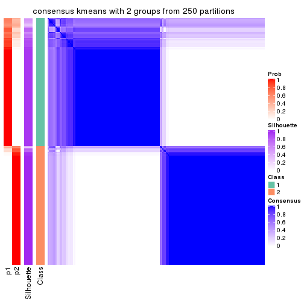</p>

</div>
<div id='tab-MAD-kmeans-consensus-heatmap-2'>
<pre><code class="r">consensus_heatmap(res, k = 3)
</code></pre>

<p>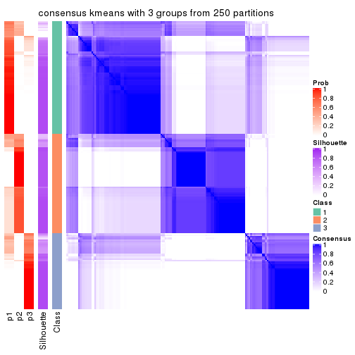</p>

</div>
<div id='tab-MAD-kmeans-consensus-heatmap-3'>
<pre><code class="r">consensus_heatmap(res, k = 4)
</code></pre>

<p>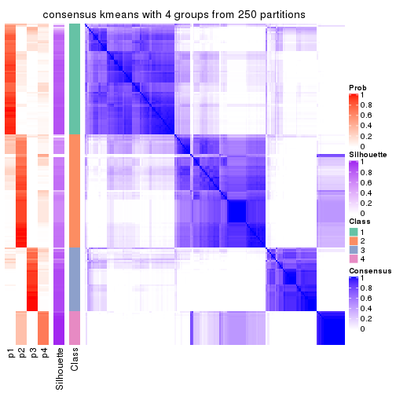</p>

</div>
<div id='tab-MAD-kmeans-consensus-heatmap-4'>
<pre><code class="r">consensus_heatmap(res, k = 5)
</code></pre>

<p>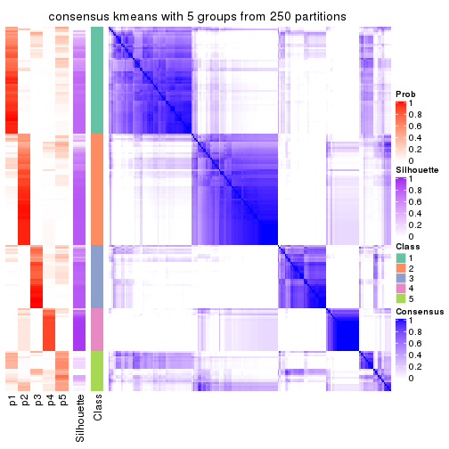</p>

</div>
<div id='tab-MAD-kmeans-consensus-heatmap-5'>
<pre><code class="r">consensus_heatmap(res, k = 6)
</code></pre>

<p>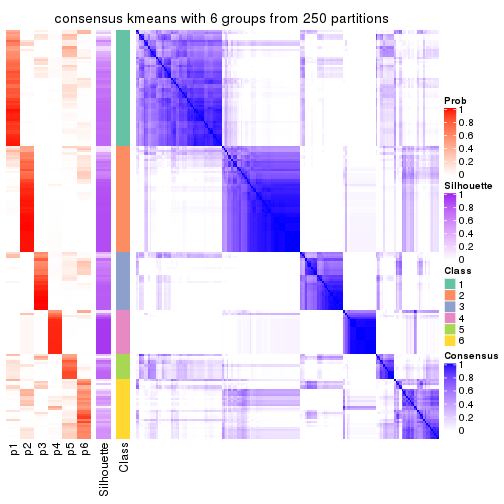</p>

</div>
</div>

Heatmaps for the membership of samples in all partitions to see how consistent they are:


<script>
$( function() {
	$( '#tabs-MAD-kmeans-membership-heatmap' ).tabs();
} );
</script>
<div id='tabs-MAD-kmeans-membership-heatmap'>
<ul>
<li><a href='#tab-MAD-kmeans-membership-heatmap-1'>k = 2</a></li>
<li><a href='#tab-MAD-kmeans-membership-heatmap-2'>k = 3</a></li>
<li><a href='#tab-MAD-kmeans-membership-heatmap-3'>k = 4</a></li>
<li><a href='#tab-MAD-kmeans-membership-heatmap-4'>k = 5</a></li>
<li><a href='#tab-MAD-kmeans-membership-heatmap-5'>k = 6</a></li>
</ul>
<div id='tab-MAD-kmeans-membership-heatmap-1'>
<pre><code class="r">membership_heatmap(res, k = 2)
</code></pre>

<p>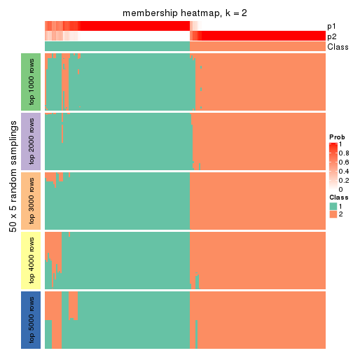</p>

</div>
<div id='tab-MAD-kmeans-membership-heatmap-2'>
<pre><code class="r">membership_heatmap(res, k = 3)
</code></pre>

<p>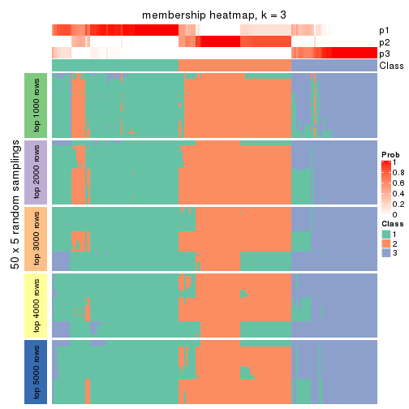</p>

</div>
<div id='tab-MAD-kmeans-membership-heatmap-3'>
<pre><code class="r">membership_heatmap(res, k = 4)
</code></pre>

<p>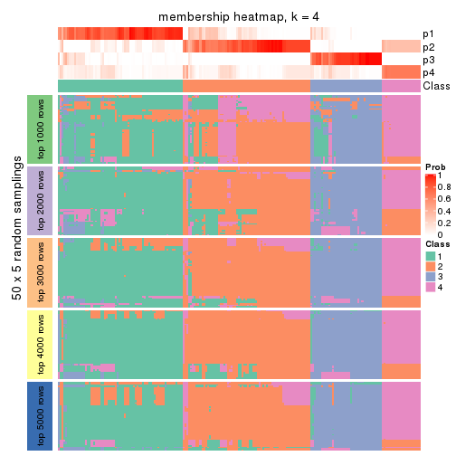</p>

</div>
<div id='tab-MAD-kmeans-membership-heatmap-4'>
<pre><code class="r">membership_heatmap(res, k = 5)
</code></pre>

<p>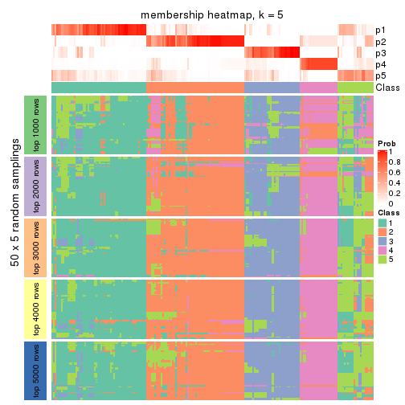</p>

</div>
<div id='tab-MAD-kmeans-membership-heatmap-5'>
<pre><code class="r">membership_heatmap(res, k = 6)
</code></pre>

<p>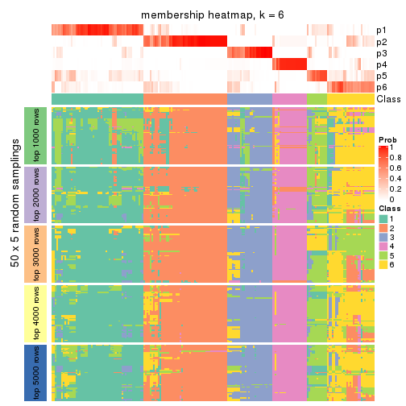</p>

</div>
</div>

As soon as we have had the classes for columns, we can look for signatures
which are significantly different between classes which can be candidate marks
for certain classes. Following are the heatmaps for signatures.


Signature heatmaps where rows are scaled:


<script>
$( function() {
	$( '#tabs-MAD-kmeans-get-signatures' ).tabs();
} );
</script>
<div id='tabs-MAD-kmeans-get-signatures'>
<ul>
<li><a href='#tab-MAD-kmeans-get-signatures-1'>k = 2</a></li>
<li><a href='#tab-MAD-kmeans-get-signatures-2'>k = 3</a></li>
<li><a href='#tab-MAD-kmeans-get-signatures-3'>k = 4</a></li>
<li><a href='#tab-MAD-kmeans-get-signatures-4'>k = 5</a></li>
<li><a href='#tab-MAD-kmeans-get-signatures-5'>k = 6</a></li>
</ul>
<div id='tab-MAD-kmeans-get-signatures-1'>
<pre><code class="r">get_signatures(res, k = 2)
</code></pre>

<p>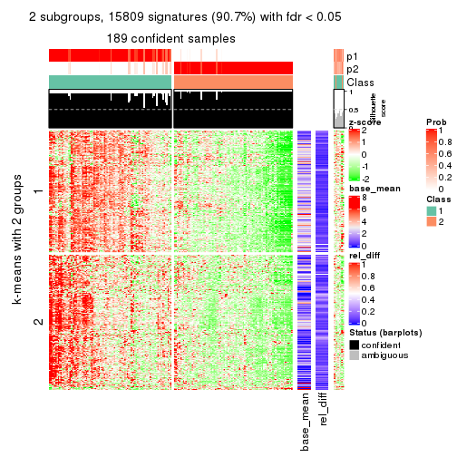</p>

</div>
<div id='tab-MAD-kmeans-get-signatures-2'>
<pre><code class="r">get_signatures(res, k = 3)
</code></pre>

<p>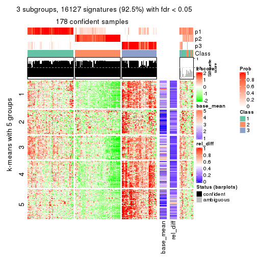</p>

</div>
<div id='tab-MAD-kmeans-get-signatures-3'>
<pre><code class="r">get_signatures(res, k = 4)
</code></pre>

<p>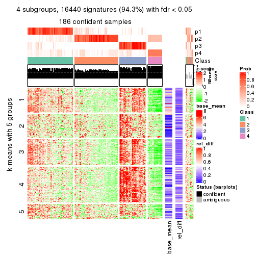</p>

</div>
<div id='tab-MAD-kmeans-get-signatures-4'>
<pre><code class="r">get_signatures(res, k = 5)
</code></pre>

<p>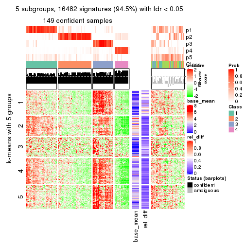</p>

</div>
<div id='tab-MAD-kmeans-get-signatures-5'>
<pre><code class="r">get_signatures(res, k = 6)
</code></pre>

<p>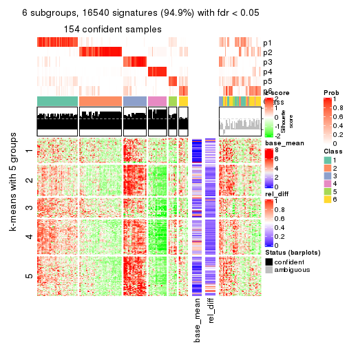</p>

</div>
</div>


Signature heatmaps where rows are not scaled:


<script>
$( function() {
	$( '#tabs-MAD-kmeans-get-signatures-no-scale' ).tabs();
} );
</script>
<div id='tabs-MAD-kmeans-get-signatures-no-scale'>
<ul>
<li><a href='#tab-MAD-kmeans-get-signatures-no-scale-1'>k = 2</a></li>
<li><a href='#tab-MAD-kmeans-get-signatures-no-scale-2'>k = 3</a></li>
<li><a href='#tab-MAD-kmeans-get-signatures-no-scale-3'>k = 4</a></li>
<li><a href='#tab-MAD-kmeans-get-signatures-no-scale-4'>k = 5</a></li>
<li><a href='#tab-MAD-kmeans-get-signatures-no-scale-5'>k = 6</a></li>
</ul>
<div id='tab-MAD-kmeans-get-signatures-no-scale-1'>
<pre><code class="r">get_signatures(res, k = 2, scale_rows = FALSE)
</code></pre>

<p>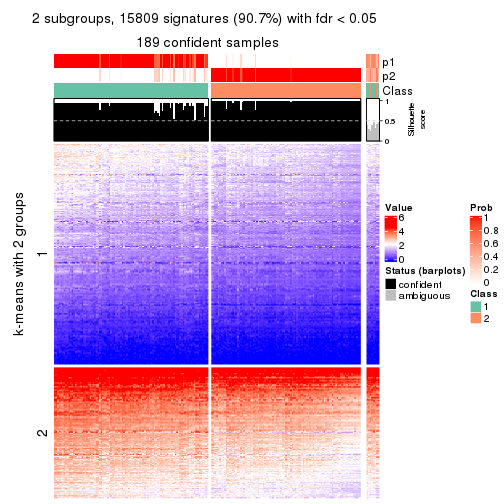</p>

</div>
<div id='tab-MAD-kmeans-get-signatures-no-scale-2'>
<pre><code class="r">get_signatures(res, k = 3, scale_rows = FALSE)
</code></pre>

<p>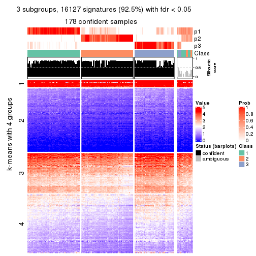</p>

</div>
<div id='tab-MAD-kmeans-get-signatures-no-scale-3'>
<pre><code class="r">get_signatures(res, k = 4, scale_rows = FALSE)
</code></pre>

<p>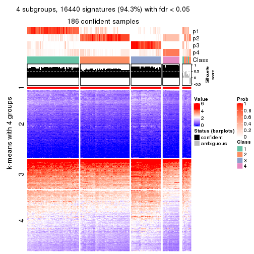</p>

</div>
<div id='tab-MAD-kmeans-get-signatures-no-scale-4'>
<pre><code class="r">get_signatures(res, k = 5, scale_rows = FALSE)
</code></pre>

<p>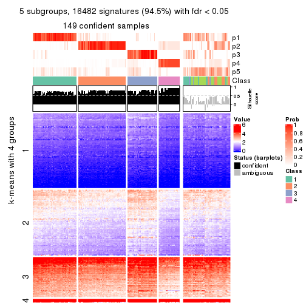</p>

</div>
<div id='tab-MAD-kmeans-get-signatures-no-scale-5'>
<pre><code class="r">get_signatures(res, k = 6, scale_rows = FALSE)
</code></pre>

<p>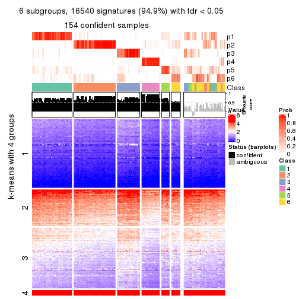</p>

</div>
</div>


Compare the overlap of signatures from different k:

```r
compare_signatures(res)
```

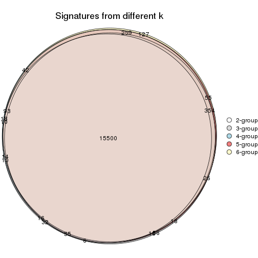

`get_signature()` returns a data frame invisibly. TO get the list of signatures, the function
call should be assigned to a variable explicitly. In following code, if `plot` argument is set
to `FALSE`, no heatmap is plotted while only the differential analysis is performed.

```r
# code only for demonstration
tb = get_signature(res, k = ..., plot = FALSE)
```

An example of the output of `tb` is:

```
#>   which_row         fdr    mean_1    mean_2 scaled_mean_1 scaled_mean_2 km
#> 1        38 0.042760348  8.373488  9.131774    -0.5533452     0.5164555  1
#> 2        40 0.018707592  7.106213  8.469186    -0.6173731     0.5762149  1
#> 3        55 0.019134737 10.221463 11.207825    -0.6159697     0.5749050  1
#> 4        59 0.006059896  5.921854  7.869574    -0.6899429     0.6439467  1
#> 5        60 0.018055526  8.928898 10.211722    -0.6204761     0.5791110  1
#> 6        98 0.009384629 15.714769 14.887706     0.6635654    -0.6193277  2
...
```

The columns in `tb` are:

1. `which_row`: row indices corresponding to the input matrix.
2. `fdr`: FDR for the differential test. 
3. `mean_x`: The mean value in group x.
4. `scaled_mean_x`: The mean value in group x after rows are scaled.
5. `km`: Row groups if k-means clustering is applied to rows.


UMAP plot which shows how samples are separated.


<script>
$( function() {
	$( '#tabs-MAD-kmeans-dimension-reduction' ).tabs();
} );
</script>
<div id='tabs-MAD-kmeans-dimension-reduction'>
<ul>
<li><a href='#tab-MAD-kmeans-dimension-reduction-1'>k = 2</a></li>
<li><a href='#tab-MAD-kmeans-dimension-reduction-2'>k = 3</a></li>
<li><a href='#tab-MAD-kmeans-dimension-reduction-3'>k = 4</a></li>
<li><a href='#tab-MAD-kmeans-dimension-reduction-4'>k = 5</a></li>
<li><a href='#tab-MAD-kmeans-dimension-reduction-5'>k = 6</a></li>
</ul>
<div id='tab-MAD-kmeans-dimension-reduction-1'>
<pre><code class="r">dimension_reduction(res, k = 2, method = &quot;UMAP&quot;)
</code></pre>

<p>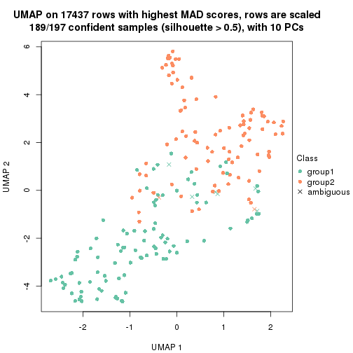</p>

</div>
<div id='tab-MAD-kmeans-dimension-reduction-2'>
<pre><code class="r">dimension_reduction(res, k = 3, method = &quot;UMAP&quot;)
</code></pre>

<p>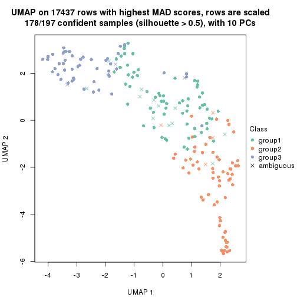</p>

</div>
<div id='tab-MAD-kmeans-dimension-reduction-3'>
<pre><code class="r">dimension_reduction(res, k = 4, method = &quot;UMAP&quot;)
</code></pre>

<p>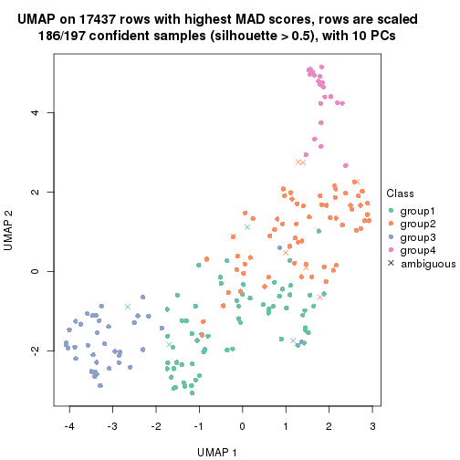</p>

</div>
<div id='tab-MAD-kmeans-dimension-reduction-4'>
<pre><code class="r">dimension_reduction(res, k = 5, method = &quot;UMAP&quot;)
</code></pre>

<p>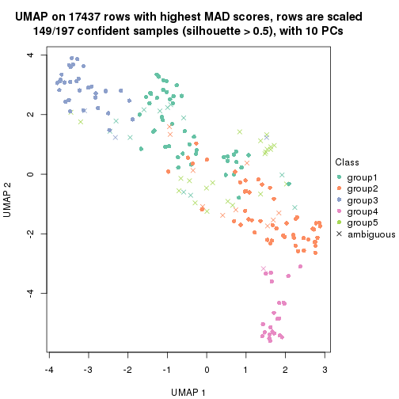</p>

</div>
<div id='tab-MAD-kmeans-dimension-reduction-5'>
<pre><code class="r">dimension_reduction(res, k = 6, method = &quot;UMAP&quot;)
</code></pre>

<p>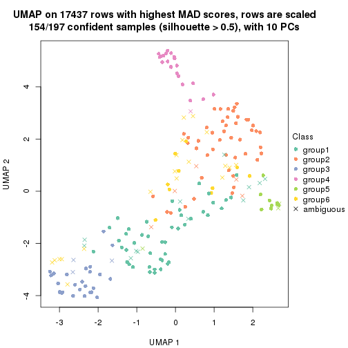</p>

</div>
</div>


Following heatmap shows how subgroups are split when increasing `k`:

```r
collect_classes(res)
```

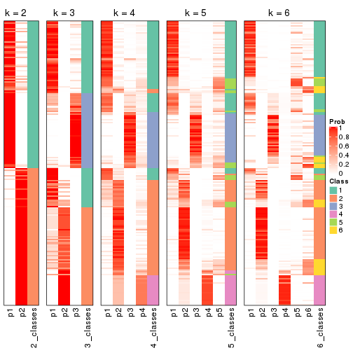


If matrix rows can be associated to genes, consider to use `GO_Enrichment(res,
...)` to perform function enrichment for the signature genes.


 

---------------------------------------------------


### MAD:skmeans


The object with results only for a single top-value method and a single partition method 
can be extracted as:

```r
res = res_list["MAD", "skmeans"]
# you can also extract it by
# res = res_list["MAD:skmeans"]
```

A summary of `res` and all the functions that can be applied to it:

```r
res
```

```
#> A 'ConsensusPartition' object with k = 2, 3, 4, 5, 6.
#>   On a matrix with 17437 rows and 197 columns.
#>   Top rows (1000, 2000, 3000, 4000, 5000) are extracted by 'MAD' method.
#>   Subgroups are detected by 'skmeans' method.
#>   Performed in total 1250 partitions by row resampling.
#>   Best k for subgroups seems to be 2.
#> 
#> Following methods can be applied to this 'ConsensusPartition' object:
#>  [1] "cola_report"             "collect_classes"         "collect_plots"          
#>  [4] "collect_stats"           "colnames"                "compare_signatures"     
#>  [7] "consensus_heatmap"       "dimension_reduction"     "functional_enrichment"  
#> [10] "get_anno_col"            "get_anno"                "get_classes"            
#> [13] "get_consensus"           "get_matrix"              "get_membership"         
#> [16] "get_param"               "get_signatures"          "get_stats"              
#> [19] "is_best_k"               "is_stable_k"             "membership_heatmap"     
#> [22] "ncol"                    "nrow"                    "plot_ecdf"              
#> [25] "rownames"                "select_partition_number" "show"                   
#> [28] "suggest_best_k"          "test_to_known_factors"
```

`collect_plots()` function collects all the plots made from `res` for all `k` (number of partitions)
into one single page to provide an easy and fast comparison between different `k`.

```r
collect_plots(res)
```

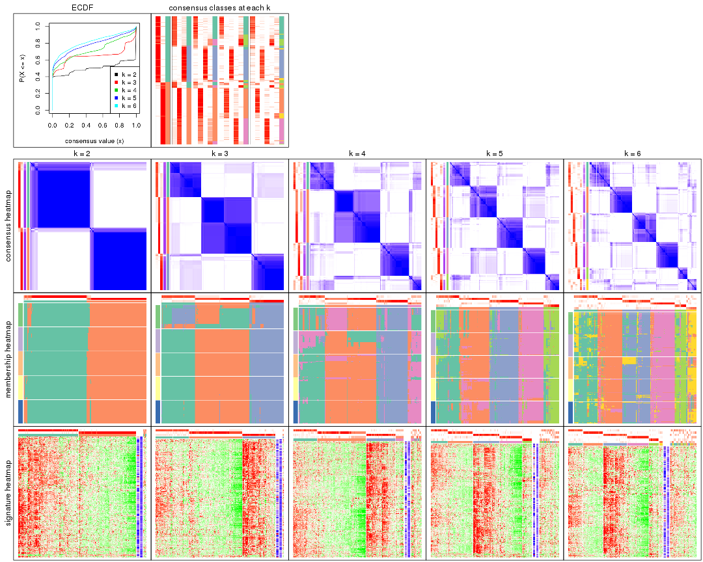

The plots are:

- The first row: a plot of the ECDF (Empirical cumulative distribution
  function) curves of the consensus matrix for each `k` and the heatmap of
  predicted classes for each `k`.
- The second row: heatmaps of the consensus matrix for each `k`.
- The third row: heatmaps of the membership matrix for each `k`.
- The fouth row: heatmaps of the signatures for each `k`.

All the plots in panels can be made by individual functions and they are
plotted later in this section.

`select_partition_number()` produces several plots showing different
statistics for choosing "optimized" `k`. There are following statistics:

- ECDF curves of the consensus matrix for each `k`;
- 1-PAC. [The PAC
  score](https://en.wikipedia.org/wiki/Consensus_clustering#Over-interpretation_potential_of_consensus_clustering)
  measures the proportion of the ambiguous subgrouping.
- Mean silhouette score.
- Concordance. The mean probability of fiting the consensus class ids in all
  partitions.
- Area increased. Denote $A_k$ as the area under the ECDF curve for current
  `k`, the area increased is defined as $A_k - A_{k-1}$.
- Rand index. The percent of pairs of samples that are both in a same cluster
  or both are not in a same cluster in the partition of k and k-1.
- Jaccard index. The ratio of pairs of samples are both in a same cluster in
  the partition of k and k-1 and the pairs of samples are both in a same
  cluster in the partition k or k-1.

The detailed explanations of these statistics can be found in [the cola
vignette](http://bioconductor.org/packages/devel/bioc/vignettes/cola/inst/doc/cola.html#toc_13).

Generally speaking, lower PAC score, higher mean silhouette score or higher
concordance corresponds to better partition. Rand index and Jaccard index
measure how similar the current partition is compared to partition with `k-1`.
If they are too similar, we won't accept `k` is better than `k-1`.

```r
select_partition_number(res)
```

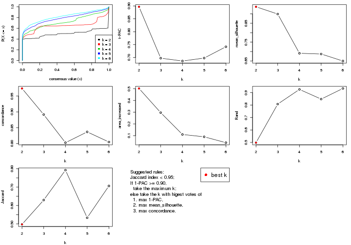

The numeric values for all these statistics can be obtained by `get_stats()`.

```r
get_stats(res)
```

```
#>   k 1-PAC mean_silhouette concordance area_increased  Rand Jaccard
#> 2 2 0.897           0.938       0.974         0.5028 0.498   0.498
#> 3 3 0.697           0.899       0.891         0.2961 0.808   0.630
#> 4 4 0.686           0.691       0.803         0.1101 0.926   0.792
#> 5 5 0.698           0.687       0.837         0.0901 0.848   0.534
#> 6 6 0.742           0.650       0.805         0.0401 0.933   0.706
```

`suggest_best_k()` suggests the best $k$ based on these statistics. The rules are as follows:

- All $k$ with Jaccard index larger than 0.95 are removed because the increase of
  the partition number does not provides enough extra information. If all $k$ are removed,
  the best $k$ is assigned by `NA`.
- For $k$ with 1-PAC larger than 0.9, the maximal $k$ is taken as the "best k". Other $k$ is called "optional k".
- If it does not fit the second rule. The $k$ with the highest vote of highest
  1-PAC, mean silhouette and concordance is taken as the "best k".

```r
suggest_best_k(res)
```

```
#> [1] 2
```


Following shows the table of the partitions (You need to click the **show/hide
code output** link to see it). The membership matrix (columns with name `p*`)
is inferred by
[`clue::cl_consensus()`](https://www.rdocumentation.org/link/cl_consensus?package=clue)
function with the `SE` method. Basically the value in the membership matrix
represents the probability to belong to a certain group. The finall class
label for an item is determined with the group with highest probability it
belongs to.

In `get_classes()` function, the entropy is calculated from the membership
matrix and the silhouette score is calculated from the consensus matrix.


<script>
$( function() {
	$( '#tabs-MAD-skmeans-get-classes' ).tabs();
} );
</script>
<div id='tabs-MAD-skmeans-get-classes'>
<ul>
<li><a href='#tab-MAD-skmeans-get-classes-1'>k = 2</a></li>
<li><a href='#tab-MAD-skmeans-get-classes-2'>k = 3</a></li>
<li><a href='#tab-MAD-skmeans-get-classes-3'>k = 4</a></li>
<li><a href='#tab-MAD-skmeans-get-classes-4'>k = 5</a></li>
<li><a href='#tab-MAD-skmeans-get-classes-5'>k = 6</a></li>
</ul>

<div id='tab-MAD-skmeans-get-classes-1'>
<p><a id='tab-MAD-skmeans-get-classes-1-a' style='color:#0366d6' href='#'>show/hide code output</a></p>
<pre><code class="r">cbind(get_classes(res, k = 2), get_membership(res, k = 2))
</code></pre>

<pre><code>#&gt;            class entropy silhouette    p1    p2
#&gt; SRR1380886     1  0.0000      0.966 1.000 0.000
#&gt; SRR1074385     1  0.0000      0.966 1.000 0.000
#&gt; SRR1374739     1  0.0000      0.966 1.000 0.000
#&gt; SRR1097883     1  0.0000      0.966 1.000 0.000
#&gt; SRR2167209     2  0.8267      0.644 0.260 0.740
#&gt; SRR816541      2  0.0000      0.979 0.000 1.000
#&gt; SRR663645      2  0.0000      0.979 0.000 1.000
#&gt; SRR1381505     2  0.0000      0.979 0.000 1.000
#&gt; SRR1416362     2  0.0000      0.979 0.000 1.000
#&gt; SRR1318503     1  0.4939      0.867 0.892 0.108
#&gt; SRR1341626     2  0.0000      0.979 0.000 1.000
#&gt; SRR1382440     1  0.0000      0.966 1.000 0.000
#&gt; SRR1088413     1  0.0000      0.966 1.000 0.000
#&gt; SRR1082080     2  0.0000      0.979 0.000 1.000
#&gt; SRR1455783     1  0.0000      0.966 1.000 0.000
#&gt; SRR1447760     2  0.0000      0.979 0.000 1.000
#&gt; SRR1487784     2  0.0000      0.979 0.000 1.000
#&gt; SRR1331037     2  0.0000      0.979 0.000 1.000
#&gt; SRR1095651     1  0.0000      0.966 1.000 0.000
#&gt; SRR1078066     1  0.0000      0.966 1.000 0.000
#&gt; SRR1120363     1  0.0000      0.966 1.000 0.000
#&gt; SRR821231      1  0.0000      0.966 1.000 0.000
#&gt; SRR1374373     2  0.0000      0.979 0.000 1.000
#&gt; SRR1324519     2  0.0000      0.979 0.000 1.000
#&gt; SRR1431121     1  0.0000      0.966 1.000 0.000
#&gt; SRR1091032     2  0.0000      0.979 0.000 1.000
#&gt; SRR1365575     2  0.0000      0.979 0.000 1.000
#&gt; SRR1072972     1  0.0000      0.966 1.000 0.000
#&gt; SRR1310690     2  0.0000      0.979 0.000 1.000
#&gt; SRR1383037     1  0.0000      0.966 1.000 0.000
#&gt; SRR1095479     1  0.0000      0.966 1.000 0.000
#&gt; SRR1070403     1  0.0000      0.966 1.000 0.000
#&gt; SRR1390203     1  0.0000      0.966 1.000 0.000
#&gt; SRR1072007     2  0.0000      0.979 0.000 1.000
#&gt; SRR1468787     1  0.9710      0.344 0.600 0.400
#&gt; SRR1347959     2  0.0000      0.979 0.000 1.000
#&gt; SRR1338513     1  0.0000      0.966 1.000 0.000
#&gt; SRR812598      2  0.0000      0.979 0.000 1.000
#&gt; SRR1446806     1  0.0000      0.966 1.000 0.000
#&gt; SRR1394275     1  0.0000      0.966 1.000 0.000
#&gt; SRR1443633     1  0.0000      0.966 1.000 0.000
#&gt; SRR1087728     1  0.0000      0.966 1.000 0.000
#&gt; SRR1098192     2  0.0000      0.979 0.000 1.000
#&gt; SRR1093340     2  0.0000      0.979 0.000 1.000
#&gt; SRR665405      2  0.0000      0.979 0.000 1.000
#&gt; SRR657077      2  0.0000      0.979 0.000 1.000
#&gt; SRR813208      1  0.0000      0.966 1.000 0.000
#&gt; SRR1416074     2  0.0000      0.979 0.000 1.000
#&gt; SRR1089688     2  0.0000      0.979 0.000 1.000
#&gt; SRR1353461     1  0.0000      0.966 1.000 0.000
#&gt; SRR1466321     1  0.9710      0.343 0.600 0.400
#&gt; SRR1073021     1  0.0000      0.966 1.000 0.000
#&gt; SRR1322816     2  0.0000      0.979 0.000 1.000
#&gt; SRR1457727     1  0.0000      0.966 1.000 0.000
#&gt; SRR1464226     2  0.0000      0.979 0.000 1.000
#&gt; SRR1398863     1  0.0000      0.966 1.000 0.000
#&gt; SRR1455631     2  0.0000      0.979 0.000 1.000
#&gt; SRR1307808     2  0.0000      0.979 0.000 1.000
#&gt; SRR1374585     2  0.0000      0.979 0.000 1.000
#&gt; SRR1072104     2  0.0000      0.979 0.000 1.000
#&gt; SRR1076868     2  0.0000      0.979 0.000 1.000
#&gt; SRR1335984     2  0.0000      0.979 0.000 1.000
#&gt; SRR1445939     1  0.0376      0.963 0.996 0.004
#&gt; SRR1453047     2  0.0000      0.979 0.000 1.000
#&gt; SRR1339788     1  0.0000      0.966 1.000 0.000
#&gt; SRR1084323     1  0.0000      0.966 1.000 0.000
#&gt; SRR1092937     1  0.0000      0.966 1.000 0.000
#&gt; SRR1074090     2  0.0000      0.979 0.000 1.000
#&gt; SRR1099833     1  0.6048      0.820 0.852 0.148
#&gt; SRR1093434     1  0.0000      0.966 1.000 0.000
#&gt; SRR1435857     1  0.0000      0.966 1.000 0.000
#&gt; SRR1480347     2  0.0000      0.979 0.000 1.000
#&gt; SRR1440787     2  0.0000      0.979 0.000 1.000
#&gt; SRR1430202     2  0.9866      0.230 0.432 0.568
#&gt; SRR1322730     2  0.0000      0.979 0.000 1.000
#&gt; SRR811029      2  0.0000      0.979 0.000 1.000
#&gt; SRR1390456     1  0.0000      0.966 1.000 0.000
#&gt; SRR1381140     1  0.0000      0.966 1.000 0.000
#&gt; SRR1388064     2  0.0000      0.979 0.000 1.000
#&gt; SRR1093577     1  0.0000      0.966 1.000 0.000
#&gt; SRR1414161     1  0.7219      0.753 0.800 0.200
#&gt; SRR1328738     1  0.7299      0.743 0.796 0.204
#&gt; SRR1311752     2  0.0000      0.979 0.000 1.000
#&gt; SRR1445960     2  0.0000      0.979 0.000 1.000
#&gt; SRR1403412     2  0.0000      0.979 0.000 1.000
#&gt; SRR2166748     1  0.0000      0.966 1.000 0.000
#&gt; SRR821666      2  0.0000      0.979 0.000 1.000
#&gt; SRR1330746     1  0.0000      0.966 1.000 0.000
#&gt; SRR1327872     2  0.0000      0.979 0.000 1.000
#&gt; SRR1100800     1  0.0000      0.966 1.000 0.000
#&gt; SRR1075174     1  0.0000      0.966 1.000 0.000
#&gt; SRR1434436     1  0.0000      0.966 1.000 0.000
#&gt; SRR1389409     2  0.0000      0.979 0.000 1.000
#&gt; SRR1085310     1  0.0000      0.966 1.000 0.000
#&gt; SRR1376718     2  0.0000      0.979 0.000 1.000
#&gt; SRR808590      2  0.0000      0.979 0.000 1.000
#&gt; SRR1084128     2  0.0000      0.979 0.000 1.000
#&gt; SRR1361692     1  0.0000      0.966 1.000 0.000
#&gt; SRR1431493     1  0.0000      0.966 1.000 0.000
#&gt; SRR1409084     1  0.0000      0.966 1.000 0.000
#&gt; SRR2166214     2  0.0000      0.979 0.000 1.000
#&gt; SRR1324102     2  0.0000      0.979 0.000 1.000
#&gt; SRR1079754     2  0.0000      0.979 0.000 1.000
#&gt; SRR1442127     1  0.0000      0.966 1.000 0.000
#&gt; SRR1076244     2  0.0000      0.979 0.000 1.000
#&gt; SRR1330901     2  0.0000      0.979 0.000 1.000
#&gt; SRR1073167     2  0.0000      0.979 0.000 1.000
#&gt; SRR1357541     1  0.0000      0.966 1.000 0.000
#&gt; SRR811607      2  0.9686      0.338 0.396 0.604
#&gt; SRR1468931     1  0.0000      0.966 1.000 0.000
#&gt; SRR1474908     2  0.0000      0.979 0.000 1.000
#&gt; SRR1309875     2  0.0000      0.979 0.000 1.000
#&gt; SRR598792      1  0.0000      0.966 1.000 0.000
#&gt; SRR1088537     2  0.0000      0.979 0.000 1.000
#&gt; SRR1457682     1  0.0000      0.966 1.000 0.000
#&gt; SRR1454289     1  0.9710      0.355 0.600 0.400
#&gt; SRR1069352     1  0.0000      0.966 1.000 0.000
#&gt; SRR1472728     2  0.0000      0.979 0.000 1.000
#&gt; SRR1091144     2  0.0000      0.979 0.000 1.000
#&gt; SRR1319118     1  0.0000      0.966 1.000 0.000
#&gt; SRR1403611     1  0.7219      0.753 0.800 0.200
#&gt; SRR1397762     1  0.0000      0.966 1.000 0.000
#&gt; SRR1317387     1  0.0000      0.966 1.000 0.000
#&gt; SRR1376426     2  0.0000      0.979 0.000 1.000
#&gt; SRR1097777     1  0.0000      0.966 1.000 0.000
#&gt; SRR1365743     1  0.0000      0.966 1.000 0.000
#&gt; SRR1458992     2  0.0000      0.979 0.000 1.000
#&gt; SRR1089537     1  0.7219      0.753 0.800 0.200
#&gt; SRR1397744     1  0.0000      0.966 1.000 0.000
#&gt; SRR1453893     2  0.0000      0.979 0.000 1.000
#&gt; SRR1098543     1  0.0000      0.966 1.000 0.000
#&gt; SRR1321765     1  0.0000      0.966 1.000 0.000
#&gt; SRR1440032     1  0.1633      0.946 0.976 0.024
#&gt; SRR1404507     2  0.0000      0.979 0.000 1.000
#&gt; SRR1404856     2  0.7056      0.754 0.192 0.808
#&gt; SRR812745      1  0.8081      0.679 0.752 0.248
#&gt; SRR1417524     1  0.0000      0.966 1.000 0.000
#&gt; SRR1407334     2  0.0000      0.979 0.000 1.000
#&gt; SRR1453991     1  0.0000      0.966 1.000 0.000
#&gt; SRR1415938     1  0.0000      0.966 1.000 0.000
#&gt; SRR1081259     1  0.0376      0.963 0.996 0.004
#&gt; SRR1436187     2  0.0000      0.979 0.000 1.000
#&gt; SRR1431948     1  0.0000      0.966 1.000 0.000
#&gt; SRR1453277     2  0.7056      0.754 0.192 0.808
#&gt; SRR1095407     1  0.8207      0.661 0.744 0.256
#&gt; SRR1359694     2  0.7602      0.706 0.220 0.780
#&gt; SRR656982      2  0.0672      0.971 0.008 0.992
#&gt; SRR1354338     2  0.0000      0.979 0.000 1.000
#&gt; SRR1088291     1  0.7056      0.760 0.808 0.192
#&gt; SRR1080624     1  0.0000      0.966 1.000 0.000
#&gt; SRR2166708     1  0.0000      0.966 1.000 0.000
#&gt; SRR1393572     1  0.0000      0.966 1.000 0.000
#&gt; SRR1429912     2  0.0000      0.979 0.000 1.000
#&gt; SRR1421048     2  0.0000      0.979 0.000 1.000
#&gt; SRR1434999     1  0.0000      0.966 1.000 0.000
#&gt; SRR656457      1  0.0000      0.966 1.000 0.000
#&gt; SRR1098928     1  0.0000      0.966 1.000 0.000
#&gt; SRR1343967     2  0.0000      0.979 0.000 1.000
#&gt; SRR1360766     1  0.0000      0.966 1.000 0.000
#&gt; SRR1464724     2  0.0000      0.979 0.000 1.000
#&gt; SRR1101542     2  0.0000      0.979 0.000 1.000
#&gt; SRR1401528     1  0.0000      0.966 1.000 0.000
#&gt; SRR1071519     1  0.0000      0.966 1.000 0.000
#&gt; SRR1086070     1  0.0000      0.966 1.000 0.000
#&gt; SRR1358645     2  0.0000      0.979 0.000 1.000
#&gt; SRR819771      1  0.0000      0.966 1.000 0.000
#&gt; SRR1418433     2  0.0000      0.979 0.000 1.000
#&gt; SRR821050      1  0.0000      0.966 1.000 0.000
#&gt; SRR1402091     2  0.0000      0.979 0.000 1.000
#&gt; SRR1322028     2  0.0000      0.979 0.000 1.000
#&gt; SRR1452556     2  0.0000      0.979 0.000 1.000
#&gt; SRR1340047     2  0.0000      0.979 0.000 1.000
#&gt; SRR1418302     2  0.0000      0.979 0.000 1.000
#&gt; SRR1073991     1  0.0000      0.966 1.000 0.000
#&gt; SRR1085187     2  0.0000      0.979 0.000 1.000
#&gt; SRR1357618     1  0.0000      0.966 1.000 0.000
#&gt; SRR1487764     1  0.8016      0.682 0.756 0.244
#&gt; SRR1075336     1  0.0000      0.966 1.000 0.000
#&gt; SRR1365471     2  0.0000      0.979 0.000 1.000
#&gt; SRR1414613     2  0.0000      0.979 0.000 1.000
#&gt; SRR658719      2  0.0000      0.979 0.000 1.000
#&gt; SRR1475128     1  0.0000      0.966 1.000 0.000
#&gt; SRR1367630     2  0.0000      0.979 0.000 1.000
#&gt; SRR1481146     2  0.0000      0.979 0.000 1.000
#&gt; SRR1465674     1  0.0000      0.966 1.000 0.000
#&gt; SRR1327303     2  0.0000      0.979 0.000 1.000
#&gt; SRR1390391     2  0.7745      0.692 0.228 0.772
#&gt; SRR1326020     2  0.0000      0.979 0.000 1.000
#&gt; SRR1381953     1  0.0000      0.966 1.000 0.000
#&gt; SRR1082544     2  0.0000      0.979 0.000 1.000
#&gt; SRR810761      1  0.0000      0.966 1.000 0.000
#&gt; SRR1070764     1  0.0000      0.966 1.000 0.000
#&gt; SRR1415919     1  0.0000      0.966 1.000 0.000
#&gt; SRR1490404     2  0.0000      0.979 0.000 1.000
#&gt; SRR1416773     1  0.0000      0.966 1.000 0.000
#&gt; SRR1377492     2  0.0000      0.979 0.000 1.000
#&gt; SRR1334314     1  0.0000      0.966 1.000 0.000
</code></pre>

<script>
$('#tab-MAD-skmeans-get-classes-1-a').parent().next().next().hide();
$('#tab-MAD-skmeans-get-classes-1-a').click(function(){
  $('#tab-MAD-skmeans-get-classes-1-a').parent().next().next().toggle();
  return(false);
});
</script>
</div>

<div id='tab-MAD-skmeans-get-classes-2'>
<p><a id='tab-MAD-skmeans-get-classes-2-a' style='color:#0366d6' href='#'>show/hide code output</a></p>
<pre><code class="r">cbind(get_classes(res, k = 3), get_membership(res, k = 3))
</code></pre>

<pre><code>#&gt;            class entropy silhouette    p1    p2    p3
#&gt; SRR1380886     3  0.0000     0.9372 0.000 0.000 1.000
#&gt; SRR1074385     3  0.1031     0.9236 0.024 0.000 0.976
#&gt; SRR1374739     3  0.0000     0.9372 0.000 0.000 1.000
#&gt; SRR1097883     1  0.3941     0.9125 0.844 0.000 0.156
#&gt; SRR2167209     1  0.3619     0.9104 0.864 0.000 0.136
#&gt; SRR816541      2  0.0000     0.9377 0.000 1.000 0.000
#&gt; SRR663645      2  0.3784     0.9210 0.132 0.864 0.004
#&gt; SRR1381505     2  0.3551     0.9230 0.132 0.868 0.000
#&gt; SRR1416362     2  0.0237     0.9372 0.004 0.996 0.000
#&gt; SRR1318503     1  0.3551     0.8501 0.868 0.132 0.000
#&gt; SRR1341626     2  0.0000     0.9377 0.000 1.000 0.000
#&gt; SRR1382440     3  0.0000     0.9372 0.000 0.000 1.000
#&gt; SRR1088413     3  0.0000     0.9372 0.000 0.000 1.000
#&gt; SRR1082080     2  0.0237     0.9372 0.004 0.996 0.000
#&gt; SRR1455783     3  0.6126     0.1784 0.400 0.000 0.600
#&gt; SRR1447760     1  0.3941     0.8368 0.844 0.156 0.000
#&gt; SRR1487784     2  0.0237     0.9372 0.004 0.996 0.000
#&gt; SRR1331037     2  0.0237     0.9372 0.004 0.996 0.000
#&gt; SRR1095651     3  0.0000     0.9372 0.000 0.000 1.000
#&gt; SRR1078066     1  0.4002     0.9112 0.840 0.000 0.160
#&gt; SRR1120363     1  0.3619     0.9154 0.864 0.000 0.136
#&gt; SRR821231      3  0.0000     0.9372 0.000 0.000 1.000
#&gt; SRR1374373     2  0.1031     0.9254 0.024 0.976 0.000
#&gt; SRR1324519     2  0.0237     0.9372 0.004 0.996 0.000
#&gt; SRR1431121     1  0.3941     0.9125 0.844 0.000 0.156
#&gt; SRR1091032     2  0.0237     0.9372 0.004 0.996 0.000
#&gt; SRR1365575     2  0.3551     0.9230 0.132 0.868 0.000
#&gt; SRR1072972     3  0.0000     0.9372 0.000 0.000 1.000
#&gt; SRR1310690     2  0.0000     0.9377 0.000 1.000 0.000
#&gt; SRR1383037     3  0.0000     0.9372 0.000 0.000 1.000
#&gt; SRR1095479     3  0.1753     0.9052 0.048 0.000 0.952
#&gt; SRR1070403     3  0.0000     0.9372 0.000 0.000 1.000
#&gt; SRR1390203     1  0.3619     0.9154 0.864 0.000 0.136
#&gt; SRR1072007     2  0.3551     0.9230 0.132 0.868 0.000
#&gt; SRR1468787     1  0.6318     0.8542 0.760 0.068 0.172
#&gt; SRR1347959     2  0.0237     0.9372 0.004 0.996 0.000
#&gt; SRR1338513     3  0.3784     0.8131 0.132 0.004 0.864
#&gt; SRR812598      2  0.0000     0.9377 0.000 1.000 0.000
#&gt; SRR1446806     1  0.4418     0.8474 0.848 0.132 0.020
#&gt; SRR1394275     1  0.4235     0.8965 0.824 0.000 0.176
#&gt; SRR1443633     1  0.4178     0.9034 0.828 0.000 0.172
#&gt; SRR1087728     3  0.0000     0.9372 0.000 0.000 1.000
#&gt; SRR1098192     2  0.0000     0.9377 0.000 1.000 0.000
#&gt; SRR1093340     2  0.0237     0.9372 0.004 0.996 0.000
#&gt; SRR665405      2  0.3551     0.9230 0.132 0.868 0.000
#&gt; SRR657077      2  0.0747     0.9375 0.016 0.984 0.000
#&gt; SRR813208      3  0.0000     0.9372 0.000 0.000 1.000
#&gt; SRR1416074     2  0.0237     0.9372 0.004 0.996 0.000
#&gt; SRR1089688     2  0.3551     0.9230 0.132 0.868 0.000
#&gt; SRR1353461     3  0.0000     0.9372 0.000 0.000 1.000
#&gt; SRR1466321     1  0.3551     0.8501 0.868 0.132 0.000
#&gt; SRR1073021     1  0.4002     0.9112 0.840 0.000 0.160
#&gt; SRR1322816     2  0.0000     0.9377 0.000 1.000 0.000
#&gt; SRR1457727     1  0.3619     0.9154 0.864 0.000 0.136
#&gt; SRR1464226     2  0.3551     0.9230 0.132 0.868 0.000
#&gt; SRR1398863     3  0.1031     0.9236 0.024 0.000 0.976
#&gt; SRR1455631     2  0.3551     0.9230 0.132 0.868 0.000
#&gt; SRR1307808     1  0.3619     0.8480 0.864 0.136 0.000
#&gt; SRR1374585     2  0.3551     0.9230 0.132 0.868 0.000
#&gt; SRR1072104     2  0.3551     0.9230 0.132 0.868 0.000
#&gt; SRR1076868     2  0.0237     0.9372 0.004 0.996 0.000
#&gt; SRR1335984     2  0.2297     0.9035 0.020 0.944 0.036
#&gt; SRR1445939     1  0.5028     0.8445 0.828 0.132 0.040
#&gt; SRR1453047     2  0.0237     0.9372 0.004 0.996 0.000
#&gt; SRR1339788     3  0.0000     0.9372 0.000 0.000 1.000
#&gt; SRR1084323     1  0.3686     0.9150 0.860 0.000 0.140
#&gt; SRR1092937     3  0.1399     0.9199 0.028 0.004 0.968
#&gt; SRR1074090     2  0.0237     0.9372 0.004 0.996 0.000
#&gt; SRR1099833     3  0.3784     0.8131 0.132 0.004 0.864
#&gt; SRR1093434     3  0.0000     0.9372 0.000 0.000 1.000
#&gt; SRR1435857     1  0.4399     0.8943 0.812 0.000 0.188
#&gt; SRR1480347     2  0.0237     0.9372 0.004 0.996 0.000
#&gt; SRR1440787     2  0.3551     0.9230 0.132 0.868 0.000
#&gt; SRR1430202     1  0.3965     0.8498 0.860 0.132 0.008
#&gt; SRR1322730     2  0.3551     0.9230 0.132 0.868 0.000
#&gt; SRR811029      2  0.0000     0.9377 0.000 1.000 0.000
#&gt; SRR1390456     3  0.0000     0.9372 0.000 0.000 1.000
#&gt; SRR1381140     1  0.4178     0.8989 0.828 0.000 0.172
#&gt; SRR1388064     2  0.3551     0.9230 0.132 0.868 0.000
#&gt; SRR1093577     3  0.6280    -0.0319 0.460 0.000 0.540
#&gt; SRR1414161     1  0.4235     0.8152 0.824 0.176 0.000
#&gt; SRR1328738     1  0.3619     0.9154 0.864 0.000 0.136
#&gt; SRR1311752     2  0.0237     0.9372 0.004 0.996 0.000
#&gt; SRR1445960     2  0.0000     0.9377 0.000 1.000 0.000
#&gt; SRR1403412     2  0.0000     0.9377 0.000 1.000 0.000
#&gt; SRR2166748     1  0.3941     0.9125 0.844 0.000 0.156
#&gt; SRR821666      2  0.3551     0.9230 0.132 0.868 0.000
#&gt; SRR1330746     3  0.0000     0.9372 0.000 0.000 1.000
#&gt; SRR1327872     2  0.3551     0.9230 0.132 0.868 0.000
#&gt; SRR1100800     1  0.4062     0.9104 0.836 0.000 0.164
#&gt; SRR1075174     3  0.1031     0.9236 0.024 0.000 0.976
#&gt; SRR1434436     1  0.3551     0.8501 0.868 0.132 0.000
#&gt; SRR1389409     2  0.3551     0.9230 0.132 0.868 0.000
#&gt; SRR1085310     3  0.0000     0.9372 0.000 0.000 1.000
#&gt; SRR1376718     2  0.3551     0.9230 0.132 0.868 0.000
#&gt; SRR808590      2  0.3551     0.9230 0.132 0.868 0.000
#&gt; SRR1084128     2  0.0237     0.9372 0.004 0.996 0.000
#&gt; SRR1361692     1  0.3896     0.9144 0.864 0.008 0.128
#&gt; SRR1431493     3  0.1753     0.9052 0.048 0.000 0.952
#&gt; SRR1409084     1  0.3619     0.9154 0.864 0.000 0.136
#&gt; SRR2166214     2  0.3551     0.9230 0.132 0.868 0.000
#&gt; SRR1324102     2  0.0237     0.9372 0.004 0.996 0.000
#&gt; SRR1079754     2  0.3412     0.9245 0.124 0.876 0.000
#&gt; SRR1442127     3  0.0000     0.9372 0.000 0.000 1.000
#&gt; SRR1076244     2  0.3551     0.9230 0.132 0.868 0.000
#&gt; SRR1330901     1  0.3686     0.8455 0.860 0.140 0.000
#&gt; SRR1073167     2  0.0237     0.9372 0.004 0.996 0.000
#&gt; SRR1357541     1  0.4002     0.9112 0.840 0.000 0.160
#&gt; SRR811607      1  0.3551     0.8501 0.868 0.132 0.000
#&gt; SRR1468931     3  0.0000     0.9372 0.000 0.000 1.000
#&gt; SRR1474908     2  0.0592     0.9322 0.012 0.988 0.000
#&gt; SRR1309875     2  0.0000     0.9377 0.000 1.000 0.000
#&gt; SRR598792      3  0.0000     0.9372 0.000 0.000 1.000
#&gt; SRR1088537     2  0.0237     0.9372 0.004 0.996 0.000
#&gt; SRR1457682     1  0.3619     0.9154 0.864 0.000 0.136
#&gt; SRR1454289     1  0.4062     0.8263 0.836 0.164 0.000
#&gt; SRR1069352     3  0.1411     0.9135 0.036 0.000 0.964
#&gt; SRR1472728     2  0.0237     0.9372 0.004 0.996 0.000
#&gt; SRR1091144     2  0.3551     0.9230 0.132 0.868 0.000
#&gt; SRR1319118     3  0.0000     0.9372 0.000 0.000 1.000
#&gt; SRR1403611     3  0.4551     0.7954 0.132 0.024 0.844
#&gt; SRR1397762     3  0.0892     0.9257 0.020 0.000 0.980
#&gt; SRR1317387     3  0.0000     0.9372 0.000 0.000 1.000
#&gt; SRR1376426     2  0.0237     0.9372 0.004 0.996 0.000
#&gt; SRR1097777     1  0.4750     0.8679 0.784 0.000 0.216
#&gt; SRR1365743     3  0.0892     0.9257 0.020 0.000 0.980
#&gt; SRR1458992     2  0.0000     0.9377 0.000 1.000 0.000
#&gt; SRR1089537     3  0.5136     0.7779 0.132 0.044 0.824
#&gt; SRR1397744     1  0.3619     0.9154 0.864 0.000 0.136
#&gt; SRR1453893     2  0.3551     0.9230 0.132 0.868 0.000
#&gt; SRR1098543     1  0.3686     0.9150 0.860 0.000 0.140
#&gt; SRR1321765     1  0.4002     0.9112 0.840 0.000 0.160
#&gt; SRR1440032     3  0.3551     0.8171 0.132 0.000 0.868
#&gt; SRR1404507     2  0.3551     0.9230 0.132 0.868 0.000
#&gt; SRR1404856     1  0.1129     0.8185 0.976 0.004 0.020
#&gt; SRR812745      3  0.4811     0.7636 0.024 0.148 0.828
#&gt; SRR1417524     3  0.0000     0.9372 0.000 0.000 1.000
#&gt; SRR1407334     2  0.3551     0.9230 0.132 0.868 0.000
#&gt; SRR1453991     1  0.3619     0.9154 0.864 0.000 0.136
#&gt; SRR1415938     1  0.4452     0.8855 0.808 0.000 0.192
#&gt; SRR1081259     1  0.7772     0.6948 0.672 0.132 0.196
#&gt; SRR1436187     2  0.3551     0.9230 0.132 0.868 0.000
#&gt; SRR1431948     3  0.0000     0.9372 0.000 0.000 1.000
#&gt; SRR1453277     2  0.3116     0.8667 0.000 0.892 0.108
#&gt; SRR1095407     1  0.4002     0.9112 0.840 0.000 0.160
#&gt; SRR1359694     1  0.3551     0.8501 0.868 0.132 0.000
#&gt; SRR656982      2  0.4915     0.9004 0.132 0.832 0.036
#&gt; SRR1354338     2  0.0237     0.9372 0.004 0.996 0.000
#&gt; SRR1088291     1  0.3941     0.9125 0.844 0.000 0.156
#&gt; SRR1080624     1  0.3619     0.9154 0.864 0.000 0.136
#&gt; SRR2166708     3  0.0000     0.9372 0.000 0.000 1.000
#&gt; SRR1393572     1  0.3619     0.9154 0.864 0.000 0.136
#&gt; SRR1429912     2  0.0237     0.9372 0.004 0.996 0.000
#&gt; SRR1421048     1  0.3551     0.8501 0.868 0.132 0.000
#&gt; SRR1434999     3  0.5465     0.5273 0.288 0.000 0.712
#&gt; SRR656457      3  0.5465     0.5273 0.288 0.000 0.712
#&gt; SRR1098928     3  0.0000     0.9372 0.000 0.000 1.000
#&gt; SRR1343967     2  0.0237     0.9372 0.004 0.996 0.000
#&gt; SRR1360766     3  0.1964     0.8912 0.056 0.000 0.944
#&gt; SRR1464724     2  0.3551     0.9230 0.132 0.868 0.000
#&gt; SRR1101542     2  0.3551     0.9230 0.132 0.868 0.000
#&gt; SRR1401528     3  0.0000     0.9372 0.000 0.000 1.000
#&gt; SRR1071519     3  0.0000     0.9372 0.000 0.000 1.000
#&gt; SRR1086070     1  0.4178     0.8989 0.828 0.000 0.172
#&gt; SRR1358645     2  0.0592     0.9330 0.012 0.988 0.000
#&gt; SRR819771      3  0.1411     0.9135 0.036 0.000 0.964
#&gt; SRR1418433     2  0.3551     0.9230 0.132 0.868 0.000
#&gt; SRR821050      1  0.3941     0.9125 0.844 0.000 0.156
#&gt; SRR1402091     2  0.0000     0.9377 0.000 1.000 0.000
#&gt; SRR1322028     2  0.0237     0.9372 0.004 0.996 0.000
#&gt; SRR1452556     2  0.3551     0.9230 0.132 0.868 0.000
#&gt; SRR1340047     2  0.1031     0.9254 0.024 0.976 0.000
#&gt; SRR1418302     2  0.3038     0.9275 0.104 0.896 0.000
#&gt; SRR1073991     3  0.0000     0.9372 0.000 0.000 1.000
#&gt; SRR1085187     2  0.3551     0.9230 0.132 0.868 0.000
#&gt; SRR1357618     3  0.1411     0.9135 0.036 0.000 0.964
#&gt; SRR1487764     3  0.3038     0.8301 0.000 0.104 0.896
#&gt; SRR1075336     1  0.3816     0.9127 0.852 0.000 0.148
#&gt; SRR1365471     2  0.0237     0.9372 0.004 0.996 0.000
#&gt; SRR1414613     2  0.0237     0.9372 0.004 0.996 0.000
#&gt; SRR658719      2  0.0000     0.9377 0.000 1.000 0.000
#&gt; SRR1475128     3  0.0000     0.9372 0.000 0.000 1.000
#&gt; SRR1367630     2  0.3551     0.9230 0.132 0.868 0.000
#&gt; SRR1481146     2  0.3551     0.9230 0.132 0.868 0.000
#&gt; SRR1465674     1  0.4002     0.9112 0.840 0.000 0.160
#&gt; SRR1327303     2  0.0000     0.9377 0.000 1.000 0.000
#&gt; SRR1390391     2  0.4654     0.7097 0.000 0.792 0.208
#&gt; SRR1326020     2  0.4677     0.9064 0.132 0.840 0.028
#&gt; SRR1381953     3  0.0000     0.9372 0.000 0.000 1.000
#&gt; SRR1082544     2  0.2537     0.9313 0.080 0.920 0.000
#&gt; SRR810761      1  0.4002     0.9112 0.840 0.000 0.160
#&gt; SRR1070764     3  0.0000     0.9372 0.000 0.000 1.000
#&gt; SRR1415919     3  0.0000     0.9372 0.000 0.000 1.000
#&gt; SRR1490404     2  0.0237     0.9372 0.004 0.996 0.000
#&gt; SRR1416773     1  0.4002     0.9112 0.840 0.000 0.160
#&gt; SRR1377492     2  0.3551     0.9230 0.132 0.868 0.000
#&gt; SRR1334314     1  0.3918     0.8580 0.868 0.120 0.012
</code></pre>

<script>
$('#tab-MAD-skmeans-get-classes-2-a').parent().next().next().hide();
$('#tab-MAD-skmeans-get-classes-2-a').click(function(){
  $('#tab-MAD-skmeans-get-classes-2-a').parent().next().next().toggle();
  return(false);
});
</script>
</div>

<div id='tab-MAD-skmeans-get-classes-3'>
<p><a id='tab-MAD-skmeans-get-classes-3-a' style='color:#0366d6' href='#'>show/hide code output</a></p>
<pre><code class="r">cbind(get_classes(res, k = 4), get_membership(res, k = 4))
</code></pre>

<pre><code>#&gt;            class entropy silhouette    p1    p2    p3    p4
#&gt; SRR1380886     3  0.0707    0.88164 0.020 0.000 0.980 0.000
#&gt; SRR1074385     3  0.6137    0.07159 0.448 0.000 0.504 0.048
#&gt; SRR1374739     3  0.0336    0.88521 0.008 0.000 0.992 0.000
#&gt; SRR1097883     1  0.4144    0.60846 0.828 0.000 0.068 0.104
#&gt; SRR2167209     4  0.6163    0.58395 0.364 0.000 0.060 0.576
#&gt; SRR816541      2  0.0592    0.79883 0.000 0.984 0.000 0.016
#&gt; SRR663645      2  0.5683    0.68004 0.024 0.596 0.004 0.376
#&gt; SRR1381505     2  0.4776    0.70559 0.000 0.624 0.000 0.376
#&gt; SRR1416362     2  0.0000    0.79763 0.000 1.000 0.000 0.000
#&gt; SRR1318503     1  0.3037    0.65911 0.880 0.020 0.000 0.100
#&gt; SRR1341626     2  0.1637    0.79763 0.000 0.940 0.000 0.060
#&gt; SRR1382440     3  0.0336    0.88521 0.008 0.000 0.992 0.000
#&gt; SRR1088413     3  0.0336    0.88521 0.008 0.000 0.992 0.000
#&gt; SRR1082080     2  0.0000    0.79763 0.000 1.000 0.000 0.000
#&gt; SRR1455783     1  0.4663    0.59175 0.716 0.000 0.272 0.012
#&gt; SRR1447760     4  0.6462    0.53445 0.332 0.088 0.000 0.580
#&gt; SRR1487784     2  0.0000    0.79763 0.000 1.000 0.000 0.000
#&gt; SRR1331037     2  0.0000    0.79763 0.000 1.000 0.000 0.000
#&gt; SRR1095651     3  0.0000    0.88493 0.000 0.000 1.000 0.000
#&gt; SRR1078066     4  0.6350    0.57998 0.364 0.000 0.072 0.564
#&gt; SRR1120363     1  0.1706    0.70801 0.948 0.000 0.016 0.036
#&gt; SRR821231      3  0.1211    0.87642 0.040 0.000 0.960 0.000
#&gt; SRR1374373     2  0.1545    0.76610 0.008 0.952 0.000 0.040
#&gt; SRR1324519     2  0.0336    0.79846 0.000 0.992 0.000 0.008
#&gt; SRR1431121     1  0.1042    0.72328 0.972 0.000 0.020 0.008
#&gt; SRR1091032     2  0.0000    0.79763 0.000 1.000 0.000 0.000
#&gt; SRR1365575     2  0.4776    0.70559 0.000 0.624 0.000 0.376
#&gt; SRR1072972     3  0.1792    0.86056 0.068 0.000 0.932 0.000
#&gt; SRR1310690     2  0.1557    0.79804 0.000 0.944 0.000 0.056
#&gt; SRR1383037     3  0.0000    0.88493 0.000 0.000 1.000 0.000
#&gt; SRR1095479     3  0.3528    0.76571 0.192 0.000 0.808 0.000
#&gt; SRR1070403     3  0.0336    0.88521 0.008 0.000 0.992 0.000
#&gt; SRR1390203     1  0.1820    0.73006 0.944 0.000 0.020 0.036
#&gt; SRR1072007     2  0.4776    0.70559 0.000 0.624 0.000 0.376
#&gt; SRR1468787     4  0.6369    0.58290 0.352 0.000 0.076 0.572
#&gt; SRR1347959     2  0.0188    0.79560 0.000 0.996 0.000 0.004
#&gt; SRR1338513     3  0.3123    0.76142 0.000 0.000 0.844 0.156
#&gt; SRR812598      2  0.1637    0.79751 0.000 0.940 0.000 0.060
#&gt; SRR1446806     1  0.5603    0.64201 0.736 0.180 0.012 0.072
#&gt; SRR1394275     1  0.4798    0.66096 0.768 0.000 0.180 0.052
#&gt; SRR1443633     1  0.4791    0.55837 0.784 0.000 0.080 0.136
#&gt; SRR1087728     3  0.0000    0.88493 0.000 0.000 1.000 0.000
#&gt; SRR1098192     2  0.3024    0.77796 0.000 0.852 0.000 0.148
#&gt; SRR1093340     2  0.0000    0.79763 0.000 1.000 0.000 0.000
#&gt; SRR665405      4  0.5099   -0.29845 0.000 0.380 0.008 0.612
#&gt; SRR657077      2  0.1118    0.79740 0.000 0.964 0.000 0.036
#&gt; SRR813208      3  0.0000    0.88493 0.000 0.000 1.000 0.000
#&gt; SRR1416074     2  0.0000    0.79763 0.000 1.000 0.000 0.000
#&gt; SRR1089688     2  0.4776    0.70559 0.000 0.624 0.000 0.376
#&gt; SRR1353461     3  0.0707    0.87983 0.020 0.000 0.980 0.000
#&gt; SRR1466321     1  0.2805    0.66201 0.888 0.012 0.000 0.100
#&gt; SRR1073021     4  0.6426    0.55241 0.392 0.000 0.072 0.536
#&gt; SRR1322816     2  0.0592    0.79883 0.000 0.984 0.000 0.016
#&gt; SRR1457727     1  0.2480    0.72795 0.904 0.000 0.088 0.008
#&gt; SRR1464226     2  0.4776    0.70559 0.000 0.624 0.000 0.376
#&gt; SRR1398863     3  0.4959    0.70275 0.196 0.000 0.752 0.052
#&gt; SRR1455631     4  0.4253    0.19819 0.000 0.208 0.016 0.776
#&gt; SRR1307808     1  0.6446    0.46146 0.584 0.328 0.000 0.088
#&gt; SRR1374585     2  0.4776    0.70559 0.000 0.624 0.000 0.376
#&gt; SRR1072104     2  0.4776    0.70559 0.000 0.624 0.000 0.376
#&gt; SRR1076868     2  0.0000    0.79763 0.000 1.000 0.000 0.000
#&gt; SRR1335984     2  0.2911    0.75875 0.016 0.900 0.012 0.072
#&gt; SRR1445939     1  0.5915    0.66676 0.752 0.116 0.080 0.052
#&gt; SRR1453047     2  0.0000    0.79763 0.000 1.000 0.000 0.000
#&gt; SRR1339788     3  0.1022    0.87674 0.032 0.000 0.968 0.000
#&gt; SRR1084323     1  0.3587    0.71499 0.860 0.000 0.088 0.052
#&gt; SRR1092937     3  0.4123    0.77271 0.136 0.000 0.820 0.044
#&gt; SRR1074090     2  0.0000    0.79763 0.000 1.000 0.000 0.000
#&gt; SRR1099833     3  0.3444    0.72990 0.000 0.000 0.816 0.184
#&gt; SRR1093434     3  0.0336    0.88521 0.008 0.000 0.992 0.000
#&gt; SRR1435857     1  0.3852    0.67506 0.800 0.000 0.192 0.008
#&gt; SRR1480347     2  0.0000    0.79763 0.000 1.000 0.000 0.000
#&gt; SRR1440787     2  0.4776    0.70559 0.000 0.624 0.000 0.376
#&gt; SRR1430202     1  0.5683    0.63431 0.728 0.188 0.012 0.072
#&gt; SRR1322730     2  0.4776    0.70559 0.000 0.624 0.000 0.376
#&gt; SRR811029      2  0.1716    0.79699 0.000 0.936 0.000 0.064
#&gt; SRR1390456     3  0.0000    0.88493 0.000 0.000 1.000 0.000
#&gt; SRR1381140     1  0.4959    0.64604 0.752 0.000 0.196 0.052
#&gt; SRR1388064     2  0.4776    0.70559 0.000 0.624 0.000 0.376
#&gt; SRR1093577     1  0.7246   -0.04679 0.448 0.000 0.408 0.144
#&gt; SRR1414161     1  0.5404    0.58347 0.700 0.248 0.000 0.052
#&gt; SRR1328738     4  0.5212    0.52295 0.420 0.000 0.008 0.572
#&gt; SRR1311752     2  0.0000    0.79763 0.000 1.000 0.000 0.000
#&gt; SRR1445960     2  0.0707    0.79907 0.000 0.980 0.000 0.020
#&gt; SRR1403412     2  0.1004    0.79818 0.004 0.972 0.000 0.024
#&gt; SRR2166748     1  0.1004    0.72532 0.972 0.000 0.024 0.004
#&gt; SRR821666      2  0.4776    0.70559 0.000 0.624 0.000 0.376
#&gt; SRR1330746     3  0.0336    0.88521 0.008 0.000 0.992 0.000
#&gt; SRR1327872     2  0.4776    0.70559 0.000 0.624 0.000 0.376
#&gt; SRR1100800     1  0.3324    0.70372 0.852 0.000 0.136 0.012
#&gt; SRR1075174     3  0.4959    0.69872 0.196 0.000 0.752 0.052
#&gt; SRR1434436     1  0.5369    0.64723 0.748 0.176 0.008 0.068
#&gt; SRR1389409     2  0.4776    0.70559 0.000 0.624 0.000 0.376
#&gt; SRR1085310     3  0.0000    0.88493 0.000 0.000 1.000 0.000
#&gt; SRR1376718     2  0.4776    0.70559 0.000 0.624 0.000 0.376
#&gt; SRR808590      2  0.4776    0.70559 0.000 0.624 0.000 0.376
#&gt; SRR1084128     2  0.0188    0.79560 0.000 0.996 0.000 0.004
#&gt; SRR1361692     4  0.5296    0.39044 0.496 0.000 0.008 0.496
#&gt; SRR1431493     3  0.3266    0.74532 0.168 0.000 0.832 0.000
#&gt; SRR1409084     1  0.0469    0.72704 0.988 0.000 0.012 0.000
#&gt; SRR2166214     4  0.4817   -0.31484 0.000 0.388 0.000 0.612
#&gt; SRR1324102     2  0.0000    0.79763 0.000 1.000 0.000 0.000
#&gt; SRR1079754     2  0.4222    0.74249 0.000 0.728 0.000 0.272
#&gt; SRR1442127     3  0.0000    0.88493 0.000 0.000 1.000 0.000
#&gt; SRR1076244     2  0.4776    0.70559 0.000 0.624 0.000 0.376
#&gt; SRR1330901     1  0.5767    0.54404 0.660 0.280 0.000 0.060
#&gt; SRR1073167     2  0.0000    0.79763 0.000 1.000 0.000 0.000
#&gt; SRR1357541     1  0.4673    0.56445 0.792 0.000 0.076 0.132
#&gt; SRR811607      1  0.2670    0.68549 0.904 0.024 0.000 0.072
#&gt; SRR1468931     3  0.0336    0.88521 0.008 0.000 0.992 0.000
#&gt; SRR1474908     2  0.2048    0.77400 0.008 0.928 0.000 0.064
#&gt; SRR1309875     2  0.1716    0.79699 0.000 0.936 0.000 0.064
#&gt; SRR598792      3  0.0336    0.88521 0.008 0.000 0.992 0.000
#&gt; SRR1088537     2  0.0000    0.79763 0.000 1.000 0.000 0.000
#&gt; SRR1457682     1  0.0804    0.72161 0.980 0.000 0.008 0.012
#&gt; SRR1454289     1  0.4353    0.61465 0.756 0.232 0.000 0.012
#&gt; SRR1069352     3  0.4204    0.70160 0.192 0.000 0.788 0.020
#&gt; SRR1472728     2  0.0000    0.79763 0.000 1.000 0.000 0.000
#&gt; SRR1091144     2  0.4817    0.69425 0.000 0.612 0.000 0.388
#&gt; SRR1319118     3  0.2216    0.83742 0.092 0.000 0.908 0.000
#&gt; SRR1403611     3  0.3569    0.71550 0.000 0.000 0.804 0.196
#&gt; SRR1397762     3  0.1902    0.85492 0.064 0.000 0.932 0.004
#&gt; SRR1317387     3  0.0000    0.88493 0.000 0.000 1.000 0.000
#&gt; SRR1376426     2  0.0000    0.79763 0.000 1.000 0.000 0.000
#&gt; SRR1097777     1  0.4567    0.61012 0.716 0.000 0.276 0.008
#&gt; SRR1365743     3  0.3071    0.83020 0.068 0.000 0.888 0.044
#&gt; SRR1458992     2  0.0707    0.79907 0.000 0.980 0.000 0.020
#&gt; SRR1089537     4  0.3583    0.41677 0.000 0.004 0.180 0.816
#&gt; SRR1397744     1  0.0336    0.72533 0.992 0.000 0.008 0.000
#&gt; SRR1453893     2  0.4776    0.70559 0.000 0.624 0.000 0.376
#&gt; SRR1098543     1  0.0592    0.72983 0.984 0.000 0.016 0.000
#&gt; SRR1321765     4  0.6407    0.56237 0.384 0.000 0.072 0.544
#&gt; SRR1440032     3  0.3569    0.71550 0.000 0.000 0.804 0.196
#&gt; SRR1404507     2  0.4776    0.70559 0.000 0.624 0.000 0.376
#&gt; SRR1404856     4  0.5271    0.57633 0.340 0.000 0.020 0.640
#&gt; SRR812745      3  0.6316    0.65456 0.072 0.160 0.716 0.052
#&gt; SRR1417524     3  0.0000    0.88493 0.000 0.000 1.000 0.000
#&gt; SRR1407334     2  0.4776    0.70559 0.000 0.624 0.000 0.376
#&gt; SRR1453991     1  0.2124    0.69285 0.924 0.000 0.008 0.068
#&gt; SRR1415938     1  0.4391    0.62607 0.740 0.000 0.252 0.008
#&gt; SRR1081259     1  0.5764    0.65042 0.744 0.164 0.040 0.052
#&gt; SRR1436187     2  0.4776    0.70559 0.000 0.624 0.000 0.376
#&gt; SRR1431948     3  0.0000    0.88493 0.000 0.000 1.000 0.000
#&gt; SRR1453277     2  0.5154    0.66804 0.012 0.776 0.140 0.072
#&gt; SRR1095407     4  0.6163    0.58395 0.364 0.000 0.060 0.576
#&gt; SRR1359694     1  0.5845    0.55883 0.672 0.252 0.000 0.076
#&gt; SRR656982      4  0.3401    0.32948 0.000 0.152 0.008 0.840
#&gt; SRR1354338     2  0.5250    0.00831 0.008 0.552 0.000 0.440
#&gt; SRR1088291     4  0.5977    0.56071 0.388 0.004 0.036 0.572
#&gt; SRR1080624     1  0.1059    0.71959 0.972 0.000 0.012 0.016
#&gt; SRR2166708     3  0.1302    0.87061 0.044 0.000 0.956 0.000
#&gt; SRR1393572     1  0.0336    0.72533 0.992 0.000 0.008 0.000
#&gt; SRR1429912     2  0.0336    0.79341 0.000 0.992 0.000 0.008
#&gt; SRR1421048     4  0.6417    0.50588 0.388 0.072 0.000 0.540
#&gt; SRR1434999     4  0.7348    0.48501 0.240 0.000 0.232 0.528
#&gt; SRR656457      4  0.7390    0.48179 0.252 0.000 0.228 0.520
#&gt; SRR1098928     3  0.0000    0.88493 0.000 0.000 1.000 0.000
#&gt; SRR1343967     2  0.0000    0.79763 0.000 1.000 0.000 0.000
#&gt; SRR1360766     3  0.5416    0.55444 0.260 0.000 0.692 0.048
#&gt; SRR1464724     2  0.4776    0.70559 0.000 0.624 0.000 0.376
#&gt; SRR1101542     2  0.4776    0.70559 0.000 0.624 0.000 0.376
#&gt; SRR1401528     3  0.0469    0.88171 0.012 0.000 0.988 0.000
#&gt; SRR1071519     3  0.0336    0.88521 0.008 0.000 0.992 0.000
#&gt; SRR1086070     1  0.4959    0.64604 0.752 0.000 0.196 0.052
#&gt; SRR1358645     2  0.1284    0.77462 0.012 0.964 0.000 0.024
#&gt; SRR819771      3  0.3219    0.74065 0.164 0.000 0.836 0.000
#&gt; SRR1418433     2  0.4776    0.70559 0.000 0.624 0.000 0.376
#&gt; SRR821050      1  0.2300    0.69381 0.920 0.000 0.016 0.064
#&gt; SRR1402091     2  0.0592    0.79883 0.000 0.984 0.000 0.016
#&gt; SRR1322028     2  0.0000    0.79763 0.000 1.000 0.000 0.000
#&gt; SRR1452556     2  0.4776    0.70559 0.000 0.624 0.000 0.376
#&gt; SRR1340047     2  0.2060    0.75297 0.016 0.932 0.000 0.052
#&gt; SRR1418302     2  0.3726    0.76121 0.000 0.788 0.000 0.212
#&gt; SRR1073991     3  0.4941    0.11241 0.436 0.000 0.564 0.000
#&gt; SRR1085187     2  0.4804    0.69834 0.000 0.616 0.000 0.384
#&gt; SRR1357618     3  0.5535    0.59455 0.192 0.000 0.720 0.088
#&gt; SRR1487764     3  0.4998    0.09071 0.000 0.000 0.512 0.488
#&gt; SRR1075336     1  0.3056    0.72477 0.888 0.000 0.072 0.040
#&gt; SRR1365471     2  0.0000    0.79763 0.000 1.000 0.000 0.000
#&gt; SRR1414613     2  0.0000    0.79763 0.000 1.000 0.000 0.000
#&gt; SRR658719      2  0.1661    0.78044 0.004 0.944 0.000 0.052
#&gt; SRR1475128     3  0.0336    0.88521 0.008 0.000 0.992 0.000
#&gt; SRR1367630     2  0.4776    0.70559 0.000 0.624 0.000 0.376
#&gt; SRR1481146     4  0.3975    0.12386 0.000 0.240 0.000 0.760
#&gt; SRR1465674     4  0.6324    0.58398 0.356 0.000 0.072 0.572
#&gt; SRR1327303     2  0.2048    0.76976 0.008 0.928 0.000 0.064
#&gt; SRR1390391     2  0.6400   -0.11871 0.408 0.524 0.000 0.068
#&gt; SRR1326020     2  0.5349    0.71293 0.008 0.644 0.012 0.336
#&gt; SRR1381953     3  0.0336    0.88261 0.008 0.000 0.992 0.000
#&gt; SRR1082544     2  0.4222    0.73743 0.000 0.728 0.000 0.272
#&gt; SRR810761      1  0.4740    0.56060 0.788 0.000 0.080 0.132
#&gt; SRR1070764     3  0.0188    0.88406 0.004 0.000 0.996 0.000
#&gt; SRR1415919     3  0.0000    0.88493 0.000 0.000 1.000 0.000
#&gt; SRR1490404     2  0.0000    0.79763 0.000 1.000 0.000 0.000
#&gt; SRR1416773     4  0.6277    0.58394 0.360 0.000 0.068 0.572
#&gt; SRR1377492     2  0.4790    0.70182 0.000 0.620 0.000 0.380
#&gt; SRR1334314     1  0.4976    0.34541 0.716 0.020 0.004 0.260
</code></pre>

<script>
$('#tab-MAD-skmeans-get-classes-3-a').parent().next().next().hide();
$('#tab-MAD-skmeans-get-classes-3-a').click(function(){
  $('#tab-MAD-skmeans-get-classes-3-a').parent().next().next().toggle();
  return(false);
});
</script>
</div>

<div id='tab-MAD-skmeans-get-classes-4'>
<p><a id='tab-MAD-skmeans-get-classes-4-a' style='color:#0366d6' href='#'>show/hide code output</a></p>
<pre><code class="r">cbind(get_classes(res, k = 5), get_membership(res, k = 5))
</code></pre>

<pre><code>#&gt;            class entropy silhouette    p1    p2    p3    p4    p5
#&gt; SRR1380886     3  0.0898   0.876358 0.020 0.000 0.972 0.000 0.008
#&gt; SRR1074385     1  0.2806   0.592732 0.844 0.000 0.152 0.000 0.004
#&gt; SRR1374739     3  0.0798   0.877391 0.016 0.000 0.976 0.000 0.008
#&gt; SRR1097883     5  0.4827  -0.067127 0.476 0.000 0.020 0.000 0.504
#&gt; SRR2167209     5  0.0162   0.736702 0.000 0.000 0.000 0.004 0.996
#&gt; SRR816541      2  0.3636   0.682324 0.000 0.728 0.000 0.272 0.000
#&gt; SRR663645      4  0.1461   0.838673 0.028 0.016 0.004 0.952 0.000
#&gt; SRR1381505     4  0.1478   0.901863 0.000 0.064 0.000 0.936 0.000
#&gt; SRR1416362     2  0.0963   0.812375 0.000 0.964 0.000 0.036 0.000
#&gt; SRR1318503     5  0.5843   0.116958 0.388 0.100 0.000 0.000 0.512
#&gt; SRR1341626     2  0.4074   0.532062 0.000 0.636 0.000 0.364 0.000
#&gt; SRR1382440     3  0.0912   0.876417 0.016 0.000 0.972 0.000 0.012
#&gt; SRR1088413     3  0.0807   0.877274 0.012 0.000 0.976 0.000 0.012
#&gt; SRR1082080     2  0.2074   0.823940 0.000 0.896 0.000 0.104 0.000
#&gt; SRR1455783     1  0.1549   0.693861 0.944 0.000 0.040 0.000 0.016
#&gt; SRR1447760     5  0.1597   0.707873 0.000 0.048 0.000 0.012 0.940
#&gt; SRR1487784     2  0.0963   0.812375 0.000 0.964 0.000 0.036 0.000
#&gt; SRR1331037     2  0.0963   0.813122 0.000 0.964 0.000 0.036 0.000
#&gt; SRR1095651     3  0.0162   0.878358 0.000 0.000 0.996 0.004 0.000
#&gt; SRR1078066     5  0.1012   0.731818 0.012 0.000 0.020 0.000 0.968
#&gt; SRR1120363     1  0.4446   0.355545 0.592 0.008 0.000 0.000 0.400
#&gt; SRR821231      3  0.1830   0.856863 0.068 0.000 0.924 0.000 0.008
#&gt; SRR1374373     2  0.3704   0.785339 0.092 0.820 0.000 0.088 0.000
#&gt; SRR1324519     2  0.2471   0.808012 0.000 0.864 0.000 0.136 0.000
#&gt; SRR1431121     1  0.4252   0.556648 0.700 0.000 0.020 0.000 0.280
#&gt; SRR1091032     2  0.2074   0.823940 0.000 0.896 0.000 0.104 0.000
#&gt; SRR1365575     4  0.1478   0.901863 0.000 0.064 0.000 0.936 0.000
#&gt; SRR1072972     3  0.1894   0.854278 0.072 0.000 0.920 0.000 0.008
#&gt; SRR1310690     2  0.4150   0.483956 0.000 0.612 0.000 0.388 0.000
#&gt; SRR1383037     3  0.0162   0.878358 0.000 0.000 0.996 0.004 0.000
#&gt; SRR1095479     3  0.4836   0.643267 0.188 0.000 0.716 0.000 0.096
#&gt; SRR1070403     3  0.0798   0.877391 0.016 0.000 0.976 0.000 0.008
#&gt; SRR1390203     1  0.0865   0.693456 0.972 0.004 0.000 0.000 0.024
#&gt; SRR1072007     4  0.1544   0.900422 0.000 0.068 0.000 0.932 0.000
#&gt; SRR1468787     5  0.1202   0.730033 0.004 0.000 0.032 0.004 0.960
#&gt; SRR1347959     2  0.0290   0.799445 0.000 0.992 0.000 0.008 0.000
#&gt; SRR1338513     3  0.2127   0.811371 0.000 0.000 0.892 0.108 0.000
#&gt; SRR812598      2  0.4227   0.401621 0.000 0.580 0.000 0.420 0.000
#&gt; SRR1446806     1  0.2844   0.635825 0.880 0.088 0.000 0.020 0.012
#&gt; SRR1394275     1  0.0451   0.691491 0.988 0.000 0.008 0.000 0.004
#&gt; SRR1443633     5  0.6072   0.071625 0.392 0.000 0.124 0.000 0.484
#&gt; SRR1087728     3  0.0000   0.878595 0.000 0.000 1.000 0.000 0.000
#&gt; SRR1098192     4  0.3913   0.499016 0.000 0.324 0.000 0.676 0.000
#&gt; SRR1093340     2  0.2074   0.823940 0.000 0.896 0.000 0.104 0.000
#&gt; SRR665405      4  0.1608   0.816144 0.000 0.000 0.000 0.928 0.072
#&gt; SRR657077      2  0.1341   0.808426 0.000 0.944 0.000 0.056 0.000
#&gt; SRR813208      3  0.0162   0.878358 0.000 0.000 0.996 0.004 0.000
#&gt; SRR1416074     2  0.1965   0.826190 0.000 0.904 0.000 0.096 0.000
#&gt; SRR1089688     4  0.0290   0.870707 0.000 0.008 0.000 0.992 0.000
#&gt; SRR1353461     3  0.0703   0.873306 0.024 0.000 0.976 0.000 0.000
#&gt; SRR1466321     5  0.6032   0.076741 0.388 0.120 0.000 0.000 0.492
#&gt; SRR1073021     5  0.1399   0.728408 0.028 0.000 0.020 0.000 0.952
#&gt; SRR1322816     2  0.2773   0.790155 0.000 0.836 0.000 0.164 0.000
#&gt; SRR1457727     1  0.4268   0.642004 0.772 0.000 0.084 0.000 0.144
#&gt; SRR1464226     4  0.1410   0.898836 0.000 0.060 0.000 0.940 0.000
#&gt; SRR1398863     1  0.3999   0.275263 0.656 0.000 0.344 0.000 0.000
#&gt; SRR1455631     4  0.4380   0.588506 0.000 0.020 0.008 0.716 0.256
#&gt; SRR1307808     2  0.3269   0.676377 0.096 0.848 0.000 0.000 0.056
#&gt; SRR1374585     4  0.1478   0.901863 0.000 0.064 0.000 0.936 0.000
#&gt; SRR1072104     4  0.1410   0.898836 0.000 0.060 0.000 0.940 0.000
#&gt; SRR1076868     2  0.1965   0.826190 0.000 0.904 0.000 0.096 0.000
#&gt; SRR1335984     2  0.6627   0.417121 0.244 0.448 0.000 0.308 0.000
#&gt; SRR1445939     1  0.0000   0.691024 1.000 0.000 0.000 0.000 0.000
#&gt; SRR1453047     2  0.1908   0.825845 0.000 0.908 0.000 0.092 0.000
#&gt; SRR1339788     3  0.1408   0.866075 0.044 0.000 0.948 0.000 0.008
#&gt; SRR1084323     1  0.0579   0.690809 0.984 0.008 0.000 0.000 0.008
#&gt; SRR1092937     3  0.4884   0.408415 0.404 0.020 0.572 0.004 0.000
#&gt; SRR1074090     2  0.1965   0.826190 0.000 0.904 0.000 0.096 0.000
#&gt; SRR1099833     3  0.2852   0.751044 0.000 0.000 0.828 0.172 0.000
#&gt; SRR1093434     3  0.0671   0.878202 0.016 0.000 0.980 0.000 0.004
#&gt; SRR1435857     1  0.4872   0.605066 0.720 0.000 0.160 0.000 0.120
#&gt; SRR1480347     2  0.2127   0.823258 0.000 0.892 0.000 0.108 0.000
#&gt; SRR1440787     4  0.1478   0.901863 0.000 0.064 0.000 0.936 0.000
#&gt; SRR1430202     1  0.2747   0.638660 0.884 0.088 0.000 0.016 0.012
#&gt; SRR1322730     4  0.1341   0.899604 0.000 0.056 0.000 0.944 0.000
#&gt; SRR811029      4  0.4450  -0.166385 0.004 0.488 0.000 0.508 0.000
#&gt; SRR1390456     3  0.0000   0.878595 0.000 0.000 1.000 0.000 0.000
#&gt; SRR1381140     1  0.0324   0.690299 0.992 0.004 0.000 0.000 0.004
#&gt; SRR1388064     4  0.1478   0.901863 0.000 0.064 0.000 0.936 0.000
#&gt; SRR1093577     5  0.5313   0.279108 0.048 0.000 0.376 0.004 0.572
#&gt; SRR1414161     1  0.0703   0.687019 0.976 0.024 0.000 0.000 0.000
#&gt; SRR1328738     5  0.0290   0.734920 0.008 0.000 0.000 0.000 0.992
#&gt; SRR1311752     2  0.1965   0.826190 0.000 0.904 0.000 0.096 0.000
#&gt; SRR1445960     2  0.3949   0.648105 0.000 0.668 0.000 0.332 0.000
#&gt; SRR1403412     2  0.5302   0.545260 0.064 0.592 0.000 0.344 0.000
#&gt; SRR2166748     1  0.4434   0.610969 0.736 0.000 0.056 0.000 0.208
#&gt; SRR821666      4  0.1851   0.881669 0.000 0.088 0.000 0.912 0.000
#&gt; SRR1330746     3  0.0566   0.878692 0.012 0.000 0.984 0.000 0.004
#&gt; SRR1327872     4  0.1478   0.901863 0.000 0.064 0.000 0.936 0.000
#&gt; SRR1100800     1  0.4599   0.618501 0.744 0.000 0.156 0.000 0.100
#&gt; SRR1075174     1  0.4654   0.261769 0.632 0.008 0.348 0.012 0.000
#&gt; SRR1434436     1  0.2006   0.659608 0.916 0.072 0.000 0.000 0.012
#&gt; SRR1389409     4  0.1478   0.901863 0.000 0.064 0.000 0.936 0.000
#&gt; SRR1085310     3  0.0162   0.878358 0.000 0.000 0.996 0.004 0.000
#&gt; SRR1376718     4  0.1478   0.901863 0.000 0.064 0.000 0.936 0.000
#&gt; SRR808590      4  0.1478   0.901863 0.000 0.064 0.000 0.936 0.000
#&gt; SRR1084128     2  0.0404   0.801803 0.000 0.988 0.000 0.012 0.000
#&gt; SRR1361692     5  0.2813   0.677120 0.084 0.040 0.000 0.000 0.876
#&gt; SRR1431493     3  0.3550   0.730140 0.020 0.000 0.796 0.000 0.184
#&gt; SRR1409084     1  0.4017   0.599003 0.736 0.012 0.004 0.000 0.248
#&gt; SRR2166214     4  0.1768   0.819973 0.000 0.004 0.000 0.924 0.072
#&gt; SRR1324102     2  0.2074   0.823940 0.000 0.896 0.000 0.104 0.000
#&gt; SRR1079754     4  0.3424   0.671384 0.000 0.240 0.000 0.760 0.000
#&gt; SRR1442127     3  0.0324   0.878861 0.004 0.000 0.992 0.000 0.004
#&gt; SRR1076244     4  0.1043   0.892618 0.000 0.040 0.000 0.960 0.000
#&gt; SRR1330901     2  0.4950   0.199174 0.348 0.612 0.000 0.000 0.040
#&gt; SRR1073167     2  0.2179   0.822110 0.000 0.888 0.000 0.112 0.000
#&gt; SRR1357541     5  0.4815  -0.000645 0.456 0.000 0.020 0.000 0.524
#&gt; SRR811607      1  0.6665   0.184275 0.436 0.252 0.000 0.000 0.312
#&gt; SRR1468931     3  0.0798   0.877391 0.016 0.000 0.976 0.000 0.008
#&gt; SRR1474908     2  0.6365   0.484831 0.228 0.520 0.000 0.252 0.000
#&gt; SRR1309875     2  0.4268   0.334533 0.000 0.556 0.000 0.444 0.000
#&gt; SRR598792      3  0.0671   0.878202 0.016 0.000 0.980 0.000 0.004
#&gt; SRR1088537     2  0.2074   0.823940 0.000 0.896 0.000 0.104 0.000
#&gt; SRR1457682     1  0.4016   0.576720 0.716 0.012 0.000 0.000 0.272
#&gt; SRR1454289     1  0.4681   0.505588 0.696 0.252 0.000 0.000 0.052
#&gt; SRR1069352     3  0.3409   0.760614 0.024 0.000 0.816 0.000 0.160
#&gt; SRR1472728     2  0.1043   0.813776 0.000 0.960 0.000 0.040 0.000
#&gt; SRR1091144     4  0.1341   0.897148 0.000 0.056 0.000 0.944 0.000
#&gt; SRR1319118     3  0.4109   0.528015 0.288 0.000 0.700 0.000 0.012
#&gt; SRR1403611     3  0.3074   0.725536 0.000 0.000 0.804 0.196 0.000
#&gt; SRR1397762     3  0.3231   0.742607 0.196 0.000 0.800 0.004 0.000
#&gt; SRR1317387     3  0.0162   0.878358 0.000 0.000 0.996 0.004 0.000
#&gt; SRR1376426     2  0.1965   0.826190 0.000 0.904 0.000 0.096 0.000
#&gt; SRR1097777     1  0.3909   0.600831 0.760 0.000 0.216 0.000 0.024
#&gt; SRR1365743     3  0.3480   0.687387 0.248 0.000 0.752 0.000 0.000
#&gt; SRR1458992     2  0.3814   0.678950 0.004 0.720 0.000 0.276 0.000
#&gt; SRR1089537     5  0.6629   0.206187 0.000 0.000 0.232 0.332 0.436
#&gt; SRR1397744     1  0.3534   0.597489 0.744 0.000 0.000 0.000 0.256
#&gt; SRR1453893     4  0.1478   0.901863 0.000 0.064 0.000 0.936 0.000
#&gt; SRR1098543     1  0.3274   0.627758 0.780 0.000 0.000 0.000 0.220
#&gt; SRR1321765     5  0.1216   0.730897 0.020 0.000 0.020 0.000 0.960
#&gt; SRR1440032     3  0.3109   0.723171 0.000 0.000 0.800 0.200 0.000
#&gt; SRR1404507     4  0.1478   0.901863 0.000 0.064 0.000 0.936 0.000
#&gt; SRR1404856     5  0.0162   0.736702 0.000 0.000 0.000 0.004 0.996
#&gt; SRR812745      3  0.4846   0.555880 0.324 0.020 0.644 0.012 0.000
#&gt; SRR1417524     3  0.0000   0.878595 0.000 0.000 1.000 0.000 0.000
#&gt; SRR1407334     4  0.1478   0.901863 0.000 0.064 0.000 0.936 0.000
#&gt; SRR1453991     1  0.4497   0.305076 0.568 0.008 0.000 0.000 0.424
#&gt; SRR1415938     1  0.3910   0.616740 0.772 0.000 0.196 0.000 0.032
#&gt; SRR1081259     1  0.0162   0.691032 0.996 0.000 0.000 0.000 0.004
#&gt; SRR1436187     4  0.1478   0.901863 0.000 0.064 0.000 0.936 0.000
#&gt; SRR1431948     3  0.0000   0.878595 0.000 0.000 1.000 0.000 0.000
#&gt; SRR1453277     2  0.6958   0.418700 0.244 0.468 0.016 0.272 0.000
#&gt; SRR1095407     5  0.0162   0.736702 0.000 0.000 0.000 0.004 0.996
#&gt; SRR1359694     2  0.6142  -0.134508 0.396 0.472 0.000 0.000 0.132
#&gt; SRR656982      4  0.3534   0.594011 0.000 0.000 0.000 0.744 0.256
#&gt; SRR1354338     2  0.5180   0.508770 0.000 0.624 0.000 0.064 0.312
#&gt; SRR1088291     5  0.0324   0.735687 0.004 0.004 0.000 0.000 0.992
#&gt; SRR1080624     1  0.4109   0.554218 0.700 0.012 0.000 0.000 0.288
#&gt; SRR2166708     3  0.2612   0.793517 0.124 0.000 0.868 0.000 0.008
#&gt; SRR1393572     1  0.3890   0.596928 0.736 0.012 0.000 0.000 0.252
#&gt; SRR1429912     2  0.1671   0.823288 0.000 0.924 0.000 0.076 0.000
#&gt; SRR1421048     5  0.3400   0.652324 0.036 0.136 0.000 0.000 0.828
#&gt; SRR1434999     5  0.2249   0.685595 0.008 0.000 0.096 0.000 0.896
#&gt; SRR656457      5  0.2358   0.678328 0.008 0.000 0.104 0.000 0.888
#&gt; SRR1098928     3  0.0162   0.878358 0.000 0.000 0.996 0.004 0.000
#&gt; SRR1343967     2  0.1965   0.826190 0.000 0.904 0.000 0.096 0.000
#&gt; SRR1360766     3  0.6462   0.221214 0.356 0.052 0.536 0.048 0.008
#&gt; SRR1464724     4  0.1478   0.901863 0.000 0.064 0.000 0.936 0.000
#&gt; SRR1101542     4  0.1478   0.901863 0.000 0.064 0.000 0.936 0.000
#&gt; SRR1401528     3  0.0609   0.872377 0.020 0.000 0.980 0.000 0.000
#&gt; SRR1071519     3  0.0798   0.877391 0.016 0.000 0.976 0.000 0.008
#&gt; SRR1086070     1  0.0162   0.690906 0.996 0.004 0.000 0.000 0.000
#&gt; SRR1358645     2  0.0451   0.797097 0.004 0.988 0.000 0.008 0.000
#&gt; SRR819771      3  0.2818   0.793536 0.012 0.000 0.856 0.000 0.132
#&gt; SRR1418433     4  0.1043   0.892618 0.000 0.040 0.000 0.960 0.000
#&gt; SRR821050      1  0.4997   0.319022 0.568 0.008 0.020 0.000 0.404
#&gt; SRR1402091     2  0.3274   0.742878 0.000 0.780 0.000 0.220 0.000
#&gt; SRR1322028     2  0.1908   0.825845 0.000 0.908 0.000 0.092 0.000
#&gt; SRR1452556     4  0.1478   0.901863 0.000 0.064 0.000 0.936 0.000
#&gt; SRR1340047     2  0.4840   0.581344 0.248 0.688 0.000 0.064 0.000
#&gt; SRR1418302     4  0.3480   0.612327 0.000 0.248 0.000 0.752 0.000
#&gt; SRR1073991     1  0.4861   0.290636 0.548 0.000 0.428 0.000 0.024
#&gt; SRR1085187     4  0.1410   0.900974 0.000 0.060 0.000 0.940 0.000
#&gt; SRR1357618     3  0.4339   0.482423 0.012 0.000 0.652 0.000 0.336
#&gt; SRR1487764     3  0.6491   0.154872 0.000 0.000 0.464 0.336 0.200
#&gt; SRR1075336     1  0.2136   0.688745 0.904 0.000 0.008 0.000 0.088
#&gt; SRR1365471     2  0.2074   0.823940 0.000 0.896 0.000 0.104 0.000
#&gt; SRR1414613     2  0.0963   0.812375 0.000 0.964 0.000 0.036 0.000
#&gt; SRR658719      2  0.3930   0.758900 0.056 0.792 0.000 0.152 0.000
#&gt; SRR1475128     3  0.0566   0.878692 0.012 0.000 0.984 0.000 0.004
#&gt; SRR1367630     4  0.1410   0.898836 0.000 0.060 0.000 0.940 0.000
#&gt; SRR1481146     4  0.3343   0.738376 0.000 0.016 0.000 0.812 0.172
#&gt; SRR1465674     5  0.0162   0.736702 0.000 0.000 0.000 0.004 0.996
#&gt; SRR1327303     2  0.5725   0.605020 0.204 0.624 0.000 0.172 0.000
#&gt; SRR1390391     1  0.5588  -0.047360 0.500 0.436 0.004 0.060 0.000
#&gt; SRR1326020     4  0.3484   0.736630 0.144 0.028 0.004 0.824 0.000
#&gt; SRR1381953     3  0.1644   0.855162 0.004 0.008 0.940 0.048 0.000
#&gt; SRR1082544     4  0.4182   0.367362 0.000 0.400 0.000 0.600 0.000
#&gt; SRR810761      5  0.4894  -0.006646 0.456 0.000 0.024 0.000 0.520
#&gt; SRR1070764     3  0.0000   0.878595 0.000 0.000 1.000 0.000 0.000
#&gt; SRR1415919     3  0.0000   0.878595 0.000 0.000 1.000 0.000 0.000
#&gt; SRR1490404     2  0.1965   0.826190 0.000 0.904 0.000 0.096 0.000
#&gt; SRR1416773     5  0.0162   0.736702 0.000 0.000 0.000 0.004 0.996
#&gt; SRR1377492     4  0.0162   0.868743 0.000 0.004 0.000 0.996 0.000
#&gt; SRR1334314     5  0.5554   0.405980 0.264 0.100 0.000 0.004 0.632
</code></pre>

<script>
$('#tab-MAD-skmeans-get-classes-4-a').parent().next().next().hide();
$('#tab-MAD-skmeans-get-classes-4-a').click(function(){
  $('#tab-MAD-skmeans-get-classes-4-a').parent().next().next().toggle();
  return(false);
});
</script>
</div>

<div id='tab-MAD-skmeans-get-classes-5'>
<p><a id='tab-MAD-skmeans-get-classes-5-a' style='color:#0366d6' href='#'>show/hide code output</a></p>
<pre><code class="r">cbind(get_classes(res, k = 6), get_membership(res, k = 6))
</code></pre>

<pre><code>#&gt;            class entropy silhouette    p1    p2    p3    p4    p5    p6
#&gt; SRR1380886     3  0.1957    0.75690 0.112 0.000 0.888 0.000 0.000 0.000
#&gt; SRR1074385     1  0.5202    0.49484 0.600 0.000 0.140 0.000 0.000 0.260
#&gt; SRR1374739     3  0.1556    0.76574 0.080 0.000 0.920 0.000 0.000 0.000
#&gt; SRR1097883     1  0.4488    0.56981 0.708 0.000 0.128 0.000 0.164 0.000
#&gt; SRR2167209     5  0.0146    0.78713 0.004 0.000 0.000 0.000 0.996 0.000
#&gt; SRR816541      2  0.2597    0.70139 0.000 0.824 0.000 0.176 0.000 0.000
#&gt; SRR663645      4  0.2454    0.80140 0.016 0.000 0.000 0.876 0.004 0.104
#&gt; SRR1381505     4  0.0865    0.90167 0.000 0.036 0.000 0.964 0.000 0.000
#&gt; SRR1416362     2  0.0603    0.82922 0.000 0.980 0.000 0.004 0.000 0.016
#&gt; SRR1318503     1  0.6560    0.22637 0.456 0.092 0.000 0.000 0.352 0.100
#&gt; SRR1341626     2  0.3659    0.41997 0.000 0.636 0.000 0.364 0.000 0.000
#&gt; SRR1382440     3  0.1910    0.75755 0.108 0.000 0.892 0.000 0.000 0.000
#&gt; SRR1088413     3  0.1556    0.76618 0.080 0.000 0.920 0.000 0.000 0.000
#&gt; SRR1082080     2  0.0790    0.84491 0.000 0.968 0.000 0.032 0.000 0.000
#&gt; SRR1455783     1  0.2794    0.67702 0.860 0.000 0.080 0.000 0.000 0.060
#&gt; SRR1447760     5  0.1478    0.76202 0.020 0.032 0.000 0.000 0.944 0.004
#&gt; SRR1487784     2  0.0603    0.82922 0.000 0.980 0.000 0.004 0.000 0.016
#&gt; SRR1331037     2  0.1124    0.82199 0.000 0.956 0.000 0.008 0.000 0.036
#&gt; SRR1095651     3  0.2302    0.75856 0.008 0.000 0.872 0.000 0.000 0.120
#&gt; SRR1078066     5  0.3168    0.72858 0.116 0.000 0.056 0.000 0.828 0.000
#&gt; SRR1120363     1  0.3158    0.66520 0.812 0.004 0.000 0.000 0.164 0.020
#&gt; SRR821231      3  0.3584    0.57560 0.308 0.000 0.688 0.000 0.000 0.004
#&gt; SRR1374373     2  0.3838    0.56742 0.008 0.732 0.000 0.020 0.000 0.240
#&gt; SRR1324519     2  0.1075    0.83501 0.000 0.952 0.000 0.048 0.000 0.000
#&gt; SRR1431121     1  0.2822    0.68397 0.868 0.000 0.056 0.000 0.068 0.008
#&gt; SRR1091032     2  0.0935    0.84468 0.000 0.964 0.000 0.032 0.000 0.004
#&gt; SRR1365575     4  0.0865    0.90167 0.000 0.036 0.000 0.964 0.000 0.000
#&gt; SRR1072972     3  0.3528    0.59784 0.296 0.000 0.700 0.000 0.000 0.004
#&gt; SRR1310690     2  0.4469    0.06196 0.000 0.504 0.000 0.468 0.000 0.028
#&gt; SRR1383037     3  0.2092    0.75990 0.000 0.000 0.876 0.000 0.000 0.124
#&gt; SRR1095479     3  0.3991    0.19945 0.472 0.000 0.524 0.000 0.004 0.000
#&gt; SRR1070403     3  0.1910    0.75755 0.108 0.000 0.892 0.000 0.000 0.000
#&gt; SRR1390203     1  0.2859    0.64735 0.828 0.000 0.000 0.000 0.016 0.156
#&gt; SRR1072007     4  0.1155    0.90009 0.004 0.036 0.000 0.956 0.000 0.004
#&gt; SRR1468787     5  0.2309    0.76151 0.084 0.000 0.028 0.000 0.888 0.000
#&gt; SRR1347959     2  0.0891    0.81074 0.008 0.968 0.000 0.000 0.000 0.024
#&gt; SRR1338513     3  0.3956    0.71254 0.016 0.000 0.788 0.056 0.004 0.136
#&gt; SRR812598      2  0.3868    0.00419 0.000 0.504 0.000 0.496 0.000 0.000
#&gt; SRR1446806     6  0.3674    0.34713 0.268 0.016 0.000 0.000 0.000 0.716
#&gt; SRR1394275     1  0.3509    0.59431 0.744 0.000 0.016 0.000 0.000 0.240
#&gt; SRR1443633     1  0.5522    0.30725 0.536 0.000 0.160 0.000 0.304 0.000
#&gt; SRR1087728     3  0.1141    0.77108 0.000 0.000 0.948 0.000 0.000 0.052
#&gt; SRR1098192     4  0.3244    0.62595 0.000 0.268 0.000 0.732 0.000 0.000
#&gt; SRR1093340     2  0.0790    0.84491 0.000 0.968 0.000 0.032 0.000 0.000
#&gt; SRR665405      4  0.1858    0.84901 0.016 0.000 0.004 0.932 0.024 0.024
#&gt; SRR657077      2  0.2443    0.75378 0.004 0.880 0.000 0.020 0.000 0.096
#&gt; SRR813208      3  0.2048    0.76156 0.000 0.000 0.880 0.000 0.000 0.120
#&gt; SRR1416074     2  0.0790    0.84491 0.000 0.968 0.000 0.032 0.000 0.000
#&gt; SRR1089688     4  0.1457    0.88131 0.004 0.016 0.000 0.948 0.004 0.028
#&gt; SRR1353461     3  0.2446    0.75742 0.012 0.000 0.864 0.000 0.000 0.124
#&gt; SRR1466321     1  0.6362    0.27122 0.484 0.080 0.000 0.000 0.344 0.092
#&gt; SRR1073021     5  0.3563    0.70456 0.132 0.000 0.072 0.000 0.796 0.000
#&gt; SRR1322816     2  0.1411    0.82374 0.000 0.936 0.000 0.060 0.000 0.004
#&gt; SRR1457727     1  0.1594    0.68713 0.932 0.000 0.052 0.000 0.000 0.016
#&gt; SRR1464226     4  0.0692    0.87711 0.004 0.000 0.000 0.976 0.000 0.020
#&gt; SRR1398863     6  0.5993   -0.11854 0.376 0.000 0.232 0.000 0.000 0.392
#&gt; SRR1455631     4  0.4025    0.71483 0.008 0.004 0.012 0.796 0.116 0.064
#&gt; SRR1307808     2  0.3779    0.66930 0.076 0.812 0.000 0.000 0.080 0.032
#&gt; SRR1374585     4  0.0865    0.90167 0.000 0.036 0.000 0.964 0.000 0.000
#&gt; SRR1072104     4  0.0964    0.87272 0.012 0.000 0.000 0.968 0.004 0.016
#&gt; SRR1076868     2  0.0632    0.84330 0.000 0.976 0.000 0.024 0.000 0.000
#&gt; SRR1335984     6  0.4136    0.61365 0.000 0.192 0.000 0.076 0.000 0.732
#&gt; SRR1445939     1  0.3756    0.39495 0.600 0.000 0.000 0.000 0.000 0.400
#&gt; SRR1453047     2  0.0713    0.84453 0.000 0.972 0.000 0.028 0.000 0.000
#&gt; SRR1339788     3  0.2631    0.71484 0.180 0.000 0.820 0.000 0.000 0.000
#&gt; SRR1084323     1  0.3329    0.62162 0.768 0.008 0.000 0.000 0.004 0.220
#&gt; SRR1092937     6  0.5958   -0.14560 0.168 0.008 0.388 0.000 0.000 0.436
#&gt; SRR1074090     2  0.0790    0.84491 0.000 0.968 0.000 0.032 0.000 0.000
#&gt; SRR1099833     3  0.4772    0.65534 0.016 0.000 0.720 0.124 0.004 0.136
#&gt; SRR1093434     3  0.1204    0.76972 0.056 0.000 0.944 0.000 0.000 0.000
#&gt; SRR1435857     1  0.3321    0.62616 0.796 0.000 0.180 0.000 0.016 0.008
#&gt; SRR1480347     2  0.0790    0.84491 0.000 0.968 0.000 0.032 0.000 0.000
#&gt; SRR1440787     4  0.0865    0.90167 0.000 0.036 0.000 0.964 0.000 0.000
#&gt; SRR1430202     6  0.3819    0.33328 0.280 0.020 0.000 0.000 0.000 0.700
#&gt; SRR1322730     4  0.0458    0.89474 0.000 0.016 0.000 0.984 0.000 0.000
#&gt; SRR811029      4  0.5982   -0.00134 0.000 0.248 0.000 0.436 0.000 0.316
#&gt; SRR1390456     3  0.2003    0.76239 0.000 0.000 0.884 0.000 0.000 0.116
#&gt; SRR1381140     1  0.3737    0.41365 0.608 0.000 0.000 0.000 0.000 0.392
#&gt; SRR1388064     4  0.0865    0.90167 0.000 0.036 0.000 0.964 0.000 0.000
#&gt; SRR1093577     3  0.6765   -0.05505 0.232 0.000 0.364 0.000 0.360 0.044
#&gt; SRR1414161     1  0.4255    0.41709 0.600 0.016 0.004 0.000 0.000 0.380
#&gt; SRR1328738     5  0.0935    0.77369 0.032 0.000 0.000 0.000 0.964 0.004
#&gt; SRR1311752     2  0.0713    0.84453 0.000 0.972 0.000 0.028 0.000 0.000
#&gt; SRR1445960     2  0.5565    0.06755 0.000 0.508 0.000 0.152 0.000 0.340
#&gt; SRR1403412     6  0.5870    0.37335 0.000 0.276 0.000 0.244 0.000 0.480
#&gt; SRR2166748     1  0.2445    0.68598 0.892 0.000 0.060 0.000 0.040 0.008
#&gt; SRR821666      4  0.1141    0.89081 0.000 0.052 0.000 0.948 0.000 0.000
#&gt; SRR1330746     3  0.1219    0.77154 0.048 0.000 0.948 0.000 0.000 0.004
#&gt; SRR1327872     4  0.0865    0.90167 0.000 0.036 0.000 0.964 0.000 0.000
#&gt; SRR1100800     1  0.3385    0.64006 0.808 0.000 0.156 0.000 0.016 0.020
#&gt; SRR1075174     6  0.3746    0.41181 0.192 0.000 0.048 0.000 0.000 0.760
#&gt; SRR1434436     1  0.4553    0.45228 0.580 0.032 0.000 0.000 0.004 0.384
#&gt; SRR1389409     4  0.0865    0.90167 0.000 0.036 0.000 0.964 0.000 0.000
#&gt; SRR1085310     3  0.2740    0.76753 0.028 0.000 0.852 0.000 0.000 0.120
#&gt; SRR1376718     4  0.0865    0.90167 0.000 0.036 0.000 0.964 0.000 0.000
#&gt; SRR808590      4  0.0865    0.90167 0.000 0.036 0.000 0.964 0.000 0.000
#&gt; SRR1084128     2  0.0777    0.81589 0.004 0.972 0.000 0.000 0.000 0.024
#&gt; SRR1361692     5  0.4363    0.58986 0.140 0.020 0.000 0.000 0.752 0.088
#&gt; SRR1431493     3  0.4447    0.64176 0.196 0.000 0.704 0.000 0.100 0.000
#&gt; SRR1409084     1  0.2786    0.68571 0.876 0.008 0.004 0.000 0.052 0.060
#&gt; SRR2166214     4  0.1714    0.85297 0.016 0.000 0.000 0.936 0.024 0.024
#&gt; SRR1324102     2  0.0935    0.84468 0.000 0.964 0.000 0.032 0.000 0.004
#&gt; SRR1079754     4  0.2416    0.78323 0.000 0.156 0.000 0.844 0.000 0.000
#&gt; SRR1442127     3  0.0632    0.77256 0.024 0.000 0.976 0.000 0.000 0.000
#&gt; SRR1076244     4  0.0547    0.89623 0.000 0.020 0.000 0.980 0.000 0.000
#&gt; SRR1330901     2  0.5352    0.37993 0.264 0.628 0.000 0.000 0.056 0.052
#&gt; SRR1073167     2  0.0865    0.84340 0.000 0.964 0.000 0.036 0.000 0.000
#&gt; SRR1357541     1  0.5034    0.47564 0.628 0.000 0.132 0.000 0.240 0.000
#&gt; SRR811607      1  0.6668    0.37700 0.524 0.188 0.000 0.000 0.192 0.096
#&gt; SRR1468931     3  0.1863    0.75899 0.104 0.000 0.896 0.000 0.000 0.000
#&gt; SRR1474908     6  0.4203    0.60163 0.000 0.216 0.000 0.068 0.000 0.716
#&gt; SRR1309875     4  0.4348    0.23223 0.000 0.416 0.000 0.560 0.000 0.024
#&gt; SRR598792      3  0.1910    0.75755 0.108 0.000 0.892 0.000 0.000 0.000
#&gt; SRR1088537     2  0.0935    0.84468 0.000 0.964 0.000 0.032 0.000 0.004
#&gt; SRR1457682     1  0.3492    0.66186 0.816 0.008 0.000 0.000 0.112 0.064
#&gt; SRR1454289     1  0.5024    0.42870 0.648 0.268 0.000 0.000 0.040 0.044
#&gt; SRR1069352     3  0.4046    0.67606 0.168 0.000 0.748 0.000 0.084 0.000
#&gt; SRR1472728     2  0.0603    0.82922 0.000 0.980 0.000 0.004 0.000 0.016
#&gt; SRR1091144     4  0.0964    0.87272 0.012 0.000 0.000 0.968 0.004 0.016
#&gt; SRR1319118     3  0.3899    0.40832 0.364 0.000 0.628 0.000 0.000 0.008
#&gt; SRR1403611     3  0.4810    0.64801 0.016 0.000 0.716 0.136 0.004 0.128
#&gt; SRR1397762     3  0.4202    0.66657 0.064 0.000 0.712 0.000 0.000 0.224
#&gt; SRR1317387     3  0.2302    0.75856 0.008 0.000 0.872 0.000 0.000 0.120
#&gt; SRR1376426     2  0.0790    0.84491 0.000 0.968 0.000 0.032 0.000 0.000
#&gt; SRR1097777     1  0.2623    0.65551 0.852 0.000 0.132 0.000 0.000 0.016
#&gt; SRR1365743     3  0.4037    0.49109 0.012 0.000 0.608 0.000 0.000 0.380
#&gt; SRR1458992     6  0.5389    0.17044 0.000 0.428 0.000 0.112 0.000 0.460
#&gt; SRR1089537     5  0.7424    0.20931 0.016 0.000 0.252 0.292 0.368 0.072
#&gt; SRR1397744     1  0.1340    0.69633 0.948 0.000 0.008 0.000 0.040 0.004
#&gt; SRR1453893     4  0.0865    0.90167 0.000 0.036 0.000 0.964 0.000 0.000
#&gt; SRR1098543     1  0.1860    0.69336 0.928 0.004 0.004 0.000 0.036 0.028
#&gt; SRR1321765     5  0.3370    0.71868 0.124 0.000 0.064 0.000 0.812 0.000
#&gt; SRR1440032     3  0.5223    0.59932 0.016 0.000 0.668 0.172 0.004 0.140
#&gt; SRR1404507     4  0.0865    0.90167 0.000 0.036 0.000 0.964 0.000 0.000
#&gt; SRR1404856     5  0.0260    0.78822 0.008 0.000 0.000 0.000 0.992 0.000
#&gt; SRR812745      6  0.4052    0.31230 0.020 0.000 0.260 0.012 0.000 0.708
#&gt; SRR1417524     3  0.2191    0.75959 0.004 0.000 0.876 0.000 0.000 0.120
#&gt; SRR1407334     4  0.0865    0.90167 0.000 0.036 0.000 0.964 0.000 0.000
#&gt; SRR1453991     1  0.4409    0.55142 0.664 0.004 0.000 0.000 0.288 0.044
#&gt; SRR1415938     1  0.2358    0.66649 0.876 0.000 0.108 0.000 0.000 0.016
#&gt; SRR1081259     1  0.3810    0.35876 0.572 0.000 0.000 0.000 0.000 0.428
#&gt; SRR1436187     4  0.0865    0.90167 0.000 0.036 0.000 0.964 0.000 0.000
#&gt; SRR1431948     3  0.2003    0.76195 0.000 0.000 0.884 0.000 0.000 0.116
#&gt; SRR1453277     6  0.4037    0.61330 0.000 0.200 0.000 0.064 0.000 0.736
#&gt; SRR1095407     5  0.0146    0.78713 0.004 0.000 0.000 0.000 0.996 0.000
#&gt; SRR1359694     2  0.6718    0.10861 0.300 0.476 0.000 0.000 0.124 0.100
#&gt; SRR656982      5  0.5696    0.09856 0.012 0.000 0.004 0.428 0.460 0.096
#&gt; SRR1354338     2  0.6033    0.40646 0.016 0.576 0.000 0.080 0.284 0.044
#&gt; SRR1088291     5  0.0767    0.78514 0.012 0.004 0.000 0.000 0.976 0.008
#&gt; SRR1080624     1  0.2876    0.68543 0.860 0.004 0.000 0.000 0.080 0.056
#&gt; SRR2166708     3  0.3175    0.62658 0.256 0.000 0.744 0.000 0.000 0.000
#&gt; SRR1393572     1  0.2922    0.68164 0.864 0.012 0.000 0.000 0.056 0.068
#&gt; SRR1429912     2  0.0692    0.84055 0.000 0.976 0.000 0.020 0.000 0.004
#&gt; SRR1421048     5  0.5685    0.50368 0.096 0.156 0.000 0.000 0.652 0.096
#&gt; SRR1434999     5  0.4003    0.67550 0.116 0.000 0.124 0.000 0.760 0.000
#&gt; SRR656457      5  0.4043    0.67082 0.116 0.000 0.128 0.000 0.756 0.000
#&gt; SRR1098928     3  0.2048    0.76156 0.000 0.000 0.880 0.000 0.000 0.120
#&gt; SRR1343967     2  0.0790    0.84491 0.000 0.968 0.000 0.032 0.000 0.000
#&gt; SRR1360766     6  0.5519    0.10279 0.112 0.000 0.432 0.000 0.004 0.452
#&gt; SRR1464724     4  0.0865    0.90167 0.000 0.036 0.000 0.964 0.000 0.000
#&gt; SRR1101542     4  0.0865    0.90167 0.000 0.036 0.000 0.964 0.000 0.000
#&gt; SRR1401528     3  0.2191    0.75987 0.004 0.000 0.876 0.000 0.000 0.120
#&gt; SRR1071519     3  0.1910    0.75755 0.108 0.000 0.892 0.000 0.000 0.000
#&gt; SRR1086070     1  0.3351    0.54584 0.712 0.000 0.000 0.000 0.000 0.288
#&gt; SRR1358645     2  0.2356    0.75125 0.016 0.884 0.000 0.004 0.000 0.096
#&gt; SRR819771      3  0.3675    0.71553 0.124 0.000 0.796 0.000 0.076 0.004
#&gt; SRR1418433     4  0.0363    0.89311 0.000 0.012 0.000 0.988 0.000 0.000
#&gt; SRR821050      1  0.3673    0.63946 0.772 0.004 0.008 0.000 0.196 0.020
#&gt; SRR1402091     2  0.3534    0.69531 0.000 0.800 0.000 0.124 0.000 0.076
#&gt; SRR1322028     2  0.0713    0.84453 0.000 0.972 0.000 0.028 0.000 0.000
#&gt; SRR1452556     4  0.0865    0.90167 0.000 0.036 0.000 0.964 0.000 0.000
#&gt; SRR1340047     6  0.3789    0.51855 0.004 0.324 0.000 0.004 0.000 0.668
#&gt; SRR1418302     4  0.3982    0.68005 0.000 0.200 0.000 0.740 0.000 0.060
#&gt; SRR1073991     1  0.3634    0.50896 0.696 0.000 0.296 0.000 0.000 0.008
#&gt; SRR1085187     4  0.1225    0.89707 0.000 0.036 0.000 0.952 0.012 0.000
#&gt; SRR1357618     3  0.4792    0.56061 0.132 0.000 0.668 0.000 0.200 0.000
#&gt; SRR1487764     3  0.6966    0.13465 0.016 0.000 0.416 0.376 0.088 0.104
#&gt; SRR1075336     1  0.3997    0.64632 0.764 0.000 0.004 0.000 0.080 0.152
#&gt; SRR1365471     2  0.0935    0.84468 0.000 0.964 0.000 0.032 0.000 0.004
#&gt; SRR1414613     2  0.0692    0.82694 0.000 0.976 0.000 0.004 0.000 0.020
#&gt; SRR658719      6  0.4802    0.32286 0.000 0.404 0.000 0.056 0.000 0.540
#&gt; SRR1475128     3  0.1075    0.77081 0.048 0.000 0.952 0.000 0.000 0.000
#&gt; SRR1367630     4  0.0964    0.87272 0.012 0.000 0.000 0.968 0.004 0.016
#&gt; SRR1481146     4  0.2151    0.82840 0.008 0.000 0.000 0.904 0.072 0.016
#&gt; SRR1465674     5  0.0363    0.78842 0.012 0.000 0.000 0.000 0.988 0.000
#&gt; SRR1327303     6  0.3789    0.57363 0.000 0.260 0.000 0.024 0.000 0.716
#&gt; SRR1390391     6  0.4259    0.53570 0.128 0.104 0.000 0.012 0.000 0.756
#&gt; SRR1326020     6  0.4754    0.12546 0.000 0.024 0.016 0.416 0.000 0.544
#&gt; SRR1381953     3  0.3747    0.43190 0.000 0.000 0.604 0.000 0.000 0.396
#&gt; SRR1082544     4  0.4482    0.30591 0.000 0.384 0.000 0.580 0.000 0.036
#&gt; SRR810761      1  0.5036    0.48342 0.632 0.000 0.140 0.000 0.228 0.000
#&gt; SRR1070764     3  0.2003    0.76195 0.000 0.000 0.884 0.000 0.000 0.116
#&gt; SRR1415919     3  0.2003    0.76195 0.000 0.000 0.884 0.000 0.000 0.116
#&gt; SRR1490404     2  0.0790    0.84491 0.000 0.968 0.000 0.032 0.000 0.000
#&gt; SRR1416773     5  0.0363    0.78842 0.012 0.000 0.000 0.000 0.988 0.000
#&gt; SRR1377492     4  0.2182    0.85082 0.004 0.016 0.000 0.904 0.004 0.072
#&gt; SRR1334314     1  0.6781    0.12768 0.416 0.088 0.000 0.008 0.388 0.100
</code></pre>

<script>
$('#tab-MAD-skmeans-get-classes-5-a').parent().next().next().hide();
$('#tab-MAD-skmeans-get-classes-5-a').click(function(){
  $('#tab-MAD-skmeans-get-classes-5-a').parent().next().next().toggle();
  return(false);
});
</script>
</div>
</div>

Heatmaps for the consensus matrix. It visualizes the probability of two
samples to be in a same group.


<script>
$( function() {
	$( '#tabs-MAD-skmeans-consensus-heatmap' ).tabs();
} );
</script>
<div id='tabs-MAD-skmeans-consensus-heatmap'>
<ul>
<li><a href='#tab-MAD-skmeans-consensus-heatmap-1'>k = 2</a></li>
<li><a href='#tab-MAD-skmeans-consensus-heatmap-2'>k = 3</a></li>
<li><a href='#tab-MAD-skmeans-consensus-heatmap-3'>k = 4</a></li>
<li><a href='#tab-MAD-skmeans-consensus-heatmap-4'>k = 5</a></li>
<li><a href='#tab-MAD-skmeans-consensus-heatmap-5'>k = 6</a></li>
</ul>
<div id='tab-MAD-skmeans-consensus-heatmap-1'>
<pre><code class="r">consensus_heatmap(res, k = 2)
</code></pre>

<p>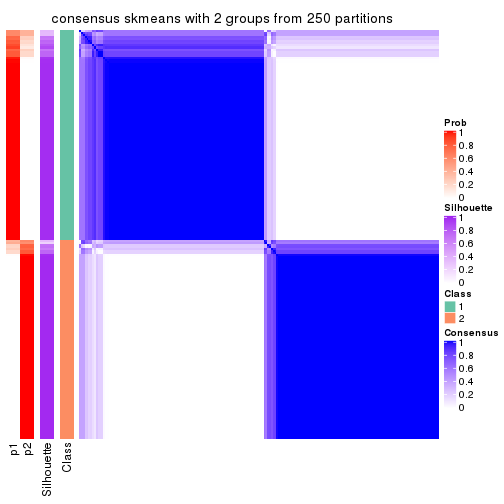</p>

</div>
<div id='tab-MAD-skmeans-consensus-heatmap-2'>
<pre><code class="r">consensus_heatmap(res, k = 3)
</code></pre>

<p>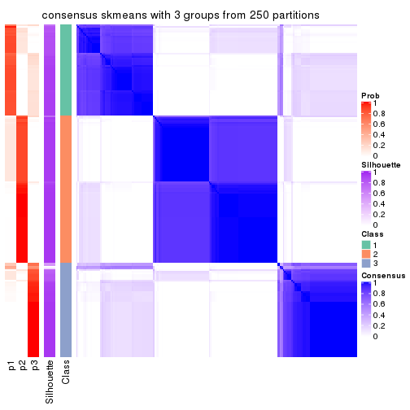</p>

</div>
<div id='tab-MAD-skmeans-consensus-heatmap-3'>
<pre><code class="r">consensus_heatmap(res, k = 4)
</code></pre>

<p>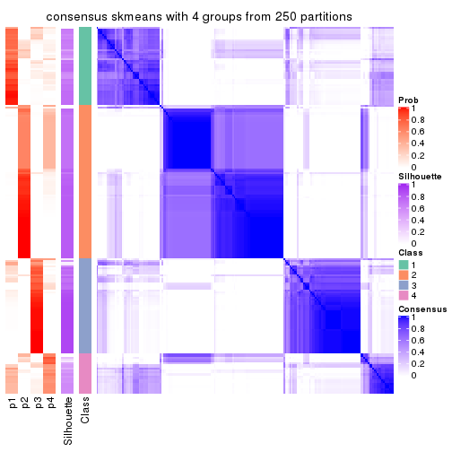</p>

</div>
<div id='tab-MAD-skmeans-consensus-heatmap-4'>
<pre><code class="r">consensus_heatmap(res, k = 5)
</code></pre>

<p>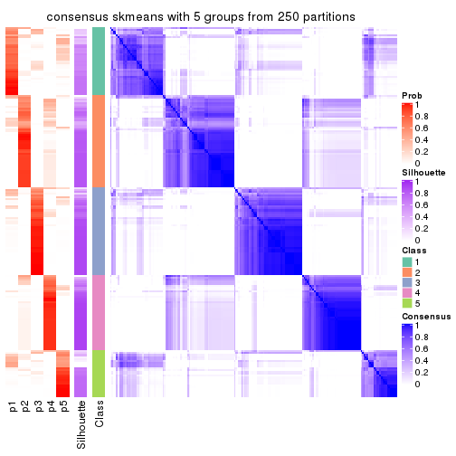</p>

</div>
<div id='tab-MAD-skmeans-consensus-heatmap-5'>
<pre><code class="r">consensus_heatmap(res, k = 6)
</code></pre>

<p>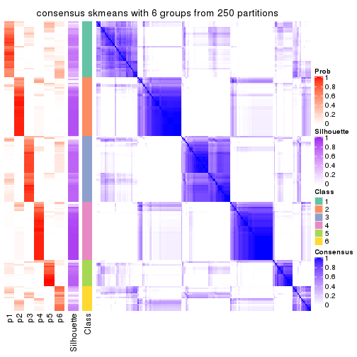</p>

</div>
</div>

Heatmaps for the membership of samples in all partitions to see how consistent they are:


<script>
$( function() {
	$( '#tabs-MAD-skmeans-membership-heatmap' ).tabs();
} );
</script>
<div id='tabs-MAD-skmeans-membership-heatmap'>
<ul>
<li><a href='#tab-MAD-skmeans-membership-heatmap-1'>k = 2</a></li>
<li><a href='#tab-MAD-skmeans-membership-heatmap-2'>k = 3</a></li>
<li><a href='#tab-MAD-skmeans-membership-heatmap-3'>k = 4</a></li>
<li><a href='#tab-MAD-skmeans-membership-heatmap-4'>k = 5</a></li>
<li><a href='#tab-MAD-skmeans-membership-heatmap-5'>k = 6</a></li>
</ul>
<div id='tab-MAD-skmeans-membership-heatmap-1'>
<pre><code class="r">membership_heatmap(res, k = 2)
</code></pre>

<p>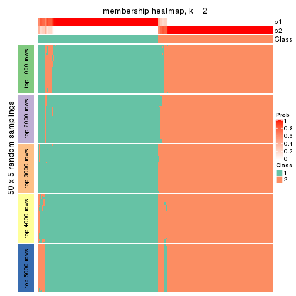</p>

</div>
<div id='tab-MAD-skmeans-membership-heatmap-2'>
<pre><code class="r">membership_heatmap(res, k = 3)
</code></pre>

<p>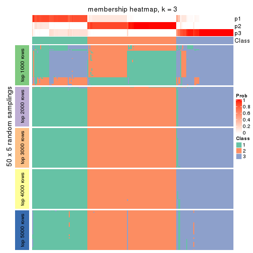</p>

</div>
<div id='tab-MAD-skmeans-membership-heatmap-3'>
<pre><code class="r">membership_heatmap(res, k = 4)
</code></pre>

<p>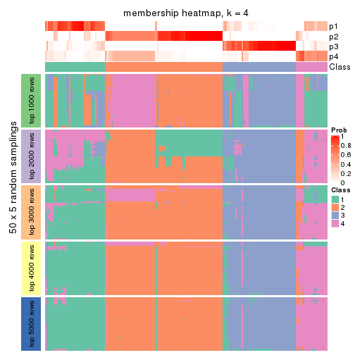</p>

</div>
<div id='tab-MAD-skmeans-membership-heatmap-4'>
<pre><code class="r">membership_heatmap(res, k = 5)
</code></pre>

<p>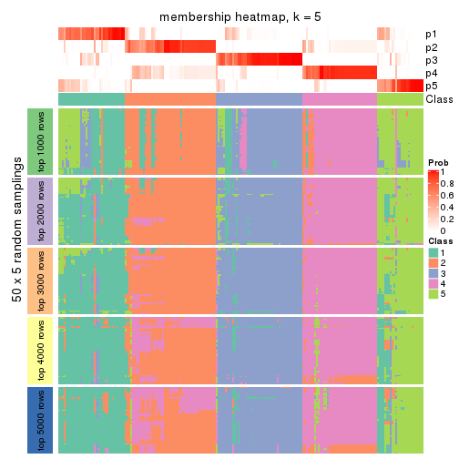</p>

</div>
<div id='tab-MAD-skmeans-membership-heatmap-5'>
<pre><code class="r">membership_heatmap(res, k = 6)
</code></pre>

<p>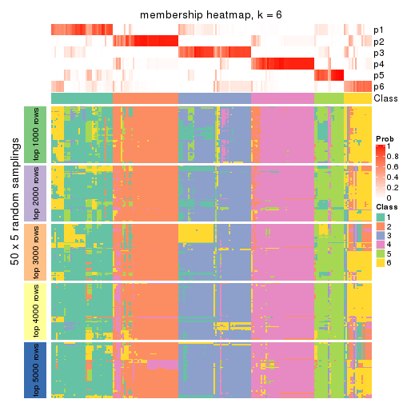</p>

</div>
</div>

As soon as we have had the classes for columns, we can look for signatures
which are significantly different between classes which can be candidate marks
for certain classes. Following are the heatmaps for signatures.


Signature heatmaps where rows are scaled:


<script>
$( function() {
	$( '#tabs-MAD-skmeans-get-signatures' ).tabs();
} );
</script>
<div id='tabs-MAD-skmeans-get-signatures'>
<ul>
<li><a href='#tab-MAD-skmeans-get-signatures-1'>k = 2</a></li>
<li><a href='#tab-MAD-skmeans-get-signatures-2'>k = 3</a></li>
<li><a href='#tab-MAD-skmeans-get-signatures-3'>k = 4</a></li>
<li><a href='#tab-MAD-skmeans-get-signatures-4'>k = 5</a></li>
<li><a href='#tab-MAD-skmeans-get-signatures-5'>k = 6</a></li>
</ul>
<div id='tab-MAD-skmeans-get-signatures-1'>
<pre><code class="r">get_signatures(res, k = 2)
</code></pre>

<p>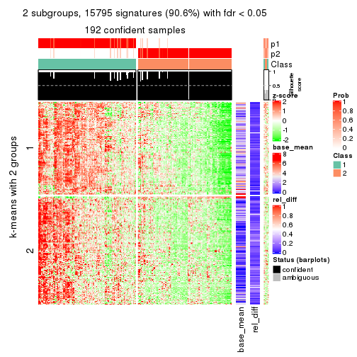</p>

</div>
<div id='tab-MAD-skmeans-get-signatures-2'>
<pre><code class="r">get_signatures(res, k = 3)
</code></pre>

<p>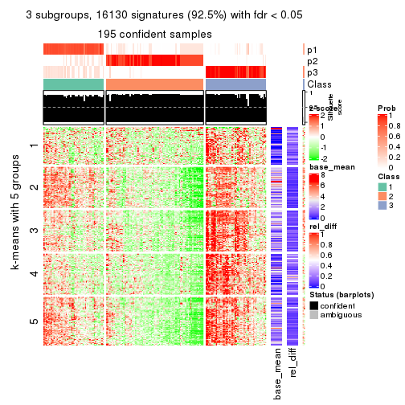</p>

</div>
<div id='tab-MAD-skmeans-get-signatures-3'>
<pre><code class="r">get_signatures(res, k = 4)
</code></pre>

<p>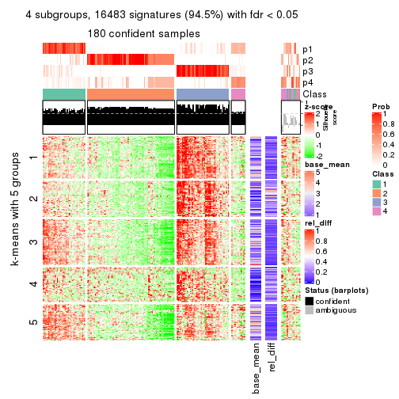</p>

</div>
<div id='tab-MAD-skmeans-get-signatures-4'>
<pre><code class="r">get_signatures(res, k = 5)
</code></pre>

<p>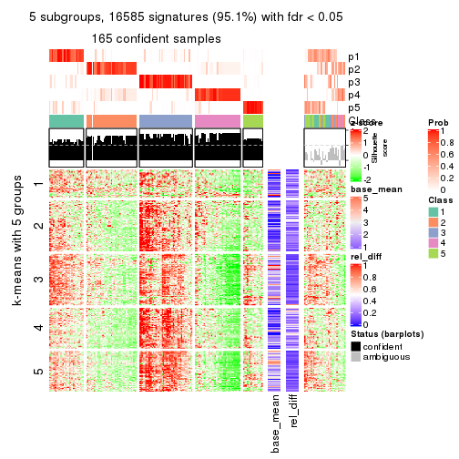</p>

</div>
<div id='tab-MAD-skmeans-get-signatures-5'>
<pre><code class="r">get_signatures(res, k = 6)
</code></pre>

<p>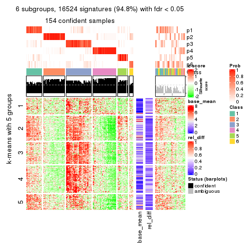</p>

</div>
</div>


Signature heatmaps where rows are not scaled:


<script>
$( function() {
	$( '#tabs-MAD-skmeans-get-signatures-no-scale' ).tabs();
} );
</script>
<div id='tabs-MAD-skmeans-get-signatures-no-scale'>
<ul>
<li><a href='#tab-MAD-skmeans-get-signatures-no-scale-1'>k = 2</a></li>
<li><a href='#tab-MAD-skmeans-get-signatures-no-scale-2'>k = 3</a></li>
<li><a href='#tab-MAD-skmeans-get-signatures-no-scale-3'>k = 4</a></li>
<li><a href='#tab-MAD-skmeans-get-signatures-no-scale-4'>k = 5</a></li>
<li><a href='#tab-MAD-skmeans-get-signatures-no-scale-5'>k = 6</a></li>
</ul>
<div id='tab-MAD-skmeans-get-signatures-no-scale-1'>
<pre><code class="r">get_signatures(res, k = 2, scale_rows = FALSE)
</code></pre>

<p>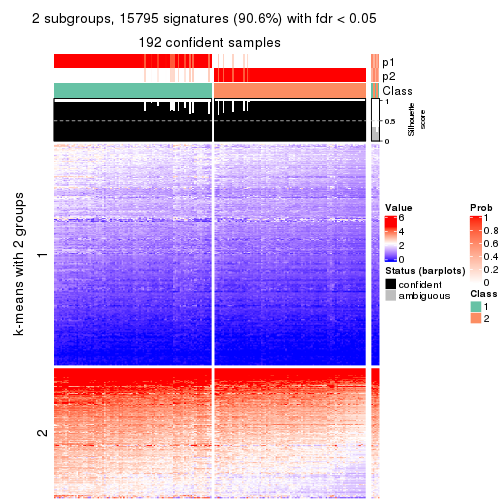</p>

</div>
<div id='tab-MAD-skmeans-get-signatures-no-scale-2'>
<pre><code class="r">get_signatures(res, k = 3, scale_rows = FALSE)
</code></pre>

<p>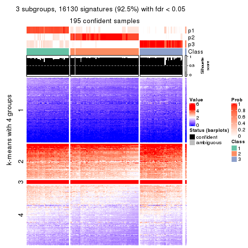</p>

</div>
<div id='tab-MAD-skmeans-get-signatures-no-scale-3'>
<pre><code class="r">get_signatures(res, k = 4, scale_rows = FALSE)
</code></pre>

<p>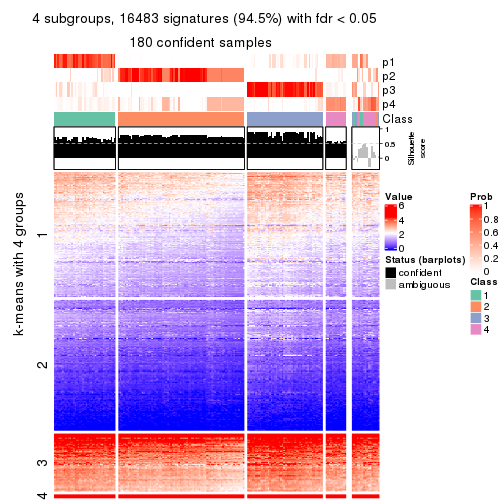</p>

</div>
<div id='tab-MAD-skmeans-get-signatures-no-scale-4'>
<pre><code class="r">get_signatures(res, k = 5, scale_rows = FALSE)
</code></pre>

<p>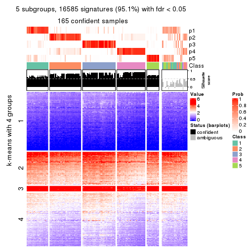</p>

</div>
<div id='tab-MAD-skmeans-get-signatures-no-scale-5'>
<pre><code class="r">get_signatures(res, k = 6, scale_rows = FALSE)
</code></pre>

<p>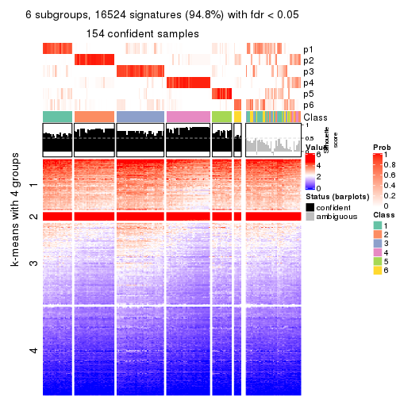</p>

</div>
</div>


Compare the overlap of signatures from different k:

```r
compare_signatures(res)
```

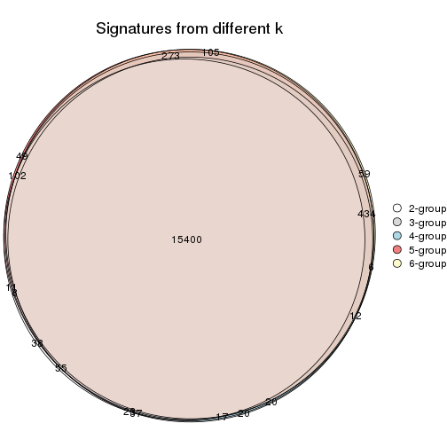

`get_signature()` returns a data frame invisibly. TO get the list of signatures, the function
call should be assigned to a variable explicitly. In following code, if `plot` argument is set
to `FALSE`, no heatmap is plotted while only the differential analysis is performed.

```r
# code only for demonstration
tb = get_signature(res, k = ..., plot = FALSE)
```

An example of the output of `tb` is:

```
#>   which_row         fdr    mean_1    mean_2 scaled_mean_1 scaled_mean_2 km
#> 1        38 0.042760348  8.373488  9.131774    -0.5533452     0.5164555  1
#> 2        40 0.018707592  7.106213  8.469186    -0.6173731     0.5762149  1
#> 3        55 0.019134737 10.221463 11.207825    -0.6159697     0.5749050  1
#> 4        59 0.006059896  5.921854  7.869574    -0.6899429     0.6439467  1
#> 5        60 0.018055526  8.928898 10.211722    -0.6204761     0.5791110  1
#> 6        98 0.009384629 15.714769 14.887706     0.6635654    -0.6193277  2
...
```

The columns in `tb` are:

1. `which_row`: row indices corresponding to the input matrix.
2. `fdr`: FDR for the differential test. 
3. `mean_x`: The mean value in group x.
4. `scaled_mean_x`: The mean value in group x after rows are scaled.
5. `km`: Row groups if k-means clustering is applied to rows.


UMAP plot which shows how samples are separated.


<script>
$( function() {
	$( '#tabs-MAD-skmeans-dimension-reduction' ).tabs();
} );
</script>
<div id='tabs-MAD-skmeans-dimension-reduction'>
<ul>
<li><a href='#tab-MAD-skmeans-dimension-reduction-1'>k = 2</a></li>
<li><a href='#tab-MAD-skmeans-dimension-reduction-2'>k = 3</a></li>
<li><a href='#tab-MAD-skmeans-dimension-reduction-3'>k = 4</a></li>
<li><a href='#tab-MAD-skmeans-dimension-reduction-4'>k = 5</a></li>
<li><a href='#tab-MAD-skmeans-dimension-reduction-5'>k = 6</a></li>
</ul>
<div id='tab-MAD-skmeans-dimension-reduction-1'>
<pre><code class="r">dimension_reduction(res, k = 2, method = &quot;UMAP&quot;)
</code></pre>

<p>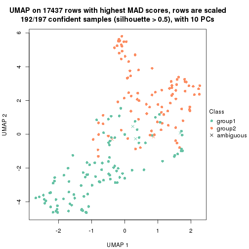</p>

</div>
<div id='tab-MAD-skmeans-dimension-reduction-2'>
<pre><code class="r">dimension_reduction(res, k = 3, method = &quot;UMAP&quot;)
</code></pre>

<p>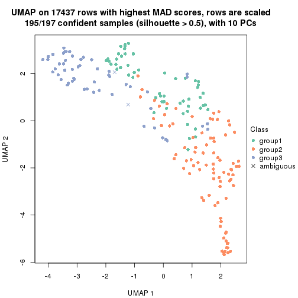</p>

</div>
<div id='tab-MAD-skmeans-dimension-reduction-3'>
<pre><code class="r">dimension_reduction(res, k = 4, method = &quot;UMAP&quot;)
</code></pre>

<p></p>

</div>
<div id='tab-MAD-skmeans-dimension-reduction-4'>
<pre><code class="r">dimension_reduction(res, k = 5, method = &quot;UMAP&quot;)
</code></pre>

<p>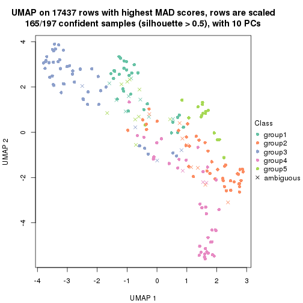</p>

</div>
<div id='tab-MAD-skmeans-dimension-reduction-5'>
<pre><code class="r">dimension_reduction(res, k = 6, method = &quot;UMAP&quot;)
</code></pre>

<p>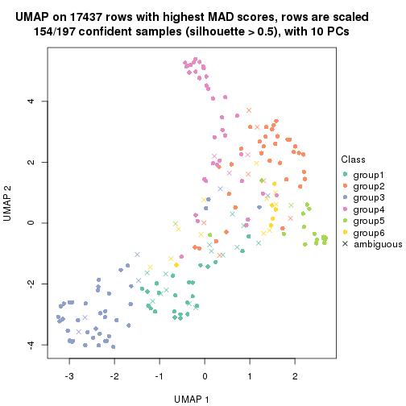</p>

</div>
</div>


Following heatmap shows how subgroups are split when increasing `k`:

```r
collect_classes(res)
```

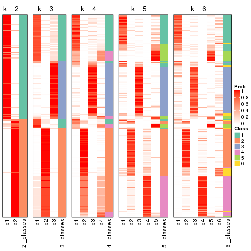


If matrix rows can be associated to genes, consider to use `GO_Enrichment(res,
...)` to perform function enrichment for the signature genes.


 

---------------------------------------------------


### MAD:pam


The object with results only for a single top-value method and a single partition method 
can be extracted as:

```r
res = res_list["MAD", "pam"]
# you can also extract it by
# res = res_list["MAD:pam"]
```

A summary of `res` and all the functions that can be applied to it:

```r
res
```

```
#> A 'ConsensusPartition' object with k = 2, 3, 4, 5, 6.
#>   On a matrix with 17437 rows and 197 columns.
#>   Top rows (1000, 2000, 3000, 4000, 5000) are extracted by 'MAD' method.
#>   Subgroups are detected by 'pam' method.
#>   Performed in total 1250 partitions by row resampling.
#>   Best k for subgroups seems to be 3.
#> 
#> Following methods can be applied to this 'ConsensusPartition' object:
#>  [1] "cola_report"             "collect_classes"         "collect_plots"          
#>  [4] "collect_stats"           "colnames"                "compare_signatures"     
#>  [7] "consensus_heatmap"       "dimension_reduction"     "functional_enrichment"  
#> [10] "get_anno_col"            "get_anno"                "get_classes"            
#> [13] "get_consensus"           "get_matrix"              "get_membership"         
#> [16] "get_param"               "get_signatures"          "get_stats"              
#> [19] "is_best_k"               "is_stable_k"             "membership_heatmap"     
#> [22] "ncol"                    "nrow"                    "plot_ecdf"              
#> [25] "rownames"                "select_partition_number" "show"                   
#> [28] "suggest_best_k"          "test_to_known_factors"
```

`collect_plots()` function collects all the plots made from `res` for all `k` (number of partitions)
into one single page to provide an easy and fast comparison between different `k`.

```r
collect_plots(res)
```

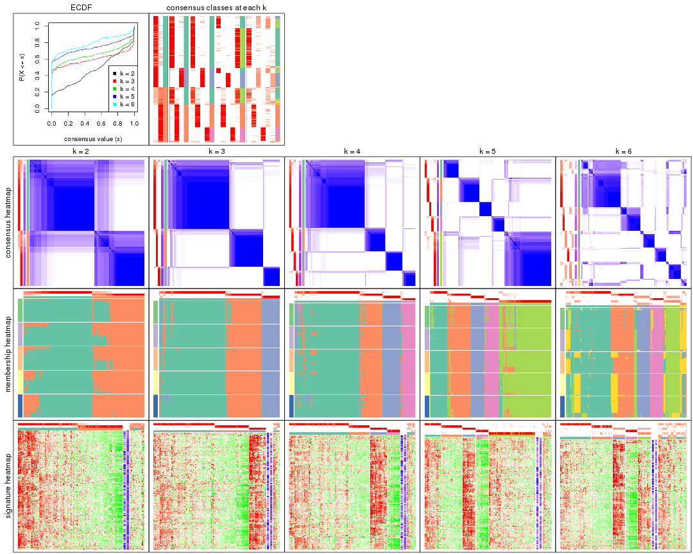

The plots are:

- The first row: a plot of the ECDF (Empirical cumulative distribution
  function) curves of the consensus matrix for each `k` and the heatmap of
  predicted classes for each `k`.
- The second row: heatmaps of the consensus matrix for each `k`.
- The third row: heatmaps of the membership matrix for each `k`.
- The fouth row: heatmaps of the signatures for each `k`.

All the plots in panels can be made by individual functions and they are
plotted later in this section.

`select_partition_number()` produces several plots showing different
statistics for choosing "optimized" `k`. There are following statistics:

- ECDF curves of the consensus matrix for each `k`;
- 1-PAC. [The PAC
  score](https://en.wikipedia.org/wiki/Consensus_clustering#Over-interpretation_potential_of_consensus_clustering)
  measures the proportion of the ambiguous subgrouping.
- Mean silhouette score.
- Concordance. The mean probability of fiting the consensus class ids in all
  partitions.
- Area increased. Denote $A_k$ as the area under the ECDF curve for current
  `k`, the area increased is defined as $A_k - A_{k-1}$.
- Rand index. The percent of pairs of samples that are both in a same cluster
  or both are not in a same cluster in the partition of k and k-1.
- Jaccard index. The ratio of pairs of samples are both in a same cluster in
  the partition of k and k-1 and the pairs of samples are both in a same
  cluster in the partition k or k-1.

The detailed explanations of these statistics can be found in [the cola
vignette](http://bioconductor.org/packages/devel/bioc/vignettes/cola/inst/doc/cola.html#toc_13).

Generally speaking, lower PAC score, higher mean silhouette score or higher
concordance corresponds to better partition. Rand index and Jaccard index
measure how similar the current partition is compared to partition with `k-1`.
If they are too similar, we won't accept `k` is better than `k-1`.

```r
select_partition_number(res)
```

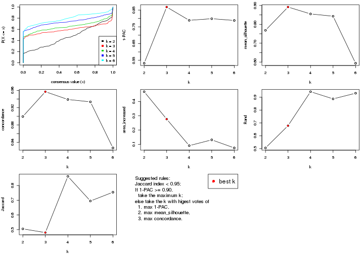

The numeric values for all these statistics can be obtained by `get_stats()`.

```r
get_stats(res)
```

```
#>   k 1-PAC mean_silhouette concordance area_increased  Rand Jaccard
#> 2 2 0.532           0.768       0.900         0.4688 0.506   0.506
#> 3 3 0.868           0.892       0.957         0.2766 0.678   0.480
#> 4 4 0.789           0.855       0.939         0.0907 0.943   0.862
#> 5 5 0.799           0.843       0.934         0.1313 0.887   0.695
#> 6 6 0.788           0.594       0.827         0.0747 0.931   0.755
```

`suggest_best_k()` suggests the best $k$ based on these statistics. The rules are as follows:

- All $k$ with Jaccard index larger than 0.95 are removed because the increase of
  the partition number does not provides enough extra information. If all $k$ are removed,
  the best $k$ is assigned by `NA`.
- For $k$ with 1-PAC larger than 0.9, the maximal $k$ is taken as the "best k". Other $k$ is called "optional k".
- If it does not fit the second rule. The $k$ with the highest vote of highest
  1-PAC, mean silhouette and concordance is taken as the "best k".

```r
suggest_best_k(res)
```

```
#> [1] 3
```


Following shows the table of the partitions (You need to click the **show/hide
code output** link to see it). The membership matrix (columns with name `p*`)
is inferred by
[`clue::cl_consensus()`](https://www.rdocumentation.org/link/cl_consensus?package=clue)
function with the `SE` method. Basically the value in the membership matrix
represents the probability to belong to a certain group. The finall class
label for an item is determined with the group with highest probability it
belongs to.

In `get_classes()` function, the entropy is calculated from the membership
matrix and the silhouette score is calculated from the consensus matrix.


<script>
$( function() {
	$( '#tabs-MAD-pam-get-classes' ).tabs();
} );
</script>
<div id='tabs-MAD-pam-get-classes'>
<ul>
<li><a href='#tab-MAD-pam-get-classes-1'>k = 2</a></li>
<li><a href='#tab-MAD-pam-get-classes-2'>k = 3</a></li>
<li><a href='#tab-MAD-pam-get-classes-3'>k = 4</a></li>
<li><a href='#tab-MAD-pam-get-classes-4'>k = 5</a></li>
<li><a href='#tab-MAD-pam-get-classes-5'>k = 6</a></li>
</ul>

<div id='tab-MAD-pam-get-classes-1'>
<p><a id='tab-MAD-pam-get-classes-1-a' style='color:#0366d6' href='#'>show/hide code output</a></p>
<pre><code class="r">cbind(get_classes(res, k = 2), get_membership(res, k = 2))
</code></pre>

<pre><code>#&gt;            class entropy silhouette    p1    p2
#&gt; SRR1380886     1  0.0000     0.8964 1.000 0.000
#&gt; SRR1074385     1  0.0000     0.8964 1.000 0.000
#&gt; SRR1374739     1  0.0000     0.8964 1.000 0.000
#&gt; SRR1097883     1  0.0000     0.8964 1.000 0.000
#&gt; SRR2167209     2  0.9922     0.2783 0.448 0.552
#&gt; SRR816541      2  0.0000     0.8507 0.000 1.000
#&gt; SRR663645      2  0.9833     0.2794 0.424 0.576
#&gt; SRR1381505     2  0.0000     0.8507 0.000 1.000
#&gt; SRR1416362     2  0.0000     0.8507 0.000 1.000
#&gt; SRR1318503     1  0.6973     0.7409 0.812 0.188
#&gt; SRR1341626     2  0.0000     0.8507 0.000 1.000
#&gt; SRR1382440     1  0.0000     0.8964 1.000 0.000
#&gt; SRR1088413     1  0.0000     0.8964 1.000 0.000
#&gt; SRR1082080     2  0.0000     0.8507 0.000 1.000
#&gt; SRR1455783     1  0.0000     0.8964 1.000 0.000
#&gt; SRR1447760     2  0.7674     0.7027 0.224 0.776
#&gt; SRR1487784     2  0.0000     0.8507 0.000 1.000
#&gt; SRR1331037     2  0.5629     0.7828 0.132 0.868
#&gt; SRR1095651     1  0.0376     0.8949 0.996 0.004
#&gt; SRR1078066     1  0.0000     0.8964 1.000 0.000
#&gt; SRR1120363     1  0.0000     0.8964 1.000 0.000
#&gt; SRR821231      1  0.0000     0.8964 1.000 0.000
#&gt; SRR1374373     1  0.9427     0.4307 0.640 0.360
#&gt; SRR1324519     2  0.0000     0.8507 0.000 1.000
#&gt; SRR1431121     1  0.0000     0.8964 1.000 0.000
#&gt; SRR1091032     2  0.0000     0.8507 0.000 1.000
#&gt; SRR1365575     2  0.0000     0.8507 0.000 1.000
#&gt; SRR1072972     1  0.0000     0.8964 1.000 0.000
#&gt; SRR1310690     2  0.0000     0.8507 0.000 1.000
#&gt; SRR1383037     1  0.0000     0.8964 1.000 0.000
#&gt; SRR1095479     1  0.0000     0.8964 1.000 0.000
#&gt; SRR1070403     1  0.0000     0.8964 1.000 0.000
#&gt; SRR1390203     1  0.0000     0.8964 1.000 0.000
#&gt; SRR1072007     2  0.9460     0.5026 0.364 0.636
#&gt; SRR1468787     1  0.8909     0.5474 0.692 0.308
#&gt; SRR1347959     2  0.0672     0.8481 0.008 0.992
#&gt; SRR1338513     1  0.6343     0.7704 0.840 0.160
#&gt; SRR812598      2  0.0000     0.8507 0.000 1.000
#&gt; SRR1446806     1  0.8813     0.5626 0.700 0.300
#&gt; SRR1394275     1  0.2778     0.8726 0.952 0.048
#&gt; SRR1443633     1  0.0000     0.8964 1.000 0.000
#&gt; SRR1087728     1  0.0000     0.8964 1.000 0.000
#&gt; SRR1098192     2  0.9427     0.5103 0.360 0.640
#&gt; SRR1093340     2  0.0000     0.8507 0.000 1.000
#&gt; SRR665405      2  0.9710     0.4210 0.400 0.600
#&gt; SRR657077      2  0.6531     0.7495 0.168 0.832
#&gt; SRR813208      1  0.0000     0.8964 1.000 0.000
#&gt; SRR1416074     2  0.0000     0.8507 0.000 1.000
#&gt; SRR1089688     2  0.8763     0.6123 0.296 0.704
#&gt; SRR1353461     1  0.0000     0.8964 1.000 0.000
#&gt; SRR1466321     1  0.6801     0.7495 0.820 0.180
#&gt; SRR1073021     1  0.6531     0.7641 0.832 0.168
#&gt; SRR1322816     2  0.0000     0.8507 0.000 1.000
#&gt; SRR1457727     1  0.0000     0.8964 1.000 0.000
#&gt; SRR1464226     2  0.9427     0.5103 0.360 0.640
#&gt; SRR1398863     1  0.0000     0.8964 1.000 0.000
#&gt; SRR1455631     2  0.9963     0.2217 0.464 0.536
#&gt; SRR1307808     2  0.9460     0.5026 0.364 0.636
#&gt; SRR1374585     2  0.0000     0.8507 0.000 1.000
#&gt; SRR1072104     2  0.9393     0.5174 0.356 0.644
#&gt; SRR1076868     2  0.0000     0.8507 0.000 1.000
#&gt; SRR1335984     1  0.9815     0.2496 0.580 0.420
#&gt; SRR1445939     1  0.5737     0.7987 0.864 0.136
#&gt; SRR1453047     2  0.0000     0.8507 0.000 1.000
#&gt; SRR1339788     1  0.0000     0.8964 1.000 0.000
#&gt; SRR1084323     1  0.0000     0.8964 1.000 0.000
#&gt; SRR1092937     1  0.2236     0.8794 0.964 0.036
#&gt; SRR1074090     2  0.0000     0.8507 0.000 1.000
#&gt; SRR1099833     1  0.0376     0.8949 0.996 0.004
#&gt; SRR1093434     1  0.0000     0.8964 1.000 0.000
#&gt; SRR1435857     1  0.1633     0.8859 0.976 0.024
#&gt; SRR1480347     2  0.0000     0.8507 0.000 1.000
#&gt; SRR1440787     2  0.0000     0.8507 0.000 1.000
#&gt; SRR1430202     1  0.8813     0.5626 0.700 0.300
#&gt; SRR1322730     2  0.0000     0.8507 0.000 1.000
#&gt; SRR811029      2  0.7815     0.6947 0.232 0.768
#&gt; SRR1390456     1  0.0000     0.8964 1.000 0.000
#&gt; SRR1381140     1  0.2778     0.8726 0.952 0.048
#&gt; SRR1388064     2  0.0000     0.8507 0.000 1.000
#&gt; SRR1093577     1  0.0000     0.8964 1.000 0.000
#&gt; SRR1414161     1  0.4022     0.8504 0.920 0.080
#&gt; SRR1328738     1  0.9170     0.4970 0.668 0.332
#&gt; SRR1311752     2  0.0000     0.8507 0.000 1.000
#&gt; SRR1445960     2  0.0376     0.8495 0.004 0.996
#&gt; SRR1403412     2  0.2236     0.8367 0.036 0.964
#&gt; SRR2166748     1  0.0000     0.8964 1.000 0.000
#&gt; SRR821666      2  0.0000     0.8507 0.000 1.000
#&gt; SRR1330746     1  0.0000     0.8964 1.000 0.000
#&gt; SRR1327872     2  0.0000     0.8507 0.000 1.000
#&gt; SRR1100800     1  0.0000     0.8964 1.000 0.000
#&gt; SRR1075174     1  0.0000     0.8964 1.000 0.000
#&gt; SRR1434436     1  0.6048     0.7883 0.852 0.148
#&gt; SRR1389409     2  0.0000     0.8507 0.000 1.000
#&gt; SRR1085310     1  0.0000     0.8964 1.000 0.000
#&gt; SRR1376718     2  0.0000     0.8507 0.000 1.000
#&gt; SRR808590      2  0.0000     0.8507 0.000 1.000
#&gt; SRR1084128     2  0.2043     0.8332 0.032 0.968
#&gt; SRR1361692     1  0.5408     0.8048 0.876 0.124
#&gt; SRR1431493     1  0.0000     0.8964 1.000 0.000
#&gt; SRR1409084     1  0.0000     0.8964 1.000 0.000
#&gt; SRR2166214     2  0.9580     0.4684 0.380 0.620
#&gt; SRR1324102     2  0.9358     0.5255 0.352 0.648
#&gt; SRR1079754     2  0.0000     0.8507 0.000 1.000
#&gt; SRR1442127     1  0.0000     0.8964 1.000 0.000
#&gt; SRR1076244     2  0.5946     0.7736 0.144 0.856
#&gt; SRR1330901     2  0.9732     0.4144 0.404 0.596
#&gt; SRR1073167     2  0.0000     0.8507 0.000 1.000
#&gt; SRR1357541     1  0.0000     0.8964 1.000 0.000
#&gt; SRR811607      1  0.9170     0.4968 0.668 0.332
#&gt; SRR1468931     1  0.0000     0.8964 1.000 0.000
#&gt; SRR1474908     2  0.6887     0.7416 0.184 0.816
#&gt; SRR1309875     2  0.0000     0.8507 0.000 1.000
#&gt; SRR598792      1  0.0000     0.8964 1.000 0.000
#&gt; SRR1088537     2  0.4431     0.8054 0.092 0.908
#&gt; SRR1457682     1  0.0376     0.8949 0.996 0.004
#&gt; SRR1454289     1  0.9608     0.3567 0.616 0.384
#&gt; SRR1069352     1  0.0000     0.8964 1.000 0.000
#&gt; SRR1472728     2  0.0000     0.8507 0.000 1.000
#&gt; SRR1091144     2  0.9522     0.4858 0.372 0.628
#&gt; SRR1319118     1  0.0000     0.8964 1.000 0.000
#&gt; SRR1403611     1  0.2043     0.8815 0.968 0.032
#&gt; SRR1397762     1  0.0000     0.8964 1.000 0.000
#&gt; SRR1317387     1  0.0000     0.8964 1.000 0.000
#&gt; SRR1376426     2  0.0000     0.8507 0.000 1.000
#&gt; SRR1097777     1  0.0000     0.8964 1.000 0.000
#&gt; SRR1365743     1  0.0000     0.8964 1.000 0.000
#&gt; SRR1458992     2  0.0672     0.8482 0.008 0.992
#&gt; SRR1089537     1  0.3431     0.8623 0.936 0.064
#&gt; SRR1397744     1  0.0000     0.8964 1.000 0.000
#&gt; SRR1453893     2  0.0000     0.8507 0.000 1.000
#&gt; SRR1098543     1  0.0000     0.8964 1.000 0.000
#&gt; SRR1321765     1  0.2948     0.8702 0.948 0.052
#&gt; SRR1440032     1  0.3114     0.8677 0.944 0.056
#&gt; SRR1404507     2  0.0000     0.8507 0.000 1.000
#&gt; SRR1404856     1  0.9933     0.1253 0.548 0.452
#&gt; SRR812745      1  0.4022     0.8505 0.920 0.080
#&gt; SRR1417524     1  0.0000     0.8964 1.000 0.000
#&gt; SRR1407334     2  0.0000     0.8507 0.000 1.000
#&gt; SRR1453991     1  0.0000     0.8964 1.000 0.000
#&gt; SRR1415938     1  0.0000     0.8964 1.000 0.000
#&gt; SRR1081259     1  0.8813     0.5626 0.700 0.300
#&gt; SRR1436187     2  0.0000     0.8507 0.000 1.000
#&gt; SRR1431948     1  0.0000     0.8964 1.000 0.000
#&gt; SRR1453277     1  0.9248     0.4791 0.660 0.340
#&gt; SRR1095407     1  0.9922     0.1339 0.552 0.448
#&gt; SRR1359694     2  0.9732     0.3964 0.404 0.596
#&gt; SRR656982      1  0.9286     0.4696 0.656 0.344
#&gt; SRR1354338     2  0.9358     0.5260 0.352 0.648
#&gt; SRR1088291     1  0.8144     0.6485 0.748 0.252
#&gt; SRR1080624     1  0.2603     0.8749 0.956 0.044
#&gt; SRR2166708     1  0.0000     0.8964 1.000 0.000
#&gt; SRR1393572     1  0.2778     0.8726 0.952 0.048
#&gt; SRR1429912     2  0.0000     0.8507 0.000 1.000
#&gt; SRR1421048     2  0.9754     0.3999 0.408 0.592
#&gt; SRR1434999     1  0.0000     0.8964 1.000 0.000
#&gt; SRR656457      1  0.0000     0.8964 1.000 0.000
#&gt; SRR1098928     1  0.0000     0.8964 1.000 0.000
#&gt; SRR1343967     2  0.0000     0.8507 0.000 1.000
#&gt; SRR1360766     1  0.8661     0.5833 0.712 0.288
#&gt; SRR1464724     2  0.5294     0.7906 0.120 0.880
#&gt; SRR1101542     2  0.0000     0.8507 0.000 1.000
#&gt; SRR1401528     1  0.0000     0.8964 1.000 0.000
#&gt; SRR1071519     1  0.0000     0.8964 1.000 0.000
#&gt; SRR1086070     1  0.0000     0.8964 1.000 0.000
#&gt; SRR1358645     2  0.9754     0.4003 0.408 0.592
#&gt; SRR819771      1  0.0000     0.8964 1.000 0.000
#&gt; SRR1418433     2  0.9000     0.5833 0.316 0.684
#&gt; SRR821050      1  0.0938     0.8914 0.988 0.012
#&gt; SRR1402091     2  0.0376     0.8495 0.004 0.996
#&gt; SRR1322028     2  0.0376     0.8495 0.004 0.996
#&gt; SRR1452556     2  0.0000     0.8507 0.000 1.000
#&gt; SRR1340047     1  0.9970     0.0557 0.532 0.468
#&gt; SRR1418302     2  0.6531     0.7574 0.168 0.832
#&gt; SRR1073991     1  0.0000     0.8964 1.000 0.000
#&gt; SRR1085187     2  0.6801     0.7427 0.180 0.820
#&gt; SRR1357618     1  0.0000     0.8964 1.000 0.000
#&gt; SRR1487764     1  0.9732     0.3002 0.596 0.404
#&gt; SRR1075336     1  0.0376     0.8950 0.996 0.004
#&gt; SRR1365471     2  0.0000     0.8507 0.000 1.000
#&gt; SRR1414613     2  0.0000     0.8507 0.000 1.000
#&gt; SRR658719      2  0.9393     0.4696 0.356 0.644
#&gt; SRR1475128     1  0.0000     0.8964 1.000 0.000
#&gt; SRR1367630     2  0.6801     0.7416 0.180 0.820
#&gt; SRR1481146     2  0.9393     0.5174 0.356 0.644
#&gt; SRR1465674     1  0.6973     0.7394 0.812 0.188
#&gt; SRR1327303     1  0.9896     0.1688 0.560 0.440
#&gt; SRR1390391     1  0.8813     0.5626 0.700 0.300
#&gt; SRR1326020     2  0.9977     0.1889 0.472 0.528
#&gt; SRR1381953     1  0.8081     0.6431 0.752 0.248
#&gt; SRR1082544     2  0.0000     0.8507 0.000 1.000
#&gt; SRR810761      1  0.0000     0.8964 1.000 0.000
#&gt; SRR1070764     1  0.0000     0.8964 1.000 0.000
#&gt; SRR1415919     1  0.0000     0.8964 1.000 0.000
#&gt; SRR1490404     2  0.0000     0.8507 0.000 1.000
#&gt; SRR1416773     1  0.6438     0.7662 0.836 0.164
#&gt; SRR1377492     2  0.8327     0.6546 0.264 0.736
#&gt; SRR1334314     1  0.3584     0.8595 0.932 0.068
</code></pre>

<script>
$('#tab-MAD-pam-get-classes-1-a').parent().next().next().hide();
$('#tab-MAD-pam-get-classes-1-a').click(function(){
  $('#tab-MAD-pam-get-classes-1-a').parent().next().next().toggle();
  return(false);
});
</script>
</div>

<div id='tab-MAD-pam-get-classes-2'>
<p><a id='tab-MAD-pam-get-classes-2-a' style='color:#0366d6' href='#'>show/hide code output</a></p>
<pre><code class="r">cbind(get_classes(res, k = 3), get_membership(res, k = 3))
</code></pre>

<pre><code>#&gt;            class entropy silhouette    p1    p2    p3
#&gt; SRR1380886     3  0.1860     0.9107 0.052 0.000 0.948
#&gt; SRR1074385     1  0.0000     0.9430 1.000 0.000 0.000
#&gt; SRR1374739     3  0.0000     0.9666 0.000 0.000 1.000
#&gt; SRR1097883     1  0.0000     0.9430 1.000 0.000 0.000
#&gt; SRR2167209     1  0.0000     0.9430 1.000 0.000 0.000
#&gt; SRR816541      2  0.0000     0.9507 0.000 1.000 0.000
#&gt; SRR663645      1  0.4504     0.7494 0.804 0.196 0.000
#&gt; SRR1381505     2  0.0000     0.9507 0.000 1.000 0.000
#&gt; SRR1416362     2  0.0000     0.9507 0.000 1.000 0.000
#&gt; SRR1318503     1  0.0000     0.9430 1.000 0.000 0.000
#&gt; SRR1341626     2  0.0000     0.9507 0.000 1.000 0.000
#&gt; SRR1382440     3  0.0000     0.9666 0.000 0.000 1.000
#&gt; SRR1088413     1  0.0000     0.9430 1.000 0.000 0.000
#&gt; SRR1082080     2  0.0000     0.9507 0.000 1.000 0.000
#&gt; SRR1455783     1  0.0000     0.9430 1.000 0.000 0.000
#&gt; SRR1447760     1  0.6095     0.3372 0.608 0.392 0.000
#&gt; SRR1487784     2  0.0000     0.9507 0.000 1.000 0.000
#&gt; SRR1331037     2  0.3879     0.7911 0.152 0.848 0.000
#&gt; SRR1095651     1  0.0424     0.9384 0.992 0.000 0.008
#&gt; SRR1078066     1  0.3752     0.8105 0.856 0.000 0.144
#&gt; SRR1120363     1  0.0000     0.9430 1.000 0.000 0.000
#&gt; SRR821231      3  0.0000     0.9666 0.000 0.000 1.000
#&gt; SRR1374373     1  0.0000     0.9430 1.000 0.000 0.000
#&gt; SRR1324519     2  0.0000     0.9507 0.000 1.000 0.000
#&gt; SRR1431121     1  0.1964     0.9027 0.944 0.000 0.056
#&gt; SRR1091032     2  0.0000     0.9507 0.000 1.000 0.000
#&gt; SRR1365575     2  0.0000     0.9507 0.000 1.000 0.000
#&gt; SRR1072972     1  0.5591     0.5772 0.696 0.000 0.304
#&gt; SRR1310690     2  0.0000     0.9507 0.000 1.000 0.000
#&gt; SRR1383037     3  0.0000     0.9666 0.000 0.000 1.000
#&gt; SRR1095479     3  0.5905     0.4441 0.352 0.000 0.648
#&gt; SRR1070403     3  0.0000     0.9666 0.000 0.000 1.000
#&gt; SRR1390203     1  0.0000     0.9430 1.000 0.000 0.000
#&gt; SRR1072007     1  0.0000     0.9430 1.000 0.000 0.000
#&gt; SRR1468787     1  0.0000     0.9430 1.000 0.000 0.000
#&gt; SRR1347959     2  0.5254     0.6096 0.264 0.736 0.000
#&gt; SRR1338513     1  0.0000     0.9430 1.000 0.000 0.000
#&gt; SRR812598      2  0.0000     0.9507 0.000 1.000 0.000
#&gt; SRR1446806     1  0.0000     0.9430 1.000 0.000 0.000
#&gt; SRR1394275     1  0.0000     0.9430 1.000 0.000 0.000
#&gt; SRR1443633     1  0.6307     0.0863 0.512 0.000 0.488
#&gt; SRR1087728     3  0.0000     0.9666 0.000 0.000 1.000
#&gt; SRR1098192     1  0.0747     0.9330 0.984 0.016 0.000
#&gt; SRR1093340     2  0.0000     0.9507 0.000 1.000 0.000
#&gt; SRR665405      1  0.0000     0.9430 1.000 0.000 0.000
#&gt; SRR657077      1  0.6180     0.3261 0.584 0.416 0.000
#&gt; SRR813208      3  0.0000     0.9666 0.000 0.000 1.000
#&gt; SRR1416074     2  0.0000     0.9507 0.000 1.000 0.000
#&gt; SRR1089688     2  0.6260     0.2232 0.448 0.552 0.000
#&gt; SRR1353461     3  0.0000     0.9666 0.000 0.000 1.000
#&gt; SRR1466321     1  0.0000     0.9430 1.000 0.000 0.000
#&gt; SRR1073021     1  0.0000     0.9430 1.000 0.000 0.000
#&gt; SRR1322816     2  0.0000     0.9507 0.000 1.000 0.000
#&gt; SRR1457727     1  0.1964     0.9027 0.944 0.000 0.056
#&gt; SRR1464226     1  0.0747     0.9330 0.984 0.016 0.000
#&gt; SRR1398863     1  0.0000     0.9430 1.000 0.000 0.000
#&gt; SRR1455631     1  0.0424     0.9386 0.992 0.008 0.000
#&gt; SRR1307808     1  0.0000     0.9430 1.000 0.000 0.000
#&gt; SRR1374585     2  0.0000     0.9507 0.000 1.000 0.000
#&gt; SRR1072104     1  0.0892     0.9304 0.980 0.020 0.000
#&gt; SRR1076868     2  0.0000     0.9507 0.000 1.000 0.000
#&gt; SRR1335984     1  0.0000     0.9430 1.000 0.000 0.000
#&gt; SRR1445939     1  0.0000     0.9430 1.000 0.000 0.000
#&gt; SRR1453047     2  0.0000     0.9507 0.000 1.000 0.000
#&gt; SRR1339788     3  0.0000     0.9666 0.000 0.000 1.000
#&gt; SRR1084323     1  0.0000     0.9430 1.000 0.000 0.000
#&gt; SRR1092937     1  0.0000     0.9430 1.000 0.000 0.000
#&gt; SRR1074090     2  0.0000     0.9507 0.000 1.000 0.000
#&gt; SRR1099833     1  0.0000     0.9430 1.000 0.000 0.000
#&gt; SRR1093434     3  0.0000     0.9666 0.000 0.000 1.000
#&gt; SRR1435857     1  0.0000     0.9430 1.000 0.000 0.000
#&gt; SRR1480347     2  0.0000     0.9507 0.000 1.000 0.000
#&gt; SRR1440787     2  0.0000     0.9507 0.000 1.000 0.000
#&gt; SRR1430202     1  0.0000     0.9430 1.000 0.000 0.000
#&gt; SRR1322730     2  0.0000     0.9507 0.000 1.000 0.000
#&gt; SRR811029      1  0.4605     0.7405 0.796 0.204 0.000
#&gt; SRR1390456     3  0.0000     0.9666 0.000 0.000 1.000
#&gt; SRR1381140     1  0.0000     0.9430 1.000 0.000 0.000
#&gt; SRR1388064     2  0.0000     0.9507 0.000 1.000 0.000
#&gt; SRR1093577     1  0.0000     0.9430 1.000 0.000 0.000
#&gt; SRR1414161     1  0.0000     0.9430 1.000 0.000 0.000
#&gt; SRR1328738     1  0.0000     0.9430 1.000 0.000 0.000
#&gt; SRR1311752     2  0.0000     0.9507 0.000 1.000 0.000
#&gt; SRR1445960     2  0.0747     0.9363 0.016 0.984 0.000
#&gt; SRR1403412     2  0.1964     0.8994 0.056 0.944 0.000
#&gt; SRR2166748     1  0.1964     0.9027 0.944 0.000 0.056
#&gt; SRR821666      2  0.0000     0.9507 0.000 1.000 0.000
#&gt; SRR1330746     3  0.0000     0.9666 0.000 0.000 1.000
#&gt; SRR1327872     2  0.0000     0.9507 0.000 1.000 0.000
#&gt; SRR1100800     1  0.0000     0.9430 1.000 0.000 0.000
#&gt; SRR1075174     1  0.0000     0.9430 1.000 0.000 0.000
#&gt; SRR1434436     1  0.0000     0.9430 1.000 0.000 0.000
#&gt; SRR1389409     2  0.0000     0.9507 0.000 1.000 0.000
#&gt; SRR1085310     1  0.0000     0.9430 1.000 0.000 0.000
#&gt; SRR1376718     2  0.0000     0.9507 0.000 1.000 0.000
#&gt; SRR808590      2  0.0000     0.9507 0.000 1.000 0.000
#&gt; SRR1084128     2  0.4399     0.7244 0.188 0.812 0.000
#&gt; SRR1361692     1  0.0000     0.9430 1.000 0.000 0.000
#&gt; SRR1431493     1  0.6267     0.1657 0.548 0.000 0.452
#&gt; SRR1409084     1  0.0000     0.9430 1.000 0.000 0.000
#&gt; SRR2166214     1  0.0000     0.9430 1.000 0.000 0.000
#&gt; SRR1324102     1  0.1411     0.9185 0.964 0.036 0.000
#&gt; SRR1079754     2  0.0000     0.9507 0.000 1.000 0.000
#&gt; SRR1442127     3  0.0000     0.9666 0.000 0.000 1.000
#&gt; SRR1076244     2  0.3752     0.7986 0.144 0.856 0.000
#&gt; SRR1330901     1  0.0000     0.9430 1.000 0.000 0.000
#&gt; SRR1073167     2  0.0000     0.9507 0.000 1.000 0.000
#&gt; SRR1357541     1  0.1753     0.9099 0.952 0.000 0.048
#&gt; SRR811607      1  0.0000     0.9430 1.000 0.000 0.000
#&gt; SRR1468931     3  0.0000     0.9666 0.000 0.000 1.000
#&gt; SRR1474908     2  0.3686     0.8063 0.140 0.860 0.000
#&gt; SRR1309875     2  0.0000     0.9507 0.000 1.000 0.000
#&gt; SRR598792      3  0.0000     0.9666 0.000 0.000 1.000
#&gt; SRR1088537     1  0.6215     0.2919 0.572 0.428 0.000
#&gt; SRR1457682     1  0.0000     0.9430 1.000 0.000 0.000
#&gt; SRR1454289     1  0.0000     0.9430 1.000 0.000 0.000
#&gt; SRR1069352     3  0.0000     0.9666 0.000 0.000 1.000
#&gt; SRR1472728     2  0.0000     0.9507 0.000 1.000 0.000
#&gt; SRR1091144     1  0.0747     0.9330 0.984 0.016 0.000
#&gt; SRR1319118     1  0.1411     0.9191 0.964 0.000 0.036
#&gt; SRR1403611     1  0.0000     0.9430 1.000 0.000 0.000
#&gt; SRR1397762     1  0.0000     0.9430 1.000 0.000 0.000
#&gt; SRR1317387     1  0.1964     0.9027 0.944 0.000 0.056
#&gt; SRR1376426     2  0.0000     0.9507 0.000 1.000 0.000
#&gt; SRR1097777     1  0.0000     0.9430 1.000 0.000 0.000
#&gt; SRR1365743     1  0.1964     0.9027 0.944 0.000 0.056
#&gt; SRR1458992     2  0.0892     0.9330 0.020 0.980 0.000
#&gt; SRR1089537     1  0.0000     0.9430 1.000 0.000 0.000
#&gt; SRR1397744     1  0.1860     0.9058 0.948 0.000 0.052
#&gt; SRR1453893     2  0.0000     0.9507 0.000 1.000 0.000
#&gt; SRR1098543     1  0.0000     0.9430 1.000 0.000 0.000
#&gt; SRR1321765     1  0.0000     0.9430 1.000 0.000 0.000
#&gt; SRR1440032     1  0.0000     0.9430 1.000 0.000 0.000
#&gt; SRR1404507     2  0.0000     0.9507 0.000 1.000 0.000
#&gt; SRR1404856     1  0.0000     0.9430 1.000 0.000 0.000
#&gt; SRR812745      1  0.0000     0.9430 1.000 0.000 0.000
#&gt; SRR1417524     1  0.5968     0.4368 0.636 0.000 0.364
#&gt; SRR1407334     2  0.0000     0.9507 0.000 1.000 0.000
#&gt; SRR1453991     1  0.0000     0.9430 1.000 0.000 0.000
#&gt; SRR1415938     1  0.1964     0.9027 0.944 0.000 0.056
#&gt; SRR1081259     1  0.0000     0.9430 1.000 0.000 0.000
#&gt; SRR1436187     2  0.0000     0.9507 0.000 1.000 0.000
#&gt; SRR1431948     3  0.0000     0.9666 0.000 0.000 1.000
#&gt; SRR1453277     1  0.0000     0.9430 1.000 0.000 0.000
#&gt; SRR1095407     1  0.0000     0.9430 1.000 0.000 0.000
#&gt; SRR1359694     1  0.2537     0.8781 0.920 0.080 0.000
#&gt; SRR656982      1  0.0000     0.9430 1.000 0.000 0.000
#&gt; SRR1354338     1  0.0747     0.9329 0.984 0.016 0.000
#&gt; SRR1088291     1  0.0000     0.9430 1.000 0.000 0.000
#&gt; SRR1080624     1  0.0000     0.9430 1.000 0.000 0.000
#&gt; SRR2166708     3  0.0000     0.9666 0.000 0.000 1.000
#&gt; SRR1393572     1  0.0000     0.9430 1.000 0.000 0.000
#&gt; SRR1429912     2  0.0000     0.9507 0.000 1.000 0.000
#&gt; SRR1421048     1  0.0592     0.9360 0.988 0.012 0.000
#&gt; SRR1434999     3  0.5859     0.4500 0.344 0.000 0.656
#&gt; SRR656457      3  0.0000     0.9666 0.000 0.000 1.000
#&gt; SRR1098928     3  0.0000     0.9666 0.000 0.000 1.000
#&gt; SRR1343967     2  0.0000     0.9507 0.000 1.000 0.000
#&gt; SRR1360766     1  0.0000     0.9430 1.000 0.000 0.000
#&gt; SRR1464724     2  0.3340     0.8277 0.120 0.880 0.000
#&gt; SRR1101542     2  0.0000     0.9507 0.000 1.000 0.000
#&gt; SRR1401528     1  0.0000     0.9430 1.000 0.000 0.000
#&gt; SRR1071519     3  0.0000     0.9666 0.000 0.000 1.000
#&gt; SRR1086070     1  0.0000     0.9430 1.000 0.000 0.000
#&gt; SRR1358645     1  0.0237     0.9407 0.996 0.004 0.000
#&gt; SRR819771      3  0.0000     0.9666 0.000 0.000 1.000
#&gt; SRR1418433     1  0.6309    -0.0358 0.504 0.496 0.000
#&gt; SRR821050      1  0.0000     0.9430 1.000 0.000 0.000
#&gt; SRR1402091     2  0.0237     0.9474 0.004 0.996 0.000
#&gt; SRR1322028     2  0.0237     0.9474 0.004 0.996 0.000
#&gt; SRR1452556     2  0.0000     0.9507 0.000 1.000 0.000
#&gt; SRR1340047     1  0.0000     0.9430 1.000 0.000 0.000
#&gt; SRR1418302     1  0.5706     0.5401 0.680 0.320 0.000
#&gt; SRR1073991     3  0.1163     0.9385 0.028 0.000 0.972
#&gt; SRR1085187     2  0.4504     0.7274 0.196 0.804 0.000
#&gt; SRR1357618     3  0.0000     0.9666 0.000 0.000 1.000
#&gt; SRR1487764     1  0.0000     0.9430 1.000 0.000 0.000
#&gt; SRR1075336     1  0.0000     0.9430 1.000 0.000 0.000
#&gt; SRR1365471     2  0.0000     0.9507 0.000 1.000 0.000
#&gt; SRR1414613     2  0.0000     0.9507 0.000 1.000 0.000
#&gt; SRR658719      1  0.4504     0.7488 0.804 0.196 0.000
#&gt; SRR1475128     3  0.0000     0.9666 0.000 0.000 1.000
#&gt; SRR1367630     1  0.4796     0.7214 0.780 0.220 0.000
#&gt; SRR1481146     1  0.1163     0.9250 0.972 0.028 0.000
#&gt; SRR1465674     1  0.0000     0.9430 1.000 0.000 0.000
#&gt; SRR1327303     1  0.0000     0.9430 1.000 0.000 0.000
#&gt; SRR1390391     1  0.0000     0.9430 1.000 0.000 0.000
#&gt; SRR1326020     1  0.0000     0.9430 1.000 0.000 0.000
#&gt; SRR1381953     1  0.0000     0.9430 1.000 0.000 0.000
#&gt; SRR1082544     2  0.0000     0.9507 0.000 1.000 0.000
#&gt; SRR810761      1  0.4702     0.7306 0.788 0.000 0.212
#&gt; SRR1070764     3  0.0000     0.9666 0.000 0.000 1.000
#&gt; SRR1415919     3  0.0000     0.9666 0.000 0.000 1.000
#&gt; SRR1490404     2  0.0000     0.9507 0.000 1.000 0.000
#&gt; SRR1416773     1  0.0000     0.9430 1.000 0.000 0.000
#&gt; SRR1377492     2  0.6045     0.4160 0.380 0.620 0.000
#&gt; SRR1334314     1  0.0000     0.9430 1.000 0.000 0.000
</code></pre>

<script>
$('#tab-MAD-pam-get-classes-2-a').parent().next().next().hide();
$('#tab-MAD-pam-get-classes-2-a').click(function(){
  $('#tab-MAD-pam-get-classes-2-a').parent().next().next().toggle();
  return(false);
});
</script>
</div>

<div id='tab-MAD-pam-get-classes-3'>
<p><a id='tab-MAD-pam-get-classes-3-a' style='color:#0366d6' href='#'>show/hide code output</a></p>
<pre><code class="r">cbind(get_classes(res, k = 4), get_membership(res, k = 4))
</code></pre>

<pre><code>#&gt;            class entropy silhouette    p1    p2    p3    p4
#&gt; SRR1380886     3  0.1474     0.8853 0.052 0.000 0.948 0.000
#&gt; SRR1074385     1  0.0000     0.9258 1.000 0.000 0.000 0.000
#&gt; SRR1374739     3  0.0000     0.9577 0.000 0.000 1.000 0.000
#&gt; SRR1097883     1  0.0000     0.9258 1.000 0.000 0.000 0.000
#&gt; SRR2167209     1  0.0000     0.9258 1.000 0.000 0.000 0.000
#&gt; SRR816541      2  0.0000     0.9140 0.000 1.000 0.000 0.000
#&gt; SRR663645      1  0.5247     0.7171 0.752 0.148 0.000 0.100
#&gt; SRR1381505     4  0.0000     0.9157 0.000 0.000 0.000 1.000
#&gt; SRR1416362     2  0.0000     0.9140 0.000 1.000 0.000 0.000
#&gt; SRR1318503     1  0.2408     0.8585 0.896 0.104 0.000 0.000
#&gt; SRR1341626     2  0.0000     0.9140 0.000 1.000 0.000 0.000
#&gt; SRR1382440     3  0.0000     0.9577 0.000 0.000 1.000 0.000
#&gt; SRR1088413     1  0.0000     0.9258 1.000 0.000 0.000 0.000
#&gt; SRR1082080     2  0.0000     0.9140 0.000 1.000 0.000 0.000
#&gt; SRR1455783     1  0.0000     0.9258 1.000 0.000 0.000 0.000
#&gt; SRR1447760     1  0.4564     0.4892 0.672 0.328 0.000 0.000
#&gt; SRR1487784     2  0.0000     0.9140 0.000 1.000 0.000 0.000
#&gt; SRR1331037     2  0.4193     0.5689 0.268 0.732 0.000 0.000
#&gt; SRR1095651     1  0.0336     0.9220 0.992 0.000 0.008 0.000
#&gt; SRR1078066     1  0.2973     0.8142 0.856 0.000 0.144 0.000
#&gt; SRR1120363     1  0.0000     0.9258 1.000 0.000 0.000 0.000
#&gt; SRR821231      3  0.0000     0.9577 0.000 0.000 1.000 0.000
#&gt; SRR1374373     1  0.0000     0.9258 1.000 0.000 0.000 0.000
#&gt; SRR1324519     2  0.0000     0.9140 0.000 1.000 0.000 0.000
#&gt; SRR1431121     1  0.1557     0.8931 0.944 0.000 0.056 0.000
#&gt; SRR1091032     2  0.0000     0.9140 0.000 1.000 0.000 0.000
#&gt; SRR1365575     4  0.0000     0.9157 0.000 0.000 0.000 1.000
#&gt; SRR1072972     1  0.4431     0.5901 0.696 0.000 0.304 0.000
#&gt; SRR1310690     2  0.0000     0.9140 0.000 1.000 0.000 0.000
#&gt; SRR1383037     3  0.0000     0.9577 0.000 0.000 1.000 0.000
#&gt; SRR1095479     3  0.4679     0.4254 0.352 0.000 0.648 0.000
#&gt; SRR1070403     3  0.0000     0.9577 0.000 0.000 1.000 0.000
#&gt; SRR1390203     1  0.0000     0.9258 1.000 0.000 0.000 0.000
#&gt; SRR1072007     1  0.3024     0.8225 0.852 0.148 0.000 0.000
#&gt; SRR1468787     1  0.0000     0.9258 1.000 0.000 0.000 0.000
#&gt; SRR1347959     2  0.3444     0.6855 0.184 0.816 0.000 0.000
#&gt; SRR1338513     1  0.0000     0.9258 1.000 0.000 0.000 0.000
#&gt; SRR812598      2  0.4998     0.0287 0.000 0.512 0.000 0.488
#&gt; SRR1446806     1  0.0000     0.9258 1.000 0.000 0.000 0.000
#&gt; SRR1394275     1  0.0000     0.9258 1.000 0.000 0.000 0.000
#&gt; SRR1443633     1  0.4998     0.1119 0.512 0.000 0.488 0.000
#&gt; SRR1087728     3  0.0000     0.9577 0.000 0.000 1.000 0.000
#&gt; SRR1098192     1  0.2868     0.8333 0.864 0.136 0.000 0.000
#&gt; SRR1093340     2  0.0000     0.9140 0.000 1.000 0.000 0.000
#&gt; SRR665405      1  0.1209     0.9078 0.964 0.004 0.000 0.032
#&gt; SRR657077      1  0.5000     0.0746 0.500 0.500 0.000 0.000
#&gt; SRR813208      3  0.0000     0.9577 0.000 0.000 1.000 0.000
#&gt; SRR1416074     2  0.0000     0.9140 0.000 1.000 0.000 0.000
#&gt; SRR1089688     4  0.7890     0.1491 0.336 0.292 0.000 0.372
#&gt; SRR1353461     3  0.0000     0.9577 0.000 0.000 1.000 0.000
#&gt; SRR1466321     1  0.1940     0.8808 0.924 0.076 0.000 0.000
#&gt; SRR1073021     1  0.0000     0.9258 1.000 0.000 0.000 0.000
#&gt; SRR1322816     2  0.0000     0.9140 0.000 1.000 0.000 0.000
#&gt; SRR1457727     1  0.1557     0.8931 0.944 0.000 0.056 0.000
#&gt; SRR1464226     1  0.2814     0.8368 0.868 0.132 0.000 0.000
#&gt; SRR1398863     1  0.0000     0.9258 1.000 0.000 0.000 0.000
#&gt; SRR1455631     1  0.4285     0.8043 0.820 0.104 0.000 0.076
#&gt; SRR1307808     1  0.0000     0.9258 1.000 0.000 0.000 0.000
#&gt; SRR1374585     4  0.0000     0.9157 0.000 0.000 0.000 1.000
#&gt; SRR1072104     1  0.5102     0.7218 0.748 0.188 0.000 0.064
#&gt; SRR1076868     2  0.0000     0.9140 0.000 1.000 0.000 0.000
#&gt; SRR1335984     1  0.0000     0.9258 1.000 0.000 0.000 0.000
#&gt; SRR1445939     1  0.0000     0.9258 1.000 0.000 0.000 0.000
#&gt; SRR1453047     2  0.0000     0.9140 0.000 1.000 0.000 0.000
#&gt; SRR1339788     3  0.0000     0.9577 0.000 0.000 1.000 0.000
#&gt; SRR1084323     1  0.0000     0.9258 1.000 0.000 0.000 0.000
#&gt; SRR1092937     1  0.0000     0.9258 1.000 0.000 0.000 0.000
#&gt; SRR1074090     2  0.0000     0.9140 0.000 1.000 0.000 0.000
#&gt; SRR1099833     1  0.0000     0.9258 1.000 0.000 0.000 0.000
#&gt; SRR1093434     3  0.0000     0.9577 0.000 0.000 1.000 0.000
#&gt; SRR1435857     1  0.0000     0.9258 1.000 0.000 0.000 0.000
#&gt; SRR1480347     2  0.0000     0.9140 0.000 1.000 0.000 0.000
#&gt; SRR1440787     4  0.0000     0.9157 0.000 0.000 0.000 1.000
#&gt; SRR1430202     1  0.0000     0.9258 1.000 0.000 0.000 0.000
#&gt; SRR1322730     4  0.0000     0.9157 0.000 0.000 0.000 1.000
#&gt; SRR811029      1  0.4356     0.6224 0.708 0.292 0.000 0.000
#&gt; SRR1390456     3  0.0000     0.9577 0.000 0.000 1.000 0.000
#&gt; SRR1381140     1  0.0000     0.9258 1.000 0.000 0.000 0.000
#&gt; SRR1388064     4  0.0000     0.9157 0.000 0.000 0.000 1.000
#&gt; SRR1093577     1  0.0000     0.9258 1.000 0.000 0.000 0.000
#&gt; SRR1414161     1  0.0000     0.9258 1.000 0.000 0.000 0.000
#&gt; SRR1328738     1  0.0000     0.9258 1.000 0.000 0.000 0.000
#&gt; SRR1311752     2  0.0000     0.9140 0.000 1.000 0.000 0.000
#&gt; SRR1445960     2  0.2081     0.8312 0.084 0.916 0.000 0.000
#&gt; SRR1403412     2  0.1211     0.8765 0.040 0.960 0.000 0.000
#&gt; SRR2166748     1  0.1557     0.8931 0.944 0.000 0.056 0.000
#&gt; SRR821666      4  0.0000     0.9157 0.000 0.000 0.000 1.000
#&gt; SRR1330746     3  0.0000     0.9577 0.000 0.000 1.000 0.000
#&gt; SRR1327872     4  0.0000     0.9157 0.000 0.000 0.000 1.000
#&gt; SRR1100800     1  0.0000     0.9258 1.000 0.000 0.000 0.000
#&gt; SRR1075174     1  0.0000     0.9258 1.000 0.000 0.000 0.000
#&gt; SRR1434436     1  0.0000     0.9258 1.000 0.000 0.000 0.000
#&gt; SRR1389409     4  0.0000     0.9157 0.000 0.000 0.000 1.000
#&gt; SRR1085310     1  0.0000     0.9258 1.000 0.000 0.000 0.000
#&gt; SRR1376718     4  0.0000     0.9157 0.000 0.000 0.000 1.000
#&gt; SRR808590      4  0.0000     0.9157 0.000 0.000 0.000 1.000
#&gt; SRR1084128     2  0.3528     0.6892 0.192 0.808 0.000 0.000
#&gt; SRR1361692     1  0.0592     0.9186 0.984 0.016 0.000 0.000
#&gt; SRR1431493     1  0.4967     0.1775 0.548 0.000 0.452 0.000
#&gt; SRR1409084     1  0.0000     0.9258 1.000 0.000 0.000 0.000
#&gt; SRR2166214     1  0.2924     0.8487 0.884 0.016 0.000 0.100
#&gt; SRR1324102     1  0.3649     0.7615 0.796 0.204 0.000 0.000
#&gt; SRR1079754     4  0.1118     0.8927 0.000 0.036 0.000 0.964
#&gt; SRR1442127     3  0.0000     0.9577 0.000 0.000 1.000 0.000
#&gt; SRR1076244     4  0.1716     0.8701 0.000 0.064 0.000 0.936
#&gt; SRR1330901     1  0.0000     0.9258 1.000 0.000 0.000 0.000
#&gt; SRR1073167     2  0.0000     0.9140 0.000 1.000 0.000 0.000
#&gt; SRR1357541     1  0.1389     0.8998 0.952 0.000 0.048 0.000
#&gt; SRR811607      1  0.3172     0.8103 0.840 0.160 0.000 0.000
#&gt; SRR1468931     3  0.0000     0.9577 0.000 0.000 1.000 0.000
#&gt; SRR1474908     2  0.3024     0.7468 0.148 0.852 0.000 0.000
#&gt; SRR1309875     2  0.0000     0.9140 0.000 1.000 0.000 0.000
#&gt; SRR598792      3  0.0000     0.9577 0.000 0.000 1.000 0.000
#&gt; SRR1088537     2  0.4998    -0.0604 0.488 0.512 0.000 0.000
#&gt; SRR1457682     1  0.0000     0.9258 1.000 0.000 0.000 0.000
#&gt; SRR1454289     1  0.0000     0.9258 1.000 0.000 0.000 0.000
#&gt; SRR1069352     3  0.0000     0.9577 0.000 0.000 1.000 0.000
#&gt; SRR1472728     2  0.1867     0.8466 0.072 0.928 0.000 0.000
#&gt; SRR1091144     1  0.0921     0.9123 0.972 0.028 0.000 0.000
#&gt; SRR1319118     1  0.1118     0.9075 0.964 0.000 0.036 0.000
#&gt; SRR1403611     1  0.0000     0.9258 1.000 0.000 0.000 0.000
#&gt; SRR1397762     1  0.0000     0.9258 1.000 0.000 0.000 0.000
#&gt; SRR1317387     1  0.1557     0.8931 0.944 0.000 0.056 0.000
#&gt; SRR1376426     2  0.0000     0.9140 0.000 1.000 0.000 0.000
#&gt; SRR1097777     1  0.0000     0.9258 1.000 0.000 0.000 0.000
#&gt; SRR1365743     1  0.1557     0.8931 0.944 0.000 0.056 0.000
#&gt; SRR1458992     2  0.2973     0.7565 0.144 0.856 0.000 0.000
#&gt; SRR1089537     1  0.0000     0.9258 1.000 0.000 0.000 0.000
#&gt; SRR1397744     1  0.1474     0.8957 0.948 0.000 0.052 0.000
#&gt; SRR1453893     4  0.0000     0.9157 0.000 0.000 0.000 1.000
#&gt; SRR1098543     1  0.0000     0.9258 1.000 0.000 0.000 0.000
#&gt; SRR1321765     1  0.0000     0.9258 1.000 0.000 0.000 0.000
#&gt; SRR1440032     1  0.0000     0.9258 1.000 0.000 0.000 0.000
#&gt; SRR1404507     4  0.1940     0.8591 0.000 0.076 0.000 0.924
#&gt; SRR1404856     1  0.0000     0.9258 1.000 0.000 0.000 0.000
#&gt; SRR812745      1  0.0000     0.9258 1.000 0.000 0.000 0.000
#&gt; SRR1417524     1  0.4730     0.4538 0.636 0.000 0.364 0.000
#&gt; SRR1407334     4  0.0000     0.9157 0.000 0.000 0.000 1.000
#&gt; SRR1453991     1  0.0000     0.9258 1.000 0.000 0.000 0.000
#&gt; SRR1415938     1  0.1557     0.8931 0.944 0.000 0.056 0.000
#&gt; SRR1081259     1  0.0000     0.9258 1.000 0.000 0.000 0.000
#&gt; SRR1436187     4  0.0000     0.9157 0.000 0.000 0.000 1.000
#&gt; SRR1431948     3  0.0000     0.9577 0.000 0.000 1.000 0.000
#&gt; SRR1453277     1  0.0000     0.9258 1.000 0.000 0.000 0.000
#&gt; SRR1095407     1  0.0000     0.9258 1.000 0.000 0.000 0.000
#&gt; SRR1359694     1  0.3356     0.7921 0.824 0.176 0.000 0.000
#&gt; SRR656982      1  0.0000     0.9258 1.000 0.000 0.000 0.000
#&gt; SRR1354338     1  0.1211     0.9070 0.960 0.040 0.000 0.000
#&gt; SRR1088291     1  0.0000     0.9258 1.000 0.000 0.000 0.000
#&gt; SRR1080624     1  0.0000     0.9258 1.000 0.000 0.000 0.000
#&gt; SRR2166708     3  0.0000     0.9577 0.000 0.000 1.000 0.000
#&gt; SRR1393572     1  0.0000     0.9258 1.000 0.000 0.000 0.000
#&gt; SRR1429912     2  0.0000     0.9140 0.000 1.000 0.000 0.000
#&gt; SRR1421048     1  0.2469     0.8556 0.892 0.108 0.000 0.000
#&gt; SRR1434999     3  0.4643     0.4290 0.344 0.000 0.656 0.000
#&gt; SRR656457      3  0.0000     0.9577 0.000 0.000 1.000 0.000
#&gt; SRR1098928     3  0.0000     0.9577 0.000 0.000 1.000 0.000
#&gt; SRR1343967     2  0.0000     0.9140 0.000 1.000 0.000 0.000
#&gt; SRR1360766     1  0.0000     0.9258 1.000 0.000 0.000 0.000
#&gt; SRR1464724     4  0.0000     0.9157 0.000 0.000 0.000 1.000
#&gt; SRR1101542     4  0.0000     0.9157 0.000 0.000 0.000 1.000
#&gt; SRR1401528     1  0.0000     0.9258 1.000 0.000 0.000 0.000
#&gt; SRR1071519     3  0.0000     0.9577 0.000 0.000 1.000 0.000
#&gt; SRR1086070     1  0.0000     0.9258 1.000 0.000 0.000 0.000
#&gt; SRR1358645     1  0.2469     0.8556 0.892 0.108 0.000 0.000
#&gt; SRR819771      3  0.0000     0.9577 0.000 0.000 1.000 0.000
#&gt; SRR1418433     4  0.7159     0.3943 0.272 0.180 0.000 0.548
#&gt; SRR821050      1  0.0000     0.9258 1.000 0.000 0.000 0.000
#&gt; SRR1402091     2  0.0000     0.9140 0.000 1.000 0.000 0.000
#&gt; SRR1322028     2  0.0000     0.9140 0.000 1.000 0.000 0.000
#&gt; SRR1452556     4  0.0000     0.9157 0.000 0.000 0.000 1.000
#&gt; SRR1340047     1  0.0000     0.9258 1.000 0.000 0.000 0.000
#&gt; SRR1418302     1  0.4866     0.3691 0.596 0.404 0.000 0.000
#&gt; SRR1073991     3  0.0921     0.9214 0.028 0.000 0.972 0.000
#&gt; SRR1085187     4  0.2593     0.7993 0.104 0.004 0.000 0.892
#&gt; SRR1357618     3  0.0000     0.9577 0.000 0.000 1.000 0.000
#&gt; SRR1487764     1  0.0000     0.9258 1.000 0.000 0.000 0.000
#&gt; SRR1075336     1  0.0000     0.9258 1.000 0.000 0.000 0.000
#&gt; SRR1365471     2  0.0000     0.9140 0.000 1.000 0.000 0.000
#&gt; SRR1414613     2  0.0000     0.9140 0.000 1.000 0.000 0.000
#&gt; SRR658719      1  0.4454     0.5953 0.692 0.308 0.000 0.000
#&gt; SRR1475128     3  0.0000     0.9577 0.000 0.000 1.000 0.000
#&gt; SRR1367630     1  0.6585     0.4389 0.584 0.312 0.000 0.104
#&gt; SRR1481146     1  0.5582     0.7011 0.728 0.136 0.000 0.136
#&gt; SRR1465674     1  0.0000     0.9258 1.000 0.000 0.000 0.000
#&gt; SRR1327303     1  0.0000     0.9258 1.000 0.000 0.000 0.000
#&gt; SRR1390391     1  0.0000     0.9258 1.000 0.000 0.000 0.000
#&gt; SRR1326020     1  0.0336     0.9224 0.992 0.008 0.000 0.000
#&gt; SRR1381953     1  0.0000     0.9258 1.000 0.000 0.000 0.000
#&gt; SRR1082544     2  0.0000     0.9140 0.000 1.000 0.000 0.000
#&gt; SRR810761      1  0.3726     0.7385 0.788 0.000 0.212 0.000
#&gt; SRR1070764     3  0.0000     0.9577 0.000 0.000 1.000 0.000
#&gt; SRR1415919     3  0.0000     0.9577 0.000 0.000 1.000 0.000
#&gt; SRR1490404     2  0.0000     0.9140 0.000 1.000 0.000 0.000
#&gt; SRR1416773     1  0.0000     0.9258 1.000 0.000 0.000 0.000
#&gt; SRR1377492     4  0.6729     0.4024 0.116 0.312 0.000 0.572
#&gt; SRR1334314     1  0.2408     0.8585 0.896 0.104 0.000 0.000
</code></pre>

<script>
$('#tab-MAD-pam-get-classes-3-a').parent().next().next().hide();
$('#tab-MAD-pam-get-classes-3-a').click(function(){
  $('#tab-MAD-pam-get-classes-3-a').parent().next().next().toggle();
  return(false);
});
</script>
</div>

<div id='tab-MAD-pam-get-classes-4'>
<p><a id='tab-MAD-pam-get-classes-4-a' style='color:#0366d6' href='#'>show/hide code output</a></p>
<pre><code class="r">cbind(get_classes(res, k = 5), get_membership(res, k = 5))
</code></pre>

<pre><code>#&gt;            class entropy silhouette    p1    p2    p3    p4    p5
#&gt; SRR1380886     3  0.0000     0.9968 0.000 0.000 1.000 0.000 0.000
#&gt; SRR1074385     5  0.0000     0.9085 0.000 0.000 0.000 0.000 1.000
#&gt; SRR1374739     3  0.0000     0.9968 0.000 0.000 1.000 0.000 0.000
#&gt; SRR1097883     1  0.0000     0.9254 1.000 0.000 0.000 0.000 0.000
#&gt; SRR2167209     1  0.0000     0.9254 1.000 0.000 0.000 0.000 0.000
#&gt; SRR816541      2  0.0000     0.9017 0.000 1.000 0.000 0.000 0.000
#&gt; SRR663645      5  0.4519     0.7088 0.000 0.148 0.000 0.100 0.752
#&gt; SRR1381505     4  0.0000     0.9127 0.000 0.000 0.000 1.000 0.000
#&gt; SRR1416362     2  0.0000     0.9017 0.000 1.000 0.000 0.000 0.000
#&gt; SRR1318503     5  0.2074     0.8477 0.000 0.104 0.000 0.000 0.896
#&gt; SRR1341626     2  0.0000     0.9017 0.000 1.000 0.000 0.000 0.000
#&gt; SRR1382440     3  0.0000     0.9968 0.000 0.000 1.000 0.000 0.000
#&gt; SRR1088413     5  0.0000     0.9085 0.000 0.000 0.000 0.000 1.000
#&gt; SRR1082080     2  0.0000     0.9017 0.000 1.000 0.000 0.000 0.000
#&gt; SRR1455783     5  0.0000     0.9085 0.000 0.000 0.000 0.000 1.000
#&gt; SRR1447760     5  0.3932     0.4732 0.000 0.328 0.000 0.000 0.672
#&gt; SRR1487784     2  0.0000     0.9017 0.000 1.000 0.000 0.000 0.000
#&gt; SRR1331037     2  0.3612     0.5920 0.000 0.732 0.000 0.000 0.268
#&gt; SRR1095651     5  0.0000     0.9085 0.000 0.000 0.000 0.000 1.000
#&gt; SRR1078066     1  0.0000     0.9254 1.000 0.000 0.000 0.000 0.000
#&gt; SRR1120363     1  0.0000     0.9254 1.000 0.000 0.000 0.000 0.000
#&gt; SRR821231      1  0.1732     0.8612 0.920 0.000 0.080 0.000 0.000
#&gt; SRR1374373     5  0.0000     0.9085 0.000 0.000 0.000 0.000 1.000
#&gt; SRR1324519     2  0.0000     0.9017 0.000 1.000 0.000 0.000 0.000
#&gt; SRR1431121     1  0.0000     0.9254 1.000 0.000 0.000 0.000 0.000
#&gt; SRR1091032     2  0.0000     0.9017 0.000 1.000 0.000 0.000 0.000
#&gt; SRR1365575     4  0.0000     0.9127 0.000 0.000 0.000 1.000 0.000
#&gt; SRR1072972     1  0.4058     0.7432 0.784 0.000 0.064 0.000 0.152
#&gt; SRR1310690     2  0.0000     0.9017 0.000 1.000 0.000 0.000 0.000
#&gt; SRR1383037     3  0.0000     0.9968 0.000 0.000 1.000 0.000 0.000
#&gt; SRR1095479     1  0.0000     0.9254 1.000 0.000 0.000 0.000 0.000
#&gt; SRR1070403     3  0.0000     0.9968 0.000 0.000 1.000 0.000 0.000
#&gt; SRR1390203     5  0.3210     0.6979 0.212 0.000 0.000 0.000 0.788
#&gt; SRR1072007     5  0.2605     0.8163 0.000 0.148 0.000 0.000 0.852
#&gt; SRR1468787     5  0.0162     0.9069 0.004 0.000 0.000 0.000 0.996
#&gt; SRR1347959     2  0.2966     0.7003 0.000 0.816 0.000 0.000 0.184
#&gt; SRR1338513     5  0.0000     0.9085 0.000 0.000 0.000 0.000 1.000
#&gt; SRR812598      2  0.4305     0.0186 0.000 0.512 0.000 0.488 0.000
#&gt; SRR1446806     5  0.0000     0.9085 0.000 0.000 0.000 0.000 1.000
#&gt; SRR1394275     5  0.0000     0.9085 0.000 0.000 0.000 0.000 1.000
#&gt; SRR1443633     1  0.0000     0.9254 1.000 0.000 0.000 0.000 0.000
#&gt; SRR1087728     3  0.0000     0.9968 0.000 0.000 1.000 0.000 0.000
#&gt; SRR1098192     5  0.2471     0.8255 0.000 0.136 0.000 0.000 0.864
#&gt; SRR1093340     2  0.0000     0.9017 0.000 1.000 0.000 0.000 0.000
#&gt; SRR665405      5  0.1041     0.8906 0.000 0.004 0.000 0.032 0.964
#&gt; SRR657077      2  0.4307    -0.0843 0.000 0.500 0.000 0.000 0.500
#&gt; SRR813208      3  0.0000     0.9968 0.000 0.000 1.000 0.000 0.000
#&gt; SRR1416074     2  0.0000     0.9017 0.000 1.000 0.000 0.000 0.000
#&gt; SRR1089688     4  0.6796     0.1595 0.000 0.292 0.000 0.372 0.336
#&gt; SRR1353461     3  0.0000     0.9968 0.000 0.000 1.000 0.000 0.000
#&gt; SRR1466321     5  0.1671     0.8675 0.000 0.076 0.000 0.000 0.924
#&gt; SRR1073021     5  0.0609     0.8994 0.020 0.000 0.000 0.000 0.980
#&gt; SRR1322816     2  0.0000     0.9017 0.000 1.000 0.000 0.000 0.000
#&gt; SRR1457727     5  0.4304     0.0272 0.484 0.000 0.000 0.000 0.516
#&gt; SRR1464226     5  0.2424     0.8285 0.000 0.132 0.000 0.000 0.868
#&gt; SRR1398863     5  0.0000     0.9085 0.000 0.000 0.000 0.000 1.000
#&gt; SRR1455631     5  0.3691     0.8011 0.000 0.104 0.000 0.076 0.820
#&gt; SRR1307808     5  0.0000     0.9085 0.000 0.000 0.000 0.000 1.000
#&gt; SRR1374585     4  0.0000     0.9127 0.000 0.000 0.000 1.000 0.000
#&gt; SRR1072104     5  0.4395     0.7257 0.000 0.188 0.000 0.064 0.748
#&gt; SRR1076868     2  0.0000     0.9017 0.000 1.000 0.000 0.000 0.000
#&gt; SRR1335984     5  0.0000     0.9085 0.000 0.000 0.000 0.000 1.000
#&gt; SRR1445939     5  0.0000     0.9085 0.000 0.000 0.000 0.000 1.000
#&gt; SRR1453047     2  0.0000     0.9017 0.000 1.000 0.000 0.000 0.000
#&gt; SRR1339788     3  0.0000     0.9968 0.000 0.000 1.000 0.000 0.000
#&gt; SRR1084323     5  0.0000     0.9085 0.000 0.000 0.000 0.000 1.000
#&gt; SRR1092937     5  0.0000     0.9085 0.000 0.000 0.000 0.000 1.000
#&gt; SRR1074090     2  0.0000     0.9017 0.000 1.000 0.000 0.000 0.000
#&gt; SRR1099833     5  0.0000     0.9085 0.000 0.000 0.000 0.000 1.000
#&gt; SRR1093434     3  0.0000     0.9968 0.000 0.000 1.000 0.000 0.000
#&gt; SRR1435857     5  0.0000     0.9085 0.000 0.000 0.000 0.000 1.000
#&gt; SRR1480347     2  0.0000     0.9017 0.000 1.000 0.000 0.000 0.000
#&gt; SRR1440787     4  0.0000     0.9127 0.000 0.000 0.000 1.000 0.000
#&gt; SRR1430202     5  0.0000     0.9085 0.000 0.000 0.000 0.000 1.000
#&gt; SRR1322730     4  0.0000     0.9127 0.000 0.000 0.000 1.000 0.000
#&gt; SRR811029      5  0.3752     0.6138 0.000 0.292 0.000 0.000 0.708
#&gt; SRR1390456     3  0.0000     0.9968 0.000 0.000 1.000 0.000 0.000
#&gt; SRR1381140     5  0.0000     0.9085 0.000 0.000 0.000 0.000 1.000
#&gt; SRR1388064     4  0.0000     0.9127 0.000 0.000 0.000 1.000 0.000
#&gt; SRR1093577     5  0.0000     0.9085 0.000 0.000 0.000 0.000 1.000
#&gt; SRR1414161     5  0.0000     0.9085 0.000 0.000 0.000 0.000 1.000
#&gt; SRR1328738     5  0.0000     0.9085 0.000 0.000 0.000 0.000 1.000
#&gt; SRR1311752     2  0.0000     0.9017 0.000 1.000 0.000 0.000 0.000
#&gt; SRR1445960     2  0.1792     0.8290 0.000 0.916 0.000 0.000 0.084
#&gt; SRR1403412     2  0.1043     0.8677 0.000 0.960 0.000 0.000 0.040
#&gt; SRR2166748     1  0.0000     0.9254 1.000 0.000 0.000 0.000 0.000
#&gt; SRR821666      4  0.0000     0.9127 0.000 0.000 0.000 1.000 0.000
#&gt; SRR1330746     3  0.0000     0.9968 0.000 0.000 1.000 0.000 0.000
#&gt; SRR1327872     4  0.0000     0.9127 0.000 0.000 0.000 1.000 0.000
#&gt; SRR1100800     5  0.3707     0.5804 0.284 0.000 0.000 0.000 0.716
#&gt; SRR1075174     5  0.0000     0.9085 0.000 0.000 0.000 0.000 1.000
#&gt; SRR1434436     5  0.0000     0.9085 0.000 0.000 0.000 0.000 1.000
#&gt; SRR1389409     4  0.0000     0.9127 0.000 0.000 0.000 1.000 0.000
#&gt; SRR1085310     5  0.0000     0.9085 0.000 0.000 0.000 0.000 1.000
#&gt; SRR1376718     4  0.0000     0.9127 0.000 0.000 0.000 1.000 0.000
#&gt; SRR808590      4  0.0000     0.9127 0.000 0.000 0.000 1.000 0.000
#&gt; SRR1084128     2  0.3039     0.7043 0.000 0.808 0.000 0.000 0.192
#&gt; SRR1361692     5  0.1626     0.8810 0.044 0.016 0.000 0.000 0.940
#&gt; SRR1431493     1  0.0000     0.9254 1.000 0.000 0.000 0.000 0.000
#&gt; SRR1409084     5  0.0000     0.9085 0.000 0.000 0.000 0.000 1.000
#&gt; SRR2166214     5  0.2519     0.8350 0.000 0.016 0.000 0.100 0.884
#&gt; SRR1324102     5  0.3143     0.7592 0.000 0.204 0.000 0.000 0.796
#&gt; SRR1079754     4  0.0963     0.8887 0.000 0.036 0.000 0.964 0.000
#&gt; SRR1442127     3  0.0000     0.9968 0.000 0.000 1.000 0.000 0.000
#&gt; SRR1076244     4  0.1478     0.8669 0.000 0.064 0.000 0.936 0.000
#&gt; SRR1330901     5  0.0000     0.9085 0.000 0.000 0.000 0.000 1.000
#&gt; SRR1073167     2  0.0000     0.9017 0.000 1.000 0.000 0.000 0.000
#&gt; SRR1357541     1  0.0000     0.9254 1.000 0.000 0.000 0.000 0.000
#&gt; SRR811607      5  0.2732     0.8049 0.000 0.160 0.000 0.000 0.840
#&gt; SRR1468931     3  0.0000     0.9968 0.000 0.000 1.000 0.000 0.000
#&gt; SRR1474908     2  0.2605     0.7508 0.000 0.852 0.000 0.000 0.148
#&gt; SRR1309875     2  0.0000     0.9017 0.000 1.000 0.000 0.000 0.000
#&gt; SRR598792      3  0.1043     0.9562 0.040 0.000 0.960 0.000 0.000
#&gt; SRR1088537     2  0.4305    -0.0367 0.000 0.512 0.000 0.000 0.488
#&gt; SRR1457682     5  0.3730     0.5741 0.288 0.000 0.000 0.000 0.712
#&gt; SRR1454289     5  0.0000     0.9085 0.000 0.000 0.000 0.000 1.000
#&gt; SRR1069352     1  0.0000     0.9254 1.000 0.000 0.000 0.000 0.000
#&gt; SRR1472728     2  0.1608     0.8428 0.000 0.928 0.000 0.000 0.072
#&gt; SRR1091144     5  0.0794     0.8957 0.000 0.028 0.000 0.000 0.972
#&gt; SRR1319118     1  0.4666     0.6861 0.732 0.000 0.088 0.000 0.180
#&gt; SRR1403611     5  0.0000     0.9085 0.000 0.000 0.000 0.000 1.000
#&gt; SRR1397762     5  0.0000     0.9085 0.000 0.000 0.000 0.000 1.000
#&gt; SRR1317387     5  0.3949     0.4804 0.332 0.000 0.000 0.000 0.668
#&gt; SRR1376426     2  0.0000     0.9017 0.000 1.000 0.000 0.000 0.000
#&gt; SRR1097777     5  0.4150     0.3395 0.388 0.000 0.000 0.000 0.612
#&gt; SRR1365743     5  0.0000     0.9085 0.000 0.000 0.000 0.000 1.000
#&gt; SRR1458992     2  0.2561     0.7636 0.000 0.856 0.000 0.000 0.144
#&gt; SRR1089537     5  0.0000     0.9085 0.000 0.000 0.000 0.000 1.000
#&gt; SRR1397744     1  0.3366     0.6708 0.768 0.000 0.000 0.000 0.232
#&gt; SRR1453893     4  0.0000     0.9127 0.000 0.000 0.000 1.000 0.000
#&gt; SRR1098543     5  0.0000     0.9085 0.000 0.000 0.000 0.000 1.000
#&gt; SRR1321765     1  0.0000     0.9254 1.000 0.000 0.000 0.000 0.000
#&gt; SRR1440032     5  0.0000     0.9085 0.000 0.000 0.000 0.000 1.000
#&gt; SRR1404507     4  0.1671     0.8569 0.000 0.076 0.000 0.924 0.000
#&gt; SRR1404856     5  0.0000     0.9085 0.000 0.000 0.000 0.000 1.000
#&gt; SRR812745      5  0.0000     0.9085 0.000 0.000 0.000 0.000 1.000
#&gt; SRR1417524     5  0.4150     0.4046 0.000 0.000 0.388 0.000 0.612
#&gt; SRR1407334     4  0.0000     0.9127 0.000 0.000 0.000 1.000 0.000
#&gt; SRR1453991     1  0.1851     0.8438 0.912 0.000 0.000 0.000 0.088
#&gt; SRR1415938     1  0.3003     0.7287 0.812 0.000 0.000 0.000 0.188
#&gt; SRR1081259     5  0.0000     0.9085 0.000 0.000 0.000 0.000 1.000
#&gt; SRR1436187     4  0.0000     0.9127 0.000 0.000 0.000 1.000 0.000
#&gt; SRR1431948     3  0.0000     0.9968 0.000 0.000 1.000 0.000 0.000
#&gt; SRR1453277     5  0.0000     0.9085 0.000 0.000 0.000 0.000 1.000
#&gt; SRR1095407     1  0.4210     0.2394 0.588 0.000 0.000 0.000 0.412
#&gt; SRR1359694     5  0.2891     0.7842 0.000 0.176 0.000 0.000 0.824
#&gt; SRR656982      5  0.0000     0.9085 0.000 0.000 0.000 0.000 1.000
#&gt; SRR1354338     5  0.1043     0.8917 0.000 0.040 0.000 0.000 0.960
#&gt; SRR1088291     5  0.0404     0.9032 0.012 0.000 0.000 0.000 0.988
#&gt; SRR1080624     5  0.0000     0.9085 0.000 0.000 0.000 0.000 1.000
#&gt; SRR2166708     3  0.0609     0.9770 0.020 0.000 0.980 0.000 0.000
#&gt; SRR1393572     5  0.0000     0.9085 0.000 0.000 0.000 0.000 1.000
#&gt; SRR1429912     2  0.0000     0.9017 0.000 1.000 0.000 0.000 0.000
#&gt; SRR1421048     5  0.2127     0.8452 0.000 0.108 0.000 0.000 0.892
#&gt; SRR1434999     1  0.0000     0.9254 1.000 0.000 0.000 0.000 0.000
#&gt; SRR656457      1  0.0000     0.9254 1.000 0.000 0.000 0.000 0.000
#&gt; SRR1098928     3  0.0000     0.9968 0.000 0.000 1.000 0.000 0.000
#&gt; SRR1343967     2  0.0000     0.9017 0.000 1.000 0.000 0.000 0.000
#&gt; SRR1360766     5  0.0000     0.9085 0.000 0.000 0.000 0.000 1.000
#&gt; SRR1464724     4  0.0000     0.9127 0.000 0.000 0.000 1.000 0.000
#&gt; SRR1101542     4  0.0000     0.9127 0.000 0.000 0.000 1.000 0.000
#&gt; SRR1401528     5  0.0000     0.9085 0.000 0.000 0.000 0.000 1.000
#&gt; SRR1071519     3  0.0000     0.9968 0.000 0.000 1.000 0.000 0.000
#&gt; SRR1086070     5  0.0000     0.9085 0.000 0.000 0.000 0.000 1.000
#&gt; SRR1358645     5  0.2127     0.8451 0.000 0.108 0.000 0.000 0.892
#&gt; SRR819771      1  0.0000     0.9254 1.000 0.000 0.000 0.000 0.000
#&gt; SRR1418433     4  0.6166     0.4101 0.000 0.180 0.000 0.548 0.272
#&gt; SRR821050      1  0.0000     0.9254 1.000 0.000 0.000 0.000 0.000
#&gt; SRR1402091     2  0.0000     0.9017 0.000 1.000 0.000 0.000 0.000
#&gt; SRR1322028     2  0.0000     0.9017 0.000 1.000 0.000 0.000 0.000
#&gt; SRR1452556     4  0.0000     0.9127 0.000 0.000 0.000 1.000 0.000
#&gt; SRR1340047     5  0.0000     0.9085 0.000 0.000 0.000 0.000 1.000
#&gt; SRR1418302     5  0.4192     0.3536 0.000 0.404 0.000 0.000 0.596
#&gt; SRR1073991     1  0.0000     0.9254 1.000 0.000 0.000 0.000 0.000
#&gt; SRR1085187     4  0.2233     0.7957 0.000 0.004 0.000 0.892 0.104
#&gt; SRR1357618     1  0.0000     0.9254 1.000 0.000 0.000 0.000 0.000
#&gt; SRR1487764     5  0.3796     0.5762 0.300 0.000 0.000 0.000 0.700
#&gt; SRR1075336     5  0.0000     0.9085 0.000 0.000 0.000 0.000 1.000
#&gt; SRR1365471     2  0.0000     0.9017 0.000 1.000 0.000 0.000 0.000
#&gt; SRR1414613     2  0.0000     0.9017 0.000 1.000 0.000 0.000 0.000
#&gt; SRR658719      5  0.3837     0.5852 0.000 0.308 0.000 0.000 0.692
#&gt; SRR1475128     3  0.0000     0.9968 0.000 0.000 1.000 0.000 0.000
#&gt; SRR1367630     5  0.5672     0.4493 0.000 0.312 0.000 0.104 0.584
#&gt; SRR1481146     5  0.4808     0.7074 0.000 0.136 0.000 0.136 0.728
#&gt; SRR1465674     1  0.0000     0.9254 1.000 0.000 0.000 0.000 0.000
#&gt; SRR1327303     5  0.0000     0.9085 0.000 0.000 0.000 0.000 1.000
#&gt; SRR1390391     5  0.0000     0.9085 0.000 0.000 0.000 0.000 1.000
#&gt; SRR1326020     5  0.0290     0.9054 0.000 0.008 0.000 0.000 0.992
#&gt; SRR1381953     5  0.0000     0.9085 0.000 0.000 0.000 0.000 1.000
#&gt; SRR1082544     2  0.0000     0.9017 0.000 1.000 0.000 0.000 0.000
#&gt; SRR810761      1  0.0000     0.9254 1.000 0.000 0.000 0.000 0.000
#&gt; SRR1070764     3  0.0000     0.9968 0.000 0.000 1.000 0.000 0.000
#&gt; SRR1415919     3  0.0000     0.9968 0.000 0.000 1.000 0.000 0.000
#&gt; SRR1490404     2  0.0000     0.9017 0.000 1.000 0.000 0.000 0.000
#&gt; SRR1416773     1  0.0000     0.9254 1.000 0.000 0.000 0.000 0.000
#&gt; SRR1377492     4  0.5796     0.4114 0.000 0.312 0.000 0.572 0.116
#&gt; SRR1334314     5  0.2074     0.8477 0.000 0.104 0.000 0.000 0.896
</code></pre>

<script>
$('#tab-MAD-pam-get-classes-4-a').parent().next().next().hide();
$('#tab-MAD-pam-get-classes-4-a').click(function(){
  $('#tab-MAD-pam-get-classes-4-a').parent().next().next().toggle();
  return(false);
});
</script>
</div>

<div id='tab-MAD-pam-get-classes-5'>
<p><a id='tab-MAD-pam-get-classes-5-a' style='color:#0366d6' href='#'>show/hide code output</a></p>
<pre><code class="r">cbind(get_classes(res, k = 6), get_membership(res, k = 6))
</code></pre>

<pre><code>#&gt;            class entropy silhouette    p1    p2    p3    p4    p5    p6
#&gt; SRR1380886     3  0.3843     0.7502 0.000 0.000 0.548 0.000 0.000 0.452
#&gt; SRR1074385     1  0.0000     0.7642 1.000 0.000 0.000 0.000 0.000 0.000
#&gt; SRR1374739     3  0.3843     0.7663 0.000 0.000 0.548 0.000 0.000 0.452
#&gt; SRR1097883     5  0.3774     0.7761 0.000 0.000 0.408 0.000 0.592 0.000
#&gt; SRR2167209     5  0.3774     0.7761 0.000 0.000 0.408 0.000 0.592 0.000
#&gt; SRR816541      2  0.0146     0.8089 0.000 0.996 0.000 0.000 0.000 0.004
#&gt; SRR663645      1  0.4780    -0.3981 0.484 0.004 0.000 0.040 0.000 0.472
#&gt; SRR1381505     4  0.0000     0.9089 0.000 0.000 0.000 1.000 0.000 0.000
#&gt; SRR1416362     2  0.0146     0.8104 0.000 0.996 0.000 0.000 0.004 0.000
#&gt; SRR1318503     1  0.4093     0.3503 0.584 0.012 0.000 0.000 0.404 0.000
#&gt; SRR1341626     2  0.0260     0.8109 0.000 0.992 0.000 0.000 0.008 0.000
#&gt; SRR1382440     3  0.3843     0.7663 0.000 0.000 0.548 0.000 0.000 0.452
#&gt; SRR1088413     1  0.1367     0.7424 0.944 0.000 0.044 0.000 0.000 0.012
#&gt; SRR1082080     2  0.0260     0.8109 0.000 0.992 0.000 0.000 0.008 0.000
#&gt; SRR1455783     1  0.1007     0.7471 0.956 0.000 0.044 0.000 0.000 0.000
#&gt; SRR1447760     1  0.3727     0.1949 0.612 0.388 0.000 0.000 0.000 0.000
#&gt; SRR1487784     2  0.0000     0.8096 0.000 1.000 0.000 0.000 0.000 0.000
#&gt; SRR1331037     2  0.2632     0.6135 0.164 0.832 0.000 0.000 0.000 0.004
#&gt; SRR1095651     1  0.1152     0.7456 0.952 0.000 0.044 0.000 0.000 0.004
#&gt; SRR1078066     5  0.3774     0.7761 0.000 0.000 0.408 0.000 0.592 0.000
#&gt; SRR1120363     5  0.3774     0.7761 0.000 0.000 0.408 0.000 0.592 0.000
#&gt; SRR821231      3  0.3847    -0.6961 0.000 0.000 0.544 0.000 0.456 0.000
#&gt; SRR1374373     1  0.0000     0.7642 1.000 0.000 0.000 0.000 0.000 0.000
#&gt; SRR1324519     2  0.0146     0.8089 0.000 0.996 0.000 0.000 0.000 0.004
#&gt; SRR1431121     5  0.3843     0.7615 0.000 0.000 0.452 0.000 0.548 0.000
#&gt; SRR1091032     2  0.3774     0.5823 0.000 0.592 0.000 0.000 0.408 0.000
#&gt; SRR1365575     4  0.0000     0.9089 0.000 0.000 0.000 1.000 0.000 0.000
#&gt; SRR1072972     3  0.6160    -0.5576 0.124 0.000 0.512 0.000 0.320 0.044
#&gt; SRR1310690     2  0.3890     0.5828 0.000 0.596 0.000 0.000 0.400 0.004
#&gt; SRR1383037     3  0.3868     0.7504 0.000 0.000 0.508 0.000 0.000 0.492
#&gt; SRR1095479     5  0.3843     0.7615 0.000 0.000 0.452 0.000 0.548 0.000
#&gt; SRR1070403     3  0.3843     0.7663 0.000 0.000 0.548 0.000 0.000 0.452
#&gt; SRR1390203     1  0.2883     0.5950 0.788 0.000 0.212 0.000 0.000 0.000
#&gt; SRR1072007     1  0.4261     0.3385 0.572 0.020 0.000 0.000 0.408 0.000
#&gt; SRR1468787     1  0.0146     0.7635 0.996 0.000 0.000 0.000 0.004 0.000
#&gt; SRR1347959     2  0.4403     0.5453 0.028 0.564 0.000 0.000 0.408 0.000
#&gt; SRR1338513     6  0.3847     0.3752 0.456 0.000 0.000 0.000 0.000 0.544
#&gt; SRR812598      4  0.4544     0.1605 0.000 0.416 0.000 0.548 0.036 0.000
#&gt; SRR1446806     1  0.0000     0.7642 1.000 0.000 0.000 0.000 0.000 0.000
#&gt; SRR1394275     1  0.0000     0.7642 1.000 0.000 0.000 0.000 0.000 0.000
#&gt; SRR1443633     5  0.3774     0.7761 0.000 0.000 0.408 0.000 0.592 0.000
#&gt; SRR1087728     3  0.3843     0.7663 0.000 0.000 0.548 0.000 0.000 0.452
#&gt; SRR1098192     1  0.4536     0.3222 0.560 0.028 0.000 0.000 0.408 0.004
#&gt; SRR1093340     2  0.3774     0.5823 0.000 0.592 0.000 0.000 0.408 0.000
#&gt; SRR665405      1  0.4096    -0.3543 0.508 0.000 0.000 0.008 0.000 0.484
#&gt; SRR657077      2  0.5723     0.3302 0.164 0.428 0.000 0.000 0.408 0.000
#&gt; SRR813208      3  0.3843     0.7256 0.000 0.000 0.548 0.000 0.000 0.452
#&gt; SRR1416074     2  0.0000     0.8096 0.000 1.000 0.000 0.000 0.000 0.000
#&gt; SRR1089688     6  0.5430     0.1959 0.012 0.400 0.000 0.084 0.000 0.504
#&gt; SRR1353461     3  0.3868     0.7515 0.000 0.000 0.504 0.000 0.000 0.496
#&gt; SRR1466321     1  0.1686     0.7223 0.924 0.012 0.000 0.000 0.064 0.000
#&gt; SRR1073021     1  0.0547     0.7582 0.980 0.000 0.000 0.000 0.020 0.000
#&gt; SRR1322816     2  0.0146     0.8089 0.000 0.996 0.000 0.000 0.000 0.004
#&gt; SRR1457727     1  0.4878     0.1483 0.516 0.000 0.424 0.000 0.060 0.000
#&gt; SRR1464226     1  0.4468     0.3216 0.560 0.032 0.000 0.000 0.408 0.000
#&gt; SRR1398863     1  0.1007     0.7440 0.956 0.000 0.000 0.000 0.000 0.044
#&gt; SRR1455631     1  0.5827     0.3253 0.604 0.012 0.000 0.024 0.240 0.120
#&gt; SRR1307808     1  0.0000     0.7642 1.000 0.000 0.000 0.000 0.000 0.000
#&gt; SRR1374585     4  0.0000     0.9089 0.000 0.000 0.000 1.000 0.000 0.000
#&gt; SRR1072104     5  0.7067    -0.3651 0.276 0.040 0.000 0.016 0.408 0.260
#&gt; SRR1076868     2  0.0260     0.8109 0.000 0.992 0.000 0.000 0.008 0.000
#&gt; SRR1335984     1  0.0622     0.7595 0.980 0.008 0.000 0.000 0.000 0.012
#&gt; SRR1445939     1  0.0000     0.7642 1.000 0.000 0.000 0.000 0.000 0.000
#&gt; SRR1453047     2  0.3774     0.5823 0.000 0.592 0.000 0.000 0.408 0.000
#&gt; SRR1339788     3  0.3843     0.7663 0.000 0.000 0.548 0.000 0.000 0.452
#&gt; SRR1084323     1  0.0937     0.7495 0.960 0.000 0.040 0.000 0.000 0.000
#&gt; SRR1092937     1  0.0000     0.7642 1.000 0.000 0.000 0.000 0.000 0.000
#&gt; SRR1074090     2  0.0146     0.8089 0.000 0.996 0.000 0.000 0.000 0.004
#&gt; SRR1099833     6  0.4157     0.3817 0.444 0.000 0.012 0.000 0.000 0.544
#&gt; SRR1093434     3  0.3843     0.7663 0.000 0.000 0.548 0.000 0.000 0.452
#&gt; SRR1435857     1  0.0000     0.7642 1.000 0.000 0.000 0.000 0.000 0.000
#&gt; SRR1480347     2  0.0260     0.8109 0.000 0.992 0.000 0.000 0.008 0.000
#&gt; SRR1440787     4  0.0000     0.9089 0.000 0.000 0.000 1.000 0.000 0.000
#&gt; SRR1430202     1  0.0000     0.7642 1.000 0.000 0.000 0.000 0.000 0.000
#&gt; SRR1322730     4  0.2562     0.7737 0.000 0.000 0.000 0.828 0.000 0.172
#&gt; SRR811029      5  0.6276    -0.2395 0.360 0.228 0.000 0.000 0.400 0.012
#&gt; SRR1390456     3  0.3843     0.7663 0.000 0.000 0.548 0.000 0.000 0.452
#&gt; SRR1381140     1  0.0000     0.7642 1.000 0.000 0.000 0.000 0.000 0.000
#&gt; SRR1388064     4  0.0000     0.9089 0.000 0.000 0.000 1.000 0.000 0.000
#&gt; SRR1093577     1  0.1007     0.7471 0.956 0.000 0.044 0.000 0.000 0.000
#&gt; SRR1414161     1  0.0000     0.7642 1.000 0.000 0.000 0.000 0.000 0.000
#&gt; SRR1328738     1  0.0000     0.7642 1.000 0.000 0.000 0.000 0.000 0.000
#&gt; SRR1311752     2  0.0260     0.8109 0.000 0.992 0.000 0.000 0.008 0.000
#&gt; SRR1445960     2  0.0820     0.7963 0.016 0.972 0.000 0.000 0.000 0.012
#&gt; SRR1403412     2  0.1225     0.7782 0.036 0.952 0.000 0.000 0.000 0.012
#&gt; SRR2166748     5  0.3843     0.7615 0.000 0.000 0.452 0.000 0.548 0.000
#&gt; SRR821666      4  0.0000     0.9089 0.000 0.000 0.000 1.000 0.000 0.000
#&gt; SRR1330746     3  0.3843     0.7663 0.000 0.000 0.548 0.000 0.000 0.452
#&gt; SRR1327872     4  0.0865     0.8876 0.000 0.000 0.000 0.964 0.000 0.036
#&gt; SRR1100800     1  0.3189     0.5446 0.760 0.000 0.236 0.000 0.004 0.000
#&gt; SRR1075174     1  0.0547     0.7579 0.980 0.000 0.000 0.000 0.000 0.020
#&gt; SRR1434436     1  0.0000     0.7642 1.000 0.000 0.000 0.000 0.000 0.000
#&gt; SRR1389409     4  0.0000     0.9089 0.000 0.000 0.000 1.000 0.000 0.000
#&gt; SRR1085310     1  0.4530     0.1027 0.600 0.000 0.044 0.000 0.000 0.356
#&gt; SRR1376718     4  0.0000     0.9089 0.000 0.000 0.000 1.000 0.000 0.000
#&gt; SRR808590      4  0.0000     0.9089 0.000 0.000 0.000 1.000 0.000 0.000
#&gt; SRR1084128     2  0.3521     0.6396 0.156 0.796 0.000 0.000 0.044 0.004
#&gt; SRR1361692     1  0.1858     0.7197 0.904 0.004 0.000 0.000 0.092 0.000
#&gt; SRR1431493     5  0.3843     0.7615 0.000 0.000 0.452 0.000 0.548 0.000
#&gt; SRR1409084     1  0.0458     0.7605 0.984 0.000 0.016 0.000 0.000 0.000
#&gt; SRR2166214     6  0.5092     0.3885 0.448 0.000 0.000 0.044 0.016 0.492
#&gt; SRR1324102     1  0.4857     0.2829 0.532 0.060 0.000 0.000 0.408 0.000
#&gt; SRR1079754     4  0.0260     0.9033 0.000 0.008 0.000 0.992 0.000 0.000
#&gt; SRR1442127     3  0.3843     0.7663 0.000 0.000 0.548 0.000 0.000 0.452
#&gt; SRR1076244     4  0.5886     0.1369 0.000 0.200 0.000 0.412 0.000 0.388
#&gt; SRR1330901     1  0.0000     0.7642 1.000 0.000 0.000 0.000 0.000 0.000
#&gt; SRR1073167     2  0.0632     0.8069 0.000 0.976 0.000 0.000 0.024 0.000
#&gt; SRR1357541     5  0.3774     0.7761 0.000 0.000 0.408 0.000 0.592 0.000
#&gt; SRR811607      1  0.4261     0.3381 0.572 0.020 0.000 0.000 0.408 0.000
#&gt; SRR1468931     3  0.3843     0.7663 0.000 0.000 0.548 0.000 0.000 0.452
#&gt; SRR1474908     2  0.2489     0.6622 0.128 0.860 0.000 0.000 0.000 0.012
#&gt; SRR1309875     2  0.3774     0.5823 0.000 0.592 0.000 0.000 0.408 0.000
#&gt; SRR598792      3  0.4591     0.7171 0.000 0.000 0.552 0.000 0.040 0.408
#&gt; SRR1088537     2  0.5922     0.3009 0.220 0.440 0.000 0.000 0.340 0.000
#&gt; SRR1457682     1  0.3394     0.5380 0.752 0.000 0.236 0.000 0.012 0.000
#&gt; SRR1454289     1  0.0000     0.7642 1.000 0.000 0.000 0.000 0.000 0.000
#&gt; SRR1069352     5  0.4648     0.7497 0.000 0.000 0.408 0.000 0.548 0.044
#&gt; SRR1472728     2  0.0508     0.8036 0.012 0.984 0.000 0.000 0.000 0.004
#&gt; SRR1091144     6  0.4407     0.3297 0.484 0.024 0.000 0.000 0.000 0.492
#&gt; SRR1319118     3  0.5631    -0.4952 0.188 0.000 0.528 0.000 0.284 0.000
#&gt; SRR1403611     6  0.3868     0.3176 0.492 0.000 0.000 0.000 0.000 0.508
#&gt; SRR1397762     1  0.1007     0.7471 0.956 0.000 0.044 0.000 0.000 0.000
#&gt; SRR1317387     1  0.6252    -0.2174 0.336 0.000 0.328 0.000 0.004 0.332
#&gt; SRR1376426     2  0.0260     0.8109 0.000 0.992 0.000 0.000 0.008 0.000
#&gt; SRR1097777     1  0.3945     0.3653 0.612 0.000 0.380 0.000 0.008 0.000
#&gt; SRR1365743     1  0.2003     0.7206 0.912 0.000 0.044 0.000 0.000 0.044
#&gt; SRR1458992     2  0.0993     0.7900 0.024 0.964 0.000 0.000 0.000 0.012
#&gt; SRR1089537     1  0.3868    -0.3557 0.508 0.000 0.000 0.000 0.000 0.492
#&gt; SRR1397744     3  0.5927    -0.5082 0.232 0.000 0.452 0.000 0.316 0.000
#&gt; SRR1453893     4  0.0000     0.9089 0.000 0.000 0.000 1.000 0.000 0.000
#&gt; SRR1098543     1  0.1007     0.7471 0.956 0.000 0.044 0.000 0.000 0.000
#&gt; SRR1321765     5  0.3774     0.7761 0.000 0.000 0.408 0.000 0.592 0.000
#&gt; SRR1440032     1  0.2003     0.6587 0.884 0.000 0.000 0.000 0.000 0.116
#&gt; SRR1404507     4  0.1863     0.8159 0.000 0.104 0.000 0.896 0.000 0.000
#&gt; SRR1404856     1  0.1007     0.7470 0.956 0.000 0.000 0.000 0.044 0.000
#&gt; SRR812745      1  0.0000     0.7642 1.000 0.000 0.000 0.000 0.000 0.000
#&gt; SRR1417524     1  0.5758    -0.3254 0.456 0.000 0.176 0.000 0.000 0.368
#&gt; SRR1407334     4  0.0000     0.9089 0.000 0.000 0.000 1.000 0.000 0.000
#&gt; SRR1453991     5  0.5190     0.6657 0.088 0.000 0.452 0.000 0.460 0.000
#&gt; SRR1415938     3  0.5809    -0.5582 0.188 0.000 0.452 0.000 0.360 0.000
#&gt; SRR1081259     1  0.0000     0.7642 1.000 0.000 0.000 0.000 0.000 0.000
#&gt; SRR1436187     4  0.0000     0.9089 0.000 0.000 0.000 1.000 0.000 0.000
#&gt; SRR1431948     3  0.3868     0.7515 0.000 0.000 0.504 0.000 0.000 0.496
#&gt; SRR1453277     1  0.0000     0.7642 1.000 0.000 0.000 0.000 0.000 0.000
#&gt; SRR1095407     5  0.4620     0.1715 0.368 0.000 0.048 0.000 0.584 0.000
#&gt; SRR1359694     1  0.5123     0.2307 0.508 0.084 0.000 0.000 0.408 0.000
#&gt; SRR656982      1  0.0508     0.7610 0.984 0.004 0.000 0.000 0.000 0.012
#&gt; SRR1354338     1  0.1408     0.7416 0.944 0.020 0.000 0.000 0.036 0.000
#&gt; SRR1088291     1  0.0458     0.7612 0.984 0.000 0.000 0.000 0.016 0.000
#&gt; SRR1080624     1  0.0000     0.7642 1.000 0.000 0.000 0.000 0.000 0.000
#&gt; SRR2166708     3  0.3823     0.7596 0.000 0.000 0.564 0.000 0.000 0.436
#&gt; SRR1393572     1  0.0000     0.7642 1.000 0.000 0.000 0.000 0.000 0.000
#&gt; SRR1429912     2  0.3774     0.5823 0.000 0.592 0.000 0.000 0.408 0.000
#&gt; SRR1421048     1  0.4184     0.3409 0.576 0.016 0.000 0.000 0.408 0.000
#&gt; SRR1434999     5  0.3774     0.7761 0.000 0.000 0.408 0.000 0.592 0.000
#&gt; SRR656457      5  0.3774     0.7761 0.000 0.000 0.408 0.000 0.592 0.000
#&gt; SRR1098928     6  0.3266    -0.3820 0.000 0.000 0.272 0.000 0.000 0.728
#&gt; SRR1343967     2  0.0260     0.8109 0.000 0.992 0.000 0.000 0.008 0.000
#&gt; SRR1360766     1  0.0713     0.7553 0.972 0.000 0.000 0.000 0.000 0.028
#&gt; SRR1464724     4  0.2597     0.7694 0.000 0.000 0.000 0.824 0.000 0.176
#&gt; SRR1101542     4  0.0000     0.9089 0.000 0.000 0.000 1.000 0.000 0.000
#&gt; SRR1401528     1  0.4552     0.0804 0.592 0.000 0.044 0.000 0.000 0.364
#&gt; SRR1071519     3  0.3843     0.7663 0.000 0.000 0.548 0.000 0.000 0.452
#&gt; SRR1086070     1  0.1007     0.7471 0.956 0.000 0.044 0.000 0.000 0.000
#&gt; SRR1358645     1  0.4184     0.3405 0.576 0.016 0.000 0.000 0.408 0.000
#&gt; SRR819771      5  0.3843     0.7615 0.000 0.000 0.452 0.000 0.548 0.000
#&gt; SRR1418433     6  0.5739     0.3141 0.004 0.004 0.000 0.136 0.352 0.504
#&gt; SRR821050      5  0.4648     0.7427 0.044 0.000 0.408 0.000 0.548 0.000
#&gt; SRR1402091     2  0.0363     0.8049 0.000 0.988 0.000 0.000 0.000 0.012
#&gt; SRR1322028     2  0.0146     0.8089 0.000 0.996 0.000 0.000 0.000 0.004
#&gt; SRR1452556     4  0.0000     0.9089 0.000 0.000 0.000 1.000 0.000 0.000
#&gt; SRR1340047     1  0.0000     0.7642 1.000 0.000 0.000 0.000 0.000 0.000
#&gt; SRR1418302     5  0.7314    -0.3469 0.180 0.268 0.000 0.000 0.404 0.148
#&gt; SRR1073991     5  0.3843     0.7615 0.000 0.000 0.452 0.000 0.548 0.000
#&gt; SRR1085187     4  0.2653     0.6945 0.144 0.000 0.000 0.844 0.000 0.012
#&gt; SRR1357618     5  0.3774     0.7761 0.000 0.000 0.408 0.000 0.592 0.000
#&gt; SRR1487764     1  0.5713    -0.2929 0.476 0.000 0.000 0.000 0.172 0.352
#&gt; SRR1075336     1  0.0000     0.7642 1.000 0.000 0.000 0.000 0.000 0.000
#&gt; SRR1365471     2  0.3774     0.5823 0.000 0.592 0.000 0.000 0.408 0.000
#&gt; SRR1414613     2  0.0363     0.8104 0.000 0.988 0.000 0.000 0.012 0.000
#&gt; SRR658719      5  0.6240    -0.2370 0.368 0.216 0.000 0.000 0.404 0.012
#&gt; SRR1475128     3  0.3843     0.7663 0.000 0.000 0.548 0.000 0.000 0.452
#&gt; SRR1367630     6  0.5870     0.3828 0.032 0.024 0.000 0.044 0.408 0.492
#&gt; SRR1481146     6  0.6168     0.3782 0.044 0.032 0.000 0.044 0.408 0.472
#&gt; SRR1465674     5  0.3774     0.7761 0.000 0.000 0.408 0.000 0.592 0.000
#&gt; SRR1327303     1  0.0622     0.7595 0.980 0.008 0.000 0.000 0.000 0.012
#&gt; SRR1390391     1  0.0000     0.7642 1.000 0.000 0.000 0.000 0.000 0.000
#&gt; SRR1326020     1  0.1785     0.7335 0.928 0.008 0.000 0.000 0.048 0.016
#&gt; SRR1381953     1  0.2003     0.6774 0.884 0.000 0.000 0.000 0.000 0.116
#&gt; SRR1082544     2  0.3774     0.5823 0.000 0.592 0.000 0.000 0.408 0.000
#&gt; SRR810761      5  0.3774     0.7761 0.000 0.000 0.408 0.000 0.592 0.000
#&gt; SRR1070764     3  0.3868     0.7515 0.000 0.000 0.504 0.000 0.000 0.496
#&gt; SRR1415919     3  0.3857     0.7620 0.000 0.000 0.532 0.000 0.000 0.468
#&gt; SRR1490404     2  0.0146     0.8104 0.000 0.996 0.000 0.000 0.004 0.000
#&gt; SRR1416773     5  0.3774     0.7761 0.000 0.000 0.408 0.000 0.592 0.000
#&gt; SRR1377492     6  0.5348     0.1884 0.008 0.404 0.000 0.084 0.000 0.504
#&gt; SRR1334314     1  0.4101     0.3455 0.580 0.012 0.000 0.000 0.408 0.000
</code></pre>

<script>
$('#tab-MAD-pam-get-classes-5-a').parent().next().next().hide();
$('#tab-MAD-pam-get-classes-5-a').click(function(){
  $('#tab-MAD-pam-get-classes-5-a').parent().next().next().toggle();
  return(false);
});
</script>
</div>
</div>

Heatmaps for the consensus matrix. It visualizes the probability of two
samples to be in a same group.


<script>
$( function() {
	$( '#tabs-MAD-pam-consensus-heatmap' ).tabs();
} );
</script>
<div id='tabs-MAD-pam-consensus-heatmap'>
<ul>
<li><a href='#tab-MAD-pam-consensus-heatmap-1'>k = 2</a></li>
<li><a href='#tab-MAD-pam-consensus-heatmap-2'>k = 3</a></li>
<li><a href='#tab-MAD-pam-consensus-heatmap-3'>k = 4</a></li>
<li><a href='#tab-MAD-pam-consensus-heatmap-4'>k = 5</a></li>
<li><a href='#tab-MAD-pam-consensus-heatmap-5'>k = 6</a></li>
</ul>
<div id='tab-MAD-pam-consensus-heatmap-1'>
<pre><code class="r">consensus_heatmap(res, k = 2)
</code></pre>

<p>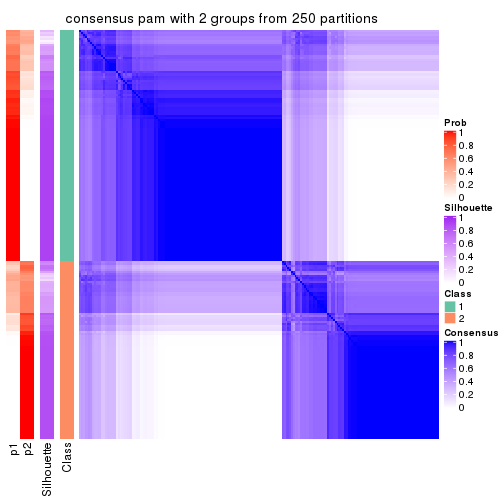</p>

</div>
<div id='tab-MAD-pam-consensus-heatmap-2'>
<pre><code class="r">consensus_heatmap(res, k = 3)
</code></pre>

<p>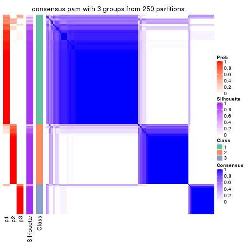</p>

</div>
<div id='tab-MAD-pam-consensus-heatmap-3'>
<pre><code class="r">consensus_heatmap(res, k = 4)
</code></pre>

<p>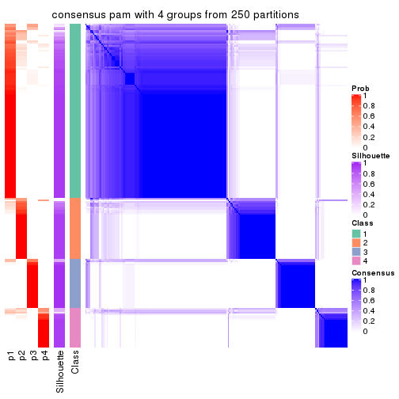</p>

</div>
<div id='tab-MAD-pam-consensus-heatmap-4'>
<pre><code class="r">consensus_heatmap(res, k = 5)
</code></pre>

<p>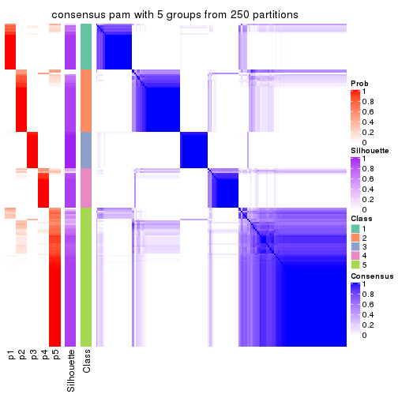</p>

</div>
<div id='tab-MAD-pam-consensus-heatmap-5'>
<pre><code class="r">consensus_heatmap(res, k = 6)
</code></pre>

<p>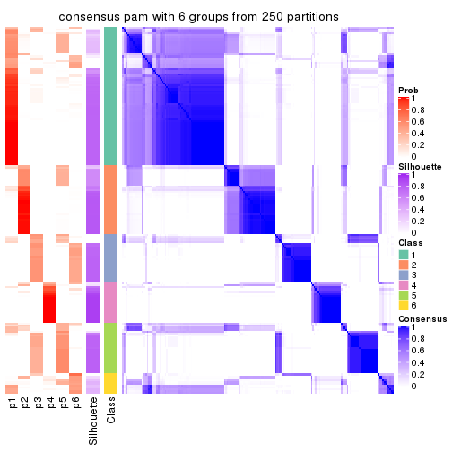</p>

</div>
</div>

Heatmaps for the membership of samples in all partitions to see how consistent they are:


<script>
$( function() {
	$( '#tabs-MAD-pam-membership-heatmap' ).tabs();
} );
</script>
<div id='tabs-MAD-pam-membership-heatmap'>
<ul>
<li><a href='#tab-MAD-pam-membership-heatmap-1'>k = 2</a></li>
<li><a href='#tab-MAD-pam-membership-heatmap-2'>k = 3</a></li>
<li><a href='#tab-MAD-pam-membership-heatmap-3'>k = 4</a></li>
<li><a href='#tab-MAD-pam-membership-heatmap-4'>k = 5</a></li>
<li><a href='#tab-MAD-pam-membership-heatmap-5'>k = 6</a></li>
</ul>
<div id='tab-MAD-pam-membership-heatmap-1'>
<pre><code class="r">membership_heatmap(res, k = 2)
</code></pre>

<p>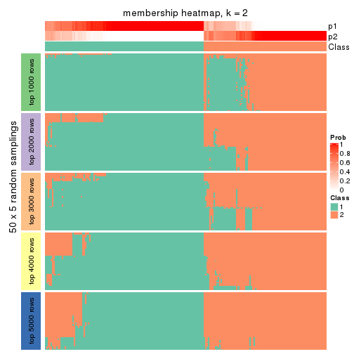</p>

</div>
<div id='tab-MAD-pam-membership-heatmap-2'>
<pre><code class="r">membership_heatmap(res, k = 3)
</code></pre>

<p>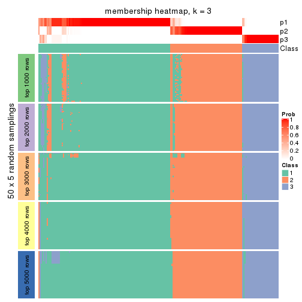</p>

</div>
<div id='tab-MAD-pam-membership-heatmap-3'>
<pre><code class="r">membership_heatmap(res, k = 4)
</code></pre>

<p>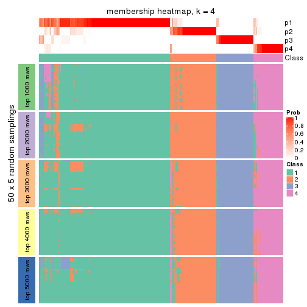</p>

</div>
<div id='tab-MAD-pam-membership-heatmap-4'>
<pre><code class="r">membership_heatmap(res, k = 5)
</code></pre>

<p>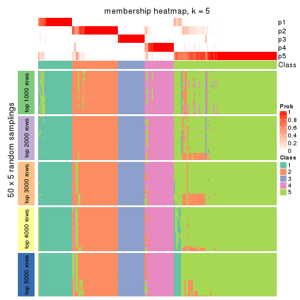</p>

</div>
<div id='tab-MAD-pam-membership-heatmap-5'>
<pre><code class="r">membership_heatmap(res, k = 6)
</code></pre>

<p>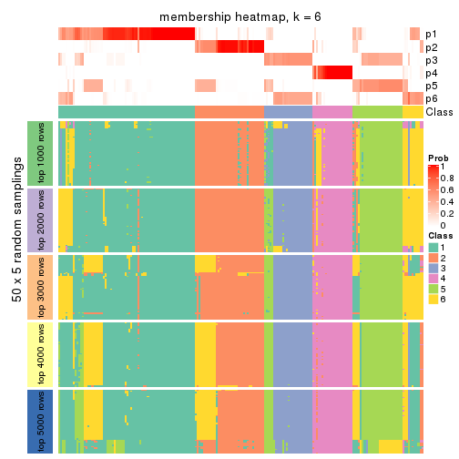</p>

</div>
</div>

As soon as we have had the classes for columns, we can look for signatures
which are significantly different between classes which can be candidate marks
for certain classes. Following are the heatmaps for signatures.


Signature heatmaps where rows are scaled:


<script>
$( function() {
	$( '#tabs-MAD-pam-get-signatures' ).tabs();
} );
</script>
<div id='tabs-MAD-pam-get-signatures'>
<ul>
<li><a href='#tab-MAD-pam-get-signatures-1'>k = 2</a></li>
<li><a href='#tab-MAD-pam-get-signatures-2'>k = 3</a></li>
<li><a href='#tab-MAD-pam-get-signatures-3'>k = 4</a></li>
<li><a href='#tab-MAD-pam-get-signatures-4'>k = 5</a></li>
<li><a href='#tab-MAD-pam-get-signatures-5'>k = 6</a></li>
</ul>
<div id='tab-MAD-pam-get-signatures-1'>
<pre><code class="r">get_signatures(res, k = 2)
</code></pre>

<p>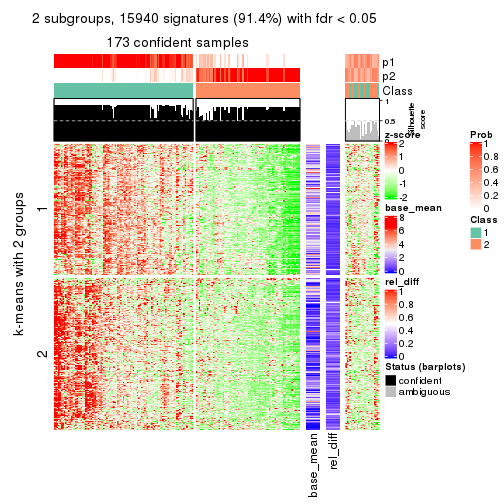</p>

</div>
<div id='tab-MAD-pam-get-signatures-2'>
<pre><code class="r">get_signatures(res, k = 3)
</code></pre>

<p>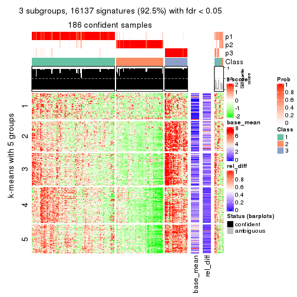</p>

</div>
<div id='tab-MAD-pam-get-signatures-3'>
<pre><code class="r">get_signatures(res, k = 4)
</code></pre>

<p>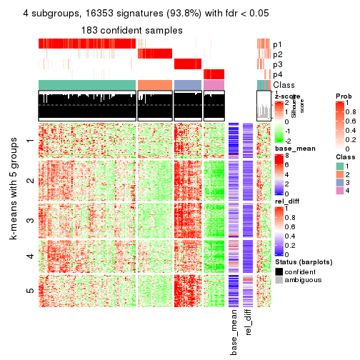</p>

</div>
<div id='tab-MAD-pam-get-signatures-4'>
<pre><code class="r">get_signatures(res, k = 5)
</code></pre>

<p>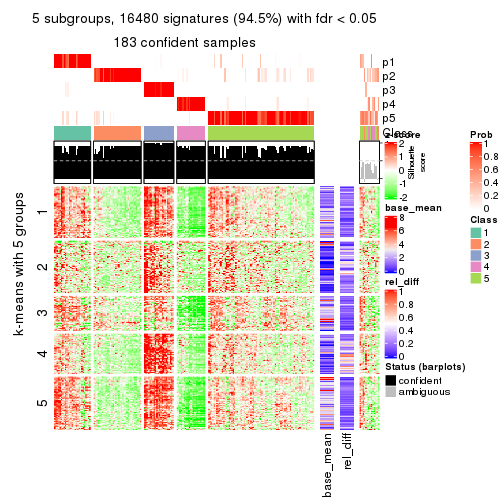</p>

</div>
<div id='tab-MAD-pam-get-signatures-5'>
<pre><code class="r">get_signatures(res, k = 6)
</code></pre>

<p>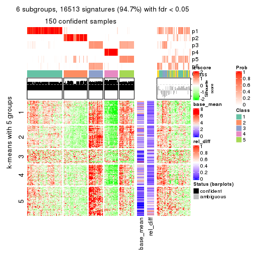</p>

</div>
</div>


Signature heatmaps where rows are not scaled:


<script>
$( function() {
	$( '#tabs-MAD-pam-get-signatures-no-scale' ).tabs();
} );
</script>
<div id='tabs-MAD-pam-get-signatures-no-scale'>
<ul>
<li><a href='#tab-MAD-pam-get-signatures-no-scale-1'>k = 2</a></li>
<li><a href='#tab-MAD-pam-get-signatures-no-scale-2'>k = 3</a></li>
<li><a href='#tab-MAD-pam-get-signatures-no-scale-3'>k = 4</a></li>
<li><a href='#tab-MAD-pam-get-signatures-no-scale-4'>k = 5</a></li>
<li><a href='#tab-MAD-pam-get-signatures-no-scale-5'>k = 6</a></li>
</ul>
<div id='tab-MAD-pam-get-signatures-no-scale-1'>
<pre><code class="r">get_signatures(res, k = 2, scale_rows = FALSE)
</code></pre>

<p>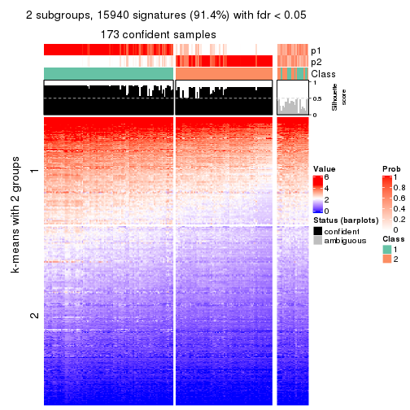</p>

</div>
<div id='tab-MAD-pam-get-signatures-no-scale-2'>
<pre><code class="r">get_signatures(res, k = 3, scale_rows = FALSE)
</code></pre>

<p>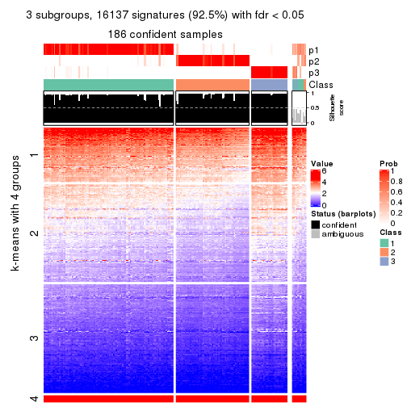</p>

</div>
<div id='tab-MAD-pam-get-signatures-no-scale-3'>
<pre><code class="r">get_signatures(res, k = 4, scale_rows = FALSE)
</code></pre>

<p>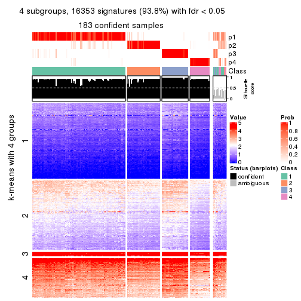</p>

</div>
<div id='tab-MAD-pam-get-signatures-no-scale-4'>
<pre><code class="r">get_signatures(res, k = 5, scale_rows = FALSE)
</code></pre>

<p>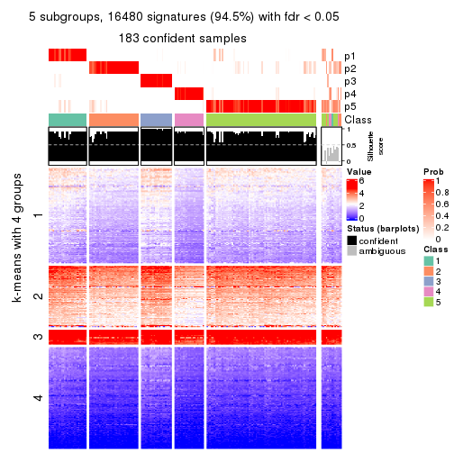</p>

</div>
<div id='tab-MAD-pam-get-signatures-no-scale-5'>
<pre><code class="r">get_signatures(res, k = 6, scale_rows = FALSE)
</code></pre>

<p>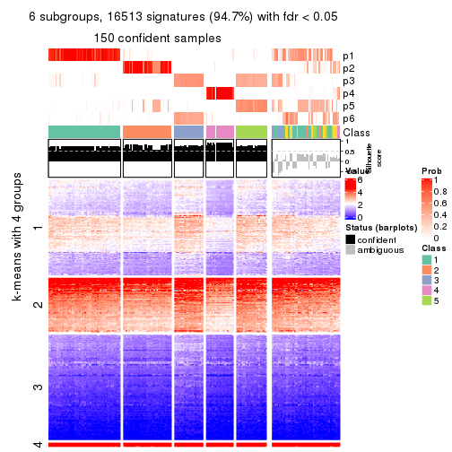</p>

</div>
</div>


Compare the overlap of signatures from different k:

```r
compare_signatures(res)
```

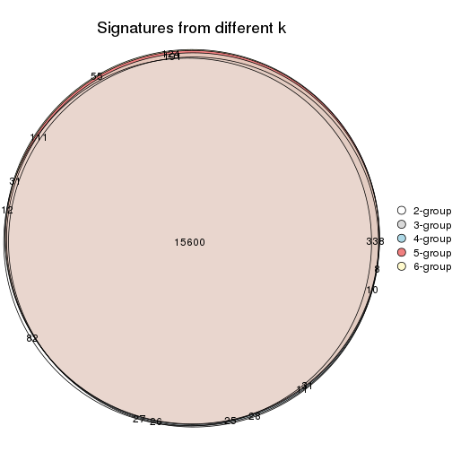

`get_signature()` returns a data frame invisibly. TO get the list of signatures, the function
call should be assigned to a variable explicitly. In following code, if `plot` argument is set
to `FALSE`, no heatmap is plotted while only the differential analysis is performed.

```r
# code only for demonstration
tb = get_signature(res, k = ..., plot = FALSE)
```

An example of the output of `tb` is:

```
#>   which_row         fdr    mean_1    mean_2 scaled_mean_1 scaled_mean_2 km
#> 1        38 0.042760348  8.373488  9.131774    -0.5533452     0.5164555  1
#> 2        40 0.018707592  7.106213  8.469186    -0.6173731     0.5762149  1
#> 3        55 0.019134737 10.221463 11.207825    -0.6159697     0.5749050  1
#> 4        59 0.006059896  5.921854  7.869574    -0.6899429     0.6439467  1
#> 5        60 0.018055526  8.928898 10.211722    -0.6204761     0.5791110  1
#> 6        98 0.009384629 15.714769 14.887706     0.6635654    -0.6193277  2
...
```

The columns in `tb` are:

1. `which_row`: row indices corresponding to the input matrix.
2. `fdr`: FDR for the differential test. 
3. `mean_x`: The mean value in group x.
4. `scaled_mean_x`: The mean value in group x after rows are scaled.
5. `km`: Row groups if k-means clustering is applied to rows.


UMAP plot which shows how samples are separated.


<script>
$( function() {
	$( '#tabs-MAD-pam-dimension-reduction' ).tabs();
} );
</script>
<div id='tabs-MAD-pam-dimension-reduction'>
<ul>
<li><a href='#tab-MAD-pam-dimension-reduction-1'>k = 2</a></li>
<li><a href='#tab-MAD-pam-dimension-reduction-2'>k = 3</a></li>
<li><a href='#tab-MAD-pam-dimension-reduction-3'>k = 4</a></li>
<li><a href='#tab-MAD-pam-dimension-reduction-4'>k = 5</a></li>
<li><a href='#tab-MAD-pam-dimension-reduction-5'>k = 6</a></li>
</ul>
<div id='tab-MAD-pam-dimension-reduction-1'>
<pre><code class="r">dimension_reduction(res, k = 2, method = &quot;UMAP&quot;)
</code></pre>

<p>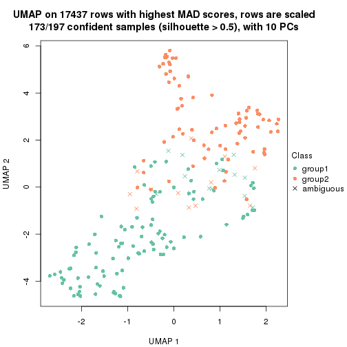</p>

</div>
<div id='tab-MAD-pam-dimension-reduction-2'>
<pre><code class="r">dimension_reduction(res, k = 3, method = &quot;UMAP&quot;)
</code></pre>

<p>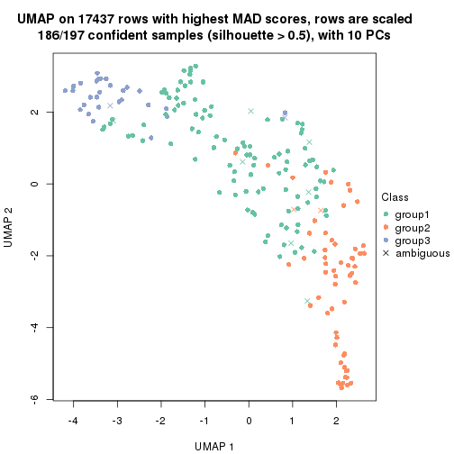</p>

</div>
<div id='tab-MAD-pam-dimension-reduction-3'>
<pre><code class="r">dimension_reduction(res, k = 4, method = &quot;UMAP&quot;)
</code></pre>

<p>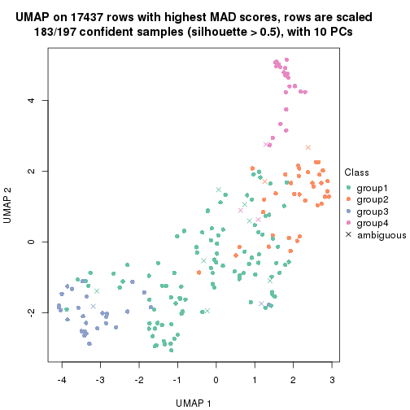</p>

</div>
<div id='tab-MAD-pam-dimension-reduction-4'>
<pre><code class="r">dimension_reduction(res, k = 5, method = &quot;UMAP&quot;)
</code></pre>

<p>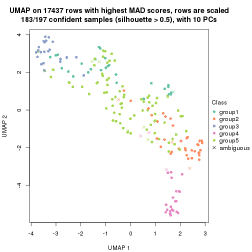</p>

</div>
<div id='tab-MAD-pam-dimension-reduction-5'>
<pre><code class="r">dimension_reduction(res, k = 6, method = &quot;UMAP&quot;)
</code></pre>

<p>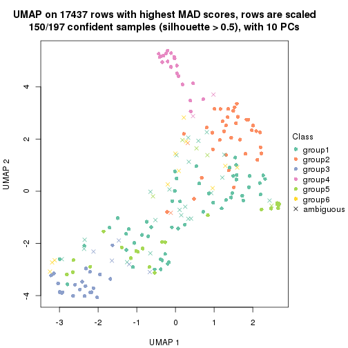</p>

</div>
</div>


Following heatmap shows how subgroups are split when increasing `k`:

```r
collect_classes(res)
```

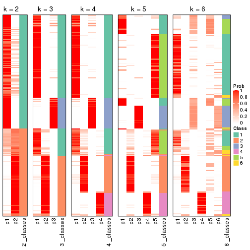


If matrix rows can be associated to genes, consider to use `GO_Enrichment(res,
...)` to perform function enrichment for the signature genes.


 

---------------------------------------------------


### MAD:mclust


The object with results only for a single top-value method and a single partition method 
can be extracted as:

```r
res = res_list["MAD", "mclust"]
# you can also extract it by
# res = res_list["MAD:mclust"]
```

A summary of `res` and all the functions that can be applied to it:

```r
res
```

```
#> A 'ConsensusPartition' object with k = 2, 3, 4, 5, 6.
#>   On a matrix with 17437 rows and 197 columns.
#>   Top rows (1000, 2000, 3000, 4000, 5000) are extracted by 'MAD' method.
#>   Subgroups are detected by 'mclust' method.
#>   Performed in total 1250 partitions by row resampling.
#>   Best k for subgroups seems to be 2.
#> 
#> Following methods can be applied to this 'ConsensusPartition' object:
#>  [1] "cola_report"             "collect_classes"         "collect_plots"          
#>  [4] "collect_stats"           "colnames"                "compare_signatures"     
#>  [7] "consensus_heatmap"       "dimension_reduction"     "functional_enrichment"  
#> [10] "get_anno_col"            "get_anno"                "get_classes"            
#> [13] "get_consensus"           "get_matrix"              "get_membership"         
#> [16] "get_param"               "get_signatures"          "get_stats"              
#> [19] "is_best_k"               "is_stable_k"             "membership_heatmap"     
#> [22] "ncol"                    "nrow"                    "plot_ecdf"              
#> [25] "rownames"                "select_partition_number" "show"                   
#> [28] "suggest_best_k"          "test_to_known_factors"
```

`collect_plots()` function collects all the plots made from `res` for all `k` (number of partitions)
into one single page to provide an easy and fast comparison between different `k`.

```r
collect_plots(res)
```

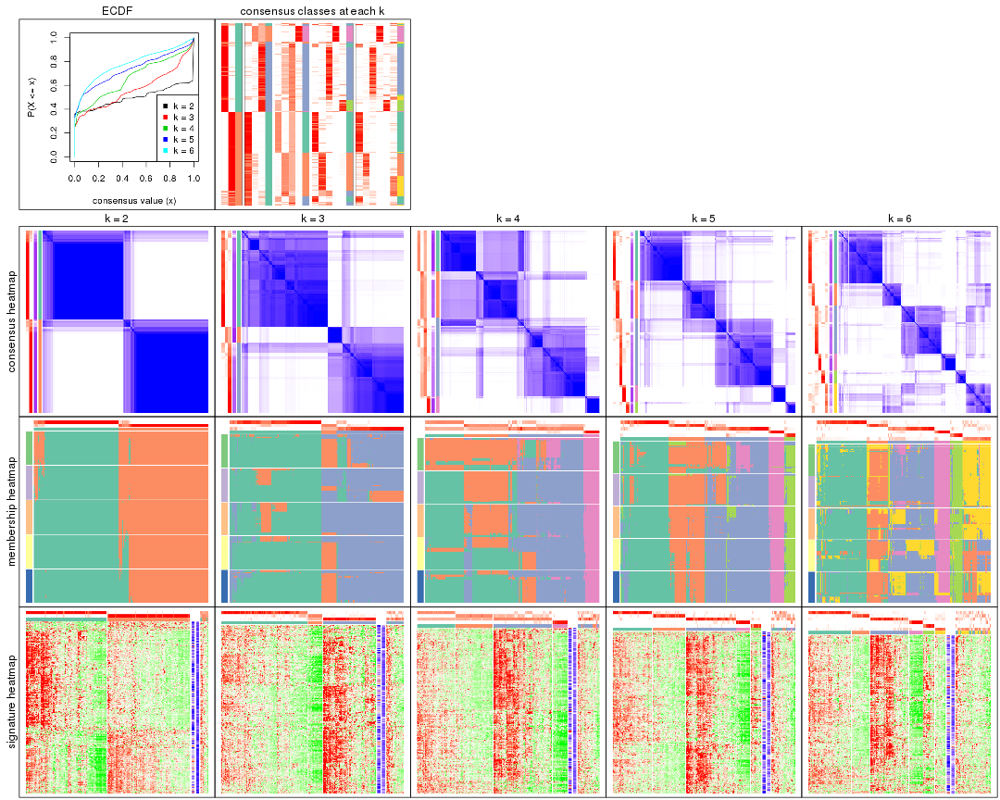

The plots are:

- The first row: a plot of the ECDF (Empirical cumulative distribution
  function) curves of the consensus matrix for each `k` and the heatmap of
  predicted classes for each `k`.
- The second row: heatmaps of the consensus matrix for each `k`.
- The third row: heatmaps of the membership matrix for each `k`.
- The fouth row: heatmaps of the signatures for each `k`.

All the plots in panels can be made by individual functions and they are
plotted later in this section.

`select_partition_number()` produces several plots showing different
statistics for choosing "optimized" `k`. There are following statistics:

- ECDF curves of the consensus matrix for each `k`;
- 1-PAC. [The PAC
  score](https://en.wikipedia.org/wiki/Consensus_clustering#Over-interpretation_potential_of_consensus_clustering)
  measures the proportion of the ambiguous subgrouping.
- Mean silhouette score.
- Concordance. The mean probability of fiting the consensus class ids in all
  partitions.
- Area increased. Denote $A_k$ as the area under the ECDF curve for current
  `k`, the area increased is defined as $A_k - A_{k-1}$.
- Rand index. The percent of pairs of samples that are both in a same cluster
  or both are not in a same cluster in the partition of k and k-1.
- Jaccard index. The ratio of pairs of samples are both in a same cluster in
  the partition of k and k-1 and the pairs of samples are both in a same
  cluster in the partition k or k-1.

The detailed explanations of these statistics can be found in [the cola
vignette](http://bioconductor.org/packages/devel/bioc/vignettes/cola/inst/doc/cola.html#toc_13).

Generally speaking, lower PAC score, higher mean silhouette score or higher
concordance corresponds to better partition. Rand index and Jaccard index
measure how similar the current partition is compared to partition with `k-1`.
If they are too similar, we won't accept `k` is better than `k-1`.

```r
select_partition_number(res)
```

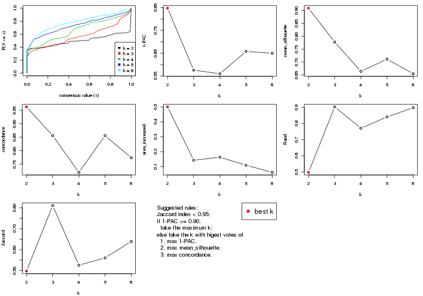

The numeric values for all these statistics can be obtained by `get_stats()`.

```r
get_stats(res)
```

```
#>   k 1-PAC mean_silhouette concordance area_increased  Rand Jaccard
#> 2 2 0.847           0.908       0.963         0.4998 0.498   0.498
#> 3 3 0.576           0.777       0.856         0.1430 0.903   0.811
#> 4 4 0.560           0.664       0.719         0.1630 0.771   0.526
#> 5 5 0.658           0.712       0.856         0.1094 0.841   0.561
#> 6 6 0.650           0.655       0.774         0.0617 0.898   0.639
```

`suggest_best_k()` suggests the best $k$ based on these statistics. The rules are as follows:

- All $k$ with Jaccard index larger than 0.95 are removed because the increase of
  the partition number does not provides enough extra information. If all $k$ are removed,
  the best $k$ is assigned by `NA`.
- For $k$ with 1-PAC larger than 0.9, the maximal $k$ is taken as the "best k". Other $k$ is called "optional k".
- If it does not fit the second rule. The $k$ with the highest vote of highest
  1-PAC, mean silhouette and concordance is taken as the "best k".

```r
suggest_best_k(res)
```

```
#> [1] 2
```


Following shows the table of the partitions (You need to click the **show/hide
code output** link to see it). The membership matrix (columns with name `p*`)
is inferred by
[`clue::cl_consensus()`](https://www.rdocumentation.org/link/cl_consensus?package=clue)
function with the `SE` method. Basically the value in the membership matrix
represents the probability to belong to a certain group. The finall class
label for an item is determined with the group with highest probability it
belongs to.

In `get_classes()` function, the entropy is calculated from the membership
matrix and the silhouette score is calculated from the consensus matrix.


<script>
$( function() {
	$( '#tabs-MAD-mclust-get-classes' ).tabs();
} );
</script>
<div id='tabs-MAD-mclust-get-classes'>
<ul>
<li><a href='#tab-MAD-mclust-get-classes-1'>k = 2</a></li>
<li><a href='#tab-MAD-mclust-get-classes-2'>k = 3</a></li>
<li><a href='#tab-MAD-mclust-get-classes-3'>k = 4</a></li>
<li><a href='#tab-MAD-mclust-get-classes-4'>k = 5</a></li>
<li><a href='#tab-MAD-mclust-get-classes-5'>k = 6</a></li>
</ul>

<div id='tab-MAD-mclust-get-classes-1'>
<p><a id='tab-MAD-mclust-get-classes-1-a' style='color:#0366d6' href='#'>show/hide code output</a></p>
<pre><code class="r">cbind(get_classes(res, k = 2), get_membership(res, k = 2))
</code></pre>

<pre><code>#&gt;            class entropy silhouette    p1    p2
#&gt; SRR1380886     1  0.0000     0.9620 1.000 0.000
#&gt; SRR1074385     2  0.0000     0.9570 0.000 1.000
#&gt; SRR1374739     1  0.0000     0.9620 1.000 0.000
#&gt; SRR1097883     2  0.9710     0.3375 0.400 0.600
#&gt; SRR2167209     1  0.0000     0.9620 1.000 0.000
#&gt; SRR816541      2  0.0000     0.9570 0.000 1.000
#&gt; SRR663645      1  0.1633     0.9410 0.976 0.024
#&gt; SRR1381505     1  0.0000     0.9620 1.000 0.000
#&gt; SRR1416362     2  0.0000     0.9570 0.000 1.000
#&gt; SRR1318503     2  0.0000     0.9570 0.000 1.000
#&gt; SRR1341626     1  0.8267     0.6542 0.740 0.260
#&gt; SRR1382440     1  0.0000     0.9620 1.000 0.000
#&gt; SRR1088413     1  0.0000     0.9620 1.000 0.000
#&gt; SRR1082080     2  0.0000     0.9570 0.000 1.000
#&gt; SRR1455783     2  0.0000     0.9570 0.000 1.000
#&gt; SRR1447760     1  0.8144     0.6681 0.748 0.252
#&gt; SRR1487784     2  0.0000     0.9570 0.000 1.000
#&gt; SRR1331037     2  0.0000     0.9570 0.000 1.000
#&gt; SRR1095651     1  0.0000     0.9620 1.000 0.000
#&gt; SRR1078066     1  0.0000     0.9620 1.000 0.000
#&gt; SRR1120363     2  0.0000     0.9570 0.000 1.000
#&gt; SRR821231      2  0.0000     0.9570 0.000 1.000
#&gt; SRR1374373     2  0.0000     0.9570 0.000 1.000
#&gt; SRR1324519     2  0.0000     0.9570 0.000 1.000
#&gt; SRR1431121     2  0.0000     0.9570 0.000 1.000
#&gt; SRR1091032     2  0.0000     0.9570 0.000 1.000
#&gt; SRR1365575     1  0.0000     0.9620 1.000 0.000
#&gt; SRR1072972     2  0.0672     0.9505 0.008 0.992
#&gt; SRR1310690     2  0.0000     0.9570 0.000 1.000
#&gt; SRR1383037     1  0.0000     0.9620 1.000 0.000
#&gt; SRR1095479     2  0.9129     0.5123 0.328 0.672
#&gt; SRR1070403     1  0.0000     0.9620 1.000 0.000
#&gt; SRR1390203     2  0.0000     0.9570 0.000 1.000
#&gt; SRR1072007     1  0.2043     0.9347 0.968 0.032
#&gt; SRR1468787     1  0.0000     0.9620 1.000 0.000
#&gt; SRR1347959     2  0.0000     0.9570 0.000 1.000
#&gt; SRR1338513     1  0.0000     0.9620 1.000 0.000
#&gt; SRR812598      2  0.9795     0.2908 0.416 0.584
#&gt; SRR1446806     2  0.0000     0.9570 0.000 1.000
#&gt; SRR1394275     2  0.0000     0.9570 0.000 1.000
#&gt; SRR1443633     1  0.0000     0.9620 1.000 0.000
#&gt; SRR1087728     1  0.0000     0.9620 1.000 0.000
#&gt; SRR1098192     1  0.7950     0.6875 0.760 0.240
#&gt; SRR1093340     2  0.0000     0.9570 0.000 1.000
#&gt; SRR665405      1  0.0000     0.9620 1.000 0.000
#&gt; SRR657077      2  0.0000     0.9570 0.000 1.000
#&gt; SRR813208      1  0.0000     0.9620 1.000 0.000
#&gt; SRR1416074     2  0.0000     0.9570 0.000 1.000
#&gt; SRR1089688     1  0.0000     0.9620 1.000 0.000
#&gt; SRR1353461     1  0.0000     0.9620 1.000 0.000
#&gt; SRR1466321     2  0.0000     0.9570 0.000 1.000
#&gt; SRR1073021     1  0.0000     0.9620 1.000 0.000
#&gt; SRR1322816     2  0.0000     0.9570 0.000 1.000
#&gt; SRR1457727     2  0.0000     0.9570 0.000 1.000
#&gt; SRR1464226     1  0.8955     0.5553 0.688 0.312
#&gt; SRR1398863     2  0.0000     0.9570 0.000 1.000
#&gt; SRR1455631     1  0.0000     0.9620 1.000 0.000
#&gt; SRR1307808     2  0.0000     0.9570 0.000 1.000
#&gt; SRR1374585     1  0.0000     0.9620 1.000 0.000
#&gt; SRR1072104     1  0.0000     0.9620 1.000 0.000
#&gt; SRR1076868     2  0.0000     0.9570 0.000 1.000
#&gt; SRR1335984     2  0.0000     0.9570 0.000 1.000
#&gt; SRR1445939     2  0.0000     0.9570 0.000 1.000
#&gt; SRR1453047     2  0.0000     0.9570 0.000 1.000
#&gt; SRR1339788     1  0.0000     0.9620 1.000 0.000
#&gt; SRR1084323     2  0.0000     0.9570 0.000 1.000
#&gt; SRR1092937     2  0.2236     0.9261 0.036 0.964
#&gt; SRR1074090     2  0.0000     0.9570 0.000 1.000
#&gt; SRR1099833     1  0.0000     0.9620 1.000 0.000
#&gt; SRR1093434     1  0.0000     0.9620 1.000 0.000
#&gt; SRR1435857     2  0.0000     0.9570 0.000 1.000
#&gt; SRR1480347     2  0.0000     0.9570 0.000 1.000
#&gt; SRR1440787     1  0.0000     0.9620 1.000 0.000
#&gt; SRR1430202     2  0.0000     0.9570 0.000 1.000
#&gt; SRR1322730     1  0.0000     0.9620 1.000 0.000
#&gt; SRR811029      2  0.9998     0.0226 0.492 0.508
#&gt; SRR1390456     1  0.0000     0.9620 1.000 0.000
#&gt; SRR1381140     2  0.0000     0.9570 0.000 1.000
#&gt; SRR1388064     1  0.0000     0.9620 1.000 0.000
#&gt; SRR1093577     2  0.7299     0.7325 0.204 0.796
#&gt; SRR1414161     2  0.0000     0.9570 0.000 1.000
#&gt; SRR1328738     2  0.6973     0.7553 0.188 0.812
#&gt; SRR1311752     2  0.0000     0.9570 0.000 1.000
#&gt; SRR1445960     2  0.0000     0.9570 0.000 1.000
#&gt; SRR1403412     2  0.0000     0.9570 0.000 1.000
#&gt; SRR2166748     2  0.0000     0.9570 0.000 1.000
#&gt; SRR821666      1  0.0000     0.9620 1.000 0.000
#&gt; SRR1330746     1  0.0000     0.9620 1.000 0.000
#&gt; SRR1327872     1  0.0000     0.9620 1.000 0.000
#&gt; SRR1100800     2  0.0000     0.9570 0.000 1.000
#&gt; SRR1075174     2  0.0000     0.9570 0.000 1.000
#&gt; SRR1434436     2  0.0000     0.9570 0.000 1.000
#&gt; SRR1389409     1  0.0000     0.9620 1.000 0.000
#&gt; SRR1085310     1  0.7219     0.7464 0.800 0.200
#&gt; SRR1376718     1  0.0000     0.9620 1.000 0.000
#&gt; SRR808590      1  0.0000     0.9620 1.000 0.000
#&gt; SRR1084128     2  0.0000     0.9570 0.000 1.000
#&gt; SRR1361692     2  0.8016     0.6705 0.244 0.756
#&gt; SRR1431493     1  0.8861     0.5712 0.696 0.304
#&gt; SRR1409084     2  0.0000     0.9570 0.000 1.000
#&gt; SRR2166214     1  0.0000     0.9620 1.000 0.000
#&gt; SRR1324102     2  0.0000     0.9570 0.000 1.000
#&gt; SRR1079754     1  0.6801     0.7733 0.820 0.180
#&gt; SRR1442127     1  0.0000     0.9620 1.000 0.000
#&gt; SRR1076244     1  0.0000     0.9620 1.000 0.000
#&gt; SRR1330901     2  0.0000     0.9570 0.000 1.000
#&gt; SRR1073167     2  0.0000     0.9570 0.000 1.000
#&gt; SRR1357541     1  0.0000     0.9620 1.000 0.000
#&gt; SRR811607      2  0.0000     0.9570 0.000 1.000
#&gt; SRR1468931     1  0.0000     0.9620 1.000 0.000
#&gt; SRR1474908     2  0.0000     0.9570 0.000 1.000
#&gt; SRR1309875     2  0.6343     0.7925 0.160 0.840
#&gt; SRR598792      1  0.9710     0.3428 0.600 0.400
#&gt; SRR1088537     2  0.0000     0.9570 0.000 1.000
#&gt; SRR1457682     2  0.0000     0.9570 0.000 1.000
#&gt; SRR1454289     2  0.0000     0.9570 0.000 1.000
#&gt; SRR1069352     1  0.0000     0.9620 1.000 0.000
#&gt; SRR1472728     2  0.0000     0.9570 0.000 1.000
#&gt; SRR1091144     1  0.0000     0.9620 1.000 0.000
#&gt; SRR1319118     2  0.6148     0.7984 0.152 0.848
#&gt; SRR1403611     1  0.0000     0.9620 1.000 0.000
#&gt; SRR1397762     2  0.9710     0.3374 0.400 0.600
#&gt; SRR1317387     1  0.0000     0.9620 1.000 0.000
#&gt; SRR1376426     2  0.0000     0.9570 0.000 1.000
#&gt; SRR1097777     2  0.0000     0.9570 0.000 1.000
#&gt; SRR1365743     1  0.9710     0.3428 0.600 0.400
#&gt; SRR1458992     2  0.0000     0.9570 0.000 1.000
#&gt; SRR1089537     1  0.0000     0.9620 1.000 0.000
#&gt; SRR1397744     2  0.0000     0.9570 0.000 1.000
#&gt; SRR1453893     1  0.0000     0.9620 1.000 0.000
#&gt; SRR1098543     2  0.0000     0.9570 0.000 1.000
#&gt; SRR1321765     1  0.0000     0.9620 1.000 0.000
#&gt; SRR1440032     1  0.0000     0.9620 1.000 0.000
#&gt; SRR1404507     1  0.0000     0.9620 1.000 0.000
#&gt; SRR1404856     1  0.0000     0.9620 1.000 0.000
#&gt; SRR812745      2  0.9552     0.4010 0.376 0.624
#&gt; SRR1417524     1  0.0000     0.9620 1.000 0.000
#&gt; SRR1407334     1  0.0000     0.9620 1.000 0.000
#&gt; SRR1453991     2  0.0000     0.9570 0.000 1.000
#&gt; SRR1415938     2  0.0000     0.9570 0.000 1.000
#&gt; SRR1081259     2  0.0000     0.9570 0.000 1.000
#&gt; SRR1436187     1  0.0000     0.9620 1.000 0.000
#&gt; SRR1431948     1  0.0000     0.9620 1.000 0.000
#&gt; SRR1453277     2  0.0000     0.9570 0.000 1.000
#&gt; SRR1095407     1  0.0000     0.9620 1.000 0.000
#&gt; SRR1359694     2  0.0000     0.9570 0.000 1.000
#&gt; SRR656982      1  0.0000     0.9620 1.000 0.000
#&gt; SRR1354338     2  0.9635     0.3702 0.388 0.612
#&gt; SRR1088291     1  0.9732     0.3312 0.596 0.404
#&gt; SRR1080624     2  0.0000     0.9570 0.000 1.000
#&gt; SRR2166708     1  0.0000     0.9620 1.000 0.000
#&gt; SRR1393572     2  0.0000     0.9570 0.000 1.000
#&gt; SRR1429912     2  0.0000     0.9570 0.000 1.000
#&gt; SRR1421048     2  0.1414     0.9404 0.020 0.980
#&gt; SRR1434999     1  0.0000     0.9620 1.000 0.000
#&gt; SRR656457      1  0.0000     0.9620 1.000 0.000
#&gt; SRR1098928     1  0.0000     0.9620 1.000 0.000
#&gt; SRR1343967     2  0.0000     0.9570 0.000 1.000
#&gt; SRR1360766     2  0.6887     0.7583 0.184 0.816
#&gt; SRR1464724     1  0.0000     0.9620 1.000 0.000
#&gt; SRR1101542     1  0.0000     0.9620 1.000 0.000
#&gt; SRR1401528     1  0.0000     0.9620 1.000 0.000
#&gt; SRR1071519     1  0.0000     0.9620 1.000 0.000
#&gt; SRR1086070     2  0.0000     0.9570 0.000 1.000
#&gt; SRR1358645     2  0.0000     0.9570 0.000 1.000
#&gt; SRR819771      1  0.0000     0.9620 1.000 0.000
#&gt; SRR1418433     1  0.0000     0.9620 1.000 0.000
#&gt; SRR821050      2  0.0000     0.9570 0.000 1.000
#&gt; SRR1402091     2  0.0000     0.9570 0.000 1.000
#&gt; SRR1322028     2  0.0000     0.9570 0.000 1.000
#&gt; SRR1452556     1  0.0000     0.9620 1.000 0.000
#&gt; SRR1340047     2  0.0000     0.9570 0.000 1.000
#&gt; SRR1418302     1  0.7674     0.7123 0.776 0.224
#&gt; SRR1073991     2  0.0000     0.9570 0.000 1.000
#&gt; SRR1085187     1  0.0000     0.9620 1.000 0.000
#&gt; SRR1357618     1  0.0000     0.9620 1.000 0.000
#&gt; SRR1487764     1  0.0000     0.9620 1.000 0.000
#&gt; SRR1075336     2  0.0000     0.9570 0.000 1.000
#&gt; SRR1365471     2  0.0000     0.9570 0.000 1.000
#&gt; SRR1414613     2  0.0000     0.9570 0.000 1.000
#&gt; SRR658719      2  0.0000     0.9570 0.000 1.000
#&gt; SRR1475128     1  0.0000     0.9620 1.000 0.000
#&gt; SRR1367630     1  0.0000     0.9620 1.000 0.000
#&gt; SRR1481146     1  0.0000     0.9620 1.000 0.000
#&gt; SRR1465674     1  0.0000     0.9620 1.000 0.000
#&gt; SRR1327303     2  0.0000     0.9570 0.000 1.000
#&gt; SRR1390391     2  0.0000     0.9570 0.000 1.000
#&gt; SRR1326020     1  0.0000     0.9620 1.000 0.000
#&gt; SRR1381953     1  0.0000     0.9620 1.000 0.000
#&gt; SRR1082544     1  0.5519     0.8366 0.872 0.128
#&gt; SRR810761      1  0.0000     0.9620 1.000 0.000
#&gt; SRR1070764     1  0.0000     0.9620 1.000 0.000
#&gt; SRR1415919     1  0.0000     0.9620 1.000 0.000
#&gt; SRR1490404     2  0.0000     0.9570 0.000 1.000
#&gt; SRR1416773     1  0.0000     0.9620 1.000 0.000
#&gt; SRR1377492     1  0.0000     0.9620 1.000 0.000
#&gt; SRR1334314     2  0.0000     0.9570 0.000 1.000
</code></pre>

<script>
$('#tab-MAD-mclust-get-classes-1-a').parent().next().next().hide();
$('#tab-MAD-mclust-get-classes-1-a').click(function(){
  $('#tab-MAD-mclust-get-classes-1-a').parent().next().next().toggle();
  return(false);
});
</script>
</div>

<div id='tab-MAD-mclust-get-classes-2'>
<p><a id='tab-MAD-mclust-get-classes-2-a' style='color:#0366d6' href='#'>show/hide code output</a></p>
<pre><code class="r">cbind(get_classes(res, k = 3), get_membership(res, k = 3))
</code></pre>

<pre><code>#&gt;            class entropy silhouette    p1    p2    p3
#&gt; SRR1380886     3  0.0424    0.78934 0.000 0.008 0.992
#&gt; SRR1074385     1  0.0000    0.89092 1.000 0.000 0.000
#&gt; SRR1374739     3  0.0000    0.79199 0.000 0.000 1.000
#&gt; SRR1097883     1  0.6836    0.23415 0.572 0.016 0.412
#&gt; SRR2167209     3  0.1267    0.78124 0.004 0.024 0.972
#&gt; SRR816541      1  0.3340    0.87131 0.880 0.120 0.000
#&gt; SRR663645      3  0.9614   -0.19558 0.356 0.208 0.436
#&gt; SRR1381505     2  0.6026    0.99050 0.000 0.624 0.376
#&gt; SRR1416362     1  0.4399    0.82290 0.812 0.188 0.000
#&gt; SRR1318503     1  0.0000    0.89092 1.000 0.000 0.000
#&gt; SRR1341626     1  0.7001    0.34693 0.588 0.024 0.388
#&gt; SRR1382440     3  0.0000    0.79199 0.000 0.000 1.000
#&gt; SRR1088413     3  0.0000    0.79199 0.000 0.000 1.000
#&gt; SRR1082080     1  0.5859    0.72148 0.656 0.344 0.000
#&gt; SRR1455783     1  0.0000    0.89092 1.000 0.000 0.000
#&gt; SRR1447760     3  0.6888    0.17333 0.432 0.016 0.552
#&gt; SRR1487784     1  0.3551    0.84920 0.868 0.132 0.000
#&gt; SRR1331037     1  0.3482    0.86922 0.872 0.128 0.000
#&gt; SRR1095651     3  0.2537    0.75482 0.000 0.080 0.920
#&gt; SRR1078066     3  0.1129    0.77972 0.004 0.020 0.976
#&gt; SRR1120363     1  0.1905    0.88118 0.956 0.016 0.028
#&gt; SRR821231      1  0.2301    0.87118 0.936 0.004 0.060
#&gt; SRR1374373     1  0.1999    0.89033 0.952 0.036 0.012
#&gt; SRR1324519     1  0.5810    0.72804 0.664 0.336 0.000
#&gt; SRR1431121     1  0.1399    0.88427 0.968 0.004 0.028
#&gt; SRR1091032     1  0.4702    0.82476 0.788 0.212 0.000
#&gt; SRR1365575     2  0.6026    0.99050 0.000 0.624 0.376
#&gt; SRR1072972     1  0.0747    0.89116 0.984 0.000 0.016
#&gt; SRR1310690     1  0.4289    0.84744 0.868 0.040 0.092
#&gt; SRR1383037     3  0.0000    0.79199 0.000 0.000 1.000
#&gt; SRR1095479     1  0.6490    0.39414 0.628 0.012 0.360
#&gt; SRR1070403     3  0.0000    0.79199 0.000 0.000 1.000
#&gt; SRR1390203     1  0.0000    0.89092 1.000 0.000 0.000
#&gt; SRR1072007     3  0.6388    0.36627 0.284 0.024 0.692
#&gt; SRR1468787     3  0.0661    0.78931 0.004 0.008 0.988
#&gt; SRR1347959     1  0.0747    0.89079 0.984 0.016 0.000
#&gt; SRR1338513     3  0.2959    0.73933 0.000 0.100 0.900
#&gt; SRR812598      1  0.6380    0.67885 0.732 0.044 0.224
#&gt; SRR1446806     1  0.0237    0.89091 0.996 0.004 0.000
#&gt; SRR1394275     1  0.0000    0.89092 1.000 0.000 0.000
#&gt; SRR1443633     3  0.0983    0.78359 0.004 0.016 0.980
#&gt; SRR1087728     3  0.0000    0.79199 0.000 0.000 1.000
#&gt; SRR1098192     3  0.6879    0.26993 0.360 0.024 0.616
#&gt; SRR1093340     1  0.5859    0.72148 0.656 0.344 0.000
#&gt; SRR665405      3  0.3192    0.72557 0.000 0.112 0.888
#&gt; SRR657077      1  0.3551    0.87064 0.868 0.132 0.000
#&gt; SRR813208      3  0.0000    0.79199 0.000 0.000 1.000
#&gt; SRR1416074     1  0.5859    0.72148 0.656 0.344 0.000
#&gt; SRR1089688     3  0.5098    0.43679 0.000 0.248 0.752
#&gt; SRR1353461     3  0.2229    0.75227 0.044 0.012 0.944
#&gt; SRR1466321     1  0.0000    0.89092 1.000 0.000 0.000
#&gt; SRR1073021     3  0.1905    0.77234 0.028 0.016 0.956
#&gt; SRR1322816     1  0.3340    0.87131 0.880 0.120 0.000
#&gt; SRR1457727     1  0.1267    0.88576 0.972 0.004 0.024
#&gt; SRR1464226     3  0.7043    0.22179 0.400 0.024 0.576
#&gt; SRR1398863     1  0.1031    0.88668 0.976 0.000 0.024
#&gt; SRR1455631     3  0.3619    0.69204 0.000 0.136 0.864
#&gt; SRR1307808     1  0.0237    0.89091 0.996 0.004 0.000
#&gt; SRR1374585     2  0.6026    0.99050 0.000 0.624 0.376
#&gt; SRR1072104     3  0.6143    0.36277 0.024 0.256 0.720
#&gt; SRR1076868     1  0.2796    0.87127 0.908 0.092 0.000
#&gt; SRR1335984     1  0.3028    0.88369 0.920 0.048 0.032
#&gt; SRR1445939     1  0.0000    0.89092 1.000 0.000 0.000
#&gt; SRR1453047     1  0.5859    0.72148 0.656 0.344 0.000
#&gt; SRR1339788     3  0.0000    0.79199 0.000 0.000 1.000
#&gt; SRR1084323     1  0.0000    0.89092 1.000 0.000 0.000
#&gt; SRR1092937     1  0.1529    0.88473 0.960 0.000 0.040
#&gt; SRR1074090     1  0.5859    0.72148 0.656 0.344 0.000
#&gt; SRR1099833     3  0.2959    0.73933 0.000 0.100 0.900
#&gt; SRR1093434     3  0.0000    0.79199 0.000 0.000 1.000
#&gt; SRR1435857     1  0.0592    0.88982 0.988 0.012 0.000
#&gt; SRR1480347     1  0.5859    0.72148 0.656 0.344 0.000
#&gt; SRR1440787     2  0.6026    0.99050 0.000 0.624 0.376
#&gt; SRR1430202     1  0.0237    0.89091 0.996 0.004 0.000
#&gt; SRR1322730     3  0.5529    0.26708 0.000 0.296 0.704
#&gt; SRR811029      1  0.5953    0.62459 0.708 0.012 0.280
#&gt; SRR1390456     3  0.0000    0.79199 0.000 0.000 1.000
#&gt; SRR1381140     1  0.0237    0.89081 0.996 0.004 0.000
#&gt; SRR1388064     2  0.6026    0.99050 0.000 0.624 0.376
#&gt; SRR1093577     1  0.3272    0.84137 0.892 0.004 0.104
#&gt; SRR1414161     1  0.0000    0.89092 1.000 0.000 0.000
#&gt; SRR1328738     1  0.3183    0.86170 0.908 0.016 0.076
#&gt; SRR1311752     1  0.5859    0.72148 0.656 0.344 0.000
#&gt; SRR1445960     1  0.3340    0.87131 0.880 0.120 0.000
#&gt; SRR1403412     1  0.3910    0.84308 0.876 0.020 0.104
#&gt; SRR2166748     1  0.1905    0.88118 0.956 0.016 0.028
#&gt; SRR821666      2  0.6026    0.99050 0.000 0.624 0.376
#&gt; SRR1330746     3  0.0000    0.79199 0.000 0.000 1.000
#&gt; SRR1327872     2  0.6079    0.96833 0.000 0.612 0.388
#&gt; SRR1100800     1  0.1774    0.88299 0.960 0.016 0.024
#&gt; SRR1075174     1  0.0829    0.89176 0.984 0.004 0.012
#&gt; SRR1434436     1  0.0000    0.89092 1.000 0.000 0.000
#&gt; SRR1389409     2  0.6026    0.99050 0.000 0.624 0.376
#&gt; SRR1085310     3  0.5812    0.41417 0.264 0.012 0.724
#&gt; SRR1376718     2  0.6026    0.99050 0.000 0.624 0.376
#&gt; SRR808590      2  0.6026    0.99050 0.000 0.624 0.376
#&gt; SRR1084128     1  0.3267    0.85937 0.884 0.116 0.000
#&gt; SRR1361692     1  0.3610    0.84740 0.888 0.016 0.096
#&gt; SRR1431493     3  0.6143    0.36524 0.304 0.012 0.684
#&gt; SRR1409084     1  0.0592    0.88982 0.988 0.012 0.000
#&gt; SRR2166214     3  0.3038    0.73541 0.000 0.104 0.896
#&gt; SRR1324102     1  0.3482    0.86903 0.872 0.128 0.000
#&gt; SRR1079754     3  0.6936    0.34543 0.284 0.044 0.672
#&gt; SRR1442127     3  0.0000    0.79199 0.000 0.000 1.000
#&gt; SRR1076244     3  0.3340    0.71674 0.000 0.120 0.880
#&gt; SRR1330901     1  0.0237    0.89091 0.996 0.004 0.000
#&gt; SRR1073167     1  0.3482    0.86903 0.872 0.128 0.000
#&gt; SRR1357541     3  0.0983    0.78359 0.004 0.016 0.980
#&gt; SRR811607      1  0.0237    0.89091 0.996 0.004 0.000
#&gt; SRR1468931     3  0.0000    0.79199 0.000 0.000 1.000
#&gt; SRR1474908     1  0.3340    0.87131 0.880 0.120 0.000
#&gt; SRR1309875     1  0.3846    0.84016 0.876 0.016 0.108
#&gt; SRR598792      3  0.6172    0.35582 0.308 0.012 0.680
#&gt; SRR1088537     1  0.3340    0.87131 0.880 0.120 0.000
#&gt; SRR1457682     1  0.0000    0.89092 1.000 0.000 0.000
#&gt; SRR1454289     1  0.0000    0.89092 1.000 0.000 0.000
#&gt; SRR1069352     3  0.0000    0.79199 0.000 0.000 1.000
#&gt; SRR1472728     1  0.2066    0.88708 0.940 0.060 0.000
#&gt; SRR1091144     3  0.3192    0.72504 0.000 0.112 0.888
#&gt; SRR1319118     1  0.4068    0.81481 0.864 0.016 0.120
#&gt; SRR1403611     3  0.2959    0.73933 0.000 0.100 0.900
#&gt; SRR1397762     1  0.5529    0.59437 0.704 0.000 0.296
#&gt; SRR1317387     3  0.2711    0.74907 0.000 0.088 0.912
#&gt; SRR1376426     1  0.5859    0.72148 0.656 0.344 0.000
#&gt; SRR1097777     1  0.0424    0.89048 0.992 0.008 0.000
#&gt; SRR1365743     3  0.6095    0.25633 0.392 0.000 0.608
#&gt; SRR1458992     1  0.3340    0.87131 0.880 0.120 0.000
#&gt; SRR1089537     3  0.2959    0.73933 0.000 0.100 0.900
#&gt; SRR1397744     1  0.0000    0.89092 1.000 0.000 0.000
#&gt; SRR1453893     2  0.6026    0.99050 0.000 0.624 0.376
#&gt; SRR1098543     1  0.0000    0.89092 1.000 0.000 0.000
#&gt; SRR1321765     3  0.1267    0.78124 0.004 0.024 0.972
#&gt; SRR1440032     3  0.3966    0.68477 0.100 0.024 0.876
#&gt; SRR1404507     2  0.6244    0.85976 0.000 0.560 0.440
#&gt; SRR1404856     3  0.0829    0.78809 0.004 0.012 0.984
#&gt; SRR812745      1  0.4453    0.80541 0.836 0.012 0.152
#&gt; SRR1417524     3  0.2796    0.74542 0.000 0.092 0.908
#&gt; SRR1407334     2  0.6026    0.99050 0.000 0.624 0.376
#&gt; SRR1453991     1  0.1399    0.88427 0.968 0.004 0.028
#&gt; SRR1415938     1  0.0000    0.89092 1.000 0.000 0.000
#&gt; SRR1081259     1  0.0747    0.89121 0.984 0.016 0.000
#&gt; SRR1436187     2  0.6026    0.99050 0.000 0.624 0.376
#&gt; SRR1431948     3  0.0000    0.79199 0.000 0.000 1.000
#&gt; SRR1453277     1  0.4007    0.85503 0.880 0.036 0.084
#&gt; SRR1095407     3  0.1267    0.78124 0.004 0.024 0.972
#&gt; SRR1359694     1  0.0237    0.89091 0.996 0.004 0.000
#&gt; SRR656982      3  0.2878    0.74269 0.000 0.096 0.904
#&gt; SRR1354338     1  0.5536    0.74216 0.776 0.024 0.200
#&gt; SRR1088291     1  0.6955   -0.00144 0.496 0.016 0.488
#&gt; SRR1080624     1  0.0000    0.89092 1.000 0.000 0.000
#&gt; SRR2166708     3  0.0000    0.79199 0.000 0.000 1.000
#&gt; SRR1393572     1  0.0000    0.89092 1.000 0.000 0.000
#&gt; SRR1429912     1  0.2066    0.88679 0.940 0.060 0.000
#&gt; SRR1421048     1  0.1765    0.88185 0.956 0.004 0.040
#&gt; SRR1434999     3  0.1129    0.77972 0.004 0.020 0.976
#&gt; SRR656457      3  0.1129    0.77972 0.004 0.020 0.976
#&gt; SRR1098928     3  0.1163    0.78298 0.000 0.028 0.972
#&gt; SRR1343967     1  0.5859    0.72148 0.656 0.344 0.000
#&gt; SRR1360766     1  0.4663    0.79625 0.828 0.016 0.156
#&gt; SRR1464724     2  0.6026    0.99050 0.000 0.624 0.376
#&gt; SRR1101542     2  0.6026    0.99050 0.000 0.624 0.376
#&gt; SRR1401528     3  0.3989    0.64644 0.124 0.012 0.864
#&gt; SRR1071519     3  0.0000    0.79199 0.000 0.000 1.000
#&gt; SRR1086070     1  0.0237    0.89081 0.996 0.004 0.000
#&gt; SRR1358645     1  0.2878    0.87880 0.904 0.096 0.000
#&gt; SRR819771      3  0.0237    0.79076 0.000 0.004 0.996
#&gt; SRR1418433     3  0.3340    0.71674 0.000 0.120 0.880
#&gt; SRR821050      1  0.1905    0.88118 0.956 0.016 0.028
#&gt; SRR1402091     1  0.3340    0.87131 0.880 0.120 0.000
#&gt; SRR1322028     1  0.3340    0.87131 0.880 0.120 0.000
#&gt; SRR1452556     2  0.6026    0.99050 0.000 0.624 0.376
#&gt; SRR1340047     1  0.2537    0.88288 0.920 0.080 0.000
#&gt; SRR1418302     1  0.6973    0.26584 0.564 0.020 0.416
#&gt; SRR1073991     1  0.0592    0.88982 0.988 0.012 0.000
#&gt; SRR1085187     3  0.2959    0.73933 0.000 0.100 0.900
#&gt; SRR1357618     3  0.0747    0.78471 0.000 0.016 0.984
#&gt; SRR1487764     3  0.2878    0.74269 0.000 0.096 0.904
#&gt; SRR1075336     1  0.0424    0.89049 0.992 0.008 0.000
#&gt; SRR1365471     1  0.5859    0.72148 0.656 0.344 0.000
#&gt; SRR1414613     1  0.2356    0.87818 0.928 0.072 0.000
#&gt; SRR658719      1  0.3695    0.84662 0.880 0.012 0.108
#&gt; SRR1475128     3  0.0000    0.79199 0.000 0.000 1.000
#&gt; SRR1367630     3  0.5178    0.41175 0.000 0.256 0.744
#&gt; SRR1481146     3  0.3038    0.73541 0.000 0.104 0.896
#&gt; SRR1465674     3  0.1267    0.78124 0.004 0.024 0.972
#&gt; SRR1327303     1  0.2711    0.88089 0.912 0.088 0.000
#&gt; SRR1390391     1  0.0829    0.89149 0.984 0.012 0.004
#&gt; SRR1326020     3  0.4821    0.67615 0.088 0.064 0.848
#&gt; SRR1381953     3  0.2774    0.75940 0.008 0.072 0.920
#&gt; SRR1082544     3  0.6482    0.35300 0.296 0.024 0.680
#&gt; SRR810761      3  0.1905    0.77361 0.028 0.016 0.956
#&gt; SRR1070764     3  0.0000    0.79199 0.000 0.000 1.000
#&gt; SRR1415919     3  0.0000    0.79199 0.000 0.000 1.000
#&gt; SRR1490404     1  0.3619    0.86625 0.864 0.136 0.000
#&gt; SRR1416773     3  0.1267    0.78124 0.004 0.024 0.972
#&gt; SRR1377492     3  0.2959    0.73933 0.000 0.100 0.900
#&gt; SRR1334314     1  0.0747    0.89083 0.984 0.000 0.016
</code></pre>

<script>
$('#tab-MAD-mclust-get-classes-2-a').parent().next().next().hide();
$('#tab-MAD-mclust-get-classes-2-a').click(function(){
  $('#tab-MAD-mclust-get-classes-2-a').parent().next().next().toggle();
  return(false);
});
</script>
</div>

<div id='tab-MAD-mclust-get-classes-3'>
<p><a id='tab-MAD-mclust-get-classes-3-a' style='color:#0366d6' href='#'>show/hide code output</a></p>
<pre><code class="r">cbind(get_classes(res, k = 4), get_membership(res, k = 4))
</code></pre>

<pre><code>#&gt;            class entropy silhouette    p1    p2    p3    p4
#&gt; SRR1380886     3  0.4605    0.68643 0.000 0.336 0.664 0.000
#&gt; SRR1074385     1  0.5028    0.96434 0.596 0.004 0.400 0.000
#&gt; SRR1374739     3  0.5970    0.67959 0.052 0.348 0.600 0.000
#&gt; SRR1097883     3  0.4837   -0.54632 0.348 0.004 0.648 0.000
#&gt; SRR2167209     3  0.4866    0.52908 0.404 0.000 0.596 0.000
#&gt; SRR816541      2  0.5582    0.80708 0.024 0.576 0.400 0.000
#&gt; SRR663645      3  0.4808    0.36213 0.016 0.020 0.768 0.196
#&gt; SRR1381505     4  0.0469    0.94633 0.000 0.000 0.012 0.988
#&gt; SRR1416362     2  0.6002    0.79639 0.024 0.564 0.400 0.012
#&gt; SRR1318503     1  0.5016    0.96252 0.600 0.004 0.396 0.000
#&gt; SRR1341626     3  0.6471   -0.63618 0.044 0.440 0.504 0.012
#&gt; SRR1382440     3  0.5587    0.68938 0.028 0.372 0.600 0.000
#&gt; SRR1088413     3  0.5313    0.68992 0.000 0.376 0.608 0.016
#&gt; SRR1082080     2  0.5279    0.80833 0.000 0.588 0.400 0.012
#&gt; SRR1455783     1  0.5028    0.96434 0.596 0.004 0.400 0.000
#&gt; SRR1447760     3  0.4936    0.49161 0.372 0.004 0.624 0.000
#&gt; SRR1487784     2  0.6002    0.79639 0.024 0.564 0.400 0.012
#&gt; SRR1331037     2  0.5754    0.80759 0.024 0.572 0.400 0.004
#&gt; SRR1095651     3  0.5339    0.68720 0.000 0.384 0.600 0.016
#&gt; SRR1078066     3  0.4855    0.53151 0.400 0.000 0.600 0.000
#&gt; SRR1120363     1  0.5004    0.95068 0.604 0.004 0.392 0.000
#&gt; SRR821231      1  0.5526    0.91737 0.564 0.020 0.416 0.000
#&gt; SRR1374373     2  0.5933    0.78772 0.040 0.552 0.408 0.000
#&gt; SRR1324519     2  0.4855    0.80927 0.000 0.600 0.400 0.000
#&gt; SRR1431121     1  0.4978    0.95395 0.612 0.004 0.384 0.000
#&gt; SRR1091032     2  0.5452    0.80963 0.004 0.584 0.400 0.012
#&gt; SRR1365575     4  0.0469    0.94633 0.000 0.000 0.012 0.988
#&gt; SRR1072972     1  0.5112    0.92114 0.560 0.004 0.436 0.000
#&gt; SRR1310690     2  0.5837    0.79673 0.036 0.564 0.400 0.000
#&gt; SRR1383037     3  0.4855    0.68869 0.000 0.400 0.600 0.000
#&gt; SRR1095479     3  0.5859   -0.79640 0.472 0.032 0.496 0.000
#&gt; SRR1070403     3  0.4855    0.68869 0.000 0.400 0.600 0.000
#&gt; SRR1390203     1  0.5028    0.96434 0.596 0.004 0.400 0.000
#&gt; SRR1072007     3  0.5719    0.62135 0.036 0.296 0.660 0.008
#&gt; SRR1468787     3  0.5313    0.54810 0.376 0.016 0.608 0.000
#&gt; SRR1347959     2  0.6547    0.76197 0.052 0.536 0.400 0.012
#&gt; SRR1338513     3  0.6595    0.66359 0.000 0.276 0.604 0.120
#&gt; SRR812598      2  0.6015    0.27351 0.028 0.668 0.272 0.032
#&gt; SRR1446806     1  0.5756    0.93786 0.568 0.032 0.400 0.000
#&gt; SRR1394275     1  0.5028    0.96434 0.596 0.004 0.400 0.000
#&gt; SRR1443633     3  0.4382    0.56240 0.296 0.000 0.704 0.000
#&gt; SRR1087728     3  0.4855    0.68869 0.000 0.400 0.600 0.000
#&gt; SRR1098192     2  0.5894   -0.16713 0.036 0.536 0.428 0.000
#&gt; SRR1093340     2  0.5279    0.80833 0.000 0.588 0.400 0.012
#&gt; SRR665405      3  0.6897    0.64507 0.000 0.256 0.584 0.160
#&gt; SRR657077      2  0.5671    0.80418 0.028 0.572 0.400 0.000
#&gt; SRR813208      3  0.4855    0.68869 0.000 0.400 0.600 0.000
#&gt; SRR1416074     2  0.5279    0.80833 0.000 0.588 0.400 0.012
#&gt; SRR1089688     3  0.7362    0.60076 0.000 0.256 0.524 0.220
#&gt; SRR1353461     3  0.4820    0.67288 0.012 0.296 0.692 0.000
#&gt; SRR1466321     1  0.5028    0.96434 0.596 0.004 0.400 0.000
#&gt; SRR1073021     3  0.1302    0.36365 0.044 0.000 0.956 0.000
#&gt; SRR1322816     2  0.5582    0.80708 0.024 0.576 0.400 0.000
#&gt; SRR1457727     1  0.5028    0.96434 0.596 0.004 0.400 0.000
#&gt; SRR1464226     2  0.5865   -0.11019 0.036 0.552 0.412 0.000
#&gt; SRR1398863     1  0.5933    0.92422 0.552 0.040 0.408 0.000
#&gt; SRR1455631     3  0.7256    0.61447 0.000 0.256 0.540 0.204
#&gt; SRR1307808     1  0.5028    0.96434 0.596 0.004 0.400 0.000
#&gt; SRR1374585     4  0.0469    0.94633 0.000 0.000 0.012 0.988
#&gt; SRR1072104     3  0.7336    0.59957 0.000 0.256 0.528 0.216
#&gt; SRR1076868     2  0.5809    0.80219 0.016 0.572 0.400 0.012
#&gt; SRR1335984     2  0.6061    0.78187 0.048 0.552 0.400 0.000
#&gt; SRR1445939     1  0.5915    0.92924 0.560 0.040 0.400 0.000
#&gt; SRR1453047     2  0.5279    0.80833 0.000 0.588 0.400 0.012
#&gt; SRR1339788     3  0.4817    0.69077 0.000 0.388 0.612 0.000
#&gt; SRR1084323     1  0.5028    0.96434 0.596 0.004 0.400 0.000
#&gt; SRR1092937     3  0.6252   -0.81380 0.432 0.056 0.512 0.000
#&gt; SRR1074090     2  0.5279    0.80833 0.000 0.588 0.400 0.012
#&gt; SRR1099833     3  0.6660    0.66271 0.000 0.288 0.592 0.120
#&gt; SRR1093434     3  0.4855    0.68869 0.000 0.400 0.600 0.000
#&gt; SRR1435857     1  0.5028    0.96434 0.596 0.004 0.400 0.000
#&gt; SRR1480347     2  0.5279    0.80833 0.000 0.588 0.400 0.012
#&gt; SRR1440787     4  0.0469    0.94633 0.000 0.000 0.012 0.988
#&gt; SRR1430202     1  0.5756    0.93786 0.568 0.032 0.400 0.000
#&gt; SRR1322730     4  0.7039    0.20791 0.000 0.256 0.176 0.568
#&gt; SRR811029      2  0.5453    0.23069 0.036 0.660 0.304 0.000
#&gt; SRR1390456     3  0.4855    0.68869 0.000 0.400 0.600 0.000
#&gt; SRR1381140     1  0.5872    0.93543 0.576 0.040 0.384 0.000
#&gt; SRR1388064     4  0.0469    0.94633 0.000 0.000 0.012 0.988
#&gt; SRR1093577     3  0.5168   -0.86207 0.496 0.004 0.500 0.000
#&gt; SRR1414161     1  0.5671    0.94147 0.572 0.028 0.400 0.000
#&gt; SRR1328738     3  0.5070   -0.68764 0.416 0.004 0.580 0.000
#&gt; SRR1311752     2  0.5279    0.80833 0.000 0.588 0.400 0.012
#&gt; SRR1445960     2  0.5582    0.80708 0.024 0.576 0.400 0.000
#&gt; SRR1403412     2  0.4199    0.50760 0.032 0.804 0.164 0.000
#&gt; SRR2166748     1  0.4991    0.95258 0.608 0.004 0.388 0.000
#&gt; SRR821666      4  0.0469    0.94633 0.000 0.000 0.012 0.988
#&gt; SRR1330746     3  0.4855    0.68869 0.000 0.400 0.600 0.000
#&gt; SRR1327872     4  0.4516    0.62767 0.000 0.252 0.012 0.736
#&gt; SRR1100800     1  0.4978    0.95395 0.612 0.004 0.384 0.000
#&gt; SRR1075174     1  0.6271    0.83526 0.492 0.056 0.452 0.000
#&gt; SRR1434436     1  0.5487    0.95084 0.580 0.020 0.400 0.000
#&gt; SRR1389409     4  0.0469    0.94633 0.000 0.000 0.012 0.988
#&gt; SRR1085310     3  0.5927    0.62615 0.076 0.264 0.660 0.000
#&gt; SRR1376718     4  0.0469    0.94633 0.000 0.000 0.012 0.988
#&gt; SRR808590      4  0.0469    0.94633 0.000 0.000 0.012 0.988
#&gt; SRR1084128     2  0.6002    0.79639 0.024 0.564 0.400 0.012
#&gt; SRR1361692     3  0.5143   -0.76341 0.456 0.004 0.540 0.000
#&gt; SRR1431493     3  0.6298    0.60940 0.100 0.268 0.632 0.000
#&gt; SRR1409084     1  0.5028    0.96434 0.596 0.004 0.400 0.000
#&gt; SRR2166214     3  0.7005    0.63778 0.000 0.256 0.572 0.172
#&gt; SRR1324102     2  0.5584    0.81019 0.008 0.580 0.400 0.012
#&gt; SRR1079754     3  0.7682    0.46887 0.024 0.380 0.476 0.120
#&gt; SRR1442127     3  0.4855    0.68869 0.000 0.400 0.600 0.000
#&gt; SRR1076244     3  0.7519    0.55876 0.000 0.256 0.496 0.248
#&gt; SRR1330901     1  0.5161    0.96176 0.592 0.008 0.400 0.000
#&gt; SRR1073167     2  0.5584    0.81019 0.008 0.580 0.400 0.012
#&gt; SRR1357541     3  0.4679    0.55128 0.352 0.000 0.648 0.000
#&gt; SRR811607      1  0.5028    0.96434 0.596 0.004 0.400 0.000
#&gt; SRR1468931     3  0.4855    0.68869 0.000 0.400 0.600 0.000
#&gt; SRR1474908     2  0.5582    0.80708 0.024 0.576 0.400 0.000
#&gt; SRR1309875     2  0.4289    0.53230 0.032 0.796 0.172 0.000
#&gt; SRR598792      3  0.5392    0.65272 0.040 0.280 0.680 0.000
#&gt; SRR1088537     2  0.5756    0.80067 0.032 0.568 0.400 0.000
#&gt; SRR1457682     1  0.5028    0.96434 0.596 0.004 0.400 0.000
#&gt; SRR1454289     1  0.5279    0.95857 0.588 0.012 0.400 0.000
#&gt; SRR1069352     3  0.5587    0.54462 0.372 0.028 0.600 0.000
#&gt; SRR1472728     2  0.5756    0.80304 0.032 0.568 0.400 0.000
#&gt; SRR1091144     3  0.6970    0.64028 0.000 0.256 0.576 0.168
#&gt; SRR1319118     3  0.5167   -0.82815 0.488 0.004 0.508 0.000
#&gt; SRR1403611     3  0.6752    0.65733 0.000 0.280 0.588 0.132
#&gt; SRR1397762     3  0.7710    0.35361 0.256 0.296 0.448 0.000
#&gt; SRR1317387     3  0.5244    0.68771 0.000 0.388 0.600 0.012
#&gt; SRR1376426     2  0.5279    0.80833 0.000 0.588 0.400 0.012
#&gt; SRR1097777     1  0.4978    0.95395 0.612 0.004 0.384 0.000
#&gt; SRR1365743     3  0.6100    0.61721 0.072 0.304 0.624 0.000
#&gt; SRR1458992     2  0.5582    0.80708 0.024 0.576 0.400 0.000
#&gt; SRR1089537     3  0.7038    0.65818 0.012 0.256 0.600 0.132
#&gt; SRR1397744     1  0.4978    0.95395 0.612 0.004 0.384 0.000
#&gt; SRR1453893     4  0.0469    0.94633 0.000 0.000 0.012 0.988
#&gt; SRR1098543     1  0.5028    0.96434 0.596 0.004 0.400 0.000
#&gt; SRR1321765     3  0.4855    0.53151 0.400 0.000 0.600 0.000
#&gt; SRR1440032     3  0.5555    0.63350 0.016 0.200 0.732 0.052
#&gt; SRR1404507     4  0.2751    0.85980 0.000 0.040 0.056 0.904
#&gt; SRR1404856     3  0.4855    0.53151 0.400 0.000 0.600 0.000
#&gt; SRR812745      2  0.6176    0.00787 0.060 0.572 0.368 0.000
#&gt; SRR1417524     3  0.5339    0.68720 0.000 0.384 0.600 0.016
#&gt; SRR1407334     4  0.0469    0.94633 0.000 0.000 0.012 0.988
#&gt; SRR1453991     1  0.4978    0.95395 0.612 0.004 0.384 0.000
#&gt; SRR1415938     1  0.5028    0.96434 0.596 0.004 0.400 0.000
#&gt; SRR1081259     1  0.6758    0.83899 0.504 0.096 0.400 0.000
#&gt; SRR1436187     4  0.0469    0.94633 0.000 0.000 0.012 0.988
#&gt; SRR1431948     3  0.4855    0.68869 0.000 0.400 0.600 0.000
#&gt; SRR1453277     2  0.6559    0.67352 0.076 0.468 0.456 0.000
#&gt; SRR1095407     3  0.4866    0.52908 0.404 0.000 0.596 0.000
#&gt; SRR1359694     1  0.5028    0.96434 0.596 0.004 0.400 0.000
#&gt; SRR656982      3  0.6698    0.65685 0.000 0.256 0.604 0.140
#&gt; SRR1354338     3  0.6007   -0.62164 0.056 0.340 0.604 0.000
#&gt; SRR1088291     3  0.3908   -0.16727 0.212 0.004 0.784 0.000
#&gt; SRR1080624     1  0.4991    0.95750 0.608 0.004 0.388 0.000
#&gt; SRR2166708     3  0.5231    0.68892 0.012 0.384 0.604 0.000
#&gt; SRR1393572     1  0.5028    0.96434 0.596 0.004 0.400 0.000
#&gt; SRR1429912     2  0.6061    0.78824 0.048 0.552 0.400 0.000
#&gt; SRR1421048     1  0.5143    0.84891 0.540 0.004 0.456 0.000
#&gt; SRR1434999     3  0.4855    0.53151 0.400 0.000 0.600 0.000
#&gt; SRR656457      3  0.4855    0.53151 0.400 0.000 0.600 0.000
#&gt; SRR1098928     3  0.4855    0.68869 0.000 0.400 0.600 0.000
#&gt; SRR1343967     2  0.5279    0.80833 0.000 0.588 0.400 0.012
#&gt; SRR1360766     3  0.1722    0.20179 0.048 0.008 0.944 0.000
#&gt; SRR1464724     4  0.0469    0.94633 0.000 0.000 0.012 0.988
#&gt; SRR1101542     4  0.0469    0.94633 0.000 0.000 0.012 0.988
#&gt; SRR1401528     3  0.4594    0.66940 0.008 0.280 0.712 0.000
#&gt; SRR1071519     3  0.4855    0.68869 0.000 0.400 0.600 0.000
#&gt; SRR1086070     1  0.4978    0.95395 0.612 0.004 0.384 0.000
#&gt; SRR1358645     2  0.5837    0.79673 0.036 0.564 0.400 0.000
#&gt; SRR819771      3  0.6641    0.67770 0.124 0.276 0.600 0.000
#&gt; SRR1418433     3  0.7198    0.61672 0.000 0.256 0.548 0.196
#&gt; SRR821050      1  0.4978    0.95395 0.612 0.004 0.384 0.000
#&gt; SRR1402091     2  0.5582    0.80708 0.024 0.576 0.400 0.000
#&gt; SRR1322028     2  0.5582    0.80708 0.024 0.576 0.400 0.000
#&gt; SRR1452556     4  0.0469    0.94633 0.000 0.000 0.012 0.988
#&gt; SRR1340047     2  0.5915    0.79238 0.040 0.560 0.400 0.000
#&gt; SRR1418302     2  0.5614    0.14421 0.036 0.628 0.336 0.000
#&gt; SRR1073991     1  0.4991    0.95750 0.608 0.004 0.388 0.000
#&gt; SRR1085187     3  0.6811    0.51046 0.268 0.000 0.588 0.144
#&gt; SRR1357618     3  0.5339    0.53505 0.384 0.016 0.600 0.000
#&gt; SRR1487764     3  0.5510    0.68641 0.000 0.376 0.600 0.024
#&gt; SRR1075336     1  0.5028    0.96434 0.596 0.004 0.400 0.000
#&gt; SRR1365471     2  0.5279    0.80833 0.000 0.588 0.400 0.012
#&gt; SRR1414613     2  0.6002    0.79639 0.024 0.564 0.400 0.012
#&gt; SRR658719      2  0.4707    0.44671 0.036 0.760 0.204 0.000
#&gt; SRR1475128     3  0.4855    0.68869 0.000 0.400 0.600 0.000
#&gt; SRR1367630     3  0.7387    0.59694 0.000 0.256 0.520 0.224
#&gt; SRR1481146     3  0.7005    0.63777 0.000 0.256 0.572 0.172
#&gt; SRR1465674     3  0.4866    0.52908 0.404 0.000 0.596 0.000
#&gt; SRR1327303     2  0.5837    0.79673 0.036 0.564 0.400 0.000
#&gt; SRR1390391     2  0.6340    0.76020 0.064 0.528 0.408 0.000
#&gt; SRR1326020     3  0.5161    0.64961 0.024 0.272 0.700 0.004
#&gt; SRR1381953     3  0.4804    0.68988 0.000 0.384 0.616 0.000
#&gt; SRR1082544     3  0.6197    0.61262 0.028 0.320 0.624 0.028
#&gt; SRR810761      3  0.1389    0.36897 0.048 0.000 0.952 0.000
#&gt; SRR1070764     3  0.4855    0.68869 0.000 0.400 0.600 0.000
#&gt; SRR1415919     3  0.4855    0.68869 0.000 0.400 0.600 0.000
#&gt; SRR1490404     2  0.5452    0.80978 0.004 0.584 0.400 0.012
#&gt; SRR1416773     3  0.4866    0.52908 0.404 0.000 0.596 0.000
#&gt; SRR1377492     3  0.7188    0.63516 0.004 0.252 0.568 0.176
#&gt; SRR1334314     1  0.5781    0.80202 0.488 0.028 0.484 0.000
</code></pre>

<script>
$('#tab-MAD-mclust-get-classes-3-a').parent().next().next().hide();
$('#tab-MAD-mclust-get-classes-3-a').click(function(){
  $('#tab-MAD-mclust-get-classes-3-a').parent().next().next().toggle();
  return(false);
});
</script>
</div>

<div id='tab-MAD-mclust-get-classes-4'>
<p><a id='tab-MAD-mclust-get-classes-4-a' style='color:#0366d6' href='#'>show/hide code output</a></p>
<pre><code class="r">cbind(get_classes(res, k = 5), get_membership(res, k = 5))
</code></pre>

<pre><code>#&gt;            class entropy silhouette    p1    p2    p3    p4    p5
#&gt; SRR1380886     3  0.1412     0.7470 0.036 0.008 0.952 0.000 0.004
#&gt; SRR1074385     1  0.1121     0.8459 0.956 0.044 0.000 0.000 0.000
#&gt; SRR1374739     3  0.2127     0.6906 0.000 0.000 0.892 0.000 0.108
#&gt; SRR1097883     1  0.0609     0.8527 0.980 0.000 0.020 0.000 0.000
#&gt; SRR2167209     5  0.1043     0.8598 0.000 0.000 0.040 0.000 0.960
#&gt; SRR816541      2  0.1121     0.8450 0.044 0.956 0.000 0.000 0.000
#&gt; SRR663645      3  0.3562     0.7099 0.016 0.000 0.788 0.196 0.000
#&gt; SRR1381505     4  0.0000     0.9074 0.000 0.000 0.000 1.000 0.000
#&gt; SRR1416362     2  0.4823     0.6013 0.316 0.644 0.000 0.000 0.040
#&gt; SRR1318503     1  0.0162     0.8628 0.996 0.004 0.000 0.000 0.000
#&gt; SRR1341626     3  0.5246     0.4465 0.052 0.384 0.564 0.000 0.000
#&gt; SRR1382440     3  0.3242     0.6250 0.000 0.000 0.784 0.000 0.216
#&gt; SRR1088413     3  0.0854     0.7538 0.008 0.004 0.976 0.000 0.012
#&gt; SRR1082080     2  0.1568     0.8383 0.020 0.944 0.000 0.000 0.036
#&gt; SRR1455783     1  0.1341     0.8341 0.944 0.056 0.000 0.000 0.000
#&gt; SRR1447760     1  0.6140     0.0393 0.504 0.000 0.140 0.000 0.356
#&gt; SRR1487784     2  0.4857     0.5872 0.324 0.636 0.000 0.000 0.040
#&gt; SRR1331037     2  0.1809     0.8495 0.060 0.928 0.000 0.000 0.012
#&gt; SRR1095651     3  0.0162     0.7532 0.000 0.000 0.996 0.000 0.004
#&gt; SRR1078066     5  0.1341     0.8638 0.000 0.000 0.056 0.000 0.944
#&gt; SRR1120363     1  0.0000     0.8608 1.000 0.000 0.000 0.000 0.000
#&gt; SRR821231      1  0.3838     0.5149 0.716 0.004 0.280 0.000 0.000
#&gt; SRR1374373     2  0.5309     0.6187 0.160 0.676 0.164 0.000 0.000
#&gt; SRR1324519     2  0.1281     0.8455 0.032 0.956 0.000 0.000 0.012
#&gt; SRR1431121     1  0.0000     0.8608 1.000 0.000 0.000 0.000 0.000
#&gt; SRR1091032     2  0.1741     0.8383 0.024 0.936 0.000 0.000 0.040
#&gt; SRR1365575     4  0.0000     0.9074 0.000 0.000 0.000 1.000 0.000
#&gt; SRR1072972     1  0.3715     0.5478 0.736 0.004 0.260 0.000 0.000
#&gt; SRR1310690     2  0.2149     0.8071 0.036 0.916 0.048 0.000 0.000
#&gt; SRR1383037     3  0.0162     0.7532 0.000 0.000 0.996 0.000 0.004
#&gt; SRR1095479     1  0.3336     0.5955 0.772 0.000 0.228 0.000 0.000
#&gt; SRR1070403     3  0.1908     0.7039 0.000 0.000 0.908 0.000 0.092
#&gt; SRR1390203     1  0.0162     0.8628 0.996 0.004 0.000 0.000 0.000
#&gt; SRR1072007     3  0.4552     0.6404 0.040 0.264 0.696 0.000 0.000
#&gt; SRR1468787     3  0.3496     0.6560 0.012 0.000 0.788 0.000 0.200
#&gt; SRR1347959     2  0.5148     0.3447 0.432 0.528 0.000 0.000 0.040
#&gt; SRR1338513     3  0.2424     0.7362 0.000 0.000 0.868 0.132 0.000
#&gt; SRR812598      3  0.4990     0.4821 0.036 0.384 0.580 0.000 0.000
#&gt; SRR1446806     1  0.3661     0.5009 0.724 0.276 0.000 0.000 0.000
#&gt; SRR1394275     1  0.1608     0.8203 0.928 0.072 0.000 0.000 0.000
#&gt; SRR1443633     5  0.6191     0.5005 0.164 0.000 0.308 0.000 0.528
#&gt; SRR1087728     3  0.0162     0.7532 0.000 0.000 0.996 0.000 0.004
#&gt; SRR1098192     3  0.5095     0.5083 0.036 0.368 0.592 0.004 0.000
#&gt; SRR1093340     2  0.1741     0.8383 0.024 0.936 0.000 0.000 0.040
#&gt; SRR665405      3  0.3006     0.7276 0.000 0.004 0.836 0.156 0.004
#&gt; SRR657077      2  0.2424     0.8191 0.132 0.868 0.000 0.000 0.000
#&gt; SRR813208      3  0.0162     0.7532 0.000 0.000 0.996 0.000 0.004
#&gt; SRR1416074     2  0.1648     0.8372 0.020 0.940 0.000 0.000 0.040
#&gt; SRR1089688     3  0.3231     0.7104 0.000 0.004 0.800 0.196 0.000
#&gt; SRR1353461     3  0.2583     0.7334 0.004 0.132 0.864 0.000 0.000
#&gt; SRR1466321     1  0.0162     0.8628 0.996 0.004 0.000 0.000 0.000
#&gt; SRR1073021     1  0.5233     0.4058 0.636 0.000 0.288 0.000 0.076
#&gt; SRR1322816     2  0.1043     0.8434 0.040 0.960 0.000 0.000 0.000
#&gt; SRR1457727     1  0.0162     0.8628 0.996 0.004 0.000 0.000 0.000
#&gt; SRR1464226     3  0.4958     0.5037 0.036 0.372 0.592 0.000 0.000
#&gt; SRR1398863     1  0.6683     0.0188 0.432 0.308 0.260 0.000 0.000
#&gt; SRR1455631     3  0.3205     0.7193 0.000 0.004 0.816 0.176 0.004
#&gt; SRR1307808     1  0.0510     0.8595 0.984 0.016 0.000 0.000 0.000
#&gt; SRR1374585     4  0.0000     0.9074 0.000 0.000 0.000 1.000 0.000
#&gt; SRR1072104     3  0.3300     0.7052 0.000 0.004 0.792 0.204 0.000
#&gt; SRR1076868     2  0.5173     0.2526 0.460 0.500 0.000 0.000 0.040
#&gt; SRR1335984     2  0.1800     0.8351 0.048 0.932 0.020 0.000 0.000
#&gt; SRR1445939     1  0.3932     0.3925 0.672 0.328 0.000 0.000 0.000
#&gt; SRR1453047     2  0.1741     0.8383 0.024 0.936 0.000 0.000 0.040
#&gt; SRR1339788     3  0.2824     0.6846 0.032 0.000 0.872 0.000 0.096
#&gt; SRR1084323     1  0.0794     0.8551 0.972 0.028 0.000 0.000 0.000
#&gt; SRR1092937     3  0.6445     0.2694 0.184 0.360 0.456 0.000 0.000
#&gt; SRR1074090     2  0.1741     0.8383 0.024 0.936 0.000 0.000 0.040
#&gt; SRR1099833     3  0.2424     0.7362 0.000 0.000 0.868 0.132 0.000
#&gt; SRR1093434     3  0.0162     0.7532 0.000 0.000 0.996 0.000 0.004
#&gt; SRR1435857     1  0.0000     0.8608 1.000 0.000 0.000 0.000 0.000
#&gt; SRR1480347     2  0.1741     0.8383 0.024 0.936 0.000 0.000 0.040
#&gt; SRR1440787     4  0.0000     0.9074 0.000 0.000 0.000 1.000 0.000
#&gt; SRR1430202     1  0.3774     0.4554 0.704 0.296 0.000 0.000 0.000
#&gt; SRR1322730     4  0.4415    -0.0515 0.000 0.004 0.444 0.552 0.000
#&gt; SRR811029      3  0.4969     0.4966 0.036 0.376 0.588 0.000 0.000
#&gt; SRR1390456     3  0.0162     0.7532 0.000 0.000 0.996 0.000 0.004
#&gt; SRR1381140     1  0.3612     0.5181 0.732 0.268 0.000 0.000 0.000
#&gt; SRR1388064     4  0.0162     0.9051 0.000 0.004 0.000 0.996 0.000
#&gt; SRR1093577     1  0.1544     0.8098 0.932 0.000 0.068 0.000 0.000
#&gt; SRR1414161     1  0.2773     0.7018 0.836 0.164 0.000 0.000 0.000
#&gt; SRR1328738     1  0.0880     0.8442 0.968 0.000 0.032 0.000 0.000
#&gt; SRR1311752     2  0.1741     0.8383 0.024 0.936 0.000 0.000 0.040
#&gt; SRR1445960     2  0.1043     0.8434 0.040 0.960 0.000 0.000 0.000
#&gt; SRR1403412     3  0.5036     0.4435 0.036 0.404 0.560 0.000 0.000
#&gt; SRR2166748     1  0.0000     0.8608 1.000 0.000 0.000 0.000 0.000
#&gt; SRR821666      4  0.0162     0.9051 0.000 0.004 0.000 0.996 0.000
#&gt; SRR1330746     3  0.0162     0.7532 0.000 0.000 0.996 0.000 0.004
#&gt; SRR1327872     4  0.4009     0.4053 0.000 0.004 0.312 0.684 0.000
#&gt; SRR1100800     1  0.0000     0.8608 1.000 0.000 0.000 0.000 0.000
#&gt; SRR1075174     3  0.5309     0.4824 0.060 0.364 0.576 0.000 0.000
#&gt; SRR1434436     1  0.1043     0.8472 0.960 0.040 0.000 0.000 0.000
#&gt; SRR1389409     4  0.0000     0.9074 0.000 0.000 0.000 1.000 0.000
#&gt; SRR1085310     3  0.3612     0.6836 0.172 0.028 0.800 0.000 0.000
#&gt; SRR1376718     4  0.0000     0.9074 0.000 0.000 0.000 1.000 0.000
#&gt; SRR808590      4  0.0000     0.9074 0.000 0.000 0.000 1.000 0.000
#&gt; SRR1084128     2  0.4748     0.6270 0.300 0.660 0.000 0.000 0.040
#&gt; SRR1361692     1  0.0703     0.8499 0.976 0.000 0.024 0.000 0.000
#&gt; SRR1431493     1  0.4627     0.0323 0.544 0.000 0.444 0.000 0.012
#&gt; SRR1409084     1  0.0162     0.8628 0.996 0.004 0.000 0.000 0.000
#&gt; SRR2166214     3  0.3128     0.7227 0.000 0.004 0.824 0.168 0.004
#&gt; SRR1324102     2  0.1915     0.8420 0.032 0.928 0.000 0.000 0.040
#&gt; SRR1079754     3  0.5103     0.6775 0.036 0.196 0.720 0.048 0.000
#&gt; SRR1442127     3  0.1544     0.7195 0.000 0.000 0.932 0.000 0.068
#&gt; SRR1076244     3  0.3635     0.6675 0.000 0.004 0.748 0.248 0.000
#&gt; SRR1330901     1  0.0510     0.8595 0.984 0.016 0.000 0.000 0.000
#&gt; SRR1073167     2  0.1836     0.8427 0.032 0.932 0.000 0.000 0.036
#&gt; SRR1357541     5  0.6328     0.5341 0.228 0.000 0.244 0.000 0.528
#&gt; SRR811607      1  0.0162     0.8628 0.996 0.004 0.000 0.000 0.000
#&gt; SRR1468931     3  0.0510     0.7491 0.000 0.000 0.984 0.000 0.016
#&gt; SRR1474908     2  0.1043     0.8434 0.040 0.960 0.000 0.000 0.000
#&gt; SRR1309875     3  0.5109     0.3072 0.036 0.460 0.504 0.000 0.000
#&gt; SRR598792      3  0.3999     0.6031 0.240 0.020 0.740 0.000 0.000
#&gt; SRR1088537     2  0.1410     0.8485 0.060 0.940 0.000 0.000 0.000
#&gt; SRR1457682     1  0.0162     0.8628 0.996 0.004 0.000 0.000 0.000
#&gt; SRR1454289     1  0.0963     0.8497 0.964 0.036 0.000 0.000 0.000
#&gt; SRR1069352     3  0.4304     0.1291 0.000 0.000 0.516 0.000 0.484
#&gt; SRR1472728     2  0.1942     0.8477 0.068 0.920 0.000 0.000 0.012
#&gt; SRR1091144     3  0.3001     0.7308 0.000 0.004 0.844 0.144 0.008
#&gt; SRR1319118     1  0.1041     0.8403 0.964 0.004 0.032 0.000 0.000
#&gt; SRR1403611     3  0.2424     0.7362 0.000 0.000 0.868 0.132 0.000
#&gt; SRR1397762     3  0.5246     0.5141 0.060 0.344 0.596 0.000 0.000
#&gt; SRR1317387     3  0.0162     0.7532 0.000 0.000 0.996 0.000 0.004
#&gt; SRR1376426     2  0.1741     0.8383 0.024 0.936 0.000 0.000 0.040
#&gt; SRR1097777     1  0.0162     0.8628 0.996 0.004 0.000 0.000 0.000
#&gt; SRR1365743     3  0.3875     0.7039 0.048 0.160 0.792 0.000 0.000
#&gt; SRR1458992     2  0.1043     0.8434 0.040 0.960 0.000 0.000 0.000
#&gt; SRR1089537     3  0.2909     0.7319 0.000 0.000 0.848 0.140 0.012
#&gt; SRR1397744     1  0.0162     0.8628 0.996 0.004 0.000 0.000 0.000
#&gt; SRR1453893     4  0.0000     0.9074 0.000 0.000 0.000 1.000 0.000
#&gt; SRR1098543     1  0.0162     0.8628 0.996 0.004 0.000 0.000 0.000
#&gt; SRR1321765     5  0.1270     0.8634 0.000 0.000 0.052 0.000 0.948
#&gt; SRR1440032     3  0.0798     0.7560 0.016 0.000 0.976 0.008 0.000
#&gt; SRR1404507     4  0.2488     0.7389 0.000 0.004 0.124 0.872 0.000
#&gt; SRR1404856     5  0.3534     0.6812 0.000 0.000 0.256 0.000 0.744
#&gt; SRR812745      3  0.5119     0.5071 0.048 0.360 0.592 0.000 0.000
#&gt; SRR1417524     3  0.0162     0.7532 0.000 0.000 0.996 0.000 0.004
#&gt; SRR1407334     4  0.0000     0.9074 0.000 0.000 0.000 1.000 0.000
#&gt; SRR1453991     1  0.0162     0.8628 0.996 0.004 0.000 0.000 0.000
#&gt; SRR1415938     1  0.0162     0.8628 0.996 0.004 0.000 0.000 0.000
#&gt; SRR1081259     1  0.4161     0.2063 0.608 0.392 0.000 0.000 0.000
#&gt; SRR1436187     4  0.0000     0.9074 0.000 0.000 0.000 1.000 0.000
#&gt; SRR1431948     3  0.0162     0.7532 0.000 0.000 0.996 0.000 0.004
#&gt; SRR1453277     2  0.5796     0.4930 0.312 0.572 0.116 0.000 0.000
#&gt; SRR1095407     5  0.1043     0.8598 0.000 0.000 0.040 0.000 0.960
#&gt; SRR1359694     1  0.0162     0.8628 0.996 0.004 0.000 0.000 0.000
#&gt; SRR656982      3  0.1243     0.7549 0.004 0.000 0.960 0.028 0.008
#&gt; SRR1354338     3  0.6593     0.1276 0.212 0.368 0.420 0.000 0.000
#&gt; SRR1088291     1  0.2605     0.7210 0.852 0.000 0.148 0.000 0.000
#&gt; SRR1080624     1  0.0162     0.8628 0.996 0.004 0.000 0.000 0.000
#&gt; SRR2166708     3  0.2305     0.6972 0.012 0.000 0.896 0.000 0.092
#&gt; SRR1393572     1  0.0162     0.8628 0.996 0.004 0.000 0.000 0.000
#&gt; SRR1429912     2  0.3774     0.6596 0.296 0.704 0.000 0.000 0.000
#&gt; SRR1421048     1  0.0324     0.8620 0.992 0.004 0.004 0.000 0.000
#&gt; SRR1434999     5  0.1341     0.8638 0.000 0.000 0.056 0.000 0.944
#&gt; SRR656457      5  0.1341     0.8638 0.000 0.000 0.056 0.000 0.944
#&gt; SRR1098928     3  0.0162     0.7532 0.000 0.000 0.996 0.000 0.004
#&gt; SRR1343967     2  0.1741     0.8383 0.024 0.936 0.000 0.000 0.040
#&gt; SRR1360766     3  0.6180     0.0994 0.404 0.136 0.460 0.000 0.000
#&gt; SRR1464724     4  0.0324     0.9026 0.000 0.004 0.004 0.992 0.000
#&gt; SRR1101542     4  0.0000     0.9074 0.000 0.000 0.000 1.000 0.000
#&gt; SRR1401528     3  0.2660     0.7351 0.008 0.128 0.864 0.000 0.000
#&gt; SRR1071519     3  0.2597     0.7023 0.024 0.000 0.884 0.000 0.092
#&gt; SRR1086070     1  0.1043     0.8486 0.960 0.040 0.000 0.000 0.000
#&gt; SRR1358645     2  0.1908     0.8415 0.092 0.908 0.000 0.000 0.000
#&gt; SRR819771      3  0.4262     0.2881 0.000 0.000 0.560 0.000 0.440
#&gt; SRR1418433     3  0.2806     0.7304 0.000 0.004 0.844 0.152 0.000
#&gt; SRR821050      1  0.0000     0.8608 1.000 0.000 0.000 0.000 0.000
#&gt; SRR1402091     2  0.1043     0.8434 0.040 0.960 0.000 0.000 0.000
#&gt; SRR1322028     2  0.1341     0.8481 0.056 0.944 0.000 0.000 0.000
#&gt; SRR1452556     4  0.0000     0.9074 0.000 0.000 0.000 1.000 0.000
#&gt; SRR1340047     2  0.1197     0.8445 0.048 0.952 0.000 0.000 0.000
#&gt; SRR1418302     3  0.4980     0.4902 0.036 0.380 0.584 0.000 0.000
#&gt; SRR1073991     1  0.0162     0.8628 0.996 0.004 0.000 0.000 0.000
#&gt; SRR1085187     3  0.6132    -0.1699 0.000 0.000 0.444 0.128 0.428
#&gt; SRR1357618     5  0.2127     0.8232 0.000 0.000 0.108 0.000 0.892
#&gt; SRR1487764     3  0.0162     0.7532 0.000 0.000 0.996 0.000 0.004
#&gt; SRR1075336     1  0.0162     0.8628 0.996 0.004 0.000 0.000 0.000
#&gt; SRR1365471     2  0.1741     0.8383 0.024 0.936 0.000 0.000 0.040
#&gt; SRR1414613     2  0.4708     0.6393 0.292 0.668 0.000 0.000 0.040
#&gt; SRR658719      3  0.5019     0.4609 0.036 0.396 0.568 0.000 0.000
#&gt; SRR1475128     3  0.0162     0.7532 0.000 0.000 0.996 0.000 0.004
#&gt; SRR1367630     3  0.3333     0.7026 0.000 0.004 0.788 0.208 0.000
#&gt; SRR1481146     3  0.3053     0.7244 0.000 0.000 0.828 0.164 0.008
#&gt; SRR1465674     5  0.1043     0.8598 0.000 0.000 0.040 0.000 0.960
#&gt; SRR1327303     2  0.1608     0.8415 0.072 0.928 0.000 0.000 0.000
#&gt; SRR1390391     2  0.5793     0.5231 0.292 0.584 0.124 0.000 0.000
#&gt; SRR1326020     3  0.3219     0.7268 0.020 0.136 0.840 0.004 0.000
#&gt; SRR1381953     3  0.0486     0.7538 0.000 0.004 0.988 0.004 0.004
#&gt; SRR1082544     3  0.4820     0.6440 0.056 0.240 0.700 0.004 0.000
#&gt; SRR810761      1  0.5725     0.3735 0.620 0.000 0.224 0.000 0.156
#&gt; SRR1070764     3  0.0162     0.7532 0.000 0.000 0.996 0.000 0.004
#&gt; SRR1415919     3  0.0162     0.7532 0.000 0.000 0.996 0.000 0.004
#&gt; SRR1490404     2  0.3922     0.7702 0.180 0.780 0.000 0.000 0.040
#&gt; SRR1416773     5  0.1043     0.8598 0.000 0.000 0.040 0.000 0.960
#&gt; SRR1377492     3  0.3001     0.7308 0.000 0.004 0.844 0.144 0.008
#&gt; SRR1334314     1  0.0324     0.8620 0.992 0.004 0.004 0.000 0.000
</code></pre>

<script>
$('#tab-MAD-mclust-get-classes-4-a').parent().next().next().hide();
$('#tab-MAD-mclust-get-classes-4-a').click(function(){
  $('#tab-MAD-mclust-get-classes-4-a').parent().next().next().toggle();
  return(false);
});
</script>
</div>

<div id='tab-MAD-mclust-get-classes-5'>
<p><a id='tab-MAD-mclust-get-classes-5-a' style='color:#0366d6' href='#'>show/hide code output</a></p>
<pre><code class="r">cbind(get_classes(res, k = 6), get_membership(res, k = 6))
</code></pre>

<pre><code>#&gt;            class entropy silhouette    p1    p2    p3    p4    p5    p6
#&gt; SRR1380886     3  0.4063    0.55742 0.208 0.004 0.736 0.000 0.000 0.052
#&gt; SRR1074385     1  0.2070    0.82795 0.908 0.044 0.000 0.000 0.000 0.048
#&gt; SRR1374739     3  0.1225    0.73946 0.000 0.000 0.952 0.000 0.036 0.012
#&gt; SRR1097883     1  0.2547    0.81787 0.880 0.004 0.036 0.000 0.000 0.080
#&gt; SRR2167209     5  0.0000    0.82233 0.000 0.000 0.000 0.000 1.000 0.000
#&gt; SRR816541      6  0.4010    0.24367 0.008 0.408 0.000 0.000 0.000 0.584
#&gt; SRR663645      6  0.7459    0.02445 0.060 0.040 0.316 0.180 0.000 0.404
#&gt; SRR1381505     4  0.0000    0.86438 0.000 0.000 0.000 1.000 0.000 0.000
#&gt; SRR1416362     2  0.3200    0.75459 0.196 0.788 0.000 0.000 0.000 0.016
#&gt; SRR1318503     1  0.0508    0.85466 0.984 0.012 0.000 0.000 0.000 0.004
#&gt; SRR1341626     6  0.6163    0.55171 0.136 0.072 0.140 0.020 0.000 0.632
#&gt; SRR1382440     3  0.1480    0.73283 0.000 0.000 0.940 0.000 0.040 0.020
#&gt; SRR1088413     3  0.1788    0.73967 0.040 0.004 0.928 0.000 0.000 0.028
#&gt; SRR1082080     2  0.1829    0.79571 0.056 0.920 0.000 0.000 0.000 0.024
#&gt; SRR1455783     1  0.1572    0.84352 0.936 0.028 0.000 0.000 0.000 0.036
#&gt; SRR1447760     1  0.5542    0.20137 0.528 0.008 0.000 0.000 0.348 0.116
#&gt; SRR1487784     2  0.3612    0.74933 0.200 0.764 0.000 0.000 0.000 0.036
#&gt; SRR1331037     2  0.4148    0.73496 0.148 0.744 0.000 0.000 0.000 0.108
#&gt; SRR1095651     3  0.0146    0.75023 0.000 0.000 0.996 0.000 0.000 0.004
#&gt; SRR1078066     5  0.1007    0.83343 0.000 0.000 0.044 0.000 0.956 0.000
#&gt; SRR1120363     1  0.1501    0.83700 0.924 0.000 0.000 0.000 0.000 0.076
#&gt; SRR821231      1  0.3706    0.71476 0.776 0.016 0.184 0.000 0.000 0.024
#&gt; SRR1374373     6  0.5393    0.48366 0.212 0.144 0.016 0.000 0.000 0.628
#&gt; SRR1324519     2  0.4139    0.27808 0.024 0.640 0.000 0.000 0.000 0.336
#&gt; SRR1431121     1  0.2058    0.83289 0.908 0.000 0.036 0.000 0.000 0.056
#&gt; SRR1091032     2  0.3755    0.67325 0.036 0.744 0.000 0.000 0.000 0.220
#&gt; SRR1365575     4  0.0000    0.86438 0.000 0.000 0.000 1.000 0.000 0.000
#&gt; SRR1072972     1  0.3054    0.80290 0.852 0.036 0.096 0.000 0.000 0.016
#&gt; SRR1310690     6  0.2921    0.56749 0.008 0.156 0.008 0.000 0.000 0.828
#&gt; SRR1383037     3  0.2119    0.74896 0.000 0.060 0.904 0.000 0.000 0.036
#&gt; SRR1095479     1  0.3848    0.66733 0.752 0.004 0.204 0.000 0.000 0.040
#&gt; SRR1070403     3  0.1010    0.73475 0.000 0.000 0.960 0.000 0.004 0.036
#&gt; SRR1390203     1  0.0725    0.85400 0.976 0.012 0.000 0.000 0.000 0.012
#&gt; SRR1072007     6  0.4475    0.58372 0.008 0.064 0.180 0.012 0.000 0.736
#&gt; SRR1468787     3  0.6239    0.13969 0.064 0.004 0.460 0.000 0.396 0.076
#&gt; SRR1347959     2  0.4191    0.65837 0.284 0.676 0.000 0.000 0.000 0.040
#&gt; SRR1338513     3  0.4572    0.68253 0.000 0.016 0.724 0.092 0.000 0.168
#&gt; SRR812598      6  0.4649    0.60635 0.008 0.068 0.164 0.024 0.000 0.736
#&gt; SRR1446806     1  0.2134    0.82234 0.904 0.052 0.000 0.000 0.000 0.044
#&gt; SRR1394275     1  0.1418    0.84820 0.944 0.024 0.000 0.000 0.000 0.032
#&gt; SRR1443633     5  0.6161    0.63499 0.160 0.004 0.128 0.000 0.612 0.096
#&gt; SRR1087728     3  0.0000    0.74930 0.000 0.000 1.000 0.000 0.000 0.000
#&gt; SRR1098192     6  0.4574    0.55965 0.004 0.040 0.176 0.044 0.000 0.736
#&gt; SRR1093340     2  0.1745    0.79592 0.056 0.924 0.000 0.000 0.000 0.020
#&gt; SRR665405      3  0.5509    0.53137 0.000 0.000 0.544 0.164 0.000 0.292
#&gt; SRR657077      6  0.5646    0.33788 0.244 0.220 0.000 0.000 0.000 0.536
#&gt; SRR813208      3  0.1930    0.75035 0.000 0.048 0.916 0.000 0.000 0.036
#&gt; SRR1416074     2  0.1471    0.79666 0.064 0.932 0.000 0.000 0.000 0.004
#&gt; SRR1089688     3  0.5825    0.46872 0.000 0.000 0.488 0.224 0.000 0.288
#&gt; SRR1353461     3  0.2795    0.74285 0.000 0.100 0.856 0.000 0.000 0.044
#&gt; SRR1466321     1  0.0458    0.85466 0.984 0.016 0.000 0.000 0.000 0.000
#&gt; SRR1073021     1  0.3301    0.78195 0.828 0.004 0.000 0.000 0.068 0.100
#&gt; SRR1322816     6  0.4002    0.25599 0.008 0.404 0.000 0.000 0.000 0.588
#&gt; SRR1457727     1  0.1370    0.84892 0.948 0.012 0.036 0.000 0.000 0.004
#&gt; SRR1464226     6  0.4270    0.60156 0.004 0.060 0.164 0.016 0.000 0.756
#&gt; SRR1398863     1  0.6877   -0.21963 0.420 0.080 0.168 0.000 0.000 0.332
#&gt; SRR1455631     3  0.5509    0.53137 0.000 0.000 0.544 0.164 0.000 0.292
#&gt; SRR1307808     1  0.1408    0.84177 0.944 0.020 0.000 0.000 0.000 0.036
#&gt; SRR1374585     4  0.0000    0.86438 0.000 0.000 0.000 1.000 0.000 0.000
#&gt; SRR1072104     3  0.5748    0.47561 0.000 0.000 0.496 0.196 0.000 0.308
#&gt; SRR1076868     2  0.4219    0.64596 0.304 0.660 0.000 0.000 0.000 0.036
#&gt; SRR1335984     6  0.2668    0.56006 0.004 0.168 0.000 0.000 0.000 0.828
#&gt; SRR1445939     1  0.4382    0.54233 0.696 0.076 0.000 0.000 0.000 0.228
#&gt; SRR1453047     2  0.2058    0.79433 0.056 0.908 0.000 0.000 0.000 0.036
#&gt; SRR1339788     3  0.2085    0.71912 0.024 0.000 0.912 0.000 0.008 0.056
#&gt; SRR1084323     1  0.1713    0.83803 0.928 0.044 0.000 0.000 0.000 0.028
#&gt; SRR1092937     6  0.6820    0.31289 0.380 0.084 0.144 0.000 0.000 0.392
#&gt; SRR1074090     2  0.1524    0.79741 0.060 0.932 0.000 0.000 0.000 0.008
#&gt; SRR1099833     3  0.3101    0.74876 0.000 0.060 0.860 0.036 0.000 0.044
#&gt; SRR1093434     3  0.0363    0.74505 0.000 0.000 0.988 0.000 0.000 0.012
#&gt; SRR1435857     1  0.0806    0.85534 0.972 0.008 0.000 0.000 0.000 0.020
#&gt; SRR1480347     2  0.2390    0.78550 0.056 0.888 0.000 0.000 0.000 0.056
#&gt; SRR1440787     4  0.0000    0.86438 0.000 0.000 0.000 1.000 0.000 0.000
#&gt; SRR1430202     1  0.2685    0.79036 0.868 0.060 0.000 0.000 0.000 0.072
#&gt; SRR1322730     4  0.5859    0.19639 0.000 0.000 0.232 0.480 0.000 0.288
#&gt; SRR811029      6  0.4494    0.53581 0.004 0.076 0.224 0.000 0.000 0.696
#&gt; SRR1390456     3  0.1168    0.75253 0.000 0.016 0.956 0.000 0.000 0.028
#&gt; SRR1381140     1  0.3706    0.67490 0.772 0.056 0.000 0.000 0.000 0.172
#&gt; SRR1388064     4  0.2762    0.72653 0.000 0.000 0.000 0.804 0.000 0.196
#&gt; SRR1093577     1  0.1700    0.83546 0.928 0.000 0.048 0.000 0.000 0.024
#&gt; SRR1414161     1  0.2685    0.78842 0.868 0.060 0.000 0.000 0.000 0.072
#&gt; SRR1328738     1  0.1644    0.83505 0.920 0.004 0.000 0.000 0.000 0.076
#&gt; SRR1311752     2  0.1524    0.79741 0.060 0.932 0.000 0.000 0.000 0.008
#&gt; SRR1445960     6  0.3861    0.37065 0.008 0.352 0.000 0.000 0.000 0.640
#&gt; SRR1403412     6  0.4041    0.62067 0.004 0.096 0.136 0.000 0.000 0.764
#&gt; SRR2166748     1  0.2263    0.83385 0.900 0.004 0.036 0.000 0.000 0.060
#&gt; SRR821666      4  0.0000    0.86438 0.000 0.000 0.000 1.000 0.000 0.000
#&gt; SRR1330746     3  0.1794    0.75139 0.000 0.040 0.924 0.000 0.000 0.036
#&gt; SRR1327872     4  0.5066    0.48512 0.000 0.000 0.116 0.608 0.000 0.276
#&gt; SRR1100800     1  0.0865    0.84903 0.964 0.000 0.000 0.000 0.000 0.036
#&gt; SRR1075174     6  0.7045    0.45148 0.272 0.080 0.236 0.000 0.000 0.412
#&gt; SRR1434436     1  0.1492    0.84380 0.940 0.036 0.000 0.000 0.000 0.024
#&gt; SRR1389409     4  0.0000    0.86438 0.000 0.000 0.000 1.000 0.000 0.000
#&gt; SRR1085310     3  0.4666    0.59980 0.136 0.036 0.736 0.000 0.000 0.092
#&gt; SRR1376718     4  0.0000    0.86438 0.000 0.000 0.000 1.000 0.000 0.000
#&gt; SRR808590      4  0.0000    0.86438 0.000 0.000 0.000 1.000 0.000 0.000
#&gt; SRR1084128     2  0.4363    0.59001 0.324 0.636 0.000 0.000 0.000 0.040
#&gt; SRR1361692     1  0.1765    0.83960 0.924 0.000 0.024 0.000 0.000 0.052
#&gt; SRR1431493     1  0.5096    0.35268 0.564 0.004 0.368 0.000 0.008 0.056
#&gt; SRR1409084     1  0.1151    0.84861 0.956 0.032 0.000 0.000 0.000 0.012
#&gt; SRR2166214     3  0.5687    0.53847 0.000 0.000 0.548 0.160 0.008 0.284
#&gt; SRR1324102     2  0.3954    0.69769 0.056 0.740 0.000 0.000 0.000 0.204
#&gt; SRR1079754     6  0.5534    0.42200 0.004 0.036 0.228 0.096 0.000 0.636
#&gt; SRR1442127     3  0.0260    0.74672 0.000 0.000 0.992 0.000 0.000 0.008
#&gt; SRR1076244     3  0.6211    0.53743 0.000 0.048 0.528 0.136 0.000 0.288
#&gt; SRR1330901     1  0.0508    0.85457 0.984 0.012 0.000 0.000 0.000 0.004
#&gt; SRR1073167     2  0.4305    0.62170 0.056 0.684 0.000 0.000 0.000 0.260
#&gt; SRR1357541     5  0.5825    0.55178 0.252 0.004 0.044 0.000 0.600 0.100
#&gt; SRR811607      1  0.0363    0.85437 0.988 0.012 0.000 0.000 0.000 0.000
#&gt; SRR1468931     3  0.0891    0.73936 0.008 0.000 0.968 0.000 0.000 0.024
#&gt; SRR1474908     6  0.3911    0.34146 0.008 0.368 0.000 0.000 0.000 0.624
#&gt; SRR1309875     6  0.3975    0.61577 0.004 0.112 0.112 0.000 0.000 0.772
#&gt; SRR598792      3  0.2527    0.73545 0.048 0.004 0.884 0.000 0.000 0.064
#&gt; SRR1088537     6  0.4829    0.05792 0.056 0.424 0.000 0.000 0.000 0.520
#&gt; SRR1457682     1  0.0508    0.85429 0.984 0.012 0.000 0.000 0.000 0.004
#&gt; SRR1454289     1  0.0547    0.85458 0.980 0.020 0.000 0.000 0.000 0.000
#&gt; SRR1069352     5  0.4467    0.52290 0.000 0.000 0.320 0.000 0.632 0.048
#&gt; SRR1472728     2  0.5279    0.35305 0.116 0.548 0.000 0.000 0.000 0.336
#&gt; SRR1091144     3  0.5454    0.53662 0.000 0.000 0.552 0.156 0.000 0.292
#&gt; SRR1319118     1  0.2886    0.81022 0.860 0.004 0.072 0.000 0.000 0.064
#&gt; SRR1403611     3  0.3101    0.74876 0.000 0.060 0.860 0.036 0.000 0.044
#&gt; SRR1397762     3  0.5390   -0.11532 0.012 0.080 0.508 0.000 0.000 0.400
#&gt; SRR1317387     3  0.0146    0.75023 0.000 0.000 0.996 0.000 0.000 0.004
#&gt; SRR1376426     2  0.1524    0.79741 0.060 0.932 0.000 0.000 0.000 0.008
#&gt; SRR1097777     1  0.1269    0.85585 0.956 0.012 0.012 0.000 0.000 0.020
#&gt; SRR1365743     3  0.3469    0.71400 0.000 0.104 0.808 0.000 0.000 0.088
#&gt; SRR1458992     6  0.3887    0.35679 0.008 0.360 0.000 0.000 0.000 0.632
#&gt; SRR1089537     3  0.4360    0.62767 0.000 0.000 0.724 0.088 0.184 0.004
#&gt; SRR1397744     1  0.0508    0.85429 0.984 0.012 0.000 0.000 0.000 0.004
#&gt; SRR1453893     4  0.0000    0.86438 0.000 0.000 0.000 1.000 0.000 0.000
#&gt; SRR1098543     1  0.0508    0.85429 0.984 0.012 0.000 0.000 0.000 0.004
#&gt; SRR1321765     5  0.0790    0.83252 0.000 0.000 0.032 0.000 0.968 0.000
#&gt; SRR1440032     3  0.5856    0.50126 0.116 0.032 0.600 0.008 0.000 0.244
#&gt; SRR1404507     4  0.4127    0.60150 0.000 0.000 0.036 0.680 0.000 0.284
#&gt; SRR1404856     5  0.2308    0.80292 0.012 0.000 0.016 0.000 0.896 0.076
#&gt; SRR812745      6  0.4900    0.48434 0.004 0.080 0.292 0.000 0.000 0.624
#&gt; SRR1417524     3  0.0951    0.75403 0.000 0.020 0.968 0.004 0.000 0.008
#&gt; SRR1407334     4  0.0000    0.86438 0.000 0.000 0.000 1.000 0.000 0.000
#&gt; SRR1453991     1  0.1082    0.84950 0.956 0.004 0.000 0.000 0.000 0.040
#&gt; SRR1415938     1  0.1585    0.84946 0.940 0.012 0.036 0.000 0.000 0.012
#&gt; SRR1081259     1  0.4918    0.44777 0.644 0.124 0.000 0.000 0.000 0.232
#&gt; SRR1436187     4  0.0000    0.86438 0.000 0.000 0.000 1.000 0.000 0.000
#&gt; SRR1431948     3  0.2119    0.74896 0.000 0.060 0.904 0.000 0.000 0.036
#&gt; SRR1453277     6  0.5411    0.48219 0.236 0.140 0.012 0.000 0.000 0.612
#&gt; SRR1095407     5  0.0000    0.82233 0.000 0.000 0.000 0.000 1.000 0.000
#&gt; SRR1359694     1  0.0363    0.85437 0.988 0.012 0.000 0.000 0.000 0.000
#&gt; SRR656982      3  0.5820    0.58223 0.008 0.000 0.596 0.104 0.032 0.260
#&gt; SRR1354338     1  0.6023    0.23510 0.552 0.068 0.084 0.000 0.000 0.296
#&gt; SRR1088291     1  0.1843    0.83350 0.912 0.004 0.004 0.000 0.000 0.080
#&gt; SRR1080624     1  0.0508    0.85465 0.984 0.012 0.000 0.000 0.000 0.004
#&gt; SRR2166708     3  0.1887    0.72599 0.012 0.000 0.924 0.000 0.016 0.048
#&gt; SRR1393572     1  0.0508    0.85429 0.984 0.012 0.000 0.000 0.000 0.004
#&gt; SRR1429912     1  0.4555    0.00971 0.540 0.424 0.000 0.000 0.000 0.036
#&gt; SRR1421048     1  0.1531    0.84347 0.928 0.004 0.000 0.000 0.000 0.068
#&gt; SRR1434999     5  0.1007    0.83343 0.000 0.000 0.044 0.000 0.956 0.000
#&gt; SRR656457      5  0.1007    0.83343 0.000 0.000 0.044 0.000 0.956 0.000
#&gt; SRR1098928     3  0.1930    0.75035 0.000 0.048 0.916 0.000 0.000 0.036
#&gt; SRR1343967     2  0.1524    0.79741 0.060 0.932 0.000 0.000 0.000 0.008
#&gt; SRR1360766     1  0.7062   -0.16845 0.396 0.076 0.276 0.000 0.000 0.252
#&gt; SRR1464724     4  0.3309    0.65000 0.000 0.000 0.000 0.720 0.000 0.280
#&gt; SRR1101542     4  0.0000    0.86438 0.000 0.000 0.000 1.000 0.000 0.000
#&gt; SRR1401528     3  0.2837    0.74548 0.000 0.088 0.856 0.000 0.000 0.056
#&gt; SRR1071519     3  0.1082    0.73938 0.004 0.000 0.956 0.000 0.000 0.040
#&gt; SRR1086070     1  0.1575    0.84306 0.936 0.032 0.000 0.000 0.000 0.032
#&gt; SRR1358645     6  0.5481    0.36863 0.284 0.164 0.000 0.000 0.000 0.552
#&gt; SRR819771      3  0.4261    0.07167 0.000 0.000 0.572 0.000 0.408 0.020
#&gt; SRR1418433     3  0.5877    0.56894 0.000 0.052 0.568 0.092 0.000 0.288
#&gt; SRR821050      1  0.1327    0.84153 0.936 0.000 0.000 0.000 0.000 0.064
#&gt; SRR1402091     6  0.3934    0.32446 0.008 0.376 0.000 0.000 0.000 0.616
#&gt; SRR1322028     2  0.5366    0.45136 0.148 0.568 0.000 0.000 0.000 0.284
#&gt; SRR1452556     4  0.0000    0.86438 0.000 0.000 0.000 1.000 0.000 0.000
#&gt; SRR1340047     6  0.4775    0.42935 0.084 0.284 0.000 0.000 0.000 0.632
#&gt; SRR1418302     6  0.3872    0.62086 0.004 0.076 0.144 0.000 0.000 0.776
#&gt; SRR1073991     1  0.1749    0.84817 0.932 0.008 0.036 0.000 0.000 0.024
#&gt; SRR1085187     5  0.5283    0.20265 0.000 0.000 0.356 0.032 0.564 0.048
#&gt; SRR1357618     5  0.1957    0.79625 0.000 0.000 0.112 0.000 0.888 0.000
#&gt; SRR1487764     3  0.4971    0.64587 0.000 0.000 0.688 0.072 0.036 0.204
#&gt; SRR1075336     1  0.0508    0.85429 0.984 0.012 0.000 0.000 0.000 0.004
#&gt; SRR1365471     2  0.1745    0.79592 0.056 0.924 0.000 0.000 0.000 0.020
#&gt; SRR1414613     2  0.3618    0.75423 0.192 0.768 0.000 0.000 0.000 0.040
#&gt; SRR658719      6  0.4527    0.59291 0.008 0.088 0.192 0.000 0.000 0.712
#&gt; SRR1475128     3  0.0146    0.74812 0.000 0.000 0.996 0.000 0.000 0.004
#&gt; SRR1367630     3  0.6040    0.33645 0.000 0.000 0.420 0.288 0.000 0.292
#&gt; SRR1481146     3  0.6105    0.55309 0.000 0.000 0.552 0.156 0.040 0.252
#&gt; SRR1465674     5  0.0000    0.82233 0.000 0.000 0.000 0.000 1.000 0.000
#&gt; SRR1327303     6  0.5374    0.41316 0.252 0.168 0.000 0.000 0.000 0.580
#&gt; SRR1390391     6  0.5916    0.46620 0.272 0.128 0.036 0.000 0.000 0.564
#&gt; SRR1326020     3  0.5097    0.40560 0.000 0.064 0.544 0.008 0.000 0.384
#&gt; SRR1381953     3  0.4943    0.62626 0.000 0.048 0.644 0.028 0.000 0.280
#&gt; SRR1082544     6  0.6932    0.39464 0.164 0.040 0.192 0.060 0.000 0.544
#&gt; SRR810761      1  0.5446    0.58208 0.664 0.004 0.044 0.000 0.188 0.100
#&gt; SRR1070764     3  0.2318    0.74797 0.000 0.064 0.892 0.000 0.000 0.044
#&gt; SRR1415919     3  0.2119    0.74896 0.000 0.060 0.904 0.000 0.000 0.036
#&gt; SRR1490404     2  0.2653    0.78267 0.144 0.844 0.000 0.000 0.000 0.012
#&gt; SRR1416773     5  0.0000    0.82233 0.000 0.000 0.000 0.000 1.000 0.000
#&gt; SRR1377492     3  0.5912    0.56863 0.000 0.000 0.572 0.136 0.036 0.256
#&gt; SRR1334314     1  0.1914    0.84108 0.920 0.056 0.016 0.000 0.000 0.008
</code></pre>

<script>
$('#tab-MAD-mclust-get-classes-5-a').parent().next().next().hide();
$('#tab-MAD-mclust-get-classes-5-a').click(function(){
  $('#tab-MAD-mclust-get-classes-5-a').parent().next().next().toggle();
  return(false);
});
</script>
</div>
</div>

Heatmaps for the consensus matrix. It visualizes the probability of two
samples to be in a same group.


<script>
$( function() {
	$( '#tabs-MAD-mclust-consensus-heatmap' ).tabs();
} );
</script>
<div id='tabs-MAD-mclust-consensus-heatmap'>
<ul>
<li><a href='#tab-MAD-mclust-consensus-heatmap-1'>k = 2</a></li>
<li><a href='#tab-MAD-mclust-consensus-heatmap-2'>k = 3</a></li>
<li><a href='#tab-MAD-mclust-consensus-heatmap-3'>k = 4</a></li>
<li><a href='#tab-MAD-mclust-consensus-heatmap-4'>k = 5</a></li>
<li><a href='#tab-MAD-mclust-consensus-heatmap-5'>k = 6</a></li>
</ul>
<div id='tab-MAD-mclust-consensus-heatmap-1'>
<pre><code class="r">consensus_heatmap(res, k = 2)
</code></pre>

<p>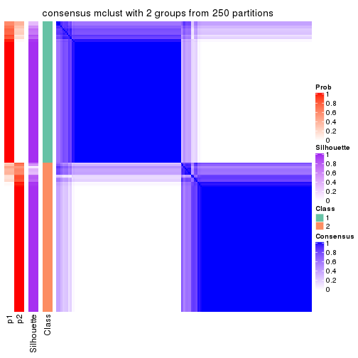</p>

</div>
<div id='tab-MAD-mclust-consensus-heatmap-2'>
<pre><code class="r">consensus_heatmap(res, k = 3)
</code></pre>

<p>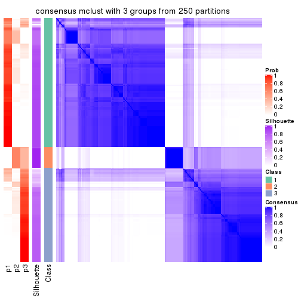</p>

</div>
<div id='tab-MAD-mclust-consensus-heatmap-3'>
<pre><code class="r">consensus_heatmap(res, k = 4)
</code></pre>

<p>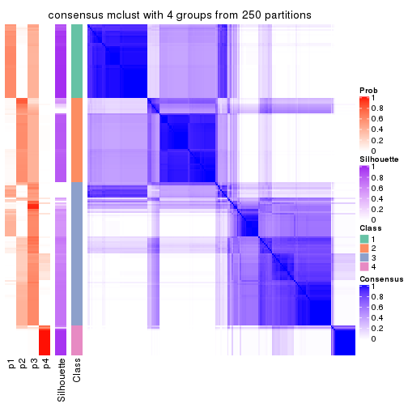</p>

</div>
<div id='tab-MAD-mclust-consensus-heatmap-4'>
<pre><code class="r">consensus_heatmap(res, k = 5)
</code></pre>

<p>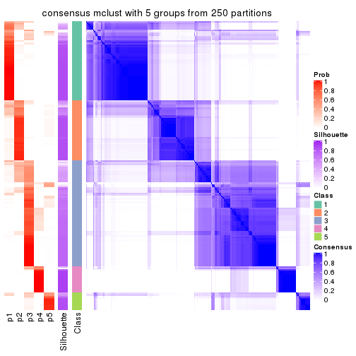</p>

</div>
<div id='tab-MAD-mclust-consensus-heatmap-5'>
<pre><code class="r">consensus_heatmap(res, k = 6)
</code></pre>

<p>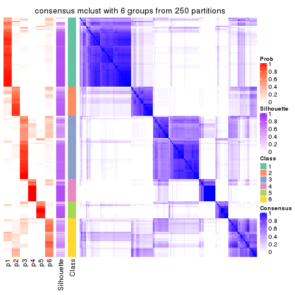</p>

</div>
</div>

Heatmaps for the membership of samples in all partitions to see how consistent they are:


<script>
$( function() {
	$( '#tabs-MAD-mclust-membership-heatmap' ).tabs();
} );
</script>
<div id='tabs-MAD-mclust-membership-heatmap'>
<ul>
<li><a href='#tab-MAD-mclust-membership-heatmap-1'>k = 2</a></li>
<li><a href='#tab-MAD-mclust-membership-heatmap-2'>k = 3</a></li>
<li><a href='#tab-MAD-mclust-membership-heatmap-3'>k = 4</a></li>
<li><a href='#tab-MAD-mclust-membership-heatmap-4'>k = 5</a></li>
<li><a href='#tab-MAD-mclust-membership-heatmap-5'>k = 6</a></li>
</ul>
<div id='tab-MAD-mclust-membership-heatmap-1'>
<pre><code class="r">membership_heatmap(res, k = 2)
</code></pre>

<p>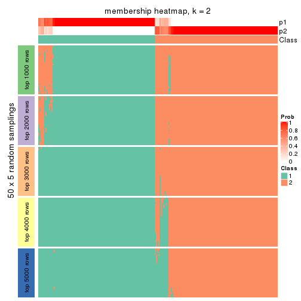</p>

</div>
<div id='tab-MAD-mclust-membership-heatmap-2'>
<pre><code class="r">membership_heatmap(res, k = 3)
</code></pre>

<p>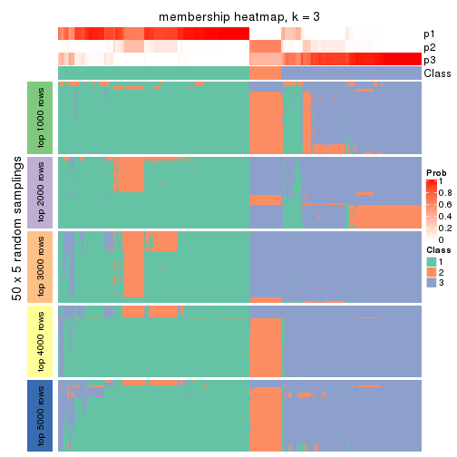</p>

</div>
<div id='tab-MAD-mclust-membership-heatmap-3'>
<pre><code class="r">membership_heatmap(res, k = 4)
</code></pre>

<p>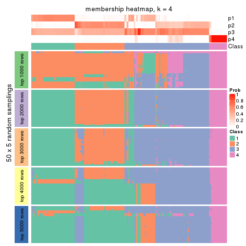</p>

</div>
<div id='tab-MAD-mclust-membership-heatmap-4'>
<pre><code class="r">membership_heatmap(res, k = 5)
</code></pre>

<p>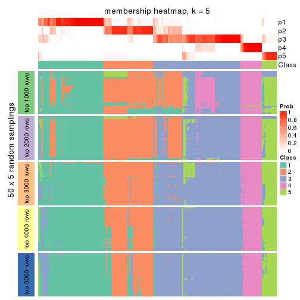</p>

</div>
<div id='tab-MAD-mclust-membership-heatmap-5'>
<pre><code class="r">membership_heatmap(res, k = 6)
</code></pre>

<p>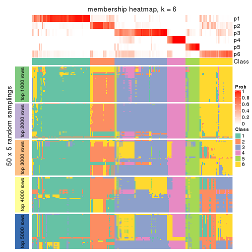</p>

</div>
</div>

As soon as we have had the classes for columns, we can look for signatures
which are significantly different between classes which can be candidate marks
for certain classes. Following are the heatmaps for signatures.


Signature heatmaps where rows are scaled:


<script>
$( function() {
	$( '#tabs-MAD-mclust-get-signatures' ).tabs();
} );
</script>
<div id='tabs-MAD-mclust-get-signatures'>
<ul>
<li><a href='#tab-MAD-mclust-get-signatures-1'>k = 2</a></li>
<li><a href='#tab-MAD-mclust-get-signatures-2'>k = 3</a></li>
<li><a href='#tab-MAD-mclust-get-signatures-3'>k = 4</a></li>
<li><a href='#tab-MAD-mclust-get-signatures-4'>k = 5</a></li>
<li><a href='#tab-MAD-mclust-get-signatures-5'>k = 6</a></li>
</ul>
<div id='tab-MAD-mclust-get-signatures-1'>
<pre><code class="r">get_signatures(res, k = 2)
</code></pre>

<p>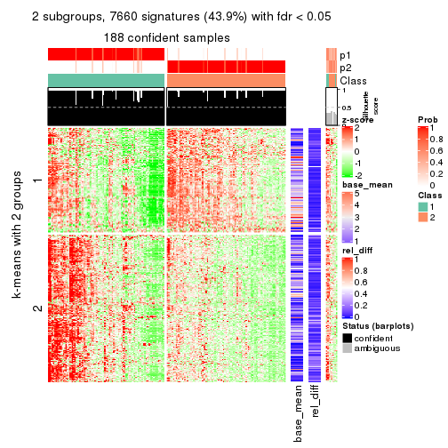</p>

</div>
<div id='tab-MAD-mclust-get-signatures-2'>
<pre><code class="r">get_signatures(res, k = 3)
</code></pre>

<p>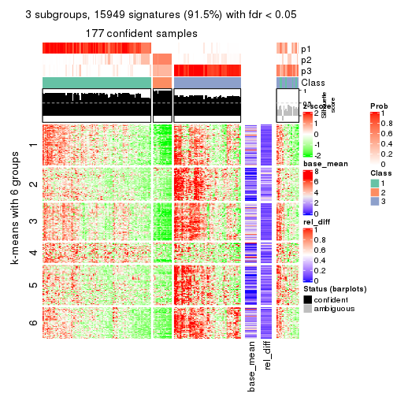</p>

</div>
<div id='tab-MAD-mclust-get-signatures-3'>
<pre><code class="r">get_signatures(res, k = 4)
</code></pre>

<p>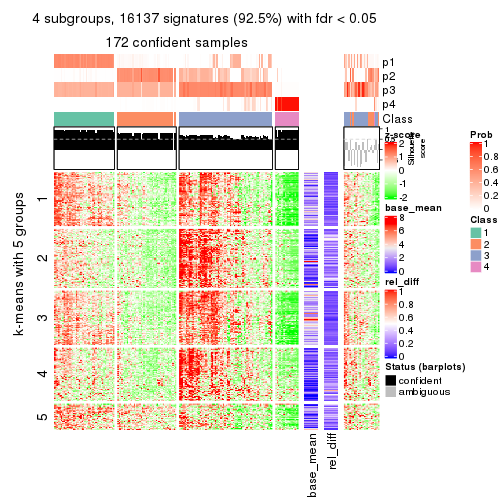</p>

</div>
<div id='tab-MAD-mclust-get-signatures-4'>
<pre><code class="r">get_signatures(res, k = 5)
</code></pre>

<p>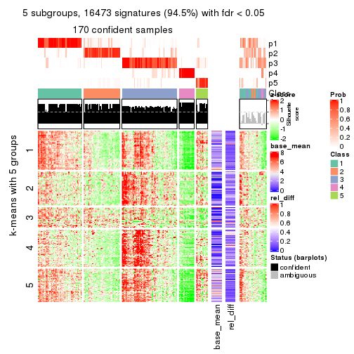</p>

</div>
<div id='tab-MAD-mclust-get-signatures-5'>
<pre><code class="r">get_signatures(res, k = 6)
</code></pre>

<p>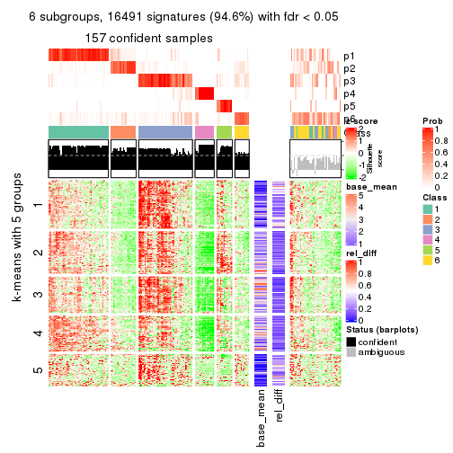</p>

</div>
</div>


Signature heatmaps where rows are not scaled:


<script>
$( function() {
	$( '#tabs-MAD-mclust-get-signatures-no-scale' ).tabs();
} );
</script>
<div id='tabs-MAD-mclust-get-signatures-no-scale'>
<ul>
<li><a href='#tab-MAD-mclust-get-signatures-no-scale-1'>k = 2</a></li>
<li><a href='#tab-MAD-mclust-get-signatures-no-scale-2'>k = 3</a></li>
<li><a href='#tab-MAD-mclust-get-signatures-no-scale-3'>k = 4</a></li>
<li><a href='#tab-MAD-mclust-get-signatures-no-scale-4'>k = 5</a></li>
<li><a href='#tab-MAD-mclust-get-signatures-no-scale-5'>k = 6</a></li>
</ul>
<div id='tab-MAD-mclust-get-signatures-no-scale-1'>
<pre><code class="r">get_signatures(res, k = 2, scale_rows = FALSE)
</code></pre>

<p>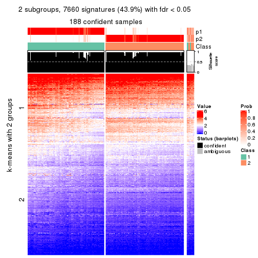</p>

</div>
<div id='tab-MAD-mclust-get-signatures-no-scale-2'>
<pre><code class="r">get_signatures(res, k = 3, scale_rows = FALSE)
</code></pre>

<p>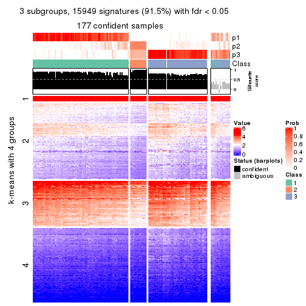</p>

</div>
<div id='tab-MAD-mclust-get-signatures-no-scale-3'>
<pre><code class="r">get_signatures(res, k = 4, scale_rows = FALSE)
</code></pre>

<p>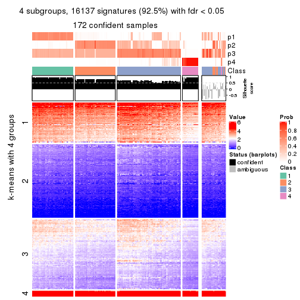</p>

</div>
<div id='tab-MAD-mclust-get-signatures-no-scale-4'>
<pre><code class="r">get_signatures(res, k = 5, scale_rows = FALSE)
</code></pre>

<p>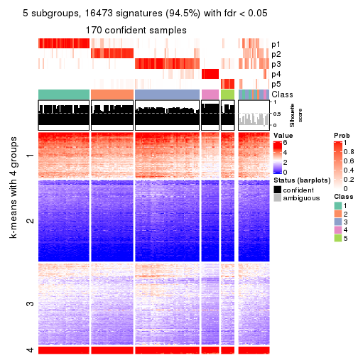</p>

</div>
<div id='tab-MAD-mclust-get-signatures-no-scale-5'>
<pre><code class="r">get_signatures(res, k = 6, scale_rows = FALSE)
</code></pre>

<p>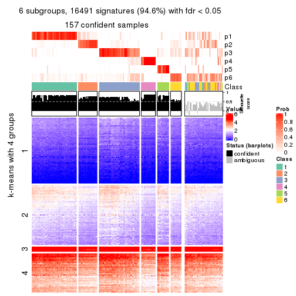</p>

</div>
</div>


Compare the overlap of signatures from different k:

```r
compare_signatures(res)
```

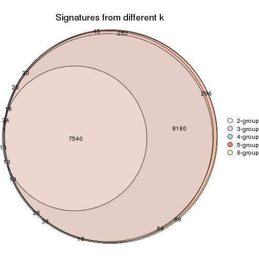

`get_signature()` returns a data frame invisibly. TO get the list of signatures, the function
call should be assigned to a variable explicitly. In following code, if `plot` argument is set
to `FALSE`, no heatmap is plotted while only the differential analysis is performed.

```r
# code only for demonstration
tb = get_signature(res, k = ..., plot = FALSE)
```

An example of the output of `tb` is:

```
#>   which_row         fdr    mean_1    mean_2 scaled_mean_1 scaled_mean_2 km
#> 1        38 0.042760348  8.373488  9.131774    -0.5533452     0.5164555  1
#> 2        40 0.018707592  7.106213  8.469186    -0.6173731     0.5762149  1
#> 3        55 0.019134737 10.221463 11.207825    -0.6159697     0.5749050  1
#> 4        59 0.006059896  5.921854  7.869574    -0.6899429     0.6439467  1
#> 5        60 0.018055526  8.928898 10.211722    -0.6204761     0.5791110  1
#> 6        98 0.009384629 15.714769 14.887706     0.6635654    -0.6193277  2
...
```

The columns in `tb` are:

1. `which_row`: row indices corresponding to the input matrix.
2. `fdr`: FDR for the differential test. 
3. `mean_x`: The mean value in group x.
4. `scaled_mean_x`: The mean value in group x after rows are scaled.
5. `km`: Row groups if k-means clustering is applied to rows.


UMAP plot which shows how samples are separated.


<script>
$( function() {
	$( '#tabs-MAD-mclust-dimension-reduction' ).tabs();
} );
</script>
<div id='tabs-MAD-mclust-dimension-reduction'>
<ul>
<li><a href='#tab-MAD-mclust-dimension-reduction-1'>k = 2</a></li>
<li><a href='#tab-MAD-mclust-dimension-reduction-2'>k = 3</a></li>
<li><a href='#tab-MAD-mclust-dimension-reduction-3'>k = 4</a></li>
<li><a href='#tab-MAD-mclust-dimension-reduction-4'>k = 5</a></li>
<li><a href='#tab-MAD-mclust-dimension-reduction-5'>k = 6</a></li>
</ul>
<div id='tab-MAD-mclust-dimension-reduction-1'>
<pre><code class="r">dimension_reduction(res, k = 2, method = &quot;UMAP&quot;)
</code></pre>

<p>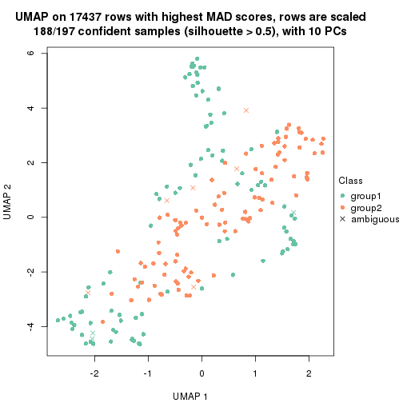</p>

</div>
<div id='tab-MAD-mclust-dimension-reduction-2'>
<pre><code class="r">dimension_reduction(res, k = 3, method = &quot;UMAP&quot;)
</code></pre>

<p>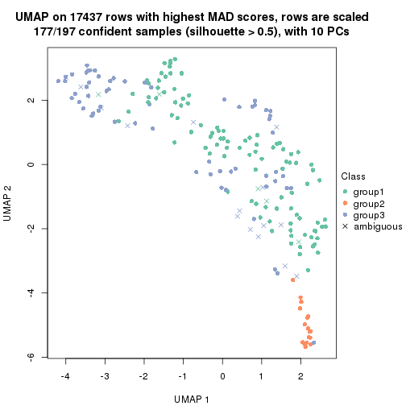</p>

</div>
<div id='tab-MAD-mclust-dimension-reduction-3'>
<pre><code class="r">dimension_reduction(res, k = 4, method = &quot;UMAP&quot;)
</code></pre>

<p>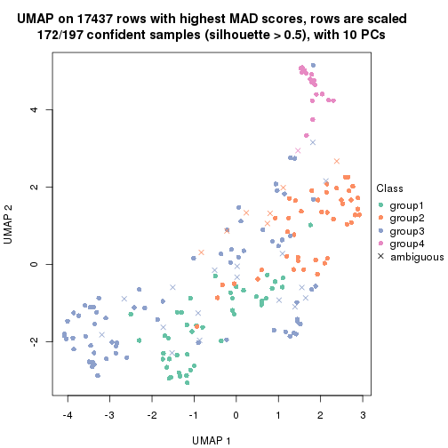</p>

</div>
<div id='tab-MAD-mclust-dimension-reduction-4'>
<pre><code class="r">dimension_reduction(res, k = 5, method = &quot;UMAP&quot;)
</code></pre>

<p>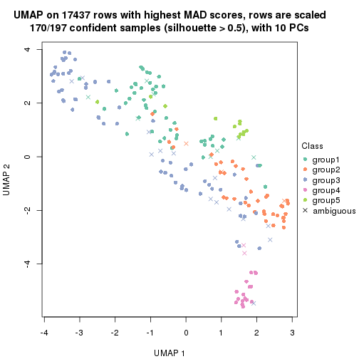</p>

</div>
<div id='tab-MAD-mclust-dimension-reduction-5'>
<pre><code class="r">dimension_reduction(res, k = 6, method = &quot;UMAP&quot;)
</code></pre>

<p>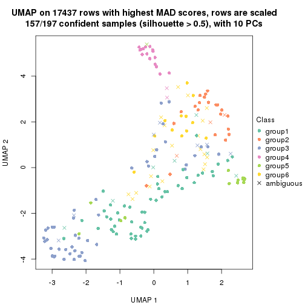</p>

</div>
</div>


Following heatmap shows how subgroups are split when increasing `k`:

```r
collect_classes(res)
```

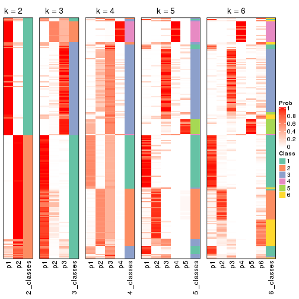


If matrix rows can be associated to genes, consider to use `GO_Enrichment(res,
...)` to perform function enrichment for the signature genes.


 

---------------------------------------------------


### MAD:NMF


The object with results only for a single top-value method and a single partition method 
can be extracted as:

```r
res = res_list["MAD", "NMF"]
# you can also extract it by
# res = res_list["MAD:NMF"]
```

A summary of `res` and all the functions that can be applied to it:

```r
res
```

```
#> A 'ConsensusPartition' object with k = 2, 3, 4, 5, 6.
#>   On a matrix with 17437 rows and 197 columns.
#>   Top rows (1000, 2000, 3000, 4000, 5000) are extracted by 'MAD' method.
#>   Subgroups are detected by 'NMF' method.
#>   Performed in total 1250 partitions by row resampling.
#>   Best k for subgroups seems to be 2.
#> 
#> Following methods can be applied to this 'ConsensusPartition' object:
#>  [1] "cola_report"             "collect_classes"         "collect_plots"          
#>  [4] "collect_stats"           "colnames"                "compare_signatures"     
#>  [7] "consensus_heatmap"       "dimension_reduction"     "functional_enrichment"  
#> [10] "get_anno_col"            "get_anno"                "get_classes"            
#> [13] "get_consensus"           "get_matrix"              "get_membership"         
#> [16] "get_param"               "get_signatures"          "get_stats"              
#> [19] "is_best_k"               "is_stable_k"             "membership_heatmap"     
#> [22] "ncol"                    "nrow"                    "plot_ecdf"              
#> [25] "rownames"                "select_partition_number" "show"                   
#> [28] "suggest_best_k"          "test_to_known_factors"
```

`collect_plots()` function collects all the plots made from `res` for all `k` (number of partitions)
into one single page to provide an easy and fast comparison between different `k`.

```r
collect_plots(res)
```

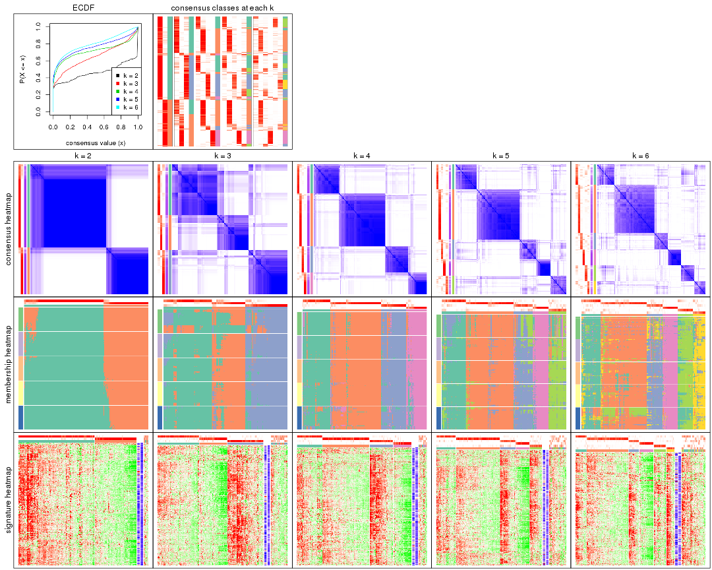

The plots are:

- The first row: a plot of the ECDF (Empirical cumulative distribution
  function) curves of the consensus matrix for each `k` and the heatmap of
  predicted classes for each `k`.
- The second row: heatmaps of the consensus matrix for each `k`.
- The third row: heatmaps of the membership matrix for each `k`.
- The fouth row: heatmaps of the signatures for each `k`.

All the plots in panels can be made by individual functions and they are
plotted later in this section.

`select_partition_number()` produces several plots showing different
statistics for choosing "optimized" `k`. There are following statistics:

- ECDF curves of the consensus matrix for each `k`;
- 1-PAC. [The PAC
  score](https://en.wikipedia.org/wiki/Consensus_clustering#Over-interpretation_potential_of_consensus_clustering)
  measures the proportion of the ambiguous subgrouping.
- Mean silhouette score.
- Concordance. The mean probability of fiting the consensus class ids in all
  partitions.
- Area increased. Denote $A_k$ as the area under the ECDF curve for current
  `k`, the area increased is defined as $A_k - A_{k-1}$.
- Rand index. The percent of pairs of samples that are both in a same cluster
  or both are not in a same cluster in the partition of k and k-1.
- Jaccard index. The ratio of pairs of samples are both in a same cluster in
  the partition of k and k-1 and the pairs of samples are both in a same
  cluster in the partition k or k-1.

The detailed explanations of these statistics can be found in [the cola
vignette](http://bioconductor.org/packages/devel/bioc/vignettes/cola/inst/doc/cola.html#toc_13).

Generally speaking, lower PAC score, higher mean silhouette score or higher
concordance corresponds to better partition. Rand index and Jaccard index
measure how similar the current partition is compared to partition with `k-1`.
If they are too similar, we won't accept `k` is better than `k-1`.

```r
select_partition_number(res)
```

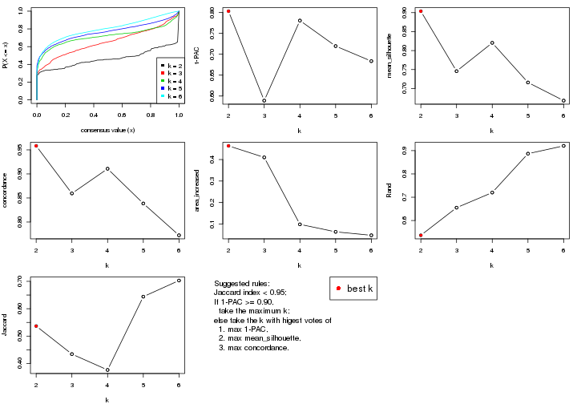

The numeric values for all these statistics can be obtained by `get_stats()`.

```r
get_stats(res)
```

```
#>   k 1-PAC mean_silhouette concordance area_increased  Rand Jaccard
#> 2 2 0.803           0.904       0.958         0.4636 0.537   0.537
#> 3 3 0.589           0.746       0.859         0.4099 0.655   0.434
#> 4 4 0.781           0.820       0.911         0.0986 0.720   0.376
#> 5 5 0.719           0.716       0.839         0.0638 0.887   0.644
#> 6 6 0.683           0.668       0.772         0.0477 0.920   0.703
```

`suggest_best_k()` suggests the best $k$ based on these statistics. The rules are as follows:

- All $k$ with Jaccard index larger than 0.95 are removed because the increase of
  the partition number does not provides enough extra information. If all $k$ are removed,
  the best $k$ is assigned by `NA`.
- For $k$ with 1-PAC larger than 0.9, the maximal $k$ is taken as the "best k". Other $k$ is called "optional k".
- If it does not fit the second rule. The $k$ with the highest vote of highest
  1-PAC, mean silhouette and concordance is taken as the "best k".

```r
suggest_best_k(res)
```

```
#> [1] 2
```


Following shows the table of the partitions (You need to click the **show/hide
code output** link to see it). The membership matrix (columns with name `p*`)
is inferred by
[`clue::cl_consensus()`](https://www.rdocumentation.org/link/cl_consensus?package=clue)
function with the `SE` method. Basically the value in the membership matrix
represents the probability to belong to a certain group. The finall class
label for an item is determined with the group with highest probability it
belongs to.

In `get_classes()` function, the entropy is calculated from the membership
matrix and the silhouette score is calculated from the consensus matrix.


<script>
$( function() {
	$( '#tabs-MAD-NMF-get-classes' ).tabs();
} );
</script>
<div id='tabs-MAD-NMF-get-classes'>
<ul>
<li><a href='#tab-MAD-NMF-get-classes-1'>k = 2</a></li>
<li><a href='#tab-MAD-NMF-get-classes-2'>k = 3</a></li>
<li><a href='#tab-MAD-NMF-get-classes-3'>k = 4</a></li>
<li><a href='#tab-MAD-NMF-get-classes-4'>k = 5</a></li>
<li><a href='#tab-MAD-NMF-get-classes-5'>k = 6</a></li>
</ul>

<div id='tab-MAD-NMF-get-classes-1'>
<p><a id='tab-MAD-NMF-get-classes-1-a' style='color:#0366d6' href='#'>show/hide code output</a></p>
<pre><code class="r">cbind(get_classes(res, k = 2), get_membership(res, k = 2))
</code></pre>

<pre><code>#&gt;            class entropy silhouette    p1    p2
#&gt; SRR1380886     1  0.0000      0.957 1.000 0.000
#&gt; SRR1074385     1  0.0000      0.957 1.000 0.000
#&gt; SRR1374739     1  0.0000      0.957 1.000 0.000
#&gt; SRR1097883     1  0.0000      0.957 1.000 0.000
#&gt; SRR2167209     1  0.0000      0.957 1.000 0.000
#&gt; SRR816541      2  0.0000      0.951 0.000 1.000
#&gt; SRR663645      2  0.9552      0.399 0.376 0.624
#&gt; SRR1381505     2  0.0000      0.951 0.000 1.000
#&gt; SRR1416362     2  0.0000      0.951 0.000 1.000
#&gt; SRR1318503     1  0.7602      0.733 0.780 0.220
#&gt; SRR1341626     2  0.0000      0.951 0.000 1.000
#&gt; SRR1382440     1  0.0000      0.957 1.000 0.000
#&gt; SRR1088413     1  0.0000      0.957 1.000 0.000
#&gt; SRR1082080     2  0.0000      0.951 0.000 1.000
#&gt; SRR1455783     1  0.0000      0.957 1.000 0.000
#&gt; SRR1447760     1  0.0000      0.957 1.000 0.000
#&gt; SRR1487784     2  0.0000      0.951 0.000 1.000
#&gt; SRR1331037     2  0.7056      0.749 0.192 0.808
#&gt; SRR1095651     1  0.0000      0.957 1.000 0.000
#&gt; SRR1078066     1  0.0000      0.957 1.000 0.000
#&gt; SRR1120363     1  0.0000      0.957 1.000 0.000
#&gt; SRR821231      1  0.0000      0.957 1.000 0.000
#&gt; SRR1374373     1  0.8443      0.651 0.728 0.272
#&gt; SRR1324519     2  0.0000      0.951 0.000 1.000
#&gt; SRR1431121     1  0.0000      0.957 1.000 0.000
#&gt; SRR1091032     2  0.0000      0.951 0.000 1.000
#&gt; SRR1365575     2  0.0000      0.951 0.000 1.000
#&gt; SRR1072972     1  0.0000      0.957 1.000 0.000
#&gt; SRR1310690     2  0.0376      0.948 0.004 0.996
#&gt; SRR1383037     1  0.0000      0.957 1.000 0.000
#&gt; SRR1095479     1  0.0000      0.957 1.000 0.000
#&gt; SRR1070403     1  0.0000      0.957 1.000 0.000
#&gt; SRR1390203     1  0.0000      0.957 1.000 0.000
#&gt; SRR1072007     1  0.7815      0.716 0.768 0.232
#&gt; SRR1468787     1  0.0000      0.957 1.000 0.000
#&gt; SRR1347959     2  0.0938      0.943 0.012 0.988
#&gt; SRR1338513     1  0.0000      0.957 1.000 0.000
#&gt; SRR812598      2  0.0000      0.951 0.000 1.000
#&gt; SRR1446806     1  0.6048      0.823 0.852 0.148
#&gt; SRR1394275     1  0.0000      0.957 1.000 0.000
#&gt; SRR1443633     1  0.0000      0.957 1.000 0.000
#&gt; SRR1087728     1  0.0000      0.957 1.000 0.000
#&gt; SRR1098192     2  0.0000      0.951 0.000 1.000
#&gt; SRR1093340     2  0.0000      0.951 0.000 1.000
#&gt; SRR665405      1  0.0000      0.957 1.000 0.000
#&gt; SRR657077      2  0.0000      0.951 0.000 1.000
#&gt; SRR813208      1  0.0000      0.957 1.000 0.000
#&gt; SRR1416074     2  0.0000      0.951 0.000 1.000
#&gt; SRR1089688     1  0.7950      0.705 0.760 0.240
#&gt; SRR1353461     1  0.0000      0.957 1.000 0.000
#&gt; SRR1466321     1  0.8016      0.697 0.756 0.244
#&gt; SRR1073021     1  0.0000      0.957 1.000 0.000
#&gt; SRR1322816     2  0.0000      0.951 0.000 1.000
#&gt; SRR1457727     1  0.0000      0.957 1.000 0.000
#&gt; SRR1464226     2  0.0000      0.951 0.000 1.000
#&gt; SRR1398863     1  0.0000      0.957 1.000 0.000
#&gt; SRR1455631     1  0.9775      0.326 0.588 0.412
#&gt; SRR1307808     1  0.4562      0.876 0.904 0.096
#&gt; SRR1374585     2  0.0000      0.951 0.000 1.000
#&gt; SRR1072104     2  0.9977      0.080 0.472 0.528
#&gt; SRR1076868     2  0.0000      0.951 0.000 1.000
#&gt; SRR1335984     1  0.9686      0.370 0.604 0.396
#&gt; SRR1445939     1  0.8499      0.644 0.724 0.276
#&gt; SRR1453047     2  0.0000      0.951 0.000 1.000
#&gt; SRR1339788     1  0.0000      0.957 1.000 0.000
#&gt; SRR1084323     1  0.0376      0.954 0.996 0.004
#&gt; SRR1092937     1  0.0000      0.957 1.000 0.000
#&gt; SRR1074090     2  0.0000      0.951 0.000 1.000
#&gt; SRR1099833     1  0.0000      0.957 1.000 0.000
#&gt; SRR1093434     1  0.0000      0.957 1.000 0.000
#&gt; SRR1435857     1  0.0000      0.957 1.000 0.000
#&gt; SRR1480347     2  0.0000      0.951 0.000 1.000
#&gt; SRR1440787     2  0.0000      0.951 0.000 1.000
#&gt; SRR1430202     1  0.0000      0.957 1.000 0.000
#&gt; SRR1322730     2  0.0000      0.951 0.000 1.000
#&gt; SRR811029      2  0.0000      0.951 0.000 1.000
#&gt; SRR1390456     1  0.0000      0.957 1.000 0.000
#&gt; SRR1381140     1  0.4690      0.872 0.900 0.100
#&gt; SRR1388064     2  0.0000      0.951 0.000 1.000
#&gt; SRR1093577     1  0.0000      0.957 1.000 0.000
#&gt; SRR1414161     1  0.5946      0.827 0.856 0.144
#&gt; SRR1328738     1  0.0000      0.957 1.000 0.000
#&gt; SRR1311752     2  0.0000      0.951 0.000 1.000
#&gt; SRR1445960     2  0.0000      0.951 0.000 1.000
#&gt; SRR1403412     2  0.0000      0.951 0.000 1.000
#&gt; SRR2166748     1  0.0000      0.957 1.000 0.000
#&gt; SRR821666      2  0.0000      0.951 0.000 1.000
#&gt; SRR1330746     1  0.0000      0.957 1.000 0.000
#&gt; SRR1327872     2  0.0000      0.951 0.000 1.000
#&gt; SRR1100800     1  0.0000      0.957 1.000 0.000
#&gt; SRR1075174     1  0.0000      0.957 1.000 0.000
#&gt; SRR1434436     1  0.8499      0.644 0.724 0.276
#&gt; SRR1389409     2  0.0000      0.951 0.000 1.000
#&gt; SRR1085310     1  0.0000      0.957 1.000 0.000
#&gt; SRR1376718     2  0.0000      0.951 0.000 1.000
#&gt; SRR808590      2  0.0000      0.951 0.000 1.000
#&gt; SRR1084128     2  0.0000      0.951 0.000 1.000
#&gt; SRR1361692     1  0.0000      0.957 1.000 0.000
#&gt; SRR1431493     1  0.0000      0.957 1.000 0.000
#&gt; SRR1409084     1  0.0000      0.957 1.000 0.000
#&gt; SRR2166214     1  0.0000      0.957 1.000 0.000
#&gt; SRR1324102     2  0.0000      0.951 0.000 1.000
#&gt; SRR1079754     2  0.0000      0.951 0.000 1.000
#&gt; SRR1442127     1  0.0000      0.957 1.000 0.000
#&gt; SRR1076244     2  0.0000      0.951 0.000 1.000
#&gt; SRR1330901     1  0.8081      0.691 0.752 0.248
#&gt; SRR1073167     2  0.0000      0.951 0.000 1.000
#&gt; SRR1357541     1  0.0000      0.957 1.000 0.000
#&gt; SRR811607      1  0.5178      0.857 0.884 0.116
#&gt; SRR1468931     1  0.0000      0.957 1.000 0.000
#&gt; SRR1474908     2  0.2043      0.928 0.032 0.968
#&gt; SRR1309875     2  0.0000      0.951 0.000 1.000
#&gt; SRR598792      1  0.0000      0.957 1.000 0.000
#&gt; SRR1088537     2  0.0000      0.951 0.000 1.000
#&gt; SRR1457682     1  0.0000      0.957 1.000 0.000
#&gt; SRR1454289     1  0.7056      0.771 0.808 0.192
#&gt; SRR1069352     1  0.0000      0.957 1.000 0.000
#&gt; SRR1472728     2  0.0000      0.951 0.000 1.000
#&gt; SRR1091144     1  0.0000      0.957 1.000 0.000
#&gt; SRR1319118     1  0.0000      0.957 1.000 0.000
#&gt; SRR1403611     1  0.0000      0.957 1.000 0.000
#&gt; SRR1397762     1  0.0000      0.957 1.000 0.000
#&gt; SRR1317387     1  0.0000      0.957 1.000 0.000
#&gt; SRR1376426     2  0.0000      0.951 0.000 1.000
#&gt; SRR1097777     1  0.0000      0.957 1.000 0.000
#&gt; SRR1365743     1  0.0000      0.957 1.000 0.000
#&gt; SRR1458992     2  0.1633      0.934 0.024 0.976
#&gt; SRR1089537     1  0.0000      0.957 1.000 0.000
#&gt; SRR1397744     1  0.0000      0.957 1.000 0.000
#&gt; SRR1453893     2  0.0000      0.951 0.000 1.000
#&gt; SRR1098543     1  0.0000      0.957 1.000 0.000
#&gt; SRR1321765     1  0.0000      0.957 1.000 0.000
#&gt; SRR1440032     1  0.0000      0.957 1.000 0.000
#&gt; SRR1404507     2  0.0000      0.951 0.000 1.000
#&gt; SRR1404856     1  0.0000      0.957 1.000 0.000
#&gt; SRR812745      2  0.9795      0.283 0.416 0.584
#&gt; SRR1417524     1  0.0000      0.957 1.000 0.000
#&gt; SRR1407334     2  0.0000      0.951 0.000 1.000
#&gt; SRR1453991     1  0.0000      0.957 1.000 0.000
#&gt; SRR1415938     1  0.0000      0.957 1.000 0.000
#&gt; SRR1081259     1  0.1843      0.935 0.972 0.028
#&gt; SRR1436187     2  0.0000      0.951 0.000 1.000
#&gt; SRR1431948     1  0.0000      0.957 1.000 0.000
#&gt; SRR1453277     1  0.0000      0.957 1.000 0.000
#&gt; SRR1095407     1  0.0000      0.957 1.000 0.000
#&gt; SRR1359694     2  0.8813      0.574 0.300 0.700
#&gt; SRR656982      1  0.0000      0.957 1.000 0.000
#&gt; SRR1354338     2  0.8955      0.550 0.312 0.688
#&gt; SRR1088291     1  0.0000      0.957 1.000 0.000
#&gt; SRR1080624     1  0.0000      0.957 1.000 0.000
#&gt; SRR2166708     1  0.0000      0.957 1.000 0.000
#&gt; SRR1393572     1  0.0000      0.957 1.000 0.000
#&gt; SRR1429912     1  0.7219      0.761 0.800 0.200
#&gt; SRR1421048     1  0.6623      0.795 0.828 0.172
#&gt; SRR1434999     1  0.0000      0.957 1.000 0.000
#&gt; SRR656457      1  0.0000      0.957 1.000 0.000
#&gt; SRR1098928     1  0.0000      0.957 1.000 0.000
#&gt; SRR1343967     2  0.0000      0.951 0.000 1.000
#&gt; SRR1360766     1  0.0000      0.957 1.000 0.000
#&gt; SRR1464724     2  0.0000      0.951 0.000 1.000
#&gt; SRR1101542     2  0.0000      0.951 0.000 1.000
#&gt; SRR1401528     1  0.0000      0.957 1.000 0.000
#&gt; SRR1071519     1  0.0000      0.957 1.000 0.000
#&gt; SRR1086070     1  0.0000      0.957 1.000 0.000
#&gt; SRR1358645     2  0.8386      0.633 0.268 0.732
#&gt; SRR819771      1  0.0000      0.957 1.000 0.000
#&gt; SRR1418433     2  0.0938      0.943 0.012 0.988
#&gt; SRR821050      1  0.0000      0.957 1.000 0.000
#&gt; SRR1402091     2  0.0000      0.951 0.000 1.000
#&gt; SRR1322028     2  0.8499      0.619 0.276 0.724
#&gt; SRR1452556     2  0.0000      0.951 0.000 1.000
#&gt; SRR1340047     1  0.7139      0.766 0.804 0.196
#&gt; SRR1418302     2  0.2778      0.913 0.048 0.952
#&gt; SRR1073991     1  0.0000      0.957 1.000 0.000
#&gt; SRR1085187     1  0.0000      0.957 1.000 0.000
#&gt; SRR1357618     1  0.0000      0.957 1.000 0.000
#&gt; SRR1487764     1  0.0000      0.957 1.000 0.000
#&gt; SRR1075336     1  0.0000      0.957 1.000 0.000
#&gt; SRR1365471     2  0.0000      0.951 0.000 1.000
#&gt; SRR1414613     2  0.0672      0.946 0.008 0.992
#&gt; SRR658719      2  0.3114      0.906 0.056 0.944
#&gt; SRR1475128     1  0.0000      0.957 1.000 0.000
#&gt; SRR1367630     1  0.8016      0.698 0.756 0.244
#&gt; SRR1481146     1  0.9552      0.426 0.624 0.376
#&gt; SRR1465674     1  0.0000      0.957 1.000 0.000
#&gt; SRR1327303     1  0.7139      0.766 0.804 0.196
#&gt; SRR1390391     2  0.9248      0.488 0.340 0.660
#&gt; SRR1326020     1  0.0000      0.957 1.000 0.000
#&gt; SRR1381953     1  0.0000      0.957 1.000 0.000
#&gt; SRR1082544     2  0.0938      0.943 0.012 0.988
#&gt; SRR810761      1  0.0000      0.957 1.000 0.000
#&gt; SRR1070764     1  0.0000      0.957 1.000 0.000
#&gt; SRR1415919     1  0.0000      0.957 1.000 0.000
#&gt; SRR1490404     2  0.1414      0.937 0.020 0.980
#&gt; SRR1416773     1  0.0000      0.957 1.000 0.000
#&gt; SRR1377492     1  0.0000      0.957 1.000 0.000
#&gt; SRR1334314     1  0.0000      0.957 1.000 0.000
</code></pre>

<script>
$('#tab-MAD-NMF-get-classes-1-a').parent().next().next().hide();
$('#tab-MAD-NMF-get-classes-1-a').click(function(){
  $('#tab-MAD-NMF-get-classes-1-a').parent().next().next().toggle();
  return(false);
});
</script>
</div>

<div id='tab-MAD-NMF-get-classes-2'>
<p><a id='tab-MAD-NMF-get-classes-2-a' style='color:#0366d6' href='#'>show/hide code output</a></p>
<pre><code class="r">cbind(get_classes(res, k = 3), get_membership(res, k = 3))
</code></pre>

<pre><code>#&gt;            class entropy silhouette    p1    p2    p3
#&gt; SRR1380886     3  0.0237      0.882 0.004 0.000 0.996
#&gt; SRR1074385     1  0.2796      0.813 0.908 0.000 0.092
#&gt; SRR1374739     3  0.0000      0.883 0.000 0.000 1.000
#&gt; SRR1097883     1  0.4555      0.690 0.800 0.000 0.200
#&gt; SRR2167209     1  0.3686      0.762 0.860 0.000 0.140
#&gt; SRR816541      2  0.3816      0.779 0.148 0.852 0.000
#&gt; SRR663645      2  0.0237      0.835 0.004 0.996 0.000
#&gt; SRR1381505     2  0.0000      0.836 0.000 1.000 0.000
#&gt; SRR1416362     1  0.2959      0.818 0.900 0.100 0.000
#&gt; SRR1318503     1  0.0000      0.847 1.000 0.000 0.000
#&gt; SRR1341626     2  0.6235      0.337 0.436 0.564 0.000
#&gt; SRR1382440     3  0.0592      0.881 0.012 0.000 0.988
#&gt; SRR1088413     3  0.1529      0.873 0.040 0.000 0.960
#&gt; SRR1082080     2  0.6295      0.232 0.472 0.528 0.000
#&gt; SRR1455783     1  0.0592      0.847 0.988 0.012 0.000
#&gt; SRR1447760     1  0.0237      0.846 0.996 0.000 0.004
#&gt; SRR1487784     1  0.2959      0.818 0.900 0.100 0.000
#&gt; SRR1331037     1  0.2878      0.821 0.904 0.096 0.000
#&gt; SRR1095651     3  0.0000      0.883 0.000 0.000 1.000
#&gt; SRR1078066     3  0.6235      0.325 0.436 0.000 0.564
#&gt; SRR1120363     1  0.1643      0.830 0.956 0.000 0.044
#&gt; SRR821231      3  0.1289      0.877 0.032 0.000 0.968
#&gt; SRR1374373     1  0.3500      0.807 0.880 0.116 0.004
#&gt; SRR1324519     2  0.6154      0.409 0.408 0.592 0.000
#&gt; SRR1431121     1  0.3038      0.790 0.896 0.000 0.104
#&gt; SRR1091032     2  0.5706      0.582 0.320 0.680 0.000
#&gt; SRR1365575     2  0.0000      0.836 0.000 1.000 0.000
#&gt; SRR1072972     3  0.2711      0.854 0.088 0.000 0.912
#&gt; SRR1310690     2  0.3116      0.804 0.108 0.892 0.000
#&gt; SRR1383037     3  0.0000      0.883 0.000 0.000 1.000
#&gt; SRR1095479     3  0.4002      0.802 0.160 0.000 0.840
#&gt; SRR1070403     3  0.0000      0.883 0.000 0.000 1.000
#&gt; SRR1390203     1  0.0000      0.847 1.000 0.000 0.000
#&gt; SRR1072007     2  0.5327      0.568 0.000 0.728 0.272
#&gt; SRR1468787     3  0.6235      0.318 0.436 0.000 0.564
#&gt; SRR1347959     1  0.2796      0.823 0.908 0.092 0.000
#&gt; SRR1338513     3  0.0237      0.881 0.000 0.004 0.996
#&gt; SRR812598      2  0.2066      0.823 0.060 0.940 0.000
#&gt; SRR1446806     1  0.2537      0.830 0.920 0.080 0.000
#&gt; SRR1394275     1  0.1529      0.843 0.960 0.000 0.040
#&gt; SRR1443633     3  0.5926      0.509 0.356 0.000 0.644
#&gt; SRR1087728     3  0.0000      0.883 0.000 0.000 1.000
#&gt; SRR1098192     2  0.1860      0.826 0.052 0.948 0.000
#&gt; SRR1093340     1  0.5882      0.397 0.652 0.348 0.000
#&gt; SRR665405      3  0.2261      0.843 0.000 0.068 0.932
#&gt; SRR657077      2  0.6225      0.345 0.432 0.568 0.000
#&gt; SRR813208      3  0.0000      0.883 0.000 0.000 1.000
#&gt; SRR1416074     1  0.3816      0.773 0.852 0.148 0.000
#&gt; SRR1089688     3  0.6154      0.302 0.000 0.408 0.592
#&gt; SRR1353461     3  0.0000      0.883 0.000 0.000 1.000
#&gt; SRR1466321     1  0.0000      0.847 1.000 0.000 0.000
#&gt; SRR1073021     1  0.4654      0.679 0.792 0.000 0.208
#&gt; SRR1322816     2  0.3412      0.796 0.124 0.876 0.000
#&gt; SRR1457727     1  0.0747      0.843 0.984 0.000 0.016
#&gt; SRR1464226     2  0.0000      0.836 0.000 1.000 0.000
#&gt; SRR1398863     3  0.5397      0.609 0.280 0.000 0.720
#&gt; SRR1455631     2  0.5327      0.565 0.000 0.728 0.272
#&gt; SRR1307808     1  0.0000      0.847 1.000 0.000 0.000
#&gt; SRR1374585     2  0.0000      0.836 0.000 1.000 0.000
#&gt; SRR1072104     2  0.0000      0.836 0.000 1.000 0.000
#&gt; SRR1076868     1  0.2448      0.832 0.924 0.076 0.000
#&gt; SRR1335984     2  0.4634      0.764 0.164 0.824 0.012
#&gt; SRR1445939     1  0.3038      0.815 0.896 0.104 0.000
#&gt; SRR1453047     1  0.5650      0.488 0.688 0.312 0.000
#&gt; SRR1339788     3  0.0747      0.881 0.016 0.000 0.984
#&gt; SRR1084323     1  0.1878      0.842 0.952 0.044 0.004
#&gt; SRR1092937     3  0.6361      0.638 0.232 0.040 0.728
#&gt; SRR1074090     1  0.4796      0.671 0.780 0.220 0.000
#&gt; SRR1099833     3  0.4842      0.665 0.000 0.224 0.776
#&gt; SRR1093434     3  0.0000      0.883 0.000 0.000 1.000
#&gt; SRR1435857     1  0.5621      0.498 0.692 0.000 0.308
#&gt; SRR1480347     1  0.6225      0.120 0.568 0.432 0.000
#&gt; SRR1440787     2  0.0000      0.836 0.000 1.000 0.000
#&gt; SRR1430202     1  0.2063      0.842 0.948 0.044 0.008
#&gt; SRR1322730     2  0.0892      0.828 0.000 0.980 0.020
#&gt; SRR811029      2  0.0237      0.836 0.004 0.996 0.000
#&gt; SRR1390456     3  0.0000      0.883 0.000 0.000 1.000
#&gt; SRR1381140     1  0.2796      0.823 0.908 0.092 0.000
#&gt; SRR1388064     2  0.0000      0.836 0.000 1.000 0.000
#&gt; SRR1093577     1  0.2066      0.824 0.940 0.000 0.060
#&gt; SRR1414161     1  0.2066      0.837 0.940 0.060 0.000
#&gt; SRR1328738     1  0.0000      0.847 1.000 0.000 0.000
#&gt; SRR1311752     1  0.3686      0.782 0.860 0.140 0.000
#&gt; SRR1445960     2  0.3192      0.803 0.112 0.888 0.000
#&gt; SRR1403412     2  0.2878      0.810 0.096 0.904 0.000
#&gt; SRR2166748     1  0.6008      0.338 0.628 0.000 0.372
#&gt; SRR821666      2  0.0000      0.836 0.000 1.000 0.000
#&gt; SRR1330746     3  0.0000      0.883 0.000 0.000 1.000
#&gt; SRR1327872     2  0.0000      0.836 0.000 1.000 0.000
#&gt; SRR1100800     1  0.4121      0.732 0.832 0.000 0.168
#&gt; SRR1075174     3  0.3038      0.804 0.104 0.000 0.896
#&gt; SRR1434436     1  0.2261      0.835 0.932 0.068 0.000
#&gt; SRR1389409     2  0.0000      0.836 0.000 1.000 0.000
#&gt; SRR1085310     3  0.0000      0.883 0.000 0.000 1.000
#&gt; SRR1376718     2  0.0000      0.836 0.000 1.000 0.000
#&gt; SRR808590      2  0.0000      0.836 0.000 1.000 0.000
#&gt; SRR1084128     1  0.4291      0.733 0.820 0.180 0.000
#&gt; SRR1361692     1  0.0892      0.843 0.980 0.000 0.020
#&gt; SRR1431493     3  0.4062      0.798 0.164 0.000 0.836
#&gt; SRR1409084     1  0.3192      0.785 0.888 0.000 0.112
#&gt; SRR2166214     3  0.3879      0.778 0.000 0.152 0.848
#&gt; SRR1324102     2  0.6274      0.281 0.456 0.544 0.000
#&gt; SRR1079754     2  0.0000      0.836 0.000 1.000 0.000
#&gt; SRR1442127     3  0.0000      0.883 0.000 0.000 1.000
#&gt; SRR1076244     2  0.4887      0.613 0.000 0.772 0.228
#&gt; SRR1330901     1  0.0000      0.847 1.000 0.000 0.000
#&gt; SRR1073167     2  0.5988      0.498 0.368 0.632 0.000
#&gt; SRR1357541     1  0.5926      0.380 0.644 0.000 0.356
#&gt; SRR811607      1  0.0000      0.847 1.000 0.000 0.000
#&gt; SRR1468931     3  0.0000      0.883 0.000 0.000 1.000
#&gt; SRR1474908     2  0.6274      0.268 0.456 0.544 0.000
#&gt; SRR1309875     2  0.2796      0.811 0.092 0.908 0.000
#&gt; SRR598792      3  0.0000      0.883 0.000 0.000 1.000
#&gt; SRR1088537     1  0.6215      0.144 0.572 0.428 0.000
#&gt; SRR1457682     1  0.0000      0.847 1.000 0.000 0.000
#&gt; SRR1454289     1  0.0000      0.847 1.000 0.000 0.000
#&gt; SRR1069352     3  0.2796      0.852 0.092 0.000 0.908
#&gt; SRR1472728     1  0.5835      0.425 0.660 0.340 0.000
#&gt; SRR1091144     3  0.3148      0.863 0.048 0.036 0.916
#&gt; SRR1319118     3  0.4002      0.791 0.160 0.000 0.840
#&gt; SRR1403611     3  0.2796      0.821 0.000 0.092 0.908
#&gt; SRR1397762     3  0.2878      0.812 0.096 0.000 0.904
#&gt; SRR1317387     3  0.0000      0.883 0.000 0.000 1.000
#&gt; SRR1376426     1  0.3619      0.786 0.864 0.136 0.000
#&gt; SRR1097777     1  0.5529      0.560 0.704 0.000 0.296
#&gt; SRR1365743     3  0.0000      0.883 0.000 0.000 1.000
#&gt; SRR1458992     2  0.5810      0.541 0.336 0.664 0.000
#&gt; SRR1089537     3  0.2066      0.866 0.060 0.000 0.940
#&gt; SRR1397744     1  0.0000      0.847 1.000 0.000 0.000
#&gt; SRR1453893     2  0.0000      0.836 0.000 1.000 0.000
#&gt; SRR1098543     1  0.0000      0.847 1.000 0.000 0.000
#&gt; SRR1321765     1  0.6062      0.301 0.616 0.000 0.384
#&gt; SRR1440032     3  0.0237      0.882 0.004 0.000 0.996
#&gt; SRR1404507     2  0.0000      0.836 0.000 1.000 0.000
#&gt; SRR1404856     1  0.4178      0.727 0.828 0.000 0.172
#&gt; SRR812745      2  0.7979      0.570 0.100 0.628 0.272
#&gt; SRR1417524     3  0.0000      0.883 0.000 0.000 1.000
#&gt; SRR1407334     2  0.0000      0.836 0.000 1.000 0.000
#&gt; SRR1453991     1  0.0000      0.847 1.000 0.000 0.000
#&gt; SRR1415938     1  0.4796      0.680 0.780 0.000 0.220
#&gt; SRR1081259     1  0.2625      0.828 0.916 0.084 0.000
#&gt; SRR1436187     2  0.0000      0.836 0.000 1.000 0.000
#&gt; SRR1431948     3  0.0000      0.883 0.000 0.000 1.000
#&gt; SRR1453277     3  0.5926      0.438 0.356 0.000 0.644
#&gt; SRR1095407     1  0.4702      0.673 0.788 0.000 0.212
#&gt; SRR1359694     1  0.0000      0.847 1.000 0.000 0.000
#&gt; SRR656982      3  0.1643      0.873 0.044 0.000 0.956
#&gt; SRR1354338     1  0.2625      0.828 0.916 0.084 0.000
#&gt; SRR1088291     1  0.1643      0.831 0.956 0.000 0.044
#&gt; SRR1080624     1  0.0000      0.847 1.000 0.000 0.000
#&gt; SRR2166708     3  0.0000      0.883 0.000 0.000 1.000
#&gt; SRR1393572     1  0.0000      0.847 1.000 0.000 0.000
#&gt; SRR1429912     1  0.1860      0.840 0.948 0.052 0.000
#&gt; SRR1421048     1  0.0000      0.847 1.000 0.000 0.000
#&gt; SRR1434999     3  0.2959      0.847 0.100 0.000 0.900
#&gt; SRR656457      3  0.3412      0.832 0.124 0.000 0.876
#&gt; SRR1098928     3  0.0000      0.883 0.000 0.000 1.000
#&gt; SRR1343967     1  0.3752      0.778 0.856 0.144 0.000
#&gt; SRR1360766     3  0.1964      0.862 0.056 0.000 0.944
#&gt; SRR1464724     2  0.2066      0.797 0.000 0.940 0.060
#&gt; SRR1101542     2  0.0000      0.836 0.000 1.000 0.000
#&gt; SRR1401528     3  0.0000      0.883 0.000 0.000 1.000
#&gt; SRR1071519     3  0.0000      0.883 0.000 0.000 1.000
#&gt; SRR1086070     1  0.2165      0.832 0.936 0.000 0.064
#&gt; SRR1358645     1  0.3686      0.784 0.860 0.140 0.000
#&gt; SRR819771      3  0.2625      0.855 0.084 0.000 0.916
#&gt; SRR1418433     2  0.5529      0.505 0.000 0.704 0.296
#&gt; SRR821050      1  0.3267      0.781 0.884 0.000 0.116
#&gt; SRR1402091     2  0.3482      0.793 0.128 0.872 0.000
#&gt; SRR1322028     1  0.2625      0.828 0.916 0.084 0.000
#&gt; SRR1452556     2  0.0000      0.836 0.000 1.000 0.000
#&gt; SRR1340047     1  0.3038      0.815 0.896 0.104 0.000
#&gt; SRR1418302     2  0.0237      0.836 0.004 0.996 0.000
#&gt; SRR1073991     3  0.6045      0.396 0.380 0.000 0.620
#&gt; SRR1085187     3  0.6952      0.169 0.480 0.016 0.504
#&gt; SRR1357618     3  0.3116      0.842 0.108 0.000 0.892
#&gt; SRR1487764     3  0.0000      0.883 0.000 0.000 1.000
#&gt; SRR1075336     1  0.0592      0.844 0.988 0.000 0.012
#&gt; SRR1365471     2  0.6252      0.317 0.444 0.556 0.000
#&gt; SRR1414613     1  0.2959      0.818 0.900 0.100 0.000
#&gt; SRR658719      2  0.3116      0.804 0.108 0.892 0.000
#&gt; SRR1475128     3  0.0000      0.883 0.000 0.000 1.000
#&gt; SRR1367630     3  0.6244      0.238 0.000 0.440 0.560
#&gt; SRR1481146     2  0.4291      0.697 0.000 0.820 0.180
#&gt; SRR1465674     1  0.6026      0.324 0.624 0.000 0.376
#&gt; SRR1327303     1  0.3686      0.786 0.860 0.140 0.000
#&gt; SRR1390391     2  0.5882      0.527 0.348 0.652 0.000
#&gt; SRR1326020     3  0.1529      0.861 0.000 0.040 0.960
#&gt; SRR1381953     3  0.0000      0.883 0.000 0.000 1.000
#&gt; SRR1082544     2  0.5327      0.660 0.272 0.728 0.000
#&gt; SRR810761      3  0.6244      0.314 0.440 0.000 0.560
#&gt; SRR1070764     3  0.0000      0.883 0.000 0.000 1.000
#&gt; SRR1415919     3  0.0000      0.883 0.000 0.000 1.000
#&gt; SRR1490404     1  0.2537      0.830 0.920 0.080 0.000
#&gt; SRR1416773     3  0.6095      0.438 0.392 0.000 0.608
#&gt; SRR1377492     3  0.1753      0.856 0.000 0.048 0.952
#&gt; SRR1334314     1  0.0424      0.846 0.992 0.000 0.008
</code></pre>

<script>
$('#tab-MAD-NMF-get-classes-2-a').parent().next().next().hide();
$('#tab-MAD-NMF-get-classes-2-a').click(function(){
  $('#tab-MAD-NMF-get-classes-2-a').parent().next().next().toggle();
  return(false);
});
</script>
</div>

<div id='tab-MAD-NMF-get-classes-3'>
<p><a id='tab-MAD-NMF-get-classes-3-a' style='color:#0366d6' href='#'>show/hide code output</a></p>
<pre><code class="r">cbind(get_classes(res, k = 4), get_membership(res, k = 4))
</code></pre>

<pre><code>#&gt;            class entropy silhouette    p1    p2    p3    p4
#&gt; SRR1380886     3  0.1557     0.8742 0.056 0.000 0.944 0.000
#&gt; SRR1074385     2  0.0188     0.9312 0.000 0.996 0.004 0.000
#&gt; SRR1374739     1  0.2921     0.8102 0.860 0.000 0.140 0.000
#&gt; SRR1097883     1  0.1474     0.8709 0.948 0.052 0.000 0.000
#&gt; SRR2167209     1  0.1305     0.8776 0.960 0.036 0.004 0.000
#&gt; SRR816541      2  0.2081     0.8871 0.000 0.916 0.000 0.084
#&gt; SRR663645      4  0.0000     0.8621 0.000 0.000 0.000 1.000
#&gt; SRR1381505     4  0.0000     0.8621 0.000 0.000 0.000 1.000
#&gt; SRR1416362     2  0.0000     0.9316 0.000 1.000 0.000 0.000
#&gt; SRR1318503     2  0.0469     0.9298 0.012 0.988 0.000 0.000
#&gt; SRR1341626     2  0.5298     0.4012 0.016 0.612 0.000 0.372
#&gt; SRR1382440     1  0.2216     0.8516 0.908 0.000 0.092 0.000
#&gt; SRR1088413     1  0.1557     0.8688 0.944 0.000 0.056 0.000
#&gt; SRR1082080     2  0.0707     0.9271 0.000 0.980 0.000 0.020
#&gt; SRR1455783     2  0.0000     0.9316 0.000 1.000 0.000 0.000
#&gt; SRR1447760     1  0.2281     0.8403 0.904 0.096 0.000 0.000
#&gt; SRR1487784     2  0.0000     0.9316 0.000 1.000 0.000 0.000
#&gt; SRR1331037     2  0.0000     0.9316 0.000 1.000 0.000 0.000
#&gt; SRR1095651     3  0.4372     0.6583 0.268 0.000 0.728 0.004
#&gt; SRR1078066     1  0.0188     0.8839 0.996 0.000 0.004 0.000
#&gt; SRR1120363     1  0.2530     0.8310 0.888 0.112 0.000 0.000
#&gt; SRR821231      3  0.3037     0.8499 0.100 0.020 0.880 0.000
#&gt; SRR1374373     2  0.1305     0.9193 0.036 0.960 0.004 0.000
#&gt; SRR1324519     2  0.0000     0.9316 0.000 1.000 0.000 0.000
#&gt; SRR1431121     1  0.3907     0.6900 0.768 0.232 0.000 0.000
#&gt; SRR1091032     2  0.1557     0.9075 0.000 0.944 0.000 0.056
#&gt; SRR1365575     4  0.0000     0.8621 0.000 0.000 0.000 1.000
#&gt; SRR1072972     3  0.4307     0.7632 0.048 0.144 0.808 0.000
#&gt; SRR1310690     2  0.1637     0.9043 0.000 0.940 0.000 0.060
#&gt; SRR1383037     3  0.1109     0.8846 0.028 0.000 0.968 0.004
#&gt; SRR1095479     1  0.1389     0.8719 0.952 0.000 0.048 0.000
#&gt; SRR1070403     3  0.1211     0.8806 0.040 0.000 0.960 0.000
#&gt; SRR1390203     2  0.0336     0.9306 0.008 0.992 0.000 0.000
#&gt; SRR1072007     4  0.7046     0.6278 0.060 0.112 0.160 0.668
#&gt; SRR1468787     1  0.0672     0.8852 0.984 0.008 0.008 0.000
#&gt; SRR1347959     2  0.0000     0.9316 0.000 1.000 0.000 0.000
#&gt; SRR1338513     3  0.0895     0.8866 0.020 0.000 0.976 0.004
#&gt; SRR812598      4  0.4817     0.3076 0.000 0.388 0.000 0.612
#&gt; SRR1446806     2  0.0804     0.9271 0.012 0.980 0.008 0.000
#&gt; SRR1394275     2  0.1109     0.9207 0.028 0.968 0.004 0.000
#&gt; SRR1443633     1  0.0672     0.8852 0.984 0.008 0.008 0.000
#&gt; SRR1087728     3  0.1474     0.8825 0.052 0.000 0.948 0.000
#&gt; SRR1098192     4  0.4973     0.6488 0.004 0.204 0.040 0.752
#&gt; SRR1093340     2  0.0524     0.9304 0.008 0.988 0.000 0.004
#&gt; SRR665405      4  0.6143     0.1186 0.048 0.000 0.456 0.496
#&gt; SRR657077      2  0.1767     0.9118 0.012 0.944 0.000 0.044
#&gt; SRR813208      3  0.2266     0.8614 0.084 0.000 0.912 0.004
#&gt; SRR1416074     2  0.0000     0.9316 0.000 1.000 0.000 0.000
#&gt; SRR1089688     4  0.4720     0.5276 0.004 0.000 0.324 0.672
#&gt; SRR1353461     3  0.0336     0.8857 0.008 0.000 0.992 0.000
#&gt; SRR1466321     2  0.0336     0.9307 0.008 0.992 0.000 0.000
#&gt; SRR1073021     1  0.1022     0.8800 0.968 0.032 0.000 0.000
#&gt; SRR1322816     2  0.1389     0.9117 0.000 0.952 0.000 0.048
#&gt; SRR1457727     2  0.0188     0.9312 0.000 0.996 0.004 0.000
#&gt; SRR1464226     4  0.1398     0.8410 0.004 0.000 0.040 0.956
#&gt; SRR1398863     2  0.4088     0.7125 0.004 0.764 0.232 0.000
#&gt; SRR1455631     4  0.4956     0.6537 0.232 0.000 0.036 0.732
#&gt; SRR1307808     2  0.0188     0.9313 0.004 0.996 0.000 0.000
#&gt; SRR1374585     4  0.0188     0.8596 0.000 0.004 0.000 0.996
#&gt; SRR1072104     4  0.1909     0.8349 0.008 0.004 0.048 0.940
#&gt; SRR1076868     2  0.0336     0.9307 0.008 0.992 0.000 0.000
#&gt; SRR1335984     2  0.5199     0.6579 0.004 0.720 0.240 0.036
#&gt; SRR1445939     2  0.0524     0.9298 0.004 0.988 0.008 0.000
#&gt; SRR1453047     2  0.0188     0.9314 0.000 0.996 0.000 0.004
#&gt; SRR1339788     1  0.2704     0.8238 0.876 0.000 0.124 0.000
#&gt; SRR1084323     2  0.0188     0.9312 0.000 0.996 0.004 0.000
#&gt; SRR1092937     2  0.6386     0.2302 0.072 0.552 0.376 0.000
#&gt; SRR1074090     2  0.0000     0.9316 0.000 1.000 0.000 0.000
#&gt; SRR1099833     3  0.3913     0.7772 0.028 0.000 0.824 0.148
#&gt; SRR1093434     3  0.1118     0.8867 0.036 0.000 0.964 0.000
#&gt; SRR1435857     2  0.3893     0.7279 0.196 0.796 0.008 0.000
#&gt; SRR1480347     2  0.0524     0.9304 0.004 0.988 0.000 0.008
#&gt; SRR1440787     4  0.0000     0.8621 0.000 0.000 0.000 1.000
#&gt; SRR1430202     2  0.0524     0.9293 0.008 0.988 0.004 0.000
#&gt; SRR1322730     4  0.0000     0.8621 0.000 0.000 0.000 1.000
#&gt; SRR811029      3  0.4940     0.7277 0.000 0.128 0.776 0.096
#&gt; SRR1390456     3  0.3569     0.7736 0.196 0.000 0.804 0.000
#&gt; SRR1381140     2  0.0336     0.9306 0.000 0.992 0.008 0.000
#&gt; SRR1388064     4  0.0000     0.8621 0.000 0.000 0.000 1.000
#&gt; SRR1093577     1  0.1610     0.8758 0.952 0.032 0.016 0.000
#&gt; SRR1414161     2  0.0000     0.9316 0.000 1.000 0.000 0.000
#&gt; SRR1328738     1  0.2408     0.8374 0.896 0.104 0.000 0.000
#&gt; SRR1311752     2  0.0000     0.9316 0.000 1.000 0.000 0.000
#&gt; SRR1445960     2  0.1576     0.9130 0.000 0.948 0.004 0.048
#&gt; SRR1403412     2  0.5222     0.5944 0.000 0.688 0.280 0.032
#&gt; SRR2166748     1  0.2741     0.8396 0.892 0.096 0.012 0.000
#&gt; SRR821666      4  0.0000     0.8621 0.000 0.000 0.000 1.000
#&gt; SRR1330746     3  0.0188     0.8863 0.004 0.000 0.996 0.000
#&gt; SRR1327872     4  0.0000     0.8621 0.000 0.000 0.000 1.000
#&gt; SRR1100800     2  0.5168    -0.0505 0.492 0.504 0.004 0.000
#&gt; SRR1075174     3  0.2988     0.8076 0.012 0.112 0.876 0.000
#&gt; SRR1434436     2  0.0000     0.9316 0.000 1.000 0.000 0.000
#&gt; SRR1389409     4  0.0000     0.8621 0.000 0.000 0.000 1.000
#&gt; SRR1085310     3  0.2266     0.8614 0.084 0.000 0.912 0.004
#&gt; SRR1376718     4  0.0000     0.8621 0.000 0.000 0.000 1.000
#&gt; SRR808590      4  0.0000     0.8621 0.000 0.000 0.000 1.000
#&gt; SRR1084128     2  0.0336     0.9307 0.008 0.992 0.000 0.000
#&gt; SRR1361692     1  0.1474     0.8706 0.948 0.052 0.000 0.000
#&gt; SRR1431493     1  0.1118     0.8752 0.964 0.000 0.036 0.000
#&gt; SRR1409084     2  0.2081     0.8772 0.084 0.916 0.000 0.000
#&gt; SRR2166214     4  0.7642     0.3967 0.280 0.004 0.220 0.496
#&gt; SRR1324102     2  0.1940     0.8931 0.000 0.924 0.000 0.076
#&gt; SRR1079754     4  0.0000     0.8621 0.000 0.000 0.000 1.000
#&gt; SRR1442127     1  0.2216     0.8508 0.908 0.000 0.092 0.000
#&gt; SRR1076244     3  0.3444     0.7457 0.000 0.000 0.816 0.184
#&gt; SRR1330901     2  0.0000     0.9316 0.000 1.000 0.000 0.000
#&gt; SRR1073167     2  0.1389     0.9127 0.000 0.952 0.000 0.048
#&gt; SRR1357541     1  0.1398     0.8760 0.956 0.040 0.004 0.000
#&gt; SRR811607      2  0.0188     0.9313 0.004 0.996 0.000 0.000
#&gt; SRR1468931     3  0.1022     0.8818 0.032 0.000 0.968 0.000
#&gt; SRR1474908     2  0.2335     0.9021 0.008 0.928 0.044 0.020
#&gt; SRR1309875     2  0.2908     0.8764 0.000 0.896 0.064 0.040
#&gt; SRR598792      3  0.0469     0.8879 0.012 0.000 0.988 0.000
#&gt; SRR1088537     2  0.2101     0.9007 0.012 0.928 0.000 0.060
#&gt; SRR1457682     2  0.0336     0.9307 0.008 0.992 0.000 0.000
#&gt; SRR1454289     2  0.0336     0.9307 0.008 0.992 0.000 0.000
#&gt; SRR1069352     1  0.0592     0.8828 0.984 0.000 0.016 0.000
#&gt; SRR1472728     2  0.0000     0.9316 0.000 1.000 0.000 0.000
#&gt; SRR1091144     1  0.3842     0.7677 0.836 0.000 0.036 0.128
#&gt; SRR1319118     1  0.4804     0.7561 0.776 0.064 0.160 0.000
#&gt; SRR1403611     3  0.1004     0.8854 0.024 0.000 0.972 0.004
#&gt; SRR1397762     3  0.3796     0.8163 0.044 0.100 0.852 0.004
#&gt; SRR1317387     1  0.2216     0.8492 0.908 0.000 0.092 0.000
#&gt; SRR1376426     2  0.0000     0.9316 0.000 1.000 0.000 0.000
#&gt; SRR1097777     2  0.4057     0.7809 0.032 0.816 0.152 0.000
#&gt; SRR1365743     3  0.0000     0.8865 0.000 0.000 1.000 0.000
#&gt; SRR1458992     2  0.2505     0.8970 0.008 0.920 0.052 0.020
#&gt; SRR1089537     1  0.1118     0.8752 0.964 0.000 0.036 0.000
#&gt; SRR1397744     2  0.0592     0.9288 0.016 0.984 0.000 0.000
#&gt; SRR1453893     4  0.0000     0.8621 0.000 0.000 0.000 1.000
#&gt; SRR1098543     2  0.0336     0.9307 0.008 0.992 0.000 0.000
#&gt; SRR1321765     1  0.0524     0.8847 0.988 0.008 0.004 0.000
#&gt; SRR1440032     1  0.5346     0.6429 0.732 0.000 0.076 0.192
#&gt; SRR1404507     4  0.0000     0.8621 0.000 0.000 0.000 1.000
#&gt; SRR1404856     1  0.1211     0.8764 0.960 0.040 0.000 0.000
#&gt; SRR812745      3  0.3907     0.7148 0.004 0.180 0.808 0.008
#&gt; SRR1417524     3  0.0895     0.8884 0.020 0.000 0.976 0.004
#&gt; SRR1407334     4  0.0000     0.8621 0.000 0.000 0.000 1.000
#&gt; SRR1453991     2  0.4948     0.1601 0.440 0.560 0.000 0.000
#&gt; SRR1415938     2  0.2660     0.8833 0.036 0.908 0.056 0.000
#&gt; SRR1081259     2  0.0000     0.9316 0.000 1.000 0.000 0.000
#&gt; SRR1436187     4  0.0000     0.8621 0.000 0.000 0.000 1.000
#&gt; SRR1431948     3  0.0469     0.8879 0.012 0.000 0.988 0.000
#&gt; SRR1453277     2  0.5074     0.6655 0.040 0.724 0.236 0.000
#&gt; SRR1095407     1  0.0188     0.8846 0.996 0.004 0.000 0.000
#&gt; SRR1359694     2  0.0336     0.9307 0.008 0.992 0.000 0.000
#&gt; SRR656982      1  0.0921     0.8809 0.972 0.000 0.028 0.000
#&gt; SRR1354338     1  0.5386     0.4204 0.612 0.368 0.000 0.020
#&gt; SRR1088291     1  0.1302     0.8769 0.956 0.044 0.000 0.000
#&gt; SRR1080624     2  0.2081     0.8789 0.084 0.916 0.000 0.000
#&gt; SRR2166708     3  0.1902     0.8674 0.064 0.004 0.932 0.000
#&gt; SRR1393572     2  0.0336     0.9307 0.008 0.992 0.000 0.000
#&gt; SRR1429912     2  0.0336     0.9307 0.008 0.992 0.000 0.000
#&gt; SRR1421048     1  0.4992     0.1436 0.524 0.476 0.000 0.000
#&gt; SRR1434999     1  0.0336     0.8836 0.992 0.000 0.008 0.000
#&gt; SRR656457      1  0.0336     0.8836 0.992 0.000 0.008 0.000
#&gt; SRR1098928     3  0.1824     0.8731 0.060 0.000 0.936 0.004
#&gt; SRR1343967     2  0.0000     0.9316 0.000 1.000 0.000 0.000
#&gt; SRR1360766     3  0.3333     0.8081 0.040 0.088 0.872 0.000
#&gt; SRR1464724     4  0.4072     0.6456 0.000 0.000 0.252 0.748
#&gt; SRR1101542     4  0.0000     0.8621 0.000 0.000 0.000 1.000
#&gt; SRR1401528     3  0.0188     0.8861 0.000 0.000 0.996 0.004
#&gt; SRR1071519     3  0.2704     0.8384 0.124 0.000 0.876 0.000
#&gt; SRR1086070     2  0.0672     0.9284 0.008 0.984 0.008 0.000
#&gt; SRR1358645     2  0.0188     0.9313 0.004 0.996 0.000 0.000
#&gt; SRR819771      1  0.1302     0.8733 0.956 0.000 0.044 0.000
#&gt; SRR1418433     3  0.0817     0.8803 0.000 0.000 0.976 0.024
#&gt; SRR821050      1  0.4699     0.5586 0.676 0.320 0.004 0.000
#&gt; SRR1402091     2  0.0921     0.9230 0.000 0.972 0.000 0.028
#&gt; SRR1322028     2  0.0000     0.9316 0.000 1.000 0.000 0.000
#&gt; SRR1452556     4  0.0000     0.8621 0.000 0.000 0.000 1.000
#&gt; SRR1340047     2  0.1452     0.9165 0.008 0.956 0.036 0.000
#&gt; SRR1418302     3  0.4093     0.7982 0.000 0.072 0.832 0.096
#&gt; SRR1073991     1  0.7717     0.2726 0.448 0.264 0.288 0.000
#&gt; SRR1085187     1  0.0188     0.8839 0.996 0.000 0.004 0.000
#&gt; SRR1357618     1  0.0707     0.8809 0.980 0.000 0.020 0.000
#&gt; SRR1487764     3  0.4872     0.4716 0.356 0.000 0.640 0.004
#&gt; SRR1075336     2  0.2081     0.8758 0.084 0.916 0.000 0.000
#&gt; SRR1365471     2  0.2197     0.8888 0.004 0.916 0.000 0.080
#&gt; SRR1414613     2  0.0000     0.9316 0.000 1.000 0.000 0.000
#&gt; SRR658719      3  0.5268     0.1489 0.000 0.452 0.540 0.008
#&gt; SRR1475128     3  0.0707     0.8885 0.020 0.000 0.980 0.000
#&gt; SRR1367630     4  0.3999     0.7513 0.036 0.000 0.140 0.824
#&gt; SRR1481146     4  0.4049     0.6957 0.212 0.000 0.008 0.780
#&gt; SRR1465674     1  0.0188     0.8846 0.996 0.004 0.000 0.000
#&gt; SRR1327303     2  0.1059     0.9248 0.012 0.972 0.016 0.000
#&gt; SRR1390391     2  0.1822     0.9103 0.008 0.944 0.044 0.004
#&gt; SRR1326020     3  0.0779     0.8814 0.004 0.000 0.980 0.016
#&gt; SRR1381953     3  0.0188     0.8863 0.004 0.000 0.996 0.000
#&gt; SRR1082544     4  0.6294     0.6430 0.088 0.192 0.024 0.696
#&gt; SRR810761      1  0.0672     0.8852 0.984 0.008 0.008 0.000
#&gt; SRR1070764     3  0.0000     0.8865 0.000 0.000 1.000 0.000
#&gt; SRR1415919     3  0.0000     0.8865 0.000 0.000 1.000 0.000
#&gt; SRR1490404     2  0.0000     0.9316 0.000 1.000 0.000 0.000
#&gt; SRR1416773     1  0.0000     0.8836 1.000 0.000 0.000 0.000
#&gt; SRR1377492     4  0.7798     0.1371 0.248 0.000 0.364 0.388
#&gt; SRR1334314     2  0.3942     0.6992 0.236 0.764 0.000 0.000
</code></pre>

<script>
$('#tab-MAD-NMF-get-classes-3-a').parent().next().next().hide();
$('#tab-MAD-NMF-get-classes-3-a').click(function(){
  $('#tab-MAD-NMF-get-classes-3-a').parent().next().next().toggle();
  return(false);
});
</script>
</div>

<div id='tab-MAD-NMF-get-classes-4'>
<p><a id='tab-MAD-NMF-get-classes-4-a' style='color:#0366d6' href='#'>show/hide code output</a></p>
<pre><code class="r">cbind(get_classes(res, k = 5), get_membership(res, k = 5))
</code></pre>

<pre><code>#&gt;            class entropy silhouette    p1    p2    p3    p4    p5
#&gt; SRR1380886     3  0.2280    0.66033 0.120 0.000 0.880 0.000 0.000
#&gt; SRR1074385     2  0.0290    0.90069 0.000 0.992 0.008 0.000 0.000
#&gt; SRR1374739     1  0.3586    0.67730 0.736 0.000 0.264 0.000 0.000
#&gt; SRR1097883     1  0.0880    0.81091 0.968 0.000 0.000 0.000 0.032
#&gt; SRR2167209     1  0.1638    0.79912 0.932 0.000 0.004 0.000 0.064
#&gt; SRR816541      2  0.0510    0.90097 0.000 0.984 0.000 0.000 0.016
#&gt; SRR663645      4  0.0000    0.90090 0.000 0.000 0.000 1.000 0.000
#&gt; SRR1381505     4  0.0162    0.90145 0.000 0.000 0.000 0.996 0.004
#&gt; SRR1416362     2  0.0162    0.90127 0.000 0.996 0.004 0.000 0.000
#&gt; SRR1318503     2  0.2208    0.86809 0.020 0.908 0.000 0.000 0.072
#&gt; SRR1341626     2  0.4410    0.58417 0.016 0.700 0.000 0.008 0.276
#&gt; SRR1382440     1  0.5450    0.55057 0.648 0.000 0.124 0.000 0.228
#&gt; SRR1088413     1  0.5819    0.48555 0.600 0.000 0.148 0.000 0.252
#&gt; SRR1082080     2  0.0510    0.90097 0.000 0.984 0.000 0.000 0.016
#&gt; SRR1455783     2  0.0290    0.90173 0.000 0.992 0.000 0.000 0.008
#&gt; SRR1447760     1  0.1638    0.79912 0.932 0.000 0.004 0.000 0.064
#&gt; SRR1487784     2  0.0000    0.90164 0.000 1.000 0.000 0.000 0.000
#&gt; SRR1331037     2  0.0290    0.90069 0.000 0.992 0.008 0.000 0.000
#&gt; SRR1095651     5  0.3880    0.62751 0.004 0.000 0.152 0.044 0.800
#&gt; SRR1078066     1  0.0451    0.81669 0.988 0.000 0.008 0.000 0.004
#&gt; SRR1120363     1  0.1299    0.81617 0.960 0.012 0.008 0.000 0.020
#&gt; SRR821231      5  0.6270    0.55772 0.056 0.112 0.192 0.000 0.640
#&gt; SRR1374373     2  0.3508    0.65558 0.000 0.748 0.000 0.000 0.252
#&gt; SRR1324519     2  0.0566    0.89996 0.000 0.984 0.012 0.004 0.000
#&gt; SRR1431121     1  0.2339    0.79817 0.912 0.028 0.008 0.000 0.052
#&gt; SRR1091032     2  0.1410    0.88292 0.000 0.940 0.000 0.000 0.060
#&gt; SRR1365575     4  0.0162    0.90145 0.000 0.000 0.000 0.996 0.004
#&gt; SRR1072972     5  0.6070    0.39961 0.008 0.340 0.108 0.000 0.544
#&gt; SRR1310690     2  0.0566    0.89996 0.000 0.984 0.012 0.004 0.000
#&gt; SRR1383037     5  0.3561    0.44529 0.000 0.000 0.260 0.000 0.740
#&gt; SRR1095479     5  0.2648    0.66774 0.152 0.000 0.000 0.000 0.848
#&gt; SRR1070403     3  0.2573    0.67438 0.104 0.000 0.880 0.000 0.016
#&gt; SRR1390203     2  0.1243    0.89640 0.004 0.960 0.008 0.000 0.028
#&gt; SRR1072007     5  0.2874    0.68560 0.028 0.012 0.008 0.060 0.892
#&gt; SRR1468787     1  0.2605    0.76629 0.852 0.000 0.148 0.000 0.000
#&gt; SRR1347959     2  0.0404    0.90126 0.000 0.988 0.000 0.000 0.012
#&gt; SRR1338513     3  0.4455    0.64774 0.012 0.000 0.776 0.076 0.136
#&gt; SRR812598      2  0.5920    0.36176 0.000 0.580 0.000 0.148 0.272
#&gt; SRR1446806     2  0.2233    0.84867 0.004 0.892 0.104 0.000 0.000
#&gt; SRR1394275     2  0.3010    0.78786 0.004 0.824 0.172 0.000 0.000
#&gt; SRR1443633     1  0.1043    0.81574 0.960 0.000 0.040 0.000 0.000
#&gt; SRR1087728     3  0.3565    0.68660 0.024 0.000 0.800 0.000 0.176
#&gt; SRR1098192     5  0.4001    0.57381 0.000 0.208 0.004 0.024 0.764
#&gt; SRR1093340     2  0.1043    0.89223 0.000 0.960 0.000 0.000 0.040
#&gt; SRR665405      4  0.7498    0.27212 0.080 0.000 0.244 0.492 0.184
#&gt; SRR657077      2  0.2929    0.79557 0.000 0.840 0.000 0.008 0.152
#&gt; SRR813208      5  0.1792    0.64287 0.000 0.000 0.084 0.000 0.916
#&gt; SRR1416074     2  0.0000    0.90164 0.000 1.000 0.000 0.000 0.000
#&gt; SRR1089688     4  0.3039    0.72985 0.000 0.000 0.192 0.808 0.000
#&gt; SRR1353461     3  0.2516    0.69445 0.000 0.000 0.860 0.000 0.140
#&gt; SRR1466321     2  0.2927    0.82767 0.060 0.872 0.000 0.000 0.068
#&gt; SRR1073021     1  0.2230    0.78256 0.884 0.000 0.116 0.000 0.000
#&gt; SRR1322816     2  0.0566    0.89996 0.000 0.984 0.012 0.004 0.000
#&gt; SRR1457727     2  0.0324    0.90196 0.004 0.992 0.004 0.000 0.000
#&gt; SRR1464226     5  0.2283    0.66853 0.000 0.008 0.040 0.036 0.916
#&gt; SRR1398863     2  0.3586    0.65318 0.000 0.736 0.264 0.000 0.000
#&gt; SRR1455631     5  0.4058    0.65619 0.064 0.000 0.000 0.152 0.784
#&gt; SRR1307808     2  0.0162    0.90217 0.004 0.996 0.000 0.000 0.000
#&gt; SRR1374585     4  0.0000    0.90090 0.000 0.000 0.000 1.000 0.000
#&gt; SRR1072104     5  0.4060    0.45089 0.000 0.000 0.000 0.360 0.640
#&gt; SRR1076868     2  0.0290    0.90251 0.000 0.992 0.000 0.000 0.008
#&gt; SRR1335984     3  0.3689    0.50680 0.000 0.256 0.740 0.004 0.000
#&gt; SRR1445939     2  0.1341    0.88220 0.000 0.944 0.056 0.000 0.000
#&gt; SRR1453047     2  0.0510    0.90138 0.000 0.984 0.000 0.000 0.016
#&gt; SRR1339788     1  0.3949    0.63060 0.696 0.000 0.300 0.000 0.004
#&gt; SRR1084323     2  0.0566    0.90201 0.000 0.984 0.004 0.000 0.012
#&gt; SRR1092937     5  0.4608    0.43858 0.000 0.336 0.024 0.000 0.640
#&gt; SRR1074090     2  0.0000    0.90164 0.000 1.000 0.000 0.000 0.000
#&gt; SRR1099833     5  0.4761    0.62276 0.000 0.000 0.124 0.144 0.732
#&gt; SRR1093434     3  0.3586    0.66965 0.076 0.000 0.828 0.000 0.096
#&gt; SRR1435857     2  0.5122    0.62390 0.136 0.716 0.140 0.000 0.008
#&gt; SRR1480347     2  0.0703    0.89969 0.000 0.976 0.000 0.000 0.024
#&gt; SRR1440787     4  0.0162    0.90145 0.000 0.000 0.000 0.996 0.004
#&gt; SRR1430202     2  0.1704    0.87407 0.004 0.928 0.068 0.000 0.000
#&gt; SRR1322730     4  0.0162    0.90145 0.000 0.000 0.000 0.996 0.004
#&gt; SRR811029      3  0.6929    0.50771 0.000 0.056 0.548 0.140 0.256
#&gt; SRR1390456     5  0.4788    0.55906 0.064 0.000 0.240 0.000 0.696
#&gt; SRR1381140     2  0.1043    0.89015 0.000 0.960 0.040 0.000 0.000
#&gt; SRR1388064     4  0.0162    0.90145 0.000 0.000 0.000 0.996 0.004
#&gt; SRR1093577     5  0.4441    0.57783 0.236 0.044 0.000 0.000 0.720
#&gt; SRR1414161     2  0.0703    0.89861 0.000 0.976 0.024 0.000 0.000
#&gt; SRR1328738     1  0.1894    0.79188 0.920 0.008 0.000 0.000 0.072
#&gt; SRR1311752     2  0.0404    0.90126 0.000 0.988 0.000 0.000 0.012
#&gt; SRR1445960     2  0.1502    0.88139 0.000 0.940 0.056 0.004 0.000
#&gt; SRR1403412     3  0.5036    0.42941 0.000 0.320 0.628 0.000 0.052
#&gt; SRR2166748     1  0.2894    0.79527 0.876 0.004 0.036 0.000 0.084
#&gt; SRR821666      4  0.0000    0.90090 0.000 0.000 0.000 1.000 0.000
#&gt; SRR1330746     3  0.2153    0.69954 0.044 0.000 0.916 0.000 0.040
#&gt; SRR1327872     4  0.0162    0.90145 0.000 0.000 0.000 0.996 0.004
#&gt; SRR1100800     1  0.4646    0.67153 0.712 0.060 0.228 0.000 0.000
#&gt; SRR1075174     3  0.3794    0.67828 0.000 0.048 0.800 0.000 0.152
#&gt; SRR1434436     2  0.0162    0.90127 0.000 0.996 0.004 0.000 0.000
#&gt; SRR1389409     4  0.0162    0.90145 0.000 0.000 0.000 0.996 0.004
#&gt; SRR1085310     5  0.3930    0.62705 0.056 0.000 0.152 0.000 0.792
#&gt; SRR1376718     4  0.0162    0.90145 0.000 0.000 0.000 0.996 0.004
#&gt; SRR808590      4  0.0000    0.90090 0.000 0.000 0.000 1.000 0.000
#&gt; SRR1084128     2  0.0404    0.90126 0.000 0.988 0.000 0.000 0.012
#&gt; SRR1361692     1  0.5246    0.29149 0.564 0.052 0.000 0.000 0.384
#&gt; SRR1431493     5  0.3684    0.53826 0.280 0.000 0.000 0.000 0.720
#&gt; SRR1409084     2  0.4117    0.73713 0.116 0.788 0.000 0.000 0.096
#&gt; SRR2166214     4  0.7206    0.15954 0.368 0.000 0.084 0.452 0.096
#&gt; SRR1324102     2  0.1671    0.87033 0.000 0.924 0.000 0.000 0.076
#&gt; SRR1079754     4  0.0963    0.87511 0.000 0.000 0.000 0.964 0.036
#&gt; SRR1442127     1  0.3090    0.78228 0.860 0.000 0.052 0.000 0.088
#&gt; SRR1076244     4  0.4644    0.08814 0.000 0.000 0.460 0.528 0.012
#&gt; SRR1330901     2  0.0000    0.90164 0.000 1.000 0.000 0.000 0.000
#&gt; SRR1073167     2  0.0609    0.90080 0.000 0.980 0.000 0.000 0.020
#&gt; SRR1357541     1  0.1478    0.80840 0.936 0.000 0.064 0.000 0.000
#&gt; SRR811607      2  0.0609    0.90130 0.000 0.980 0.000 0.000 0.020
#&gt; SRR1468931     3  0.2068    0.67695 0.092 0.000 0.904 0.000 0.004
#&gt; SRR1474908     2  0.4450    0.06440 0.000 0.508 0.488 0.000 0.004
#&gt; SRR1309875     2  0.2130    0.86359 0.000 0.908 0.080 0.000 0.012
#&gt; SRR598792      3  0.3857    0.59693 0.000 0.000 0.688 0.000 0.312
#&gt; SRR1088537     2  0.2280    0.83246 0.000 0.880 0.000 0.000 0.120
#&gt; SRR1457682     2  0.1282    0.89207 0.004 0.952 0.000 0.000 0.044
#&gt; SRR1454289     2  0.0566    0.90205 0.000 0.984 0.004 0.000 0.012
#&gt; SRR1069352     1  0.1195    0.81475 0.960 0.000 0.028 0.000 0.012
#&gt; SRR1472728     2  0.0451    0.90080 0.000 0.988 0.008 0.004 0.000
#&gt; SRR1091144     1  0.6911    0.41209 0.560 0.000 0.088 0.096 0.256
#&gt; SRR1319118     1  0.4528    0.35436 0.548 0.008 0.444 0.000 0.000
#&gt; SRR1403611     5  0.3143    0.54261 0.000 0.000 0.204 0.000 0.796
#&gt; SRR1397762     5  0.2859    0.64941 0.000 0.068 0.056 0.000 0.876
#&gt; SRR1317387     5  0.4677    0.66336 0.184 0.000 0.048 0.020 0.748
#&gt; SRR1376426     2  0.0404    0.90126 0.000 0.988 0.000 0.000 0.012
#&gt; SRR1097777     2  0.5855    0.27149 0.108 0.536 0.356 0.000 0.000
#&gt; SRR1365743     3  0.3395    0.66028 0.000 0.000 0.764 0.000 0.236
#&gt; SRR1458992     3  0.4448    0.00787 0.000 0.480 0.516 0.004 0.000
#&gt; SRR1089537     5  0.6115    0.25977 0.400 0.000 0.044 0.044 0.512
#&gt; SRR1397744     2  0.3146    0.81358 0.092 0.856 0.000 0.000 0.052
#&gt; SRR1453893     4  0.0000    0.90090 0.000 0.000 0.000 1.000 0.000
#&gt; SRR1098543     2  0.0703    0.89890 0.000 0.976 0.000 0.000 0.024
#&gt; SRR1321765     1  0.1608    0.80287 0.928 0.000 0.072 0.000 0.000
#&gt; SRR1440032     5  0.5246    0.63932 0.124 0.000 0.004 0.180 0.692
#&gt; SRR1404507     4  0.0566    0.89519 0.000 0.000 0.012 0.984 0.004
#&gt; SRR1404856     1  0.0000    0.81639 1.000 0.000 0.000 0.000 0.000
#&gt; SRR812745      5  0.5744    0.01091 0.000 0.092 0.380 0.000 0.528
#&gt; SRR1417524     3  0.2370    0.70279 0.040 0.000 0.904 0.000 0.056
#&gt; SRR1407334     4  0.0162    0.89893 0.000 0.000 0.004 0.996 0.000
#&gt; SRR1453991     2  0.5635    0.11983 0.428 0.496 0.000 0.000 0.076
#&gt; SRR1415938     2  0.4288    0.65298 0.008 0.720 0.256 0.000 0.016
#&gt; SRR1081259     2  0.0324    0.90220 0.000 0.992 0.004 0.000 0.004
#&gt; SRR1436187     4  0.0162    0.90145 0.000 0.000 0.000 0.996 0.004
#&gt; SRR1431948     3  0.4074    0.53401 0.000 0.000 0.636 0.000 0.364
#&gt; SRR1453277     3  0.3226    0.64054 0.060 0.088 0.852 0.000 0.000
#&gt; SRR1095407     1  0.1608    0.79387 0.928 0.000 0.000 0.000 0.072
#&gt; SRR1359694     2  0.1282    0.88972 0.004 0.952 0.000 0.000 0.044
#&gt; SRR656982      1  0.3074    0.73627 0.804 0.000 0.196 0.000 0.000
#&gt; SRR1354338     1  0.6358    0.27519 0.544 0.204 0.000 0.004 0.248
#&gt; SRR1088291     1  0.1892    0.79327 0.916 0.004 0.000 0.000 0.080
#&gt; SRR1080624     2  0.1399    0.89291 0.020 0.952 0.000 0.000 0.028
#&gt; SRR2166708     3  0.2890    0.62563 0.160 0.004 0.836 0.000 0.000
#&gt; SRR1393572     2  0.0609    0.90025 0.000 0.980 0.000 0.000 0.020
#&gt; SRR1429912     2  0.0609    0.90099 0.000 0.980 0.000 0.000 0.020
#&gt; SRR1421048     2  0.5631    0.51014 0.164 0.636 0.000 0.000 0.200
#&gt; SRR1434999     1  0.1082    0.81424 0.964 0.000 0.008 0.000 0.028
#&gt; SRR656457      1  0.0703    0.81636 0.976 0.000 0.024 0.000 0.000
#&gt; SRR1098928     5  0.3452    0.55217 0.000 0.000 0.244 0.000 0.756
#&gt; SRR1343967     2  0.0510    0.90138 0.000 0.984 0.000 0.000 0.016
#&gt; SRR1360766     3  0.2616    0.66663 0.076 0.036 0.888 0.000 0.000
#&gt; SRR1464724     4  0.2648    0.77553 0.000 0.000 0.152 0.848 0.000
#&gt; SRR1101542     4  0.0162    0.90145 0.000 0.000 0.000 0.996 0.004
#&gt; SRR1401528     3  0.3816    0.60537 0.000 0.000 0.696 0.000 0.304
#&gt; SRR1071519     3  0.6144    0.46635 0.172 0.000 0.548 0.000 0.280
#&gt; SRR1086070     2  0.1831    0.87306 0.004 0.920 0.076 0.000 0.000
#&gt; SRR1358645     2  0.0510    0.90098 0.000 0.984 0.000 0.000 0.016
#&gt; SRR819771      5  0.4029    0.52082 0.316 0.000 0.004 0.000 0.680
#&gt; SRR1418433     3  0.3970    0.65467 0.000 0.000 0.744 0.020 0.236
#&gt; SRR821050      1  0.3213    0.77986 0.872 0.060 0.040 0.000 0.028
#&gt; SRR1402091     2  0.0671    0.89895 0.000 0.980 0.016 0.004 0.000
#&gt; SRR1322028     2  0.0162    0.90178 0.000 0.996 0.000 0.000 0.004
#&gt; SRR1452556     4  0.0000    0.90090 0.000 0.000 0.000 1.000 0.000
#&gt; SRR1340047     2  0.2648    0.80712 0.000 0.848 0.152 0.000 0.000
#&gt; SRR1418302     3  0.7757    0.37463 0.000 0.220 0.480 0.180 0.120
#&gt; SRR1073991     1  0.5541    0.54255 0.612 0.084 0.300 0.000 0.004
#&gt; SRR1085187     1  0.1399    0.81078 0.952 0.000 0.000 0.020 0.028
#&gt; SRR1357618     1  0.3130    0.76849 0.856 0.000 0.048 0.000 0.096
#&gt; SRR1487764     1  0.6715    0.05593 0.424 0.000 0.288 0.000 0.288
#&gt; SRR1075336     2  0.1444    0.88529 0.040 0.948 0.000 0.000 0.012
#&gt; SRR1365471     2  0.1608    0.87567 0.000 0.928 0.000 0.000 0.072
#&gt; SRR1414613     2  0.0324    0.90200 0.000 0.992 0.004 0.000 0.004
#&gt; SRR658719      2  0.5192    0.46774 0.000 0.644 0.280 0.000 0.076
#&gt; SRR1475128     3  0.3169    0.68382 0.060 0.000 0.856 0.000 0.084
#&gt; SRR1367630     5  0.5030    0.45967 0.000 0.000 0.044 0.352 0.604
#&gt; SRR1481146     4  0.4258    0.68596 0.160 0.000 0.000 0.768 0.072
#&gt; SRR1465674     1  0.1043    0.80935 0.960 0.000 0.000 0.000 0.040
#&gt; SRR1327303     2  0.3196    0.76423 0.004 0.804 0.192 0.000 0.000
#&gt; SRR1390391     2  0.2890    0.79645 0.000 0.836 0.160 0.004 0.000
#&gt; SRR1326020     3  0.1197    0.70806 0.000 0.000 0.952 0.000 0.048
#&gt; SRR1381953     3  0.1341    0.70839 0.000 0.000 0.944 0.000 0.056
#&gt; SRR1082544     5  0.3734    0.64240 0.168 0.036 0.000 0.000 0.796
#&gt; SRR810761      1  0.0880    0.81538 0.968 0.000 0.032 0.000 0.000
#&gt; SRR1070764     3  0.3752    0.62179 0.000 0.000 0.708 0.000 0.292
#&gt; SRR1415919     3  0.4045    0.54863 0.000 0.000 0.644 0.000 0.356
#&gt; SRR1490404     2  0.0000    0.90164 0.000 1.000 0.000 0.000 0.000
#&gt; SRR1416773     1  0.1608    0.79541 0.928 0.000 0.000 0.000 0.072
#&gt; SRR1377492     3  0.6647    0.02043 0.232 0.000 0.424 0.344 0.000
#&gt; SRR1334314     5  0.5525    0.47539 0.100 0.288 0.000 0.000 0.612
</code></pre>

<script>
$('#tab-MAD-NMF-get-classes-4-a').parent().next().next().hide();
$('#tab-MAD-NMF-get-classes-4-a').click(function(){
  $('#tab-MAD-NMF-get-classes-4-a').parent().next().next().toggle();
  return(false);
});
</script>
</div>

<div id='tab-MAD-NMF-get-classes-5'>
<p><a id='tab-MAD-NMF-get-classes-5-a' style='color:#0366d6' href='#'>show/hide code output</a></p>
<pre><code class="r">cbind(get_classes(res, k = 6), get_membership(res, k = 6))
</code></pre>

<pre><code>#&gt;            class entropy silhouette    p1    p2    p3    p4    p5    p6
#&gt; SRR1380886     1  0.1049     0.6866 0.960 0.000 0.000 0.000 0.008 0.032
#&gt; SRR1074385     2  0.3560     0.7530 0.204 0.772 0.004 0.000 0.008 0.012
#&gt; SRR1374739     1  0.3416     0.6294 0.804 0.000 0.000 0.000 0.140 0.056
#&gt; SRR1097883     5  0.4400     0.4613 0.376 0.000 0.032 0.000 0.592 0.000
#&gt; SRR2167209     5  0.1262     0.7810 0.020 0.000 0.016 0.000 0.956 0.008
#&gt; SRR816541      2  0.3491     0.7840 0.144 0.812 0.008 0.028 0.008 0.000
#&gt; SRR663645      4  0.2600     0.8152 0.124 0.000 0.008 0.860 0.008 0.000
#&gt; SRR1381505     4  0.0748     0.9327 0.000 0.000 0.016 0.976 0.004 0.004
#&gt; SRR1416362     2  0.2094     0.8337 0.004 0.908 0.000 0.000 0.064 0.024
#&gt; SRR1318503     2  0.2733     0.8191 0.000 0.864 0.056 0.000 0.080 0.000
#&gt; SRR1341626     2  0.5956     0.4924 0.196 0.584 0.192 0.020 0.008 0.000
#&gt; SRR1382440     1  0.3777     0.6301 0.776 0.000 0.164 0.000 0.056 0.004
#&gt; SRR1088413     1  0.2176     0.6882 0.896 0.000 0.080 0.000 0.024 0.000
#&gt; SRR1082080     2  0.1003     0.8405 0.000 0.964 0.028 0.004 0.004 0.000
#&gt; SRR1455783     2  0.4027     0.7356 0.224 0.736 0.028 0.000 0.008 0.004
#&gt; SRR1447760     5  0.0976     0.7802 0.008 0.008 0.016 0.000 0.968 0.000
#&gt; SRR1487784     2  0.1109     0.8418 0.004 0.964 0.016 0.000 0.012 0.004
#&gt; SRR1331037     2  0.0984     0.8417 0.012 0.968 0.008 0.000 0.000 0.012
#&gt; SRR1095651     3  0.4449     0.6378 0.032 0.000 0.740 0.056 0.000 0.172
#&gt; SRR1078066     5  0.3969     0.5597 0.332 0.000 0.016 0.000 0.652 0.000
#&gt; SRR1120363     5  0.3993     0.7436 0.148 0.032 0.040 0.000 0.780 0.000
#&gt; SRR821231      1  0.4571     0.4415 0.636 0.048 0.312 0.000 0.000 0.004
#&gt; SRR1374373     2  0.2912     0.7406 0.000 0.784 0.216 0.000 0.000 0.000
#&gt; SRR1324519     2  0.1766     0.8422 0.004 0.940 0.008 0.012 0.016 0.020
#&gt; SRR1431121     5  0.1887     0.7718 0.012 0.028 0.016 0.000 0.932 0.012
#&gt; SRR1091032     2  0.1462     0.8366 0.000 0.936 0.056 0.000 0.008 0.000
#&gt; SRR1365575     4  0.0748     0.9327 0.000 0.000 0.016 0.976 0.004 0.004
#&gt; SRR1072972     3  0.5937     0.1815 0.108 0.404 0.460 0.000 0.000 0.028
#&gt; SRR1310690     2  0.3873     0.7425 0.204 0.760 0.004 0.020 0.008 0.004
#&gt; SRR1383037     3  0.4032     0.2300 0.008 0.000 0.572 0.000 0.000 0.420
#&gt; SRR1095479     3  0.3136     0.6760 0.020 0.000 0.844 0.000 0.108 0.028
#&gt; SRR1070403     1  0.2730     0.5974 0.808 0.000 0.000 0.000 0.000 0.192
#&gt; SRR1390203     2  0.4220     0.6814 0.000 0.708 0.008 0.000 0.244 0.040
#&gt; SRR1072007     3  0.3706     0.6848 0.000 0.020 0.832 0.072 0.052 0.024
#&gt; SRR1468787     1  0.2454     0.6225 0.840 0.000 0.000 0.000 0.160 0.000
#&gt; SRR1347959     2  0.0858     0.8403 0.000 0.968 0.028 0.000 0.004 0.000
#&gt; SRR1338513     1  0.6293     0.2327 0.520 0.000 0.052 0.140 0.000 0.288
#&gt; SRR812598      2  0.5219     0.4807 0.004 0.616 0.280 0.092 0.008 0.000
#&gt; SRR1446806     2  0.3633     0.7824 0.000 0.800 0.004 0.000 0.076 0.120
#&gt; SRR1394275     2  0.5159     0.6385 0.268 0.644 0.012 0.000 0.016 0.060
#&gt; SRR1443633     5  0.4449     0.3054 0.440 0.000 0.028 0.000 0.532 0.000
#&gt; SRR1087728     6  0.2594     0.7046 0.056 0.000 0.060 0.000 0.004 0.880
#&gt; SRR1098192     3  0.3361     0.5920 0.000 0.188 0.788 0.020 0.000 0.004
#&gt; SRR1093340     2  0.1590     0.8385 0.000 0.936 0.048 0.008 0.008 0.000
#&gt; SRR665405      5  0.5398     0.2445 0.000 0.000 0.064 0.032 0.580 0.324
#&gt; SRR657077      2  0.4154     0.5274 0.000 0.652 0.324 0.020 0.004 0.000
#&gt; SRR813208      3  0.2278     0.6567 0.004 0.000 0.868 0.000 0.000 0.128
#&gt; SRR1416074     2  0.1273     0.8423 0.012 0.960 0.012 0.004 0.008 0.004
#&gt; SRR1089688     4  0.1672     0.8963 0.048 0.000 0.004 0.932 0.000 0.016
#&gt; SRR1353461     6  0.1225     0.7017 0.036 0.000 0.012 0.000 0.000 0.952
#&gt; SRR1466321     2  0.4034     0.5608 0.000 0.648 0.012 0.000 0.336 0.004
#&gt; SRR1073021     1  0.1364     0.6923 0.944 0.004 0.004 0.000 0.048 0.000
#&gt; SRR1322816     2  0.2094     0.8375 0.032 0.924 0.004 0.020 0.008 0.012
#&gt; SRR1457727     2  0.2762     0.8421 0.044 0.888 0.036 0.000 0.016 0.016
#&gt; SRR1464226     3  0.3092     0.6759 0.000 0.016 0.852 0.044 0.000 0.088
#&gt; SRR1398863     2  0.4831     0.6736 0.212 0.680 0.004 0.000 0.004 0.100
#&gt; SRR1455631     3  0.2872     0.6848 0.008 0.000 0.864 0.076 0.052 0.000
#&gt; SRR1307808     2  0.1975     0.8431 0.012 0.928 0.028 0.000 0.020 0.012
#&gt; SRR1374585     4  0.0146     0.9347 0.000 0.000 0.004 0.996 0.000 0.000
#&gt; SRR1072104     3  0.4679     0.4484 0.036 0.008 0.588 0.368 0.000 0.000
#&gt; SRR1076868     2  0.1396     0.8426 0.008 0.952 0.024 0.004 0.012 0.000
#&gt; SRR1335984     1  0.6451    -0.0315 0.420 0.244 0.004 0.004 0.008 0.320
#&gt; SRR1445939     2  0.3400     0.8323 0.044 0.848 0.024 0.000 0.012 0.072
#&gt; SRR1453047     2  0.0993     0.8408 0.000 0.964 0.024 0.000 0.012 0.000
#&gt; SRR1339788     1  0.0692     0.6972 0.976 0.000 0.000 0.000 0.020 0.004
#&gt; SRR1084323     2  0.3320     0.8152 0.000 0.844 0.032 0.000 0.076 0.048
#&gt; SRR1092937     3  0.4834     0.3917 0.000 0.340 0.596 0.000 0.004 0.060
#&gt; SRR1074090     2  0.1196     0.8369 0.040 0.952 0.000 0.000 0.008 0.000
#&gt; SRR1099833     3  0.4560     0.6265 0.012 0.000 0.724 0.156 0.000 0.108
#&gt; SRR1093434     1  0.1838     0.6779 0.916 0.000 0.016 0.000 0.000 0.068
#&gt; SRR1435857     1  0.2256     0.6502 0.892 0.092 0.004 0.000 0.008 0.004
#&gt; SRR1480347     2  0.0993     0.8390 0.000 0.964 0.024 0.000 0.012 0.000
#&gt; SRR1440787     4  0.0748     0.9327 0.000 0.000 0.016 0.976 0.004 0.004
#&gt; SRR1430202     2  0.2599     0.8299 0.004 0.888 0.008 0.000 0.048 0.052
#&gt; SRR1322730     4  0.0260     0.9348 0.000 0.000 0.008 0.992 0.000 0.000
#&gt; SRR811029      6  0.6033     0.5476 0.004 0.072 0.152 0.124 0.008 0.640
#&gt; SRR1390456     3  0.4851     0.5078 0.272 0.000 0.632 0.000 0.000 0.096
#&gt; SRR1381140     2  0.3351     0.8074 0.000 0.832 0.016 0.000 0.048 0.104
#&gt; SRR1388064     4  0.0436     0.9343 0.000 0.000 0.004 0.988 0.004 0.004
#&gt; SRR1093577     3  0.4598     0.6252 0.032 0.092 0.740 0.000 0.136 0.000
#&gt; SRR1414161     2  0.3783     0.7042 0.252 0.728 0.004 0.000 0.008 0.008
#&gt; SRR1328738     5  0.2138     0.7845 0.052 0.004 0.036 0.000 0.908 0.000
#&gt; SRR1311752     2  0.0767     0.8402 0.000 0.976 0.012 0.000 0.008 0.004
#&gt; SRR1445960     2  0.4410     0.7265 0.212 0.732 0.008 0.024 0.008 0.016
#&gt; SRR1403412     6  0.3818     0.5351 0.016 0.208 0.004 0.004 0.008 0.760
#&gt; SRR2166748     5  0.2383     0.7704 0.016 0.016 0.020 0.000 0.908 0.040
#&gt; SRR821666      4  0.0405     0.9297 0.004 0.000 0.000 0.988 0.008 0.000
#&gt; SRR1330746     1  0.4083     0.0451 0.532 0.000 0.008 0.000 0.000 0.460
#&gt; SRR1327872     4  0.0146     0.9346 0.000 0.000 0.000 0.996 0.000 0.004
#&gt; SRR1100800     1  0.1820     0.6760 0.928 0.044 0.000 0.000 0.012 0.016
#&gt; SRR1075174     6  0.1706     0.6930 0.032 0.024 0.004 0.000 0.004 0.936
#&gt; SRR1434436     2  0.1434     0.8409 0.000 0.948 0.024 0.000 0.020 0.008
#&gt; SRR1389409     4  0.0748     0.9327 0.000 0.000 0.016 0.976 0.004 0.004
#&gt; SRR1085310     3  0.3163     0.6424 0.172 0.008 0.808 0.000 0.000 0.012
#&gt; SRR1376718     4  0.0748     0.9327 0.000 0.000 0.016 0.976 0.004 0.004
#&gt; SRR808590      4  0.0146     0.9339 0.000 0.000 0.004 0.996 0.000 0.000
#&gt; SRR1084128     2  0.1406     0.8429 0.016 0.952 0.020 0.008 0.004 0.000
#&gt; SRR1361692     5  0.3208     0.7081 0.000 0.076 0.068 0.000 0.844 0.012
#&gt; SRR1431493     3  0.3483     0.6295 0.024 0.000 0.764 0.000 0.212 0.000
#&gt; SRR1409084     2  0.5122     0.6526 0.004 0.676 0.080 0.000 0.212 0.028
#&gt; SRR2166214     5  0.3159     0.6911 0.000 0.000 0.004 0.052 0.836 0.108
#&gt; SRR1324102     2  0.1900     0.8337 0.008 0.916 0.068 0.000 0.008 0.000
#&gt; SRR1079754     4  0.2438     0.8626 0.004 0.020 0.076 0.892 0.008 0.000
#&gt; SRR1442127     1  0.5389     0.4244 0.620 0.000 0.112 0.000 0.248 0.020
#&gt; SRR1076244     4  0.2666     0.8253 0.012 0.000 0.012 0.864 0.000 0.112
#&gt; SRR1330901     2  0.1396     0.8418 0.008 0.952 0.024 0.000 0.012 0.004
#&gt; SRR1073167     2  0.1065     0.8406 0.008 0.964 0.020 0.000 0.008 0.000
#&gt; SRR1357541     1  0.4230     0.2461 0.612 0.000 0.024 0.000 0.364 0.000
#&gt; SRR811607      2  0.2493     0.8259 0.000 0.884 0.036 0.000 0.076 0.004
#&gt; SRR1468931     1  0.1956     0.6743 0.908 0.000 0.004 0.000 0.008 0.080
#&gt; SRR1474908     6  0.4884     0.4312 0.000 0.248 0.012 0.000 0.080 0.660
#&gt; SRR1309875     2  0.3535     0.8046 0.004 0.836 0.036 0.020 0.008 0.096
#&gt; SRR598792      6  0.2795     0.6893 0.044 0.000 0.100 0.000 0.000 0.856
#&gt; SRR1088537     2  0.4026     0.7595 0.056 0.768 0.164 0.004 0.008 0.000
#&gt; SRR1457682     2  0.3314     0.7924 0.000 0.820 0.048 0.000 0.128 0.004
#&gt; SRR1454289     2  0.3780     0.7426 0.224 0.744 0.028 0.000 0.004 0.000
#&gt; SRR1069352     1  0.4609     0.2079 0.588 0.000 0.048 0.000 0.364 0.000
#&gt; SRR1472728     2  0.2300     0.8290 0.076 0.900 0.008 0.004 0.008 0.004
#&gt; SRR1091144     1  0.4697     0.5865 0.720 0.004 0.192 0.040 0.044 0.000
#&gt; SRR1319118     1  0.0881     0.6928 0.972 0.008 0.000 0.000 0.012 0.008
#&gt; SRR1403611     3  0.3728     0.4373 0.000 0.000 0.652 0.004 0.000 0.344
#&gt; SRR1397762     3  0.2685     0.6675 0.000 0.072 0.868 0.000 0.000 0.060
#&gt; SRR1317387     3  0.4301     0.6728 0.052 0.000 0.788 0.012 0.100 0.048
#&gt; SRR1376426     2  0.1768     0.8365 0.044 0.932 0.012 0.004 0.008 0.000
#&gt; SRR1097777     1  0.4813     0.4102 0.680 0.248 0.020 0.000 0.008 0.044
#&gt; SRR1365743     6  0.1196     0.6997 0.008 0.000 0.040 0.000 0.000 0.952
#&gt; SRR1458992     2  0.6781     0.2004 0.176 0.440 0.012 0.024 0.008 0.340
#&gt; SRR1089537     1  0.5724     0.0235 0.452 0.000 0.444 0.044 0.060 0.000
#&gt; SRR1397744     2  0.3637     0.7531 0.000 0.780 0.056 0.000 0.164 0.000
#&gt; SRR1453893     4  0.0000     0.9342 0.000 0.000 0.000 1.000 0.000 0.000
#&gt; SRR1098543     2  0.1124     0.8388 0.000 0.956 0.036 0.000 0.008 0.000
#&gt; SRR1321765     1  0.3817     0.4789 0.720 0.000 0.028 0.000 0.252 0.000
#&gt; SRR1440032     3  0.5661     0.3285 0.320 0.000 0.532 0.140 0.000 0.008
#&gt; SRR1404507     4  0.1672     0.9165 0.000 0.004 0.016 0.940 0.012 0.028
#&gt; SRR1404856     5  0.2706     0.7583 0.160 0.000 0.008 0.000 0.832 0.000
#&gt; SRR812745      6  0.4905     0.3015 0.000 0.076 0.344 0.000 0.000 0.580
#&gt; SRR1417524     6  0.4200     0.3000 0.392 0.000 0.012 0.000 0.004 0.592
#&gt; SRR1407334     4  0.0260     0.9331 0.000 0.000 0.008 0.992 0.000 0.000
#&gt; SRR1453991     5  0.2162     0.7228 0.000 0.088 0.012 0.000 0.896 0.004
#&gt; SRR1415938     2  0.6033     0.5847 0.036 0.600 0.024 0.000 0.092 0.248
#&gt; SRR1081259     2  0.2662     0.8160 0.108 0.868 0.012 0.000 0.008 0.004
#&gt; SRR1436187     4  0.0748     0.9327 0.000 0.000 0.016 0.976 0.004 0.004
#&gt; SRR1431948     6  0.3240     0.5729 0.004 0.000 0.244 0.000 0.000 0.752
#&gt; SRR1453277     1  0.6024    -0.0866 0.436 0.156 0.004 0.000 0.008 0.396
#&gt; SRR1095407     5  0.2039     0.7837 0.076 0.000 0.020 0.000 0.904 0.000
#&gt; SRR1359694     2  0.1895     0.8345 0.000 0.912 0.072 0.000 0.016 0.000
#&gt; SRR656982      1  0.0632     0.6973 0.976 0.000 0.000 0.000 0.024 0.000
#&gt; SRR1354338     5  0.2728     0.7394 0.000 0.040 0.100 0.000 0.860 0.000
#&gt; SRR1088291     5  0.3499     0.7683 0.132 0.012 0.044 0.000 0.812 0.000
#&gt; SRR1080624     2  0.2806     0.8229 0.012 0.872 0.060 0.000 0.056 0.000
#&gt; SRR2166708     6  0.3967     0.3488 0.356 0.000 0.000 0.000 0.012 0.632
#&gt; SRR1393572     2  0.1624     0.8419 0.012 0.936 0.044 0.000 0.008 0.000
#&gt; SRR1429912     2  0.1124     0.8387 0.000 0.956 0.036 0.000 0.008 0.000
#&gt; SRR1421048     2  0.5802     0.3365 0.004 0.508 0.184 0.000 0.304 0.000
#&gt; SRR1434999     5  0.1918     0.7846 0.088 0.000 0.008 0.000 0.904 0.000
#&gt; SRR656457      5  0.3534     0.6435 0.276 0.000 0.008 0.000 0.716 0.000
#&gt; SRR1098928     3  0.4447     0.5780 0.100 0.000 0.704 0.000 0.000 0.196
#&gt; SRR1343967     2  0.1059     0.8398 0.000 0.964 0.016 0.000 0.016 0.004
#&gt; SRR1360766     1  0.3755     0.4872 0.744 0.012 0.004 0.000 0.008 0.232
#&gt; SRR1464724     4  0.0665     0.9305 0.008 0.000 0.004 0.980 0.000 0.008
#&gt; SRR1101542     4  0.0291     0.9346 0.000 0.000 0.000 0.992 0.004 0.004
#&gt; SRR1401528     6  0.3731     0.6914 0.076 0.004 0.116 0.000 0.004 0.800
#&gt; SRR1071519     6  0.5344     0.1632 0.400 0.000 0.056 0.000 0.024 0.520
#&gt; SRR1086070     2  0.4438     0.7422 0.000 0.744 0.024 0.000 0.076 0.156
#&gt; SRR1358645     2  0.2325     0.8322 0.000 0.900 0.048 0.000 0.044 0.008
#&gt; SRR819771      3  0.3854     0.6457 0.092 0.000 0.772 0.000 0.136 0.000
#&gt; SRR1418433     6  0.1950     0.6936 0.000 0.000 0.064 0.024 0.000 0.912
#&gt; SRR821050      5  0.2638     0.7639 0.016 0.036 0.032 0.000 0.896 0.020
#&gt; SRR1402091     2  0.3923     0.7540 0.192 0.768 0.008 0.012 0.008 0.012
#&gt; SRR1322028     2  0.2062     0.8248 0.088 0.900 0.004 0.000 0.008 0.000
#&gt; SRR1452556     4  0.0146     0.9339 0.000 0.000 0.004 0.996 0.000 0.000
#&gt; SRR1340047     2  0.4474     0.5847 0.004 0.656 0.004 0.000 0.036 0.300
#&gt; SRR1418302     4  0.7815     0.1991 0.216 0.188 0.060 0.456 0.008 0.072
#&gt; SRR1073991     1  0.0912     0.6926 0.972 0.008 0.012 0.000 0.004 0.004
#&gt; SRR1085187     5  0.4252     0.7037 0.220 0.000 0.040 0.016 0.724 0.000
#&gt; SRR1357618     1  0.5167     0.4023 0.612 0.000 0.148 0.000 0.240 0.000
#&gt; SRR1487764     6  0.6083     0.2774 0.016 0.000 0.176 0.000 0.328 0.480
#&gt; SRR1075336     2  0.3988     0.8065 0.048 0.816 0.040 0.000 0.076 0.020
#&gt; SRR1365471     2  0.1745     0.8329 0.000 0.920 0.068 0.000 0.012 0.000
#&gt; SRR1414613     2  0.1409     0.8398 0.000 0.948 0.008 0.000 0.032 0.012
#&gt; SRR658719      2  0.5027     0.1030 0.000 0.488 0.060 0.000 0.004 0.448
#&gt; SRR1475128     1  0.3348     0.5619 0.768 0.000 0.016 0.000 0.000 0.216
#&gt; SRR1367630     3  0.5006     0.4094 0.008 0.000 0.548 0.388 0.000 0.056
#&gt; SRR1481146     4  0.3368     0.8054 0.004 0.000 0.088 0.824 0.084 0.000
#&gt; SRR1465674     5  0.3287     0.7141 0.220 0.000 0.012 0.000 0.768 0.000
#&gt; SRR1327303     2  0.5254     0.5834 0.296 0.620 0.008 0.008 0.008 0.060
#&gt; SRR1390391     2  0.4617     0.7534 0.104 0.748 0.008 0.008 0.008 0.124
#&gt; SRR1326020     6  0.4889     0.3202 0.384 0.024 0.004 0.008 0.008 0.572
#&gt; SRR1381953     6  0.2883     0.6035 0.212 0.000 0.000 0.000 0.000 0.788
#&gt; SRR1082544     3  0.2826     0.6808 0.000 0.024 0.856 0.008 0.112 0.000
#&gt; SRR810761      5  0.4385     0.2785 0.444 0.000 0.024 0.000 0.532 0.000
#&gt; SRR1070764     6  0.2520     0.6684 0.004 0.000 0.152 0.000 0.000 0.844
#&gt; SRR1415919     6  0.3023     0.6131 0.004 0.000 0.212 0.000 0.000 0.784
#&gt; SRR1490404     2  0.1715     0.8447 0.020 0.940 0.016 0.000 0.016 0.008
#&gt; SRR1416773     5  0.2163     0.7813 0.092 0.000 0.016 0.000 0.892 0.000
#&gt; SRR1377492     1  0.3502     0.5721 0.780 0.000 0.000 0.192 0.008 0.020
#&gt; SRR1334314     3  0.5285     0.4613 0.000 0.260 0.616 0.000 0.112 0.012
</code></pre>

<script>
$('#tab-MAD-NMF-get-classes-5-a').parent().next().next().hide();
$('#tab-MAD-NMF-get-classes-5-a').click(function(){
  $('#tab-MAD-NMF-get-classes-5-a').parent().next().next().toggle();
  return(false);
});
</script>
</div>
</div>

Heatmaps for the consensus matrix. It visualizes the probability of two
samples to be in a same group.


<script>
$( function() {
	$( '#tabs-MAD-NMF-consensus-heatmap' ).tabs();
} );
</script>
<div id='tabs-MAD-NMF-consensus-heatmap'>
<ul>
<li><a href='#tab-MAD-NMF-consensus-heatmap-1'>k = 2</a></li>
<li><a href='#tab-MAD-NMF-consensus-heatmap-2'>k = 3</a></li>
<li><a href='#tab-MAD-NMF-consensus-heatmap-3'>k = 4</a></li>
<li><a href='#tab-MAD-NMF-consensus-heatmap-4'>k = 5</a></li>
<li><a href='#tab-MAD-NMF-consensus-heatmap-5'>k = 6</a></li>
</ul>
<div id='tab-MAD-NMF-consensus-heatmap-1'>
<pre><code class="r">consensus_heatmap(res, k = 2)
</code></pre>

<p>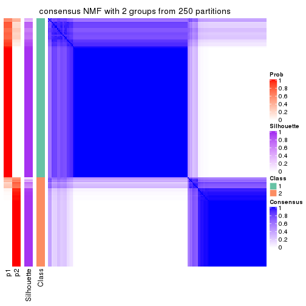</p>

</div>
<div id='tab-MAD-NMF-consensus-heatmap-2'>
<pre><code class="r">consensus_heatmap(res, k = 3)
</code></pre>

<p>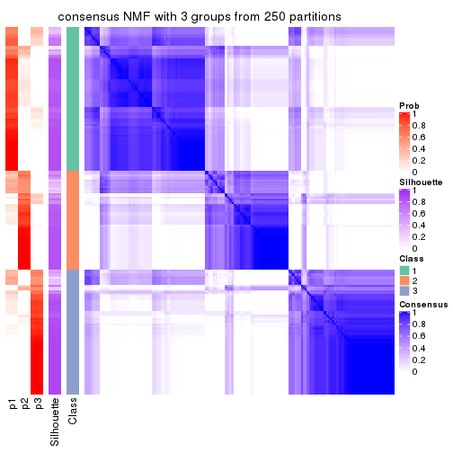</p>

</div>
<div id='tab-MAD-NMF-consensus-heatmap-3'>
<pre><code class="r">consensus_heatmap(res, k = 4)
</code></pre>

<p>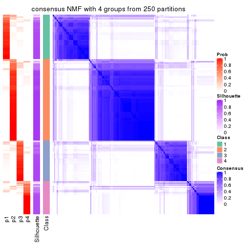</p>

</div>
<div id='tab-MAD-NMF-consensus-heatmap-4'>
<pre><code class="r">consensus_heatmap(res, k = 5)
</code></pre>

<p>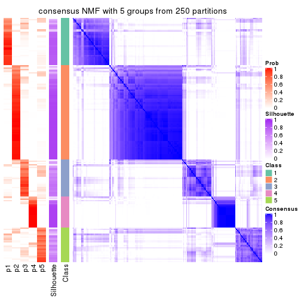</p>

</div>
<div id='tab-MAD-NMF-consensus-heatmap-5'>
<pre><code class="r">consensus_heatmap(res, k = 6)
</code></pre>

<p>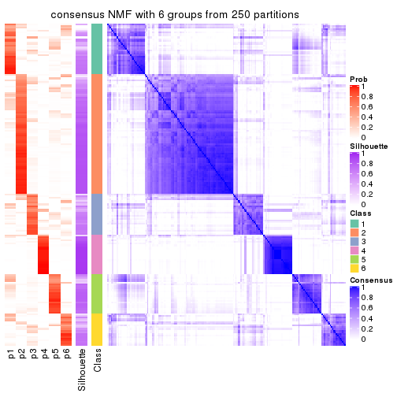</p>

</div>
</div>

Heatmaps for the membership of samples in all partitions to see how consistent they are:


<script>
$( function() {
	$( '#tabs-MAD-NMF-membership-heatmap' ).tabs();
} );
</script>
<div id='tabs-MAD-NMF-membership-heatmap'>
<ul>
<li><a href='#tab-MAD-NMF-membership-heatmap-1'>k = 2</a></li>
<li><a href='#tab-MAD-NMF-membership-heatmap-2'>k = 3</a></li>
<li><a href='#tab-MAD-NMF-membership-heatmap-3'>k = 4</a></li>
<li><a href='#tab-MAD-NMF-membership-heatmap-4'>k = 5</a></li>
<li><a href='#tab-MAD-NMF-membership-heatmap-5'>k = 6</a></li>
</ul>
<div id='tab-MAD-NMF-membership-heatmap-1'>
<pre><code class="r">membership_heatmap(res, k = 2)
</code></pre>

<p>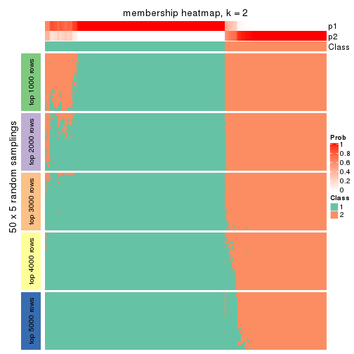</p>

</div>
<div id='tab-MAD-NMF-membership-heatmap-2'>
<pre><code class="r">membership_heatmap(res, k = 3)
</code></pre>

<p>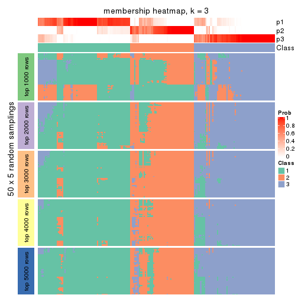</p>

</div>
<div id='tab-MAD-NMF-membership-heatmap-3'>
<pre><code class="r">membership_heatmap(res, k = 4)
</code></pre>

<p>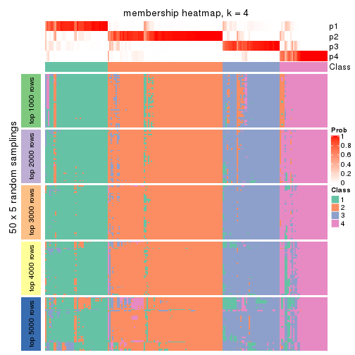</p>

</div>
<div id='tab-MAD-NMF-membership-heatmap-4'>
<pre><code class="r">membership_heatmap(res, k = 5)
</code></pre>

<p>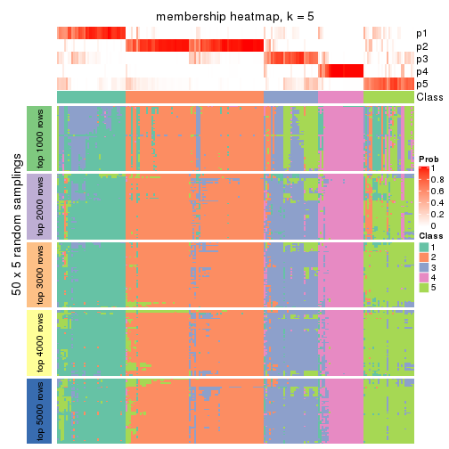</p>

</div>
<div id='tab-MAD-NMF-membership-heatmap-5'>
<pre><code class="r">membership_heatmap(res, k = 6)
</code></pre>

<p>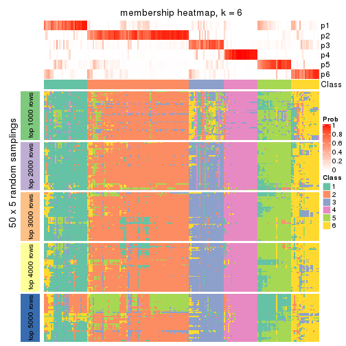</p>

</div>
</div>

As soon as we have had the classes for columns, we can look for signatures
which are significantly different between classes which can be candidate marks
for certain classes. Following are the heatmaps for signatures.


Signature heatmaps where rows are scaled:


<script>
$( function() {
	$( '#tabs-MAD-NMF-get-signatures' ).tabs();
} );
</script>
<div id='tabs-MAD-NMF-get-signatures'>
<ul>
<li><a href='#tab-MAD-NMF-get-signatures-1'>k = 2</a></li>
<li><a href='#tab-MAD-NMF-get-signatures-2'>k = 3</a></li>
<li><a href='#tab-MAD-NMF-get-signatures-3'>k = 4</a></li>
<li><a href='#tab-MAD-NMF-get-signatures-4'>k = 5</a></li>
<li><a href='#tab-MAD-NMF-get-signatures-5'>k = 6</a></li>
</ul>
<div id='tab-MAD-NMF-get-signatures-1'>
<pre><code class="r">get_signatures(res, k = 2)
</code></pre>

<p>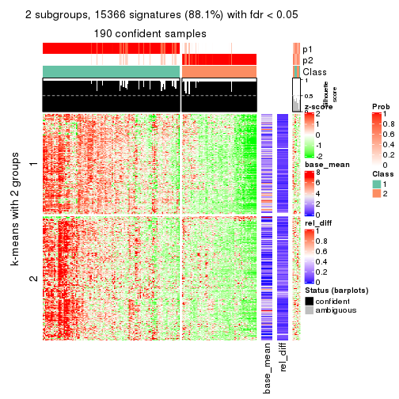</p>

</div>
<div id='tab-MAD-NMF-get-signatures-2'>
<pre><code class="r">get_signatures(res, k = 3)
</code></pre>

<p>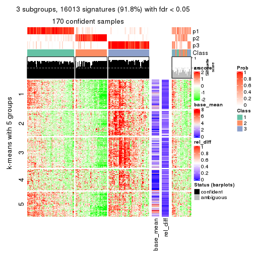</p>

</div>
<div id='tab-MAD-NMF-get-signatures-3'>
<pre><code class="r">get_signatures(res, k = 4)
</code></pre>

<p>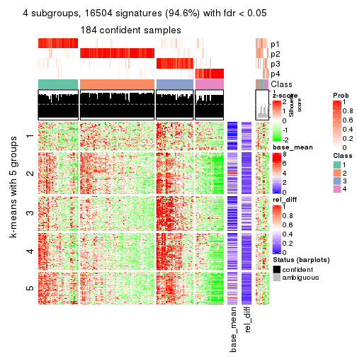</p>

</div>
<div id='tab-MAD-NMF-get-signatures-4'>
<pre><code class="r">get_signatures(res, k = 5)
</code></pre>

<p>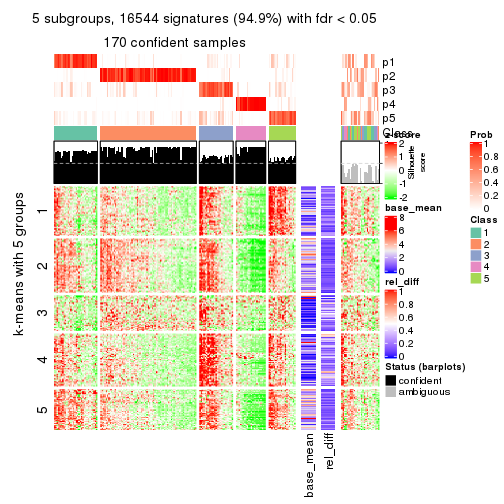</p>

</div>
<div id='tab-MAD-NMF-get-signatures-5'>
<pre><code class="r">get_signatures(res, k = 6)
</code></pre>

<p>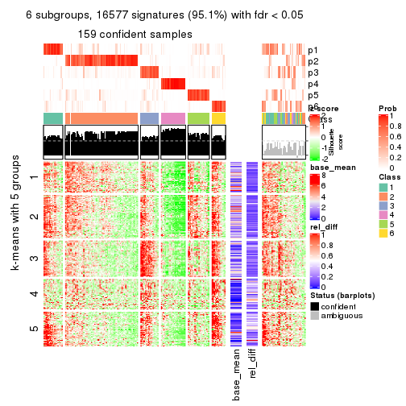</p>

</div>
</div>


Signature heatmaps where rows are not scaled:


<script>
$( function() {
	$( '#tabs-MAD-NMF-get-signatures-no-scale' ).tabs();
} );
</script>
<div id='tabs-MAD-NMF-get-signatures-no-scale'>
<ul>
<li><a href='#tab-MAD-NMF-get-signatures-no-scale-1'>k = 2</a></li>
<li><a href='#tab-MAD-NMF-get-signatures-no-scale-2'>k = 3</a></li>
<li><a href='#tab-MAD-NMF-get-signatures-no-scale-3'>k = 4</a></li>
<li><a href='#tab-MAD-NMF-get-signatures-no-scale-4'>k = 5</a></li>
<li><a href='#tab-MAD-NMF-get-signatures-no-scale-5'>k = 6</a></li>
</ul>
<div id='tab-MAD-NMF-get-signatures-no-scale-1'>
<pre><code class="r">get_signatures(res, k = 2, scale_rows = FALSE)
</code></pre>

<p>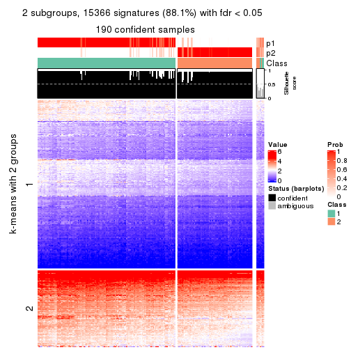</p>

</div>
<div id='tab-MAD-NMF-get-signatures-no-scale-2'>
<pre><code class="r">get_signatures(res, k = 3, scale_rows = FALSE)
</code></pre>

<p>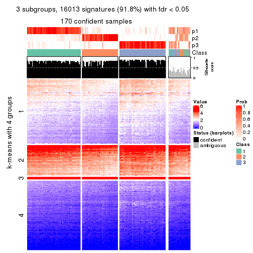</p>

</div>
<div id='tab-MAD-NMF-get-signatures-no-scale-3'>
<pre><code class="r">get_signatures(res, k = 4, scale_rows = FALSE)
</code></pre>

<p>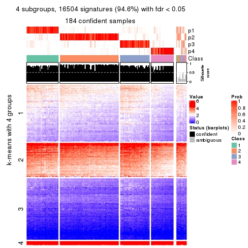</p>

</div>
<div id='tab-MAD-NMF-get-signatures-no-scale-4'>
<pre><code class="r">get_signatures(res, k = 5, scale_rows = FALSE)
</code></pre>

<p>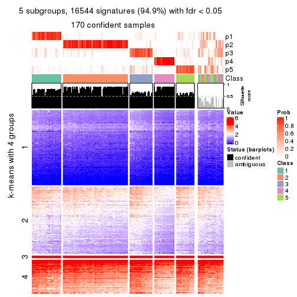</p>

</div>
<div id='tab-MAD-NMF-get-signatures-no-scale-5'>
<pre><code class="r">get_signatures(res, k = 6, scale_rows = FALSE)
</code></pre>

<p>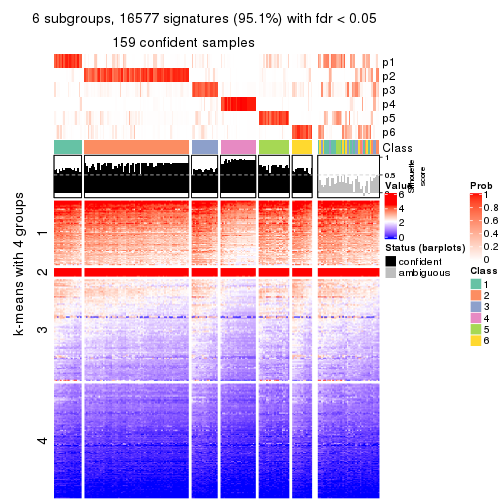</p>

</div>
</div>


Compare the overlap of signatures from different k:

```r
compare_signatures(res)
```

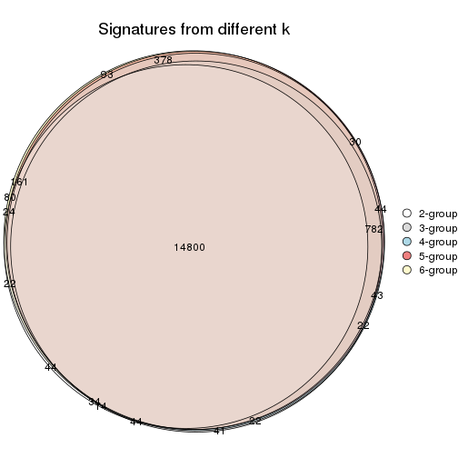

`get_signature()` returns a data frame invisibly. TO get the list of signatures, the function
call should be assigned to a variable explicitly. In following code, if `plot` argument is set
to `FALSE`, no heatmap is plotted while only the differential analysis is performed.

```r
# code only for demonstration
tb = get_signature(res, k = ..., plot = FALSE)
```

An example of the output of `tb` is:

```
#>   which_row         fdr    mean_1    mean_2 scaled_mean_1 scaled_mean_2 km
#> 1        38 0.042760348  8.373488  9.131774    -0.5533452     0.5164555  1
#> 2        40 0.018707592  7.106213  8.469186    -0.6173731     0.5762149  1
#> 3        55 0.019134737 10.221463 11.207825    -0.6159697     0.5749050  1
#> 4        59 0.006059896  5.921854  7.869574    -0.6899429     0.6439467  1
#> 5        60 0.018055526  8.928898 10.211722    -0.6204761     0.5791110  1
#> 6        98 0.009384629 15.714769 14.887706     0.6635654    -0.6193277  2
...
```

The columns in `tb` are:

1. `which_row`: row indices corresponding to the input matrix.
2. `fdr`: FDR for the differential test. 
3. `mean_x`: The mean value in group x.
4. `scaled_mean_x`: The mean value in group x after rows are scaled.
5. `km`: Row groups if k-means clustering is applied to rows.


UMAP plot which shows how samples are separated.


<script>
$( function() {
	$( '#tabs-MAD-NMF-dimension-reduction' ).tabs();
} );
</script>
<div id='tabs-MAD-NMF-dimension-reduction'>
<ul>
<li><a href='#tab-MAD-NMF-dimension-reduction-1'>k = 2</a></li>
<li><a href='#tab-MAD-NMF-dimension-reduction-2'>k = 3</a></li>
<li><a href='#tab-MAD-NMF-dimension-reduction-3'>k = 4</a></li>
<li><a href='#tab-MAD-NMF-dimension-reduction-4'>k = 5</a></li>
<li><a href='#tab-MAD-NMF-dimension-reduction-5'>k = 6</a></li>
</ul>
<div id='tab-MAD-NMF-dimension-reduction-1'>
<pre><code class="r">dimension_reduction(res, k = 2, method = &quot;UMAP&quot;)
</code></pre>

<p>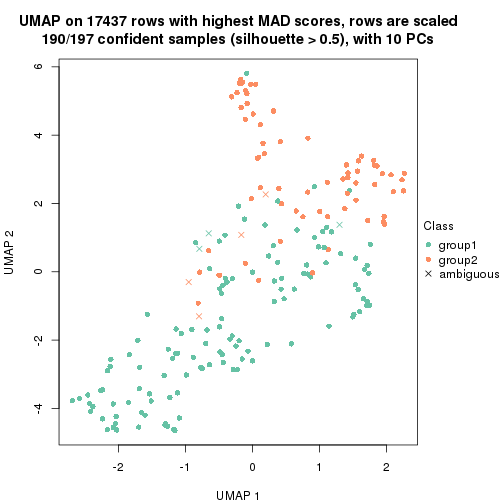</p>

</div>
<div id='tab-MAD-NMF-dimension-reduction-2'>
<pre><code class="r">dimension_reduction(res, k = 3, method = &quot;UMAP&quot;)
</code></pre>

<p>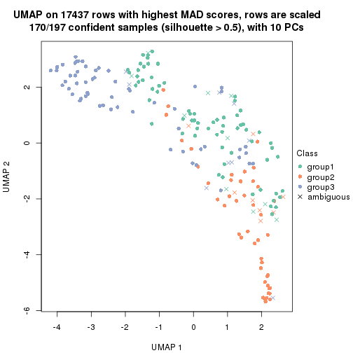</p>

</div>
<div id='tab-MAD-NMF-dimension-reduction-3'>
<pre><code class="r">dimension_reduction(res, k = 4, method = &quot;UMAP&quot;)
</code></pre>

<p>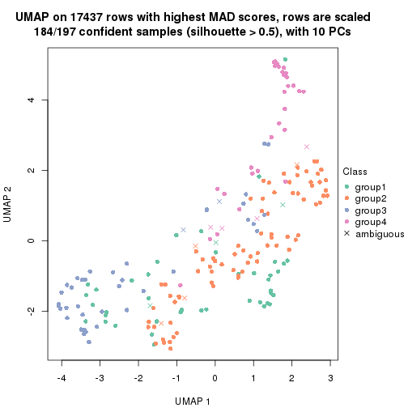</p>

</div>
<div id='tab-MAD-NMF-dimension-reduction-4'>
<pre><code class="r">dimension_reduction(res, k = 5, method = &quot;UMAP&quot;)
</code></pre>

<p>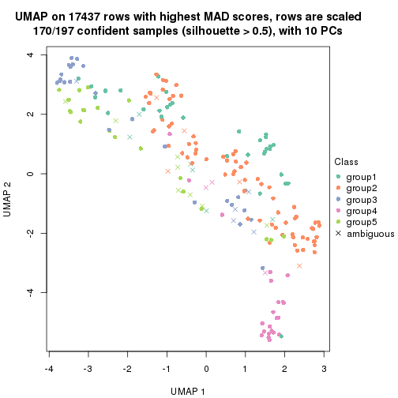</p>

</div>
<div id='tab-MAD-NMF-dimension-reduction-5'>
<pre><code class="r">dimension_reduction(res, k = 6, method = &quot;UMAP&quot;)
</code></pre>

<p>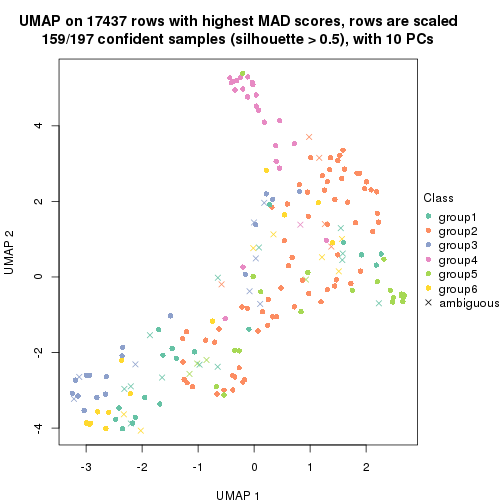</p>

</div>
</div>


Following heatmap shows how subgroups are split when increasing `k`:

```r
collect_classes(res)
```

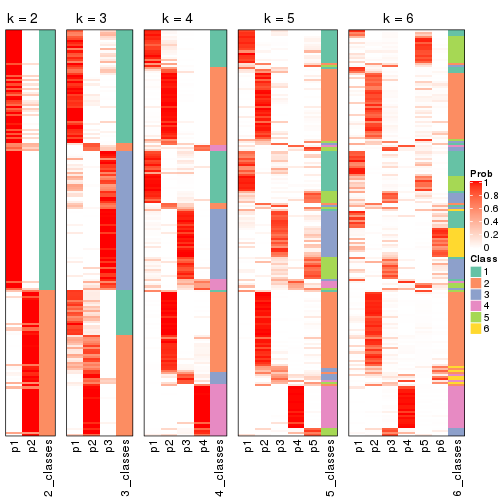


If matrix rows can be associated to genes, consider to use `GO_Enrichment(res,
...)` to perform function enrichment for the signature genes.


 

---------------------------------------------------


### ATC:hclust


The object with results only for a single top-value method and a single partition method 
can be extracted as:

```r
res = res_list["ATC", "hclust"]
# you can also extract it by
# res = res_list["ATC:hclust"]
```

A summary of `res` and all the functions that can be applied to it:

```r
res
```

```
#> A 'ConsensusPartition' object with k = 2, 3, 4, 5, 6.
#>   On a matrix with 17437 rows and 197 columns.
#>   Top rows (1000, 2000, 3000, 4000, 5000) are extracted by 'ATC' method.
#>   Subgroups are detected by 'hclust' method.
#>   Performed in total 1250 partitions by row resampling.
#>   Best k for subgroups seems to be 3.
#> 
#> Following methods can be applied to this 'ConsensusPartition' object:
#>  [1] "cola_report"             "collect_classes"         "collect_plots"          
#>  [4] "collect_stats"           "colnames"                "compare_signatures"     
#>  [7] "consensus_heatmap"       "dimension_reduction"     "functional_enrichment"  
#> [10] "get_anno_col"            "get_anno"                "get_classes"            
#> [13] "get_consensus"           "get_matrix"              "get_membership"         
#> [16] "get_param"               "get_signatures"          "get_stats"              
#> [19] "is_best_k"               "is_stable_k"             "membership_heatmap"     
#> [22] "ncol"                    "nrow"                    "plot_ecdf"              
#> [25] "rownames"                "select_partition_number" "show"                   
#> [28] "suggest_best_k"          "test_to_known_factors"
```

`collect_plots()` function collects all the plots made from `res` for all `k` (number of partitions)
into one single page to provide an easy and fast comparison between different `k`.

```r
collect_plots(res)
```

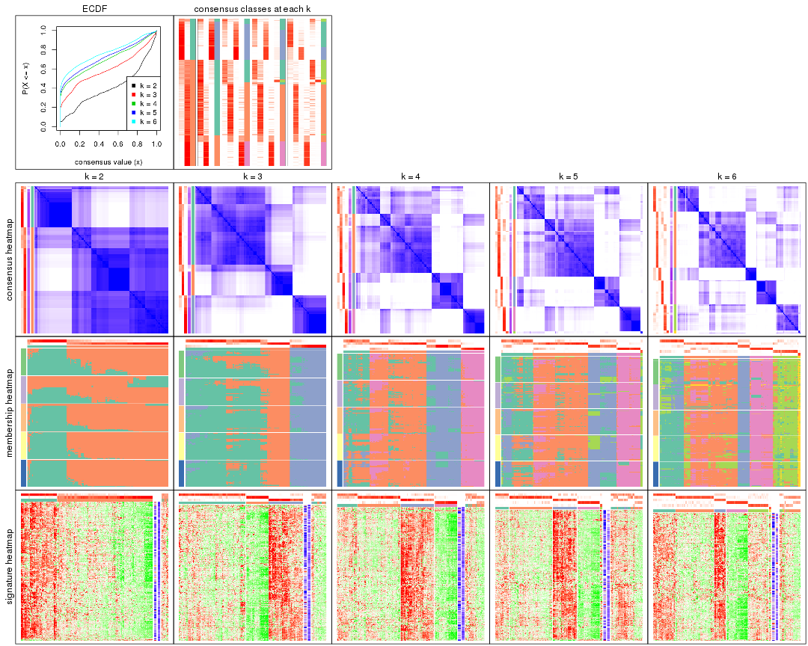

The plots are:

- The first row: a plot of the ECDF (Empirical cumulative distribution
  function) curves of the consensus matrix for each `k` and the heatmap of
  predicted classes for each `k`.
- The second row: heatmaps of the consensus matrix for each `k`.
- The third row: heatmaps of the membership matrix for each `k`.
- The fouth row: heatmaps of the signatures for each `k`.

All the plots in panels can be made by individual functions and they are
plotted later in this section.

`select_partition_number()` produces several plots showing different
statistics for choosing "optimized" `k`. There are following statistics:

- ECDF curves of the consensus matrix for each `k`;
- 1-PAC. [The PAC
  score](https://en.wikipedia.org/wiki/Consensus_clustering#Over-interpretation_potential_of_consensus_clustering)
  measures the proportion of the ambiguous subgrouping.
- Mean silhouette score.
- Concordance. The mean probability of fiting the consensus class ids in all
  partitions.
- Area increased. Denote $A_k$ as the area under the ECDF curve for current
  `k`, the area increased is defined as $A_k - A_{k-1}$.
- Rand index. The percent of pairs of samples that are both in a same cluster
  or both are not in a same cluster in the partition of k and k-1.
- Jaccard index. The ratio of pairs of samples are both in a same cluster in
  the partition of k and k-1 and the pairs of samples are both in a same
  cluster in the partition k or k-1.

The detailed explanations of these statistics can be found in [the cola
vignette](http://bioconductor.org/packages/devel/bioc/vignettes/cola/inst/doc/cola.html#toc_13).

Generally speaking, lower PAC score, higher mean silhouette score or higher
concordance corresponds to better partition. Rand index and Jaccard index
measure how similar the current partition is compared to partition with `k-1`.
If they are too similar, we won't accept `k` is better than `k-1`.

```r
select_partition_number(res)
```

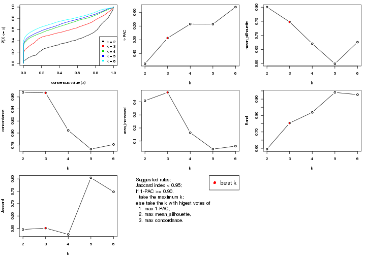

The numeric values for all these statistics can be obtained by `get_stats()`.

```r
get_stats(res)
```

```
#>   k 1-PAC mean_silhouette concordance area_increased  Rand Jaccard
#> 2 2 0.413           0.801       0.867         0.4086 0.595   0.595
#> 3 3 0.506           0.748       0.867         0.4720 0.754   0.601
#> 4 4 0.557           0.671       0.804         0.1642 0.819   0.575
#> 5 5 0.557           0.599       0.773         0.0385 0.941   0.805
#> 6 6 0.619           0.676       0.781         0.0613 0.927   0.748
```

`suggest_best_k()` suggests the best $k$ based on these statistics. The rules are as follows:

- All $k$ with Jaccard index larger than 0.95 are removed because the increase of
  the partition number does not provides enough extra information. If all $k$ are removed,
  the best $k$ is assigned by `NA`.
- For $k$ with 1-PAC larger than 0.9, the maximal $k$ is taken as the "best k". Other $k$ is called "optional k".
- If it does not fit the second rule. The $k$ with the highest vote of highest
  1-PAC, mean silhouette and concordance is taken as the "best k".

```r
suggest_best_k(res)
```

```
#> [1] 3
```


Following shows the table of the partitions (You need to click the **show/hide
code output** link to see it). The membership matrix (columns with name `p*`)
is inferred by
[`clue::cl_consensus()`](https://www.rdocumentation.org/link/cl_consensus?package=clue)
function with the `SE` method. Basically the value in the membership matrix
represents the probability to belong to a certain group. The finall class
label for an item is determined with the group with highest probability it
belongs to.

In `get_classes()` function, the entropy is calculated from the membership
matrix and the silhouette score is calculated from the consensus matrix.


<script>
$( function() {
	$( '#tabs-ATC-hclust-get-classes' ).tabs();
} );
</script>
<div id='tabs-ATC-hclust-get-classes'>
<ul>
<li><a href='#tab-ATC-hclust-get-classes-1'>k = 2</a></li>
<li><a href='#tab-ATC-hclust-get-classes-2'>k = 3</a></li>
<li><a href='#tab-ATC-hclust-get-classes-3'>k = 4</a></li>
<li><a href='#tab-ATC-hclust-get-classes-4'>k = 5</a></li>
<li><a href='#tab-ATC-hclust-get-classes-5'>k = 6</a></li>
</ul>

<div id='tab-ATC-hclust-get-classes-1'>
<p><a id='tab-ATC-hclust-get-classes-1-a' style='color:#0366d6' href='#'>show/hide code output</a></p>
<pre><code class="r">cbind(get_classes(res, k = 2), get_membership(res, k = 2))
</code></pre>

<pre><code>#&gt;            class entropy silhouette    p1    p2
#&gt; SRR1380886     1  0.9323     0.2577 0.652 0.348
#&gt; SRR1074385     2  0.9661     0.6156 0.392 0.608
#&gt; SRR1374739     1  0.0000     0.9290 1.000 0.000
#&gt; SRR1097883     1  0.2948     0.8976 0.948 0.052
#&gt; SRR2167209     2  0.8443     0.7813 0.272 0.728
#&gt; SRR816541      2  0.0000     0.8168 0.000 1.000
#&gt; SRR663645      2  0.8499     0.7776 0.276 0.724
#&gt; SRR1381505     2  0.0000     0.8168 0.000 1.000
#&gt; SRR1416362     2  0.5946     0.8536 0.144 0.856
#&gt; SRR1318503     2  0.7376     0.8313 0.208 0.792
#&gt; SRR1341626     2  0.0000     0.8168 0.000 1.000
#&gt; SRR1382440     1  0.0000     0.9290 1.000 0.000
#&gt; SRR1088413     2  0.9977     0.4326 0.472 0.528
#&gt; SRR1082080     2  0.0000     0.8168 0.000 1.000
#&gt; SRR1455783     1  0.3274     0.8900 0.940 0.060
#&gt; SRR1447760     2  0.6148     0.8527 0.152 0.848
#&gt; SRR1487784     2  0.5842     0.8531 0.140 0.860
#&gt; SRR1331037     2  0.5842     0.8531 0.140 0.860
#&gt; SRR1095651     1  0.1633     0.9185 0.976 0.024
#&gt; SRR1078066     2  0.9732     0.5939 0.404 0.596
#&gt; SRR1120363     2  0.9661     0.6202 0.392 0.608
#&gt; SRR821231      1  0.0938     0.9243 0.988 0.012
#&gt; SRR1374373     2  0.6801     0.8452 0.180 0.820
#&gt; SRR1324519     2  0.0000     0.8168 0.000 1.000
#&gt; SRR1431121     1  0.1414     0.9207 0.980 0.020
#&gt; SRR1091032     2  0.2778     0.8386 0.048 0.952
#&gt; SRR1365575     2  0.0000     0.8168 0.000 1.000
#&gt; SRR1072972     1  0.3274     0.8900 0.940 0.060
#&gt; SRR1310690     2  0.6343     0.8514 0.160 0.840
#&gt; SRR1383037     1  0.0000     0.9290 1.000 0.000
#&gt; SRR1095479     1  0.0000     0.9290 1.000 0.000
#&gt; SRR1070403     1  0.0000     0.9290 1.000 0.000
#&gt; SRR1390203     1  0.1843     0.9165 0.972 0.028
#&gt; SRR1072007     2  0.2778     0.8386 0.048 0.952
#&gt; SRR1468787     2  0.6048     0.8534 0.148 0.852
#&gt; SRR1347959     2  0.7376     0.8313 0.208 0.792
#&gt; SRR1338513     2  0.9209     0.7063 0.336 0.664
#&gt; SRR812598      2  0.0000     0.8168 0.000 1.000
#&gt; SRR1446806     2  0.7745     0.8179 0.228 0.772
#&gt; SRR1394275     2  0.9977     0.4312 0.472 0.528
#&gt; SRR1443633     2  0.9909     0.5044 0.444 0.556
#&gt; SRR1087728     1  0.0000     0.9290 1.000 0.000
#&gt; SRR1098192     2  0.4298     0.8484 0.088 0.912
#&gt; SRR1093340     2  0.1843     0.8308 0.028 0.972
#&gt; SRR665405      2  0.8499     0.7772 0.276 0.724
#&gt; SRR657077      2  0.8763     0.7566 0.296 0.704
#&gt; SRR813208      1  0.0000     0.9290 1.000 0.000
#&gt; SRR1416074     2  0.1843     0.8308 0.028 0.972
#&gt; SRR1089688     2  0.5408     0.8525 0.124 0.876
#&gt; SRR1353461     1  0.0000     0.9290 1.000 0.000
#&gt; SRR1466321     2  0.7139     0.8385 0.196 0.804
#&gt; SRR1073021     2  0.6343     0.8512 0.160 0.840
#&gt; SRR1322816     2  0.0000     0.8168 0.000 1.000
#&gt; SRR1457727     1  0.0000     0.9290 1.000 0.000
#&gt; SRR1464226     2  0.4690     0.8504 0.100 0.900
#&gt; SRR1398863     2  0.9661     0.6156 0.392 0.608
#&gt; SRR1455631     2  0.6048     0.8528 0.148 0.852
#&gt; SRR1307808     2  0.7139     0.8385 0.196 0.804
#&gt; SRR1374585     2  0.0000     0.8168 0.000 1.000
#&gt; SRR1072104     2  0.3879     0.8459 0.076 0.924
#&gt; SRR1076868     2  0.2423     0.8361 0.040 0.960
#&gt; SRR1335984     2  0.2948     0.8398 0.052 0.948
#&gt; SRR1445939     2  0.9775     0.5767 0.412 0.588
#&gt; SRR1453047     2  0.2423     0.8361 0.040 0.960
#&gt; SRR1339788     1  0.0000     0.9290 1.000 0.000
#&gt; SRR1084323     1  0.1843     0.9165 0.972 0.028
#&gt; SRR1092937     2  0.9635     0.6234 0.388 0.612
#&gt; SRR1074090     2  0.0000     0.8168 0.000 1.000
#&gt; SRR1099833     1  0.6801     0.7089 0.820 0.180
#&gt; SRR1093434     1  0.0000     0.9290 1.000 0.000
#&gt; SRR1435857     2  0.8207     0.7957 0.256 0.744
#&gt; SRR1480347     2  0.0000     0.8168 0.000 1.000
#&gt; SRR1440787     2  0.0000     0.8168 0.000 1.000
#&gt; SRR1430202     2  0.7745     0.8179 0.228 0.772
#&gt; SRR1322730     2  0.0672     0.8210 0.008 0.992
#&gt; SRR811029      2  0.6343     0.8514 0.160 0.840
#&gt; SRR1390456     1  0.0000     0.9290 1.000 0.000
#&gt; SRR1381140     1  0.5629     0.7950 0.868 0.132
#&gt; SRR1388064     2  0.0000     0.8168 0.000 1.000
#&gt; SRR1093577     2  0.9833     0.5518 0.424 0.576
#&gt; SRR1414161     2  0.9977     0.4312 0.472 0.528
#&gt; SRR1328738     2  0.6438     0.8501 0.164 0.836
#&gt; SRR1311752     2  0.1843     0.8308 0.028 0.972
#&gt; SRR1445960     2  0.2948     0.8398 0.052 0.948
#&gt; SRR1403412     2  0.2948     0.8398 0.052 0.948
#&gt; SRR2166748     1  0.0000     0.9290 1.000 0.000
#&gt; SRR821666      2  0.0000     0.8168 0.000 1.000
#&gt; SRR1330746     1  0.0000     0.9290 1.000 0.000
#&gt; SRR1327872     2  0.0000     0.8168 0.000 1.000
#&gt; SRR1100800     2  0.9754     0.5844 0.408 0.592
#&gt; SRR1075174     2  0.9732     0.5925 0.404 0.596
#&gt; SRR1434436     2  0.7674     0.8208 0.224 0.776
#&gt; SRR1389409     2  0.0000     0.8168 0.000 1.000
#&gt; SRR1085310     1  0.9993    -0.3131 0.516 0.484
#&gt; SRR1376718     2  0.0000     0.8168 0.000 1.000
#&gt; SRR808590      2  0.0000     0.8168 0.000 1.000
#&gt; SRR1084128     2  0.7950     0.8092 0.240 0.760
#&gt; SRR1361692     2  0.8207     0.7959 0.256 0.744
#&gt; SRR1431493     1  0.0000     0.9290 1.000 0.000
#&gt; SRR1409084     2  0.9393     0.6763 0.356 0.644
#&gt; SRR2166214     2  0.8499     0.7772 0.276 0.724
#&gt; SRR1324102     2  0.4298     0.8484 0.088 0.912
#&gt; SRR1079754     2  0.0000     0.8168 0.000 1.000
#&gt; SRR1442127     1  0.0000     0.9290 1.000 0.000
#&gt; SRR1076244     2  0.1633     0.8294 0.024 0.976
#&gt; SRR1330901     2  0.7139     0.8385 0.196 0.804
#&gt; SRR1073167     2  0.1633     0.8290 0.024 0.976
#&gt; SRR1357541     1  0.0000     0.9290 1.000 0.000
#&gt; SRR811607      2  0.7299     0.8338 0.204 0.796
#&gt; SRR1468931     1  0.0000     0.9290 1.000 0.000
#&gt; SRR1474908     2  0.6048     0.8533 0.148 0.852
#&gt; SRR1309875     2  0.2778     0.8386 0.048 0.952
#&gt; SRR598792      1  0.0000     0.9290 1.000 0.000
#&gt; SRR1088537     2  0.4298     0.8485 0.088 0.912
#&gt; SRR1457682     2  0.9661     0.6202 0.392 0.608
#&gt; SRR1454289     2  0.7528     0.8270 0.216 0.784
#&gt; SRR1069352     1  0.0000     0.9290 1.000 0.000
#&gt; SRR1472728     2  0.6048     0.8536 0.148 0.852
#&gt; SRR1091144     2  0.4431     0.8490 0.092 0.908
#&gt; SRR1319118     1  0.4815     0.8353 0.896 0.104
#&gt; SRR1403611     1  0.0000     0.9290 1.000 0.000
#&gt; SRR1397762     1  0.6712     0.7165 0.824 0.176
#&gt; SRR1317387     1  0.0000     0.9290 1.000 0.000
#&gt; SRR1376426     2  0.0000     0.8168 0.000 1.000
#&gt; SRR1097777     1  0.2778     0.9017 0.952 0.048
#&gt; SRR1365743     1  0.0000     0.9290 1.000 0.000
#&gt; SRR1458992     2  0.6531     0.8492 0.168 0.832
#&gt; SRR1089537     2  0.9833     0.5518 0.424 0.576
#&gt; SRR1397744     1  0.2603     0.9046 0.956 0.044
#&gt; SRR1453893     2  0.0000     0.8168 0.000 1.000
#&gt; SRR1098543     1  0.2778     0.9016 0.952 0.048
#&gt; SRR1321765     2  0.9944     0.4748 0.456 0.544
#&gt; SRR1440032     2  0.7602     0.8243 0.220 0.780
#&gt; SRR1404507     2  0.0000     0.8168 0.000 1.000
#&gt; SRR1404856     2  0.6438     0.8501 0.164 0.836
#&gt; SRR812745      2  0.9209     0.7063 0.336 0.664
#&gt; SRR1417524     2  0.7299     0.8345 0.204 0.796
#&gt; SRR1407334     2  0.0000     0.8168 0.000 1.000
#&gt; SRR1453991     2  0.9358     0.6824 0.352 0.648
#&gt; SRR1415938     1  0.0000     0.9290 1.000 0.000
#&gt; SRR1081259     2  0.6801     0.8452 0.180 0.820
#&gt; SRR1436187     2  0.0000     0.8168 0.000 1.000
#&gt; SRR1431948     1  0.0000     0.9290 1.000 0.000
#&gt; SRR1453277     2  0.6623     0.8481 0.172 0.828
#&gt; SRR1095407     2  0.6247     0.8526 0.156 0.844
#&gt; SRR1359694     2  0.7376     0.8313 0.208 0.792
#&gt; SRR656982      2  0.6438     0.8501 0.164 0.836
#&gt; SRR1354338     2  0.6048     0.8528 0.148 0.852
#&gt; SRR1088291     2  0.6343     0.8512 0.160 0.840
#&gt; SRR1080624     2  0.9044     0.7264 0.320 0.680
#&gt; SRR2166708     1  0.0000     0.9290 1.000 0.000
#&gt; SRR1393572     2  0.9044     0.7264 0.320 0.680
#&gt; SRR1429912     2  0.2778     0.8386 0.048 0.952
#&gt; SRR1421048     2  0.6148     0.8527 0.152 0.848
#&gt; SRR1434999     2  1.0000     0.3476 0.500 0.500
#&gt; SRR656457      1  1.0000    -0.3639 0.500 0.500
#&gt; SRR1098928     1  0.0000     0.9290 1.000 0.000
#&gt; SRR1343967     2  0.0000     0.8168 0.000 1.000
#&gt; SRR1360766     2  0.6973     0.8421 0.188 0.812
#&gt; SRR1464724     2  0.0000     0.8168 0.000 1.000
#&gt; SRR1101542     2  0.0000     0.8168 0.000 1.000
#&gt; SRR1401528     1  0.9710     0.0401 0.600 0.400
#&gt; SRR1071519     1  0.0000     0.9290 1.000 0.000
#&gt; SRR1086070     1  0.1843     0.9165 0.972 0.028
#&gt; SRR1358645     2  0.7376     0.8313 0.208 0.792
#&gt; SRR819771      1  0.0000     0.9290 1.000 0.000
#&gt; SRR1418433     2  0.5408     0.8525 0.124 0.876
#&gt; SRR821050      2  0.8955     0.7365 0.312 0.688
#&gt; SRR1402091     2  0.2236     0.8341 0.036 0.964
#&gt; SRR1322028     2  0.2236     0.8341 0.036 0.964
#&gt; SRR1452556     2  0.0000     0.8168 0.000 1.000
#&gt; SRR1340047     2  0.6712     0.8466 0.176 0.824
#&gt; SRR1418302     2  0.6343     0.8514 0.160 0.840
#&gt; SRR1073991     1  0.2423     0.9079 0.960 0.040
#&gt; SRR1085187     2  0.0000     0.8168 0.000 1.000
#&gt; SRR1357618     1  0.0000     0.9290 1.000 0.000
#&gt; SRR1487764     2  0.6438     0.8511 0.164 0.836
#&gt; SRR1075336     2  0.7139     0.8384 0.196 0.804
#&gt; SRR1365471     2  0.0000     0.8168 0.000 1.000
#&gt; SRR1414613     2  0.5842     0.8531 0.140 0.860
#&gt; SRR658719      2  0.9087     0.7229 0.324 0.676
#&gt; SRR1475128     1  0.0000     0.9290 1.000 0.000
#&gt; SRR1367630     2  0.6801     0.8464 0.180 0.820
#&gt; SRR1481146     2  0.6048     0.8528 0.148 0.852
#&gt; SRR1465674     2  0.6712     0.8477 0.176 0.824
#&gt; SRR1327303     2  0.6623     0.8481 0.172 0.828
#&gt; SRR1390391     2  0.9983     0.4196 0.476 0.524
#&gt; SRR1326020     2  0.2948     0.8398 0.052 0.948
#&gt; SRR1381953     2  0.6531     0.8491 0.168 0.832
#&gt; SRR1082544     2  0.4298     0.8486 0.088 0.912
#&gt; SRR810761      1  0.3274     0.8900 0.940 0.060
#&gt; SRR1070764     1  0.0000     0.9290 1.000 0.000
#&gt; SRR1415919     1  0.0000     0.9290 1.000 0.000
#&gt; SRR1490404     2  0.2778     0.8386 0.048 0.952
#&gt; SRR1416773     2  0.6148     0.8527 0.152 0.848
#&gt; SRR1377492     2  0.4161     0.8482 0.084 0.916
#&gt; SRR1334314     2  0.8861     0.7475 0.304 0.696
</code></pre>

<script>
$('#tab-ATC-hclust-get-classes-1-a').parent().next().next().hide();
$('#tab-ATC-hclust-get-classes-1-a').click(function(){
  $('#tab-ATC-hclust-get-classes-1-a').parent().next().next().toggle();
  return(false);
});
</script>
</div>

<div id='tab-ATC-hclust-get-classes-2'>
<p><a id='tab-ATC-hclust-get-classes-2-a' style='color:#0366d6' href='#'>show/hide code output</a></p>
<pre><code class="r">cbind(get_classes(res, k = 3), get_membership(res, k = 3))
</code></pre>

<pre><code>#&gt;            class entropy silhouette    p1    p2    p3
#&gt; SRR1380886     1  0.6398     0.1518 0.580 0.004 0.416
#&gt; SRR1074385     1  0.3715     0.7549 0.868 0.004 0.128
#&gt; SRR1374739     3  0.0000     0.8954 0.000 0.000 1.000
#&gt; SRR1097883     3  0.5070     0.7880 0.224 0.004 0.772
#&gt; SRR2167209     1  0.0237     0.8039 0.996 0.004 0.000
#&gt; SRR816541      2  0.1964     0.8361 0.056 0.944 0.000
#&gt; SRR663645      1  0.3039     0.8113 0.920 0.036 0.044
#&gt; SRR1381505     2  0.0237     0.8549 0.004 0.996 0.000
#&gt; SRR1416362     1  0.3686     0.8032 0.860 0.140 0.000
#&gt; SRR1318503     1  0.2165     0.8214 0.936 0.064 0.000
#&gt; SRR1341626     2  0.1964     0.8361 0.056 0.944 0.000
#&gt; SRR1382440     3  0.0000     0.8954 0.000 0.000 1.000
#&gt; SRR1088413     1  0.4978     0.6568 0.780 0.004 0.216
#&gt; SRR1082080     2  0.1031     0.8552 0.024 0.976 0.000
#&gt; SRR1455783     3  0.5201     0.7766 0.236 0.004 0.760
#&gt; SRR1447760     1  0.3619     0.8063 0.864 0.136 0.000
#&gt; SRR1487784     1  0.4452     0.7669 0.808 0.192 0.000
#&gt; SRR1331037     1  0.4452     0.7669 0.808 0.192 0.000
#&gt; SRR1095651     3  0.2682     0.8779 0.076 0.004 0.920
#&gt; SRR1078066     1  0.4164     0.7466 0.848 0.008 0.144
#&gt; SRR1120363     1  0.3573     0.7566 0.876 0.004 0.120
#&gt; SRR821231      3  0.3038     0.8662 0.104 0.000 0.896
#&gt; SRR1374373     1  0.2796     0.8196 0.908 0.092 0.000
#&gt; SRR1324519     2  0.1643     0.8443 0.044 0.956 0.000
#&gt; SRR1431121     3  0.4834     0.8125 0.204 0.004 0.792
#&gt; SRR1091032     2  0.6305    -0.0411 0.484 0.516 0.000
#&gt; SRR1365575     2  0.0237     0.8549 0.004 0.996 0.000
#&gt; SRR1072972     3  0.5201     0.7769 0.236 0.004 0.760
#&gt; SRR1310690     1  0.4002     0.7934 0.840 0.160 0.000
#&gt; SRR1383037     3  0.0000     0.8954 0.000 0.000 1.000
#&gt; SRR1095479     3  0.0000     0.8954 0.000 0.000 1.000
#&gt; SRR1070403     3  0.0000     0.8954 0.000 0.000 1.000
#&gt; SRR1390203     3  0.4931     0.8056 0.212 0.004 0.784
#&gt; SRR1072007     1  0.6244     0.3011 0.560 0.440 0.000
#&gt; SRR1468787     1  0.3619     0.8069 0.864 0.136 0.000
#&gt; SRR1347959     1  0.2165     0.8214 0.936 0.064 0.000
#&gt; SRR1338513     1  0.3805     0.7879 0.884 0.024 0.092
#&gt; SRR812598      2  0.0237     0.8549 0.004 0.996 0.000
#&gt; SRR1446806     1  0.1529     0.8175 0.960 0.040 0.000
#&gt; SRR1394275     1  0.4784     0.6690 0.796 0.004 0.200
#&gt; SRR1443633     1  0.4409     0.7056 0.824 0.004 0.172
#&gt; SRR1087728     3  0.0000     0.8954 0.000 0.000 1.000
#&gt; SRR1098192     1  0.5591     0.6228 0.696 0.304 0.000
#&gt; SRR1093340     2  0.6095     0.3027 0.392 0.608 0.000
#&gt; SRR665405      1  0.0475     0.8031 0.992 0.004 0.004
#&gt; SRR657077      1  0.1163     0.8001 0.972 0.000 0.028
#&gt; SRR813208      3  0.0000     0.8954 0.000 0.000 1.000
#&gt; SRR1416074     2  0.6140     0.2698 0.404 0.596 0.000
#&gt; SRR1089688     1  0.5138     0.7011 0.748 0.252 0.000
#&gt; SRR1353461     3  0.0000     0.8954 0.000 0.000 1.000
#&gt; SRR1466321     1  0.2448     0.8224 0.924 0.076 0.000
#&gt; SRR1073021     1  0.3267     0.8137 0.884 0.116 0.000
#&gt; SRR1322816     2  0.1643     0.8443 0.044 0.956 0.000
#&gt; SRR1457727     3  0.2261     0.8802 0.068 0.000 0.932
#&gt; SRR1464226     1  0.5363     0.6651 0.724 0.276 0.000
#&gt; SRR1398863     1  0.3715     0.7549 0.868 0.004 0.128
#&gt; SRR1455631     1  0.3551     0.8085 0.868 0.132 0.000
#&gt; SRR1307808     1  0.2448     0.8224 0.924 0.076 0.000
#&gt; SRR1374585     2  0.0237     0.8549 0.004 0.996 0.000
#&gt; SRR1072104     1  0.5785     0.5715 0.668 0.332 0.000
#&gt; SRR1076868     2  0.6252     0.1318 0.444 0.556 0.000
#&gt; SRR1335984     1  0.6180     0.3716 0.584 0.416 0.000
#&gt; SRR1445939     1  0.3918     0.7405 0.856 0.004 0.140
#&gt; SRR1453047     2  0.6225     0.1769 0.432 0.568 0.000
#&gt; SRR1339788     3  0.0000     0.8954 0.000 0.000 1.000
#&gt; SRR1084323     3  0.4931     0.8056 0.212 0.004 0.784
#&gt; SRR1092937     1  0.3340     0.7580 0.880 0.000 0.120
#&gt; SRR1074090     2  0.1031     0.8552 0.024 0.976 0.000
#&gt; SRR1099833     3  0.6314     0.4782 0.392 0.004 0.604
#&gt; SRR1093434     3  0.0000     0.8954 0.000 0.000 1.000
#&gt; SRR1435857     1  0.1453     0.8132 0.968 0.024 0.008
#&gt; SRR1480347     2  0.0892     0.8565 0.020 0.980 0.000
#&gt; SRR1440787     2  0.0237     0.8549 0.004 0.996 0.000
#&gt; SRR1430202     1  0.1529     0.8175 0.960 0.040 0.000
#&gt; SRR1322730     2  0.2711     0.8065 0.088 0.912 0.000
#&gt; SRR811029      1  0.4002     0.7934 0.840 0.160 0.000
#&gt; SRR1390456     3  0.0000     0.8954 0.000 0.000 1.000
#&gt; SRR1381140     3  0.6282     0.5280 0.384 0.004 0.612
#&gt; SRR1388064     2  0.0892     0.8565 0.020 0.980 0.000
#&gt; SRR1093577     1  0.4110     0.7305 0.844 0.004 0.152
#&gt; SRR1414161     1  0.4784     0.6690 0.796 0.004 0.200
#&gt; SRR1328738     1  0.3267     0.8141 0.884 0.116 0.000
#&gt; SRR1311752     2  0.6140     0.2698 0.404 0.596 0.000
#&gt; SRR1445960     1  0.6180     0.3716 0.584 0.416 0.000
#&gt; SRR1403412     1  0.6225     0.3247 0.568 0.432 0.000
#&gt; SRR2166748     3  0.0000     0.8954 0.000 0.000 1.000
#&gt; SRR821666      2  0.0237     0.8549 0.004 0.996 0.000
#&gt; SRR1330746     3  0.0000     0.8954 0.000 0.000 1.000
#&gt; SRR1327872     2  0.0892     0.8565 0.020 0.980 0.000
#&gt; SRR1100800     1  0.3851     0.7434 0.860 0.004 0.136
#&gt; SRR1075174     1  0.4033     0.7465 0.856 0.008 0.136
#&gt; SRR1434436     1  0.1643     0.8183 0.956 0.044 0.000
#&gt; SRR1389409     2  0.0237     0.8549 0.004 0.996 0.000
#&gt; SRR1085310     1  0.5480     0.5769 0.732 0.004 0.264
#&gt; SRR1376718     2  0.0237     0.8549 0.004 0.996 0.000
#&gt; SRR808590      2  0.0237     0.8549 0.004 0.996 0.000
#&gt; SRR1084128     1  0.1832     0.8166 0.956 0.036 0.008
#&gt; SRR1361692     1  0.0983     0.8110 0.980 0.016 0.004
#&gt; SRR1431493     3  0.0000     0.8954 0.000 0.000 1.000
#&gt; SRR1409084     1  0.2860     0.7749 0.912 0.004 0.084
#&gt; SRR2166214     1  0.0475     0.8031 0.992 0.004 0.004
#&gt; SRR1324102     1  0.5650     0.6103 0.688 0.312 0.000
#&gt; SRR1079754     2  0.0892     0.8564 0.020 0.980 0.000
#&gt; SRR1442127     3  0.0000     0.8954 0.000 0.000 1.000
#&gt; SRR1076244     2  0.4504     0.6826 0.196 0.804 0.000
#&gt; SRR1330901     1  0.2448     0.8224 0.924 0.076 0.000
#&gt; SRR1073167     2  0.6026     0.3475 0.376 0.624 0.000
#&gt; SRR1357541     3  0.2860     0.8747 0.084 0.004 0.912
#&gt; SRR811607      1  0.2261     0.8217 0.932 0.068 0.000
#&gt; SRR1468931     3  0.0000     0.8954 0.000 0.000 1.000
#&gt; SRR1474908     1  0.3619     0.8055 0.864 0.136 0.000
#&gt; SRR1309875     1  0.6295     0.1934 0.528 0.472 0.000
#&gt; SRR598792      3  0.0000     0.8954 0.000 0.000 1.000
#&gt; SRR1088537     1  0.5497     0.6387 0.708 0.292 0.000
#&gt; SRR1457682     1  0.3573     0.7566 0.876 0.004 0.120
#&gt; SRR1454289     1  0.1964     0.8213 0.944 0.056 0.000
#&gt; SRR1069352     3  0.0000     0.8954 0.000 0.000 1.000
#&gt; SRR1472728     1  0.4235     0.7810 0.824 0.176 0.000
#&gt; SRR1091144     1  0.5431     0.6515 0.716 0.284 0.000
#&gt; SRR1319118     3  0.5656     0.7038 0.284 0.004 0.712
#&gt; SRR1403611     3  0.0892     0.8932 0.020 0.000 0.980
#&gt; SRR1397762     3  0.6298     0.4893 0.388 0.004 0.608
#&gt; SRR1317387     3  0.1163     0.8923 0.028 0.000 0.972
#&gt; SRR1376426     2  0.0892     0.8565 0.020 0.980 0.000
#&gt; SRR1097777     3  0.5201     0.7804 0.236 0.004 0.760
#&gt; SRR1365743     3  0.0000     0.8954 0.000 0.000 1.000
#&gt; SRR1458992     1  0.3267     0.8148 0.884 0.116 0.000
#&gt; SRR1089537     1  0.4110     0.7305 0.844 0.004 0.152
#&gt; SRR1397744     3  0.4978     0.7967 0.216 0.004 0.780
#&gt; SRR1453893     2  0.0237     0.8549 0.004 0.996 0.000
#&gt; SRR1098543     3  0.5158     0.7810 0.232 0.004 0.764
#&gt; SRR1321765     1  0.4575     0.6914 0.812 0.004 0.184
#&gt; SRR1440032     1  0.1860     0.8208 0.948 0.052 0.000
#&gt; SRR1404507     2  0.0747     0.8564 0.016 0.984 0.000
#&gt; SRR1404856     1  0.3267     0.8141 0.884 0.116 0.000
#&gt; SRR812745      1  0.3805     0.7879 0.884 0.024 0.092
#&gt; SRR1417524     1  0.2165     0.8223 0.936 0.064 0.000
#&gt; SRR1407334     2  0.0237     0.8549 0.004 0.996 0.000
#&gt; SRR1453991     1  0.2772     0.7772 0.916 0.004 0.080
#&gt; SRR1415938     3  0.1765     0.8889 0.040 0.004 0.956
#&gt; SRR1081259     1  0.2796     0.8196 0.908 0.092 0.000
#&gt; SRR1436187     2  0.0237     0.8549 0.004 0.996 0.000
#&gt; SRR1431948     3  0.0000     0.8954 0.000 0.000 1.000
#&gt; SRR1453277     1  0.3116     0.8173 0.892 0.108 0.000
#&gt; SRR1095407     1  0.3340     0.8138 0.880 0.120 0.000
#&gt; SRR1359694     1  0.2165     0.8214 0.936 0.064 0.000
#&gt; SRR656982      1  0.3192     0.8147 0.888 0.112 0.000
#&gt; SRR1354338     1  0.3551     0.8085 0.868 0.132 0.000
#&gt; SRR1088291     1  0.3267     0.8137 0.884 0.116 0.000
#&gt; SRR1080624     1  0.2200     0.7918 0.940 0.004 0.056
#&gt; SRR2166708     3  0.0000     0.8954 0.000 0.000 1.000
#&gt; SRR1393572     1  0.2200     0.7918 0.940 0.004 0.056
#&gt; SRR1429912     1  0.6244     0.3011 0.560 0.440 0.000
#&gt; SRR1421048     1  0.3551     0.8086 0.868 0.132 0.000
#&gt; SRR1434999     1  0.5201     0.6228 0.760 0.004 0.236
#&gt; SRR656457      1  0.5201     0.6228 0.760 0.004 0.236
#&gt; SRR1098928     3  0.1163     0.8923 0.028 0.000 0.972
#&gt; SRR1343967     2  0.0892     0.8565 0.020 0.980 0.000
#&gt; SRR1360766     1  0.2625     0.8212 0.916 0.084 0.000
#&gt; SRR1464724     2  0.0747     0.8564 0.016 0.984 0.000
#&gt; SRR1101542     2  0.0237     0.8549 0.004 0.996 0.000
#&gt; SRR1401528     1  0.6148     0.3547 0.640 0.004 0.356
#&gt; SRR1071519     3  0.0000     0.8954 0.000 0.000 1.000
#&gt; SRR1086070     3  0.4931     0.8056 0.212 0.004 0.784
#&gt; SRR1358645     1  0.2165     0.8214 0.936 0.064 0.000
#&gt; SRR819771      3  0.0000     0.8954 0.000 0.000 1.000
#&gt; SRR1418433     1  0.4605     0.7525 0.796 0.204 0.000
#&gt; SRR821050      1  0.2280     0.7956 0.940 0.008 0.052
#&gt; SRR1402091     2  0.6305    -0.0389 0.484 0.516 0.000
#&gt; SRR1322028     2  0.6305    -0.0389 0.484 0.516 0.000
#&gt; SRR1452556     2  0.0237     0.8549 0.004 0.996 0.000
#&gt; SRR1340047     1  0.3038     0.8183 0.896 0.104 0.000
#&gt; SRR1418302     1  0.4002     0.7934 0.840 0.160 0.000
#&gt; SRR1073991     3  0.4575     0.8232 0.184 0.004 0.812
#&gt; SRR1085187     2  0.0237     0.8549 0.004 0.996 0.000
#&gt; SRR1357618     3  0.1529     0.8886 0.040 0.000 0.960
#&gt; SRR1487764     1  0.3879     0.7984 0.848 0.152 0.000
#&gt; SRR1075336     1  0.2448     0.8220 0.924 0.076 0.000
#&gt; SRR1365471     2  0.1031     0.8552 0.024 0.976 0.000
#&gt; SRR1414613     1  0.3879     0.7954 0.848 0.152 0.000
#&gt; SRR658719      1  0.3765     0.7929 0.888 0.028 0.084
#&gt; SRR1475128     3  0.0000     0.8954 0.000 0.000 1.000
#&gt; SRR1367630     1  0.3551     0.8103 0.868 0.132 0.000
#&gt; SRR1481146     1  0.3551     0.8085 0.868 0.132 0.000
#&gt; SRR1465674     1  0.2796     0.8203 0.908 0.092 0.000
#&gt; SRR1327303     1  0.2878     0.8186 0.904 0.096 0.000
#&gt; SRR1390391     1  0.4834     0.6624 0.792 0.004 0.204
#&gt; SRR1326020     1  0.6180     0.3716 0.584 0.416 0.000
#&gt; SRR1381953     1  0.3038     0.8165 0.896 0.104 0.000
#&gt; SRR1082544     1  0.5560     0.6292 0.700 0.300 0.000
#&gt; SRR810761      3  0.5158     0.7798 0.232 0.004 0.764
#&gt; SRR1070764     3  0.0000     0.8954 0.000 0.000 1.000
#&gt; SRR1415919     3  0.0000     0.8954 0.000 0.000 1.000
#&gt; SRR1490404     1  0.6299     0.1784 0.524 0.476 0.000
#&gt; SRR1416773     1  0.3412     0.8116 0.876 0.124 0.000
#&gt; SRR1377492     1  0.5810     0.5625 0.664 0.336 0.000
#&gt; SRR1334314     1  0.3310     0.8008 0.908 0.028 0.064
</code></pre>

<script>
$('#tab-ATC-hclust-get-classes-2-a').parent().next().next().hide();
$('#tab-ATC-hclust-get-classes-2-a').click(function(){
  $('#tab-ATC-hclust-get-classes-2-a').parent().next().next().toggle();
  return(false);
});
</script>
</div>

<div id='tab-ATC-hclust-get-classes-3'>
<p><a id='tab-ATC-hclust-get-classes-3-a' style='color:#0366d6' href='#'>show/hide code output</a></p>
<pre><code class="r">cbind(get_classes(res, k = 4), get_membership(res, k = 4))
</code></pre>

<pre><code>#&gt;            class entropy silhouette    p1    p2    p3    p4
#&gt; SRR1380886     1  0.6506     0.4024 0.628 0.132 0.240 0.000
#&gt; SRR1074385     1  0.4741     0.7311 0.668 0.328 0.004 0.000
#&gt; SRR1374739     3  0.3266     0.8312 0.168 0.000 0.832 0.000
#&gt; SRR1097883     3  0.4877     0.6695 0.408 0.000 0.592 0.000
#&gt; SRR2167209     1  0.3837     0.5842 0.776 0.224 0.000 0.000
#&gt; SRR816541      4  0.2973     0.8378 0.000 0.144 0.000 0.856
#&gt; SRR663645      2  0.4955    -0.2935 0.444 0.556 0.000 0.000
#&gt; SRR1381505     4  0.0336     0.9269 0.008 0.000 0.000 0.992
#&gt; SRR1416362     2  0.1733     0.7333 0.024 0.948 0.000 0.028
#&gt; SRR1318503     2  0.3356     0.5777 0.176 0.824 0.000 0.000
#&gt; SRR1341626     4  0.2973     0.8378 0.000 0.144 0.000 0.856
#&gt; SRR1382440     3  0.0000     0.8079 0.000 0.000 1.000 0.000
#&gt; SRR1088413     1  0.5489     0.7404 0.700 0.240 0.060 0.000
#&gt; SRR1082080     4  0.1389     0.9263 0.000 0.048 0.000 0.952
#&gt; SRR1455783     3  0.4916     0.6445 0.424 0.000 0.576 0.000
#&gt; SRR1447760     2  0.0804     0.7315 0.008 0.980 0.000 0.012
#&gt; SRR1487784     2  0.2402     0.7257 0.012 0.912 0.000 0.076
#&gt; SRR1331037     2  0.2402     0.7257 0.012 0.912 0.000 0.076
#&gt; SRR1095651     3  0.4283     0.8003 0.256 0.004 0.740 0.000
#&gt; SRR1078066     1  0.4837     0.7095 0.648 0.348 0.004 0.000
#&gt; SRR1120363     1  0.5614     0.7215 0.628 0.336 0.036 0.000
#&gt; SRR821231      3  0.4222     0.7911 0.272 0.000 0.728 0.000
#&gt; SRR1374373     2  0.1637     0.7082 0.060 0.940 0.000 0.000
#&gt; SRR1324519     4  0.1867     0.9110 0.000 0.072 0.000 0.928
#&gt; SRR1431121     3  0.4804     0.7010 0.384 0.000 0.616 0.000
#&gt; SRR1091032     2  0.4830     0.3823 0.000 0.608 0.000 0.392
#&gt; SRR1365575     4  0.0336     0.9269 0.008 0.000 0.000 0.992
#&gt; SRR1072972     3  0.4916     0.6449 0.424 0.000 0.576 0.000
#&gt; SRR1310690     2  0.2670     0.7337 0.040 0.908 0.000 0.052
#&gt; SRR1383037     3  0.0188     0.8092 0.004 0.000 0.996 0.000
#&gt; SRR1095479     3  0.2921     0.8325 0.140 0.000 0.860 0.000
#&gt; SRR1070403     3  0.0000     0.8079 0.000 0.000 1.000 0.000
#&gt; SRR1390203     3  0.4830     0.6918 0.392 0.000 0.608 0.000
#&gt; SRR1072007     2  0.4522     0.5353 0.000 0.680 0.000 0.320
#&gt; SRR1468787     2  0.1297     0.7334 0.016 0.964 0.000 0.020
#&gt; SRR1347959     2  0.3356     0.5777 0.176 0.824 0.000 0.000
#&gt; SRR1338513     1  0.5168     0.4802 0.504 0.492 0.004 0.000
#&gt; SRR812598      4  0.0779     0.9284 0.004 0.016 0.000 0.980
#&gt; SRR1446806     2  0.4431     0.2681 0.304 0.696 0.000 0.000
#&gt; SRR1394275     1  0.5090     0.7410 0.728 0.228 0.044 0.000
#&gt; SRR1443633     1  0.4252     0.7455 0.744 0.252 0.004 0.000
#&gt; SRR1087728     3  0.3172     0.8322 0.160 0.000 0.840 0.000
#&gt; SRR1098192     2  0.3444     0.6770 0.000 0.816 0.000 0.184
#&gt; SRR1093340     2  0.5000     0.0915 0.000 0.504 0.000 0.496
#&gt; SRR665405      1  0.3801     0.5895 0.780 0.220 0.000 0.000
#&gt; SRR657077      1  0.4994     0.4827 0.520 0.480 0.000 0.000
#&gt; SRR813208      3  0.0000     0.8079 0.000 0.000 1.000 0.000
#&gt; SRR1416074     2  0.4999     0.1123 0.000 0.508 0.000 0.492
#&gt; SRR1089688     2  0.3088     0.7047 0.008 0.864 0.000 0.128
#&gt; SRR1353461     3  0.0188     0.8092 0.004 0.000 0.996 0.000
#&gt; SRR1466321     2  0.2593     0.6784 0.104 0.892 0.000 0.004
#&gt; SRR1073021     2  0.1109     0.7251 0.028 0.968 0.000 0.004
#&gt; SRR1322816     4  0.1867     0.9110 0.000 0.072 0.000 0.928
#&gt; SRR1457727     3  0.3942     0.8122 0.236 0.000 0.764 0.000
#&gt; SRR1464226     2  0.3024     0.6934 0.000 0.852 0.000 0.148
#&gt; SRR1398863     1  0.4741     0.7311 0.668 0.328 0.004 0.000
#&gt; SRR1455631     2  0.0672     0.7302 0.008 0.984 0.000 0.008
#&gt; SRR1307808     2  0.2530     0.6823 0.100 0.896 0.000 0.004
#&gt; SRR1374585     4  0.0336     0.9269 0.008 0.000 0.000 0.992
#&gt; SRR1072104     2  0.3688     0.6590 0.000 0.792 0.000 0.208
#&gt; SRR1076868     2  0.4948     0.2689 0.000 0.560 0.000 0.440
#&gt; SRR1335984     2  0.4331     0.5820 0.000 0.712 0.000 0.288
#&gt; SRR1445939     1  0.4673     0.7457 0.700 0.292 0.008 0.000
#&gt; SRR1453047     2  0.4967     0.2308 0.000 0.548 0.000 0.452
#&gt; SRR1339788     3  0.3266     0.8312 0.168 0.000 0.832 0.000
#&gt; SRR1084323     3  0.4830     0.6918 0.392 0.000 0.608 0.000
#&gt; SRR1092937     1  0.4920     0.6953 0.628 0.368 0.004 0.000
#&gt; SRR1074090     4  0.1557     0.9216 0.000 0.056 0.000 0.944
#&gt; SRR1099833     1  0.6366    -0.2276 0.512 0.064 0.424 0.000
#&gt; SRR1093434     3  0.3172     0.8322 0.160 0.000 0.840 0.000
#&gt; SRR1435857     2  0.3801     0.4821 0.220 0.780 0.000 0.000
#&gt; SRR1480347     4  0.1302     0.9277 0.000 0.044 0.000 0.956
#&gt; SRR1440787     4  0.0336     0.9269 0.008 0.000 0.000 0.992
#&gt; SRR1430202     2  0.4406     0.2820 0.300 0.700 0.000 0.000
#&gt; SRR1322730     4  0.3219     0.8072 0.000 0.164 0.000 0.836
#&gt; SRR811029      2  0.2670     0.7337 0.040 0.908 0.000 0.052
#&gt; SRR1390456     3  0.0000     0.8079 0.000 0.000 1.000 0.000
#&gt; SRR1381140     1  0.5452    -0.3392 0.556 0.016 0.428 0.000
#&gt; SRR1388064     4  0.1389     0.9268 0.000 0.048 0.000 0.952
#&gt; SRR1093577     1  0.4584     0.7439 0.696 0.300 0.004 0.000
#&gt; SRR1414161     1  0.5090     0.7410 0.728 0.228 0.044 0.000
#&gt; SRR1328738     2  0.1305     0.7237 0.036 0.960 0.000 0.004
#&gt; SRR1311752     2  0.4999     0.1123 0.000 0.508 0.000 0.492
#&gt; SRR1445960     2  0.4331     0.5820 0.000 0.712 0.000 0.288
#&gt; SRR1403412     2  0.4431     0.5570 0.000 0.696 0.000 0.304
#&gt; SRR2166748     3  0.0000     0.8079 0.000 0.000 1.000 0.000
#&gt; SRR821666      4  0.0336     0.9269 0.008 0.000 0.000 0.992
#&gt; SRR1330746     3  0.0000     0.8079 0.000 0.000 1.000 0.000
#&gt; SRR1327872     4  0.1557     0.9232 0.000 0.056 0.000 0.944
#&gt; SRR1100800     1  0.4535     0.7446 0.704 0.292 0.004 0.000
#&gt; SRR1075174     1  0.4632     0.7417 0.688 0.308 0.004 0.000
#&gt; SRR1434436     2  0.4134     0.3948 0.260 0.740 0.000 0.000
#&gt; SRR1389409     4  0.0336     0.9269 0.008 0.000 0.000 0.992
#&gt; SRR1085310     1  0.6127     0.7080 0.664 0.228 0.108 0.000
#&gt; SRR1376718     4  0.0336     0.9269 0.008 0.000 0.000 0.992
#&gt; SRR808590      4  0.0336     0.9269 0.008 0.000 0.000 0.992
#&gt; SRR1084128     2  0.4454     0.2542 0.308 0.692 0.000 0.000
#&gt; SRR1361692     1  0.4996     0.2448 0.516 0.484 0.000 0.000
#&gt; SRR1431493     3  0.0188     0.8088 0.004 0.000 0.996 0.000
#&gt; SRR1409084     1  0.4920     0.6908 0.628 0.368 0.004 0.000
#&gt; SRR2166214     1  0.3801     0.5895 0.780 0.220 0.000 0.000
#&gt; SRR1324102     2  0.3528     0.6720 0.000 0.808 0.000 0.192
#&gt; SRR1079754     4  0.1940     0.9074 0.000 0.076 0.000 0.924
#&gt; SRR1442127     3  0.3172     0.8322 0.160 0.000 0.840 0.000
#&gt; SRR1076244     4  0.4454     0.5588 0.000 0.308 0.000 0.692
#&gt; SRR1330901     2  0.2530     0.6823 0.100 0.896 0.000 0.004
#&gt; SRR1073167     4  0.4994    -0.0371 0.000 0.480 0.000 0.520
#&gt; SRR1357541     3  0.4134     0.7985 0.260 0.000 0.740 0.000
#&gt; SRR811607      2  0.3074     0.6133 0.152 0.848 0.000 0.000
#&gt; SRR1468931     3  0.0000     0.8079 0.000 0.000 1.000 0.000
#&gt; SRR1474908     2  0.1929     0.7324 0.036 0.940 0.000 0.024
#&gt; SRR1309875     2  0.4661     0.4785 0.000 0.652 0.000 0.348
#&gt; SRR598792      3  0.2921     0.8323 0.140 0.000 0.860 0.000
#&gt; SRR1088537     2  0.3219     0.6858 0.000 0.836 0.000 0.164
#&gt; SRR1457682     1  0.5614     0.7215 0.628 0.336 0.036 0.000
#&gt; SRR1454289     2  0.2704     0.6484 0.124 0.876 0.000 0.000
#&gt; SRR1069352     3  0.2921     0.8325 0.140 0.000 0.860 0.000
#&gt; SRR1472728     2  0.2489     0.7314 0.020 0.912 0.000 0.068
#&gt; SRR1091144     2  0.3123     0.6895 0.000 0.844 0.000 0.156
#&gt; SRR1319118     3  0.5392     0.5607 0.460 0.012 0.528 0.000
#&gt; SRR1403611     3  0.3528     0.8273 0.192 0.000 0.808 0.000
#&gt; SRR1397762     1  0.6371    -0.2412 0.508 0.064 0.428 0.000
#&gt; SRR1317387     3  0.3688     0.8237 0.208 0.000 0.792 0.000
#&gt; SRR1376426     4  0.1302     0.9277 0.000 0.044 0.000 0.956
#&gt; SRR1097777     3  0.4907     0.6560 0.420 0.000 0.580 0.000
#&gt; SRR1365743     3  0.0188     0.8092 0.004 0.000 0.996 0.000
#&gt; SRR1458992     2  0.1975     0.7259 0.048 0.936 0.000 0.016
#&gt; SRR1089537     1  0.4560     0.7451 0.700 0.296 0.004 0.000
#&gt; SRR1397744     3  0.4855     0.6797 0.400 0.000 0.600 0.000
#&gt; SRR1453893     4  0.0336     0.9269 0.008 0.000 0.000 0.992
#&gt; SRR1098543     3  0.4898     0.6613 0.416 0.000 0.584 0.000
#&gt; SRR1321765     1  0.4188     0.7441 0.752 0.244 0.004 0.000
#&gt; SRR1440032     2  0.2814     0.6378 0.132 0.868 0.000 0.000
#&gt; SRR1404507     4  0.1211     0.9282 0.000 0.040 0.000 0.960
#&gt; SRR1404856     2  0.1305     0.7237 0.036 0.960 0.000 0.004
#&gt; SRR812745      1  0.5168     0.4802 0.504 0.492 0.004 0.000
#&gt; SRR1417524     2  0.3649     0.5394 0.204 0.796 0.000 0.000
#&gt; SRR1407334     4  0.0336     0.9269 0.008 0.000 0.000 0.992
#&gt; SRR1453991     1  0.4950     0.6818 0.620 0.376 0.004 0.000
#&gt; SRR1415938     3  0.3764     0.8211 0.216 0.000 0.784 0.000
#&gt; SRR1081259     2  0.1637     0.7082 0.060 0.940 0.000 0.000
#&gt; SRR1436187     4  0.0336     0.9269 0.008 0.000 0.000 0.992
#&gt; SRR1431948     3  0.0000     0.8079 0.000 0.000 1.000 0.000
#&gt; SRR1453277     2  0.2101     0.7198 0.060 0.928 0.000 0.012
#&gt; SRR1095407     2  0.1109     0.7264 0.028 0.968 0.000 0.004
#&gt; SRR1359694     2  0.3356     0.5777 0.176 0.824 0.000 0.000
#&gt; SRR656982      2  0.1398     0.7214 0.040 0.956 0.000 0.004
#&gt; SRR1354338     2  0.0672     0.7302 0.008 0.984 0.000 0.008
#&gt; SRR1088291     2  0.1109     0.7251 0.028 0.968 0.000 0.004
#&gt; SRR1080624     1  0.4972     0.5570 0.544 0.456 0.000 0.000
#&gt; SRR2166708     3  0.0000     0.8079 0.000 0.000 1.000 0.000
#&gt; SRR1393572     1  0.4972     0.5570 0.544 0.456 0.000 0.000
#&gt; SRR1429912     2  0.4500     0.5405 0.000 0.684 0.000 0.316
#&gt; SRR1421048     2  0.0524     0.7298 0.004 0.988 0.000 0.008
#&gt; SRR1434999     1  0.3009     0.5509 0.892 0.056 0.052 0.000
#&gt; SRR656457      1  0.3009     0.5509 0.892 0.056 0.052 0.000
#&gt; SRR1098928     3  0.3688     0.8237 0.208 0.000 0.792 0.000
#&gt; SRR1343967     4  0.1302     0.9277 0.000 0.044 0.000 0.956
#&gt; SRR1360766     2  0.2149     0.6891 0.088 0.912 0.000 0.000
#&gt; SRR1464724     4  0.1211     0.9282 0.000 0.040 0.000 0.960
#&gt; SRR1101542     4  0.0336     0.9269 0.008 0.000 0.000 0.992
#&gt; SRR1401528     1  0.6690     0.5726 0.620 0.188 0.192 0.000
#&gt; SRR1071519     3  0.2814     0.8320 0.132 0.000 0.868 0.000
#&gt; SRR1086070     3  0.4830     0.6918 0.392 0.000 0.608 0.000
#&gt; SRR1358645     2  0.3356     0.5777 0.176 0.824 0.000 0.000
#&gt; SRR819771      3  0.0000     0.8079 0.000 0.000 1.000 0.000
#&gt; SRR1418433     2  0.2473     0.7235 0.012 0.908 0.000 0.080
#&gt; SRR821050      1  0.4985     0.5334 0.532 0.468 0.000 0.000
#&gt; SRR1402091     2  0.4866     0.3796 0.000 0.596 0.000 0.404
#&gt; SRR1322028     2  0.4866     0.3796 0.000 0.596 0.000 0.404
#&gt; SRR1452556     4  0.0336     0.9269 0.008 0.000 0.000 0.992
#&gt; SRR1340047     2  0.2255     0.7156 0.068 0.920 0.000 0.012
#&gt; SRR1418302     2  0.2670     0.7337 0.040 0.908 0.000 0.052
#&gt; SRR1073991     3  0.4730     0.7185 0.364 0.000 0.636 0.000
#&gt; SRR1085187     4  0.0336     0.9269 0.008 0.000 0.000 0.992
#&gt; SRR1357618     3  0.3801     0.8216 0.220 0.000 0.780 0.000
#&gt; SRR1487764     2  0.2408     0.7349 0.036 0.920 0.000 0.044
#&gt; SRR1075336     2  0.2469     0.6703 0.108 0.892 0.000 0.000
#&gt; SRR1365471     4  0.1389     0.9263 0.000 0.048 0.000 0.952
#&gt; SRR1414613     2  0.1584     0.7325 0.012 0.952 0.000 0.036
#&gt; SRR658719      2  0.5000    -0.4668 0.500 0.500 0.000 0.000
#&gt; SRR1475128     3  0.0000     0.8079 0.000 0.000 1.000 0.000
#&gt; SRR1367630     2  0.3198     0.7189 0.080 0.880 0.000 0.040
#&gt; SRR1481146     2  0.0672     0.7302 0.008 0.984 0.000 0.008
#&gt; SRR1465674     2  0.1792     0.7057 0.068 0.932 0.000 0.000
#&gt; SRR1327303     2  0.1557     0.7124 0.056 0.944 0.000 0.000
#&gt; SRR1390391     1  0.5170     0.7399 0.724 0.228 0.048 0.000
#&gt; SRR1326020     2  0.4331     0.5820 0.000 0.712 0.000 0.288
#&gt; SRR1381953     2  0.2593     0.6864 0.104 0.892 0.000 0.004
#&gt; SRR1082544     2  0.3400     0.6794 0.000 0.820 0.000 0.180
#&gt; SRR810761      3  0.4907     0.6546 0.420 0.000 0.580 0.000
#&gt; SRR1070764     3  0.0000     0.8079 0.000 0.000 1.000 0.000
#&gt; SRR1415919     3  0.0000     0.8079 0.000 0.000 1.000 0.000
#&gt; SRR1490404     2  0.4679     0.4706 0.000 0.648 0.000 0.352
#&gt; SRR1416773     2  0.0779     0.7279 0.016 0.980 0.000 0.004
#&gt; SRR1377492     2  0.3870     0.6580 0.004 0.788 0.000 0.208
#&gt; SRR1334314     2  0.4955    -0.3136 0.444 0.556 0.000 0.000
</code></pre>

<script>
$('#tab-ATC-hclust-get-classes-3-a').parent().next().next().hide();
$('#tab-ATC-hclust-get-classes-3-a').click(function(){
  $('#tab-ATC-hclust-get-classes-3-a').parent().next().next().toggle();
  return(false);
});
</script>
</div>

<div id='tab-ATC-hclust-get-classes-4'>
<p><a id='tab-ATC-hclust-get-classes-4-a' style='color:#0366d6' href='#'>show/hide code output</a></p>
<pre><code class="r">cbind(get_classes(res, k = 5), get_membership(res, k = 5))
</code></pre>

<pre><code>#&gt;            class entropy silhouette    p1    p2    p3    p4    p5
#&gt; SRR1380886     1  0.5137     0.4026 0.728 0.076 0.168 0.000 0.028
#&gt; SRR1074385     1  0.3863     0.5573 0.740 0.248 0.000 0.000 0.012
#&gt; SRR1374739     3  0.4016     0.7157 0.272 0.000 0.716 0.000 0.012
#&gt; SRR1097883     1  0.4735    -0.3830 0.524 0.000 0.460 0.000 0.016
#&gt; SRR2167209     5  0.2824     0.9152 0.116 0.020 0.000 0.000 0.864
#&gt; SRR816541      4  0.2719     0.7981 0.000 0.144 0.000 0.852 0.004
#&gt; SRR663645      1  0.4746     0.2239 0.504 0.480 0.000 0.000 0.016
#&gt; SRR1381505     4  0.1012     0.8857 0.020 0.000 0.000 0.968 0.012
#&gt; SRR1416362     2  0.1498     0.7676 0.008 0.952 0.000 0.024 0.016
#&gt; SRR1318503     2  0.3630     0.6058 0.204 0.780 0.000 0.000 0.016
#&gt; SRR1341626     4  0.2719     0.7981 0.000 0.144 0.000 0.852 0.004
#&gt; SRR1382440     3  0.1908     0.6762 0.000 0.000 0.908 0.000 0.092
#&gt; SRR1088413     1  0.3525     0.5434 0.816 0.156 0.024 0.000 0.004
#&gt; SRR1082080     4  0.1270     0.8932 0.000 0.052 0.000 0.948 0.000
#&gt; SRR1455783     1  0.4632    -0.3537 0.540 0.000 0.448 0.000 0.012
#&gt; SRR1447760     2  0.0981     0.7659 0.012 0.972 0.000 0.008 0.008
#&gt; SRR1487784     2  0.2054     0.7614 0.004 0.916 0.000 0.072 0.008
#&gt; SRR1331037     2  0.2054     0.7614 0.004 0.916 0.000 0.072 0.008
#&gt; SRR1095651     3  0.4610     0.6248 0.388 0.000 0.596 0.000 0.016
#&gt; SRR1078066     1  0.4194     0.5441 0.708 0.276 0.004 0.000 0.012
#&gt; SRR1120363     1  0.5031     0.5405 0.684 0.260 0.024 0.000 0.032
#&gt; SRR821231      3  0.4610     0.6155 0.388 0.000 0.596 0.000 0.016
#&gt; SRR1374373     2  0.1830     0.7457 0.068 0.924 0.000 0.000 0.008
#&gt; SRR1324519     4  0.1768     0.8781 0.000 0.072 0.000 0.924 0.004
#&gt; SRR1431121     3  0.5106     0.4533 0.456 0.000 0.508 0.000 0.036
#&gt; SRR1091032     2  0.4517     0.4001 0.000 0.600 0.000 0.388 0.012
#&gt; SRR1365575     4  0.1012     0.8857 0.020 0.000 0.000 0.968 0.012
#&gt; SRR1072972     1  0.4632    -0.3507 0.540 0.000 0.448 0.000 0.012
#&gt; SRR1310690     2  0.2424     0.7679 0.032 0.908 0.000 0.052 0.008
#&gt; SRR1383037     3  0.2068     0.6779 0.004 0.000 0.904 0.000 0.092
#&gt; SRR1095479     3  0.3779     0.7289 0.236 0.000 0.752 0.000 0.012
#&gt; SRR1070403     3  0.2293     0.6843 0.016 0.000 0.900 0.000 0.084
#&gt; SRR1390203     3  0.5044     0.4394 0.464 0.000 0.504 0.000 0.032
#&gt; SRR1072007     2  0.4232     0.5477 0.000 0.676 0.000 0.312 0.012
#&gt; SRR1468787     2  0.1498     0.7674 0.024 0.952 0.000 0.016 0.008
#&gt; SRR1347959     2  0.3630     0.6058 0.204 0.780 0.000 0.000 0.016
#&gt; SRR1338513     1  0.4489     0.4090 0.572 0.420 0.000 0.000 0.008
#&gt; SRR812598      4  0.1186     0.8918 0.008 0.020 0.000 0.964 0.008
#&gt; SRR1446806     2  0.4437     0.3775 0.316 0.664 0.000 0.000 0.020
#&gt; SRR1394275     1  0.3685     0.5307 0.816 0.148 0.016 0.000 0.020
#&gt; SRR1443633     1  0.3475     0.5463 0.804 0.180 0.004 0.000 0.012
#&gt; SRR1087728     3  0.3967     0.7189 0.264 0.000 0.724 0.000 0.012
#&gt; SRR1098192     2  0.3280     0.7157 0.000 0.812 0.000 0.176 0.012
#&gt; SRR1093340     2  0.4659     0.1098 0.000 0.496 0.000 0.492 0.012
#&gt; SRR665405      5  0.3492     0.9552 0.188 0.016 0.000 0.000 0.796
#&gt; SRR657077      1  0.5360     0.4173 0.556 0.384 0.000 0.000 0.060
#&gt; SRR813208      3  0.1908     0.6762 0.000 0.000 0.908 0.000 0.092
#&gt; SRR1416074     2  0.4659     0.1325 0.000 0.500 0.000 0.488 0.012
#&gt; SRR1089688     2  0.2488     0.7443 0.000 0.872 0.000 0.124 0.004
#&gt; SRR1353461     3  0.1952     0.6811 0.004 0.000 0.912 0.000 0.084
#&gt; SRR1466321     2  0.2908     0.7169 0.108 0.868 0.000 0.008 0.016
#&gt; SRR1073021     2  0.1124     0.7594 0.036 0.960 0.000 0.000 0.004
#&gt; SRR1322816     4  0.1768     0.8781 0.000 0.072 0.000 0.924 0.004
#&gt; SRR1457727     3  0.4435     0.6646 0.336 0.000 0.648 0.000 0.016
#&gt; SRR1464226     2  0.2909     0.7305 0.000 0.848 0.000 0.140 0.012
#&gt; SRR1398863     1  0.3863     0.5573 0.740 0.248 0.000 0.000 0.012
#&gt; SRR1455631     2  0.1280     0.7648 0.024 0.960 0.000 0.008 0.008
#&gt; SRR1307808     2  0.2856     0.7202 0.104 0.872 0.000 0.008 0.016
#&gt; SRR1374585     4  0.1012     0.8857 0.020 0.000 0.000 0.968 0.012
#&gt; SRR1072104     2  0.3496     0.6900 0.000 0.788 0.000 0.200 0.012
#&gt; SRR1076868     2  0.4617     0.2873 0.000 0.552 0.000 0.436 0.012
#&gt; SRR1335984     2  0.4086     0.5913 0.000 0.704 0.000 0.284 0.012
#&gt; SRR1445939     1  0.3366     0.5583 0.784 0.212 0.000 0.000 0.004
#&gt; SRR1453047     2  0.4632     0.2511 0.000 0.540 0.000 0.448 0.012
#&gt; SRR1339788     3  0.4016     0.7157 0.272 0.000 0.716 0.000 0.012
#&gt; SRR1084323     3  0.5044     0.4394 0.464 0.000 0.504 0.000 0.032
#&gt; SRR1092937     1  0.4025     0.5445 0.700 0.292 0.000 0.000 0.008
#&gt; SRR1074090     4  0.1410     0.8882 0.000 0.060 0.000 0.940 0.000
#&gt; SRR1099833     1  0.4833     0.0945 0.676 0.024 0.284 0.000 0.016
#&gt; SRR1093434     3  0.3967     0.7189 0.264 0.000 0.724 0.000 0.012
#&gt; SRR1435857     2  0.3750     0.5536 0.232 0.756 0.000 0.000 0.012
#&gt; SRR1480347     4  0.1197     0.8945 0.000 0.048 0.000 0.952 0.000
#&gt; SRR1440787     4  0.1012     0.8857 0.020 0.000 0.000 0.968 0.012
#&gt; SRR1430202     2  0.4419     0.3884 0.312 0.668 0.000 0.000 0.020
#&gt; SRR1322730     4  0.3081     0.7722 0.000 0.156 0.000 0.832 0.012
#&gt; SRR811029      2  0.2424     0.7679 0.032 0.908 0.000 0.052 0.008
#&gt; SRR1390456     3  0.1908     0.6762 0.000 0.000 0.908 0.000 0.092
#&gt; SRR1381140     1  0.4822    -0.0659 0.636 0.004 0.332 0.000 0.028
#&gt; SRR1388064     4  0.1357     0.8934 0.000 0.048 0.000 0.948 0.004
#&gt; SRR1093577     1  0.3759     0.5566 0.764 0.220 0.000 0.000 0.016
#&gt; SRR1414161     1  0.3685     0.5307 0.816 0.148 0.016 0.000 0.020
#&gt; SRR1328738     2  0.1251     0.7578 0.036 0.956 0.000 0.000 0.008
#&gt; SRR1311752     2  0.4659     0.1325 0.000 0.500 0.000 0.488 0.012
#&gt; SRR1445960     2  0.4086     0.5913 0.000 0.704 0.000 0.284 0.012
#&gt; SRR1403412     2  0.4173     0.5692 0.000 0.688 0.000 0.300 0.012
#&gt; SRR2166748     3  0.1908     0.6762 0.000 0.000 0.908 0.000 0.092
#&gt; SRR821666      4  0.0912     0.8864 0.016 0.000 0.000 0.972 0.012
#&gt; SRR1330746     3  0.2293     0.6843 0.016 0.000 0.900 0.000 0.084
#&gt; SRR1327872     4  0.1502     0.8898 0.000 0.056 0.000 0.940 0.004
#&gt; SRR1100800     1  0.3487     0.5571 0.780 0.212 0.000 0.000 0.008
#&gt; SRR1075174     1  0.3720     0.5577 0.760 0.228 0.000 0.000 0.012
#&gt; SRR1434436     2  0.4161     0.4644 0.280 0.704 0.000 0.000 0.016
#&gt; SRR1389409     4  0.1012     0.8857 0.020 0.000 0.000 0.968 0.012
#&gt; SRR1085310     1  0.4275     0.5256 0.776 0.152 0.068 0.000 0.004
#&gt; SRR1376718     4  0.1012     0.8857 0.020 0.000 0.000 0.968 0.012
#&gt; SRR808590      4  0.1012     0.8857 0.020 0.000 0.000 0.968 0.012
#&gt; SRR1084128     2  0.4511     0.2836 0.356 0.628 0.000 0.000 0.016
#&gt; SRR1361692     2  0.6738    -0.1781 0.256 0.380 0.000 0.000 0.364
#&gt; SRR1431493     3  0.2193     0.6758 0.008 0.000 0.900 0.000 0.092
#&gt; SRR1409084     1  0.4404     0.5303 0.684 0.292 0.000 0.000 0.024
#&gt; SRR2166214     5  0.3492     0.9552 0.188 0.016 0.000 0.000 0.796
#&gt; SRR1324102     2  0.3355     0.7092 0.000 0.804 0.000 0.184 0.012
#&gt; SRR1079754     4  0.1831     0.8724 0.000 0.076 0.000 0.920 0.004
#&gt; SRR1442127     3  0.3967     0.7189 0.264 0.000 0.724 0.000 0.012
#&gt; SRR1076244     4  0.4173     0.5375 0.000 0.300 0.000 0.688 0.012
#&gt; SRR1330901     2  0.2856     0.7202 0.104 0.872 0.000 0.008 0.016
#&gt; SRR1073167     4  0.4653    -0.0610 0.000 0.472 0.000 0.516 0.012
#&gt; SRR1357541     3  0.4639     0.6255 0.368 0.000 0.612 0.000 0.020
#&gt; SRR811607      2  0.3343     0.6480 0.172 0.812 0.000 0.000 0.016
#&gt; SRR1468931     3  0.1908     0.6762 0.000 0.000 0.908 0.000 0.092
#&gt; SRR1474908     2  0.1815     0.7674 0.016 0.940 0.000 0.020 0.024
#&gt; SRR1309875     2  0.4371     0.4960 0.000 0.644 0.000 0.344 0.012
#&gt; SRR598792      3  0.3779     0.7288 0.236 0.000 0.752 0.000 0.012
#&gt; SRR1088537     2  0.3081     0.7242 0.000 0.832 0.000 0.156 0.012
#&gt; SRR1457682     1  0.5031     0.5405 0.684 0.260 0.024 0.000 0.032
#&gt; SRR1454289     2  0.2660     0.6980 0.128 0.864 0.000 0.000 0.008
#&gt; SRR1069352     3  0.3779     0.7289 0.236 0.000 0.752 0.000 0.012
#&gt; SRR1472728     2  0.2331     0.7657 0.016 0.908 0.000 0.068 0.008
#&gt; SRR1091144     2  0.2997     0.7268 0.000 0.840 0.000 0.148 0.012
#&gt; SRR1319118     1  0.4884    -0.2689 0.572 0.004 0.404 0.000 0.020
#&gt; SRR1403611     3  0.4437     0.6919 0.316 0.000 0.664 0.000 0.020
#&gt; SRR1397762     1  0.4854     0.0827 0.672 0.024 0.288 0.000 0.016
#&gt; SRR1317387     3  0.4508     0.6807 0.332 0.000 0.648 0.000 0.020
#&gt; SRR1376426     4  0.1197     0.8945 0.000 0.048 0.000 0.952 0.000
#&gt; SRR1097777     1  0.4976    -0.3960 0.504 0.000 0.468 0.000 0.028
#&gt; SRR1365743     3  0.1952     0.6811 0.004 0.000 0.912 0.000 0.084
#&gt; SRR1458992     2  0.1799     0.7615 0.028 0.940 0.000 0.012 0.020
#&gt; SRR1089537     1  0.3727     0.5571 0.768 0.216 0.000 0.000 0.016
#&gt; SRR1397744     1  0.4744    -0.4081 0.508 0.000 0.476 0.000 0.016
#&gt; SRR1453893     4  0.1012     0.8857 0.020 0.000 0.000 0.968 0.012
#&gt; SRR1098543     1  0.4826    -0.3931 0.508 0.000 0.472 0.000 0.020
#&gt; SRR1321765     1  0.3594     0.5410 0.804 0.172 0.004 0.000 0.020
#&gt; SRR1440032     2  0.2886     0.6788 0.148 0.844 0.000 0.000 0.008
#&gt; SRR1404507     4  0.1121     0.8946 0.000 0.044 0.000 0.956 0.000
#&gt; SRR1404856     2  0.1251     0.7578 0.036 0.956 0.000 0.000 0.008
#&gt; SRR812745      1  0.4489     0.4090 0.572 0.420 0.000 0.000 0.008
#&gt; SRR1417524     2  0.4251     0.5987 0.200 0.756 0.000 0.004 0.040
#&gt; SRR1407334     4  0.1012     0.8857 0.020 0.000 0.000 0.968 0.012
#&gt; SRR1453991     1  0.4445     0.5268 0.676 0.300 0.000 0.000 0.024
#&gt; SRR1415938     3  0.4456     0.6824 0.320 0.000 0.660 0.000 0.020
#&gt; SRR1081259     2  0.1830     0.7457 0.068 0.924 0.000 0.000 0.008
#&gt; SRR1436187     4  0.1012     0.8857 0.020 0.000 0.000 0.968 0.012
#&gt; SRR1431948     3  0.1908     0.6762 0.000 0.000 0.908 0.000 0.092
#&gt; SRR1453277     2  0.1808     0.7573 0.040 0.936 0.000 0.004 0.020
#&gt; SRR1095407     2  0.1960     0.7596 0.048 0.928 0.000 0.004 0.020
#&gt; SRR1359694     2  0.3630     0.6058 0.204 0.780 0.000 0.000 0.016
#&gt; SRR656982      2  0.1331     0.7556 0.040 0.952 0.000 0.000 0.008
#&gt; SRR1354338     2  0.1393     0.7649 0.024 0.956 0.000 0.008 0.012
#&gt; SRR1088291     2  0.1124     0.7594 0.036 0.960 0.000 0.000 0.004
#&gt; SRR1080624     1  0.4494     0.4711 0.608 0.380 0.000 0.000 0.012
#&gt; SRR2166708     3  0.1908     0.6762 0.000 0.000 0.908 0.000 0.092
#&gt; SRR1393572     1  0.4494     0.4711 0.608 0.380 0.000 0.000 0.012
#&gt; SRR1429912     2  0.4213     0.5529 0.000 0.680 0.000 0.308 0.012
#&gt; SRR1421048     2  0.1299     0.7647 0.020 0.960 0.000 0.008 0.012
#&gt; SRR1434999     1  0.4450     0.1818 0.728 0.016 0.020 0.000 0.236
#&gt; SRR656457      1  0.4450     0.1818 0.728 0.016 0.020 0.000 0.236
#&gt; SRR1098928     3  0.4508     0.6807 0.332 0.000 0.648 0.000 0.020
#&gt; SRR1343967     4  0.1197     0.8945 0.000 0.048 0.000 0.952 0.000
#&gt; SRR1360766     2  0.2193     0.7295 0.092 0.900 0.000 0.000 0.008
#&gt; SRR1464724     4  0.1121     0.8946 0.000 0.044 0.000 0.956 0.000
#&gt; SRR1101542     4  0.1012     0.8857 0.020 0.000 0.000 0.968 0.012
#&gt; SRR1401528     1  0.4746     0.4673 0.744 0.120 0.132 0.000 0.004
#&gt; SRR1071519     3  0.3970     0.7300 0.236 0.000 0.744 0.000 0.020
#&gt; SRR1086070     3  0.5044     0.4394 0.464 0.000 0.504 0.000 0.032
#&gt; SRR1358645     2  0.3630     0.6058 0.204 0.780 0.000 0.000 0.016
#&gt; SRR819771      3  0.1908     0.6762 0.000 0.000 0.908 0.000 0.092
#&gt; SRR1418433     2  0.1956     0.7591 0.000 0.916 0.000 0.076 0.008
#&gt; SRR821050      1  0.4537     0.4439 0.592 0.396 0.000 0.000 0.012
#&gt; SRR1402091     2  0.4537     0.3928 0.000 0.592 0.000 0.396 0.012
#&gt; SRR1322028     2  0.4537     0.3928 0.000 0.592 0.000 0.396 0.012
#&gt; SRR1452556     4  0.1012     0.8857 0.020 0.000 0.000 0.968 0.012
#&gt; SRR1340047     2  0.1960     0.7542 0.048 0.928 0.000 0.004 0.020
#&gt; SRR1418302     2  0.2424     0.7679 0.032 0.908 0.000 0.052 0.008
#&gt; SRR1073991     3  0.4829     0.4486 0.480 0.000 0.500 0.000 0.020
#&gt; SRR1085187     4  0.1012     0.8857 0.020 0.000 0.000 0.968 0.012
#&gt; SRR1357618     3  0.4451     0.6795 0.340 0.000 0.644 0.000 0.016
#&gt; SRR1487764     2  0.2027     0.7687 0.024 0.928 0.000 0.040 0.008
#&gt; SRR1075336     2  0.2513     0.7120 0.116 0.876 0.000 0.000 0.008
#&gt; SRR1365471     4  0.1270     0.8932 0.000 0.052 0.000 0.948 0.000
#&gt; SRR1414613     2  0.1455     0.7668 0.008 0.952 0.000 0.032 0.008
#&gt; SRR658719      1  0.4597     0.3861 0.564 0.424 0.000 0.000 0.012
#&gt; SRR1475128     3  0.2293     0.6843 0.016 0.000 0.900 0.000 0.084
#&gt; SRR1367630     2  0.2956     0.7590 0.060 0.884 0.000 0.036 0.020
#&gt; SRR1481146     2  0.1393     0.7649 0.024 0.956 0.000 0.008 0.012
#&gt; SRR1465674     2  0.2464     0.7365 0.096 0.888 0.000 0.000 0.016
#&gt; SRR1327303     2  0.1725     0.7513 0.044 0.936 0.000 0.000 0.020
#&gt; SRR1390391     1  0.3775     0.5302 0.812 0.148 0.016 0.000 0.024
#&gt; SRR1326020     2  0.4086     0.5913 0.000 0.704 0.000 0.284 0.012
#&gt; SRR1381953     2  0.2835     0.7232 0.112 0.868 0.000 0.004 0.016
#&gt; SRR1082544     2  0.3242     0.7181 0.000 0.816 0.000 0.172 0.012
#&gt; SRR810761      1  0.4731    -0.3671 0.528 0.000 0.456 0.000 0.016
#&gt; SRR1070764     3  0.1908     0.6762 0.000 0.000 0.908 0.000 0.092
#&gt; SRR1415919     3  0.1908     0.6762 0.000 0.000 0.908 0.000 0.092
#&gt; SRR1490404     2  0.4387     0.4884 0.000 0.640 0.000 0.348 0.012
#&gt; SRR1416773     2  0.1682     0.7614 0.044 0.940 0.000 0.004 0.012
#&gt; SRR1377492     2  0.3630     0.6886 0.000 0.780 0.000 0.204 0.016
#&gt; SRR1334314     1  0.4658     0.2343 0.504 0.484 0.000 0.000 0.012
</code></pre>

<script>
$('#tab-ATC-hclust-get-classes-4-a').parent().next().next().hide();
$('#tab-ATC-hclust-get-classes-4-a').click(function(){
  $('#tab-ATC-hclust-get-classes-4-a').parent().next().next().toggle();
  return(false);
});
</script>
</div>

<div id='tab-ATC-hclust-get-classes-5'>
<p><a id='tab-ATC-hclust-get-classes-5-a' style='color:#0366d6' href='#'>show/hide code output</a></p>
<pre><code class="r">cbind(get_classes(res, k = 6), get_membership(res, k = 6))
</code></pre>

<pre><code>#&gt;            class entropy silhouette    p1    p2    p3    p4    p5    p6
#&gt; SRR1380886     5   0.450     0.2439 0.412 0.000 0.008 0.000 0.560 0.020
#&gt; SRR1074385     5   0.272     0.7147 0.060 0.048 0.004 0.000 0.880 0.008
#&gt; SRR1374739     1   0.205     0.7109 0.880 0.000 0.120 0.000 0.000 0.000
#&gt; SRR1097883     1   0.288     0.7651 0.820 0.000 0.012 0.000 0.168 0.000
#&gt; SRR2167209     6   0.135     0.6877 0.000 0.008 0.024 0.000 0.016 0.952
#&gt; SRR816541      4   0.318     0.7640 0.000 0.164 0.016 0.812 0.000 0.008
#&gt; SRR663645      5   0.381     0.5379 0.008 0.256 0.008 0.000 0.724 0.004
#&gt; SRR1381505     4   0.216     0.8464 0.000 0.000 0.044 0.912 0.028 0.016
#&gt; SRR1416362     2   0.323     0.7160 0.000 0.856 0.028 0.024 0.080 0.012
#&gt; SRR1318503     2   0.446     0.3594 0.000 0.580 0.020 0.000 0.392 0.008
#&gt; SRR1341626     4   0.318     0.7640 0.000 0.164 0.016 0.812 0.000 0.008
#&gt; SRR1382440     3   0.291     0.9795 0.216 0.000 0.784 0.000 0.000 0.000
#&gt; SRR1088413     5   0.299     0.6609 0.160 0.008 0.004 0.000 0.824 0.004
#&gt; SRR1082080     4   0.179     0.8642 0.000 0.076 0.004 0.916 0.000 0.004
#&gt; SRR1455783     1   0.315     0.7507 0.792 0.000 0.008 0.000 0.196 0.004
#&gt; SRR1447760     2   0.260     0.7166 0.000 0.872 0.016 0.004 0.104 0.004
#&gt; SRR1487784     2   0.325     0.7117 0.000 0.852 0.020 0.064 0.060 0.004
#&gt; SRR1331037     2   0.325     0.7117 0.000 0.852 0.020 0.064 0.060 0.004
#&gt; SRR1095651     1   0.251     0.7729 0.880 0.000 0.052 0.000 0.068 0.000
#&gt; SRR1078066     5   0.438     0.6972 0.088 0.096 0.032 0.000 0.776 0.008
#&gt; SRR1120363     5   0.392     0.6891 0.080 0.072 0.012 0.000 0.812 0.024
#&gt; SRR821231      1   0.275     0.7773 0.864 0.000 0.068 0.000 0.068 0.000
#&gt; SRR1374373     2   0.273     0.6981 0.000 0.840 0.008 0.004 0.148 0.000
#&gt; SRR1324519     4   0.221     0.8468 0.000 0.100 0.008 0.888 0.000 0.004
#&gt; SRR1431121     1   0.352     0.7727 0.820 0.000 0.040 0.000 0.116 0.024
#&gt; SRR1091032     2   0.449     0.4216 0.000 0.616 0.028 0.348 0.000 0.008
#&gt; SRR1365575     4   0.216     0.8464 0.000 0.000 0.044 0.912 0.028 0.016
#&gt; SRR1072972     1   0.304     0.7492 0.792 0.000 0.008 0.000 0.200 0.000
#&gt; SRR1310690     2   0.209     0.7179 0.000 0.904 0.004 0.016 0.076 0.000
#&gt; SRR1383037     3   0.300     0.9746 0.228 0.000 0.772 0.000 0.000 0.000
#&gt; SRR1095479     1   0.315     0.5344 0.748 0.000 0.252 0.000 0.000 0.000
#&gt; SRR1070403     3   0.322     0.9411 0.264 0.000 0.736 0.000 0.000 0.000
#&gt; SRR1390203     1   0.361     0.7715 0.812 0.000 0.040 0.000 0.124 0.024
#&gt; SRR1072007     2   0.417     0.5411 0.000 0.692 0.028 0.272 0.000 0.008
#&gt; SRR1468787     2   0.276     0.7195 0.000 0.872 0.016 0.028 0.084 0.000
#&gt; SRR1347959     2   0.446     0.3594 0.000 0.580 0.020 0.000 0.392 0.008
#&gt; SRR1338513     5   0.394     0.6194 0.044 0.208 0.000 0.000 0.744 0.004
#&gt; SRR812598      4   0.138     0.8629 0.000 0.036 0.008 0.948 0.000 0.008
#&gt; SRR1446806     5   0.465    -0.0976 0.000 0.480 0.020 0.000 0.488 0.012
#&gt; SRR1394275     5   0.399     0.6523 0.176 0.020 0.012 0.000 0.772 0.020
#&gt; SRR1443633     5   0.376     0.6747 0.120 0.020 0.036 0.000 0.812 0.012
#&gt; SRR1087728     1   0.218     0.6982 0.868 0.000 0.132 0.000 0.000 0.000
#&gt; SRR1098192     2   0.316     0.6545 0.000 0.828 0.028 0.136 0.000 0.008
#&gt; SRR1093340     2   0.469     0.1576 0.000 0.512 0.028 0.452 0.000 0.008
#&gt; SRR665405      6   0.215     0.7416 0.000 0.004 0.000 0.000 0.116 0.880
#&gt; SRR657077      5   0.410     0.5969 0.008 0.160 0.008 0.000 0.768 0.056
#&gt; SRR813208      3   0.291     0.9795 0.216 0.000 0.784 0.000 0.000 0.000
#&gt; SRR1416074     2   0.469     0.1791 0.000 0.516 0.028 0.448 0.000 0.008
#&gt; SRR1089688     2   0.285     0.6912 0.000 0.868 0.024 0.084 0.024 0.000
#&gt; SRR1353461     3   0.313     0.9578 0.248 0.000 0.752 0.000 0.000 0.000
#&gt; SRR1466321     2   0.382     0.6359 0.000 0.744 0.016 0.004 0.228 0.008
#&gt; SRR1073021     2   0.242     0.7143 0.000 0.880 0.012 0.008 0.100 0.000
#&gt; SRR1322816     4   0.221     0.8468 0.000 0.100 0.008 0.888 0.000 0.004
#&gt; SRR1457727     1   0.251     0.7649 0.876 0.000 0.088 0.000 0.036 0.000
#&gt; SRR1464226     2   0.264     0.6727 0.000 0.872 0.024 0.096 0.000 0.008
#&gt; SRR1398863     5   0.272     0.7147 0.060 0.048 0.004 0.000 0.880 0.008
#&gt; SRR1455631     2   0.314     0.7067 0.000 0.836 0.032 0.004 0.124 0.004
#&gt; SRR1307808     2   0.379     0.6385 0.000 0.748 0.016 0.004 0.224 0.008
#&gt; SRR1374585     4   0.216     0.8464 0.000 0.000 0.044 0.912 0.028 0.016
#&gt; SRR1072104     2   0.339     0.6389 0.000 0.804 0.028 0.160 0.000 0.008
#&gt; SRR1076868     2   0.461     0.3132 0.000 0.568 0.028 0.396 0.000 0.008
#&gt; SRR1335984     2   0.415     0.5769 0.000 0.716 0.028 0.244 0.004 0.008
#&gt; SRR1445939     5   0.276     0.7037 0.084 0.020 0.008 0.000 0.876 0.012
#&gt; SRR1453047     2   0.464     0.2815 0.000 0.556 0.028 0.408 0.000 0.008
#&gt; SRR1339788     1   0.205     0.7109 0.880 0.000 0.120 0.000 0.000 0.000
#&gt; SRR1084323     1   0.361     0.7715 0.812 0.000 0.040 0.000 0.124 0.024
#&gt; SRR1092937     5   0.255     0.7080 0.048 0.076 0.000 0.000 0.876 0.000
#&gt; SRR1074090     4   0.196     0.8602 0.000 0.080 0.008 0.908 0.000 0.004
#&gt; SRR1099833     1   0.411     0.3698 0.596 0.000 0.008 0.000 0.392 0.004
#&gt; SRR1093434     1   0.218     0.6982 0.868 0.000 0.132 0.000 0.000 0.000
#&gt; SRR1435857     2   0.397     0.4809 0.000 0.644 0.008 0.000 0.344 0.004
#&gt; SRR1480347     4   0.164     0.8653 0.000 0.076 0.004 0.920 0.000 0.000
#&gt; SRR1440787     4   0.216     0.8464 0.000 0.000 0.044 0.912 0.028 0.016
#&gt; SRR1430202     2   0.465     0.0763 0.000 0.484 0.020 0.000 0.484 0.012
#&gt; SRR1322730     4   0.342     0.7461 0.000 0.172 0.024 0.796 0.000 0.008
#&gt; SRR811029      2   0.209     0.7179 0.000 0.904 0.004 0.016 0.076 0.000
#&gt; SRR1390456     3   0.291     0.9795 0.216 0.000 0.784 0.000 0.000 0.000
#&gt; SRR1381140     1   0.484     0.5249 0.608 0.000 0.036 0.000 0.336 0.020
#&gt; SRR1388064     4   0.179     0.8640 0.000 0.076 0.004 0.916 0.000 0.004
#&gt; SRR1093577     5   0.367     0.6965 0.104 0.048 0.032 0.000 0.816 0.000
#&gt; SRR1414161     5   0.399     0.6523 0.176 0.020 0.012 0.000 0.772 0.020
#&gt; SRR1328738     2   0.239     0.7063 0.000 0.864 0.008 0.000 0.128 0.000
#&gt; SRR1311752     2   0.469     0.1791 0.000 0.516 0.028 0.448 0.000 0.008
#&gt; SRR1445960     2   0.415     0.5769 0.000 0.716 0.028 0.244 0.004 0.008
#&gt; SRR1403412     2   0.425     0.5561 0.000 0.700 0.028 0.260 0.004 0.008
#&gt; SRR2166748     3   0.305     0.9786 0.216 0.000 0.780 0.000 0.004 0.000
#&gt; SRR821666      4   0.217     0.8491 0.000 0.004 0.036 0.916 0.028 0.016
#&gt; SRR1330746     3   0.322     0.9411 0.264 0.000 0.736 0.000 0.000 0.000
#&gt; SRR1327872     4   0.196     0.8606 0.000 0.080 0.008 0.908 0.000 0.004
#&gt; SRR1100800     5   0.270     0.7031 0.080 0.020 0.008 0.000 0.880 0.012
#&gt; SRR1075174     5   0.300     0.7108 0.072 0.036 0.008 0.000 0.868 0.016
#&gt; SRR1434436     2   0.455     0.1808 0.000 0.520 0.020 0.000 0.452 0.008
#&gt; SRR1389409     4   0.216     0.8464 0.000 0.000 0.044 0.912 0.028 0.016
#&gt; SRR1085310     5   0.341     0.6188 0.212 0.008 0.004 0.000 0.772 0.004
#&gt; SRR1376718     4   0.216     0.8464 0.000 0.000 0.044 0.912 0.028 0.016
#&gt; SRR808590      4   0.216     0.8464 0.000 0.000 0.044 0.912 0.028 0.016
#&gt; SRR1084128     5   0.450     0.1337 0.004 0.424 0.012 0.000 0.552 0.008
#&gt; SRR1361692     6   0.673     0.1170 0.004 0.256 0.032 0.000 0.296 0.412
#&gt; SRR1431493     3   0.291     0.9752 0.216 0.000 0.784 0.000 0.000 0.000
#&gt; SRR1409084     5   0.311     0.6957 0.036 0.080 0.012 0.000 0.860 0.012
#&gt; SRR2166214     6   0.215     0.7416 0.000 0.004 0.000 0.000 0.116 0.880
#&gt; SRR1324102     2   0.324     0.6506 0.000 0.820 0.028 0.144 0.000 0.008
#&gt; SRR1079754     4   0.238     0.8422 0.000 0.096 0.012 0.884 0.000 0.008
#&gt; SRR1442127     1   0.218     0.6982 0.868 0.000 0.132 0.000 0.000 0.000
#&gt; SRR1076244     4   0.438     0.4843 0.000 0.316 0.028 0.648 0.000 0.008
#&gt; SRR1330901     2   0.379     0.6385 0.000 0.748 0.016 0.004 0.224 0.008
#&gt; SRR1073167     2   0.470     0.0809 0.000 0.488 0.028 0.476 0.000 0.008
#&gt; SRR1357541     1   0.256     0.7724 0.876 0.000 0.072 0.000 0.052 0.000
#&gt; SRR811607      2   0.437     0.4347 0.000 0.616 0.020 0.000 0.356 0.008
#&gt; SRR1468931     3   0.291     0.9795 0.216 0.000 0.784 0.000 0.000 0.000
#&gt; SRR1474908     2   0.337     0.7123 0.000 0.848 0.028 0.016 0.084 0.024
#&gt; SRR1309875     2   0.433     0.4963 0.000 0.660 0.028 0.304 0.000 0.008
#&gt; SRR598792      1   0.297     0.5761 0.776 0.000 0.224 0.000 0.000 0.000
#&gt; SRR1088537     2   0.295     0.6637 0.000 0.848 0.028 0.116 0.000 0.008
#&gt; SRR1457682     5   0.392     0.6891 0.080 0.072 0.012 0.000 0.812 0.024
#&gt; SRR1454289     2   0.336     0.6414 0.000 0.764 0.008 0.000 0.224 0.004
#&gt; SRR1069352     1   0.315     0.5344 0.748 0.000 0.252 0.000 0.000 0.000
#&gt; SRR1472728     2   0.312     0.7138 0.000 0.860 0.020 0.052 0.064 0.004
#&gt; SRR1091144     2   0.286     0.6662 0.000 0.856 0.028 0.108 0.000 0.008
#&gt; SRR1319118     1   0.344     0.7028 0.752 0.000 0.008 0.000 0.236 0.004
#&gt; SRR1403611     1   0.164     0.7463 0.920 0.000 0.076 0.000 0.004 0.000
#&gt; SRR1397762     1   0.409     0.3845 0.604 0.000 0.008 0.000 0.384 0.004
#&gt; SRR1317387     1   0.201     0.7514 0.904 0.000 0.080 0.000 0.016 0.000
#&gt; SRR1376426     4   0.164     0.8653 0.000 0.076 0.004 0.920 0.000 0.000
#&gt; SRR1097777     1   0.387     0.7606 0.780 0.000 0.040 0.000 0.160 0.020
#&gt; SRR1365743     3   0.313     0.9578 0.248 0.000 0.752 0.000 0.000 0.000
#&gt; SRR1458992     2   0.293     0.7116 0.000 0.852 0.020 0.004 0.116 0.008
#&gt; SRR1089537     5   0.360     0.6961 0.104 0.044 0.032 0.000 0.820 0.000
#&gt; SRR1397744     1   0.306     0.7698 0.816 0.000 0.024 0.000 0.160 0.000
#&gt; SRR1453893     4   0.216     0.8464 0.000 0.000 0.044 0.912 0.028 0.016
#&gt; SRR1098543     1   0.334     0.7657 0.800 0.000 0.020 0.000 0.172 0.008
#&gt; SRR1321765     5   0.393     0.6631 0.128 0.016 0.052 0.000 0.796 0.008
#&gt; SRR1440032     2   0.356     0.6108 0.000 0.732 0.008 0.000 0.256 0.004
#&gt; SRR1404507     4   0.164     0.8663 0.000 0.076 0.004 0.920 0.000 0.000
#&gt; SRR1404856     2   0.235     0.7080 0.000 0.868 0.008 0.000 0.124 0.000
#&gt; SRR812745      5   0.394     0.6194 0.044 0.208 0.000 0.000 0.744 0.004
#&gt; SRR1417524     2   0.515     0.4860 0.004 0.620 0.028 0.004 0.308 0.036
#&gt; SRR1407334     4   0.216     0.8464 0.000 0.000 0.044 0.912 0.028 0.016
#&gt; SRR1453991     5   0.323     0.6937 0.040 0.084 0.012 0.000 0.852 0.012
#&gt; SRR1415938     1   0.222     0.7422 0.884 0.000 0.104 0.000 0.012 0.000
#&gt; SRR1081259     2   0.273     0.6981 0.000 0.840 0.008 0.004 0.148 0.000
#&gt; SRR1436187     4   0.216     0.8464 0.000 0.000 0.044 0.912 0.028 0.016
#&gt; SRR1431948     3   0.291     0.9795 0.216 0.000 0.784 0.000 0.000 0.000
#&gt; SRR1453277     2   0.283     0.7037 0.000 0.848 0.016 0.000 0.128 0.008
#&gt; SRR1095407     2   0.364     0.6852 0.000 0.800 0.048 0.000 0.140 0.012
#&gt; SRR1359694     2   0.446     0.3594 0.000 0.580 0.020 0.000 0.392 0.008
#&gt; SRR656982      2   0.235     0.7063 0.000 0.868 0.008 0.000 0.124 0.000
#&gt; SRR1354338     2   0.317     0.7067 0.000 0.836 0.036 0.004 0.120 0.004
#&gt; SRR1088291     2   0.252     0.7156 0.000 0.876 0.012 0.012 0.100 0.000
#&gt; SRR1080624     5   0.273     0.6543 0.004 0.148 0.008 0.000 0.840 0.000
#&gt; SRR2166708     3   0.305     0.9786 0.216 0.000 0.780 0.000 0.004 0.000
#&gt; SRR1393572     5   0.273     0.6543 0.004 0.148 0.008 0.000 0.840 0.000
#&gt; SRR1429912     2   0.415     0.5459 0.000 0.696 0.028 0.268 0.000 0.008
#&gt; SRR1421048     2   0.308     0.7081 0.000 0.844 0.036 0.004 0.112 0.004
#&gt; SRR1434999     5   0.618     0.2655 0.240 0.000 0.020 0.000 0.504 0.236
#&gt; SRR656457      5   0.618     0.2655 0.240 0.000 0.020 0.000 0.504 0.236
#&gt; SRR1098928     1   0.201     0.7514 0.904 0.000 0.080 0.000 0.016 0.000
#&gt; SRR1343967     4   0.164     0.8653 0.000 0.076 0.004 0.920 0.000 0.000
#&gt; SRR1360766     2   0.314     0.6719 0.000 0.796 0.016 0.000 0.188 0.000
#&gt; SRR1464724     4   0.164     0.8663 0.000 0.076 0.004 0.920 0.000 0.000
#&gt; SRR1101542     4   0.216     0.8464 0.000 0.000 0.044 0.912 0.028 0.016
#&gt; SRR1401528     5   0.407     0.4882 0.308 0.008 0.008 0.000 0.672 0.004
#&gt; SRR1071519     1   0.276     0.6206 0.804 0.000 0.196 0.000 0.000 0.000
#&gt; SRR1086070     1   0.361     0.7715 0.812 0.000 0.040 0.000 0.124 0.024
#&gt; SRR1358645     2   0.446     0.3594 0.000 0.580 0.020 0.000 0.392 0.008
#&gt; SRR819771      3   0.291     0.9795 0.216 0.000 0.784 0.000 0.000 0.000
#&gt; SRR1418433     2   0.255     0.7042 0.000 0.896 0.024 0.044 0.032 0.004
#&gt; SRR821050      5   0.292     0.6395 0.004 0.168 0.008 0.000 0.820 0.000
#&gt; SRR1402091     2   0.451     0.3991 0.000 0.608 0.028 0.356 0.000 0.008
#&gt; SRR1322028     2   0.451     0.3991 0.000 0.608 0.028 0.356 0.000 0.008
#&gt; SRR1452556     4   0.216     0.8464 0.000 0.000 0.044 0.912 0.028 0.016
#&gt; SRR1340047     2   0.300     0.6994 0.000 0.832 0.016 0.000 0.144 0.008
#&gt; SRR1418302     2   0.209     0.7179 0.000 0.904 0.004 0.016 0.076 0.000
#&gt; SRR1073991     1   0.271     0.7783 0.848 0.000 0.020 0.000 0.132 0.000
#&gt; SRR1085187     4   0.216     0.8464 0.000 0.000 0.044 0.912 0.028 0.016
#&gt; SRR1357618     1   0.244     0.7515 0.880 0.000 0.088 0.000 0.032 0.000
#&gt; SRR1487764     2   0.221     0.7200 0.000 0.900 0.008 0.016 0.076 0.000
#&gt; SRR1075336     2   0.346     0.6527 0.000 0.768 0.016 0.000 0.212 0.004
#&gt; SRR1365471     4   0.179     0.8642 0.000 0.076 0.004 0.916 0.000 0.004
#&gt; SRR1414613     2   0.293     0.7162 0.000 0.872 0.028 0.028 0.068 0.004
#&gt; SRR658719      5   0.387     0.6036 0.036 0.216 0.000 0.000 0.744 0.004
#&gt; SRR1475128     3   0.322     0.9411 0.264 0.000 0.736 0.000 0.000 0.000
#&gt; SRR1367630     2   0.305     0.7098 0.000 0.844 0.008 0.012 0.124 0.012
#&gt; SRR1481146     2   0.317     0.7067 0.000 0.836 0.036 0.004 0.120 0.004
#&gt; SRR1465674     2   0.433     0.6183 0.000 0.716 0.092 0.000 0.192 0.000
#&gt; SRR1327303     2   0.287     0.6968 0.000 0.840 0.012 0.000 0.140 0.008
#&gt; SRR1390391     5   0.406     0.6469 0.184 0.020 0.012 0.000 0.764 0.020
#&gt; SRR1326020     2   0.415     0.5769 0.000 0.716 0.028 0.244 0.004 0.008
#&gt; SRR1381953     2   0.365     0.6469 0.000 0.748 0.020 0.004 0.228 0.000
#&gt; SRR1082544     2   0.312     0.6563 0.000 0.832 0.028 0.132 0.000 0.008
#&gt; SRR810761      1   0.306     0.7594 0.804 0.000 0.008 0.000 0.184 0.004
#&gt; SRR1070764     3   0.291     0.9795 0.216 0.000 0.784 0.000 0.000 0.000
#&gt; SRR1415919     3   0.291     0.9795 0.216 0.000 0.784 0.000 0.000 0.000
#&gt; SRR1490404     2   0.434     0.4914 0.000 0.656 0.028 0.308 0.000 0.008
#&gt; SRR1416773     2   0.337     0.6906 0.000 0.812 0.044 0.000 0.140 0.004
#&gt; SRR1377492     2   0.385     0.6393 0.000 0.784 0.032 0.164 0.012 0.008
#&gt; SRR1334314     5   0.411     0.5299 0.028 0.280 0.000 0.000 0.688 0.004
</code></pre>

<script>
$('#tab-ATC-hclust-get-classes-5-a').parent().next().next().hide();
$('#tab-ATC-hclust-get-classes-5-a').click(function(){
  $('#tab-ATC-hclust-get-classes-5-a').parent().next().next().toggle();
  return(false);
});
</script>
</div>
</div>

Heatmaps for the consensus matrix. It visualizes the probability of two
samples to be in a same group.


<script>
$( function() {
	$( '#tabs-ATC-hclust-consensus-heatmap' ).tabs();
} );
</script>
<div id='tabs-ATC-hclust-consensus-heatmap'>
<ul>
<li><a href='#tab-ATC-hclust-consensus-heatmap-1'>k = 2</a></li>
<li><a href='#tab-ATC-hclust-consensus-heatmap-2'>k = 3</a></li>
<li><a href='#tab-ATC-hclust-consensus-heatmap-3'>k = 4</a></li>
<li><a href='#tab-ATC-hclust-consensus-heatmap-4'>k = 5</a></li>
<li><a href='#tab-ATC-hclust-consensus-heatmap-5'>k = 6</a></li>
</ul>
<div id='tab-ATC-hclust-consensus-heatmap-1'>
<pre><code class="r">consensus_heatmap(res, k = 2)
</code></pre>

<p>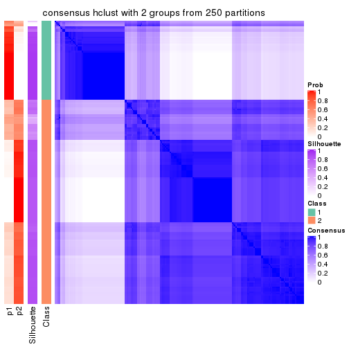</p>

</div>
<div id='tab-ATC-hclust-consensus-heatmap-2'>
<pre><code class="r">consensus_heatmap(res, k = 3)
</code></pre>

<p>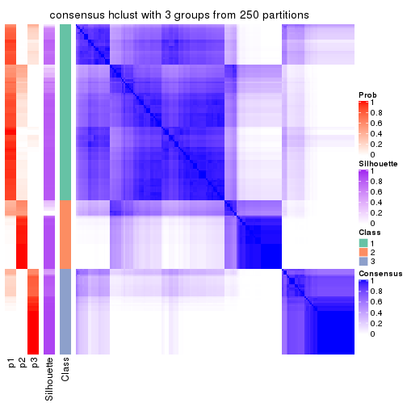</p>

</div>
<div id='tab-ATC-hclust-consensus-heatmap-3'>
<pre><code class="r">consensus_heatmap(res, k = 4)
</code></pre>

<p>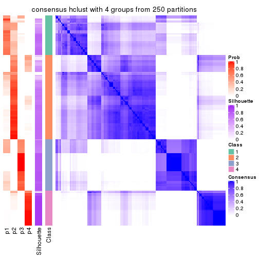</p>

</div>
<div id='tab-ATC-hclust-consensus-heatmap-4'>
<pre><code class="r">consensus_heatmap(res, k = 5)
</code></pre>

<p>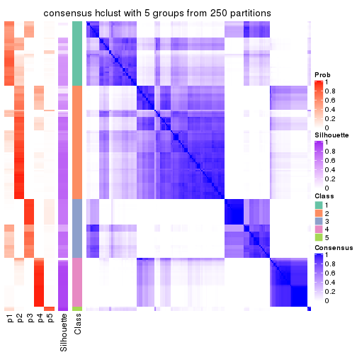</p>

</div>
<div id='tab-ATC-hclust-consensus-heatmap-5'>
<pre><code class="r">consensus_heatmap(res, k = 6)
</code></pre>

<p>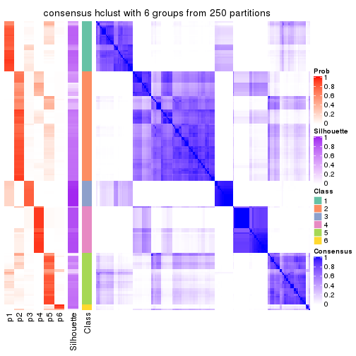</p>

</div>
</div>

Heatmaps for the membership of samples in all partitions to see how consistent they are:


<script>
$( function() {
	$( '#tabs-ATC-hclust-membership-heatmap' ).tabs();
} );
</script>
<div id='tabs-ATC-hclust-membership-heatmap'>
<ul>
<li><a href='#tab-ATC-hclust-membership-heatmap-1'>k = 2</a></li>
<li><a href='#tab-ATC-hclust-membership-heatmap-2'>k = 3</a></li>
<li><a href='#tab-ATC-hclust-membership-heatmap-3'>k = 4</a></li>
<li><a href='#tab-ATC-hclust-membership-heatmap-4'>k = 5</a></li>
<li><a href='#tab-ATC-hclust-membership-heatmap-5'>k = 6</a></li>
</ul>
<div id='tab-ATC-hclust-membership-heatmap-1'>
<pre><code class="r">membership_heatmap(res, k = 2)
</code></pre>

<p>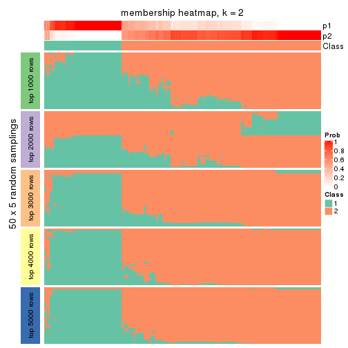</p>

</div>
<div id='tab-ATC-hclust-membership-heatmap-2'>
<pre><code class="r">membership_heatmap(res, k = 3)
</code></pre>

<p>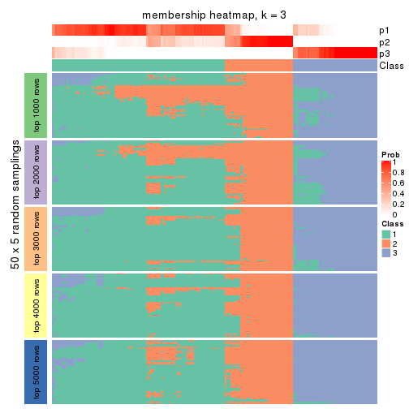</p>

</div>
<div id='tab-ATC-hclust-membership-heatmap-3'>
<pre><code class="r">membership_heatmap(res, k = 4)
</code></pre>

<p>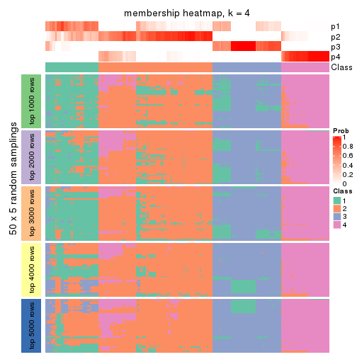</p>

</div>
<div id='tab-ATC-hclust-membership-heatmap-4'>
<pre><code class="r">membership_heatmap(res, k = 5)
</code></pre>

<p>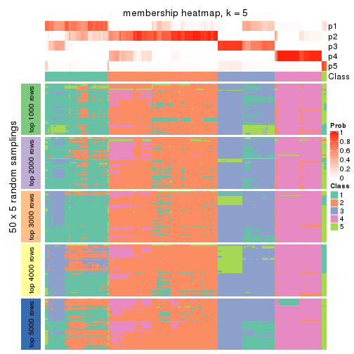</p>

</div>
<div id='tab-ATC-hclust-membership-heatmap-5'>
<pre><code class="r">membership_heatmap(res, k = 6)
</code></pre>

<p>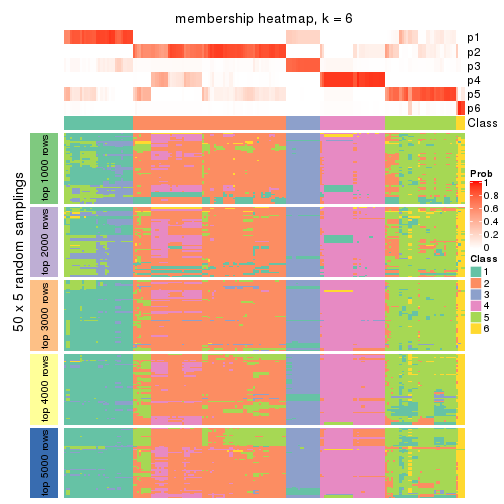</p>

</div>
</div>

As soon as we have had the classes for columns, we can look for signatures
which are significantly different between classes which can be candidate marks
for certain classes. Following are the heatmaps for signatures.


Signature heatmaps where rows are scaled:


<script>
$( function() {
	$( '#tabs-ATC-hclust-get-signatures' ).tabs();
} );
</script>
<div id='tabs-ATC-hclust-get-signatures'>
<ul>
<li><a href='#tab-ATC-hclust-get-signatures-1'>k = 2</a></li>
<li><a href='#tab-ATC-hclust-get-signatures-2'>k = 3</a></li>
<li><a href='#tab-ATC-hclust-get-signatures-3'>k = 4</a></li>
<li><a href='#tab-ATC-hclust-get-signatures-4'>k = 5</a></li>
<li><a href='#tab-ATC-hclust-get-signatures-5'>k = 6</a></li>
</ul>
<div id='tab-ATC-hclust-get-signatures-1'>
<pre><code class="r">get_signatures(res, k = 2)
</code></pre>

<p>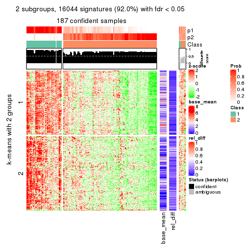</p>

</div>
<div id='tab-ATC-hclust-get-signatures-2'>
<pre><code class="r">get_signatures(res, k = 3)
</code></pre>

<p>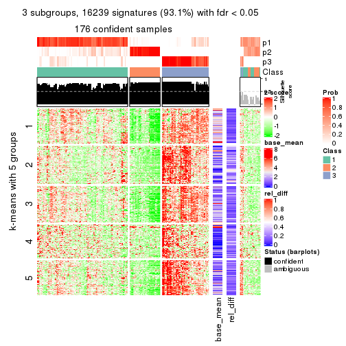</p>

</div>
<div id='tab-ATC-hclust-get-signatures-3'>
<pre><code class="r">get_signatures(res, k = 4)
</code></pre>

<p>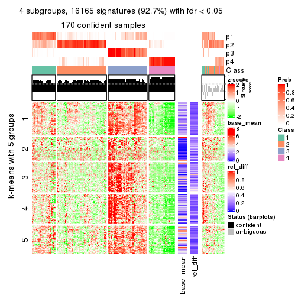</p>

</div>
<div id='tab-ATC-hclust-get-signatures-4'>
<pre><code class="r">get_signatures(res, k = 5)
</code></pre>

<p>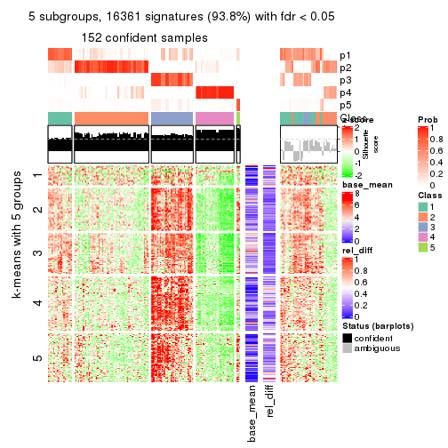</p>

</div>
<div id='tab-ATC-hclust-get-signatures-5'>
<pre><code class="r">get_signatures(res, k = 6)
</code></pre>

<p>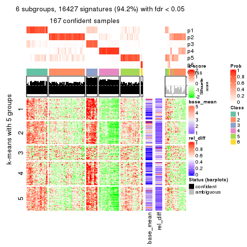</p>

</div>
</div>


Signature heatmaps where rows are not scaled:


<script>
$( function() {
	$( '#tabs-ATC-hclust-get-signatures-no-scale' ).tabs();
} );
</script>
<div id='tabs-ATC-hclust-get-signatures-no-scale'>
<ul>
<li><a href='#tab-ATC-hclust-get-signatures-no-scale-1'>k = 2</a></li>
<li><a href='#tab-ATC-hclust-get-signatures-no-scale-2'>k = 3</a></li>
<li><a href='#tab-ATC-hclust-get-signatures-no-scale-3'>k = 4</a></li>
<li><a href='#tab-ATC-hclust-get-signatures-no-scale-4'>k = 5</a></li>
<li><a href='#tab-ATC-hclust-get-signatures-no-scale-5'>k = 6</a></li>
</ul>
<div id='tab-ATC-hclust-get-signatures-no-scale-1'>
<pre><code class="r">get_signatures(res, k = 2, scale_rows = FALSE)
</code></pre>

<p>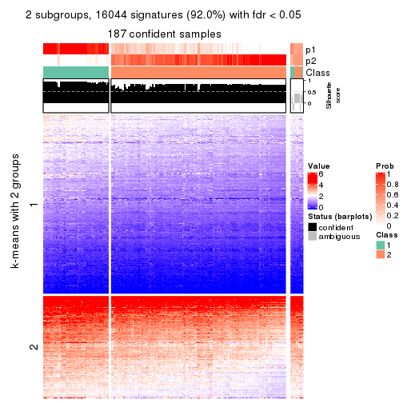</p>

</div>
<div id='tab-ATC-hclust-get-signatures-no-scale-2'>
<pre><code class="r">get_signatures(res, k = 3, scale_rows = FALSE)
</code></pre>

<p>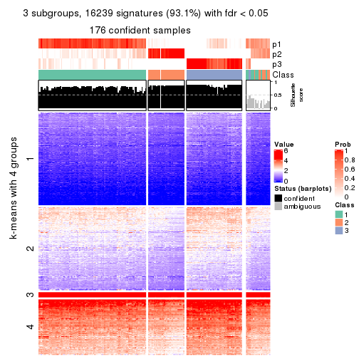</p>

</div>
<div id='tab-ATC-hclust-get-signatures-no-scale-3'>
<pre><code class="r">get_signatures(res, k = 4, scale_rows = FALSE)
</code></pre>

<p>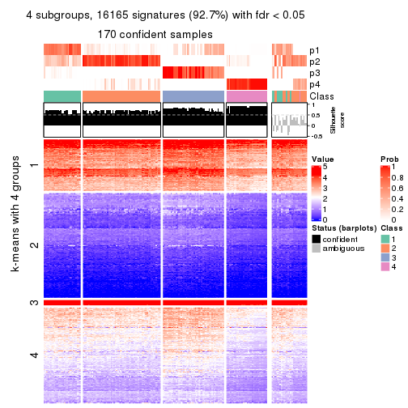</p>

</div>
<div id='tab-ATC-hclust-get-signatures-no-scale-4'>
<pre><code class="r">get_signatures(res, k = 5, scale_rows = FALSE)
</code></pre>

<p>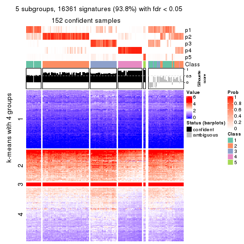</p>

</div>
<div id='tab-ATC-hclust-get-signatures-no-scale-5'>
<pre><code class="r">get_signatures(res, k = 6, scale_rows = FALSE)
</code></pre>

<p>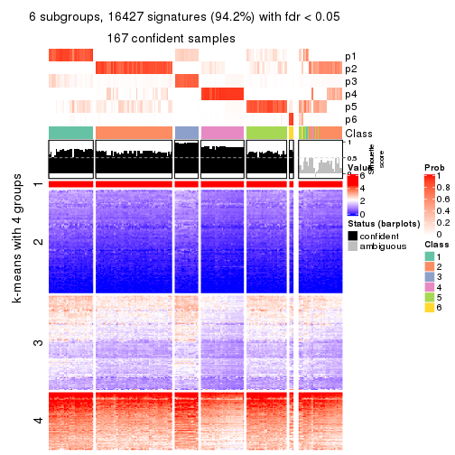</p>

</div>
</div>


Compare the overlap of signatures from different k:

```r
compare_signatures(res)
```

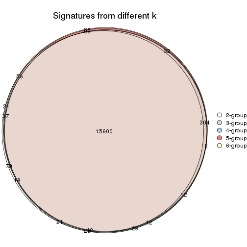

`get_signature()` returns a data frame invisibly. TO get the list of signatures, the function
call should be assigned to a variable explicitly. In following code, if `plot` argument is set
to `FALSE`, no heatmap is plotted while only the differential analysis is performed.

```r
# code only for demonstration
tb = get_signature(res, k = ..., plot = FALSE)
```

An example of the output of `tb` is:

```
#>   which_row         fdr    mean_1    mean_2 scaled_mean_1 scaled_mean_2 km
#> 1        38 0.042760348  8.373488  9.131774    -0.5533452     0.5164555  1
#> 2        40 0.018707592  7.106213  8.469186    -0.6173731     0.5762149  1
#> 3        55 0.019134737 10.221463 11.207825    -0.6159697     0.5749050  1
#> 4        59 0.006059896  5.921854  7.869574    -0.6899429     0.6439467  1
#> 5        60 0.018055526  8.928898 10.211722    -0.6204761     0.5791110  1
#> 6        98 0.009384629 15.714769 14.887706     0.6635654    -0.6193277  2
...
```

The columns in `tb` are:

1. `which_row`: row indices corresponding to the input matrix.
2. `fdr`: FDR for the differential test. 
3. `mean_x`: The mean value in group x.
4. `scaled_mean_x`: The mean value in group x after rows are scaled.
5. `km`: Row groups if k-means clustering is applied to rows.


UMAP plot which shows how samples are separated.


<script>
$( function() {
	$( '#tabs-ATC-hclust-dimension-reduction' ).tabs();
} );
</script>
<div id='tabs-ATC-hclust-dimension-reduction'>
<ul>
<li><a href='#tab-ATC-hclust-dimension-reduction-1'>k = 2</a></li>
<li><a href='#tab-ATC-hclust-dimension-reduction-2'>k = 3</a></li>
<li><a href='#tab-ATC-hclust-dimension-reduction-3'>k = 4</a></li>
<li><a href='#tab-ATC-hclust-dimension-reduction-4'>k = 5</a></li>
<li><a href='#tab-ATC-hclust-dimension-reduction-5'>k = 6</a></li>
</ul>
<div id='tab-ATC-hclust-dimension-reduction-1'>
<pre><code class="r">dimension_reduction(res, k = 2, method = &quot;UMAP&quot;)
</code></pre>

<p>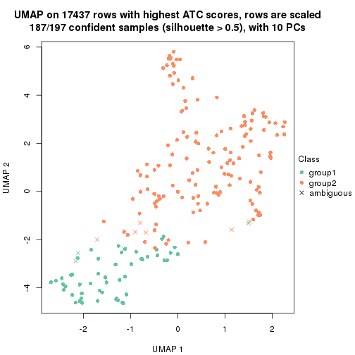</p>

</div>
<div id='tab-ATC-hclust-dimension-reduction-2'>
<pre><code class="r">dimension_reduction(res, k = 3, method = &quot;UMAP&quot;)
</code></pre>

<p>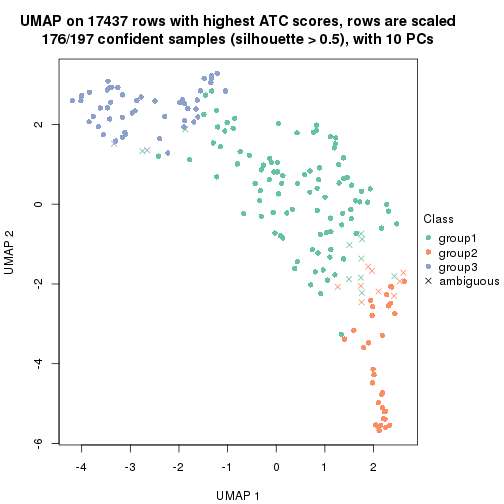</p>

</div>
<div id='tab-ATC-hclust-dimension-reduction-3'>
<pre><code class="r">dimension_reduction(res, k = 4, method = &quot;UMAP&quot;)
</code></pre>

<p>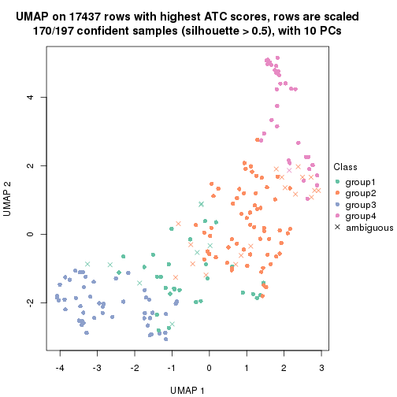</p>

</div>
<div id='tab-ATC-hclust-dimension-reduction-4'>
<pre><code class="r">dimension_reduction(res, k = 5, method = &quot;UMAP&quot;)
</code></pre>

<p>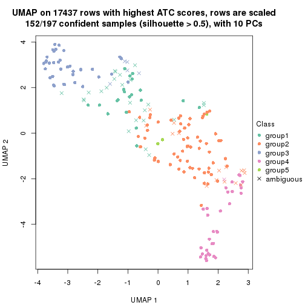</p>

</div>
<div id='tab-ATC-hclust-dimension-reduction-5'>
<pre><code class="r">dimension_reduction(res, k = 6, method = &quot;UMAP&quot;)
</code></pre>

<p>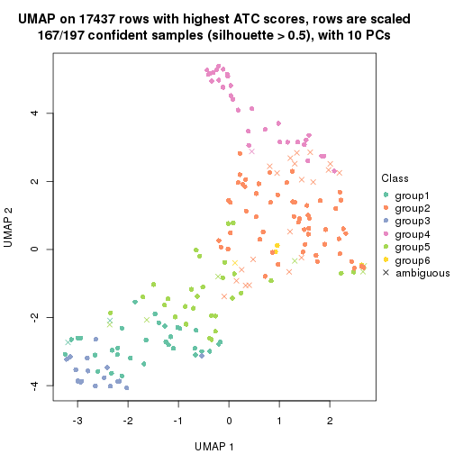</p>

</div>
</div>


Following heatmap shows how subgroups are split when increasing `k`:

```r
collect_classes(res)
```

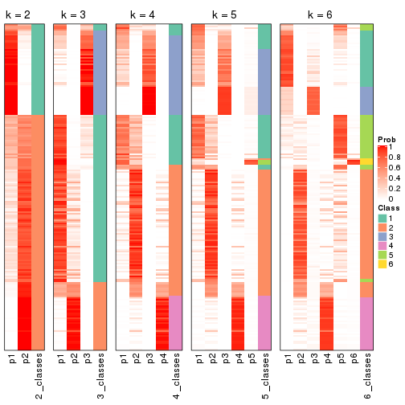


If matrix rows can be associated to genes, consider to use `GO_Enrichment(res,
...)` to perform function enrichment for the signature genes.


 

---------------------------------------------------


### ATC:kmeans**


The object with results only for a single top-value method and a single partition method 
can be extracted as:

```r
res = res_list["ATC", "kmeans"]
# you can also extract it by
# res = res_list["ATC:kmeans"]
```

A summary of `res` and all the functions that can be applied to it:

```r
res
```

```
#> A 'ConsensusPartition' object with k = 2, 3, 4, 5, 6.
#>   On a matrix with 17437 rows and 197 columns.
#>   Top rows (1000, 2000, 3000, 4000, 5000) are extracted by 'ATC' method.
#>   Subgroups are detected by 'kmeans' method.
#>   Performed in total 1250 partitions by row resampling.
#>   Best k for subgroups seems to be 4.
#> 
#> Following methods can be applied to this 'ConsensusPartition' object:
#>  [1] "cola_report"             "collect_classes"         "collect_plots"          
#>  [4] "collect_stats"           "colnames"                "compare_signatures"     
#>  [7] "consensus_heatmap"       "dimension_reduction"     "functional_enrichment"  
#> [10] "get_anno_col"            "get_anno"                "get_classes"            
#> [13] "get_consensus"           "get_matrix"              "get_membership"         
#> [16] "get_param"               "get_signatures"          "get_stats"              
#> [19] "is_best_k"               "is_stable_k"             "membership_heatmap"     
#> [22] "ncol"                    "nrow"                    "plot_ecdf"              
#> [25] "rownames"                "select_partition_number" "show"                   
#> [28] "suggest_best_k"          "test_to_known_factors"
```

`collect_plots()` function collects all the plots made from `res` for all `k` (number of partitions)
into one single page to provide an easy and fast comparison between different `k`.

```r
collect_plots(res)
```

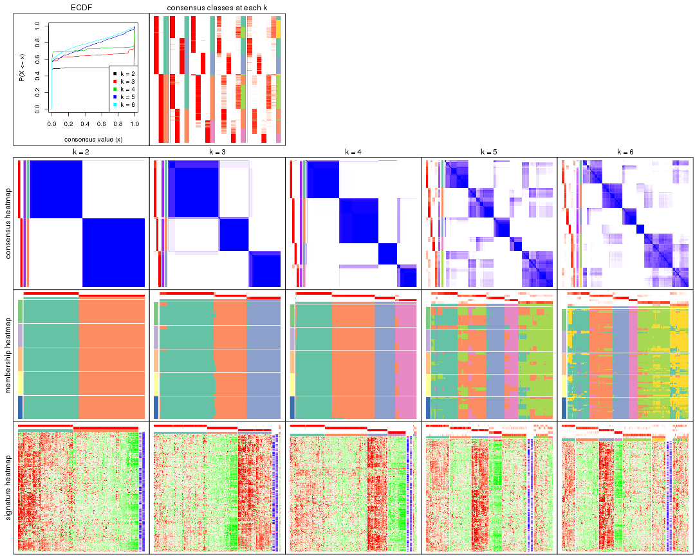

The plots are:

- The first row: a plot of the ECDF (Empirical cumulative distribution
  function) curves of the consensus matrix for each `k` and the heatmap of
  predicted classes for each `k`.
- The second row: heatmaps of the consensus matrix for each `k`.
- The third row: heatmaps of the membership matrix for each `k`.
- The fouth row: heatmaps of the signatures for each `k`.

All the plots in panels can be made by individual functions and they are
plotted later in this section.

`select_partition_number()` produces several plots showing different
statistics for choosing "optimized" `k`. There are following statistics:

- ECDF curves of the consensus matrix for each `k`;
- 1-PAC. [The PAC
  score](https://en.wikipedia.org/wiki/Consensus_clustering#Over-interpretation_potential_of_consensus_clustering)
  measures the proportion of the ambiguous subgrouping.
- Mean silhouette score.
- Concordance. The mean probability of fiting the consensus class ids in all
  partitions.
- Area increased. Denote $A_k$ as the area under the ECDF curve for current
  `k`, the area increased is defined as $A_k - A_{k-1}$.
- Rand index. The percent of pairs of samples that are both in a same cluster
  or both are not in a same cluster in the partition of k and k-1.
- Jaccard index. The ratio of pairs of samples are both in a same cluster in
  the partition of k and k-1 and the pairs of samples are both in a same
  cluster in the partition k or k-1.

The detailed explanations of these statistics can be found in [the cola
vignette](http://bioconductor.org/packages/devel/bioc/vignettes/cola/inst/doc/cola.html#toc_13).

Generally speaking, lower PAC score, higher mean silhouette score or higher
concordance corresponds to better partition. Rand index and Jaccard index
measure how similar the current partition is compared to partition with `k-1`.
If they are too similar, we won't accept `k` is better than `k-1`.

```r
select_partition_number(res)
```

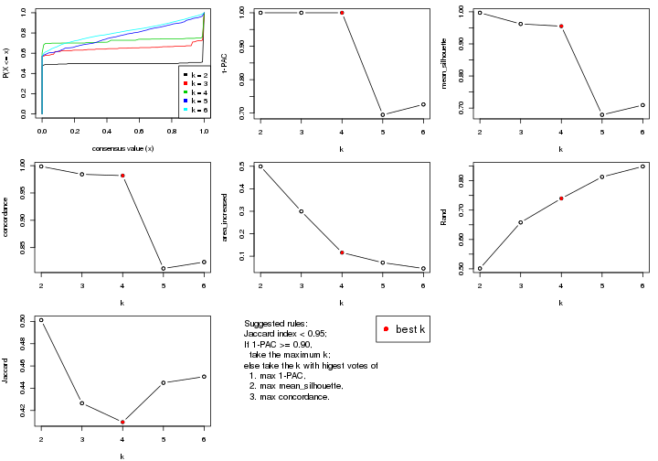

The numeric values for all these statistics can be obtained by `get_stats()`.

```r
get_stats(res)
```

```
#>   k 1-PAC mean_silhouette concordance area_increased  Rand Jaccard
#> 2 2 1.000           0.997       0.999         0.4992 0.501   0.501
#> 3 3 1.000           0.962       0.984         0.2994 0.658   0.427
#> 4 4 1.000           0.955       0.982         0.1160 0.740   0.410
#> 5 5 0.695           0.679       0.812         0.0714 0.813   0.445
#> 6 6 0.726           0.709       0.824         0.0455 0.849   0.450
```

`suggest_best_k()` suggests the best $k$ based on these statistics. The rules are as follows:

- All $k$ with Jaccard index larger than 0.95 are removed because the increase of
  the partition number does not provides enough extra information. If all $k$ are removed,
  the best $k$ is assigned by `NA`.
- For $k$ with 1-PAC larger than 0.9, the maximal $k$ is taken as the "best k". Other $k$ is called "optional k".
- If it does not fit the second rule. The $k$ with the highest vote of highest
  1-PAC, mean silhouette and concordance is taken as the "best k".

```r
suggest_best_k(res)
```

```
#> [1] 4
#> attr(,"optional")
#> [1] 2 3
```

There is also optional best $k$ = 2 3 that is worth to check.

Following shows the table of the partitions (You need to click the **show/hide
code output** link to see it). The membership matrix (columns with name `p*`)
is inferred by
[`clue::cl_consensus()`](https://www.rdocumentation.org/link/cl_consensus?package=clue)
function with the `SE` method. Basically the value in the membership matrix
represents the probability to belong to a certain group. The finall class
label for an item is determined with the group with highest probability it
belongs to.

In `get_classes()` function, the entropy is calculated from the membership
matrix and the silhouette score is calculated from the consensus matrix.


<script>
$( function() {
	$( '#tabs-ATC-kmeans-get-classes' ).tabs();
} );
</script>
<div id='tabs-ATC-kmeans-get-classes'>
<ul>
<li><a href='#tab-ATC-kmeans-get-classes-1'>k = 2</a></li>
<li><a href='#tab-ATC-kmeans-get-classes-2'>k = 3</a></li>
<li><a href='#tab-ATC-kmeans-get-classes-3'>k = 4</a></li>
<li><a href='#tab-ATC-kmeans-get-classes-4'>k = 5</a></li>
<li><a href='#tab-ATC-kmeans-get-classes-5'>k = 6</a></li>
</ul>

<div id='tab-ATC-kmeans-get-classes-1'>
<p><a id='tab-ATC-kmeans-get-classes-1-a' style='color:#0366d6' href='#'>show/hide code output</a></p>
<pre><code class="r">cbind(get_classes(res, k = 2), get_membership(res, k = 2))
</code></pre>

<pre><code>#&gt;            class entropy silhouette    p1    p2
#&gt; SRR1380886     1  0.0000      0.998 1.000 0.000
#&gt; SRR1074385     1  0.0000      0.998 1.000 0.000
#&gt; SRR1374739     1  0.0000      0.998 1.000 0.000
#&gt; SRR1097883     1  0.0000      0.998 1.000 0.000
#&gt; SRR2167209     1  0.0672      0.990 0.992 0.008
#&gt; SRR816541      2  0.0000      0.999 0.000 1.000
#&gt; SRR663645      1  0.0938      0.986 0.988 0.012
#&gt; SRR1381505     2  0.0000      0.999 0.000 1.000
#&gt; SRR1416362     2  0.0000      0.999 0.000 1.000
#&gt; SRR1318503     2  0.0000      0.999 0.000 1.000
#&gt; SRR1341626     2  0.0000      0.999 0.000 1.000
#&gt; SRR1382440     1  0.0000      0.998 1.000 0.000
#&gt; SRR1088413     1  0.0000      0.998 1.000 0.000
#&gt; SRR1082080     2  0.0000      0.999 0.000 1.000
#&gt; SRR1455783     1  0.0000      0.998 1.000 0.000
#&gt; SRR1447760     2  0.0000      0.999 0.000 1.000
#&gt; SRR1487784     2  0.0000      0.999 0.000 1.000
#&gt; SRR1331037     2  0.0000      0.999 0.000 1.000
#&gt; SRR1095651     1  0.0000      0.998 1.000 0.000
#&gt; SRR1078066     1  0.0000      0.998 1.000 0.000
#&gt; SRR1120363     1  0.0000      0.998 1.000 0.000
#&gt; SRR821231      1  0.0000      0.998 1.000 0.000
#&gt; SRR1374373     2  0.0000      0.999 0.000 1.000
#&gt; SRR1324519     2  0.0000      0.999 0.000 1.000
#&gt; SRR1431121     1  0.0000      0.998 1.000 0.000
#&gt; SRR1091032     2  0.0000      0.999 0.000 1.000
#&gt; SRR1365575     2  0.0000      0.999 0.000 1.000
#&gt; SRR1072972     1  0.0000      0.998 1.000 0.000
#&gt; SRR1310690     2  0.0000      0.999 0.000 1.000
#&gt; SRR1383037     1  0.0000      0.998 1.000 0.000
#&gt; SRR1095479     1  0.0000      0.998 1.000 0.000
#&gt; SRR1070403     1  0.0000      0.998 1.000 0.000
#&gt; SRR1390203     1  0.0000      0.998 1.000 0.000
#&gt; SRR1072007     2  0.0000      0.999 0.000 1.000
#&gt; SRR1468787     2  0.0000      0.999 0.000 1.000
#&gt; SRR1347959     2  0.0000      0.999 0.000 1.000
#&gt; SRR1338513     1  0.0000      0.998 1.000 0.000
#&gt; SRR812598      2  0.0000      0.999 0.000 1.000
#&gt; SRR1446806     1  0.0000      0.998 1.000 0.000
#&gt; SRR1394275     1  0.0000      0.998 1.000 0.000
#&gt; SRR1443633     1  0.0000      0.998 1.000 0.000
#&gt; SRR1087728     1  0.0000      0.998 1.000 0.000
#&gt; SRR1098192     2  0.0000      0.999 0.000 1.000
#&gt; SRR1093340     2  0.0000      0.999 0.000 1.000
#&gt; SRR665405      1  0.0000      0.998 1.000 0.000
#&gt; SRR657077      1  0.0000      0.998 1.000 0.000
#&gt; SRR813208      1  0.0000      0.998 1.000 0.000
#&gt; SRR1416074     2  0.0000      0.999 0.000 1.000
#&gt; SRR1089688     2  0.0000      0.999 0.000 1.000
#&gt; SRR1353461     1  0.0000      0.998 1.000 0.000
#&gt; SRR1466321     2  0.0000      0.999 0.000 1.000
#&gt; SRR1073021     2  0.0000      0.999 0.000 1.000
#&gt; SRR1322816     2  0.0000      0.999 0.000 1.000
#&gt; SRR1457727     1  0.0000      0.998 1.000 0.000
#&gt; SRR1464226     2  0.0000      0.999 0.000 1.000
#&gt; SRR1398863     1  0.0000      0.998 1.000 0.000
#&gt; SRR1455631     2  0.0000      0.999 0.000 1.000
#&gt; SRR1307808     2  0.0000      0.999 0.000 1.000
#&gt; SRR1374585     2  0.0000      0.999 0.000 1.000
#&gt; SRR1072104     2  0.0000      0.999 0.000 1.000
#&gt; SRR1076868     2  0.0000      0.999 0.000 1.000
#&gt; SRR1335984     2  0.0000      0.999 0.000 1.000
#&gt; SRR1445939     1  0.0000      0.998 1.000 0.000
#&gt; SRR1453047     2  0.0000      0.999 0.000 1.000
#&gt; SRR1339788     1  0.0000      0.998 1.000 0.000
#&gt; SRR1084323     1  0.0000      0.998 1.000 0.000
#&gt; SRR1092937     1  0.0000      0.998 1.000 0.000
#&gt; SRR1074090     2  0.0000      0.999 0.000 1.000
#&gt; SRR1099833     1  0.0000      0.998 1.000 0.000
#&gt; SRR1093434     1  0.0000      0.998 1.000 0.000
#&gt; SRR1435857     1  0.0000      0.998 1.000 0.000
#&gt; SRR1480347     2  0.0000      0.999 0.000 1.000
#&gt; SRR1440787     2  0.0000      0.999 0.000 1.000
#&gt; SRR1430202     2  0.0000      0.999 0.000 1.000
#&gt; SRR1322730     2  0.0000      0.999 0.000 1.000
#&gt; SRR811029      2  0.0000      0.999 0.000 1.000
#&gt; SRR1390456     1  0.0000      0.998 1.000 0.000
#&gt; SRR1381140     1  0.0000      0.998 1.000 0.000
#&gt; SRR1388064     2  0.0000      0.999 0.000 1.000
#&gt; SRR1093577     1  0.0000      0.998 1.000 0.000
#&gt; SRR1414161     1  0.0000      0.998 1.000 0.000
#&gt; SRR1328738     2  0.0000      0.999 0.000 1.000
#&gt; SRR1311752     2  0.0000      0.999 0.000 1.000
#&gt; SRR1445960     2  0.0000      0.999 0.000 1.000
#&gt; SRR1403412     2  0.0000      0.999 0.000 1.000
#&gt; SRR2166748     1  0.0000      0.998 1.000 0.000
#&gt; SRR821666      2  0.0000      0.999 0.000 1.000
#&gt; SRR1330746     1  0.0000      0.998 1.000 0.000
#&gt; SRR1327872     2  0.0000      0.999 0.000 1.000
#&gt; SRR1100800     1  0.0000      0.998 1.000 0.000
#&gt; SRR1075174     1  0.0000      0.998 1.000 0.000
#&gt; SRR1434436     2  0.0000      0.999 0.000 1.000
#&gt; SRR1389409     2  0.0000      0.999 0.000 1.000
#&gt; SRR1085310     1  0.0000      0.998 1.000 0.000
#&gt; SRR1376718     2  0.0000      0.999 0.000 1.000
#&gt; SRR808590      2  0.0000      0.999 0.000 1.000
#&gt; SRR1084128     2  0.4562      0.893 0.096 0.904
#&gt; SRR1361692     1  0.6247      0.815 0.844 0.156
#&gt; SRR1431493     1  0.0000      0.998 1.000 0.000
#&gt; SRR1409084     1  0.0000      0.998 1.000 0.000
#&gt; SRR2166214     1  0.0000      0.998 1.000 0.000
#&gt; SRR1324102     2  0.0000      0.999 0.000 1.000
#&gt; SRR1079754     2  0.0000      0.999 0.000 1.000
#&gt; SRR1442127     1  0.0000      0.998 1.000 0.000
#&gt; SRR1076244     2  0.0000      0.999 0.000 1.000
#&gt; SRR1330901     2  0.0000      0.999 0.000 1.000
#&gt; SRR1073167     2  0.0000      0.999 0.000 1.000
#&gt; SRR1357541     1  0.0000      0.998 1.000 0.000
#&gt; SRR811607      2  0.0000      0.999 0.000 1.000
#&gt; SRR1468931     1  0.0000      0.998 1.000 0.000
#&gt; SRR1474908     2  0.0000      0.999 0.000 1.000
#&gt; SRR1309875     2  0.0000      0.999 0.000 1.000
#&gt; SRR598792      1  0.0000      0.998 1.000 0.000
#&gt; SRR1088537     2  0.0000      0.999 0.000 1.000
#&gt; SRR1457682     1  0.0000      0.998 1.000 0.000
#&gt; SRR1454289     2  0.0000      0.999 0.000 1.000
#&gt; SRR1069352     1  0.0000      0.998 1.000 0.000
#&gt; SRR1472728     2  0.0000      0.999 0.000 1.000
#&gt; SRR1091144     2  0.0000      0.999 0.000 1.000
#&gt; SRR1319118     1  0.0000      0.998 1.000 0.000
#&gt; SRR1403611     1  0.0000      0.998 1.000 0.000
#&gt; SRR1397762     1  0.0000      0.998 1.000 0.000
#&gt; SRR1317387     1  0.0000      0.998 1.000 0.000
#&gt; SRR1376426     2  0.0000      0.999 0.000 1.000
#&gt; SRR1097777     1  0.0000      0.998 1.000 0.000
#&gt; SRR1365743     1  0.0000      0.998 1.000 0.000
#&gt; SRR1458992     2  0.0000      0.999 0.000 1.000
#&gt; SRR1089537     1  0.0000      0.998 1.000 0.000
#&gt; SRR1397744     1  0.0000      0.998 1.000 0.000
#&gt; SRR1453893     2  0.0000      0.999 0.000 1.000
#&gt; SRR1098543     1  0.0000      0.998 1.000 0.000
#&gt; SRR1321765     1  0.0000      0.998 1.000 0.000
#&gt; SRR1440032     2  0.0000      0.999 0.000 1.000
#&gt; SRR1404507     2  0.0000      0.999 0.000 1.000
#&gt; SRR1404856     2  0.0000      0.999 0.000 1.000
#&gt; SRR812745      1  0.0376      0.994 0.996 0.004
#&gt; SRR1417524     2  0.0000      0.999 0.000 1.000
#&gt; SRR1407334     2  0.0000      0.999 0.000 1.000
#&gt; SRR1453991     1  0.0000      0.998 1.000 0.000
#&gt; SRR1415938     1  0.0000      0.998 1.000 0.000
#&gt; SRR1081259     2  0.0000      0.999 0.000 1.000
#&gt; SRR1436187     2  0.0000      0.999 0.000 1.000
#&gt; SRR1431948     1  0.0000      0.998 1.000 0.000
#&gt; SRR1453277     2  0.0000      0.999 0.000 1.000
#&gt; SRR1095407     2  0.0000      0.999 0.000 1.000
#&gt; SRR1359694     2  0.0000      0.999 0.000 1.000
#&gt; SRR656982      2  0.0000      0.999 0.000 1.000
#&gt; SRR1354338     2  0.0000      0.999 0.000 1.000
#&gt; SRR1088291     2  0.0000      0.999 0.000 1.000
#&gt; SRR1080624     1  0.0000      0.998 1.000 0.000
#&gt; SRR2166708     1  0.0000      0.998 1.000 0.000
#&gt; SRR1393572     1  0.0000      0.998 1.000 0.000
#&gt; SRR1429912     2  0.0000      0.999 0.000 1.000
#&gt; SRR1421048     2  0.0000      0.999 0.000 1.000
#&gt; SRR1434999     1  0.0000      0.998 1.000 0.000
#&gt; SRR656457      1  0.0000      0.998 1.000 0.000
#&gt; SRR1098928     1  0.0000      0.998 1.000 0.000
#&gt; SRR1343967     2  0.0000      0.999 0.000 1.000
#&gt; SRR1360766     2  0.0000      0.999 0.000 1.000
#&gt; SRR1464724     2  0.0000      0.999 0.000 1.000
#&gt; SRR1101542     2  0.0000      0.999 0.000 1.000
#&gt; SRR1401528     1  0.0000      0.998 1.000 0.000
#&gt; SRR1071519     1  0.0000      0.998 1.000 0.000
#&gt; SRR1086070     1  0.0000      0.998 1.000 0.000
#&gt; SRR1358645     2  0.0000      0.999 0.000 1.000
#&gt; SRR819771      1  0.0000      0.998 1.000 0.000
#&gt; SRR1418433     2  0.0000      0.999 0.000 1.000
#&gt; SRR821050      1  0.0000      0.998 1.000 0.000
#&gt; SRR1402091     2  0.0000      0.999 0.000 1.000
#&gt; SRR1322028     2  0.0000      0.999 0.000 1.000
#&gt; SRR1452556     2  0.0000      0.999 0.000 1.000
#&gt; SRR1340047     2  0.0000      0.999 0.000 1.000
#&gt; SRR1418302     2  0.0000      0.999 0.000 1.000
#&gt; SRR1073991     1  0.0000      0.998 1.000 0.000
#&gt; SRR1085187     2  0.0000      0.999 0.000 1.000
#&gt; SRR1357618     1  0.0000      0.998 1.000 0.000
#&gt; SRR1487764     2  0.0000      0.999 0.000 1.000
#&gt; SRR1075336     2  0.0000      0.999 0.000 1.000
#&gt; SRR1365471     2  0.0000      0.999 0.000 1.000
#&gt; SRR1414613     2  0.0000      0.999 0.000 1.000
#&gt; SRR658719      1  0.0000      0.998 1.000 0.000
#&gt; SRR1475128     1  0.0000      0.998 1.000 0.000
#&gt; SRR1367630     2  0.0000      0.999 0.000 1.000
#&gt; SRR1481146     2  0.0000      0.999 0.000 1.000
#&gt; SRR1465674     2  0.0000      0.999 0.000 1.000
#&gt; SRR1327303     2  0.0000      0.999 0.000 1.000
#&gt; SRR1390391     1  0.0000      0.998 1.000 0.000
#&gt; SRR1326020     2  0.0000      0.999 0.000 1.000
#&gt; SRR1381953     2  0.0000      0.999 0.000 1.000
#&gt; SRR1082544     2  0.0000      0.999 0.000 1.000
#&gt; SRR810761      1  0.0000      0.998 1.000 0.000
#&gt; SRR1070764     1  0.0000      0.998 1.000 0.000
#&gt; SRR1415919     1  0.0000      0.998 1.000 0.000
#&gt; SRR1490404     2  0.0000      0.999 0.000 1.000
#&gt; SRR1416773     2  0.0000      0.999 0.000 1.000
#&gt; SRR1377492     2  0.0000      0.999 0.000 1.000
#&gt; SRR1334314     1  0.0000      0.998 1.000 0.000
</code></pre>

<script>
$('#tab-ATC-kmeans-get-classes-1-a').parent().next().next().hide();
$('#tab-ATC-kmeans-get-classes-1-a').click(function(){
  $('#tab-ATC-kmeans-get-classes-1-a').parent().next().next().toggle();
  return(false);
});
</script>
</div>

<div id='tab-ATC-kmeans-get-classes-2'>
<p><a id='tab-ATC-kmeans-get-classes-2-a' style='color:#0366d6' href='#'>show/hide code output</a></p>
<pre><code class="r">cbind(get_classes(res, k = 3), get_membership(res, k = 3))
</code></pre>

<pre><code>#&gt;            class entropy silhouette    p1    p2    p3
#&gt; SRR1380886     3  0.0747      0.969 0.016 0.000 0.984
#&gt; SRR1074385     1  0.0000      0.987 1.000 0.000 0.000
#&gt; SRR1374739     3  0.0000      0.983 0.000 0.000 1.000
#&gt; SRR1097883     3  0.0000      0.983 0.000 0.000 1.000
#&gt; SRR2167209     1  0.0000      0.987 1.000 0.000 0.000
#&gt; SRR816541      2  0.0000      0.973 0.000 1.000 0.000
#&gt; SRR663645      1  0.0000      0.987 1.000 0.000 0.000
#&gt; SRR1381505     2  0.0000      0.973 0.000 1.000 0.000
#&gt; SRR1416362     1  0.2448      0.921 0.924 0.076 0.000
#&gt; SRR1318503     1  0.0000      0.987 1.000 0.000 0.000
#&gt; SRR1341626     2  0.0000      0.973 0.000 1.000 0.000
#&gt; SRR1382440     3  0.0000      0.983 0.000 0.000 1.000
#&gt; SRR1088413     1  0.0000      0.987 1.000 0.000 0.000
#&gt; SRR1082080     2  0.0000      0.973 0.000 1.000 0.000
#&gt; SRR1455783     3  0.0000      0.983 0.000 0.000 1.000
#&gt; SRR1447760     1  0.0000      0.987 1.000 0.000 0.000
#&gt; SRR1487784     1  0.2537      0.917 0.920 0.080 0.000
#&gt; SRR1331037     1  0.2448      0.921 0.924 0.076 0.000
#&gt; SRR1095651     3  0.0000      0.983 0.000 0.000 1.000
#&gt; SRR1078066     1  0.0000      0.987 1.000 0.000 0.000
#&gt; SRR1120363     1  0.0000      0.987 1.000 0.000 0.000
#&gt; SRR821231      3  0.0000      0.983 0.000 0.000 1.000
#&gt; SRR1374373     1  0.0000      0.987 1.000 0.000 0.000
#&gt; SRR1324519     2  0.0000      0.973 0.000 1.000 0.000
#&gt; SRR1431121     3  0.0000      0.983 0.000 0.000 1.000
#&gt; SRR1091032     2  0.0000      0.973 0.000 1.000 0.000
#&gt; SRR1365575     2  0.0000      0.973 0.000 1.000 0.000
#&gt; SRR1072972     3  0.0000      0.983 0.000 0.000 1.000
#&gt; SRR1310690     1  0.0000      0.987 1.000 0.000 0.000
#&gt; SRR1383037     3  0.0000      0.983 0.000 0.000 1.000
#&gt; SRR1095479     3  0.0000      0.983 0.000 0.000 1.000
#&gt; SRR1070403     3  0.0000      0.983 0.000 0.000 1.000
#&gt; SRR1390203     3  0.0000      0.983 0.000 0.000 1.000
#&gt; SRR1072007     2  0.0000      0.973 0.000 1.000 0.000
#&gt; SRR1468787     1  0.2448      0.921 0.924 0.076 0.000
#&gt; SRR1347959     1  0.0000      0.987 1.000 0.000 0.000
#&gt; SRR1338513     1  0.0000      0.987 1.000 0.000 0.000
#&gt; SRR812598      2  0.0000      0.973 0.000 1.000 0.000
#&gt; SRR1446806     1  0.0000      0.987 1.000 0.000 0.000
#&gt; SRR1394275     1  0.0000      0.987 1.000 0.000 0.000
#&gt; SRR1443633     1  0.0000      0.987 1.000 0.000 0.000
#&gt; SRR1087728     3  0.0000      0.983 0.000 0.000 1.000
#&gt; SRR1098192     2  0.0000      0.973 0.000 1.000 0.000
#&gt; SRR1093340     2  0.0000      0.973 0.000 1.000 0.000
#&gt; SRR665405      1  0.0000      0.987 1.000 0.000 0.000
#&gt; SRR657077      1  0.0000      0.987 1.000 0.000 0.000
#&gt; SRR813208      3  0.0000      0.983 0.000 0.000 1.000
#&gt; SRR1416074     2  0.0000      0.973 0.000 1.000 0.000
#&gt; SRR1089688     1  0.1643      0.951 0.956 0.044 0.000
#&gt; SRR1353461     3  0.0000      0.983 0.000 0.000 1.000
#&gt; SRR1466321     1  0.0000      0.987 1.000 0.000 0.000
#&gt; SRR1073021     1  0.0000      0.987 1.000 0.000 0.000
#&gt; SRR1322816     2  0.0000      0.973 0.000 1.000 0.000
#&gt; SRR1457727     3  0.0000      0.983 0.000 0.000 1.000
#&gt; SRR1464226     1  0.0000      0.987 1.000 0.000 0.000
#&gt; SRR1398863     1  0.0000      0.987 1.000 0.000 0.000
#&gt; SRR1455631     1  0.0000      0.987 1.000 0.000 0.000
#&gt; SRR1307808     1  0.0000      0.987 1.000 0.000 0.000
#&gt; SRR1374585     2  0.0000      0.973 0.000 1.000 0.000
#&gt; SRR1072104     2  0.5785      0.498 0.332 0.668 0.000
#&gt; SRR1076868     2  0.0000      0.973 0.000 1.000 0.000
#&gt; SRR1335984     2  0.0000      0.973 0.000 1.000 0.000
#&gt; SRR1445939     1  0.0000      0.987 1.000 0.000 0.000
#&gt; SRR1453047     2  0.0000      0.973 0.000 1.000 0.000
#&gt; SRR1339788     3  0.0000      0.983 0.000 0.000 1.000
#&gt; SRR1084323     3  0.0000      0.983 0.000 0.000 1.000
#&gt; SRR1092937     1  0.0000      0.987 1.000 0.000 0.000
#&gt; SRR1074090     2  0.0000      0.973 0.000 1.000 0.000
#&gt; SRR1099833     3  0.2356      0.917 0.072 0.000 0.928
#&gt; SRR1093434     3  0.0000      0.983 0.000 0.000 1.000
#&gt; SRR1435857     1  0.0000      0.987 1.000 0.000 0.000
#&gt; SRR1480347     2  0.0000      0.973 0.000 1.000 0.000
#&gt; SRR1440787     2  0.0000      0.973 0.000 1.000 0.000
#&gt; SRR1430202     1  0.0000      0.987 1.000 0.000 0.000
#&gt; SRR1322730     2  0.0000      0.973 0.000 1.000 0.000
#&gt; SRR811029      1  0.0000      0.987 1.000 0.000 0.000
#&gt; SRR1390456     3  0.0000      0.983 0.000 0.000 1.000
#&gt; SRR1381140     3  0.3340      0.866 0.120 0.000 0.880
#&gt; SRR1388064     2  0.0000      0.973 0.000 1.000 0.000
#&gt; SRR1093577     1  0.0000      0.987 1.000 0.000 0.000
#&gt; SRR1414161     1  0.0000      0.987 1.000 0.000 0.000
#&gt; SRR1328738     1  0.0000      0.987 1.000 0.000 0.000
#&gt; SRR1311752     2  0.0000      0.973 0.000 1.000 0.000
#&gt; SRR1445960     1  0.2448      0.921 0.924 0.076 0.000
#&gt; SRR1403412     2  0.0000      0.973 0.000 1.000 0.000
#&gt; SRR2166748     3  0.0000      0.983 0.000 0.000 1.000
#&gt; SRR821666      2  0.0000      0.973 0.000 1.000 0.000
#&gt; SRR1330746     3  0.0000      0.983 0.000 0.000 1.000
#&gt; SRR1327872     2  0.0000      0.973 0.000 1.000 0.000
#&gt; SRR1100800     1  0.0000      0.987 1.000 0.000 0.000
#&gt; SRR1075174     1  0.0000      0.987 1.000 0.000 0.000
#&gt; SRR1434436     1  0.0000      0.987 1.000 0.000 0.000
#&gt; SRR1389409     2  0.0000      0.973 0.000 1.000 0.000
#&gt; SRR1085310     3  0.4399      0.783 0.188 0.000 0.812
#&gt; SRR1376718     2  0.0000      0.973 0.000 1.000 0.000
#&gt; SRR808590      2  0.0000      0.973 0.000 1.000 0.000
#&gt; SRR1084128     1  0.0000      0.987 1.000 0.000 0.000
#&gt; SRR1361692     1  0.0000      0.987 1.000 0.000 0.000
#&gt; SRR1431493     3  0.0000      0.983 0.000 0.000 1.000
#&gt; SRR1409084     1  0.0000      0.987 1.000 0.000 0.000
#&gt; SRR2166214     1  0.0000      0.987 1.000 0.000 0.000
#&gt; SRR1324102     2  0.0000      0.973 0.000 1.000 0.000
#&gt; SRR1079754     2  0.0000      0.973 0.000 1.000 0.000
#&gt; SRR1442127     3  0.0000      0.983 0.000 0.000 1.000
#&gt; SRR1076244     2  0.0000      0.973 0.000 1.000 0.000
#&gt; SRR1330901     1  0.0000      0.987 1.000 0.000 0.000
#&gt; SRR1073167     2  0.0000      0.973 0.000 1.000 0.000
#&gt; SRR1357541     3  0.0000      0.983 0.000 0.000 1.000
#&gt; SRR811607      1  0.0000      0.987 1.000 0.000 0.000
#&gt; SRR1468931     3  0.0000      0.983 0.000 0.000 1.000
#&gt; SRR1474908     1  0.0000      0.987 1.000 0.000 0.000
#&gt; SRR1309875     2  0.0000      0.973 0.000 1.000 0.000
#&gt; SRR598792      3  0.0000      0.983 0.000 0.000 1.000
#&gt; SRR1088537     2  0.6140      0.321 0.404 0.596 0.000
#&gt; SRR1457682     3  0.3267      0.871 0.116 0.000 0.884
#&gt; SRR1454289     1  0.0000      0.987 1.000 0.000 0.000
#&gt; SRR1069352     3  0.0000      0.983 0.000 0.000 1.000
#&gt; SRR1472728     1  0.0000      0.987 1.000 0.000 0.000
#&gt; SRR1091144     1  0.2448      0.921 0.924 0.076 0.000
#&gt; SRR1319118     3  0.2066      0.928 0.060 0.000 0.940
#&gt; SRR1403611     3  0.0000      0.983 0.000 0.000 1.000
#&gt; SRR1397762     3  0.0000      0.983 0.000 0.000 1.000
#&gt; SRR1317387     3  0.0000      0.983 0.000 0.000 1.000
#&gt; SRR1376426     2  0.0000      0.973 0.000 1.000 0.000
#&gt; SRR1097777     3  0.0000      0.983 0.000 0.000 1.000
#&gt; SRR1365743     3  0.0000      0.983 0.000 0.000 1.000
#&gt; SRR1458992     1  0.0000      0.987 1.000 0.000 0.000
#&gt; SRR1089537     1  0.0000      0.987 1.000 0.000 0.000
#&gt; SRR1397744     3  0.0000      0.983 0.000 0.000 1.000
#&gt; SRR1453893     2  0.0000      0.973 0.000 1.000 0.000
#&gt; SRR1098543     3  0.0000      0.983 0.000 0.000 1.000
#&gt; SRR1321765     1  0.0000      0.987 1.000 0.000 0.000
#&gt; SRR1440032     1  0.0000      0.987 1.000 0.000 0.000
#&gt; SRR1404507     2  0.0000      0.973 0.000 1.000 0.000
#&gt; SRR1404856     1  0.0000      0.987 1.000 0.000 0.000
#&gt; SRR812745      1  0.0000      0.987 1.000 0.000 0.000
#&gt; SRR1417524     1  0.0000      0.987 1.000 0.000 0.000
#&gt; SRR1407334     2  0.0000      0.973 0.000 1.000 0.000
#&gt; SRR1453991     1  0.0000      0.987 1.000 0.000 0.000
#&gt; SRR1415938     3  0.0000      0.983 0.000 0.000 1.000
#&gt; SRR1081259     1  0.0000      0.987 1.000 0.000 0.000
#&gt; SRR1436187     2  0.0000      0.973 0.000 1.000 0.000
#&gt; SRR1431948     3  0.0000      0.983 0.000 0.000 1.000
#&gt; SRR1453277     1  0.0000      0.987 1.000 0.000 0.000
#&gt; SRR1095407     1  0.0000      0.987 1.000 0.000 0.000
#&gt; SRR1359694     1  0.0000      0.987 1.000 0.000 0.000
#&gt; SRR656982      1  0.0000      0.987 1.000 0.000 0.000
#&gt; SRR1354338     1  0.0000      0.987 1.000 0.000 0.000
#&gt; SRR1088291     1  0.0000      0.987 1.000 0.000 0.000
#&gt; SRR1080624     1  0.0000      0.987 1.000 0.000 0.000
#&gt; SRR2166708     3  0.0000      0.983 0.000 0.000 1.000
#&gt; SRR1393572     1  0.0000      0.987 1.000 0.000 0.000
#&gt; SRR1429912     2  0.0000      0.973 0.000 1.000 0.000
#&gt; SRR1421048     1  0.2356      0.925 0.928 0.072 0.000
#&gt; SRR1434999     1  0.0000      0.987 1.000 0.000 0.000
#&gt; SRR656457      3  0.5216      0.670 0.260 0.000 0.740
#&gt; SRR1098928     3  0.0000      0.983 0.000 0.000 1.000
#&gt; SRR1343967     2  0.0000      0.973 0.000 1.000 0.000
#&gt; SRR1360766     1  0.0000      0.987 1.000 0.000 0.000
#&gt; SRR1464724     2  0.0000      0.973 0.000 1.000 0.000
#&gt; SRR1101542     2  0.0000      0.973 0.000 1.000 0.000
#&gt; SRR1401528     3  0.0747      0.969 0.016 0.000 0.984
#&gt; SRR1071519     3  0.0000      0.983 0.000 0.000 1.000
#&gt; SRR1086070     3  0.0000      0.983 0.000 0.000 1.000
#&gt; SRR1358645     1  0.0000      0.987 1.000 0.000 0.000
#&gt; SRR819771      3  0.0000      0.983 0.000 0.000 1.000
#&gt; SRR1418433     1  0.5363      0.627 0.724 0.276 0.000
#&gt; SRR821050      1  0.0000      0.987 1.000 0.000 0.000
#&gt; SRR1402091     2  0.0000      0.973 0.000 1.000 0.000
#&gt; SRR1322028     2  0.0000      0.973 0.000 1.000 0.000
#&gt; SRR1452556     2  0.0000      0.973 0.000 1.000 0.000
#&gt; SRR1340047     1  0.0000      0.987 1.000 0.000 0.000
#&gt; SRR1418302     1  0.0000      0.987 1.000 0.000 0.000
#&gt; SRR1073991     3  0.0000      0.983 0.000 0.000 1.000
#&gt; SRR1085187     2  0.0000      0.973 0.000 1.000 0.000
#&gt; SRR1357618     3  0.0000      0.983 0.000 0.000 1.000
#&gt; SRR1487764     1  0.0000      0.987 1.000 0.000 0.000
#&gt; SRR1075336     1  0.0000      0.987 1.000 0.000 0.000
#&gt; SRR1365471     2  0.0000      0.973 0.000 1.000 0.000
#&gt; SRR1414613     1  0.2448      0.921 0.924 0.076 0.000
#&gt; SRR658719      1  0.0000      0.987 1.000 0.000 0.000
#&gt; SRR1475128     3  0.0000      0.983 0.000 0.000 1.000
#&gt; SRR1367630     1  0.0000      0.987 1.000 0.000 0.000
#&gt; SRR1481146     1  0.2448      0.921 0.924 0.076 0.000
#&gt; SRR1465674     1  0.0000      0.987 1.000 0.000 0.000
#&gt; SRR1327303     1  0.0000      0.987 1.000 0.000 0.000
#&gt; SRR1390391     1  0.0000      0.987 1.000 0.000 0.000
#&gt; SRR1326020     1  0.2066      0.936 0.940 0.060 0.000
#&gt; SRR1381953     1  0.0000      0.987 1.000 0.000 0.000
#&gt; SRR1082544     2  0.0000      0.973 0.000 1.000 0.000
#&gt; SRR810761      3  0.0000      0.983 0.000 0.000 1.000
#&gt; SRR1070764     3  0.0000      0.983 0.000 0.000 1.000
#&gt; SRR1415919     3  0.0000      0.983 0.000 0.000 1.000
#&gt; SRR1490404     2  0.0000      0.973 0.000 1.000 0.000
#&gt; SRR1416773     1  0.0000      0.987 1.000 0.000 0.000
#&gt; SRR1377492     2  0.6295      0.101 0.472 0.528 0.000
#&gt; SRR1334314     1  0.0000      0.987 1.000 0.000 0.000
</code></pre>

<script>
$('#tab-ATC-kmeans-get-classes-2-a').parent().next().next().hide();
$('#tab-ATC-kmeans-get-classes-2-a').click(function(){
  $('#tab-ATC-kmeans-get-classes-2-a').parent().next().next().toggle();
  return(false);
});
</script>
</div>

<div id='tab-ATC-kmeans-get-classes-3'>
<p><a id='tab-ATC-kmeans-get-classes-3-a' style='color:#0366d6' href='#'>show/hide code output</a></p>
<pre><code class="r">cbind(get_classes(res, k = 4), get_membership(res, k = 4))
</code></pre>

<pre><code>#&gt;            class entropy silhouette    p1    p2    p3    p4
#&gt; SRR1380886     1  0.0000      0.986 1.000 0.000 0.000 0.000
#&gt; SRR1074385     1  0.0000      0.986 1.000 0.000 0.000 0.000
#&gt; SRR1374739     3  0.0000      1.000 0.000 0.000 1.000 0.000
#&gt; SRR1097883     1  0.0000      0.986 1.000 0.000 0.000 0.000
#&gt; SRR2167209     1  0.0000      0.986 1.000 0.000 0.000 0.000
#&gt; SRR816541      4  0.0336      0.905 0.000 0.008 0.000 0.992
#&gt; SRR663645      1  0.0000      0.986 1.000 0.000 0.000 0.000
#&gt; SRR1381505     4  0.0000      0.908 0.000 0.000 0.000 1.000
#&gt; SRR1416362     2  0.0000      0.994 0.000 1.000 0.000 0.000
#&gt; SRR1318503     2  0.0469      0.986 0.012 0.988 0.000 0.000
#&gt; SRR1341626     4  0.0336      0.905 0.000 0.008 0.000 0.992
#&gt; SRR1382440     3  0.0000      1.000 0.000 0.000 1.000 0.000
#&gt; SRR1088413     1  0.0000      0.986 1.000 0.000 0.000 0.000
#&gt; SRR1082080     4  0.0336      0.905 0.000 0.008 0.000 0.992
#&gt; SRR1455783     1  0.0000      0.986 1.000 0.000 0.000 0.000
#&gt; SRR1447760     2  0.0000      0.994 0.000 1.000 0.000 0.000
#&gt; SRR1487784     2  0.0000      0.994 0.000 1.000 0.000 0.000
#&gt; SRR1331037     2  0.0000      0.994 0.000 1.000 0.000 0.000
#&gt; SRR1095651     1  0.0336      0.980 0.992 0.000 0.008 0.000
#&gt; SRR1078066     1  0.0000      0.986 1.000 0.000 0.000 0.000
#&gt; SRR1120363     1  0.0000      0.986 1.000 0.000 0.000 0.000
#&gt; SRR821231      3  0.0000      1.000 0.000 0.000 1.000 0.000
#&gt; SRR1374373     2  0.0000      0.994 0.000 1.000 0.000 0.000
#&gt; SRR1324519     4  0.4898      0.392 0.000 0.416 0.000 0.584
#&gt; SRR1431121     1  0.4888      0.307 0.588 0.000 0.412 0.000
#&gt; SRR1091032     2  0.0000      0.994 0.000 1.000 0.000 0.000
#&gt; SRR1365575     4  0.0000      0.908 0.000 0.000 0.000 1.000
#&gt; SRR1072972     1  0.0336      0.980 0.992 0.000 0.008 0.000
#&gt; SRR1310690     2  0.0000      0.994 0.000 1.000 0.000 0.000
#&gt; SRR1383037     3  0.0000      1.000 0.000 0.000 1.000 0.000
#&gt; SRR1095479     3  0.0000      1.000 0.000 0.000 1.000 0.000
#&gt; SRR1070403     3  0.0000      1.000 0.000 0.000 1.000 0.000
#&gt; SRR1390203     1  0.0000      0.986 1.000 0.000 0.000 0.000
#&gt; SRR1072007     2  0.0000      0.994 0.000 1.000 0.000 0.000
#&gt; SRR1468787     2  0.0000      0.994 0.000 1.000 0.000 0.000
#&gt; SRR1347959     2  0.0000      0.994 0.000 1.000 0.000 0.000
#&gt; SRR1338513     1  0.0000      0.986 1.000 0.000 0.000 0.000
#&gt; SRR812598      4  0.0000      0.908 0.000 0.000 0.000 1.000
#&gt; SRR1446806     1  0.0000      0.986 1.000 0.000 0.000 0.000
#&gt; SRR1394275     1  0.0000      0.986 1.000 0.000 0.000 0.000
#&gt; SRR1443633     1  0.0000      0.986 1.000 0.000 0.000 0.000
#&gt; SRR1087728     3  0.0000      1.000 0.000 0.000 1.000 0.000
#&gt; SRR1098192     2  0.0000      0.994 0.000 1.000 0.000 0.000
#&gt; SRR1093340     4  0.4907      0.382 0.000 0.420 0.000 0.580
#&gt; SRR665405      1  0.0000      0.986 1.000 0.000 0.000 0.000
#&gt; SRR657077      1  0.0000      0.986 1.000 0.000 0.000 0.000
#&gt; SRR813208      3  0.0000      1.000 0.000 0.000 1.000 0.000
#&gt; SRR1416074     4  0.4877      0.410 0.000 0.408 0.000 0.592
#&gt; SRR1089688     2  0.0000      0.994 0.000 1.000 0.000 0.000
#&gt; SRR1353461     3  0.0000      1.000 0.000 0.000 1.000 0.000
#&gt; SRR1466321     2  0.0336      0.990 0.008 0.992 0.000 0.000
#&gt; SRR1073021     2  0.0000      0.994 0.000 1.000 0.000 0.000
#&gt; SRR1322816     4  0.0469      0.903 0.000 0.012 0.000 0.988
#&gt; SRR1457727     3  0.0000      1.000 0.000 0.000 1.000 0.000
#&gt; SRR1464226     2  0.0000      0.994 0.000 1.000 0.000 0.000
#&gt; SRR1398863     1  0.0000      0.986 1.000 0.000 0.000 0.000
#&gt; SRR1455631     2  0.0336      0.990 0.008 0.992 0.000 0.000
#&gt; SRR1307808     2  0.0336      0.990 0.008 0.992 0.000 0.000
#&gt; SRR1374585     4  0.0000      0.908 0.000 0.000 0.000 1.000
#&gt; SRR1072104     2  0.0000      0.994 0.000 1.000 0.000 0.000
#&gt; SRR1076868     2  0.0000      0.994 0.000 1.000 0.000 0.000
#&gt; SRR1335984     2  0.0000      0.994 0.000 1.000 0.000 0.000
#&gt; SRR1445939     1  0.0000      0.986 1.000 0.000 0.000 0.000
#&gt; SRR1453047     2  0.0000      0.994 0.000 1.000 0.000 0.000
#&gt; SRR1339788     3  0.0000      1.000 0.000 0.000 1.000 0.000
#&gt; SRR1084323     1  0.0000      0.986 1.000 0.000 0.000 0.000
#&gt; SRR1092937     1  0.0000      0.986 1.000 0.000 0.000 0.000
#&gt; SRR1074090     4  0.0336      0.905 0.000 0.008 0.000 0.992
#&gt; SRR1099833     1  0.0000      0.986 1.000 0.000 0.000 0.000
#&gt; SRR1093434     3  0.0000      1.000 0.000 0.000 1.000 0.000
#&gt; SRR1435857     1  0.0000      0.986 1.000 0.000 0.000 0.000
#&gt; SRR1480347     4  0.0000      0.908 0.000 0.000 0.000 1.000
#&gt; SRR1440787     4  0.0000      0.908 0.000 0.000 0.000 1.000
#&gt; SRR1430202     2  0.0336      0.990 0.008 0.992 0.000 0.000
#&gt; SRR1322730     2  0.2647      0.848 0.000 0.880 0.000 0.120
#&gt; SRR811029      2  0.0000      0.994 0.000 1.000 0.000 0.000
#&gt; SRR1390456     3  0.0000      1.000 0.000 0.000 1.000 0.000
#&gt; SRR1381140     1  0.0000      0.986 1.000 0.000 0.000 0.000
#&gt; SRR1388064     4  0.0000      0.908 0.000 0.000 0.000 1.000
#&gt; SRR1093577     1  0.0000      0.986 1.000 0.000 0.000 0.000
#&gt; SRR1414161     1  0.0000      0.986 1.000 0.000 0.000 0.000
#&gt; SRR1328738     2  0.0336      0.990 0.008 0.992 0.000 0.000
#&gt; SRR1311752     4  0.4907      0.382 0.000 0.420 0.000 0.580
#&gt; SRR1445960     2  0.0000      0.994 0.000 1.000 0.000 0.000
#&gt; SRR1403412     2  0.0000      0.994 0.000 1.000 0.000 0.000
#&gt; SRR2166748     3  0.0000      1.000 0.000 0.000 1.000 0.000
#&gt; SRR821666      4  0.0000      0.908 0.000 0.000 0.000 1.000
#&gt; SRR1330746     3  0.0000      1.000 0.000 0.000 1.000 0.000
#&gt; SRR1327872     4  0.0000      0.908 0.000 0.000 0.000 1.000
#&gt; SRR1100800     1  0.0000      0.986 1.000 0.000 0.000 0.000
#&gt; SRR1075174     1  0.0000      0.986 1.000 0.000 0.000 0.000
#&gt; SRR1434436     1  0.4164      0.628 0.736 0.264 0.000 0.000
#&gt; SRR1389409     4  0.0000      0.908 0.000 0.000 0.000 1.000
#&gt; SRR1085310     1  0.0000      0.986 1.000 0.000 0.000 0.000
#&gt; SRR1376718     4  0.0000      0.908 0.000 0.000 0.000 1.000
#&gt; SRR808590      4  0.0000      0.908 0.000 0.000 0.000 1.000
#&gt; SRR1084128     1  0.0000      0.986 1.000 0.000 0.000 0.000
#&gt; SRR1361692     1  0.0469      0.973 0.988 0.012 0.000 0.000
#&gt; SRR1431493     3  0.0000      1.000 0.000 0.000 1.000 0.000
#&gt; SRR1409084     1  0.0000      0.986 1.000 0.000 0.000 0.000
#&gt; SRR2166214     1  0.0000      0.986 1.000 0.000 0.000 0.000
#&gt; SRR1324102     2  0.0000      0.994 0.000 1.000 0.000 0.000
#&gt; SRR1079754     4  0.0000      0.908 0.000 0.000 0.000 1.000
#&gt; SRR1442127     3  0.0000      1.000 0.000 0.000 1.000 0.000
#&gt; SRR1076244     4  0.4585      0.557 0.000 0.332 0.000 0.668
#&gt; SRR1330901     2  0.0000      0.994 0.000 1.000 0.000 0.000
#&gt; SRR1073167     4  0.4898      0.392 0.000 0.416 0.000 0.584
#&gt; SRR1357541     1  0.0336      0.980 0.992 0.000 0.008 0.000
#&gt; SRR811607      2  0.0336      0.990 0.008 0.992 0.000 0.000
#&gt; SRR1468931     3  0.0000      1.000 0.000 0.000 1.000 0.000
#&gt; SRR1474908     2  0.0000      0.994 0.000 1.000 0.000 0.000
#&gt; SRR1309875     2  0.0000      0.994 0.000 1.000 0.000 0.000
#&gt; SRR598792      3  0.0000      1.000 0.000 0.000 1.000 0.000
#&gt; SRR1088537     2  0.0000      0.994 0.000 1.000 0.000 0.000
#&gt; SRR1457682     1  0.0000      0.986 1.000 0.000 0.000 0.000
#&gt; SRR1454289     2  0.0336      0.990 0.008 0.992 0.000 0.000
#&gt; SRR1069352     3  0.0000      1.000 0.000 0.000 1.000 0.000
#&gt; SRR1472728     2  0.0000      0.994 0.000 1.000 0.000 0.000
#&gt; SRR1091144     2  0.0000      0.994 0.000 1.000 0.000 0.000
#&gt; SRR1319118     1  0.0000      0.986 1.000 0.000 0.000 0.000
#&gt; SRR1403611     3  0.0000      1.000 0.000 0.000 1.000 0.000
#&gt; SRR1397762     1  0.0336      0.980 0.992 0.000 0.008 0.000
#&gt; SRR1317387     3  0.0000      1.000 0.000 0.000 1.000 0.000
#&gt; SRR1376426     4  0.0336      0.905 0.000 0.008 0.000 0.992
#&gt; SRR1097777     1  0.0000      0.986 1.000 0.000 0.000 0.000
#&gt; SRR1365743     3  0.0000      1.000 0.000 0.000 1.000 0.000
#&gt; SRR1458992     2  0.0000      0.994 0.000 1.000 0.000 0.000
#&gt; SRR1089537     1  0.0000      0.986 1.000 0.000 0.000 0.000
#&gt; SRR1397744     1  0.0336      0.980 0.992 0.000 0.008 0.000
#&gt; SRR1453893     4  0.0000      0.908 0.000 0.000 0.000 1.000
#&gt; SRR1098543     1  0.0336      0.980 0.992 0.000 0.008 0.000
#&gt; SRR1321765     1  0.0000      0.986 1.000 0.000 0.000 0.000
#&gt; SRR1440032     2  0.0592      0.982 0.016 0.984 0.000 0.000
#&gt; SRR1404507     4  0.0000      0.908 0.000 0.000 0.000 1.000
#&gt; SRR1404856     2  0.0336      0.990 0.008 0.992 0.000 0.000
#&gt; SRR812745      1  0.0000      0.986 1.000 0.000 0.000 0.000
#&gt; SRR1417524     2  0.1474      0.938 0.052 0.948 0.000 0.000
#&gt; SRR1407334     4  0.0000      0.908 0.000 0.000 0.000 1.000
#&gt; SRR1453991     1  0.0000      0.986 1.000 0.000 0.000 0.000
#&gt; SRR1415938     3  0.0000      1.000 0.000 0.000 1.000 0.000
#&gt; SRR1081259     2  0.0188      0.992 0.004 0.996 0.000 0.000
#&gt; SRR1436187     4  0.0000      0.908 0.000 0.000 0.000 1.000
#&gt; SRR1431948     3  0.0000      1.000 0.000 0.000 1.000 0.000
#&gt; SRR1453277     2  0.0336      0.990 0.008 0.992 0.000 0.000
#&gt; SRR1095407     2  0.0000      0.994 0.000 1.000 0.000 0.000
#&gt; SRR1359694     2  0.0336      0.990 0.008 0.992 0.000 0.000
#&gt; SRR656982      2  0.0000      0.994 0.000 1.000 0.000 0.000
#&gt; SRR1354338     2  0.0000      0.994 0.000 1.000 0.000 0.000
#&gt; SRR1088291     2  0.0000      0.994 0.000 1.000 0.000 0.000
#&gt; SRR1080624     1  0.0000      0.986 1.000 0.000 0.000 0.000
#&gt; SRR2166708     3  0.0000      1.000 0.000 0.000 1.000 0.000
#&gt; SRR1393572     1  0.0000      0.986 1.000 0.000 0.000 0.000
#&gt; SRR1429912     2  0.0000      0.994 0.000 1.000 0.000 0.000
#&gt; SRR1421048     2  0.0000      0.994 0.000 1.000 0.000 0.000
#&gt; SRR1434999     1  0.0000      0.986 1.000 0.000 0.000 0.000
#&gt; SRR656457      1  0.0000      0.986 1.000 0.000 0.000 0.000
#&gt; SRR1098928     3  0.0000      1.000 0.000 0.000 1.000 0.000
#&gt; SRR1343967     4  0.0000      0.908 0.000 0.000 0.000 1.000
#&gt; SRR1360766     2  0.0188      0.992 0.004 0.996 0.000 0.000
#&gt; SRR1464724     4  0.0000      0.908 0.000 0.000 0.000 1.000
#&gt; SRR1101542     4  0.0000      0.908 0.000 0.000 0.000 1.000
#&gt; SRR1401528     1  0.0000      0.986 1.000 0.000 0.000 0.000
#&gt; SRR1071519     3  0.0000      1.000 0.000 0.000 1.000 0.000
#&gt; SRR1086070     1  0.0336      0.980 0.992 0.000 0.008 0.000
#&gt; SRR1358645     2  0.0592      0.982 0.016 0.984 0.000 0.000
#&gt; SRR819771      3  0.0000      1.000 0.000 0.000 1.000 0.000
#&gt; SRR1418433     2  0.0000      0.994 0.000 1.000 0.000 0.000
#&gt; SRR821050      1  0.0000      0.986 1.000 0.000 0.000 0.000
#&gt; SRR1402091     2  0.0000      0.994 0.000 1.000 0.000 0.000
#&gt; SRR1322028     2  0.0000      0.994 0.000 1.000 0.000 0.000
#&gt; SRR1452556     4  0.0000      0.908 0.000 0.000 0.000 1.000
#&gt; SRR1340047     2  0.0336      0.990 0.008 0.992 0.000 0.000
#&gt; SRR1418302     2  0.0000      0.994 0.000 1.000 0.000 0.000
#&gt; SRR1073991     1  0.0336      0.980 0.992 0.000 0.008 0.000
#&gt; SRR1085187     4  0.0000      0.908 0.000 0.000 0.000 1.000
#&gt; SRR1357618     3  0.0000      1.000 0.000 0.000 1.000 0.000
#&gt; SRR1487764     2  0.0188      0.992 0.004 0.996 0.000 0.000
#&gt; SRR1075336     2  0.0336      0.990 0.008 0.992 0.000 0.000
#&gt; SRR1365471     4  0.0336      0.905 0.000 0.008 0.000 0.992
#&gt; SRR1414613     2  0.0000      0.994 0.000 1.000 0.000 0.000
#&gt; SRR658719      1  0.0000      0.986 1.000 0.000 0.000 0.000
#&gt; SRR1475128     3  0.0000      1.000 0.000 0.000 1.000 0.000
#&gt; SRR1367630     2  0.0336      0.990 0.008 0.992 0.000 0.000
#&gt; SRR1481146     2  0.0000      0.994 0.000 1.000 0.000 0.000
#&gt; SRR1465674     2  0.0336      0.990 0.008 0.992 0.000 0.000
#&gt; SRR1327303     2  0.0336      0.990 0.008 0.992 0.000 0.000
#&gt; SRR1390391     1  0.0000      0.986 1.000 0.000 0.000 0.000
#&gt; SRR1326020     2  0.0000      0.994 0.000 1.000 0.000 0.000
#&gt; SRR1381953     2  0.0000      0.994 0.000 1.000 0.000 0.000
#&gt; SRR1082544     2  0.0000      0.994 0.000 1.000 0.000 0.000
#&gt; SRR810761      1  0.0188      0.983 0.996 0.000 0.004 0.000
#&gt; SRR1070764     3  0.0000      1.000 0.000 0.000 1.000 0.000
#&gt; SRR1415919     3  0.0000      1.000 0.000 0.000 1.000 0.000
#&gt; SRR1490404     2  0.0000      0.994 0.000 1.000 0.000 0.000
#&gt; SRR1416773     2  0.0336      0.990 0.008 0.992 0.000 0.000
#&gt; SRR1377492     2  0.0000      0.994 0.000 1.000 0.000 0.000
#&gt; SRR1334314     1  0.0000      0.986 1.000 0.000 0.000 0.000
</code></pre>

<script>
$('#tab-ATC-kmeans-get-classes-3-a').parent().next().next().hide();
$('#tab-ATC-kmeans-get-classes-3-a').click(function(){
  $('#tab-ATC-kmeans-get-classes-3-a').parent().next().next().toggle();
  return(false);
});
</script>
</div>

<div id='tab-ATC-kmeans-get-classes-4'>
<p><a id='tab-ATC-kmeans-get-classes-4-a' style='color:#0366d6' href='#'>show/hide code output</a></p>
<pre><code class="r">cbind(get_classes(res, k = 5), get_membership(res, k = 5))
</code></pre>

<pre><code>#&gt;            class entropy silhouette    p1    p2    p3    p4    p5
#&gt; SRR1380886     1  0.0000     0.8676 1.000 0.000 0.000 0.000 0.000
#&gt; SRR1074385     1  0.3508     0.6797 0.748 0.000 0.000 0.000 0.252
#&gt; SRR1374739     1  0.4448    -0.1540 0.516 0.000 0.480 0.000 0.004
#&gt; SRR1097883     1  0.0162     0.8676 0.996 0.000 0.000 0.000 0.004
#&gt; SRR2167209     5  0.2020     0.6477 0.100 0.000 0.000 0.000 0.900
#&gt; SRR816541      2  0.4030     0.1676 0.000 0.648 0.000 0.352 0.000
#&gt; SRR663645      5  0.3508     0.5532 0.252 0.000 0.000 0.000 0.748
#&gt; SRR1381505     4  0.0000     0.8550 0.000 0.000 0.000 1.000 0.000
#&gt; SRR1416362     2  0.3661     0.5292 0.000 0.724 0.000 0.000 0.276
#&gt; SRR1318503     5  0.2471     0.7475 0.000 0.136 0.000 0.000 0.864
#&gt; SRR1341626     2  0.4182     0.0119 0.000 0.600 0.000 0.400 0.000
#&gt; SRR1382440     3  0.0000     0.9297 0.000 0.000 1.000 0.000 0.000
#&gt; SRR1088413     1  0.2230     0.8395 0.884 0.000 0.000 0.000 0.116
#&gt; SRR1082080     2  0.4256    -0.1143 0.000 0.564 0.000 0.436 0.000
#&gt; SRR1455783     1  0.0162     0.8676 0.996 0.000 0.000 0.000 0.004
#&gt; SRR1447760     5  0.4015     0.5725 0.000 0.348 0.000 0.000 0.652
#&gt; SRR1487784     2  0.3424     0.5851 0.000 0.760 0.000 0.000 0.240
#&gt; SRR1331037     2  0.3480     0.5722 0.000 0.752 0.000 0.000 0.248
#&gt; SRR1095651     1  0.0510     0.8642 0.984 0.000 0.000 0.000 0.016
#&gt; SRR1078066     5  0.4045     0.3677 0.356 0.000 0.000 0.000 0.644
#&gt; SRR1120363     1  0.1608     0.8543 0.928 0.000 0.000 0.000 0.072
#&gt; SRR821231      1  0.4444     0.2275 0.624 0.000 0.364 0.000 0.012
#&gt; SRR1374373     5  0.4227     0.4327 0.000 0.420 0.000 0.000 0.580
#&gt; SRR1324519     2  0.2179     0.6570 0.000 0.888 0.000 0.112 0.000
#&gt; SRR1431121     1  0.1768     0.8076 0.924 0.000 0.072 0.000 0.004
#&gt; SRR1091032     2  0.0000     0.7597 0.000 1.000 0.000 0.000 0.000
#&gt; SRR1365575     4  0.0000     0.8550 0.000 0.000 0.000 1.000 0.000
#&gt; SRR1072972     1  0.0510     0.8642 0.984 0.000 0.000 0.000 0.016
#&gt; SRR1310690     2  0.4287    -0.0587 0.000 0.540 0.000 0.000 0.460
#&gt; SRR1383037     3  0.0162     0.9291 0.000 0.000 0.996 0.000 0.004
#&gt; SRR1095479     3  0.0955     0.9171 0.028 0.000 0.968 0.000 0.004
#&gt; SRR1070403     3  0.0000     0.9297 0.000 0.000 1.000 0.000 0.000
#&gt; SRR1390203     1  0.0162     0.8669 0.996 0.000 0.000 0.000 0.004
#&gt; SRR1072007     2  0.0000     0.7597 0.000 1.000 0.000 0.000 0.000
#&gt; SRR1468787     2  0.3366     0.5966 0.000 0.768 0.000 0.000 0.232
#&gt; SRR1347959     5  0.3999     0.5826 0.000 0.344 0.000 0.000 0.656
#&gt; SRR1338513     5  0.4101     0.3420 0.372 0.000 0.000 0.000 0.628
#&gt; SRR812598      4  0.3305     0.7383 0.000 0.224 0.000 0.776 0.000
#&gt; SRR1446806     5  0.3895     0.4466 0.320 0.000 0.000 0.000 0.680
#&gt; SRR1394275     1  0.3857     0.5794 0.688 0.000 0.000 0.000 0.312
#&gt; SRR1443633     1  0.2179     0.8390 0.888 0.000 0.000 0.000 0.112
#&gt; SRR1087728     3  0.0703     0.9202 0.024 0.000 0.976 0.000 0.000
#&gt; SRR1098192     2  0.0000     0.7597 0.000 1.000 0.000 0.000 0.000
#&gt; SRR1093340     2  0.2127     0.6604 0.000 0.892 0.000 0.108 0.000
#&gt; SRR665405      1  0.3816     0.7186 0.696 0.000 0.000 0.000 0.304
#&gt; SRR657077      5  0.4192     0.2588 0.404 0.000 0.000 0.000 0.596
#&gt; SRR813208      3  0.0162     0.9291 0.000 0.000 0.996 0.000 0.004
#&gt; SRR1416074     2  0.2179     0.6570 0.000 0.888 0.000 0.112 0.000
#&gt; SRR1089688     2  0.3636     0.5363 0.000 0.728 0.000 0.000 0.272
#&gt; SRR1353461     3  0.0000     0.9297 0.000 0.000 1.000 0.000 0.000
#&gt; SRR1466321     5  0.2471     0.7475 0.000 0.136 0.000 0.000 0.864
#&gt; SRR1073021     5  0.3612     0.6765 0.000 0.268 0.000 0.000 0.732
#&gt; SRR1322816     2  0.3534     0.4113 0.000 0.744 0.000 0.256 0.000
#&gt; SRR1457727     1  0.4443    -0.1205 0.524 0.000 0.472 0.000 0.004
#&gt; SRR1464226     2  0.4060     0.3077 0.000 0.640 0.000 0.000 0.360
#&gt; SRR1398863     1  0.3932     0.5395 0.672 0.000 0.000 0.000 0.328
#&gt; SRR1455631     5  0.3074     0.7336 0.000 0.196 0.000 0.000 0.804
#&gt; SRR1307808     5  0.3177     0.7257 0.000 0.208 0.000 0.000 0.792
#&gt; SRR1374585     4  0.0000     0.8550 0.000 0.000 0.000 1.000 0.000
#&gt; SRR1072104     2  0.0000     0.7597 0.000 1.000 0.000 0.000 0.000
#&gt; SRR1076868     2  0.0000     0.7597 0.000 1.000 0.000 0.000 0.000
#&gt; SRR1335984     2  0.0162     0.7586 0.000 0.996 0.000 0.000 0.004
#&gt; SRR1445939     1  0.2127     0.8394 0.892 0.000 0.000 0.000 0.108
#&gt; SRR1453047     2  0.0000     0.7597 0.000 1.000 0.000 0.000 0.000
#&gt; SRR1339788     3  0.1544     0.8932 0.068 0.000 0.932 0.000 0.000
#&gt; SRR1084323     1  0.0162     0.8669 0.996 0.000 0.000 0.000 0.004
#&gt; SRR1092937     1  0.3857     0.5889 0.688 0.000 0.000 0.000 0.312
#&gt; SRR1074090     2  0.4256    -0.1143 0.000 0.564 0.000 0.436 0.000
#&gt; SRR1099833     1  0.0510     0.8642 0.984 0.000 0.000 0.000 0.016
#&gt; SRR1093434     3  0.1831     0.8861 0.076 0.000 0.920 0.000 0.004
#&gt; SRR1435857     5  0.2471     0.6869 0.136 0.000 0.000 0.000 0.864
#&gt; SRR1480347     4  0.3895     0.6488 0.000 0.320 0.000 0.680 0.000
#&gt; SRR1440787     4  0.0000     0.8550 0.000 0.000 0.000 1.000 0.000
#&gt; SRR1430202     5  0.2424     0.7472 0.000 0.132 0.000 0.000 0.868
#&gt; SRR1322730     2  0.0963     0.7338 0.000 0.964 0.000 0.036 0.000
#&gt; SRR811029      5  0.3876     0.6178 0.000 0.316 0.000 0.000 0.684
#&gt; SRR1390456     3  0.0000     0.9297 0.000 0.000 1.000 0.000 0.000
#&gt; SRR1381140     1  0.1121     0.8641 0.956 0.000 0.000 0.000 0.044
#&gt; SRR1388064     4  0.4306     0.2926 0.000 0.492 0.000 0.508 0.000
#&gt; SRR1093577     5  0.4060     0.3618 0.360 0.000 0.000 0.000 0.640
#&gt; SRR1414161     1  0.2127     0.8394 0.892 0.000 0.000 0.000 0.108
#&gt; SRR1328738     5  0.3143     0.7299 0.000 0.204 0.000 0.000 0.796
#&gt; SRR1311752     2  0.2179     0.6570 0.000 0.888 0.000 0.112 0.000
#&gt; SRR1445960     2  0.3039     0.6506 0.000 0.808 0.000 0.000 0.192
#&gt; SRR1403412     2  0.0162     0.7586 0.000 0.996 0.000 0.000 0.004
#&gt; SRR2166748     3  0.0000     0.9297 0.000 0.000 1.000 0.000 0.000
#&gt; SRR821666      4  0.0000     0.8550 0.000 0.000 0.000 1.000 0.000
#&gt; SRR1330746     3  0.0000     0.9297 0.000 0.000 1.000 0.000 0.000
#&gt; SRR1327872     4  0.4045     0.6012 0.000 0.356 0.000 0.644 0.000
#&gt; SRR1100800     1  0.2179     0.8390 0.888 0.000 0.000 0.000 0.112
#&gt; SRR1075174     1  0.4114     0.4363 0.624 0.000 0.000 0.000 0.376
#&gt; SRR1434436     5  0.2983     0.7191 0.096 0.040 0.000 0.000 0.864
#&gt; SRR1389409     4  0.0000     0.8550 0.000 0.000 0.000 1.000 0.000
#&gt; SRR1085310     1  0.0510     0.8642 0.984 0.000 0.000 0.000 0.016
#&gt; SRR1376718     4  0.0000     0.8550 0.000 0.000 0.000 1.000 0.000
#&gt; SRR808590      4  0.0000     0.8550 0.000 0.000 0.000 1.000 0.000
#&gt; SRR1084128     5  0.2424     0.6903 0.132 0.000 0.000 0.000 0.868
#&gt; SRR1361692     5  0.0609     0.6986 0.020 0.000 0.000 0.000 0.980
#&gt; SRR1431493     3  0.0162     0.9291 0.000 0.000 0.996 0.000 0.004
#&gt; SRR1409084     1  0.2230     0.8341 0.884 0.000 0.000 0.000 0.116
#&gt; SRR2166214     5  0.3752     0.3475 0.292 0.000 0.000 0.000 0.708
#&gt; SRR1324102     2  0.0000     0.7597 0.000 1.000 0.000 0.000 0.000
#&gt; SRR1079754     4  0.4161     0.5386 0.000 0.392 0.000 0.608 0.000
#&gt; SRR1442127     3  0.4118     0.5753 0.336 0.000 0.660 0.000 0.004
#&gt; SRR1076244     2  0.2230     0.6511 0.000 0.884 0.000 0.116 0.000
#&gt; SRR1330901     5  0.3452     0.6991 0.000 0.244 0.000 0.000 0.756
#&gt; SRR1073167     2  0.2179     0.6570 0.000 0.888 0.000 0.112 0.000
#&gt; SRR1357541     1  0.0162     0.8669 0.996 0.000 0.000 0.000 0.004
#&gt; SRR811607      5  0.2471     0.7475 0.000 0.136 0.000 0.000 0.864
#&gt; SRR1468931     3  0.0000     0.9297 0.000 0.000 1.000 0.000 0.000
#&gt; SRR1474908     5  0.4291     0.3022 0.000 0.464 0.000 0.000 0.536
#&gt; SRR1309875     2  0.0162     0.7586 0.000 0.996 0.000 0.000 0.004
#&gt; SRR598792      3  0.0162     0.9291 0.000 0.000 0.996 0.000 0.004
#&gt; SRR1088537     2  0.0000     0.7597 0.000 1.000 0.000 0.000 0.000
#&gt; SRR1457682     1  0.0510     0.8674 0.984 0.000 0.000 0.000 0.016
#&gt; SRR1454289     5  0.2583     0.7472 0.004 0.132 0.000 0.000 0.864
#&gt; SRR1069352     3  0.0000     0.9297 0.000 0.000 1.000 0.000 0.000
#&gt; SRR1472728     2  0.4088     0.2845 0.000 0.632 0.000 0.000 0.368
#&gt; SRR1091144     2  0.1478     0.7436 0.000 0.936 0.000 0.000 0.064
#&gt; SRR1319118     1  0.0162     0.8676 0.996 0.000 0.000 0.000 0.004
#&gt; SRR1403611     3  0.4339     0.5683 0.336 0.000 0.652 0.000 0.012
#&gt; SRR1397762     1  0.0510     0.8642 0.984 0.000 0.000 0.000 0.016
#&gt; SRR1317387     3  0.4339     0.5680 0.336 0.000 0.652 0.000 0.012
#&gt; SRR1376426     2  0.4291    -0.2049 0.000 0.536 0.000 0.464 0.000
#&gt; SRR1097777     1  0.0000     0.8676 1.000 0.000 0.000 0.000 0.000
#&gt; SRR1365743     3  0.0162     0.9291 0.000 0.000 0.996 0.000 0.004
#&gt; SRR1458992     5  0.4101     0.5280 0.000 0.372 0.000 0.000 0.628
#&gt; SRR1089537     5  0.4182     0.2508 0.400 0.000 0.000 0.000 0.600
#&gt; SRR1397744     1  0.0000     0.8676 1.000 0.000 0.000 0.000 0.000
#&gt; SRR1453893     4  0.0000     0.8550 0.000 0.000 0.000 1.000 0.000
#&gt; SRR1098543     1  0.0000     0.8676 1.000 0.000 0.000 0.000 0.000
#&gt; SRR1321765     1  0.2179     0.8390 0.888 0.000 0.000 0.000 0.112
#&gt; SRR1440032     5  0.2612     0.7459 0.008 0.124 0.000 0.000 0.868
#&gt; SRR1404507     4  0.3395     0.7293 0.000 0.236 0.000 0.764 0.000
#&gt; SRR1404856     5  0.3177     0.7277 0.000 0.208 0.000 0.000 0.792
#&gt; SRR812745      5  0.2488     0.6965 0.124 0.004 0.000 0.000 0.872
#&gt; SRR1417524     5  0.2488     0.7465 0.004 0.124 0.000 0.000 0.872
#&gt; SRR1407334     4  0.0000     0.8550 0.000 0.000 0.000 1.000 0.000
#&gt; SRR1453991     1  0.2280     0.8312 0.880 0.000 0.000 0.000 0.120
#&gt; SRR1415938     3  0.0703     0.9202 0.024 0.000 0.976 0.000 0.000
#&gt; SRR1081259     5  0.3305     0.7166 0.000 0.224 0.000 0.000 0.776
#&gt; SRR1436187     4  0.0000     0.8550 0.000 0.000 0.000 1.000 0.000
#&gt; SRR1431948     3  0.0000     0.9297 0.000 0.000 1.000 0.000 0.000
#&gt; SRR1453277     5  0.2605     0.7453 0.000 0.148 0.000 0.000 0.852
#&gt; SRR1095407     5  0.3949     0.5802 0.000 0.332 0.000 0.000 0.668
#&gt; SRR1359694     5  0.2471     0.7475 0.000 0.136 0.000 0.000 0.864
#&gt; SRR656982      5  0.4030     0.5639 0.000 0.352 0.000 0.000 0.648
#&gt; SRR1354338     5  0.4114     0.5233 0.000 0.376 0.000 0.000 0.624
#&gt; SRR1088291     5  0.4227     0.4327 0.000 0.420 0.000 0.000 0.580
#&gt; SRR1080624     5  0.4307    -0.0798 0.500 0.000 0.000 0.000 0.500
#&gt; SRR2166708     3  0.0000     0.9297 0.000 0.000 1.000 0.000 0.000
#&gt; SRR1393572     5  0.4150     0.3018 0.388 0.000 0.000 0.000 0.612
#&gt; SRR1429912     2  0.0000     0.7597 0.000 1.000 0.000 0.000 0.000
#&gt; SRR1421048     2  0.3109     0.6371 0.000 0.800 0.000 0.000 0.200
#&gt; SRR1434999     1  0.3796     0.7235 0.700 0.000 0.000 0.000 0.300
#&gt; SRR656457      1  0.2230     0.7958 0.884 0.000 0.000 0.000 0.116
#&gt; SRR1098928     3  0.2470     0.8601 0.104 0.000 0.884 0.000 0.012
#&gt; SRR1343967     4  0.4126     0.5614 0.000 0.380 0.000 0.620 0.000
#&gt; SRR1360766     5  0.3242     0.7203 0.000 0.216 0.000 0.000 0.784
#&gt; SRR1464724     4  0.3983     0.6241 0.000 0.340 0.000 0.660 0.000
#&gt; SRR1101542     4  0.0000     0.8550 0.000 0.000 0.000 1.000 0.000
#&gt; SRR1401528     1  0.0510     0.8642 0.984 0.000 0.000 0.000 0.016
#&gt; SRR1071519     3  0.0000     0.9297 0.000 0.000 1.000 0.000 0.000
#&gt; SRR1086070     1  0.0162     0.8669 0.996 0.000 0.000 0.000 0.004
#&gt; SRR1358645     5  0.2471     0.7475 0.000 0.136 0.000 0.000 0.864
#&gt; SRR819771      3  0.0000     0.9297 0.000 0.000 1.000 0.000 0.000
#&gt; SRR1418433     2  0.2471     0.7026 0.000 0.864 0.000 0.000 0.136
#&gt; SRR821050      5  0.4088     0.3598 0.368 0.000 0.000 0.000 0.632
#&gt; SRR1402091     2  0.0000     0.7597 0.000 1.000 0.000 0.000 0.000
#&gt; SRR1322028     2  0.0000     0.7597 0.000 1.000 0.000 0.000 0.000
#&gt; SRR1452556     4  0.0000     0.8550 0.000 0.000 0.000 1.000 0.000
#&gt; SRR1340047     5  0.3074     0.7322 0.000 0.196 0.000 0.000 0.804
#&gt; SRR1418302     5  0.3876     0.6178 0.000 0.316 0.000 0.000 0.684
#&gt; SRR1073991     1  0.0162     0.8676 0.996 0.000 0.000 0.000 0.004
#&gt; SRR1085187     4  0.0000     0.8550 0.000 0.000 0.000 1.000 0.000
#&gt; SRR1357618     3  0.4650     0.2509 0.468 0.000 0.520 0.000 0.012
#&gt; SRR1487764     5  0.3242     0.7203 0.000 0.216 0.000 0.000 0.784
#&gt; SRR1075336     5  0.2471     0.7475 0.000 0.136 0.000 0.000 0.864
#&gt; SRR1365471     2  0.4182     0.0119 0.000 0.600 0.000 0.400 0.000
#&gt; SRR1414613     2  0.3636     0.5296 0.000 0.728 0.000 0.000 0.272
#&gt; SRR658719      5  0.4045     0.3774 0.356 0.000 0.000 0.000 0.644
#&gt; SRR1475128     3  0.0000     0.9297 0.000 0.000 1.000 0.000 0.000
#&gt; SRR1367630     5  0.2471     0.7472 0.000 0.136 0.000 0.000 0.864
#&gt; SRR1481146     2  0.3074     0.6419 0.000 0.804 0.000 0.000 0.196
#&gt; SRR1465674     5  0.3074     0.7294 0.000 0.196 0.000 0.000 0.804
#&gt; SRR1327303     5  0.3177     0.7257 0.000 0.208 0.000 0.000 0.792
#&gt; SRR1390391     1  0.2179     0.8395 0.888 0.000 0.000 0.000 0.112
#&gt; SRR1326020     2  0.3424     0.5906 0.000 0.760 0.000 0.000 0.240
#&gt; SRR1381953     5  0.3707     0.6569 0.000 0.284 0.000 0.000 0.716
#&gt; SRR1082544     2  0.0000     0.7597 0.000 1.000 0.000 0.000 0.000
#&gt; SRR810761      1  0.0000     0.8676 1.000 0.000 0.000 0.000 0.000
#&gt; SRR1070764     3  0.0000     0.9297 0.000 0.000 1.000 0.000 0.000
#&gt; SRR1415919     3  0.0000     0.9297 0.000 0.000 1.000 0.000 0.000
#&gt; SRR1490404     2  0.0000     0.7597 0.000 1.000 0.000 0.000 0.000
#&gt; SRR1416773     5  0.3039     0.7314 0.000 0.192 0.000 0.000 0.808
#&gt; SRR1377492     2  0.2648     0.6889 0.000 0.848 0.000 0.000 0.152
#&gt; SRR1334314     5  0.4015     0.3935 0.348 0.000 0.000 0.000 0.652
</code></pre>

<script>
$('#tab-ATC-kmeans-get-classes-4-a').parent().next().next().hide();
$('#tab-ATC-kmeans-get-classes-4-a').click(function(){
  $('#tab-ATC-kmeans-get-classes-4-a').parent().next().next().toggle();
  return(false);
});
</script>
</div>

<div id='tab-ATC-kmeans-get-classes-5'>
<p><a id='tab-ATC-kmeans-get-classes-5-a' style='color:#0366d6' href='#'>show/hide code output</a></p>
<pre><code class="r">cbind(get_classes(res, k = 6), get_membership(res, k = 6))
</code></pre>

<pre><code>#&gt;            class entropy silhouette    p1    p2    p3    p4    p5    p6
#&gt; SRR1380886     1  0.0713     0.7317 0.972 0.000 0.000 0.000 0.000 0.028
#&gt; SRR1074385     6  0.4467     0.5783 0.320 0.000 0.000 0.000 0.048 0.632
#&gt; SRR1374739     1  0.3989     0.4852 0.720 0.000 0.236 0.000 0.000 0.044
#&gt; SRR1097883     1  0.1075     0.7293 0.952 0.000 0.000 0.000 0.000 0.048
#&gt; SRR2167209     6  0.4232     0.6067 0.040 0.044 0.000 0.000 0.152 0.764
#&gt; SRR816541      2  0.1765     0.8450 0.000 0.904 0.000 0.096 0.000 0.000
#&gt; SRR663645      6  0.4099     0.7025 0.048 0.000 0.000 0.000 0.244 0.708
#&gt; SRR1381505     4  0.0260     1.0000 0.000 0.008 0.000 0.992 0.000 0.000
#&gt; SRR1416362     5  0.3679     0.7134 0.000 0.176 0.000 0.000 0.772 0.052
#&gt; SRR1318503     5  0.3592     0.4846 0.000 0.000 0.000 0.000 0.656 0.344
#&gt; SRR1341626     2  0.1814     0.8428 0.000 0.900 0.000 0.100 0.000 0.000
#&gt; SRR1382440     3  0.0000     0.9305 0.000 0.000 1.000 0.000 0.000 0.000
#&gt; SRR1088413     6  0.4403     0.3808 0.408 0.000 0.000 0.000 0.028 0.564
#&gt; SRR1082080     2  0.1910     0.8381 0.000 0.892 0.000 0.108 0.000 0.000
#&gt; SRR1455783     1  0.1075     0.7293 0.952 0.000 0.000 0.000 0.000 0.048
#&gt; SRR1447760     5  0.2030     0.7745 0.000 0.028 0.000 0.000 0.908 0.064
#&gt; SRR1487784     5  0.3709     0.6850 0.000 0.204 0.000 0.000 0.756 0.040
#&gt; SRR1331037     5  0.3320     0.6772 0.000 0.212 0.000 0.000 0.772 0.016
#&gt; SRR1095651     1  0.1788     0.7170 0.916 0.004 0.000 0.004 0.000 0.076
#&gt; SRR1078066     6  0.4579     0.7405 0.092 0.000 0.000 0.004 0.208 0.696
#&gt; SRR1120363     1  0.3782     0.0900 0.588 0.000 0.000 0.000 0.000 0.412
#&gt; SRR821231      1  0.3031     0.6672 0.844 0.000 0.108 0.004 0.000 0.044
#&gt; SRR1374373     5  0.2511     0.7675 0.000 0.056 0.000 0.000 0.880 0.064
#&gt; SRR1324519     2  0.1141     0.8823 0.000 0.948 0.000 0.000 0.052 0.000
#&gt; SRR1431121     1  0.1219     0.7284 0.948 0.000 0.004 0.000 0.000 0.048
#&gt; SRR1091032     2  0.2357     0.8690 0.000 0.872 0.000 0.000 0.116 0.012
#&gt; SRR1365575     4  0.0260     1.0000 0.000 0.008 0.000 0.992 0.000 0.000
#&gt; SRR1072972     1  0.1471     0.7214 0.932 0.000 0.000 0.004 0.000 0.064
#&gt; SRR1310690     5  0.2623     0.7503 0.000 0.132 0.000 0.000 0.852 0.016
#&gt; SRR1383037     3  0.0777     0.9252 0.000 0.000 0.972 0.004 0.000 0.024
#&gt; SRR1095479     3  0.3243     0.7993 0.156 0.000 0.812 0.004 0.000 0.028
#&gt; SRR1070403     3  0.0000     0.9305 0.000 0.000 1.000 0.000 0.000 0.000
#&gt; SRR1390203     1  0.1327     0.7242 0.936 0.000 0.000 0.000 0.000 0.064
#&gt; SRR1072007     2  0.2218     0.8750 0.000 0.884 0.000 0.000 0.104 0.012
#&gt; SRR1468787     5  0.3541     0.6299 0.000 0.260 0.000 0.000 0.728 0.012
#&gt; SRR1347959     5  0.2263     0.7806 0.000 0.048 0.000 0.000 0.896 0.056
#&gt; SRR1338513     6  0.4513     0.7422 0.096 0.000 0.000 0.000 0.212 0.692
#&gt; SRR812598      2  0.3499     0.5611 0.000 0.680 0.000 0.320 0.000 0.000
#&gt; SRR1446806     6  0.4367     0.6944 0.068 0.004 0.000 0.000 0.220 0.708
#&gt; SRR1394275     6  0.4064     0.5019 0.360 0.000 0.000 0.000 0.016 0.624
#&gt; SRR1443633     1  0.4331    -0.1067 0.516 0.000 0.000 0.000 0.020 0.464
#&gt; SRR1087728     3  0.2006     0.8839 0.080 0.000 0.904 0.000 0.000 0.016
#&gt; SRR1098192     2  0.2357     0.8690 0.000 0.872 0.000 0.000 0.116 0.012
#&gt; SRR1093340     2  0.1075     0.8825 0.000 0.952 0.000 0.000 0.048 0.000
#&gt; SRR665405      6  0.4552     0.4504 0.232 0.044 0.000 0.000 0.024 0.700
#&gt; SRR657077      6  0.4575     0.7417 0.124 0.000 0.000 0.000 0.180 0.696
#&gt; SRR813208      3  0.0777     0.9252 0.000 0.000 0.972 0.004 0.000 0.024
#&gt; SRR1416074     2  0.1141     0.8823 0.000 0.948 0.000 0.000 0.052 0.000
#&gt; SRR1089688     5  0.3315     0.6873 0.000 0.200 0.000 0.000 0.780 0.020
#&gt; SRR1353461     3  0.0000     0.9305 0.000 0.000 1.000 0.000 0.000 0.000
#&gt; SRR1466321     5  0.3198     0.5971 0.000 0.000 0.000 0.000 0.740 0.260
#&gt; SRR1073021     5  0.1926     0.7720 0.000 0.020 0.000 0.000 0.912 0.068
#&gt; SRR1322816     2  0.1367     0.8678 0.000 0.944 0.000 0.044 0.012 0.000
#&gt; SRR1457727     1  0.3062     0.6204 0.816 0.000 0.160 0.000 0.000 0.024
#&gt; SRR1464226     5  0.3027     0.7415 0.000 0.148 0.000 0.000 0.824 0.028
#&gt; SRR1398863     6  0.4532     0.5984 0.308 0.000 0.000 0.000 0.056 0.636
#&gt; SRR1455631     5  0.3189     0.6433 0.000 0.000 0.000 0.004 0.760 0.236
#&gt; SRR1307808     5  0.1863     0.7612 0.000 0.000 0.000 0.000 0.896 0.104
#&gt; SRR1374585     4  0.0260     1.0000 0.000 0.008 0.000 0.992 0.000 0.000
#&gt; SRR1072104     2  0.2531     0.8567 0.000 0.856 0.000 0.000 0.132 0.012
#&gt; SRR1076868     2  0.2020     0.8796 0.000 0.896 0.000 0.000 0.096 0.008
#&gt; SRR1335984     2  0.3420     0.7117 0.000 0.748 0.000 0.000 0.240 0.012
#&gt; SRR1445939     6  0.3857     0.2690 0.468 0.000 0.000 0.000 0.000 0.532
#&gt; SRR1453047     2  0.1267     0.8821 0.000 0.940 0.000 0.000 0.060 0.000
#&gt; SRR1339788     3  0.3483     0.7099 0.236 0.000 0.748 0.000 0.000 0.016
#&gt; SRR1084323     1  0.1204     0.7255 0.944 0.000 0.000 0.000 0.000 0.056
#&gt; SRR1092937     6  0.4537     0.6390 0.264 0.000 0.000 0.000 0.072 0.664
#&gt; SRR1074090     2  0.1910     0.8381 0.000 0.892 0.000 0.108 0.000 0.000
#&gt; SRR1099833     1  0.2913     0.6666 0.812 0.004 0.000 0.004 0.000 0.180
#&gt; SRR1093434     3  0.4424     0.5271 0.324 0.000 0.632 0.000 0.000 0.044
#&gt; SRR1435857     6  0.3898     0.6491 0.020 0.000 0.000 0.000 0.296 0.684
#&gt; SRR1480347     2  0.2912     0.7313 0.000 0.784 0.000 0.216 0.000 0.000
#&gt; SRR1440787     4  0.0260     1.0000 0.000 0.008 0.000 0.992 0.000 0.000
#&gt; SRR1430202     5  0.3409     0.5477 0.000 0.000 0.000 0.000 0.700 0.300
#&gt; SRR1322730     2  0.1967     0.8804 0.000 0.904 0.000 0.000 0.084 0.012
#&gt; SRR811029      5  0.2826     0.7736 0.000 0.052 0.000 0.000 0.856 0.092
#&gt; SRR1390456     3  0.0000     0.9305 0.000 0.000 1.000 0.000 0.000 0.000
#&gt; SRR1381140     1  0.3819     0.2446 0.624 0.004 0.000 0.000 0.000 0.372
#&gt; SRR1388064     2  0.2378     0.8044 0.000 0.848 0.000 0.152 0.000 0.000
#&gt; SRR1093577     6  0.4792     0.7407 0.112 0.000 0.000 0.004 0.208 0.676
#&gt; SRR1414161     1  0.3851    -0.0790 0.540 0.000 0.000 0.000 0.000 0.460
#&gt; SRR1328738     5  0.1663     0.7621 0.000 0.000 0.000 0.000 0.912 0.088
#&gt; SRR1311752     2  0.1141     0.8823 0.000 0.948 0.000 0.000 0.052 0.000
#&gt; SRR1445960     5  0.3710     0.5846 0.000 0.292 0.000 0.000 0.696 0.012
#&gt; SRR1403412     2  0.2170     0.8764 0.000 0.888 0.000 0.000 0.100 0.012
#&gt; SRR2166748     3  0.0520     0.9282 0.008 0.000 0.984 0.000 0.000 0.008
#&gt; SRR821666      4  0.0260     1.0000 0.000 0.008 0.000 0.992 0.000 0.000
#&gt; SRR1330746     3  0.0000     0.9305 0.000 0.000 1.000 0.000 0.000 0.000
#&gt; SRR1327872     2  0.2631     0.7761 0.000 0.820 0.000 0.180 0.000 0.000
#&gt; SRR1100800     1  0.4183    -0.1490 0.508 0.000 0.000 0.000 0.012 0.480
#&gt; SRR1075174     6  0.4427     0.6259 0.284 0.000 0.000 0.000 0.056 0.660
#&gt; SRR1434436     6  0.4010     0.4359 0.008 0.000 0.000 0.000 0.408 0.584
#&gt; SRR1389409     4  0.0260     1.0000 0.000 0.008 0.000 0.992 0.000 0.000
#&gt; SRR1085310     1  0.2703     0.6639 0.824 0.004 0.000 0.000 0.000 0.172
#&gt; SRR1376718     4  0.0260     1.0000 0.000 0.008 0.000 0.992 0.000 0.000
#&gt; SRR808590      4  0.0260     1.0000 0.000 0.008 0.000 0.992 0.000 0.000
#&gt; SRR1084128     6  0.3653     0.6106 0.008 0.000 0.000 0.000 0.300 0.692
#&gt; SRR1361692     6  0.3938     0.6086 0.000 0.044 0.000 0.000 0.228 0.728
#&gt; SRR1431493     3  0.1116     0.9223 0.008 0.000 0.960 0.004 0.000 0.028
#&gt; SRR1409084     6  0.3782     0.3999 0.412 0.000 0.000 0.000 0.000 0.588
#&gt; SRR2166214     6  0.4308     0.5969 0.072 0.044 0.000 0.000 0.112 0.772
#&gt; SRR1324102     2  0.2357     0.8690 0.000 0.872 0.000 0.000 0.116 0.012
#&gt; SRR1079754     2  0.2562     0.7851 0.000 0.828 0.000 0.172 0.000 0.000
#&gt; SRR1442127     1  0.4888     0.0321 0.536 0.000 0.408 0.004 0.000 0.052
#&gt; SRR1076244     2  0.1434     0.8832 0.000 0.940 0.000 0.000 0.048 0.012
#&gt; SRR1330901     5  0.1700     0.7672 0.000 0.004 0.000 0.000 0.916 0.080
#&gt; SRR1073167     2  0.1075     0.8825 0.000 0.952 0.000 0.000 0.048 0.000
#&gt; SRR1357541     1  0.0547     0.7333 0.980 0.000 0.000 0.000 0.000 0.020
#&gt; SRR811607      5  0.3371     0.5477 0.000 0.000 0.000 0.000 0.708 0.292
#&gt; SRR1468931     3  0.0000     0.9305 0.000 0.000 1.000 0.000 0.000 0.000
#&gt; SRR1474908     5  0.2799     0.7617 0.000 0.076 0.000 0.000 0.860 0.064
#&gt; SRR1309875     2  0.2121     0.8776 0.000 0.892 0.000 0.000 0.096 0.012
#&gt; SRR598792      3  0.1257     0.9185 0.020 0.000 0.952 0.000 0.000 0.028
#&gt; SRR1088537     2  0.2572     0.8531 0.000 0.852 0.000 0.000 0.136 0.012
#&gt; SRR1457682     1  0.3151     0.4791 0.748 0.000 0.000 0.000 0.000 0.252
#&gt; SRR1454289     5  0.3563     0.4893 0.000 0.000 0.000 0.000 0.664 0.336
#&gt; SRR1069352     3  0.0622     0.9277 0.008 0.000 0.980 0.000 0.000 0.012
#&gt; SRR1472728     5  0.2709     0.7479 0.000 0.132 0.000 0.000 0.848 0.020
#&gt; SRR1091144     5  0.3766     0.5619 0.000 0.304 0.000 0.000 0.684 0.012
#&gt; SRR1319118     1  0.1075     0.7293 0.952 0.000 0.000 0.000 0.000 0.048
#&gt; SRR1403611     1  0.5095    -0.0285 0.508 0.004 0.428 0.004 0.000 0.056
#&gt; SRR1397762     1  0.1843     0.7158 0.912 0.004 0.000 0.004 0.000 0.080
#&gt; SRR1317387     1  0.5098    -0.0429 0.504 0.004 0.432 0.004 0.000 0.056
#&gt; SRR1376426     2  0.2048     0.8302 0.000 0.880 0.000 0.120 0.000 0.000
#&gt; SRR1097777     1  0.1075     0.7248 0.952 0.000 0.000 0.000 0.000 0.048
#&gt; SRR1365743     3  0.0909     0.9247 0.012 0.000 0.968 0.000 0.000 0.020
#&gt; SRR1458992     5  0.2328     0.7728 0.000 0.052 0.000 0.000 0.892 0.056
#&gt; SRR1089537     6  0.4742     0.7389 0.124 0.000 0.000 0.004 0.184 0.688
#&gt; SRR1397744     1  0.0363     0.7333 0.988 0.000 0.000 0.000 0.000 0.012
#&gt; SRR1453893     4  0.0260     1.0000 0.000 0.008 0.000 0.992 0.000 0.000
#&gt; SRR1098543     1  0.0458     0.7331 0.984 0.000 0.000 0.000 0.000 0.016
#&gt; SRR1321765     1  0.4468    -0.1548 0.492 0.000 0.000 0.004 0.020 0.484
#&gt; SRR1440032     5  0.3634     0.4342 0.000 0.000 0.000 0.000 0.644 0.356
#&gt; SRR1404507     2  0.3464     0.5779 0.000 0.688 0.000 0.312 0.000 0.000
#&gt; SRR1404856     5  0.1863     0.7609 0.000 0.000 0.000 0.000 0.896 0.104
#&gt; SRR812745      6  0.3898     0.6535 0.020 0.000 0.000 0.000 0.296 0.684
#&gt; SRR1417524     5  0.3330     0.5717 0.000 0.000 0.000 0.000 0.716 0.284
#&gt; SRR1407334     4  0.0260     1.0000 0.000 0.008 0.000 0.992 0.000 0.000
#&gt; SRR1453991     6  0.3930     0.4041 0.420 0.000 0.000 0.000 0.004 0.576
#&gt; SRR1415938     3  0.2070     0.8743 0.092 0.000 0.896 0.000 0.000 0.012
#&gt; SRR1081259     5  0.2100     0.7514 0.000 0.004 0.000 0.000 0.884 0.112
#&gt; SRR1436187     4  0.0260     1.0000 0.000 0.008 0.000 0.992 0.000 0.000
#&gt; SRR1431948     3  0.0000     0.9305 0.000 0.000 1.000 0.000 0.000 0.000
#&gt; SRR1453277     5  0.2092     0.7507 0.000 0.000 0.000 0.000 0.876 0.124
#&gt; SRR1095407     5  0.2373     0.7666 0.000 0.024 0.000 0.004 0.888 0.084
#&gt; SRR1359694     5  0.3563     0.5011 0.000 0.000 0.000 0.000 0.664 0.336
#&gt; SRR656982      5  0.1700     0.7789 0.000 0.048 0.000 0.000 0.928 0.024
#&gt; SRR1354338     5  0.1434     0.7778 0.000 0.048 0.000 0.000 0.940 0.012
#&gt; SRR1088291     5  0.1829     0.7769 0.000 0.056 0.000 0.000 0.920 0.024
#&gt; SRR1080624     6  0.4628     0.7014 0.204 0.000 0.000 0.000 0.112 0.684
#&gt; SRR2166708     3  0.0000     0.9305 0.000 0.000 1.000 0.000 0.000 0.000
#&gt; SRR1393572     6  0.4809     0.7380 0.140 0.000 0.000 0.000 0.192 0.668
#&gt; SRR1429912     2  0.2218     0.8750 0.000 0.884 0.000 0.000 0.104 0.012
#&gt; SRR1421048     5  0.3617     0.6528 0.000 0.244 0.000 0.000 0.736 0.020
#&gt; SRR1434999     6  0.4691     0.4015 0.256 0.044 0.000 0.000 0.024 0.676
#&gt; SRR656457      1  0.4444     0.5781 0.696 0.044 0.000 0.004 0.008 0.248
#&gt; SRR1098928     3  0.5095     0.2457 0.428 0.004 0.508 0.004 0.000 0.056
#&gt; SRR1343967     2  0.2491     0.7935 0.000 0.836 0.000 0.164 0.000 0.000
#&gt; SRR1360766     5  0.1501     0.7642 0.000 0.000 0.000 0.000 0.924 0.076
#&gt; SRR1464724     2  0.2730     0.7622 0.000 0.808 0.000 0.192 0.000 0.000
#&gt; SRR1101542     4  0.0260     1.0000 0.000 0.008 0.000 0.992 0.000 0.000
#&gt; SRR1401528     1  0.1700     0.7212 0.916 0.004 0.000 0.000 0.000 0.080
#&gt; SRR1071519     3  0.0146     0.9301 0.000 0.000 0.996 0.000 0.000 0.004
#&gt; SRR1086070     1  0.1204     0.7261 0.944 0.000 0.000 0.000 0.000 0.056
#&gt; SRR1358645     5  0.3782     0.2284 0.000 0.000 0.000 0.000 0.588 0.412
#&gt; SRR819771      3  0.0146     0.9297 0.000 0.000 0.996 0.004 0.000 0.000
#&gt; SRR1418433     5  0.3954     0.4651 0.000 0.352 0.000 0.000 0.636 0.012
#&gt; SRR821050      6  0.4587     0.7428 0.108 0.000 0.000 0.000 0.204 0.688
#&gt; SRR1402091     2  0.2070     0.8787 0.000 0.896 0.000 0.000 0.092 0.012
#&gt; SRR1322028     2  0.2218     0.8750 0.000 0.884 0.000 0.000 0.104 0.012
#&gt; SRR1452556     4  0.0260     1.0000 0.000 0.008 0.000 0.992 0.000 0.000
#&gt; SRR1340047     5  0.1910     0.7608 0.000 0.000 0.000 0.000 0.892 0.108
#&gt; SRR1418302     5  0.2776     0.7730 0.000 0.052 0.000 0.000 0.860 0.088
#&gt; SRR1073991     1  0.0632     0.7304 0.976 0.000 0.000 0.000 0.000 0.024
#&gt; SRR1085187     4  0.0260     1.0000 0.000 0.008 0.000 0.992 0.000 0.000
#&gt; SRR1357618     1  0.4513     0.4484 0.688 0.004 0.248 0.004 0.000 0.056
#&gt; SRR1487764     5  0.1957     0.7518 0.000 0.000 0.000 0.000 0.888 0.112
#&gt; SRR1075336     5  0.3446     0.5389 0.000 0.000 0.000 0.000 0.692 0.308
#&gt; SRR1365471     2  0.1814     0.8428 0.000 0.900 0.000 0.100 0.000 0.000
#&gt; SRR1414613     5  0.3587     0.7067 0.000 0.188 0.000 0.000 0.772 0.040
#&gt; SRR658719      6  0.4396     0.7403 0.088 0.000 0.000 0.000 0.208 0.704
#&gt; SRR1475128     3  0.0000     0.9305 0.000 0.000 1.000 0.000 0.000 0.000
#&gt; SRR1367630     5  0.3198     0.6213 0.000 0.000 0.000 0.000 0.740 0.260
#&gt; SRR1481146     5  0.3652     0.6244 0.000 0.264 0.000 0.000 0.720 0.016
#&gt; SRR1465674     5  0.2196     0.7593 0.000 0.004 0.000 0.004 0.884 0.108
#&gt; SRR1327303     5  0.1714     0.7620 0.000 0.000 0.000 0.000 0.908 0.092
#&gt; SRR1390391     1  0.3986    -0.0395 0.532 0.004 0.000 0.000 0.000 0.464
#&gt; SRR1326020     5  0.3518     0.6365 0.000 0.256 0.000 0.000 0.732 0.012
#&gt; SRR1381953     5  0.2333     0.7650 0.000 0.024 0.000 0.000 0.884 0.092
#&gt; SRR1082544     2  0.2357     0.8690 0.000 0.872 0.000 0.000 0.116 0.012
#&gt; SRR810761      1  0.0458     0.7331 0.984 0.000 0.000 0.000 0.000 0.016
#&gt; SRR1070764     3  0.0000     0.9305 0.000 0.000 1.000 0.000 0.000 0.000
#&gt; SRR1415919     3  0.0000     0.9305 0.000 0.000 1.000 0.000 0.000 0.000
#&gt; SRR1490404     2  0.2121     0.8788 0.000 0.892 0.000 0.000 0.096 0.012
#&gt; SRR1416773     5  0.2196     0.7578 0.000 0.004 0.000 0.004 0.884 0.108
#&gt; SRR1377492     5  0.3690     0.5857 0.000 0.288 0.000 0.000 0.700 0.012
#&gt; SRR1334314     6  0.4431     0.7345 0.080 0.000 0.000 0.000 0.228 0.692
</code></pre>

<script>
$('#tab-ATC-kmeans-get-classes-5-a').parent().next().next().hide();
$('#tab-ATC-kmeans-get-classes-5-a').click(function(){
  $('#tab-ATC-kmeans-get-classes-5-a').parent().next().next().toggle();
  return(false);
});
</script>
</div>
</div>

Heatmaps for the consensus matrix. It visualizes the probability of two
samples to be in a same group.


<script>
$( function() {
	$( '#tabs-ATC-kmeans-consensus-heatmap' ).tabs();
} );
</script>
<div id='tabs-ATC-kmeans-consensus-heatmap'>
<ul>
<li><a href='#tab-ATC-kmeans-consensus-heatmap-1'>k = 2</a></li>
<li><a href='#tab-ATC-kmeans-consensus-heatmap-2'>k = 3</a></li>
<li><a href='#tab-ATC-kmeans-consensus-heatmap-3'>k = 4</a></li>
<li><a href='#tab-ATC-kmeans-consensus-heatmap-4'>k = 5</a></li>
<li><a href='#tab-ATC-kmeans-consensus-heatmap-5'>k = 6</a></li>
</ul>
<div id='tab-ATC-kmeans-consensus-heatmap-1'>
<pre><code class="r">consensus_heatmap(res, k = 2)
</code></pre>

<p>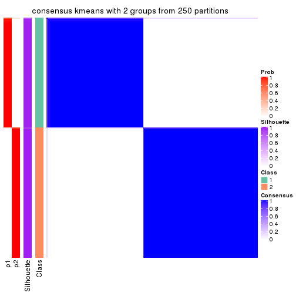</p>

</div>
<div id='tab-ATC-kmeans-consensus-heatmap-2'>
<pre><code class="r">consensus_heatmap(res, k = 3)
</code></pre>

<p>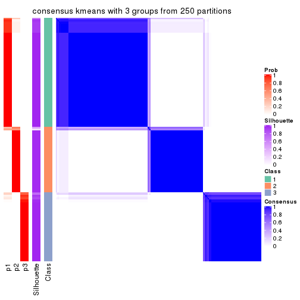</p>

</div>
<div id='tab-ATC-kmeans-consensus-heatmap-3'>
<pre><code class="r">consensus_heatmap(res, k = 4)
</code></pre>

<p>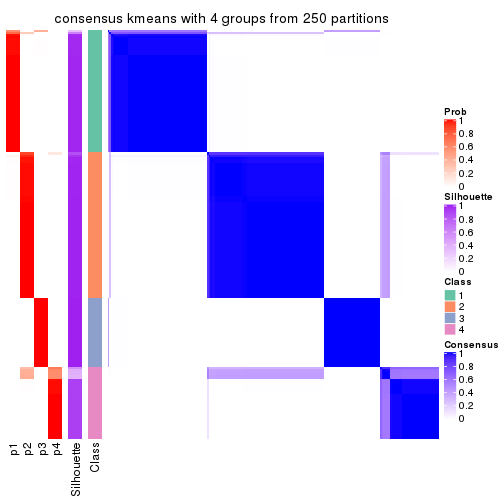</p>

</div>
<div id='tab-ATC-kmeans-consensus-heatmap-4'>
<pre><code class="r">consensus_heatmap(res, k = 5)
</code></pre>

<p>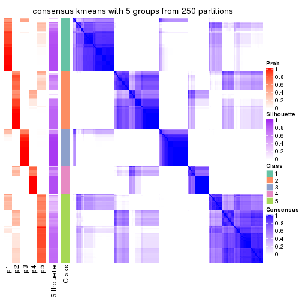</p>

</div>
<div id='tab-ATC-kmeans-consensus-heatmap-5'>
<pre><code class="r">consensus_heatmap(res, k = 6)
</code></pre>

<p>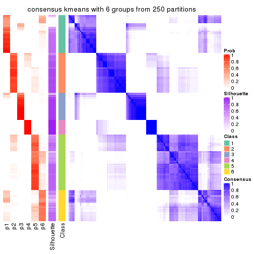</p>

</div>
</div>

Heatmaps for the membership of samples in all partitions to see how consistent they are:


<script>
$( function() {
	$( '#tabs-ATC-kmeans-membership-heatmap' ).tabs();
} );
</script>
<div id='tabs-ATC-kmeans-membership-heatmap'>
<ul>
<li><a href='#tab-ATC-kmeans-membership-heatmap-1'>k = 2</a></li>
<li><a href='#tab-ATC-kmeans-membership-heatmap-2'>k = 3</a></li>
<li><a href='#tab-ATC-kmeans-membership-heatmap-3'>k = 4</a></li>
<li><a href='#tab-ATC-kmeans-membership-heatmap-4'>k = 5</a></li>
<li><a href='#tab-ATC-kmeans-membership-heatmap-5'>k = 6</a></li>
</ul>
<div id='tab-ATC-kmeans-membership-heatmap-1'>
<pre><code class="r">membership_heatmap(res, k = 2)
</code></pre>

<p>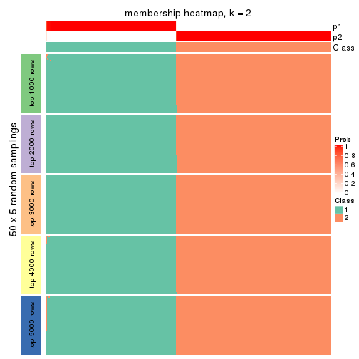</p>

</div>
<div id='tab-ATC-kmeans-membership-heatmap-2'>
<pre><code class="r">membership_heatmap(res, k = 3)
</code></pre>

<p>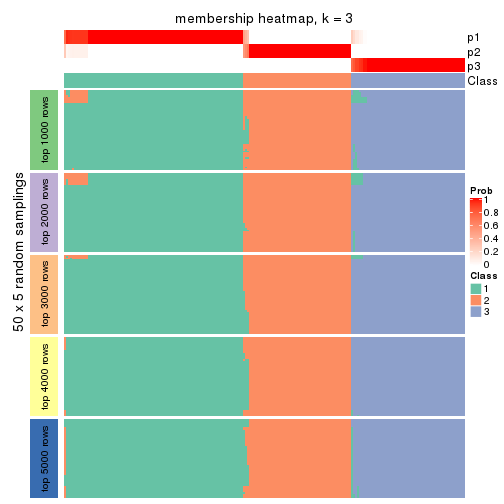</p>

</div>
<div id='tab-ATC-kmeans-membership-heatmap-3'>
<pre><code class="r">membership_heatmap(res, k = 4)
</code></pre>

<p>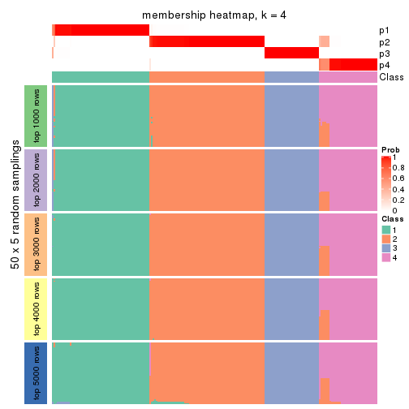</p>

</div>
<div id='tab-ATC-kmeans-membership-heatmap-4'>
<pre><code class="r">membership_heatmap(res, k = 5)
</code></pre>

<p>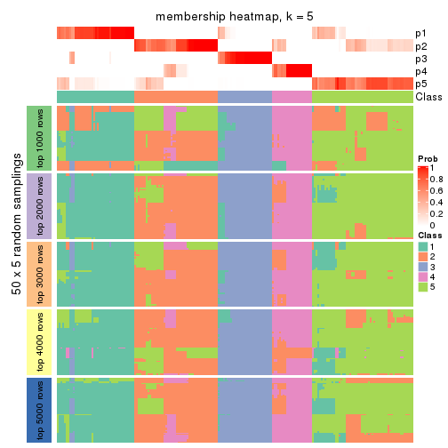</p>

</div>
<div id='tab-ATC-kmeans-membership-heatmap-5'>
<pre><code class="r">membership_heatmap(res, k = 6)
</code></pre>

<p>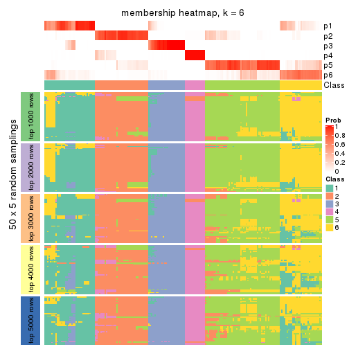</p>

</div>
</div>

As soon as we have had the classes for columns, we can look for signatures
which are significantly different between classes which can be candidate marks
for certain classes. Following are the heatmaps for signatures.


Signature heatmaps where rows are scaled:


<script>
$( function() {
	$( '#tabs-ATC-kmeans-get-signatures' ).tabs();
} );
</script>
<div id='tabs-ATC-kmeans-get-signatures'>
<ul>
<li><a href='#tab-ATC-kmeans-get-signatures-1'>k = 2</a></li>
<li><a href='#tab-ATC-kmeans-get-signatures-2'>k = 3</a></li>
<li><a href='#tab-ATC-kmeans-get-signatures-3'>k = 4</a></li>
<li><a href='#tab-ATC-kmeans-get-signatures-4'>k = 5</a></li>
<li><a href='#tab-ATC-kmeans-get-signatures-5'>k = 6</a></li>
</ul>
<div id='tab-ATC-kmeans-get-signatures-1'>
<pre><code class="r">get_signatures(res, k = 2)
</code></pre>

<p>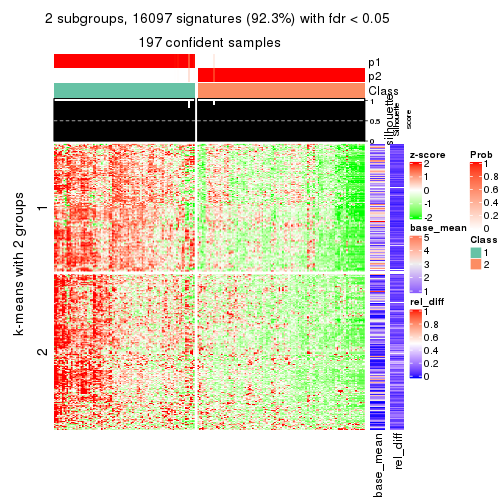</p>

</div>
<div id='tab-ATC-kmeans-get-signatures-2'>
<pre><code class="r">get_signatures(res, k = 3)
</code></pre>

<p>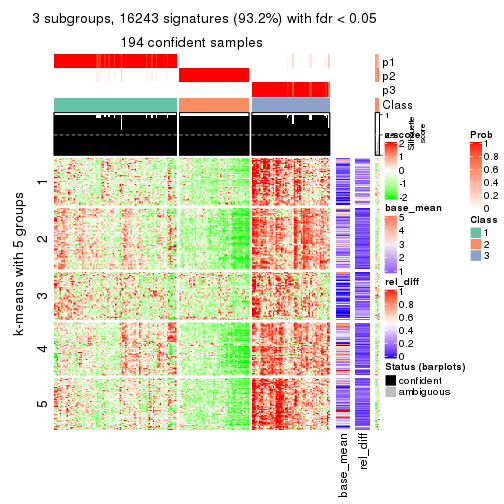</p>

</div>
<div id='tab-ATC-kmeans-get-signatures-3'>
<pre><code class="r">get_signatures(res, k = 4)
</code></pre>

<p>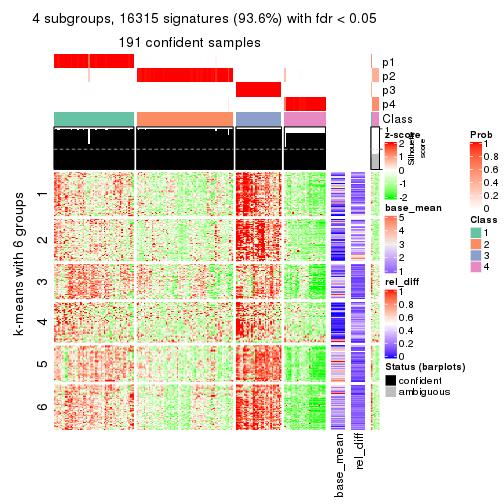</p>

</div>
<div id='tab-ATC-kmeans-get-signatures-4'>
<pre><code class="r">get_signatures(res, k = 5)
</code></pre>

<p>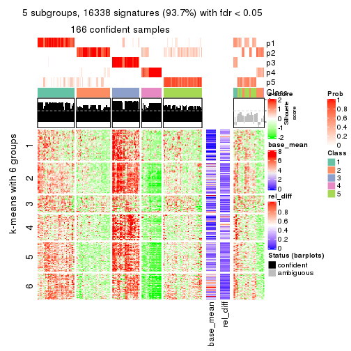</p>

</div>
<div id='tab-ATC-kmeans-get-signatures-5'>
<pre><code class="r">get_signatures(res, k = 6)
</code></pre>

<p>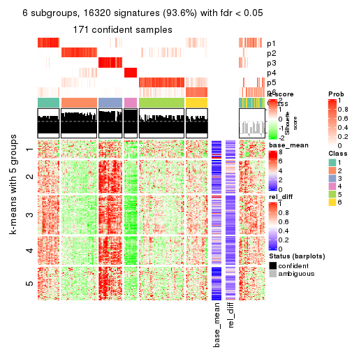</p>

</div>
</div>


Signature heatmaps where rows are not scaled:


<script>
$( function() {
	$( '#tabs-ATC-kmeans-get-signatures-no-scale' ).tabs();
} );
</script>
<div id='tabs-ATC-kmeans-get-signatures-no-scale'>
<ul>
<li><a href='#tab-ATC-kmeans-get-signatures-no-scale-1'>k = 2</a></li>
<li><a href='#tab-ATC-kmeans-get-signatures-no-scale-2'>k = 3</a></li>
<li><a href='#tab-ATC-kmeans-get-signatures-no-scale-3'>k = 4</a></li>
<li><a href='#tab-ATC-kmeans-get-signatures-no-scale-4'>k = 5</a></li>
<li><a href='#tab-ATC-kmeans-get-signatures-no-scale-5'>k = 6</a></li>
</ul>
<div id='tab-ATC-kmeans-get-signatures-no-scale-1'>
<pre><code class="r">get_signatures(res, k = 2, scale_rows = FALSE)
</code></pre>

<p></p>

</div>
<div id='tab-ATC-kmeans-get-signatures-no-scale-2'>
<pre><code class="r">get_signatures(res, k = 3, scale_rows = FALSE)
</code></pre>

<p>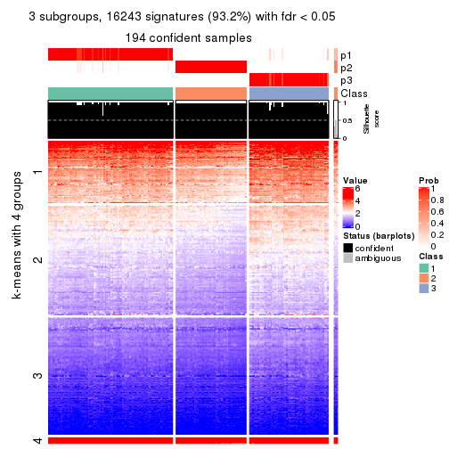</p>

</div>
<div id='tab-ATC-kmeans-get-signatures-no-scale-3'>
<pre><code class="r">get_signatures(res, k = 4, scale_rows = FALSE)
</code></pre>

<p>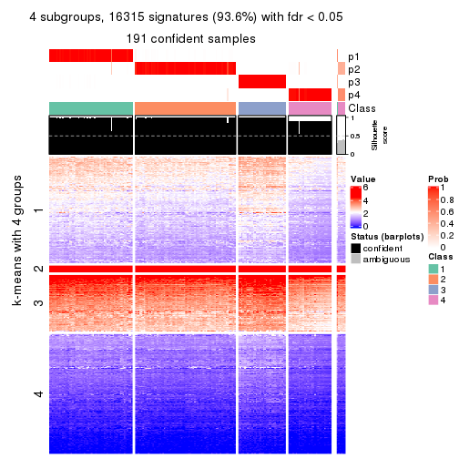</p>

</div>
<div id='tab-ATC-kmeans-get-signatures-no-scale-4'>
<pre><code class="r">get_signatures(res, k = 5, scale_rows = FALSE)
</code></pre>

<p>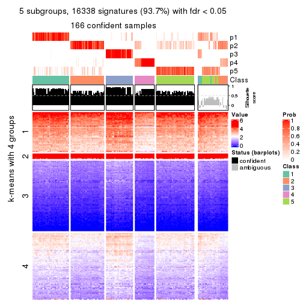</p>

</div>
<div id='tab-ATC-kmeans-get-signatures-no-scale-5'>
<pre><code class="r">get_signatures(res, k = 6, scale_rows = FALSE)
</code></pre>

<p>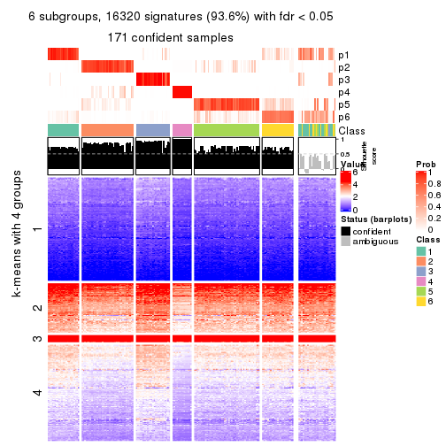</p>

</div>
</div>


Compare the overlap of signatures from different k:

```r
compare_signatures(res)
```

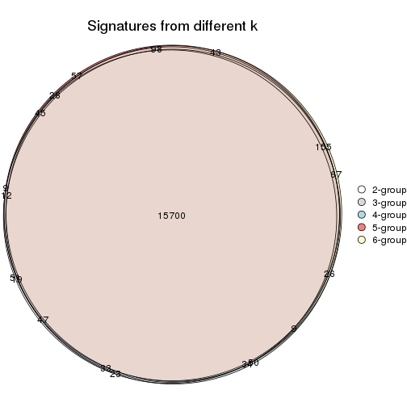

`get_signature()` returns a data frame invisibly. TO get the list of signatures, the function
call should be assigned to a variable explicitly. In following code, if `plot` argument is set
to `FALSE`, no heatmap is plotted while only the differential analysis is performed.

```r
# code only for demonstration
tb = get_signature(res, k = ..., plot = FALSE)
```

An example of the output of `tb` is:

```
#>   which_row         fdr    mean_1    mean_2 scaled_mean_1 scaled_mean_2 km
#> 1        38 0.042760348  8.373488  9.131774    -0.5533452     0.5164555  1
#> 2        40 0.018707592  7.106213  8.469186    -0.6173731     0.5762149  1
#> 3        55 0.019134737 10.221463 11.207825    -0.6159697     0.5749050  1
#> 4        59 0.006059896  5.921854  7.869574    -0.6899429     0.6439467  1
#> 5        60 0.018055526  8.928898 10.211722    -0.6204761     0.5791110  1
#> 6        98 0.009384629 15.714769 14.887706     0.6635654    -0.6193277  2
...
```

The columns in `tb` are:

1. `which_row`: row indices corresponding to the input matrix.
2. `fdr`: FDR for the differential test. 
3. `mean_x`: The mean value in group x.
4. `scaled_mean_x`: The mean value in group x after rows are scaled.
5. `km`: Row groups if k-means clustering is applied to rows.


UMAP plot which shows how samples are separated.


<script>
$( function() {
	$( '#tabs-ATC-kmeans-dimension-reduction' ).tabs();
} );
</script>
<div id='tabs-ATC-kmeans-dimension-reduction'>
<ul>
<li><a href='#tab-ATC-kmeans-dimension-reduction-1'>k = 2</a></li>
<li><a href='#tab-ATC-kmeans-dimension-reduction-2'>k = 3</a></li>
<li><a href='#tab-ATC-kmeans-dimension-reduction-3'>k = 4</a></li>
<li><a href='#tab-ATC-kmeans-dimension-reduction-4'>k = 5</a></li>
<li><a href='#tab-ATC-kmeans-dimension-reduction-5'>k = 6</a></li>
</ul>
<div id='tab-ATC-kmeans-dimension-reduction-1'>
<pre><code class="r">dimension_reduction(res, k = 2, method = &quot;UMAP&quot;)
</code></pre>

<p></p>

</div>
<div id='tab-ATC-kmeans-dimension-reduction-2'>
<pre><code class="r">dimension_reduction(res, k = 3, method = &quot;UMAP&quot;)
</code></pre>

<p>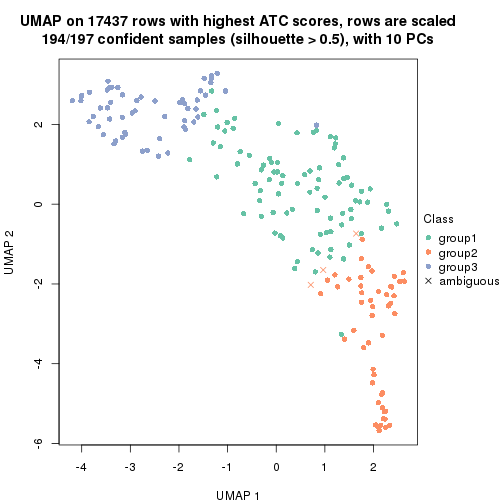</p>

</div>
<div id='tab-ATC-kmeans-dimension-reduction-3'>
<pre><code class="r">dimension_reduction(res, k = 4, method = &quot;UMAP&quot;)
</code></pre>

<p>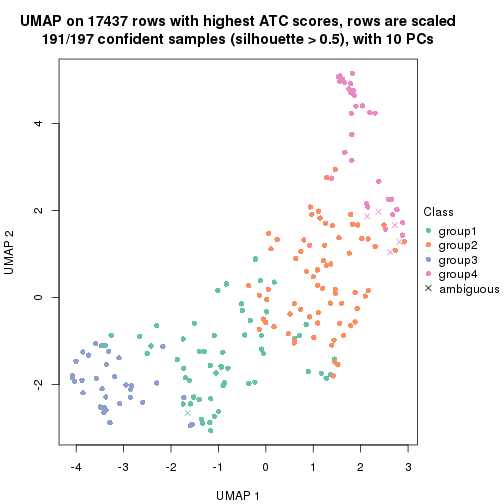</p>

</div>
<div id='tab-ATC-kmeans-dimension-reduction-4'>
<pre><code class="r">dimension_reduction(res, k = 5, method = &quot;UMAP&quot;)
</code></pre>

<p>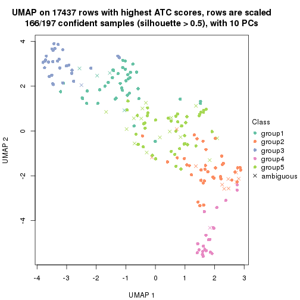</p>

</div>
<div id='tab-ATC-kmeans-dimension-reduction-5'>
<pre><code class="r">dimension_reduction(res, k = 6, method = &quot;UMAP&quot;)
</code></pre>

<p>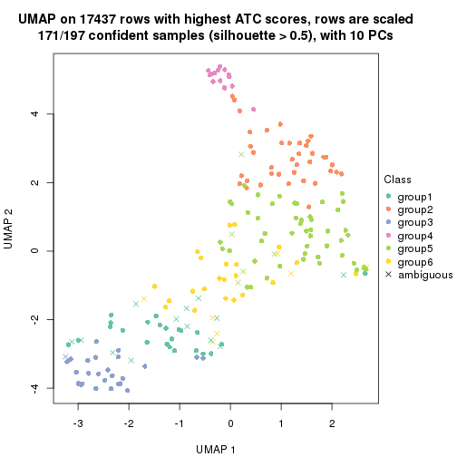</p>

</div>
</div>


Following heatmap shows how subgroups are split when increasing `k`:

```r
collect_classes(res)
```

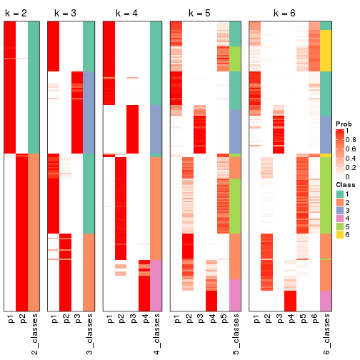


If matrix rows can be associated to genes, consider to use `GO_Enrichment(res,
...)` to perform function enrichment for the signature genes.


 

---------------------------------------------------


### ATC:skmeans**


The object with results only for a single top-value method and a single partition method 
can be extracted as:

```r
res = res_list["ATC", "skmeans"]
# you can also extract it by
# res = res_list["ATC:skmeans"]
```

A summary of `res` and all the functions that can be applied to it:

```r
res
```

```
#> A 'ConsensusPartition' object with k = 2, 3, 4, 5, 6.
#>   On a matrix with 17437 rows and 197 columns.
#>   Top rows (1000, 2000, 3000, 4000, 5000) are extracted by 'ATC' method.
#>   Subgroups are detected by 'skmeans' method.
#>   Performed in total 1250 partitions by row resampling.
#>   Best k for subgroups seems to be 3.
#> 
#> Following methods can be applied to this 'ConsensusPartition' object:
#>  [1] "cola_report"             "collect_classes"         "collect_plots"          
#>  [4] "collect_stats"           "colnames"                "compare_signatures"     
#>  [7] "consensus_heatmap"       "dimension_reduction"     "functional_enrichment"  
#> [10] "get_anno_col"            "get_anno"                "get_classes"            
#> [13] "get_consensus"           "get_matrix"              "get_membership"         
#> [16] "get_param"               "get_signatures"          "get_stats"              
#> [19] "is_best_k"               "is_stable_k"             "membership_heatmap"     
#> [22] "ncol"                    "nrow"                    "plot_ecdf"              
#> [25] "rownames"                "select_partition_number" "show"                   
#> [28] "suggest_best_k"          "test_to_known_factors"
```

`collect_plots()` function collects all the plots made from `res` for all `k` (number of partitions)
into one single page to provide an easy and fast comparison between different `k`.

```r
collect_plots(res)
```

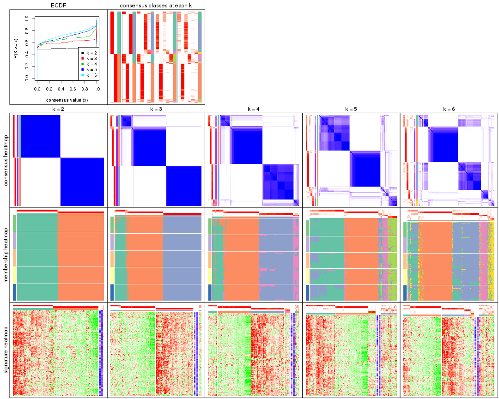

The plots are:

- The first row: a plot of the ECDF (Empirical cumulative distribution
  function) curves of the consensus matrix for each `k` and the heatmap of
  predicted classes for each `k`.
- The second row: heatmaps of the consensus matrix for each `k`.
- The third row: heatmaps of the membership matrix for each `k`.
- The fouth row: heatmaps of the signatures for each `k`.

All the plots in panels can be made by individual functions and they are
plotted later in this section.

`select_partition_number()` produces several plots showing different
statistics for choosing "optimized" `k`. There are following statistics:

- ECDF curves of the consensus matrix for each `k`;
- 1-PAC. [The PAC
  score](https://en.wikipedia.org/wiki/Consensus_clustering#Over-interpretation_potential_of_consensus_clustering)
  measures the proportion of the ambiguous subgrouping.
- Mean silhouette score.
- Concordance. The mean probability of fiting the consensus class ids in all
  partitions.
- Area increased. Denote $A_k$ as the area under the ECDF curve for current
  `k`, the area increased is defined as $A_k - A_{k-1}$.
- Rand index. The percent of pairs of samples that are both in a same cluster
  or both are not in a same cluster in the partition of k and k-1.
- Jaccard index. The ratio of pairs of samples are both in a same cluster in
  the partition of k and k-1 and the pairs of samples are both in a same
  cluster in the partition k or k-1.

The detailed explanations of these statistics can be found in [the cola
vignette](http://bioconductor.org/packages/devel/bioc/vignettes/cola/inst/doc/cola.html#toc_13).

Generally speaking, lower PAC score, higher mean silhouette score or higher
concordance corresponds to better partition. Rand index and Jaccard index
measure how similar the current partition is compared to partition with `k-1`.
If they are too similar, we won't accept `k` is better than `k-1`.

```r
select_partition_number(res)
```

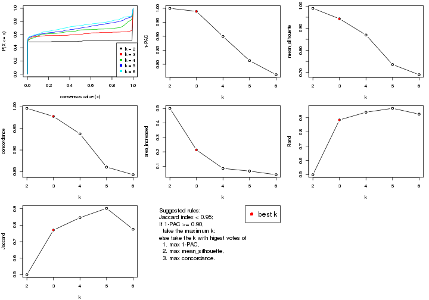

The numeric values for all these statistics can be obtained by `get_stats()`.

```r
get_stats(res)
```

```
#>   k 1-PAC mean_silhouette concordance area_increased  Rand Jaccard
#> 2 2 1.000           0.990       0.996         0.5013 0.500   0.500
#> 3 3 0.989           0.943       0.978         0.2133 0.884   0.771
#> 4 4 0.900           0.869       0.937         0.0851 0.938   0.846
#> 5 5 0.813           0.736       0.861         0.0667 0.966   0.902
#> 6 6 0.763           0.690       0.843         0.0416 0.925   0.776
```

`suggest_best_k()` suggests the best $k$ based on these statistics. The rules are as follows:

- All $k$ with Jaccard index larger than 0.95 are removed because the increase of
  the partition number does not provides enough extra information. If all $k$ are removed,
  the best $k$ is assigned by `NA`.
- For $k$ with 1-PAC larger than 0.9, the maximal $k$ is taken as the "best k". Other $k$ is called "optional k".
- If it does not fit the second rule. The $k$ with the highest vote of highest
  1-PAC, mean silhouette and concordance is taken as the "best k".

```r
suggest_best_k(res)
```

```
#> [1] 3
#> attr(,"optional")
#> [1] 2
```

There is also optional best $k$ = 2 that is worth to check.

Following shows the table of the partitions (You need to click the **show/hide
code output** link to see it). The membership matrix (columns with name `p*`)
is inferred by
[`clue::cl_consensus()`](https://www.rdocumentation.org/link/cl_consensus?package=clue)
function with the `SE` method. Basically the value in the membership matrix
represents the probability to belong to a certain group. The finall class
label for an item is determined with the group with highest probability it
belongs to.

In `get_classes()` function, the entropy is calculated from the membership
matrix and the silhouette score is calculated from the consensus matrix.


<script>
$( function() {
	$( '#tabs-ATC-skmeans-get-classes' ).tabs();
} );
</script>
<div id='tabs-ATC-skmeans-get-classes'>
<ul>
<li><a href='#tab-ATC-skmeans-get-classes-1'>k = 2</a></li>
<li><a href='#tab-ATC-skmeans-get-classes-2'>k = 3</a></li>
<li><a href='#tab-ATC-skmeans-get-classes-3'>k = 4</a></li>
<li><a href='#tab-ATC-skmeans-get-classes-4'>k = 5</a></li>
<li><a href='#tab-ATC-skmeans-get-classes-5'>k = 6</a></li>
</ul>

<div id='tab-ATC-skmeans-get-classes-1'>
<p><a id='tab-ATC-skmeans-get-classes-1-a' style='color:#0366d6' href='#'>show/hide code output</a></p>
<pre><code class="r">cbind(get_classes(res, k = 2), get_membership(res, k = 2))
</code></pre>

<pre><code>#&gt;            class entropy silhouette    p1    p2
#&gt; SRR1380886     1   0.000     1.0000 1.000 0.000
#&gt; SRR1074385     1   0.000     1.0000 1.000 0.000
#&gt; SRR1374739     1   0.000     1.0000 1.000 0.000
#&gt; SRR1097883     1   0.000     1.0000 1.000 0.000
#&gt; SRR2167209     1   0.000     1.0000 1.000 0.000
#&gt; SRR816541      2   0.000     0.9931 0.000 1.000
#&gt; SRR663645      1   0.000     1.0000 1.000 0.000
#&gt; SRR1381505     2   0.000     0.9931 0.000 1.000
#&gt; SRR1416362     2   0.000     0.9931 0.000 1.000
#&gt; SRR1318503     2   0.000     0.9931 0.000 1.000
#&gt; SRR1341626     2   0.000     0.9931 0.000 1.000
#&gt; SRR1382440     1   0.000     1.0000 1.000 0.000
#&gt; SRR1088413     1   0.000     1.0000 1.000 0.000
#&gt; SRR1082080     2   0.000     0.9931 0.000 1.000
#&gt; SRR1455783     1   0.000     1.0000 1.000 0.000
#&gt; SRR1447760     2   0.000     0.9931 0.000 1.000
#&gt; SRR1487784     2   0.000     0.9931 0.000 1.000
#&gt; SRR1331037     2   0.000     0.9931 0.000 1.000
#&gt; SRR1095651     1   0.000     1.0000 1.000 0.000
#&gt; SRR1078066     1   0.000     1.0000 1.000 0.000
#&gt; SRR1120363     1   0.000     1.0000 1.000 0.000
#&gt; SRR821231      1   0.000     1.0000 1.000 0.000
#&gt; SRR1374373     2   0.000     0.9931 0.000 1.000
#&gt; SRR1324519     2   0.000     0.9931 0.000 1.000
#&gt; SRR1431121     1   0.000     1.0000 1.000 0.000
#&gt; SRR1091032     2   0.000     0.9931 0.000 1.000
#&gt; SRR1365575     2   0.000     0.9931 0.000 1.000
#&gt; SRR1072972     1   0.000     1.0000 1.000 0.000
#&gt; SRR1310690     2   0.000     0.9931 0.000 1.000
#&gt; SRR1383037     1   0.000     1.0000 1.000 0.000
#&gt; SRR1095479     1   0.000     1.0000 1.000 0.000
#&gt; SRR1070403     1   0.000     1.0000 1.000 0.000
#&gt; SRR1390203     1   0.000     1.0000 1.000 0.000
#&gt; SRR1072007     2   0.000     0.9931 0.000 1.000
#&gt; SRR1468787     2   0.000     0.9931 0.000 1.000
#&gt; SRR1347959     2   0.000     0.9931 0.000 1.000
#&gt; SRR1338513     1   0.000     1.0000 1.000 0.000
#&gt; SRR812598      2   0.000     0.9931 0.000 1.000
#&gt; SRR1446806     1   0.000     1.0000 1.000 0.000
#&gt; SRR1394275     1   0.000     1.0000 1.000 0.000
#&gt; SRR1443633     1   0.000     1.0000 1.000 0.000
#&gt; SRR1087728     1   0.000     1.0000 1.000 0.000
#&gt; SRR1098192     2   0.000     0.9931 0.000 1.000
#&gt; SRR1093340     2   0.000     0.9931 0.000 1.000
#&gt; SRR665405      1   0.000     1.0000 1.000 0.000
#&gt; SRR657077      1   0.000     1.0000 1.000 0.000
#&gt; SRR813208      1   0.000     1.0000 1.000 0.000
#&gt; SRR1416074     2   0.000     0.9931 0.000 1.000
#&gt; SRR1089688     2   0.000     0.9931 0.000 1.000
#&gt; SRR1353461     1   0.000     1.0000 1.000 0.000
#&gt; SRR1466321     2   0.000     0.9931 0.000 1.000
#&gt; SRR1073021     2   0.000     0.9931 0.000 1.000
#&gt; SRR1322816     2   0.000     0.9931 0.000 1.000
#&gt; SRR1457727     1   0.000     1.0000 1.000 0.000
#&gt; SRR1464226     2   0.000     0.9931 0.000 1.000
#&gt; SRR1398863     1   0.000     1.0000 1.000 0.000
#&gt; SRR1455631     2   0.000     0.9931 0.000 1.000
#&gt; SRR1307808     2   0.000     0.9931 0.000 1.000
#&gt; SRR1374585     2   0.000     0.9931 0.000 1.000
#&gt; SRR1072104     2   0.000     0.9931 0.000 1.000
#&gt; SRR1076868     2   0.000     0.9931 0.000 1.000
#&gt; SRR1335984     2   0.000     0.9931 0.000 1.000
#&gt; SRR1445939     1   0.000     1.0000 1.000 0.000
#&gt; SRR1453047     2   0.000     0.9931 0.000 1.000
#&gt; SRR1339788     1   0.000     1.0000 1.000 0.000
#&gt; SRR1084323     1   0.000     1.0000 1.000 0.000
#&gt; SRR1092937     1   0.000     1.0000 1.000 0.000
#&gt; SRR1074090     2   0.000     0.9931 0.000 1.000
#&gt; SRR1099833     1   0.000     1.0000 1.000 0.000
#&gt; SRR1093434     1   0.000     1.0000 1.000 0.000
#&gt; SRR1435857     1   0.000     1.0000 1.000 0.000
#&gt; SRR1480347     2   0.000     0.9931 0.000 1.000
#&gt; SRR1440787     2   0.000     0.9931 0.000 1.000
#&gt; SRR1430202     2   0.000     0.9931 0.000 1.000
#&gt; SRR1322730     2   0.000     0.9931 0.000 1.000
#&gt; SRR811029      2   0.000     0.9931 0.000 1.000
#&gt; SRR1390456     1   0.000     1.0000 1.000 0.000
#&gt; SRR1381140     1   0.000     1.0000 1.000 0.000
#&gt; SRR1388064     2   0.000     0.9931 0.000 1.000
#&gt; SRR1093577     1   0.000     1.0000 1.000 0.000
#&gt; SRR1414161     1   0.000     1.0000 1.000 0.000
#&gt; SRR1328738     2   0.000     0.9931 0.000 1.000
#&gt; SRR1311752     2   0.000     0.9931 0.000 1.000
#&gt; SRR1445960     2   0.000     0.9931 0.000 1.000
#&gt; SRR1403412     2   0.000     0.9931 0.000 1.000
#&gt; SRR2166748     1   0.000     1.0000 1.000 0.000
#&gt; SRR821666      2   0.000     0.9931 0.000 1.000
#&gt; SRR1330746     1   0.000     1.0000 1.000 0.000
#&gt; SRR1327872     2   0.000     0.9931 0.000 1.000
#&gt; SRR1100800     1   0.000     1.0000 1.000 0.000
#&gt; SRR1075174     1   0.000     1.0000 1.000 0.000
#&gt; SRR1434436     1   0.000     1.0000 1.000 0.000
#&gt; SRR1389409     2   0.000     0.9931 0.000 1.000
#&gt; SRR1085310     1   0.000     1.0000 1.000 0.000
#&gt; SRR1376718     2   0.000     0.9931 0.000 1.000
#&gt; SRR808590      2   0.000     0.9931 0.000 1.000
#&gt; SRR1084128     1   0.000     1.0000 1.000 0.000
#&gt; SRR1361692     1   0.000     1.0000 1.000 0.000
#&gt; SRR1431493     1   0.000     1.0000 1.000 0.000
#&gt; SRR1409084     1   0.000     1.0000 1.000 0.000
#&gt; SRR2166214     1   0.000     1.0000 1.000 0.000
#&gt; SRR1324102     2   0.000     0.9931 0.000 1.000
#&gt; SRR1079754     2   0.000     0.9931 0.000 1.000
#&gt; SRR1442127     1   0.000     1.0000 1.000 0.000
#&gt; SRR1076244     2   0.000     0.9931 0.000 1.000
#&gt; SRR1330901     2   0.000     0.9931 0.000 1.000
#&gt; SRR1073167     2   0.000     0.9931 0.000 1.000
#&gt; SRR1357541     1   0.000     1.0000 1.000 0.000
#&gt; SRR811607      2   0.000     0.9931 0.000 1.000
#&gt; SRR1468931     1   0.000     1.0000 1.000 0.000
#&gt; SRR1474908     2   0.000     0.9931 0.000 1.000
#&gt; SRR1309875     2   0.000     0.9931 0.000 1.000
#&gt; SRR598792      1   0.000     1.0000 1.000 0.000
#&gt; SRR1088537     2   0.000     0.9931 0.000 1.000
#&gt; SRR1457682     1   0.000     1.0000 1.000 0.000
#&gt; SRR1454289     2   0.000     0.9931 0.000 1.000
#&gt; SRR1069352     1   0.000     1.0000 1.000 0.000
#&gt; SRR1472728     2   0.000     0.9931 0.000 1.000
#&gt; SRR1091144     2   0.000     0.9931 0.000 1.000
#&gt; SRR1319118     1   0.000     1.0000 1.000 0.000
#&gt; SRR1403611     1   0.000     1.0000 1.000 0.000
#&gt; SRR1397762     1   0.000     1.0000 1.000 0.000
#&gt; SRR1317387     1   0.000     1.0000 1.000 0.000
#&gt; SRR1376426     2   0.000     0.9931 0.000 1.000
#&gt; SRR1097777     1   0.000     1.0000 1.000 0.000
#&gt; SRR1365743     1   0.000     1.0000 1.000 0.000
#&gt; SRR1458992     2   0.000     0.9931 0.000 1.000
#&gt; SRR1089537     1   0.000     1.0000 1.000 0.000
#&gt; SRR1397744     1   0.000     1.0000 1.000 0.000
#&gt; SRR1453893     2   0.000     0.9931 0.000 1.000
#&gt; SRR1098543     1   0.000     1.0000 1.000 0.000
#&gt; SRR1321765     1   0.000     1.0000 1.000 0.000
#&gt; SRR1440032     2   0.999     0.0641 0.484 0.516
#&gt; SRR1404507     2   0.000     0.9931 0.000 1.000
#&gt; SRR1404856     2   0.000     0.9931 0.000 1.000
#&gt; SRR812745      1   0.000     1.0000 1.000 0.000
#&gt; SRR1417524     2   0.781     0.6970 0.232 0.768
#&gt; SRR1407334     2   0.000     0.9931 0.000 1.000
#&gt; SRR1453991     1   0.000     1.0000 1.000 0.000
#&gt; SRR1415938     1   0.000     1.0000 1.000 0.000
#&gt; SRR1081259     2   0.000     0.9931 0.000 1.000
#&gt; SRR1436187     2   0.000     0.9931 0.000 1.000
#&gt; SRR1431948     1   0.000     1.0000 1.000 0.000
#&gt; SRR1453277     2   0.000     0.9931 0.000 1.000
#&gt; SRR1095407     2   0.000     0.9931 0.000 1.000
#&gt; SRR1359694     2   0.000     0.9931 0.000 1.000
#&gt; SRR656982      2   0.000     0.9931 0.000 1.000
#&gt; SRR1354338     2   0.000     0.9931 0.000 1.000
#&gt; SRR1088291     2   0.000     0.9931 0.000 1.000
#&gt; SRR1080624     1   0.000     1.0000 1.000 0.000
#&gt; SRR2166708     1   0.000     1.0000 1.000 0.000
#&gt; SRR1393572     1   0.000     1.0000 1.000 0.000
#&gt; SRR1429912     2   0.000     0.9931 0.000 1.000
#&gt; SRR1421048     2   0.000     0.9931 0.000 1.000
#&gt; SRR1434999     1   0.000     1.0000 1.000 0.000
#&gt; SRR656457      1   0.000     1.0000 1.000 0.000
#&gt; SRR1098928     1   0.000     1.0000 1.000 0.000
#&gt; SRR1343967     2   0.000     0.9931 0.000 1.000
#&gt; SRR1360766     2   0.000     0.9931 0.000 1.000
#&gt; SRR1464724     2   0.000     0.9931 0.000 1.000
#&gt; SRR1101542     2   0.000     0.9931 0.000 1.000
#&gt; SRR1401528     1   0.000     1.0000 1.000 0.000
#&gt; SRR1071519     1   0.000     1.0000 1.000 0.000
#&gt; SRR1086070     1   0.000     1.0000 1.000 0.000
#&gt; SRR1358645     2   0.000     0.9931 0.000 1.000
#&gt; SRR819771      1   0.000     1.0000 1.000 0.000
#&gt; SRR1418433     2   0.000     0.9931 0.000 1.000
#&gt; SRR821050      1   0.000     1.0000 1.000 0.000
#&gt; SRR1402091     2   0.000     0.9931 0.000 1.000
#&gt; SRR1322028     2   0.000     0.9931 0.000 1.000
#&gt; SRR1452556     2   0.000     0.9931 0.000 1.000
#&gt; SRR1340047     2   0.000     0.9931 0.000 1.000
#&gt; SRR1418302     2   0.000     0.9931 0.000 1.000
#&gt; SRR1073991     1   0.000     1.0000 1.000 0.000
#&gt; SRR1085187     2   0.000     0.9931 0.000 1.000
#&gt; SRR1357618     1   0.000     1.0000 1.000 0.000
#&gt; SRR1487764     2   0.000     0.9931 0.000 1.000
#&gt; SRR1075336     2   0.000     0.9931 0.000 1.000
#&gt; SRR1365471     2   0.000     0.9931 0.000 1.000
#&gt; SRR1414613     2   0.000     0.9931 0.000 1.000
#&gt; SRR658719      1   0.000     1.0000 1.000 0.000
#&gt; SRR1475128     1   0.000     1.0000 1.000 0.000
#&gt; SRR1367630     2   0.000     0.9931 0.000 1.000
#&gt; SRR1481146     2   0.000     0.9931 0.000 1.000
#&gt; SRR1465674     2   0.000     0.9931 0.000 1.000
#&gt; SRR1327303     2   0.000     0.9931 0.000 1.000
#&gt; SRR1390391     1   0.000     1.0000 1.000 0.000
#&gt; SRR1326020     2   0.000     0.9931 0.000 1.000
#&gt; SRR1381953     2   0.000     0.9931 0.000 1.000
#&gt; SRR1082544     2   0.000     0.9931 0.000 1.000
#&gt; SRR810761      1   0.000     1.0000 1.000 0.000
#&gt; SRR1070764     1   0.000     1.0000 1.000 0.000
#&gt; SRR1415919     1   0.000     1.0000 1.000 0.000
#&gt; SRR1490404     2   0.000     0.9931 0.000 1.000
#&gt; SRR1416773     2   0.000     0.9931 0.000 1.000
#&gt; SRR1377492     2   0.000     0.9931 0.000 1.000
#&gt; SRR1334314     1   0.000     1.0000 1.000 0.000
</code></pre>

<script>
$('#tab-ATC-skmeans-get-classes-1-a').parent().next().next().hide();
$('#tab-ATC-skmeans-get-classes-1-a').click(function(){
  $('#tab-ATC-skmeans-get-classes-1-a').parent().next().next().toggle();
  return(false);
});
</script>
</div>

<div id='tab-ATC-skmeans-get-classes-2'>
<p><a id='tab-ATC-skmeans-get-classes-2-a' style='color:#0366d6' href='#'>show/hide code output</a></p>
<pre><code class="r">cbind(get_classes(res, k = 3), get_membership(res, k = 3))
</code></pre>

<pre><code>#&gt;            class entropy silhouette    p1    p2    p3
#&gt; SRR1380886     3  0.0000     0.9959 0.000 0.000 1.000
#&gt; SRR1074385     3  0.0000     0.9959 0.000 0.000 1.000
#&gt; SRR1374739     3  0.0000     0.9959 0.000 0.000 1.000
#&gt; SRR1097883     3  0.0000     0.9959 0.000 0.000 1.000
#&gt; SRR2167209     1  0.0000     0.9356 1.000 0.000 0.000
#&gt; SRR816541      2  0.0000     0.9651 0.000 1.000 0.000
#&gt; SRR663645      3  0.0237     0.9925 0.004 0.000 0.996
#&gt; SRR1381505     2  0.0000     0.9651 0.000 1.000 0.000
#&gt; SRR1416362     1  0.1163     0.9367 0.972 0.028 0.000
#&gt; SRR1318503     1  0.1411     0.9337 0.964 0.036 0.000
#&gt; SRR1341626     2  0.0000     0.9651 0.000 1.000 0.000
#&gt; SRR1382440     3  0.0000     0.9959 0.000 0.000 1.000
#&gt; SRR1088413     3  0.0000     0.9959 0.000 0.000 1.000
#&gt; SRR1082080     2  0.0000     0.9651 0.000 1.000 0.000
#&gt; SRR1455783     3  0.0000     0.9959 0.000 0.000 1.000
#&gt; SRR1447760     1  0.3816     0.8347 0.852 0.148 0.000
#&gt; SRR1487784     1  0.6045     0.4338 0.620 0.380 0.000
#&gt; SRR1331037     2  0.0000     0.9651 0.000 1.000 0.000
#&gt; SRR1095651     3  0.0000     0.9959 0.000 0.000 1.000
#&gt; SRR1078066     3  0.0000     0.9959 0.000 0.000 1.000
#&gt; SRR1120363     3  0.0000     0.9959 0.000 0.000 1.000
#&gt; SRR821231      3  0.0000     0.9959 0.000 0.000 1.000
#&gt; SRR1374373     2  0.0000     0.9651 0.000 1.000 0.000
#&gt; SRR1324519     2  0.0000     0.9651 0.000 1.000 0.000
#&gt; SRR1431121     3  0.0000     0.9959 0.000 0.000 1.000
#&gt; SRR1091032     2  0.0000     0.9651 0.000 1.000 0.000
#&gt; SRR1365575     2  0.0000     0.9651 0.000 1.000 0.000
#&gt; SRR1072972     3  0.0000     0.9959 0.000 0.000 1.000
#&gt; SRR1310690     2  0.0000     0.9651 0.000 1.000 0.000
#&gt; SRR1383037     3  0.0000     0.9959 0.000 0.000 1.000
#&gt; SRR1095479     3  0.0000     0.9959 0.000 0.000 1.000
#&gt; SRR1070403     3  0.0000     0.9959 0.000 0.000 1.000
#&gt; SRR1390203     3  0.0000     0.9959 0.000 0.000 1.000
#&gt; SRR1072007     2  0.0000     0.9651 0.000 1.000 0.000
#&gt; SRR1468787     2  0.0000     0.9651 0.000 1.000 0.000
#&gt; SRR1347959     2  0.3340     0.8318 0.120 0.880 0.000
#&gt; SRR1338513     3  0.0000     0.9959 0.000 0.000 1.000
#&gt; SRR812598      2  0.0000     0.9651 0.000 1.000 0.000
#&gt; SRR1446806     1  0.0000     0.9356 1.000 0.000 0.000
#&gt; SRR1394275     3  0.0000     0.9959 0.000 0.000 1.000
#&gt; SRR1443633     3  0.0000     0.9959 0.000 0.000 1.000
#&gt; SRR1087728     3  0.0000     0.9959 0.000 0.000 1.000
#&gt; SRR1098192     2  0.0000     0.9651 0.000 1.000 0.000
#&gt; SRR1093340     2  0.0000     0.9651 0.000 1.000 0.000
#&gt; SRR665405      3  0.0892     0.9772 0.020 0.000 0.980
#&gt; SRR657077      3  0.0237     0.9925 0.004 0.000 0.996
#&gt; SRR813208      3  0.0000     0.9959 0.000 0.000 1.000
#&gt; SRR1416074     2  0.0000     0.9651 0.000 1.000 0.000
#&gt; SRR1089688     2  0.0000     0.9651 0.000 1.000 0.000
#&gt; SRR1353461     3  0.0000     0.9959 0.000 0.000 1.000
#&gt; SRR1466321     1  0.0237     0.9371 0.996 0.004 0.000
#&gt; SRR1073021     2  0.0000     0.9651 0.000 1.000 0.000
#&gt; SRR1322816     2  0.0000     0.9651 0.000 1.000 0.000
#&gt; SRR1457727     3  0.0000     0.9959 0.000 0.000 1.000
#&gt; SRR1464226     2  0.0000     0.9651 0.000 1.000 0.000
#&gt; SRR1398863     3  0.0000     0.9959 0.000 0.000 1.000
#&gt; SRR1455631     2  0.0000     0.9651 0.000 1.000 0.000
#&gt; SRR1307808     1  0.1163     0.9367 0.972 0.028 0.000
#&gt; SRR1374585     2  0.0000     0.9651 0.000 1.000 0.000
#&gt; SRR1072104     2  0.0000     0.9651 0.000 1.000 0.000
#&gt; SRR1076868     2  0.0000     0.9651 0.000 1.000 0.000
#&gt; SRR1335984     2  0.0000     0.9651 0.000 1.000 0.000
#&gt; SRR1445939     3  0.0000     0.9959 0.000 0.000 1.000
#&gt; SRR1453047     2  0.0000     0.9651 0.000 1.000 0.000
#&gt; SRR1339788     3  0.0000     0.9959 0.000 0.000 1.000
#&gt; SRR1084323     3  0.0000     0.9959 0.000 0.000 1.000
#&gt; SRR1092937     3  0.0000     0.9959 0.000 0.000 1.000
#&gt; SRR1074090     2  0.0000     0.9651 0.000 1.000 0.000
#&gt; SRR1099833     3  0.0000     0.9959 0.000 0.000 1.000
#&gt; SRR1093434     3  0.0000     0.9959 0.000 0.000 1.000
#&gt; SRR1435857     3  0.0000     0.9959 0.000 0.000 1.000
#&gt; SRR1480347     2  0.0000     0.9651 0.000 1.000 0.000
#&gt; SRR1440787     2  0.0000     0.9651 0.000 1.000 0.000
#&gt; SRR1430202     1  0.0000     0.9356 1.000 0.000 0.000
#&gt; SRR1322730     2  0.0000     0.9651 0.000 1.000 0.000
#&gt; SRR811029      2  0.0000     0.9651 0.000 1.000 0.000
#&gt; SRR1390456     3  0.0000     0.9959 0.000 0.000 1.000
#&gt; SRR1381140     3  0.0000     0.9959 0.000 0.000 1.000
#&gt; SRR1388064     2  0.0000     0.9651 0.000 1.000 0.000
#&gt; SRR1093577     3  0.0000     0.9959 0.000 0.000 1.000
#&gt; SRR1414161     3  0.0000     0.9959 0.000 0.000 1.000
#&gt; SRR1328738     1  0.1529     0.9321 0.960 0.040 0.000
#&gt; SRR1311752     2  0.0000     0.9651 0.000 1.000 0.000
#&gt; SRR1445960     2  0.0000     0.9651 0.000 1.000 0.000
#&gt; SRR1403412     2  0.0000     0.9651 0.000 1.000 0.000
#&gt; SRR2166748     3  0.0000     0.9959 0.000 0.000 1.000
#&gt; SRR821666      2  0.0000     0.9651 0.000 1.000 0.000
#&gt; SRR1330746     3  0.0000     0.9959 0.000 0.000 1.000
#&gt; SRR1327872     2  0.0000     0.9651 0.000 1.000 0.000
#&gt; SRR1100800     3  0.0000     0.9959 0.000 0.000 1.000
#&gt; SRR1075174     3  0.0000     0.9959 0.000 0.000 1.000
#&gt; SRR1434436     1  0.0000     0.9356 1.000 0.000 0.000
#&gt; SRR1389409     2  0.0000     0.9651 0.000 1.000 0.000
#&gt; SRR1085310     3  0.0000     0.9959 0.000 0.000 1.000
#&gt; SRR1376718     2  0.0000     0.9651 0.000 1.000 0.000
#&gt; SRR808590      2  0.0000     0.9651 0.000 1.000 0.000
#&gt; SRR1084128     1  0.0892     0.9261 0.980 0.000 0.020
#&gt; SRR1361692     1  0.0237     0.9346 0.996 0.000 0.004
#&gt; SRR1431493     3  0.0000     0.9959 0.000 0.000 1.000
#&gt; SRR1409084     3  0.0000     0.9959 0.000 0.000 1.000
#&gt; SRR2166214     3  0.5706     0.5376 0.320 0.000 0.680
#&gt; SRR1324102     2  0.0000     0.9651 0.000 1.000 0.000
#&gt; SRR1079754     2  0.0000     0.9651 0.000 1.000 0.000
#&gt; SRR1442127     3  0.0000     0.9959 0.000 0.000 1.000
#&gt; SRR1076244     2  0.0000     0.9651 0.000 1.000 0.000
#&gt; SRR1330901     1  0.2448     0.9061 0.924 0.076 0.000
#&gt; SRR1073167     2  0.0000     0.9651 0.000 1.000 0.000
#&gt; SRR1357541     3  0.0000     0.9959 0.000 0.000 1.000
#&gt; SRR811607      1  0.0424     0.9375 0.992 0.008 0.000
#&gt; SRR1468931     3  0.0000     0.9959 0.000 0.000 1.000
#&gt; SRR1474908     1  0.0237     0.9371 0.996 0.004 0.000
#&gt; SRR1309875     2  0.0000     0.9651 0.000 1.000 0.000
#&gt; SRR598792      3  0.0000     0.9959 0.000 0.000 1.000
#&gt; SRR1088537     2  0.0000     0.9651 0.000 1.000 0.000
#&gt; SRR1457682     3  0.0000     0.9959 0.000 0.000 1.000
#&gt; SRR1454289     2  0.6111     0.2865 0.396 0.604 0.000
#&gt; SRR1069352     3  0.0000     0.9959 0.000 0.000 1.000
#&gt; SRR1472728     2  0.0000     0.9651 0.000 1.000 0.000
#&gt; SRR1091144     2  0.0000     0.9651 0.000 1.000 0.000
#&gt; SRR1319118     3  0.0000     0.9959 0.000 0.000 1.000
#&gt; SRR1403611     3  0.0000     0.9959 0.000 0.000 1.000
#&gt; SRR1397762     3  0.0000     0.9959 0.000 0.000 1.000
#&gt; SRR1317387     3  0.0000     0.9959 0.000 0.000 1.000
#&gt; SRR1376426     2  0.0000     0.9651 0.000 1.000 0.000
#&gt; SRR1097777     3  0.0000     0.9959 0.000 0.000 1.000
#&gt; SRR1365743     3  0.0000     0.9959 0.000 0.000 1.000
#&gt; SRR1458992     1  0.1163     0.9367 0.972 0.028 0.000
#&gt; SRR1089537     3  0.0000     0.9959 0.000 0.000 1.000
#&gt; SRR1397744     3  0.0000     0.9959 0.000 0.000 1.000
#&gt; SRR1453893     2  0.0000     0.9651 0.000 1.000 0.000
#&gt; SRR1098543     3  0.0000     0.9959 0.000 0.000 1.000
#&gt; SRR1321765     3  0.0000     0.9959 0.000 0.000 1.000
#&gt; SRR1440032     2  0.6111     0.3325 0.000 0.604 0.396
#&gt; SRR1404507     2  0.0000     0.9651 0.000 1.000 0.000
#&gt; SRR1404856     1  0.1163     0.9367 0.972 0.028 0.000
#&gt; SRR812745      3  0.0000     0.9959 0.000 0.000 1.000
#&gt; SRR1417524     2  0.5111     0.7036 0.024 0.808 0.168
#&gt; SRR1407334     2  0.0000     0.9651 0.000 1.000 0.000
#&gt; SRR1453991     3  0.0000     0.9959 0.000 0.000 1.000
#&gt; SRR1415938     3  0.0000     0.9959 0.000 0.000 1.000
#&gt; SRR1081259     2  0.0000     0.9651 0.000 1.000 0.000
#&gt; SRR1436187     2  0.0000     0.9651 0.000 1.000 0.000
#&gt; SRR1431948     3  0.0000     0.9959 0.000 0.000 1.000
#&gt; SRR1453277     1  0.0237     0.9371 0.996 0.004 0.000
#&gt; SRR1095407     1  0.3340     0.8657 0.880 0.120 0.000
#&gt; SRR1359694     1  0.6260     0.2367 0.552 0.448 0.000
#&gt; SRR656982      2  0.0000     0.9651 0.000 1.000 0.000
#&gt; SRR1354338     2  0.0000     0.9651 0.000 1.000 0.000
#&gt; SRR1088291     2  0.0000     0.9651 0.000 1.000 0.000
#&gt; SRR1080624     3  0.0000     0.9959 0.000 0.000 1.000
#&gt; SRR2166708     3  0.0000     0.9959 0.000 0.000 1.000
#&gt; SRR1393572     3  0.0237     0.9925 0.004 0.000 0.996
#&gt; SRR1429912     2  0.0000     0.9651 0.000 1.000 0.000
#&gt; SRR1421048     2  0.0000     0.9651 0.000 1.000 0.000
#&gt; SRR1434999     3  0.0000     0.9959 0.000 0.000 1.000
#&gt; SRR656457      3  0.0000     0.9959 0.000 0.000 1.000
#&gt; SRR1098928     3  0.0000     0.9959 0.000 0.000 1.000
#&gt; SRR1343967     2  0.0000     0.9651 0.000 1.000 0.000
#&gt; SRR1360766     2  0.2066     0.9049 0.060 0.940 0.000
#&gt; SRR1464724     2  0.0000     0.9651 0.000 1.000 0.000
#&gt; SRR1101542     2  0.0000     0.9651 0.000 1.000 0.000
#&gt; SRR1401528     3  0.0000     0.9959 0.000 0.000 1.000
#&gt; SRR1071519     3  0.0000     0.9959 0.000 0.000 1.000
#&gt; SRR1086070     3  0.0000     0.9959 0.000 0.000 1.000
#&gt; SRR1358645     1  0.0000     0.9356 1.000 0.000 0.000
#&gt; SRR819771      3  0.0000     0.9959 0.000 0.000 1.000
#&gt; SRR1418433     2  0.0000     0.9651 0.000 1.000 0.000
#&gt; SRR821050      3  0.0237     0.9922 0.004 0.000 0.996
#&gt; SRR1402091     2  0.0000     0.9651 0.000 1.000 0.000
#&gt; SRR1322028     2  0.0000     0.9651 0.000 1.000 0.000
#&gt; SRR1452556     2  0.0000     0.9651 0.000 1.000 0.000
#&gt; SRR1340047     1  0.0237     0.9371 0.996 0.004 0.000
#&gt; SRR1418302     2  0.0000     0.9651 0.000 1.000 0.000
#&gt; SRR1073991     3  0.0000     0.9959 0.000 0.000 1.000
#&gt; SRR1085187     2  0.0000     0.9651 0.000 1.000 0.000
#&gt; SRR1357618     3  0.0000     0.9959 0.000 0.000 1.000
#&gt; SRR1487764     2  0.0000     0.9651 0.000 1.000 0.000
#&gt; SRR1075336     1  0.1529     0.9300 0.960 0.040 0.000
#&gt; SRR1365471     2  0.0000     0.9651 0.000 1.000 0.000
#&gt; SRR1414613     1  0.1753     0.9271 0.952 0.048 0.000
#&gt; SRR658719      3  0.0000     0.9959 0.000 0.000 1.000
#&gt; SRR1475128     3  0.0000     0.9959 0.000 0.000 1.000
#&gt; SRR1367630     2  0.1031     0.9418 0.024 0.976 0.000
#&gt; SRR1481146     2  0.0000     0.9651 0.000 1.000 0.000
#&gt; SRR1465674     2  0.6180     0.2208 0.416 0.584 0.000
#&gt; SRR1327303     2  0.6291     0.0546 0.468 0.532 0.000
#&gt; SRR1390391     3  0.0000     0.9959 0.000 0.000 1.000
#&gt; SRR1326020     2  0.0000     0.9651 0.000 1.000 0.000
#&gt; SRR1381953     2  0.0000     0.9651 0.000 1.000 0.000
#&gt; SRR1082544     2  0.0000     0.9651 0.000 1.000 0.000
#&gt; SRR810761      3  0.0000     0.9959 0.000 0.000 1.000
#&gt; SRR1070764     3  0.0000     0.9959 0.000 0.000 1.000
#&gt; SRR1415919     3  0.0000     0.9959 0.000 0.000 1.000
#&gt; SRR1490404     2  0.0000     0.9651 0.000 1.000 0.000
#&gt; SRR1416773     2  0.6302    -0.0154 0.480 0.520 0.000
#&gt; SRR1377492     2  0.0000     0.9651 0.000 1.000 0.000
#&gt; SRR1334314     3  0.0000     0.9959 0.000 0.000 1.000
</code></pre>

<script>
$('#tab-ATC-skmeans-get-classes-2-a').parent().next().next().hide();
$('#tab-ATC-skmeans-get-classes-2-a').click(function(){
  $('#tab-ATC-skmeans-get-classes-2-a').parent().next().next().toggle();
  return(false);
});
</script>
</div>

<div id='tab-ATC-skmeans-get-classes-3'>
<p><a id='tab-ATC-skmeans-get-classes-3-a' style='color:#0366d6' href='#'>show/hide code output</a></p>
<pre><code class="r">cbind(get_classes(res, k = 4), get_membership(res, k = 4))
</code></pre>

<pre><code>#&gt;            class entropy silhouette    p1    p2    p3    p4
#&gt; SRR1380886     3  0.0817     0.9434 0.000 0.000 0.976 0.024
#&gt; SRR1074385     3  0.1302     0.9382 0.000 0.000 0.956 0.044
#&gt; SRR1374739     3  0.0000     0.9460 0.000 0.000 1.000 0.000
#&gt; SRR1097883     3  0.1557     0.9336 0.000 0.000 0.944 0.056
#&gt; SRR2167209     1  0.1557     0.7727 0.944 0.000 0.000 0.056
#&gt; SRR816541      2  0.0000     0.9649 0.000 1.000 0.000 0.000
#&gt; SRR663645      4  0.4356     0.6544 0.000 0.000 0.292 0.708
#&gt; SRR1381505     2  0.0000     0.9649 0.000 1.000 0.000 0.000
#&gt; SRR1416362     1  0.2149     0.8021 0.912 0.088 0.000 0.000
#&gt; SRR1318503     4  0.2814     0.5896 0.132 0.000 0.000 0.868
#&gt; SRR1341626     2  0.0000     0.9649 0.000 1.000 0.000 0.000
#&gt; SRR1382440     3  0.0000     0.9460 0.000 0.000 1.000 0.000
#&gt; SRR1088413     3  0.0707     0.9392 0.000 0.000 0.980 0.020
#&gt; SRR1082080     2  0.0000     0.9649 0.000 1.000 0.000 0.000
#&gt; SRR1455783     3  0.1557     0.9336 0.000 0.000 0.944 0.056
#&gt; SRR1447760     1  0.3105     0.7489 0.856 0.140 0.000 0.004
#&gt; SRR1487784     1  0.4981     0.2200 0.536 0.464 0.000 0.000
#&gt; SRR1331037     2  0.0000     0.9649 0.000 1.000 0.000 0.000
#&gt; SRR1095651     3  0.0707     0.9392 0.000 0.000 0.980 0.020
#&gt; SRR1078066     3  0.5000    -0.2419 0.000 0.000 0.500 0.500
#&gt; SRR1120363     3  0.2149     0.9192 0.000 0.000 0.912 0.088
#&gt; SRR821231      3  0.0000     0.9460 0.000 0.000 1.000 0.000
#&gt; SRR1374373     2  0.0469     0.9558 0.000 0.988 0.000 0.012
#&gt; SRR1324519     2  0.0000     0.9649 0.000 1.000 0.000 0.000
#&gt; SRR1431121     3  0.2216     0.9167 0.000 0.000 0.908 0.092
#&gt; SRR1091032     2  0.0000     0.9649 0.000 1.000 0.000 0.000
#&gt; SRR1365575     2  0.0000     0.9649 0.000 1.000 0.000 0.000
#&gt; SRR1072972     3  0.0000     0.9460 0.000 0.000 1.000 0.000
#&gt; SRR1310690     2  0.0000     0.9649 0.000 1.000 0.000 0.000
#&gt; SRR1383037     3  0.0707     0.9392 0.000 0.000 0.980 0.020
#&gt; SRR1095479     3  0.0000     0.9460 0.000 0.000 1.000 0.000
#&gt; SRR1070403     3  0.0000     0.9460 0.000 0.000 1.000 0.000
#&gt; SRR1390203     3  0.2216     0.9167 0.000 0.000 0.908 0.092
#&gt; SRR1072007     2  0.0000     0.9649 0.000 1.000 0.000 0.000
#&gt; SRR1468787     2  0.0000     0.9649 0.000 1.000 0.000 0.000
#&gt; SRR1347959     2  0.1807     0.9092 0.052 0.940 0.000 0.008
#&gt; SRR1338513     3  0.0707     0.9392 0.000 0.000 0.980 0.020
#&gt; SRR812598      2  0.0000     0.9649 0.000 1.000 0.000 0.000
#&gt; SRR1446806     1  0.2142     0.7611 0.928 0.000 0.016 0.056
#&gt; SRR1394275     3  0.2345     0.9113 0.000 0.000 0.900 0.100
#&gt; SRR1443633     3  0.1557     0.9336 0.000 0.000 0.944 0.056
#&gt; SRR1087728     3  0.0000     0.9460 0.000 0.000 1.000 0.000
#&gt; SRR1098192     2  0.0000     0.9649 0.000 1.000 0.000 0.000
#&gt; SRR1093340     2  0.0000     0.9649 0.000 1.000 0.000 0.000
#&gt; SRR665405      3  0.3834     0.8137 0.076 0.000 0.848 0.076
#&gt; SRR657077      4  0.4477     0.6589 0.000 0.000 0.312 0.688
#&gt; SRR813208      3  0.0707     0.9392 0.000 0.000 0.980 0.020
#&gt; SRR1416074     2  0.0000     0.9649 0.000 1.000 0.000 0.000
#&gt; SRR1089688     2  0.0000     0.9649 0.000 1.000 0.000 0.000
#&gt; SRR1353461     3  0.0000     0.9460 0.000 0.000 1.000 0.000
#&gt; SRR1466321     1  0.0927     0.7985 0.976 0.016 0.000 0.008
#&gt; SRR1073021     2  0.2281     0.8754 0.000 0.904 0.000 0.096
#&gt; SRR1322816     2  0.0000     0.9649 0.000 1.000 0.000 0.000
#&gt; SRR1457727     3  0.1557     0.9336 0.000 0.000 0.944 0.056
#&gt; SRR1464226     2  0.0000     0.9649 0.000 1.000 0.000 0.000
#&gt; SRR1398863     3  0.1302     0.9382 0.000 0.000 0.956 0.044
#&gt; SRR1455631     2  0.5000     0.0975 0.000 0.504 0.000 0.496
#&gt; SRR1307808     1  0.2149     0.8021 0.912 0.088 0.000 0.000
#&gt; SRR1374585     2  0.0000     0.9649 0.000 1.000 0.000 0.000
#&gt; SRR1072104     2  0.0000     0.9649 0.000 1.000 0.000 0.000
#&gt; SRR1076868     2  0.0000     0.9649 0.000 1.000 0.000 0.000
#&gt; SRR1335984     2  0.0000     0.9649 0.000 1.000 0.000 0.000
#&gt; SRR1445939     3  0.2216     0.9167 0.000 0.000 0.908 0.092
#&gt; SRR1453047     2  0.0000     0.9649 0.000 1.000 0.000 0.000
#&gt; SRR1339788     3  0.0921     0.9426 0.000 0.000 0.972 0.028
#&gt; SRR1084323     3  0.1940     0.9258 0.000 0.000 0.924 0.076
#&gt; SRR1092937     3  0.0921     0.9356 0.000 0.000 0.972 0.028
#&gt; SRR1074090     2  0.0000     0.9649 0.000 1.000 0.000 0.000
#&gt; SRR1099833     3  0.0707     0.9392 0.000 0.000 0.980 0.020
#&gt; SRR1093434     3  0.0000     0.9460 0.000 0.000 1.000 0.000
#&gt; SRR1435857     4  0.2408     0.7188 0.000 0.000 0.104 0.896
#&gt; SRR1480347     2  0.0000     0.9649 0.000 1.000 0.000 0.000
#&gt; SRR1440787     2  0.0000     0.9649 0.000 1.000 0.000 0.000
#&gt; SRR1430202     1  0.0336     0.7903 0.992 0.000 0.000 0.008
#&gt; SRR1322730     2  0.0000     0.9649 0.000 1.000 0.000 0.000
#&gt; SRR811029      2  0.0000     0.9649 0.000 1.000 0.000 0.000
#&gt; SRR1390456     3  0.0469     0.9424 0.000 0.000 0.988 0.012
#&gt; SRR1381140     3  0.2345     0.9113 0.000 0.000 0.900 0.100
#&gt; SRR1388064     2  0.0000     0.9649 0.000 1.000 0.000 0.000
#&gt; SRR1093577     4  0.3219     0.7130 0.000 0.000 0.164 0.836
#&gt; SRR1414161     3  0.2281     0.9141 0.000 0.000 0.904 0.096
#&gt; SRR1328738     1  0.2342     0.8041 0.912 0.080 0.000 0.008
#&gt; SRR1311752     2  0.0000     0.9649 0.000 1.000 0.000 0.000
#&gt; SRR1445960     2  0.0000     0.9649 0.000 1.000 0.000 0.000
#&gt; SRR1403412     2  0.0000     0.9649 0.000 1.000 0.000 0.000
#&gt; SRR2166748     3  0.2216     0.9167 0.000 0.000 0.908 0.092
#&gt; SRR821666      2  0.0000     0.9649 0.000 1.000 0.000 0.000
#&gt; SRR1330746     3  0.0000     0.9460 0.000 0.000 1.000 0.000
#&gt; SRR1327872     2  0.0000     0.9649 0.000 1.000 0.000 0.000
#&gt; SRR1100800     3  0.1557     0.9336 0.000 0.000 0.944 0.056
#&gt; SRR1075174     3  0.1302     0.9382 0.000 0.000 0.956 0.044
#&gt; SRR1434436     1  0.1118     0.7857 0.964 0.000 0.000 0.036
#&gt; SRR1389409     2  0.0000     0.9649 0.000 1.000 0.000 0.000
#&gt; SRR1085310     3  0.0707     0.9392 0.000 0.000 0.980 0.020
#&gt; SRR1376718     2  0.0000     0.9649 0.000 1.000 0.000 0.000
#&gt; SRR808590      2  0.0000     0.9649 0.000 1.000 0.000 0.000
#&gt; SRR1084128     4  0.4250     0.4234 0.276 0.000 0.000 0.724
#&gt; SRR1361692     1  0.2443     0.7518 0.916 0.000 0.024 0.060
#&gt; SRR1431493     3  0.0469     0.9424 0.000 0.000 0.988 0.012
#&gt; SRR1409084     3  0.2216     0.9167 0.000 0.000 0.908 0.092
#&gt; SRR2166214     1  0.6326     0.0347 0.556 0.000 0.376 0.068
#&gt; SRR1324102     2  0.0000     0.9649 0.000 1.000 0.000 0.000
#&gt; SRR1079754     2  0.0000     0.9649 0.000 1.000 0.000 0.000
#&gt; SRR1442127     3  0.0000     0.9460 0.000 0.000 1.000 0.000
#&gt; SRR1076244     2  0.0000     0.9649 0.000 1.000 0.000 0.000
#&gt; SRR1330901     1  0.2714     0.7816 0.884 0.112 0.000 0.004
#&gt; SRR1073167     2  0.0000     0.9649 0.000 1.000 0.000 0.000
#&gt; SRR1357541     3  0.1557     0.9336 0.000 0.000 0.944 0.056
#&gt; SRR811607      1  0.2814     0.7410 0.868 0.000 0.000 0.132
#&gt; SRR1468931     3  0.0000     0.9460 0.000 0.000 1.000 0.000
#&gt; SRR1474908     1  0.0336     0.7903 0.992 0.000 0.000 0.008
#&gt; SRR1309875     2  0.0000     0.9649 0.000 1.000 0.000 0.000
#&gt; SRR598792      3  0.0000     0.9460 0.000 0.000 1.000 0.000
#&gt; SRR1088537     2  0.0000     0.9649 0.000 1.000 0.000 0.000
#&gt; SRR1457682     3  0.2216     0.9167 0.000 0.000 0.908 0.092
#&gt; SRR1454289     4  0.2255     0.6409 0.068 0.012 0.000 0.920
#&gt; SRR1069352     3  0.0000     0.9460 0.000 0.000 1.000 0.000
#&gt; SRR1472728     2  0.0336     0.9582 0.008 0.992 0.000 0.000
#&gt; SRR1091144     2  0.0000     0.9649 0.000 1.000 0.000 0.000
#&gt; SRR1319118     3  0.0921     0.9426 0.000 0.000 0.972 0.028
#&gt; SRR1403611     3  0.0707     0.9392 0.000 0.000 0.980 0.020
#&gt; SRR1397762     3  0.0707     0.9392 0.000 0.000 0.980 0.020
#&gt; SRR1317387     3  0.0707     0.9392 0.000 0.000 0.980 0.020
#&gt; SRR1376426     2  0.0000     0.9649 0.000 1.000 0.000 0.000
#&gt; SRR1097777     3  0.1716     0.9310 0.000 0.000 0.936 0.064
#&gt; SRR1365743     3  0.0000     0.9460 0.000 0.000 1.000 0.000
#&gt; SRR1458992     1  0.2480     0.8025 0.904 0.088 0.000 0.008
#&gt; SRR1089537     4  0.4679     0.6591 0.000 0.000 0.352 0.648
#&gt; SRR1397744     3  0.1557     0.9336 0.000 0.000 0.944 0.056
#&gt; SRR1453893     2  0.0000     0.9649 0.000 1.000 0.000 0.000
#&gt; SRR1098543     3  0.1557     0.9336 0.000 0.000 0.944 0.056
#&gt; SRR1321765     4  0.4624     0.6356 0.000 0.000 0.340 0.660
#&gt; SRR1440032     4  0.2965     0.6715 0.000 0.036 0.072 0.892
#&gt; SRR1404507     2  0.0000     0.9649 0.000 1.000 0.000 0.000
#&gt; SRR1404856     1  0.2197     0.8039 0.916 0.080 0.000 0.004
#&gt; SRR812745      3  0.0707     0.9392 0.000 0.000 0.980 0.020
#&gt; SRR1417524     2  0.6941     0.4981 0.124 0.664 0.172 0.040
#&gt; SRR1407334     2  0.0000     0.9649 0.000 1.000 0.000 0.000
#&gt; SRR1453991     3  0.3873     0.7351 0.000 0.000 0.772 0.228
#&gt; SRR1415938     3  0.2149     0.9192 0.000 0.000 0.912 0.088
#&gt; SRR1081259     2  0.1867     0.9002 0.000 0.928 0.000 0.072
#&gt; SRR1436187     2  0.0000     0.9649 0.000 1.000 0.000 0.000
#&gt; SRR1431948     3  0.0000     0.9460 0.000 0.000 1.000 0.000
#&gt; SRR1453277     1  0.0469     0.7897 0.988 0.000 0.000 0.012
#&gt; SRR1095407     1  0.3217     0.7634 0.860 0.128 0.000 0.012
#&gt; SRR1359694     4  0.3205     0.6002 0.104 0.024 0.000 0.872
#&gt; SRR656982      2  0.0000     0.9649 0.000 1.000 0.000 0.000
#&gt; SRR1354338     2  0.0188     0.9619 0.000 0.996 0.000 0.004
#&gt; SRR1088291     2  0.0188     0.9620 0.000 0.996 0.000 0.004
#&gt; SRR1080624     4  0.4661     0.6146 0.000 0.000 0.348 0.652
#&gt; SRR2166708     3  0.0707     0.9442 0.000 0.000 0.980 0.020
#&gt; SRR1393572     4  0.2081     0.7113 0.000 0.000 0.084 0.916
#&gt; SRR1429912     2  0.0000     0.9649 0.000 1.000 0.000 0.000
#&gt; SRR1421048     2  0.3400     0.7757 0.000 0.820 0.000 0.180
#&gt; SRR1434999     3  0.1211     0.9325 0.000 0.000 0.960 0.040
#&gt; SRR656457      3  0.0188     0.9453 0.000 0.000 0.996 0.004
#&gt; SRR1098928     3  0.0707     0.9392 0.000 0.000 0.980 0.020
#&gt; SRR1343967     2  0.0000     0.9649 0.000 1.000 0.000 0.000
#&gt; SRR1360766     2  0.4193     0.5899 0.268 0.732 0.000 0.000
#&gt; SRR1464724     2  0.0000     0.9649 0.000 1.000 0.000 0.000
#&gt; SRR1101542     2  0.0000     0.9649 0.000 1.000 0.000 0.000
#&gt; SRR1401528     3  0.0707     0.9392 0.000 0.000 0.980 0.020
#&gt; SRR1071519     3  0.0000     0.9460 0.000 0.000 1.000 0.000
#&gt; SRR1086070     3  0.2216     0.9167 0.000 0.000 0.908 0.092
#&gt; SRR1358645     1  0.2149     0.7641 0.912 0.000 0.000 0.088
#&gt; SRR819771      3  0.0707     0.9392 0.000 0.000 0.980 0.020
#&gt; SRR1418433     2  0.0000     0.9649 0.000 1.000 0.000 0.000
#&gt; SRR821050      3  0.3278     0.8772 0.020 0.000 0.864 0.116
#&gt; SRR1402091     2  0.0000     0.9649 0.000 1.000 0.000 0.000
#&gt; SRR1322028     2  0.0000     0.9649 0.000 1.000 0.000 0.000
#&gt; SRR1452556     2  0.0000     0.9649 0.000 1.000 0.000 0.000
#&gt; SRR1340047     1  0.0336     0.7903 0.992 0.000 0.000 0.008
#&gt; SRR1418302     2  0.0000     0.9649 0.000 1.000 0.000 0.000
#&gt; SRR1073991     3  0.1557     0.9336 0.000 0.000 0.944 0.056
#&gt; SRR1085187     2  0.0000     0.9649 0.000 1.000 0.000 0.000
#&gt; SRR1357618     3  0.0707     0.9392 0.000 0.000 0.980 0.020
#&gt; SRR1487764     2  0.0188     0.9619 0.000 0.996 0.000 0.004
#&gt; SRR1075336     1  0.4872     0.5920 0.728 0.028 0.000 0.244
#&gt; SRR1365471     2  0.0000     0.9649 0.000 1.000 0.000 0.000
#&gt; SRR1414613     1  0.2216     0.7995 0.908 0.092 0.000 0.000
#&gt; SRR658719      3  0.1716     0.9194 0.000 0.000 0.936 0.064
#&gt; SRR1475128     3  0.0000     0.9460 0.000 0.000 1.000 0.000
#&gt; SRR1367630     2  0.2198     0.8848 0.072 0.920 0.000 0.008
#&gt; SRR1481146     2  0.0188     0.9619 0.000 0.996 0.000 0.004
#&gt; SRR1465674     2  0.7530     0.0533 0.212 0.480 0.000 0.308
#&gt; SRR1327303     1  0.4907     0.3483 0.580 0.420 0.000 0.000
#&gt; SRR1390391     3  0.2345     0.9113 0.000 0.000 0.900 0.100
#&gt; SRR1326020     2  0.0000     0.9649 0.000 1.000 0.000 0.000
#&gt; SRR1381953     2  0.0000     0.9649 0.000 1.000 0.000 0.000
#&gt; SRR1082544     2  0.0000     0.9649 0.000 1.000 0.000 0.000
#&gt; SRR810761      3  0.1474     0.9354 0.000 0.000 0.948 0.052
#&gt; SRR1070764     3  0.0000     0.9460 0.000 0.000 1.000 0.000
#&gt; SRR1415919     3  0.0000     0.9460 0.000 0.000 1.000 0.000
#&gt; SRR1490404     2  0.0000     0.9649 0.000 1.000 0.000 0.000
#&gt; SRR1416773     2  0.7413    -0.0849 0.352 0.472 0.000 0.176
#&gt; SRR1377492     2  0.0000     0.9649 0.000 1.000 0.000 0.000
#&gt; SRR1334314     4  0.4250     0.7046 0.000 0.000 0.276 0.724
</code></pre>

<script>
$('#tab-ATC-skmeans-get-classes-3-a').parent().next().next().hide();
$('#tab-ATC-skmeans-get-classes-3-a').click(function(){
  $('#tab-ATC-skmeans-get-classes-3-a').parent().next().next().toggle();
  return(false);
});
</script>
</div>

<div id='tab-ATC-skmeans-get-classes-4'>
<p><a id='tab-ATC-skmeans-get-classes-4-a' style='color:#0366d6' href='#'>show/hide code output</a></p>
<pre><code class="r">cbind(get_classes(res, k = 5), get_membership(res, k = 5))
</code></pre>

<pre><code>#&gt;            class entropy silhouette    p1    p2    p3    p4    p5
#&gt; SRR1380886     1  0.1732     0.7948 0.920 0.000 0.080 0.000 0.000
#&gt; SRR1074385     1  0.2074     0.7877 0.896 0.000 0.104 0.000 0.000
#&gt; SRR1374739     1  0.0000     0.8071 1.000 0.000 0.000 0.000 0.000
#&gt; SRR1097883     1  0.2377     0.7781 0.872 0.000 0.128 0.000 0.000
#&gt; SRR2167209     3  0.4807    -0.0603 0.000 0.000 0.532 0.020 0.448
#&gt; SRR816541      2  0.0000     0.9668 0.000 1.000 0.000 0.000 0.000
#&gt; SRR663645      3  0.5874     0.1744 0.108 0.000 0.528 0.364 0.000
#&gt; SRR1381505     2  0.0000     0.9668 0.000 1.000 0.000 0.000 0.000
#&gt; SRR1416362     5  0.0404     0.7906 0.000 0.012 0.000 0.000 0.988
#&gt; SRR1318503     4  0.2588     0.4627 0.000 0.000 0.060 0.892 0.048
#&gt; SRR1341626     2  0.0000     0.9668 0.000 1.000 0.000 0.000 0.000
#&gt; SRR1382440     1  0.0000     0.8071 1.000 0.000 0.000 0.000 0.000
#&gt; SRR1088413     1  0.2110     0.7748 0.912 0.000 0.072 0.016 0.000
#&gt; SRR1082080     2  0.0000     0.9668 0.000 1.000 0.000 0.000 0.000
#&gt; SRR1455783     1  0.2329     0.7798 0.876 0.000 0.124 0.000 0.000
#&gt; SRR1447760     5  0.4112     0.7142 0.000 0.072 0.096 0.020 0.812
#&gt; SRR1487784     5  0.2970     0.6346 0.000 0.168 0.000 0.004 0.828
#&gt; SRR1331037     2  0.0162     0.9637 0.000 0.996 0.000 0.000 0.004
#&gt; SRR1095651     1  0.2110     0.7748 0.912 0.000 0.072 0.016 0.000
#&gt; SRR1078066     1  0.5819    -0.1046 0.456 0.000 0.092 0.452 0.000
#&gt; SRR1120363     1  0.4367     0.5610 0.620 0.000 0.372 0.008 0.000
#&gt; SRR821231      1  0.0000     0.8071 1.000 0.000 0.000 0.000 0.000
#&gt; SRR1374373     2  0.1410     0.9139 0.000 0.940 0.000 0.060 0.000
#&gt; SRR1324519     2  0.0000     0.9668 0.000 1.000 0.000 0.000 0.000
#&gt; SRR1431121     1  0.4171     0.5376 0.604 0.000 0.396 0.000 0.000
#&gt; SRR1091032     2  0.0000     0.9668 0.000 1.000 0.000 0.000 0.000
#&gt; SRR1365575     2  0.0000     0.9668 0.000 1.000 0.000 0.000 0.000
#&gt; SRR1072972     1  0.0609     0.8021 0.980 0.000 0.020 0.000 0.000
#&gt; SRR1310690     2  0.0000     0.9668 0.000 1.000 0.000 0.000 0.000
#&gt; SRR1383037     1  0.2110     0.7748 0.912 0.000 0.072 0.016 0.000
#&gt; SRR1095479     1  0.0000     0.8071 1.000 0.000 0.000 0.000 0.000
#&gt; SRR1070403     1  0.0000     0.8071 1.000 0.000 0.000 0.000 0.000
#&gt; SRR1390203     1  0.4210     0.5140 0.588 0.000 0.412 0.000 0.000
#&gt; SRR1072007     2  0.0000     0.9668 0.000 1.000 0.000 0.000 0.000
#&gt; SRR1468787     2  0.0566     0.9550 0.000 0.984 0.012 0.004 0.000
#&gt; SRR1347959     2  0.3043     0.8305 0.000 0.864 0.000 0.080 0.056
#&gt; SRR1338513     1  0.2573     0.7516 0.880 0.000 0.104 0.016 0.000
#&gt; SRR812598      2  0.0000     0.9668 0.000 1.000 0.000 0.000 0.000
#&gt; SRR1446806     3  0.4497     0.2203 0.000 0.000 0.568 0.008 0.424
#&gt; SRR1394275     1  0.4291     0.4205 0.536 0.000 0.464 0.000 0.000
#&gt; SRR1443633     1  0.2424     0.7765 0.868 0.000 0.132 0.000 0.000
#&gt; SRR1087728     1  0.0000     0.8071 1.000 0.000 0.000 0.000 0.000
#&gt; SRR1098192     2  0.0000     0.9668 0.000 1.000 0.000 0.000 0.000
#&gt; SRR1093340     2  0.0000     0.9668 0.000 1.000 0.000 0.000 0.000
#&gt; SRR665405      3  0.4645     0.3021 0.300 0.000 0.672 0.012 0.016
#&gt; SRR657077      3  0.5889     0.1556 0.104 0.000 0.504 0.392 0.000
#&gt; SRR813208      1  0.2110     0.7748 0.912 0.000 0.072 0.016 0.000
#&gt; SRR1416074     2  0.0000     0.9668 0.000 1.000 0.000 0.000 0.000
#&gt; SRR1089688     2  0.0000     0.9668 0.000 1.000 0.000 0.000 0.000
#&gt; SRR1353461     1  0.0000     0.8071 1.000 0.000 0.000 0.000 0.000
#&gt; SRR1466321     5  0.0833     0.7869 0.000 0.004 0.004 0.016 0.976
#&gt; SRR1073021     2  0.4655     0.4944 0.000 0.660 0.024 0.312 0.004
#&gt; SRR1322816     2  0.0000     0.9668 0.000 1.000 0.000 0.000 0.000
#&gt; SRR1457727     1  0.2424     0.7765 0.868 0.000 0.132 0.000 0.000
#&gt; SRR1464226     2  0.0000     0.9668 0.000 1.000 0.000 0.000 0.000
#&gt; SRR1398863     1  0.1908     0.7916 0.908 0.000 0.092 0.000 0.000
#&gt; SRR1455631     4  0.6487     0.1015 0.000 0.404 0.160 0.432 0.004
#&gt; SRR1307808     5  0.0693     0.7903 0.000 0.012 0.000 0.008 0.980
#&gt; SRR1374585     2  0.0000     0.9668 0.000 1.000 0.000 0.000 0.000
#&gt; SRR1072104     2  0.0000     0.9668 0.000 1.000 0.000 0.000 0.000
#&gt; SRR1076868     2  0.0000     0.9668 0.000 1.000 0.000 0.000 0.000
#&gt; SRR1335984     2  0.0000     0.9668 0.000 1.000 0.000 0.000 0.000
#&gt; SRR1445939     1  0.4210     0.5140 0.588 0.000 0.412 0.000 0.000
#&gt; SRR1453047     2  0.0000     0.9668 0.000 1.000 0.000 0.000 0.000
#&gt; SRR1339788     1  0.1732     0.7948 0.920 0.000 0.080 0.000 0.000
#&gt; SRR1084323     1  0.4126     0.5590 0.620 0.000 0.380 0.000 0.000
#&gt; SRR1092937     1  0.2110     0.7748 0.912 0.000 0.072 0.016 0.000
#&gt; SRR1074090     2  0.0000     0.9668 0.000 1.000 0.000 0.000 0.000
#&gt; SRR1099833     1  0.2172     0.7722 0.908 0.000 0.076 0.016 0.000
#&gt; SRR1093434     1  0.0000     0.8071 1.000 0.000 0.000 0.000 0.000
#&gt; SRR1435857     4  0.2592     0.4627 0.056 0.000 0.052 0.892 0.000
#&gt; SRR1480347     2  0.0000     0.9668 0.000 1.000 0.000 0.000 0.000
#&gt; SRR1440787     2  0.0000     0.9668 0.000 1.000 0.000 0.000 0.000
#&gt; SRR1430202     5  0.1082     0.7778 0.000 0.000 0.028 0.008 0.964
#&gt; SRR1322730     2  0.0000     0.9668 0.000 1.000 0.000 0.000 0.000
#&gt; SRR811029      2  0.0000     0.9668 0.000 1.000 0.000 0.000 0.000
#&gt; SRR1390456     1  0.1764     0.7825 0.928 0.000 0.064 0.008 0.000
#&gt; SRR1381140     1  0.4291     0.4205 0.536 0.000 0.464 0.000 0.000
#&gt; SRR1388064     2  0.0000     0.9668 0.000 1.000 0.000 0.000 0.000
#&gt; SRR1093577     4  0.3507     0.4203 0.120 0.000 0.052 0.828 0.000
#&gt; SRR1414161     1  0.4242     0.4882 0.572 0.000 0.428 0.000 0.000
#&gt; SRR1328738     5  0.4372     0.7108 0.000 0.048 0.128 0.032 0.792
#&gt; SRR1311752     2  0.0000     0.9668 0.000 1.000 0.000 0.000 0.000
#&gt; SRR1445960     2  0.0000     0.9668 0.000 1.000 0.000 0.000 0.000
#&gt; SRR1403412     2  0.0000     0.9668 0.000 1.000 0.000 0.000 0.000
#&gt; SRR2166748     1  0.4210     0.5140 0.588 0.000 0.412 0.000 0.000
#&gt; SRR821666      2  0.0000     0.9668 0.000 1.000 0.000 0.000 0.000
#&gt; SRR1330746     1  0.0000     0.8071 1.000 0.000 0.000 0.000 0.000
#&gt; SRR1327872     2  0.0000     0.9668 0.000 1.000 0.000 0.000 0.000
#&gt; SRR1100800     1  0.2605     0.7690 0.852 0.000 0.148 0.000 0.000
#&gt; SRR1075174     1  0.1908     0.7920 0.908 0.000 0.092 0.000 0.000
#&gt; SRR1434436     5  0.2450     0.7544 0.000 0.000 0.028 0.076 0.896
#&gt; SRR1389409     2  0.0000     0.9668 0.000 1.000 0.000 0.000 0.000
#&gt; SRR1085310     1  0.2110     0.7748 0.912 0.000 0.072 0.016 0.000
#&gt; SRR1376718     2  0.0000     0.9668 0.000 1.000 0.000 0.000 0.000
#&gt; SRR808590      2  0.0000     0.9668 0.000 1.000 0.000 0.000 0.000
#&gt; SRR1084128     3  0.6142     0.1858 0.000 0.000 0.472 0.396 0.132
#&gt; SRR1361692     3  0.4430     0.3712 0.004 0.000 0.720 0.032 0.244
#&gt; SRR1431493     1  0.1877     0.7807 0.924 0.000 0.064 0.012 0.000
#&gt; SRR1409084     1  0.4310     0.5385 0.604 0.000 0.392 0.004 0.000
#&gt; SRR2166214     3  0.5737     0.4586 0.112 0.000 0.652 0.016 0.220
#&gt; SRR1324102     2  0.0000     0.9668 0.000 1.000 0.000 0.000 0.000
#&gt; SRR1079754     2  0.0000     0.9668 0.000 1.000 0.000 0.000 0.000
#&gt; SRR1442127     1  0.0000     0.8071 1.000 0.000 0.000 0.000 0.000
#&gt; SRR1076244     2  0.0000     0.9668 0.000 1.000 0.000 0.000 0.000
#&gt; SRR1330901     5  0.1560     0.7882 0.000 0.020 0.004 0.028 0.948
#&gt; SRR1073167     2  0.0000     0.9668 0.000 1.000 0.000 0.000 0.000
#&gt; SRR1357541     1  0.2813     0.7581 0.832 0.000 0.168 0.000 0.000
#&gt; SRR811607      5  0.3779     0.6830 0.000 0.000 0.052 0.144 0.804
#&gt; SRR1468931     1  0.0000     0.8071 1.000 0.000 0.000 0.000 0.000
#&gt; SRR1474908     5  0.1251     0.7743 0.000 0.000 0.036 0.008 0.956
#&gt; SRR1309875     2  0.0000     0.9668 0.000 1.000 0.000 0.000 0.000
#&gt; SRR598792      1  0.0000     0.8071 1.000 0.000 0.000 0.000 0.000
#&gt; SRR1088537     2  0.0000     0.9668 0.000 1.000 0.000 0.000 0.000
#&gt; SRR1457682     1  0.4310     0.5385 0.604 0.000 0.392 0.004 0.000
#&gt; SRR1454289     4  0.0880     0.4755 0.000 0.000 0.000 0.968 0.032
#&gt; SRR1069352     1  0.0000     0.8071 1.000 0.000 0.000 0.000 0.000
#&gt; SRR1472728     2  0.0510     0.9538 0.000 0.984 0.000 0.000 0.016
#&gt; SRR1091144     2  0.0000     0.9668 0.000 1.000 0.000 0.000 0.000
#&gt; SRR1319118     1  0.1671     0.7958 0.924 0.000 0.076 0.000 0.000
#&gt; SRR1403611     1  0.2110     0.7748 0.912 0.000 0.072 0.016 0.000
#&gt; SRR1397762     1  0.2110     0.7748 0.912 0.000 0.072 0.016 0.000
#&gt; SRR1317387     1  0.2110     0.7748 0.912 0.000 0.072 0.016 0.000
#&gt; SRR1376426     2  0.0000     0.9668 0.000 1.000 0.000 0.000 0.000
#&gt; SRR1097777     1  0.3684     0.6699 0.720 0.000 0.280 0.000 0.000
#&gt; SRR1365743     1  0.0162     0.8063 0.996 0.000 0.004 0.000 0.000
#&gt; SRR1458992     5  0.1405     0.7852 0.000 0.016 0.020 0.008 0.956
#&gt; SRR1089537     1  0.5737    -0.1542 0.460 0.000 0.084 0.456 0.000
#&gt; SRR1397744     1  0.2648     0.7670 0.848 0.000 0.152 0.000 0.000
#&gt; SRR1453893     2  0.0000     0.9668 0.000 1.000 0.000 0.000 0.000
#&gt; SRR1098543     1  0.2773     0.7605 0.836 0.000 0.164 0.000 0.000
#&gt; SRR1321765     4  0.6102     0.0149 0.436 0.000 0.124 0.440 0.000
#&gt; SRR1440032     4  0.0865     0.4827 0.024 0.000 0.004 0.972 0.000
#&gt; SRR1404507     2  0.0000     0.9668 0.000 1.000 0.000 0.000 0.000
#&gt; SRR1404856     5  0.2731     0.7531 0.000 0.004 0.104 0.016 0.876
#&gt; SRR812745      1  0.2482     0.7617 0.892 0.000 0.084 0.024 0.000
#&gt; SRR1417524     3  0.8201     0.0286 0.216 0.348 0.356 0.028 0.052
#&gt; SRR1407334     2  0.0000     0.9668 0.000 1.000 0.000 0.000 0.000
#&gt; SRR1453991     1  0.5601     0.2903 0.480 0.000 0.448 0.072 0.000
#&gt; SRR1415938     1  0.3913     0.6250 0.676 0.000 0.324 0.000 0.000
#&gt; SRR1081259     2  0.4132     0.6119 0.000 0.720 0.020 0.260 0.000
#&gt; SRR1436187     2  0.0000     0.9668 0.000 1.000 0.000 0.000 0.000
#&gt; SRR1431948     1  0.0000     0.8071 1.000 0.000 0.000 0.000 0.000
#&gt; SRR1453277     5  0.2130     0.7487 0.000 0.000 0.080 0.012 0.908
#&gt; SRR1095407     5  0.6232     0.5738 0.000 0.108 0.152 0.080 0.660
#&gt; SRR1359694     4  0.2520     0.4640 0.000 0.000 0.056 0.896 0.048
#&gt; SRR656982      2  0.0566     0.9550 0.000 0.984 0.012 0.004 0.000
#&gt; SRR1354338     2  0.2352     0.8672 0.000 0.896 0.092 0.008 0.004
#&gt; SRR1088291     2  0.0807     0.9490 0.000 0.976 0.012 0.012 0.000
#&gt; SRR1080624     4  0.6261     0.0636 0.356 0.000 0.156 0.488 0.000
#&gt; SRR2166708     1  0.1965     0.7929 0.904 0.000 0.096 0.000 0.000
#&gt; SRR1393572     4  0.2889     0.4625 0.044 0.000 0.084 0.872 0.000
#&gt; SRR1429912     2  0.0000     0.9668 0.000 1.000 0.000 0.000 0.000
#&gt; SRR1421048     2  0.4776     0.3807 0.000 0.612 0.020 0.364 0.004
#&gt; SRR1434999     1  0.4497     0.2698 0.568 0.000 0.424 0.008 0.000
#&gt; SRR656457      1  0.1408     0.7910 0.948 0.000 0.044 0.008 0.000
#&gt; SRR1098928     1  0.2110     0.7748 0.912 0.000 0.072 0.016 0.000
#&gt; SRR1343967     2  0.0000     0.9668 0.000 1.000 0.000 0.000 0.000
#&gt; SRR1360766     5  0.4625     0.3449 0.000 0.324 0.020 0.004 0.652
#&gt; SRR1464724     2  0.0000     0.9668 0.000 1.000 0.000 0.000 0.000
#&gt; SRR1101542     2  0.0000     0.9668 0.000 1.000 0.000 0.000 0.000
#&gt; SRR1401528     1  0.2110     0.7748 0.912 0.000 0.072 0.016 0.000
#&gt; SRR1071519     1  0.0000     0.8071 1.000 0.000 0.000 0.000 0.000
#&gt; SRR1086070     1  0.4219     0.5077 0.584 0.000 0.416 0.000 0.000
#&gt; SRR1358645     5  0.5480     0.4340 0.000 0.000 0.288 0.096 0.616
#&gt; SRR819771      1  0.2110     0.7748 0.912 0.000 0.072 0.016 0.000
#&gt; SRR1418433     2  0.0000     0.9668 0.000 1.000 0.000 0.000 0.000
#&gt; SRR821050      1  0.5137     0.4524 0.548 0.000 0.416 0.032 0.004
#&gt; SRR1402091     2  0.0000     0.9668 0.000 1.000 0.000 0.000 0.000
#&gt; SRR1322028     2  0.0000     0.9668 0.000 1.000 0.000 0.000 0.000
#&gt; SRR1452556     2  0.0000     0.9668 0.000 1.000 0.000 0.000 0.000
#&gt; SRR1340047     5  0.1168     0.7760 0.000 0.000 0.032 0.008 0.960
#&gt; SRR1418302     2  0.0000     0.9668 0.000 1.000 0.000 0.000 0.000
#&gt; SRR1073991     1  0.2230     0.7831 0.884 0.000 0.116 0.000 0.000
#&gt; SRR1085187     2  0.0000     0.9668 0.000 1.000 0.000 0.000 0.000
#&gt; SRR1357618     1  0.2110     0.7748 0.912 0.000 0.072 0.016 0.000
#&gt; SRR1487764     2  0.1285     0.9315 0.000 0.956 0.036 0.004 0.004
#&gt; SRR1075336     5  0.5218     0.3523 0.000 0.004 0.036 0.424 0.536
#&gt; SRR1365471     2  0.0000     0.9668 0.000 1.000 0.000 0.000 0.000
#&gt; SRR1414613     5  0.0798     0.7910 0.000 0.016 0.000 0.008 0.976
#&gt; SRR658719      1  0.4366     0.5463 0.664 0.000 0.320 0.016 0.000
#&gt; SRR1475128     1  0.0000     0.8071 1.000 0.000 0.000 0.000 0.000
#&gt; SRR1367630     2  0.4236     0.6252 0.000 0.728 0.248 0.008 0.016
#&gt; SRR1481146     2  0.1518     0.9186 0.000 0.944 0.048 0.004 0.004
#&gt; SRR1465674     4  0.7705     0.1499 0.000 0.256 0.164 0.472 0.108
#&gt; SRR1327303     5  0.2966     0.6026 0.000 0.184 0.000 0.000 0.816
#&gt; SRR1390391     1  0.4300     0.3946 0.524 0.000 0.476 0.000 0.000
#&gt; SRR1326020     2  0.0000     0.9668 0.000 1.000 0.000 0.000 0.000
#&gt; SRR1381953     2  0.0771     0.9489 0.000 0.976 0.020 0.004 0.000
#&gt; SRR1082544     2  0.0000     0.9668 0.000 1.000 0.000 0.000 0.000
#&gt; SRR810761      1  0.2471     0.7751 0.864 0.000 0.136 0.000 0.000
#&gt; SRR1070764     1  0.0000     0.8071 1.000 0.000 0.000 0.000 0.000
#&gt; SRR1415919     1  0.0000     0.8071 1.000 0.000 0.000 0.000 0.000
#&gt; SRR1490404     2  0.0000     0.9668 0.000 1.000 0.000 0.000 0.000
#&gt; SRR1416773     2  0.8403    -0.3545 0.000 0.336 0.168 0.284 0.212
#&gt; SRR1377492     2  0.0000     0.9668 0.000 1.000 0.000 0.000 0.000
#&gt; SRR1334314     4  0.6433     0.0859 0.268 0.000 0.228 0.504 0.000
</code></pre>

<script>
$('#tab-ATC-skmeans-get-classes-4-a').parent().next().next().hide();
$('#tab-ATC-skmeans-get-classes-4-a').click(function(){
  $('#tab-ATC-skmeans-get-classes-4-a').parent().next().next().toggle();
  return(false);
});
</script>
</div>

<div id='tab-ATC-skmeans-get-classes-5'>
<p><a id='tab-ATC-skmeans-get-classes-5-a' style='color:#0366d6' href='#'>show/hide code output</a></p>
<pre><code class="r">cbind(get_classes(res, k = 6), get_membership(res, k = 6))
</code></pre>

<pre><code>#&gt;            class entropy silhouette    p1    p2    p3    p4    p5    p6
#&gt; SRR1380886     3  0.2191     0.7352 0.120 0.000 0.876 0.000 0.000 0.004
#&gt; SRR1074385     3  0.2278     0.7283 0.128 0.000 0.868 0.000 0.000 0.004
#&gt; SRR1374739     3  0.0405     0.8123 0.008 0.000 0.988 0.000 0.000 0.004
#&gt; SRR1097883     3  0.3023     0.6182 0.212 0.000 0.784 0.000 0.000 0.004
#&gt; SRR2167209     1  0.6276    -0.2731 0.400 0.000 0.000 0.276 0.316 0.008
#&gt; SRR816541      2  0.0000     0.9505 0.000 1.000 0.000 0.000 0.000 0.000
#&gt; SRR663645      1  0.5750    -0.0234 0.580 0.000 0.052 0.000 0.080 0.288
#&gt; SRR1381505     2  0.0000     0.9505 0.000 1.000 0.000 0.000 0.000 0.000
#&gt; SRR1416362     4  0.0000     0.8060 0.000 0.000 0.000 1.000 0.000 0.000
#&gt; SRR1318503     6  0.3219     0.5008 0.028 0.000 0.000 0.012 0.132 0.828
#&gt; SRR1341626     2  0.0000     0.9505 0.000 1.000 0.000 0.000 0.000 0.000
#&gt; SRR1382440     3  0.0000     0.8155 0.000 0.000 1.000 0.000 0.000 0.000
#&gt; SRR1088413     3  0.2432     0.7774 0.080 0.000 0.888 0.000 0.024 0.008
#&gt; SRR1082080     2  0.0000     0.9505 0.000 1.000 0.000 0.000 0.000 0.000
#&gt; SRR1455783     3  0.2805     0.6573 0.184 0.000 0.812 0.000 0.000 0.004
#&gt; SRR1447760     4  0.4694     0.5216 0.000 0.052 0.000 0.668 0.264 0.016
#&gt; SRR1487784     4  0.2092     0.6604 0.000 0.124 0.000 0.876 0.000 0.000
#&gt; SRR1331037     2  0.0146     0.9472 0.000 0.996 0.000 0.004 0.000 0.000
#&gt; SRR1095651     3  0.2069     0.7850 0.068 0.000 0.908 0.000 0.020 0.004
#&gt; SRR1078066     5  0.7059    -0.1518 0.068 0.000 0.336 0.000 0.340 0.256
#&gt; SRR1120363     1  0.4150     0.5843 0.592 0.000 0.392 0.000 0.000 0.016
#&gt; SRR821231      3  0.0146     0.8145 0.000 0.000 0.996 0.000 0.000 0.004
#&gt; SRR1374373     2  0.2600     0.8291 0.004 0.876 0.000 0.000 0.036 0.084
#&gt; SRR1324519     2  0.0000     0.9505 0.000 1.000 0.000 0.000 0.000 0.000
#&gt; SRR1431121     1  0.3765     0.5762 0.596 0.000 0.404 0.000 0.000 0.000
#&gt; SRR1091032     2  0.0000     0.9505 0.000 1.000 0.000 0.000 0.000 0.000
#&gt; SRR1365575     2  0.0000     0.9505 0.000 1.000 0.000 0.000 0.000 0.000
#&gt; SRR1072972     3  0.0551     0.8125 0.008 0.000 0.984 0.000 0.004 0.004
#&gt; SRR1310690     2  0.0000     0.9505 0.000 1.000 0.000 0.000 0.000 0.000
#&gt; SRR1383037     3  0.2069     0.7850 0.068 0.000 0.908 0.000 0.020 0.004
#&gt; SRR1095479     3  0.0146     0.8151 0.004 0.000 0.996 0.000 0.000 0.000
#&gt; SRR1070403     3  0.0000     0.8155 0.000 0.000 1.000 0.000 0.000 0.000
#&gt; SRR1390203     1  0.3706     0.6104 0.620 0.000 0.380 0.000 0.000 0.000
#&gt; SRR1072007     2  0.0000     0.9505 0.000 1.000 0.000 0.000 0.000 0.000
#&gt; SRR1468787     2  0.2001     0.8575 0.004 0.900 0.000 0.000 0.092 0.004
#&gt; SRR1347959     2  0.3578     0.7206 0.000 0.800 0.000 0.032 0.016 0.152
#&gt; SRR1338513     3  0.4264     0.6280 0.148 0.000 0.752 0.000 0.088 0.012
#&gt; SRR812598      2  0.0000     0.9505 0.000 1.000 0.000 0.000 0.000 0.000
#&gt; SRR1446806     1  0.5212    -0.0582 0.580 0.000 0.004 0.328 0.084 0.004
#&gt; SRR1394275     1  0.3547     0.6327 0.668 0.000 0.332 0.000 0.000 0.000
#&gt; SRR1443633     3  0.3248     0.5936 0.224 0.000 0.768 0.000 0.004 0.004
#&gt; SRR1087728     3  0.0000     0.8155 0.000 0.000 1.000 0.000 0.000 0.000
#&gt; SRR1098192     2  0.0000     0.9505 0.000 1.000 0.000 0.000 0.000 0.000
#&gt; SRR1093340     2  0.0000     0.9505 0.000 1.000 0.000 0.000 0.000 0.000
#&gt; SRR665405      1  0.4981     0.1098 0.668 0.000 0.120 0.004 0.204 0.004
#&gt; SRR657077      1  0.6161    -0.2484 0.484 0.000 0.068 0.000 0.080 0.368
#&gt; SRR813208      3  0.2069     0.7850 0.068 0.000 0.908 0.000 0.020 0.004
#&gt; SRR1416074     2  0.0000     0.9505 0.000 1.000 0.000 0.000 0.000 0.000
#&gt; SRR1089688     2  0.0520     0.9378 0.000 0.984 0.000 0.008 0.008 0.000
#&gt; SRR1353461     3  0.0000     0.8155 0.000 0.000 1.000 0.000 0.000 0.000
#&gt; SRR1466321     4  0.1261     0.7970 0.000 0.000 0.000 0.952 0.024 0.024
#&gt; SRR1073021     2  0.5724     0.1122 0.004 0.540 0.000 0.000 0.256 0.200
#&gt; SRR1322816     2  0.0000     0.9505 0.000 1.000 0.000 0.000 0.000 0.000
#&gt; SRR1457727     3  0.3136     0.5911 0.228 0.000 0.768 0.000 0.000 0.004
#&gt; SRR1464226     2  0.0000     0.9505 0.000 1.000 0.000 0.000 0.000 0.000
#&gt; SRR1398863     3  0.2320     0.7238 0.132 0.000 0.864 0.000 0.000 0.004
#&gt; SRR1455631     5  0.6590     0.1807 0.032 0.224 0.000 0.000 0.380 0.364
#&gt; SRR1307808     4  0.0146     0.8058 0.000 0.000 0.000 0.996 0.000 0.004
#&gt; SRR1374585     2  0.0000     0.9505 0.000 1.000 0.000 0.000 0.000 0.000
#&gt; SRR1072104     2  0.0000     0.9505 0.000 1.000 0.000 0.000 0.000 0.000
#&gt; SRR1076868     2  0.0000     0.9505 0.000 1.000 0.000 0.000 0.000 0.000
#&gt; SRR1335984     2  0.0000     0.9505 0.000 1.000 0.000 0.000 0.000 0.000
#&gt; SRR1445939     1  0.3706     0.6104 0.620 0.000 0.380 0.000 0.000 0.000
#&gt; SRR1453047     2  0.0000     0.9505 0.000 1.000 0.000 0.000 0.000 0.000
#&gt; SRR1339788     3  0.2146     0.7390 0.116 0.000 0.880 0.000 0.000 0.004
#&gt; SRR1084323     1  0.3797     0.5444 0.580 0.000 0.420 0.000 0.000 0.000
#&gt; SRR1092937     3  0.2449     0.7712 0.080 0.000 0.888 0.000 0.020 0.012
#&gt; SRR1074090     2  0.0000     0.9505 0.000 1.000 0.000 0.000 0.000 0.000
#&gt; SRR1099833     3  0.2476     0.7628 0.092 0.000 0.880 0.000 0.024 0.004
#&gt; SRR1093434     3  0.0146     0.8146 0.004 0.000 0.996 0.000 0.000 0.000
#&gt; SRR1435857     6  0.4540     0.5010 0.072 0.000 0.076 0.000 0.092 0.760
#&gt; SRR1480347     2  0.0000     0.9505 0.000 1.000 0.000 0.000 0.000 0.000
#&gt; SRR1440787     2  0.0000     0.9505 0.000 1.000 0.000 0.000 0.000 0.000
#&gt; SRR1430202     4  0.0291     0.8064 0.004 0.000 0.000 0.992 0.004 0.000
#&gt; SRR1322730     2  0.0000     0.9505 0.000 1.000 0.000 0.000 0.000 0.000
#&gt; SRR811029      2  0.0000     0.9505 0.000 1.000 0.000 0.000 0.000 0.000
#&gt; SRR1390456     3  0.1410     0.8008 0.044 0.000 0.944 0.000 0.008 0.004
#&gt; SRR1381140     1  0.3592     0.6305 0.656 0.000 0.344 0.000 0.000 0.000
#&gt; SRR1388064     2  0.0000     0.9505 0.000 1.000 0.000 0.000 0.000 0.000
#&gt; SRR1093577     6  0.6181     0.3512 0.084 0.000 0.152 0.000 0.172 0.592
#&gt; SRR1414161     1  0.3634     0.6245 0.644 0.000 0.356 0.000 0.000 0.000
#&gt; SRR1328738     4  0.4579     0.3628 0.000 0.020 0.000 0.564 0.404 0.012
#&gt; SRR1311752     2  0.0000     0.9505 0.000 1.000 0.000 0.000 0.000 0.000
#&gt; SRR1445960     2  0.0000     0.9505 0.000 1.000 0.000 0.000 0.000 0.000
#&gt; SRR1403412     2  0.0000     0.9505 0.000 1.000 0.000 0.000 0.000 0.000
#&gt; SRR2166748     1  0.3717     0.6059 0.616 0.000 0.384 0.000 0.000 0.000
#&gt; SRR821666      2  0.0000     0.9505 0.000 1.000 0.000 0.000 0.000 0.000
#&gt; SRR1330746     3  0.0000     0.8155 0.000 0.000 1.000 0.000 0.000 0.000
#&gt; SRR1327872     2  0.0000     0.9505 0.000 1.000 0.000 0.000 0.000 0.000
#&gt; SRR1100800     3  0.3636     0.3774 0.320 0.000 0.676 0.000 0.000 0.004
#&gt; SRR1075174     3  0.2520     0.7043 0.152 0.000 0.844 0.000 0.000 0.004
#&gt; SRR1434436     4  0.3354     0.7229 0.020 0.000 0.000 0.824 0.028 0.128
#&gt; SRR1389409     2  0.0000     0.9505 0.000 1.000 0.000 0.000 0.000 0.000
#&gt; SRR1085310     3  0.2237     0.7764 0.080 0.000 0.896 0.000 0.020 0.004
#&gt; SRR1376718     2  0.0000     0.9505 0.000 1.000 0.000 0.000 0.000 0.000
#&gt; SRR808590      2  0.0000     0.9505 0.000 1.000 0.000 0.000 0.000 0.000
#&gt; SRR1084128     1  0.5871    -0.2222 0.500 0.000 0.000 0.060 0.060 0.380
#&gt; SRR1361692     1  0.6283    -0.2295 0.460 0.000 0.000 0.064 0.380 0.096
#&gt; SRR1431493     3  0.1542     0.7978 0.052 0.000 0.936 0.000 0.008 0.004
#&gt; SRR1409084     1  0.3890     0.5826 0.596 0.000 0.400 0.000 0.000 0.004
#&gt; SRR2166214     1  0.5652     0.0589 0.632 0.000 0.056 0.080 0.228 0.004
#&gt; SRR1324102     2  0.0000     0.9505 0.000 1.000 0.000 0.000 0.000 0.000
#&gt; SRR1079754     2  0.0000     0.9505 0.000 1.000 0.000 0.000 0.000 0.000
#&gt; SRR1442127     3  0.0000     0.8155 0.000 0.000 1.000 0.000 0.000 0.000
#&gt; SRR1076244     2  0.0000     0.9505 0.000 1.000 0.000 0.000 0.000 0.000
#&gt; SRR1330901     4  0.0909     0.8011 0.000 0.000 0.000 0.968 0.012 0.020
#&gt; SRR1073167     2  0.0000     0.9505 0.000 1.000 0.000 0.000 0.000 0.000
#&gt; SRR1357541     3  0.3769     0.2606 0.356 0.000 0.640 0.000 0.000 0.004
#&gt; SRR811607      4  0.4979     0.4564 0.016 0.000 0.000 0.612 0.056 0.316
#&gt; SRR1468931     3  0.0000     0.8155 0.000 0.000 1.000 0.000 0.000 0.000
#&gt; SRR1474908     4  0.0665     0.8047 0.008 0.000 0.000 0.980 0.008 0.004
#&gt; SRR1309875     2  0.0000     0.9505 0.000 1.000 0.000 0.000 0.000 0.000
#&gt; SRR598792      3  0.0000     0.8155 0.000 0.000 1.000 0.000 0.000 0.000
#&gt; SRR1088537     2  0.0000     0.9505 0.000 1.000 0.000 0.000 0.000 0.000
#&gt; SRR1457682     1  0.3984     0.5881 0.596 0.000 0.396 0.000 0.000 0.008
#&gt; SRR1454289     6  0.2668     0.5035 0.000 0.000 0.000 0.004 0.168 0.828
#&gt; SRR1069352     3  0.0000     0.8155 0.000 0.000 1.000 0.000 0.000 0.000
#&gt; SRR1472728     2  0.0146     0.9472 0.000 0.996 0.000 0.004 0.000 0.000
#&gt; SRR1091144     2  0.0000     0.9505 0.000 1.000 0.000 0.000 0.000 0.000
#&gt; SRR1319118     3  0.1753     0.7655 0.084 0.000 0.912 0.000 0.000 0.004
#&gt; SRR1403611     3  0.2069     0.7850 0.068 0.000 0.908 0.000 0.020 0.004
#&gt; SRR1397762     3  0.2237     0.7764 0.080 0.000 0.896 0.000 0.020 0.004
#&gt; SRR1317387     3  0.2069     0.7850 0.068 0.000 0.908 0.000 0.020 0.004
#&gt; SRR1376426     2  0.0000     0.9505 0.000 1.000 0.000 0.000 0.000 0.000
#&gt; SRR1097777     3  0.3997    -0.2998 0.488 0.000 0.508 0.000 0.000 0.004
#&gt; SRR1365743     3  0.0000     0.8155 0.000 0.000 1.000 0.000 0.000 0.000
#&gt; SRR1458992     4  0.0291     0.8066 0.000 0.004 0.000 0.992 0.004 0.000
#&gt; SRR1089537     3  0.6591     0.1246 0.088 0.000 0.520 0.000 0.148 0.244
#&gt; SRR1397744     3  0.3426     0.4843 0.276 0.000 0.720 0.000 0.000 0.004
#&gt; SRR1453893     2  0.0000     0.9505 0.000 1.000 0.000 0.000 0.000 0.000
#&gt; SRR1098543     3  0.3601     0.3928 0.312 0.000 0.684 0.000 0.000 0.004
#&gt; SRR1321765     3  0.7297    -0.1480 0.208 0.000 0.412 0.000 0.136 0.244
#&gt; SRR1440032     6  0.2834     0.5269 0.016 0.000 0.008 0.000 0.128 0.848
#&gt; SRR1404507     2  0.0000     0.9505 0.000 1.000 0.000 0.000 0.000 0.000
#&gt; SRR1404856     4  0.3710     0.5733 0.000 0.000 0.000 0.696 0.292 0.012
#&gt; SRR812745      3  0.4461     0.6441 0.104 0.000 0.764 0.000 0.072 0.060
#&gt; SRR1417524     5  0.8026     0.1749 0.200 0.132 0.180 0.024 0.440 0.024
#&gt; SRR1407334     2  0.0000     0.9505 0.000 1.000 0.000 0.000 0.000 0.000
#&gt; SRR1453991     1  0.5012     0.6044 0.600 0.000 0.300 0.000 0.000 0.100
#&gt; SRR1415938     1  0.3854     0.4250 0.536 0.000 0.464 0.000 0.000 0.000
#&gt; SRR1081259     2  0.5343     0.3265 0.004 0.608 0.000 0.000 0.168 0.220
#&gt; SRR1436187     2  0.0000     0.9505 0.000 1.000 0.000 0.000 0.000 0.000
#&gt; SRR1431948     3  0.0000     0.8155 0.000 0.000 1.000 0.000 0.000 0.000
#&gt; SRR1453277     4  0.1313     0.7956 0.016 0.000 0.000 0.952 0.028 0.004
#&gt; SRR1095407     5  0.5542     0.0643 0.000 0.076 0.000 0.348 0.548 0.028
#&gt; SRR1359694     6  0.2926     0.5124 0.024 0.000 0.000 0.012 0.112 0.852
#&gt; SRR656982      2  0.2006     0.8498 0.004 0.892 0.000 0.000 0.104 0.000
#&gt; SRR1354338     2  0.3470     0.6066 0.000 0.740 0.000 0.000 0.248 0.012
#&gt; SRR1088291     2  0.2191     0.8300 0.004 0.876 0.000 0.000 0.120 0.000
#&gt; SRR1080624     6  0.5450     0.2121 0.276 0.000 0.164 0.000 0.000 0.560
#&gt; SRR2166708     3  0.2454     0.6967 0.160 0.000 0.840 0.000 0.000 0.000
#&gt; SRR1393572     6  0.1367     0.5551 0.044 0.000 0.012 0.000 0.000 0.944
#&gt; SRR1429912     2  0.0000     0.9505 0.000 1.000 0.000 0.000 0.000 0.000
#&gt; SRR1421048     2  0.5888    -0.0734 0.004 0.492 0.000 0.000 0.200 0.304
#&gt; SRR1434999     1  0.6115     0.2077 0.424 0.000 0.328 0.000 0.244 0.004
#&gt; SRR656457      3  0.3254     0.6915 0.048 0.000 0.816 0.000 0.136 0.000
#&gt; SRR1098928     3  0.2126     0.7822 0.072 0.000 0.904 0.000 0.020 0.004
#&gt; SRR1343967     2  0.0000     0.9505 0.000 1.000 0.000 0.000 0.000 0.000
#&gt; SRR1360766     4  0.3998     0.5717 0.004 0.132 0.000 0.776 0.084 0.004
#&gt; SRR1464724     2  0.0000     0.9505 0.000 1.000 0.000 0.000 0.000 0.000
#&gt; SRR1101542     2  0.0000     0.9505 0.000 1.000 0.000 0.000 0.000 0.000
#&gt; SRR1401528     3  0.2069     0.7850 0.068 0.000 0.908 0.000 0.020 0.004
#&gt; SRR1071519     3  0.0000     0.8155 0.000 0.000 1.000 0.000 0.000 0.000
#&gt; SRR1086070     1  0.3695     0.6138 0.624 0.000 0.376 0.000 0.000 0.000
#&gt; SRR1358645     4  0.7363     0.1622 0.148 0.000 0.000 0.400 0.204 0.248
#&gt; SRR819771      3  0.1923     0.7890 0.064 0.000 0.916 0.000 0.016 0.004
#&gt; SRR1418433     2  0.0508     0.9380 0.000 0.984 0.000 0.004 0.012 0.000
#&gt; SRR821050      1  0.4621     0.6276 0.632 0.000 0.304 0.000 0.000 0.064
#&gt; SRR1402091     2  0.0000     0.9505 0.000 1.000 0.000 0.000 0.000 0.000
#&gt; SRR1322028     2  0.0000     0.9505 0.000 1.000 0.000 0.000 0.000 0.000
#&gt; SRR1452556     2  0.0000     0.9505 0.000 1.000 0.000 0.000 0.000 0.000
#&gt; SRR1340047     4  0.0622     0.8049 0.008 0.000 0.000 0.980 0.012 0.000
#&gt; SRR1418302     2  0.0000     0.9505 0.000 1.000 0.000 0.000 0.000 0.000
#&gt; SRR1073991     3  0.2668     0.6823 0.168 0.000 0.828 0.000 0.000 0.004
#&gt; SRR1085187     2  0.0000     0.9505 0.000 1.000 0.000 0.000 0.000 0.000
#&gt; SRR1357618     3  0.2069     0.7850 0.068 0.000 0.908 0.000 0.020 0.004
#&gt; SRR1487764     2  0.3616     0.6947 0.024 0.780 0.000 0.000 0.184 0.012
#&gt; SRR1075336     6  0.6349     0.0553 0.004 0.004 0.000 0.296 0.324 0.372
#&gt; SRR1365471     2  0.0000     0.9505 0.000 1.000 0.000 0.000 0.000 0.000
#&gt; SRR1414613     4  0.0146     0.8062 0.000 0.004 0.000 0.996 0.000 0.000
#&gt; SRR658719      3  0.4306     0.4251 0.308 0.000 0.656 0.000 0.032 0.004
#&gt; SRR1475128     3  0.0000     0.8155 0.000 0.000 1.000 0.000 0.000 0.000
#&gt; SRR1367630     2  0.6182     0.0453 0.228 0.528 0.000 0.004 0.220 0.020
#&gt; SRR1481146     2  0.2912     0.7405 0.000 0.816 0.000 0.000 0.172 0.012
#&gt; SRR1465674     5  0.5132     0.3304 0.000 0.120 0.000 0.028 0.680 0.172
#&gt; SRR1327303     4  0.2100     0.6815 0.000 0.112 0.000 0.884 0.004 0.000
#&gt; SRR1390391     1  0.3714     0.6312 0.656 0.000 0.340 0.000 0.004 0.000
#&gt; SRR1326020     2  0.0000     0.9505 0.000 1.000 0.000 0.000 0.000 0.000
#&gt; SRR1381953     2  0.2288     0.8327 0.004 0.876 0.000 0.000 0.116 0.004
#&gt; SRR1082544     2  0.0146     0.9474 0.000 0.996 0.000 0.000 0.004 0.000
#&gt; SRR810761      3  0.2912     0.6121 0.216 0.000 0.784 0.000 0.000 0.000
#&gt; SRR1070764     3  0.0000     0.8155 0.000 0.000 1.000 0.000 0.000 0.000
#&gt; SRR1415919     3  0.0000     0.8155 0.000 0.000 1.000 0.000 0.000 0.000
#&gt; SRR1490404     2  0.0000     0.9505 0.000 1.000 0.000 0.000 0.000 0.000
#&gt; SRR1416773     5  0.5524     0.3881 0.000 0.148 0.000 0.080 0.668 0.104
#&gt; SRR1377492     2  0.0000     0.9505 0.000 1.000 0.000 0.000 0.000 0.000
#&gt; SRR1334314     6  0.6783     0.1936 0.172 0.000 0.292 0.000 0.076 0.460
</code></pre>

<script>
$('#tab-ATC-skmeans-get-classes-5-a').parent().next().next().hide();
$('#tab-ATC-skmeans-get-classes-5-a').click(function(){
  $('#tab-ATC-skmeans-get-classes-5-a').parent().next().next().toggle();
  return(false);
});
</script>
</div>
</div>

Heatmaps for the consensus matrix. It visualizes the probability of two
samples to be in a same group.


<script>
$( function() {
	$( '#tabs-ATC-skmeans-consensus-heatmap' ).tabs();
} );
</script>
<div id='tabs-ATC-skmeans-consensus-heatmap'>
<ul>
<li><a href='#tab-ATC-skmeans-consensus-heatmap-1'>k = 2</a></li>
<li><a href='#tab-ATC-skmeans-consensus-heatmap-2'>k = 3</a></li>
<li><a href='#tab-ATC-skmeans-consensus-heatmap-3'>k = 4</a></li>
<li><a href='#tab-ATC-skmeans-consensus-heatmap-4'>k = 5</a></li>
<li><a href='#tab-ATC-skmeans-consensus-heatmap-5'>k = 6</a></li>
</ul>
<div id='tab-ATC-skmeans-consensus-heatmap-1'>
<pre><code class="r">consensus_heatmap(res, k = 2)
</code></pre>

<p>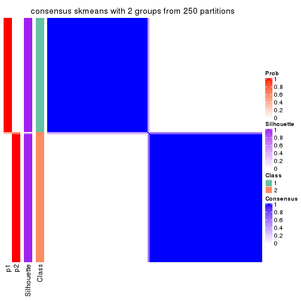</p>

</div>
<div id='tab-ATC-skmeans-consensus-heatmap-2'>
<pre><code class="r">consensus_heatmap(res, k = 3)
</code></pre>

<p>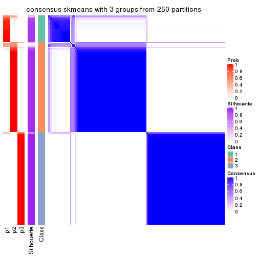</p>

</div>
<div id='tab-ATC-skmeans-consensus-heatmap-3'>
<pre><code class="r">consensus_heatmap(res, k = 4)
</code></pre>

<p>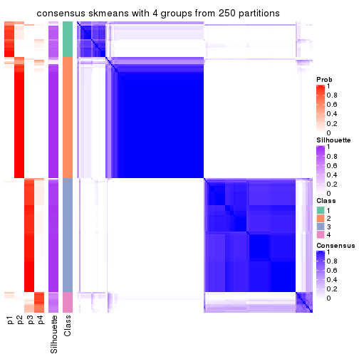</p>

</div>
<div id='tab-ATC-skmeans-consensus-heatmap-4'>
<pre><code class="r">consensus_heatmap(res, k = 5)
</code></pre>

<p>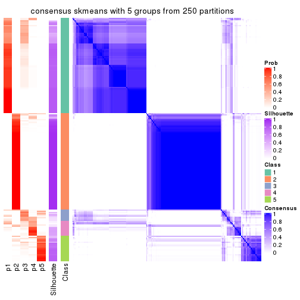</p>

</div>
<div id='tab-ATC-skmeans-consensus-heatmap-5'>
<pre><code class="r">consensus_heatmap(res, k = 6)
</code></pre>

<p>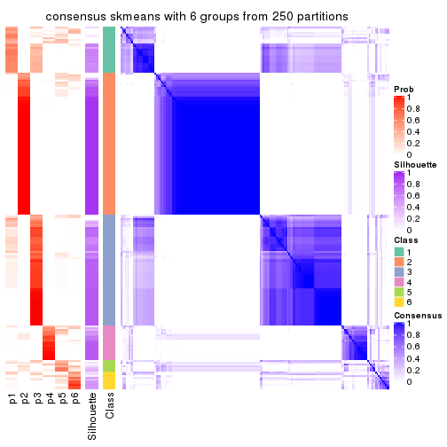</p>

</div>
</div>

Heatmaps for the membership of samples in all partitions to see how consistent they are:


<script>
$( function() {
	$( '#tabs-ATC-skmeans-membership-heatmap' ).tabs();
} );
</script>
<div id='tabs-ATC-skmeans-membership-heatmap'>
<ul>
<li><a href='#tab-ATC-skmeans-membership-heatmap-1'>k = 2</a></li>
<li><a href='#tab-ATC-skmeans-membership-heatmap-2'>k = 3</a></li>
<li><a href='#tab-ATC-skmeans-membership-heatmap-3'>k = 4</a></li>
<li><a href='#tab-ATC-skmeans-membership-heatmap-4'>k = 5</a></li>
<li><a href='#tab-ATC-skmeans-membership-heatmap-5'>k = 6</a></li>
</ul>
<div id='tab-ATC-skmeans-membership-heatmap-1'>
<pre><code class="r">membership_heatmap(res, k = 2)
</code></pre>

<p>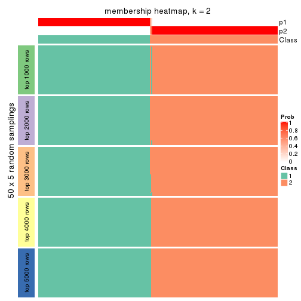</p>

</div>
<div id='tab-ATC-skmeans-membership-heatmap-2'>
<pre><code class="r">membership_heatmap(res, k = 3)
</code></pre>

<p>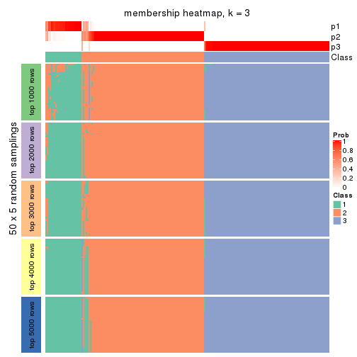</p>

</div>
<div id='tab-ATC-skmeans-membership-heatmap-3'>
<pre><code class="r">membership_heatmap(res, k = 4)
</code></pre>

<p>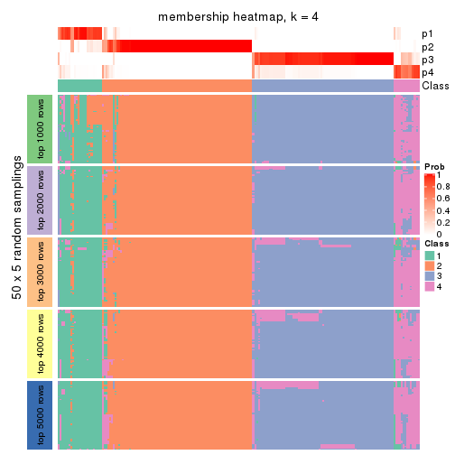</p>

</div>
<div id='tab-ATC-skmeans-membership-heatmap-4'>
<pre><code class="r">membership_heatmap(res, k = 5)
</code></pre>

<p>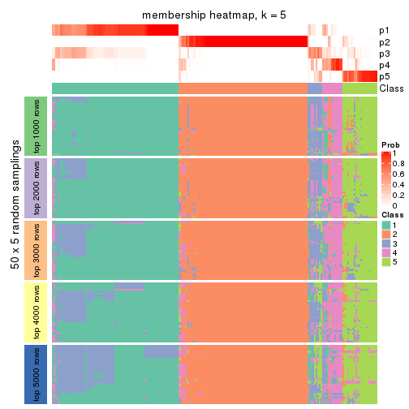</p>

</div>
<div id='tab-ATC-skmeans-membership-heatmap-5'>
<pre><code class="r">membership_heatmap(res, k = 6)
</code></pre>

<p>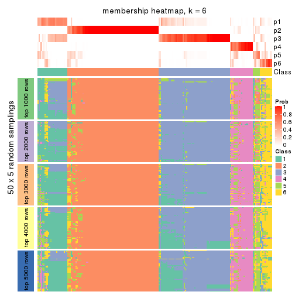</p>

</div>
</div>

As soon as we have had the classes for columns, we can look for signatures
which are significantly different between classes which can be candidate marks
for certain classes. Following are the heatmaps for signatures.


Signature heatmaps where rows are scaled:


<script>
$( function() {
	$( '#tabs-ATC-skmeans-get-signatures' ).tabs();
} );
</script>
<div id='tabs-ATC-skmeans-get-signatures'>
<ul>
<li><a href='#tab-ATC-skmeans-get-signatures-1'>k = 2</a></li>
<li><a href='#tab-ATC-skmeans-get-signatures-2'>k = 3</a></li>
<li><a href='#tab-ATC-skmeans-get-signatures-3'>k = 4</a></li>
<li><a href='#tab-ATC-skmeans-get-signatures-4'>k = 5</a></li>
<li><a href='#tab-ATC-skmeans-get-signatures-5'>k = 6</a></li>
</ul>
<div id='tab-ATC-skmeans-get-signatures-1'>
<pre><code class="r">get_signatures(res, k = 2)
</code></pre>

<p>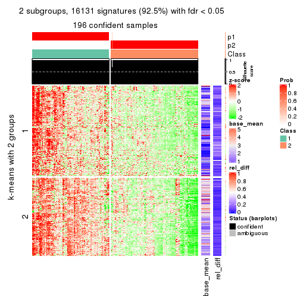</p>

</div>
<div id='tab-ATC-skmeans-get-signatures-2'>
<pre><code class="r">get_signatures(res, k = 3)
</code></pre>

<p>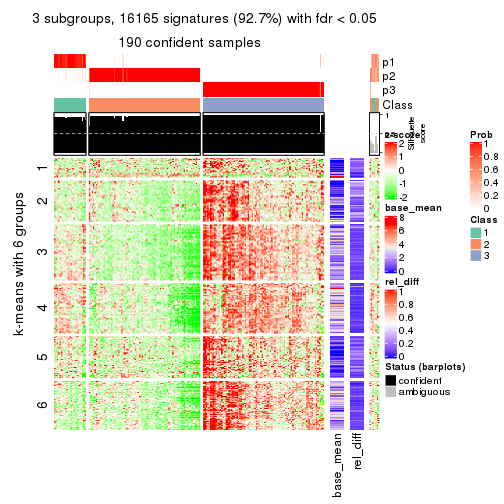</p>

</div>
<div id='tab-ATC-skmeans-get-signatures-3'>
<pre><code class="r">get_signatures(res, k = 4)
</code></pre>

<p>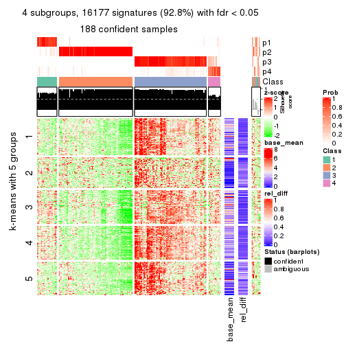</p>

</div>
<div id='tab-ATC-skmeans-get-signatures-4'>
<pre><code class="r">get_signatures(res, k = 5)
</code></pre>

<p>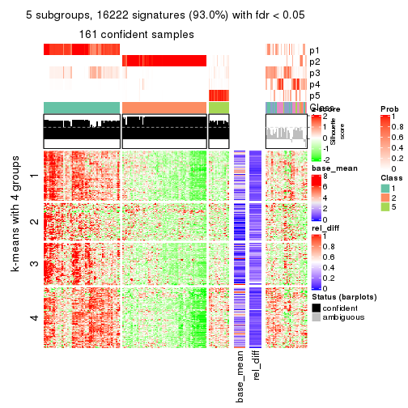</p>

</div>
<div id='tab-ATC-skmeans-get-signatures-5'>
<pre><code class="r">get_signatures(res, k = 6)
</code></pre>

<p>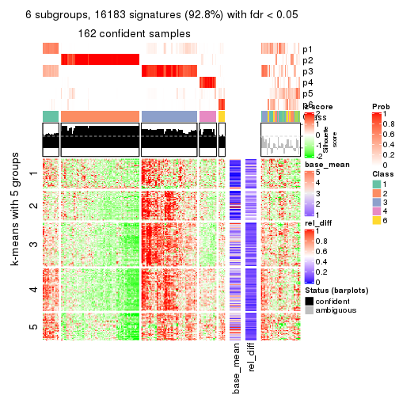</p>

</div>
</div>


Signature heatmaps where rows are not scaled:


<script>
$( function() {
	$( '#tabs-ATC-skmeans-get-signatures-no-scale' ).tabs();
} );
</script>
<div id='tabs-ATC-skmeans-get-signatures-no-scale'>
<ul>
<li><a href='#tab-ATC-skmeans-get-signatures-no-scale-1'>k = 2</a></li>
<li><a href='#tab-ATC-skmeans-get-signatures-no-scale-2'>k = 3</a></li>
<li><a href='#tab-ATC-skmeans-get-signatures-no-scale-3'>k = 4</a></li>
<li><a href='#tab-ATC-skmeans-get-signatures-no-scale-4'>k = 5</a></li>
<li><a href='#tab-ATC-skmeans-get-signatures-no-scale-5'>k = 6</a></li>
</ul>
<div id='tab-ATC-skmeans-get-signatures-no-scale-1'>
<pre><code class="r">get_signatures(res, k = 2, scale_rows = FALSE)
</code></pre>

<p>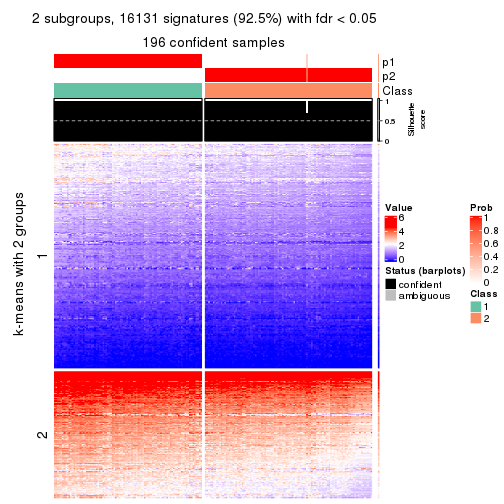</p>

</div>
<div id='tab-ATC-skmeans-get-signatures-no-scale-2'>
<pre><code class="r">get_signatures(res, k = 3, scale_rows = FALSE)
</code></pre>

<p>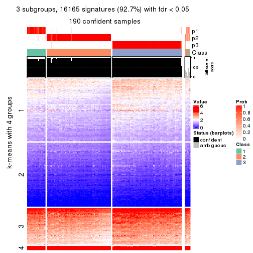</p>

</div>
<div id='tab-ATC-skmeans-get-signatures-no-scale-3'>
<pre><code class="r">get_signatures(res, k = 4, scale_rows = FALSE)
</code></pre>

<p>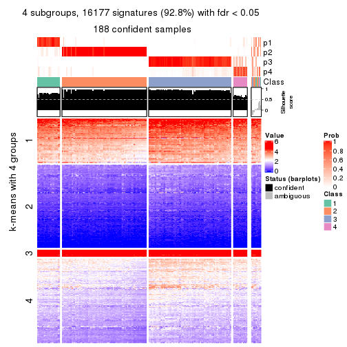</p>

</div>
<div id='tab-ATC-skmeans-get-signatures-no-scale-4'>
<pre><code class="r">get_signatures(res, k = 5, scale_rows = FALSE)
</code></pre>

<p>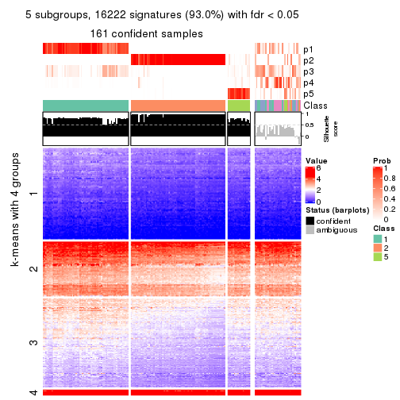</p>

</div>
<div id='tab-ATC-skmeans-get-signatures-no-scale-5'>
<pre><code class="r">get_signatures(res, k = 6, scale_rows = FALSE)
</code></pre>

<p>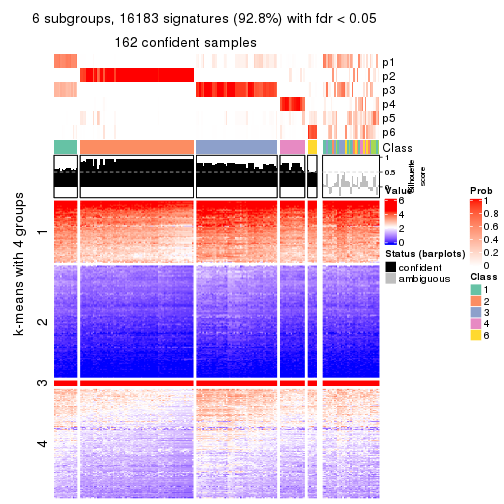</p>

</div>
</div>


Compare the overlap of signatures from different k:

```r
compare_signatures(res)
```

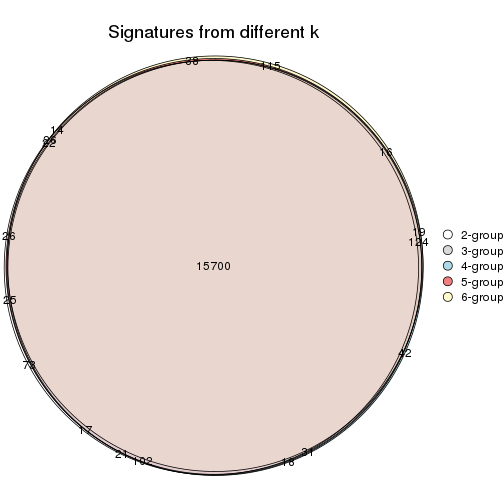

`get_signature()` returns a data frame invisibly. TO get the list of signatures, the function
call should be assigned to a variable explicitly. In following code, if `plot` argument is set
to `FALSE`, no heatmap is plotted while only the differential analysis is performed.

```r
# code only for demonstration
tb = get_signature(res, k = ..., plot = FALSE)
```

An example of the output of `tb` is:

```
#>   which_row         fdr    mean_1    mean_2 scaled_mean_1 scaled_mean_2 km
#> 1        38 0.042760348  8.373488  9.131774    -0.5533452     0.5164555  1
#> 2        40 0.018707592  7.106213  8.469186    -0.6173731     0.5762149  1
#> 3        55 0.019134737 10.221463 11.207825    -0.6159697     0.5749050  1
#> 4        59 0.006059896  5.921854  7.869574    -0.6899429     0.6439467  1
#> 5        60 0.018055526  8.928898 10.211722    -0.6204761     0.5791110  1
#> 6        98 0.009384629 15.714769 14.887706     0.6635654    -0.6193277  2
...
```

The columns in `tb` are:

1. `which_row`: row indices corresponding to the input matrix.
2. `fdr`: FDR for the differential test. 
3. `mean_x`: The mean value in group x.
4. `scaled_mean_x`: The mean value in group x after rows are scaled.
5. `km`: Row groups if k-means clustering is applied to rows.


UMAP plot which shows how samples are separated.


<script>
$( function() {
	$( '#tabs-ATC-skmeans-dimension-reduction' ).tabs();
} );
</script>
<div id='tabs-ATC-skmeans-dimension-reduction'>
<ul>
<li><a href='#tab-ATC-skmeans-dimension-reduction-1'>k = 2</a></li>
<li><a href='#tab-ATC-skmeans-dimension-reduction-2'>k = 3</a></li>
<li><a href='#tab-ATC-skmeans-dimension-reduction-3'>k = 4</a></li>
<li><a href='#tab-ATC-skmeans-dimension-reduction-4'>k = 5</a></li>
<li><a href='#tab-ATC-skmeans-dimension-reduction-5'>k = 6</a></li>
</ul>
<div id='tab-ATC-skmeans-dimension-reduction-1'>
<pre><code class="r">dimension_reduction(res, k = 2, method = &quot;UMAP&quot;)
</code></pre>

<p>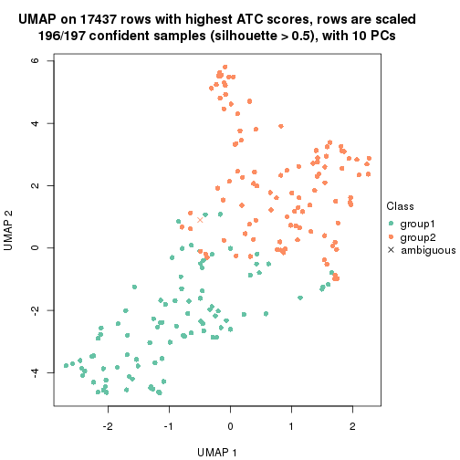</p>

</div>
<div id='tab-ATC-skmeans-dimension-reduction-2'>
<pre><code class="r">dimension_reduction(res, k = 3, method = &quot;UMAP&quot;)
</code></pre>

<p>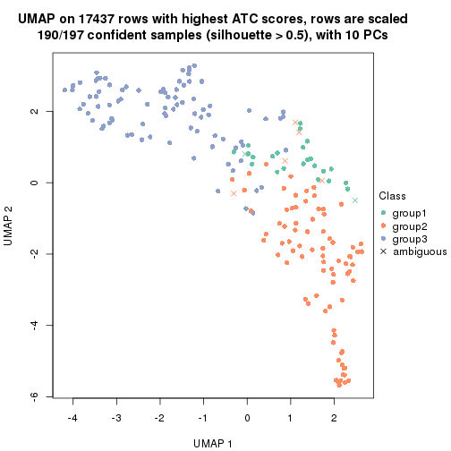</p>

</div>
<div id='tab-ATC-skmeans-dimension-reduction-3'>
<pre><code class="r">dimension_reduction(res, k = 4, method = &quot;UMAP&quot;)
</code></pre>

<p>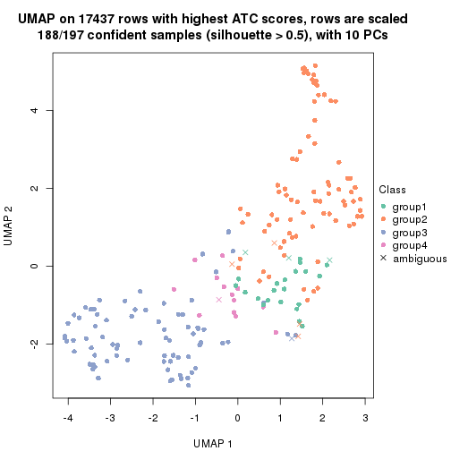</p>

</div>
<div id='tab-ATC-skmeans-dimension-reduction-4'>
<pre><code class="r">dimension_reduction(res, k = 5, method = &quot;UMAP&quot;)
</code></pre>

<p>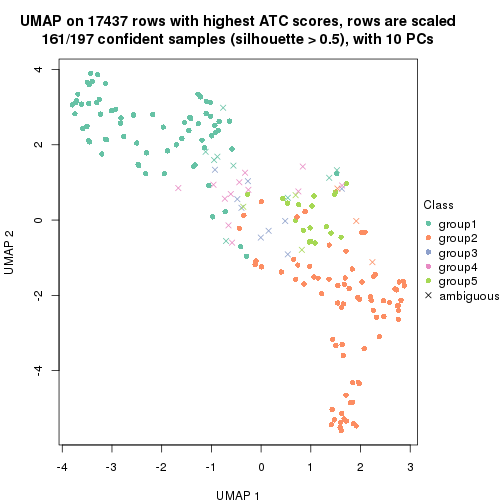</p>

</div>
<div id='tab-ATC-skmeans-dimension-reduction-5'>
<pre><code class="r">dimension_reduction(res, k = 6, method = &quot;UMAP&quot;)
</code></pre>

<p>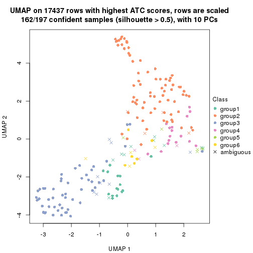</p>

</div>
</div>


Following heatmap shows how subgroups are split when increasing `k`:

```r
collect_classes(res)
```

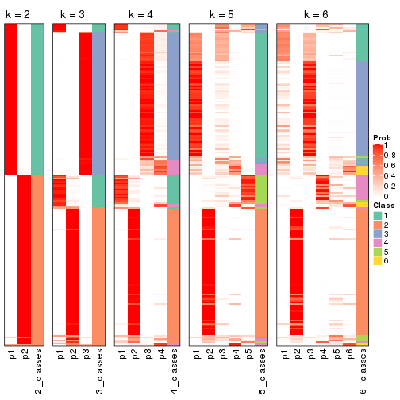


If matrix rows can be associated to genes, consider to use `GO_Enrichment(res,
...)` to perform function enrichment for the signature genes.


 

---------------------------------------------------


### ATC:pam*


The object with results only for a single top-value method and a single partition method 
can be extracted as:

```r
res = res_list["ATC", "pam"]
# you can also extract it by
# res = res_list["ATC:pam"]
```

A summary of `res` and all the functions that can be applied to it:

```r
res
```

```
#> A 'ConsensusPartition' object with k = 2, 3, 4, 5, 6.
#>   On a matrix with 17437 rows and 197 columns.
#>   Top rows (1000, 2000, 3000, 4000, 5000) are extracted by 'ATC' method.
#>   Subgroups are detected by 'pam' method.
#>   Performed in total 1250 partitions by row resampling.
#>   Best k for subgroups seems to be 5.
#> 
#> Following methods can be applied to this 'ConsensusPartition' object:
#>  [1] "cola_report"             "collect_classes"         "collect_plots"          
#>  [4] "collect_stats"           "colnames"                "compare_signatures"     
#>  [7] "consensus_heatmap"       "dimension_reduction"     "functional_enrichment"  
#> [10] "get_anno_col"            "get_anno"                "get_classes"            
#> [13] "get_consensus"           "get_matrix"              "get_membership"         
#> [16] "get_param"               "get_signatures"          "get_stats"              
#> [19] "is_best_k"               "is_stable_k"             "membership_heatmap"     
#> [22] "ncol"                    "nrow"                    "plot_ecdf"              
#> [25] "rownames"                "select_partition_number" "show"                   
#> [28] "suggest_best_k"          "test_to_known_factors"
```

`collect_plots()` function collects all the plots made from `res` for all `k` (number of partitions)
into one single page to provide an easy and fast comparison between different `k`.

```r
collect_plots(res)
```

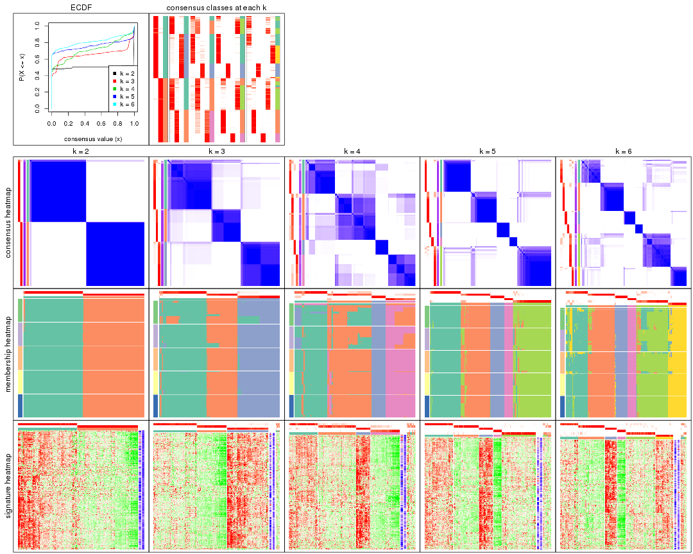

The plots are:

- The first row: a plot of the ECDF (Empirical cumulative distribution
  function) curves of the consensus matrix for each `k` and the heatmap of
  predicted classes for each `k`.
- The second row: heatmaps of the consensus matrix for each `k`.
- The third row: heatmaps of the membership matrix for each `k`.
- The fouth row: heatmaps of the signatures for each `k`.

All the plots in panels can be made by individual functions and they are
plotted later in this section.

`select_partition_number()` produces several plots showing different
statistics for choosing "optimized" `k`. There are following statistics:

- ECDF curves of the consensus matrix for each `k`;
- 1-PAC. [The PAC
  score](https://en.wikipedia.org/wiki/Consensus_clustering#Over-interpretation_potential_of_consensus_clustering)
  measures the proportion of the ambiguous subgrouping.
- Mean silhouette score.
- Concordance. The mean probability of fiting the consensus class ids in all
  partitions.
- Area increased. Denote $A_k$ as the area under the ECDF curve for current
  `k`, the area increased is defined as $A_k - A_{k-1}$.
- Rand index. The percent of pairs of samples that are both in a same cluster
  or both are not in a same cluster in the partition of k and k-1.
- Jaccard index. The ratio of pairs of samples are both in a same cluster in
  the partition of k and k-1 and the pairs of samples are both in a same
  cluster in the partition k or k-1.

The detailed explanations of these statistics can be found in [the cola
vignette](http://bioconductor.org/packages/devel/bioc/vignettes/cola/inst/doc/cola.html#toc_13).

Generally speaking, lower PAC score, higher mean silhouette score or higher
concordance corresponds to better partition. Rand index and Jaccard index
measure how similar the current partition is compared to partition with `k-1`.
If they are too similar, we won't accept `k` is better than `k-1`.

```r
select_partition_number(res)
```

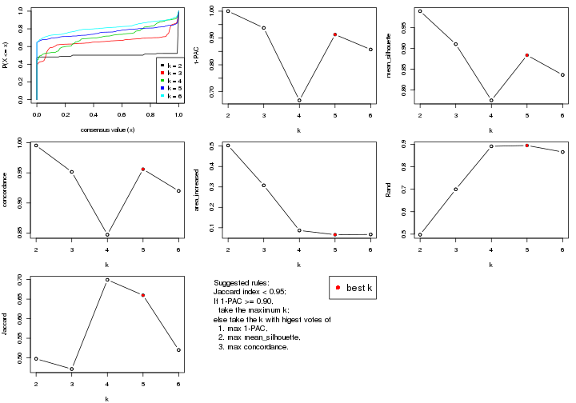

The numeric values for all these statistics can be obtained by `get_stats()`.

```r
get_stats(res)
```

```
#>   k 1-PAC mean_silhouette concordance area_increased  Rand Jaccard
#> 2 2 1.000           0.990       0.995         0.5028 0.498   0.498
#> 3 3 0.938           0.910       0.952         0.3076 0.699   0.471
#> 4 4 0.667           0.775       0.847         0.0867 0.891   0.699
#> 5 5 0.913           0.884       0.956         0.0659 0.894   0.660
#> 6 6 0.857           0.836       0.920         0.0671 0.865   0.520
```

`suggest_best_k()` suggests the best $k$ based on these statistics. The rules are as follows:

- All $k$ with Jaccard index larger than 0.95 are removed because the increase of
  the partition number does not provides enough extra information. If all $k$ are removed,
  the best $k$ is assigned by `NA`.
- For $k$ with 1-PAC larger than 0.9, the maximal $k$ is taken as the "best k". Other $k$ is called "optional k".
- If it does not fit the second rule. The $k$ with the highest vote of highest
  1-PAC, mean silhouette and concordance is taken as the "best k".

```r
suggest_best_k(res)
```

```
#> [1] 5
#> attr(,"optional")
#> [1] 2 3
```

There is also optional best $k$ = 2 3 that is worth to check.

Following shows the table of the partitions (You need to click the **show/hide
code output** link to see it). The membership matrix (columns with name `p*`)
is inferred by
[`clue::cl_consensus()`](https://www.rdocumentation.org/link/cl_consensus?package=clue)
function with the `SE` method. Basically the value in the membership matrix
represents the probability to belong to a certain group. The finall class
label for an item is determined with the group with highest probability it
belongs to.

In `get_classes()` function, the entropy is calculated from the membership
matrix and the silhouette score is calculated from the consensus matrix.


<script>
$( function() {
	$( '#tabs-ATC-pam-get-classes' ).tabs();
} );
</script>
<div id='tabs-ATC-pam-get-classes'>
<ul>
<li><a href='#tab-ATC-pam-get-classes-1'>k = 2</a></li>
<li><a href='#tab-ATC-pam-get-classes-2'>k = 3</a></li>
<li><a href='#tab-ATC-pam-get-classes-3'>k = 4</a></li>
<li><a href='#tab-ATC-pam-get-classes-4'>k = 5</a></li>
<li><a href='#tab-ATC-pam-get-classes-5'>k = 6</a></li>
</ul>

<div id='tab-ATC-pam-get-classes-1'>
<p><a id='tab-ATC-pam-get-classes-1-a' style='color:#0366d6' href='#'>show/hide code output</a></p>
<pre><code class="r">cbind(get_classes(res, k = 2), get_membership(res, k = 2))
</code></pre>

<pre><code>#&gt;            class entropy silhouette    p1    p2
#&gt; SRR1380886     1  0.0000      0.993 1.000 0.000
#&gt; SRR1074385     1  0.0000      0.993 1.000 0.000
#&gt; SRR1374739     1  0.0000      0.993 1.000 0.000
#&gt; SRR1097883     1  0.0000      0.993 1.000 0.000
#&gt; SRR2167209     1  0.0000      0.993 1.000 0.000
#&gt; SRR816541      2  0.0000      0.997 0.000 1.000
#&gt; SRR663645      1  0.0000      0.993 1.000 0.000
#&gt; SRR1381505     2  0.0000      0.997 0.000 1.000
#&gt; SRR1416362     2  0.0000      0.997 0.000 1.000
#&gt; SRR1318503     1  0.8016      0.683 0.756 0.244
#&gt; SRR1341626     2  0.0000      0.997 0.000 1.000
#&gt; SRR1382440     1  0.0000      0.993 1.000 0.000
#&gt; SRR1088413     1  0.0000      0.993 1.000 0.000
#&gt; SRR1082080     2  0.0000      0.997 0.000 1.000
#&gt; SRR1455783     1  0.0000      0.993 1.000 0.000
#&gt; SRR1447760     2  0.0000      0.997 0.000 1.000
#&gt; SRR1487784     2  0.0000      0.997 0.000 1.000
#&gt; SRR1331037     2  0.0000      0.997 0.000 1.000
#&gt; SRR1095651     1  0.0000      0.993 1.000 0.000
#&gt; SRR1078066     1  0.0000      0.993 1.000 0.000
#&gt; SRR1120363     1  0.0000      0.993 1.000 0.000
#&gt; SRR821231      1  0.0000      0.993 1.000 0.000
#&gt; SRR1374373     2  0.0000      0.997 0.000 1.000
#&gt; SRR1324519     2  0.0000      0.997 0.000 1.000
#&gt; SRR1431121     1  0.0000      0.993 1.000 0.000
#&gt; SRR1091032     2  0.0000      0.997 0.000 1.000
#&gt; SRR1365575     2  0.0000      0.997 0.000 1.000
#&gt; SRR1072972     1  0.0000      0.993 1.000 0.000
#&gt; SRR1310690     2  0.0000      0.997 0.000 1.000
#&gt; SRR1383037     1  0.0000      0.993 1.000 0.000
#&gt; SRR1095479     1  0.0000      0.993 1.000 0.000
#&gt; SRR1070403     1  0.0000      0.993 1.000 0.000
#&gt; SRR1390203     1  0.0000      0.993 1.000 0.000
#&gt; SRR1072007     2  0.0000      0.997 0.000 1.000
#&gt; SRR1468787     2  0.0000      0.997 0.000 1.000
#&gt; SRR1347959     2  0.0000      0.997 0.000 1.000
#&gt; SRR1338513     1  0.0000      0.993 1.000 0.000
#&gt; SRR812598      2  0.0000      0.997 0.000 1.000
#&gt; SRR1446806     1  0.0000      0.993 1.000 0.000
#&gt; SRR1394275     1  0.0000      0.993 1.000 0.000
#&gt; SRR1443633     1  0.0000      0.993 1.000 0.000
#&gt; SRR1087728     1  0.0000      0.993 1.000 0.000
#&gt; SRR1098192     2  0.0000      0.997 0.000 1.000
#&gt; SRR1093340     2  0.0000      0.997 0.000 1.000
#&gt; SRR665405      1  0.0000      0.993 1.000 0.000
#&gt; SRR657077      1  0.0000      0.993 1.000 0.000
#&gt; SRR813208      1  0.0000      0.993 1.000 0.000
#&gt; SRR1416074     2  0.0000      0.997 0.000 1.000
#&gt; SRR1089688     2  0.0000      0.997 0.000 1.000
#&gt; SRR1353461     1  0.0000      0.993 1.000 0.000
#&gt; SRR1466321     2  0.0376      0.993 0.004 0.996
#&gt; SRR1073021     2  0.0000      0.997 0.000 1.000
#&gt; SRR1322816     2  0.0000      0.997 0.000 1.000
#&gt; SRR1457727     1  0.0000      0.993 1.000 0.000
#&gt; SRR1464226     2  0.0000      0.997 0.000 1.000
#&gt; SRR1398863     1  0.0000      0.993 1.000 0.000
#&gt; SRR1455631     2  0.0000      0.997 0.000 1.000
#&gt; SRR1307808     2  0.0000      0.997 0.000 1.000
#&gt; SRR1374585     2  0.0000      0.997 0.000 1.000
#&gt; SRR1072104     2  0.0000      0.997 0.000 1.000
#&gt; SRR1076868     2  0.0000      0.997 0.000 1.000
#&gt; SRR1335984     2  0.0000      0.997 0.000 1.000
#&gt; SRR1445939     1  0.0000      0.993 1.000 0.000
#&gt; SRR1453047     2  0.0000      0.997 0.000 1.000
#&gt; SRR1339788     1  0.0000      0.993 1.000 0.000
#&gt; SRR1084323     1  0.0000      0.993 1.000 0.000
#&gt; SRR1092937     1  0.0000      0.993 1.000 0.000
#&gt; SRR1074090     2  0.0000      0.997 0.000 1.000
#&gt; SRR1099833     1  0.0000      0.993 1.000 0.000
#&gt; SRR1093434     1  0.0000      0.993 1.000 0.000
#&gt; SRR1435857     1  0.0000      0.993 1.000 0.000
#&gt; SRR1480347     2  0.0000      0.997 0.000 1.000
#&gt; SRR1440787     2  0.0000      0.997 0.000 1.000
#&gt; SRR1430202     2  0.0000      0.997 0.000 1.000
#&gt; SRR1322730     2  0.0000      0.997 0.000 1.000
#&gt; SRR811029      2  0.0000      0.997 0.000 1.000
#&gt; SRR1390456     1  0.0000      0.993 1.000 0.000
#&gt; SRR1381140     1  0.0000      0.993 1.000 0.000
#&gt; SRR1388064     2  0.0000      0.997 0.000 1.000
#&gt; SRR1093577     1  0.0000      0.993 1.000 0.000
#&gt; SRR1414161     1  0.0000      0.993 1.000 0.000
#&gt; SRR1328738     2  0.0000      0.997 0.000 1.000
#&gt; SRR1311752     2  0.0000      0.997 0.000 1.000
#&gt; SRR1445960     2  0.0000      0.997 0.000 1.000
#&gt; SRR1403412     2  0.0000      0.997 0.000 1.000
#&gt; SRR2166748     1  0.0000      0.993 1.000 0.000
#&gt; SRR821666      2  0.0000      0.997 0.000 1.000
#&gt; SRR1330746     1  0.0000      0.993 1.000 0.000
#&gt; SRR1327872     2  0.0000      0.997 0.000 1.000
#&gt; SRR1100800     1  0.0000      0.993 1.000 0.000
#&gt; SRR1075174     1  0.0000      0.993 1.000 0.000
#&gt; SRR1434436     1  0.0000      0.993 1.000 0.000
#&gt; SRR1389409     2  0.0000      0.997 0.000 1.000
#&gt; SRR1085310     1  0.0000      0.993 1.000 0.000
#&gt; SRR1376718     2  0.0000      0.997 0.000 1.000
#&gt; SRR808590      2  0.0000      0.997 0.000 1.000
#&gt; SRR1084128     1  0.0000      0.993 1.000 0.000
#&gt; SRR1361692     1  0.0000      0.993 1.000 0.000
#&gt; SRR1431493     1  0.0000      0.993 1.000 0.000
#&gt; SRR1409084     1  0.0000      0.993 1.000 0.000
#&gt; SRR2166214     1  0.0000      0.993 1.000 0.000
#&gt; SRR1324102     2  0.0000      0.997 0.000 1.000
#&gt; SRR1079754     2  0.0000      0.997 0.000 1.000
#&gt; SRR1442127     1  0.0000      0.993 1.000 0.000
#&gt; SRR1076244     2  0.0000      0.997 0.000 1.000
#&gt; SRR1330901     2  0.0000      0.997 0.000 1.000
#&gt; SRR1073167     2  0.0000      0.997 0.000 1.000
#&gt; SRR1357541     1  0.0000      0.993 1.000 0.000
#&gt; SRR811607      2  0.0000      0.997 0.000 1.000
#&gt; SRR1468931     1  0.0000      0.993 1.000 0.000
#&gt; SRR1474908     2  0.0000      0.997 0.000 1.000
#&gt; SRR1309875     2  0.0000      0.997 0.000 1.000
#&gt; SRR598792      1  0.0000      0.993 1.000 0.000
#&gt; SRR1088537     2  0.0000      0.997 0.000 1.000
#&gt; SRR1457682     1  0.0000      0.993 1.000 0.000
#&gt; SRR1454289     1  0.0000      0.993 1.000 0.000
#&gt; SRR1069352     1  0.0000      0.993 1.000 0.000
#&gt; SRR1472728     2  0.0000      0.997 0.000 1.000
#&gt; SRR1091144     2  0.0000      0.997 0.000 1.000
#&gt; SRR1319118     1  0.0000      0.993 1.000 0.000
#&gt; SRR1403611     1  0.0000      0.993 1.000 0.000
#&gt; SRR1397762     1  0.0000      0.993 1.000 0.000
#&gt; SRR1317387     1  0.0000      0.993 1.000 0.000
#&gt; SRR1376426     2  0.0000      0.997 0.000 1.000
#&gt; SRR1097777     1  0.0000      0.993 1.000 0.000
#&gt; SRR1365743     1  0.0000      0.993 1.000 0.000
#&gt; SRR1458992     2  0.0000      0.997 0.000 1.000
#&gt; SRR1089537     1  0.0000      0.993 1.000 0.000
#&gt; SRR1397744     1  0.0000      0.993 1.000 0.000
#&gt; SRR1453893     2  0.0000      0.997 0.000 1.000
#&gt; SRR1098543     1  0.0000      0.993 1.000 0.000
#&gt; SRR1321765     1  0.0000      0.993 1.000 0.000
#&gt; SRR1440032     1  0.0376      0.989 0.996 0.004
#&gt; SRR1404507     2  0.0000      0.997 0.000 1.000
#&gt; SRR1404856     2  0.0000      0.997 0.000 1.000
#&gt; SRR812745      1  0.0000      0.993 1.000 0.000
#&gt; SRR1417524     2  0.8144      0.662 0.252 0.748
#&gt; SRR1407334     2  0.0000      0.997 0.000 1.000
#&gt; SRR1453991     1  0.0000      0.993 1.000 0.000
#&gt; SRR1415938     1  0.0000      0.993 1.000 0.000
#&gt; SRR1081259     2  0.0000      0.997 0.000 1.000
#&gt; SRR1436187     2  0.0000      0.997 0.000 1.000
#&gt; SRR1431948     1  0.0000      0.993 1.000 0.000
#&gt; SRR1453277     2  0.0000      0.997 0.000 1.000
#&gt; SRR1095407     2  0.0000      0.997 0.000 1.000
#&gt; SRR1359694     2  0.0000      0.997 0.000 1.000
#&gt; SRR656982      2  0.0000      0.997 0.000 1.000
#&gt; SRR1354338     2  0.0000      0.997 0.000 1.000
#&gt; SRR1088291     2  0.0000      0.997 0.000 1.000
#&gt; SRR1080624     1  0.0000      0.993 1.000 0.000
#&gt; SRR2166708     1  0.0000      0.993 1.000 0.000
#&gt; SRR1393572     1  0.0000      0.993 1.000 0.000
#&gt; SRR1429912     2  0.0000      0.997 0.000 1.000
#&gt; SRR1421048     2  0.0000      0.997 0.000 1.000
#&gt; SRR1434999     1  0.0000      0.993 1.000 0.000
#&gt; SRR656457      1  0.0000      0.993 1.000 0.000
#&gt; SRR1098928     1  0.0000      0.993 1.000 0.000
#&gt; SRR1343967     2  0.0000      0.997 0.000 1.000
#&gt; SRR1360766     2  0.0000      0.997 0.000 1.000
#&gt; SRR1464724     2  0.0000      0.997 0.000 1.000
#&gt; SRR1101542     2  0.0000      0.997 0.000 1.000
#&gt; SRR1401528     1  0.0000      0.993 1.000 0.000
#&gt; SRR1071519     1  0.0000      0.993 1.000 0.000
#&gt; SRR1086070     1  0.0000      0.993 1.000 0.000
#&gt; SRR1358645     1  0.6343      0.811 0.840 0.160
#&gt; SRR819771      1  0.0000      0.993 1.000 0.000
#&gt; SRR1418433     2  0.0000      0.997 0.000 1.000
#&gt; SRR821050      1  0.0000      0.993 1.000 0.000
#&gt; SRR1402091     2  0.0000      0.997 0.000 1.000
#&gt; SRR1322028     2  0.0000      0.997 0.000 1.000
#&gt; SRR1452556     2  0.0000      0.997 0.000 1.000
#&gt; SRR1340047     2  0.0000      0.997 0.000 1.000
#&gt; SRR1418302     2  0.0000      0.997 0.000 1.000
#&gt; SRR1073991     1  0.0000      0.993 1.000 0.000
#&gt; SRR1085187     2  0.0000      0.997 0.000 1.000
#&gt; SRR1357618     1  0.0000      0.993 1.000 0.000
#&gt; SRR1487764     2  0.0000      0.997 0.000 1.000
#&gt; SRR1075336     1  0.7883      0.696 0.764 0.236
#&gt; SRR1365471     2  0.0000      0.997 0.000 1.000
#&gt; SRR1414613     2  0.0000      0.997 0.000 1.000
#&gt; SRR658719      1  0.0000      0.993 1.000 0.000
#&gt; SRR1475128     1  0.0000      0.993 1.000 0.000
#&gt; SRR1367630     2  0.0000      0.997 0.000 1.000
#&gt; SRR1481146     2  0.0000      0.997 0.000 1.000
#&gt; SRR1465674     2  0.0000      0.997 0.000 1.000
#&gt; SRR1327303     2  0.0000      0.997 0.000 1.000
#&gt; SRR1390391     1  0.0000      0.993 1.000 0.000
#&gt; SRR1326020     2  0.0000      0.997 0.000 1.000
#&gt; SRR1381953     2  0.0000      0.997 0.000 1.000
#&gt; SRR1082544     2  0.0000      0.997 0.000 1.000
#&gt; SRR810761      1  0.0000      0.993 1.000 0.000
#&gt; SRR1070764     1  0.0000      0.993 1.000 0.000
#&gt; SRR1415919     1  0.0000      0.993 1.000 0.000
#&gt; SRR1490404     2  0.0000      0.997 0.000 1.000
#&gt; SRR1416773     2  0.0000      0.997 0.000 1.000
#&gt; SRR1377492     2  0.0000      0.997 0.000 1.000
#&gt; SRR1334314     1  0.0000      0.993 1.000 0.000
</code></pre>

<script>
$('#tab-ATC-pam-get-classes-1-a').parent().next().next().hide();
$('#tab-ATC-pam-get-classes-1-a').click(function(){
  $('#tab-ATC-pam-get-classes-1-a').parent().next().next().toggle();
  return(false);
});
</script>
</div>

<div id='tab-ATC-pam-get-classes-2'>
<p><a id='tab-ATC-pam-get-classes-2-a' style='color:#0366d6' href='#'>show/hide code output</a></p>
<pre><code class="r">cbind(get_classes(res, k = 3), get_membership(res, k = 3))
</code></pre>

<pre><code>#&gt;            class entropy silhouette    p1    p2    p3
#&gt; SRR1380886     3  0.2261     0.9508 0.068 0.000 0.932
#&gt; SRR1074385     3  0.3551     0.8976 0.132 0.000 0.868
#&gt; SRR1374739     3  0.0000     0.9523 0.000 0.000 1.000
#&gt; SRR1097883     3  0.2261     0.9508 0.068 0.000 0.932
#&gt; SRR2167209     1  0.0000     0.9352 1.000 0.000 0.000
#&gt; SRR816541      2  0.0000     0.9589 0.000 1.000 0.000
#&gt; SRR663645      1  0.0237     0.9336 0.996 0.000 0.004
#&gt; SRR1381505     2  0.0000     0.9589 0.000 1.000 0.000
#&gt; SRR1416362     1  0.6308     0.0429 0.508 0.492 0.000
#&gt; SRR1318503     1  0.0000     0.9352 1.000 0.000 0.000
#&gt; SRR1341626     2  0.0000     0.9589 0.000 1.000 0.000
#&gt; SRR1382440     3  0.0000     0.9523 0.000 0.000 1.000
#&gt; SRR1088413     3  0.2625     0.9410 0.084 0.000 0.916
#&gt; SRR1082080     2  0.0000     0.9589 0.000 1.000 0.000
#&gt; SRR1455783     3  0.2261     0.9508 0.068 0.000 0.932
#&gt; SRR1447760     1  0.2261     0.9040 0.932 0.068 0.000
#&gt; SRR1487784     1  0.6305     0.0755 0.516 0.484 0.000
#&gt; SRR1331037     1  0.2625     0.8936 0.916 0.084 0.000
#&gt; SRR1095651     3  0.2261     0.9508 0.068 0.000 0.932
#&gt; SRR1078066     1  0.0237     0.9336 0.996 0.000 0.004
#&gt; SRR1120363     3  0.2261     0.9508 0.068 0.000 0.932
#&gt; SRR821231      3  0.0000     0.9523 0.000 0.000 1.000
#&gt; SRR1374373     1  0.2261     0.9040 0.932 0.068 0.000
#&gt; SRR1324519     2  0.1964     0.9453 0.056 0.944 0.000
#&gt; SRR1431121     3  0.1860     0.9519 0.052 0.000 0.948
#&gt; SRR1091032     2  0.2625     0.9198 0.084 0.916 0.000
#&gt; SRR1365575     2  0.0000     0.9589 0.000 1.000 0.000
#&gt; SRR1072972     3  0.2261     0.9508 0.068 0.000 0.932
#&gt; SRR1310690     1  0.2261     0.9040 0.932 0.068 0.000
#&gt; SRR1383037     3  0.0000     0.9523 0.000 0.000 1.000
#&gt; SRR1095479     3  0.0000     0.9523 0.000 0.000 1.000
#&gt; SRR1070403     3  0.0000     0.9523 0.000 0.000 1.000
#&gt; SRR1390203     3  0.2261     0.9508 0.068 0.000 0.932
#&gt; SRR1072007     2  0.2261     0.9358 0.068 0.932 0.000
#&gt; SRR1468787     1  0.2625     0.8936 0.916 0.084 0.000
#&gt; SRR1347959     1  0.2066     0.9087 0.940 0.060 0.000
#&gt; SRR1338513     1  0.1529     0.9048 0.960 0.000 0.040
#&gt; SRR812598      2  0.0000     0.9589 0.000 1.000 0.000
#&gt; SRR1446806     1  0.0000     0.9352 1.000 0.000 0.000
#&gt; SRR1394275     1  0.0237     0.9336 0.996 0.000 0.004
#&gt; SRR1443633     3  0.2261     0.9508 0.068 0.000 0.932
#&gt; SRR1087728     3  0.0000     0.9523 0.000 0.000 1.000
#&gt; SRR1098192     2  0.6062     0.3736 0.384 0.616 0.000
#&gt; SRR1093340     2  0.1964     0.9453 0.056 0.944 0.000
#&gt; SRR665405      3  0.5178     0.7268 0.256 0.000 0.744
#&gt; SRR657077      3  0.5835     0.5739 0.340 0.000 0.660
#&gt; SRR813208      3  0.0000     0.9523 0.000 0.000 1.000
#&gt; SRR1416074     2  0.1964     0.9453 0.056 0.944 0.000
#&gt; SRR1089688     1  0.2625     0.8936 0.916 0.084 0.000
#&gt; SRR1353461     3  0.0000     0.9523 0.000 0.000 1.000
#&gt; SRR1466321     1  0.0000     0.9352 1.000 0.000 0.000
#&gt; SRR1073021     1  0.0892     0.9285 0.980 0.020 0.000
#&gt; SRR1322816     2  0.0000     0.9589 0.000 1.000 0.000
#&gt; SRR1457727     3  0.0000     0.9523 0.000 0.000 1.000
#&gt; SRR1464226     1  0.2537     0.8964 0.920 0.080 0.000
#&gt; SRR1398863     1  0.1643     0.9011 0.956 0.000 0.044
#&gt; SRR1455631     1  0.0000     0.9352 1.000 0.000 0.000
#&gt; SRR1307808     1  0.0000     0.9352 1.000 0.000 0.000
#&gt; SRR1374585     2  0.0000     0.9589 0.000 1.000 0.000
#&gt; SRR1072104     1  0.6045     0.4111 0.620 0.380 0.000
#&gt; SRR1076868     2  0.1964     0.9453 0.056 0.944 0.000
#&gt; SRR1335984     2  0.2261     0.9358 0.068 0.932 0.000
#&gt; SRR1445939     3  0.5431     0.6823 0.284 0.000 0.716
#&gt; SRR1453047     2  0.1964     0.9453 0.056 0.944 0.000
#&gt; SRR1339788     3  0.0000     0.9523 0.000 0.000 1.000
#&gt; SRR1084323     3  0.2261     0.9508 0.068 0.000 0.932
#&gt; SRR1092937     3  0.2448     0.9463 0.076 0.000 0.924
#&gt; SRR1074090     2  0.0000     0.9589 0.000 1.000 0.000
#&gt; SRR1099833     3  0.2261     0.9508 0.068 0.000 0.932
#&gt; SRR1093434     3  0.0000     0.9523 0.000 0.000 1.000
#&gt; SRR1435857     1  0.0237     0.9336 0.996 0.000 0.004
#&gt; SRR1480347     2  0.0000     0.9589 0.000 1.000 0.000
#&gt; SRR1440787     2  0.0000     0.9589 0.000 1.000 0.000
#&gt; SRR1430202     1  0.0000     0.9352 1.000 0.000 0.000
#&gt; SRR1322730     2  0.1860     0.9466 0.052 0.948 0.000
#&gt; SRR811029      1  0.0000     0.9352 1.000 0.000 0.000
#&gt; SRR1390456     3  0.0000     0.9523 0.000 0.000 1.000
#&gt; SRR1381140     3  0.2261     0.9508 0.068 0.000 0.932
#&gt; SRR1388064     2  0.0000     0.9589 0.000 1.000 0.000
#&gt; SRR1093577     1  0.1643     0.9059 0.956 0.000 0.044
#&gt; SRR1414161     3  0.2878     0.9313 0.096 0.000 0.904
#&gt; SRR1328738     1  0.0000     0.9352 1.000 0.000 0.000
#&gt; SRR1311752     2  0.1964     0.9453 0.056 0.944 0.000
#&gt; SRR1445960     1  0.2625     0.8936 0.916 0.084 0.000
#&gt; SRR1403412     2  0.1964     0.9453 0.056 0.944 0.000
#&gt; SRR2166748     3  0.0000     0.9523 0.000 0.000 1.000
#&gt; SRR821666      2  0.0000     0.9589 0.000 1.000 0.000
#&gt; SRR1330746     3  0.0000     0.9523 0.000 0.000 1.000
#&gt; SRR1327872     2  0.0000     0.9589 0.000 1.000 0.000
#&gt; SRR1100800     1  0.5968     0.3560 0.636 0.000 0.364
#&gt; SRR1075174     1  0.1964     0.8895 0.944 0.000 0.056
#&gt; SRR1434436     1  0.0000     0.9352 1.000 0.000 0.000
#&gt; SRR1389409     2  0.0000     0.9589 0.000 1.000 0.000
#&gt; SRR1085310     3  0.2261     0.9508 0.068 0.000 0.932
#&gt; SRR1376718     2  0.0000     0.9589 0.000 1.000 0.000
#&gt; SRR808590      2  0.0000     0.9589 0.000 1.000 0.000
#&gt; SRR1084128     1  0.0237     0.9336 0.996 0.000 0.004
#&gt; SRR1361692     1  0.0000     0.9352 1.000 0.000 0.000
#&gt; SRR1431493     3  0.0000     0.9523 0.000 0.000 1.000
#&gt; SRR1409084     3  0.2537     0.9439 0.080 0.000 0.920
#&gt; SRR2166214     1  0.0000     0.9352 1.000 0.000 0.000
#&gt; SRR1324102     2  0.2261     0.9358 0.068 0.932 0.000
#&gt; SRR1079754     2  0.0000     0.9589 0.000 1.000 0.000
#&gt; SRR1442127     3  0.0000     0.9523 0.000 0.000 1.000
#&gt; SRR1076244     2  0.0892     0.9548 0.020 0.980 0.000
#&gt; SRR1330901     1  0.0000     0.9352 1.000 0.000 0.000
#&gt; SRR1073167     2  0.1964     0.9453 0.056 0.944 0.000
#&gt; SRR1357541     3  0.0592     0.9526 0.012 0.000 0.988
#&gt; SRR811607      1  0.0000     0.9352 1.000 0.000 0.000
#&gt; SRR1468931     3  0.0000     0.9523 0.000 0.000 1.000
#&gt; SRR1474908     1  0.2625     0.8936 0.916 0.084 0.000
#&gt; SRR1309875     2  0.1964     0.9453 0.056 0.944 0.000
#&gt; SRR598792      3  0.0000     0.9523 0.000 0.000 1.000
#&gt; SRR1088537     1  0.6062     0.4009 0.616 0.384 0.000
#&gt; SRR1457682     3  0.2261     0.9508 0.068 0.000 0.932
#&gt; SRR1454289     1  0.0000     0.9352 1.000 0.000 0.000
#&gt; SRR1069352     3  0.0000     0.9523 0.000 0.000 1.000
#&gt; SRR1472728     1  0.2261     0.9040 0.932 0.068 0.000
#&gt; SRR1091144     1  0.2625     0.8936 0.916 0.084 0.000
#&gt; SRR1319118     3  0.2261     0.9508 0.068 0.000 0.932
#&gt; SRR1403611     3  0.0424     0.9526 0.008 0.000 0.992
#&gt; SRR1397762     3  0.2261     0.9508 0.068 0.000 0.932
#&gt; SRR1317387     3  0.0000     0.9523 0.000 0.000 1.000
#&gt; SRR1376426     2  0.0000     0.9589 0.000 1.000 0.000
#&gt; SRR1097777     3  0.2261     0.9508 0.068 0.000 0.932
#&gt; SRR1365743     3  0.0000     0.9523 0.000 0.000 1.000
#&gt; SRR1458992     1  0.2261     0.9040 0.932 0.068 0.000
#&gt; SRR1089537     1  0.2356     0.8791 0.928 0.000 0.072
#&gt; SRR1397744     3  0.2261     0.9508 0.068 0.000 0.932
#&gt; SRR1453893     2  0.0000     0.9589 0.000 1.000 0.000
#&gt; SRR1098543     3  0.2261     0.9508 0.068 0.000 0.932
#&gt; SRR1321765     1  0.3340     0.8235 0.880 0.000 0.120
#&gt; SRR1440032     1  0.0000     0.9352 1.000 0.000 0.000
#&gt; SRR1404507     2  0.0000     0.9589 0.000 1.000 0.000
#&gt; SRR1404856     1  0.0000     0.9352 1.000 0.000 0.000
#&gt; SRR812745      1  0.0237     0.9336 0.996 0.000 0.004
#&gt; SRR1417524     1  0.0000     0.9352 1.000 0.000 0.000
#&gt; SRR1407334     2  0.0000     0.9589 0.000 1.000 0.000
#&gt; SRR1453991     3  0.2711     0.9383 0.088 0.000 0.912
#&gt; SRR1415938     3  0.0000     0.9523 0.000 0.000 1.000
#&gt; SRR1081259     1  0.0000     0.9352 1.000 0.000 0.000
#&gt; SRR1436187     2  0.0000     0.9589 0.000 1.000 0.000
#&gt; SRR1431948     3  0.0000     0.9523 0.000 0.000 1.000
#&gt; SRR1453277     1  0.0000     0.9352 1.000 0.000 0.000
#&gt; SRR1095407     1  0.2261     0.9040 0.932 0.068 0.000
#&gt; SRR1359694     1  0.0000     0.9352 1.000 0.000 0.000
#&gt; SRR656982      1  0.1031     0.9268 0.976 0.024 0.000
#&gt; SRR1354338     1  0.2261     0.9040 0.932 0.068 0.000
#&gt; SRR1088291     1  0.2261     0.9040 0.932 0.068 0.000
#&gt; SRR1080624     1  0.0237     0.9336 0.996 0.000 0.004
#&gt; SRR2166708     3  0.0000     0.9523 0.000 0.000 1.000
#&gt; SRR1393572     1  0.0237     0.9336 0.996 0.000 0.004
#&gt; SRR1429912     2  0.1964     0.9453 0.056 0.944 0.000
#&gt; SRR1421048     1  0.2261     0.9040 0.932 0.068 0.000
#&gt; SRR1434999     3  0.2261     0.9508 0.068 0.000 0.932
#&gt; SRR656457      3  0.2261     0.9508 0.068 0.000 0.932
#&gt; SRR1098928     3  0.0000     0.9523 0.000 0.000 1.000
#&gt; SRR1343967     2  0.0000     0.9589 0.000 1.000 0.000
#&gt; SRR1360766     1  0.0000     0.9352 1.000 0.000 0.000
#&gt; SRR1464724     2  0.0000     0.9589 0.000 1.000 0.000
#&gt; SRR1101542     2  0.0000     0.9589 0.000 1.000 0.000
#&gt; SRR1401528     3  0.2261     0.9508 0.068 0.000 0.932
#&gt; SRR1071519     3  0.0000     0.9523 0.000 0.000 1.000
#&gt; SRR1086070     3  0.2261     0.9508 0.068 0.000 0.932
#&gt; SRR1358645     1  0.0000     0.9352 1.000 0.000 0.000
#&gt; SRR819771      3  0.0000     0.9523 0.000 0.000 1.000
#&gt; SRR1418433     1  0.2625     0.8936 0.916 0.084 0.000
#&gt; SRR821050      1  0.0237     0.9336 0.996 0.000 0.004
#&gt; SRR1402091     2  0.1964     0.9453 0.056 0.944 0.000
#&gt; SRR1322028     2  0.2261     0.9358 0.068 0.932 0.000
#&gt; SRR1452556     2  0.0000     0.9589 0.000 1.000 0.000
#&gt; SRR1340047     1  0.0000     0.9352 1.000 0.000 0.000
#&gt; SRR1418302     1  0.0000     0.9352 1.000 0.000 0.000
#&gt; SRR1073991     3  0.2261     0.9508 0.068 0.000 0.932
#&gt; SRR1085187     2  0.0000     0.9589 0.000 1.000 0.000
#&gt; SRR1357618     3  0.0000     0.9523 0.000 0.000 1.000
#&gt; SRR1487764     1  0.0237     0.9342 0.996 0.004 0.000
#&gt; SRR1075336     1  0.0000     0.9352 1.000 0.000 0.000
#&gt; SRR1365471     2  0.0000     0.9589 0.000 1.000 0.000
#&gt; SRR1414613     1  0.5254     0.6592 0.736 0.264 0.000
#&gt; SRR658719      1  0.0237     0.9336 0.996 0.000 0.004
#&gt; SRR1475128     3  0.0000     0.9523 0.000 0.000 1.000
#&gt; SRR1367630     1  0.0000     0.9352 1.000 0.000 0.000
#&gt; SRR1481146     1  0.2537     0.8964 0.920 0.080 0.000
#&gt; SRR1465674     1  0.0000     0.9352 1.000 0.000 0.000
#&gt; SRR1327303     1  0.0892     0.9285 0.980 0.020 0.000
#&gt; SRR1390391     3  0.3192     0.9170 0.112 0.000 0.888
#&gt; SRR1326020     1  0.2625     0.8936 0.916 0.084 0.000
#&gt; SRR1381953     1  0.0000     0.9352 1.000 0.000 0.000
#&gt; SRR1082544     2  0.1964     0.9453 0.056 0.944 0.000
#&gt; SRR810761      3  0.2261     0.9508 0.068 0.000 0.932
#&gt; SRR1070764     3  0.0000     0.9523 0.000 0.000 1.000
#&gt; SRR1415919     3  0.0000     0.9523 0.000 0.000 1.000
#&gt; SRR1490404     2  0.1964     0.9453 0.056 0.944 0.000
#&gt; SRR1416773     1  0.0000     0.9352 1.000 0.000 0.000
#&gt; SRR1377492     2  0.6045     0.3828 0.380 0.620 0.000
#&gt; SRR1334314     1  0.0237     0.9336 0.996 0.000 0.004
</code></pre>

<script>
$('#tab-ATC-pam-get-classes-2-a').parent().next().next().hide();
$('#tab-ATC-pam-get-classes-2-a').click(function(){
  $('#tab-ATC-pam-get-classes-2-a').parent().next().next().toggle();
  return(false);
});
</script>
</div>

<div id='tab-ATC-pam-get-classes-3'>
<p><a id='tab-ATC-pam-get-classes-3-a' style='color:#0366d6' href='#'>show/hide code output</a></p>
<pre><code class="r">cbind(get_classes(res, k = 4), get_membership(res, k = 4))
</code></pre>

<pre><code>#&gt;            class entropy silhouette    p1    p2    p3    p4
#&gt; SRR1380886     1  0.0000      0.875 1.000 0.000 0.000 0.000
#&gt; SRR1074385     1  0.0592      0.865 0.984 0.016 0.000 0.000
#&gt; SRR1374739     1  0.4072      0.612 0.748 0.000 0.252 0.000
#&gt; SRR1097883     1  0.0000      0.875 1.000 0.000 0.000 0.000
#&gt; SRR2167209     2  0.4955      0.435 0.444 0.556 0.000 0.000
#&gt; SRR816541      4  0.3444      0.871 0.000 0.184 0.000 0.816
#&gt; SRR663645      2  0.4941      0.460 0.436 0.564 0.000 0.000
#&gt; SRR1381505     4  0.0592      0.803 0.000 0.000 0.016 0.984
#&gt; SRR1416362     2  0.4543      0.145 0.000 0.676 0.000 0.324
#&gt; SRR1318503     2  0.4072      0.755 0.252 0.748 0.000 0.000
#&gt; SRR1341626     4  0.3074      0.873 0.000 0.152 0.000 0.848
#&gt; SRR1382440     3  0.0592      0.992 0.016 0.000 0.984 0.000
#&gt; SRR1088413     1  0.0000      0.875 1.000 0.000 0.000 0.000
#&gt; SRR1082080     4  0.3074      0.873 0.000 0.152 0.000 0.848
#&gt; SRR1455783     1  0.0000      0.875 1.000 0.000 0.000 0.000
#&gt; SRR1447760     2  0.0000      0.769 0.000 1.000 0.000 0.000
#&gt; SRR1487784     2  0.4522      0.159 0.000 0.680 0.000 0.320
#&gt; SRR1331037     2  0.0592      0.760 0.000 0.984 0.000 0.016
#&gt; SRR1095651     1  0.0000      0.875 1.000 0.000 0.000 0.000
#&gt; SRR1078066     2  0.4193      0.737 0.268 0.732 0.000 0.000
#&gt; SRR1120363     1  0.0000      0.875 1.000 0.000 0.000 0.000
#&gt; SRR821231      1  0.4072      0.612 0.748 0.000 0.252 0.000
#&gt; SRR1374373     2  0.0000      0.769 0.000 1.000 0.000 0.000
#&gt; SRR1324519     4  0.4356      0.847 0.000 0.292 0.000 0.708
#&gt; SRR1431121     1  0.0817      0.858 0.976 0.000 0.024 0.000
#&gt; SRR1091032     4  0.4477      0.826 0.000 0.312 0.000 0.688
#&gt; SRR1365575     4  0.0592      0.803 0.000 0.000 0.016 0.984
#&gt; SRR1072972     1  0.0000      0.875 1.000 0.000 0.000 0.000
#&gt; SRR1310690     2  0.0592      0.760 0.000 0.984 0.000 0.016
#&gt; SRR1383037     3  0.0592      0.992 0.016 0.000 0.984 0.000
#&gt; SRR1095479     1  0.4072      0.612 0.748 0.000 0.252 0.000
#&gt; SRR1070403     3  0.0592      0.992 0.016 0.000 0.984 0.000
#&gt; SRR1390203     1  0.0000      0.875 1.000 0.000 0.000 0.000
#&gt; SRR1072007     4  0.4431      0.835 0.000 0.304 0.000 0.696
#&gt; SRR1468787     2  0.0592      0.760 0.000 0.984 0.000 0.016
#&gt; SRR1347959     2  0.0000      0.769 0.000 1.000 0.000 0.000
#&gt; SRR1338513     2  0.4382      0.700 0.296 0.704 0.000 0.000
#&gt; SRR812598      4  0.3074      0.873 0.000 0.152 0.000 0.848
#&gt; SRR1446806     2  0.4072      0.755 0.252 0.748 0.000 0.000
#&gt; SRR1394275     1  0.4477      0.369 0.688 0.312 0.000 0.000
#&gt; SRR1443633     1  0.0000      0.875 1.000 0.000 0.000 0.000
#&gt; SRR1087728     3  0.0592      0.992 0.016 0.000 0.984 0.000
#&gt; SRR1098192     2  0.4999     -0.457 0.000 0.508 0.000 0.492
#&gt; SRR1093340     4  0.4356      0.847 0.000 0.292 0.000 0.708
#&gt; SRR665405      1  0.4222      0.462 0.728 0.272 0.000 0.000
#&gt; SRR657077      1  0.1637      0.828 0.940 0.060 0.000 0.000
#&gt; SRR813208      3  0.0592      0.992 0.016 0.000 0.984 0.000
#&gt; SRR1416074     4  0.4356      0.847 0.000 0.292 0.000 0.708
#&gt; SRR1089688     2  0.0592      0.760 0.000 0.984 0.000 0.016
#&gt; SRR1353461     3  0.0592      0.992 0.016 0.000 0.984 0.000
#&gt; SRR1466321     2  0.3172      0.800 0.160 0.840 0.000 0.000
#&gt; SRR1073021     2  0.0000      0.769 0.000 1.000 0.000 0.000
#&gt; SRR1322816     4  0.3172      0.873 0.000 0.160 0.000 0.840
#&gt; SRR1457727     1  0.4072      0.612 0.748 0.000 0.252 0.000
#&gt; SRR1464226     2  0.0592      0.760 0.000 0.984 0.000 0.016
#&gt; SRR1398863     2  0.4406      0.696 0.300 0.700 0.000 0.000
#&gt; SRR1455631     2  0.3123      0.801 0.156 0.844 0.000 0.000
#&gt; SRR1307808     2  0.3074      0.802 0.152 0.848 0.000 0.000
#&gt; SRR1374585     4  0.0592      0.803 0.000 0.000 0.016 0.984
#&gt; SRR1072104     2  0.4543      0.136 0.000 0.676 0.000 0.324
#&gt; SRR1076868     4  0.4356      0.847 0.000 0.292 0.000 0.708
#&gt; SRR1335984     4  0.4431      0.835 0.000 0.304 0.000 0.696
#&gt; SRR1445939     1  0.0592      0.865 0.984 0.016 0.000 0.000
#&gt; SRR1453047     4  0.4356      0.847 0.000 0.292 0.000 0.708
#&gt; SRR1339788     3  0.0592      0.992 0.016 0.000 0.984 0.000
#&gt; SRR1084323     1  0.0000      0.875 1.000 0.000 0.000 0.000
#&gt; SRR1092937     1  0.3569      0.634 0.804 0.196 0.000 0.000
#&gt; SRR1074090     4  0.3074      0.873 0.000 0.152 0.000 0.848
#&gt; SRR1099833     1  0.0000      0.875 1.000 0.000 0.000 0.000
#&gt; SRR1093434     1  0.4103      0.606 0.744 0.000 0.256 0.000
#&gt; SRR1435857     2  0.4072      0.755 0.252 0.748 0.000 0.000
#&gt; SRR1480347     4  0.3074      0.873 0.000 0.152 0.000 0.848
#&gt; SRR1440787     4  0.0592      0.803 0.000 0.000 0.016 0.984
#&gt; SRR1430202     2  0.4072      0.755 0.252 0.748 0.000 0.000
#&gt; SRR1322730     4  0.4304      0.850 0.000 0.284 0.000 0.716
#&gt; SRR811029      2  0.3024      0.802 0.148 0.852 0.000 0.000
#&gt; SRR1390456     3  0.0592      0.992 0.016 0.000 0.984 0.000
#&gt; SRR1381140     1  0.0000      0.875 1.000 0.000 0.000 0.000
#&gt; SRR1388064     4  0.3074      0.873 0.000 0.152 0.000 0.848
#&gt; SRR1093577     1  0.4843      0.107 0.604 0.396 0.000 0.000
#&gt; SRR1414161     1  0.0000      0.875 1.000 0.000 0.000 0.000
#&gt; SRR1328738     2  0.3074      0.802 0.152 0.848 0.000 0.000
#&gt; SRR1311752     4  0.4356      0.847 0.000 0.292 0.000 0.708
#&gt; SRR1445960     2  0.0592      0.760 0.000 0.984 0.000 0.016
#&gt; SRR1403412     4  0.4356      0.847 0.000 0.292 0.000 0.708
#&gt; SRR2166748     3  0.0592      0.992 0.016 0.000 0.984 0.000
#&gt; SRR821666      4  0.0592      0.803 0.000 0.000 0.016 0.984
#&gt; SRR1330746     3  0.0592      0.992 0.016 0.000 0.984 0.000
#&gt; SRR1327872     4  0.3074      0.873 0.000 0.152 0.000 0.848
#&gt; SRR1100800     1  0.0336      0.870 0.992 0.008 0.000 0.000
#&gt; SRR1075174     2  0.4382      0.700 0.296 0.704 0.000 0.000
#&gt; SRR1434436     2  0.4072      0.755 0.252 0.748 0.000 0.000
#&gt; SRR1389409     4  0.0592      0.803 0.000 0.000 0.016 0.984
#&gt; SRR1085310     1  0.0000      0.875 1.000 0.000 0.000 0.000
#&gt; SRR1376718     4  0.0592      0.803 0.000 0.000 0.016 0.984
#&gt; SRR808590      4  0.0592      0.803 0.000 0.000 0.016 0.984
#&gt; SRR1084128     2  0.4072      0.755 0.252 0.748 0.000 0.000
#&gt; SRR1361692     2  0.4072      0.755 0.252 0.748 0.000 0.000
#&gt; SRR1431493     3  0.0592      0.992 0.016 0.000 0.984 0.000
#&gt; SRR1409084     1  0.0336      0.870 0.992 0.008 0.000 0.000
#&gt; SRR2166214     2  0.4972      0.398 0.456 0.544 0.000 0.000
#&gt; SRR1324102     4  0.4454      0.831 0.000 0.308 0.000 0.692
#&gt; SRR1079754     4  0.3074      0.873 0.000 0.152 0.000 0.848
#&gt; SRR1442127     1  0.4072      0.612 0.748 0.000 0.252 0.000
#&gt; SRR1076244     4  0.4103      0.859 0.000 0.256 0.000 0.744
#&gt; SRR1330901     2  0.2814      0.803 0.132 0.868 0.000 0.000
#&gt; SRR1073167     4  0.4356      0.847 0.000 0.292 0.000 0.708
#&gt; SRR1357541     1  0.2973      0.747 0.856 0.000 0.144 0.000
#&gt; SRR811607      2  0.3610      0.784 0.200 0.800 0.000 0.000
#&gt; SRR1468931     3  0.0592      0.992 0.016 0.000 0.984 0.000
#&gt; SRR1474908     2  0.0592      0.760 0.000 0.984 0.000 0.016
#&gt; SRR1309875     4  0.4356      0.847 0.000 0.292 0.000 0.708
#&gt; SRR598792      3  0.3311      0.792 0.172 0.000 0.828 0.000
#&gt; SRR1088537     2  0.4522      0.150 0.000 0.680 0.000 0.320
#&gt; SRR1457682     1  0.0000      0.875 1.000 0.000 0.000 0.000
#&gt; SRR1454289     2  0.3975      0.763 0.240 0.760 0.000 0.000
#&gt; SRR1069352     3  0.0592      0.992 0.016 0.000 0.984 0.000
#&gt; SRR1472728     2  0.0592      0.760 0.000 0.984 0.000 0.016
#&gt; SRR1091144     2  0.0592      0.760 0.000 0.984 0.000 0.016
#&gt; SRR1319118     1  0.0000      0.875 1.000 0.000 0.000 0.000
#&gt; SRR1403611     1  0.3873      0.646 0.772 0.000 0.228 0.000
#&gt; SRR1397762     1  0.0000      0.875 1.000 0.000 0.000 0.000
#&gt; SRR1317387     1  0.4072      0.612 0.748 0.000 0.252 0.000
#&gt; SRR1376426     4  0.3074      0.873 0.000 0.152 0.000 0.848
#&gt; SRR1097777     1  0.0000      0.875 1.000 0.000 0.000 0.000
#&gt; SRR1365743     3  0.0592      0.992 0.016 0.000 0.984 0.000
#&gt; SRR1458992     2  0.0469      0.762 0.000 0.988 0.000 0.012
#&gt; SRR1089537     1  0.0592      0.865 0.984 0.016 0.000 0.000
#&gt; SRR1397744     1  0.0000      0.875 1.000 0.000 0.000 0.000
#&gt; SRR1453893     4  0.0592      0.803 0.000 0.000 0.016 0.984
#&gt; SRR1098543     1  0.0000      0.875 1.000 0.000 0.000 0.000
#&gt; SRR1321765     1  0.0592      0.865 0.984 0.016 0.000 0.000
#&gt; SRR1440032     2  0.4072      0.755 0.252 0.748 0.000 0.000
#&gt; SRR1404507     4  0.2542      0.844 0.000 0.084 0.012 0.904
#&gt; SRR1404856     2  0.3074      0.802 0.152 0.848 0.000 0.000
#&gt; SRR812745      2  0.4072      0.755 0.252 0.748 0.000 0.000
#&gt; SRR1417524     2  0.4072      0.755 0.252 0.748 0.000 0.000
#&gt; SRR1407334     4  0.0592      0.803 0.000 0.000 0.016 0.984
#&gt; SRR1453991     1  0.0592      0.865 0.984 0.016 0.000 0.000
#&gt; SRR1415938     3  0.0592      0.992 0.016 0.000 0.984 0.000
#&gt; SRR1081259     2  0.3074      0.802 0.152 0.848 0.000 0.000
#&gt; SRR1436187     4  0.0592      0.803 0.000 0.000 0.016 0.984
#&gt; SRR1431948     3  0.0592      0.992 0.016 0.000 0.984 0.000
#&gt; SRR1453277     2  0.3074      0.802 0.152 0.848 0.000 0.000
#&gt; SRR1095407     2  0.0000      0.769 0.000 1.000 0.000 0.000
#&gt; SRR1359694     2  0.4008      0.761 0.244 0.756 0.000 0.000
#&gt; SRR656982      2  0.0000      0.769 0.000 1.000 0.000 0.000
#&gt; SRR1354338     2  0.0000      0.769 0.000 1.000 0.000 0.000
#&gt; SRR1088291     2  0.0000      0.769 0.000 1.000 0.000 0.000
#&gt; SRR1080624     1  0.4989     -0.189 0.528 0.472 0.000 0.000
#&gt; SRR2166708     3  0.0592      0.992 0.016 0.000 0.984 0.000
#&gt; SRR1393572     1  0.4985     -0.175 0.532 0.468 0.000 0.000
#&gt; SRR1429912     4  0.4356      0.847 0.000 0.292 0.000 0.708
#&gt; SRR1421048     2  0.0592      0.760 0.000 0.984 0.000 0.016
#&gt; SRR1434999     1  0.0707      0.862 0.980 0.020 0.000 0.000
#&gt; SRR656457      1  0.0000      0.875 1.000 0.000 0.000 0.000
#&gt; SRR1098928     1  0.4072      0.612 0.748 0.000 0.252 0.000
#&gt; SRR1343967     4  0.3074      0.873 0.000 0.152 0.000 0.848
#&gt; SRR1360766     2  0.3074      0.802 0.152 0.848 0.000 0.000
#&gt; SRR1464724     4  0.3074      0.873 0.000 0.152 0.000 0.848
#&gt; SRR1101542     4  0.0592      0.803 0.000 0.000 0.016 0.984
#&gt; SRR1401528     1  0.0000      0.875 1.000 0.000 0.000 0.000
#&gt; SRR1071519     3  0.0592      0.992 0.016 0.000 0.984 0.000
#&gt; SRR1086070     1  0.0000      0.875 1.000 0.000 0.000 0.000
#&gt; SRR1358645     2  0.4040      0.758 0.248 0.752 0.000 0.000
#&gt; SRR819771      3  0.0592      0.992 0.016 0.000 0.984 0.000
#&gt; SRR1418433     2  0.0592      0.760 0.000 0.984 0.000 0.016
#&gt; SRR821050      2  0.4072      0.755 0.252 0.748 0.000 0.000
#&gt; SRR1402091     4  0.4356      0.847 0.000 0.292 0.000 0.708
#&gt; SRR1322028     4  0.4431      0.835 0.000 0.304 0.000 0.696
#&gt; SRR1452556     4  0.0592      0.803 0.000 0.000 0.016 0.984
#&gt; SRR1340047     2  0.3123      0.801 0.156 0.844 0.000 0.000
#&gt; SRR1418302     2  0.2345      0.802 0.100 0.900 0.000 0.000
#&gt; SRR1073991     1  0.0000      0.875 1.000 0.000 0.000 0.000
#&gt; SRR1085187     4  0.0592      0.803 0.000 0.000 0.016 0.984
#&gt; SRR1357618     1  0.4040      0.618 0.752 0.000 0.248 0.000
#&gt; SRR1487764     2  0.2281      0.801 0.096 0.904 0.000 0.000
#&gt; SRR1075336     2  0.4072      0.755 0.252 0.748 0.000 0.000
#&gt; SRR1365471     4  0.3172      0.873 0.000 0.160 0.000 0.840
#&gt; SRR1414613     2  0.3400      0.530 0.000 0.820 0.000 0.180
#&gt; SRR658719      2  0.4072      0.755 0.252 0.748 0.000 0.000
#&gt; SRR1475128     3  0.0592      0.992 0.016 0.000 0.984 0.000
#&gt; SRR1367630     2  0.3942      0.765 0.236 0.764 0.000 0.000
#&gt; SRR1481146     2  0.0592      0.760 0.000 0.984 0.000 0.016
#&gt; SRR1465674     2  0.3172      0.800 0.160 0.840 0.000 0.000
#&gt; SRR1327303     2  0.0000      0.769 0.000 1.000 0.000 0.000
#&gt; SRR1390391     1  0.0000      0.875 1.000 0.000 0.000 0.000
#&gt; SRR1326020     2  0.0592      0.760 0.000 0.984 0.000 0.016
#&gt; SRR1381953     2  0.3172      0.800 0.160 0.840 0.000 0.000
#&gt; SRR1082544     4  0.4382      0.843 0.000 0.296 0.000 0.704
#&gt; SRR810761      1  0.0000      0.875 1.000 0.000 0.000 0.000
#&gt; SRR1070764     3  0.0592      0.992 0.016 0.000 0.984 0.000
#&gt; SRR1415919     3  0.0592      0.992 0.016 0.000 0.984 0.000
#&gt; SRR1490404     4  0.4356      0.847 0.000 0.292 0.000 0.708
#&gt; SRR1416773     2  0.3074      0.802 0.152 0.848 0.000 0.000
#&gt; SRR1377492     2  0.4817     -0.109 0.000 0.612 0.000 0.388
#&gt; SRR1334314     2  0.4072      0.755 0.252 0.748 0.000 0.000
</code></pre>

<script>
$('#tab-ATC-pam-get-classes-3-a').parent().next().next().hide();
$('#tab-ATC-pam-get-classes-3-a').click(function(){
  $('#tab-ATC-pam-get-classes-3-a').parent().next().next().toggle();
  return(false);
});
</script>
</div>

<div id='tab-ATC-pam-get-classes-4'>
<p><a id='tab-ATC-pam-get-classes-4-a' style='color:#0366d6' href='#'>show/hide code output</a></p>
<pre><code class="r">cbind(get_classes(res, k = 5), get_membership(res, k = 5))
</code></pre>

<pre><code>#&gt;            class entropy silhouette    p1    p2    p3    p4    p5
#&gt; SRR1380886     1  0.0000      0.968 1.000 0.000 0.000 0.000 0.000
#&gt; SRR1074385     1  0.0000      0.968 1.000 0.000 0.000 0.000 0.000
#&gt; SRR1374739     1  0.0000      0.968 1.000 0.000 0.000 0.000 0.000
#&gt; SRR1097883     1  0.0000      0.968 1.000 0.000 0.000 0.000 0.000
#&gt; SRR2167209     5  0.3480      0.641 0.248 0.000 0.000 0.000 0.752
#&gt; SRR816541      2  0.0000      0.901 0.000 1.000 0.000 0.000 0.000
#&gt; SRR663645      5  0.2377      0.799 0.128 0.000 0.000 0.000 0.872
#&gt; SRR1381505     4  0.0000      1.000 0.000 0.000 0.000 1.000 0.000
#&gt; SRR1416362     5  0.4283      0.117 0.000 0.456 0.000 0.000 0.544
#&gt; SRR1318503     5  0.0000      0.923 0.000 0.000 0.000 0.000 1.000
#&gt; SRR1341626     2  0.0000      0.901 0.000 1.000 0.000 0.000 0.000
#&gt; SRR1382440     3  0.0000      0.990 0.000 0.000 1.000 0.000 0.000
#&gt; SRR1088413     1  0.0000      0.968 1.000 0.000 0.000 0.000 0.000
#&gt; SRR1082080     2  0.0000      0.901 0.000 1.000 0.000 0.000 0.000
#&gt; SRR1455783     1  0.0000      0.968 1.000 0.000 0.000 0.000 0.000
#&gt; SRR1447760     5  0.0000      0.923 0.000 0.000 0.000 0.000 1.000
#&gt; SRR1487784     2  0.2813      0.733 0.000 0.832 0.000 0.000 0.168
#&gt; SRR1331037     2  0.2020      0.811 0.000 0.900 0.000 0.000 0.100
#&gt; SRR1095651     1  0.0000      0.968 1.000 0.000 0.000 0.000 0.000
#&gt; SRR1078066     5  0.0510      0.913 0.016 0.000 0.000 0.000 0.984
#&gt; SRR1120363     1  0.0000      0.968 1.000 0.000 0.000 0.000 0.000
#&gt; SRR821231      1  0.0000      0.968 1.000 0.000 0.000 0.000 0.000
#&gt; SRR1374373     5  0.2690      0.775 0.000 0.156 0.000 0.000 0.844
#&gt; SRR1324519     2  0.0000      0.901 0.000 1.000 0.000 0.000 0.000
#&gt; SRR1431121     1  0.0000      0.968 1.000 0.000 0.000 0.000 0.000
#&gt; SRR1091032     2  0.0000      0.901 0.000 1.000 0.000 0.000 0.000
#&gt; SRR1365575     4  0.0000      1.000 0.000 0.000 0.000 1.000 0.000
#&gt; SRR1072972     1  0.0000      0.968 1.000 0.000 0.000 0.000 0.000
#&gt; SRR1310690     5  0.1608      0.871 0.000 0.072 0.000 0.000 0.928
#&gt; SRR1383037     3  0.0000      0.990 0.000 0.000 1.000 0.000 0.000
#&gt; SRR1095479     1  0.0000      0.968 1.000 0.000 0.000 0.000 0.000
#&gt; SRR1070403     3  0.0000      0.990 0.000 0.000 1.000 0.000 0.000
#&gt; SRR1390203     1  0.0000      0.968 1.000 0.000 0.000 0.000 0.000
#&gt; SRR1072007     2  0.0000      0.901 0.000 1.000 0.000 0.000 0.000
#&gt; SRR1468787     2  0.4201      0.340 0.000 0.592 0.000 0.000 0.408
#&gt; SRR1347959     5  0.0000      0.923 0.000 0.000 0.000 0.000 1.000
#&gt; SRR1338513     5  0.0510      0.914 0.016 0.000 0.000 0.000 0.984
#&gt; SRR812598      2  0.0000      0.901 0.000 1.000 0.000 0.000 0.000
#&gt; SRR1446806     5  0.0000      0.923 0.000 0.000 0.000 0.000 1.000
#&gt; SRR1394275     5  0.4249      0.236 0.432 0.000 0.000 0.000 0.568
#&gt; SRR1443633     1  0.0000      0.968 1.000 0.000 0.000 0.000 0.000
#&gt; SRR1087728     3  0.0000      0.990 0.000 0.000 1.000 0.000 0.000
#&gt; SRR1098192     2  0.0000      0.901 0.000 1.000 0.000 0.000 0.000
#&gt; SRR1093340     2  0.0000      0.901 0.000 1.000 0.000 0.000 0.000
#&gt; SRR665405      1  0.4030      0.426 0.648 0.000 0.000 0.000 0.352
#&gt; SRR657077      1  0.1908      0.868 0.908 0.000 0.000 0.000 0.092
#&gt; SRR813208      3  0.0000      0.990 0.000 0.000 1.000 0.000 0.000
#&gt; SRR1416074     2  0.0000      0.901 0.000 1.000 0.000 0.000 0.000
#&gt; SRR1089688     5  0.1965      0.849 0.000 0.096 0.000 0.000 0.904
#&gt; SRR1353461     3  0.0000      0.990 0.000 0.000 1.000 0.000 0.000
#&gt; SRR1466321     5  0.0000      0.923 0.000 0.000 0.000 0.000 1.000
#&gt; SRR1073021     5  0.0162      0.921 0.000 0.004 0.000 0.000 0.996
#&gt; SRR1322816     2  0.0000      0.901 0.000 1.000 0.000 0.000 0.000
#&gt; SRR1457727     1  0.0000      0.968 1.000 0.000 0.000 0.000 0.000
#&gt; SRR1464226     5  0.2929      0.749 0.000 0.180 0.000 0.000 0.820
#&gt; SRR1398863     5  0.1608      0.868 0.072 0.000 0.000 0.000 0.928
#&gt; SRR1455631     5  0.0000      0.923 0.000 0.000 0.000 0.000 1.000
#&gt; SRR1307808     5  0.0000      0.923 0.000 0.000 0.000 0.000 1.000
#&gt; SRR1374585     4  0.0000      1.000 0.000 0.000 0.000 1.000 0.000
#&gt; SRR1072104     2  0.0000      0.901 0.000 1.000 0.000 0.000 0.000
#&gt; SRR1076868     2  0.0000      0.901 0.000 1.000 0.000 0.000 0.000
#&gt; SRR1335984     2  0.0000      0.901 0.000 1.000 0.000 0.000 0.000
#&gt; SRR1445939     1  0.0000      0.968 1.000 0.000 0.000 0.000 0.000
#&gt; SRR1453047     2  0.0000      0.901 0.000 1.000 0.000 0.000 0.000
#&gt; SRR1339788     3  0.0000      0.990 0.000 0.000 1.000 0.000 0.000
#&gt; SRR1084323     1  0.0000      0.968 1.000 0.000 0.000 0.000 0.000
#&gt; SRR1092937     1  0.2561      0.787 0.856 0.000 0.000 0.000 0.144
#&gt; SRR1074090     2  0.0000      0.901 0.000 1.000 0.000 0.000 0.000
#&gt; SRR1099833     1  0.0000      0.968 1.000 0.000 0.000 0.000 0.000
#&gt; SRR1093434     1  0.0609      0.951 0.980 0.000 0.020 0.000 0.000
#&gt; SRR1435857     5  0.0000      0.923 0.000 0.000 0.000 0.000 1.000
#&gt; SRR1480347     2  0.0000      0.901 0.000 1.000 0.000 0.000 0.000
#&gt; SRR1440787     4  0.0000      1.000 0.000 0.000 0.000 1.000 0.000
#&gt; SRR1430202     5  0.0000      0.923 0.000 0.000 0.000 0.000 1.000
#&gt; SRR1322730     2  0.0000      0.901 0.000 1.000 0.000 0.000 0.000
#&gt; SRR811029      5  0.0000      0.923 0.000 0.000 0.000 0.000 1.000
#&gt; SRR1390456     3  0.0000      0.990 0.000 0.000 1.000 0.000 0.000
#&gt; SRR1381140     1  0.0000      0.968 1.000 0.000 0.000 0.000 0.000
#&gt; SRR1388064     2  0.0000      0.901 0.000 1.000 0.000 0.000 0.000
#&gt; SRR1093577     1  0.4278      0.139 0.548 0.000 0.000 0.000 0.452
#&gt; SRR1414161     1  0.0000      0.968 1.000 0.000 0.000 0.000 0.000
#&gt; SRR1328738     5  0.0000      0.923 0.000 0.000 0.000 0.000 1.000
#&gt; SRR1311752     2  0.0000      0.901 0.000 1.000 0.000 0.000 0.000
#&gt; SRR1445960     2  0.4268      0.235 0.000 0.556 0.000 0.000 0.444
#&gt; SRR1403412     2  0.0000      0.901 0.000 1.000 0.000 0.000 0.000
#&gt; SRR2166748     3  0.0000      0.990 0.000 0.000 1.000 0.000 0.000
#&gt; SRR821666      4  0.0000      1.000 0.000 0.000 0.000 1.000 0.000
#&gt; SRR1330746     3  0.0000      0.990 0.000 0.000 1.000 0.000 0.000
#&gt; SRR1327872     2  0.0000      0.901 0.000 1.000 0.000 0.000 0.000
#&gt; SRR1100800     1  0.0000      0.968 1.000 0.000 0.000 0.000 0.000
#&gt; SRR1075174     5  0.0794      0.905 0.028 0.000 0.000 0.000 0.972
#&gt; SRR1434436     5  0.0000      0.923 0.000 0.000 0.000 0.000 1.000
#&gt; SRR1389409     4  0.0000      1.000 0.000 0.000 0.000 1.000 0.000
#&gt; SRR1085310     1  0.0000      0.968 1.000 0.000 0.000 0.000 0.000
#&gt; SRR1376718     4  0.0000      1.000 0.000 0.000 0.000 1.000 0.000
#&gt; SRR808590      4  0.0000      1.000 0.000 0.000 0.000 1.000 0.000
#&gt; SRR1084128     5  0.0000      0.923 0.000 0.000 0.000 0.000 1.000
#&gt; SRR1361692     5  0.0000      0.923 0.000 0.000 0.000 0.000 1.000
#&gt; SRR1431493     3  0.0000      0.990 0.000 0.000 1.000 0.000 0.000
#&gt; SRR1409084     1  0.0000      0.968 1.000 0.000 0.000 0.000 0.000
#&gt; SRR2166214     5  0.3424      0.651 0.240 0.000 0.000 0.000 0.760
#&gt; SRR1324102     2  0.0000      0.901 0.000 1.000 0.000 0.000 0.000
#&gt; SRR1079754     2  0.0000      0.901 0.000 1.000 0.000 0.000 0.000
#&gt; SRR1442127     1  0.0000      0.968 1.000 0.000 0.000 0.000 0.000
#&gt; SRR1076244     2  0.0000      0.901 0.000 1.000 0.000 0.000 0.000
#&gt; SRR1330901     5  0.0000      0.923 0.000 0.000 0.000 0.000 1.000
#&gt; SRR1073167     2  0.0000      0.901 0.000 1.000 0.000 0.000 0.000
#&gt; SRR1357541     1  0.0000      0.968 1.000 0.000 0.000 0.000 0.000
#&gt; SRR811607      5  0.0000      0.923 0.000 0.000 0.000 0.000 1.000
#&gt; SRR1468931     3  0.0000      0.990 0.000 0.000 1.000 0.000 0.000
#&gt; SRR1474908     5  0.4262      0.167 0.000 0.440 0.000 0.000 0.560
#&gt; SRR1309875     2  0.0000      0.901 0.000 1.000 0.000 0.000 0.000
#&gt; SRR598792      3  0.2690      0.766 0.156 0.000 0.844 0.000 0.000
#&gt; SRR1088537     2  0.4182      0.359 0.000 0.600 0.000 0.000 0.400
#&gt; SRR1457682     1  0.0000      0.968 1.000 0.000 0.000 0.000 0.000
#&gt; SRR1454289     5  0.0000      0.923 0.000 0.000 0.000 0.000 1.000
#&gt; SRR1069352     3  0.0000      0.990 0.000 0.000 1.000 0.000 0.000
#&gt; SRR1472728     5  0.1965      0.849 0.000 0.096 0.000 0.000 0.904
#&gt; SRR1091144     2  0.4074      0.442 0.000 0.636 0.000 0.000 0.364
#&gt; SRR1319118     1  0.0000      0.968 1.000 0.000 0.000 0.000 0.000
#&gt; SRR1403611     1  0.0000      0.968 1.000 0.000 0.000 0.000 0.000
#&gt; SRR1397762     1  0.0000      0.968 1.000 0.000 0.000 0.000 0.000
#&gt; SRR1317387     1  0.0000      0.968 1.000 0.000 0.000 0.000 0.000
#&gt; SRR1376426     2  0.0000      0.901 0.000 1.000 0.000 0.000 0.000
#&gt; SRR1097777     1  0.0000      0.968 1.000 0.000 0.000 0.000 0.000
#&gt; SRR1365743     3  0.0000      0.990 0.000 0.000 1.000 0.000 0.000
#&gt; SRR1458992     5  0.0963      0.899 0.000 0.036 0.000 0.000 0.964
#&gt; SRR1089537     1  0.1043      0.927 0.960 0.000 0.000 0.000 0.040
#&gt; SRR1397744     1  0.0000      0.968 1.000 0.000 0.000 0.000 0.000
#&gt; SRR1453893     4  0.0000      1.000 0.000 0.000 0.000 1.000 0.000
#&gt; SRR1098543     1  0.0000      0.968 1.000 0.000 0.000 0.000 0.000
#&gt; SRR1321765     1  0.0000      0.968 1.000 0.000 0.000 0.000 0.000
#&gt; SRR1440032     5  0.0000      0.923 0.000 0.000 0.000 0.000 1.000
#&gt; SRR1404507     2  0.2127      0.801 0.000 0.892 0.000 0.108 0.000
#&gt; SRR1404856     5  0.0000      0.923 0.000 0.000 0.000 0.000 1.000
#&gt; SRR812745      5  0.0000      0.923 0.000 0.000 0.000 0.000 1.000
#&gt; SRR1417524     5  0.0000      0.923 0.000 0.000 0.000 0.000 1.000
#&gt; SRR1407334     4  0.0000      1.000 0.000 0.000 0.000 1.000 0.000
#&gt; SRR1453991     1  0.0290      0.961 0.992 0.000 0.000 0.000 0.008
#&gt; SRR1415938     3  0.0000      0.990 0.000 0.000 1.000 0.000 0.000
#&gt; SRR1081259     5  0.0000      0.923 0.000 0.000 0.000 0.000 1.000
#&gt; SRR1436187     4  0.0000      1.000 0.000 0.000 0.000 1.000 0.000
#&gt; SRR1431948     3  0.0000      0.990 0.000 0.000 1.000 0.000 0.000
#&gt; SRR1453277     5  0.0000      0.923 0.000 0.000 0.000 0.000 1.000
#&gt; SRR1095407     5  0.0000      0.923 0.000 0.000 0.000 0.000 1.000
#&gt; SRR1359694     5  0.0000      0.923 0.000 0.000 0.000 0.000 1.000
#&gt; SRR656982      5  0.0794      0.906 0.000 0.028 0.000 0.000 0.972
#&gt; SRR1354338     5  0.0703      0.910 0.000 0.024 0.000 0.000 0.976
#&gt; SRR1088291     5  0.0000      0.923 0.000 0.000 0.000 0.000 1.000
#&gt; SRR1080624     5  0.4045      0.440 0.356 0.000 0.000 0.000 0.644
#&gt; SRR2166708     3  0.0000      0.990 0.000 0.000 1.000 0.000 0.000
#&gt; SRR1393572     5  0.4114      0.389 0.376 0.000 0.000 0.000 0.624
#&gt; SRR1429912     2  0.0000      0.901 0.000 1.000 0.000 0.000 0.000
#&gt; SRR1421048     2  0.4201      0.340 0.000 0.592 0.000 0.000 0.408
#&gt; SRR1434999     1  0.1851      0.869 0.912 0.000 0.000 0.000 0.088
#&gt; SRR656457      1  0.0000      0.968 1.000 0.000 0.000 0.000 0.000
#&gt; SRR1098928     1  0.0000      0.968 1.000 0.000 0.000 0.000 0.000
#&gt; SRR1343967     2  0.0000      0.901 0.000 1.000 0.000 0.000 0.000
#&gt; SRR1360766     5  0.0000      0.923 0.000 0.000 0.000 0.000 1.000
#&gt; SRR1464724     2  0.0000      0.901 0.000 1.000 0.000 0.000 0.000
#&gt; SRR1101542     4  0.0000      1.000 0.000 0.000 0.000 1.000 0.000
#&gt; SRR1401528     1  0.0000      0.968 1.000 0.000 0.000 0.000 0.000
#&gt; SRR1071519     3  0.0000      0.990 0.000 0.000 1.000 0.000 0.000
#&gt; SRR1086070     1  0.0000      0.968 1.000 0.000 0.000 0.000 0.000
#&gt; SRR1358645     5  0.0000      0.923 0.000 0.000 0.000 0.000 1.000
#&gt; SRR819771      3  0.0000      0.990 0.000 0.000 1.000 0.000 0.000
#&gt; SRR1418433     2  0.1043      0.868 0.000 0.960 0.000 0.000 0.040
#&gt; SRR821050      5  0.0000      0.923 0.000 0.000 0.000 0.000 1.000
#&gt; SRR1402091     2  0.0000      0.901 0.000 1.000 0.000 0.000 0.000
#&gt; SRR1322028     2  0.0000      0.901 0.000 1.000 0.000 0.000 0.000
#&gt; SRR1452556     4  0.0000      1.000 0.000 0.000 0.000 1.000 0.000
#&gt; SRR1340047     5  0.0000      0.923 0.000 0.000 0.000 0.000 1.000
#&gt; SRR1418302     5  0.0609      0.912 0.000 0.020 0.000 0.000 0.980
#&gt; SRR1073991     1  0.0000      0.968 1.000 0.000 0.000 0.000 0.000
#&gt; SRR1085187     4  0.0000      1.000 0.000 0.000 0.000 1.000 0.000
#&gt; SRR1357618     1  0.0000      0.968 1.000 0.000 0.000 0.000 0.000
#&gt; SRR1487764     5  0.0000      0.923 0.000 0.000 0.000 0.000 1.000
#&gt; SRR1075336     5  0.0000      0.923 0.000 0.000 0.000 0.000 1.000
#&gt; SRR1365471     2  0.0000      0.901 0.000 1.000 0.000 0.000 0.000
#&gt; SRR1414613     2  0.4262      0.222 0.000 0.560 0.000 0.000 0.440
#&gt; SRR658719      5  0.0000      0.923 0.000 0.000 0.000 0.000 1.000
#&gt; SRR1475128     3  0.0000      0.990 0.000 0.000 1.000 0.000 0.000
#&gt; SRR1367630     5  0.0000      0.923 0.000 0.000 0.000 0.000 1.000
#&gt; SRR1481146     2  0.3707      0.596 0.000 0.716 0.000 0.000 0.284
#&gt; SRR1465674     5  0.0000      0.923 0.000 0.000 0.000 0.000 1.000
#&gt; SRR1327303     5  0.0290      0.919 0.000 0.008 0.000 0.000 0.992
#&gt; SRR1390391     1  0.0000      0.968 1.000 0.000 0.000 0.000 0.000
#&gt; SRR1326020     5  0.3837      0.516 0.000 0.308 0.000 0.000 0.692
#&gt; SRR1381953     5  0.0609      0.912 0.000 0.020 0.000 0.000 0.980
#&gt; SRR1082544     2  0.0000      0.901 0.000 1.000 0.000 0.000 0.000
#&gt; SRR810761      1  0.0000      0.968 1.000 0.000 0.000 0.000 0.000
#&gt; SRR1070764     3  0.0000      0.990 0.000 0.000 1.000 0.000 0.000
#&gt; SRR1415919     3  0.0000      0.990 0.000 0.000 1.000 0.000 0.000
#&gt; SRR1490404     2  0.0000      0.901 0.000 1.000 0.000 0.000 0.000
#&gt; SRR1416773     5  0.0000      0.923 0.000 0.000 0.000 0.000 1.000
#&gt; SRR1377492     2  0.3707      0.584 0.000 0.716 0.000 0.000 0.284
#&gt; SRR1334314     5  0.0000      0.923 0.000 0.000 0.000 0.000 1.000
</code></pre>

<script>
$('#tab-ATC-pam-get-classes-4-a').parent().next().next().hide();
$('#tab-ATC-pam-get-classes-4-a').click(function(){
  $('#tab-ATC-pam-get-classes-4-a').parent().next().next().toggle();
  return(false);
});
</script>
</div>

<div id='tab-ATC-pam-get-classes-5'>
<p><a id='tab-ATC-pam-get-classes-5-a' style='color:#0366d6' href='#'>show/hide code output</a></p>
<pre><code class="r">cbind(get_classes(res, k = 6), get_membership(res, k = 6))
</code></pre>

<pre><code>#&gt;            class entropy silhouette    p1    p2    p3    p4    p5    p6
#&gt; SRR1380886     1  0.1556      0.813 0.920 0.000 0.000 0.000 0.000 0.080
#&gt; SRR1074385     1  0.0458      0.821 0.984 0.000 0.000 0.000 0.000 0.016
#&gt; SRR1374739     6  0.0000      0.943 0.000 0.000 0.000 0.000 0.000 1.000
#&gt; SRR1097883     6  0.0000      0.943 0.000 0.000 0.000 0.000 0.000 1.000
#&gt; SRR2167209     1  0.1556      0.792 0.920 0.000 0.000 0.000 0.080 0.000
#&gt; SRR816541      2  0.0000      0.948 0.000 1.000 0.000 0.000 0.000 0.000
#&gt; SRR663645      1  0.0632      0.816 0.976 0.000 0.000 0.000 0.024 0.000
#&gt; SRR1381505     4  0.0000      1.000 0.000 0.000 0.000 1.000 0.000 0.000
#&gt; SRR1416362     2  0.3853      0.622 0.016 0.680 0.000 0.000 0.304 0.000
#&gt; SRR1318503     5  0.1204      0.858 0.056 0.000 0.000 0.000 0.944 0.000
#&gt; SRR1341626     2  0.0000      0.948 0.000 1.000 0.000 0.000 0.000 0.000
#&gt; SRR1382440     3  0.0000      0.963 0.000 0.000 1.000 0.000 0.000 0.000
#&gt; SRR1088413     6  0.3905      0.503 0.316 0.000 0.000 0.000 0.016 0.668
#&gt; SRR1082080     2  0.0000      0.948 0.000 1.000 0.000 0.000 0.000 0.000
#&gt; SRR1455783     6  0.0000      0.943 0.000 0.000 0.000 0.000 0.000 1.000
#&gt; SRR1447760     5  0.0458      0.859 0.016 0.000 0.000 0.000 0.984 0.000
#&gt; SRR1487784     2  0.3534      0.703 0.016 0.740 0.000 0.000 0.244 0.000
#&gt; SRR1331037     2  0.3528      0.636 0.004 0.700 0.000 0.000 0.296 0.000
#&gt; SRR1095651     6  0.0000      0.943 0.000 0.000 0.000 0.000 0.000 1.000
#&gt; SRR1078066     5  0.3499      0.622 0.320 0.000 0.000 0.000 0.680 0.000
#&gt; SRR1120363     1  0.2941      0.718 0.780 0.000 0.000 0.000 0.000 0.220
#&gt; SRR821231      6  0.0000      0.943 0.000 0.000 0.000 0.000 0.000 1.000
#&gt; SRR1374373     5  0.1082      0.852 0.004 0.040 0.000 0.000 0.956 0.000
#&gt; SRR1324519     2  0.0000      0.948 0.000 1.000 0.000 0.000 0.000 0.000
#&gt; SRR1431121     6  0.0000      0.943 0.000 0.000 0.000 0.000 0.000 1.000
#&gt; SRR1091032     2  0.0146      0.946 0.000 0.996 0.000 0.000 0.004 0.000
#&gt; SRR1365575     4  0.0000      1.000 0.000 0.000 0.000 1.000 0.000 0.000
#&gt; SRR1072972     6  0.0000      0.943 0.000 0.000 0.000 0.000 0.000 1.000
#&gt; SRR1310690     5  0.0458      0.860 0.000 0.016 0.000 0.000 0.984 0.000
#&gt; SRR1383037     3  0.0000      0.963 0.000 0.000 1.000 0.000 0.000 0.000
#&gt; SRR1095479     6  0.0000      0.943 0.000 0.000 0.000 0.000 0.000 1.000
#&gt; SRR1070403     3  0.0000      0.963 0.000 0.000 1.000 0.000 0.000 0.000
#&gt; SRR1390203     1  0.3695      0.480 0.624 0.000 0.000 0.000 0.000 0.376
#&gt; SRR1072007     2  0.0000      0.948 0.000 1.000 0.000 0.000 0.000 0.000
#&gt; SRR1468787     5  0.2664      0.754 0.000 0.184 0.000 0.000 0.816 0.000
#&gt; SRR1347959     5  0.0363      0.860 0.012 0.000 0.000 0.000 0.988 0.000
#&gt; SRR1338513     1  0.3868     -0.212 0.508 0.000 0.000 0.000 0.492 0.000
#&gt; SRR812598      2  0.0000      0.948 0.000 1.000 0.000 0.000 0.000 0.000
#&gt; SRR1446806     1  0.0146      0.818 0.996 0.000 0.000 0.000 0.004 0.000
#&gt; SRR1394275     1  0.0000      0.818 1.000 0.000 0.000 0.000 0.000 0.000
#&gt; SRR1443633     1  0.0865      0.825 0.964 0.000 0.000 0.000 0.000 0.036
#&gt; SRR1087728     3  0.0000      0.963 0.000 0.000 1.000 0.000 0.000 0.000
#&gt; SRR1098192     2  0.0547      0.936 0.000 0.980 0.000 0.000 0.020 0.000
#&gt; SRR1093340     2  0.0000      0.948 0.000 1.000 0.000 0.000 0.000 0.000
#&gt; SRR665405      1  0.0713      0.824 0.972 0.000 0.000 0.000 0.000 0.028
#&gt; SRR657077      1  0.1663      0.803 0.912 0.000 0.000 0.000 0.000 0.088
#&gt; SRR813208      3  0.0000      0.963 0.000 0.000 1.000 0.000 0.000 0.000
#&gt; SRR1416074     2  0.0000      0.948 0.000 1.000 0.000 0.000 0.000 0.000
#&gt; SRR1089688     5  0.2980      0.740 0.008 0.192 0.000 0.000 0.800 0.000
#&gt; SRR1353461     3  0.0000      0.963 0.000 0.000 1.000 0.000 0.000 0.000
#&gt; SRR1466321     5  0.1141      0.858 0.052 0.000 0.000 0.000 0.948 0.000
#&gt; SRR1073021     5  0.0547      0.863 0.020 0.000 0.000 0.000 0.980 0.000
#&gt; SRR1322816     2  0.0000      0.948 0.000 1.000 0.000 0.000 0.000 0.000
#&gt; SRR1457727     6  0.0000      0.943 0.000 0.000 0.000 0.000 0.000 1.000
#&gt; SRR1464226     5  0.1075      0.849 0.000 0.048 0.000 0.000 0.952 0.000
#&gt; SRR1398863     1  0.2772      0.673 0.816 0.000 0.000 0.000 0.180 0.004
#&gt; SRR1455631     5  0.1141      0.857 0.052 0.000 0.000 0.000 0.948 0.000
#&gt; SRR1307808     5  0.3499      0.425 0.320 0.000 0.000 0.000 0.680 0.000
#&gt; SRR1374585     4  0.0000      1.000 0.000 0.000 0.000 1.000 0.000 0.000
#&gt; SRR1072104     2  0.2969      0.738 0.000 0.776 0.000 0.000 0.224 0.000
#&gt; SRR1076868     2  0.0000      0.948 0.000 1.000 0.000 0.000 0.000 0.000
#&gt; SRR1335984     2  0.0865      0.924 0.000 0.964 0.000 0.000 0.036 0.000
#&gt; SRR1445939     1  0.1204      0.821 0.944 0.000 0.000 0.000 0.000 0.056
#&gt; SRR1453047     2  0.0000      0.948 0.000 1.000 0.000 0.000 0.000 0.000
#&gt; SRR1339788     3  0.2562      0.770 0.000 0.000 0.828 0.000 0.000 0.172
#&gt; SRR1084323     6  0.0000      0.943 0.000 0.000 0.000 0.000 0.000 1.000
#&gt; SRR1092937     6  0.3636      0.514 0.320 0.000 0.000 0.000 0.004 0.676
#&gt; SRR1074090     2  0.0000      0.948 0.000 1.000 0.000 0.000 0.000 0.000
#&gt; SRR1099833     6  0.0000      0.943 0.000 0.000 0.000 0.000 0.000 1.000
#&gt; SRR1093434     6  0.0260      0.937 0.000 0.000 0.008 0.000 0.000 0.992
#&gt; SRR1435857     5  0.3499      0.622 0.320 0.000 0.000 0.000 0.680 0.000
#&gt; SRR1480347     2  0.0000      0.948 0.000 1.000 0.000 0.000 0.000 0.000
#&gt; SRR1440787     4  0.0000      1.000 0.000 0.000 0.000 1.000 0.000 0.000
#&gt; SRR1430202     1  0.3023      0.665 0.768 0.000 0.000 0.000 0.232 0.000
#&gt; SRR1322730     2  0.0000      0.948 0.000 1.000 0.000 0.000 0.000 0.000
#&gt; SRR811029      5  0.0000      0.861 0.000 0.000 0.000 0.000 1.000 0.000
#&gt; SRR1390456     3  0.0000      0.963 0.000 0.000 1.000 0.000 0.000 0.000
#&gt; SRR1381140     1  0.1327      0.819 0.936 0.000 0.000 0.000 0.000 0.064
#&gt; SRR1388064     2  0.0000      0.948 0.000 1.000 0.000 0.000 0.000 0.000
#&gt; SRR1093577     5  0.3499      0.622 0.320 0.000 0.000 0.000 0.680 0.000
#&gt; SRR1414161     1  0.1204      0.821 0.944 0.000 0.000 0.000 0.000 0.056
#&gt; SRR1328738     5  0.0547      0.860 0.020 0.000 0.000 0.000 0.980 0.000
#&gt; SRR1311752     2  0.0000      0.948 0.000 1.000 0.000 0.000 0.000 0.000
#&gt; SRR1445960     5  0.3747      0.428 0.000 0.396 0.000 0.000 0.604 0.000
#&gt; SRR1403412     2  0.0458      0.938 0.000 0.984 0.000 0.000 0.016 0.000
#&gt; SRR2166748     3  0.0000      0.963 0.000 0.000 1.000 0.000 0.000 0.000
#&gt; SRR821666      4  0.0000      1.000 0.000 0.000 0.000 1.000 0.000 0.000
#&gt; SRR1330746     3  0.0000      0.963 0.000 0.000 1.000 0.000 0.000 0.000
#&gt; SRR1327872     2  0.0000      0.948 0.000 1.000 0.000 0.000 0.000 0.000
#&gt; SRR1100800     1  0.0937      0.824 0.960 0.000 0.000 0.000 0.000 0.040
#&gt; SRR1075174     1  0.0632      0.814 0.976 0.000 0.000 0.000 0.024 0.000
#&gt; SRR1434436     1  0.3244      0.610 0.732 0.000 0.000 0.000 0.268 0.000
#&gt; SRR1389409     4  0.0000      1.000 0.000 0.000 0.000 1.000 0.000 0.000
#&gt; SRR1085310     6  0.0547      0.928 0.020 0.000 0.000 0.000 0.000 0.980
#&gt; SRR1376718     4  0.0000      1.000 0.000 0.000 0.000 1.000 0.000 0.000
#&gt; SRR808590      4  0.0000      1.000 0.000 0.000 0.000 1.000 0.000 0.000
#&gt; SRR1084128     1  0.1007      0.809 0.956 0.000 0.000 0.000 0.044 0.000
#&gt; SRR1361692     1  0.0146      0.818 0.996 0.000 0.000 0.000 0.004 0.000
#&gt; SRR1431493     3  0.3833      0.171 0.000 0.000 0.556 0.000 0.000 0.444
#&gt; SRR1409084     1  0.0937      0.825 0.960 0.000 0.000 0.000 0.000 0.040
#&gt; SRR2166214     1  0.1075      0.809 0.952 0.000 0.000 0.000 0.048 0.000
#&gt; SRR1324102     2  0.0000      0.948 0.000 1.000 0.000 0.000 0.000 0.000
#&gt; SRR1079754     2  0.0000      0.948 0.000 1.000 0.000 0.000 0.000 0.000
#&gt; SRR1442127     6  0.0000      0.943 0.000 0.000 0.000 0.000 0.000 1.000
#&gt; SRR1076244     2  0.0000      0.948 0.000 1.000 0.000 0.000 0.000 0.000
#&gt; SRR1330901     5  0.0458      0.859 0.016 0.000 0.000 0.000 0.984 0.000
#&gt; SRR1073167     2  0.0000      0.948 0.000 1.000 0.000 0.000 0.000 0.000
#&gt; SRR1357541     1  0.3860      0.275 0.528 0.000 0.000 0.000 0.000 0.472
#&gt; SRR811607      1  0.3851      0.203 0.540 0.000 0.000 0.000 0.460 0.000
#&gt; SRR1468931     3  0.0000      0.963 0.000 0.000 1.000 0.000 0.000 0.000
#&gt; SRR1474908     2  0.3509      0.709 0.016 0.744 0.000 0.000 0.240 0.000
#&gt; SRR1309875     2  0.0000      0.948 0.000 1.000 0.000 0.000 0.000 0.000
#&gt; SRR598792      6  0.3023      0.671 0.000 0.000 0.232 0.000 0.000 0.768
#&gt; SRR1088537     5  0.3244      0.669 0.000 0.268 0.000 0.000 0.732 0.000
#&gt; SRR1457682     1  0.2941      0.718 0.780 0.000 0.000 0.000 0.000 0.220
#&gt; SRR1454289     5  0.0937      0.859 0.040 0.000 0.000 0.000 0.960 0.000
#&gt; SRR1069352     3  0.0000      0.963 0.000 0.000 1.000 0.000 0.000 0.000
#&gt; SRR1472728     5  0.0260      0.860 0.008 0.000 0.000 0.000 0.992 0.000
#&gt; SRR1091144     5  0.3330      0.638 0.000 0.284 0.000 0.000 0.716 0.000
#&gt; SRR1319118     6  0.1714      0.859 0.092 0.000 0.000 0.000 0.000 0.908
#&gt; SRR1403611     6  0.0000      0.943 0.000 0.000 0.000 0.000 0.000 1.000
#&gt; SRR1397762     6  0.0000      0.943 0.000 0.000 0.000 0.000 0.000 1.000
#&gt; SRR1317387     6  0.0000      0.943 0.000 0.000 0.000 0.000 0.000 1.000
#&gt; SRR1376426     2  0.0000      0.948 0.000 1.000 0.000 0.000 0.000 0.000
#&gt; SRR1097777     1  0.3782      0.420 0.588 0.000 0.000 0.000 0.000 0.412
#&gt; SRR1365743     6  0.2941      0.690 0.000 0.000 0.220 0.000 0.000 0.780
#&gt; SRR1458992     5  0.0713      0.856 0.028 0.000 0.000 0.000 0.972 0.000
#&gt; SRR1089537     5  0.4961      0.506 0.320 0.000 0.000 0.000 0.592 0.088
#&gt; SRR1397744     6  0.0000      0.943 0.000 0.000 0.000 0.000 0.000 1.000
#&gt; SRR1453893     4  0.0000      1.000 0.000 0.000 0.000 1.000 0.000 0.000
#&gt; SRR1098543     6  0.0000      0.943 0.000 0.000 0.000 0.000 0.000 1.000
#&gt; SRR1321765     1  0.2941      0.718 0.780 0.000 0.000 0.000 0.000 0.220
#&gt; SRR1440032     5  0.1663      0.841 0.088 0.000 0.000 0.000 0.912 0.000
#&gt; SRR1404507     2  0.1444      0.889 0.000 0.928 0.000 0.072 0.000 0.000
#&gt; SRR1404856     5  0.0790      0.861 0.032 0.000 0.000 0.000 0.968 0.000
#&gt; SRR812745      5  0.3428      0.643 0.304 0.000 0.000 0.000 0.696 0.000
#&gt; SRR1417524     5  0.3428      0.643 0.304 0.000 0.000 0.000 0.696 0.000
#&gt; SRR1407334     4  0.0000      1.000 0.000 0.000 0.000 1.000 0.000 0.000
#&gt; SRR1453991     1  0.0865      0.824 0.964 0.000 0.000 0.000 0.000 0.036
#&gt; SRR1415938     3  0.0000      0.963 0.000 0.000 1.000 0.000 0.000 0.000
#&gt; SRR1081259     5  0.0547      0.863 0.020 0.000 0.000 0.000 0.980 0.000
#&gt; SRR1436187     4  0.0000      1.000 0.000 0.000 0.000 1.000 0.000 0.000
#&gt; SRR1431948     3  0.0000      0.963 0.000 0.000 1.000 0.000 0.000 0.000
#&gt; SRR1453277     1  0.3244      0.641 0.732 0.000 0.000 0.000 0.268 0.000
#&gt; SRR1095407     5  0.0458      0.859 0.016 0.000 0.000 0.000 0.984 0.000
#&gt; SRR1359694     5  0.1075      0.859 0.048 0.000 0.000 0.000 0.952 0.000
#&gt; SRR656982      5  0.0000      0.861 0.000 0.000 0.000 0.000 1.000 0.000
#&gt; SRR1354338     5  0.1082      0.853 0.004 0.040 0.000 0.000 0.956 0.000
#&gt; SRR1088291     5  0.0000      0.861 0.000 0.000 0.000 0.000 1.000 0.000
#&gt; SRR1080624     5  0.3499      0.622 0.320 0.000 0.000 0.000 0.680 0.000
#&gt; SRR2166708     3  0.0000      0.963 0.000 0.000 1.000 0.000 0.000 0.000
#&gt; SRR1393572     5  0.3499      0.622 0.320 0.000 0.000 0.000 0.680 0.000
#&gt; SRR1429912     2  0.0000      0.948 0.000 1.000 0.000 0.000 0.000 0.000
#&gt; SRR1421048     5  0.1501      0.833 0.000 0.076 0.000 0.000 0.924 0.000
#&gt; SRR1434999     1  0.0790      0.825 0.968 0.000 0.000 0.000 0.000 0.032
#&gt; SRR656457      6  0.2527      0.776 0.168 0.000 0.000 0.000 0.000 0.832
#&gt; SRR1098928     6  0.0000      0.943 0.000 0.000 0.000 0.000 0.000 1.000
#&gt; SRR1343967     2  0.0000      0.948 0.000 1.000 0.000 0.000 0.000 0.000
#&gt; SRR1360766     5  0.0458      0.863 0.016 0.000 0.000 0.000 0.984 0.000
#&gt; SRR1464724     2  0.0000      0.948 0.000 1.000 0.000 0.000 0.000 0.000
#&gt; SRR1101542     4  0.0000      1.000 0.000 0.000 0.000 1.000 0.000 0.000
#&gt; SRR1401528     6  0.0547      0.929 0.020 0.000 0.000 0.000 0.000 0.980
#&gt; SRR1071519     3  0.0000      0.963 0.000 0.000 1.000 0.000 0.000 0.000
#&gt; SRR1086070     1  0.3828      0.345 0.560 0.000 0.000 0.000 0.000 0.440
#&gt; SRR1358645     5  0.1141      0.858 0.052 0.000 0.000 0.000 0.948 0.000
#&gt; SRR819771      3  0.0000      0.963 0.000 0.000 1.000 0.000 0.000 0.000
#&gt; SRR1418433     2  0.2178      0.842 0.000 0.868 0.000 0.000 0.132 0.000
#&gt; SRR821050      1  0.0000      0.818 1.000 0.000 0.000 0.000 0.000 0.000
#&gt; SRR1402091     2  0.0000      0.948 0.000 1.000 0.000 0.000 0.000 0.000
#&gt; SRR1322028     2  0.0000      0.948 0.000 1.000 0.000 0.000 0.000 0.000
#&gt; SRR1452556     4  0.0000      1.000 0.000 0.000 0.000 1.000 0.000 0.000
#&gt; SRR1340047     5  0.0458      0.859 0.016 0.000 0.000 0.000 0.984 0.000
#&gt; SRR1418302     5  0.1225      0.861 0.036 0.012 0.000 0.000 0.952 0.000
#&gt; SRR1073991     6  0.0000      0.943 0.000 0.000 0.000 0.000 0.000 1.000
#&gt; SRR1085187     4  0.0000      1.000 0.000 0.000 0.000 1.000 0.000 0.000
#&gt; SRR1357618     6  0.0000      0.943 0.000 0.000 0.000 0.000 0.000 1.000
#&gt; SRR1487764     5  0.0865      0.860 0.036 0.000 0.000 0.000 0.964 0.000
#&gt; SRR1075336     5  0.2300      0.802 0.144 0.000 0.000 0.000 0.856 0.000
#&gt; SRR1365471     2  0.0000      0.948 0.000 1.000 0.000 0.000 0.000 0.000
#&gt; SRR1414613     2  0.3695      0.669 0.016 0.712 0.000 0.000 0.272 0.000
#&gt; SRR658719      1  0.2854      0.621 0.792 0.000 0.000 0.000 0.208 0.000
#&gt; SRR1475128     3  0.0000      0.963 0.000 0.000 1.000 0.000 0.000 0.000
#&gt; SRR1367630     5  0.1141      0.859 0.052 0.000 0.000 0.000 0.948 0.000
#&gt; SRR1481146     5  0.3828      0.298 0.000 0.440 0.000 0.000 0.560 0.000
#&gt; SRR1465674     5  0.0632      0.862 0.024 0.000 0.000 0.000 0.976 0.000
#&gt; SRR1327303     5  0.0547      0.863 0.020 0.000 0.000 0.000 0.980 0.000
#&gt; SRR1390391     1  0.1204      0.821 0.944 0.000 0.000 0.000 0.000 0.056
#&gt; SRR1326020     5  0.2597      0.762 0.000 0.176 0.000 0.000 0.824 0.000
#&gt; SRR1381953     5  0.1267      0.853 0.060 0.000 0.000 0.000 0.940 0.000
#&gt; SRR1082544     2  0.0000      0.948 0.000 1.000 0.000 0.000 0.000 0.000
#&gt; SRR810761      6  0.0000      0.943 0.000 0.000 0.000 0.000 0.000 1.000
#&gt; SRR1070764     3  0.0000      0.963 0.000 0.000 1.000 0.000 0.000 0.000
#&gt; SRR1415919     3  0.0000      0.963 0.000 0.000 1.000 0.000 0.000 0.000
#&gt; SRR1490404     2  0.0000      0.948 0.000 1.000 0.000 0.000 0.000 0.000
#&gt; SRR1416773     5  0.0363      0.862 0.012 0.000 0.000 0.000 0.988 0.000
#&gt; SRR1377492     2  0.1152      0.917 0.004 0.952 0.000 0.000 0.044 0.000
#&gt; SRR1334314     5  0.3531      0.619 0.328 0.000 0.000 0.000 0.672 0.000
</code></pre>

<script>
$('#tab-ATC-pam-get-classes-5-a').parent().next().next().hide();
$('#tab-ATC-pam-get-classes-5-a').click(function(){
  $('#tab-ATC-pam-get-classes-5-a').parent().next().next().toggle();
  return(false);
});
</script>
</div>
</div>

Heatmaps for the consensus matrix. It visualizes the probability of two
samples to be in a same group.


<script>
$( function() {
	$( '#tabs-ATC-pam-consensus-heatmap' ).tabs();
} );
</script>
<div id='tabs-ATC-pam-consensus-heatmap'>
<ul>
<li><a href='#tab-ATC-pam-consensus-heatmap-1'>k = 2</a></li>
<li><a href='#tab-ATC-pam-consensus-heatmap-2'>k = 3</a></li>
<li><a href='#tab-ATC-pam-consensus-heatmap-3'>k = 4</a></li>
<li><a href='#tab-ATC-pam-consensus-heatmap-4'>k = 5</a></li>
<li><a href='#tab-ATC-pam-consensus-heatmap-5'>k = 6</a></li>
</ul>
<div id='tab-ATC-pam-consensus-heatmap-1'>
<pre><code class="r">consensus_heatmap(res, k = 2)
</code></pre>

<p>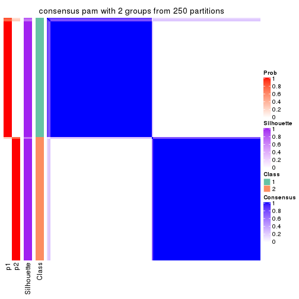</p>

</div>
<div id='tab-ATC-pam-consensus-heatmap-2'>
<pre><code class="r">consensus_heatmap(res, k = 3)
</code></pre>

<p>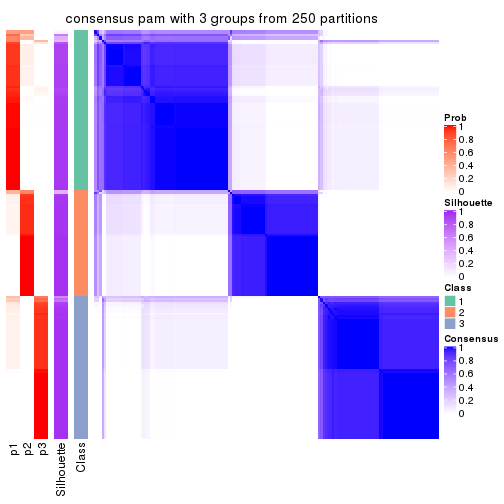</p>

</div>
<div id='tab-ATC-pam-consensus-heatmap-3'>
<pre><code class="r">consensus_heatmap(res, k = 4)
</code></pre>

<p>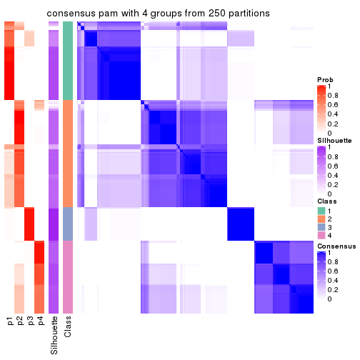</p>

</div>
<div id='tab-ATC-pam-consensus-heatmap-4'>
<pre><code class="r">consensus_heatmap(res, k = 5)
</code></pre>

<p>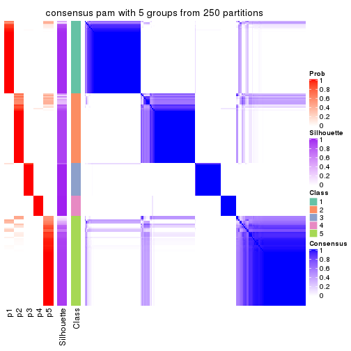</p>

</div>
<div id='tab-ATC-pam-consensus-heatmap-5'>
<pre><code class="r">consensus_heatmap(res, k = 6)
</code></pre>

<p>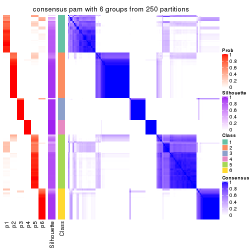</p>

</div>
</div>

Heatmaps for the membership of samples in all partitions to see how consistent they are:


<script>
$( function() {
	$( '#tabs-ATC-pam-membership-heatmap' ).tabs();
} );
</script>
<div id='tabs-ATC-pam-membership-heatmap'>
<ul>
<li><a href='#tab-ATC-pam-membership-heatmap-1'>k = 2</a></li>
<li><a href='#tab-ATC-pam-membership-heatmap-2'>k = 3</a></li>
<li><a href='#tab-ATC-pam-membership-heatmap-3'>k = 4</a></li>
<li><a href='#tab-ATC-pam-membership-heatmap-4'>k = 5</a></li>
<li><a href='#tab-ATC-pam-membership-heatmap-5'>k = 6</a></li>
</ul>
<div id='tab-ATC-pam-membership-heatmap-1'>
<pre><code class="r">membership_heatmap(res, k = 2)
</code></pre>

<p>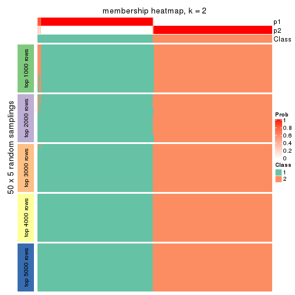</p>

</div>
<div id='tab-ATC-pam-membership-heatmap-2'>
<pre><code class="r">membership_heatmap(res, k = 3)
</code></pre>

<p>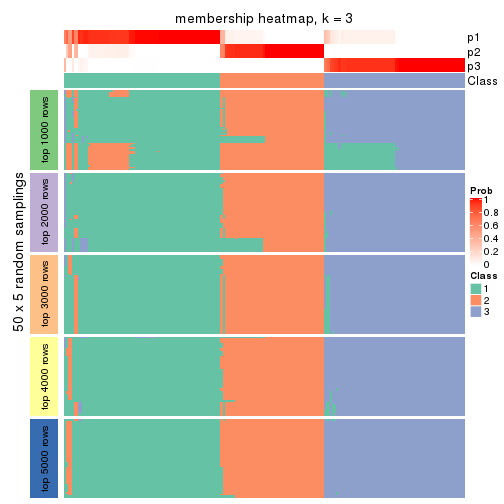</p>

</div>
<div id='tab-ATC-pam-membership-heatmap-3'>
<pre><code class="r">membership_heatmap(res, k = 4)
</code></pre>

<p>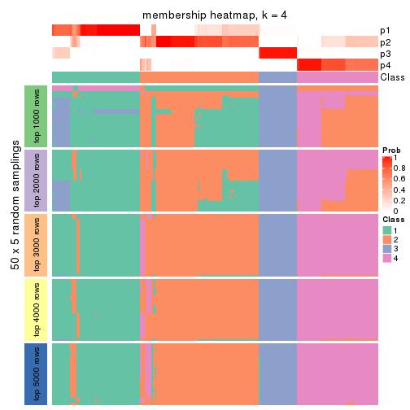</p>

</div>
<div id='tab-ATC-pam-membership-heatmap-4'>
<pre><code class="r">membership_heatmap(res, k = 5)
</code></pre>

<p>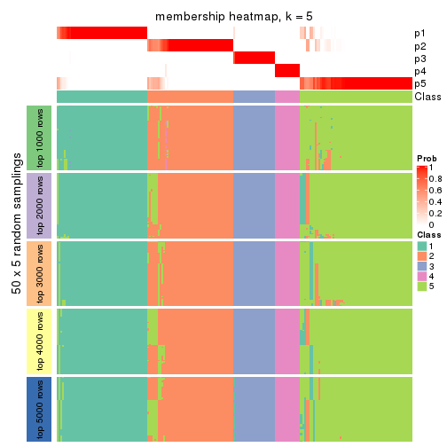</p>

</div>
<div id='tab-ATC-pam-membership-heatmap-5'>
<pre><code class="r">membership_heatmap(res, k = 6)
</code></pre>

<p>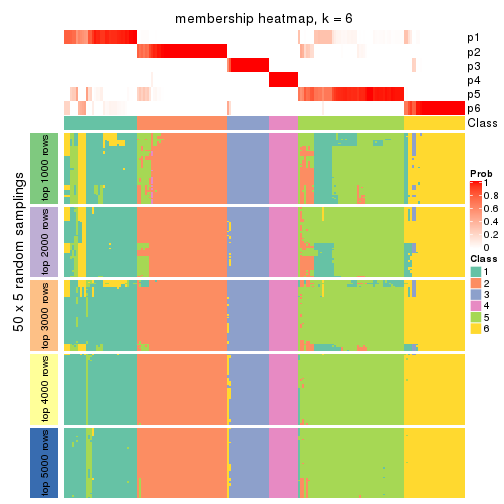</p>

</div>
</div>

As soon as we have had the classes for columns, we can look for signatures
which are significantly different between classes which can be candidate marks
for certain classes. Following are the heatmaps for signatures.


Signature heatmaps where rows are scaled:


<script>
$( function() {
	$( '#tabs-ATC-pam-get-signatures' ).tabs();
} );
</script>
<div id='tabs-ATC-pam-get-signatures'>
<ul>
<li><a href='#tab-ATC-pam-get-signatures-1'>k = 2</a></li>
<li><a href='#tab-ATC-pam-get-signatures-2'>k = 3</a></li>
<li><a href='#tab-ATC-pam-get-signatures-3'>k = 4</a></li>
<li><a href='#tab-ATC-pam-get-signatures-4'>k = 5</a></li>
<li><a href='#tab-ATC-pam-get-signatures-5'>k = 6</a></li>
</ul>
<div id='tab-ATC-pam-get-signatures-1'>
<pre><code class="r">get_signatures(res, k = 2)
</code></pre>

<p>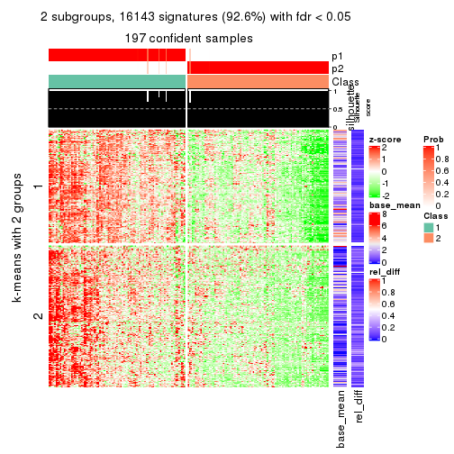</p>

</div>
<div id='tab-ATC-pam-get-signatures-2'>
<pre><code class="r">get_signatures(res, k = 3)
</code></pre>

<p>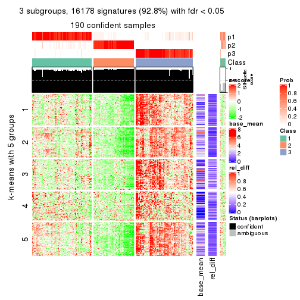</p>

</div>
<div id='tab-ATC-pam-get-signatures-3'>
<pre><code class="r">get_signatures(res, k = 4)
</code></pre>

<p>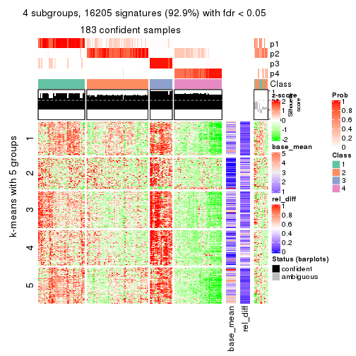</p>

</div>
<div id='tab-ATC-pam-get-signatures-4'>
<pre><code class="r">get_signatures(res, k = 5)
</code></pre>

<p>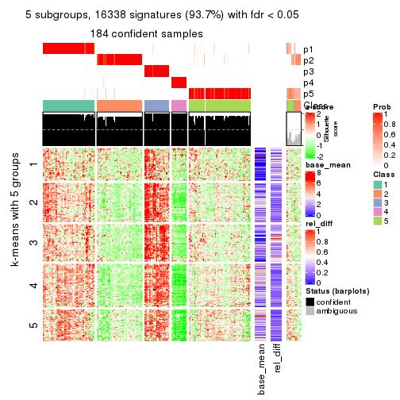</p>

</div>
<div id='tab-ATC-pam-get-signatures-5'>
<pre><code class="r">get_signatures(res, k = 6)
</code></pre>

<p>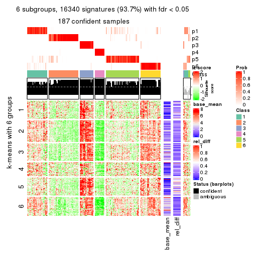</p>

</div>
</div>


Signature heatmaps where rows are not scaled:


<script>
$( function() {
	$( '#tabs-ATC-pam-get-signatures-no-scale' ).tabs();
} );
</script>
<div id='tabs-ATC-pam-get-signatures-no-scale'>
<ul>
<li><a href='#tab-ATC-pam-get-signatures-no-scale-1'>k = 2</a></li>
<li><a href='#tab-ATC-pam-get-signatures-no-scale-2'>k = 3</a></li>
<li><a href='#tab-ATC-pam-get-signatures-no-scale-3'>k = 4</a></li>
<li><a href='#tab-ATC-pam-get-signatures-no-scale-4'>k = 5</a></li>
<li><a href='#tab-ATC-pam-get-signatures-no-scale-5'>k = 6</a></li>
</ul>
<div id='tab-ATC-pam-get-signatures-no-scale-1'>
<pre><code class="r">get_signatures(res, k = 2, scale_rows = FALSE)
</code></pre>

<p>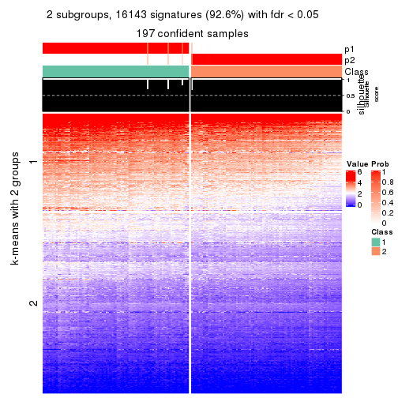</p>

</div>
<div id='tab-ATC-pam-get-signatures-no-scale-2'>
<pre><code class="r">get_signatures(res, k = 3, scale_rows = FALSE)
</code></pre>

<p>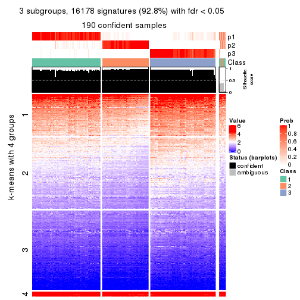</p>

</div>
<div id='tab-ATC-pam-get-signatures-no-scale-3'>
<pre><code class="r">get_signatures(res, k = 4, scale_rows = FALSE)
</code></pre>

<p>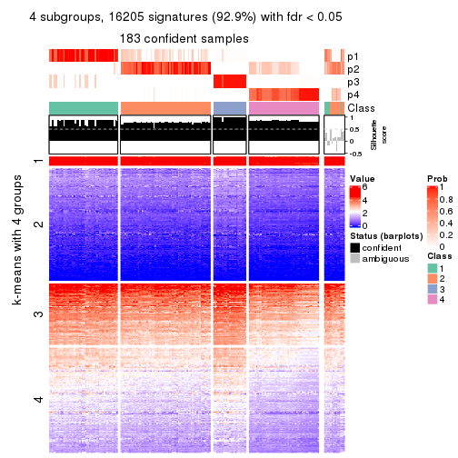</p>

</div>
<div id='tab-ATC-pam-get-signatures-no-scale-4'>
<pre><code class="r">get_signatures(res, k = 5, scale_rows = FALSE)
</code></pre>

<p>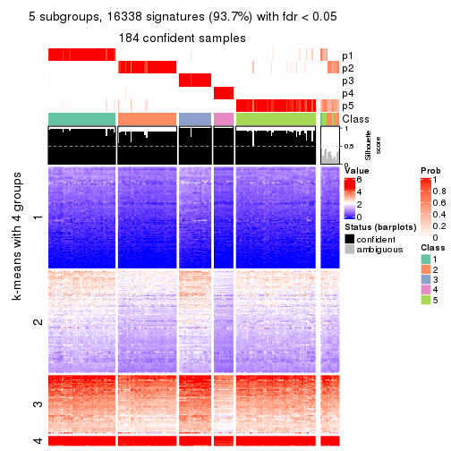</p>

</div>
<div id='tab-ATC-pam-get-signatures-no-scale-5'>
<pre><code class="r">get_signatures(res, k = 6, scale_rows = FALSE)
</code></pre>

<p>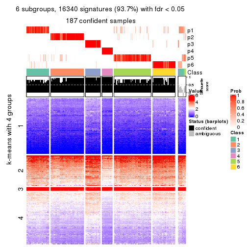</p>

</div>
</div>


Compare the overlap of signatures from different k:

```r
compare_signatures(res)
```

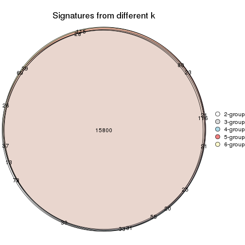

`get_signature()` returns a data frame invisibly. TO get the list of signatures, the function
call should be assigned to a variable explicitly. In following code, if `plot` argument is set
to `FALSE`, no heatmap is plotted while only the differential analysis is performed.

```r
# code only for demonstration
tb = get_signature(res, k = ..., plot = FALSE)
```

An example of the output of `tb` is:

```
#>   which_row         fdr    mean_1    mean_2 scaled_mean_1 scaled_mean_2 km
#> 1        38 0.042760348  8.373488  9.131774    -0.5533452     0.5164555  1
#> 2        40 0.018707592  7.106213  8.469186    -0.6173731     0.5762149  1
#> 3        55 0.019134737 10.221463 11.207825    -0.6159697     0.5749050  1
#> 4        59 0.006059896  5.921854  7.869574    -0.6899429     0.6439467  1
#> 5        60 0.018055526  8.928898 10.211722    -0.6204761     0.5791110  1
#> 6        98 0.009384629 15.714769 14.887706     0.6635654    -0.6193277  2
...
```

The columns in `tb` are:

1. `which_row`: row indices corresponding to the input matrix.
2. `fdr`: FDR for the differential test. 
3. `mean_x`: The mean value in group x.
4. `scaled_mean_x`: The mean value in group x after rows are scaled.
5. `km`: Row groups if k-means clustering is applied to rows.


UMAP plot which shows how samples are separated.


<script>
$( function() {
	$( '#tabs-ATC-pam-dimension-reduction' ).tabs();
} );
</script>
<div id='tabs-ATC-pam-dimension-reduction'>
<ul>
<li><a href='#tab-ATC-pam-dimension-reduction-1'>k = 2</a></li>
<li><a href='#tab-ATC-pam-dimension-reduction-2'>k = 3</a></li>
<li><a href='#tab-ATC-pam-dimension-reduction-3'>k = 4</a></li>
<li><a href='#tab-ATC-pam-dimension-reduction-4'>k = 5</a></li>
<li><a href='#tab-ATC-pam-dimension-reduction-5'>k = 6</a></li>
</ul>
<div id='tab-ATC-pam-dimension-reduction-1'>
<pre><code class="r">dimension_reduction(res, k = 2, method = &quot;UMAP&quot;)
</code></pre>

<p>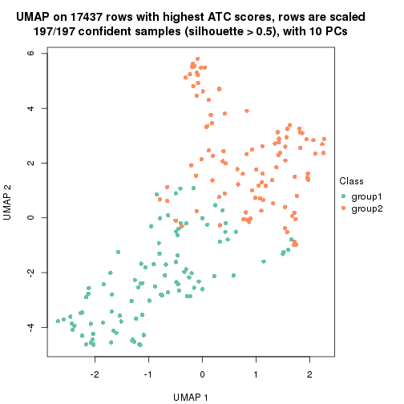</p>

</div>
<div id='tab-ATC-pam-dimension-reduction-2'>
<pre><code class="r">dimension_reduction(res, k = 3, method = &quot;UMAP&quot;)
</code></pre>

<p>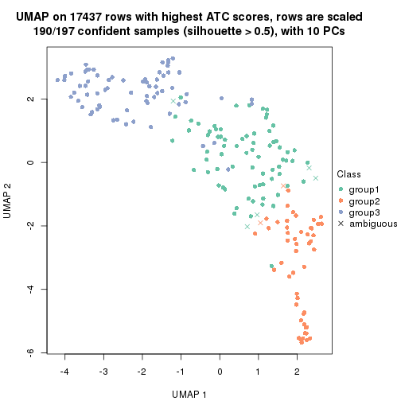</p>

</div>
<div id='tab-ATC-pam-dimension-reduction-3'>
<pre><code class="r">dimension_reduction(res, k = 4, method = &quot;UMAP&quot;)
</code></pre>

<p>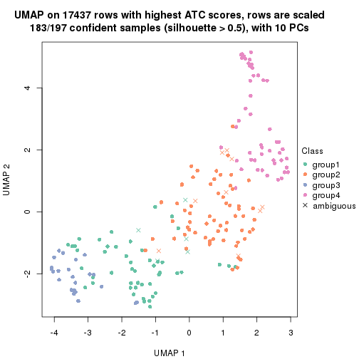</p>

</div>
<div id='tab-ATC-pam-dimension-reduction-4'>
<pre><code class="r">dimension_reduction(res, k = 5, method = &quot;UMAP&quot;)
</code></pre>

<p>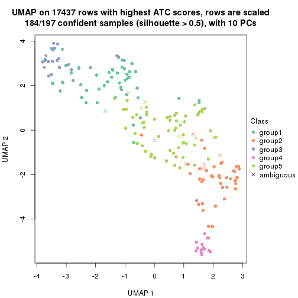</p>

</div>
<div id='tab-ATC-pam-dimension-reduction-5'>
<pre><code class="r">dimension_reduction(res, k = 6, method = &quot;UMAP&quot;)
</code></pre>

<p>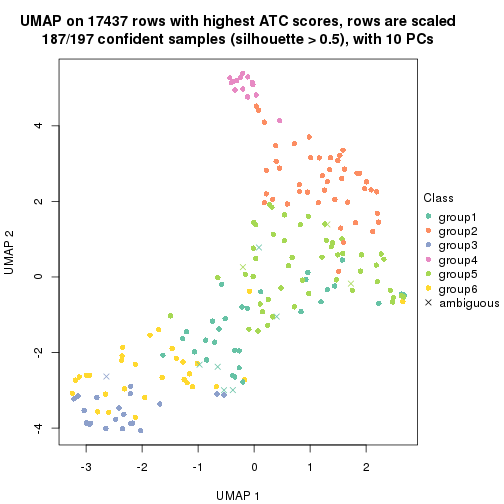</p>

</div>
</div>


Following heatmap shows how subgroups are split when increasing `k`:

```r
collect_classes(res)
```

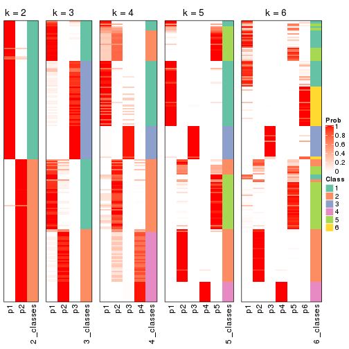


If matrix rows can be associated to genes, consider to use `GO_Enrichment(res,
...)` to perform function enrichment for the signature genes.


 

---------------------------------------------------


### ATC:mclust


The object with results only for a single top-value method and a single partition method 
can be extracted as:

```r
res = res_list["ATC", "mclust"]
# you can also extract it by
# res = res_list["ATC:mclust"]
```

A summary of `res` and all the functions that can be applied to it:

```r
res
```

```
#> A 'ConsensusPartition' object with k = 2, 3, 4, 5, 6.
#>   On a matrix with 17437 rows and 197 columns.
#>   Top rows (1000, 2000, 3000, 4000, 5000) are extracted by 'ATC' method.
#>   Subgroups are detected by 'mclust' method.
#>   Performed in total 1250 partitions by row resampling.
#>   Best k for subgroups seems to be 6.
#> 
#> Following methods can be applied to this 'ConsensusPartition' object:
#>  [1] "cola_report"             "collect_classes"         "collect_plots"          
#>  [4] "collect_stats"           "colnames"                "compare_signatures"     
#>  [7] "consensus_heatmap"       "dimension_reduction"     "functional_enrichment"  
#> [10] "get_anno_col"            "get_anno"                "get_classes"            
#> [13] "get_consensus"           "get_matrix"              "get_membership"         
#> [16] "get_param"               "get_signatures"          "get_stats"              
#> [19] "is_best_k"               "is_stable_k"             "membership_heatmap"     
#> [22] "ncol"                    "nrow"                    "plot_ecdf"              
#> [25] "rownames"                "select_partition_number" "show"                   
#> [28] "suggest_best_k"          "test_to_known_factors"
```

`collect_plots()` function collects all the plots made from `res` for all `k` (number of partitions)
into one single page to provide an easy and fast comparison between different `k`.

```r
collect_plots(res)
```

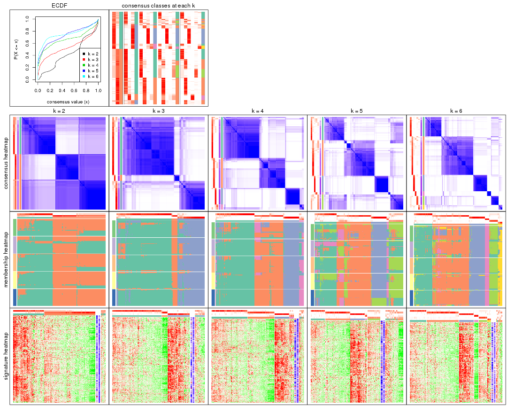

The plots are:

- The first row: a plot of the ECDF (Empirical cumulative distribution
  function) curves of the consensus matrix for each `k` and the heatmap of
  predicted classes for each `k`.
- The second row: heatmaps of the consensus matrix for each `k`.
- The third row: heatmaps of the membership matrix for each `k`.
- The fouth row: heatmaps of the signatures for each `k`.

All the plots in panels can be made by individual functions and they are
plotted later in this section.

`select_partition_number()` produces several plots showing different
statistics for choosing "optimized" `k`. There are following statistics:

- ECDF curves of the consensus matrix for each `k`;
- 1-PAC. [The PAC
  score](https://en.wikipedia.org/wiki/Consensus_clustering#Over-interpretation_potential_of_consensus_clustering)
  measures the proportion of the ambiguous subgrouping.
- Mean silhouette score.
- Concordance. The mean probability of fiting the consensus class ids in all
  partitions.
- Area increased. Denote $A_k$ as the area under the ECDF curve for current
  `k`, the area increased is defined as $A_k - A_{k-1}$.
- Rand index. The percent of pairs of samples that are both in a same cluster
  or both are not in a same cluster in the partition of k and k-1.
- Jaccard index. The ratio of pairs of samples are both in a same cluster in
  the partition of k and k-1 and the pairs of samples are both in a same
  cluster in the partition k or k-1.

The detailed explanations of these statistics can be found in [the cola
vignette](http://bioconductor.org/packages/devel/bioc/vignettes/cola/inst/doc/cola.html#toc_13).

Generally speaking, lower PAC score, higher mean silhouette score or higher
concordance corresponds to better partition. Rand index and Jaccard index
measure how similar the current partition is compared to partition with `k-1`.
If they are too similar, we won't accept `k` is better than `k-1`.

```r
select_partition_number(res)
```

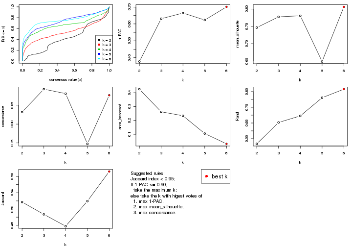

The numeric values for all these statistics can be obtained by `get_stats()`.

```r
get_stats(res)
```

```
#>   k 1-PAC mean_silhouette concordance area_increased  Rand Jaccard
#> 2 2 0.377           0.746       0.832          0.426 0.517   0.517
#> 3 3 0.631           0.777       0.892          0.262 0.653   0.487
#> 4 4 0.664           0.780       0.881          0.234 0.695   0.458
#> 5 5 0.623           0.649       0.748          0.105 0.811   0.519
#> 6 6 0.701           0.806       0.876          0.031 0.866   0.592
```

`suggest_best_k()` suggests the best $k$ based on these statistics. The rules are as follows:

- All $k$ with Jaccard index larger than 0.95 are removed because the increase of
  the partition number does not provides enough extra information. If all $k$ are removed,
  the best $k$ is assigned by `NA`.
- For $k$ with 1-PAC larger than 0.9, the maximal $k$ is taken as the "best k". Other $k$ is called "optional k".
- If it does not fit the second rule. The $k$ with the highest vote of highest
  1-PAC, mean silhouette and concordance is taken as the "best k".

```r
suggest_best_k(res)
```

```
#> [1] 6
```


Following shows the table of the partitions (You need to click the **show/hide
code output** link to see it). The membership matrix (columns with name `p*`)
is inferred by
[`clue::cl_consensus()`](https://www.rdocumentation.org/link/cl_consensus?package=clue)
function with the `SE` method. Basically the value in the membership matrix
represents the probability to belong to a certain group. The finall class
label for an item is determined with the group with highest probability it
belongs to.

In `get_classes()` function, the entropy is calculated from the membership
matrix and the silhouette score is calculated from the consensus matrix.


<script>
$( function() {
	$( '#tabs-ATC-mclust-get-classes' ).tabs();
} );
</script>
<div id='tabs-ATC-mclust-get-classes'>
<ul>
<li><a href='#tab-ATC-mclust-get-classes-1'>k = 2</a></li>
<li><a href='#tab-ATC-mclust-get-classes-2'>k = 3</a></li>
<li><a href='#tab-ATC-mclust-get-classes-3'>k = 4</a></li>
<li><a href='#tab-ATC-mclust-get-classes-4'>k = 5</a></li>
<li><a href='#tab-ATC-mclust-get-classes-5'>k = 6</a></li>
</ul>

<div id='tab-ATC-mclust-get-classes-1'>
<p><a id='tab-ATC-mclust-get-classes-1-a' style='color:#0366d6' href='#'>show/hide code output</a></p>
<pre><code class="r">cbind(get_classes(res, k = 2), get_membership(res, k = 2))
</code></pre>

<pre><code>#&gt;            class entropy silhouette    p1    p2
#&gt; SRR1380886     1  0.9909     0.2172 0.556 0.444
#&gt; SRR1074385     2  0.8327     0.7674 0.264 0.736
#&gt; SRR1374739     1  0.4815     0.8225 0.896 0.104
#&gt; SRR1097883     2  0.8327     0.7674 0.264 0.736
#&gt; SRR2167209     1  0.3733     0.8242 0.928 0.072
#&gt; SRR816541      2  0.0672     0.7725 0.008 0.992
#&gt; SRR663645      2  0.8327     0.7674 0.264 0.736
#&gt; SRR1381505     2  0.2236     0.7670 0.036 0.964
#&gt; SRR1416362     1  0.7883     0.7120 0.764 0.236
#&gt; SRR1318503     2  0.8327     0.7674 0.264 0.736
#&gt; SRR1341626     2  0.2236     0.7670 0.036 0.964
#&gt; SRR1382440     1  0.1633     0.8404 0.976 0.024
#&gt; SRR1088413     1  0.9323     0.5274 0.652 0.348
#&gt; SRR1082080     2  0.0000     0.7720 0.000 1.000
#&gt; SRR1455783     2  0.8327     0.7674 0.264 0.736
#&gt; SRR1447760     2  0.8327     0.7674 0.264 0.736
#&gt; SRR1487784     2  0.8327     0.7674 0.264 0.736
#&gt; SRR1331037     2  0.7883     0.7760 0.236 0.764
#&gt; SRR1095651     1  0.1633     0.8404 0.976 0.024
#&gt; SRR1078066     2  0.8327     0.7674 0.264 0.736
#&gt; SRR1120363     2  0.8327     0.7674 0.264 0.736
#&gt; SRR821231      1  0.7674     0.7354 0.776 0.224
#&gt; SRR1374373     2  0.8081     0.7735 0.248 0.752
#&gt; SRR1324519     2  0.8144     0.7696 0.252 0.748
#&gt; SRR1431121     1  0.9248     0.5493 0.660 0.340
#&gt; SRR1091032     2  0.0672     0.7746 0.008 0.992
#&gt; SRR1365575     2  0.2236     0.7670 0.036 0.964
#&gt; SRR1072972     1  0.4562     0.8252 0.904 0.096
#&gt; SRR1310690     2  0.2423     0.7768 0.040 0.960
#&gt; SRR1383037     1  0.1414     0.8380 0.980 0.020
#&gt; SRR1095479     1  0.1633     0.8404 0.976 0.024
#&gt; SRR1070403     1  0.2236     0.8383 0.964 0.036
#&gt; SRR1390203     1  0.8955     0.5974 0.688 0.312
#&gt; SRR1072007     2  0.1843     0.7724 0.028 0.972
#&gt; SRR1468787     2  0.7528     0.7795 0.216 0.784
#&gt; SRR1347959     2  0.8327     0.7674 0.264 0.736
#&gt; SRR1338513     1  0.1633     0.8404 0.976 0.024
#&gt; SRR812598      2  0.2236     0.7670 0.036 0.964
#&gt; SRR1446806     1  0.7299     0.7485 0.796 0.204
#&gt; SRR1394275     1  0.9286     0.5408 0.656 0.344
#&gt; SRR1443633     2  0.8327     0.7674 0.264 0.736
#&gt; SRR1087728     1  0.1633     0.8404 0.976 0.024
#&gt; SRR1098192     2  0.4022     0.7363 0.080 0.920
#&gt; SRR1093340     2  0.0376     0.7741 0.004 0.996
#&gt; SRR665405      1  0.0000     0.8186 1.000 0.000
#&gt; SRR657077      1  0.6801     0.7660 0.820 0.180
#&gt; SRR813208      1  0.1414     0.8380 0.980 0.020
#&gt; SRR1416074     2  0.0672     0.7757 0.008 0.992
#&gt; SRR1089688     2  1.0000     0.1502 0.496 0.504
#&gt; SRR1353461     1  0.1633     0.8404 0.976 0.024
#&gt; SRR1466321     2  0.8327     0.7674 0.264 0.736
#&gt; SRR1073021     2  0.8327     0.7674 0.264 0.736
#&gt; SRR1322816     2  0.0376     0.7741 0.004 0.996
#&gt; SRR1457727     2  0.8327     0.7674 0.264 0.736
#&gt; SRR1464226     2  0.9933     0.3244 0.452 0.548
#&gt; SRR1398863     2  0.8327     0.7674 0.264 0.736
#&gt; SRR1455631     1  0.9775     0.2187 0.588 0.412
#&gt; SRR1307808     2  0.8327     0.7674 0.264 0.736
#&gt; SRR1374585     2  0.2236     0.7670 0.036 0.964
#&gt; SRR1072104     2  0.1414     0.7739 0.020 0.980
#&gt; SRR1076868     2  0.7883     0.7760 0.236 0.764
#&gt; SRR1335984     2  0.0376     0.7741 0.004 0.996
#&gt; SRR1445939     1  0.9635     0.4233 0.612 0.388
#&gt; SRR1453047     2  0.1184     0.7780 0.016 0.984
#&gt; SRR1339788     1  0.9323     0.5324 0.652 0.348
#&gt; SRR1084323     1  0.6531     0.7812 0.832 0.168
#&gt; SRR1092937     1  0.8443     0.6682 0.728 0.272
#&gt; SRR1074090     2  0.0000     0.7720 0.000 1.000
#&gt; SRR1099833     1  0.1414     0.8380 0.980 0.020
#&gt; SRR1093434     1  0.3879     0.8315 0.924 0.076
#&gt; SRR1435857     2  0.8327     0.7674 0.264 0.736
#&gt; SRR1480347     2  0.0000     0.7720 0.000 1.000
#&gt; SRR1440787     2  0.2236     0.7670 0.036 0.964
#&gt; SRR1430202     1  0.9393     0.5125 0.644 0.356
#&gt; SRR1322730     2  0.4298     0.7288 0.088 0.912
#&gt; SRR811029      1  0.9608     0.3678 0.616 0.384
#&gt; SRR1390456     1  0.1414     0.8380 0.980 0.020
#&gt; SRR1381140     1  0.6801     0.7715 0.820 0.180
#&gt; SRR1388064     2  0.2423     0.7687 0.040 0.960
#&gt; SRR1093577     1  0.9393     0.4966 0.644 0.356
#&gt; SRR1414161     2  0.8555     0.7443 0.280 0.720
#&gt; SRR1328738     2  0.8327     0.7674 0.264 0.736
#&gt; SRR1311752     2  0.0376     0.7741 0.004 0.996
#&gt; SRR1445960     2  0.0376     0.7741 0.004 0.996
#&gt; SRR1403412     2  0.2423     0.7687 0.040 0.960
#&gt; SRR2166748     1  0.1184     0.8345 0.984 0.016
#&gt; SRR821666      2  0.2236     0.7670 0.036 0.964
#&gt; SRR1330746     1  0.2043     0.8394 0.968 0.032
#&gt; SRR1327872     2  0.2236     0.7670 0.036 0.964
#&gt; SRR1100800     2  0.8327     0.7674 0.264 0.736
#&gt; SRR1075174     2  0.8327     0.7674 0.264 0.736
#&gt; SRR1434436     2  0.8327     0.7674 0.264 0.736
#&gt; SRR1389409     2  0.2236     0.7670 0.036 0.964
#&gt; SRR1085310     1  0.1633     0.8404 0.976 0.024
#&gt; SRR1376718     2  0.2236     0.7670 0.036 0.964
#&gt; SRR808590      2  0.2236     0.7670 0.036 0.964
#&gt; SRR1084128     2  0.8327     0.7674 0.264 0.736
#&gt; SRR1361692     1  0.3733     0.8305 0.928 0.072
#&gt; SRR1431493     1  0.1633     0.8404 0.976 0.024
#&gt; SRR1409084     1  0.9850     0.2849 0.572 0.428
#&gt; SRR2166214     1  0.0000     0.8186 1.000 0.000
#&gt; SRR1324102     2  0.0938     0.7746 0.012 0.988
#&gt; SRR1079754     2  0.2603     0.7614 0.044 0.956
#&gt; SRR1442127     1  0.1633     0.8404 0.976 0.024
#&gt; SRR1076244     2  0.2236     0.7670 0.036 0.964
#&gt; SRR1330901     2  0.8327     0.7674 0.264 0.736
#&gt; SRR1073167     2  0.1184     0.7719 0.016 0.984
#&gt; SRR1357541     2  0.8661     0.7331 0.288 0.712
#&gt; SRR811607      2  0.8327     0.7674 0.264 0.736
#&gt; SRR1468931     1  0.1633     0.8404 0.976 0.024
#&gt; SRR1474908     1  0.4161     0.8209 0.916 0.084
#&gt; SRR1309875     2  0.2043     0.7684 0.032 0.968
#&gt; SRR598792      1  0.1843     0.8402 0.972 0.028
#&gt; SRR1088537     2  0.7453     0.7802 0.212 0.788
#&gt; SRR1457682     2  0.9209     0.6358 0.336 0.664
#&gt; SRR1454289     2  0.8327     0.7674 0.264 0.736
#&gt; SRR1069352     1  0.2948     0.8317 0.948 0.052
#&gt; SRR1472728     2  0.7815     0.7770 0.232 0.768
#&gt; SRR1091144     2  0.1843     0.7723 0.028 0.972
#&gt; SRR1319118     2  0.8327     0.7674 0.264 0.736
#&gt; SRR1403611     1  0.1414     0.8380 0.980 0.020
#&gt; SRR1397762     1  0.1633     0.8404 0.976 0.024
#&gt; SRR1317387     1  0.1414     0.8380 0.980 0.020
#&gt; SRR1376426     2  0.0376     0.7741 0.004 0.996
#&gt; SRR1097777     2  0.8443     0.7563 0.272 0.728
#&gt; SRR1365743     1  0.1633     0.8404 0.976 0.024
#&gt; SRR1458992     1  0.9170     0.5428 0.668 0.332
#&gt; SRR1089537     1  0.2043     0.8404 0.968 0.032
#&gt; SRR1397744     2  0.8327     0.7674 0.264 0.736
#&gt; SRR1453893     2  0.2236     0.7670 0.036 0.964
#&gt; SRR1098543     2  0.8327     0.7674 0.264 0.736
#&gt; SRR1321765     2  0.8327     0.7674 0.264 0.736
#&gt; SRR1440032     2  0.8386     0.7649 0.268 0.732
#&gt; SRR1404507     1  0.7376     0.7383 0.792 0.208
#&gt; SRR1404856     2  0.8327     0.7674 0.264 0.736
#&gt; SRR812745      1  0.7745     0.7199 0.772 0.228
#&gt; SRR1417524     1  0.1843     0.8406 0.972 0.028
#&gt; SRR1407334     2  0.2236     0.7670 0.036 0.964
#&gt; SRR1453991     2  0.8327     0.7674 0.264 0.736
#&gt; SRR1415938     1  0.5178     0.8146 0.884 0.116
#&gt; SRR1081259     2  0.8327     0.7674 0.264 0.736
#&gt; SRR1436187     2  0.2236     0.7670 0.036 0.964
#&gt; SRR1431948     1  0.1633     0.8404 0.976 0.024
#&gt; SRR1453277     1  0.8016     0.6931 0.756 0.244
#&gt; SRR1095407     2  0.8327     0.7674 0.264 0.736
#&gt; SRR1359694     2  0.8327     0.7674 0.264 0.736
#&gt; SRR656982      2  0.7815     0.7769 0.232 0.768
#&gt; SRR1354338     2  0.6048     0.7718 0.148 0.852
#&gt; SRR1088291     2  0.7453     0.7800 0.212 0.788
#&gt; SRR1080624     2  0.8327     0.7674 0.264 0.736
#&gt; SRR2166708     1  0.1633     0.8404 0.976 0.024
#&gt; SRR1393572     2  0.8327     0.7674 0.264 0.736
#&gt; SRR1429912     2  0.5842     0.7836 0.140 0.860
#&gt; SRR1421048     1  0.9580     0.4476 0.620 0.380
#&gt; SRR1434999     1  0.1633     0.8400 0.976 0.024
#&gt; SRR656457      1  0.7528     0.7338 0.784 0.216
#&gt; SRR1098928     1  0.1414     0.8380 0.980 0.020
#&gt; SRR1343967     2  0.0000     0.7720 0.000 1.000
#&gt; SRR1360766     2  0.8327     0.7674 0.264 0.736
#&gt; SRR1464724     2  0.2236     0.7670 0.036 0.964
#&gt; SRR1101542     2  0.2236     0.7670 0.036 0.964
#&gt; SRR1401528     1  0.1633     0.8404 0.976 0.024
#&gt; SRR1071519     1  0.2236     0.8383 0.964 0.036
#&gt; SRR1086070     1  0.5946     0.7982 0.856 0.144
#&gt; SRR1358645     2  0.8443     0.7619 0.272 0.728
#&gt; SRR819771      1  0.1414     0.8380 0.980 0.020
#&gt; SRR1418433     1  0.2236     0.8398 0.964 0.036
#&gt; SRR821050      2  0.8327     0.7674 0.264 0.736
#&gt; SRR1402091     2  0.0672     0.7746 0.008 0.992
#&gt; SRR1322028     2  0.6887     0.7822 0.184 0.816
#&gt; SRR1452556     2  0.2236     0.7670 0.036 0.964
#&gt; SRR1340047     1  0.9944     0.1150 0.544 0.456
#&gt; SRR1418302     2  0.8267     0.7661 0.260 0.740
#&gt; SRR1073991     2  0.8327     0.7674 0.264 0.736
#&gt; SRR1085187     2  0.2236     0.7670 0.036 0.964
#&gt; SRR1357618     1  0.1414     0.8380 0.980 0.020
#&gt; SRR1487764     1  0.6712     0.7682 0.824 0.176
#&gt; SRR1075336     2  0.8327     0.7674 0.264 0.736
#&gt; SRR1365471     2  0.0376     0.7725 0.004 0.996
#&gt; SRR1414613     1  0.9983     0.0667 0.524 0.476
#&gt; SRR658719      1  0.6973     0.7584 0.812 0.188
#&gt; SRR1475128     1  0.1633     0.8404 0.976 0.024
#&gt; SRR1367630     1  0.1843     0.8406 0.972 0.028
#&gt; SRR1481146     2  0.2778     0.7641 0.048 0.952
#&gt; SRR1465674     2  0.8327     0.7674 0.264 0.736
#&gt; SRR1327303     2  0.8327     0.7674 0.264 0.736
#&gt; SRR1390391     1  0.5294     0.8106 0.880 0.120
#&gt; SRR1326020     2  0.1184     0.7776 0.016 0.984
#&gt; SRR1381953     2  0.8608     0.7528 0.284 0.716
#&gt; SRR1082544     2  0.2423     0.7687 0.040 0.960
#&gt; SRR810761      1  0.8713     0.6423 0.708 0.292
#&gt; SRR1070764     1  0.1633     0.8404 0.976 0.024
#&gt; SRR1415919     1  0.1633     0.8404 0.976 0.024
#&gt; SRR1490404     2  0.0938     0.7770 0.012 0.988
#&gt; SRR1416773     2  0.8713     0.7471 0.292 0.708
#&gt; SRR1377492     2  0.2603     0.7819 0.044 0.956
#&gt; SRR1334314     2  0.8443     0.7630 0.272 0.728
</code></pre>

<script>
$('#tab-ATC-mclust-get-classes-1-a').parent().next().next().hide();
$('#tab-ATC-mclust-get-classes-1-a').click(function(){
  $('#tab-ATC-mclust-get-classes-1-a').parent().next().next().toggle();
  return(false);
});
</script>
</div>

<div id='tab-ATC-mclust-get-classes-2'>
<p><a id='tab-ATC-mclust-get-classes-2-a' style='color:#0366d6' href='#'>show/hide code output</a></p>
<pre><code class="r">cbind(get_classes(res, k = 3), get_membership(res, k = 3))
</code></pre>

<pre><code>#&gt;            class entropy silhouette    p1    p2    p3
#&gt; SRR1380886     1  0.1163     0.8686 0.972 0.000 0.028
#&gt; SRR1074385     1  0.1989     0.8768 0.948 0.048 0.004
#&gt; SRR1374739     1  0.6548     0.4415 0.616 0.012 0.372
#&gt; SRR1097883     1  0.1163     0.8686 0.972 0.000 0.028
#&gt; SRR2167209     3  0.3590     0.8101 0.076 0.028 0.896
#&gt; SRR816541      1  0.5216     0.6782 0.740 0.260 0.000
#&gt; SRR663645      1  0.1411     0.8783 0.964 0.036 0.000
#&gt; SRR1381505     2  0.5098     0.6786 0.248 0.752 0.000
#&gt; SRR1416362     1  0.6045     0.2832 0.620 0.000 0.380
#&gt; SRR1318503     1  0.0424     0.8786 0.992 0.008 0.000
#&gt; SRR1341626     1  0.5497     0.6262 0.708 0.292 0.000
#&gt; SRR1382440     3  0.0237     0.8477 0.004 0.000 0.996
#&gt; SRR1088413     1  0.3375     0.8705 0.908 0.048 0.044
#&gt; SRR1082080     1  0.2165     0.8718 0.936 0.064 0.000
#&gt; SRR1455783     1  0.1620     0.8747 0.964 0.012 0.024
#&gt; SRR1447760     1  0.0000     0.8767 1.000 0.000 0.000
#&gt; SRR1487784     1  0.0000     0.8767 1.000 0.000 0.000
#&gt; SRR1331037     1  0.0592     0.8790 0.988 0.012 0.000
#&gt; SRR1095651     3  0.0237     0.8477 0.004 0.000 0.996
#&gt; SRR1078066     1  0.0892     0.8796 0.980 0.020 0.000
#&gt; SRR1120363     1  0.1031     0.8698 0.976 0.000 0.024
#&gt; SRR821231      1  0.5940     0.7088 0.760 0.036 0.204
#&gt; SRR1374373     1  0.2356     0.8686 0.928 0.072 0.000
#&gt; SRR1324519     1  0.0237     0.8777 0.996 0.004 0.000
#&gt; SRR1431121     1  0.6260     0.0782 0.552 0.000 0.448
#&gt; SRR1091032     1  0.2796     0.8591 0.908 0.092 0.000
#&gt; SRR1365575     2  0.1399     0.9155 0.028 0.968 0.004
#&gt; SRR1072972     1  0.5635     0.7561 0.784 0.036 0.180
#&gt; SRR1310690     1  0.2711     0.8612 0.912 0.088 0.000
#&gt; SRR1383037     3  0.0000     0.8452 0.000 0.000 1.000
#&gt; SRR1095479     3  0.0237     0.8477 0.004 0.000 0.996
#&gt; SRR1070403     3  0.0424     0.8475 0.008 0.000 0.992
#&gt; SRR1390203     1  0.6180     0.1968 0.584 0.000 0.416
#&gt; SRR1072007     1  0.4887     0.7242 0.772 0.228 0.000
#&gt; SRR1468787     1  0.2165     0.8718 0.936 0.064 0.000
#&gt; SRR1347959     1  0.0424     0.8785 0.992 0.008 0.000
#&gt; SRR1338513     3  0.2229     0.8282 0.012 0.044 0.944
#&gt; SRR812598      1  0.8985     0.2980 0.544 0.292 0.164
#&gt; SRR1446806     3  0.6189     0.4532 0.364 0.004 0.632
#&gt; SRR1394275     1  0.1643     0.8596 0.956 0.000 0.044
#&gt; SRR1443633     1  0.1031     0.8698 0.976 0.000 0.024
#&gt; SRR1087728     3  0.0237     0.8477 0.004 0.000 0.996
#&gt; SRR1098192     3  0.9379     0.2226 0.208 0.288 0.504
#&gt; SRR1093340     1  0.2625     0.8632 0.916 0.084 0.000
#&gt; SRR665405      3  0.2050     0.8396 0.020 0.028 0.952
#&gt; SRR657077      1  0.5174     0.7971 0.824 0.048 0.128
#&gt; SRR813208      3  0.0000     0.8452 0.000 0.000 1.000
#&gt; SRR1416074     1  0.2165     0.8718 0.936 0.064 0.000
#&gt; SRR1089688     3  0.9262     0.2453 0.324 0.176 0.500
#&gt; SRR1353461     3  0.0424     0.8476 0.008 0.000 0.992
#&gt; SRR1466321     1  0.0000     0.8767 1.000 0.000 0.000
#&gt; SRR1073021     1  0.1411     0.8784 0.964 0.036 0.000
#&gt; SRR1322816     1  0.3192     0.8474 0.888 0.112 0.000
#&gt; SRR1457727     1  0.4346     0.7059 0.816 0.000 0.184
#&gt; SRR1464226     3  0.8080     0.5038 0.128 0.232 0.640
#&gt; SRR1398863     1  0.1399     0.8800 0.968 0.028 0.004
#&gt; SRR1455631     1  0.8037     0.3835 0.572 0.076 0.352
#&gt; SRR1307808     1  0.0000     0.8767 1.000 0.000 0.000
#&gt; SRR1374585     2  0.1163     0.9187 0.028 0.972 0.000
#&gt; SRR1072104     1  0.3340     0.8401 0.880 0.120 0.000
#&gt; SRR1076868     1  0.0424     0.8785 0.992 0.008 0.000
#&gt; SRR1335984     1  0.2165     0.8718 0.936 0.064 0.000
#&gt; SRR1445939     1  0.1031     0.8698 0.976 0.000 0.024
#&gt; SRR1453047     1  0.2165     0.8718 0.936 0.064 0.000
#&gt; SRR1339788     1  0.4605     0.6789 0.796 0.000 0.204
#&gt; SRR1084323     1  0.6295     0.0115 0.528 0.000 0.472
#&gt; SRR1092937     1  0.3899     0.8614 0.888 0.056 0.056
#&gt; SRR1074090     1  0.2165     0.8718 0.936 0.064 0.000
#&gt; SRR1099833     3  0.0000     0.8452 0.000 0.000 1.000
#&gt; SRR1093434     3  0.2711     0.7944 0.088 0.000 0.912
#&gt; SRR1435857     1  0.0747     0.8793 0.984 0.016 0.000
#&gt; SRR1480347     1  0.4750     0.7408 0.784 0.216 0.000
#&gt; SRR1440787     2  0.1163     0.9187 0.028 0.972 0.000
#&gt; SRR1430202     1  0.0237     0.8762 0.996 0.000 0.004
#&gt; SRR1322730     3  0.7844     0.4806 0.084 0.292 0.624
#&gt; SRR811029      3  0.8556     0.1197 0.416 0.096 0.488
#&gt; SRR1390456     3  0.0000     0.8452 0.000 0.000 1.000
#&gt; SRR1381140     3  0.5958     0.5523 0.300 0.008 0.692
#&gt; SRR1388064     3  0.7844     0.4806 0.084 0.292 0.624
#&gt; SRR1093577     1  0.3310     0.8713 0.908 0.064 0.028
#&gt; SRR1414161     1  0.1031     0.8698 0.976 0.000 0.024
#&gt; SRR1328738     1  0.0237     0.8779 0.996 0.004 0.000
#&gt; SRR1311752     1  0.2165     0.8718 0.936 0.064 0.000
#&gt; SRR1445960     1  0.2165     0.8718 0.936 0.064 0.000
#&gt; SRR1403412     1  0.5722     0.6206 0.704 0.292 0.004
#&gt; SRR2166748     3  0.2318     0.8370 0.028 0.028 0.944
#&gt; SRR821666      2  0.3816     0.8066 0.148 0.852 0.000
#&gt; SRR1330746     3  0.0424     0.8475 0.008 0.000 0.992
#&gt; SRR1327872     3  0.8013     0.4610 0.092 0.296 0.612
#&gt; SRR1100800     1  0.1031     0.8698 0.976 0.000 0.024
#&gt; SRR1075174     1  0.1031     0.8797 0.976 0.024 0.000
#&gt; SRR1434436     1  0.0000     0.8767 1.000 0.000 0.000
#&gt; SRR1389409     2  0.1163     0.9187 0.028 0.972 0.000
#&gt; SRR1085310     3  0.0829     0.8454 0.004 0.012 0.984
#&gt; SRR1376718     2  0.1163     0.9187 0.028 0.972 0.000
#&gt; SRR808590      2  0.1163     0.9187 0.028 0.972 0.000
#&gt; SRR1084128     1  0.0000     0.8767 1.000 0.000 0.000
#&gt; SRR1361692     3  0.2810     0.8299 0.036 0.036 0.928
#&gt; SRR1431493     3  0.0000     0.8452 0.000 0.000 1.000
#&gt; SRR1409084     1  0.1267     0.8718 0.972 0.004 0.024
#&gt; SRR2166214     3  0.2187     0.8384 0.024 0.028 0.948
#&gt; SRR1324102     1  0.4842     0.7292 0.776 0.224 0.000
#&gt; SRR1079754     3  0.7844     0.4806 0.084 0.292 0.624
#&gt; SRR1442127     3  0.0237     0.8477 0.004 0.000 0.996
#&gt; SRR1076244     3  0.9927    -0.0309 0.316 0.292 0.392
#&gt; SRR1330901     1  0.0000     0.8767 1.000 0.000 0.000
#&gt; SRR1073167     1  0.5497     0.6262 0.708 0.292 0.000
#&gt; SRR1357541     1  0.3038     0.8066 0.896 0.000 0.104
#&gt; SRR811607      1  0.0000     0.8767 1.000 0.000 0.000
#&gt; SRR1468931     3  0.0237     0.8477 0.004 0.000 0.996
#&gt; SRR1474908     3  0.3499     0.8128 0.072 0.028 0.900
#&gt; SRR1309875     1  0.5497     0.6262 0.708 0.292 0.000
#&gt; SRR598792      3  0.0237     0.8477 0.004 0.000 0.996
#&gt; SRR1088537     1  0.2537     0.8651 0.920 0.080 0.000
#&gt; SRR1457682     1  0.1031     0.8698 0.976 0.000 0.024
#&gt; SRR1454289     1  0.0000     0.8767 1.000 0.000 0.000
#&gt; SRR1069352     3  0.0892     0.8447 0.020 0.000 0.980
#&gt; SRR1472728     1  0.0747     0.8793 0.984 0.016 0.000
#&gt; SRR1091144     1  0.3412     0.8368 0.876 0.124 0.000
#&gt; SRR1319118     1  0.2187     0.8773 0.948 0.028 0.024
#&gt; SRR1403611     3  0.0000     0.8452 0.000 0.000 1.000
#&gt; SRR1397762     3  0.0237     0.8477 0.004 0.000 0.996
#&gt; SRR1317387     3  0.0000     0.8452 0.000 0.000 1.000
#&gt; SRR1376426     1  0.2165     0.8718 0.936 0.064 0.000
#&gt; SRR1097777     1  0.1163     0.8686 0.972 0.000 0.028
#&gt; SRR1365743     3  0.0237     0.8477 0.004 0.000 0.996
#&gt; SRR1458992     1  0.2796     0.8130 0.908 0.000 0.092
#&gt; SRR1089537     3  0.5689     0.6188 0.184 0.036 0.780
#&gt; SRR1397744     1  0.1163     0.8686 0.972 0.000 0.028
#&gt; SRR1453893     2  0.1163     0.9187 0.028 0.972 0.000
#&gt; SRR1098543     1  0.1163     0.8686 0.972 0.000 0.028
#&gt; SRR1321765     1  0.1031     0.8698 0.976 0.000 0.024
#&gt; SRR1440032     1  0.2165     0.8718 0.936 0.064 0.000
#&gt; SRR1404507     3  0.4652     0.7670 0.080 0.064 0.856
#&gt; SRR1404856     1  0.0000     0.8767 1.000 0.000 0.000
#&gt; SRR812745      1  0.6245     0.7150 0.760 0.060 0.180
#&gt; SRR1417524     3  0.2663     0.8213 0.024 0.044 0.932
#&gt; SRR1407334     3  0.7844     0.4806 0.084 0.292 0.624
#&gt; SRR1453991     1  0.1031     0.8698 0.976 0.000 0.024
#&gt; SRR1415938     3  0.4353     0.7469 0.156 0.008 0.836
#&gt; SRR1081259     1  0.1964     0.8738 0.944 0.056 0.000
#&gt; SRR1436187     2  0.1163     0.9187 0.028 0.972 0.000
#&gt; SRR1431948     3  0.0237     0.8477 0.004 0.000 0.996
#&gt; SRR1453277     1  0.5785     0.4660 0.668 0.000 0.332
#&gt; SRR1095407     1  0.0000     0.8767 1.000 0.000 0.000
#&gt; SRR1359694     1  0.0237     0.8777 0.996 0.004 0.000
#&gt; SRR656982      1  0.1964     0.8738 0.944 0.056 0.000
#&gt; SRR1354338     1  0.8489     0.4308 0.596 0.268 0.136
#&gt; SRR1088291     1  0.2165     0.8718 0.936 0.064 0.000
#&gt; SRR1080624     1  0.0237     0.8762 0.996 0.000 0.004
#&gt; SRR2166708     3  0.1182     0.8452 0.012 0.012 0.976
#&gt; SRR1393572     1  0.0892     0.8716 0.980 0.000 0.020
#&gt; SRR1429912     1  0.2165     0.8718 0.936 0.064 0.000
#&gt; SRR1421048     1  0.0747     0.8794 0.984 0.016 0.000
#&gt; SRR1434999     3  0.1877     0.8406 0.032 0.012 0.956
#&gt; SRR656457      1  0.5223     0.7547 0.800 0.024 0.176
#&gt; SRR1098928     3  0.0000     0.8452 0.000 0.000 1.000
#&gt; SRR1343967     1  0.3116     0.8504 0.892 0.108 0.000
#&gt; SRR1360766     1  0.0892     0.8796 0.980 0.020 0.000
#&gt; SRR1464724     1  0.6326     0.5971 0.688 0.292 0.020
#&gt; SRR1101542     2  0.1163     0.9187 0.028 0.972 0.000
#&gt; SRR1401528     3  0.0237     0.8477 0.004 0.000 0.996
#&gt; SRR1071519     3  0.1163     0.8393 0.028 0.000 0.972
#&gt; SRR1086070     3  0.5420     0.6398 0.240 0.008 0.752
#&gt; SRR1358645     1  0.0000     0.8767 1.000 0.000 0.000
#&gt; SRR819771      3  0.0000     0.8452 0.000 0.000 1.000
#&gt; SRR1418433     3  0.3484     0.8038 0.048 0.048 0.904
#&gt; SRR821050      1  0.0237     0.8762 0.996 0.000 0.004
#&gt; SRR1402091     1  0.2959     0.8544 0.900 0.100 0.000
#&gt; SRR1322028     1  0.2165     0.8718 0.936 0.064 0.000
#&gt; SRR1452556     2  0.1163     0.9187 0.028 0.972 0.000
#&gt; SRR1340047     1  0.0000     0.8767 1.000 0.000 0.000
#&gt; SRR1418302     1  0.2537     0.8651 0.920 0.080 0.000
#&gt; SRR1073991     1  0.1289     0.8668 0.968 0.000 0.032
#&gt; SRR1085187     2  0.5591     0.5560 0.304 0.696 0.000
#&gt; SRR1357618     3  0.0000     0.8452 0.000 0.000 1.000
#&gt; SRR1487764     3  0.7491     0.3778 0.324 0.056 0.620
#&gt; SRR1075336     1  0.0747     0.8793 0.984 0.016 0.000
#&gt; SRR1365471     1  0.5397     0.6465 0.720 0.280 0.000
#&gt; SRR1414613     1  0.0000     0.8767 1.000 0.000 0.000
#&gt; SRR658719      1  0.5847     0.7418 0.780 0.048 0.172
#&gt; SRR1475128     3  0.0424     0.8475 0.008 0.000 0.992
#&gt; SRR1367630     3  0.2793     0.8186 0.028 0.044 0.928
#&gt; SRR1481146     1  0.8487     0.4004 0.584 0.292 0.124
#&gt; SRR1465674     1  0.1163     0.8793 0.972 0.028 0.000
#&gt; SRR1327303     1  0.0592     0.8790 0.988 0.012 0.000
#&gt; SRR1390391     3  0.3755     0.7841 0.120 0.008 0.872
#&gt; SRR1326020     1  0.2448     0.8668 0.924 0.076 0.000
#&gt; SRR1381953     1  0.2537     0.8651 0.920 0.080 0.000
#&gt; SRR1082544     1  0.9334     0.2061 0.508 0.292 0.200
#&gt; SRR810761      1  0.2096     0.8576 0.944 0.004 0.052
#&gt; SRR1070764     3  0.0000     0.8452 0.000 0.000 1.000
#&gt; SRR1415919     3  0.0237     0.8477 0.004 0.000 0.996
#&gt; SRR1490404     1  0.2165     0.8718 0.936 0.064 0.000
#&gt; SRR1416773     1  0.4556     0.8269 0.860 0.060 0.080
#&gt; SRR1377492     1  0.1753     0.8758 0.952 0.048 0.000
#&gt; SRR1334314     1  0.1964     0.8738 0.944 0.056 0.000
</code></pre>

<script>
$('#tab-ATC-mclust-get-classes-2-a').parent().next().next().hide();
$('#tab-ATC-mclust-get-classes-2-a').click(function(){
  $('#tab-ATC-mclust-get-classes-2-a').parent().next().next().toggle();
  return(false);
});
</script>
</div>

<div id='tab-ATC-mclust-get-classes-3'>
<p><a id='tab-ATC-mclust-get-classes-3-a' style='color:#0366d6' href='#'>show/hide code output</a></p>
<pre><code class="r">cbind(get_classes(res, k = 4), get_membership(res, k = 4))
</code></pre>

<pre><code>#&gt;            class entropy silhouette    p1    p2    p3    p4
#&gt; SRR1380886     1  0.0000     0.8656 1.000 0.000 0.000 0.000
#&gt; SRR1074385     1  0.0336     0.8662 0.992 0.008 0.000 0.000
#&gt; SRR1374739     1  0.4250     0.5635 0.724 0.000 0.276 0.000
#&gt; SRR1097883     1  0.0000     0.8656 1.000 0.000 0.000 0.000
#&gt; SRR2167209     4  0.4262     0.6732 0.008 0.000 0.236 0.756
#&gt; SRR816541      2  0.1211     0.8506 0.040 0.960 0.000 0.000
#&gt; SRR663645      1  0.0937     0.8657 0.976 0.012 0.012 0.000
#&gt; SRR1381505     2  0.3893     0.7478 0.008 0.796 0.000 0.196
#&gt; SRR1416362     1  0.6531     0.1288 0.576 0.036 0.028 0.360
#&gt; SRR1318503     1  0.0921     0.8642 0.972 0.028 0.000 0.000
#&gt; SRR1341626     2  0.1211     0.8506 0.040 0.960 0.000 0.000
#&gt; SRR1382440     3  0.0000     0.9446 0.000 0.000 1.000 0.000
#&gt; SRR1088413     1  0.3933     0.6985 0.792 0.008 0.200 0.000
#&gt; SRR1082080     2  0.1389     0.8490 0.048 0.952 0.000 0.000
#&gt; SRR1455783     1  0.0000     0.8656 1.000 0.000 0.000 0.000
#&gt; SRR1447760     1  0.1211     0.8609 0.960 0.040 0.000 0.000
#&gt; SRR1487784     1  0.1302     0.8595 0.956 0.044 0.000 0.000
#&gt; SRR1331037     1  0.3123     0.7927 0.844 0.156 0.000 0.000
#&gt; SRR1095651     3  0.0000     0.9446 0.000 0.000 1.000 0.000
#&gt; SRR1078066     1  0.0336     0.8662 0.992 0.008 0.000 0.000
#&gt; SRR1120363     1  0.0000     0.8656 1.000 0.000 0.000 0.000
#&gt; SRR821231      3  0.4925    -0.1163 0.428 0.000 0.572 0.000
#&gt; SRR1374373     2  0.4955     0.0847 0.444 0.556 0.000 0.000
#&gt; SRR1324519     2  0.4606     0.5805 0.264 0.724 0.012 0.000
#&gt; SRR1431121     1  0.3853     0.7215 0.820 0.000 0.160 0.020
#&gt; SRR1091032     2  0.1389     0.8490 0.048 0.952 0.000 0.000
#&gt; SRR1365575     2  0.4053     0.7159 0.000 0.768 0.004 0.228
#&gt; SRR1072972     3  0.3907     0.3672 0.232 0.000 0.768 0.000
#&gt; SRR1310690     2  0.2011     0.8296 0.080 0.920 0.000 0.000
#&gt; SRR1383037     3  0.0000     0.9446 0.000 0.000 1.000 0.000
#&gt; SRR1095479     3  0.0000     0.9446 0.000 0.000 1.000 0.000
#&gt; SRR1070403     3  0.0188     0.9394 0.004 0.000 0.996 0.000
#&gt; SRR1390203     1  0.4440     0.7075 0.804 0.000 0.136 0.060
#&gt; SRR1072007     2  0.1211     0.8506 0.040 0.960 0.000 0.000
#&gt; SRR1468787     1  0.3942     0.7111 0.764 0.236 0.000 0.000
#&gt; SRR1347959     1  0.1389     0.8590 0.952 0.048 0.000 0.000
#&gt; SRR1338513     3  0.3205     0.7066 0.024 0.104 0.872 0.000
#&gt; SRR812598      2  0.2623     0.8432 0.028 0.908 0.064 0.000
#&gt; SRR1446806     4  0.7204     0.6396 0.332 0.000 0.156 0.512
#&gt; SRR1394275     1  0.0188     0.8628 0.996 0.000 0.000 0.004
#&gt; SRR1443633     1  0.0000     0.8656 1.000 0.000 0.000 0.000
#&gt; SRR1087728     3  0.0000     0.9446 0.000 0.000 1.000 0.000
#&gt; SRR1098192     2  0.2845     0.8390 0.028 0.896 0.076 0.000
#&gt; SRR1093340     2  0.1389     0.8490 0.048 0.952 0.000 0.000
#&gt; SRR665405      4  0.4262     0.6732 0.008 0.000 0.236 0.756
#&gt; SRR657077      1  0.4095     0.7092 0.792 0.016 0.192 0.000
#&gt; SRR813208      3  0.0000     0.9446 0.000 0.000 1.000 0.000
#&gt; SRR1416074     2  0.4888     0.2182 0.412 0.588 0.000 0.000
#&gt; SRR1089688     2  0.2830     0.8443 0.040 0.900 0.060 0.000
#&gt; SRR1353461     3  0.0672     0.9266 0.008 0.000 0.984 0.008
#&gt; SRR1466321     1  0.0336     0.8663 0.992 0.008 0.000 0.000
#&gt; SRR1073021     1  0.2868     0.8053 0.864 0.136 0.000 0.000
#&gt; SRR1322816     2  0.1389     0.8490 0.048 0.952 0.000 0.000
#&gt; SRR1457727     1  0.2973     0.7607 0.856 0.000 0.144 0.000
#&gt; SRR1464226     2  0.2845     0.8390 0.028 0.896 0.076 0.000
#&gt; SRR1398863     1  0.0336     0.8662 0.992 0.008 0.000 0.000
#&gt; SRR1455631     2  0.2845     0.8390 0.028 0.896 0.076 0.000
#&gt; SRR1307808     1  0.0000     0.8656 1.000 0.000 0.000 0.000
#&gt; SRR1374585     2  0.3907     0.7151 0.000 0.768 0.000 0.232
#&gt; SRR1072104     2  0.1389     0.8490 0.048 0.952 0.000 0.000
#&gt; SRR1076868     1  0.2921     0.8008 0.860 0.140 0.000 0.000
#&gt; SRR1335984     2  0.4989    -0.0356 0.472 0.528 0.000 0.000
#&gt; SRR1445939     1  0.0000     0.8656 1.000 0.000 0.000 0.000
#&gt; SRR1453047     1  0.4916     0.3899 0.576 0.424 0.000 0.000
#&gt; SRR1339788     1  0.3400     0.7143 0.820 0.000 0.180 0.000
#&gt; SRR1084323     1  0.3583     0.7109 0.816 0.000 0.180 0.004
#&gt; SRR1092937     1  0.3300     0.7722 0.848 0.008 0.144 0.000
#&gt; SRR1074090     2  0.1389     0.8490 0.048 0.952 0.000 0.000
#&gt; SRR1099833     3  0.0000     0.9446 0.000 0.000 1.000 0.000
#&gt; SRR1093434     3  0.1792     0.8186 0.068 0.000 0.932 0.000
#&gt; SRR1435857     1  0.0336     0.8662 0.992 0.008 0.000 0.000
#&gt; SRR1480347     2  0.1211     0.8506 0.040 0.960 0.000 0.000
#&gt; SRR1440787     2  0.3907     0.7151 0.000 0.768 0.000 0.232
#&gt; SRR1430202     1  0.0000     0.8656 1.000 0.000 0.000 0.000
#&gt; SRR1322730     2  0.2845     0.8390 0.028 0.896 0.076 0.000
#&gt; SRR811029      2  0.2845     0.8390 0.028 0.896 0.076 0.000
#&gt; SRR1390456     3  0.0000     0.9446 0.000 0.000 1.000 0.000
#&gt; SRR1381140     4  0.7269     0.6732 0.296 0.000 0.180 0.524
#&gt; SRR1388064     2  0.2915     0.8365 0.028 0.892 0.080 0.000
#&gt; SRR1093577     1  0.5304     0.6933 0.748 0.104 0.148 0.000
#&gt; SRR1414161     1  0.0000     0.8656 1.000 0.000 0.000 0.000
#&gt; SRR1328738     1  0.2081     0.8416 0.916 0.084 0.000 0.000
#&gt; SRR1311752     2  0.2345     0.8137 0.100 0.900 0.000 0.000
#&gt; SRR1445960     2  0.3356     0.7216 0.176 0.824 0.000 0.000
#&gt; SRR1403412     2  0.1211     0.8506 0.040 0.960 0.000 0.000
#&gt; SRR2166748     4  0.4360     0.6656 0.008 0.000 0.248 0.744
#&gt; SRR821666      2  0.3356     0.7551 0.000 0.824 0.000 0.176
#&gt; SRR1330746     3  0.0188     0.9394 0.004 0.000 0.996 0.000
#&gt; SRR1327872     2  0.2809     0.8432 0.028 0.904 0.064 0.004
#&gt; SRR1100800     1  0.0000     0.8656 1.000 0.000 0.000 0.000
#&gt; SRR1075174     1  0.0000     0.8656 1.000 0.000 0.000 0.000
#&gt; SRR1434436     1  0.0000     0.8656 1.000 0.000 0.000 0.000
#&gt; SRR1389409     2  0.3907     0.7151 0.000 0.768 0.000 0.232
#&gt; SRR1085310     3  0.0000     0.9446 0.000 0.000 1.000 0.000
#&gt; SRR1376718     2  0.3907     0.7151 0.000 0.768 0.000 0.232
#&gt; SRR808590      2  0.3907     0.7151 0.000 0.768 0.000 0.232
#&gt; SRR1084128     1  0.0000     0.8656 1.000 0.000 0.000 0.000
#&gt; SRR1361692     1  0.8963    -0.1509 0.464 0.092 0.240 0.204
#&gt; SRR1431493     3  0.0000     0.9446 0.000 0.000 1.000 0.000
#&gt; SRR1409084     1  0.0000     0.8656 1.000 0.000 0.000 0.000
#&gt; SRR2166214     4  0.4262     0.6732 0.008 0.000 0.236 0.756
#&gt; SRR1324102     2  0.1211     0.8506 0.040 0.960 0.000 0.000
#&gt; SRR1079754     2  0.2845     0.8390 0.028 0.896 0.076 0.000
#&gt; SRR1442127     3  0.0000     0.9446 0.000 0.000 1.000 0.000
#&gt; SRR1076244     2  0.2036     0.8493 0.032 0.936 0.032 0.000
#&gt; SRR1330901     1  0.0000     0.8656 1.000 0.000 0.000 0.000
#&gt; SRR1073167     2  0.1211     0.8506 0.040 0.960 0.000 0.000
#&gt; SRR1357541     1  0.1584     0.8443 0.952 0.000 0.036 0.012
#&gt; SRR811607      1  0.0000     0.8656 1.000 0.000 0.000 0.000
#&gt; SRR1468931     3  0.0000     0.9446 0.000 0.000 1.000 0.000
#&gt; SRR1474908     4  0.4408     0.6728 0.008 0.004 0.232 0.756
#&gt; SRR1309875     2  0.1211     0.8506 0.040 0.960 0.000 0.000
#&gt; SRR598792      3  0.0000     0.9446 0.000 0.000 1.000 0.000
#&gt; SRR1088537     2  0.1716     0.8407 0.064 0.936 0.000 0.000
#&gt; SRR1457682     1  0.0000     0.8656 1.000 0.000 0.000 0.000
#&gt; SRR1454289     1  0.0336     0.8662 0.992 0.008 0.000 0.000
#&gt; SRR1069352     3  0.0000     0.9446 0.000 0.000 1.000 0.000
#&gt; SRR1472728     1  0.2973     0.8024 0.856 0.144 0.000 0.000
#&gt; SRR1091144     2  0.1211     0.8506 0.040 0.960 0.000 0.000
#&gt; SRR1319118     1  0.0000     0.8656 1.000 0.000 0.000 0.000
#&gt; SRR1403611     3  0.0000     0.9446 0.000 0.000 1.000 0.000
#&gt; SRR1397762     3  0.0000     0.9446 0.000 0.000 1.000 0.000
#&gt; SRR1317387     3  0.0000     0.9446 0.000 0.000 1.000 0.000
#&gt; SRR1376426     2  0.2760     0.7829 0.128 0.872 0.000 0.000
#&gt; SRR1097777     1  0.0000     0.8656 1.000 0.000 0.000 0.000
#&gt; SRR1365743     3  0.0000     0.9446 0.000 0.000 1.000 0.000
#&gt; SRR1458992     1  0.1305     0.8619 0.960 0.036 0.004 0.000
#&gt; SRR1089537     3  0.0672     0.9181 0.008 0.008 0.984 0.000
#&gt; SRR1397744     1  0.0000     0.8656 1.000 0.000 0.000 0.000
#&gt; SRR1453893     2  0.3907     0.7151 0.000 0.768 0.000 0.232
#&gt; SRR1098543     1  0.0000     0.8656 1.000 0.000 0.000 0.000
#&gt; SRR1321765     1  0.0000     0.8656 1.000 0.000 0.000 0.000
#&gt; SRR1440032     1  0.3688     0.7416 0.792 0.208 0.000 0.000
#&gt; SRR1404507     2  0.3538     0.8155 0.024 0.868 0.096 0.012
#&gt; SRR1404856     1  0.0188     0.8661 0.996 0.004 0.000 0.000
#&gt; SRR812745      1  0.6299     0.2319 0.520 0.420 0.060 0.000
#&gt; SRR1417524     2  0.4808     0.6521 0.028 0.736 0.236 0.000
#&gt; SRR1407334     2  0.3030     0.8385 0.028 0.892 0.076 0.004
#&gt; SRR1453991     1  0.0000     0.8656 1.000 0.000 0.000 0.000
#&gt; SRR1415938     4  0.7449     0.5743 0.356 0.000 0.180 0.464
#&gt; SRR1081259     1  0.3311     0.7770 0.828 0.172 0.000 0.000
#&gt; SRR1436187     2  0.3907     0.7151 0.000 0.768 0.000 0.232
#&gt; SRR1431948     3  0.0000     0.9446 0.000 0.000 1.000 0.000
#&gt; SRR1453277     1  0.3647     0.7914 0.852 0.040 0.108 0.000
#&gt; SRR1095407     1  0.1661     0.8565 0.944 0.052 0.004 0.000
#&gt; SRR1359694     1  0.0707     0.8660 0.980 0.020 0.000 0.000
#&gt; SRR656982      1  0.3873     0.7208 0.772 0.228 0.000 0.000
#&gt; SRR1354338     2  0.2845     0.8390 0.028 0.896 0.076 0.000
#&gt; SRR1088291     1  0.3907     0.7156 0.768 0.232 0.000 0.000
#&gt; SRR1080624     1  0.0000     0.8656 1.000 0.000 0.000 0.000
#&gt; SRR2166708     4  0.5288     0.3434 0.008 0.000 0.472 0.520
#&gt; SRR1393572     1  0.0336     0.8662 0.992 0.008 0.000 0.000
#&gt; SRR1429912     1  0.4304     0.6443 0.716 0.284 0.000 0.000
#&gt; SRR1421048     1  0.3708     0.7820 0.832 0.148 0.020 0.000
#&gt; SRR1434999     1  0.7825    -0.3814 0.412 0.000 0.284 0.304
#&gt; SRR656457      1  0.3172     0.7536 0.840 0.000 0.160 0.000
#&gt; SRR1098928     3  0.0000     0.9446 0.000 0.000 1.000 0.000
#&gt; SRR1343967     2  0.1211     0.8506 0.040 0.960 0.000 0.000
#&gt; SRR1360766     1  0.0707     0.8659 0.980 0.020 0.000 0.000
#&gt; SRR1464724     2  0.1398     0.8510 0.040 0.956 0.004 0.000
#&gt; SRR1101542     2  0.3907     0.7151 0.000 0.768 0.000 0.232
#&gt; SRR1401528     3  0.0000     0.9446 0.000 0.000 1.000 0.000
#&gt; SRR1071519     3  0.0469     0.9279 0.012 0.000 0.988 0.000
#&gt; SRR1086070     4  0.7237     0.6735 0.296 0.000 0.176 0.528
#&gt; SRR1358645     1  0.1256     0.8644 0.964 0.028 0.008 0.000
#&gt; SRR819771      3  0.0000     0.9446 0.000 0.000 1.000 0.000
#&gt; SRR1418433     2  0.4446     0.7130 0.028 0.776 0.196 0.000
#&gt; SRR821050      1  0.0000     0.8656 1.000 0.000 0.000 0.000
#&gt; SRR1402091     2  0.1389     0.8490 0.048 0.952 0.000 0.000
#&gt; SRR1322028     1  0.4134     0.6779 0.740 0.260 0.000 0.000
#&gt; SRR1452556     2  0.3907     0.7151 0.000 0.768 0.000 0.232
#&gt; SRR1340047     1  0.0817     0.8648 0.976 0.024 0.000 0.000
#&gt; SRR1418302     2  0.2814     0.7781 0.132 0.868 0.000 0.000
#&gt; SRR1073991     1  0.1118     0.8529 0.964 0.000 0.036 0.000
#&gt; SRR1085187     2  0.3356     0.7542 0.000 0.824 0.000 0.176
#&gt; SRR1357618     3  0.0000     0.9446 0.000 0.000 1.000 0.000
#&gt; SRR1487764     2  0.2915     0.8365 0.028 0.892 0.080 0.000
#&gt; SRR1075336     1  0.0921     0.8642 0.972 0.028 0.000 0.000
#&gt; SRR1365471     2  0.1211     0.8506 0.040 0.960 0.000 0.000
#&gt; SRR1414613     1  0.0817     0.8648 0.976 0.024 0.000 0.000
#&gt; SRR658719      1  0.4225     0.7169 0.792 0.024 0.184 0.000
#&gt; SRR1475128     3  0.0188     0.9394 0.004 0.000 0.996 0.000
#&gt; SRR1367630     2  0.4872     0.6397 0.028 0.728 0.244 0.000
#&gt; SRR1481146     2  0.2845     0.8390 0.028 0.896 0.076 0.000
#&gt; SRR1465674     1  0.2216     0.8370 0.908 0.092 0.000 0.000
#&gt; SRR1327303     1  0.1118     0.8624 0.964 0.036 0.000 0.000
#&gt; SRR1390391     4  0.7563     0.6455 0.280 0.000 0.236 0.484
#&gt; SRR1326020     2  0.2530     0.8005 0.112 0.888 0.000 0.000
#&gt; SRR1381953     2  0.3726     0.6622 0.212 0.788 0.000 0.000
#&gt; SRR1082544     2  0.2773     0.8406 0.028 0.900 0.072 0.000
#&gt; SRR810761      1  0.1474     0.8441 0.948 0.000 0.052 0.000
#&gt; SRR1070764     3  0.0000     0.9446 0.000 0.000 1.000 0.000
#&gt; SRR1415919     3  0.0000     0.9446 0.000 0.000 1.000 0.000
#&gt; SRR1490404     1  0.4382     0.6286 0.704 0.296 0.000 0.000
#&gt; SRR1416773     1  0.5328     0.6638 0.724 0.212 0.064 0.000
#&gt; SRR1377492     1  0.4454     0.6105 0.692 0.308 0.000 0.000
#&gt; SRR1334314     1  0.2722     0.8307 0.904 0.032 0.064 0.000
</code></pre>

<script>
$('#tab-ATC-mclust-get-classes-3-a').parent().next().next().hide();
$('#tab-ATC-mclust-get-classes-3-a').click(function(){
  $('#tab-ATC-mclust-get-classes-3-a').parent().next().next().toggle();
  return(false);
});
</script>
</div>

<div id='tab-ATC-mclust-get-classes-4'>
<p><a id='tab-ATC-mclust-get-classes-4-a' style='color:#0366d6' href='#'>show/hide code output</a></p>
<pre><code class="r">cbind(get_classes(res, k = 5), get_membership(res, k = 5))
</code></pre>

<pre><code>#&gt;            class entropy silhouette    p1    p2    p3    p4    p5
#&gt; SRR1380886     1  0.4360     0.2508 0.728 0.008 0.024 0.000 0.240
#&gt; SRR1074385     5  0.5461     0.7394 0.432 0.032 0.016 0.000 0.520
#&gt; SRR1374739     3  0.6296     0.1298 0.180 0.004 0.548 0.000 0.268
#&gt; SRR1097883     5  0.4666     0.7547 0.412 0.016 0.000 0.000 0.572
#&gt; SRR2167209     4  0.2471     0.9734 0.000 0.000 0.136 0.864 0.000
#&gt; SRR816541      2  0.0290     0.7812 0.000 0.992 0.000 0.000 0.008
#&gt; SRR663645      1  0.3771     0.6140 0.836 0.072 0.020 0.000 0.072
#&gt; SRR1381505     2  0.4793     0.5973 0.000 0.700 0.000 0.068 0.232
#&gt; SRR1416362     1  0.5865     0.2981 0.592 0.060 0.028 0.320 0.000
#&gt; SRR1318503     5  0.6047     0.7139 0.376 0.124 0.000 0.000 0.500
#&gt; SRR1341626     2  0.0162     0.7808 0.000 0.996 0.000 0.004 0.000
#&gt; SRR1382440     3  0.0000     0.9404 0.000 0.000 1.000 0.000 0.000
#&gt; SRR1088413     5  0.7654     0.5816 0.244 0.088 0.196 0.000 0.472
#&gt; SRR1082080     2  0.0510     0.7815 0.000 0.984 0.000 0.000 0.016
#&gt; SRR1455783     5  0.4666     0.7547 0.412 0.016 0.000 0.000 0.572
#&gt; SRR1447760     1  0.2068     0.6828 0.904 0.092 0.000 0.004 0.000
#&gt; SRR1487784     1  0.2286     0.6694 0.888 0.108 0.000 0.004 0.000
#&gt; SRR1331037     1  0.5790     0.1294 0.500 0.408 0.000 0.000 0.092
#&gt; SRR1095651     3  0.0000     0.9404 0.000 0.000 1.000 0.000 0.000
#&gt; SRR1078066     5  0.5103     0.7574 0.404 0.040 0.000 0.000 0.556
#&gt; SRR1120363     1  0.3388     0.4713 0.792 0.008 0.000 0.000 0.200
#&gt; SRR821231      5  0.5965     0.2620 0.088 0.008 0.384 0.000 0.520
#&gt; SRR1374373     2  0.4434    -0.0242 0.004 0.536 0.000 0.000 0.460
#&gt; SRR1324519     1  0.5454     0.1224 0.488 0.452 0.060 0.000 0.000
#&gt; SRR1431121     1  0.1571     0.6878 0.936 0.000 0.060 0.004 0.000
#&gt; SRR1091032     2  0.0703     0.7805 0.000 0.976 0.000 0.000 0.024
#&gt; SRR1365575     2  0.6171     0.3232 0.000 0.472 0.008 0.104 0.416
#&gt; SRR1072972     3  0.2790     0.7689 0.052 0.000 0.880 0.000 0.068
#&gt; SRR1310690     2  0.0794     0.7795 0.000 0.972 0.000 0.000 0.028
#&gt; SRR1383037     3  0.0000     0.9404 0.000 0.000 1.000 0.000 0.000
#&gt; SRR1095479     3  0.0000     0.9404 0.000 0.000 1.000 0.000 0.000
#&gt; SRR1070403     3  0.0000     0.9404 0.000 0.000 1.000 0.000 0.000
#&gt; SRR1390203     1  0.1992     0.6937 0.924 0.000 0.044 0.032 0.000
#&gt; SRR1072007     2  0.0510     0.7815 0.000 0.984 0.000 0.000 0.016
#&gt; SRR1468787     2  0.4430    -0.0102 0.004 0.540 0.000 0.000 0.456
#&gt; SRR1347959     5  0.6364     0.6693 0.312 0.188 0.000 0.000 0.500
#&gt; SRR1338513     3  0.4682     0.2133 0.000 0.356 0.620 0.024 0.000
#&gt; SRR812598      2  0.2747     0.7598 0.000 0.896 0.048 0.020 0.036
#&gt; SRR1446806     1  0.4548     0.5057 0.716 0.000 0.052 0.232 0.000
#&gt; SRR1394275     1  0.0162     0.6998 0.996 0.000 0.004 0.000 0.000
#&gt; SRR1443633     5  0.4604     0.7427 0.428 0.012 0.000 0.000 0.560
#&gt; SRR1087728     3  0.0000     0.9404 0.000 0.000 1.000 0.000 0.000
#&gt; SRR1098192     2  0.2304     0.7604 0.000 0.908 0.068 0.020 0.004
#&gt; SRR1093340     2  0.0609     0.7811 0.000 0.980 0.000 0.000 0.020
#&gt; SRR665405      4  0.2629     0.9730 0.000 0.000 0.136 0.860 0.004
#&gt; SRR657077      2  0.8336    -0.3844 0.312 0.316 0.140 0.000 0.232
#&gt; SRR813208      3  0.0000     0.9404 0.000 0.000 1.000 0.000 0.000
#&gt; SRR1416074     2  0.0865     0.7795 0.004 0.972 0.000 0.000 0.024
#&gt; SRR1089688     2  0.2804     0.7454 0.012 0.880 0.092 0.016 0.000
#&gt; SRR1353461     3  0.0880     0.9000 0.032 0.000 0.968 0.000 0.000
#&gt; SRR1466321     1  0.1830     0.6948 0.932 0.052 0.000 0.004 0.012
#&gt; SRR1073021     5  0.6383     0.6167 0.228 0.256 0.000 0.000 0.516
#&gt; SRR1322816     2  0.0290     0.7810 0.000 0.992 0.000 0.000 0.008
#&gt; SRR1457727     5  0.5028     0.7460 0.412 0.012 0.016 0.000 0.560
#&gt; SRR1464226     2  0.2561     0.7450 0.000 0.884 0.096 0.020 0.000
#&gt; SRR1398863     5  0.4666     0.7571 0.412 0.016 0.000 0.000 0.572
#&gt; SRR1455631     2  0.2429     0.7631 0.000 0.904 0.068 0.020 0.008
#&gt; SRR1307808     1  0.0566     0.7032 0.984 0.012 0.000 0.004 0.000
#&gt; SRR1374585     2  0.5995     0.3168 0.000 0.468 0.000 0.112 0.420
#&gt; SRR1072104     2  0.0609     0.7811 0.000 0.980 0.000 0.000 0.020
#&gt; SRR1076868     1  0.5727     0.2205 0.560 0.340 0.000 0.000 0.100
#&gt; SRR1335984     2  0.1571     0.7622 0.004 0.936 0.000 0.000 0.060
#&gt; SRR1445939     1  0.0404     0.6970 0.988 0.000 0.000 0.000 0.012
#&gt; SRR1453047     2  0.1041     0.7766 0.004 0.964 0.000 0.000 0.032
#&gt; SRR1339788     5  0.5304     0.7323 0.408 0.008 0.036 0.000 0.548
#&gt; SRR1084323     1  0.1768     0.6815 0.924 0.000 0.072 0.004 0.000
#&gt; SRR1092937     5  0.7787     0.5901 0.248 0.160 0.124 0.000 0.468
#&gt; SRR1074090     2  0.0510     0.7815 0.000 0.984 0.000 0.000 0.016
#&gt; SRR1099833     3  0.0000     0.9404 0.000 0.000 1.000 0.000 0.000
#&gt; SRR1093434     3  0.2488     0.7661 0.000 0.004 0.872 0.000 0.124
#&gt; SRR1435857     5  0.4876     0.7594 0.396 0.028 0.000 0.000 0.576
#&gt; SRR1480347     2  0.0290     0.7796 0.000 0.992 0.000 0.000 0.008
#&gt; SRR1440787     2  0.5992     0.3221 0.000 0.472 0.000 0.112 0.416
#&gt; SRR1430202     1  0.0162     0.6993 0.996 0.000 0.000 0.004 0.000
#&gt; SRR1322730     2  0.2720     0.7441 0.000 0.880 0.096 0.020 0.004
#&gt; SRR811029      2  0.2550     0.7540 0.000 0.892 0.084 0.020 0.004
#&gt; SRR1390456     3  0.0000     0.9404 0.000 0.000 1.000 0.000 0.000
#&gt; SRR1381140     1  0.4619     0.5198 0.720 0.000 0.064 0.216 0.000
#&gt; SRR1388064     2  0.3602     0.7263 0.000 0.840 0.104 0.020 0.036
#&gt; SRR1093577     5  0.7878     0.5059 0.148 0.256 0.124 0.004 0.468
#&gt; SRR1414161     1  0.0404     0.6970 0.988 0.000 0.000 0.000 0.012
#&gt; SRR1328738     1  0.3396     0.6194 0.832 0.136 0.004 0.000 0.028
#&gt; SRR1311752     2  0.0771     0.7806 0.004 0.976 0.000 0.000 0.020
#&gt; SRR1445960     2  0.0794     0.7795 0.000 0.972 0.000 0.000 0.028
#&gt; SRR1403412     2  0.0727     0.7799 0.000 0.980 0.004 0.012 0.004
#&gt; SRR2166748     4  0.4237     0.8981 0.076 0.000 0.152 0.772 0.000
#&gt; SRR821666      2  0.4527     0.6296 0.000 0.732 0.000 0.064 0.204
#&gt; SRR1330746     3  0.0000     0.9404 0.000 0.000 1.000 0.000 0.000
#&gt; SRR1327872     2  0.3022     0.7536 0.000 0.880 0.064 0.020 0.036
#&gt; SRR1100800     5  0.4655     0.6543 0.476 0.012 0.000 0.000 0.512
#&gt; SRR1075174     1  0.3427     0.4000 0.796 0.012 0.000 0.000 0.192
#&gt; SRR1434436     1  0.1195     0.6883 0.960 0.012 0.000 0.000 0.028
#&gt; SRR1389409     2  0.5995     0.3168 0.000 0.468 0.000 0.112 0.420
#&gt; SRR1085310     3  0.0000     0.9404 0.000 0.000 1.000 0.000 0.000
#&gt; SRR1376718     2  0.5995     0.3168 0.000 0.468 0.000 0.112 0.420
#&gt; SRR808590      2  0.5995     0.3168 0.000 0.468 0.000 0.112 0.420
#&gt; SRR1084128     1  0.1117     0.6949 0.964 0.020 0.000 0.000 0.016
#&gt; SRR1361692     1  0.7566     0.0128 0.460 0.092 0.144 0.304 0.000
#&gt; SRR1431493     3  0.0000     0.9404 0.000 0.000 1.000 0.000 0.000
#&gt; SRR1409084     1  0.1808     0.6772 0.936 0.012 0.008 0.000 0.044
#&gt; SRR2166214     4  0.2629     0.9730 0.000 0.000 0.136 0.860 0.004
#&gt; SRR1324102     2  0.0162     0.7809 0.000 0.996 0.000 0.000 0.004
#&gt; SRR1079754     2  0.3022     0.7525 0.000 0.880 0.064 0.020 0.036
#&gt; SRR1442127     3  0.0000     0.9404 0.000 0.000 1.000 0.000 0.000
#&gt; SRR1076244     2  0.1728     0.7730 0.000 0.940 0.036 0.020 0.004
#&gt; SRR1330901     1  0.3970     0.3367 0.752 0.024 0.000 0.000 0.224
#&gt; SRR1073167     2  0.0000     0.7806 0.000 1.000 0.000 0.000 0.000
#&gt; SRR1357541     1  0.1310     0.6939 0.956 0.000 0.024 0.000 0.020
#&gt; SRR811607      1  0.1018     0.6943 0.968 0.016 0.000 0.000 0.016
#&gt; SRR1468931     3  0.0000     0.9404 0.000 0.000 1.000 0.000 0.000
#&gt; SRR1474908     4  0.2471     0.9734 0.000 0.000 0.136 0.864 0.000
#&gt; SRR1309875     2  0.0162     0.7800 0.000 0.996 0.000 0.000 0.004
#&gt; SRR598792      3  0.0000     0.9404 0.000 0.000 1.000 0.000 0.000
#&gt; SRR1088537     2  0.2930     0.6657 0.004 0.832 0.000 0.000 0.164
#&gt; SRR1457682     1  0.0865     0.6936 0.972 0.004 0.000 0.000 0.024
#&gt; SRR1454289     5  0.4736     0.7595 0.404 0.020 0.000 0.000 0.576
#&gt; SRR1069352     3  0.0000     0.9404 0.000 0.000 1.000 0.000 0.000
#&gt; SRR1472728     2  0.6762    -0.4227 0.340 0.388 0.000 0.000 0.272
#&gt; SRR1091144     2  0.0609     0.7811 0.000 0.980 0.000 0.000 0.020
#&gt; SRR1319118     5  0.4658     0.7585 0.408 0.016 0.000 0.000 0.576
#&gt; SRR1403611     3  0.0000     0.9404 0.000 0.000 1.000 0.000 0.000
#&gt; SRR1397762     3  0.0000     0.9404 0.000 0.000 1.000 0.000 0.000
#&gt; SRR1317387     3  0.0000     0.9404 0.000 0.000 1.000 0.000 0.000
#&gt; SRR1376426     2  0.1205     0.7730 0.004 0.956 0.000 0.000 0.040
#&gt; SRR1097777     1  0.0771     0.6957 0.976 0.000 0.004 0.000 0.020
#&gt; SRR1365743     3  0.0000     0.9404 0.000 0.000 1.000 0.000 0.000
#&gt; SRR1458992     1  0.3476     0.6695 0.836 0.076 0.000 0.088 0.000
#&gt; SRR1089537     3  0.2464     0.7542 0.016 0.096 0.888 0.000 0.000
#&gt; SRR1397744     5  0.4597     0.7452 0.424 0.012 0.000 0.000 0.564
#&gt; SRR1453893     2  0.5995     0.3168 0.000 0.468 0.000 0.112 0.420
#&gt; SRR1098543     5  0.4641     0.7042 0.456 0.012 0.000 0.000 0.532
#&gt; SRR1321765     5  0.4658     0.7585 0.408 0.016 0.000 0.000 0.576
#&gt; SRR1440032     5  0.6030     0.3787 0.116 0.420 0.000 0.000 0.464
#&gt; SRR1404507     2  0.6349     0.4604 0.004 0.608 0.100 0.252 0.036
#&gt; SRR1404856     1  0.1502     0.6996 0.940 0.056 0.000 0.004 0.000
#&gt; SRR812745      2  0.5101     0.6755 0.072 0.772 0.068 0.012 0.076
#&gt; SRR1417524     2  0.3229     0.7115 0.000 0.840 0.128 0.032 0.000
#&gt; SRR1407334     2  0.3550     0.7298 0.000 0.844 0.100 0.020 0.036
#&gt; SRR1453991     1  0.0955     0.6921 0.968 0.004 0.000 0.000 0.028
#&gt; SRR1415938     1  0.5512     0.3164 0.620 0.000 0.104 0.276 0.000
#&gt; SRR1081259     5  0.6219     0.4716 0.144 0.384 0.000 0.000 0.472
#&gt; SRR1436187     2  0.5995     0.3168 0.000 0.468 0.000 0.112 0.420
#&gt; SRR1431948     3  0.0000     0.9404 0.000 0.000 1.000 0.000 0.000
#&gt; SRR1453277     1  0.4716     0.6183 0.772 0.088 0.112 0.028 0.000
#&gt; SRR1095407     1  0.2170     0.6828 0.904 0.088 0.000 0.004 0.004
#&gt; SRR1359694     5  0.5751     0.7322 0.348 0.100 0.000 0.000 0.552
#&gt; SRR656982      2  0.3355     0.6314 0.012 0.804 0.000 0.000 0.184
#&gt; SRR1354338     2  0.2238     0.7640 0.000 0.912 0.064 0.020 0.004
#&gt; SRR1088291     2  0.4942    -0.0167 0.028 0.540 0.000 0.000 0.432
#&gt; SRR1080624     5  0.4658     0.7585 0.408 0.016 0.000 0.000 0.576
#&gt; SRR2166708     1  0.6756    -0.3261 0.372 0.000 0.264 0.364 0.000
#&gt; SRR1393572     5  0.4658     0.7585 0.408 0.016 0.000 0.000 0.576
#&gt; SRR1429912     2  0.4437    -0.0386 0.004 0.532 0.000 0.000 0.464
#&gt; SRR1421048     5  0.6820     0.5407 0.136 0.296 0.040 0.000 0.528
#&gt; SRR1434999     1  0.6194     0.0225 0.500 0.000 0.148 0.352 0.000
#&gt; SRR656457      1  0.4926     0.4236 0.716 0.000 0.152 0.000 0.132
#&gt; SRR1098928     3  0.0000     0.9404 0.000 0.000 1.000 0.000 0.000
#&gt; SRR1343967     2  0.0404     0.7813 0.000 0.988 0.000 0.000 0.012
#&gt; SRR1360766     1  0.5991    -0.5768 0.476 0.096 0.000 0.004 0.424
#&gt; SRR1464724     2  0.1525     0.7719 0.000 0.948 0.012 0.004 0.036
#&gt; SRR1101542     2  0.5992     0.3221 0.000 0.472 0.000 0.112 0.416
#&gt; SRR1401528     3  0.0000     0.9404 0.000 0.000 1.000 0.000 0.000
#&gt; SRR1071519     3  0.0290     0.9295 0.000 0.000 0.992 0.000 0.008
#&gt; SRR1086070     1  0.5150     0.3788 0.652 0.000 0.076 0.272 0.000
#&gt; SRR1358645     1  0.2354     0.6882 0.904 0.076 0.012 0.000 0.008
#&gt; SRR819771      3  0.0000     0.9404 0.000 0.000 1.000 0.000 0.000
#&gt; SRR1418433     2  0.4866     0.6266 0.000 0.732 0.116 0.148 0.004
#&gt; SRR821050      1  0.0771     0.6951 0.976 0.004 0.000 0.000 0.020
#&gt; SRR1402091     2  0.0510     0.7815 0.000 0.984 0.000 0.000 0.016
#&gt; SRR1322028     2  0.4420     0.0183 0.004 0.548 0.000 0.000 0.448
#&gt; SRR1452556     2  0.5995     0.3168 0.000 0.468 0.000 0.112 0.420
#&gt; SRR1340047     1  0.1952     0.6883 0.912 0.084 0.000 0.004 0.000
#&gt; SRR1418302     2  0.1329     0.7795 0.004 0.956 0.000 0.008 0.032
#&gt; SRR1073991     5  0.4658     0.7585 0.408 0.016 0.000 0.000 0.576
#&gt; SRR1085187     2  0.4619     0.6157 0.000 0.720 0.000 0.064 0.216
#&gt; SRR1357618     3  0.0000     0.9404 0.000 0.000 1.000 0.000 0.000
#&gt; SRR1487764     2  0.2664     0.7490 0.000 0.884 0.092 0.020 0.004
#&gt; SRR1075336     5  0.6133     0.7033 0.368 0.136 0.000 0.000 0.496
#&gt; SRR1365471     2  0.0290     0.7807 0.000 0.992 0.000 0.000 0.008
#&gt; SRR1414613     1  0.2069     0.6923 0.912 0.076 0.000 0.012 0.000
#&gt; SRR658719      2  0.6555     0.4764 0.180 0.616 0.144 0.000 0.060
#&gt; SRR1475128     3  0.0000     0.9404 0.000 0.000 1.000 0.000 0.000
#&gt; SRR1367630     2  0.4642     0.6354 0.000 0.752 0.140 0.104 0.004
#&gt; SRR1481146     2  0.2012     0.7648 0.000 0.920 0.060 0.020 0.000
#&gt; SRR1465674     5  0.6177     0.6946 0.304 0.164 0.000 0.000 0.532
#&gt; SRR1327303     1  0.2919     0.6583 0.868 0.104 0.000 0.004 0.024
#&gt; SRR1390391     1  0.5136     0.4935 0.692 0.000 0.128 0.180 0.000
#&gt; SRR1326020     2  0.0794     0.7795 0.000 0.972 0.000 0.000 0.028
#&gt; SRR1381953     2  0.2177     0.7498 0.008 0.908 0.000 0.004 0.080
#&gt; SRR1082544     2  0.2103     0.7657 0.000 0.920 0.056 0.020 0.004
#&gt; SRR810761      1  0.4487     0.5034 0.772 0.008 0.096 0.000 0.124
#&gt; SRR1070764     3  0.0000     0.9404 0.000 0.000 1.000 0.000 0.000
#&gt; SRR1415919     3  0.0000     0.9404 0.000 0.000 1.000 0.000 0.000
#&gt; SRR1490404     2  0.1661     0.7674 0.024 0.940 0.000 0.000 0.036
#&gt; SRR1416773     2  0.5629     0.6286 0.064 0.728 0.056 0.016 0.136
#&gt; SRR1377492     2  0.0898     0.7813 0.008 0.972 0.000 0.000 0.020
#&gt; SRR1334314     5  0.7870     0.5614 0.240 0.244 0.076 0.004 0.436
</code></pre>

<script>
$('#tab-ATC-mclust-get-classes-4-a').parent().next().next().hide();
$('#tab-ATC-mclust-get-classes-4-a').click(function(){
  $('#tab-ATC-mclust-get-classes-4-a').parent().next().next().toggle();
  return(false);
});
</script>
</div>

<div id='tab-ATC-mclust-get-classes-5'>
<p><a id='tab-ATC-mclust-get-classes-5-a' style='color:#0366d6' href='#'>show/hide code output</a></p>
<pre><code class="r">cbind(get_classes(res, k = 6), get_membership(res, k = 6))
</code></pre>

<pre><code>#&gt;            class entropy silhouette    p1    p2    p3    p4    p5    p6
#&gt; SRR1380886     1  0.3923     0.2135 0.580 0.004 0.000 0.000 0.416 0.000
#&gt; SRR1074385     5  0.4564     0.7614 0.132 0.140 0.008 0.000 0.720 0.000
#&gt; SRR1374739     3  0.2856     0.7757 0.076 0.000 0.856 0.000 0.068 0.000
#&gt; SRR1097883     5  0.2146     0.9442 0.116 0.004 0.000 0.000 0.880 0.000
#&gt; SRR2167209     6  0.1007     0.7249 0.000 0.000 0.044 0.000 0.000 0.956
#&gt; SRR816541      2  0.0146     0.8331 0.000 0.996 0.000 0.000 0.004 0.000
#&gt; SRR663645      1  0.3407     0.6779 0.800 0.168 0.016 0.000 0.016 0.000
#&gt; SRR1381505     2  0.3965     0.5152 0.000 0.604 0.008 0.388 0.000 0.000
#&gt; SRR1416362     1  0.3890     0.2612 0.596 0.004 0.000 0.000 0.000 0.400
#&gt; SRR1318503     2  0.5949    -0.1552 0.220 0.416 0.000 0.000 0.364 0.000
#&gt; SRR1341626     2  0.0405     0.8336 0.000 0.988 0.000 0.004 0.008 0.000
#&gt; SRR1382440     3  0.0146     0.9475 0.000 0.000 0.996 0.000 0.004 0.000
#&gt; SRR1088413     2  0.6596     0.4689 0.080 0.524 0.192 0.000 0.204 0.000
#&gt; SRR1082080     2  0.1500     0.8270 0.000 0.936 0.000 0.000 0.052 0.012
#&gt; SRR1455783     5  0.2146     0.9442 0.116 0.004 0.000 0.000 0.880 0.000
#&gt; SRR1447760     1  0.0547     0.8791 0.980 0.020 0.000 0.000 0.000 0.000
#&gt; SRR1487784     1  0.0632     0.8777 0.976 0.024 0.000 0.000 0.000 0.000
#&gt; SRR1331037     2  0.2462     0.7921 0.132 0.860 0.000 0.000 0.004 0.004
#&gt; SRR1095651     3  0.0146     0.9473 0.000 0.000 0.996 0.000 0.004 0.000
#&gt; SRR1078066     5  0.3227     0.8924 0.116 0.060 0.000 0.000 0.824 0.000
#&gt; SRR1120363     1  0.3309     0.6085 0.720 0.000 0.000 0.000 0.280 0.000
#&gt; SRR821231      3  0.4846     0.2816 0.068 0.000 0.576 0.000 0.356 0.000
#&gt; SRR1374373     2  0.1218     0.8357 0.028 0.956 0.004 0.000 0.012 0.000
#&gt; SRR1324519     2  0.4435     0.5718 0.308 0.648 0.000 0.000 0.004 0.040
#&gt; SRR1431121     1  0.1977     0.8718 0.920 0.000 0.008 0.000 0.032 0.040
#&gt; SRR1091032     2  0.0146     0.8331 0.000 0.996 0.000 0.000 0.004 0.000
#&gt; SRR1365575     4  0.0622     0.9876 0.000 0.012 0.000 0.980 0.000 0.008
#&gt; SRR1072972     3  0.1616     0.8743 0.048 0.000 0.932 0.000 0.020 0.000
#&gt; SRR1310690     2  0.0951     0.8353 0.008 0.968 0.004 0.000 0.020 0.000
#&gt; SRR1383037     3  0.1152     0.9274 0.000 0.000 0.952 0.004 0.000 0.044
#&gt; SRR1095479     3  0.0146     0.9475 0.000 0.000 0.996 0.000 0.004 0.000
#&gt; SRR1070403     3  0.0260     0.9457 0.000 0.000 0.992 0.000 0.008 0.000
#&gt; SRR1390203     1  0.1757     0.8651 0.928 0.000 0.008 0.000 0.012 0.052
#&gt; SRR1072007     2  0.0146     0.8331 0.000 0.996 0.000 0.000 0.004 0.000
#&gt; SRR1468787     2  0.1693     0.8275 0.044 0.932 0.000 0.000 0.020 0.004
#&gt; SRR1347959     2  0.3141     0.7771 0.124 0.832 0.000 0.000 0.040 0.004
#&gt; SRR1338513     2  0.5113     0.4666 0.000 0.572 0.360 0.000 0.040 0.028
#&gt; SRR812598      2  0.5014     0.7382 0.000 0.740 0.076 0.116 0.032 0.036
#&gt; SRR1446806     1  0.2020     0.8301 0.896 0.000 0.000 0.000 0.008 0.096
#&gt; SRR1394275     1  0.1003     0.8840 0.964 0.000 0.000 0.000 0.020 0.016
#&gt; SRR1443633     5  0.2191     0.9428 0.120 0.004 0.000 0.000 0.876 0.000
#&gt; SRR1087728     3  0.0508     0.9477 0.000 0.000 0.984 0.004 0.000 0.012
#&gt; SRR1098192     2  0.3772     0.7973 0.000 0.828 0.080 0.020 0.036 0.036
#&gt; SRR1093340     2  0.0146     0.8331 0.000 0.996 0.000 0.000 0.004 0.000
#&gt; SRR665405      6  0.1007     0.7249 0.000 0.000 0.044 0.000 0.000 0.956
#&gt; SRR657077      2  0.4473     0.7734 0.092 0.756 0.124 0.000 0.024 0.004
#&gt; SRR813208      3  0.0508     0.9477 0.000 0.000 0.984 0.004 0.000 0.012
#&gt; SRR1416074     2  0.1858     0.8200 0.000 0.912 0.000 0.000 0.076 0.012
#&gt; SRR1089688     2  0.3882     0.8058 0.020 0.828 0.080 0.008 0.032 0.032
#&gt; SRR1353461     3  0.1471     0.9033 0.000 0.000 0.932 0.004 0.000 0.064
#&gt; SRR1466321     1  0.0713     0.8764 0.972 0.028 0.000 0.000 0.000 0.000
#&gt; SRR1073021     2  0.4640     0.6097 0.108 0.680 0.000 0.000 0.212 0.000
#&gt; SRR1322816     2  0.1802     0.8212 0.000 0.916 0.000 0.000 0.072 0.012
#&gt; SRR1457727     5  0.2146     0.9442 0.116 0.004 0.000 0.000 0.880 0.000
#&gt; SRR1464226     2  0.3737     0.8008 0.004 0.832 0.080 0.012 0.036 0.036
#&gt; SRR1398863     5  0.2446     0.9386 0.124 0.012 0.000 0.000 0.864 0.000
#&gt; SRR1455631     2  0.3438     0.8034 0.004 0.840 0.084 0.000 0.036 0.036
#&gt; SRR1307808     1  0.0146     0.8823 0.996 0.004 0.000 0.000 0.000 0.000
#&gt; SRR1374585     4  0.0363     0.9958 0.000 0.012 0.000 0.988 0.000 0.000
#&gt; SRR1072104     2  0.0291     0.8335 0.004 0.992 0.000 0.000 0.004 0.000
#&gt; SRR1076868     2  0.3329     0.7135 0.236 0.756 0.000 0.000 0.004 0.004
#&gt; SRR1335984     2  0.0725     0.8346 0.012 0.976 0.000 0.000 0.000 0.012
#&gt; SRR1445939     1  0.0937     0.8829 0.960 0.000 0.000 0.000 0.040 0.000
#&gt; SRR1453047     2  0.1858     0.8200 0.000 0.912 0.000 0.000 0.076 0.012
#&gt; SRR1339788     5  0.2592     0.9329 0.116 0.004 0.016 0.000 0.864 0.000
#&gt; SRR1084323     1  0.1875     0.8688 0.928 0.000 0.032 0.000 0.020 0.020
#&gt; SRR1092937     2  0.4425     0.7670 0.084 0.756 0.128 0.000 0.032 0.000
#&gt; SRR1074090     2  0.1858     0.8200 0.000 0.912 0.000 0.000 0.076 0.012
#&gt; SRR1099833     3  0.0748     0.9448 0.000 0.000 0.976 0.004 0.004 0.016
#&gt; SRR1093434     3  0.2112     0.8414 0.016 0.000 0.896 0.000 0.088 0.000
#&gt; SRR1435857     5  0.2662     0.9272 0.120 0.024 0.000 0.000 0.856 0.000
#&gt; SRR1480347     2  0.2114     0.8193 0.000 0.904 0.000 0.008 0.076 0.012
#&gt; SRR1440787     4  0.0632     0.9735 0.000 0.024 0.000 0.976 0.000 0.000
#&gt; SRR1430202     1  0.0000     0.8827 1.000 0.000 0.000 0.000 0.000 0.000
#&gt; SRR1322730     2  0.4453     0.7763 0.000 0.788 0.080 0.060 0.036 0.036
#&gt; SRR811029      2  0.3496     0.8050 0.008 0.840 0.080 0.000 0.036 0.036
#&gt; SRR1390456     3  0.0508     0.9477 0.000 0.000 0.984 0.004 0.000 0.012
#&gt; SRR1381140     1  0.2711     0.8072 0.860 0.000 0.012 0.000 0.012 0.116
#&gt; SRR1388064     2  0.5468     0.7180 0.000 0.708 0.088 0.116 0.032 0.056
#&gt; SRR1093577     2  0.4994     0.7404 0.076 0.720 0.120 0.000 0.084 0.000
#&gt; SRR1414161     1  0.0937     0.8829 0.960 0.000 0.000 0.000 0.040 0.000
#&gt; SRR1328738     1  0.2003     0.7739 0.884 0.116 0.000 0.000 0.000 0.000
#&gt; SRR1311752     2  0.1858     0.8200 0.000 0.912 0.000 0.000 0.076 0.012
#&gt; SRR1445960     2  0.0405     0.8343 0.008 0.988 0.000 0.000 0.000 0.004
#&gt; SRR1403412     2  0.2478     0.8255 0.000 0.904 0.024 0.012 0.028 0.032
#&gt; SRR2166748     6  0.2165     0.7191 0.008 0.000 0.108 0.000 0.000 0.884
#&gt; SRR821666      2  0.3847     0.3687 0.000 0.544 0.000 0.456 0.000 0.000
#&gt; SRR1330746     3  0.0146     0.9475 0.000 0.000 0.996 0.000 0.004 0.000
#&gt; SRR1327872     2  0.4865     0.7360 0.000 0.740 0.048 0.148 0.032 0.032
#&gt; SRR1100800     5  0.2362     0.9314 0.136 0.004 0.000 0.000 0.860 0.000
#&gt; SRR1075174     1  0.1398     0.8796 0.940 0.008 0.000 0.000 0.052 0.000
#&gt; SRR1434436     1  0.0790     0.8849 0.968 0.000 0.000 0.000 0.032 0.000
#&gt; SRR1389409     4  0.0363     0.9958 0.000 0.012 0.000 0.988 0.000 0.000
#&gt; SRR1085310     3  0.0291     0.9481 0.000 0.000 0.992 0.000 0.004 0.004
#&gt; SRR1376718     4  0.0363     0.9958 0.000 0.012 0.000 0.988 0.000 0.000
#&gt; SRR808590      4  0.0363     0.9958 0.000 0.012 0.000 0.988 0.000 0.000
#&gt; SRR1084128     1  0.0717     0.8842 0.976 0.016 0.000 0.000 0.008 0.000
#&gt; SRR1361692     6  0.6857     0.5432 0.144 0.164 0.124 0.000 0.016 0.552
#&gt; SRR1431493     3  0.0146     0.9475 0.000 0.000 0.996 0.000 0.004 0.000
#&gt; SRR1409084     1  0.1152     0.8819 0.952 0.004 0.000 0.000 0.044 0.000
#&gt; SRR2166214     6  0.1007     0.7249 0.000 0.000 0.044 0.000 0.000 0.956
#&gt; SRR1324102     2  0.0146     0.8331 0.000 0.996 0.000 0.000 0.004 0.000
#&gt; SRR1079754     2  0.4846     0.7530 0.000 0.756 0.080 0.096 0.032 0.036
#&gt; SRR1442127     3  0.0000     0.9478 0.000 0.000 1.000 0.000 0.000 0.000
#&gt; SRR1076244     2  0.3491     0.8053 0.000 0.844 0.076 0.016 0.032 0.032
#&gt; SRR1330901     1  0.2487     0.8383 0.876 0.032 0.000 0.000 0.092 0.000
#&gt; SRR1073167     2  0.0260     0.8339 0.000 0.992 0.000 0.008 0.000 0.000
#&gt; SRR1357541     1  0.1387     0.8734 0.932 0.000 0.000 0.000 0.068 0.000
#&gt; SRR811607      1  0.0603     0.8855 0.980 0.004 0.000 0.000 0.016 0.000
#&gt; SRR1468931     3  0.0508     0.9477 0.000 0.000 0.984 0.004 0.000 0.012
#&gt; SRR1474908     6  0.1152     0.7252 0.004 0.000 0.044 0.000 0.000 0.952
#&gt; SRR1309875     2  0.0436     0.8340 0.000 0.988 0.004 0.004 0.004 0.000
#&gt; SRR598792      3  0.0146     0.9475 0.000 0.000 0.996 0.000 0.004 0.000
#&gt; SRR1088537     2  0.0551     0.8351 0.008 0.984 0.004 0.000 0.004 0.000
#&gt; SRR1457682     1  0.1267     0.8778 0.940 0.000 0.000 0.000 0.060 0.000
#&gt; SRR1454289     5  0.2302     0.9407 0.120 0.008 0.000 0.000 0.872 0.000
#&gt; SRR1069352     3  0.0291     0.9457 0.004 0.000 0.992 0.000 0.004 0.000
#&gt; SRR1472728     2  0.2400     0.7993 0.116 0.872 0.000 0.000 0.008 0.004
#&gt; SRR1091144     2  0.0405     0.8340 0.004 0.988 0.000 0.000 0.008 0.000
#&gt; SRR1319118     5  0.2146     0.9442 0.116 0.004 0.000 0.000 0.880 0.000
#&gt; SRR1403611     3  0.0603     0.9456 0.000 0.000 0.980 0.004 0.000 0.016
#&gt; SRR1397762     3  0.0146     0.9473 0.000 0.000 0.996 0.000 0.004 0.000
#&gt; SRR1317387     3  0.0508     0.9477 0.000 0.000 0.984 0.004 0.000 0.012
#&gt; SRR1376426     2  0.1946     0.8213 0.004 0.912 0.000 0.000 0.072 0.012
#&gt; SRR1097777     1  0.1267     0.8772 0.940 0.000 0.000 0.000 0.060 0.000
#&gt; SRR1365743     3  0.0508     0.9477 0.000 0.000 0.984 0.004 0.000 0.012
#&gt; SRR1458992     1  0.0858     0.8681 0.968 0.004 0.000 0.000 0.000 0.028
#&gt; SRR1089537     3  0.4051     0.5819 0.012 0.184 0.764 0.000 0.024 0.016
#&gt; SRR1397744     5  0.2278     0.9385 0.128 0.004 0.000 0.000 0.868 0.000
#&gt; SRR1453893     4  0.0363     0.9958 0.000 0.012 0.000 0.988 0.000 0.000
#&gt; SRR1098543     5  0.2558     0.9089 0.156 0.004 0.000 0.000 0.840 0.000
#&gt; SRR1321765     5  0.2146     0.9442 0.116 0.004 0.000 0.000 0.880 0.000
#&gt; SRR1440032     2  0.2182     0.8198 0.076 0.900 0.004 0.000 0.020 0.000
#&gt; SRR1404507     6  0.5822     0.4696 0.000 0.148 0.052 0.112 0.024 0.664
#&gt; SRR1404856     1  0.0146     0.8823 0.996 0.004 0.000 0.000 0.000 0.000
#&gt; SRR812745      2  0.2937     0.8120 0.056 0.848 0.096 0.000 0.000 0.000
#&gt; SRR1417524     2  0.3820     0.7836 0.004 0.808 0.124 0.004 0.036 0.024
#&gt; SRR1407334     2  0.5913     0.6956 0.000 0.672 0.088 0.120 0.032 0.088
#&gt; SRR1453991     1  0.1141     0.8806 0.948 0.000 0.000 0.000 0.052 0.000
#&gt; SRR1415938     6  0.4901     0.3082 0.388 0.000 0.048 0.000 0.008 0.556
#&gt; SRR1081259     2  0.2309     0.8106 0.084 0.888 0.000 0.000 0.028 0.000
#&gt; SRR1436187     4  0.0363     0.9958 0.000 0.012 0.000 0.988 0.000 0.000
#&gt; SRR1431948     3  0.0508     0.9477 0.000 0.000 0.984 0.004 0.000 0.012
#&gt; SRR1453277     1  0.1777     0.8624 0.932 0.012 0.032 0.000 0.000 0.024
#&gt; SRR1095407     1  0.0713     0.8755 0.972 0.028 0.000 0.000 0.000 0.000
#&gt; SRR1359694     5  0.5029     0.5047 0.112 0.276 0.000 0.000 0.612 0.000
#&gt; SRR656982      2  0.1858     0.8200 0.076 0.912 0.000 0.000 0.012 0.000
#&gt; SRR1354338     2  0.3737     0.8008 0.004 0.832 0.080 0.012 0.036 0.036
#&gt; SRR1088291     2  0.1779     0.8224 0.064 0.920 0.000 0.000 0.016 0.000
#&gt; SRR1080624     5  0.2146     0.9442 0.116 0.004 0.000 0.000 0.880 0.000
#&gt; SRR2166708     6  0.4662     0.6458 0.096 0.000 0.236 0.000 0.000 0.668
#&gt; SRR1393572     5  0.2146     0.9442 0.116 0.004 0.000 0.000 0.880 0.000
#&gt; SRR1429912     2  0.1624     0.8279 0.040 0.936 0.000 0.000 0.020 0.004
#&gt; SRR1421048     2  0.5158     0.4136 0.084 0.556 0.004 0.000 0.356 0.000
#&gt; SRR1434999     6  0.5122     0.6430 0.208 0.000 0.136 0.000 0.008 0.648
#&gt; SRR656457      1  0.4881     0.5887 0.684 0.008 0.156 0.000 0.152 0.000
#&gt; SRR1098928     3  0.0508     0.9477 0.000 0.000 0.984 0.004 0.000 0.012
#&gt; SRR1343967     2  0.1858     0.8200 0.000 0.912 0.000 0.000 0.076 0.012
#&gt; SRR1360766     2  0.3969     0.5861 0.332 0.652 0.000 0.000 0.016 0.000
#&gt; SRR1464724     2  0.4211     0.7696 0.000 0.792 0.036 0.116 0.028 0.028
#&gt; SRR1101542     4  0.0363     0.9958 0.000 0.012 0.000 0.988 0.000 0.000
#&gt; SRR1401528     3  0.0405     0.9480 0.000 0.000 0.988 0.000 0.004 0.008
#&gt; SRR1071519     3  0.0547     0.9368 0.000 0.000 0.980 0.000 0.020 0.000
#&gt; SRR1086070     1  0.4452     0.4718 0.648 0.000 0.028 0.000 0.012 0.312
#&gt; SRR1358645     1  0.0937     0.8697 0.960 0.040 0.000 0.000 0.000 0.000
#&gt; SRR819771      3  0.0146     0.9480 0.000 0.000 0.996 0.004 0.000 0.000
#&gt; SRR1418433     2  0.7201     0.4088 0.004 0.500 0.092 0.108 0.032 0.264
#&gt; SRR821050      1  0.0713     0.8844 0.972 0.000 0.000 0.000 0.028 0.000
#&gt; SRR1402091     2  0.0291     0.8331 0.000 0.992 0.000 0.000 0.004 0.004
#&gt; SRR1322028     2  0.1624     0.8279 0.040 0.936 0.000 0.000 0.020 0.004
#&gt; SRR1452556     4  0.0363     0.9958 0.000 0.012 0.000 0.988 0.000 0.000
#&gt; SRR1340047     1  0.0146     0.8823 0.996 0.004 0.000 0.000 0.000 0.000
#&gt; SRR1418302     2  0.1282     0.8370 0.024 0.956 0.004 0.000 0.012 0.004
#&gt; SRR1073991     5  0.2146     0.9442 0.116 0.004 0.000 0.000 0.880 0.000
#&gt; SRR1085187     2  0.3854     0.3295 0.000 0.536 0.000 0.464 0.000 0.000
#&gt; SRR1357618     3  0.0000     0.9478 0.000 0.000 1.000 0.000 0.000 0.000
#&gt; SRR1487764     2  0.3579     0.8021 0.004 0.836 0.084 0.004 0.036 0.036
#&gt; SRR1075336     2  0.4136     0.6901 0.192 0.732 0.000 0.000 0.076 0.000
#&gt; SRR1365471     2  0.0146     0.8338 0.000 0.996 0.000 0.004 0.000 0.000
#&gt; SRR1414613     1  0.0260     0.8812 0.992 0.008 0.000 0.000 0.000 0.000
#&gt; SRR658719      2  0.4322     0.7760 0.084 0.768 0.124 0.000 0.008 0.016
#&gt; SRR1475128     3  0.0146     0.9475 0.000 0.000 0.996 0.000 0.004 0.000
#&gt; SRR1367630     2  0.4992     0.7459 0.004 0.736 0.120 0.012 0.036 0.092
#&gt; SRR1481146     2  0.3737     0.8008 0.004 0.832 0.080 0.012 0.036 0.036
#&gt; SRR1465674     2  0.5385     0.0695 0.112 0.468 0.000 0.000 0.420 0.000
#&gt; SRR1327303     1  0.1610     0.8198 0.916 0.084 0.000 0.000 0.000 0.000
#&gt; SRR1390391     1  0.3080     0.7922 0.848 0.000 0.040 0.000 0.012 0.100
#&gt; SRR1326020     2  0.0405     0.8343 0.008 0.988 0.000 0.000 0.000 0.004
#&gt; SRR1381953     2  0.1080     0.8365 0.032 0.960 0.004 0.000 0.004 0.000
#&gt; SRR1082544     2  0.3524     0.8024 0.000 0.840 0.080 0.012 0.032 0.036
#&gt; SRR810761      1  0.4296     0.6076 0.700 0.004 0.052 0.000 0.244 0.000
#&gt; SRR1070764     3  0.0508     0.9477 0.000 0.000 0.984 0.004 0.000 0.012
#&gt; SRR1415919     3  0.0508     0.9477 0.000 0.000 0.984 0.004 0.000 0.012
#&gt; SRR1490404     2  0.1858     0.8200 0.000 0.912 0.000 0.000 0.076 0.012
#&gt; SRR1416773     2  0.4300     0.8069 0.076 0.796 0.068 0.000 0.028 0.032
#&gt; SRR1377492     2  0.1918     0.8232 0.088 0.904 0.000 0.000 0.000 0.008
#&gt; SRR1334314     2  0.4002     0.7814 0.096 0.780 0.112 0.000 0.012 0.000
</code></pre>

<script>
$('#tab-ATC-mclust-get-classes-5-a').parent().next().next().hide();
$('#tab-ATC-mclust-get-classes-5-a').click(function(){
  $('#tab-ATC-mclust-get-classes-5-a').parent().next().next().toggle();
  return(false);
});
</script>
</div>
</div>

Heatmaps for the consensus matrix. It visualizes the probability of two
samples to be in a same group.


<script>
$( function() {
	$( '#tabs-ATC-mclust-consensus-heatmap' ).tabs();
} );
</script>
<div id='tabs-ATC-mclust-consensus-heatmap'>
<ul>
<li><a href='#tab-ATC-mclust-consensus-heatmap-1'>k = 2</a></li>
<li><a href='#tab-ATC-mclust-consensus-heatmap-2'>k = 3</a></li>
<li><a href='#tab-ATC-mclust-consensus-heatmap-3'>k = 4</a></li>
<li><a href='#tab-ATC-mclust-consensus-heatmap-4'>k = 5</a></li>
<li><a href='#tab-ATC-mclust-consensus-heatmap-5'>k = 6</a></li>
</ul>
<div id='tab-ATC-mclust-consensus-heatmap-1'>
<pre><code class="r">consensus_heatmap(res, k = 2)
</code></pre>

<p>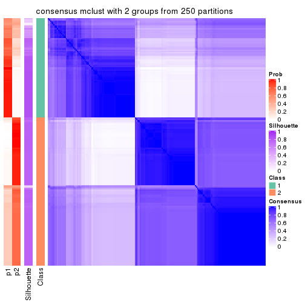</p>

</div>
<div id='tab-ATC-mclust-consensus-heatmap-2'>
<pre><code class="r">consensus_heatmap(res, k = 3)
</code></pre>

<p>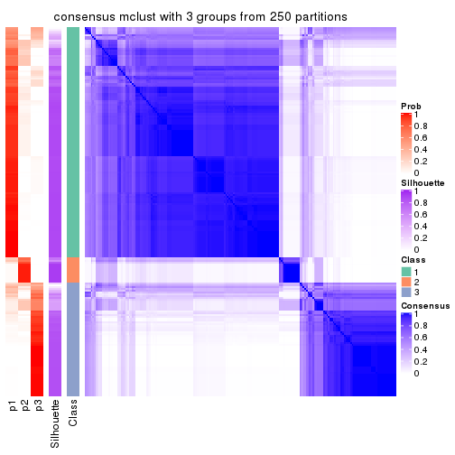</p>

</div>
<div id='tab-ATC-mclust-consensus-heatmap-3'>
<pre><code class="r">consensus_heatmap(res, k = 4)
</code></pre>

<p>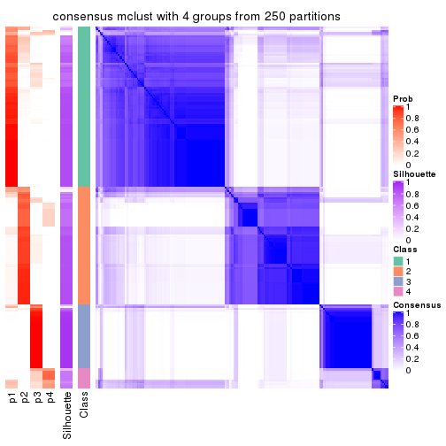</p>

</div>
<div id='tab-ATC-mclust-consensus-heatmap-4'>
<pre><code class="r">consensus_heatmap(res, k = 5)
</code></pre>

<p>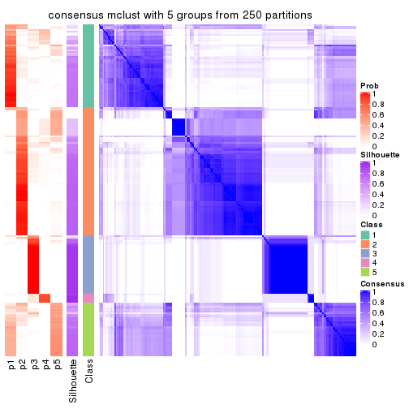</p>

</div>
<div id='tab-ATC-mclust-consensus-heatmap-5'>
<pre><code class="r">consensus_heatmap(res, k = 6)
</code></pre>

<p>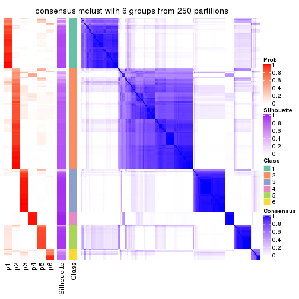</p>

</div>
</div>

Heatmaps for the membership of samples in all partitions to see how consistent they are:


<script>
$( function() {
	$( '#tabs-ATC-mclust-membership-heatmap' ).tabs();
} );
</script>
<div id='tabs-ATC-mclust-membership-heatmap'>
<ul>
<li><a href='#tab-ATC-mclust-membership-heatmap-1'>k = 2</a></li>
<li><a href='#tab-ATC-mclust-membership-heatmap-2'>k = 3</a></li>
<li><a href='#tab-ATC-mclust-membership-heatmap-3'>k = 4</a></li>
<li><a href='#tab-ATC-mclust-membership-heatmap-4'>k = 5</a></li>
<li><a href='#tab-ATC-mclust-membership-heatmap-5'>k = 6</a></li>
</ul>
<div id='tab-ATC-mclust-membership-heatmap-1'>
<pre><code class="r">membership_heatmap(res, k = 2)
</code></pre>

<p>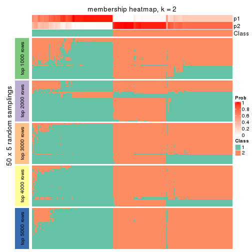</p>

</div>
<div id='tab-ATC-mclust-membership-heatmap-2'>
<pre><code class="r">membership_heatmap(res, k = 3)
</code></pre>

<p>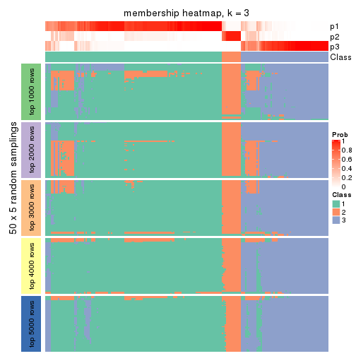</p>

</div>
<div id='tab-ATC-mclust-membership-heatmap-3'>
<pre><code class="r">membership_heatmap(res, k = 4)
</code></pre>

<p>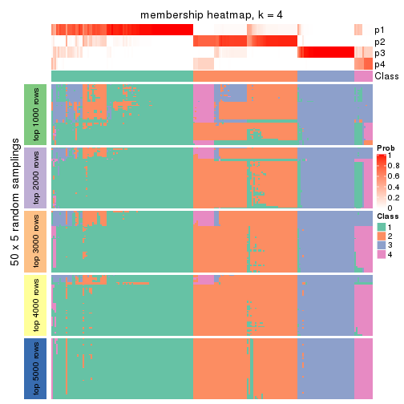</p>

</div>
<div id='tab-ATC-mclust-membership-heatmap-4'>
<pre><code class="r">membership_heatmap(res, k = 5)
</code></pre>

<p>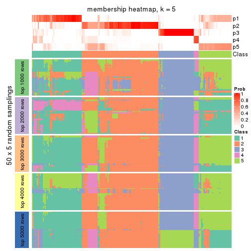</p>

</div>
<div id='tab-ATC-mclust-membership-heatmap-5'>
<pre><code class="r">membership_heatmap(res, k = 6)
</code></pre>

<p>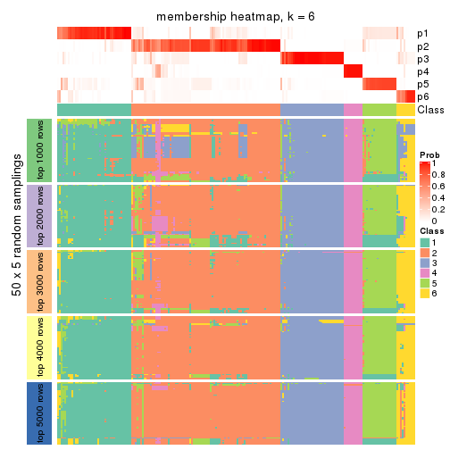</p>

</div>
</div>

As soon as we have had the classes for columns, we can look for signatures
which are significantly different between classes which can be candidate marks
for certain classes. Following are the heatmaps for signatures.


Signature heatmaps where rows are scaled:


<script>
$( function() {
	$( '#tabs-ATC-mclust-get-signatures' ).tabs();
} );
</script>
<div id='tabs-ATC-mclust-get-signatures'>
<ul>
<li><a href='#tab-ATC-mclust-get-signatures-1'>k = 2</a></li>
<li><a href='#tab-ATC-mclust-get-signatures-2'>k = 3</a></li>
<li><a href='#tab-ATC-mclust-get-signatures-3'>k = 4</a></li>
<li><a href='#tab-ATC-mclust-get-signatures-4'>k = 5</a></li>
<li><a href='#tab-ATC-mclust-get-signatures-5'>k = 6</a></li>
</ul>
<div id='tab-ATC-mclust-get-signatures-1'>
<pre><code class="r">get_signatures(res, k = 2)
</code></pre>

<p>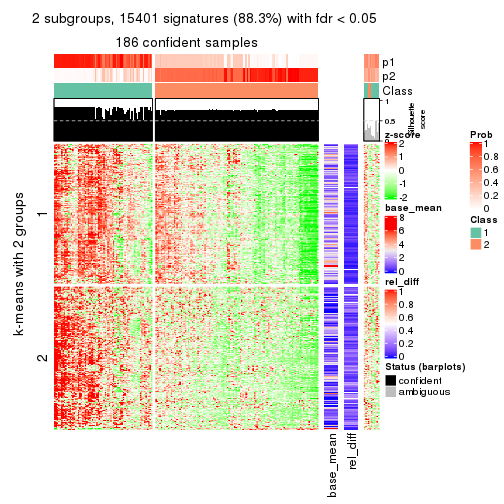</p>

</div>
<div id='tab-ATC-mclust-get-signatures-2'>
<pre><code class="r">get_signatures(res, k = 3)
</code></pre>

<p>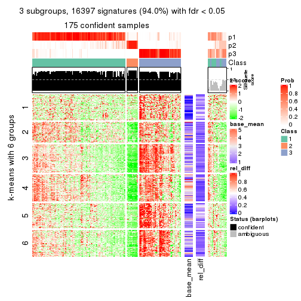</p>

</div>
<div id='tab-ATC-mclust-get-signatures-3'>
<pre><code class="r">get_signatures(res, k = 4)
</code></pre>

<p>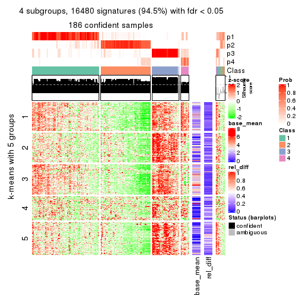</p>

</div>
<div id='tab-ATC-mclust-get-signatures-4'>
<pre><code class="r">get_signatures(res, k = 5)
</code></pre>

<p>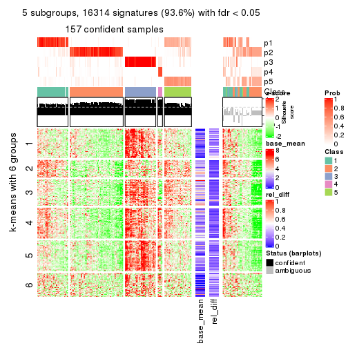</p>

</div>
<div id='tab-ATC-mclust-get-signatures-5'>
<pre><code class="r">get_signatures(res, k = 6)
</code></pre>

<p>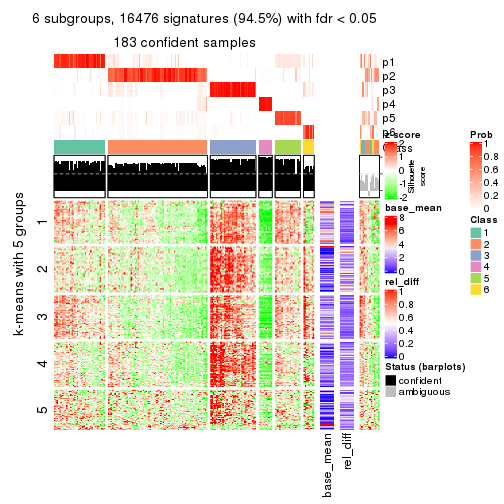</p>

</div>
</div>


Signature heatmaps where rows are not scaled:


<script>
$( function() {
	$( '#tabs-ATC-mclust-get-signatures-no-scale' ).tabs();
} );
</script>
<div id='tabs-ATC-mclust-get-signatures-no-scale'>
<ul>
<li><a href='#tab-ATC-mclust-get-signatures-no-scale-1'>k = 2</a></li>
<li><a href='#tab-ATC-mclust-get-signatures-no-scale-2'>k = 3</a></li>
<li><a href='#tab-ATC-mclust-get-signatures-no-scale-3'>k = 4</a></li>
<li><a href='#tab-ATC-mclust-get-signatures-no-scale-4'>k = 5</a></li>
<li><a href='#tab-ATC-mclust-get-signatures-no-scale-5'>k = 6</a></li>
</ul>
<div id='tab-ATC-mclust-get-signatures-no-scale-1'>
<pre><code class="r">get_signatures(res, k = 2, scale_rows = FALSE)
</code></pre>

<p>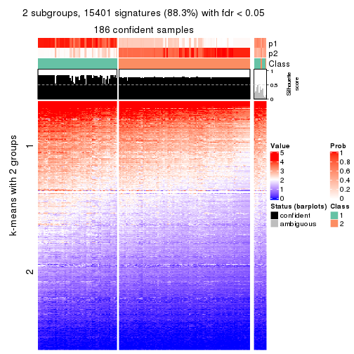</p>

</div>
<div id='tab-ATC-mclust-get-signatures-no-scale-2'>
<pre><code class="r">get_signatures(res, k = 3, scale_rows = FALSE)
</code></pre>

<p>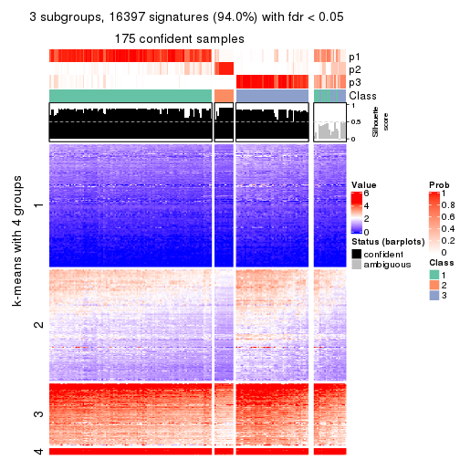</p>

</div>
<div id='tab-ATC-mclust-get-signatures-no-scale-3'>
<pre><code class="r">get_signatures(res, k = 4, scale_rows = FALSE)
</code></pre>

<p>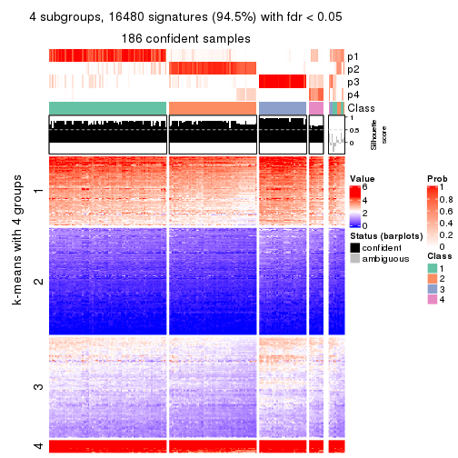</p>

</div>
<div id='tab-ATC-mclust-get-signatures-no-scale-4'>
<pre><code class="r">get_signatures(res, k = 5, scale_rows = FALSE)
</code></pre>

<p>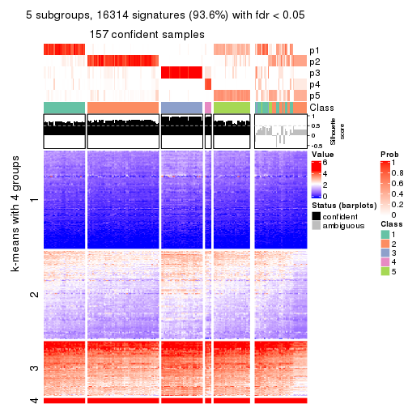</p>

</div>
<div id='tab-ATC-mclust-get-signatures-no-scale-5'>
<pre><code class="r">get_signatures(res, k = 6, scale_rows = FALSE)
</code></pre>

<p>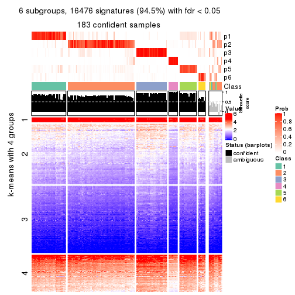</p>

</div>
</div>


Compare the overlap of signatures from different k:

```r
compare_signatures(res)
```

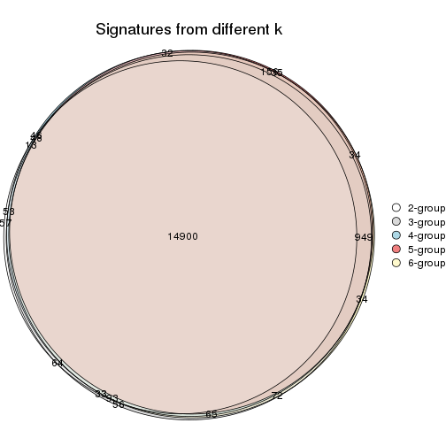

`get_signature()` returns a data frame invisibly. TO get the list of signatures, the function
call should be assigned to a variable explicitly. In following code, if `plot` argument is set
to `FALSE`, no heatmap is plotted while only the differential analysis is performed.

```r
# code only for demonstration
tb = get_signature(res, k = ..., plot = FALSE)
```

An example of the output of `tb` is:

```
#>   which_row         fdr    mean_1    mean_2 scaled_mean_1 scaled_mean_2 km
#> 1        38 0.042760348  8.373488  9.131774    -0.5533452     0.5164555  1
#> 2        40 0.018707592  7.106213  8.469186    -0.6173731     0.5762149  1
#> 3        55 0.019134737 10.221463 11.207825    -0.6159697     0.5749050  1
#> 4        59 0.006059896  5.921854  7.869574    -0.6899429     0.6439467  1
#> 5        60 0.018055526  8.928898 10.211722    -0.6204761     0.5791110  1
#> 6        98 0.009384629 15.714769 14.887706     0.6635654    -0.6193277  2
...
```

The columns in `tb` are:

1. `which_row`: row indices corresponding to the input matrix.
2. `fdr`: FDR for the differential test. 
3. `mean_x`: The mean value in group x.
4. `scaled_mean_x`: The mean value in group x after rows are scaled.
5. `km`: Row groups if k-means clustering is applied to rows.


UMAP plot which shows how samples are separated.


<script>
$( function() {
	$( '#tabs-ATC-mclust-dimension-reduction' ).tabs();
} );
</script>
<div id='tabs-ATC-mclust-dimension-reduction'>
<ul>
<li><a href='#tab-ATC-mclust-dimension-reduction-1'>k = 2</a></li>
<li><a href='#tab-ATC-mclust-dimension-reduction-2'>k = 3</a></li>
<li><a href='#tab-ATC-mclust-dimension-reduction-3'>k = 4</a></li>
<li><a href='#tab-ATC-mclust-dimension-reduction-4'>k = 5</a></li>
<li><a href='#tab-ATC-mclust-dimension-reduction-5'>k = 6</a></li>
</ul>
<div id='tab-ATC-mclust-dimension-reduction-1'>
<pre><code class="r">dimension_reduction(res, k = 2, method = &quot;UMAP&quot;)
</code></pre>

<p>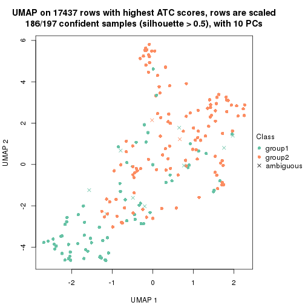</p>

</div>
<div id='tab-ATC-mclust-dimension-reduction-2'>
<pre><code class="r">dimension_reduction(res, k = 3, method = &quot;UMAP&quot;)
</code></pre>

<p>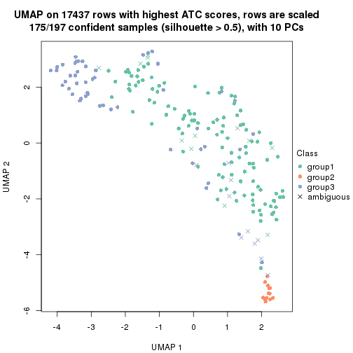</p>

</div>
<div id='tab-ATC-mclust-dimension-reduction-3'>
<pre><code class="r">dimension_reduction(res, k = 4, method = &quot;UMAP&quot;)
</code></pre>

<p>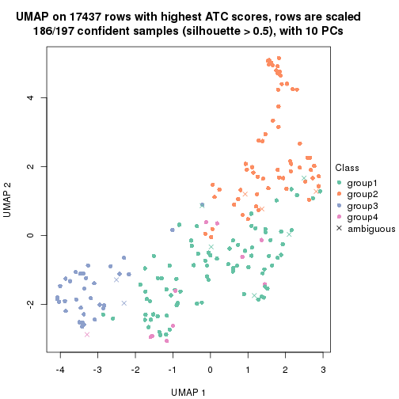</p>

</div>
<div id='tab-ATC-mclust-dimension-reduction-4'>
<pre><code class="r">dimension_reduction(res, k = 5, method = &quot;UMAP&quot;)
</code></pre>

<p>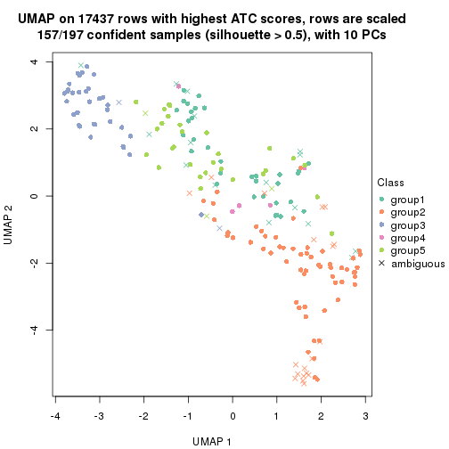</p>

</div>
<div id='tab-ATC-mclust-dimension-reduction-5'>
<pre><code class="r">dimension_reduction(res, k = 6, method = &quot;UMAP&quot;)
</code></pre>

<p>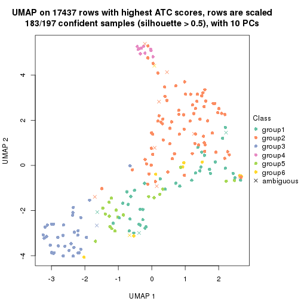</p>

</div>
</div>


Following heatmap shows how subgroups are split when increasing `k`:

```r
collect_classes(res)
```

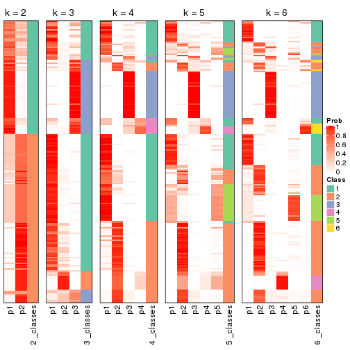


If matrix rows can be associated to genes, consider to use `GO_Enrichment(res,
...)` to perform function enrichment for the signature genes.


 

---------------------------------------------------


### ATC:NMF


The object with results only for a single top-value method and a single partition method 
can be extracted as:

```r
res = res_list["ATC", "NMF"]
# you can also extract it by
# res = res_list["ATC:NMF"]
```

A summary of `res` and all the functions that can be applied to it:

```r
res
```

```
#> A 'ConsensusPartition' object with k = 2, 3, 4, 5, 6.
#>   On a matrix with 17437 rows and 197 columns.
#>   Top rows (1000, 2000, 3000, 4000, 5000) are extracted by 'ATC' method.
#>   Subgroups are detected by 'NMF' method.
#>   Performed in total 1250 partitions by row resampling.
#>   Best k for subgroups seems to be 2.
#> 
#> Following methods can be applied to this 'ConsensusPartition' object:
#>  [1] "cola_report"             "collect_classes"         "collect_plots"          
#>  [4] "collect_stats"           "colnames"                "compare_signatures"     
#>  [7] "consensus_heatmap"       "dimension_reduction"     "functional_enrichment"  
#> [10] "get_anno_col"            "get_anno"                "get_classes"            
#> [13] "get_consensus"           "get_matrix"              "get_membership"         
#> [16] "get_param"               "get_signatures"          "get_stats"              
#> [19] "is_best_k"               "is_stable_k"             "membership_heatmap"     
#> [22] "ncol"                    "nrow"                    "plot_ecdf"              
#> [25] "rownames"                "select_partition_number" "show"                   
#> [28] "suggest_best_k"          "test_to_known_factors"
```

`collect_plots()` function collects all the plots made from `res` for all `k` (number of partitions)
into one single page to provide an easy and fast comparison between different `k`.

```r
collect_plots(res)
```

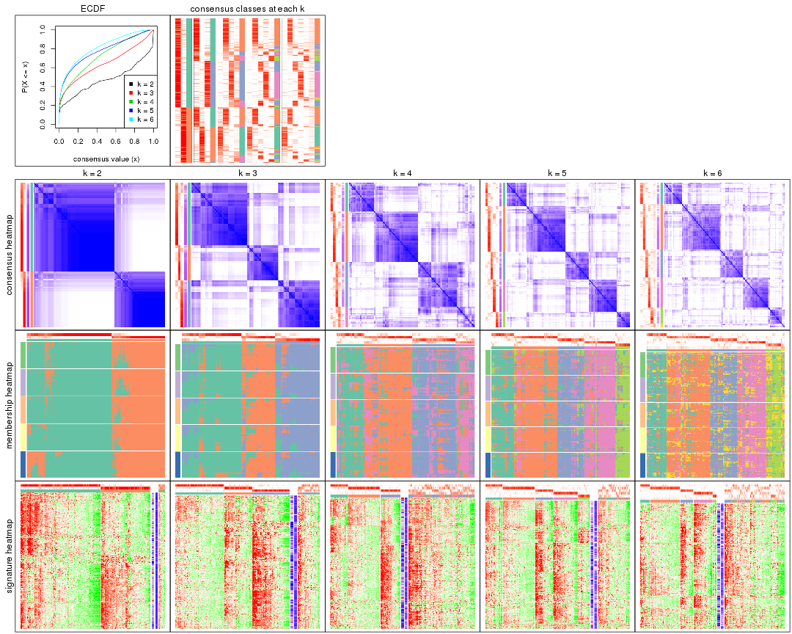

The plots are:

- The first row: a plot of the ECDF (Empirical cumulative distribution
  function) curves of the consensus matrix for each `k` and the heatmap of
  predicted classes for each `k`.
- The second row: heatmaps of the consensus matrix for each `k`.
- The third row: heatmaps of the membership matrix for each `k`.
- The fouth row: heatmaps of the signatures for each `k`.

All the plots in panels can be made by individual functions and they are
plotted later in this section.

`select_partition_number()` produces several plots showing different
statistics for choosing "optimized" `k`. There are following statistics:

- ECDF curves of the consensus matrix for each `k`;
- 1-PAC. [The PAC
  score](https://en.wikipedia.org/wiki/Consensus_clustering#Over-interpretation_potential_of_consensus_clustering)
  measures the proportion of the ambiguous subgrouping.
- Mean silhouette score.
- Concordance. The mean probability of fiting the consensus class ids in all
  partitions.
- Area increased. Denote $A_k$ as the area under the ECDF curve for current
  `k`, the area increased is defined as $A_k - A_{k-1}$.
- Rand index. The percent of pairs of samples that are both in a same cluster
  or both are not in a same cluster in the partition of k and k-1.
- Jaccard index. The ratio of pairs of samples are both in a same cluster in
  the partition of k and k-1 and the pairs of samples are both in a same
  cluster in the partition k or k-1.

The detailed explanations of these statistics can be found in [the cola
vignette](http://bioconductor.org/packages/devel/bioc/vignettes/cola/inst/doc/cola.html#toc_13).

Generally speaking, lower PAC score, higher mean silhouette score or higher
concordance corresponds to better partition. Rand index and Jaccard index
measure how similar the current partition is compared to partition with `k-1`.
If they are too similar, we won't accept `k` is better than `k-1`.

```r
select_partition_number(res)
```

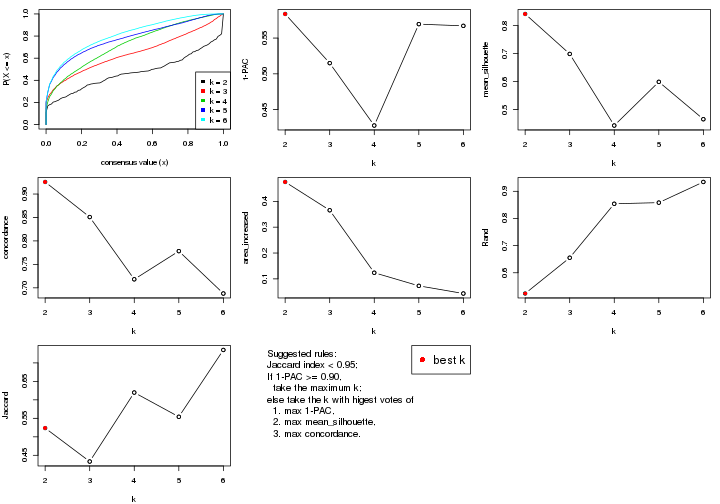

The numeric values for all these statistics can be obtained by `get_stats()`.

```r
get_stats(res)
```

```
#>   k 1-PAC mean_silhouette concordance area_increased  Rand Jaccard
#> 2 2 0.584           0.842       0.926         0.4750 0.524   0.524
#> 3 3 0.515           0.699       0.851         0.3655 0.655   0.433
#> 4 4 0.428           0.443       0.718         0.1237 0.854   0.620
#> 5 5 0.569           0.599       0.778         0.0729 0.858   0.554
#> 6 6 0.567           0.466       0.688         0.0432 0.934   0.735
```

`suggest_best_k()` suggests the best $k$ based on these statistics. The rules are as follows:

- All $k$ with Jaccard index larger than 0.95 are removed because the increase of
  the partition number does not provides enough extra information. If all $k$ are removed,
  the best $k$ is assigned by `NA`.
- For $k$ with 1-PAC larger than 0.9, the maximal $k$ is taken as the "best k". Other $k$ is called "optional k".
- If it does not fit the second rule. The $k$ with the highest vote of highest
  1-PAC, mean silhouette and concordance is taken as the "best k".

```r
suggest_best_k(res)
```

```
#> [1] 2
```


Following shows the table of the partitions (You need to click the **show/hide
code output** link to see it). The membership matrix (columns with name `p*`)
is inferred by
[`clue::cl_consensus()`](https://www.rdocumentation.org/link/cl_consensus?package=clue)
function with the `SE` method. Basically the value in the membership matrix
represents the probability to belong to a certain group. The finall class
label for an item is determined with the group with highest probability it
belongs to.

In `get_classes()` function, the entropy is calculated from the membership
matrix and the silhouette score is calculated from the consensus matrix.


<script>
$( function() {
	$( '#tabs-ATC-NMF-get-classes' ).tabs();
} );
</script>
<div id='tabs-ATC-NMF-get-classes'>
<ul>
<li><a href='#tab-ATC-NMF-get-classes-1'>k = 2</a></li>
<li><a href='#tab-ATC-NMF-get-classes-2'>k = 3</a></li>
<li><a href='#tab-ATC-NMF-get-classes-3'>k = 4</a></li>
<li><a href='#tab-ATC-NMF-get-classes-4'>k = 5</a></li>
<li><a href='#tab-ATC-NMF-get-classes-5'>k = 6</a></li>
</ul>

<div id='tab-ATC-NMF-get-classes-1'>
<p><a id='tab-ATC-NMF-get-classes-1-a' style='color:#0366d6' href='#'>show/hide code output</a></p>
<pre><code class="r">cbind(get_classes(res, k = 2), get_membership(res, k = 2))
</code></pre>

<pre><code>#&gt;            class entropy silhouette    p1    p2
#&gt; SRR1380886     2  0.9209     0.5104 0.336 0.664
#&gt; SRR1074385     1  0.4161     0.8760 0.916 0.084
#&gt; SRR1374739     1  0.9129     0.5441 0.672 0.328
#&gt; SRR1097883     1  0.5408     0.8428 0.876 0.124
#&gt; SRR2167209     2  0.0000     0.9108 0.000 1.000
#&gt; SRR816541      1  0.0000     0.9182 1.000 0.000
#&gt; SRR663645      2  0.5519     0.8316 0.128 0.872
#&gt; SRR1381505     1  0.0000     0.9182 1.000 0.000
#&gt; SRR1416362     2  0.0000     0.9108 0.000 1.000
#&gt; SRR1318503     1  0.7815     0.7177 0.768 0.232
#&gt; SRR1341626     1  0.0000     0.9182 1.000 0.000
#&gt; SRR1382440     1  0.0376     0.9173 0.996 0.004
#&gt; SRR1088413     1  0.0000     0.9182 1.000 0.000
#&gt; SRR1082080     1  0.3879     0.8819 0.924 0.076
#&gt; SRR1455783     1  0.3733     0.8845 0.928 0.072
#&gt; SRR1447760     2  0.0000     0.9108 0.000 1.000
#&gt; SRR1487784     2  0.0000     0.9108 0.000 1.000
#&gt; SRR1331037     2  0.6247     0.8048 0.156 0.844
#&gt; SRR1095651     1  0.0000     0.9182 1.000 0.000
#&gt; SRR1078066     1  0.2043     0.9079 0.968 0.032
#&gt; SRR1120363     2  0.7815     0.7089 0.232 0.768
#&gt; SRR821231      1  0.0000     0.9182 1.000 0.000
#&gt; SRR1374373     1  0.0000     0.9182 1.000 0.000
#&gt; SRR1324519     2  0.0000     0.9108 0.000 1.000
#&gt; SRR1431121     2  0.0000     0.9108 0.000 1.000
#&gt; SRR1091032     1  0.0000     0.9182 1.000 0.000
#&gt; SRR1365575     2  0.7139     0.7382 0.196 0.804
#&gt; SRR1072972     1  0.0000     0.9182 1.000 0.000
#&gt; SRR1310690     1  0.0672     0.9166 0.992 0.008
#&gt; SRR1383037     1  0.6623     0.7714 0.828 0.172
#&gt; SRR1095479     1  0.0000     0.9182 1.000 0.000
#&gt; SRR1070403     1  0.0376     0.9173 0.996 0.004
#&gt; SRR1390203     2  0.0000     0.9108 0.000 1.000
#&gt; SRR1072007     1  0.0000     0.9182 1.000 0.000
#&gt; SRR1468787     1  0.1414     0.9125 0.980 0.020
#&gt; SRR1347959     1  0.7674     0.7289 0.776 0.224
#&gt; SRR1338513     1  0.1184     0.9123 0.984 0.016
#&gt; SRR812598      1  0.0000     0.9182 1.000 0.000
#&gt; SRR1446806     2  0.0000     0.9108 0.000 1.000
#&gt; SRR1394275     2  0.0000     0.9108 0.000 1.000
#&gt; SRR1443633     1  0.8955     0.5862 0.688 0.312
#&gt; SRR1087728     2  0.5059     0.8359 0.112 0.888
#&gt; SRR1098192     1  0.0000     0.9182 1.000 0.000
#&gt; SRR1093340     1  0.0376     0.9175 0.996 0.004
#&gt; SRR665405      2  0.0376     0.9090 0.004 0.996
#&gt; SRR657077      1  0.2236     0.9068 0.964 0.036
#&gt; SRR813208      1  0.0000     0.9182 1.000 0.000
#&gt; SRR1416074     2  0.7299     0.7489 0.204 0.796
#&gt; SRR1089688     2  0.0376     0.9090 0.004 0.996
#&gt; SRR1353461     2  0.0376     0.9090 0.004 0.996
#&gt; SRR1466321     2  0.0376     0.9095 0.004 0.996
#&gt; SRR1073021     1  0.1843     0.9094 0.972 0.028
#&gt; SRR1322816     2  0.0000     0.9108 0.000 1.000
#&gt; SRR1457727     1  0.7745     0.7232 0.772 0.228
#&gt; SRR1464226     1  0.0000     0.9182 1.000 0.000
#&gt; SRR1398863     1  0.3879     0.8818 0.924 0.076
#&gt; SRR1455631     1  0.0000     0.9182 1.000 0.000
#&gt; SRR1307808     2  0.0000     0.9108 0.000 1.000
#&gt; SRR1374585     1  0.0000     0.9182 1.000 0.000
#&gt; SRR1072104     1  0.0000     0.9182 1.000 0.000
#&gt; SRR1076868     2  0.6623     0.7872 0.172 0.828
#&gt; SRR1335984     1  0.6712     0.7893 0.824 0.176
#&gt; SRR1445939     2  0.0000     0.9108 0.000 1.000
#&gt; SRR1453047     2  0.6247     0.8054 0.156 0.844
#&gt; SRR1339788     1  0.5629     0.8364 0.868 0.132
#&gt; SRR1084323     2  0.0000     0.9108 0.000 1.000
#&gt; SRR1092937     1  0.0000     0.9182 1.000 0.000
#&gt; SRR1074090     1  0.7528     0.7398 0.784 0.216
#&gt; SRR1099833     1  0.0000     0.9182 1.000 0.000
#&gt; SRR1093434     1  0.0000     0.9182 1.000 0.000
#&gt; SRR1435857     1  0.2043     0.9077 0.968 0.032
#&gt; SRR1480347     1  0.8327     0.6671 0.736 0.264
#&gt; SRR1440787     2  0.0000     0.9108 0.000 1.000
#&gt; SRR1430202     2  0.0000     0.9108 0.000 1.000
#&gt; SRR1322730     1  0.0000     0.9182 1.000 0.000
#&gt; SRR811029      1  0.0000     0.9182 1.000 0.000
#&gt; SRR1390456     1  0.5059     0.8391 0.888 0.112
#&gt; SRR1381140     2  0.0000     0.9108 0.000 1.000
#&gt; SRR1388064     2  0.0376     0.9090 0.004 0.996
#&gt; SRR1093577     1  0.0000     0.9182 1.000 0.000
#&gt; SRR1414161     2  0.0000     0.9108 0.000 1.000
#&gt; SRR1328738     2  0.0376     0.9095 0.004 0.996
#&gt; SRR1311752     1  0.9815     0.3008 0.580 0.420
#&gt; SRR1445960     1  0.8016     0.7062 0.756 0.244
#&gt; SRR1403412     2  0.9775     0.3118 0.412 0.588
#&gt; SRR2166748     2  0.0000     0.9108 0.000 1.000
#&gt; SRR821666      1  0.0000     0.9182 1.000 0.000
#&gt; SRR1330746     1  0.0000     0.9182 1.000 0.000
#&gt; SRR1327872     1  0.9970     0.0715 0.532 0.468
#&gt; SRR1100800     2  0.9552     0.4160 0.376 0.624
#&gt; SRR1075174     2  0.9044     0.5490 0.320 0.680
#&gt; SRR1434436     2  0.1184     0.9043 0.016 0.984
#&gt; SRR1389409     1  0.3584     0.8803 0.932 0.068
#&gt; SRR1085310     1  0.0000     0.9182 1.000 0.000
#&gt; SRR1376718     1  0.0000     0.9182 1.000 0.000
#&gt; SRR808590      1  0.0000     0.9182 1.000 0.000
#&gt; SRR1084128     2  0.3879     0.8706 0.076 0.924
#&gt; SRR1361692     2  0.0000     0.9108 0.000 1.000
#&gt; SRR1431493     1  0.0000     0.9182 1.000 0.000
#&gt; SRR1409084     2  0.5408     0.8353 0.124 0.876
#&gt; SRR2166214     2  0.0000     0.9108 0.000 1.000
#&gt; SRR1324102     1  0.0000     0.9182 1.000 0.000
#&gt; SRR1079754     1  0.0000     0.9182 1.000 0.000
#&gt; SRR1442127     1  0.3274     0.8853 0.940 0.060
#&gt; SRR1076244     1  0.0000     0.9182 1.000 0.000
#&gt; SRR1330901     2  0.7219     0.7528 0.200 0.800
#&gt; SRR1073167     1  0.0376     0.9175 0.996 0.004
#&gt; SRR1357541     2  0.0000     0.9108 0.000 1.000
#&gt; SRR811607      2  0.0376     0.9095 0.004 0.996
#&gt; SRR1468931     2  0.9000     0.5796 0.316 0.684
#&gt; SRR1474908     2  0.0000     0.9108 0.000 1.000
#&gt; SRR1309875     1  0.0376     0.9177 0.996 0.004
#&gt; SRR598792      1  0.0000     0.9182 1.000 0.000
#&gt; SRR1088537     1  0.0000     0.9182 1.000 0.000
#&gt; SRR1457682     2  0.3584     0.8758 0.068 0.932
#&gt; SRR1454289     1  0.4815     0.8601 0.896 0.104
#&gt; SRR1069352     1  0.0000     0.9182 1.000 0.000
#&gt; SRR1472728     2  0.9209     0.5176 0.336 0.664
#&gt; SRR1091144     1  0.0000     0.9182 1.000 0.000
#&gt; SRR1319118     1  0.2236     0.9057 0.964 0.036
#&gt; SRR1403611     1  0.0376     0.9173 0.996 0.004
#&gt; SRR1397762     1  0.0000     0.9182 1.000 0.000
#&gt; SRR1317387     1  0.0376     0.9173 0.996 0.004
#&gt; SRR1376426     1  0.7453     0.7451 0.788 0.212
#&gt; SRR1097777     2  0.0000     0.9108 0.000 1.000
#&gt; SRR1365743     2  0.9209     0.5417 0.336 0.664
#&gt; SRR1458992     2  0.0000     0.9108 0.000 1.000
#&gt; SRR1089537     1  0.0000     0.9182 1.000 0.000
#&gt; SRR1397744     1  0.9358     0.4976 0.648 0.352
#&gt; SRR1453893     1  0.0376     0.9172 0.996 0.004
#&gt; SRR1098543     1  0.9323     0.5040 0.652 0.348
#&gt; SRR1321765     1  0.6712     0.7893 0.824 0.176
#&gt; SRR1440032     1  0.0000     0.9182 1.000 0.000
#&gt; SRR1404507     2  0.0000     0.9108 0.000 1.000
#&gt; SRR1404856     2  0.0000     0.9108 0.000 1.000
#&gt; SRR812745      1  0.0000     0.9182 1.000 0.000
#&gt; SRR1417524     1  0.8081     0.6580 0.752 0.248
#&gt; SRR1407334     2  0.0000     0.9108 0.000 1.000
#&gt; SRR1453991     2  0.2423     0.8923 0.040 0.960
#&gt; SRR1415938     2  0.0000     0.9108 0.000 1.000
#&gt; SRR1081259     1  0.0672     0.9166 0.992 0.008
#&gt; SRR1436187     1  0.6801     0.7620 0.820 0.180
#&gt; SRR1431948     1  0.3274     0.8850 0.940 0.060
#&gt; SRR1453277     2  0.0000     0.9108 0.000 1.000
#&gt; SRR1095407     2  0.0000     0.9108 0.000 1.000
#&gt; SRR1359694     1  0.5842     0.8279 0.860 0.140
#&gt; SRR656982      1  0.6343     0.8105 0.840 0.160
#&gt; SRR1354338     1  0.9000     0.5303 0.684 0.316
#&gt; SRR1088291     1  0.2236     0.9057 0.964 0.036
#&gt; SRR1080624     1  0.7056     0.7702 0.808 0.192
#&gt; SRR2166708     2  0.0000     0.9108 0.000 1.000
#&gt; SRR1393572     1  0.2778     0.8994 0.952 0.048
#&gt; SRR1429912     1  0.1843     0.9094 0.972 0.028
#&gt; SRR1421048     1  0.0376     0.9175 0.996 0.004
#&gt; SRR1434999     2  0.0376     0.9090 0.004 0.996
#&gt; SRR656457      2  0.4161     0.8663 0.084 0.916
#&gt; SRR1098928     1  0.0000     0.9182 1.000 0.000
#&gt; SRR1343967     1  0.9775     0.3258 0.588 0.412
#&gt; SRR1360766     2  0.8909     0.5695 0.308 0.692
#&gt; SRR1464724     2  0.0000     0.9108 0.000 1.000
#&gt; SRR1101542     1  0.7528     0.7131 0.784 0.216
#&gt; SRR1401528     1  0.0000     0.9182 1.000 0.000
#&gt; SRR1071519     1  0.0000     0.9182 1.000 0.000
#&gt; SRR1086070     2  0.0000     0.9108 0.000 1.000
#&gt; SRR1358645     2  0.0000     0.9108 0.000 1.000
#&gt; SRR819771      1  0.0000     0.9182 1.000 0.000
#&gt; SRR1418433     2  0.7219     0.7330 0.200 0.800
#&gt; SRR821050      2  0.0000     0.9108 0.000 1.000
#&gt; SRR1402091     1  0.0000     0.9182 1.000 0.000
#&gt; SRR1322028     1  0.2948     0.8971 0.948 0.052
#&gt; SRR1452556     1  0.0000     0.9182 1.000 0.000
#&gt; SRR1340047     2  0.0000     0.9108 0.000 1.000
#&gt; SRR1418302     1  0.0000     0.9182 1.000 0.000
#&gt; SRR1073991     1  0.2423     0.9037 0.960 0.040
#&gt; SRR1085187     1  0.0672     0.9166 0.992 0.008
#&gt; SRR1357618     1  0.0000     0.9182 1.000 0.000
#&gt; SRR1487764     1  0.0672     0.9159 0.992 0.008
#&gt; SRR1075336     1  0.7602     0.7363 0.780 0.220
#&gt; SRR1365471     1  0.0376     0.9175 0.996 0.004
#&gt; SRR1414613     2  0.0000     0.9108 0.000 1.000
#&gt; SRR658719      1  0.5178     0.8508 0.884 0.116
#&gt; SRR1475128     1  0.0000     0.9182 1.000 0.000
#&gt; SRR1367630     2  0.9608     0.4154 0.384 0.616
#&gt; SRR1481146     1  0.0000     0.9182 1.000 0.000
#&gt; SRR1465674     1  0.4298     0.8731 0.912 0.088
#&gt; SRR1327303     2  0.0000     0.9108 0.000 1.000
#&gt; SRR1390391     2  0.0000     0.9108 0.000 1.000
#&gt; SRR1326020     1  0.0376     0.9177 0.996 0.004
#&gt; SRR1381953     1  0.0000     0.9182 1.000 0.000
#&gt; SRR1082544     1  0.0000     0.9182 1.000 0.000
#&gt; SRR810761      2  0.9754     0.3214 0.408 0.592
#&gt; SRR1070764     1  0.9087     0.4969 0.676 0.324
#&gt; SRR1415919     1  0.7745     0.6885 0.772 0.228
#&gt; SRR1490404     2  0.5842     0.8200 0.140 0.860
#&gt; SRR1416773     2  0.4690     0.8553 0.100 0.900
#&gt; SRR1377492     2  0.0000     0.9108 0.000 1.000
#&gt; SRR1334314     1  0.0376     0.9177 0.996 0.004
</code></pre>

<script>
$('#tab-ATC-NMF-get-classes-1-a').parent().next().next().hide();
$('#tab-ATC-NMF-get-classes-1-a').click(function(){
  $('#tab-ATC-NMF-get-classes-1-a').parent().next().next().toggle();
  return(false);
});
</script>
</div>

<div id='tab-ATC-NMF-get-classes-2'>
<p><a id='tab-ATC-NMF-get-classes-2-a' style='color:#0366d6' href='#'>show/hide code output</a></p>
<pre><code class="r">cbind(get_classes(res, k = 3), get_membership(res, k = 3))
</code></pre>

<pre><code>#&gt;            class entropy silhouette    p1    p2    p3
#&gt; SRR1380886     1  0.6090    0.58512 0.716 0.264 0.020
#&gt; SRR1074385     1  0.2066    0.81636 0.940 0.000 0.060
#&gt; SRR1374739     3  0.6839    0.42733 0.024 0.352 0.624
#&gt; SRR1097883     1  0.1031    0.82166 0.976 0.000 0.024
#&gt; SRR2167209     2  0.1289    0.82616 0.032 0.968 0.000
#&gt; SRR816541      1  0.5363    0.59662 0.724 0.000 0.276
#&gt; SRR663645      2  0.5643    0.72658 0.220 0.760 0.020
#&gt; SRR1381505     3  0.5948    0.44894 0.360 0.000 0.640
#&gt; SRR1416362     2  0.4605    0.76070 0.204 0.796 0.000
#&gt; SRR1318503     1  0.0848    0.82021 0.984 0.008 0.008
#&gt; SRR1341626     1  0.6008    0.40357 0.628 0.000 0.372
#&gt; SRR1382440     3  0.1289    0.82710 0.032 0.000 0.968
#&gt; SRR1088413     3  0.6079    0.38050 0.388 0.000 0.612
#&gt; SRR1082080     1  0.0592    0.82115 0.988 0.000 0.012
#&gt; SRR1455783     1  0.3192    0.79265 0.888 0.000 0.112
#&gt; SRR1447760     2  0.4702    0.75193 0.212 0.788 0.000
#&gt; SRR1487784     1  0.5621    0.44775 0.692 0.308 0.000
#&gt; SRR1331037     1  0.2165    0.78837 0.936 0.064 0.000
#&gt; SRR1095651     3  0.0747    0.82781 0.016 0.000 0.984
#&gt; SRR1078066     1  0.4452    0.72401 0.808 0.000 0.192
#&gt; SRR1120363     1  0.1411    0.80609 0.964 0.036 0.000
#&gt; SRR821231      1  0.5988    0.41938 0.632 0.000 0.368
#&gt; SRR1374373     1  0.6008    0.40693 0.628 0.000 0.372
#&gt; SRR1324519     2  0.4887    0.73944 0.228 0.772 0.000
#&gt; SRR1431121     2  0.6126    0.45136 0.400 0.600 0.000
#&gt; SRR1091032     1  0.3816    0.75598 0.852 0.000 0.148
#&gt; SRR1365575     2  0.6026    0.34987 0.000 0.624 0.376
#&gt; SRR1072972     3  0.5760    0.52347 0.328 0.000 0.672
#&gt; SRR1310690     1  0.4796    0.67447 0.780 0.000 0.220
#&gt; SRR1383037     3  0.3619    0.74509 0.000 0.136 0.864
#&gt; SRR1095479     3  0.4504    0.72378 0.196 0.000 0.804
#&gt; SRR1070403     3  0.4452    0.72990 0.192 0.000 0.808
#&gt; SRR1390203     2  0.4002    0.78855 0.160 0.840 0.000
#&gt; SRR1072007     1  0.6308   -0.00161 0.508 0.000 0.492
#&gt; SRR1468787     1  0.2959    0.79990 0.900 0.000 0.100
#&gt; SRR1347959     1  0.0424    0.81785 0.992 0.008 0.000
#&gt; SRR1338513     3  0.2356    0.79288 0.000 0.072 0.928
#&gt; SRR812598      3  0.4346    0.74198 0.184 0.000 0.816
#&gt; SRR1446806     2  0.2356    0.82703 0.072 0.928 0.000
#&gt; SRR1394275     2  0.4452    0.76846 0.192 0.808 0.000
#&gt; SRR1443633     1  0.1182    0.82096 0.976 0.012 0.012
#&gt; SRR1087728     2  0.5678    0.47630 0.000 0.684 0.316
#&gt; SRR1098192     3  0.0747    0.82743 0.016 0.000 0.984
#&gt; SRR1093340     1  0.2448    0.81138 0.924 0.000 0.076
#&gt; SRR665405      2  0.1643    0.79761 0.000 0.956 0.044
#&gt; SRR657077      1  0.7129    0.30265 0.580 0.028 0.392
#&gt; SRR813208      3  0.0424    0.82635 0.008 0.000 0.992
#&gt; SRR1416074     1  0.1753    0.79959 0.952 0.048 0.000
#&gt; SRR1089688     2  0.2066    0.78700 0.000 0.940 0.060
#&gt; SRR1353461     2  0.1753    0.79527 0.000 0.952 0.048
#&gt; SRR1466321     1  0.4750    0.62106 0.784 0.216 0.000
#&gt; SRR1073021     1  0.1753    0.81931 0.952 0.000 0.048
#&gt; SRR1322816     1  0.4750    0.62066 0.784 0.216 0.000
#&gt; SRR1457727     1  0.0424    0.81785 0.992 0.008 0.000
#&gt; SRR1464226     3  0.0592    0.82252 0.000 0.012 0.988
#&gt; SRR1398863     1  0.1643    0.82014 0.956 0.000 0.044
#&gt; SRR1455631     3  0.1411    0.82612 0.036 0.000 0.964
#&gt; SRR1307808     1  0.5397    0.50812 0.720 0.280 0.000
#&gt; SRR1374585     3  0.1529    0.82629 0.040 0.000 0.960
#&gt; SRR1072104     1  0.5926    0.43169 0.644 0.000 0.356
#&gt; SRR1076868     1  0.1643    0.80195 0.956 0.044 0.000
#&gt; SRR1335984     1  0.0475    0.81980 0.992 0.004 0.004
#&gt; SRR1445939     2  0.4504    0.76558 0.196 0.804 0.000
#&gt; SRR1453047     1  0.1643    0.80188 0.956 0.044 0.000
#&gt; SRR1339788     1  0.4068    0.78550 0.864 0.016 0.120
#&gt; SRR1084323     2  0.2356    0.82779 0.072 0.928 0.000
#&gt; SRR1092937     3  0.6079    0.38596 0.388 0.000 0.612
#&gt; SRR1074090     1  0.0424    0.81785 0.992 0.008 0.000
#&gt; SRR1099833     3  0.0592    0.82252 0.000 0.012 0.988
#&gt; SRR1093434     3  0.4974    0.67454 0.236 0.000 0.764
#&gt; SRR1435857     1  0.1964    0.81751 0.944 0.000 0.056
#&gt; SRR1480347     1  0.0424    0.81785 0.992 0.008 0.000
#&gt; SRR1440787     2  0.0747    0.81200 0.000 0.984 0.016
#&gt; SRR1430202     2  0.5098    0.71661 0.248 0.752 0.000
#&gt; SRR1322730     3  0.1031    0.81813 0.000 0.024 0.976
#&gt; SRR811029      3  0.2152    0.82699 0.036 0.016 0.948
#&gt; SRR1390456     3  0.3482    0.75228 0.000 0.128 0.872
#&gt; SRR1381140     2  0.3038    0.81685 0.104 0.896 0.000
#&gt; SRR1388064     2  0.3686    0.71752 0.000 0.860 0.140
#&gt; SRR1093577     3  0.6307    0.03890 0.488 0.000 0.512
#&gt; SRR1414161     1  0.5706    0.42364 0.680 0.320 0.000
#&gt; SRR1328738     1  0.6330    0.24524 0.600 0.396 0.004
#&gt; SRR1311752     1  0.1163    0.81008 0.972 0.028 0.000
#&gt; SRR1445960     1  0.1015    0.82100 0.980 0.008 0.012
#&gt; SRR1403412     2  0.7778    0.59753 0.264 0.644 0.092
#&gt; SRR2166748     2  0.0424    0.82060 0.008 0.992 0.000
#&gt; SRR821666      1  0.5733    0.49976 0.676 0.000 0.324
#&gt; SRR1330746     3  0.2590    0.81833 0.072 0.004 0.924
#&gt; SRR1327872     3  0.5363    0.57338 0.000 0.276 0.724
#&gt; SRR1100800     1  0.1289    0.80841 0.968 0.032 0.000
#&gt; SRR1075174     1  0.5480    0.56888 0.732 0.264 0.004
#&gt; SRR1434436     1  0.3267    0.74275 0.884 0.116 0.000
#&gt; SRR1389409     3  0.6034    0.72240 0.152 0.068 0.780
#&gt; SRR1085310     3  0.1753    0.82375 0.048 0.000 0.952
#&gt; SRR1376718     3  0.0983    0.82294 0.004 0.016 0.980
#&gt; SRR808590      3  0.0424    0.82635 0.008 0.000 0.992
#&gt; SRR1084128     1  0.3816    0.70902 0.852 0.148 0.000
#&gt; SRR1361692     2  0.0424    0.81517 0.000 0.992 0.008
#&gt; SRR1431493     3  0.4452    0.72848 0.192 0.000 0.808
#&gt; SRR1409084     2  0.5365    0.70857 0.252 0.744 0.004
#&gt; SRR2166214     2  0.0592    0.81371 0.000 0.988 0.012
#&gt; SRR1324102     1  0.4346    0.72003 0.816 0.000 0.184
#&gt; SRR1079754     3  0.0424    0.82635 0.008 0.000 0.992
#&gt; SRR1442127     3  0.1031    0.81957 0.000 0.024 0.976
#&gt; SRR1076244     3  0.1129    0.82852 0.020 0.004 0.976
#&gt; SRR1330901     1  0.1643    0.80195 0.956 0.044 0.000
#&gt; SRR1073167     1  0.3192    0.78755 0.888 0.000 0.112
#&gt; SRR1357541     2  0.6308    0.14899 0.492 0.508 0.000
#&gt; SRR811607      1  0.4062    0.68953 0.836 0.164 0.000
#&gt; SRR1468931     2  0.5591    0.49792 0.000 0.696 0.304
#&gt; SRR1474908     2  0.0892    0.82377 0.020 0.980 0.000
#&gt; SRR1309875     1  0.6140    0.30063 0.596 0.000 0.404
#&gt; SRR598792      3  0.4178    0.75016 0.172 0.000 0.828
#&gt; SRR1088537     1  0.5216    0.62435 0.740 0.000 0.260
#&gt; SRR1457682     1  0.4504    0.65142 0.804 0.196 0.000
#&gt; SRR1454289     1  0.0747    0.82135 0.984 0.000 0.016
#&gt; SRR1069352     3  0.5760    0.51597 0.328 0.000 0.672
#&gt; SRR1472728     1  0.1163    0.81008 0.972 0.028 0.000
#&gt; SRR1091144     3  0.6154    0.32926 0.408 0.000 0.592
#&gt; SRR1319118     1  0.3686    0.77003 0.860 0.000 0.140
#&gt; SRR1403611     3  0.1753    0.80700 0.000 0.048 0.952
#&gt; SRR1397762     3  0.2959    0.80370 0.100 0.000 0.900
#&gt; SRR1317387     3  0.1529    0.81118 0.000 0.040 0.960
#&gt; SRR1376426     1  0.0424    0.81785 0.992 0.008 0.000
#&gt; SRR1097777     1  0.5621    0.46059 0.692 0.308 0.000
#&gt; SRR1365743     2  0.5929    0.45857 0.004 0.676 0.320
#&gt; SRR1458992     2  0.2261    0.82764 0.068 0.932 0.000
#&gt; SRR1089537     3  0.1163    0.82689 0.028 0.000 0.972
#&gt; SRR1397744     1  0.0424    0.81785 0.992 0.008 0.000
#&gt; SRR1453893     3  0.1860    0.80576 0.000 0.052 0.948
#&gt; SRR1098543     1  0.0424    0.81785 0.992 0.008 0.000
#&gt; SRR1321765     1  0.2200    0.81941 0.940 0.004 0.056
#&gt; SRR1440032     3  0.6260    0.20151 0.448 0.000 0.552
#&gt; SRR1404507     2  0.0424    0.81517 0.000 0.992 0.008
#&gt; SRR1404856     2  0.6215    0.37753 0.428 0.572 0.000
#&gt; SRR812745      3  0.1643    0.82607 0.044 0.000 0.956
#&gt; SRR1417524     3  0.4702    0.66426 0.000 0.212 0.788
#&gt; SRR1407334     2  0.1031    0.80834 0.000 0.976 0.024
#&gt; SRR1453991     1  0.4062    0.69137 0.836 0.164 0.000
#&gt; SRR1415938     2  0.1753    0.82777 0.048 0.952 0.000
#&gt; SRR1081259     1  0.2356    0.81260 0.928 0.000 0.072
#&gt; SRR1436187     3  0.3192    0.76758 0.000 0.112 0.888
#&gt; SRR1431948     3  0.2448    0.79645 0.000 0.076 0.924
#&gt; SRR1453277     2  0.1411    0.82657 0.036 0.964 0.000
#&gt; SRR1095407     2  0.5968    0.50575 0.364 0.636 0.000
#&gt; SRR1359694     1  0.0424    0.82098 0.992 0.000 0.008
#&gt; SRR656982      1  0.4316    0.79736 0.868 0.044 0.088
#&gt; SRR1354338     3  0.5553    0.59071 0.004 0.272 0.724
#&gt; SRR1088291     1  0.1860    0.81906 0.948 0.000 0.052
#&gt; SRR1080624     1  0.0661    0.82057 0.988 0.004 0.008
#&gt; SRR2166708     2  0.0237    0.81671 0.000 0.996 0.004
#&gt; SRR1393572     1  0.1529    0.82033 0.960 0.000 0.040
#&gt; SRR1429912     1  0.1643    0.81992 0.956 0.000 0.044
#&gt; SRR1421048     1  0.2448    0.81145 0.924 0.000 0.076
#&gt; SRR1434999     2  0.1753    0.79636 0.000 0.952 0.048
#&gt; SRR656457      2  0.2810    0.80908 0.036 0.928 0.036
#&gt; SRR1098928     3  0.0592    0.82252 0.000 0.012 0.988
#&gt; SRR1343967     1  0.0424    0.81785 0.992 0.008 0.000
#&gt; SRR1360766     1  0.2878    0.76960 0.904 0.096 0.000
#&gt; SRR1464724     2  0.1129    0.82294 0.020 0.976 0.004
#&gt; SRR1101542     3  0.3038    0.77101 0.000 0.104 0.896
#&gt; SRR1401528     3  0.0661    0.82647 0.008 0.004 0.988
#&gt; SRR1071519     3  0.4974    0.67401 0.236 0.000 0.764
#&gt; SRR1086070     2  0.2537    0.82499 0.080 0.920 0.000
#&gt; SRR1358645     2  0.4887    0.73836 0.228 0.772 0.000
#&gt; SRR819771      3  0.0661    0.82449 0.004 0.008 0.988
#&gt; SRR1418433     2  0.6140    0.27597 0.000 0.596 0.404
#&gt; SRR821050      1  0.5363    0.51917 0.724 0.276 0.000
#&gt; SRR1402091     1  0.3412    0.77767 0.876 0.000 0.124
#&gt; SRR1322028     1  0.1031    0.82140 0.976 0.000 0.024
#&gt; SRR1452556     3  0.1529    0.81118 0.000 0.040 0.960
#&gt; SRR1340047     2  0.3192    0.81544 0.112 0.888 0.000
#&gt; SRR1418302     3  0.4399    0.73747 0.188 0.000 0.812
#&gt; SRR1073991     1  0.1753    0.81931 0.952 0.000 0.048
#&gt; SRR1085187     1  0.5621    0.57119 0.692 0.000 0.308
#&gt; SRR1357618     3  0.2796    0.80770 0.092 0.000 0.908
#&gt; SRR1487764     3  0.1753    0.80704 0.000 0.048 0.952
#&gt; SRR1075336     1  0.0424    0.81785 0.992 0.008 0.000
#&gt; SRR1365471     1  0.1860    0.81863 0.948 0.000 0.052
#&gt; SRR1414613     1  0.6215    0.08545 0.572 0.428 0.000
#&gt; SRR658719      3  0.8630    0.39003 0.120 0.328 0.552
#&gt; SRR1475128     3  0.0829    0.82765 0.012 0.004 0.984
#&gt; SRR1367630     3  0.6026    0.37743 0.000 0.376 0.624
#&gt; SRR1481146     3  0.0747    0.82721 0.016 0.000 0.984
#&gt; SRR1465674     1  0.2066    0.81885 0.940 0.000 0.060
#&gt; SRR1327303     2  0.5363    0.68073 0.276 0.724 0.000
#&gt; SRR1390391     2  0.1643    0.82754 0.044 0.956 0.000
#&gt; SRR1326020     1  0.5621    0.53133 0.692 0.000 0.308
#&gt; SRR1381953     3  0.4002    0.76195 0.160 0.000 0.840
#&gt; SRR1082544     3  0.1411    0.82645 0.036 0.000 0.964
#&gt; SRR810761      1  0.6714    0.51688 0.672 0.296 0.032
#&gt; SRR1070764     3  0.5810    0.46651 0.000 0.336 0.664
#&gt; SRR1415919     3  0.5397    0.56812 0.000 0.280 0.720
#&gt; SRR1490404     1  0.2066    0.79139 0.940 0.060 0.000
#&gt; SRR1416773     2  0.6590    0.71886 0.112 0.756 0.132
#&gt; SRR1377492     2  0.2261    0.82822 0.068 0.932 0.000
#&gt; SRR1334314     1  0.6280    0.14162 0.540 0.000 0.460
</code></pre>

<script>
$('#tab-ATC-NMF-get-classes-2-a').parent().next().next().hide();
$('#tab-ATC-NMF-get-classes-2-a').click(function(){
  $('#tab-ATC-NMF-get-classes-2-a').parent().next().next().toggle();
  return(false);
});
</script>
</div>

<div id='tab-ATC-NMF-get-classes-3'>
<p><a id='tab-ATC-NMF-get-classes-3-a' style='color:#0366d6' href='#'>show/hide code output</a></p>
<pre><code class="r">cbind(get_classes(res, k = 4), get_membership(res, k = 4))
</code></pre>

<pre><code>#&gt;            class entropy silhouette    p1    p2    p3    p4
#&gt; SRR1380886     4  0.7225    0.18489 0.152 0.352 0.000 0.496
#&gt; SRR1074385     2  0.1610    0.73584 0.000 0.952 0.032 0.016
#&gt; SRR1374739     4  0.3380    0.35304 0.028 0.008 0.088 0.876
#&gt; SRR1097883     2  0.5496    0.35739 0.000 0.604 0.024 0.372
#&gt; SRR2167209     1  0.3324    0.61277 0.852 0.012 0.000 0.136
#&gt; SRR816541      2  0.5352    0.33888 0.000 0.596 0.388 0.016
#&gt; SRR663645      1  0.6591    0.52612 0.668 0.228 0.048 0.056
#&gt; SRR1381505     3  0.7072    0.30438 0.000 0.268 0.560 0.172
#&gt; SRR1416362     1  0.3907    0.62723 0.768 0.232 0.000 0.000
#&gt; SRR1318503     2  0.3143    0.71213 0.008 0.888 0.080 0.024
#&gt; SRR1341626     3  0.6222    0.16788 0.000 0.412 0.532 0.056
#&gt; SRR1382440     3  0.4567    0.51115 0.016 0.000 0.740 0.244
#&gt; SRR1088413     3  0.7307    0.12235 0.000 0.156 0.468 0.376
#&gt; SRR1082080     2  0.1762    0.73260 0.004 0.944 0.048 0.004
#&gt; SRR1455783     2  0.2976    0.69879 0.000 0.872 0.120 0.008
#&gt; SRR1447760     1  0.6352    0.47109 0.632 0.108 0.000 0.260
#&gt; SRR1487784     2  0.4193    0.49650 0.268 0.732 0.000 0.000
#&gt; SRR1331037     2  0.2179    0.72264 0.064 0.924 0.000 0.012
#&gt; SRR1095651     3  0.0672    0.61097 0.000 0.008 0.984 0.008
#&gt; SRR1078066     4  0.6858    0.35958 0.008 0.188 0.176 0.628
#&gt; SRR1120363     2  0.2400    0.73415 0.028 0.924 0.004 0.044
#&gt; SRR821231      2  0.6822    0.09716 0.000 0.488 0.412 0.100
#&gt; SRR1374373     3  0.6007    0.19776 0.000 0.408 0.548 0.044
#&gt; SRR1324519     1  0.4406    0.57696 0.700 0.300 0.000 0.000
#&gt; SRR1431121     1  0.5645    0.46003 0.604 0.364 0.000 0.032
#&gt; SRR1091032     2  0.4746    0.50963 0.000 0.688 0.304 0.008
#&gt; SRR1365575     1  0.6549    0.18587 0.556 0.000 0.356 0.088
#&gt; SRR1072972     3  0.5218    0.50724 0.000 0.200 0.736 0.064
#&gt; SRR1310690     2  0.4049    0.62062 0.008 0.780 0.212 0.000
#&gt; SRR1383037     3  0.4542    0.56546 0.088 0.000 0.804 0.108
#&gt; SRR1095479     3  0.3453    0.57514 0.000 0.080 0.868 0.052
#&gt; SRR1070403     4  0.5896   -0.05497 0.004 0.032 0.388 0.576
#&gt; SRR1390203     1  0.3217    0.66611 0.860 0.128 0.000 0.012
#&gt; SRR1072007     3  0.7404    0.19267 0.000 0.348 0.476 0.176
#&gt; SRR1468787     4  0.6214    0.19968 0.000 0.360 0.064 0.576
#&gt; SRR1347959     2  0.1191    0.73704 0.004 0.968 0.024 0.004
#&gt; SRR1338513     3  0.6004    0.45068 0.076 0.000 0.648 0.276
#&gt; SRR812598      3  0.3810    0.52828 0.000 0.188 0.804 0.008
#&gt; SRR1446806     1  0.3550    0.66959 0.860 0.096 0.000 0.044
#&gt; SRR1394275     1  0.5762    0.48388 0.608 0.352 0.000 0.040
#&gt; SRR1443633     4  0.5937    0.09099 0.020 0.412 0.012 0.556
#&gt; SRR1087728     4  0.7387    0.14389 0.256 0.000 0.224 0.520
#&gt; SRR1098192     3  0.0927    0.60982 0.000 0.016 0.976 0.008
#&gt; SRR1093340     2  0.3196    0.68338 0.000 0.856 0.136 0.008
#&gt; SRR665405      1  0.2300    0.63659 0.924 0.000 0.028 0.048
#&gt; SRR657077      3  0.7795    0.00269 0.104 0.420 0.440 0.036
#&gt; SRR813208      3  0.1004    0.61205 0.000 0.004 0.972 0.024
#&gt; SRR1416074     2  0.1489    0.73155 0.044 0.952 0.000 0.004
#&gt; SRR1089688     1  0.6639    0.19157 0.520 0.008 0.064 0.408
#&gt; SRR1353461     1  0.5673    0.41489 0.660 0.000 0.052 0.288
#&gt; SRR1466321     2  0.4018    0.57124 0.224 0.772 0.000 0.004
#&gt; SRR1073021     2  0.5771    0.14604 0.000 0.512 0.028 0.460
#&gt; SRR1322816     2  0.3306    0.65499 0.156 0.840 0.000 0.004
#&gt; SRR1457727     2  0.1356    0.73407 0.008 0.960 0.000 0.032
#&gt; SRR1464226     3  0.1209    0.61156 0.004 0.000 0.964 0.032
#&gt; SRR1398863     2  0.3105    0.67718 0.000 0.856 0.004 0.140
#&gt; SRR1455631     3  0.3754    0.56604 0.008 0.028 0.852 0.112
#&gt; SRR1307808     2  0.4482    0.49405 0.264 0.728 0.000 0.008
#&gt; SRR1374585     3  0.3286    0.60867 0.000 0.080 0.876 0.044
#&gt; SRR1072104     2  0.5217    0.35288 0.000 0.608 0.380 0.012
#&gt; SRR1076868     2  0.1211    0.73310 0.040 0.960 0.000 0.000
#&gt; SRR1335984     2  0.5588    0.34697 0.020 0.600 0.004 0.376
#&gt; SRR1445939     1  0.5360    0.32445 0.552 0.436 0.000 0.012
#&gt; SRR1453047     2  0.1722    0.73368 0.048 0.944 0.008 0.000
#&gt; SRR1339788     2  0.6653    0.06271 0.016 0.480 0.048 0.456
#&gt; SRR1084323     1  0.4188    0.65925 0.812 0.148 0.000 0.040
#&gt; SRR1092937     3  0.4964    0.44963 0.000 0.256 0.716 0.028
#&gt; SRR1074090     2  0.0927    0.73624 0.016 0.976 0.000 0.008
#&gt; SRR1099833     3  0.1867    0.60762 0.000 0.000 0.928 0.072
#&gt; SRR1093434     4  0.6527   -0.10677 0.000 0.076 0.416 0.508
#&gt; SRR1435857     2  0.2892    0.71731 0.000 0.896 0.036 0.068
#&gt; SRR1480347     2  0.1296    0.73650 0.004 0.964 0.028 0.004
#&gt; SRR1440787     1  0.1767    0.64513 0.944 0.000 0.012 0.044
#&gt; SRR1430202     1  0.5660    0.41077 0.576 0.396 0.000 0.028
#&gt; SRR1322730     3  0.2831    0.59481 0.004 0.000 0.876 0.120
#&gt; SRR811029      3  0.5266    0.50935 0.020 0.012 0.704 0.264
#&gt; SRR1390456     3  0.5407    0.51775 0.152 0.000 0.740 0.108
#&gt; SRR1381140     1  0.4669    0.63305 0.764 0.200 0.000 0.036
#&gt; SRR1388064     1  0.4669    0.50314 0.780 0.000 0.168 0.052
#&gt; SRR1093577     3  0.6221    0.38620 0.000 0.256 0.644 0.100
#&gt; SRR1414161     2  0.4456    0.47467 0.280 0.716 0.000 0.004
#&gt; SRR1328738     4  0.7477   -0.17496 0.420 0.152 0.004 0.424
#&gt; SRR1311752     2  0.1305    0.73542 0.036 0.960 0.004 0.000
#&gt; SRR1445960     2  0.4323    0.63015 0.028 0.788 0.000 0.184
#&gt; SRR1403412     2  0.8732   -0.16030 0.308 0.360 0.036 0.296
#&gt; SRR2166748     1  0.1822    0.65009 0.944 0.008 0.004 0.044
#&gt; SRR821666      2  0.4283    0.56958 0.004 0.740 0.256 0.000
#&gt; SRR1330746     4  0.5648   -0.11741 0.008 0.012 0.428 0.552
#&gt; SRR1327872     3  0.7451    0.13454 0.172 0.000 0.420 0.408
#&gt; SRR1100800     2  0.5184    0.46799 0.024 0.672 0.000 0.304
#&gt; SRR1075174     4  0.7836    0.10250 0.216 0.368 0.004 0.412
#&gt; SRR1434436     2  0.2011    0.71733 0.080 0.920 0.000 0.000
#&gt; SRR1389409     3  0.8117    0.32684 0.056 0.220 0.552 0.172
#&gt; SRR1085310     3  0.1059    0.61103 0.000 0.012 0.972 0.016
#&gt; SRR1376718     3  0.2207    0.60943 0.012 0.004 0.928 0.056
#&gt; SRR808590      3  0.4624    0.44231 0.000 0.000 0.660 0.340
#&gt; SRR1084128     2  0.4426    0.65372 0.168 0.796 0.032 0.004
#&gt; SRR1361692     1  0.2797    0.63818 0.908 0.008 0.028 0.056
#&gt; SRR1431493     3  0.4766    0.53966 0.020 0.040 0.800 0.140
#&gt; SRR1409084     1  0.4546    0.58607 0.732 0.256 0.012 0.000
#&gt; SRR2166214     1  0.1635    0.64741 0.948 0.000 0.008 0.044
#&gt; SRR1324102     2  0.5253    0.40961 0.000 0.624 0.360 0.016
#&gt; SRR1079754     3  0.1411    0.61330 0.000 0.020 0.960 0.020
#&gt; SRR1442127     4  0.5057    0.07582 0.012 0.000 0.340 0.648
#&gt; SRR1076244     3  0.5060    0.34543 0.000 0.004 0.584 0.412
#&gt; SRR1330901     2  0.1820    0.73145 0.036 0.944 0.000 0.020
#&gt; SRR1073167     2  0.2125    0.72281 0.000 0.920 0.076 0.004
#&gt; SRR1357541     4  0.7784    0.03282 0.292 0.280 0.000 0.428
#&gt; SRR811607      2  0.3432    0.67302 0.140 0.848 0.008 0.004
#&gt; SRR1468931     4  0.7851   -0.00322 0.288 0.000 0.312 0.400
#&gt; SRR1474908     1  0.1975    0.66263 0.936 0.016 0.000 0.048
#&gt; SRR1309875     2  0.7932    0.01100 0.060 0.468 0.084 0.388
#&gt; SRR598792      3  0.5995    0.49391 0.000 0.084 0.660 0.256
#&gt; SRR1088537     2  0.5487    0.30737 0.000 0.580 0.400 0.020
#&gt; SRR1457682     2  0.5090    0.44240 0.312 0.672 0.012 0.004
#&gt; SRR1454289     2  0.1724    0.73584 0.000 0.948 0.020 0.032
#&gt; SRR1069352     4  0.6384    0.03828 0.000 0.068 0.400 0.532
#&gt; SRR1472728     2  0.1302    0.73313 0.044 0.956 0.000 0.000
#&gt; SRR1091144     3  0.6968    0.26478 0.000 0.140 0.552 0.308
#&gt; SRR1319118     2  0.6164    0.43881 0.000 0.644 0.092 0.264
#&gt; SRR1403611     3  0.3342    0.59311 0.032 0.000 0.868 0.100
#&gt; SRR1397762     3  0.2611    0.59024 0.000 0.096 0.896 0.008
#&gt; SRR1317387     3  0.2500    0.60323 0.044 0.000 0.916 0.040
#&gt; SRR1376426     2  0.0927    0.73650 0.008 0.976 0.000 0.016
#&gt; SRR1097777     2  0.5793    0.25320 0.360 0.600 0.000 0.040
#&gt; SRR1365743     1  0.7831   -0.02733 0.408 0.000 0.312 0.280
#&gt; SRR1458992     1  0.5719    0.59150 0.712 0.176 0.000 0.112
#&gt; SRR1089537     3  0.4533    0.47952 0.004 0.012 0.752 0.232
#&gt; SRR1397744     2  0.2107    0.73831 0.016 0.940 0.024 0.020
#&gt; SRR1453893     3  0.4542    0.53053 0.020 0.000 0.752 0.228
#&gt; SRR1098543     2  0.1674    0.73737 0.012 0.952 0.032 0.004
#&gt; SRR1321765     4  0.6988    0.23234 0.012 0.332 0.096 0.560
#&gt; SRR1440032     3  0.5624    0.40638 0.000 0.280 0.668 0.052
#&gt; SRR1404507     1  0.1824    0.65459 0.936 0.000 0.004 0.060
#&gt; SRR1404856     1  0.7485    0.18553 0.440 0.180 0.000 0.380
#&gt; SRR812745      3  0.5500    0.32178 0.004 0.012 0.564 0.420
#&gt; SRR1417524     4  0.6841   -0.12015 0.088 0.004 0.408 0.500
#&gt; SRR1407334     1  0.4529    0.55683 0.776 0.004 0.024 0.196
#&gt; SRR1453991     2  0.7882   -0.09025 0.384 0.444 0.020 0.152
#&gt; SRR1415938     1  0.2363    0.67285 0.920 0.056 0.000 0.024
#&gt; SRR1081259     2  0.3934    0.67162 0.000 0.836 0.048 0.116
#&gt; SRR1436187     3  0.4346    0.57610 0.096 0.004 0.824 0.076
#&gt; SRR1431948     3  0.6509    0.43464 0.140 0.000 0.632 0.228
#&gt; SRR1453277     1  0.3934    0.63628 0.836 0.048 0.000 0.116
#&gt; SRR1095407     4  0.7130    0.00643 0.380 0.096 0.012 0.512
#&gt; SRR1359694     2  0.3142    0.68850 0.000 0.860 0.132 0.008
#&gt; SRR656982      4  0.6322    0.21753 0.004 0.360 0.060 0.576
#&gt; SRR1354338     3  0.7593    0.23027 0.252 0.012 0.540 0.196
#&gt; SRR1088291     2  0.6516    0.37530 0.000 0.592 0.100 0.308
#&gt; SRR1080624     2  0.1151    0.73727 0.000 0.968 0.008 0.024
#&gt; SRR2166708     1  0.2334    0.64513 0.908 0.000 0.004 0.088
#&gt; SRR1393572     2  0.1489    0.73386 0.000 0.952 0.044 0.004
#&gt; SRR1429912     2  0.1297    0.73622 0.000 0.964 0.016 0.020
#&gt; SRR1421048     2  0.5855    0.55276 0.000 0.704 0.160 0.136
#&gt; SRR1434999     1  0.5400    0.29341 0.608 0.000 0.020 0.372
#&gt; SRR656457      4  0.5159    0.21924 0.300 0.008 0.012 0.680
#&gt; SRR1098928     3  0.2081    0.60566 0.000 0.000 0.916 0.084
#&gt; SRR1343967     2  0.1247    0.73776 0.012 0.968 0.016 0.004
#&gt; SRR1360766     2  0.6483    0.34610 0.092 0.584 0.000 0.324
#&gt; SRR1464724     4  0.6726   -0.08119 0.428 0.068 0.008 0.496
#&gt; SRR1101542     3  0.6039    0.37885 0.056 0.000 0.596 0.348
#&gt; SRR1401528     3  0.4277    0.50406 0.000 0.000 0.720 0.280
#&gt; SRR1071519     3  0.6149    0.11133 0.000 0.048 0.476 0.476
#&gt; SRR1086070     1  0.1940    0.67346 0.924 0.076 0.000 0.000
#&gt; SRR1358645     1  0.5449    0.58871 0.720 0.228 0.012 0.040
#&gt; SRR819771      3  0.1489    0.60802 0.004 0.000 0.952 0.044
#&gt; SRR1418433     3  0.7920    0.02001 0.340 0.000 0.344 0.316
#&gt; SRR821050      2  0.5184    0.40561 0.304 0.672 0.000 0.024
#&gt; SRR1402091     2  0.2759    0.71918 0.000 0.904 0.044 0.052
#&gt; SRR1322028     2  0.0804    0.73743 0.000 0.980 0.008 0.012
#&gt; SRR1452556     4  0.5511   -0.23560 0.016 0.000 0.484 0.500
#&gt; SRR1340047     1  0.6252    0.52370 0.624 0.288 0.000 0.088
#&gt; SRR1418302     3  0.5375    0.56710 0.000 0.140 0.744 0.116
#&gt; SRR1073991     2  0.4567    0.56585 0.000 0.740 0.016 0.244
#&gt; SRR1085187     4  0.6189    0.34511 0.008 0.112 0.192 0.688
#&gt; SRR1357618     3  0.5409    0.10223 0.000 0.012 0.496 0.492
#&gt; SRR1487764     3  0.5358    0.49318 0.048 0.000 0.700 0.252
#&gt; SRR1075336     2  0.2380    0.72661 0.008 0.920 0.008 0.064
#&gt; SRR1365471     2  0.4946    0.55371 0.004 0.720 0.256 0.020
#&gt; SRR1414613     2  0.4655    0.40453 0.312 0.684 0.000 0.004
#&gt; SRR658719      3  0.8212    0.36720 0.148 0.212 0.560 0.080
#&gt; SRR1475128     3  0.5463    0.21468 0.004 0.008 0.504 0.484
#&gt; SRR1367630     3  0.5815    0.38615 0.288 0.000 0.652 0.060
#&gt; SRR1481146     3  0.5393    0.28688 0.008 0.008 0.608 0.376
#&gt; SRR1465674     4  0.6881    0.30471 0.004 0.280 0.128 0.588
#&gt; SRR1327303     1  0.6010    0.16751 0.488 0.472 0.000 0.040
#&gt; SRR1390391     1  0.1151    0.66693 0.968 0.024 0.000 0.008
#&gt; SRR1326020     4  0.7779    0.13507 0.044 0.392 0.092 0.472
#&gt; SRR1381953     4  0.6009   -0.02852 0.000 0.048 0.380 0.572
#&gt; SRR1082544     3  0.2680    0.59763 0.004 0.048 0.912 0.036
#&gt; SRR810761      1  0.7533    0.23664 0.500 0.384 0.060 0.056
#&gt; SRR1070764     3  0.7517    0.24054 0.212 0.000 0.484 0.304
#&gt; SRR1415919     3  0.7135    0.34740 0.200 0.000 0.560 0.240
#&gt; SRR1490404     2  0.2699    0.71633 0.068 0.904 0.000 0.028
#&gt; SRR1416773     4  0.6967    0.10523 0.356 0.012 0.088 0.544
#&gt; SRR1377492     4  0.5292    0.31262 0.168 0.088 0.000 0.744
#&gt; SRR1334314     3  0.6207    0.34286 0.008 0.316 0.620 0.056
</code></pre>

<script>
$('#tab-ATC-NMF-get-classes-3-a').parent().next().next().hide();
$('#tab-ATC-NMF-get-classes-3-a').click(function(){
  $('#tab-ATC-NMF-get-classes-3-a').parent().next().next().toggle();
  return(false);
});
</script>
</div>

<div id='tab-ATC-NMF-get-classes-4'>
<p><a id='tab-ATC-NMF-get-classes-4-a' style='color:#0366d6' href='#'>show/hide code output</a></p>
<pre><code class="r">cbind(get_classes(res, k = 5), get_membership(res, k = 5))
</code></pre>

<pre><code>#&gt;            class entropy silhouette    p1    p2    p3    p4    p5
#&gt; SRR1380886     3  0.5119     0.5812 0.024 0.116 0.736 0.000 0.124
#&gt; SRR1074385     2  0.1661     0.7615 0.000 0.940 0.024 0.036 0.000
#&gt; SRR1374739     3  0.4440     0.4141 0.004 0.012 0.660 0.000 0.324
#&gt; SRR1097883     5  0.4434     0.6505 0.000 0.208 0.056 0.000 0.736
#&gt; SRR2167209     1  0.3826     0.5212 0.752 0.008 0.000 0.004 0.236
#&gt; SRR816541      2  0.4403     0.2652 0.000 0.560 0.004 0.436 0.000
#&gt; SRR663645      1  0.5691     0.5615 0.684 0.096 0.000 0.184 0.036
#&gt; SRR1381505     4  0.7029     0.4884 0.000 0.120 0.128 0.584 0.168
#&gt; SRR1416362     1  0.4194     0.6577 0.720 0.260 0.016 0.000 0.004
#&gt; SRR1318503     2  0.3087     0.7229 0.008 0.836 0.000 0.152 0.004
#&gt; SRR1341626     4  0.5081     0.5713 0.000 0.256 0.024 0.684 0.036
#&gt; SRR1382440     3  0.6484     0.1213 0.012 0.004 0.452 0.420 0.112
#&gt; SRR1088413     5  0.7123     0.3146 0.000 0.040 0.264 0.196 0.500
#&gt; SRR1082080     2  0.2536     0.7368 0.000 0.868 0.000 0.128 0.004
#&gt; SRR1455783     2  0.2953     0.7342 0.000 0.844 0.000 0.144 0.012
#&gt; SRR1447760     1  0.4585     0.3420 0.628 0.020 0.000 0.000 0.352
#&gt; SRR1487784     2  0.3047     0.6675 0.160 0.832 0.004 0.000 0.004
#&gt; SRR1331037     2  0.1605     0.7446 0.040 0.944 0.012 0.000 0.004
#&gt; SRR1095651     4  0.0579     0.7882 0.000 0.000 0.008 0.984 0.008
#&gt; SRR1078066     5  0.1329     0.7602 0.000 0.032 0.008 0.004 0.956
#&gt; SRR1120363     2  0.2456     0.7422 0.024 0.904 0.008 0.000 0.064
#&gt; SRR821231      2  0.7100     0.2352 0.000 0.488 0.076 0.336 0.100
#&gt; SRR1374373     4  0.4977     0.4932 0.000 0.300 0.012 0.656 0.032
#&gt; SRR1324519     1  0.4081     0.6175 0.696 0.296 0.004 0.000 0.004
#&gt; SRR1431121     1  0.4595     0.6090 0.684 0.284 0.004 0.000 0.028
#&gt; SRR1091032     2  0.4420     0.2263 0.000 0.548 0.000 0.448 0.004
#&gt; SRR1365575     1  0.5672     0.2544 0.576 0.000 0.008 0.344 0.072
#&gt; SRR1072972     4  0.4590     0.7120 0.000 0.088 0.124 0.772 0.016
#&gt; SRR1310690     2  0.3167     0.7112 0.000 0.820 0.004 0.172 0.004
#&gt; SRR1383037     4  0.4063     0.7008 0.084 0.000 0.112 0.800 0.004
#&gt; SRR1095479     4  0.1728     0.7905 0.000 0.020 0.004 0.940 0.036
#&gt; SRR1070403     3  0.1901     0.6922 0.000 0.012 0.928 0.004 0.056
#&gt; SRR1390203     1  0.2907     0.7188 0.864 0.116 0.008 0.000 0.012
#&gt; SRR1072007     4  0.8073     0.2749 0.000 0.216 0.208 0.432 0.144
#&gt; SRR1468787     5  0.4624     0.6461 0.000 0.096 0.164 0.000 0.740
#&gt; SRR1347959     2  0.1831     0.7533 0.000 0.920 0.000 0.076 0.004
#&gt; SRR1338513     3  0.5107     0.4894 0.040 0.000 0.632 0.320 0.008
#&gt; SRR812598      4  0.1831     0.7762 0.000 0.076 0.000 0.920 0.004
#&gt; SRR1446806     1  0.3828     0.7175 0.808 0.120 0.072 0.000 0.000
#&gt; SRR1394275     1  0.5923     0.2832 0.496 0.416 0.080 0.000 0.008
#&gt; SRR1443633     5  0.3030     0.7378 0.004 0.088 0.040 0.000 0.868
#&gt; SRR1087728     3  0.2158     0.7072 0.052 0.000 0.920 0.008 0.020
#&gt; SRR1098192     4  0.0960     0.7883 0.000 0.016 0.008 0.972 0.004
#&gt; SRR1093340     2  0.2891     0.7127 0.000 0.824 0.000 0.176 0.000
#&gt; SRR665405      1  0.1739     0.6957 0.940 0.000 0.032 0.024 0.004
#&gt; SRR657077      4  0.3466     0.7474 0.048 0.100 0.000 0.844 0.008
#&gt; SRR813208      4  0.1942     0.7711 0.000 0.000 0.068 0.920 0.012
#&gt; SRR1416074     2  0.1124     0.7489 0.036 0.960 0.004 0.000 0.000
#&gt; SRR1089688     3  0.2284     0.6919 0.096 0.004 0.896 0.000 0.004
#&gt; SRR1353461     3  0.3835     0.5223 0.260 0.008 0.732 0.000 0.000
#&gt; SRR1466321     2  0.3333     0.6689 0.164 0.820 0.000 0.008 0.008
#&gt; SRR1073021     5  0.5198     0.6093 0.000 0.164 0.148 0.000 0.688
#&gt; SRR1322816     2  0.2656     0.7178 0.112 0.876 0.004 0.004 0.004
#&gt; SRR1457727     2  0.1960     0.7486 0.004 0.928 0.020 0.000 0.048
#&gt; SRR1464226     4  0.0854     0.7873 0.008 0.000 0.012 0.976 0.004
#&gt; SRR1398863     2  0.4922     0.5398 0.004 0.684 0.256 0.000 0.056
#&gt; SRR1455631     4  0.1830     0.7819 0.008 0.000 0.000 0.924 0.068
#&gt; SRR1307808     2  0.3312     0.6816 0.132 0.840 0.016 0.000 0.012
#&gt; SRR1374585     4  0.1662     0.7856 0.004 0.056 0.004 0.936 0.000
#&gt; SRR1072104     2  0.4562     0.2253 0.000 0.548 0.004 0.444 0.004
#&gt; SRR1076868     2  0.1195     0.7522 0.028 0.960 0.000 0.000 0.012
#&gt; SRR1335984     3  0.5654     0.4348 0.000 0.224 0.628 0.000 0.148
#&gt; SRR1445939     2  0.5081    -0.0721 0.472 0.500 0.020 0.000 0.008
#&gt; SRR1453047     2  0.2234     0.7499 0.036 0.916 0.000 0.044 0.004
#&gt; SRR1339788     3  0.5680     0.4130 0.000 0.140 0.620 0.000 0.240
#&gt; SRR1084323     1  0.4901     0.6965 0.728 0.184 0.080 0.004 0.004
#&gt; SRR1092937     4  0.2179     0.7656 0.000 0.100 0.000 0.896 0.004
#&gt; SRR1074090     2  0.0771     0.7567 0.000 0.976 0.020 0.000 0.004
#&gt; SRR1099833     4  0.1788     0.7754 0.004 0.000 0.056 0.932 0.008
#&gt; SRR1093434     3  0.4313     0.5734 0.000 0.028 0.752 0.012 0.208
#&gt; SRR1435857     2  0.3748     0.7092 0.000 0.832 0.052 0.016 0.100
#&gt; SRR1480347     2  0.2389     0.7413 0.000 0.880 0.000 0.116 0.004
#&gt; SRR1440787     1  0.1074     0.6901 0.968 0.000 0.004 0.012 0.016
#&gt; SRR1430202     1  0.5550     0.1623 0.472 0.468 0.056 0.000 0.004
#&gt; SRR1322730     4  0.3336     0.7106 0.008 0.000 0.144 0.832 0.016
#&gt; SRR811029      4  0.5217     0.4636 0.028 0.020 0.296 0.652 0.004
#&gt; SRR1390456     4  0.4999     0.6355 0.108 0.000 0.148 0.732 0.012
#&gt; SRR1381140     1  0.4337     0.6935 0.744 0.204 0.052 0.000 0.000
#&gt; SRR1388064     1  0.3396     0.6209 0.832 0.000 0.004 0.136 0.028
#&gt; SRR1093577     4  0.3815     0.7482 0.000 0.088 0.008 0.824 0.080
#&gt; SRR1414161     2  0.3211     0.6609 0.164 0.824 0.008 0.000 0.004
#&gt; SRR1328738     5  0.4080     0.5752 0.252 0.020 0.000 0.000 0.728
#&gt; SRR1311752     2  0.1386     0.7569 0.016 0.952 0.000 0.032 0.000
#&gt; SRR1445960     2  0.5701     0.2305 0.044 0.532 0.404 0.000 0.020
#&gt; SRR1403412     3  0.6308     0.3804 0.164 0.224 0.596 0.012 0.004
#&gt; SRR2166748     1  0.1525     0.6826 0.948 0.004 0.000 0.012 0.036
#&gt; SRR821666      2  0.4434     0.4629 0.000 0.640 0.008 0.348 0.004
#&gt; SRR1330746     3  0.1153     0.7025 0.000 0.008 0.964 0.004 0.024
#&gt; SRR1327872     3  0.2325     0.7035 0.068 0.000 0.904 0.028 0.000
#&gt; SRR1100800     2  0.6281    -0.0314 0.008 0.456 0.116 0.000 0.420
#&gt; SRR1075174     3  0.3609     0.6496 0.036 0.112 0.836 0.000 0.016
#&gt; SRR1434436     2  0.1484     0.7440 0.048 0.944 0.008 0.000 0.000
#&gt; SRR1389409     4  0.6223     0.6030 0.068 0.200 0.076 0.652 0.004
#&gt; SRR1085310     4  0.1883     0.7823 0.000 0.012 0.048 0.932 0.008
#&gt; SRR1376718     4  0.1393     0.7878 0.012 0.008 0.024 0.956 0.000
#&gt; SRR808590      3  0.4928     0.3604 0.000 0.008 0.596 0.376 0.020
#&gt; SRR1084128     2  0.4220     0.6910 0.116 0.788 0.000 0.092 0.004
#&gt; SRR1361692     1  0.2946     0.6389 0.868 0.000 0.000 0.088 0.044
#&gt; SRR1431493     4  0.2548     0.7759 0.028 0.004 0.000 0.896 0.072
#&gt; SRR1409084     1  0.4442     0.5984 0.688 0.284 0.000 0.028 0.000
#&gt; SRR2166214     1  0.0693     0.6922 0.980 0.000 0.000 0.012 0.008
#&gt; SRR1324102     4  0.4452    -0.0777 0.000 0.496 0.000 0.500 0.004
#&gt; SRR1079754     4  0.1200     0.7880 0.000 0.012 0.016 0.964 0.008
#&gt; SRR1442127     5  0.5517     0.2676 0.012 0.000 0.372 0.048 0.568
#&gt; SRR1076244     3  0.2179     0.6992 0.000 0.000 0.896 0.100 0.004
#&gt; SRR1330901     2  0.2171     0.7438 0.028 0.924 0.016 0.000 0.032
#&gt; SRR1073167     2  0.2284     0.7499 0.000 0.896 0.004 0.096 0.004
#&gt; SRR1357541     5  0.4186     0.7195 0.128 0.064 0.012 0.000 0.796
#&gt; SRR811607      2  0.2630     0.7371 0.080 0.892 0.000 0.016 0.012
#&gt; SRR1468931     3  0.2935     0.7011 0.088 0.000 0.876 0.024 0.012
#&gt; SRR1474908     1  0.3214     0.7028 0.844 0.036 0.120 0.000 0.000
#&gt; SRR1309875     3  0.3141     0.6680 0.040 0.108 0.852 0.000 0.000
#&gt; SRR598792      3  0.4948     0.5455 0.000 0.016 0.676 0.276 0.032
#&gt; SRR1088537     2  0.4583     0.1613 0.000 0.528 0.004 0.464 0.004
#&gt; SRR1457682     2  0.3925     0.6469 0.180 0.784 0.000 0.032 0.004
#&gt; SRR1454289     2  0.2374     0.7543 0.004 0.912 0.004 0.028 0.052
#&gt; SRR1069352     5  0.2341     0.7377 0.000 0.012 0.020 0.056 0.912
#&gt; SRR1472728     2  0.1996     0.7514 0.036 0.928 0.000 0.032 0.004
#&gt; SRR1091144     4  0.6649     0.1810 0.000 0.060 0.068 0.484 0.388
#&gt; SRR1319118     2  0.6853    -0.0708 0.000 0.388 0.360 0.004 0.248
#&gt; SRR1403611     4  0.2740     0.7477 0.028 0.000 0.096 0.876 0.000
#&gt; SRR1397762     4  0.1205     0.7856 0.000 0.040 0.000 0.956 0.004
#&gt; SRR1317387     4  0.3134     0.7644 0.044 0.000 0.024 0.876 0.056
#&gt; SRR1376426     2  0.0740     0.7573 0.000 0.980 0.008 0.004 0.008
#&gt; SRR1097777     2  0.5385     0.5345 0.164 0.700 0.120 0.000 0.016
#&gt; SRR1365743     3  0.5830     0.4088 0.308 0.016 0.604 0.068 0.004
#&gt; SRR1458992     1  0.6346     0.4129 0.516 0.160 0.320 0.000 0.004
#&gt; SRR1089537     4  0.3160     0.7203 0.000 0.000 0.004 0.808 0.188
#&gt; SRR1397744     2  0.2882     0.7548 0.024 0.888 0.000 0.060 0.028
#&gt; SRR1453893     4  0.4445     0.5359 0.024 0.004 0.272 0.700 0.000
#&gt; SRR1098543     2  0.2166     0.7557 0.004 0.912 0.000 0.072 0.012
#&gt; SRR1321765     5  0.1648     0.7615 0.020 0.040 0.000 0.000 0.940
#&gt; SRR1440032     4  0.4287     0.7121 0.000 0.164 0.024 0.780 0.032
#&gt; SRR1404507     1  0.2770     0.6930 0.864 0.008 0.124 0.004 0.000
#&gt; SRR1404856     5  0.4594     0.5373 0.284 0.036 0.000 0.000 0.680
#&gt; SRR812745      3  0.1740     0.7116 0.012 0.000 0.932 0.056 0.000
#&gt; SRR1417524     3  0.1278     0.7097 0.016 0.000 0.960 0.020 0.004
#&gt; SRR1407334     1  0.4540     0.4378 0.640 0.020 0.340 0.000 0.000
#&gt; SRR1453991     1  0.6394     0.4669 0.584 0.228 0.000 0.020 0.168
#&gt; SRR1415938     1  0.2949     0.7220 0.876 0.068 0.052 0.000 0.004
#&gt; SRR1081259     2  0.4455     0.6561 0.000 0.780 0.112 0.012 0.096
#&gt; SRR1436187     4  0.3914     0.7470 0.096 0.004 0.036 0.832 0.032
#&gt; SRR1431948     3  0.5587     0.5064 0.072 0.000 0.620 0.296 0.012
#&gt; SRR1453277     1  0.5233     0.5192 0.636 0.076 0.288 0.000 0.000
#&gt; SRR1095407     5  0.2798     0.6909 0.140 0.008 0.000 0.000 0.852
#&gt; SRR1359694     2  0.3333     0.6844 0.000 0.788 0.000 0.208 0.004
#&gt; SRR656982      5  0.4577     0.6392 0.000 0.084 0.176 0.000 0.740
#&gt; SRR1354338     4  0.5525     0.4940 0.288 0.000 0.000 0.612 0.100
#&gt; SRR1088291     5  0.5030     0.4410 0.000 0.336 0.008 0.032 0.624
#&gt; SRR1080624     2  0.1186     0.7580 0.000 0.964 0.008 0.008 0.020
#&gt; SRR2166708     1  0.4004     0.6311 0.760 0.016 0.216 0.000 0.008
#&gt; SRR1393572     2  0.2305     0.7514 0.000 0.896 0.000 0.092 0.012
#&gt; SRR1429912     2  0.2087     0.7560 0.000 0.928 0.020 0.020 0.032
#&gt; SRR1421048     2  0.5790     0.2332 0.000 0.532 0.012 0.064 0.392
#&gt; SRR1434999     5  0.4327     0.4018 0.360 0.000 0.000 0.008 0.632
#&gt; SRR656457      5  0.1205     0.7484 0.040 0.000 0.004 0.000 0.956
#&gt; SRR1098928     4  0.2575     0.7530 0.004 0.000 0.100 0.884 0.012
#&gt; SRR1343967     2  0.1628     0.7556 0.008 0.936 0.000 0.056 0.000
#&gt; SRR1360766     3  0.5277     0.4503 0.028 0.276 0.660 0.000 0.036
#&gt; SRR1464724     3  0.2843     0.6799 0.076 0.048 0.876 0.000 0.000
#&gt; SRR1101542     3  0.4754     0.5248 0.024 0.000 0.660 0.308 0.008
#&gt; SRR1401528     3  0.4686     0.3324 0.004 0.000 0.588 0.396 0.012
#&gt; SRR1071519     3  0.5495     0.1918 0.000 0.016 0.540 0.036 0.408
#&gt; SRR1086070     1  0.2411     0.7236 0.884 0.108 0.008 0.000 0.000
#&gt; SRR1358645     1  0.4691     0.6540 0.756 0.164 0.000 0.060 0.020
#&gt; SRR819771      4  0.2568     0.7731 0.016 0.000 0.032 0.904 0.048
#&gt; SRR1418433     3  0.4618     0.5921 0.208 0.000 0.724 0.068 0.000
#&gt; SRR821050      2  0.4434     0.6359 0.156 0.776 0.024 0.000 0.044
#&gt; SRR1402091     2  0.3086     0.7513 0.000 0.876 0.060 0.048 0.016
#&gt; SRR1322028     2  0.1721     0.7589 0.000 0.944 0.020 0.020 0.016
#&gt; SRR1452556     3  0.1124     0.7103 0.004 0.000 0.960 0.036 0.000
#&gt; SRR1340047     2  0.6695    -0.1878 0.368 0.392 0.240 0.000 0.000
#&gt; SRR1418302     4  0.4668     0.5509 0.000 0.044 0.272 0.684 0.000
#&gt; SRR1073991     2  0.6444     0.2109 0.000 0.516 0.188 0.004 0.292
#&gt; SRR1085187     5  0.2027     0.7534 0.000 0.024 0.040 0.008 0.928
#&gt; SRR1357618     5  0.3535     0.6535 0.000 0.000 0.028 0.164 0.808
#&gt; SRR1487764     3  0.6825     0.4147 0.024 0.000 0.512 0.284 0.180
#&gt; SRR1075336     2  0.3425     0.7062 0.004 0.840 0.044 0.000 0.112
#&gt; SRR1365471     2  0.4341     0.3538 0.000 0.592 0.000 0.404 0.004
#&gt; SRR1414613     2  0.3618     0.6172 0.196 0.788 0.012 0.000 0.004
#&gt; SRR658719      4  0.5021     0.6793 0.080 0.184 0.008 0.724 0.004
#&gt; SRR1475128     3  0.2409     0.6918 0.000 0.000 0.900 0.032 0.068
#&gt; SRR1367630     4  0.3754     0.7143 0.164 0.000 0.016 0.804 0.016
#&gt; SRR1481146     4  0.5549     0.1538 0.056 0.000 0.004 0.476 0.464
#&gt; SRR1465674     5  0.1538     0.7605 0.000 0.036 0.008 0.008 0.948
#&gt; SRR1327303     2  0.6132     0.3044 0.252 0.576 0.168 0.000 0.004
#&gt; SRR1390391     1  0.2426     0.7230 0.900 0.064 0.036 0.000 0.000
#&gt; SRR1326020     3  0.2554     0.6798 0.008 0.076 0.896 0.000 0.020
#&gt; SRR1381953     3  0.3106     0.6572 0.000 0.020 0.856 0.008 0.116
#&gt; SRR1082544     4  0.1281     0.7871 0.000 0.032 0.000 0.956 0.012
#&gt; SRR810761      1  0.6154     0.5047 0.628 0.240 0.000 0.052 0.080
#&gt; SRR1070764     3  0.4548     0.6603 0.128 0.000 0.752 0.120 0.000
#&gt; SRR1415919     3  0.5703     0.6174 0.144 0.000 0.660 0.184 0.012
#&gt; SRR1490404     2  0.2775     0.7272 0.036 0.888 0.068 0.000 0.008
#&gt; SRR1416773     5  0.2516     0.6893 0.140 0.000 0.000 0.000 0.860
#&gt; SRR1377492     3  0.4687     0.5731 0.012 0.052 0.736 0.000 0.200
#&gt; SRR1334314     4  0.2474     0.7687 0.008 0.084 0.000 0.896 0.012
</code></pre>

<script>
$('#tab-ATC-NMF-get-classes-4-a').parent().next().next().hide();
$('#tab-ATC-NMF-get-classes-4-a').click(function(){
  $('#tab-ATC-NMF-get-classes-4-a').parent().next().next().toggle();
  return(false);
});
</script>
</div>

<div id='tab-ATC-NMF-get-classes-5'>
<p><a id='tab-ATC-NMF-get-classes-5-a' style='color:#0366d6' href='#'>show/hide code output</a></p>
<pre><code class="r">cbind(get_classes(res, k = 6), get_membership(res, k = 6))
</code></pre>

<pre><code>#&gt;            class entropy silhouette    p1    p2    p3    p4    p5    p6
#&gt; SRR1380886     3  0.6361   4.60e-01 0.028 0.056 0.600 0.000 0.200 0.116
#&gt; SRR1074385     2  0.4937   6.37e-01 0.016 0.716 0.024 0.020 0.024 0.200
#&gt; SRR1374739     3  0.4209   5.12e-01 0.004 0.004 0.700 0.000 0.260 0.032
#&gt; SRR1097883     5  0.6404   2.13e-01 0.000 0.260 0.048 0.000 0.512 0.180
#&gt; SRR2167209     1  0.5193   2.16e-01 0.620 0.000 0.000 0.008 0.112 0.260
#&gt; SRR816541      2  0.6141   1.25e-01 0.000 0.472 0.012 0.376 0.016 0.124
#&gt; SRR663645      6  0.7227   2.39e-01 0.240 0.156 0.004 0.128 0.004 0.468
#&gt; SRR1381505     5  0.7749   2.00e-01 0.000 0.124 0.048 0.280 0.420 0.128
#&gt; SRR1416362     1  0.3682   5.42e-01 0.764 0.200 0.004 0.000 0.000 0.032
#&gt; SRR1318503     2  0.3202   6.71e-01 0.008 0.852 0.000 0.044 0.012 0.084
#&gt; SRR1341626     4  0.7332   2.67e-01 0.000 0.200 0.004 0.444 0.196 0.156
#&gt; SRR1382440     3  0.6413   1.67e-01 0.004 0.000 0.452 0.376 0.048 0.120
#&gt; SRR1088413     5  0.6351   4.10e-01 0.000 0.024 0.104 0.100 0.620 0.152
#&gt; SRR1082080     2  0.1970   6.86e-01 0.000 0.912 0.000 0.028 0.000 0.060
#&gt; SRR1455783     2  0.3496   6.84e-01 0.004 0.824 0.008 0.064 0.000 0.100
#&gt; SRR1447760     6  0.6849   1.33e-01 0.368 0.056 0.000 0.004 0.180 0.392
#&gt; SRR1487784     2  0.4317   5.58e-01 0.252 0.688 0.000 0.000 0.000 0.060
#&gt; SRR1331037     2  0.5522   6.15e-01 0.072 0.680 0.020 0.000 0.052 0.176
#&gt; SRR1095651     4  0.1338   6.87e-01 0.000 0.004 0.004 0.952 0.008 0.032
#&gt; SRR1078066     5  0.3190   4.54e-01 0.000 0.000 0.008 0.000 0.772 0.220
#&gt; SRR1120363     2  0.3621   6.69e-01 0.032 0.824 0.008 0.000 0.028 0.108
#&gt; SRR821231      2  0.6737   3.66e-01 0.000 0.556 0.076 0.192 0.020 0.156
#&gt; SRR1374373     2  0.6935  -7.07e-02 0.000 0.404 0.028 0.348 0.024 0.196
#&gt; SRR1324519     1  0.4423   4.54e-01 0.668 0.272 0.000 0.000 0.000 0.060
#&gt; SRR1431121     1  0.4125   4.92e-01 0.716 0.244 0.000 0.000 0.016 0.024
#&gt; SRR1091032     2  0.4469   4.70e-01 0.004 0.668 0.000 0.276 0.000 0.052
#&gt; SRR1365575     1  0.5679  -2.68e-02 0.456 0.000 0.000 0.436 0.024 0.084
#&gt; SRR1072972     4  0.6499   5.06e-01 0.000 0.128 0.060 0.620 0.060 0.132
#&gt; SRR1310690     2  0.7581   1.73e-01 0.032 0.404 0.020 0.288 0.032 0.224
#&gt; SRR1383037     4  0.4271   5.96e-01 0.120 0.000 0.084 0.768 0.000 0.028
#&gt; SRR1095479     4  0.4167   6.14e-01 0.000 0.032 0.012 0.760 0.016 0.180
#&gt; SRR1070403     3  0.1635   6.29e-01 0.004 0.004 0.944 0.008 0.024 0.016
#&gt; SRR1390203     1  0.5202   4.12e-01 0.640 0.216 0.004 0.000 0.004 0.136
#&gt; SRR1072007     5  0.8256   1.85e-01 0.000 0.208 0.060 0.228 0.360 0.144
#&gt; SRR1468787     5  0.3345   5.09e-01 0.000 0.032 0.088 0.004 0.844 0.032
#&gt; SRR1347959     2  0.1218   6.96e-01 0.012 0.956 0.000 0.004 0.000 0.028
#&gt; SRR1338513     3  0.5661   3.56e-01 0.016 0.000 0.576 0.288 0.004 0.116
#&gt; SRR812598      4  0.3214   6.66e-01 0.000 0.080 0.000 0.836 0.004 0.080
#&gt; SRR1446806     1  0.2332   6.29e-01 0.904 0.036 0.040 0.000 0.000 0.020
#&gt; SRR1394275     1  0.6577   1.66e-01 0.472 0.348 0.068 0.000 0.008 0.104
#&gt; SRR1443633     5  0.3275   5.02e-01 0.000 0.004 0.036 0.000 0.816 0.144
#&gt; SRR1087728     3  0.2236   6.23e-01 0.036 0.000 0.912 0.008 0.008 0.036
#&gt; SRR1098192     4  0.2611   6.75e-01 0.000 0.008 0.004 0.876 0.016 0.096
#&gt; SRR1093340     2  0.3393   6.55e-01 0.000 0.820 0.004 0.108 0.000 0.068
#&gt; SRR665405      1  0.2937   5.82e-01 0.864 0.000 0.020 0.080 0.000 0.036
#&gt; SRR657077      4  0.4730   6.24e-01 0.068 0.128 0.000 0.748 0.008 0.048
#&gt; SRR813208      4  0.1078   6.86e-01 0.000 0.000 0.016 0.964 0.008 0.012
#&gt; SRR1416074     2  0.2893   6.89e-01 0.048 0.864 0.004 0.000 0.004 0.080
#&gt; SRR1089688     3  0.3546   5.98e-01 0.056 0.008 0.808 0.000 0.000 0.128
#&gt; SRR1353461     3  0.4415   4.14e-01 0.300 0.000 0.660 0.016 0.000 0.024
#&gt; SRR1466321     2  0.3917   5.37e-01 0.284 0.692 0.000 0.000 0.000 0.024
#&gt; SRR1073021     5  0.5324   4.53e-01 0.000 0.080 0.100 0.004 0.700 0.116
#&gt; SRR1322816     2  0.4209   6.45e-01 0.092 0.756 0.004 0.004 0.000 0.144
#&gt; SRR1457727     2  0.2665   6.96e-01 0.000 0.884 0.024 0.000 0.032 0.060
#&gt; SRR1464226     4  0.0551   6.87e-01 0.004 0.000 0.004 0.984 0.000 0.008
#&gt; SRR1398863     2  0.6793   3.71e-01 0.020 0.520 0.252 0.000 0.060 0.148
#&gt; SRR1455631     4  0.3275   6.51e-01 0.012 0.012 0.000 0.828 0.012 0.136
#&gt; SRR1307808     2  0.5210   5.64e-01 0.196 0.672 0.024 0.000 0.004 0.104
#&gt; SRR1374585     4  0.6674   1.90e-01 0.000 0.108 0.096 0.432 0.000 0.364
#&gt; SRR1072104     2  0.5447   2.62e-01 0.004 0.548 0.004 0.340 0.000 0.104
#&gt; SRR1076868     2  0.2177   6.99e-01 0.024 0.908 0.004 0.000 0.004 0.060
#&gt; SRR1335984     3  0.6552   4.18e-01 0.000 0.144 0.556 0.000 0.160 0.140
#&gt; SRR1445939     2  0.6465   2.81e-01 0.260 0.480 0.020 0.000 0.008 0.232
#&gt; SRR1453047     2  0.1844   6.99e-01 0.048 0.924 0.000 0.004 0.000 0.024
#&gt; SRR1339788     3  0.5870   4.78e-01 0.004 0.152 0.644 0.000 0.092 0.108
#&gt; SRR1084323     1  0.4743   5.89e-01 0.744 0.088 0.080 0.000 0.000 0.088
#&gt; SRR1092937     4  0.3705   6.32e-01 0.000 0.144 0.000 0.792 0.008 0.056
#&gt; SRR1074090     2  0.2919   6.91e-01 0.008 0.860 0.016 0.000 0.012 0.104
#&gt; SRR1099833     4  0.1176   6.86e-01 0.000 0.000 0.020 0.956 0.000 0.024
#&gt; SRR1093434     3  0.4437   5.76e-01 0.000 0.012 0.764 0.016 0.096 0.112
#&gt; SRR1435857     2  0.3605   6.79e-01 0.000 0.824 0.040 0.004 0.028 0.104
#&gt; SRR1480347     2  0.2259   6.93e-01 0.020 0.908 0.000 0.032 0.000 0.040
#&gt; SRR1440787     1  0.2257   5.80e-01 0.900 0.000 0.008 0.012 0.004 0.076
#&gt; SRR1430202     2  0.5895   5.23e-02 0.424 0.452 0.036 0.000 0.000 0.088
#&gt; SRR1322730     4  0.4599   5.26e-01 0.000 0.000 0.140 0.696 0.000 0.164
#&gt; SRR811029      4  0.7431   3.79e-01 0.116 0.032 0.148 0.516 0.008 0.180
#&gt; SRR1390456     4  0.4564   5.82e-01 0.084 0.000 0.128 0.752 0.004 0.032
#&gt; SRR1381140     1  0.3396   6.22e-01 0.840 0.076 0.044 0.000 0.000 0.040
#&gt; SRR1388064     1  0.4131   4.80e-01 0.760 0.000 0.008 0.144 0.000 0.088
#&gt; SRR1093577     4  0.4930   6.09e-01 0.000 0.060 0.000 0.724 0.108 0.108
#&gt; SRR1414161     2  0.4862   5.48e-01 0.244 0.664 0.012 0.000 0.000 0.080
#&gt; SRR1328738     5  0.5431   2.37e-01 0.216 0.000 0.000 0.004 0.596 0.184
#&gt; SRR1311752     2  0.2649   6.93e-01 0.052 0.876 0.000 0.000 0.004 0.068
#&gt; SRR1445960     3  0.7055   7.34e-03 0.052 0.372 0.380 0.000 0.016 0.180
#&gt; SRR1403412     3  0.8277   2.62e-01 0.192 0.100 0.428 0.036 0.040 0.204
#&gt; SRR2166748     1  0.3363   5.13e-01 0.816 0.004 0.004 0.012 0.012 0.152
#&gt; SRR821666      4  0.6688  -2.09e-02 0.004 0.376 0.020 0.388 0.008 0.204
#&gt; SRR1330746     3  0.2445   6.27e-01 0.008 0.004 0.904 0.008 0.044 0.032
#&gt; SRR1327872     3  0.4128   5.72e-01 0.028 0.000 0.764 0.044 0.000 0.164
#&gt; SRR1100800     2  0.7699   1.35e-05 0.044 0.364 0.088 0.000 0.160 0.344
#&gt; SRR1075174     3  0.5833   5.51e-01 0.076 0.068 0.688 0.000 0.060 0.108
#&gt; SRR1434436     2  0.3767   6.75e-01 0.096 0.804 0.008 0.000 0.004 0.088
#&gt; SRR1389409     4  0.7306   4.61e-01 0.072 0.180 0.052 0.552 0.016 0.128
#&gt; SRR1085310     4  0.1785   6.89e-01 0.000 0.008 0.016 0.928 0.000 0.048
#&gt; SRR1376718     4  0.2270   6.88e-01 0.004 0.020 0.004 0.900 0.000 0.072
#&gt; SRR808590      3  0.6088   1.81e-01 0.000 0.000 0.464 0.308 0.008 0.220
#&gt; SRR1084128     2  0.4876   5.89e-01 0.220 0.688 0.000 0.044 0.000 0.048
#&gt; SRR1361692     1  0.4450   4.88e-01 0.748 0.004 0.000 0.164 0.028 0.056
#&gt; SRR1431493     4  0.3950   6.41e-01 0.052 0.000 0.000 0.804 0.076 0.068
#&gt; SRR1409084     2  0.6847   2.24e-01 0.236 0.480 0.012 0.036 0.004 0.232
#&gt; SRR2166214     1  0.2177   5.85e-01 0.908 0.000 0.004 0.024 0.004 0.060
#&gt; SRR1324102     4  0.6422   2.39e-01 0.004 0.328 0.000 0.476 0.036 0.156
#&gt; SRR1079754     4  0.3375   6.49e-01 0.000 0.012 0.024 0.808 0.000 0.156
#&gt; SRR1442127     3  0.6228   2.96e-02 0.008 0.000 0.436 0.028 0.412 0.116
#&gt; SRR1076244     3  0.3399   6.13e-01 0.004 0.000 0.828 0.120 0.016 0.032
#&gt; SRR1330901     2  0.2594   6.93e-01 0.008 0.888 0.020 0.000 0.012 0.072
#&gt; SRR1073167     2  0.7544   3.82e-01 0.020 0.484 0.016 0.132 0.116 0.232
#&gt; SRR1357541     6  0.6901  -1.05e-01 0.112 0.092 0.008 0.000 0.376 0.412
#&gt; SRR811607      2  0.3847   6.48e-01 0.100 0.792 0.000 0.004 0.004 0.100
#&gt; SRR1468931     3  0.2113   6.23e-01 0.060 0.000 0.908 0.028 0.000 0.004
#&gt; SRR1474908     1  0.2255   6.17e-01 0.892 0.000 0.080 0.000 0.000 0.028
#&gt; SRR1309875     3  0.6945   4.78e-01 0.100 0.096 0.592 0.008 0.052 0.152
#&gt; SRR598792      3  0.5632   4.32e-01 0.000 0.004 0.592 0.288 0.032 0.084
#&gt; SRR1088537     2  0.6641   3.76e-02 0.000 0.428 0.008 0.372 0.044 0.148
#&gt; SRR1457682     2  0.4153   6.12e-01 0.172 0.752 0.000 0.004 0.004 0.068
#&gt; SRR1454289     2  0.2165   6.97e-01 0.000 0.912 0.008 0.004 0.024 0.052
#&gt; SRR1069352     5  0.5318   3.50e-01 0.000 0.004 0.044 0.040 0.608 0.304
#&gt; SRR1472728     2  0.3732   6.67e-01 0.076 0.780 0.000 0.000 0.000 0.144
#&gt; SRR1091144     5  0.6358   2.93e-01 0.000 0.028 0.024 0.276 0.544 0.128
#&gt; SRR1319118     3  0.7435   7.59e-02 0.000 0.288 0.348 0.004 0.256 0.104
#&gt; SRR1403611     4  0.1798   6.82e-01 0.020 0.000 0.028 0.932 0.000 0.020
#&gt; SRR1397762     4  0.2422   6.77e-01 0.000 0.024 0.000 0.892 0.012 0.072
#&gt; SRR1317387     4  0.2164   6.77e-01 0.028 0.000 0.000 0.912 0.016 0.044
#&gt; SRR1376426     2  0.2846   6.92e-01 0.004 0.864 0.012 0.000 0.020 0.100
#&gt; SRR1097777     2  0.5254   5.80e-01 0.148 0.692 0.084 0.000 0.000 0.076
#&gt; SRR1365743     1  0.6626   3.84e-02 0.428 0.008 0.392 0.104 0.000 0.068
#&gt; SRR1458992     1  0.6968   2.78e-01 0.444 0.160 0.292 0.000 0.000 0.104
#&gt; SRR1089537     4  0.5575   4.17e-01 0.000 0.004 0.016 0.616 0.144 0.220
#&gt; SRR1397744     2  0.2950   6.81e-01 0.028 0.864 0.000 0.004 0.016 0.088
#&gt; SRR1453893     4  0.6657   1.86e-02 0.008 0.016 0.332 0.372 0.000 0.272
#&gt; SRR1098543     2  0.1945   6.88e-01 0.016 0.920 0.000 0.004 0.004 0.056
#&gt; SRR1321765     5  0.4406   3.56e-01 0.024 0.008 0.004 0.000 0.656 0.308
#&gt; SRR1440032     4  0.7535   4.55e-02 0.000 0.204 0.088 0.356 0.020 0.332
#&gt; SRR1404507     1  0.2199   6.12e-01 0.892 0.000 0.088 0.000 0.000 0.020
#&gt; SRR1404856     5  0.6473  -8.92e-02 0.228 0.024 0.000 0.000 0.404 0.344
#&gt; SRR812745      3  0.2648   6.18e-01 0.008 0.000 0.884 0.040 0.004 0.064
#&gt; SRR1417524     3  0.5398   5.78e-01 0.064 0.000 0.708 0.032 0.140 0.056
#&gt; SRR1407334     1  0.4002   4.43e-01 0.660 0.000 0.320 0.000 0.000 0.020
#&gt; SRR1453991     2  0.6963  -1.37e-01 0.308 0.360 0.000 0.004 0.044 0.284
#&gt; SRR1415938     1  0.4226   5.57e-01 0.780 0.052 0.040 0.000 0.004 0.124
#&gt; SRR1081259     2  0.5576   5.95e-01 0.000 0.676 0.120 0.004 0.084 0.116
#&gt; SRR1436187     4  0.4431   6.23e-01 0.052 0.008 0.032 0.760 0.000 0.148
#&gt; SRR1431948     3  0.5564   4.62e-01 0.052 0.000 0.632 0.248 0.008 0.060
#&gt; SRR1453277     1  0.5866   4.69e-01 0.608 0.020 0.236 0.004 0.012 0.120
#&gt; SRR1095407     5  0.4764   3.21e-01 0.088 0.000 0.000 0.000 0.640 0.272
#&gt; SRR1359694     2  0.3614   6.50e-01 0.008 0.816 0.000 0.076 0.004 0.096
#&gt; SRR656982      5  0.5539   4.33e-01 0.000 0.036 0.128 0.004 0.652 0.180
#&gt; SRR1354338     4  0.5795   3.17e-01 0.272 0.004 0.000 0.588 0.036 0.100
#&gt; SRR1088291     5  0.4914   4.43e-01 0.000 0.136 0.004 0.032 0.720 0.108
#&gt; SRR1080624     2  0.2906   6.74e-01 0.000 0.844 0.016 0.004 0.004 0.132
#&gt; SRR2166708     1  0.4094   5.20e-01 0.708 0.000 0.252 0.004 0.000 0.036
#&gt; SRR1393572     2  0.2288   6.80e-01 0.000 0.876 0.000 0.004 0.004 0.116
#&gt; SRR1429912     2  0.1982   6.90e-01 0.000 0.912 0.016 0.004 0.000 0.068
#&gt; SRR1421048     2  0.5481   5.37e-01 0.000 0.660 0.000 0.052 0.120 0.168
#&gt; SRR1434999     5  0.5964   1.16e-01 0.228 0.000 0.000 0.008 0.508 0.256
#&gt; SRR656457      5  0.1913   5.16e-01 0.012 0.000 0.004 0.004 0.920 0.060
#&gt; SRR1098928     4  0.0972   6.85e-01 0.000 0.000 0.028 0.964 0.000 0.008
#&gt; SRR1343967     2  0.3831   6.79e-01 0.036 0.804 0.000 0.008 0.024 0.128
#&gt; SRR1360766     3  0.5408   4.74e-01 0.040 0.216 0.668 0.000 0.020 0.056
#&gt; SRR1464724     3  0.4760   5.74e-01 0.132 0.008 0.744 0.000 0.044 0.072
#&gt; SRR1101542     3  0.5851   2.71e-01 0.004 0.000 0.516 0.236 0.000 0.244
#&gt; SRR1401528     4  0.5995   1.77e-01 0.004 0.000 0.360 0.512 0.048 0.076
#&gt; SRR1071519     3  0.6202   3.81e-01 0.000 0.008 0.568 0.036 0.224 0.164
#&gt; SRR1086070     1  0.1890   6.14e-01 0.916 0.060 0.000 0.000 0.000 0.024
#&gt; SRR1358645     1  0.4946   4.91e-01 0.728 0.144 0.000 0.056 0.008 0.064
#&gt; SRR819771      4  0.2882   6.58e-01 0.000 0.000 0.020 0.860 0.020 0.100
#&gt; SRR1418433     3  0.5012   5.25e-01 0.208 0.000 0.684 0.068 0.000 0.040
#&gt; SRR821050      2  0.5728   5.50e-01 0.136 0.660 0.036 0.000 0.020 0.148
#&gt; SRR1402091     2  0.4432   6.58e-01 0.000 0.756 0.056 0.012 0.020 0.156
#&gt; SRR1322028     2  0.1370   6.98e-01 0.000 0.948 0.012 0.000 0.004 0.036
#&gt; SRR1452556     3  0.2907   6.09e-01 0.008 0.000 0.860 0.028 0.004 0.100
#&gt; SRR1340047     1  0.6478   4.49e-01 0.548 0.148 0.212 0.000 0.000 0.092
#&gt; SRR1418302     4  0.6463   3.80e-01 0.000 0.056 0.196 0.520 0.000 0.228
#&gt; SRR1073991     2  0.6953   3.30e-01 0.000 0.492 0.180 0.000 0.136 0.192
#&gt; SRR1085187     5  0.0984   5.31e-01 0.000 0.000 0.012 0.008 0.968 0.012
#&gt; SRR1357618     5  0.3266   4.75e-01 0.000 0.000 0.008 0.132 0.824 0.036
#&gt; SRR1487764     6  0.6795  -1.22e-01 0.008 0.000 0.352 0.192 0.040 0.408
#&gt; SRR1075336     2  0.7005   2.85e-01 0.016 0.456 0.036 0.008 0.300 0.184
#&gt; SRR1365471     2  0.5459   3.06e-01 0.008 0.568 0.000 0.328 0.008 0.088
#&gt; SRR1414613     2  0.4495   5.10e-01 0.284 0.664 0.008 0.000 0.000 0.044
#&gt; SRR658719      4  0.6690   3.79e-01 0.252 0.112 0.008 0.528 0.000 0.100
#&gt; SRR1475128     3  0.2630   6.17e-01 0.004 0.000 0.888 0.024 0.020 0.064
#&gt; SRR1367630     4  0.3957   5.67e-01 0.200 0.000 0.012 0.752 0.000 0.036
#&gt; SRR1481146     6  0.6362   1.31e-01 0.004 0.000 0.012 0.308 0.236 0.440
#&gt; SRR1465674     5  0.0951   5.30e-01 0.000 0.000 0.008 0.004 0.968 0.020
#&gt; SRR1327303     2  0.7292   1.70e-01 0.240 0.420 0.192 0.000 0.000 0.148
#&gt; SRR1390391     1  0.2303   6.27e-01 0.904 0.024 0.020 0.000 0.000 0.052
#&gt; SRR1326020     3  0.4675   5.86e-01 0.020 0.064 0.764 0.000 0.044 0.108
#&gt; SRR1381953     3  0.3281   6.09e-01 0.000 0.012 0.828 0.000 0.124 0.036
#&gt; SRR1082544     4  0.3101   6.70e-01 0.008 0.036 0.004 0.848 0.000 0.104
#&gt; SRR810761      1  0.7233  -7.52e-02 0.348 0.324 0.000 0.016 0.048 0.264
#&gt; SRR1070764     3  0.4629   5.69e-01 0.112 0.000 0.744 0.104 0.000 0.040
#&gt; SRR1415919     3  0.5479   4.98e-01 0.132 0.000 0.644 0.196 0.004 0.024
#&gt; SRR1490404     2  0.6522   5.62e-01 0.056 0.612 0.076 0.000 0.084 0.172
#&gt; SRR1416773     5  0.4812   3.43e-01 0.104 0.000 0.000 0.004 0.668 0.224
#&gt; SRR1377492     3  0.6170   3.71e-01 0.032 0.044 0.556 0.000 0.060 0.308
#&gt; SRR1334314     4  0.3900   6.61e-01 0.020 0.088 0.000 0.808 0.008 0.076
</code></pre>

<script>
$('#tab-ATC-NMF-get-classes-5-a').parent().next().next().hide();
$('#tab-ATC-NMF-get-classes-5-a').click(function(){
  $('#tab-ATC-NMF-get-classes-5-a').parent().next().next().toggle();
  return(false);
});
</script>
</div>
</div>

Heatmaps for the consensus matrix. It visualizes the probability of two
samples to be in a same group.


<script>
$( function() {
	$( '#tabs-ATC-NMF-consensus-heatmap' ).tabs();
} );
</script>
<div id='tabs-ATC-NMF-consensus-heatmap'>
<ul>
<li><a href='#tab-ATC-NMF-consensus-heatmap-1'>k = 2</a></li>
<li><a href='#tab-ATC-NMF-consensus-heatmap-2'>k = 3</a></li>
<li><a href='#tab-ATC-NMF-consensus-heatmap-3'>k = 4</a></li>
<li><a href='#tab-ATC-NMF-consensus-heatmap-4'>k = 5</a></li>
<li><a href='#tab-ATC-NMF-consensus-heatmap-5'>k = 6</a></li>
</ul>
<div id='tab-ATC-NMF-consensus-heatmap-1'>
<pre><code class="r">consensus_heatmap(res, k = 2)
</code></pre>

<p>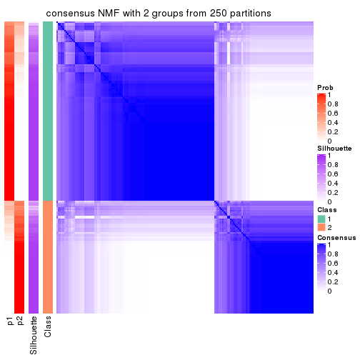</p>

</div>
<div id='tab-ATC-NMF-consensus-heatmap-2'>
<pre><code class="r">consensus_heatmap(res, k = 3)
</code></pre>

<p>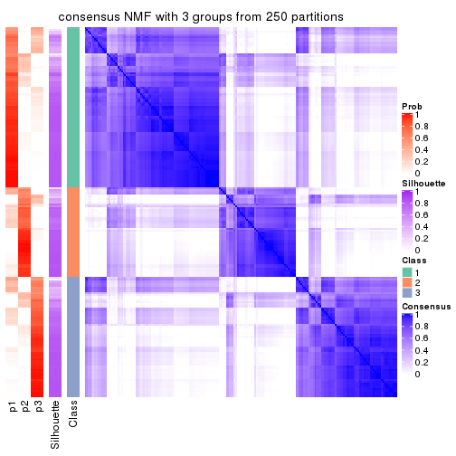</p>

</div>
<div id='tab-ATC-NMF-consensus-heatmap-3'>
<pre><code class="r">consensus_heatmap(res, k = 4)
</code></pre>

<p>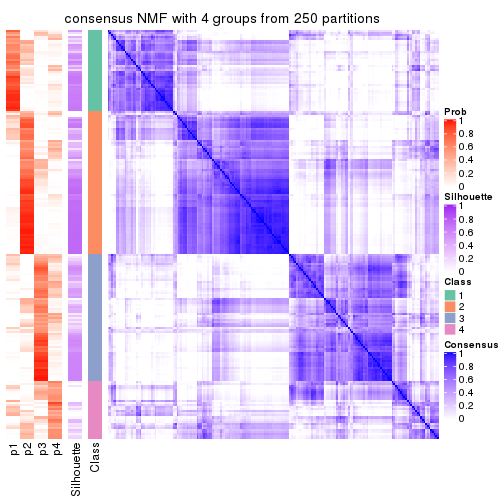</p>

</div>
<div id='tab-ATC-NMF-consensus-heatmap-4'>
<pre><code class="r">consensus_heatmap(res, k = 5)
</code></pre>

<p>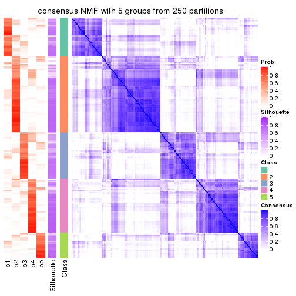</p>

</div>
<div id='tab-ATC-NMF-consensus-heatmap-5'>
<pre><code class="r">consensus_heatmap(res, k = 6)
</code></pre>

<p>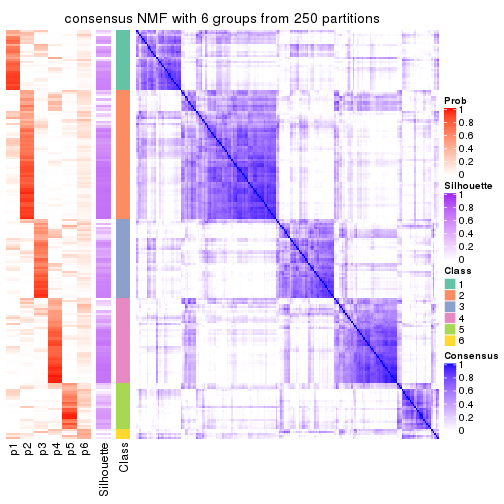</p>

</div>
</div>

Heatmaps for the membership of samples in all partitions to see how consistent they are:


<script>
$( function() {
	$( '#tabs-ATC-NMF-membership-heatmap' ).tabs();
} );
</script>
<div id='tabs-ATC-NMF-membership-heatmap'>
<ul>
<li><a href='#tab-ATC-NMF-membership-heatmap-1'>k = 2</a></li>
<li><a href='#tab-ATC-NMF-membership-heatmap-2'>k = 3</a></li>
<li><a href='#tab-ATC-NMF-membership-heatmap-3'>k = 4</a></li>
<li><a href='#tab-ATC-NMF-membership-heatmap-4'>k = 5</a></li>
<li><a href='#tab-ATC-NMF-membership-heatmap-5'>k = 6</a></li>
</ul>
<div id='tab-ATC-NMF-membership-heatmap-1'>
<pre><code class="r">membership_heatmap(res, k = 2)
</code></pre>

<p>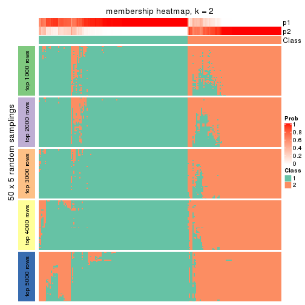</p>

</div>
<div id='tab-ATC-NMF-membership-heatmap-2'>
<pre><code class="r">membership_heatmap(res, k = 3)
</code></pre>

<p>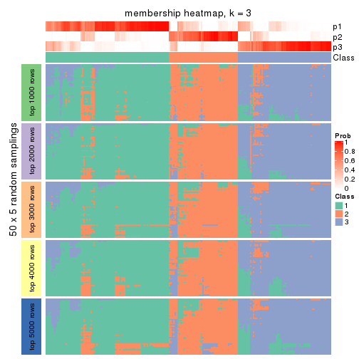</p>

</div>
<div id='tab-ATC-NMF-membership-heatmap-3'>
<pre><code class="r">membership_heatmap(res, k = 4)
</code></pre>

<p>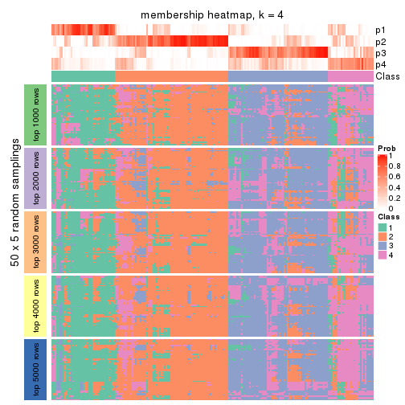</p>

</div>
<div id='tab-ATC-NMF-membership-heatmap-4'>
<pre><code class="r">membership_heatmap(res, k = 5)
</code></pre>

<p>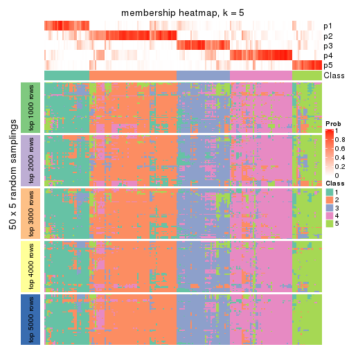</p>

</div>
<div id='tab-ATC-NMF-membership-heatmap-5'>
<pre><code class="r">membership_heatmap(res, k = 6)
</code></pre>

<p>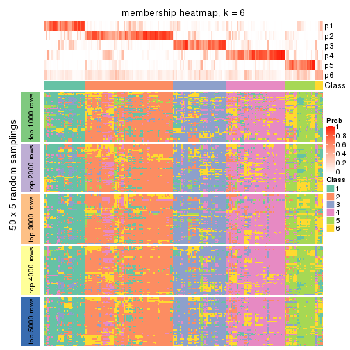</p>

</div>
</div>

As soon as we have had the classes for columns, we can look for signatures
which are significantly different between classes which can be candidate marks
for certain classes. Following are the heatmaps for signatures.


Signature heatmaps where rows are scaled:


<script>
$( function() {
	$( '#tabs-ATC-NMF-get-signatures' ).tabs();
} );
</script>
<div id='tabs-ATC-NMF-get-signatures'>
<ul>
<li><a href='#tab-ATC-NMF-get-signatures-1'>k = 2</a></li>
<li><a href='#tab-ATC-NMF-get-signatures-2'>k = 3</a></li>
<li><a href='#tab-ATC-NMF-get-signatures-3'>k = 4</a></li>
<li><a href='#tab-ATC-NMF-get-signatures-4'>k = 5</a></li>
<li><a href='#tab-ATC-NMF-get-signatures-5'>k = 6</a></li>
</ul>
<div id='tab-ATC-NMF-get-signatures-1'>
<pre><code class="r">get_signatures(res, k = 2)
</code></pre>

<p>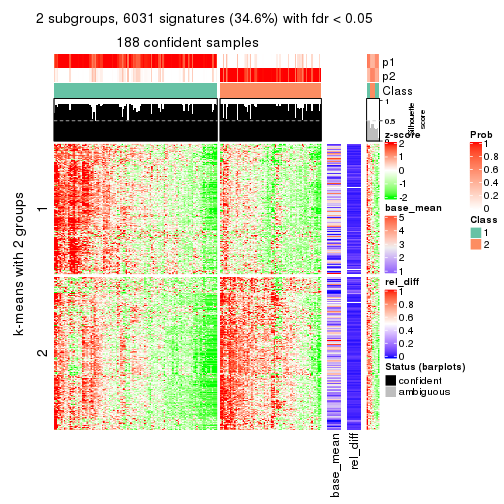</p>

</div>
<div id='tab-ATC-NMF-get-signatures-2'>
<pre><code class="r">get_signatures(res, k = 3)
</code></pre>

<p>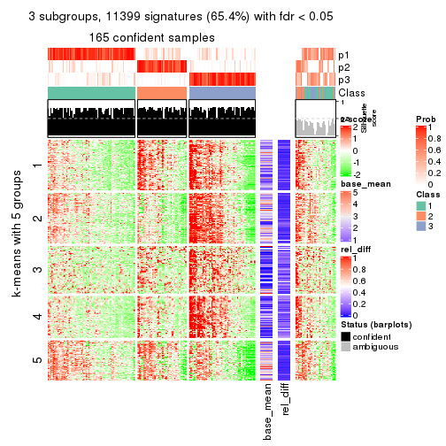</p>

</div>
<div id='tab-ATC-NMF-get-signatures-3'>
<pre><code class="r">get_signatures(res, k = 4)
</code></pre>

<p>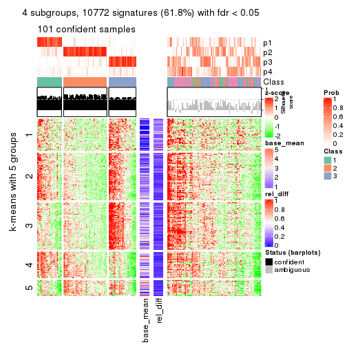</p>

</div>
<div id='tab-ATC-NMF-get-signatures-4'>
<pre><code class="r">get_signatures(res, k = 5)
</code></pre>

<p>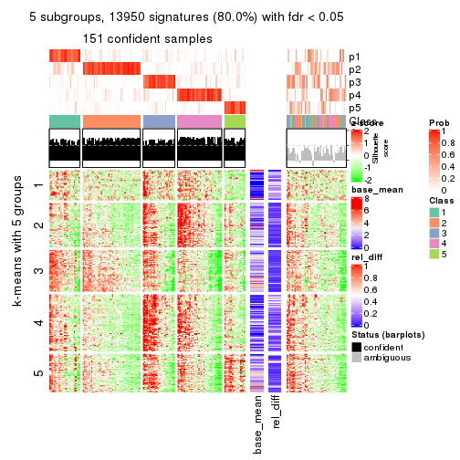</p>

</div>
<div id='tab-ATC-NMF-get-signatures-5'>
<pre><code class="r">get_signatures(res, k = 6)
</code></pre>

<p>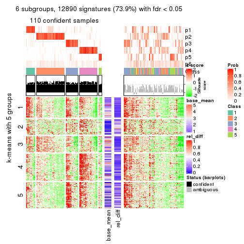</p>

</div>
</div>


Signature heatmaps where rows are not scaled:


<script>
$( function() {
	$( '#tabs-ATC-NMF-get-signatures-no-scale' ).tabs();
} );
</script>
<div id='tabs-ATC-NMF-get-signatures-no-scale'>
<ul>
<li><a href='#tab-ATC-NMF-get-signatures-no-scale-1'>k = 2</a></li>
<li><a href='#tab-ATC-NMF-get-signatures-no-scale-2'>k = 3</a></li>
<li><a href='#tab-ATC-NMF-get-signatures-no-scale-3'>k = 4</a></li>
<li><a href='#tab-ATC-NMF-get-signatures-no-scale-4'>k = 5</a></li>
<li><a href='#tab-ATC-NMF-get-signatures-no-scale-5'>k = 6</a></li>
</ul>
<div id='tab-ATC-NMF-get-signatures-no-scale-1'>
<pre><code class="r">get_signatures(res, k = 2, scale_rows = FALSE)
</code></pre>

<p>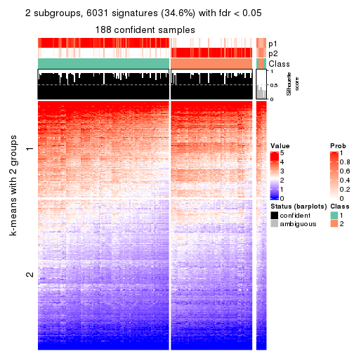</p>

</div>
<div id='tab-ATC-NMF-get-signatures-no-scale-2'>
<pre><code class="r">get_signatures(res, k = 3, scale_rows = FALSE)
</code></pre>

<p>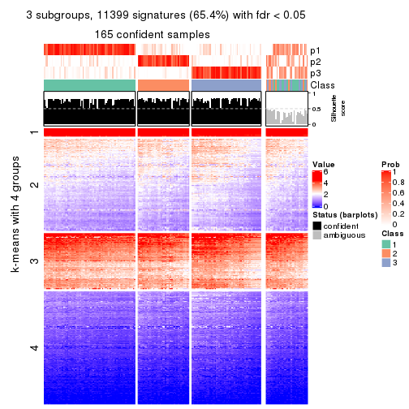</p>

</div>
<div id='tab-ATC-NMF-get-signatures-no-scale-3'>
<pre><code class="r">get_signatures(res, k = 4, scale_rows = FALSE)
</code></pre>

<p>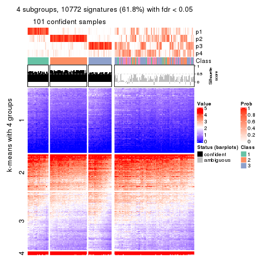</p>

</div>
<div id='tab-ATC-NMF-get-signatures-no-scale-4'>
<pre><code class="r">get_signatures(res, k = 5, scale_rows = FALSE)
</code></pre>

<p>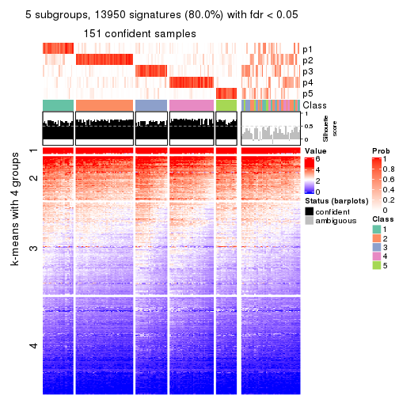</p>

</div>
<div id='tab-ATC-NMF-get-signatures-no-scale-5'>
<pre><code class="r">get_signatures(res, k = 6, scale_rows = FALSE)
</code></pre>

<p>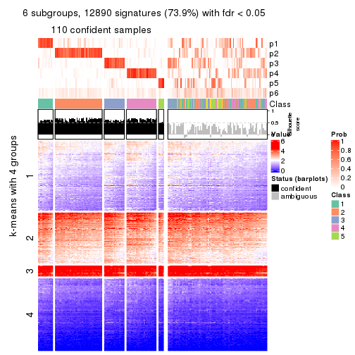</p>

</div>
</div>


Compare the overlap of signatures from different k:

```r
compare_signatures(res)
```

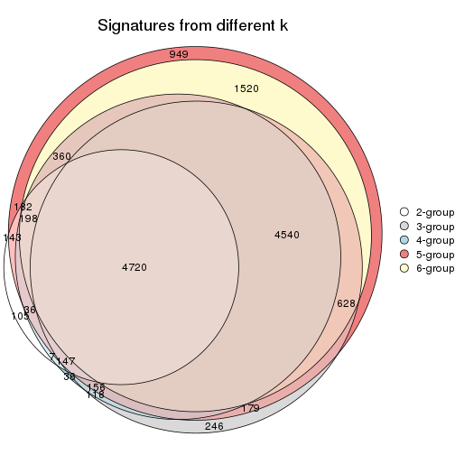

`get_signature()` returns a data frame invisibly. TO get the list of signatures, the function
call should be assigned to a variable explicitly. In following code, if `plot` argument is set
to `FALSE`, no heatmap is plotted while only the differential analysis is performed.

```r
# code only for demonstration
tb = get_signature(res, k = ..., plot = FALSE)
```

An example of the output of `tb` is:

```
#>   which_row         fdr    mean_1    mean_2 scaled_mean_1 scaled_mean_2 km
#> 1        38 0.042760348  8.373488  9.131774    -0.5533452     0.5164555  1
#> 2        40 0.018707592  7.106213  8.469186    -0.6173731     0.5762149  1
#> 3        55 0.019134737 10.221463 11.207825    -0.6159697     0.5749050  1
#> 4        59 0.006059896  5.921854  7.869574    -0.6899429     0.6439467  1
#> 5        60 0.018055526  8.928898 10.211722    -0.6204761     0.5791110  1
#> 6        98 0.009384629 15.714769 14.887706     0.6635654    -0.6193277  2
...
```

The columns in `tb` are:

1. `which_row`: row indices corresponding to the input matrix.
2. `fdr`: FDR for the differential test. 
3. `mean_x`: The mean value in group x.
4. `scaled_mean_x`: The mean value in group x after rows are scaled.
5. `km`: Row groups if k-means clustering is applied to rows.


UMAP plot which shows how samples are separated.


<script>
$( function() {
	$( '#tabs-ATC-NMF-dimension-reduction' ).tabs();
} );
</script>
<div id='tabs-ATC-NMF-dimension-reduction'>
<ul>
<li><a href='#tab-ATC-NMF-dimension-reduction-1'>k = 2</a></li>
<li><a href='#tab-ATC-NMF-dimension-reduction-2'>k = 3</a></li>
<li><a href='#tab-ATC-NMF-dimension-reduction-3'>k = 4</a></li>
<li><a href='#tab-ATC-NMF-dimension-reduction-4'>k = 5</a></li>
<li><a href='#tab-ATC-NMF-dimension-reduction-5'>k = 6</a></li>
</ul>
<div id='tab-ATC-NMF-dimension-reduction-1'>
<pre><code class="r">dimension_reduction(res, k = 2, method = &quot;UMAP&quot;)
</code></pre>

<p>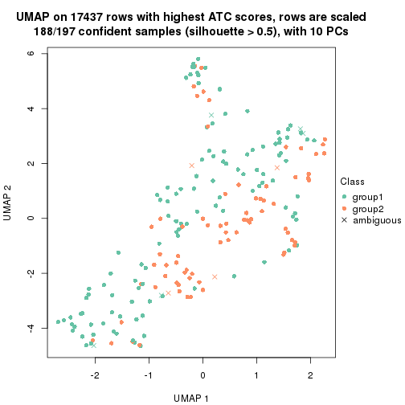</p>

</div>
<div id='tab-ATC-NMF-dimension-reduction-2'>
<pre><code class="r">dimension_reduction(res, k = 3, method = &quot;UMAP&quot;)
</code></pre>

<p>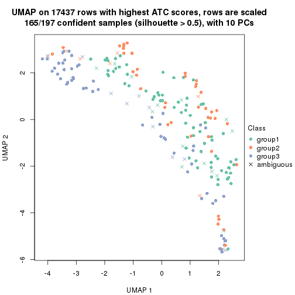</p>

</div>
<div id='tab-ATC-NMF-dimension-reduction-3'>
<pre><code class="r">dimension_reduction(res, k = 4, method = &quot;UMAP&quot;)
</code></pre>

<p>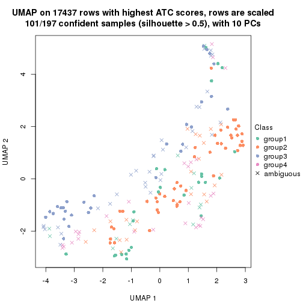</p>

</div>
<div id='tab-ATC-NMF-dimension-reduction-4'>
<pre><code class="r">dimension_reduction(res, k = 5, method = &quot;UMAP&quot;)
</code></pre>

<p>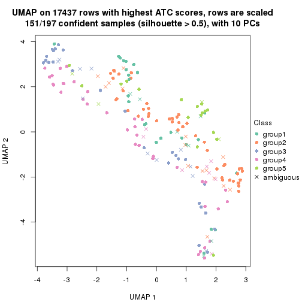</p>

</div>
<div id='tab-ATC-NMF-dimension-reduction-5'>
<pre><code class="r">dimension_reduction(res, k = 6, method = &quot;UMAP&quot;)
</code></pre>

<p>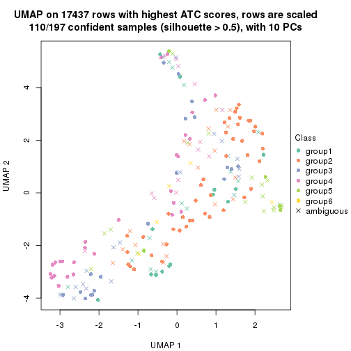</p>

</div>
</div>


Following heatmap shows how subgroups are split when increasing `k`:

```r
collect_classes(res)
```

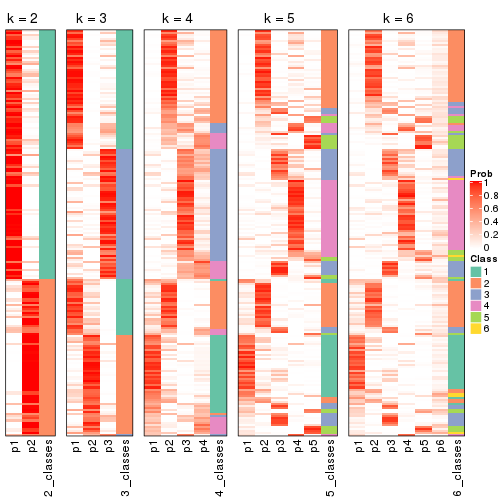


If matrix rows can be associated to genes, consider to use `GO_Enrichment(res,
...)` to perform function enrichment for the signature genes.


 

## Session info


```r
sessionInfo()
```

```
#> R version 3.6.0 (2019-04-26)
#> Platform: x86_64-pc-linux-gnu (64-bit)
#> Running under: CentOS Linux 7 (Core)
#> 
#> Matrix products: default
#> BLAS:   /usr/lib64/libblas.so.3.4.2
#> LAPACK: /usr/lib64/liblapack.so.3.4.2
#> 
#> locale:
#>  [1] LC_CTYPE=en_US.UTF-8       LC_NUMERIC=C               LC_TIME=en_US.UTF-8       
#>  [4] LC_COLLATE=en_US.UTF-8     LC_MONETARY=en_US.UTF-8    LC_MESSAGES=en_US.UTF-8   
#>  [7] LC_PAPER=en_US.UTF-8       LC_NAME=C                  LC_ADDRESS=C              
#> [10] LC_TELEPHONE=C             LC_MEASUREMENT=en_US.UTF-8 LC_IDENTIFICATION=C       
#> 
#> attached base packages:
#>  [1] grid      parallel  stats4    stats     graphics  grDevices utils     datasets  methods  
#> [10] base     
#> 
#> other attached packages:
#>  [1] genefilter_1.66.0           ComplexHeatmap_2.1.1        markdown_1.1               
#>  [4] knitr_1.26                  cola_1.3.2                  SummarizedExperiment_1.14.1
#>  [7] DelayedArray_0.10.0         BiocParallel_1.18.1         matrixStats_0.55.0         
#> [10] Biobase_2.44.0              GenomicRanges_1.36.1        GenomeInfoDb_1.20.0        
#> [13] IRanges_2.18.3              S4Vectors_0.22.1            BiocGenerics_0.30.0        
#> [16] GetoptLong_0.1.7           
#> 
#> loaded via a namespace (and not attached):
#>  [1] bitops_1.0-6           bit64_0.9-7            doParallel_1.0.15      RColorBrewer_1.1-2    
#>  [5] httr_1.4.1             backports_1.1.5        tools_3.6.0            R6_2.4.1              
#>  [9] DBI_1.0.0              lazyeval_0.2.2         colorspace_1.4-1       withr_2.1.2           
#> [13] tidyselect_0.2.5       gridExtra_2.3          bit_1.1-14             compiler_3.6.0        
#> [17] xml2_1.2.2             microbenchmark_1.4-7   pkgmaker_0.28          slam_0.1-46           
#> [21] scales_1.1.0           NMF_0.23.6             stringr_1.4.0          digest_0.6.23         
#> [25] XVector_0.24.0         pkgconfig_2.0.3        bibtex_0.4.2           highr_0.8             
#> [29] rlang_0.4.2            GlobalOptions_0.1.1    RSQLite_2.1.2          impute_1.58.0         
#> [33] shape_1.4.4            mclust_5.4.5           dendextend_1.12.0      dplyr_0.8.3           
#> [37] RCurl_1.95-4.12        magrittr_1.5           GenomeInfoDbData_1.2.1 Matrix_1.2-17         
#> [41] Rcpp_1.0.3             munsell_0.5.0          viridis_0.5.1          lifecycle_0.1.0       
#> [45] stringi_1.4.3          zlibbioc_1.30.0        plyr_1.8.4             blob_1.2.0            
#> [49] crayon_1.3.4           lattice_0.20-38        splines_3.6.0          annotate_1.62.0       
#> [53] circlize_0.4.9         zeallot_0.1.0          pillar_1.4.2           rjson_0.2.20          
#> [57] rngtools_1.4           reshape2_1.4.3         codetools_0.2-16       XML_3.98-1.20         
#> [61] glue_1.3.1             evaluate_0.14          vctrs_0.2.0            png_0.1-7             
#> [65] foreach_1.4.7          polyclip_1.10-0        gtable_0.3.0           purrr_0.3.3           
#> [69] clue_0.3-57            assertthat_0.2.1       ggplot2_3.2.1          xfun_0.11             
#> [73] gridBase_0.4-7         eulerr_6.0.0           xtable_1.8-4           skmeans_0.2-11        
#> [77] survival_2.44-1.1      viridisLite_0.3.0      tibble_2.1.3           iterators_1.0.12      
#> [81] memoise_1.1.0          AnnotationDbi_1.46.1   registry_0.5-1         GTF_0.0.1             
#> [85] cluster_2.1.0          brew_1.0-6
```


